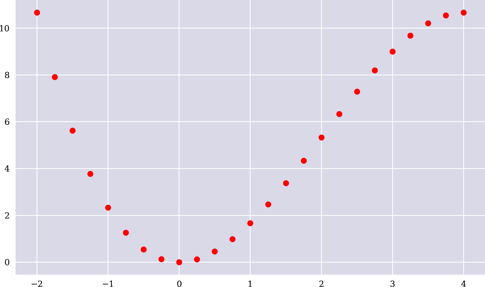
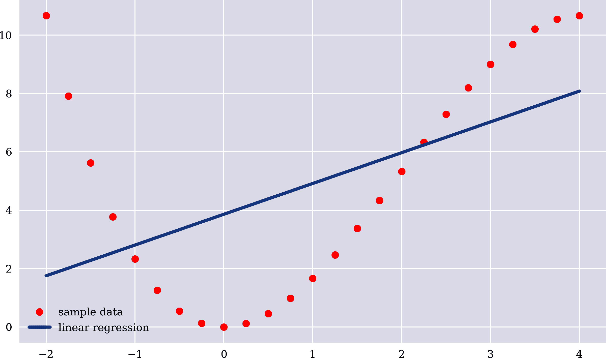
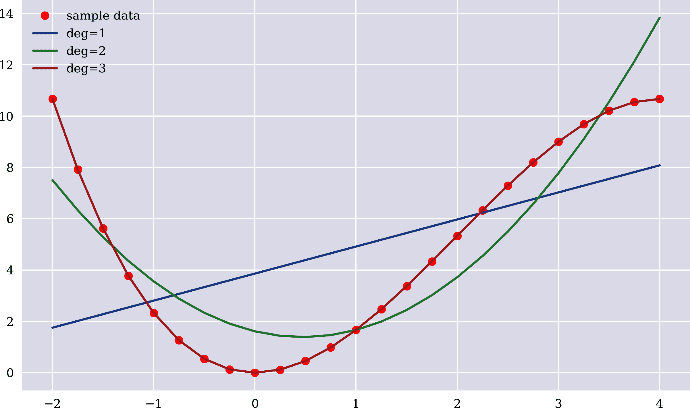
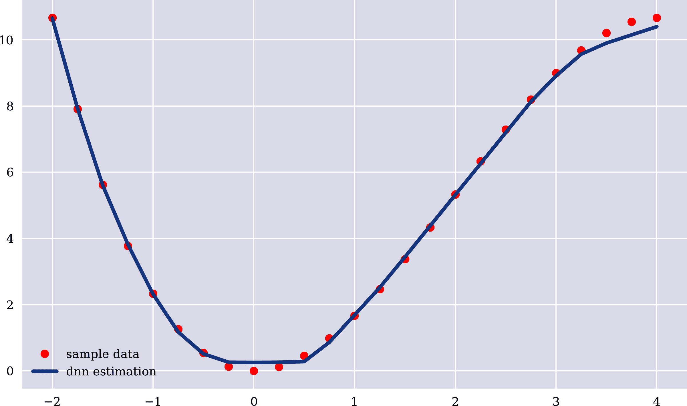
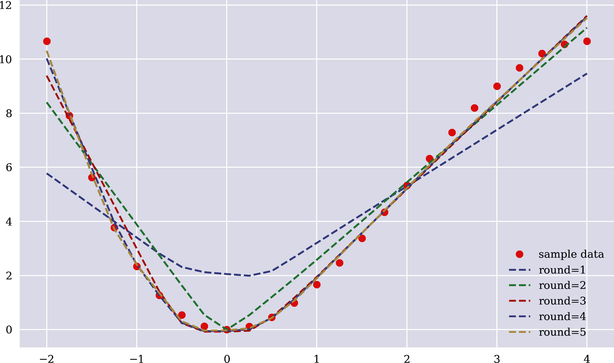
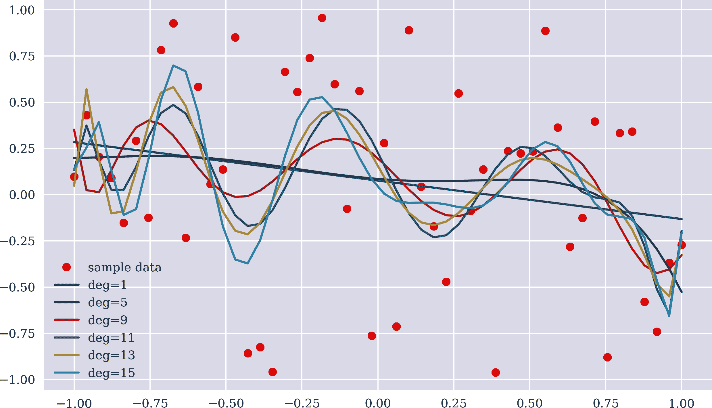
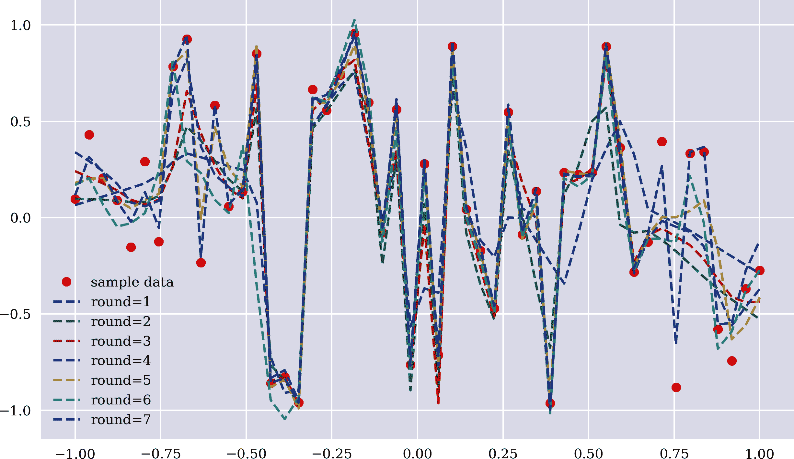
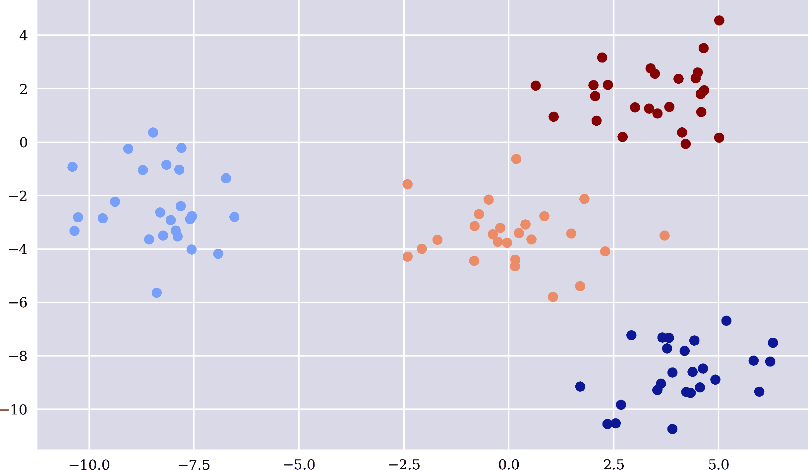
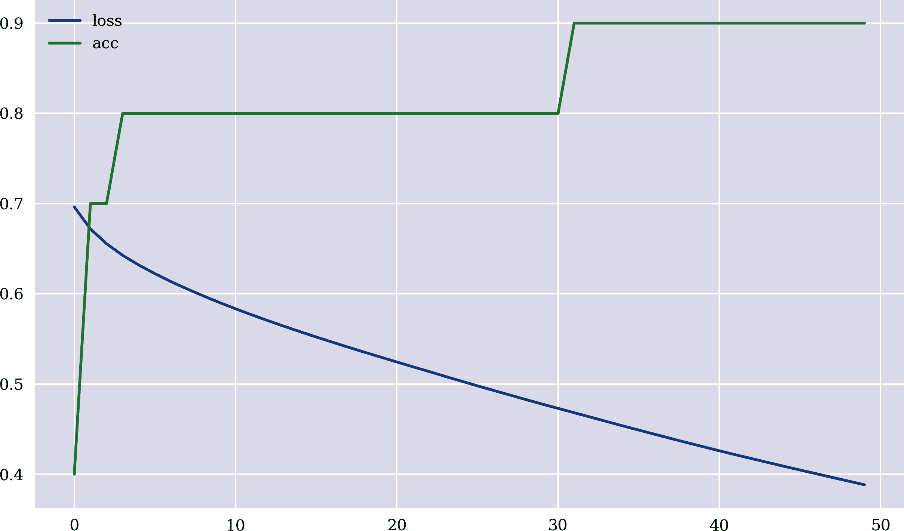

# 第一章 人工智能

> 这是计算机程序第一次在全尺寸围棋比赛中击败专业人类选手，这一壮举以前被认为至少还需十年时间。
> 
> David Silver 等（2016 年）

本章介绍了人工智能领域的一般概念、思想和定义，用于本书的目的。它还为不同类型的主要学习算法提供了实例。特别是，“算法” 从广泛的角度来看分类了数据类型、学习类型和通常在 AI 环境中遇到的问题。本章还介绍了无监督学习和强化学习的示例。“神经网络” 直接进入神经网络的世界，这不仅是本书后续章节的核心内容，而且被证明是当今 AI 最强大的算法之一。“数据的重要性” 讨论了在 AI 背景下数据量和多样性的重要性。

# 算法

本节介绍了与本书相关的人工智能领域的基本概念。它讨论了不同类型的数据、学习、问题和方法，这些可以归纳为通用术语*AI*。Alpaydin（2016 年）提供了一个非正式的介绍，以及许多本节中仅简要涉及的主题的概述和许多示例。

## 数据类型

数据通常具有两个主要组成部分：

特征

特征数据（或输入数据）是作为算法输入的数据。在金融背景下，例如可能是潜在债务人的收入和储蓄。

标签

标签数据（或输出数据）是作为相关输出给定的数据，例如通过监督学习算法学习的内容。在金融背景下，例如可能是潜在债务人的信用价值。

## 学习类型

主要有三种类型的学习算法：

监督学习（SL）

这些算法从给定的特征（输入）和标签（输出）数值样本数据集中学习。接下来的部分展示了这类算法的实例，如普通最小二乘回归（OLS）和神经网络。监督学习的目的是学习输入和输出值之间的关系。在金融领域，这类算法可能被训练用于预测潜在债务人是否信用良好。对于本书而言，这些是最重要的算法类型。

无监督学习（UL）

这些算法仅从给定的特征（输入）数值样本数据集中学习，通常目标是找出数据中的结构。它们被设计来学习输入数据集，例如通过一些引导参数。聚类算法属于这一类别。在金融背景下，这种算法可能会将股票聚类到某些组中。

强化学习（RL）

这些是通过试错学习的算法，通过在采取行动后获得奖励来更新最佳行动策略。它们根据所接收到的奖励和惩罚更新最佳行动策略。例如，此类算法用于需要持续采取行动并立即获得奖励的环境，例如在电脑游戏中。

因为后续章节详细介绍了监督学习，所以简要示例将说明无监督学习和强化学习。

### 无监督学习

简单地说，*k-means 聚类算法*将<math alttext="n"><mi>n</mi></math>个观测值分成<math alttext="k"><mi>k</mi></math>个聚类。每个观测值属于其均值（中心）最近的聚类。以下 Python 代码生成了聚类的特征数据的样本数据。图 1-1 可视化了聚类的样本数据，还显示了这里使用的`scikit-learn` `KMeans`算法完美地识别了聚类。点的着色基于算法学习的内容。^(1)

```py
In [1]: import numpy as np
        import pandas as pd
        from pylab import plt, mpl
        plt.style.use('seaborn')
        mpl.rcParams['savefig.dpi'] = 300
        mpl.rcParams['font.family'] = 'serif'
        np.set_printoptions(precision=4, suppress=True)

In [2]: from sklearn.cluster import KMeans
        from sklearn.datasets import make_blobs

In [3]: x, y = make_blobs(n_samples=100, centers=4,
                          random_state=500, cluster_std=1.25)  

In [4]: model = KMeans(n_clusters=4, random_state=0)  

In [5]: model.fit(x)  
Out[5]: KMeans(n_clusters=4, random_state=0)

In [6]: y_ = model.predict(x)  

In [7]: y_  
Out[7]: array([3, 3, 1, 2, 1, 1, 3, 2, 1, 2, 2, 3, 2, 0, 0, 3, 2, 0, 2, 0, 0, 3,
               1, 2, 1, 1, 0, 0, 1, 3, 2, 1, 1, 0, 1, 3, 1, 3, 2, 2, 2, 1, 0, 0,
               3, 1, 2, 0, 2, 0, 3, 0, 1, 0, 1, 3, 1, 2, 0, 3, 1, 0, 3, 2, 3, 0,
               1, 1, 1, 2, 3, 1, 2, 0, 2, 3, 2, 0, 2, 2, 1, 3, 1, 3, 2, 2, 3, 2,
               0, 0, 0, 3, 3, 3, 3, 0, 3, 1, 0, 0], dtype=int32)

In [8]: plt.figure(figsize=(10, 6))
        plt.scatter(x[:, 0], x[:, 1], c=y_,  cmap='coolwarm');
```


创建一个带有聚类特征数据的样本数据集。


实例化一个`KMeans`模型对象，固定聚类数。


模型适配特征数据。


给定适配模型，生成预测结果。


预测结果是从 0 到 3 的数字，每个数字代表一个聚类。



###### 图 1-1. 聚类的无监督学习

一旦像`KMeans`这样的算法训练完成，它可以预测一个新的（尚未见过）特征值组合的聚类情况。假设这样的算法是在描述银行潜在和真实债务人的特征数据上进行训练的。它可以通过生成两个聚类来了解潜在债务人的信用状况。然后，新的潜在债务人可以被分类到某个聚类中：“有信用”还是“没有信用”。

### 强化学习

以下示例基于一个硬币抛掷游戏，该游戏使用一枚硬币，正面的概率为 80%，反面的概率为 20%。硬币抛掷游戏被大大偏向以强调学习的好处，与一个未经训练的基线算法相比。随机押注并平均分配在正反面的基线算法，在每轮 100 次押注游戏中平均获得约 50 的总奖励：

```py
In [9]: ssp = [1, 1, 1, 1, 0]  

In [10]: asp = [1, 0]  

In [11]: def epoch():
             tr = 0
             for _ in range(100):
                 a = np.random.choice(asp)  
                 s = np.random.choice(ssp)  
                 if a == s:
                     tr += 1  
             return tr

In [12]: rl = np.array([epoch() for _ in range(15)])  
         rl
Out[12]: array([53, 55, 50, 48, 46, 41, 51, 49, 50, 52, 46, 47, 43, 51, 52])

In [13]: rl.mean()  
Out[13]: 48.93333333333333
```


状态空间（1 = 正面，0 = 反面）。


行动空间（1 = 押注正面，0 = 押注反面）。


从动作空间中随机选择一个动作。


从状态空间中随机选择一个状态。


如果赌注正确，则总奖励`tr`增加 1。


游戏进行多个时期；每个时期为 100 次赌注。


计算已播放的时期的平均总奖励。

强化学习试图从采取行动后观察到的内容中学习，通常基于奖励。为了简化问题，以下学习算法仅在每轮中跟踪观察到的状态，只要它们被附加到动作空间的`list`对象中。通过这种方式，算法学习了游戏中的偏差，尽管可能不完美。通过从更新后的动作空间中随机抽样，反映了偏差，因为自然地，赌注更容易更多地选择正面。随着时间的推移，平均而言，头部将被选择约 80%的时间。大约 65 的平均总奖励反映了与未知基线算法相比学习算法的改进：

```py
In [14]: ssp = [1, 1, 1, 1, 0]

In [15]: def epoch():
             tr = 0
             asp = [0, 1]  
             for _ in range(100):
                 a = np.random.choice(asp)
                 s = np.random.choice(ssp)
                 if a == s:
                     tr += 1
                 asp.append(s)  
             return tr

In [16]: rl = np.array([epoch() for _ in range(15)])
         rl
Out[16]: array([64, 65, 77, 65, 54, 64, 71, 64, 57, 62, 69, 63, 61, 66, 75])

In [17]: rl.mean()
Out[17]: 65.13333333333334
```


在开始之前重置动作空间（over）


将观察到的状态添加到动作空间

## 任务类型

根据标签数据类型和手头问题的不同，学习的两种重要任务类型如下：

估计

估计（或近似，回归）是指标签数据为实值（连续）的情况；也就是说，它在技术上表示为浮点数。

分类

分类是指标签数据包含有限数量的类别或类别，通常由离散值（正整数）表示，技术上表示为整数。

以下部分提供了这两种任务类型的示例。

## 方法类型

在完成本节之前，可能需要进一步定义一些术语。本书遵循以下三个主要术语之间的常见区分：

人工智能（AI）

AI 包含了所有类型的学习（算法），如前所定义，以及一些其他类型（例如专家系统）。

机器学习（ML）

机器学习（ML）是根据算法和成功度量学习给定数据集的关系和其他信息的学科；例如，成功度量可能是均方误差（MSE），给定标签值和要估计的输出值与算法预测值。ML 是 AI 的一个子集。

深度学习（DL）

DL 包括所有基于神经网络的算法。术语*深度*通常仅在神经网络具有多个隐藏层时使用。DL 是机器学习的子集，因此也是 AI 的子集。

DL 已被证明在许多广泛的问题领域中非常有用。它适用于估计和分类任务，以及强化学习。在许多情况下，基于 DL 的方法表现优于其他算法，例如逻辑回归或基于核的方法，如支持向量机。^(2) 这就是为什么本书主要侧重于 DL。所使用的 DL 方法包括密集神经网络（DNNs）、循环神经网络（RNNs）和卷积神经网络（CNNs）。更多细节将在后面的章节中出现，特别是在第三部分。

# 神经网络

前面的章节提供了人工智能算法的更广泛概述。本节展示了神经网络的适应性。一个简单的例子将说明神经网络与传统统计方法（例如普通最小二乘回归）相比的特点。该例子从数学开始，然后使用线性回归进行*估计*（或函数逼近），最后应用神经网络来完成估计。这里采用的方法是一种监督学习方法，任务是基于特征数据估计标签数据。本节还说明了神经网络在*分类*问题背景下的使用。

## 普通最小二乘回归

假设给出数学函数如下：

<math alttext="f colon double-struck upper R right-arrow double-struck upper R comma y equals 2 x squared minus one-third x cubed" display="block"><mrow><mi>f</mi> <mo>:</mo> <mi>ℝ</mi> <mo>→</mo> <mi>ℝ</mi> <mo>,</mo> <mi>y</mi> <mo>=</mo> <mn>2</mn> <msup><mi>x</mi> <mn>2</mn></msup> <mo>-</mo> <mfrac><mn>1</mn> <mn>3</mn></mfrac> <msup><mi>x</mi> <mn>3</mn></msup></mrow></math>

这样的函数将一个输入值<math alttext="x"><mi>x</mi></math>转换为一个输出值<math alttext="y"><mi>y</mi></math>。或者将一系列输入值<math alttext="x 1 comma x 2 comma ellipsis comma x Subscript upper N Baseline"><mrow><msub><mi>x</mi> <mn>1</mn></msub> <mo>,</mo> <msub><mi>x</mi> <mn>2</mn></msub> <mo>,</mo> <mo>...</mo> <mo>,</mo> <msub><mi>x</mi> <mi>N</mi></msub></mrow></math>转换为一系列输出值<math alttext="y 1 comma y 2 comma ellipsis comma y Subscript upper N Baseline"><mrow><msub><mi>y</mi> <mn>1</mn></msub> <mo>,</mo> <msub><mi>y</mi> <mn>2</mn></msub> <mo>,</mo> <mo>...</mo> <mo>,</mo> <msub><mi>y</mi> <mi>N</mi></msub></mrow></math>。以下 Python 代码将数学函数实现为 Python 函数，并创建一些输入和输出值。图 1-2 绘制了输出值与输入值的关系：

```py
In [18]: def f(x):
             return 2 * x ** 2 - x ** 3 / 3  

In [19]: x = np.linspace(-2, 4, 25)  
         x  
Out[19]: array([-2.  , -1.75, -1.5 , -1.25, -1.  , -0.75, -0.5 , -0.25,  0.  ,
                 0.25,  0.5 ,  0.75,  1.  ,  1.25,  1.5 ,  1.75,  2.  ,  2.25,
                 2.5 ,  2.75,  3.  ,  3.25,  3.5 ,  3.75,  4.  ])

In [20]: y = f(x)  
         y  
Out[20]: array([10.6667,  7.9115,  5.625 ,  3.776 ,  2.3333,  1.2656,  0.5417,
                 0.1302,  0.    ,  0.1198,  0.4583,  0.9844,  1.6667,  2.474 ,
                 3.375 ,  4.3385,  5.3333,  6.3281,  7.2917,  8.1927,  9.    ,
                 9.6823, 10.2083, 10.5469, 10.6667])

In [21]: plt.figure(figsize=(10, 6))
         plt.plot(x, y, 'ro');
```


数学函数作为 Python 函数


输入值


输出值



###### 图 1-2\. 输出值与输入值

而在数学示例中，函数首先出现，然后是输入数据，最后是输出数据，在*统计学习*中，顺序不同。假设给出了前述输入值和输出值。它们代表*样本*（数据）。*统计回归*问题是找到一种尽可能好地近似输入值（也称为*自变量*）和输出值（也称为*因变量*）之间的功能关系的函数。

假设简单 OLS 线性回归。在这种情况下，假设输入和输出值之间的功能关系是线性的，问题是找到以下线性方程的最优参数 <math alttext="alpha"><mi>α</mi></math> 和 <math alttext="beta"><mi>β</mi></math>：

<math alttext="ModifyingAbove f With caret colon double-struck upper R right-arrow double-struck upper R comma ModifyingAbove y With caret equals alpha plus beta x" display="block"><mrow><mover accent="true"><mi>f</mi> <mo>^</mo></mover> <mo>:</mo> <mi>ℝ</mi> <mo>→</mo> <mi>ℝ</mi> <mo>,</mo> <mover accent="true"><mi>y</mi> <mo>^</mo></mover> <mo>=</mo> <mi>α</mi> <mo>+</mo> <mi>β</mi> <mi>x</mi></mrow></math>

对于给定的输入值 <math alttext="x 1 comma x 2 comma ellipsis comma x Subscript upper N Baseline"><mrow><msub><mi>x</mi> <mn>1</mn></msub> <mo>,</mo> <msub><mi>x</mi> <mn>2</mn></msub> <mo>,</mo> <mo>...</mo> <mo>,</mo> <msub><mi>x</mi> <mi>N</mi></msub></mrow></math> 和输出值 <math alttext="y 1 comma y 2 comma ellipsis comma y Subscript upper N Baseline"><mrow><msub><mi>y</mi> <mn>1</mn></msub> <mo>,</mo> <msub><mi>y</mi> <mn>2</mn></msub> <mo>,</mo> <mo>...</mo> <mo>,</mo> <msub><mi>y</mi> <mi>N</mi></msub></mrow></math>，在这种情况下*最优*意味着它们最小化了真实输出值和近似输出值之间的均方误差（MSE）：

<math alttext="min Underscript alpha comma beta Endscripts StartFraction 1 Over upper N EndFraction sigma-summation Underscript n Overscript upper N Endscripts left-parenthesis y Subscript n Baseline minus ModifyingAbove f With caret left-parenthesis x Subscript n Baseline right-parenthesis right-parenthesis squared" display="block"><mrow><munder><mo movablelimits="true" form="prefix">min</mo> <mrow><mi>α</mi><mo>,</mo><mi>β</mi></mrow></munder> <mfrac><mn>1</mn> <mi>N</mi></mfrac> <munderover><mo>∑</mo> <mi>n</mi> <mi>N</mi></munderover> <msup><mfenced separators="" open="(" close=")"><msub><mi>y</mi> <mi>n</mi></msub> <mo>-</mo><mover accent="true"><mi>f</mi> <mo>^</mo></mover><mrow><mo>(</mo><msub><mi>x</mi> <mi>n</mi></msub> <mo>)</mo></mrow></mfenced> <mn>2</mn></msup></mrow></math>

对于简单线性回归情况，解 <math alttext="left-parenthesis alpha Superscript asterisk Baseline comma beta Superscript asterisk Baseline right-parenthesis"><mrow><mo>(</mo> <msup><mi>α</mi> <mo>*</mo></msup> <mo>,</mo> <msup><mi>β</mi> <mo>*</mo></msup> <mo>)</mo></mrow></math> 在闭合形式中是已知的，如下方程所示。变量上的条表示样本均值：

<math alttext="StartLayout 1st Row 1st Column beta Superscript asterisk 2nd Column equals 3rd Column StartFraction upper C o v left-parenthesis x comma y right-parenthesis Over upper V a r left-parenthesis x right-parenthesis EndFraction 2nd Row 1st Column alpha Superscript asterisk 2nd Column equals 3rd Column y overbar minus beta x overbar EndLayout" display="block"><mtable><mtr><mtd><msup><mi>β</mi> <mo>*</mo></msup></mtd> <mtd><mo>=</mo></mtd> <mtd><mfrac><mrow><mi>C</mi><mi>o</mi><mi>v</mi><mo>(</mo><mi>x</mi><mo>,</mo><mi>y</mi><mo>)</mo></mrow> <mrow><mi>V</mi><mi>a</mi><mi>r</mi><mo>(</mo><mi>x</mi><mo>)</mo></mrow></mfrac></mtd></mtr> <mtr><mtd><msup><mi>α</mi> <mo>*</mo></msup></mtd> <mtd><mo>=</mo></mtd> <mtd><mrow><mover accent="true"><mi>y</mi> <mo>¯</mo></mover> <mo>-</mo> <mi>β</mi> <mover accent="true"><mi>x</mi> <mo>¯</mo></mover></mrow></mtd></mtr></mtable></math>

以下 Python 代码计算了最优参数值，线性估计（近似）输出值，并在示例数据旁边绘制了线性回归线（参见 Figure 1-3）。在此处，线性回归方法在近似功能关系方面表现不佳。这一点由相对较高的 MSE 值确认：

```py
In [22]: beta = np.cov(x, y, ddof=0)[0, 1] / np.var(x)  
         beta  
Out[22]: 1.0541666666666667

In [23]: alpha = y.mean() - beta * x.mean()  
         alpha  
Out[23]: 3.8625000000000003

In [24]: y_ = alpha + beta * x  

In [25]: MSE = ((y - y_) ** 2).mean()  
         MSE  
Out[25]: 10.721953125

In [26]: plt.figure(figsize=(10, 6))
         plt.plot(x, y, 'ro', label='sample data')
         plt.plot(x, y_, lw=3.0, label='linear regression')
         plt.legend();
```


计算最优参数 <math alttext="beta"><mi>β</mi></math>


计算最优参数 <math alttext="alpha"><mi>α</mi></math>


计算估计输出值


计算近似值时的 MSE



###### 图 1-3\. 样本数据和线性回归线

如何改善（降低）MSE 值，甚至可能达到 0，即“完美估计”？当然，OLS 回归不仅限于简单的线性关系。除了常数和线性项外，例如，可以轻松添加更高阶的单项式作为基础函数。为此，请参考图 1-4 中显示的回归结果和创建该图的以下代码。使用二次和三次单项式作为基础函数带来的改进是显而易见的，并且通过计算得到的 MSE 值也得到了数值确认。对于包括三次单项式在内的基础函数，估计是完美的，功能关系也完全恢复：

```py
In [27]: plt.figure(figsize=(10, 6))
         plt.plot(x, y, 'ro', label='sample data')
         for deg in [1, 2, 3]:
             reg = np.polyfit(x, y, deg=deg)  
             y_ = np.polyval(reg, x)  
             MSE = ((y - y_) ** 2).mean()  
             print(f'deg={deg} | MSE={MSE:.5f}')
             plt.plot(x, np.polyval(reg, x), label=f'deg={deg}')
         plt.legend();
         deg=1 | MSE=10.72195
         deg=2 | MSE=2.31258
         deg=3 | MSE=0.00000

In [28]: reg  
Out[28]: array([-0.3333,  2.    ,  0.    , -0.    ])
```


回归步骤


近似步骤


MSE 计算


最佳（“完美”）参数值



###### 图 1-4\. 样本数据和 OLS 回归线

利用数学函数形式的知识进行近似，并相应地添加更多的基础函数到回归中，可以实现“完美逼近”。也就是说，OLS 回归分别恢复了原始函数的二次和三次部分的确切因素。

## 使用神经网络进行估计

然而，并非所有的关系都是这种类型。例如，*神经网络* 可以帮助。不详细讨论，神经网络可以近似广泛的功能关系。通常不需要了解关系形式的具体知识。

### Scikit-learn

下面的 Python 代码使用了`scikit-learn`的`MLPRegressor`类，它实现了用于估计的 DNN。有时也称为多层感知器（MLP）。^(3) 如图 1-5 和 MSE 所示，结果并非完美。但对于所用的简单配置来说，它们已经相当不错：

```py
In [29]: from sklearn.neural_network import MLPRegressor

In [30]: model = MLPRegressor(hidden_layer_sizes=3 * [256],
                              learning_rate_init=0.03,
                              max_iter=5000)  

In [31]: model.fit(x.reshape(-1, 1), y)  
Out[31]: MLPRegressor(hidden_layer_sizes=[256, 256, 256], learning_rate_init=0.03,
                      max_iter=5000)

In [32]: y_ = model.predict(x.reshape(-1, 1))  

In [33]: MSE = ((y - y_) ** 2).mean()
         MSE
Out[33]: 0.021662355744355866

In [34]: plt.figure(figsize=(10, 6))
         plt.plot(x, y, 'ro', label='sample data')
         plt.plot(x, y_, lw=3.0, label='dnn estimation')
         plt.legend();
```


实例化`MLPRegressor`对象


实现拟合或学习步骤


实现预测步骤

仅仅看一下图 1-4 和图 1-5 中的结果，人们可能会认为这些方法和方法实际上并没有太大的不同。然而，有一个值得强调的根本性差异。尽管 OLS 回归方法，如对简单线性回归明确显示的那样，是基于计算某些明确定义的量和参数的，但神经网络方法依赖于*增量学习*。这又意味着，一组参数，神经网络内的*权重*，首先是随机初始化的，然后根据神经网络输出与样本输出值之间的差异逐渐调整。这种方法让你可以增量地重新训练（更新）神经网络。



###### 图 1-5。样本数据和基于神经网络的估计

### Keras

下一个例子使用了`Keras`深度学习包中的顺序模型^(4)。该模型进行了 100 个时期的拟合或*训练*。该过程重复进行五轮。在每一轮之后，神经网络的近似值都会更新并绘制出来。图 1-6 显示了每一轮近似值的逐渐改善。这也反映在逐渐减少的 MSE 值中。最终结果并不完美，但考虑到模型的简单性，它还是相当不错的： 

```py
In [35]: import tensorflow as tf
         tf.random.set_seed(100)

In [36]: from keras.layers import Dense
         from keras.models import Sequential
         Using TensorFlow backend.

In [37]: model = Sequential()  
         model.add(Dense(256, activation='relu', input_dim=1)) 
         model.add(Dense(1, activation='linear'))  
         model.compile(loss='mse', optimizer='rmsprop')  

In [38]: ((y - y_) ** 2).mean()
Out[38]: 0.021662355744355866

In [39]: plt.figure(figsize=(10, 6))
         plt.plot(x, y, 'ro', label='sample data')
         for _ in range(1, 6):
             model.fit(x, y, epochs=100, verbose=False)  
             y_ =  model.predict(x)  
             MSE = ((y - y_.flatten()) ** 2).mean()  
             print(f'round={_} | MSE={MSE:.5f}')
             plt.plot(x, y_, '--', label=f'round={_}')  
         plt.legend();
         round=1 | MSE=3.09714
         round=2 | MSE=0.75603
         round=3 | MSE=0.22814
         round=4 | MSE=0.11861
         round=5 | MSE=0.09029
```


实例化`Sequential`模型对象


添加具有修正线性单元（ReLU）激活的密集连接隐藏层^(5)


添加具有线性激活的输出层


编译模型以供使用


对神经网络进行固定次数的训练


实现近似步骤


计算当前的 MSE


绘制当前的近似结果

粗略地说，可以说神经网络在估计方面几乎与 OLS 回归一样出色，后者提供了完美的结果。那么，为什么还要使用神经网络呢？一个更全面的答案可能需要在本书的后面给出，但一个稍微不同的例子可能会给出一些提示。

考虑一下之前的样本数据集，这是从一个明确定义的数学函数生成的，现在是一个*随机样本数据集*，其中特征和标签都是随机选择的。当然，这个例子是为了说明，并不允许深入解释。



###### 图 1-6。多轮训练后的样本数据和估计

以下代码生成随机样本数据集，并基于不同数量的单项式基函数创建 OLS 回归估计。图 1-7 可视化了结果。即使在示例中单项式数量最高的情况下，估计结果仍然不太理想。相应的均方误差（MSE）值相对较高：

```py
In [40]: np.random.seed(0)
         x = np.linspace(-1, 1)
         y = np.random.random(len(x)) * 2 - 1

In [41]: plt.figure(figsize=(10, 6))
         plt.plot(x, y, 'ro', label='sample data')
         for deg in [1, 5, 9, 11, 13, 15]:
             reg = np.polyfit(x, y, deg=deg)
             y_ = np.polyval(reg, x)
             MSE = ((y - y_) ** 2).mean()
             print(f'deg={deg:2d} | MSE={MSE:.5f}')
             plt.plot(x, np.polyval(reg, x), label=f'deg={deg}')
         plt.legend();
         deg= 1 | MSE=0.28153
         deg= 5 | MSE=0.27331
         deg= 9 | MSE=0.25442
         deg=11 | MSE=0.23458
         deg=13 | MSE=0.22989
         deg=15 | MSE=0.21672
```

OLS 回归的结果并不令人意外。在这种情况下，OLS 回归假设可以通过有限数量的基础函数的适当组合来实现近似。由于样本数据集是随机生成的，因此 OLS 回归在这种情况下表现不佳。



###### 图 1-7\. 随机样本数据和 OLS 回归线

神经网络怎么样？应用方式与以前一样简单，并显示了如图 1-8 所示的估算结果。虽然最终结果并非完美，但显然神经网络在从随机特征值估计随机标签值方面表现更好。然而，考虑到其架构，神经网络几乎有 200,000 个可训练参数（权重），这提供了相对高的灵活性，尤其是与仅使用最多 15+1 参数的 OLS 回归相比：

```py
In [42]: model = Sequential()
         model.add(Dense(256, activation='relu', input_dim=1))
         for _ in range(3):
             model.add(Dense(256, activation='relu'))  
         model.add(Dense(1, activation='linear'))
         model.compile(loss='mse', optimizer='rmsprop')

In [43]: model.summary()  
         Model: "sequential_2"
         _________________________________________________________________
         Layer (type)                 Output Shape              Param #
         =================================================================
         dense_3 (Dense)              (None, 256)               512
         _________________________________________________________________
         dense_4 (Dense)              (None, 256)               65792
         _________________________________________________________________
         dense_5 (Dense)              (None, 256)               65792
         _________________________________________________________________
         dense_6 (Dense)              (None, 256)               65792
         _________________________________________________________________
         dense_7 (Dense)              (None, 1)                 257
         =================================================================
         Total params: 198,145
         Trainable params: 198,145
         Non-trainable params: 0
         _________________________________________________________________

In [44]: %%time
         plt.figure(figsize=(10, 6))
         plt.plot(x, y, 'ro', label='sample data')
         for _ in range(1, 8):
             model.fit(x, y, epochs=500, verbose=False)
             y_ =  model.predict(x)
             MSE = ((y - y_.flatten()) ** 2).mean()
             print(f'round={_} | MSE={MSE:.5f}')
             plt.plot(x, y_, '--', label=f'round={_}')
         plt.legend();
         round=1 | MSE=0.13560
         round=2 | MSE=0.08337
         round=3 | MSE=0.06281
         round=4 | MSE=0.04419
         round=5 | MSE=0.03329
         round=6 | MSE=0.07676
         round=7 | MSE=0.00431
         CPU times: user 30.4 s, sys: 4.7 s, total: 35.1 s
         Wall time: 13.6 s
```


添加多个隐藏层。


展示网络架构和可训练参数的数量。



###### 图 1-8\. 随机样本数据和神经网络估算结果

## 使用神经网络进行分类

神经网络的另一个好处是，它们也可以轻松用于分类任务。考虑下面这段使用基于`Keras`的神经网络进行分类的 Python 代码。二进制特征数据和标签数据是随机生成的。建模上的主要调整是将输出层的激活函数从`linear`改为`sigmoid`。更多详细信息将在后续章节中讨论。分类并不完美。但是，它达到了很高的准确率。如何准确率，即正确结果与所有标签值的关系随着训练时期数的增加而改变，显示在图 1-9 中。准确率开始较低，然后逐步改善，尽管并非每个步骤都如此：

```py
In [45]: f = 5
         n = 10

In [46]: np.random.seed(100)

In [47]: x = np.random.randint(0, 2, (n, f))  
         x  
Out[47]: array([[0, 0, 1, 1, 1],
                [1, 0, 0, 0, 0],
                [0, 1, 0, 0, 0],
                [0, 1, 0, 0, 1],
                [0, 1, 0, 0, 0],
                [1, 1, 1, 0, 0],
                [1, 0, 0, 1, 1],
                [1, 1, 1, 0, 0],
                [1, 1, 1, 1, 1],
                [1, 1, 1, 0, 1]])

In [48]: y = np.random.randint(0, 2, n)  
         y  
Out[48]: array([1, 1, 0, 0, 1, 1, 0, 1, 0, 1])

In [49]: model = Sequential()
         model.add(Dense(256, activation='relu', input_dim=f))
         model.add(Dense(1, activation='sigmoid'))  
         model.compile(loss='binary_crossentropy', optimizer='rmsprop',
                      metrics=['acc'])  

In [50]: model.fit(x, y, epochs=50, verbose=False)
Out[50]: <keras.callbacks.callbacks.History at 0x7fde09dd1cd0>

In [51]: y_ = np.where(model.predict(x).flatten() > 0.5, 1, 0)
         y_
Out[51]: array([1, 1, 0, 0, 0, 1, 0, 1, 0, 1], dtype=int32)

In [52]: y == y_  
Out[52]: array([ True,  True,  True,  True, False,  True,  True,  True,  True,
                 True])

In [53]: res = pd.DataFrame(model.history.history)  

In [54]: res.plot(figsize=(10, 6));  
```


创建随机特征数据。


创建随机标签数据。


将输出层的激活函数定义为`sigmoid`。


将损失函数定义为`binary_crossentropy`^(6)


将预测值与标签数据进行比较。


绘制每个训练步骤的损失函数和准确度值。



###### 图 1-9\. 根据周期数的分类准确度和损失

本节中的示例展示了神经网络与 OLS 回归相比的一些基本特征：

问题不可知性

神经网络方法在估计和分类标签值时是不可知的，只要给定一组特征值。统计方法，如 OLS 回归，对于一小部分问题可能表现良好，但对其他问题则可能效果不佳甚至根本无法使用。

增量学习

在神经网络中，给定一个目标成功度量，最优权重是通过随机初始化和增量改进逐步学习的。这些增量改进通过考虑预测值与样本标签值之间的差异，并通过神经网络反向传播权重更新来实现。

通用逼近

存在强大的数学定理表明，神经网络（即使只有一个隐藏层）可以近似几乎任何函数。^(7)

这些特征可能正是本书将神经网络置于所用算法核心位置的理由。第二章将讨论更多充分的理由。

# 神经网络

神经网络擅长学习输入和输出数据之间的关系。它们可应用于多种问题类型，例如在存在复杂关系的情况下的估计或分类问题，而传统的统计方法则不太适用。

# 数据的重要性

前一节末尾的例子表明，神经网络能够相当好地解决分类问题。具有一个隐藏层的神经网络在给定数据集上达到了很高的准确度，或称为*样本内*。然而，神经网络的预测能力如何？这在很大程度上取决于用于训练神经网络的数据量和种类的多样性。基于更大数据集的另一个数值例子将阐明这一点。

## 小数据集

考虑一个与分类示例中使用的相似的随机样本数据集，但具有更多的特征和更多的样本。人工智能中使用的大多数算法都是关于*模式识别*的。在以下 Python 代码中，二进制特征的数量定义了算法可以学习的可能模式的数量。鉴于标签数据也是二进制的，算法试图学习在给定某个模式时`0`或`1`更可能出现的情况，比如`[0, 0, 1, 1, 1, 1, 0, 0, 0, 0]`。因为所有数字都是以相等概率随机选择的，除了标签`0`和`1`不管观察到什么（随机）模式都是同等可能发生的外，没有太多可学习的东西。因此，基线预测算法应该在任何（随机）模式被呈现时准确率约为 50%：

```py
In [55]: f = 10
         n = 250

In [56]: np.random.seed(100)

In [57]: x = np.random.randint(0, 2, (n, f))  
         x[:4]  
Out[57]: array([[0, 0, 1, 1, 1, 1, 0, 0, 0, 0],
                [0, 1, 0, 0, 0, 0, 1, 0, 0, 1],
                [0, 1, 0, 0, 0, 1, 1, 1, 0, 0],
                [1, 0, 0, 1, 1, 1, 1, 1, 0, 0]])

In [58]: y = np.random.randint(0, 2, n)  
         y[:4]  
Out[58]: array([0, 1, 0, 0])

In [59]: 2 ** f  
Out[59]: 1024
```


特征数据


标签数据


模式数量

为了继续进行，原始数据被放入了一个`pandas`的`DataFrame`对象中，这简化了某些操作和分析：

```py
In [60]: fcols = [f'f{_}' for _ in range(f)]  
         fcols  
Out[60]: ['f0', 'f1', 'f2', 'f3', 'f4', 'f5', 'f6', 'f7', 'f8', 'f9']

In [61]: data = pd.DataFrame(x, columns=fcols)  
         data['l'] = y  

In [62]: data.info()  
         <class 'pandas.core.frame.DataFrame'>
         RangeIndex: 250 entries, 0 to 249
         Data columns (total 11 columns):
          #   Column  Non-Null Count  Dtype
         ---  ------  --------------  -----
          0   f0      250 non-null    int64
          1   f1      250 non-null    int64
          2   f2      250 non-null    int64
          3   f3      250 non-null    int64
          4   f4      250 non-null    int64
          5   f5      250 non-null    int64
          6   f6      250 non-null    int64
          7   f7      250 non-null    int64
          8   f8      250 non-null    int64
          9   f9      250 non-null    int64
          10  l       250 non-null    int64
         dtypes: int64(11)
         memory usage: 21.6 KB
```


为特征数据定义列名


将特征数据放入一个`DataFrame`对象中


将标签数据放入同一个`DataFrame`对象中


显示数据集的元信息

通过执行以下 Python 代码的结果，可以确定两个主要问题。首先，样本数据集中并不包含所有模式。其次，每个观察到的模式的样本量太小。即使不深入挖掘，也很明显没有分类算法能够真正有意义地学习所有可能的模式：

```py
In [63]: grouped = data.groupby(list(data.columns))  

In [64]: freq = grouped['l'].size().unstack(fill_value=0)  

In [65]: freq['sum'] = freq[0] + freq[1]  

In [66]: freq.head(10)  
Out[66]: l                              0  1  sum
         f0 f1 f2 f3 f4 f5 f6 f7 f8 f9
         0  0  0  0  0  0  0  1  1  1   0  1    1
                           1  0  1  0   1  1    2
                                    1   0  1    1
                        1  0  0  0  0   1  0    1
                                    1   0  1    1
                              1  1  1   0  1    1
                           1  0  0  0   0  1    1
                                 1  0   0  1    1
                     1  0  0  0  1  1   1  0    1
                           1  1  0  0   1  0    1

In [67]: freq['sum'].describe().astype(int)  
Out[67]: count    227
         mean       1
         std        0
         min        1
         25%        1
         50%        1
         75%        1
         max        2
         Name: sum, dtype: int64
```


沿所有列对数据进行分组


展开标签列的分组数据


对`0`和`1`的频率进行求和


显示给定某个模式的`0`和`1`的频率


提供频率总和的统计信息

以下 Python 代码使用了`scikit-learn`中的`MLPClassifier`模型。^(8) 该模型在整个数据集上进行了训练。神经网络在学习给定数据集内部关系方面的能力如何？从样本内准确率分数来看，这种能力相当高。事实上，这个准确率接近于 100%，这在很大程度上是由于相对较小的数据集给出了相对较高的神经网络容量所致：

```py
In [68]: from sklearn.neural_network import MLPClassifier
         from sklearn.metrics import accuracy_score

In [69]: model = MLPClassifier(hidden_layer_sizes=[128, 128, 128],
                               max_iter=1000, random_state=100)

In [70]: model.fit(data[fcols], data['l'])
Out[70]: MLPClassifier(hidden_layer_sizes=[128, 128, 128], max_iter=1000,
                       random_state=100)

In [71]: accuracy_score(data['l'], model.predict(data[fcols]))
Out[71]: 0.952
```

但是，对于经过训练的神经网络的*预测能力*又如何呢？为此，给定的数据集可以分为训练和测试数据子集。模型仅在训练数据子集上进行训练，然后针对测试数据集测试其预测能力。与之前相同，训练好的神经网络在样本内（即训练数据集）的准确率非常高。然而，在测试数据集上，它比一个无信息基准算法差了超过 10 个百分点：

```py
In [72]: split = int(len(data) * 0.7)  

In [73]: train = data[:split]  
         test = data[split:]  

In [74]: model.fit(train[fcols], train['l'])  
Out[74]: MLPClassifier(hidden_layer_sizes=[128, 128, 128], max_iter=1000,
                       random_state=100)

In [75]: accuracy_score(train['l'], model.predict(train[fcols]))  
Out[75]: 0.9714285714285714

In [76]: accuracy_score(test['l'], model.predict(test[fcols]))  
Out[76]: 0.38666666666666666
```


将数据分割为`train`和`test`数据子集


仅在训练数据集上训练模型


报告了样本内的准确率（训练数据集）


报告了样本外的准确率（测试数据集）

简言之，仅在小数据集上训练的神经网络，由于识别出的两个主要问题区域，学习到了错误的关系。在样本内学习关系时，这些问题实际上并不重要。相反，数据集越小，通常越容易学习样本内的关系。然而，当使用训练好的神经网络进行样本外预测时，这些问题区域就变得非常重要。

## 更大的数据集

幸运的是，通常有一种明显的方法来摆脱这个问题情境：*更大的数据集*。面对现实世界中的问题，这种理论洞见可能同样正确。然而，从实际的角度来看，这样的更大数据集并不总是可用的，也不容易生成。然而，在本节示例的上下文中，确实可以轻松地创建一个更大的数据集。

以下 Python 代码显著增加了初始样本数据集中的样本数量。结果是，训练好的神经网络的预测准确率提高了超过 10 个百分点，达到约 50%，这是可以预期的，考虑到标签数据的性质。现在，它与无信息基准算法的一致性已经达到了：

```py
In [77]: factor = 50

In [78]: big = pd.DataFrame(np.random.randint(0, 2, (factor * n, f)),
                            columns=fcols)

In [79]: big['l'] = np.random.randint(0, 2, factor * n)

In [80]: train = big[:split]
         test = big[split:]

In [81]: model.fit(train[fcols], train['l'])
Out[81]: MLPClassifier(hidden_layer_sizes=[128, 128, 128], max_iter=1000,
                       random_state=100)

In [82]: accuracy_score(train['l'], model.predict(train[fcols]))  
Out[82]: 0.9657142857142857

In [83]: accuracy_score(test['l'], model.predict(test[fcols]))  
Out[83]: 0.5043407707910751
```


样本内的预测准确率（训练数据集）


样本外的预测准确率（测试数据集）

如下所示，对可用数据的快速分析说明了预测准确性的提高。首先，现在数据集中包含所有可能的模式。其次，所有模式在数据集中的平均频率均超过 10。换句话说，神经网络基本上*多次看到所有模式*。这使得神经网络能够“学习”，即所有可能的模式对标签`0`和`1`同等可能。当然，这是一种相对复杂的学习方式，但它很好地说明了在神经网络背景下，*相对较小*的数据集经常可能*太小*的事实：

```py
In [84]: grouped = big.groupby(list(data.columns))

In [85]: freq = grouped['l'].size().unstack(fill_value=0)

In [86]: freq['sum'] = freq[0] + freq[1]  

In [87]: freq.head(6)
Out[87]: l                               0  1  sum
         f0 f1 f2 f3 f4 f5 f6 f7 f8 f9
         0  0  0  0  0  0  0  0  0  0   10  9   19
                                    1    5  4    9
                                 1  0    2  5    7
                                    1    6  6   12
                              1  0  0    9  8   17
                                    1    7  4   11

In [88]: freq['sum'].describe().astype(int)  
Out[88]: count    1024
         mean       12
         std         3
         min         2
         25%        10
         50%        12
         75%        15
         max        26
         Name: sum, dtype: int64
```


添加`0`和`1`值的频率


显示和值的汇总统计信息

# 数据量和多样性

在进行预测任务的神经网络背景下，用于训练神经网络的可用数据的数量和多样性对其预测性能至关重要。本节中的数值假设示例表明，同一神经网络在相对较小且数据不够丰富的数据集上训练，其预测性能要比在相对较大且数据更加多样化的数据集上训练的网络低超过 10 个百分点。考虑到人工智能从业者和公司通常为提高预测准确性而奋斗，这种差异可以被视为巨大的。

## 大数据

*更大*数据集和*大*数据集之间的区别是什么？*大数据*这个术语已经用了十多年，有多种含义。对于本书的目的，可以说*大数据集*足够大——在数据量、多样性甚至速度方面——使得 AI 算法能够适当地训练，从而使算法在预测任务中表现优于基准算法。

之前使用的更大数据集在实际条件下仍然很小。然而，它足够实现指定的目标。数据集所需的数量和多样性主要由特征和标签数据的结构和特征驱动。

在这种情况下，假设一家零售银行实施基于神经网络的信用评分分类方法。根据内部数据，负责的数据科学家设计了 25 个分类特征，每个特征可以取 8 个不同的值。由此产生的模式数量是天文数字：

```py
In [89]: 8 ** 25
Out[89]: 37778931862957161709568
```

很明显，没有单个数据集可以为神经网络提供接触每个模式的机会。^(9) 幸运的是，在实践中，对于神经网络根据常规、违约和/或拒绝的债务人的数据学习信用价值的情况，并不需要单个数据集对所有潜在债务人的信用价值进行“好”的预测。

这是由于多种原因。仅举几例，首先，并非每种模式在实践中都是相关的——有些模式可能根本不存在，可能是不可能的等等。其次，并非所有特征都可能同等重要，减少相关特征数量，从而减少可能的模式数量。第三，例如，特征编号为`7`的值为`4`或`5`可能根本没有任何差别，进一步减少了相关模式的数量。

# 结论

对于本书，人工智能（AI）涵盖了能够从数据中学习关系、规则、概率等的方法、技术、算法等。重点放在监督学习算法上，例如用于估计和分类的算法。关于算法，神经网络和深度学习方法处于核心位置。

这本书的核心主题是将神经网络应用于金融领域的核心问题之一：预测未来市场走势。更具体地说，问题可能是预测股票指数的方向或货币对的汇率。预测未来市场走向（即目标水平或价格是上升还是下降）可以很容易地转化为分类问题。

在深入讨论核心主题本身之前，下一章首先讨论与所谓的*超智能*和*技术奇点*相关的选定主题。这些讨论将为接下来专注于金融和人工智能在金融领域应用的章节提供有用的背景。

# 参考文献

本章引用的书籍和论文：

+   Alpaydin，Ethem。2016。*机器学习*. MIT Press，Cambridge。

+   Chollet，Francois。2017。*Python 深度学习*. Shelter Island：Manning。

+   Goodfellow，Ian，Yoshua Bengio 和 Aaron Courville。2016。*深度学习*. Cambridge：MIT Press。[*http://deeplearningbook.org*](http://deeplearningbook.org)。

+   Kratsios，Anastasis。2019。《通用逼近定理》。[*https://oreil.ly/COOdI*](https://oreil.ly/COOdI)。

+   Silver，David 等。2016。《使用深度神经网络和树搜索掌握围棋》。*Nature* 529（一月）：484-489。

+   Shanahan，Murray。2015。*技术奇点*. Cambridge：MIT Press。

+   Tegmark，Max。2017。*生命 3.0：在人工智能时代的人类存在*. United Kingdom：Penguin Random House。

+   VanderPlas，Jake。2017。*Python 数据科学手册*. Sebastopol：O’Reilly。

^(1) 详细信息请参阅[`sklearn.cluster.KMeans`](https://oreil.ly/cRcJo)，以及 VanderPlas (2017，第五章)。

^(2) 详细信息请参阅 VanderPlas (2017，第五章)。

^(3) 详细信息请参阅[`sklearn.neural_network.MLPRegressor`](https://oreil.ly/Oimd8)。有关更多背景信息，请参阅 Goodfellow 等人（2016，第六章）。

^(4) 详细信息请参阅 Chollet (2017, ch. 3)。

^(5) 有关`Keras`激活函数的详细信息，请参阅[*https://keras.io/activations*](https://keras.io/activations)。

^(6) *损失函数*计算神经网络（或其他 ML 算法）的预测误差。对于二元分类问题，*二元交叉熵*是一种合适的损失函数，而对于估计问题，例如*均方误差*（MSE）则更合适。有关`Keras`损失函数的详细信息，请参阅[*https://keras.io/losses*](https://keras.io/losses)。

^(7) 例如，参见 Kratsios (2019)。

^(8) 详细信息请参阅[`sklearn.neural_network.MLPClassifier`](https://oreil.ly/hCR4h)。

^(9) 如果有此类数据集可用，当前计算技术也无法对基于此数据集的神经网络进行建模和训练。在这个背景下，下一章讨论了硬件对 AI 的重要性。
