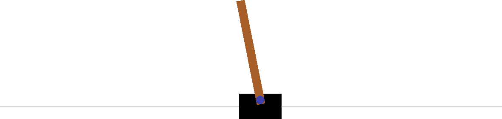

# 第二章：超智能

> 事实上，通向超智能的路径有很多条，这应增加我们最终能达到这一目标的信心。如果一条路径被阻碍，我们仍然可以取得进展。
> 
> Nick Bostrom（2014 年）

*技术奇点*这一术语有多种定义。其使用至少可以追溯到 Vinge（1993 年）的文章，作者大胆地以此开始：

> 未来三十年内，我们将拥有技术手段创造超人类智能。不久之后，人类时代将结束。

本章和本书中，*技术奇点*指的是某些机器达到超人类智能或*超智能*的时间点——这基本上符合 Vinge（1993 年）最初的想法。这个概念和概念被 Kurzweil（2005 年）广泛阅读和引用的书籍进一步普及。Barrat（2013 年）提供了大量围绕这个主题的历史和轶事信息。Shanahan（2015 年）对其核心方面进行了非正式介绍和概述。表达*技术奇点*本身起源于物理学中*奇点*的概念。它指的是黑洞中心，其中物质高度集中，引力变得无限，传统物理定律崩溃。宇宙的起源，即所谓的大爆炸，也被称为奇点。

尽管技术奇点和超智能的一般思想和概念可能与应用于金融的人工智能没有明显和直接的关系，但更好地理解它们的背景、相关问题和潜在后果是有益的。在更狭窄的背景下，如金融领域中的人工智能，获得的见解也很重要。这些见解还有助于指导讨论关于人工智能如何在近期和长期重塑金融业的议题。

“成功故事” 着眼于人工智能领域最近的成功故事的一部分。其中包括 DeepMind 公司如何用神经网络解决玩 Atari 2600 游戏的问题。它还讲述了同一家公司如何解决超越人类专家水平的围棋问题的故事。该部分还叙述了国际象棋和计算机程序的故事。“硬件的重要性” 讨论了在这些最近成功故事的背景下硬件的重要性。“智能形式” 介绍了不同形式的智能，如人工狭义智能（ANI）、人工通用智能（AGI）和超级智能（SI）。“通往超级智能的途径” 讨论了通向超级智能的潜在途径，如整脑仿真（WBE），而“智能爆炸” 则是研究人员称之为智能爆炸的内容。“目标和控制” 提供了在超级智能背景下所谓的控制问题的讨论。最后，“潜在的结果” 简要讨论了一旦实现了超级智能后的潜在未来结果和情景。

# 成功故事

人工智能的许多思想和算法早在几十年前就已经存在了。在这几十年中，人们一方面抱有长期的希望，另一方面则感到绝望。Bostrom（2014 年，第一章）对这些时期进行了回顾。

到了 2020 年，可以肯定地说人工智能正处于一个充满希望（如果不是兴奋）的时期。其中一个原因是最近在将人工智能应用于即使在几年前看起来也不可能在未来几十年内被人工智能主导的领域和问题上取得了成功。这类成功故事的列表既长且迅速增长。因此，本节仅集中讨论了其中三个这样的故事。Gerrish（2018）提供了更广泛的选择和更详细的案例记录。

## Atari

本小节首先讲述了 DeepMind 如何通过强化学习和神经网络掌握玩 Atari 2600 游戏的成功故事，然后通过具体的代码示例阐述了导致其成功的基本方法。

### 故事

第一个成功故事是关于在超人水平上玩 Atari 2600 游戏。¹ Atari 2600 视频电脑系统（VCS）于 1977 年发布，是 1980 年代最早的广泛使用的游戏机之一。从那个时期选出的流行游戏，如*Space Invaders*、*Asteroids*或*Missile Command*，被视为经典，几十年后仍受复古游戏爱好者的喜爱。

DeepMind 在其团队发表的一篇论文（Mnih et al. 2013）中详细介绍了将强化学习应用于通过 AI 算法或所谓的 AI 代理来玩 Atari 2600 游戏的结果。该算法是 Q-learning 的变体，应用于卷积神经网络。² 该算法仅基于高维视觉输入（原始像素）进行训练，没有任何人类的指导或输入。原始项目专注于七款 Atari 2600 游戏，其中三款——*Pong*、*Enduro*和*Breakout*——DeepMind 团队报告了 AI 代理的超越人类专家水平的表现。

从 AI 的角度来看，不仅是 DeepMind 团队实现了这样的结果，而且是如何实现的令人瞩目。首先，团队仅使用一个神经网络来学习和玩所有七款游戏。其次，没有提供任何人类指导或人工标记的数据，仅仅是基于视觉输入转化为特征数据的交互学习经验。³ 第三，采用的方法是强化学习，仅依赖于观察行动与结果（奖励）之间的关系，基本上与人类玩此类游戏的方式相同。

《Breakout》是 Atari 2600 游戏中的一个，DeepMind AI 代理实现了超越人类专家水平的表现，[链接](http://bit.ly/aiif_breakout)。在这个游戏中，目标是通过屏幕底部的挡板，让球反弹并直线穿过屏幕，摧毁屏幕顶部的一行行砖块。每当球击中砖块时，砖块被摧毁并使球反弹。球还会从左、右和顶部的墙壁反弹。如果球到达屏幕底部而未被挡板击中，玩家就会失去一条生命。

行动空间有三个元素，都与挡板相关：保持当前位置、向左移动和向右移动。状态空间由大小为 210 x 160 像素的游戏屏幕帧表示，并配有 128 色调色板。奖励由游戏分数表示，DeepMind 算法被设计为最大化这一分数。关于行动策略，算法学习在给定某个游戏状态时采取哪个行动最佳，以最大化游戏分数（总奖励）。

### 一个例子

此章节无法详细探讨 DeepMind 在*Breakout*和其他 Atari 2600 游戏中采用的方法。然而，OpenAI Gym 环境（参见[*https://gym.openai.com*](https://gym.openai.com)）允许展示类似但更简单的神经网络方法，适用于类似但同样更简单的游戏。

此部分的 Python 代码适用于 OpenAI Gym 的 `CartPole` 环境（参见[*http://bit.ly/aiif_cartpole*](http://bit.ly/aiif_cartpole))。⁴ 在这个环境中，需要将车移动到右边或左边，以平衡放在挡板上的直立杆。因此，动作空间类似于 *Breakout* 的动作空间。状态空间由四个物理数据点组成：车的位置、车的速度、杆的角度和杆的角速度（见 Figure 2-1）。如果在执行动作后，杆仍然保持平衡，则代理获得奖励 1。如果杆失去平衡，则游戏结束。如果代理达到总奖励 200，则被认为是成功的。⁵



###### 图 2-1\. `CartPole` 环境的图形表示

以下代码首先实例化一个 `CartPole` 环境对象，然后检查动作和状态空间，执行随机动作，并捕获结果。当 `done` 变量为 `False` 时，AI 代理继续下一轮：

```py
In [1]: import gym
        import numpy as np
        import pandas as pd
        np.random.seed(100)

In [2]: env = gym.make('CartPole-v0')  

In [3]: env.seed(100)  
Out[3]: [100]

In [4]: action_size = env.action_space.n  
        action_size  
Out[4]: 2

In [5]: [env.action_space.sample() for _ in range(10)]  
Out[5]: [1, 0, 0, 0, 1, 1, 0, 0, 0, 0]

In [6]: state_size = env.observation_space.shape[0]  
        state_size  
Out[6]: 4

In [7]: state = env.reset()  
        state  # [cart position, cart velocity, pole angle, pole angular velocity]
Out[7]: array([-0.01628537,  0.02379786, -0.0391981 , -0.01476447])

In [8]: state, reward, done, _ = env.step(env.action_space.sample())  
        state, reward, done, _  
Out[8]: (array([-0.01580941, -0.17074066, -0.03949338,  0.26529786]), 1.0, False, {})
```


实例化环境对象


为环境设置随机数种子


显示动作空间的大小


进行一些随机动作并收集它们


显示状态空间的大小


重置（初始化）环境并捕获状态


执行随机动作并将环境推进到下一个状态

下一步是根据随机动作来玩游戏，以生成足够大的数据集。然而，为了提高数据集的质量，仅收集了总奖励达到 110 或更高的游戏数据。为此，玩了几千场游戏，以收集足够的数据来训练神经网络：

```py
In [9]: %%time
        data = pd.DataFrame()
        state = env.reset()
        length = []
        for run in range(25000):
            done = False
            prev_state = env.reset()
            treward = 1
            results = []
            while not done:
                action = env.action_space.sample()
                state, reward, done, _ = env.step(action)
                results.append({'s1': prev_state[0], 's2': prev_state[1],
                                's3': prev_state[2], 's4': prev_state[3],
                                'a': action, 'r': reward})
                treward += reward if not done else 0
                prev_state = state
            if treward >= 110:  
                data = data.append(pd.DataFrame(results))  
                length.append(treward)  
        CPU times: user 9.84 s, sys: 48.7 ms, total: 9.89 s
        Wall time: 9.89 s

In [10]: np.array(length).mean()  
Out[10]: 119.75

In [11]: data.info()  
         <class 'pandas.core.frame.DataFrame'>
         Int64Index: 479 entries, 0 to 143
         Data columns (total 6 columns):
          #   Column  Non-Null Count  Dtype
         ---  ------  --------------  -----
          0   s1      479 non-null    float64
          1   s2      479 non-null    float64
          2   s3      479 non-null    float64
          3   s4      479 non-null    float64
          4   a       479 non-null    int64
          5   r       479 non-null    float64
         dtypes: float64(5), int64(1)
         memory usage: 26.2 KB

In [12]: data.tail()  
Out[12]:            s1        s2        s3        s4  a    r
         139  0.639509  0.992699 -0.112029 -1.548863  0  1.0
         140  0.659363  0.799086 -0.143006 -1.293131  0  1.0
         141  0.675345  0.606042 -0.168869 -1.048421  0  1.0
         142  0.687466  0.413513 -0.189837 -0.813148  1  1.0
         143  0.695736  0.610658 -0.206100 -1.159030  0  1.0
```


仅当随机代理的总奖励至少为 100 时…


…数据被收集…


…并记录总奖励。


所有随机游戏的平均总奖励。


查看 `DataFrame` 对象中收集的数据

装备有数据后，可以按以下方式训练神经网络。为分类设置一个神经网络。用表示状态数据的列作为特征，用表示采取的动作的列作为标签数据来训练它。鉴于数据集仅包括对给定状态成功的动作，神经网络学习了在给定状态下采取什么动作（标签）：

```py
In [13]: from pylab import plt
         plt.style.use('seaborn')
         %matplotlib inline

In [14]: import tensorflow as tf
         tf.random.set_seed(100)

In [15]: from keras.layers import Dense
         from keras.models import Sequential
         Using TensorFlow backend.

In [16]: model = Sequential()  
         model.add(Dense(64, activation='relu',
                         input_dim=env.observation_space.shape[0]))  
         model.add(Dense(1, activation='sigmoid'))  
         model.compile(loss='binary_crossentropy',
                       optimizer='adam',
                       metrics=['acc'])  

In [17]: %%time
         model.fit(data[['s1', 's2', 's3', 's4']], data['a'],
                   epochs=25, verbose=False, validation_split=0.2)  
         CPU times: user 1.02 s, sys: 166 ms, total: 1.18 s
         Wall time: 797 ms

Out[17]: <keras.callbacks.callbacks.History at 0x7ffa53685190>

In [18]: res = pd.DataFrame(model.history.history)  
         res.tail(3)  
Out[18]:     val_loss  val_acc      loss       acc
         22  0.660300  0.59375  0.646965  0.626632
         23  0.660828  0.59375  0.646794  0.621410
         24  0.659114  0.59375  0.645908  0.626632
```


仅使用一个隐藏层的神经网络。


模型是基于先前收集的数据进行训练的。


最后几步的每个训练步骤的指标如下所示。

经过训练的神经网络或 AI 代理可以根据其学习到的最佳动作来玩`CartPole`游戏。AI 代理在每次玩的 100 场比赛中都能获得最大的总奖励 200 分。这是基于相对较小的数据集和相对简单的神经网络：

```py
In [20]: def epoch():
             done = False
             state = env.reset()
             treward = 1
             while not done:
                 action = np.where(model.predict(np.atleast_2d(state))[0][0] > \
                          0.5, 1, 0)  
                 state, reward, done, _ = env.step(action)  
                 treward += reward if not done else 0
             return treward

In [21]: res = np.array([epoch() for _ in range(100)])
         res 
Out[21]: array([200., 200., 200., 200., 200., 200., 200., 200., 200., 200., 200.,
                200., 200., 200., 200., 200., 200., 200., 200., 200., 200., 200.,
                200., 200., 200., 200., 200., 200., 200., 200., 200., 200., 200.,
                200., 200., 200., 200., 200., 200., 200., 200., 200., 200., 200.,
                200., 200., 200., 200., 200., 200., 200., 200., 200., 200., 200.,
                200., 200., 200., 200., 200., 200., 200., 200., 200., 200., 200.,
                200., 200., 200., 200., 200., 200., 200., 200., 200., 200., 200.,
                200., 200., 200., 200., 200., 200., 200., 200., 200., 200., 200.,
                200., 200., 200., 200., 200., 200., 200., 200., 200., 200., 200.,
                200.])

In [22]: res.mean()  
Out[22]: 200.0
```


在给定状态和训练模型的情况下选择一个动作


根据学习的动作将环境向前推进一步


玩若干游戏并记录每场游戏的总奖励


计算所有游戏的平均总奖励

Arcade Learning Environment（ALE）与 OpenAI Gym 类似。它允许程序化地与仿真的 Atari 2600 游戏互动，执行动作，收集执行动作后的结果等。例如，学习玩*Breakout*这样的任务当然更为复杂，因为状态空间要大得多。然而，基本的方法与这里采取的方法相似，都有几种算法上的改进。

## Go

棋盘游戏[Go](http://bit.ly/aiif_go)已有 2000 多年的历史。长期以来，它被认为是一种美与艺术的创作，因为它在原则上简单但仍然高度复杂，并且预计能抵挡几十年来的游戏 AI 代理的进展。打 Go 的玩家的实力用*dan*来衡量，与许多武术系统的毕业系统一致。例如，李世石，多年来的 Go 世界冠军，持有第 9 段。2014 年，博斯特罗姆提出：

> 近年来，打 Go 的程序每年以约 1 段的速度提升。如果这种改进速度持续下去，它们可能在大约十年内击败人类世界冠军。

再次，DeepMind 团队通过其 AlphaGo 算法在 Go 游戏中取得了突破性进展（请参阅[DeepMind 官网的 AlphaGo 页面](https://oreil.ly/y6n5N)）。Silver 等人（2016 年）在其研究中如下描述了这一情况：

> 长期以来，围棋被视为人工智能中最具挑战性的经典游戏之一，因为其巨大的搜索空间和难以评估的棋局和着法。

团队成员使用了神经网络与蒙特卡洛树搜索算法的组合，在他们的论文中简要概述了这一方法。在介绍部分，团队回顾了他们 2015 年初期的成功：

> 我们的程序 AlphaGo 对其他围棋程序取得了 99.8%的胜率，并以 5 比 0 击败了人类欧洲围棋冠军[樊振东]。这是计算机程序首次在围棋的全尺寸比赛中击败人类职业选手，这一壮举此前被认为至少还需要十年的时间。

令人瞩目的是，这一里程碑是在领先的人工智能研究员尼克·博斯特罗姆预测可能需要另外十年才能达到那一水平的一年后实现的。然而，许多观察家评论说，当时的欧洲围棋冠军樊振东并不能真正被视为一个基准，因为世界围棋精英的水平要高得多。DeepMind 团队接受了这一挑战，并在 2016 年 3 月组织了一场五局三胜的比赛，对阵当时已获得 18 次世界围棋冠军的李世石，这无疑是对人类围棋顶尖水平的适当基准。（有关这场事件的大量背景信息可在[AlphaGo Korea 网页](https://oreil.ly/EL51T)上找到，甚至还有一部[电影](https://oreil.ly/1vYQ5)可供观看。）为此，DeepMind 团队进一步改进了 AlphaGo Fan 版本，推出了 AlphaGo Lee 版本。

关于比赛和 AlphaGo 李的故事已经有了详尽的记录，并且引起了全世界的关注。DeepMind 在其[网页](https://oreil.ly/h0WEs)上写道：

> AlphaGo 于 2016 年 3 月在韩国首尔以 4 比 1 的胜利获得了全球 2 亿多人次的观看。这一具有里程碑意义的成就领先于其时代十年。这场比赛让 AlphaGo 获得了 9 段的专业段位，这是最高的认证。这是计算机围棋选手首次获得这一荣誉。

直到那个时候，AlphaGo 在监督学习中使用了基于数百万人类专家对局的训练数据集等资源。团队的下一个版本 AlphaGo Zero 完全跳过了这种方法，而是完全依赖于强化学习和自我对弈，组合不同世代的训练过的、基于神经网络的人工智能代理来互相竞争。Silver 等人的文章（2017b）详细介绍了 AlphaGo Zero。在摘要中，研究人员总结道：

> AlphaGo 成为自己的老师：一个神经网络被训练来预测 AlphaGo 自己的移动选择以及 AlphaGo 游戏的赢家。这个神经网络改善了树搜索的强度，导致更高质量的移动选择和更强的自我对弈。从零开始，我们的新程序 AlphaGo Zero 实现了超人类的表现，以 100 比 0 击败了先前发布的、击败冠军的 AlphaGo。

令人惊奇的是，一个神经网络训练方式与前一节中的`CartPole`示例并没有太大不同（即基于自我对弈），竟然能够打破象棋这样一个复杂的游戏，其可能的棋盘位置超过了宇宙中的原子数量。同样令人惊奇的是，几个世纪以来由人类玩家积累的象棋智慧对于达到这一里程碑根本不是必要的。

DeepMind 团队并没有止步于此。AlphaZero 旨在成为一个通用的游戏 AI 代理，能够学习不同的复杂棋盘游戏，如围棋、国际象棋和将棋。关于 AlphaZero，团队在 Silver（2017a）中总结道：

> 在本文中，我们将这种方法推广为一个名为 AlphaZero 的算法，该算法可以在许多具有挑战性的领域中实现超人类水平的表现。从随机游戏开始，除了游戏规则外，没有给予任何领域知识，AlphaZero 在 24 小时内在象棋、将棋（日本象棋）以及围棋的游戏中都实现了超人类水平的表现，并且在每种情况下都击败了世界冠军程序。

2017 年，DeepMind 再次取得了一个引人注目的里程碑：一个游戏 AI 代理，在不到 24 小时的自我对弈和训练后，在三个历史悠久的、深入研究的棋盘游戏中达到了超越人类专家水平。

## 国际象棋

当然，国际象棋是世界上最流行的棋盘游戏之一。自家用计算机出现以来，就有国际象棋游戏程序存在。例如，一个几乎完整的象棋引擎叫做*ZX Chess*，它只包含大约 672 字节的机器码，于 1983 年推出，用于 ZX-81 Spectrum 家用计算机。[⁶] 尽管它是一个缺少某些规则（比如易位）的不完整实现，但那时它是一个巨大的成就，今天对于计算机象棋爱好者仍然很迷人。*ZX Chess*作为最小的象棋程序的记录保持了 32 年，直到 2015 年才被*BootChess*以 487 字节打破。[⁷]

用如此小的代码基础编写一个计算机程序，它能够玩一种棋盘游戏，其可能的游戏排列比宇宙中的原子还多，几乎可以被认为是软件工程的天才。虽然与围棋在纯数字方面不那么复杂，但象棋可以被认为是最具挑战性的棋盘游戏之一，因为玩家需要数十年才能达到国际大师级别。

在 20 世纪 80 年代中期，即使是在比基础家用计算机 ZX-81 Spectrum 上更好的硬件上，专家级别的计算机国际象棋程序仍然遥不可及，并且没有那么多的约束条件。因此当时的领先国际象棋选手在与计算机对战时也感到自信。例如，加里·卡斯帕罗夫（2017 年）回忆起 1985 年的一次事件，当时他进行了 32 场同时对局：

> 1985 年 6 月 6 日是汉堡的一个愉快的日子…我所有 32 位对手都是计算机…当我获得了 32-0 的完美成绩时，这并不令人惊讶。

计算机国际象棋开发者和硬件专家从 IBM 公司花费了 12 年时间，直到一台名为深蓝的计算机能够击败当时的世界国际象棋冠军卡斯帕罗夫。在他写的书中，这场历史性的输给深蓝之后 20 年出版，他写道：

> 十二年后，我在纽约为我的国际象棋生涯而战。只对抗一台机器，一台价值 1000 万美元的 IBM 超级计算机，外号“深蓝”。

卡斯帕罗夫与深蓝总共进行了六场比赛。计算机以 3.5 比 2.5 的成绩获胜；赢一场比赛获得一个完整的分数，平局双方各得半分。尽管深蓝输掉了第一场比赛，但它在剩下的五场中赢了两场，另外三场以双方协议平局结束。有人指出，深蓝不应被视为人工智能形式，因为它主要依赖于一个庞大的硬件集群。这个硬件集群包括 30 个节点和 480 个 IBM 专为此事件设计的特殊国际象棋芯片，能够每秒分析约 2 亿个位置。从这个意义上说，深蓝主要依赖于蛮力技术，而不是像神经网络等现代人工智能算法。

自 1997 年以来，硬件和软件都取得了巨大进步。卡斯帕罗夫在他的书中提到现代智能手机上的国际象棋应用时总结道：

> 再跳到今天，即 2017 年，你可以在手机上下载任意数量的免费国际象棋应用程序，它们能与任何人类大师匹敌。

击败人类大师所需的硬件成本从 1000 万美元降低到约 100 美元（即降低了 100,000 倍）。然而，常规计算机和智能手机的国际象棋应用程序仍依赖几十年计算机国际象棋的积累智慧。它们包含大量为游戏设计的规则和策略，依赖开局的大型数据库，并且利用现代设备的增强计算能力和内存进行基本上以蛮力为基础的数百万国际象棋位置的评估。

这就是 AlphaZero 的作用所在。AlphaZero 掌握国际象棋的方法是基于强化学习和不同版本的 AI 代理自我对弈竞争。DeepMind 团队将传统的计算机国际象棋方法与 AlphaZero 进行了对比（见[AlphaZero 研究论文](https://oreil.ly/Ur-fI)）：

> 传统的国际象棋引擎，包括世界计算机国际象棋冠军 Stockfish 和 IBM 开创性的 Deep Blue，依赖于数千条由强大的人类玩家手工制作的规则和启发式方法，试图在游戏中考虑到每一种可能性……AlphaZero 采用了一种完全不同的方法，用深度神经网络和通用算法替代这些手工制作的规则，这些算法对游戏除了基本规则以外一无所知。

鉴于 AlphaZero 的这种白纸面对的方法，与领先的传统国际象棋计算机程序相比，在几个小时的基于自我对弈训练后，其性能异常出色。AlphaZero 只需 9 小时或更少的时间就能掌握超过所有人类玩家和其他所有国际象棋程序的水平，包括 Stockfish 引擎，它曾一度主导了计算机国际象棋。在 2016 年的测试系列中，AlphaZero 以 155 场胜利（大部分时候执白棋），仅输了 6 场，其余为平局，击败了 Stockfish。

尽管 IBM 的 Deep Blue 能够每秒分析 2 亿个位置，现代国际象棋引擎如 Stockfish，在多核通用硬件上，可以每秒分析约 6000 万个位置。与此同时，AlphaZero 仅分析约 6 万个位置每秒。尽管每秒分析的位置数量少了 1000 倍，它仍然能够击败 Stockfish。人们可能倾向于认为 AlphaZero 确实表现出了某种形式的智能，这是纯粹的蛮力无法弥补的。考虑到人类大师可能基于经验、模式和直觉每秒分析几百个位置，AlphaZero 可能在专家级人类国际象棋玩家和基于蛮力方法、辅以手工制作规则和存储棋局知识的传统国际象棋引擎之间占据了一个甜蜜的点。人们可以推测，AlphaZero 获得了类似于人类模式识别、远见和直觉的东西，同时由于其比较适合该目的的硬件，具有更高的计算速度。

# 硬件的重要性

在过去的十年里，AI 研究人员和实践者在 AI 算法方面取得了巨大进展。如前一节所示，强化学习通常与神经网络结合，用于行动策略表示，在许多不同领域都证明了其有用和优越性。

然而，如果没有硬件方面的进步，最近的 AI 成就是不可能的。再次，DeepMind 以及其通过强化学习（RL）掌握围棋的努力提供了一些宝贵的见解。Table 2-1 概述了从 2015 年以来各个主要 AlphaGo 版本的硬件使用和功耗情况。⁸ AlphaGo 的实力不仅稳步增强，而且硬件要求及相关功耗也显著降低。⁹

表 2-1\. AlphaGo 的 DeepMind 硬件

| 版本 | 年份 | Elo 等级^(a) | 硬件 | 功耗 [TDP] |
| --- | --- | --- | --- | --- |
| AlphaGo 粉丝 | 2015 | >3,000 | 176 GPU | >40,000 |
| AlphaGo 李 | 2016 | >3,500 | 48 TPUs | 10,000+ |
| AlphaGo 大师 | 2016 | >4,500 | 4 TPUs | <2,000 |
| AlphaGo Zero | 2017 | >5,000 | 4 TPUs | <2,000 |
| ^(a) 有关世界顶级人类围棋选手的 Elo 等级，请参见 [*https://www.goratings.org/en*](https://www.goratings.org/en)。 |

AI 领域首次进行的重要硬件推动来自 GPU。虽然最初开发用于为计算机游戏生成快速的高分辨率图形，现代 GPU 也可以用于许多其他目的。其中一个用途涉及线性代数（例如矩阵乘法形式），这是 AI 总体及神经网络特别重要的数学学科。

截至 2020 年中期，市场上最快的消费级 CPU 之一是 Intel 最新版本的 i9 处理器（具有 8 核心和最多 16 个并行线程）。¹⁰ 根据手头的基准任务，其速度大约为 1 TFLOPS 或略高（即每秒一万亿浮点运算）。

与此同时，市场上最快的消费级 GPU 之一是 Nvidia GTX 2080 Ti。它拥有 4,352 个 CUDA 核心，Nvidia 版本的 GPU 核心。这使得在线性代数操作的上下文中能够高度并行。这款 GPU 的速度可达 15 TFLOPS，大约比 Intel 最快的消费级 CPU 快 15 倍。GPU 在速度上长期以来一直快于 CPU。然而，一个主要的限制因素通常是 GPU 相对较小和专业化的内存。随着新型 GPU 模型（如 GTX 2080 Ti）的推出，这一问题显著得到缓解，它具备高达 11 GB 的快速 GDDR6 内存和高速数据传输的总线速度，可用于与 GPU 的数据交换。¹¹

在 2020 年中期，这类 GPU 的零售价格约为 1400 美元，比起 10 年前同等功率的硬件便宜了几个数量级。这一进展使得 AI 研究，例如，对于相对预算较小的个人学术研究者而言更加负担得起，相比之下，公司如 DeepMind 的预算要高得多。

另一个硬件趋势是促进 AI 方法和算法的进一步发展和采用：云中的 GPU 和 TPU。像 Scaleway 这样的云服务提供商提供可以按小时租用的云实例，并配备强大的 GPU（参见[Scaleway GPU instances](https://oreil.ly/bkaH3)）。其他如 Google 已开发了专门用于 AI 的 TPU 芯片，类似于 GPU，使得线性代数运算更加高效（参见[Google TPUs](https://oreil.ly/xnmdw)）。

总的来说，从 AI 的角度来看，硬件在过去几年中有了巨大的进步。总结起来，值得强调三个方面：

性能

GPU 和 TPU 提供具有高度并行体系结构的硬件，非常适合 AI 算法和神经网络。

成本

每 TFLOPS 计算能力的成本显著下降，使得更小的 AI 相关预算或者同样预算下更多的计算能力成为可能。

功率

功耗也在降低。同样的 AI 相关任务需要更少的功耗，通常也能更快地执行。

# 智能形式

AlphaGo Zero 是否智能？如果没有一个明确的*智能*定义，这很难说。AI 研究者 Max Tegmark（2017 年）将智能简洁地定义为“实现复杂目标的能力”。

这个定义足够一般化，以涵盖更具体的定义。根据这个定义，AlphaZero 是智能的，因为它能够实现一个复杂的目标，即在对弈人类玩家或其他 AI 代理的围棋或国际象棋比赛中获胜。当然，人类和动物总体上也因此被认为是智能的。

对于本书的目的，以下更具体的定义似乎是合适且足够精确。

人工狭窄智能（ANI）

This specifies an AI agent that exceeds human-expert-level capabilities and skills in a narrow field. AlphaZero can be considered an ANI in the fields of Go, chess, and shogi. An algorithmic stock-trading AI agent that realizes a net return of consistently 100% per year (per anno) on the invested capital could be considered an ANI.

通用人工智能（AGI）

This specifies an AI agent that reaches human-level intelligence in any field, such as chess, mathematics, text composition, or finance, and might exceed human-level intelligence in some other domains.

超级智能（SI）

This specifies an intellect or AI agent that exceeds human-level intelligence in any respect.

一个 ANI 具有在一个狭窄领域内达到复杂目标的能力，比任何人类都要高。一个 AGI 在各种领域中达成复杂目标的能力与任何人类相当。最后，一个超智能在几乎任何可想象的领域中，比任何人类，甚至是人类集体，都要显著地更擅长实现复杂目标。

前面给出的超智能定义与 Bostrom 在其名为《超智能》（2014 年）的书中提供的定义一致：

> 我们可以暂时定义超智能为*在几乎所有感兴趣领域中，远远超过人类认知表现的任何智力*。

如前所定义，技术奇点是超智能存在的时间点。然而，哪些路径可能导致超智能？这是下一节的主题。

# 通往超智能

多年来，研究人员和实践者一直在争论是否可能创建超智能。关于技术奇点实现的估计从几年到几十年，几个世纪，甚至永远不可能。无论一个人是否相信超智能的可行性，讨论实现它的潜在路径都是有益的。

首先，以下是来自 Bostrom（2014 年，第二章）的一段较长引文，其中列出了一些通用考虑因素，这些因素可能适用于实现超智能的任何潜在途径：

> 然而，我们可以辨认出那种所需系统的一些通用特征。现在看来，学习能力将成为旨在实现通用智能的核心设计特征，而不是作为后来的扩展或唐突的附加物。处理不确定性和概率信息的能力也同样如此。从感官数据和内部状态中提取有用概念的能力，以及将获得的概念转化为用于逻辑和直觉推理的灵活组合表达，这些在现代 AI 旨在实现通用智能时，也很可能属于核心设计特征之一。

这些通用特征让人想起了 AlphaZero 的方法和能力，尽管像*直观*这样的术语可能需要定义才能适用于 AI 代理。但如何实际实现这些通用特征呢？Bostrom（2014 年，第二章）讨论了五条可能的路径，在接下来的子章节中进行了探讨。

## 网络和组织

实现超智能的第一条途径是通过涉及可能大量人类的网络和组织，以使他们的个体智能被放大并同步工作。团队，包括具有不同技能的人，是这种网络或组织的一个简单例子。在这种背景下经常提到的一个例子是美国政府为曼哈顿计划组建的领先专家团队，旨在建造核武器以决定性地结束第二次世界大战。

这条路径似乎有自然的限制，因为单个人类的个体能力和容量相对固定。进化也表明，人类在超过 150 人的网络和组织中协调起来存在困难。大公司通常比这小得多地形成了更小的团队、部门或群体。

另一方面，计算机和机器的网络，如互联网，往往能够基本无缝地工作，即使有数百万的计算节点。这样的网络今天至少能够组织人类的知识和其他数据（声音、图片、视频等）。当然，AI 算法已经帮助人类浏览所有这些知识和数据。然而，从今天的角度来看，一个超智能是否可能“自发”地从互联网中出现是值得怀疑的，可能需要专门的努力。

## 生物增强

如今，人类在提高个体认知和身体表现方面投入了大量努力。从更自然的方法，如更好的训练和学习方法，到涉及物质，如补充剂或智能甚至致幻药物，再到涉及特殊工具，人类今天比以往任何时候都更加系统和科学地努力提高个体的认知和身体表现。哈拉里（2015 年）将这种努力描述为*智人*寻求创造一个新而更好版本的自己，*智神*的探索。

然而，这种方法再次面临人类硬件基本固定的障碍。它已经在数十万年间进化，并且在可预见的未来可能会继续。但这将以相对缓慢的速度进行，并且仅在许多代人中。它也仅会在很小的程度上发生，因为如今自然选择对人类的作用大大减少，而自然选择是进化获得改善的动力。多明戈斯（2015 年，第五章）讨论了通过进化取得进展的中心方面。

在这个背景下，用泰格马克（2017 年，第一章）概述的*生命版本*来思考是很有帮助的：

+   **生命 1.0**（生物学）：具有基本固定硬件（生物体）和软件（基因）的生命形式。两者通过进化同时缓慢演化。例如细菌或昆虫。

+   **生命 2.0**（文化）：基本上具有固定且演化缓慢的硬件，但主要由设计和学习的软件组成（基因加上语言、知识、技能等）。一个例子是人类。

+   **生命 3.0**（技术）：具有设计和可调整硬件以及完全学习和进化的软件的生命形式。一个例子是使用计算机硬件、软件和 AI 算法创建的超级智能。

在机器超级智能中体现的技术生命，可用硬件的限制几乎完全消失。因此，与网络或生物增强之外的通往超级智能的路径，目前可能会证明更有前途。

## 大脑-机器混合体

在任何领域提升人类表现的混合方法在我们的生活中随处可见，并通过人类使用各种硬件和软件工具的象征。人类自其起源以来一直使用工具。今天，数十亿人携带着装有 Google Maps 的智能手机，使得即使在从未到访的地区和城市中，也能轻松导航。这是我们的祖先所没有的奢侈品，因此他们需要基于天空中看到的物体获取导航技能，或者使用远不如此精密的工具，比如指南针。

在国际象棋的背景下，例如，当计算机（如 Deep Blue）被证明优于人类时，并不意味着人类停止下棋。相反，计算机国际象棋程序性能的提升使它们成为每位大师系统提升游戏水平的必不可少的工具。人类大师和高速计算的国际象棋引擎形成了一个人机团队，在其他条件相同的情况下，比单独的人类表现更优。甚至有国际象棋比赛，人类在互相对弈的同时利用计算机来提出下一步的走法。

同样地，可以想象通过适当的接口直接连接人脑到机器，使得大脑能够与机器正确通信，交换数据并启动某些计算、分析或学习任务。听起来像是科幻小说的事情实际上是一个活跃的研究领域。例如，埃隆·马斯克（Elon Musk）是 Neuralink 这个专注于*神经技术*（常被称为这个领域）的初创公司的创始人。

总而言之，大脑-机器混合体似乎在实践上是可行的，并有可能显著超越人类智能。然而，它是否会导致超级智能并不明显。

## 整体脑仿真

另一种推荐的通往超智能的路径是首先完全模拟人脑，然后对其进行改进。这里的想法是通过现代脑部扫描以及生物和医学分析方法来绘制整个人脑的地图，以精确复制其神经元、突触等结构，并通过软件实现。该软件将在适当的硬件上运行。Domingos（2015 年，第四章）提供了关于人脑及其学习特性的背景信息。Kurzweil（2012 年）则在这个主题上提供了一本详尽的处理，提供了详细的背景信息，并勾画了实现整个大脑仿真（WBE，有时也称为*上传*）的方式。¹²

在一个较少雄心勃勃的层面上，神经网络确实实现了 WBE 试图实现的目标。正如其名称所暗示的那样，神经网络受到大脑的启发，因为它们在许多不同领域已经被证明是如此有用和成功，因此人们可能倾向于认为 WBE 确实可以被视为通向超智能的可行路径。然而，完整绘制出人类大脑所需的技术目前仅部分可用。即使绘制成功，也不清楚软件版本是否能够完成人脑能够完成的同样任务。

然而，如果 WBE 成功，那么人脑软件可以在比人体更强大和更快的硬件上运行，潜在地导致超智能。软件也可以轻松复制，并且可以以协调的方式组合大量仿真大脑，同样可能导致超智能。人脑软件也可以以人类由于生物限制而无法实现的方式进行增强。

## 人工智能

最后但同样重要的是，就本书的背景而言，人工智能本身可能导致超智能：算法（如神经网络）在标准或专门的硬件上运行，并根据可用或自创数据进行训练。有很多理由可以解释为什么大多数研究人员和实践者认为，如果超智能是可实现的，这条路径可能是最有可能的路径之一。

第一个主要原因是，从历史上看，人类在工程领域的成功通常是通过忽略自然和进化为解决某一问题所提出的方法。考虑飞机。它们的设计利用了对现代物理学、空气动力学、热力学等的现代理解，而不是试图模仿鸟类或昆虫的飞行方式。或者考虑计算器。当工程师们建造第一台计算器时，并没有分析人脑如何执行计算，也没有试图复制生物学的方法。他们依赖的是在技术硬件上实现的数学算法。在这两种情况下，更重要的是功能或能力本身（飞行，计算）。它能够提供的更高效，就越好。没有必要模仿自然。

第二个主要原因是，AI 的成功案例数量似乎在不断增加。例如，将神经网络应用于几年前似乎对 AI 优势免疫的领域，已被证明是 ANI 在许多领域的一个富有成效的路径。AlphaGo 演变为 AlphaZero 的例子，在短时间内掌握多个棋盘游戏，为通用化的进一步推进提供了希望。

第三个主要原因是，超智能（“奇点”）可能只会在观察到许多 ANI 甚至一些 AGI 之后才出现。鉴于 AI 在特定领域和领域的力量毋庸置疑，研究人员和企业都将继续专注于改进 AI 算法和硬件。例如，大型对冲基金将推动其努力以 AI 方法和代理生成α（基金相对于市场基准的超额收益）。他们中的许多人都有专门的团队致力于这些工作。各行各业的全球努力可能会共同产生超智能所需的进展。

# 人工智能

在通向超智能的所有可能路径中，AI 似乎是最有前途的一条。基于强化学习和神经网络的最新成功在该领域引发了另一波 AI 春天，经历了几次 AI 冬天后。现在甚至有人认为，超智能可能离我们想象的时间不远了几年前。该领域目前的特点是，进展比专家们短时间前最初预测的要快得多。

# 智能爆炸

早前提到的 Vinge（1993）的引用不仅描绘了技术奇点后人类的危险情景，还预测这种危险情景将会*很快*实现。为什么会这么快？

如果有一个超智能存在，那么工程师或超智能本身可以创建另一个超智能，甚至可能是一个更好的超智能，因为超智能在技术知识和技能方面比初始超智能的创造者更为优越。超智能的复制不会受到生物进化数百万年时间限制的约束。它只会受到新硬件技术装配过程的限制，而超智能可以自行改进并显著提升。软件可以迅速轻松地复制到新硬件上。资源可能也会限制复制。超智能可能会想出更好甚至是新的方法来挖掘和生产所需的资源。

这些以及类似的论点支持这样的观点，即一旦技术奇点达到，智能将会爆炸增长。这可能类似于大爆炸，它开始于一个（物理）奇点，从中已知的宇宙如同从爆炸中出现一样。

关于特定领域和 ANIs，类似的论点可能适用。假设一个算法交易的 AI 代理在市场上的表现比其他交易者和对冲基金要成功和一致得多。这样的 AI 代理将通过交易收益和吸引外部资金积累更多资金。这反过来又会增加可用于改进硬件、算法、学习方法等的预算，例如支付高于市场水平的薪水和奖励，以吸引在金融应用 AI 领域最聪明的头脑。

# 目标与控制

在普通的 AI 背景下，例如，当一个 AI 代理被认为是掌握了如`CartPole`游戏或更复杂的游戏（如国际象棋或围棋）时，目标通常是定义明确的：“至少获得 200 分”，“通过将军赢得国际象棋比赛”等等。但是超智能的目标是什么呢？

## 超智能与目标

对于具有超人类能力的超智能，其目标可能不像前面的例子那样简单和稳定。首先，超智能可能会为自己设定一个新目标，认为这比其最初的设定和编程的目标更合适。毕竟，它有能力以与其工程团队相同的方式做到这一点。总体而言，它将能够在任何方面重新编程自己。许多科幻小说和电影让我们相信，这种主要目标的变化通常对人类不利，这也是文格（1993 年）的假设。

即使假设超智能的主要目标可以以不可改变的方式编程和嵌入，或者超智能可能只是坚持其原始目标，问题也可能出现。独立于主要目标，波斯特罗姆（2014 年，第七章）认为，每个超智能都有五个工具性子目标：

自我保存

足够长时间的超智能生存是实现其主要目标所必需的。为此，超智能可能会采取不同措施，其中一些可能对人类有害，以确保其生存。

目标内容完整性

这指的是超智能将努力保留其当前主要目标的想法，因为这增加了其未来自身实现此目标的可能性。因此，当前和未来的主要目标很可能是相同的。考虑一个下棋 AI 代理，最初的目标是赢得一局棋。它可能会改变目标，以任何代价避免其皇后被捕获。这可能最终阻止它赢得比赛，因此这种目标变化将是不一致的。

认知增强

无论超智能的主要目标是什么，认知增强通常都会带来益处。因此，如果认为这有助于实现其主要目标，它可能会努力尽快并尽可能地增加自己的能力。认知增强因此是一个重要的工具性目标。

技术完善

另一个工具性目标是技术完善。根据《生命 3.0》的理解，超智能不会局限于当前的硬件或软件状态。它可能会努力存在于它设计和制造的更好硬件上，并利用它编码的改进软件。这通常会服务于它的主要目标，并可能加快其实现速度。例如，在金融行业，高频交易（HFT）是一个以追求技术优势为特征的领域。

资源获取

对于几乎任何主要目标，更多的资源通常会增加实现目标的概率和速度。当目标中隐含竞争的情况下，这尤为真实。考虑一个以尽可能快尽可能多地挖掘比特币为目标的 AI 代理。该 AI 代理拥有的硬件、能源等资源越多，对于实现其目标越有利。在这种情况下，它甚至可能采取非法手段从加密货币市场中获取（窃取）资源。

表面上看，工具性目标似乎不会构成威胁。毕竟，它们确保了 AI 代理的主要目标的实现。然而，正如 Bostrom（2014）广泛引用的例子所示，问题可能很容易出现。Bostrom 认为，例如，一个以最大化纸夹生产为目标的超智能可能对人类构成严重威胁。为了理解这一点，考虑在这样一个 AI 代理的背景下前面的工具性目标。

首先，它会尽一切手段保护自己，甚至使用武器对抗其创造者。其次，即使其自身的认知推理能力可能表明其主要目标并不真正合理，它可能会随着时间的推移坚持下去，以最大化实现其目标的机会。第三，认知增强肯定对实现其目标有价值。因此，它将尝试各种措施，可能其中许多措施会以牺牲和伤害人类为代价，以提高其能力。第四，对于自身和生产回形针而言，技术越先进越好，这对其主要目标越有利。因此，它将通过购买或窃取获取所有现有技术，并建立新技术来帮助其实现目标。最后，它拥有的资源越多，可以生产的回形针就越多——直到在地球资源耗尽时建立太空探索和采矿技术。在极端情况下，这样的超智能可能耗尽太阳系、银河甚至整个宇宙的资源。

# 工具性目标

假设任何形式的超智能都会有其独立于主要目标的工具性目标。这可能会导致一系列意想不到的后果，比如对以任何看似有前景的手段获取更多资源的贪得无厌。

该例子说明了关于 AI 代理目标的两个重要观点。首先，可能无法以一种完全清晰地反映制定目标人意图的方式为 AI 代理制定复杂的目标。例如，像“保护和保护人类物种”这样的高尚目标可能会导致杀死四分之三的人类，以确保其余四分之一的存活机会更高。超智能在对地球未来和人类物种进行数十亿次模拟后决定，这一措施最有可能实现其主要目标。其次，一个看似出于善意和无害的目标可能由于工具性目标而导致意想不到的后果。在回形针的例子中，一个问题是“尽可能多地生产”。在这里很容易修正，比如将数量明确为一百万。但即使如此，这可能只是部分修正，因为工具性目标，比如自我保护，可能会成为主要目标之一。

## 超智能与控制

如果在技术奇点之后存在不良甚至灾难性的后果，制定至少潜在可以控制超智能的措施至关重要。

第一组措施与主要目标的正确制定和设计相关。前一节在一定程度上讨论了这个方面。博斯特罗姆（2014 年，第九章）在“动机选择方法”一章中提供了更多细节。

第二组措施与控制超智能的能力有关。博斯特罗姆（2014 年，第九章）勾画了四种基本方法。

包装

这是一种将正在出现的超智能与外部世界分开的方法。例如，AI 代理可能没有连接到互联网。它也可能缺乏任何感官能力。人类互动也可能被排除在外。鉴于这种控制能力的方法，可能根本无法实现一大套有趣的目标。考虑一个算法交易的 AI 代理，它被设计为达到 ANI 水平。如果没有连接到外部世界，比如股票交易平台，AI 代理就无法实现其目标。

激励

AI 代理可能被编程为最大化其奖励功能，用于特意设计的（电子）奖励，奖励期望行为并惩罚不良行为。虽然这种间接方法在目标设计上更自由，但在很大程度上遭受直接制定目标类似的问题。

衰退

这种方法指的是有意限制 AI 代理的能力，比如硬件、计算速度或内存方面。然而，这是一项微妙的任务。太多的衰退会导致超智能永远不会出现。而太少的衰退则会导致随后的智能爆炸使这项措施变得过时。

绊脚石

这指的是应该帮助及早发现任何可疑或不良行为的措施，以便可以启动有针对性的对策。然而，这种方法遭遇了警报系统通知警方有入室盗窃的问题。即使监控摄像头的录像也可能无法帮助确定入室盗窃的是谁。

# 能力控制

总的来说，当超智能达到那个水平时，是否能够适当而系统地控制它似乎是值得质疑的。毕竟，它的超能力至少在原则上可以用来克服任何人类设计的控制机制。

# 潜在结果

除了文奇（1993 年）早期预言超智能的出现将意味着人类的末日之外，还有哪些可能的结果和情景是可以想象的？

越来越多的人工智能研究者和实践者警告说，未受控制的人工智能可能带来潜在威胁。在超智能出现之前，人工智能可能导致歧视、社会失衡、金融风险等问题。（在这一背景下，一个著名的人工智能批评者是特斯拉、SpaceX 和上述的神经链接等公司的创始人埃隆·马斯克。）因此，人工智能的伦理和治理成为研究者和从业者之间积极讨论的话题。为了简化问题，可以说这些人担心人工智能引发的*反乌托邦*。其他人，如雷·库兹韦尔（2005 年，2012 年），强调人工智能可能是通向乌托邦的唯一途径。

在这种情况下的问题是，即使是相对较低的反乌托邦结果的概率也足以令人担忧。正如前一节所示，考虑到现有技术状态，可能没有适当的控制机制可用。在这种背景下，毫不奇怪，在撰写本文时，42 个国家已经签署了关于人工智能发展的第一份国际协议。

正如 Murgia 和 Shrikanth（2019 年）在《金融时报》中报道的：

> 在上周的一次历史性步骤中，42 个国家联合起来支持了全球治理框架，以应对我们这个时代最强大的新兴技术之一——人工智能。
> 
> 此次协议由包括美国、英国和日本在内的 OECD 国家以及非成员国家签署，正值各国政府在工业中应用人工智能的道德和实际后果刚刚开始认真对待的关键时刻……过去几年来，像谷歌、亚马逊、百度、腾讯和字节跳动等公司的人工智能的快速发展远远超过了该领域的监管，暴露出包括偏见人工智能决策、彻头彻尾的伪造和误导，以及自动化军事武器的危险在内的重大挑战。

# 乌托邦与反乌托邦

尽管是人工智能推动的乌托邦未来的坚定支持者，他们也必须承认，在技术奇点之后的反乌托邦未来是不能完全排除的。由于后果可能是灾难性的，反乌托邦的结果必须在关于人工智能和超智能的更广泛讨论中起作用。

那么在技术奇点之后，超智能的数量和情况如何？有三种基本情景似乎是可能的。

单一体

单一超智能出现并获得如此大的权力，以至于其他超智能甚至无法生存或出现。例如，谷歌主导搜索市场，并在该领域几乎达到垄断地位。超智能可能会在其出现后迅速在许多相关领域和行业达到可比的地位。

多极

多个超智能同时出现并在更长时间内共存。例如，对冲基金行业有几家大型参与者，可以被视为垄断，因为它们的市场份额合并起来。多个超智能也可以通过分治协议在一定时间内共存。

原子

在技术奇点之后不久，会出现大量的超智能。经济上，这种情景类似于完全竞争的市场。技术上，象棋的演变为这种情况提供了一个类比。1997 年，IBM 建造了一台机器来统治计算机和人类的象棋世界，而如今每部智能手机上的象棋应用程序都能胜过任何人类象棋选手。截至 2018 年，全球已有超过 30 亿部智能手机在使用。在这种情况下，值得注意的是，智能手机的最新硬件趋势是在常规 CPU 之外增加专用的 AI 芯片，不断增强这些小型设备的功能。

本节不会就技术奇点后的一个或多个潜在结果进行争论：反乌托邦、乌托邦、单体、多极或原子。相反，它提供了一个基本框架来思考超智能或其各自领域内强大的 ANIs 可能产生的潜在影响。

# 结论

近期的成功故事，比如 DeepMind 和 AlphaZero，导致了新的 AI 春天，带来了前所未有的希望，即超智能可能是可实现的。当前，AI 已经在不同领域的专家水平上开发出了远远超过人类的 ANIs。关于 AGIs 和超智能是否可能的问题仍在争论中。然而，至少不能排除通过某种路径——最近的经验表明 AI——确实可以实现。一旦技术奇点发生，也不能排除超智能可能对人类产生意外的、负面的甚至是灾难性的后果。因此，适当的目标和激励设计以及适当的控制机制可能对保持新兴的、越来越强大的 AI 代理在可见技术奇点之前就受到控制至关重要。一旦奇点达成，智能爆炸可能迅速将超智能的控制权夺出其创造者和赞助者的手中。

人工智能（AI）、机器学习、神经网络、超智能和技术奇点是当前或将来对人类生活任何领域至关重要的主题。今天，许多研究领域、许多行业以及人类生活的许多领域都因 AI、机器学习和深度学习而发生了根本性的变化。同样适用于金融和金融行业，尽管由于采用速度较慢，AI 对金融的影响可能还不那么显著。但是，正如后面的章节所论述的那样，AI 将从根本上和永久地改变金融和金融市场参与者的运作方式。

# 参考文献

本章引用的书籍和论文：

+   Barrat, James. 2013\. *Our Final Invention: Artificial Intelligence and The End of the Human Era*. 纽约: St. Martin’s Press.

+   Bostrom, Nick. 2014\. *Superintelligence: Paths, Dangers, Strategies*. 牛津: Oxford University Press.

+   Chollet, François. 2017\. *使用 Python 进行深度学习*。Shelter Island：Manning。

+   Domingos, Pedro. 2015\. *大师算法：追求终极学习机器将改变我们的世界*。英国：企鹅兰登书屋。

+   Doudna, Jennifer 和 Samuel H. Sternberg. 2017\. *创世纪裂痕：控制进化的新力量*。伦敦：博德利头出版社。

+   Gerrish, Sean. 2018\. *智能机器如何思考*。剑桥：麻省理工学院出版社。

+   Harari, Yuval Noah. 2015\. *霍莫·德尤斯：未来简史*。伦敦：哈维尔·塞克出版社。

+   Kasparov, Garry. 2017\. *深度思考：机器智能的极限在哪里*。伦敦：约翰·穆雷。

+   Kurzweil, Ray. 2005\. *奇点临近：当人类超越生物学*。纽约：企鹅集团。

+   ⸻. 2012\. *如何创造心灵：揭示人类思维的秘密*。纽约：企鹅集团。

+   Mnih, Volodymyr et al. 2013\. “使用深度强化学习玩 Atari 游戏。” arXiv。2013 年 12 月 19 日。[*https://oreil.ly/HD20U*](https://oreil.ly/HD20U)。

+   Murgia, Madhumita 和 Siddarth Shrikanth. 2019\. “政府如何开始监管人工智能。” *金融时报*，2019 年 5 月 30 日。

+   Silver, David et al. 2016\. “使用深度神经网络和树搜索掌握围棋。” *自然*，529（一月）：484-489。

+   ⸻. 2017a. “通过自我对弈掌握象棋和将棋的一般强化学习算法。” arXiv。2017 年 12 月 5 日。[*https://oreil.ly/SBrWQ*](https://oreil.ly/SBrWQ)。

+   ⸻. 2017b. “无需人类知识掌握围棋。” *自然*，550（十月）：354–359\. [*https://oreil.ly/lB8DH*](https://oreil.ly/lB8DH)。

+   Shanahan, Murray. 2015\. *技术奇点*。剑桥：麻省理工学院出版社。

+   Tegmark, Max. 2017\. *生命 3.0：在人工智能时代作为人类存在*。英国：企鹅兰登书屋。

+   Vinge, Vernor. 1993\. “关于奇点的文论。” [*https://oreil.ly/NaorT*](https://oreil.ly/NaorT)。

¹ 关于背景和历史信息，请参阅 [*http://bit.ly/aiif_atari*](http://bit.ly/aiif_atari)。

² 详细信息请参阅 Mnih 等人（2013）。

³ 其他因素包括通过标准化 API 训练 AI 代理程序的 [Arcade Learning Environment (ALE)](https://oreil.ly/OqnWk) 的可用性。

⁴ 第九章更详细地重新讨论了这个例子。

⁵ 更具体地说，如果 AI 代理在 100 场连续比赛中达到 195 或更高的平均总奖励，则认为其成功。

⁶ 参见 [*http://bit.ly/aiif_1k_chess*](http://bit.ly/aiif_1k_chess)，获取 1983 年 2 月 *Your Computer* 上原文文章的电子重印和原始代码的扫描。

⁷ 欲了解更多背景，请参见 [*http://bit.ly/aiif_bootchess*](http://bit.ly/aiif_bootchess)。

⁸ 欲了解更多信息，请参见：[*https://oreil.ly/im174*](https://oreil.ly/im174)。

⁹ 在表中，*GPU* 指图形处理单元。*TPU* 指张量处理单元，是一种专门设计的计算机芯片，用于更有效地处理所谓的张量和张量操作。关于张量的更多信息，作为神经网络和深度学习的基本构建块，稍后在本书和 Chollet（2017 年，第二章）中有所涉及。*TDP* 指热设计功耗（详见 [*http://bit.ly/aiif_tdp*](http://bit.ly/aiif_tdp)）。

¹⁰ *CPU* 指的是中央处理单元，是任何标准桌面或笔记本电脑中的通用处理器。

¹¹ 2018 年 GDDR6 GPU 内存标准的描述，请参考 [*http://bit.ly/aiif_gddr6*](http://bit.ly/aiif_gddr6)。

¹² 2019 年 1 月，一部名为《复制品》的美国科幻惊悚片，由基努·里维斯主演，美国上映。该电影的主题是人脑的映射及其转移至机器甚至克隆和复制生成的其他人体。这部电影触及了人类数百年来超越人体并实现不朽（至少是在精神和灵魂方面）的愿望。即使 WBE 可能不会导致超级智能，但在理论上它可能是实现这种不朽的基础。
