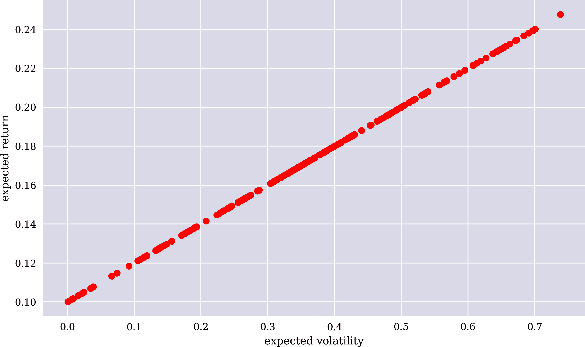
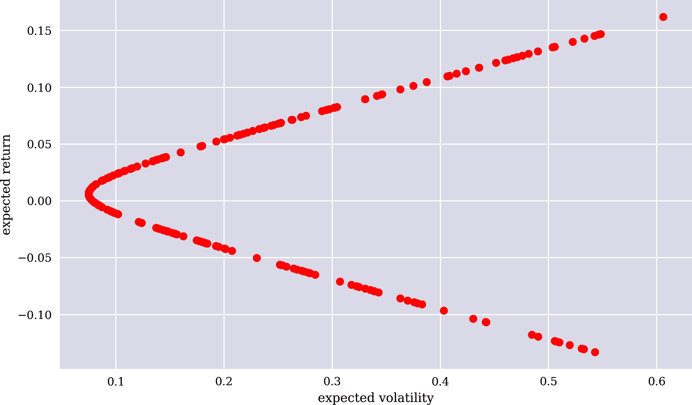
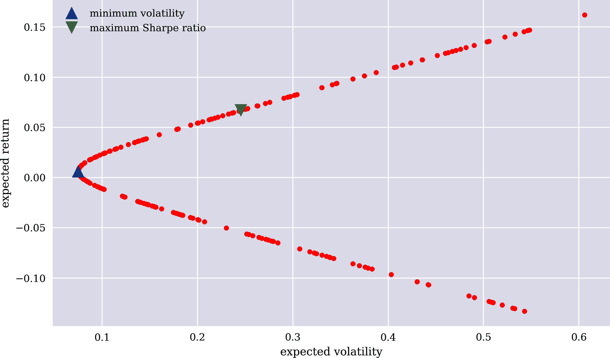
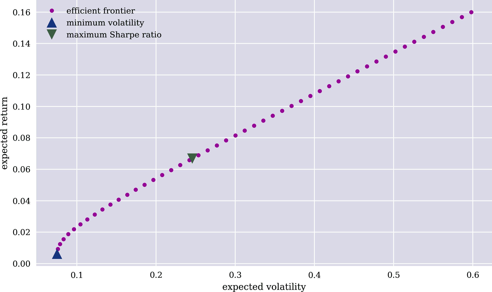
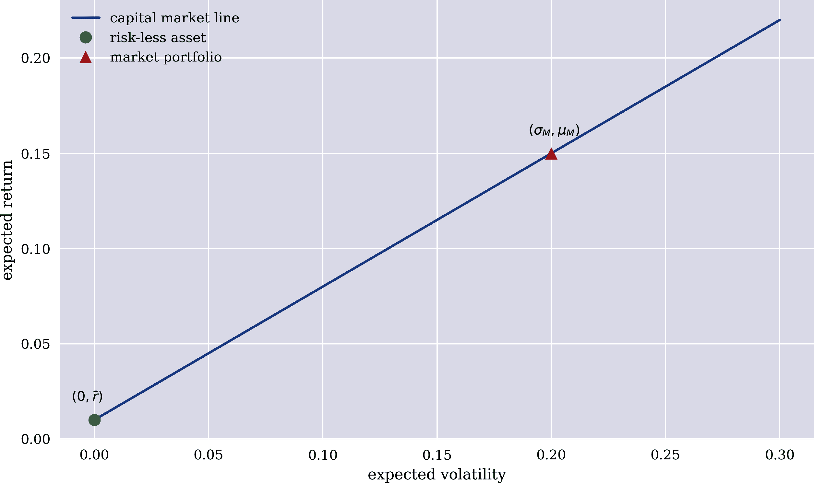
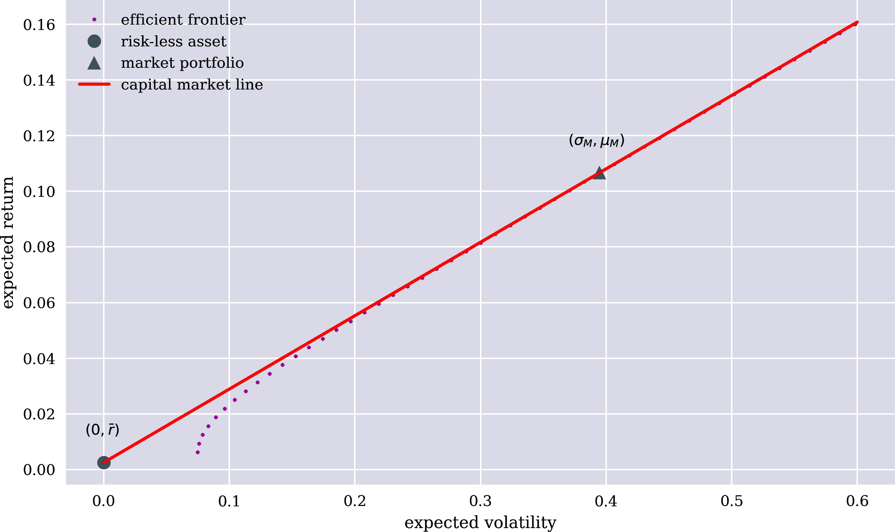
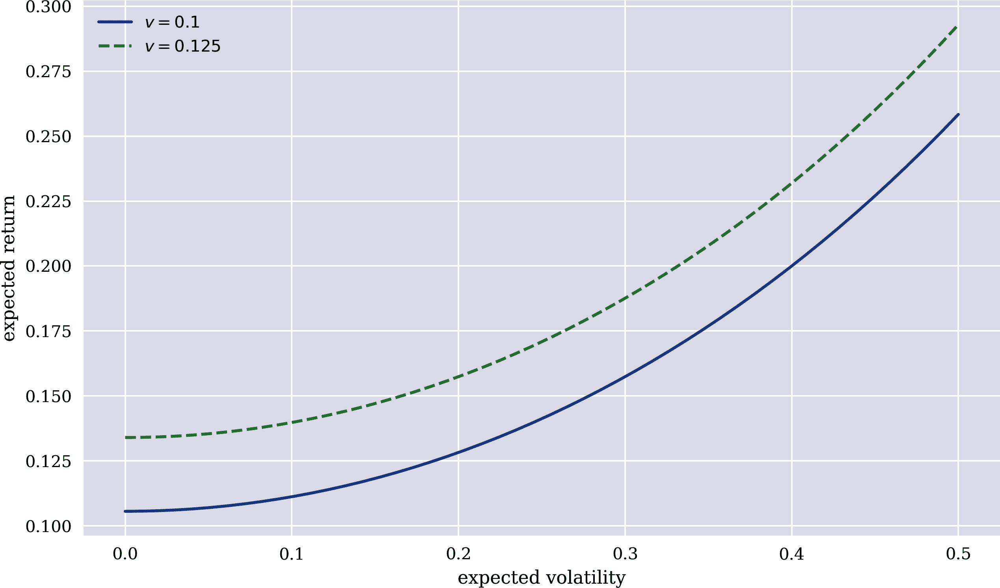
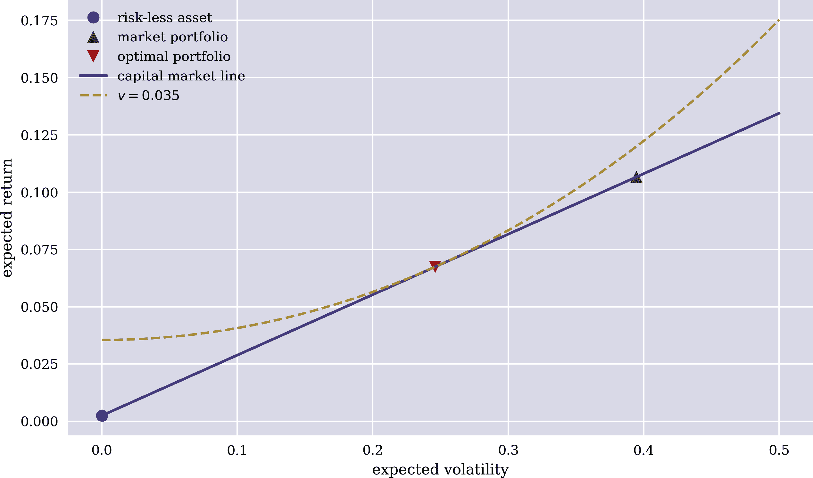

# 第三章 规范金融

> CAPM 基于许多不切实际的假设。例如，假设投资者只关心单期组合收益的均值和方差是极端的。
> 
> Eugene Fama 和 Kenneth French（2004）
> 
> 与基本粒子不同，涉及人类的科学更难以使用优雅的数学方法解决问题。
> 
> Alon Halevy 等（2009）

本章回顾了主要的规范金融理论和模型。简单来说，对于本书而言，*规范理论* 是基于假设（数学上的公理）并从相关假设中得出洞见、结果等的理论。另一方面，*实证理论* 则是基于观察、实验、数据、关系等，并根据可获得信息和得出的结果描述现象。Rubinstein（2006）详细讲述了本章所介绍的理论和模型的起源历史。

“不确定性和风险” 介绍了来自金融建模的中心概念，如不确定性、风险、交易资产等。“期望效用理论” 讨论了在不确定性下进行决策的主要经济范式：*期望效用理论*（EUT）。在其现代形式下，EUT 可追溯到 von Neumann 和 Morgenstern（1944）。“均值-方差组合理论” 根据 Markowitz（1952）介绍了均值-方差组合（MVP）理论。“资本资产定价模型” 分析了根据 Sharpe（1964）和 Lintner（1965）的*资本资产定价模型*（CAPM）。“套利定价理论” 概述了根据 Ross（1971, 1976）的*套利定价理论*（APT）。

本章的目的是以中心的规范金融理论形式为本书其余部分做铺垫。这一点很重要，因为几代经济学家、金融分析师、资产管理者、交易员、银行家、会计师和其他人员都接受过这些理论的培训。从这个意义上说，可以说金融作为理论和实践学科在很大程度上受到了这些理论的影响。

# 不确定性和风险

金融理论的核心是在不确定性和风险存在的情况下进行投资、交易和估值。本节在一定程度上正式介绍了与这些主题相关的中心概念。重点是从概率论中构建量化金融的基础概念。^(1)

## 定义

假设经济体仅在两个时间点观察活动：今天，<math alttext="t equals 0"><mrow><mi>t</mi> <mo>=</mo> <mn>0</mn></mrow></math> ，一年后，<math alttext="t equals 1"><mrow><mi>t</mi> <mo>=</mo> <mn>1</mn></mrow></math> 。本章后面讨论的财务理论在很大程度上基于这样一个*静态经济*。^(2)

在 <math alttext="t equals 0"><mrow><mi>t</mi> <mo>=</mo> <mn>0</mn></mrow></math> 时，完全没有任何不确定性。在 <math alttext="t equals 1"><mrow><mi>t</mi> <mo>=</mo> <mn>1</mn></mrow></math> 时，经济体可以处于有限数量 <math alttext="upper S"><mi>S</mi></math> 的可能状态 <math alttext="omega element-of normal upper Omega equals StartSet omega 1 comma omega 2 comma ellipsis comma omega Subscript upper S Baseline EndSet"><mrow><mi>ω</mi> <mo>∈</mo> <mi>Ω</mi> <mo>=</mo> <mo>{</mo> <msub><mi>ω</mi> <mn>1</mn></msub> <mo>,</mo> <msub><mi>ω</mi> <mn>2</mn></msub> <mo>,</mo> <mo>...</mo> <mo>,</mo> <msub><mi>ω</mi> <mi>S</mi></msub> <mo>}</mo></mrow></math> 。 <math alttext="normal upper Omega"><mi>Ω</mi></math> 被称为*状态空间*，其基数为 <math alttext="StartAbsoluteValue normal upper Omega EndAbsoluteValue equals upper S"><mrow><mo>|</mo> <mi>Ω</mi> <mo>|</mo> <mo>=</mo> <mi>S</mi></mrow></math>。

在 <math alttext="normal upper Omega"><mi>Ω</mi></math> 中的代数 <math alttext="script upper F"><mi>ℱ</mi></math> 是具有以下特征的集合族：

1.  <math alttext="normal upper Omega element-of script upper F"><mrow><mi>Ω</mi> <mo>∈</mo> <mi>ℱ</mi></mrow></math>

1.  <math alttext="double-struck upper E element-of script upper F right double arrow double-struck upper E Superscript c Baseline element-of script upper F"><mrow><mi>𝔼</mi> <mo>∈</mo> <mi>ℱ</mi> <mo>⇒</mo> <msup><mi>𝔼</mi> <mi>c</mi></msup> <mo>∈</mo> <mi>ℱ</mi></mrow></math>

1.  <math alttext="double-struck upper E 1 comma double-struck upper E 2 comma period period period comma double-struck upper E Subscript upper I Baseline element-of script upper F right double arrow union double-struck upper E Subscript i Baseline element-of script upper F"><mrow><msub><mi>𝔼</mi> <mn>1</mn></msub> <mo>,</mo> <msub><mi>𝔼</mi> <mn>2</mn></msub> <mo>,</mo> <mo>.</mo> <mo>.</mo> <mo>.</mo> <mo>,</mo> <msub><mi>𝔼</mi> <mi>I</mi></msub> <mo>∈</mo> <mi>ℱ</mi> <mo>⇒</mo> <msubsup><mo>∪</mo> <mrow><mi>i</mi><mo>=</mo><mn>1</mn></mrow> <mi>I</mi></msubsup> <msub><mi>𝔼</mi> <mi>i</mi></msub> <mo>∈</mo> <mi>ℱ</mi></mrow></math>

<math alttext="double-struck upper E Superscript c"><msup><mi>𝔼</mi> <mi>c</mi></msup></math> 表示集合 <math alttext="double-struck upper E"><mi>𝔼</mi></math> 的补集。幂集 <math alttext="normal script upper P left-parenthesis normal upper Omega right-parenthesis"><mrow><mi>℘</mi> <mo>(</mo> <mi>Ω</mi> <mo>)</mo></mrow></math> 是最大的代数结构，而集合 <math alttext="script upper F equals StartSet normal empty-set comma normal upper Omega EndSet"><mrow><mi>ℱ</mi> <mo>=</mo> <mo>{</mo> <mi>∅</mi> <mo>,</mo> <mi>Ω</mi> <mo>}</mo></mrow></math> 是 <math alttext="normal upper Omega"><mi>Ω</mi></math> 中最小的代数。代数是经济学中*可观察事件*的模型。在此背景下，经济体的单一状态 <math alttext="omega element-of normal upper Omega"><mrow><mi>ω</mi> <mo>∈</mo> <mi>Ω</mi></mrow></math> 可解释为*原子事件*。

*概率*将实数 <math alttext="0 less-than-or-equal-to p Subscript omega Baseline identical-to upper P left-parenthesis StartSet omega EndSet right-parenthesis less-than-or-equal-to 1"><mrow><mn>0</mn> <mo>≤</mo> <msub><mi>p</mi> <mi>ω</mi></msub> <mo>≡</mo> <mi>P</mi> <mrow><mo>(</mo> <mrow><mo>{</mo> <mi>ω</mi> <mo>}</mo></mrow> <mo>)</mo></mrow> <mo>≤</mo> <mn>1</mn></mrow></math> 分配给状态 <math alttext="omega element-of normal upper Omega"><mrow><mi>ω</mi> <mo>∈</mo> <mi>Ω</mi></mrow></math> 或实数 <math alttext="0 less-than-or-equal-to upper P left-parenthesis double-struck upper E double-struck right-parenthesis less-than-or-equal-to 1"><mrow><mn>0</mn> <mo>≤</mo> <mi>P</mi> <mo>(</mo> <mi>𝔼</mi> <mo>)</mo> <mo>≤</mo> <mn>1</mn></mrow></math> 分配给事件 <math alttext="double-struck upper E element-of script upper F"><mrow><mi>𝔼</mi> <mo>∈</mo> <mi>ℱ</mi></mrow></math>。如果所有状态的概率都已知，则有 <math alttext="upper P left-parenthesis double-struck upper E right-parenthesis equals sigma-summation Underscript omega element-of double-struck upper E Endscripts p Subscript omega"><mrow><mi>P</mi> <mrow><mo>(</mo> <mi>𝔼</mi> <mo>)</mo></mrow> <mo>=</mo> <msub><mo>∑</mo> <mrow><mi>ω</mi><mo>∈</mo><mi>𝔼</mi></mrow></msub> <msub><mi>p</mi> <mi>ω</mi></msub></mrow></math>。

*概率测度* <math alttext="upper P colon script upper F right-arrow left-bracket 0 comma 1 right-bracket"><mrow><mi>P</mi> <mo>:</mo> <mi>ℱ</mi> <mo>→</mo> <mo>[</mo> <mn>0</mn> <mo>,</mo> <mn>1</mn> <mo>]</mo></mrow></math> 具有以下特征：

1.  <math alttext="for-all double-struck upper E element-of script upper F colon upper P left-parenthesis double-struck upper E right-parenthesis greater-than-or-equal-to 0"><mrow><mo>∀</mo> <mi>𝔼</mi> <mo>∈</mo> <mi>ℱ</mi> <mo>:</mo> <mi>P</mi> <mo>(</mo> <mi>𝔼</mi> <mo>)</mo> <mo>≥</mo> <mn>0</mn></mrow></math>

1.  <math alttext="upper P left-parenthesis union double-struck upper E Subscript i Baseline right-parenthesis equals sigma-summation Underscript i equals 1 Overscript upper I Endscripts double-struck upper E Subscript i Baseline for disjoint sets double-struck upper E Subscript i Baseline element-of script upper F"><mrow><mi>P</mi> <mfenced separators="" open="(" close=")"><msubsup><mo>∪</mo> <mrow><mi>i</mi><mo>=</mo><mn>1</mn></mrow> <mi>I</mi></msubsup> <msub><mi>𝔼</mi> <mi>i</mi></msub></mfenced> <mo>=</mo> <msubsup><mo>∑</mo> <mrow><mi>i</mi><mo>=</mo><mn>1</mn></mrow> <mi>I</mi></msubsup> <msub><mi>𝔼</mi> <mi>i</mi></msub> <mtext>for</mtext> <mtext>disjoint</mtext> <mtext>sets</mtext> <msub><mi>𝔼</mi> <mi>i</mi></msub> <mo>∈</mo> <mi>ℱ</mi></mrow></math>

1.  <math alttext="upper P left-parenthesis normal upper Omega right-parenthesis equals 1"><mrow><mi>P</mi> <mo>(</mo> <mi>Ω</mi> <mo>)</mo> <mo>=</mo> <mn>1</mn></mrow></math>

三个元素 <math alttext="StartSet normal upper Omega comma script upper F comma upper P EndSet"><mrow><mo>{</mo> <mi>Ω</mi> <mo>,</mo> <mi>ℱ</mi> <mo>,</mo> <mi>P</mi> <mo>}</mo></mrow></math> 组成一个*概率空间*。概率空间是模型经济中*不确定性*的形式表示。如果概率测度 <math alttext="upper P"><mi>P</mi></math> 是固定的，经济处于*风险*状态。如果所有经济主体都知晓，则经济具有*对称信息*。

给定一个概率空间 <math alttext="StartSet normal upper Omega comma script upper F comma upper P EndSet"><mrow><mo>{</mo> <mi>Ω</mi> <mo>,</mo> <mi>ℱ</mi> <mo>,</mo> <mi>P</mi> <mo>}</mo></mrow></math>，一个*随机变量*是一个函数 <math alttext="upper S colon normal upper Omega right-arrow double-struck upper R Subscript plus Baseline comma omega right-arrow from bar upper S left-parenthesis omega right-parenthesis"><mrow><mi>S</mi> <mo>:</mo> <mi>Ω</mi> <mo>→</mo> <msub><mi>ℝ</mi> <mo>+</mo></msub> <mo>,</mo> <mi>ω</mi> <mo>↦</mo> <mi>S</mi> <mrow><mo>(</mo> <mi>ω</mi> <mo>)</mo></mrow></mrow></math>，是<math alttext="script upper F minus"><mrow><mi>ℱ</mi> <mo>-</mo></mrow></math> 可测的。这意味着对于每个 <math alttext="double-struck upper E element-of left-brace left-bracket a comma b left-bracket colon a comma b element-of double-struck upper R comma a less-than b right-brace"><mrow><mi>𝔼</mi> <mo>∈</mo> <mo>{</mo> <mo></mo> <mi>a</mi> <mo>,</mo> <mi>b</mi> <mo>[</mo> <mo>:</mo> <mi>a</mi> <mo>,</mo> <mi>b</mi> <mo>∈</mo> <mi>ℝ</mi> <mo>,</mo> <mi>a</mi> <mo><</mo> <mi>b</mi> <mo>}</mo></mrow></math>，有以下：

<math alttext="upper S Superscript negative 1 Baseline left-parenthesis double-struck upper E right-parenthesis identical-to StartSet omega element-of normal upper Omega colon upper S left-parenthesis omega right-parenthesis element-of double-struck upper E EndSet element-of script upper F" display="block"><mrow><msup><mi>S</mi> <mrow><mo>-</mo><mn>1</mn></mrow></msup> <mrow><mo>(</mo> <mi>𝔼</mi> <mo>)</mo></mrow> <mo>≡</mo> <mrow><mo>{</mo> <mi>ω</mi> <mo>∈</mo> <mi>Ω</mi> <mo>:</mo> <mi>S</mi> <mrow><mo>(</mo> <mi>ω</mi> <mo>)</mo></mrow> <mo>∈</mo> <mi>𝔼</mi> <mo>}</mo></mrow> <mo>∈</mo> <mi>ℱ</mi></mrow></math>

如果 <math alttext="script upper F identical-to normal script upper P left-parenthesis normal upper Omega right-parenthesis"><mrow><mi>ℱ</mi> <mo>≡</mo> <mi>℘</mi> <mo>(</mo> <mi>Ω</mi> <mo>)</mo></mrow></math> ，则随机变量的*期望*定义如下：

<math alttext="bold upper E Superscript upper P Baseline left-parenthesis upper S right-parenthesis equals sigma-summation Underscript omega element-of normal upper Omega Endscripts upper P left-parenthesis omega right-parenthesis dot upper S left-parenthesis omega right-parenthesis" display="block"><mrow><msup><mi>𝐄</mi> <mi>P</mi></msup> <mrow><mo>(</mo> <mi>S</mi> <mo>)</mo></mrow> <mo>=</mo> <munder><mo>∑</mo> <mrow><mi>ω</mi><mo>∈</mo><mi>Ω</mi></mrow></munder> <mi>P</mi> <mrow><mo>(</mo> <mi>ω</mi> <mo>)</mo></mrow> <mo>·</mo> <mi>S</mi> <mrow><mo>(</mo> <mi>ω</mi> <mo>)</mo></mrow></mrow></math>

否则，它由以下定义：

<math alttext="bold upper E Superscript upper P Baseline left-parenthesis upper S right-parenthesis equals sigma-summation Underscript double-struck upper E element-of script upper F Endscripts upper P left-parenthesis double-struck upper E right-parenthesis dot upper S left-parenthesis double-struck upper E right-parenthesis" display="block"><mrow><msup><mi>𝐄</mi> <mi>P</mi></msup> <mrow><mo>(</mo> <mi>S</mi> <mo>)</mo></mrow> <mo>=</mo> <munder><mo>∑</mo> <mrow><mi>𝔼</mi><mo>∈</mo><mi>ℱ</mi></mrow></munder> <mi>P</mi> <mrow><mo>(</mo> <mi>𝔼</mi> <mo>)</mo></mrow> <mo>·</mo> <mi>S</mi> <mrow><mo>(</mo> <mi>𝔼</mi> <mo>)</mo></mrow></mrow></math>

一般来说，金融经济被假定为*完美*。这意味着，除其他事项外，不存在交易成本，可用资产有固定价格并且数量无限，所有事情都发生在光速下，并且参与者拥有完全对称的信息。

## 数值示例

现在假设一个简单的*静态*经济在*风险* <math alttext="StartSet normal upper Omega comma script upper F comma upper P EndSet"><mrow><mo>{</mo> <mi>Ω</mi> <mo>,</mo> <mi>ℱ</mi> <mo>,</mo> <mi>P</mi> <mo>}</mo></mrow></math> 下，并且符合以下条件：

1.  <math alttext="normal upper Omega identical-to StartSet u comma d EndSet"><mrow><mi>Ω</mi> <mo>≡</mo> <mo>{</mo> <mi>u</mi> <mo>,</mo> <mi>d</mi> <mo>}</mo></mrow></math>

1.  <math alttext="script upper F identical-to normal script upper P left-parenthesis normal upper Omega right-parenthesis"><mrow><mi>ℱ</mi> <mo>≡</mo> <mi>℘</mi> <mo>(</mo> <mi>Ω</mi> <mo>)</mo></mrow></math>

1.  <math alttext="upper P identical-to StartSet upper P left-parenthesis StartSet u EndSet right-parenthesis equals one-half comma upper P left-parenthesis StartSet d EndSet right-parenthesis equals one-half EndSet"><mrow><mi>P</mi> <mo>≡</mo> <mo>{</mo> <mi>P</mi> <mrow><mo>(</mo> <mrow><mo>{</mo> <mi>u</mi> <mo>}</mo></mrow> <mo>)</mo></mrow> <mo>=</mo> <mfrac><mn>1</mn> <mn>2</mn></mfrac> <mo>,</mo> <mi>P</mi> <mrow><mo>(</mo> <mrow><mo>{</mo> <mi>d</mi> <mo>}</mo></mrow> <mo>)</mo></mrow> <mo>=</mo> <mfrac><mn>1</mn> <mn>2</mn></mfrac> <mo>}</mo></mrow></math>

### 交易资产

在经济中，有两种资产在交易。第一种是风险资产，*股票*，今天的某一固定价格为 <math alttext="upper S 0 equals 10"><mrow><msub><mi>S</mi> <mn>0</mn></msub> <mo>=</mo> <mn>10</mn></mrow></math>，而明天的不确定回报则是一个随机变量：

<math alttext="upper S 1 equals StartLayout Enlarged left-brace 1st Row 1st Column upper S 1 Superscript u Baseline equals 20 2nd Column if omega equals u 2nd Row 1st Column upper S 1 Superscript d Baseline equals 5 2nd Column if omega equals d EndLayout" display="block"><mrow><msub><mi>S</mi> <mn>1</mn></msub> <mo>=</mo> <mfenced separators="" open="{" close=""><mtable><mtr><mtd columnalign="left"><mrow><msubsup><mi>S</mi> <mn>1</mn> <mi>u</mi></msubsup> <mo>=</mo> <mn>20</mn></mrow></mtd> <mtd columnalign="left"><mrow><mtext>if</mtext> <mi>ω</mi> <mo>=</mo> <mi>u</mi></mrow></mtd></mtr> <mtr><mtd columnalign="left"><mrow><msubsup><mi>S</mi> <mn>1</mn> <mi>d</mi></msubsup> <mo>=</mo> <mn>5</mn></mrow></mtd> <mtd columnalign="left"><mrow><mtext>if</mtext> <mi>ω</mi> <mo>=</mo> <mi>d</mi></mrow></mtd></mtr></mtable></mfenced></mrow></math>

第二种是无风险资产，*债券*，今天的某一固定价格为 <math alttext="upper B 0 equals 10"><mrow><msub><mi>B</mi> <mn>0</mn></msub> <mo>=</mo> <mn>10</mn></mrow></math>，而明天的确定回报如下：

<math alttext="upper B 1 equals StartLayout Enlarged left-brace 1st Row 1st Column upper B 1 Superscript u Baseline equals 11 2nd Column if omega equals u 2nd Row 1st Column upper B 1 Superscript d Baseline equals 11 2nd Column if omega equals d EndLayout" display="block"><mrow><msub><mi>B</mi> <mn>1</mn></msub> <mo>=</mo> <mfenced separators="" open="{" close=""><mtable><mtr><mtd columnalign="left"><mrow><msubsup><mi>B</mi> <mn>1</mn> <mi>u</mi></msubsup> <mo>=</mo> <mn>11</mn></mrow></mtd> <mtd columnalign="left"><mrow><mtext>if</mtext> <mi>ω</mi> <mo>=</mo> <mi>u</mi></mrow></mtd></mtr> <mtr><mtd columnalign="left"><mrow><msubsup><mi>B</mi> <mn>1</mn> <mi>d</mi></msubsup> <mo>=</mo> <mn>11</mn></mrow></mtd> <mtd columnalign="left"><mrow><mtext>if</mtext> <mi>ω</mi> <mo>=</mo> <mi>d</mi></mrow></mtd></mtr></mtable></mfenced></mrow></math>

形式上，模型经济可以写成 <math alttext="script upper M squared equals left-parenthesis StartSet normal upper Omega comma script upper F comma upper P EndSet comma double-struck upper A right-parenthesis"><mrow><msup><mi>ℳ</mi> <mn mathvariant="script">2</mn></msup> <mo>=</mo> <mrow><mo>(</mo> <mrow><mo>{</mo> <mi>Ω</mi> <mo>,</mo> <mi>ℱ</mi> <mo>,</mo> <mi>P</mi> <mo>}</mo></mrow> <mo>,</mo> <mi>𝔸</mi> <mo>)</mo></mrow></mrow></math> ，其中 <math alttext="double-struck upper A"><mi>𝔸</mi></math> 表示今天的价格向量 <math alttext="upper M 0 equals left-parenthesis upper S 0 comma upper B 0 right-parenthesis Superscript upper T"><mrow><msub><mi>M</mi> <mn>0</mn></msub> <mo>=</mo> <msup><mrow><mo>(</mo><msub><mi>S</mi> <mn>0</mn></msub> <mo>,</mo><msub><mi>B</mi> <mn>0</mn></msub> <mo>)</mo></mrow> <mi>T</mi></msup></mrow></math> ，明天的市场支付矩阵如下：

<math alttext="upper M 1 equals Start 2 By 2 Matrix 1st Row 1st Column upper S 1 Superscript u Baseline 2nd Column upper B 1 Superscript u Baseline 2nd Row 1st Column upper S 1 Superscript d Baseline 2nd Column upper B 1 Superscript d EndMatrix" display="block"><mrow><msub><mi>M</mi> <mn>1</mn></msub> <mo>=</mo> <mfenced separators="" open="(" close=")"><mtable><mtr><mtd><msubsup><mi>S</mi> <mn>1</mn> <mi>u</mi></msubsup></mtd> <mtd><msubsup><mi>B</mi> <mn>1</mn> <mi>u</mi></msubsup></mtd></mtr> <mtr><mtd><msubsup><mi>S</mi> <mn>1</mn> <mi>d</mi></msubsup></mtd> <mtd><msubsup><mi>B</mi> <mn>1</mn> <mi>d</mi></msubsup></mtd></mtr></mtable></mfenced></mrow></math>

### 套利定价

在这样的经济环境中，例如可以解决如何计算股票的欧式看涨期权的公平价值，行权价为 <math alttext="upper K equals"><mrow><mi>K</mi> <mo>=</mo></mrow></math> 14.5\. 欧式看涨期权的无套利价值 <math alttext="upper C 0"><msub><mi>C</mi> <mn>0</mn></msub></math> 是通过一个由股票和债券组成的投资组合 <math alttext="upper C 1"><msub><mi>C</mi> <mn>1</mn></msub></math> 复制期权的支付 <math alttext="phi"><mi>ϕ</mi></math> 来确定的。复制投资组合的价格也必须等于欧式看涨期权的价格。否则，将可能存在（无限）套利利润。在 Python 中，利用这样的复制论证很容易实现:^([3)

```py
In [1]: import numpy as np

In [2]: S0 = 10  
        B0 = 10  

In [3]: S1 = np.array((20, 5))  
        B1 = np.array((11, 11))  

In [4]: M0 = np.array((S0, B0)) 
        M0  
Out[4]: array([10, 10])

In [5]: M1 = np.array((S1, B1)).T  
        M1  
Out[5]: array([[20, 11],
               [ 5, 11]])

In [6]: K = 14.5  

In [7]: C1 = np.maximum(S1 - K, 0) 
        C1  
Out[7]: array([5.5, 0. ])

In [8]: phi = np.linalg.solve(M1, C1)  
        phi  
Out[8]: array([ 0.36666667, -0.16666667])

In [9]: np.allclose(C1, np.dot(M1, phi))  
Out[9]: True

In [10]: C0 = np.dot(M0, phi)  
         C0  
Out[10]: 2.0
```


今天的股票和债券价格。


明天股票和债券的不确定支付。


市场价格向量。


市场支付矩阵。


期权的行权价。


期权的不确定支付。


复制投资组合 <math alttext="phi"><mi>ϕ</mi></math> 。


检查其支付是否与期权的支付相同。


复制投资组合的价格即为期权的无套利价格。

# 套利定价

正如前面的例子所示，套利定价理论可以被认为是具有一些最强大数学结果之一的金融理论，例如*资产定价的基本定理（FTAP）*。^(4) 其中一个原因是，例如期权的价格可以从其他可观察的市场参数推导出来，比如期权所涉及的股票的股价。在这种意义上，套利定价不关心如何首先提出公平的股票价格，而只是将其作为输入。因此，套利定价已经使用了少量且温和的假设，比如*无套利*，而这在许多其他金融理论中并非如此。请注意，甚至概率测度也不用来推导套利价格。

# 预期效用理论

预期效用理论（EUT）是金融理论的基石之一。自 1940 年代制定以来，它一直是建模不确定情况下决策制定的中心范式之一。^(5) 基本上每本介绍金融理论和投资理论的入门教材都介绍了 EUT。其中一个原因是金融中的其他核心结果可以从 EUT 范式中推导出来。

## 假设和结果

EUT 是一种公理化理论，可以追溯到冯·诺依曼和莫根斯特恩（1944 年）的开创性工作。*公理化*在这里意味着理论的主要结果可以仅从少数公理推导出来。关于公理化效用理论、不同变体和应用的综述，请参阅费什本（1968 年）。

### 公理和规范理论

在[Wolfram MathWorld](https://oreil.ly/pZqal)上，您可以找到*公理*的以下定义：“公理是被视为不需证明而显然成立的命题。”

EUT 通常基于与代理人在面对不确定选择时的*偏好*相关的少数主要公理。尽管公理的定义可能暗示了其他情况，但并非所有经济学家都认为所有公理都是“不需证明而显然成立的”。

冯·诺依曼和莫根斯特恩（1944 年，第 25 页）就公理的选择发表评论：

> 公理的选择并非纯粹客观的任务。通常希望从公理中得出某些明确的目标——可以从公理中推导出一些具体的定理或定理——在这个意义上，问题是确切和客观的。但除此之外，总会有其他重要但不太确切的愿望：公理不应过于繁多，它们的体系应尽可能简单和透明，并且每个公理应具有直观的意义，可以直接判断其适用性。

在这个意义上，一组公理构成了(部分)被该理论建模的世界的*规范理论*。这组公理收集了应该事先满足而不是通过某些形式证明或类似方式得到的最小假设。在列出导致期望效用理论的一组公理之前，这里先谈谈代理的偏好本身，正式地<math alttext="succeeds-above-single-line-equals"><mo>⪰</mo></math>，当面对不确定性选择时。

### 代理的偏好

假设一个具有偏好<math alttext="succeeds-above-single-line-equals"><mo>⪰</mo></math>的代理面临投资于模型经济的两种交易资产<math alttext="script upper M squared"><msup><mi>ℳ</mi> <mn mathvariant="script">2</mn></msup></math>的问题。例如，代理可以选择在未来支付<math alttext="upper A equals phi Subscript upper A Baseline dot upper M 1"><mrow><mi>A</mi> <mo>=</mo> <msub><mi>ϕ</mi> <mi>A</mi></msub> <mo>·</mo> <msub><mi>M</mi> <mn>1</mn></msub></mrow></math>的投资组合<math alttext="phi Subscript upper A"><msub><mi>ϕ</mi> <mi>A</mi></msub></math>或在未来支付<math alttext="upper B equals phi Subscript upper B Baseline dot upper M 1"><mrow><mi>B</mi> <mo>=</mo> <msub><mi>ϕ</mi> <mi>B</mi></msub> <mo>·</mo> <msub><mi>M</mi> <mn>1</mn></msub></mrow></math>的投资组合<math alttext="phi Subscript upper B"><msub><mi>ϕ</mi> <mi>B</mi></msub></math>之间进行选择。假定代理的偏好<math alttext="succeeds-above-single-line-equals"><mo>⪰</mo></math>是定义在未来支付上而不是在投资组合上的。如果代理（强烈地）更喜欢支付<math alttext="upper A"><mi>A</mi></math>而不是<math alttext="upper B"><mi>B</mi></math>，则写作<math alttext="upper A succeeds upper B"><mrow><mi>A</mi> <mo>≻</mo> <mi>B</mi></mrow></math>，在另一种情况下写作<math alttext="upper A precedes upper B"><mrow><mi>A</mi> <mo>≺</mo> <mi>B</mi></mrow></math>。如果代理对这两个支付持中立态度，则写作<math alttext="upper A tilde upper B"><mrow><mi>A</mi> <mo>∼</mo> <mi>B</mi></mrow></math>。鉴于这些描述，导致期望效用理论的一组可能公理如下：

完备性

代理能够相对排列*所有*的支付。以下情况必须成立之一：<math alttext="upper A succeeds upper B"><mrow><mi>A</mi> <mo>≻</mo> <mi>B</mi></mrow></math>，<math alttext="upper A precedes upper B"><mrow><mi>A</mi> <mo>≺</mo> <mi>B</mi></mrow></math>，或<math alttext="upper A tilde upper B"><mrow><mi>A</mi> <mo>∼</mo> <mi>B</mi></mrow></math>。

传递性

如果有第三个投资组合 <math alttext="phi Subscript upper C"><msub><mi>ϕ</mi> <mi>C</mi></msub></math> ，未来收益为 <math alttext="upper C equals phi Subscript upper C Baseline dot upper M 1"><mrow><mi>C</mi> <mo>=</mo> <msub><mi>ϕ</mi> <mi>C</mi></msub> <mo>·</mo> <msub><mi>M</mi> <mn>1</mn></msub></mrow></math> ，则从 <math alttext="upper A succeeds upper B"><mrow><mi>A</mi> <mo>≻</mo> <mi>B</mi></mrow></math> 和 <math alttext="upper B succeeds upper C"><mrow><mi>B</mi> <mo>≻</mo> <mi>C</mi></mrow></math> 可得 <math alttext="upper A succeeds upper C"><mrow><mi>A</mi> <mo>≻</mo> <mi>C</mi></mrow></math> 。

连续性

如果 <math alttext="upper A succeeds upper B succeeds upper C"><mrow><mi>A</mi> <mo>≻</mo> <mi>B</mi> <mo>≻</mo> <mi>C</mi></mrow></math> ，那么存在一个数 <math alttext="alpha element-of left-bracket 0 comma 1 right-bracket"><mrow><mi>α</mi> <mo>∈</mo> <mo>[</mo> <mn>0</mn> <mo>,</mo> <mn>1</mn> <mo>]</mo></mrow></math> ，使得 <math alttext="upper B tilde alpha upper A plus left-parenthesis 1 minus alpha right-parenthesis upper C"><mrow><mi>B</mi> <mo>∼</mo> <mi>α</mi> <mi>A</mi> <mo>+</mo> <mo>(</mo> <mn>1</mn> <mo>-</mo> <mi>α</mi> <mo>)</mo> <mi>C</mi></mrow></math> 。

独立性

从 <math alttext="upper A tilde upper B"><mrow><mi>A</mi> <mo>∼</mo> <mi>B</mi></mrow></math> 可得 <math alttext="alpha upper A plus left-parenthesis 1 minus alpha right-parenthesis upper C tilde alpha upper B plus left-parenthesis 1 minus alpha right-parenthesis upper C"><mrow><mi>α</mi> <mi>A</mi> <mo>+</mo> <mo>(</mo> <mn>1</mn> <mo>-</mo> <mi>α</mi> <mo>)</mo> <mi>C</mi> <mo>∼</mo> <mi>α</mi> <mi>B</mi> <mo>+</mo> <mo>(</mo> <mn>1</mn> <mo>-</mo> <mi>α</mi> <mo>)</mo> <mi>C</mi></mrow></math> 。同样地，从 <math alttext="upper A succeeds upper B"><mrow><mi>A</mi> <mo>≻</mo> <mi>B</mi></mrow></math> 可得 <math alttext="alpha upper A plus left-parenthesis 1 minus alpha right-parenthesis upper C succeeds alpha upper B plus left-parenthesis 1 minus alpha right-parenthesis upper C"><mrow><mi>α</mi> <mi>A</mi> <mo>+</mo> <mo>(</mo> <mn>1</mn> <mo>-</mo> <mi>α</mi> <mo>)</mo> <mi>C</mi> <mo>≻</mo> <mi>α</mi> <mi>B</mi> <mo>+</mo> <mo>(</mo> <mn>1</mn> <mo>-</mo> <mi>α</mi> <mo>)</mo> <mi>C</mi></mrow></math> 。

优势

如果 <math alttext="upper C 1 equals alpha 1 upper A plus left-parenthesis 1 minus alpha 1 right-parenthesis upper C"><mrow><msub><mi>C</mi> <mn>1</mn></msub> <mo>=</mo> <msub><mi>α</mi> <mn>1</mn></msub> <mi>A</mi> <mo>+</mo> <mrow><mo>(</mo> <mn>1</mn> <mo>-</mo> <msub><mi>α</mi> <mn>1</mn></msub> <mo>)</mo></mrow> <mi>C</mi></mrow></math> 和 <math alttext="upper C 2 equals alpha 2 upper A plus left-parenthesis 1 minus alpha 2 right-parenthesis upper C"><mrow><msub><mi>C</mi> <mn>2</mn></msub> <mo>=</mo> <msub><mi>α</mi> <mn>2</mn></msub> <mi>A</mi> <mo>+</mo> <mrow><mo>(</mo> <mn>1</mn> <mo>-</mo> <msub><mi>α</mi> <mn>2</mn></msub> <mo>)</mo></mrow> <mi>C</mi></mrow></math> ，由此可得 <math alttext="upper A succeeds upper C"><mrow><mi>A</mi> <mo>≻</mo> <mi>C</mi></mrow></math> 和 <math alttext="upper C 1 succeeds upper C 2"><mrow><msub><mi>C</mi> <mn>1</mn></msub> <mo>≻</mo> <msub><mi>C</mi> <mn>2</mn></msub></mrow></math> ，则 <math alttext="alpha 1 greater-than alpha 2"><mrow><msub><mi>α</mi> <mn>1</mn></msub> <mo>></mo> <msub><mi>α</mi> <mn>2</mn></msub></mrow></math> 。

### 实用函数

实用函数是以数学和数值方式表示代理人偏好 <math alttext="succeeds-above-single-line-equals"><mo>⪰</mo></math> 的一种方法，该函数为某种回报分配数值。在这种情况下，绝对值并不重要，而是由这些值引发的排序才是关键。^(6) 假设 <math alttext="double-struck upper X"><mi>𝕏</mi></math> 表示代理人可以表达偏好的所有可能回报。则实用函数 <math alttext="upper U"><mi>U</mi></math> 定义如下：

<math alttext="upper U colon double-struck upper X right-arrow double-struck upper R Subscript plus Baseline comma x right-arrow from bar upper U left-parenthesis x right-parenthesis" display="block"><mrow><mi>U</mi> <mo>:</mo> <mi>𝕏</mi> <mo>→</mo> <msub><mi>ℝ</mi> <mo>+</mo></msub> <mo>,</mo> <mi>x</mi> <mo>↦</mo> <mi>U</mi> <mrow><mo>(</mo> <mi>x</mi> <mo>)</mo></mrow></mrow></math>

如果 <math alttext="upper U"><mi>U</mi></math> 表示一个代理人的偏好 <math alttext="succeeds-above-single-line-equals"><mo>⪰</mo></math> ，那么以下关系成立：

<math alttext="StartLayout 1st Row 1st Column upper A succeeds upper B right double arrow upper U left-parenthesis upper A right-parenthesis greater-than upper U left-parenthesis upper B right-parenthesis 2nd Column left-parenthesis strongly prefers right-parenthesis 2nd Row 1st Column upper A succeeds-above-single-line-equals upper B right double arrow upper U left-parenthesis upper A right-parenthesis greater-than-or-equal-to upper U left-parenthesis upper B right-parenthesis 2nd Column left-parenthesis weakly prefers right-parenthesis 3rd Row 1st Column upper A precedes upper B right double arrow upper U left-parenthesis upper A right-parenthesis less-than upper U left-parenthesis upper B right-parenthesis 2nd Column left-parenthesis strongly does not prefer right-parenthesis 4th Row 1st Column upper A precedes-above-single-line-equals upper B right double arrow upper U left-parenthesis upper A right-parenthesis less-than-or-equal-to upper U left-parenthesis upper B right-parenthesis 2nd Column left-parenthesis weakly does not prefer right-parenthesis 5th Row 1st Column upper A tilde upper B right double arrow upper U left-parenthesis upper A right-parenthesis equals upper U left-parenthesis upper B right-parenthesis 2nd Column left-parenthesis is indifferent right-parenthesis EndLayout" display="block"><mtable><mtr><mtd><mrow><mi>A</mi> <mo>≻</mo> <mi>B</mi> <mo>⇒</mo> <mi>U</mi> <mo>(</mo> <mi>A</mi> <mo>)</mo> <mo>></mo> <mi>U</mi> <mo>(</mo> <mi>B</mi> <mo>)</mo></mrow></mtd> <mtd><mrow><mtext>(strongly</mtext> <mtext>prefers)</mtext></mrow></mtd></mtr> <mtr><mtd><mrow><mi>A</mi> <mo>⪰</mo> <mi>B</mi> <mo>⇒</mo> <mi>U</mi> <mo>(</mo> <mi>A</mi> <mo>)</mo> <mo>≥</mo> <mi>U</mi> <mo>(</mo> <mi>B</mi> <mo>)</mo></mrow></mtd> <mtd><mrow><mtext>(weakly</mtext> <mtext>prefers)</mtext></mrow></mtd></mtr> <mtr><mtd><mrow><mi>A</mi> <mo>≺</mo> <mi>B</mi> <mo>⇒</mo> <mi>U</mi> <mo>(</mo> <mi>A</mi> <mo>)</mo> <mo><</mo> <mi>U</mi> <mo>(</mo> <mi>B</mi> <mo>)</mo></mrow></mtd> <mtd><mrow><mtext>(strongly</mtext> <mtext>does</mtext> <mtext>not</mtext> <mtext>prefer)</mtext></mrow></mtd></mtr> <mtr><mtd><mrow><mi>A</mi> <mo>⪯</mo> <mi>B</mi> <mo>⇒</mo> <mi>U</mi> <mo>(</mo> <mi>A</mi> <mo>)</mo> <mo>≤</mo> <mi>U</mi> <mo>(</mo> <mi>B</mi> <mo>)</mo></mrow></mtd> <mtd><mrow><mtext>(weakly</mtext> <mtext>does</mtext> <mtext>not</mtext> <mtext>prefer)</mtext></mrow></mtd></mtr> <mtr><mtd><mrow><mi>A</mi> <mo>∼</mo> <mi>B</mi> <mo>⇒</mo> <mi>U</mi> <mo>(</mo> <mi>A</mi> <mo>)</mo> <mo>=</mo> <mi>U</mi> <mo>(</mo> <mi>B</mi> <mo>)</mo></mrow></mtd> <mtd><mrow><mtext>(is</mtext> <mtext>indifferent)</mtext></mrow></mtd></mtr></mtable></math>

实用函数 <math alttext="upper U"><mi>U</mi></math> 仅确定到正线性变换。因此，如果 <math alttext="upper U"><mi>U</mi></math> 表示偏好 <math alttext="succeeds-above-single-line-equals"><mo>⪰</mo></math> ，那么 <math alttext="upper V equals a plus b upper U"><mrow><mi>V</mi> <mo>=</mo> <mi>a</mi> <mo>+</mo> <mi>b</mi> <mi>U</mi></mrow></math> ，其中 <math alttext="a comma b greater-than 0"><mrow><mi>a</mi> <mo>,</mo> <mi>b</mi> <mo>></mo> <mn>0</mn></mrow></math> 也如此。关于实用函数，冯·诺伊曼和莫根斯特恩（1944，第 25 页）总结如下：“因此我们看到：如果这样的实用度数值化确实存在的话，那么它就是在一线性变换下的确定。也就是说，实用度是一个数，它们之间只相差一个线性变换。”

### 预期实用函数

冯·诺伊曼和莫根斯特恩（1944）表明，如果一个代理人的偏好 <math alttext="succeeds-above-single-line-equals"><mo>⪰</mo></math> 满足前述五条公理，则存在一个*期望效用函数*，其形式为：

<math alttext="upper U colon double-struck upper X right-arrow double-struck upper R Subscript plus Baseline comma x right-arrow from bar bold upper E Superscript upper P Baseline left-parenthesis u left-parenthesis x right-parenthesis right-parenthesis equals sigma-summation Underscript omega Overscript normal upper Omega Endscripts upper P left-parenthesis omega right-parenthesis u left-parenthesis x left-parenthesis omega right-parenthesis right-parenthesis" display="block"><mrow><mi>U</mi> <mo>:</mo> <mi>𝕏</mi> <mo>→</mo> <msub><mi>ℝ</mi> <mo>+</mo></msub> <mo>,</mo> <mi>x</mi> <mo>↦</mo> <msup><mi>𝐄</mi> <mi>P</mi></msup> <mrow><mo>(</mo> <mi>u</mi> <mrow><mo>(</mo> <mi>x</mi> <mo>)</mo></mrow> <mo>)</mo></mrow> <mo>=</mo> <munderover><mo>∑</mo> <mrow><mi>ω</mi></mrow> <mi>Ω</mi></munderover> <mi>P</mi> <mrow><mo>(</mo> <mi>ω</mi> <mo>)</mo></mrow> <mi>u</mi> <mrow><mo>(</mo> <mi>x</mi> <mrow><mo>(</mo> <mi>ω</mi> <mo>)</mo></mrow> <mo>)</mo></mrow></mrow></math>

在这里，<math alttext="u colon double-struck upper R right-arrow double-struck upper R comma x right-arrow from bar u left-parenthesis x right-parenthesis"><mrow><mi>u</mi> <mo>:</mo> <mi>ℝ</mi> <mo>→</mo> <mi>ℝ</mi> <mo>,</mo> <mi>x</mi> <mo>↦</mo> <mi>u</mi> <mo>(</mo> <mi>x</mi> <mo>)</mo></mrow></math> 是一个单调递增且与状态无关的函数，通常称为*伯努利效用*，如 <math alttext="u left-parenthesis x right-parenthesis equals ln left-parenthesis x right-parenthesis comma u left-parenthesis x right-parenthesis equals x"><mrow><mi>u</mi> <mo>(</mo> <mi>x</mi> <mo>)</mo> <mo>=</mo> <mo form="prefix">ln</mo> <mo>(</mo> <mi>x</mi> <mo>)</mo> <mo>,</mo> <mi>u</mi> <mo>(</mo> <mi>x</mi> <mo>)</mo> <mo>=</mo> <mi>x</mi></mrow></math> ，或 <math alttext="u left-parenthesis x right-parenthesis equals x squared"><mrow><mi>u</mi> <mrow><mo>(</mo> <mi>x</mi> <mo>)</mo></mrow> <mo>=</mo> <msup><mi>x</mi> <mn>2</mn></msup></mrow></math> 。

简言之，期望效用函数 <math alttext="upper U"><mi>U</mi></math> 首先将某一状态下的支付 <math alttext="x left-parenthesis omega right-parenthesis"><mrow><mi>x</mi> <mo>(</mo> <mi>ω</mi> <mo>)</mo></mrow></math> 应用于函数 <math alttext="u"><mi>u</mi></math> ，然后使用给定状态发生的概率 <math alttext="upper P left-parenthesis omega right-parenthesis"><mrow><mi>P</mi> <mo>(</mo> <mi>ω</mi> <mo>)</mo></mrow></math> 来加权单个效用。在线性伯努利效用的特殊情况下 <math alttext="u left-parenthesis x right-parenthesis equals x"><mrow><mi>u</mi> <mo>(</mo> <mi>x</mi> <mo>)</mo> <mo>=</mo> <mi>x</mi></mrow></math> ，期望效用简单地是状态依赖支付的期望值，<math alttext="upper U left-parenthesis x right-parenthesis equals bold upper E Superscript upper P Baseline left-parenthesis x right-parenthesis"><mrow><mi>U</mi> <mrow><mo>(</mo> <mi>x</mi> <mo>)</mo></mrow> <mo>=</mo> <msup><mi>𝐄</mi> <mi>P</mi></msup> <mrow><mo>(</mo> <mi>x</mi> <mo>)</mo></mrow></mrow></math> 。

### 风险厌恶

在金融领域，*风险厌恶*的概念非常重要。最常用的风险厌恶度量是*绝对风险厌恶*（ARA）的阿罗-普拉特度量，该度量可以追溯到普拉特（1964）。假设代理人的状态无关伯努利效用函数为 <math alttext="u left-parenthesis x right-parenthesis"><mrow><mi>u</mi> <mo>(</mo> <mi>x</mi> <mo>)</mo></mrow></math> ，则 ARA 的阿罗-普拉特度量由以下定义：

<math alttext="upper A upper R upper A left-parenthesis x right-parenthesis equals minus StartFraction u double-prime left-parenthesis x right-parenthesis Over u prime left-parenthesis x right-parenthesis EndFraction comma x greater-than-or-equal-to 0" display="block"><mrow><mi>A</mi> <mi>R</mi> <mi>A</mi> <mrow><mo>(</mo> <mi>x</mi> <mo>)</mo></mrow> <mo>=</mo> <mo>-</mo> <mfrac><mrow><msup><mi>u</mi> <mrow><mo>'</mo><mo>'</mo></mrow></msup> <mrow><mo>(</mo><mi>x</mi><mo>)</mo></mrow></mrow> <mrow><msup><mi>u</mi> <mo>'</mo></msup> <mrow><mo>(</mo><mi>x</mi><mo>)</mo></mrow></mrow></mfrac> <mo>,</mo> <mi>x</mi> <mo>≥</mo> <mn>0</mn></mrow></math>

根据此度量标准，可以区分以下三种情况：

<math alttext="upper A upper R upper A left-parenthesis x right-parenthesis equals minus StartFraction u double-prime left-parenthesis x right-parenthesis Over u prime left-parenthesis x right-parenthesis EndFraction StartLayout Enlarged left-brace 1st Row 1st Column Blank 2nd Column greater-than 3rd Column 0 4th Column risk hyphen averse 2nd Row 1st Column Blank 2nd Column equals 3rd Column 0 4th Column risk hyphen neutral 3rd Row 1st Column Blank 2nd Column less-than 3rd Column 0 4th Column risk hyphen loving EndLayout" display="block"><mrow><mi>A</mi> <mi>R</mi> <mi>A</mi> <mrow><mo>(</mo> <mi>x</mi> <mo>)</mo></mrow> <mo>=</mo> <mo>-</mo> <mfrac><mrow><msup><mi>u</mi> <mrow><mo>'</mo><mo>'</mo></mrow></msup> <mrow><mo>(</mo><mi>x</mi><mo>)</mo></mrow></mrow> <mrow><msup><mi>u</mi> <mo>'</mo></msup> <mrow><mo>(</mo><mi>x</mi><mo>)</mo></mrow></mrow></mfrac> <mfenced separators="" open="{" close=""><mtable><mtr><mtd columnalign="left"><mo>></mo></mtd> <mtd><mn>0</mn></mtd> <mtd><mtext>risk-averse</mtext></mtd></mtr> <mtr><mtd columnalign="left"><mo>=</mo></mtd> <mtd><mn>0</mn></mtd> <mtd><mtext>risk-neutral</mtext></mtd></mtr> <mtr><mtd columnalign="left"><mo><</mo></mtd> <mtd><mn>0</mn></mtd> <mtd><mtext>risk-loving</mtext></mtd></mtr></mtable></mfenced></mrow></math>

在金融理论和模型中，通常假设风险规避和风险中立是适当的情形。在赌博中，也可能存在风险爱好者。

考虑之前提到的三个伯努利函数：<math alttext="u left-parenthesis x right-parenthesis equals ln left-parenthesis x right-parenthesis comma u left-parenthesis x right-parenthesis equals x"><mrow><mi>u</mi> <mo>(</mo> <mi>x</mi> <mo>)</mo> <mo>=</mo> <mo form="prefix">ln</mo> <mo>(</mo> <mi>x</mi> <mo>)</mo> <mo>,</mo> <mi>u</mi> <mo>(</mo> <mi>x</mi> <mo>)</mo> <mo>=</mo> <mi>x</mi></mrow></math> ，或者 <math alttext="u left-parenthesis x right-parenthesis equals x squared"><mrow><mi>u</mi> <mrow><mo>(</mo> <mi>x</mi> <mo>)</mo></mrow> <mo>=</mo> <msup><mi>x</mi> <mn>2</mn></msup></mrow></math> 。可以轻松验证它们分别模拟了风险规避、风险中立和风险爱好的代理人。例如，考虑 <math alttext="u left-parenthesis x right-parenthesis equals x squared"><mrow><mi>u</mi> <mrow><mo>(</mo> <mi>x</mi> <mo>)</mo></mrow> <mo>=</mo> <msup><mi>x</mi> <mn>2</mn></msup></mrow></math> ：

<math alttext="minus StartFraction u double-prime left-parenthesis x right-parenthesis Over u prime left-parenthesis x right-parenthesis EndFraction equals minus StartFraction 2 Over 2 x EndFraction less-than 0 comma x greater-than 0 right double arrow risk hyphen loving" display="block"><mrow><mo>-</mo> <mfrac><mrow><msup><mi>u</mi> <mrow><mo>'</mo><mo>'</mo></mrow></msup> <mrow><mo>(</mo><mi>x</mi><mo>)</mo></mrow></mrow> <mrow><msup><mi>u</mi> <mo>'</mo></msup> <mrow><mo>(</mo><mi>x</mi><mo>)</mo></mrow></mrow></mfrac> <mo>=</mo> <mo>-</mo> <mfrac><mn>2</mn> <mrow><mn>2</mn><mi>x</mi></mrow></mfrac> <mo><</mo> <mn>0</mn> <mo>,</mo> <mi>x</mi> <mo>></mo> <mn>0</mn> <mo>⇒</mo> <mtext>risk-loving</mtext></mrow></math>

## 数值示例

在 Python 中可以很容易地演示 EUT 的应用。假设前一节中的示例模型经济体 <math alttext="script upper M squared"><msup><mi>ℳ</mi> <mn mathvariant="script">2</mn></msup></math> 。假设一个具有偏好 <math alttext="succeeds-above-single-line-equals"><mo>⪰</mo></math> 的代理人根据 EUT 在不同未来收益之间做出决策。代理人的伯努利效用由 <math alttext="u left-parenthesis x right-parenthesis equals StartRoot x EndRoot"><mrow><mi>u</mi> <mrow><mo>(</mo> <mi>x</mi> <mo>)</mo></mrow> <mo>=</mo> <msqrt><mi>x</mi></msqrt></mrow></math> 给出。在示例中，来自投资组合 <math alttext="phi Subscript upper A"><msub><mi>ϕ</mi> <mi>A</mi></msub></math> 的收益 <math alttext="upper A 1"><msub><mi>A</mi> <mn>1</mn></msub></math> 被优先于来自投资组合 <math alttext="phi Subscript upper D"><msub><mi>ϕ</mi> <mi>D</mi></msub></math> 的收益 <math alttext="upper D 1"><msub><mi>D</mi> <mn>1</mn></msub></math> 。

以下代码展示了此应用：

```py
In [11]: def u(x):
             return np.sqrt(x)  

In [12]: phi_A = np.array((0.75, 0.25))  
         phi_D = np.array((0.25, 0.75))  

In [13]: np.dot(M0, phi_A) == np.dot(M0, phi_D)  
Out[13]: True

In [14]: A1 = np.dot(M1, phi_A)  
         A1  
Out[14]: array([17.75,  6.5 ])

In [15]: D1 = np.dot(M1, phi_D)  
         D1  
Out[15]: array([13.25,  9.5 ])

In [16]: P = np.array((0.5, 0.5))  

In [17]: def EUT(x):
             return np.dot(P, u(x))  

In [18]: EUT(A1)  
Out[18]: 3.381292321692286

In [19]: EUT(D1)  
Out[19]: 3.3611309730623735
```


风险规避的伯努利效用函数


两个具有不同权重的投资组合


显示每个投资组合的设置成本是相同的


一个投资组合的不确定收益…


…以及另一个


概率测度


期望效用函数


两个不确定收益的效用值

在这种背景下的典型问题是根据代理人的固定预算<math alttext="w greater-than 0"><mrow><mi>w</mi> <mo>></mo> <mn>0</mn></mrow></math> 推导出最优组合（即，最大化预期效用）。以下 Python 代码模拟并精确解决了这个问题。代理人的可用预算中，大约 60％用于风险资产，大约 40％用于无风险资产。结果主要受伯努利效用函数的特定形式驱动：

```py
In [20]: from scipy.optimize import minimize

In [21]: w = 10  

In [22]: cons = {'type': 'eq', 'fun': lambda phi: np.dot(M0, phi) - w}  

In [23]: def EUT_(phi):
             x = np.dot(M1, phi)  
             return EUT(x)  

In [24]: opt = minimize(lambda phi: -EUT_(phi),  
                        x0=phi_A,  
                        constraints=cons)  

In [25]: opt  
Out[25]:      fun: -3.385015999493397
              jac: array([-1.69249132, -1.69253424])
          message: 'Optimization terminated successfully.'
             nfev: 16
              nit: 4
             njev: 4
           status: 0
          success: True
                x: array([0.61122474, 0.38877526])

In [26]: EUT_(opt['x'])  
Out[26]: 3.385015999493397
```


代理人的固定预算


用于`minimize`的预算约束^(7)


定义在组合上的预期效用函数


最小化`-EUT_(phi)`最大化`EUT_(phi)`


优化的初始猜测


应用的预算约束


包括在`x`下的最佳组合的最佳结果


给定<math alttext="w equals 10"><mrow><mi>w</mi> <mo>=</mo> <mn>10</mn></mrow></math> 的预算下的最优（最高）预期效用

# 平均-方差组合理论

平均-方差组合（MVP）理论，根据马科维茨（1952 年）的说法，是金融理论中的另一个基石。这是关于不确定性下投资的最早的理论之一，它仅关注统计指标来构建股票投资组合。 MVP 完全抽象了一个公司的基本面可能驱动其股票表现或者关于未来竞争力可能对公司增长前景重要的假设。基本上，唯一计算的输入数据是股票价格的时间序列及其导出的统计数据，如（历史）年化平均回报和（历史）年化回报的方差。

## 假设和结果

MVP 的中心假设，根据马科维茨（1952 年）的说法，是投资者**仅**关心预期回报和这些回报的方差：

> 我们接下来考虑投资者认为（或应该认为）预期回报是可取的，而回报的方差是不可取的。这一规则在投资行为方面有许多合理的观点，既是一种原则，也是一种关于投资行为的假设。
> 
> 最大预期回报的组合未必是方差最小的组合。投资者可以通过承担方差来获得预期回报，或者通过放弃预期回报来降低方差。

这种对投资者偏好的处理方法与定义代理人直接通过支付的偏好和效用函数的方法有很大不同。MVP 更倾向于假设代理人的偏好和效用函数可以定义在投资组合预期产生的回报的第一和第二时刻上。

# 隐含假设的正态分布

总体上，MVP 理论集中于单期投资组合的风险和回报，与标准 EUT 不兼容。解决这个问题的一种方式是假设风险资产的回报服从正态分布，使得第一和第二时刻足以描述资产回报的完整分布。这在真实金融数据中几乎从未观察到，如下一章所示。另一种方式是假设特定的二次伯努利效用函数，如下一节所示。

### 投资组合统计数据

假设静态经济 <math alttext="script upper M Superscript upper N Baseline equals left-parenthesis StartSet normal upper Omega comma script upper F comma upper P EndSet comma double-struck upper A right-parenthesis"><mrow><msup><mi>ℳ</mi> <mi>N</mi></msup> <mo>=</mo> <mrow><mo>(</mo> <mrow><mo>{</mo> <mi>Ω</mi> <mo>,</mo> <mi>ℱ</mi> <mo>,</mo> <mi>P</mi> <mo>}</mo></mrow> <mo>,</mo> <mi>𝔸</mi> <mo>)</mo></mrow></mrow></math> ，其中可交易资产集合 <math alttext="double-struck upper A"><mi>𝔸</mi></math> 包括 <math alttext="upper N"><mi>N</mi></math> 种风险资产，即 <math alttext="upper A Superscript 1 Baseline comma upper A squared comma ellipsis comma upper A Superscript upper N"><mrow><msup><mi>A</mi> <mn>1</mn></msup> <mo>,</mo> <msup><mi>A</mi> <mn>2</mn></msup> <mo>,</mo> <mo>...</mo> <mo>,</mo> <msup><mi>A</mi> <mi>N</mi></msup></mrow></math> 。其中 <math alttext="upper A 0 Superscript n"><msubsup><mi>A</mi> <mn>0</mn> <mi>n</mi></msubsup></math> 表示今天资产 <math alttext="n"><mi>n</mi></math> 的固定价格，<math alttext="upper A 1 Superscript n"><msubsup><mi>A</mi> <mn>1</mn> <mi>n</mi></msubsup></math> 表示其一年后的回报，资产 <math alttext="n"><mi>n</mi></math> 的（简单）净收益向量 <math alttext="r Superscript n"><msup><mi>r</mi> <mi>n</mi></msup></math> 定义如下：

<math alttext="r Superscript n Baseline equals StartFraction upper A 1 Superscript n Baseline Over upper A 0 Superscript n Baseline EndFraction minus 1" display="block"><mrow><msup><mi>r</mi> <mi>n</mi></msup> <mo>=</mo> <mfrac><msubsup><mi>A</mi> <mn>1</mn> <mi>n</mi></msubsup> <msubsup><mi>A</mi> <mn>0</mn> <mi>n</mi></msubsup></mfrac> <mo>-</mo> <mn>1</mn></mrow></math>

对于所有未来可能发生的状态，资产 <math alttext="n"><mi>n</mi></math> 的*预期回报*为：

<math alttext="mu Superscript n Baseline equals StartFraction 1 Over StartAbsoluteValue normal upper Omega EndAbsoluteValue EndFraction sigma-summation Underscript omega Overscript normal upper Omega Endscripts r Superscript n Baseline left-parenthesis omega right-parenthesis" display="block"><mrow><msup><mi>μ</mi> <mi>n</mi></msup> <mo>=</mo> <mfrac><mn>1</mn> <mrow><mo>|</mo><mi>Ω</mi><mo>|</mo></mrow></mfrac> <munderover><mo>∑</mo> <mrow><mi>ω</mi></mrow> <mi>Ω</mi></munderover> <msup><mi>r</mi> <mi>n</mi></msup> <mrow><mo>(</mo> <mi>ω</mi> <mo>)</mo></mrow></mrow></math>

因此，*预期回报向量*如下：

<math alttext="mu equals Start 4 By 1 Matrix 1st Row  mu Superscript 1 Baseline 2nd Row  mu squared 3rd Row   ellipsis 4th Row  mu Superscript upper N EndMatrix" display="block"><mrow><mi>μ</mi> <mo>=</mo> <mfenced open="[" close="]"><mtable><mtr><mtd><msup><mi>μ</mi> <mn>1</mn></msup></mtd></mtr> <mtr><mtd><msup><mi>μ</mi> <mn>2</mn></msup></mtd></mtr> <mtr><mtd><mo>⋮</mo></mtd></mtr> <mtr><mtd><msup><mi>μ</mi> <mi>N</mi></msup></mtd></mtr></mtable></mfenced></mrow></math>

一个*投资组合*（向量）<math alttext="phi equals left-parenthesis phi Superscript 1 Baseline comma phi squared comma ellipsis comma phi Superscript upper N Baseline right-parenthesis Superscript upper T"><mrow><mi>ϕ</mi> <mo>=</mo> <msup><mfenced separators="" open="(" close=")"><msup><mi>ϕ</mi> <mn>1</mn></msup> <mo>,</mo><msup><mi>ϕ</mi> <mn>2</mn></msup> <mo>,</mo><mo>...</mo><mo>,</mo><msup><mi>ϕ</mi> <mi>N</mi></msup></mfenced> <mi>T</mi></msup></mrow></math>，其中<math alttext="phi Subscript n Baseline greater-than-or-equal-to 0"><mrow><msub><mi>ϕ</mi> <mi>n</mi></msub> <mo>≥</mo> <mn>0</mn></mrow></math>且<math alttext="sigma-summation Underscript n Overscript upper N Endscripts phi Superscript n Baseline equals 1"><mrow><msubsup><mo>∑</mo> <mi>n</mi> <mi>N</mi></msubsup> <msup><mi>ϕ</mi> <mi>n</mi></msup> <mo>=</mo> <mn>1</mn></mrow></math>，为投资组合中每个资产分配权重。^(8)

投资组合的*预期回报*由投资组合权重向量与预期回报向量的点积给出：

<math alttext="mu Superscript p h i Baseline equals phi dot mu" display="block"><mrow><msup><mi>μ</mi> <mrow><mi>p</mi><mi>h</mi><mi>i</mi></mrow></msup> <mo>=</mo> <mi>ϕ</mi> <mo>·</mo> <mi>μ</mi></mrow></math>

现在定义资产<math alttext="n"><mi>n</mi></math>和<math alttext="m"><mi>m</mi></math>之间的*协方差*如下：

<math alttext="sigma Subscript m n Baseline equals sigma-summation Underscript omega Overscript normal upper Omega Endscripts left-parenthesis r Superscript m Baseline left-parenthesis omega right-parenthesis minus mu Superscript m Baseline right-parenthesis left-parenthesis r Superscript n Baseline left-parenthesis omega right-parenthesis minus mu Superscript n Baseline right-parenthesis" display="block"><mrow><msub><mi>σ</mi> <mrow><mi>m</mi><mi>n</mi></mrow></msub> <mo>=</mo> <munderover><mo>∑</mo> <mrow><mi>ω</mi></mrow> <mi>Ω</mi></munderover> <mfenced separators="" open="(" close=")"><msup><mi>r</mi> <mi>m</mi></msup> <mrow><mo>(</mo> <mi>ω</mi> <mo>)</mo></mrow> <mo>-</mo> <msup><mi>μ</mi> <mi>m</mi></msup></mfenced> <mfenced separators="" open="(" close=")"><msup><mi>r</mi> <mi>n</mi></msup> <mrow><mo>(</mo> <mi>ω</mi> <mo>)</mo></mrow> <mo>-</mo> <msup><mi>μ</mi> <mi>n</mi></msup></mfenced></mrow></math>

然后，*协方差矩阵*如下给出：

<math alttext="normal upper Sigma equals Start 4 By 4 Matrix 1st Row 1st Column sigma 11 2nd Column sigma 12 3rd Column  ellipsis 4th Column sigma Subscript 1 n Baseline 2nd Row 1st Column sigma 21 2nd Column sigma 22 3rd Column  ellipsis 4th Column sigma Subscript 2 n Baseline 3rd Row 1st Column  ellipsis 2nd Column  ellipsis 3rd Column  ellipsis 4th Column  ellipsis 4th Row 1st Column sigma Subscript n Baseline 1 Baseline 2nd Column sigma Subscript n Baseline 2 Baseline 3rd Column  ellipsis 4th Column sigma Subscript n n EndMatrix" display="block"><mrow><mi>Σ</mi> <mo>=</mo> <mfenced open="[" close="]"><mtable><mtr><mtd><msub><mi>σ</mi> <mn>11</mn></msub></mtd> <mtd><msub><mi>σ</mi> <mn>12</mn></msub></mtd> <mtd><mo>...</mo></mtd> <mtd><msub><mi>σ</mi> <mrow><mn>1</mn><mi>n</mi></mrow></msub></mtd></mtr> <mtr><mtd><msub><mi>σ</mi> <mn>21</mn></msub></mtd> <mtd><msub><mi>σ</mi> <mn>22</mn></msub></mtd> <mtd><mo>...</mo></mtd> <mtd><msub><mi>σ</mi> <mrow><mn>2</mn><mi>n</mi></mrow></msub></mtd></mtr> <mtr><mtd><mo>⋮</mo></mtd> <mtd><mo>⋮</mo></mtd> <mtd><mo>⋱</mo></mtd> <mtd><mo>⋮</mo></mtd></mtr> <mtr><mtd><msub><mi>σ</mi> <mrow><mi>n</mi><mn>1</mn></mrow></msub></mtd> <mtd><msub><mi>σ</mi> <mrow><mi>n</mi><mn>2</mn></mrow></msub></mtd> <mtd><mo>...</mo></mtd> <mtd><msub><mi>σ</mi> <mrow><mi>n</mi><mi>n</mi></mrow></msub></mtd></mtr></mtable></mfenced></mrow></math>

投资组合的*预期方差*随后由双重点积给出：

<math alttext="phi Superscript p h i Baseline equals phi Superscript upper T Baseline dot normal upper Sigma dot phi" display="block"><mrow><msup><mi>φ</mi> <mrow><mi>p</mi><mi>h</mi><mi>i</mi></mrow></msup> <mo>=</mo> <msup><mi>ϕ</mi> <mi>T</mi></msup> <mo>·</mo> <mi>Σ</mi> <mo>·</mo> <mi>ϕ</mi></mrow></math>

因此，投资组合的*预期波动率*如下：

<math alttext="sigma Superscript p h i Baseline equals StartRoot phi Superscript p h i Baseline EndRoot" display="block"><mrow><msup><mi>σ</mi> <mrow><mi>p</mi><mi>h</mi><mi>i</mi></mrow></msup> <mo>=</mo> <msqrt><msup><mi>φ</mi> <mrow><mi>p</mi><mi>h</mi><mi>i</mi></mrow></msup></msqrt></mrow></math>

### Sharpe 比率

Sharpe（1966 年）引入了一个用于评估互惠基金和其他投资组合甚至单一风险资产风险调整绩效的指标。在其最简单的形式中，它将投资组合的（预期、实现）回报与其（预期、实现）波动性联系起来。形式上，*Sharpe 比率*可以如下定义：

<math alttext="pi Superscript p h i Baseline equals StartFraction mu Superscript p h i Baseline Over sigma Superscript p h i Baseline EndFraction" display="block"><mrow><msup><mi>π</mi> <mrow><mi>p</mi><mi>h</mi><mi>i</mi></mrow></msup> <mo>=</mo> <mfrac><msup><mi>μ</mi> <mrow><mi>p</mi><mi>h</mi><mi>i</mi></mrow></msup> <msup><mi>σ</mi> <mrow><mi>p</mi><mi>h</mi><mi>i</mi></mrow></msup></mfrac></mrow></math>

如果<math alttext="r"><mi>r</mi></math>表示无风险短期利率，则投资组合<math alttext="p h i"><mrow><mi>p</mi> <mi>h</mi> <mi>i</mi></mrow></math>的*风险溢价*或*超额回报*定义为<math alttext="mu Superscript p h i Baseline minus r"><mrow><msup><mi>μ</mi> <mrow><mi>p</mi><mi>h</mi><mi>i</mi></mrow></msup> <mo>-</mo> <mi>r</mi></mrow></math>。在 Sharpe 比率的另一个版本中，这个风险溢价是分子：

<math alttext="pi Superscript p h i Baseline equals StartFraction mu Superscript p h i Baseline minus r Over sigma Superscript p h i Baseline EndFraction" display="block"><mrow><msup><mi>π</mi> <mrow><mi>p</mi><mi>h</mi><mi>i</mi></mrow></msup> <mo>=</mo> <mfrac><mrow><msup><mi>μ</mi> <mrow><mi>p</mi><mi>h</mi><mi>i</mi></mrow></msup> <mo>-</mo><mi>r</mi></mrow> <msup><mi>σ</mi> <mrow><mi>p</mi><mi>h</mi><mi>i</mi></mrow></msup></mfrac></mrow></math>

如果无风险短期利率相对较低，则如果应用相同的无风险短期利率，两个版本不会产生太大的数值差异。特别是在根据 Sharpe 比率对不同投资组合进行排名时，两个版本应该生成相同的排名顺序，其他一切都相等。

## 数值示例

回到静态模型经济<math alttext="script upper M squared"><msup><mi>ℳ</mi> <mn>2</mn></msup></math>，可以通过使用 Python 轻松地再次说明 MVP 的基本概念。

### 投资组合统计

首先，这是投资组合*预期回报*的推导：

```py
In [27]: rS = S1 / S0 - 1  
         rS  
Out[27]: array([ 1. , -0.5])

In [28]: rB = B1 / B0 - 1  
         rB  
Out[28]: array([0.1, 0.1])

In [29]: def mu(rX):
             return np.dot(P, rX)  

In [30]: mu(rS)  
Out[30]: 0.25

In [31]: mu(rB)  
Out[31]: 0.10000000000000009

In [32]: rM = M1 / M0 - 1  
         rM  
Out[32]: array([[ 1. ,  0.1],
                [-0.5,  0.1]])

In [33]: mu(rM)  
Out[33]: array([0.25, 0.1 ])
```


风险资产的回报向量


无风险资产的回报向量


预期收益函数


交易资产的预期回报


交易资产的回报矩阵


预期收益向量

第二，*方差* 和 *波动性*，以及 *协方差矩阵*：

```py
In [34]: def var(rX):
             return ((rX - mu(rX)) ** 2).mean()  

In [35]: var(rS)
Out[35]: 0.5625

In [36]: var(rB)
Out[36]: 0.0

In [37]: def sigma(rX):
             return np.sqrt(var(rX))  

In [38]: sigma(rS)
Out[38]: 0.75

In [39]: sigma(rB)
Out[39]: 0.0

In [40]: np.cov(rM.T, aweights=P, ddof=0)  
Out[40]: array([[0.5625, 0.    ],
                [0.    , 0.    ]])
```


方差函数


波动率函数


协方差矩阵

第三，*投资组合预期回报*，*投资组合预期方差* 和 *投资组合预期波动率*，以等权重投资组合为例：

```py
In [41]: phi = np.array((0.5, 0.5))

In [42]: def mu_phi(phi):
             return np.dot(phi, mu(rM))  

In [43]: mu_phi(phi)
Out[43]: 0.17500000000000004

In [44]: def var_phi(phi):
             cv = np.cov(rM.T, aweights=P, ddof=0)
             return np.dot(phi, np.dot(cv, phi))  

In [45]: var_phi(phi)
Out[45]: 0.140625

In [46]: def sigma_phi(phi):
             return var_phi(phi) ** 0.5  

In [47]: sigma_phi(phi)
Out[47]: 0.375
```


投资组合预期回报


投资组合预期方差


投资组合预期波动率

### 投资机会集

基于蒙特卡洛模拟的投资组合权重 <math alttext="phi"><mi>ϕ</mi></math> ，可以在波动率-回报空间中可视化投资机会集（由以下代码片段生成）。



###### 图 3-1\. 模拟预期投资组合波动率和回报（一个风险资产）

因为只有一个风险资产和一个无风险资产，机会集是一条直线：

```py
In [48]: from pylab import plt, mpl
         plt.style.use('seaborn')
         mpl.rcParams['savefig.dpi'] = 300
         mpl.rcParams['font.family'] = 'serif'

In [49]: phi_mcs = np.random.random((2, 200))  

In [50]: phi_mcs = (phi_mcs / phi_mcs.sum(axis=0)).T  

In [51]: mcs = np.array([(sigma_phi(phi), mu_phi(phi))
                         for phi in phi_mcs])  

In [52]: plt.figure(figsize=(10, 6))
         plt.plot(mcs[:, 0], mcs[:, 1], 'ro')
         plt.xlabel('expected volatility')
         plt.ylabel('expected return');
```


归一化到 1 的随机投资组合构成


随机组合的预期投资组合波动率和回报

现在考虑一个静态的三状态经济 <math alttext="script upper M cubed"><msup><mi>ℳ</mi> <mn>3</mn></msup></math> ，其中 <math alttext="normal upper Omega equals StartSet u comma m comma d EndSet"><mrow><mi>Ω</mi> <mo>=</mo> <mo>{</mo> <mi>u</mi> <mo>,</mo> <mi>m</mi> <mo>,</mo> <mi>d</mi> <mo>}</mo></mrow></math> 成立。三种状态等可能发生，<math alttext="upper P equals StartSet one-third comma one-third comma one-third EndSet"><mrow><mi>P</mi> <mo>=</mo> <mfenced separators="" open="{" close="}"><mfrac><mn>1</mn> <mn>3</mn></mfrac> <mo>,</mo> <mfrac><mn>1</mn> <mn>3</mn></mfrac> <mo>,</mo> <mfrac><mn>1</mn> <mn>3</mn></mfrac></mfenced></mrow></math> 。可交易资产组合包括两个风险资产 <math alttext="upper S"><mi>S</mi></math> 和 <math alttext="upper T"><mi>T</mi></math>，其固定价格为 <math alttext="upper S 0 equals upper T 0 equals 10"><mrow><msub><mi>S</mi> <mn>0</mn></msub> <mo>=</mo> <msub><mi>T</mi> <mn>0</mn></msub> <mo>=</mo> <mn>10</mn></mrow></math>，分别具有不确定的回报：

<math alttext="upper S 1 equals Start 3 By 1 Matrix 1st Row  20 2nd Row  10 3rd Row  5 EndMatrix" display="block"><mrow><msub><mi>S</mi> <mn>1</mn></msub> <mo>=</mo> <mfenced open="[" close="]"><mtable><mtr><mtd><mn>20</mn></mtd></mtr> <mtr><mtd><mn>10</mn></mtd></mtr> <mtr><mtd><mn>5</mn></mtd></mtr></mtable></mfenced></mrow></math>

和

<math alttext="upper T 1 equals Start 3 By 1 Matrix 1st Row  1 2nd Row  12 3rd Row  13 EndMatrix" display="block"><mrow><msub><mi>T</mi> <mn>1</mn></msub> <mo>=</mo> <mfenced open="[" close="]"><mtable><mtr><mtd><mn>1</mn></mtd></mtr> <mtr><mtd><mn>12</mn></mtd></mtr> <mtr><mtd><mn>13</mn></mtd></mtr></mtable></mfenced></mrow></math>

基于这些假设，以下 Python 代码重复 Monte Carlo 模拟并在图 3-2 中可视化结果。具有两个风险资产时，著名的 MVP“子弹”变得可见。

```py
In [53]: P = np.ones(3) / 3  
         P  
Out[53]: array([0.33333333, 0.33333333, 0.33333333])

In [54]: S1 = np.array((20, 10, 5))

In [55]: T0 = 10
         T1 = np.array((1, 12, 13))

In [56]: M0 = np.array((S0, T0))
         M0
Out[56]: array([10, 10])

In [57]: M1 = np.array((S1, T1)).T
         M1
Out[57]: array([[20,  1],
                [10, 12],
                [ 5, 13]])

In [58]: rM = M1 / M0 - 1
         rM
Out[58]: array([[ 1. , -0.9],
                [ 0. ,  0.2],
                [-0.5,  0.3]])

In [59]: mcs = np.array([(sigma_phi(phi), mu_phi(phi))
                         for phi in phi_mcs])

In [60]: plt.figure(figsize=(10, 6))
         plt.plot(mcs[:, 0], mcs[:, 1], 'ro')
         plt.xlabel('expected volatility')
         plt.ylabel('expected return');
```


新的三状态概率测度



###### 图 3-2\. 模拟预期投资组合波动性和回报（两个风险资产）

### 最小波动性和最大夏普比率

接下来，推导*最小波动性*（最小方差）和*最大夏普比率*投资组合。图 3-3 显示了这两个投资组合在风险-回报空间中的位置。

尽管风险资产 <math alttext="upper T"><mi>T</mi></math> 有负的预期回报，但它在最大化夏普比率投资组合中占有重要权重。这是由于降低投资组合风险的多样化效应，它降低了投资组合的预期回报：

```py
In [61]: cons = {'type': 'eq', 'fun': lambda phi: np.sum(phi) - 1}

In [62]: bnds = ((0, 1), (0, 1))

In [63]: min_var = minimize(sigma_phi, (0.5, 0.5),
                            constraints=cons, bounds=bnds)  

In [64]: min_var
Out[64]:      fun: 0.07481322946910632
              jac: array([0.07426564, 0.07528945])
          message: 'Optimization terminated successfully.'
             nfev: 17
              nit: 4
             njev: 4
           status: 0
          success: True
                x: array([0.46511697, 0.53488303])

In [65]: def sharpe(phi):
             return mu_phi(phi) / sigma_phi(phi)  

In [66]: max_sharpe = minimize(lambda phi: -sharpe(phi), (0.5, 0.5),
                        constraints=cons, bounds=bnds)  

In [67]: max_sharpe
Out[67]:      fun: -0.2721654098971811
              jac: array([ 0.00012054, -0.00024174])
          message: 'Optimization terminated successfully.'
             nfev: 38
              nit: 9
             njev: 9
           status: 0
          success: True
                x: array([0.66731116, 0.33268884])

In [68]: plt.figure(figsize=(10, 6))
         plt.plot(mcs[:, 0], mcs[:, 1], 'ro', ms=5)
         plt.plot(sigma_phi(min_var['x']), mu_phi(min_var['x']),
                  '^', ms=12.5, label='minimum volatility')
         plt.plot(sigma_phi(max_sharpe['x']), mu_phi(max_sharpe['x']),
                  'v', ms=12.5, label='maximum Sharpe ratio')
         plt.xlabel('expected volatility')
         plt.ylabel('expected return')
         plt.legend();
```


最小化预期投资组合波动性


定义夏普比率函数，假设短期利率为 `0`


通过最小化其负值来最大化夏普比率



###### 图 3-3\. 最小波动性和最大夏普比率投资组合

### 有效前沿

*有效投资组合*是指在给定预期风险（回报）下具有最大预期回报的投资组合。在图 3-3 中，所有那些预期回报低于最小风险投资组合的投资组合都是*无效*的。以下代码在风险-回报空间中推导出有效投资组合，并像图 3-4 中所示绘制它们。所有有效投资组合的集合被称为*有效前沿*，而代理人将仅选择位于有效前沿上的投资组合：

```py
In [69]: cons = [{'type': 'eq', 'fun': lambda phi: np.sum(phi) - 1},
                {'type': 'eq', 'fun': lambda phi: mu_phi(phi) - target}]  

In [70]: bnds = ((0, 1), (0, 1))

In [71]: targets = np.linspace(mu_phi(min_var['x']), 0.16)  

In [72]: frontier = []
         for target in targets:
             phi_eff = minimize(sigma_phi, (0.5, 0.5),
                                constraints=cons, bounds=bnds)['x']  
             frontier.append((sigma_phi(phi_eff), mu_phi(phi_eff)))
         frontier = np.array(frontier)

In [73]: plt.figure(figsize=(10, 6))
         plt.plot(frontier[:, 0], frontier[:, 1], 'mo', ms=5,
                  label='efficient frontier')
         plt.plot(sigma_phi(min_var['x']), mu_phi(min_var['x']),
                  '^', ms=12.5, label='minimum volatility')
         plt.plot(sigma_phi(max_sharpe['x']), mu_phi(max_sharpe['x']),
                  'v', ms=12.5, label='maximum Sharpe ratio')
         plt.xlabel('expected volatility')
         plt.ylabel('expected return')
         plt.legend();
```


新约束修正了预期回报的目标水平。


生成目标预期回报的集合。


推导给定目标预期回报的最小波动性投资组合。



###### 图 3-4\. 有效前沿

# 资本资产定价模型

资本资产定价模型（CAPM）是金融领域中最广为人知和应用广泛的模型之一。在其核心，它以线性方式将单只股票的预期回报与市场投资组合的预期回报关联起来，通常由广泛的股票指数（如标普 500）近似。该模型可以追溯到 Sharpe（1964）和 Lintner（1965）的开创性工作。Jones（2012，第九章）在 MVP 方面描述了 CAPM 如下：

> 资本市场理论是一种正面理论，它假设投资者的实际行为方式，而不是像现代投资组合理论（MVP）中那样假设投资者应该如何行动。将资本市场理论视为投资组合理论的延伸是合理的，但重要的是要理解，MVP 并不基于资本市场理论的有效性或无效性。
> 
> 许多投资者感兴趣的特定均衡模型被称为资本资产定价模型，通常简称为 CAPM。它使我们能够评估个别证券的相关风险，以及评估风险与预期投资回报之间的关系。CAPM 之所以作为均衡模型具有吸引力，是因为其简单性及其推论。

## 假设与结果

假设来自前一节的静态模型经济<math alttext="script upper M Superscript upper N Baseline equals left-parenthesis StartSet normal upper Omega comma script upper F comma upper P EndSet comma double-struck upper A right-parenthesis"><mrow><msup><mi>ℳ</mi> <mi>N</mi></msup> <mo>=</mo> <mrow><mo>(</mo> <mrow><mo>{</mo> <mi>Ω</mi> <mo>,</mo> <mi>ℱ</mi> <mo>,</mo> <mi>P</mi> <mo>}</mo></mrow> <mo>,</mo> <mi>𝔸</mi> <mo>)</mo></mrow></mrow></math>，其中<math alttext="upper N"><mi>N</mi></math>个交易资产和所有简化假设。在 CAPM 中，假设代理人根据 MVP 进行投资，仅关心一期内风险和回报的统计数据。

在*资本市场均衡*中，所有可用资产都被所有代理人持有，市场清算。由于假设代理人使用 MVP 形成其有效投资组合，因此这意味着所有代理人必须持有相同的有效投资组合（在组成方面），因为对每个代理人来说可交易资产集是相同的。换句话说，*市场组合*（可交易资产集）必须位于有效前沿上。如果不是这种情况，市场就不能处于均衡状态。

如何获得资本市场均衡的机制？可交易资产的当前价格是确保市场清算的机制。如果代理人对可交易资产的需求不足，其价格将下降。如果需求高于供给，其价格将上升。如果价格设置正确，对每种可交易资产的需求和供给将相等。虽然 MVP 将可交易资产的价格视为给定，但 CAPM 是关于资产均衡价格的理论和模型，*考虑其风险与回报特性，应当是*。

CAPM 假设存在（至少）一种无风险资产，每个代理人都可以投资任意金额，并获得无风险利率 <math alttext="r overbar"><mover accent="true"><mi>r</mi> <mo>¯</mo></mover></math> 。因此，在均衡状态下，每个代理人将持有市场组合和无风险资产的组合，这被称为 *两基金分离定理* 。^(9) 所有这类投资组合的集合称为 *资本市场线* （CML）。图 3-5 示意地显示了 CML。位于市场组合右侧的投资组合仅在代理人被允许做空无风险资产和通过这种方式借钱时才能实现：

```py
In [74]: plt.figure(figsize=(10, 6))
         plt.plot((0, 0.3), (0.01, 0.22), label='capital market line')
         plt.plot(0, 0.01, 'o', ms=9, label='risk-less asset')
         plt.plot(0.2, 0.15, '^', ms=9, label='market portfolio')
         plt.annotate('$(0, \\bar{r})$', (0, 0.01), (-0.01, 0.02))
         plt.annotate('$(\sigma_M, \mu_M)$', (0.2, 0.15), (0.19, 0.16))
         plt.xlabel('expected volatility')
         plt.ylabel('expected return')
         plt.legend();
```



###### 图 3-5\. 资本市场线（CML）

如果 <math alttext="sigma Subscript upper M Baseline comma mu Subscript upper M Baseline"><mrow><msub><mi>σ</mi> <mi>M</mi></msub> <mo>,</mo> <msub><mi>μ</mi> <mi>M</mi></msub></mrow></math> 是市场组合的预期波动率和回报，那么将预期组合回报 <math alttext="mu"><mi>μ</mi></math> 与预期波动率 <math alttext="sigma"><mi>σ</mi></math> 相关联的资本市场线由以下定义：

<math alttext="mu equals r overbar plus StartFraction mu Subscript upper M Baseline minus r overbar Over sigma Subscript upper M Baseline EndFraction sigma" display="block"><mrow><mi>μ</mi> <mo>=</mo> <mover accent="true"><mi>r</mi> <mo>¯</mo></mover> <mo>+</mo> <mfrac><mrow><msub><mi>μ</mi> <mi>M</mi></msub> <mo>-</mo><mover accent="true"><mi>r</mi> <mo>¯</mo></mover></mrow> <msub><mi>σ</mi> <mi>M</mi></msub></mfrac> <mi>σ</mi></mrow></math>

下面的表达式称为 *市场风险价格*：

<math alttext="StartFraction mu Subscript upper M Baseline minus r overbar Over sigma Subscript upper M Baseline EndFraction" display="block"><mfrac><mrow><msub><mi>μ</mi> <mi>M</mi></msub> <mo>-</mo><mover accent="true"><mi>r</mi> <mo>¯</mo></mover></mrow> <msub><mi>σ</mi> <mi>M</mi></msub></mfrac></math>

它表达了在均衡状态下，需要多少更多的预期回报来承担一个单位的风险。

然后，资本资产定价模型（CAPM）将任何可交易风险资产的预期回报 <math alttext="n equals 1 comma 2 comma ellipsis comma upper N"><mrow><mi>n</mi> <mo>=</mo> <mn>1</mn> <mo>,</mo> <mn>2</mn> <mo>,</mo> <mo>...</mo> <mo>,</mo> <mi>N</mi></mrow></math> 与市场组合的预期回报相关联，如下所示：

<math alttext="mu Superscript n Baseline equals r overbar plus beta Subscript n Baseline left-parenthesis mu Subscript upper M Baseline minus r overbar right-parenthesis" display="block"><mrow><msup><mi>μ</mi> <mi>n</mi></msup> <mo>=</mo> <mover accent="true"><mi>r</mi> <mo>¯</mo></mover> <mo>+</mo> <msub><mi>β</mi> <mi>n</mi></msub> <mrow><mo>(</mo> <msub><mi>μ</mi> <mi>M</mi></msub> <mo>-</mo> <mover accent="true"><mi>r</mi> <mo>¯</mo></mover> <mo>)</mo></mrow></mrow></math>

在这里， <math alttext="beta Subscript n"><msub><mi>β</mi> <mi>n</mi></msub></math> 是由市场组合与风险资产 <math alttext="n"><mi>n</mi></math> 的协方差除以市场组合本身的方差定义的：

<math alttext="beta Subscript n Baseline equals StartFraction sigma Subscript upper M comma n Baseline Over sigma Subscript upper M Superscript 2 Baseline EndFraction" display="block"><mrow><msub><mi>β</mi> <mi>n</mi></msub> <mo>=</mo> <mfrac><msub><mi>σ</mi> <mrow><mi>M</mi><mo>,</mo><mi>n</mi></mrow></msub> <msubsup><mi>σ</mi> <mi>M</mi> <mn>2</mn></msubsup></mfrac></mrow></math>

当 <math alttext="beta Subscript n Baseline equals 0"><mrow><msub><mi>β</mi> <mi>n</mi></msub> <mo>=</mo> <mn>0</mn></mrow></math> 时，根据 CAPM 公式，预期回报为无风险利率。 <math alttext="beta Subscript n"><msub><mi>β</mi> <mi>n</mi></msub></math> 越高，风险资产的预期回报就越高。 <math alttext="beta Subscript n"><msub><mi>β</mi> <mi>n</mi></msub></math> 衡量的是 *不可分散化风险* 。这种类型的风险也称为 *市场风险* 或 *系统风险* 。根据 CAPM，这是代理人唯一应该因此获得更高预期回报的风险。

## 数值示例

假设静态模型经济有来自之前的三种可能未来状态 <math alttext="script upper M cubed equals left-parenthesis StartSet normal upper Omega comma script upper F comma upper P EndSet comma double-struck upper A right-parenthesis"><mrow><msup><mi>ℳ</mi> <mn>3</mn></msup> <mo>=</mo> <mrow><mo>(</mo> <mrow><mo>{</mo> <mi>Ω</mi> <mo>,</mo> <mi>ℱ</mi> <mo>,</mo> <mi>P</mi> <mo>}</mo></mrow> <mo>,</mo> <mi>𝔸</mi> <mo>)</mo></mrow></mrow></math> 有以风险无关利率 <math alttext="r overbar equals"><mrow><mover accent="true"><mi>r</mi> <mo>¯</mo></mover> <mo>=</mo></mrow></math> 0.0025\. 两种风险资产 <math alttext="upper S comma upper T"><mrow><mi>S</mi> <mo>,</mo> <mi>T</mi></mrow></math> 的数量分别为 0.8 和 0.2。

### 资本市场线

Figure 3-6 显示了风险-回报空间中的有效边界、市场组合、无风险资产和结果资本市场线：

```py
In [75]: phi_M = np.array((0.8, 0.2))

In [76]: mu_M = mu_phi(phi_M)
         mu_M
Out[76]: 0.10666666666666666

In [77]: sigma_M = sigma_phi(phi_M)
         sigma_M
Out[77]: 0.39474323581566567

In [78]: r = 0.0025

In [79]: plt.figure(figsize=(10, 6))
         plt.plot(frontier[:, 0], frontier[:, 1], 'm.', ms=5,
                  label='efficient frontier')
         plt.plot(0, r, 'o', ms=9, label='risk-less asset')
         plt.plot(sigma_M, mu_M, '^', ms=9, label='market portfolio')
         plt.plot((0, 0.6), (r, r + ((mu_M - r) / sigma_M) * 0.6),
                  'r', label='capital market line', lw=2.0)
         plt.annotate('$(0, \\bar{r})$', (0, r), (-0.015, r + 0.01))
         plt.annotate('$(\sigma_M, \mu_M)$', (sigma_M, mu_M),
                      (sigma_M - 0.025, mu_M + 0.01))
         plt.xlabel('expected volatility')
         plt.ylabel('expected return')
         plt.legend();
```



###### 图 3-6\. 两种风险资产的资本市场线

### 最优投资组合

假设一个代理人的期望效用函数定义如下：

<math alttext="upper U colon double-struck upper X right-arrow double-struck upper R Subscript plus Baseline comma x right-arrow from bar bold upper E Superscript upper P Baseline left-parenthesis u left-parenthesis x right-parenthesis right-parenthesis equals bold upper E Superscript upper P Baseline left-parenthesis x minus StartFraction b Over 2 EndFraction x squared right-parenthesis" display="block"><mrow><mi>U</mi> <mo>:</mo> <mi>𝕏</mi> <mo>→</mo> <msub><mi>ℝ</mi> <mo>+</mo></msub> <mo>,</mo> <mi>x</mi> <mo>↦</mo> <msup><mi>𝐄</mi> <mi>P</mi></msup> <mrow><mo>(</mo> <mi>u</mi> <mrow><mo>(</mo> <mi>x</mi> <mo>)</mo></mrow> <mo>)</mo></mrow> <mo>=</mo> <msup><mi>𝐄</mi> <mi>P</mi></msup> <mfenced separators="" open="(" close=")"><mi>x</mi> <mo>-</mo> <mfrac><mi>b</mi> <mn>2</mn></mfrac> <msup><mi>x</mi> <mn>2</mn></msup></mfenced></mrow></math>

这里，<math alttext="b greater-than 0"><mrow><mi>b</mi> <mo>></mo> <mn>0</mn></mrow></math> . 经过一些转换，期望效用函数可以表示为风险-回报组合：

<math alttext="upper U colon double-struck upper R Subscript double-struck plus Baseline times double-struck upper R Subscript double-struck plus Baseline right-arrow double-struck upper R comma left-parenthesis sigma comma mu right-parenthesis right-arrow from bar mu minus StartFraction b Over 2 EndFraction left-parenthesis sigma squared plus mu squared right-parenthesis" display="block"><mrow><mi>U</mi> <mo>:</mo> <msub><mi>ℝ</mi> <mo>+</mo></msub> <mo>×</mo> <msub><mi>ℝ</mi> <mo>+</mo></msub> <mo>→</mo> <mi>ℝ</mi> <mo>,</mo> <mrow><mo>(</mo> <mi>σ</mi> <mo>,</mo> <mi>μ</mi> <mo>)</mo></mrow> <mo>↦</mo> <mi>μ</mi> <mo>-</mo> <mfrac><mi>b</mi> <mn>2</mn></mfrac> <mrow><mo>(</mo> <msup><mi>σ</mi> <mn>2</mn></msup> <mo>+</mo> <msup><mi>μ</mi> <mn>2</mn></msup> <mo>)</mo></mrow></mrow></math>

# 具体的二次效用函数

尽管 MVP 理论和 CAPM 都假设投资者只关心一个时期的投资组合风险和回报，但这种假设通常只与给定的伯努利效用函数的特定形式一致：二次效用。这种类型的伯努利函数几乎只在 MVP 理论的背景下提到和使用。除此之外，它的特定形式和特征通常被认为是不合适的。既不是资产回报正态分布的假设，也不是二次效用函数似乎是调和 EUT 与 MVP 理论和 CAPM 之间的不一致性的“优雅”方式。

代理人在 CML 上会选择什么样的投资组合？一个简单的效用最大化，在 Python 中实现，得出了答案。为此，固定参数<math alttext="b equals 1"><mrow><mi>b</mi> <mo>=</mo> <mn>1</mn></mrow></math>：

```py
In [80]: def U(p):
             mu, sigma = p
             return mu - 1 / 2 * (sigma ** 2 + mu ** 2)  

In [81]: cons = {'type': 'eq',
                 'fun': lambda p: p[0] - (r + (mu_M - r) / sigma_M * p[1])}  

In [82]: opt = minimize(lambda p: -U(p), (0.1, 0.3), constraints=cons)

In [83]: opt
Out[83]:      fun: -0.034885186826739426
              jac: array([-0.93256102,  0.24608851])
          message: 'Optimization terminated successfully.'
             nfev: 8
              nit: 2
             njev: 2
           status: 0
          success: True
                x: array([0.06743897, 0.2460885 ])
```


风险-回报空间中的效用函数


投资组合在 CML 上的条件

### 无差异曲线

通过视觉分析可以说明代理人的最优决策。为代理人确定一个效用水平，可以在风险-回报空间中绘制*无差异曲线*。当一个无差异曲线与 CML 相切时，找到了一个最优投资组合。任何其他无差异曲线（不触及 CML 或在 CML 上切割两次）都不能确定一个最优投资组合。

首先，这里有一些符号化 Python 代码，将风险-回报空间中的效用函数转化为固定效用水平<math alttext="v"><mi>v</mi></math>和固定参数值<math alttext="b"><mi>b</mi></math>之间的函数关系。图 3-7 展示了两条等效曲线。在这样的等效曲线上的每个<math alttext="left-parenthesis sigma comma mu right-parenthesis"><mrow><mo>(</mo> <mi>σ</mi> <mo>,</mo> <mi>μ</mi> <mo>)</mo></mrow></math>组合产生相同的效用；代理人对这样的投资组合是无差别的：

```py
In [84]: from sympy import *
         init_printing(use_unicode=False, use_latex=False)

In [85]: mu, sigma, b, v = symbols('mu sigma b v')  

In [86]: sol = solve('mu - b / 2 * (sigma ** 2 + mu ** 2) - v', mu)  

In [87]: sol  
Out[87]:         _________________________     _________________________
                /    2      2                 /    2      2
          1 - \/  - b *sigma  - 2*b*v + 1   \/  - b *sigma  - 2*b*v + 1  + 1
         [--------------------------------, --------------------------------]
                         b                                 b

In [88]: u1 = sol[0].subs({'b': 1, 'v': 0.1})  
         u1
Out[88]:        ______________
               /            2
         1 - \/  0.8 - sigma

In [89]: u2 = sol[0].subs({'b': 1, 'v': 0.125})  
         u2
Out[89]:        _______________
               /             2
         1 - \/  0.75 - sigma

In [90]: f1 = lambdify(sigma, u1)  
         f2 = lambdify(sigma, u2)  

In [91]: sigma_ = np.linspace(0.0, 0.5)  
         u1_ = f1(sigma_)  
         u2_ = f2(sigma_)  

In [92]: plt.figure(figsize=(10, 6))
         plt.plot(sigma_, u1_, label='$v=0.1$')
         plt.plot(sigma_, u2_, '--', label='$v=0.125$')
         plt.xlabel('expected volatility')
         plt.ylabel('expected return')
         plt.legend();
```


定义`SymPy`符号


解决<math alttext="mu"><mi>μ</mi></math>的效用函数


用于<math alttext="b comma v"><mrow><mi>b</mi> <mo>,</mo> <mi>v</mi></mrow></math>的数值值进行替代


根据生成的方程式生成可调用函数


指定用于评估函数的<math alttext="sigma"><mi>σ</mi></math>值


评估两个不同效用水平的可调用函数



###### 图 3-7\. 风险-回报空间中的等效曲线

接下来，需要将等效曲线与 CML 结合起来，以便直观地找出代理人的最佳投资组合选择。利用之前的数值优化结果，图 3-8 展示了最佳投资组合——即等效曲线与 CML 相切的点。图 3-8 显示，代理人确实选择了市场组合和无风险资产的混合：

```py
In [93]: u = sol[0].subs({'b': 1, 'v': -opt['fun']})  
         u
Out[93]:        ____________________________
               /                          2
         1 - \/  0.930229626346521 - sigma

In [94]: f = lambdify(sigma, u)

In [95]: u_ = f(sigma_)  

In [96]: plt.figure(figsize=(10, 6))
         plt.plot(0, r, 'o', ms=9, label='risk-less asset')
         plt.plot(sigma_M, mu_M, '^', ms=9, label='market portfolio')
         plt.plot(opt['x'][1], opt['x'][0], 'v', ms=9, label='optimal portfolio')
         plt.plot((0, 0.5), (r, r + (mu_M - r) / sigma_M * 0.5),
                  label='capital market line', lw=2.0)
         plt.plot(sigma_, u_, '--', label='$v={}$'.format(-round(opt['fun'], 3)))
         plt.xlabel('expected volatility')
         plt.ylabel('expected return')
         plt.legend();
```


定义最优效用水平的等效曲线


求出用于绘制等效曲线的数值值



###### 图 3-8\. CML 上的最优投资组合

此子节中讨论的主题通常在*资本市场理论*（CMT）下讨论。CAPM 是该理论的一部分，并将在下一章节中使用实际的金融时间序列数据进行说明。

# 套利定价理论

在 CAPM 的早期阶段，人们观察到并在金融文献中解决了其缺陷。CAPM 的主要泛化之一是套利定价理论（APT），如 Ross（1971）和 Ross（1976）所提出。Ross（1976）在其论文中如下定义：

> 本文的目的是深入研究 Ross (1971) 发展的资本资产定价套利模型。套利模型被提出作为对由 Sharpe、Lintner 和 Treynor 引入的均值方差资本资产定价模型的替代，后者已成为解释资本市场中风险资产观察现象的主要分析工具。

## 假设与结果

APT 是 CAPM 在多个风险因素上的泛化。从这个意义上说，APT 不假定市场组合是唯一相关的风险因素；相反，假设有多种类型的风险共同驱动股票的表现（预期收益）。这些风险因素可能包括大小、波动性、价值和动量。^(10) 除了这一主要差异外，该模型依赖于类似的假设，如市场完全、可以（无限制地）以相同的恒定利率进行借贷等等。

在其最初的动态版本中，如 Ross (1976) 所述，APT 的形式如下：

<math alttext="y Subscript t Baseline equals a plus upper B f Subscript t Baseline plus epsilon Subscript t" display="block"><mrow><msub><mi>y</mi> <mi>t</mi></msub> <mo>=</mo> <mi>a</mi> <mo>+</mo> <mi>B</mi> <msub><mi>f</mi> <mi>t</mi></msub> <mo>+</mo> <msub><mi>ϵ</mi> <mi>t</mi></msub></mrow></math>

在这里，<math alttext="y Subscript t"><msub><mi>y</mi> <mi>t</mi></msub></math> 是时间 <math alttext="t"><mi>t</mi></math> 的观察变量向量 <math alttext="upper M"><mi>M</mi></math> ——比如，<math alttext="upper M"><mi>M</mi></math> 种不同股票的预期收益：

<math alttext="y Subscript t Baseline equals Start 4 By 1 Matrix 1st Row  y Subscript t Superscript 1 Baseline 2nd Row  y Subscript t Superscript 2 Baseline 3rd Row   ellipsis 4th Row  y Subscript t Superscript upper M EndMatrix" display="block"><mrow><msub><mi>y</mi> <mi>t</mi></msub> <mo>=</mo> <mfenced open="[" close="]"><mtable><mtr><mtd><msubsup><mi>y</mi> <mi>t</mi> <mn>1</mn></msubsup></mtd></mtr> <mtr><mtd><msubsup><mi>y</mi> <mi>t</mi> <mn>2</mn></msubsup></mtd></mtr> <mtr><mtd><mo>⋮</mo></mtd></mtr> <mtr><mtd><msubsup><mi>y</mi> <mi>t</mi> <mi>M</mi></msubsup></mtd></mtr></mtable></mfenced></mrow></math>

<math alttext="a"><mi>a</mi></math> 是常量项的 <math alttext="upper M"><mi>M</mi></math> 向量：

<math alttext="a equals Start 4 By 1 Matrix 1st Row  a Superscript 1 Baseline 2nd Row  a squared 3rd Row   ellipsis 4th Row  a Superscript upper M EndMatrix" display="block"><mrow><mi>a</mi> <mo>=</mo> <mfenced open="[" close="]"><mtable><mtr><mtd><msup><mi>a</mi> <mn>1</mn></msup></mtd></mtr> <mtr><mtd><msup><mi>a</mi> <mn>2</mn></msup></mtd></mtr> <mtr><mtd><mo>⋮</mo></mtd></mtr> <mtr><mtd><msup><mi>a</mi> <mi>M</mi></msup></mtd></mtr></mtable></mfenced></mrow></math>

<math alttext="f Subscript t"><msub><mi>f</mi> <mi>t</mi></msub></math> 是时间 <math alttext="t"><mi>t</mi></math> 的 <math alttext="upper F"><mi>F</mi></math> 因子向量：

<math alttext="f Subscript t Baseline equals Start 4 By 1 Matrix 1st Row  f Subscript t Superscript 1 Baseline 2nd Row  f Subscript t Superscript 2 Baseline 3rd Row   ellipsis 4th Row  f Subscript t Superscript upper F EndMatrix" display="block"><mrow><msub><mi>f</mi> <mi>t</mi></msub> <mo>=</mo> <mfenced open="[" close="]"><mtable><mtr><mtd><msubsup><mi>f</mi> <mi>t</mi> <mn>1</mn></msubsup></mtd></mtr> <mtr><mtd><msubsup><mi>f</mi> <mi>t</mi> <mn>2</mn></msubsup></mtd></mtr> <mtr><mtd><mo>⋮</mo></mtd></mtr> <mtr><mtd><msubsup><mi>f</mi> <mi>t</mi> <mi>F</mi></msubsup></mtd></mtr></mtable></mfenced></mrow></math>

<math alttext="upper B"><mi>B</mi></math> 是所谓的因子载荷的 <math alttext="upper M times upper F"><mrow><mi>M</mi> <mo>×</mo> <mi>F</mi></mrow></math> 矩阵：

<math alttext="upper B equals Start 4 By 4 Matrix 1st Row 1st Column b 11 2nd Column b 12 3rd Column  ellipsis 4th Column b Subscript 1 upper F Baseline 2nd Row 1st Column b 21 2nd Column b 22 3rd Column  ellipsis 4th Column b Subscript 2 upper F Baseline 3rd Row 1st Column  ellipsis 2nd Column  ellipsis 3rd Column  ellipsis 4th Column  ellipsis 4th Row 1st Column b Subscript upper M Baseline 1 Baseline 2nd Column b Subscript upper M Baseline 2 Baseline 3rd Column  ellipsis 4th Column b Subscript upper M upper F EndMatrix" display="block"><mrow><mi>B</mi> <mo>=</mo> <mfenced open="[" close="]"><mtable><mtr><mtd><msub><mi>b</mi> <mn>11</mn></msub></mtd> <mtd><msub><mi>b</mi> <mn>12</mn></msub></mtd> <mtd><mo>...</mo></mtd> <mtd><msub><mi>b</mi> <mrow><mn>1</mn><mi>F</mi></mrow></msub></mtd></mtr> <mtr><mtd><msub><mi>b</mi> <mn>21</mn></msub></mtd> <mtd><msub><mi>b</mi> <mn>22</mn></msub></mtd> <mtd><mo>...</mo></mtd> <mtd><msub><mi>b</mi> <mrow><mn>2</mn><mi>F</mi></mrow></msub></mtd></mtr> <mtr><mtd><mo>⋮</mo></mtd> <mtd><mo>⋮</mo></mtd> <mtd><mo>⋱</mo></mtd> <mtd><mo>⋮</mo></mtd></mtr> <mtr><mtd><msub><mi>b</mi> <mrow><mi>M</mi><mn>1</mn></mrow></msub></mtd> <mtd><msub><mi>b</mi> <mrow><mi>M</mi><mn>2</mn></mrow></msub></mtd> <mtd><mo>...</mo></mtd> <mtd><msub><mi>b</mi> <mrow><mi>M</mi><mi>F</mi></mrow></msub></mtd></mtr></mtable></mfenced></mrow></math>

最后，<math alttext="epsilon Subscript t"><msub><mi>ϵ</mi> <mi>t</mi></msub></math> 是足够独立的残差项向量 <math alttext="upper M"><mi>M</mi></math>：

<math alttext="epsilon Subscript t Baseline equals Start 4 By 1 Matrix 1st Row  epsilon Subscript t Superscript 1 Baseline 2nd Row  epsilon Subscript t Superscript 2 Baseline 3rd Row   ellipsis 4th Row  epsilon Subscript t Superscript upper M EndMatrix" display="block"><mrow><msub><mi>ϵ</mi> <mi>t</mi></msub> <mo>=</mo> <mfenced open="[" close="]"><mtable><mtr><mtd><msubsup><mi>ϵ</mi> <mi>t</mi> <mn>1</mn></msubsup></mtd></mtr> <mtr><mtd><msubsup><mi>ϵ</mi> <mi>t</mi> <mn>2</mn></msubsup></mtd></mtr> <mtr><mtd><mo>⋮</mo></mtd></mtr> <mtr><mtd><msubsup><mi>ϵ</mi> <mi>t</mi> <mi>M</mi></msubsup></mtd></mtr></mtable></mfenced></mrow></math>

Jones (2012, ch. 9) 描述了 CAPM 和 APT 之间的差异如下：

> 与 CAPM 或任何其他资产定价模型类似，APT 假设预期收益与风险之间存在关系。然而，它使用不同的假设和程序。非常重要的是，APT 不像 CAPM 那样对基础市场组合具有关键依赖性，后者预测只有市场风险影响预期收益。相反，APT 认识到多种类型的风险可能影响证券回报。

CAPM 和 APT 都是以*线性*方式将输出变量与相关的输入因素关联起来。从计量经济学的角度来看，这两个模型都是基于线性最小二乘（OLS）回归来实现的。虽然 CAPM 可以基于*单变量*线性 OLS 回归来实现，但 APT 需要*多变量*OLS 回归。

## 数值示例

下面的数值示例将 APT 表现为静态模型，尽管先前给出的公式是动态的。假设静态模型经济有来自上一节的三种可能的未来状态，<math alttext="script upper M cubed equals left-parenthesis StartSet normal upper Omega comma script upper F comma upper P EndSet comma double-struck upper A right-parenthesis"><mrow><msup><mi>ℳ</mi> <mn>3</mn></msup> <mo>=</mo> <mrow><mo>(</mo> <mrow><mo>{</mo> <mi>Ω</mi> <mo>,</mo> <mi>ℱ</mi> <mo>,</mo> <mi>P</mi> <mo>}</mo></mrow> <mo>,</mo> <mi>𝔸</mi> <mo>)</mo></mrow></mrow></math>。假设现在两个风险资产是经济中的相关风险因素，并引入第三个资产<math alttext="upper V"><mi>V</mi></math>，其未来回报如下：

<math alttext="upper V 1 equals Start 3 By 1 Matrix 1st Row  12 2nd Row  15 3rd Row  7 EndMatrix" display="block"><mrow><msub><mi>V</mi> <mn>1</mn></msub> <mo>=</mo> <mfenced open="[" close="]"><mtable><mtr><mtd><mn>12</mn></mtd></mtr> <mtr><mtd><mn>15</mn></mtd></mtr> <mtr><mtd><mn>7</mn></mtd></mtr></mtable></mfenced></mrow></math>

虽然两个线性独立的向量，例如<math alttext="upper S 1 comma upper T 1"><mrow><msub><mi>S</mi> <mn>1</mn></msub> <mo>,</mo> <msub><mi>T</mi> <mn>1</mn></msub></mrow></math>，无法构成<math alttext="double-struck upper R cubed"><msup><mi>ℝ</mi> <mn>3</mn></msup></math>的基础，但它们仍然可以用于 OLS 回归来近似回报<math alttext="upper V 1"><msub><mi>V</mi> <mn>1</mn></msub></math>。以下 Python 代码实现了 OLS 回归：

```py
In [97]: M1
Out[97]: array([[20,  1],
                [10, 12],
                [ 5, 13]])

In [98]: M0
Out[98]: array([10, 10])

In [99]: V1 = np.array((12, 15, 7))

In [100]: reg = np.linalg.lstsq(M1, V1, rcond=-1)[0]  
          reg  
Out[100]: array([0.6141665 , 0.50030531])

In [101]: np.dot(M1, reg)
Out[101]: array([12.78363525, 12.14532872,  9.57480155])

In [102]: np.dot(M1, reg) - V1  
Out[102]: array([ 0.78363525, -2.85467128,  2.57480155])

In [103]: V0 = np.dot(M0, reg)  
          V0  
Out[103]: 11.144718094850402
```


最优回归参数可以解释为因子载荷。


这两个因素不足以解释回报<math alttext="upper V 1"><msub><mi>V</mi> <mn>1</mn></msub></math>；复制并非完美，残差值非零。


因子载荷可用于估算风险资产<math alttext="upper V"><mi>V</mi></math>的无套利价格<math alttext="upper V 0"><msub><mi>V</mi> <mn>0</mn></msub></math>。

很明显，这两个因素并不足以完全“解释”回报<math alttext="upper V 1"><msub><mi>V</mi> <mn>1</mn></msub></math>。鉴于线性代数的标准结果，这并不令人意外。^(11) 那么在模型经济中添加第三个风险因素<math alttext="upper U"><mi>U</mi></math>呢？假设第三个风险因素<math alttext="upper U"><mi>U</mi></math>由以下定义：

<math alttext="upper U 1 equals Start 3 By 1 Matrix 1st Row  12 2nd Row  5 3rd Row  11 EndMatrix" display="block"><mrow><msub><mi>U</mi> <mn>1</mn></msub> <mo>=</mo> <mfenced open="[" close="]"><mtable><mtr><mtd><mn>12</mn></mtd></mtr> <mtr><mtd><mn>5</mn></mtd></mtr> <mtr><mtd><mn>11</mn></mtd></mtr></mtable></mfenced></mrow></math>

现在，三个风险因素一起可以完全（准确地）解释回报<math alttext="upper V 1"><msub><mi>V</mi> <mn>1</mn></msub></math>：

```py
In [104]: U0 = 10
          U1 = np.array((12, 5, 11))

In [105]: M0_ = np.array((S0, T0, U0))  

In [106]: M1_ = np.concatenate((M1.T, np.array([U1,]))).T  

In [107]: M1_  
Out[107]: array([[20,  1, 12],
                 [10, 12,  5],
                 [ 5, 13, 11]])

In [108]: np.linalg.matrix_rank(M1_)  
Out[108]: 3

In [109]: reg = np.linalg.lstsq(M1_, V1, rcond=-1)[0]
          reg
Out[109]: array([ 0.9575179 ,  0.72553699, -0.65632458])

In [110]: np.allclose(np.dot(M1_, reg), V1)  
Out[110]: True

In [111]: V0_ = np.dot(M0_, reg)
          V0_  
Out[111]: 10.267303102625307
```


增强型市场价格向量。


带有完整秩的增强型市场回报矩阵。


<math alttext="upper V 1"><msub><mi>V</mi> <mn>1</mn></msub></math> 的精确复制。残差值为零。


风险资产<math alttext="upper V"><mi>V</mi></math> 的独特无套利价格。

此处的例子类似于“不确定性和风险”中提到的例子，即可以利用足够的风险因素（可交易资产）来推导出交易资产的无套利价格。APT 并不一定要求能够进行完美复制；其模型形式本身包含残差值。然而，如果可以进行完美复制，则残差项为零，就像前面提到的具有三个风险因素的例子一样。

# 结论

从 1940 年代到 1970 年代的一些早期理论和模型，特别是本章介绍的那些，仍然是金融教科书的核心内容，并且在金融实践中仍然被使用。其中一个原因是，这些大多数是规范性理论和模型对学生、学者和从业者同样具有很强的吸引力。它们在某种程度上“似乎很有道理”。使用 Python，可以轻松创建、分析和可视化这些模型的数值示例。

尽管像 MVP 和 CAPM 这样的理论和模型在学术上具有吸引力，易于实施且数学上优雅，令人惊讶的是它们今天仍然如此流行，原因有几个。首先，本章介绍的流行理论和模型几乎没有什么有意义的经验支持。其次，其中一些理论和模型在理论上甚至在多个方面存在一些不一致。第三，金融理论和建模领域持续进展，提供了可供选择的替代理论和模型。第四，现代计算和经验金融可以依赖几乎无限的数据来源和计算能力，使得简洁、简明和优雅的数学模型和结果越来越不重要。

下一章分析了本章介绍的一些理论和模型在真实金融数据基础上的应用。在量化金融的早期，数据是稀缺资源，而今天甚至学生都可以获取丰富的金融数据和开源工具，以便基于真实世界数据对金融理论和模型进行全面分析。经验金融一直是理论金融的重要姊妹学科。然而，金融理论通常在很大程度上推动了经验金融的发展。*数据驱动的金融* 这一新领域可能会导致理论和数据在金融中相对重要性的持久性转变。

# 参考文献

本章引用的书籍和论文：

+   Bender, Jennifer 等人，2013 年。《因子投资的基础》。*MSCI 研究洞察*。[*http://bit.ly/aiif_factor_invest*](http://bit.ly/aiif_factor_invest)。

+   Calvello, Angelo. 2020\. “基金经理必须接受人工智能的颠覆。” *《金融时报》*, 2020 年 1 月 15 日。[*http://bit.ly/aiif_ai_disrupt*](http://bit.ly/aiif_ai_disrupt)。

+   Eichberger, Jürgen, 和 Ian R. Harper. 1997\. *Financial Economics.* 纽约：牛津大学出版社。

+   Fishburn, Peter. 1968\. “效用理论。” *管理科学* 14 (5): 335-378。

+   Fama, Eugene F. 和 Kenneth R. French. 2004\. “资本资产定价模型：理论与证据。” *经济展望* 18 (3): 25-46。

+   Halevy, Alon, Peter Norvig, 和 Fernando Pereira. 2009\. “数据的不合理有效性。” *IEEE 智能系统*, 专家意见。

+   Hilpisch, Yves. 2015\. *Python 衍生品分析：数据分析，模型，模拟，校准和对冲.* Wiley Finance。

+   Jacod, Jean, 和 Philip Protter. 2004\. *概率要点.* 第 2 版。柏林：Springer。

+   Johnstone, David 和 Dennis Lindley. 2013\. “均值-方差和预期效用：Borch 悖论。” *统计科学* 28 (2): 223-237。

+   Jones, Charles P. 2012\. *投资分析与管理.* 第 12 版。霍博肯：John Wiley & Sons。

+   Karni, Edi. 2014\. “预期效用和主观概率的公理基础。” 在 *风险与不确定性经济学手册* 中，编辑：Mark J. Machina 和 W. Kip Viscusi，1-39\. 牛津：North Holland。

+   Lintner, John. 1965\. “风险资产的估值和股票投资组合以及资本预算中的风险投资选择。” *经济与统计评论* 47 (1): 13-37。

+   Markowitz, Harry. 1952\. “Portfolio Selection.” *Finance Journal* 7 (1): 77-91.

+   Pratt, John W. 1964\. “小规模和大规模中的风险厌恶。” *计量经济学* 32 (1/2): 122-136。

+   Ross, Stephen A. 1971\. “在大市场中任意偏好和分布下的组合与资本市场理论：均值-方差方法的普遍有效性。” 工作论文 No. 12-72，Rodney L. White 金融研究中心。

+   ⸻. 1976\. “The Arbitrage Theory of Capital Asset Pricing.” *经济理论杂志* 13: 341-360.

+   Rubinstein, Mark. 2006\. *理论投资史—我的注释书目.* 霍博肯：Wiley Finance。

+   Sharpe, William F. 1964\. “资本资产价格：在风险条件下市场均衡理论。” *Finance Journal* 19 (3): 425-442。

+   ⸻. 1966\. “共同基金绩效。” *商业杂志* 39 (1): 119-138。

+   Varian, Hal R. 2010\. *中级微观经济学：现代方法.* 第 8 版。纽约和伦敦：W.W. Norton & Company。

+   von Neumann, John, 和 Oskar Morgenstern. 1944\. *Theory of Games and Economic Behavior*. 普林斯顿：普林斯顿大学出版社。

^(1) 参见 Jacod 和 Protter（2004 年）关于概率论的入门文本。

^(2) 在一个*动态*的经济中，不确定性会逐渐在时间的推移中解决，比如，在今天和一年后的每一天。

^(3) 关于风险中性估值和套利估值的详细内容，请参阅 Hilpisch (2015, 第四章)。

^(4) 同样，请参阅 Hilpisch (2015, 第四章)及其所列参考文献。

^(5) 欲了解更多背景和详情，请参阅 Eichberger 和 Harper (1997, 第一章)或 Varian (2010, 第十二章)。

^(6) 一般称之为*序数*。街道上的房屋号码是序数的一个很好的例子。

^(7) 欲了解详情，请参阅[*http://bit.ly/aiif_minimize*](http://bit.ly/aiif_minimize)。

^(8) 这些假设并非真正必要。例如，即使允许卖空，也不会显著改变分析。

^(9) 欲了解更多详情，请参阅 Jones (2012, 第九章)。

^(10) 欲了解实际应用中使用的因子的更多背景信息，请参阅 Bender 等人 (2013)。

^(11) 当然，支付 <math alttext="upper V 1"><msub><mi>V</mi> <mn>1</mn></msub></math> 可能（偶然地）位于两个因子支付向量 <math alttext="upper S 1 comma upper T 1"><mrow><msub><mi>S</mi> <mn>1</mn></msub> <mo>,</mo> <msub><mi>T</mi> <mn>1</mn></msub></mrow></math> 的范围内。
