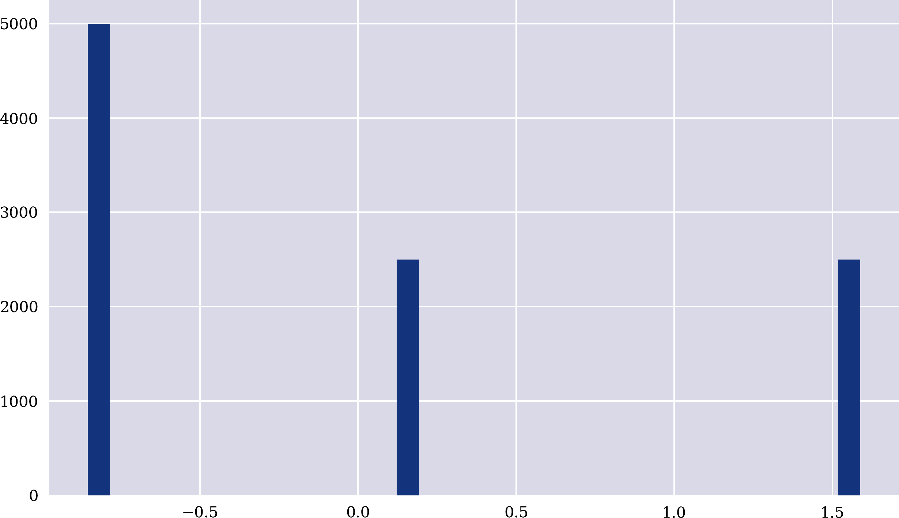

# 第四章\. 数据驱动金融

> 如果人工智能是新的电力，那么大数据就是为发电机提供动力的石油。
> 
> 李开复（2018）
> 
> 如今，分析师们筛选非传统信息，如卫星图像和信用卡数据，或使用人工智能技术如机器学习和自然语言处理，从传统数据源如经济数据和财报转录中获得新的见解。
> 
> 罗宾·威格尔斯沃斯（2019）

本章讨论了数据驱动金融的核心方面。在本书中，*数据驱动金融*被理解为主要由从数据中获取的见解驱动的金融背景（理论、模型、应用等）。

“科学方法”讨论了指导科学努力的普遍接受原则。“金融计量与回归”探讨了金融计量及相关主题。“数据可用性”阐明了通过编程接口可获得哪些类型（金融）数据，以及其质量和数量。“规范理论再探讨”重新审视了第三章中的规范金融理论，并基于真实的金融时间序列数据进行了分析。同时，基于真实的金融数据，“揭穿中心假设”驳斥了金融模型和理论中两种最常见的假设：*收益正态性*和*线性* *关系*。

# 科学方法

*科学方法*指的是应该指导任何科学项目的一套普遍接受的原则。[维基百科](https://oreil.ly/AX8jv)对科学方法的定义如下：

> 科学方法是一种自 17 世纪以来就标志着科学发展的经验主义知识获取方法。它涉及仔细观察，对所观察到的事物应用严格的怀疑，因为认知假设可能会扭曲一个人对观察的解释。它包括根据这些观察通过归纳形成假设；基于假设所作的实验和基于测量的测试所得出的演绎；以及根据实验结果对假设进行修正（或淘汰）。这些都是科学方法的原则，不同于适用于所有科学企业的一系列确定步骤。

根据这一定义，如第三章中所述的规范金融与科学方法形成鲜明对比。规范金融理论大多依赖于假设和公设，结合*演绎*作为主要的分析方法来得出其核心结果。

+   预期效用理论（EUT）*假设*代理人在不管世界状态如何变化时都具有相同的效用函数，并在不确定条件下最大化预期效用。

+   均值方差组合（MVP）理论描述了投资者在不确定条件下应该如何投资，*假设*只有一个期间内组合的预期收益和预期波动性起作用。

+   资本资产定价模型（CAPM）*假设*只有不可分散的市场风险*解释*了一个期间内股票的预期收益和预期波动性。

+   套利定价理论（APT）*假设*可以用一些可识别的风险因素*解释*股票随时间的预期收益和预期波动性；诚然，与其他理论相比，APT 的制定相当宽泛，允许广泛的解释。

上述规范金融理论的特征在于它们最初是在某些假设和公理的基础上仅使用“纸和笔”推导出来的，没有任何对真实世界数据或观察的求助。从历史的角度来看，许多这些理论在它们发布后很长一段时间才被真实世界数据严格测试。这主要可以通过随着时间的推移数据可用性的提高和计算能力的增强来解释。毕竟，数据和计算是在实践中应用统计方法的主要要素。将这些方法应用于金融市场数据的数学、统计学和金融交叉学科通常称为*金融计量*，这是下一节的主题。

# 金融计量与回归

采用[Investopedia](https://oreil.ly/QErpB)提供的定义适应*计量经济学*的定义，可以将*金融计量*定义如下：

> [金融]计量是使用[金融]数据对统计和数学模型进行量化应用，以发展金融理论或测试现有金融假设，并从历史数据中预测未来趋势。它对真实世界的[金融]数据进行统计试验，然后将结果与正在测试的[金融]理论进行比较和对比。

Alexander（2008b）为金融计量领域提供了全面而广泛的介绍。该书的第二章涵盖了单因素和多因素模型，如 CAPM 和 APT。Alexander（2008b）是名为*市场风险分析*的四本书系列的一部分。系列的第一本书，Alexander（2008a），涵盖了 MVP 理论和 CAPM 等的理论背景概念、主题和方法。Campbell（2018）的书是另一部关于金融理论和相关计量经济研究的全面资源。

金融计量学中的一个主要工具是*回归*，无论是其一元还是多元形式。回归也是一般*统计学习*中的核心工具。传统数学和统计学习之间有什么区别？虽然对于这个问题没有普遍的答案（毕竟，统计学是数学的一个子领域），一个简单的例子应强调与本书内容相关的一个主要区别。

首先是标准的数学方法。假设数学函数如下所示：

<math alttext="f colon double-struck upper R right-arrow double-struck upper R Subscript plus Baseline comma x right-arrow from bar 2 plus one-half x" display="block"><mrow><mi>f</mi> <mo>:</mo> <mi>ℝ</mi> <mo>→</mo> <msub><mi>ℝ</mi> <mo>+</mo></msub> <mo>,</mo> <mi>x</mi> <mo>↦</mo> <mn>2</mn> <mo>+</mo> <mfrac><mn>1</mn> <mn>2</mn></mfrac> <mi>x</mi></mrow></math>

给定多个值 <math alttext="x 下标 i"><msub><mi>x</mi> <mi>i</mi></msub></math> ，其中 <math alttext="i">i</math> 等于 1、2、...、n，可以通过上述定义得到 <math alttext="f"><mi>f</mi></math> 的函数值：

<math alttext="y Subscript i Baseline equals f left-parenthesis x Subscript i Baseline right-parenthesis comma i equals 1 comma 2 comma ellipsis comma n" display="block"><mrow><msub><mi>y</mi> <mi>i</mi></msub> <mo>=</mo> <mi>f</mi> <mrow><mo>(</mo> <msub><mi>x</mi> <mi>i</mi></msub> <mo>)</mo></mrow> <mo>,</mo> <mi>i</mi> <mo>=</mo> <mn>1</mn> <mo>,</mo> <mn>2</mn> <mo>,</mo> <mo>...</mo> <mo>,</mo> <mi>n</mi></mrow></math>

下面的 Python 代码基于一个简单的数值例子说明了这一点：

```py
In [1]: import numpy as np

In [2]: def f(x):
            return 2 + 1 / 2 * x

In [3]: x = np.arange(-4, 5)
        x
Out[3]: array([-4, -3, -2, -1,  0,  1,  2,  3,  4])

In [4]: y = f(x)
        y
Out[4]: array([0. , 0.5, 1. , 1.5, 2. , 2.5, 3. , 3.5, 4. ])
```

其次是统计学习中采用的方法。在前面的例子中，函数先给出，然后数据派生出来，而在统计学习中，这个顺序是颠倒的。在这里，通常给定数据，需要找到一个函数关系。在这个背景下，<math alttext="x"><mi>x</mi></math> 经常被称为*自变量*，而 <math alttext="y"><mi>y</mi></math> 则被称为*因变量*。因此，请考虑以下数据：

<math alttext="left-parenthesis x Subscript i Baseline comma y Subscript i Baseline right-parenthesis comma i equals 1 comma 2 comma ellipsis comma n" display="block"><mrow><mo>(</mo> <msub><mi>x</mi> <mi>i</mi></msub> <mo>,</mo> <msub><mi>y</mi> <mi>i</mi></msub> <mo>)</mo> <mo>,</mo> <mi>i</mi> <mo>=</mo> <mn>1</mn> <mo>,</mo> <mn>2</mn> <mo>,</mo> <mo>...</mo> <mo>,</mo> <mi>n</mi></mrow></math>

问题是找到例如参数 <math alttext="alpha comma beta"><mrow><mi>α</mi> <mo>,</mo> <mi>β</mi></mrow></math> ，使得：

<math alttext="ModifyingAbove f With caret left-parenthesis x Subscript i Baseline right-parenthesis identical-to alpha plus beta x Subscript i Baseline equals ModifyingAbove y With caret Subscript i Baseline almost-equals y Subscript i Baseline comma i equals 1 comma 2 comma ellipsis comma n" display="block"><mrow><mover accent="true"><mi>f</mi> <mo>^</mo></mover> <mrow><mo>(</mo> <msub><mi>x</mi> <mi>i</mi></msub> <mo>)</mo></mrow> <mo>≡</mo> <mi>α</mi> <mo>+</mo> <mi>β</mi> <msub><mi>x</mi> <mi>i</mi></msub> <mo>=</mo> <msub><mover accent="true"><mi>y</mi> <mo>^</mo></mover> <mi>i</mi></msub> <mo>≈</mo> <msub><mi>y</mi> <mi>i</mi></msub> <mo>,</mo> <mi>i</mi> <mo>=</mo> <mn>1</mn> <mo>,</mo> <mn>2</mn> <mo>,</mo> <mo>...</mo> <mo>,</mo> <mi>n</mi></mrow></math>

另一种写法是包括残差值 <math alttext="epsilon 下标 i"><msub><mi>ϵ</mi> <mi>i</mi></msub></math>：

<math alttext="alpha plus beta x Subscript i Baseline plus epsilon Subscript i Baseline equals y Subscript i Baseline comma i equals 1 comma 2 comma ellipsis comma n" display="block"><mrow><mi>α</mi> <mo>+</mo> <mi>β</mi> <msub><mi>x</mi> <mi>i</mi></msub> <mo>+</mo> <msub><mi>ϵ</mi> <mi>i</mi></msub> <mo>=</mo> <msub><mi>y</mi> <mi>i</mi></msub> <mo>,</mo> <mi>i</mi> <mo>=</mo> <mn>1</mn> <mo>,</mo> <mn>2</mn> <mo>,</mo> <mo>...</mo> <mo>,</mo> <mi>n</mi></mrow></math>

在普通最小二乘（OLS）回归的背景下，选择 <math alttext="alpha comma beta"><mrow><mi>α</mi> <mo>,</mo> <mi>β</mi></mrow></math> 使得近似值 <math alttext="ModifyingAbove y With caret 下标 i"><msub><mover accent="true"><mi>y</mi> <mo>^</mo></mover> <mi>i</mi></msub></math> 与实际值 <math alttext="y 下标 i"><msub><mi>y</mi> <mi>i</mi></msub></math> 之间的均方误差最小化问题如下：

<math alttext="min Underscript alpha comma beta Endscripts StartFraction 1 Over n EndFraction sigma-summation Underscript i Overscript n Endscripts left-parenthesis ModifyingAbove y With caret Subscript i Baseline minus y Subscript i Baseline right-parenthesis squared" display="block"><mrow><munder><mo movablelimits="true" form="prefix">min</mo> <mrow><mi>α</mi><mo>,</mo><mi>β</mi></mrow></munder> <mfrac><mn>1</mn> <mi>n</mi></mfrac> <munderover><mo>∑</mo> <mi>i</mi> <mi>n</mi></munderover> <msup><mrow><mo>(</mo><msub><mover accent="true"><mi>y</mi> <mo>^</mo></mover> <mi>i</mi></msub> <mo>-</mo><msub><mi>y</mi> <mi>i</mi></msub> <mo>)</mo></mrow> <mn>2</mn></msup></mrow></math>

在*简单的 OLS 回归*的情况下，如前所述，最优解以封闭形式已知，如下所示：

<math alttext="StartLayout Enlarged left-brace 1st Row  beta equals StartFraction Cov left-parenthesis x comma y right-parenthesis Over Var left-parenthesis x right-parenthesis EndFraction 2nd Row  alpha equals y overbar minus beta x overbar EndLayout" display="block"><mfenced separators="" open="{" close=""><mtable><mtr><mtd columnalign="left"><mrow><mi>β</mi> <mo>=</mo> <mfrac><mrow><mtext>Cov</mtext><mo>(</mo><mi>x</mi><mo>,</mo><mi>y</mi><mo>)</mo></mrow> <mtext>Var(x)</mtext></mfrac></mrow></mtd></mtr> <mtr><mtd columnalign="left"><mrow><mi>α</mi> <mo>=</mo> <mover accent="true"><mi>y</mi> <mo>¯</mo></mover> <mo>-</mo> <mi>β</mi> <mover accent="true"><mi>x</mi> <mo>¯</mo></mover></mrow></mtd></mtr></mtable></mfenced></math>

这里，<math alttext="Cov left-parenthesis right-parenthesis"><mrow><mtext>Cov</mtext> <mo>(</mo> <mo>)</mo></mrow></math>代表*协方差*，<math alttext="Var left-parenthesis right-parenthesis"><mrow><mtext>Var</mtext> <mo>(</mo> <mo>)</mo></mrow></math>代表*方差*，而<math alttext="x overbar comma y overbar"><mrow><mover accent="true"><mi>x</mi> <mo>¯</mo></mover> <mo>,</mo> <mover accent="true"><mi>y</mi> <mo>¯</mo></mover></mrow></math>代表<math alttext="x comma y"><mrow><mi>x</mi> <mo>,</mo> <mi>y</mi></mrow></math>的*均值*。

回到前面的数值示例，这些见解可以用于导出最优参数<math alttext="alpha comma beta"><mrow><mi>α</mi> <mo>,</mo> <mi>β</mi></mrow></math>，在这种特定情况下，还可以恢复<math alttext="f left-parenthesis x right-parenthesis"><mrow><mi>f</mi> <mo>(</mo> <mi>x</mi> <mo>)</mo></mrow></math>的原始定义：

```py
In [5]: x
Out[5]: array([-4, -3, -2, -1,  0,  1,  2,  3,  4])

In [6]: y
Out[6]: array([0. , 0.5, 1. , 1.5, 2. , 2.5, 3. , 3.5, 4. ])

In [7]: beta = np.cov(x, y, ddof=0)[0, 1] / x.var()  
        beta  
Out[7]: 0.49999999999999994

In [8]: alpha = y.mean() - beta * x.mean()  
        alpha  
Out[8]: 2.0

In [9]: y_ = alpha + beta * x  

In [10]: np.allclose(y_, y)  
Out[10]: True
```


从协方差矩阵和方差派生出的<math alttext="beta"><mi>β</mi></math>


从<math alttext="beta"><mi>β</mi></math>和均值派生出的<math alttext="alpha"><mi>α</mi></math>


给定<math alttext="alpha comma beta"><mrow><mi>α</mi> <mo>,</mo> <mi>β</mi></mrow></math>，估计值<math alttext="ModifyingAbove y With caret Subscript i Baseline comma i equals 1 comma 2 comma ellipsis comma n"><mrow><msub><mover accent="true"><mi>y</mi> <mo>^</mo></mover> <mi>i</mi></msub> <mo>,</mo> <mi>i</mi> <mo>=</mo> <mn>1</mn> <mo>,</mo> <mn>2</mn> <mo>,</mo> <mo>...</mo> <mo>,</mo> <mi>n</mi></mrow></math>


检查<math alttext="ModifyingAbove y With caret Subscript i Baseline comma y Subscript i Baseline"><mrow><msub><mover accent="true"><mi>y</mi> <mo>^</mo></mover> <mi>i</mi></msub> <mo>,</mo> <msub><mi>y</mi> <mi>i</mi></msub></mrow></math>值是否数值上相等

前面的例子以及第一章中的例子说明，将 OLS 回归应用于给定数据集通常很简单。OLS 回归已成为计量经济学和金融计量学中的中心工具还有更多原因。其中包括：

数百年历史

最小二乘法，特别是与回归结合使用，已经使用了 200 多年。^(1)

简单性

OLS 回归背后的数学易于理解，并且易于在编程中实现。

可伸缩性

基本上不存在 OLS 回归可以应用的数据大小限制。

灵活性

OLS 回归可应用于广泛的问题和数据集。

速度

OLS 回归的评估速度快，即使在较大的数据集上也是如此。

可用性

Python 及许多其他编程语言中提供了高效的实现。

然而，尽管 OLS 回归方法通常易于应用且直接，但该方法基于一些假设——大多数与残差有关——在实践中并不总是满足。

线性

该模型在其参数方面是线性的，包括系数和残差。

独立性

自变量之间不存在完全（高度）相关（无*多重共线性*）。

零均值

残差的均值（接近）为零。

无相关性

残差与自变量没有（强烈）相关。

同方差性

残差的标准偏差（几乎）是恒定的。

无自相关

残差之间没有（强烈）相关性。

在实践中，一般很容易测试特定数据集的假设有效性。

# 数据可用性

金融计量经济学受统计方法驱动，如回归分析，以及金融数据的可用性。从 1950 年代到 1990 年代，甚至到 21 世纪初，理论和实证金融研究主要依赖相对较小的数据集，主要由日终数据（EOD）组成。过去十年左右，数据的可用性发生了巨大变化，金融和其他数据的类型越来越多，粒度、数量和速度不断增加。

## 编程 API

关于数据驱动的金融，重要的不仅是数据的可用性，还包括如何访问和处理数据。长期以来，金融专业人士依赖于 Refinitiv 等公司的数据终端（见[Eikon Terminal](https://oreil.ly/gcBey)）或 Bloomberg 等公司的数据终端（见[Bloomberg Terminal](https://oreil.ly/Y1dEC)）。报纸、杂志、财务报告等已被此类终端替代为主要的金融信息来源。然而，这些终端提供的数据量和种类之多无法由单个用户或大批金融专业人士系统地消化。因此，数据驱动金融的主要突破在于通过允许使用计算机代码选择、检索和处理任意数据集的应用程序接口（API）*编程可用性*。

本节其余部分专注于展示此类 API，使得即使是学者和零售投资者也能检索到各种不同的数据集。在提供这些示例之前，Table 4-1 提供了一般金融背景下相关数据类别的概述，以及典型示例。在该表中，*结构化*数据指的是通常以表格结构呈现的数值数据类型，而*非结构化*数据则指的是以标准文本形式存在的数据，通常除了标题或段落之外没有结构。*替代*数据指的是通常*不*被视为金融数据的数据类型。

表 4-1\. 相关的金融数据类型

| 时间 | 结构化数据 | 非结构化数据 | 替代数据 |
| --- | --- | --- | --- |
| 历史 | 价格，基本面 | 新闻，文本 | Web，社交媒体，卫星 |
| 流媒体 | 价格，成交量 | 新闻，文件 | Web，社交媒体，卫星，物联网 |

## 结构化历史数据

首先，将通过程序检索结构化历史数据类型。为此，以下 Python 代码使用[Eikon 数据 API](https://oreil.ly/uDMSk)。^(2)

要通过 Eikon 数据 API 访问数据，必须运行本地应用程序，例如[Refinitiv Workspace](https://oreil.ly/NPEav)，并且必须在 Python 级别上配置 API 访问：

```py
In [11]: import eikon as ek
         import configparser

In [12]: c = configparser.ConfigParser()
         c.read('../aiif.cfg')
         ek.set_app_key(c['eikon']['app_id'])
         2020-08-04 10:30:18,059 P[14938] [MainThread 4521459136] Error on handshake
          port 9000 : ReadTimeout(ReadTimeout())
```

如果满足这些要求，则可以通过单个函数调用检索历史结构化数据。例如，以下 Python 代码检索一组符号和指定时间间隔的 EOD 数据：

```py
In [14]: symbols = ['AAPL.O', 'MSFT.O', 'NFLX.O', 'AMZN.O']  

In [15]: data = ek.get_timeseries(symbols,
                                  fields='CLOSE',
                                  start_date='2019-07-01',
                                  end_date='2020-07-01')  

In [16]: data.info()  
         <class 'pandas.core.frame.DataFrame'>
         DatetimeIndex: 254 entries, 2019-07-01 to 2020-07-01
         Data columns (total 4 columns):
          #   Column  Non-Null Count  Dtype
         ---  ------  --------------  -----
          0   AAPL.O  254 non-null    float64
          1   MSFT.O  254 non-null    float64
          2   NFLX.O  254 non-null    float64
          3   AMZN.O  254 non-null    float64
         dtypes: float64(4)
         memory usage: 9.9 KB

In [17]: data.tail()  
Out[17]: CLOSE       AAPL.O  MSFT.O  NFLX.O   AMZN.O
         Date
         2020-06-25  364.84  200.34  465.91  2754.58
         2020-06-26  353.63  196.33  443.40  2692.87
         2020-06-29  361.78  198.44  447.24  2680.38
         2020-06-30  364.80  203.51  455.04  2758.82
         2020-07-01  364.11  204.70  485.64  2878.70
```


定义要检索数据的`RICs`（符号）列表^(3)


检索`RICs`列表的 EOD`Close`价格


显示返回的`DataFrame`对象的元信息


显示`DataFrame`对象的最终行

同样地，通过适当调整参数可以检索带有`OHLC`字段的一分钟条。

```py
In [18]: data = ek.get_timeseries('AMZN.O',
                                  fields='*',
                                  start_date='2020-08-03',
                                  end_date='2020-08-04',
                                  interval='minute')  

In [19]: data.info()
         <class 'pandas.core.frame.DataFrame'>
         DatetimeIndex: 911 entries, 2020-08-03 08:01:00 to 2020-08-04 00:00:00
         Data columns (total 6 columns):
          #   Column  Non-Null Count  Dtype
         ---  ------  --------------  -----
          0   HIGH    911 non-null    float64
          1   LOW     911 non-null    float64
          2   OPEN    911 non-null    float64
          3   CLOSE   911 non-null    float64
          4   COUNT   911 non-null    float64
          5   VOLUME  911 non-null    float64
         dtypes: float64(6)
         memory usage: 49.8 KB

In [20]: data.head()
Out[20]: AMZN.O                  HIGH      LOW     OPEN    CLOSE  COUNT  VOLUME
         Date
         2020-08-03 08:01:00  3190.00  3176.03  3176.03  3178.17   18.0   383.0
         2020-08-03 08:02:00  3183.02  3176.03  3180.00  3177.01   15.0   513.0
         2020-08-03 08:03:00  3179.91  3177.05  3179.91  3177.05    5.0    14.0
         2020-08-03 08:04:00  3184.00  3179.91  3179.91  3184.00    8.0   102.0
         2020-08-03 08:05:00  3184.91  3182.91  3183.30  3184.00   12.0   403.0
```


检索具有所有可用字段的一分钟条`OHLC`数据

可以从 Eikon 数据 API 检索到不仅结构化金融时间序列数据。基础数据也可以同时为多个`RICs`和多个不同的数据字段检索，如以下 Python 代码所示：

```py
In [21]: data_grid, err = ek.get_data(['AAPL.O', 'IBM', 'GOOG.O', 'AMZN.O'],
                                      ['TR.TotalReturnYTD', 'TR.WACCBeta',
                                       'YRHIGH', 'YRLOW',
                                       'TR.Ebitda', 'TR.GrossProfit'])  

In [22]: data_grid
Out[22]:   Instrument  YTD Total Return      Beta   YRHIGH      YRLOW        EBITDA  \
         0     AAPL.O         49.141271  1.221249   425.66   192.5800  7.647700e+10
         1        IBM         -5.019570  1.208156   158.75    90.5600  1.898600e+10
         2     GOOG.O         10.278829  1.067084  1586.99  1013.5361  4.757900e+10
         3     AMZN.O         68.406897  1.338106  3344.29  1626.0318  3.025600e+10

            Gross Profit
         0   98392000000
         1   36488000000
         2   89961000000
         3  114986000000
```


为多个`RICs`和多个数据字段检索数据

# 程序化数据可用性

如今，基本上所有的结构化金融数据都以编程方式可用。在这种情况下，金融时间序列数据是最重要的例子。然而，其他结构化数据类型如基本数据也以相同方式可用，极大地简化了量化分析师、交易员、投资组合经理等的工作。

## 结构化流式数据

金融领域的许多应用需要实时的结构化数据，例如算法交易或市场风险管理。以下 Python 代码利用[Oanda 交易平台](http://oanda.com)的 API 实时流式传输了比特币价格（美元）的时间戳、买入报价和卖出报价：

```py
In [23]: import tpqoa

In [24]: oa = tpqoa.tpqoa('../aiif.cfg')  

In [25]: oa.stream_data('BTC_USD', stop=5)  
         2020-08-04T08:30:38.621075583Z 11298.8 11334.8
         2020-08-04T08:30:50.485678488Z 11298.3 11334.3
         2020-08-04T08:30:50.801666847Z 11297.3 11333.3
         2020-08-04T08:30:51.326269990Z 11296.0 11332.0
         2020-08-04T08:30:54.423973431Z 11296.6 11332.6
```


连接到 Oanda API


为特定符号流式传输了固定数量的 ticks

当然，打印流式传输的数据字段仅供说明。某些金融应用可能需要对检索到的数据进行复杂处理，并生成信号或统计数据，特别是在工作日和交易时间内，金融工具的价格 tick 数逐步增加，需要金融机构在实时或至少在“接近实时”（“近实时”）处理这类数据时具备强大的数据处理能力。

当查看苹果公司股票价格时，这一观察的重要性变得明显。可以计算出在 40 年的时间内，苹果公司股票大约有 <math alttext="252 dot 40 equals 10 comma 080"><mrow><mn>252</mn> <mo>·</mo> <mn>40</mn> <mo>=</mo> <mn>10</mn> <mo>,</mo> <mn>080</mn></mrow></math> EOD 收盘报价。以下代码仅检索了一个小时的苹果股票的*tick 数据*。检索到的数据集可能甚至对于给定时间间隔来说都不完整，其中包含了 50,000 条数据行，比 40 年交易期间积累的 EOD 报价多五倍：

```py
In [26]: data = ek.get_timeseries('AAPL.O',
                                  fields='*',
                                  start_date='2020-08-03 15:00:00',
                                  end_date='2020-08-03 16:00:00',
                                  interval='tick')  

In [27]: data.info()
         <class 'pandas.core.frame.DataFrame'>
         DatetimeIndex: 50000 entries, 2020-08-03 15:26:24.889000 to 2020-08-03
          15:59:59.762000
         Data columns (total 2 columns):
          #   Column  Non-Null Count  Dtype
         ---  ------  --------------  -----
          0   VALUE   49953 non-null  float64
          1   VOLUME  50000 non-null  float64
         dtypes: float64(2)
         memory usage: 1.1 MB

In [28]: data.head()
Out[28]: AAPL.O                    VALUE  VOLUME
         Date
         2020-08-03 15:26:24.889  439.06   175.0
         2020-08-03 15:26:24.889  439.08     3.0
         2020-08-03 15:26:24.890  439.08   100.0
         2020-08-03 15:26:24.890  439.08     5.0
         2020-08-03 15:26:24.899  439.10    35.0
```


检索苹果股票价格的 tick 数据

# EOD 与 Tick 数据的对比

大多数今天仍然适用的金融理论起源于只有 EOD 数据可用时的情况。如今，金融机构甚至包括零售交易者和投资者都面临着不断涌入的实时数据流。苹果股票的例子说明，在一个交易小时内，单只股票可能会收到四倍于 40 年交易期间 EOD 数据数量的 ticks。这不仅挑战了金融市场中的参与者，还引发了现有金融理论是否能够适应这样的环境的疑问。

## 非结构化历史数据

在金融中，许多重要的数据来源仅提供非结构化数据，如财经新闻或公司文件。毫无疑问，机器在处理大量结构化数值数据方面比人类更快更好。然而，最近在*自然语言处理*（NLP）方面的进展也使得机器在处理财经新闻方面更快更好。例如，2020 年，数据服务提供商每天摄取大约 150 万篇新闻文章。显然，这么庞大的基于文本的数据无法被人类适当地处理。

幸运的是，这些天大部分非结构化数据也可以通过程序化 API 轻松获取。以下 Python 代码从 Eikon 数据 API 检索与特斯拉公司及其生产相关的多篇新闻文章。选择一篇文章并完整显示：

```py
In [29]: news = ek.get_news_headlines('R:TSLA.O PRODUCTION',
                                  date_from='2020-06-01',
                                  date_to='2020-08-01',
                                  count=7
                                 )  

In [30]: news
Out[30]:                                           versionCreated  \
         2020-07-29 11:02:31.276 2020-07-29 11:02:31.276000+00:00
         2020-07-28 00:59:48.000        2020-07-28 00:59:48+00:00
         2020-07-23 21:20:36.090 2020-07-23 21:20:36.090000+00:00
         2020-07-23 08:22:17.000        2020-07-23 08:22:17+00:00
         2020-07-23 07:08:48.000        2020-07-23 07:46:56+00:00
         2020-07-23 00:55:54.000        2020-07-23 00:55:54+00:00
         2020-07-22 21:35:42.640 2020-07-22 22:13:26.597000+00:00

                                                                          text  \
         2020-07-29 11:02:31.276  Tesla Launches Hiring Spree in China as It Pre...
         2020-07-28 00:59:48.000    Tesla hiring in Shanghai as production ramps up
         2020-07-23 21:20:36.090     Tesla speeds up Model 3 production in Shanghai
         2020-07-23 08:22:17.000  UPDATE 1-'Please mine more nickel,' Musk urges...
         2020-07-23 07:08:48.000  'Please mine more nickel,' Musk urges as Tesla...
         2020-07-23 00:55:54.000  USA-Tesla choisit le Texas pour la production ...
         2020-07-22 21:35:42.640  TESLA INC - THE REAL LIMITATION ON TESLA GROWT...

                                                                       storyId  \
         2020-07-29 11:02:31.276  urn:newsml:reuters.com:20200729:nCXG3W8s9X:1
         2020-07-28 00:59:48.000  urn:newsml:reuters.com:20200728:nL3N2EY3PG:8
         2020-07-23 21:20:36.090  urn:newsml:reuters.com:20200723:nNRAcf1v8f:1
         2020-07-23 08:22:17.000  urn:newsml:reuters.com:20200723:nL3N2EU1P9:1
         2020-07-23 07:08:48.000  urn:newsml:reuters.com:20200723:nL3N2EU0HH:1
         2020-07-23 00:55:54.000  urn:newsml:reuters.com:20200723:nL5N2EU03M:1
         2020-07-22 21:35:42.640  urn:newsml:reuters.com:20200722:nFWN2ET120:2

                                 sourceCode
         2020-07-29 11:02:31.276  NS:CAIXIN
         2020-07-28 00:59:48.000    NS:RTRS
         2020-07-23 21:20:36.090  NS:SOUTHC
         2020-07-23 08:22:17.000    NS:RTRS
         2020-07-23 07:08:48.000    NS:RTRS
         2020-07-23 00:55:54.000    NS:RTRS
         2020-07-22 21:35:42.640    NS:RTRS

In [31]: storyId = news['storyId'][1]  

In [32]: from IPython.display import HTML

In [33]: HTML(ek.get_news_story(storyId)[:1148])  
Out[33]: <IPython.core.display.HTML object>
```

```py
Jan 06, 2020

Tesla, Inc.TSLA registered record production and deliveries of 104,891 and
112,000 vehicles, respectively, in the fourth quarter of 2019.

Notably, the company's Model S/X and Model 3 reported record production and
deliveries in the fourth quarter. The Model S/X division recorded production
and delivery volume of 17,933 and 19,450 vehicles, respectively. The Model 3
division registered production of 86,958 vehicles, while 92,550 vehicles were
delivered.

In 2019, Tesla delivered 367,500 vehicles, reflecting an increase of 50%, year
over year, and nearly in line with the company's full-year guidance of 360,000
vehicles.
```


获取在参数范围内的多篇新闻文章的元数据


选择一个`storyId`以检索完整文本


检索所选文章的完整文本并显示

## 非结构化流数据

就像检索历史非结构化数据一样，程序化 API 可以用来实时或至少接近实时地流式传输非结构化新闻数据。例如，道琼斯的数据、新闻和分析平台 DNA 提供这样的 API。图 4-1 展示了一个网络应用程序的截图，该应用程序实时流传“商品和财经新闻”文章，并使用 NLP 技术进行处理。


###### 图 4-1\. 基于 DNA 的新闻流应用程序（道琼斯）

新闻流应用程序具有以下主要功能：

完整文本

点击文章标题可以获取每篇文章的完整文本。

关键词总结

关键词总结被创建并显示在屏幕上。

情感分析

情感分数被计算并可视化为彩色箭头。点击箭头可以查看详细信息。

词云

创建词云总结位图，并在点击缩略图后显示（见图 4-2）。


###### 图 4-2\. 在新闻流应用程序中显示的词云位图

## 替代数据

如今，金融机构，特别是对冲基金，系统地开采多种替代数据来源，以在交易和投资中获得优势。彭博社的一篇最新文章列出，其中包括以下替代数据来源：

+   网络抓取数据

+   众包数据

+   信用卡和销售点（POS）系统

+   社交媒体情感

+   搜索趋势

+   网络流量

+   供应链数据

+   能源生产数据

+   消费者档案

+   卫星图像/地理空间数据

+   应用程序安装数

+   海洋船舶追踪

+   可穿戴设备、无人机、物联网（IoT）传感器

以下两个示例说明了替代数据的使用。第一个示例检索并处理苹果公司的新闻稿，其形式为 HTML 页面。以下 Python 代码使用了一组辅助函数，如 “Python Code” 中所示。在代码中，定义了一个 URL 列表，每个 URL 代表苹果公司的一个新闻稿的 HTML 页面。然后检索每个新闻稿的原始 HTML 代码。接着清理原始代码，并打印一个新闻稿的摘录：

```py
In [34]: import nlp  
         import requests

In [35]: sources = [
             'https://nr.apple.com/dE0b1T5G3u',  # iPad Pro
             'https://nr.apple.com/dE4c7T6g1K',  # MacBook Air
             'https://nr.apple.com/dE4q4r8A2A',  # Mac Mini
         ]  

In [36]: html = [requests.get(url).text for url in sources]  

In [37]: data = [nlp.clean_up_text(t) for t in html]  

In [38]: data[0][536:1001]  
Out[38]: ' display, powerful a12x bionic chip and face id introducing the new ipad pro
          with all-screen design and next-generation performance. new york apple today
          introduced the new ipad pro with all-screen design and next-generation
          performance, marking the biggest change to ipad ever. the all-new design
          pushes 11-inch and 12.9-inch liquid retina displays to the edges of ipad pro
          and integrates face id to securely unlock ipad with just a glance.1 the a12x
          bionic chip w'
```


导入 NLP 辅助函数


定义了三篇新闻稿的 URL


检索三篇新闻稿的原始 HTML 代码


清理原始 HTML 代码（例如，删除 HTML 标签）


打印一个新闻稿的摘录

当然，在本节中如此广泛地定义替代数据，意味着可以检索和处理无限量的数据用于金融目的。从本质上讲，这是像 Google LLC 的搜索引擎的业务。在金融背景下，明确指定要利用的非结构化替代数据源至关重要。

第二个示例涉及从社交网络 Twitter, Inc. 中检索数据。为此，Twitter 提供 API 访问其平台上的推文，前提是已经适当设置了 Twitter 账户。以下 Python 代码连接到 Twitter API，并从我的主页时间线和用户时间线分别检索并打印最近的五条推文：

```py
In [39]: from twitter import Twitter, OAuth

In [40]: t = Twitter(auth=OAuth(c['twitter']['access_token'],
                                c['twitter']['access_secret_token'],
                                c['twitter']['api_key'],
                                c['twitter']['api_secret_key']),
                     retry=True)  

In [41]: l = t.statuses.home_timeline(count=5)  

In [42]: for e in l:
             print(e['text'])  
         The Bank of England is effectively subsidizing polluting industries in its
          pandemic rescue program, a think tank sa… https://t.co/Fq5jl2CIcp
         Cool shared task: mining scientific contributions (by @SeeTedTalk @SoerenAuer
          and Jennifer D'Souza)
         https://t.co/dm56DMUrWm
         Twelve people were hospitalized in Wyoming on Monday after a hot air balloon
          crash, officials said.

         Three hot air… https://t.co/EaNBBRXVar
         President Trump directed controversial Pentagon pick into new role with
          similar duties after nomination failed https://t.co/ZyXpPcJkcQ
         Company announcement: Revolut launches Open Banking for its 400,000 Italian...
          https://t.co/OfvbgwbeJW #fintech

In [43]: l = t.statuses.user_timeline(screen_name='dyjh', count=5)  

In [44]: for e in l:
             print(e['text'])  
         #Python for #AlgoTrading (focus on the process) &amp; #AI in #Finance (focus
          on prediction methods) will complement eac… https://t.co/P1s8fXCp42
         Currently putting finishing touches on #AI in #Finance (@OReillyMedia). Book
          going into production shortly. https://t.co/JsOSA3sfBL
         Chinatown Is Coming Back, One Noodle at a Time https://t.co/In5kXNeVc5
         Alt data industry balloons as hedge funds strive for Covid edge via @FT |
         "We remain of the view that alternative d… https://t.co/9HtUOjoEdz
         @Wolf_Of_BTC Just follow me on Twitter (or LinkedIn). Then you will notice for
          sure when it is out.
```


连接到 Twitter API


检索并打印主页时间线上最近的五条推文


从用户时间线检索并打印最近的五条推文

Twitter API 也允许根据搜索条件检索最近的推文并进行处理：

```py
In [45]: d = t.search.tweets(q='#Python', count=7)  

In [46]: for e in d['statuses']:
             print(e['text'])  
         RT @KirkDBorne: #AI is Reshaping Programming — Tips on How to Stay on Top:
          https://t.co/CFNu1i352C
         ——
         Courses:
         1: #MachineLearning — Jupyte…
         RT @reuvenmlerner: Today, a #Python student's code didn't print:

         x = 5
         if x == 5:
             print: ('yes!')

         There was a typo, namely : after pr…
         RT @GavLaaaaaaaa: Javascript Does Not Need a StringBuilder
          https://t.co/aS7NzHLO65 #programming #softwareengineering #bigdata
          #datascience…
         RT @CodeFlawCo: It is necessary to publish regular updates on Twitter
          #programmer #coder #developer #technology RT @pak_aims: Learning to C…
         RT @GavLaaaaaaaa: Javascript Does Not Need a StringBuilder
          https://t.co/aS7NzHLO65 #programming #softwareengineering #bigdata
          #datascience…
```


搜索带有“Python”标签的推文，并打印最近的五条

也可以收集一个 Twitter 用户的大量推文，并创建一个词云形式的摘要（参见 图 4-3）。以下 Python 代码再次使用了 NLP 辅助函数，如 “Python Code” 中所示：

```py
In [47]: l = t.statuses.user_timeline(screen_name='elonmusk', count=50)  

In [48]: tl = [e['text'] for e in l]  

In [49]: tl[:5]  
Out[49]: ['@flcnhvy @Lindw0rm @cleantechnica True',
          '@Lindw0rm @cleantechnica Highly likely down the road',
          '@cleantechnica True fact',
         '@NASASpaceflight Scrubbed for the day. A Raptor turbopump spin start valve
          didn’t open, triggering an automatic abo… https://t.co/QDdlNXFgJg',
          '@Erdayastronaut I’m in the Boca control room. Hop attempt in ~33 minutes.']

In [50]: wc = nlp.generate_word_cloud(' '.join(tl), 35,
                     name='../../images/ch04/musk_twitter_wc.png'
                     )  
```


检索用户 `elonmusk` 的最近 50 条推文


将文本收集到一个 `list` 对象中


显示最后五条推文的摘录


生成一个词云摘要并展示它


###### 图 4-3\. 作为更多推文的词云摘要

一旦金融从业者定义了超越结构化金融时间序列数据的“相关金融数据”，数据来源在容量、多样性和速度方面似乎是无限的。从 Twitter API 检索的推文方式几乎是近乎实时的，因为这些示例中访问的是最新的推文。因此，这些和类似的基于 API 的数据源为我们提供了源源不断的替代数据流，正如先前指出的那样，重要的是要明确指定我们要寻找的内容。否则，任何金融数据科学的努力可能会很容易地淹没在过多或太嘈杂的数据中。

# 规范性理论再审视

第三章介绍了规范性金融理论，如 MVP 理论或 CAPM 理论。相当长一段时间以来，学生和学者学习和研究这些理论更多或多或少地受到理论本身的约束。如前一节中讨论和说明的所有可用金融数据，再加上强大的开源数据分析软件——如 Python、`NumPy`、`pandas`等，使得将金融理论应用于现实世界测试变得相当容易和直接。不再需要小团队和更大规模的研究来完成这一过程。一本典型的笔记本、互联网接入和标准的 Python 环境就足够了。这正是本节要讨论的内容。然而，在深入探讨数据驱动的金融之前，下一小节简要讨论了 EUT 背景下的一些著名悖论，以及企业如何在实践中建模和预测个体行为。

## 预期效用与现实

在经济学中，*风险*描述的是决策者事先知道可能的未来状态及其概率的情况。这是金融和 EUT 背景下的标准假设。另一方面，*模糊性*描述了经济学中的情况，其中决策者事先不知道概率，甚至可能的未来状态。*不确定性*涵盖了这两种不同的决策情况。

有一个长期的传统，分析个体（“代理人”）在不确定性下的具体决策行为。无数研究和实验已经进行，观察和分析代理人在面对不确定性时的行为，与诸如 EUT 的理论预测相比。几个世纪以来，*悖论*在决策理论和研究中发挥着重要作用。

一个这样的悖论，即*圣彼得堡悖论*，首先引发了效用函数和 EUT 的发明。丹尼尔·贝努利在 1738 年提出了这个悖论及其解决方案。该悖论基于以下的硬币投掷游戏 <math alttext="upper G"><mi>G</mi></math>。在游戏中，一个（完美的）硬币被抛掷，可能无限次。如果第一次抛掷结果是正面，玩家将获得 1 个货币单位的回报。只要出现正面，就会继续抛掷。如果出现两次正面，玩家将额外获得 2 个单位的回报。如果出现三次，额外回报是 4 个单位，依此类推。这是一个风险情境，因为所有可能的未来状态及其相关的概率都是预先知道的。

这个游戏的期望回报是*无穷大*。这可以从以下的无限求和中看出，其中每个元素都严格为正：

<math alttext="bold upper E left-parenthesis upper G right-parenthesis equals one-half dot 1 plus one-fourth dot 2 plus one-eighth dot 4 plus one-sixteenth dot 8 plus ellipsis equals sigma-summation Underscript k equals 1 Overscript normal infinity Endscripts StartFraction 1 Over 2 Superscript k Baseline EndFraction 2 Superscript k minus 1 Baseline equals sigma-summation Underscript k equals 1 Overscript normal infinity Endscripts one-half equals normal infinity" display="block"><mrow><mi>𝐄</mi> <mrow><mo>(</mo> <mi>G</mi> <mo>)</mo></mrow> <mo>=</mo> <mfrac><mn>1</mn> <mn>2</mn></mfrac> <mo>·</mo> <mn>1</mn> <mo>+</mo> <mfrac><mn>1</mn> <mn>4</mn></mfrac> <mo>·</mo> <mn>2</mn> <mo>+</mo> <mfrac><mn>1</mn> <mn>8</mn></mfrac> <mo>·</mo> <mn>4</mn> <mo>+</mo> <mfrac><mn>1</mn> <mn>16</mn></mfrac> <mo>·</mo> <mn>8</mn> <mo>+</mo> <mo>...</mo> <mo>=</mo> <munderover><mo>∑</mo> <mrow><mi>k</mi><mo>=</mo><mn>1</mn></mrow> <mi>∞</mi></munderover> <mfrac><mn>1</mn> <msup><mn>2</mn> <mi>k</mi></msup></mfrac> <msup><mn>2</mn> <mrow><mi>k</mi><mo>-</mo><mn>1</mn></mrow></msup> <mo>=</mo> <munderover><mo>∑</mo> <mrow><mi>k</mi><mo>=</mo><mn>1</mn></mrow> <mi>∞</mi></munderover> <mfrac><mn>1</mn> <mn>2</mn></mfrac> <mo>=</mo> <mi>∞</mi></mrow></math>

然而，面对这样一场游戏，一般的决策者只愿意支付有限的金额来参与游戏。这主要是因为相对较大的回报只发生在相对较小的概率下。考虑潜在的回报 <math alttext="upper W equals 511"><mrow><mi>W</mi> <mo>=</mo> <mn>511</mn></mrow></math>：

<math alttext="upper W equals 1 plus 2 plus 4 plus 8 plus 16 plus 32 plus 64 plus 128 plus 256 equals 511" display="block"><mrow><mi>W</mi> <mo>=</mo> <mn>1</mn> <mo>+</mo> <mn>2</mn> <mo>+</mo> <mn>4</mn> <mo>+</mo> <mn>8</mn> <mo>+</mo> <mn>16</mn> <mo>+</mo> <mn>32</mn> <mo>+</mo> <mn>64</mn> <mo>+</mo> <mn>128</mn> <mo>+</mo> <mn>256</mn> <mo>=</mo> <mn>511</mn></mrow></math>

获得这样的回报的概率非常低。确切地说，它只有 <math alttext="upper P left-parenthesis x equals upper W right-parenthesis equals StartFraction 1 Over 512 EndFraction equals"><mrow><mi>P</mi> <mrow><mo>(</mo> <mi>x</mi> <mo>=</mo> <mi>W</mi> <mo>)</mo></mrow> <mo>=</mo> <mfrac><mn>1</mn> <mn>512</mn></mfrac> <mo>=</mo></mrow></math> 0.001953125。然而，获得这样的回报或更小回报的概率则相当高：

<math alttext="upper P left-parenthesis x less-than-or-equal-to upper W right-parenthesis equals sigma-summation Underscript k equals 1 Overscript 9 Endscripts StartFraction 1 Over 2 Superscript k Baseline EndFraction equals 0.998046875" display="block"><mrow><mi>P</mi> <mrow><mo>(</mo> <mi>x</mi> <mo>≤</mo> <mi>W</mi> <mo>)</mo></mrow> <mo>=</mo> <munderover><mo>∑</mo> <mrow><mi>k</mi><mo>=</mo><mn>1</mn></mrow> <mn>9</mn></munderover> <mfrac><mn>1</mn> <msup><mn>2</mn> <mi>k</mi></msup></mfrac> <mo>=</mo> <mn>0</mn> <mo>.</mo> <mn>998046875</mn></mrow></math>

换句话说，在 1000 次游戏中，有 998 次的回报是 511 或更小。因此，一个玩家可能不愿意押上超过 511 来玩这个游戏。走出这个悖论的方法是引入具有*正但递减边际效用*的效用函数。在圣彼得堡悖论的背景下，这意味着存在一个函数 <math alttext="u colon double-struck upper R Subscript plus Baseline right-arrow double-struck upper R"><mrow><mi>u</mi> <mo>:</mo> <msub><mi>ℝ</mi> <mo>+</mo></msub> <mo>→</mo> <mi>ℝ</mi></mrow></math>，它为每一个正回报 <math alttext="x"><mi>x</mi></math> 分配一个实数值 <math alttext="u left-parenthesis x right-parenthesis"><mrow><mi>u</mi> <mo>(</mo> <mi>x</mi> <mo>)</mo></mrow></math>。正但递减的边际效用则正式转化为以下形式：

<math alttext="StartLayout 1st Row 1st Column StartFraction normal partial-differential u Over normal partial-differential x EndFraction 2nd Column greater-than 3rd Column 0 2nd Row 1st Column StartFraction normal partial-differential squared u Over normal partial-differential x squared EndFraction 2nd Column less-than 3rd Column 0 EndLayout" display="block"><mtable><mtr><mtd><mfrac><mrow><mi>∂</mi><mi>u</mi></mrow> <mrow><mi>∂</mi><mi>x</mi></mrow></mfrac></mtd> <mtd><mo>></mo></mtd> <mtd><mn>0</mn></mtd></mtr> <mtr><mtd><mfrac><mrow><msup><mi>∂</mi> <mn>2</mn></msup> <mi>u</mi></mrow> <mrow><mi>∂</mi><msup><mi>x</mi> <mn>2</mn></msup></mrow></mfrac></mtd> <mtd><mo><</mo></mtd> <mtd><mn>0</mn></mtd></mtr></mtable></math>

正如第三章中所见，其中一个候选函数是 <math alttext="u left-parenthesis x right-parenthesis equals ln left-parenthesis x right-parenthesis"><mrow><mi>u</mi> <mo>(</mo> <mi>x</mi> <mo>)</mo> <mo>=</mo> <mo form="prefix">ln</mo> <mo>(</mo> <mi>x</mi> <mo>)</mo></mrow></math> 其中：

<math alttext="StartLayout 1st Row 1st Column StartFraction normal partial-differential u Over normal partial-differential x EndFraction 2nd Column equals 3rd Column StartFraction 1 Over x EndFraction 2nd Row 1st Column StartFraction normal partial-differential squared u Over normal partial-differential x squared EndFraction 2nd Column equals 3rd Column minus StartFraction 1 Over x squared EndFraction EndLayout" display="block"><mtable><mtr><mtd><mfrac><mrow><mi>∂</mi><mi>u</mi></mrow> <mrow><mi>∂</mi><mi>x</mi></mrow></mfrac></mtd> <mtd><mo>=</mo></mtd> <mtd><mfrac><mn>1</mn> <mi>x</mi></mfrac></mtd></mtr> <mtr><mtd><mfrac><mrow><msup><mi>∂</mi> <mn>2</mn></msup> <mi>u</mi></mrow> <mrow><mi>∂</mi><msup><mi>x</mi> <mn>2</mn></msup></mrow></mfrac></mtd> <mtd><mo>=</mo></mtd> <mtd><mrow><mo>-</mo> <mfrac><mn>1</mn> <msup><mi>x</mi> <mn>2</mn></msup></mfrac></mrow></mtd></mtr></mtable></math>

预期效用*有限*，如下无限和的计算所示：

<math alttext="bold upper E left-parenthesis u left-parenthesis upper G right-parenthesis right-parenthesis equals sigma-summation Underscript k equals 1 Overscript normal infinity Endscripts StartFraction 1 Over 2 Superscript k Baseline EndFraction u left-parenthesis 2 Superscript k minus 1 Baseline right-parenthesis equals sigma-summation Underscript k equals 1 Overscript normal infinity Endscripts StartFraction ln left-parenthesis 2 Superscript k minus 1 Baseline right-parenthesis Over 2 Superscript k Baseline EndFraction equals left-parenthesis sigma-summation Underscript k equals 1 Overscript normal infinity Endscripts StartFraction left-parenthesis k minus 1 right-parenthesis Over 2 Superscript k Baseline EndFraction right-parenthesis dot ln left-parenthesis 2 right-parenthesis equals ln left-parenthesis 2 right-parenthesis less-than normal infinity" display="block"><mrow><mi>𝐄</mi> <mfenced separators="" open="(" close=")"><mi>u</mi> <mo>(</mo> <mi>G</mi> <mo>)</mo></mfenced> <mo>=</mo> <munderover><mo>∑</mo> <mrow><mi>k</mi><mo>=</mo><mn>1</mn></mrow> <mi>∞</mi></munderover> <mfrac><mn>1</mn> <msup><mn>2</mn> <mi>k</mi></msup></mfrac> <mi>u</mi> <mfenced separators="" open="(" close=")"><msup><mn>2</mn> <mrow><mi>k</mi><mo>-</mo><mn>1</mn></mrow></msup></mfenced> <mo>=</mo> <munderover><mo>∑</mo> <mrow><mi>k</mi><mo>=</mo><mn>1</mn></mrow> <mi>∞</mi></munderover> <mfrac><mrow><mo form="prefix">ln</mo><mfenced separators="" open="(" close=")"><msup><mn>2</mn> <mrow><mi>k</mi><mo>-</mo><mn>1</mn></mrow></msup></mfenced></mrow> <msup><mn>2</mn> <mi>k</mi></msup></mfrac> <mo>=</mo> <mfenced separators="" open="(" close=")"><munderover><mo>∑</mo> <mrow><mi>k</mi><mo>=</mo><mn>1</mn></mrow> <mi>∞</mi></munderover> <mfrac><mrow><mo>(</mo><mi>k</mi><mo>-</mo><mn>1</mn><mo>)</mo></mrow> <msup><mn>2</mn> <mi>k</mi></msup></mfrac></mfenced> <mo>·</mo> <mo form="prefix">ln</mo> <mrow><mo>(</mo> <mn>2</mn> <mo>)</mo></mrow> <mo>=</mo> <mo form="prefix">ln</mo> <mrow><mo>(</mo> <mn>2</mn> <mo>)</mo></mrow> <mo><</mo> <mi>∞</mi></mrow></math>

<math alttext="ln left-parenthesis 2 right-parenthesis"><mrow><mo form="prefix">ln</mo> <mo>(</mo> <mn>2</mn> <mo>)</mo></mrow></math> 的预期效用 = 0.693147 显然与无限的预期回报相比是一个非常小的数字。伯努利效用函数和 EUT 解决了圣彼得堡悖论。

其他悖论，如*奥莱尔悖论*（发表于 Allais (1953)）涉及到 EUT 本身。该悖论基于一个包含四个不同游戏的实验，测试对象应该对其进行排名。 表格 4-2 展示了这四个游戏 <math alttext="left-parenthesis upper A comma upper B comma upper A prime comma upper B prime right-parenthesis"><mrow><mo>(</mo> <mi>A</mi> <mo>,</mo> <mi>B</mi> <mo>,</mo> <msup><mi>A</mi> <mo>'</mo></msup> <mo>,</mo> <msup><mi>B</mi> <mo>'</mo></msup> <mo>)</mo></mrow></math> 。排名是针对两对 <math alttext="left-parenthesis upper A comma upper B right-parenthesis"><mrow><mo>(</mo> <mi>A</mi> <mo>,</mo> <mi>B</mi> <mo>)</mo></mrow></math> 和 <math alttext="left-parenthesis upper A prime comma upper B prime right-parenthesis"><mrow><mo>(</mo> <msup><mi>A</mi> <mo>'</mo></msup> <mo>,</mo> <msup><mi>B</mi> <mo>'</mo></msup> <mo>)</mo></mrow></math> 。*独立公理* 假设表格的第一行不应该对 <math alttext="left-parenthesis upper A prime comma upper B prime right-parenthesis"><mrow><mo>(</mo> <msup><mi>A</mi> <mo>'</mo></msup> <mo>,</mo> <msup><mi>B</mi> <mo>'</mo></msup> <mo>)</mo></mrow></math> 的排序产生任何影响，因为两个游戏的回报是相同的。

表格 4-2\. 奥莱尔悖论中的游戏

| 概率 | 游戏 A | 游戏 B | 游戏 A’ | 游戏 B’ |
| --- | --- | --- | --- | --- |
| 0.66 | 2,400 | 2,400 | 0 | 0 |
| 0.33 | 2,500 | 2,400 | 2,500 | 2,400 |
| 0.01 | 0 | 2,400 | 0 | 2,400 |

在实验中，大多数决策者将游戏排名如下：<math alttext="upper B succeeds upper A"><mrow><mi>B</mi> <mo>≻</mo> <mi>A</mi></mrow></math> 和 <math alttext="upper A prime upper B prime"><mrow><mi>A</mi> <mo>'</mo> <mo>≻</mo> <msup><mi>B</mi> <mo>'</mo></msup></mrow></math> 。排名 <math alttext="upper B succeeds upper A"><mrow><mi>B</mi> <mo>≻</mo> <mi>A</mi></mrow></math> 导致以下不等式，其中 <math alttext="u 1 identical-to u left-parenthesis 2400 right-parenthesis comma u 2 identical-to u left-parenthesis 2500 right-parenthesis comma u 3 identical-to u left-parenthesis 0 right-parenthesis"><mrow><msub><mi>u</mi> <mn>1</mn></msub> <mo>≡</mo> <mi>u</mi> <mrow><mo>(</mo> <mn>2400</mn> <mo>)</mo></mrow> <mo>,</mo> <msub><mi>u</mi> <mn>2</mn></msub> <mo>≡</mo> <mi>u</mi> <mrow><mo>(</mo> <mn>2500</mn> <mo>)</mo></mrow> <mo>,</mo> <msub><mi>u</mi> <mn>3</mn></msub> <mo>≡</mo> <mi>u</mi> <mrow><mo>(</mo> <mn>0</mn> <mo>)</mo></mrow></mrow></math> ：

<math alttext="StartLayout 1st Row 1st Column u 1 2nd Column greater-than 3rd Column 0.66 dot u 1 plus 0.33 dot u 2 plus 0.01 dot u 3 2nd Row 1st Column 0.34 dot u 1 2nd Column greater-than 3rd Column 0.33 dot u 2 plus 0.01 dot u 3 EndLayout" display="block"><mtable><mtr><mtd><msub><mi>u</mi> <mn>1</mn></msub></mtd> <mtd><mo>></mo></mtd> <mtd><mrow><mn>0</mn> <mo>.</mo> <mn>66</mn> <mo>·</mo> <msub><mi>u</mi> <mn>1</mn></msub> <mo>+</mo> <mn>0</mn> <mo>.</mo> <mn>33</mn> <mo>·</mo> <msub><mi>u</mi> <mn>2</mn></msub> <mo>+</mo> <mn>0</mn> <mo>.</mo> <mn>01</mn> <mo>·</mo> <msub><mi>u</mi> <mn>3</mn></msub></mrow></mtd></mtr> <mtr><mtd><mrow><mn>0</mn> <mo>.</mo> <mn>34</mn> <mo>·</mo> <msub><mi>u</mi> <mn>1</mn></msub></mrow></mtd> <mtd><mo>></mo></mtd> <mtd><mrow><mn>0</mn> <mo>.</mo> <mn>33</mn> <mo>·</mo> <msub><mi>u</mi> <mn>2</mn></msub> <mo>+</mo> <mn>0</mn> <mo>.</mo> <mn>01</mn> <mo>·</mo> <msub><mi>u</mi> <mn>3</mn></msub></mrow></mtd></mtr></mtable></math>

排名 <math alttext="upper A prime upper B prime"><mrow><mi>A</mi> <mo>'</mo> <mo>≻</mo> <msup><mi>B</mi> <mo>'</mo></msup></mrow></math> 又导致以下不等式：

<math alttext="StartLayout 1st Row 1st Column 0.33 dot u 2 plus 0.01 dot u 3 2nd Column greater-than 3rd Column 0.33 dot u 1 plus 0.01 dot u 1 2nd Row 1st Column 0.34 dot u 1 2nd Column less-than 3rd Column 0.33 dot u 2 plus 0.01 dot u 3 EndLayout" display="block"><mtable><mtr><mtd><mrow><mn>0</mn> <mo>.</mo> <mn>33</mn> <mo>·</mo> <msub><mi>u</mi> <mn>2</mn></msub> <mo>+</mo> <mn>0</mn> <mo>.</mo> <mn>01</mn> <mo>·</mo> <msub><mi>u</mi> <mn>3</mn></msub></mrow></mtd> <mtd><mo>></mo></mtd> <mtd><mrow><mn>0</mn> <mo>.</mo> <mn>33</mn> <mo>·</mo> <msub><mi>u</mi> <mn>1</mn></msub> <mo>+</mo> <mn>0</mn> <mo>.</mo> <mn>01</mn> <mo>·</mo> <msub><mi>u</mi> <mn>1</mn></msub></mrow></mtd></mtr> <mtr><mtd><mrow><mn>0</mn> <mo>.</mo> <mn>34</mn> <mo>·</mo> <msub><mi>u</mi> <mn>1</mn></msub></mrow></mtd> <mtd><mo><</mo></mtd> <mtd><mrow><mn>0</mn> <mo>.</mo> <mn>33</mn> <mo>·</mo> <msub><mi>u</mi> <mn>2</mn></msub> <mo>+</mo> <mn>0</mn> <mo>.</mo> <mn>01</mn> <mo>·</mo> <msub><mi>u</mi> <mn>3</mn></msub></mrow></mtd></mtr></mtable></math>

这些不等式显然互相矛盾，并导致奥莱悖论。一个可能的解释是，决策者普遍认为确定性比典型模型（如 EUT）预测的更高。大多数人可能更愿意确定地获得 100 万美元，而不是玩一个只有 5%赢得 1 亿美元概率的游戏，尽管根据 EUT 的决策者可以选择游戏而不是确定的金额。

另一个解释在于*框架*决策和决策者的心理。众所周知，如果手术“成功率为 95%”而不是“死亡率为 5%”，更多人会接受手术。简单地改变措辞可能导致与 EUT 等决策理论不一致的行为。

另一个着名的悖论是关于 EUT 在其主观形式中的缺点，根据 Savage（1954 年，1972 年），即*埃尔斯伯格悖论*，它可以追溯到 Ellsberg（1961 年）的开创性论文。它解释了许多现实世界决策情境中模棱两可性的重要性。该悖论的标准设定包括两个不同的罐子，每个罐子都包含 100 个球。对于罐子 1，已知它包含 50 个黑色球和 50 个红色球。对于罐子 2，只知道它包含黑色和红色球，但不知道比例。

测试对象可以在以下游戏选项中选择：

+   游戏 1：红 1，黑 1 或中立

+   游戏 2：红 2，黑 2 或中立

+   游戏 3：红 1，红 2 或中立

+   游戏 4：黑 1，黑 2 或中立

这里，“红 1”表示从罐子 1 抽出一个红球。通常，测试对象的回答如下：

+   游戏 1：中立

+   游戏 2：中立

+   游戏 3：红 1

+   游戏 4：黑 1

这一组决策——虽然不是唯一可观察到的决策，但是是一种常见的决策——展示了所谓的*避免歧义*。由于对于第二个瓮而言，黑球和红球的概率并不为人所知，决策者更倾向于*风险*而非*歧义*的情况。

阿莱和埃尔斯伯格的两个悖论表明，真实的测试对象往往与经济学中成熟的决策理论预测相反行事。换句话说，作为决策者的人类不能像仔细收集数据然后计算数值以在不确定性下做出决策的机器那样进行比较，无论是以风险还是歧义的形式。人类行为比大多数，如果不是全部，现有理论当前建议的更复杂。阅读 Sapolsky（2018）的 800 页书籍*行为*之后，清楚地了解到解释人类行为是多么困难和复杂。它涵盖了从生化过程到遗传学、人类进化、部落、语言、宗教等多个方面，以一种整合的方式。

如果标准的经济决策范式（如 EUT）不能很好地解释现实世界的决策制定，那么还有哪些替代方案？建立在阿莱和埃尔斯伯格悖论基础上的经济实验是学习决策者在特定控制情境中行为的一个良好起点。这些实验及其有时令人惊讶和悖论的结果确实激发了大量研究人员提出解决悖论的替代理论和模型。Fontaine 和 Leonard（2005）的书籍*经济学历史中的实验*讨论了实验在经济学中的历史角色。例如，有一整套文献讨论了由埃尔斯伯格悖论引起的问题。这些文献涉及非加法概率、Choquet 积分以及决策启发式，如*最大化最小回报*（“max-min”）或*最小化最大损失*（“min-max”）。这些替代方法在某些决策情境下被证明优于 EUT，但它们远非金融领域的主流。

在实践中，究竟什么被证明是有用的？毫不奇怪，答案在于*数据和机器学习算法*。互联网作为拥有数十亿用户的平台，产生了描述真实世界人类行为的大量数据，有时被称为*显性偏好*。在网络上生成的大数据规模比单个实验能够生成的数据量大几个数量级。亚马逊、Facebook、Google 和 Twitter 等公司通过记录用户行为（即他们的显性偏好），并利用基于这些数据训练的机器学习算法产生的见解，赚取了数十亿美元。

在这种情况下采用的默认机器学习方法是监督学习。 算法本身通常是*理论无关和模型无关*的；经常应用的是各种神经网络的变体。 因此，当今公司预测其用户或客户的行为时，往往采用无模型的机器学习算法。 传统的决策理论，如 EUT 或其后继者之一，通常根本不起作用。 这使得在 2020 年代初，这样的理论仍然是大多数经济和金融理论实践中的基石，有些令人惊讶。 甚至不用提大量详细介绍传统决策理论的金融教科书。 如果金融理论的最基本的基石似乎缺乏有意义的经验支持或实际效益，那么建立在其上的金融模型又如何呢？ 后续章节和章节将更详细地讨论这一点。

# 数据驱动的行为预测

标准经济决策理论对许多人具有知识上的吸引力，即使对于那些在面对不确定性的具体决策时与理论预测相反的人也是如此。 另一方面，大数据和无模型、监督学习方法在预测用户和客户行为方面证明是有用且成功的。 在财务环境中，这可能意味着人们不应该真正担心金融代理人为什么以及如何做出决策。 人们应该更多地关注他们间接展示的偏好，这些偏好基于描述金融市场状态的特征数据（新信息）和反映金融代理人决策影响的标签数据（结果）。 这导致在金融市场决策制定中，不再是理论或模型驱动，而是数据驱动的观点。 金融代理人变成了可以通过复杂神经网络（例如）而不是简单的效用函数与假设的概率分布来更好地建模的数据处理生物。

## 平均-方差组合理论

假设一个数据驱动的投资者希望应用 MVP 理论来投资一篮子科技股，并希望通过一个与黄金相关的交易所交易基金（ETF）进行多样化。 可能，投资者会通过 API 访问相关的历史价格数据，或者通过交易平台或数据提供者。 为了使下面的分析可以重复进行，它依赖于存储在远程位置的 CSV 数据文件。 以下 Python 代码检索数据文件，根据投资者的目标选择一些符号，并计算价格时间序列数据的对数收益率。 Figure 4-4 比较了所选符号的归一化价格时间序列：

```py
In [51]: import numpy as np
         import pandas as pd
         from pylab import plt, mpl
         from scipy.optimize import minimize
         plt.style.use('seaborn')
         mpl.rcParams['savefig.dpi'] = 300
         mpl.rcParams['font.family'] = 'serif'
         np.set_printoptions(precision=5, suppress=True,
                            formatter={'float': lambda x: f'{x:6.3f}'})

In [52]: url = 'http://hilpisch.com/aiif_eikon_eod_data.csv'  

In [53]: raw = pd.read_csv(url, index_col=0, parse_dates=True).dropna()  

In [54]: raw.info()  
         <class 'pandas.core.frame.DataFrame'>
         DatetimeIndex: 2516 entries, 2010-01-04 to 2019-12-31
         Data columns (total 12 columns):
          #   Column  Non-Null Count  Dtype
         ---  ------  --------------  -----
          0   AAPL.O  2516 non-null   float64
          1   MSFT.O  2516 non-null   float64
          2   INTC.O  2516 non-null   float64
          3   AMZN.O  2516 non-null   float64
          4   GS.N    2516 non-null   float64
          5   SPY     2516 non-null   float64
          6   .SPX    2516 non-null   float64
          7   .VIX    2516 non-null   float64
          8   EUR=    2516 non-null   float64
          9   XAU=    2516 non-null   float64
          10  GDX     2516 non-null   float64
          11  GLD     2516 non-null   float64
         dtypes: float64(12)
         memory usage: 255.5 KB

In [55]: symbols = ['AAPL.O', 'MSFT.O', 'INTC.O', 'AMZN.O', 'GLD']  

In [56]: rets = np.log(raw[symbols] / raw[symbols].shift(1)).dropna()  

In [57]: (raw[symbols] / raw[symbols].iloc[0]).plot(figsize=(10, 6));  
```


从远程位置检索历史 EOD 数据


指定要投资的符号（RICs）


计算所有时间序列的对数收益率


绘制所选符号的标准化财务时间序列


###### 图 4-4\. 标准化财务时间序列数据

数据驱动型投资者希望首先根据所有可用数据的整个期间内的等权重投资组合来设置性能基线。为此，以下 Python 代码定义了计算所选符号的投资组合回报、投资组合波动率和投资组合夏普比率的函数：

```py
In [58]: weights = len(rets.columns) * [1 / len(rets.columns)]  

In [59]: def port_return(rets, weights):
             return np.dot(rets.mean(), weights) * 252  

In [60]: port_return(rets, weights)  
Out[60]: 0.15694764653018106

In [61]: def port_volatility(rets, weights):
             return np.dot(weights, np.dot(rets.cov() * 252 , weights)) ** 0.5  

In [62]: port_volatility(rets, weights)  
Out[62]: 0.16106507848480675

In [63]: def port_sharpe(rets, weights):
             return port_return(rets, weights) / port_volatility(rets, weights)  

In [64]: port_sharpe(rets, weights)  
Out[64]: 0.97443622172255
```


等权重投资组合


投资组合回报


投资组合波动率


投资组合夏普比率（零短期利率）

投资者还希望分析通过将蒙特卡罗模拟应用于随机化投资组合权重来实现的投资组合风险和回报的组合——因此夏普比率——的大致可能性。不包括空头交易，并假设投资组合权重总和为 100%。以下 Python 代码实现了模拟并可视化结果（参见图 4-5）：

```py
In [65]: w = np.random.random((1000, len(symbols)))  
         w = (w.T / w.sum(axis=1)).T  

In [66]: w[:5]  
Out[66]: array([[ 0.184,  0.157,  0.227,  0.353,  0.079],
                [ 0.207,  0.282,  0.258,  0.023,  0.230],
                [ 0.313,  0.284,  0.051,  0.340,  0.012],
                [ 0.238,  0.181,  0.145,  0.191,  0.245],
                [ 0.246,  0.256,  0.315,  0.181,  0.002]])

In [67]: pvr = [(port_volatility(rets[symbols], weights),
                 port_return(rets[symbols], weights))
                for weights in w]  
         pvr = np.array(pvr)  

In [68]: psr = pvr[:, 1] / pvr[:, 0]  

In [69]: plt.figure(figsize=(10, 6))
         fig = plt.scatter(pvr[:, 0], pvr[:, 1],
                           c=psr, cmap='coolwarm')
         cb = plt.colorbar(fig)
         cb.set_label('Sharpe ratio')
         plt.xlabel('expected volatility')
         plt.ylabel('expected return')
         plt.title(' | '.join(symbols));
```


模拟投资组合权重总和为 100%


推导出的投资组合波动率和回报


计算得到的夏普比率


###### 图 4-5\. 模拟投资组合波动性、回报和夏普比率

数据驱动型投资者现在希望对在 2011 年初设置的投资组合的性能进行回测。优化的投资组合构成是根据 2010 年可用的财务时间序列数据得出的。在 2012 年初，根据 2011 年的可用数据调整了投资组合构成，依此类推。为此，以下 Python 代码为每个相关年份推导出*最大化夏普比率*的投资组合权重：

```py
In [70]: bnds = len(symbols) * [(0, 1),]  
         bnds  
Out[70]: [(0, 1), (0, 1), (0, 1), (0, 1), (0, 1)]

In [71]: cons = {'type': 'eq', 'fun': lambda weights: weights.sum() - 1}  

In [72]: opt_weights = {}
         for year in range(2010, 2019):
             rets_ = rets[symbols].loc[f'{year}-01-01':f'{year}-12-31']  
             ow = minimize(lambda weights: -port_sharpe(rets_, weights),
                           len(symbols) * [1 / len(symbols)],
                           bounds=bnds,
                           constraints=cons)['x']  
             opt_weights[year] = ow  

In [73]: opt_weights  
Out[73]: {2010: array([ 0.366,  0.000,  0.000,  0.056,  0.578]),
          2011: array([ 0.543,  0.000,  0.077,  0.000,  0.380]),
          2012: array([ 0.324,  0.000,  0.000,  0.471,  0.205]),
          2013: array([ 0.012,  0.305,  0.219,  0.464,  0.000]),
          2014: array([ 0.452,  0.115,  0.419,  0.000,  0.015]),
          2015: array([ 0.000,  0.000,  0.000,  1.000,  0.000]),
          2016: array([ 0.150,  0.260,  0.000,  0.058,  0.533]),
          2017: array([ 0.231,  0.203,  0.031,  0.109,  0.426]),
          2018: array([ 0.000,  0.295,  0.000,  0.705,  0.000])}
```


指定单个资产权重的界限


指定所有权重需要总和为 100%


为给定年份选择相关数据集


推导出最大化夏普比率的投资组合权重


将这些权重存储在`dict`对象中

对于相关年份衍生的最优投资组合构成，表明最小方差组合理论在其原始形式下往往导致（相对）极端情况，即一个或多个资产完全不被包括，甚至一个单一资产构成了投资组合的 100%。当然，可以通过设置每个考虑的资产的最小权重来积极避免这种情况。结果还表明，这种方法导致了投资组合的显著再平衡，受前一年的实现统计数据和相关性的驱动。

为了完成回测，以下代码将预期投资组合统计数据（从上一年的最优构成应用于上一年的数据）与当前年份的实现投资组合统计数据进行比较：

```py
In [74]: res = pd.DataFrame()
         for year in range(2010, 2019):
             rets_ = rets[symbols].loc[f'{year}-01-01':f'{year}-12-31']
             epv = port_volatility(rets_, opt_weights[year])  
             epr = port_return(rets_, opt_weights[year])  
             esr = epr / epv  
             rets_ = rets[symbols].loc[f'{year + 1}-01-01':f'{year + 1}-12-31']
             rpv = port_volatility(rets_, opt_weights[year]) 
             rpr = port_return(rets_, opt_weights[year])  
             rsr = rpr / rpv  
             res = res.append(pd.DataFrame({'epv': epv, 'epr': epr, 'esr': esr,
                                            'rpv': rpv, 'rpr': rpr, 'rsr': rsr},
                                           index=[year + 1]))

In [75]: res
Out[75]:            epv       epr       esr       rpv       rpr       rsr
         2011  0.157440  0.303003  1.924564  0.160622  0.133836  0.833235
         2012  0.173279  0.169321  0.977156  0.182292  0.161375  0.885256
         2013  0.202460  0.278459  1.375378  0.168714  0.166897  0.989228
         2014  0.181544  0.368961  2.032353  0.197798  0.026830  0.135645
         2015  0.160340  0.309486  1.930190  0.211368 -0.024560 -0.116194
         2016  0.326730  0.778330  2.382179  0.296565  0.103870  0.350242
         2017  0.106148  0.090933  0.856663  0.079521  0.230630  2.900235
         2018  0.086548  0.260702  3.012226  0.157337  0.038234  0.243004
         2019  0.323796  0.228008  0.704174  0.207672  0.275819  1.328147

In [76]: res.mean()
Out[76]: epv    0.190920
         epr    0.309689
         esr    1.688320
         rpv    0.184654
         rpr    0.123659
         rsr    0.838755
         dtype: float64
```


预期投资组合统计数据


实现的投资组合统计数据

图 4-6 比较了单年预期和实现的投资组合波动率。最小方差组合理论在预测投资组合波动率方面表现相当好。这也得到了两个时间序列之间相对较高的相关性的支持：

```py
In [77]: res[['epv', 'rpv']].corr()
Out[77]:           epv       rpv
         epv  1.000000  0.765733
         rpv  0.765733  1.000000

In [78]: res[['epv', 'rpv']].plot(kind='bar', figsize=(10, 6),
                 title='Expected vs. Realized Portfolio Volatility');
```


###### 图 4-6\. 预期与实现的投资组合波动率

然而，当比较预期和实现的投资组合回报时，结论却相反（见图 4-7）。最小方差组合理论在预测投资组合回报方面显然失败了，这也被两个时间序列之间的负相关性所证实：

```py
In [79]: res[['epr', 'rpr']].corr()
Out[79]:           epr       rpr
         epr  1.000000 -0.350437
         rpr -0.350437  1.000000

In [80]: res[['epr', 'rpr']].plot(kind='bar', figsize=(10, 6),
                 title='Expected vs. Realized Portfolio Return');
```


###### 图 4-7\. 预期与实现的投资组合回报

对于追求最大化投资组合夏普比率的数据驱动型投资者来说，与实际价值相比，理论的预测通常相差很大。两个时间序列之间的相关性甚至低于回报的相关性：

```py
In [81]: res[['esr', 'rsr']].corr()
Out[81]:           esr       rsr
         esr  1.000000 -0.698607
         rsr -0.698607  1.000000

In [82]: res[['esr', 'rsr']].plot(kind='bar', figsize=(10, 6),
                 title='Expected vs. Realized Sharpe Ratio');
```


###### 图 4-8\. 预期与实现的投资组合夏普比率

# 最小方差组合理论的预测能力

将最小方差组合理论应用于现实数据揭示了其实际上的缺陷。在没有额外限制的情况下，最优投资组合构成和再平衡可能会极端。在数值示例中，最小方差组合理论在投资组合回报和夏普比率方面的预测能力相当差。然而，投资者通常对风险调整后的绩效指标感兴趣，例如夏普比率，在该示例中，最小方差组合理论在此统计中的表现最差。

## 资本资产定价模型

可以采用类似的方法来对 CAPM 进行实际测试。假设之前的数据驱动技术投资者希望应用 CAPM 来推导之前四只技术股票的预期回报。以下 Python 代码首先计算了每只股票在给定年份的贝塔，然后根据其贝塔和市场组合的表现计算了下一年该股票的预期回报。市场组合由标普 500 股指来近似：

```py
In [83]: r = 0.005  

In [84]: market = '.SPX'  

In [85]: rets = np.log(raw / raw.shift(1)).dropna()

In [86]: res = pd.DataFrame()

In [87]: for sym in rets.columns[:4]:
             print('\n' + sym)
             print(54 * '=')
             for year in range(2010, 2019):
                 rets_ = rets.loc[f'{year}-01-01':f'{year}-12-31']
                 muM = rets_[market].mean() * 252
                 cov = rets_.cov().loc[sym, market]  
                 var = rets_[market].var()  
                 beta = cov / var  
                 rets_ = rets.loc[f'{year + 1}-01-01':f'{year + 1}-12-31']
                 muM = rets_[market].mean() * 252
                 mu_capm = r + beta * (muM - r)  
                 mu_real = rets_[sym].mean() * 252  
                 res = res.append(pd.DataFrame({'symbol': sym,
                                                'mu_capm': mu_capm,
                                                'mu_real': mu_real},
                                               index=[year + 1]),
                                 sort=True)  
                 print('{} | beta: {:.3f} | mu_capm: {:6.3f} | mu_real: {:6.3f}'
                       .format(year + 1, beta, mu_capm, mu_real))  
```


指定无风险短期利率


定义了市场组合


计算股票的贝塔


根据前一年的贝塔和当前年份市场组合的表现计算预期回报


计算当前年份股票的实际表现


收集并打印所有结果

上述代码提供了以下输出：

```py
         AAPL.O
         ======================================================
         2011 | beta: 1.052 | mu_capm: -0.000 | mu_real:  0.228
         2012 | beta: 0.764 | mu_capm:  0.098 | mu_real:  0.275
         2013 | beta: 1.266 | mu_capm:  0.327 | mu_real:  0.053
         2014 | beta: 0.630 | mu_capm:  0.070 | mu_real:  0.320
         2015 | beta: 0.833 | mu_capm: -0.005 | mu_real: -0.047
         2016 | beta: 1.144 | mu_capm:  0.103 | mu_real:  0.096
         2017 | beta: 1.009 | mu_capm:  0.180 | mu_real:  0.381
         2018 | beta: 1.379 | mu_capm: -0.091 | mu_real: -0.071
         2019 | beta: 1.252 | mu_capm:  0.316 | mu_real:  0.621

         MSFT.O
         ======================================================
         2011 | beta: 0.890 | mu_capm:  0.001 | mu_real: -0.072
         2012 | beta: 0.816 | mu_capm:  0.104 | mu_real:  0.029
         2013 | beta: 1.109 | mu_capm:  0.287 | mu_real:  0.337
         2014 | beta: 0.876 | mu_capm:  0.095 | mu_real:  0.216
         2015 | beta: 0.955 | mu_capm: -0.007 | mu_real:  0.178
         2016 | beta: 1.249 | mu_capm:  0.113 | mu_real:  0.113
         2017 | beta: 1.224 | mu_capm:  0.217 | mu_real:  0.321
         2018 | beta: 1.303 | mu_capm: -0.086 | mu_real:  0.172
         2019 | beta: 1.442 | mu_capm:  0.364 | mu_real:  0.440

         INTC.O
         ======================================================
         2011 | beta: 1.081 | mu_capm: -0.000 | mu_real:  0.142
         2012 | beta: 0.842 | mu_capm:  0.108 | mu_real: -0.163
         2013 | beta: 1.081 | mu_capm:  0.280 | mu_real:  0.230
         2014 | beta: 0.883 | mu_capm:  0.096 | mu_real:  0.335
         2015 | beta: 1.055 | mu_capm: -0.008 | mu_real: -0.052
         2016 | beta: 1.009 | mu_capm:  0.092 | mu_real:  0.051
         2017 | beta: 1.261 | mu_capm:  0.223 | mu_real:  0.242
         2018 | beta: 1.163 | mu_capm: -0.076 | mu_real:  0.017
         2019 | beta: 1.376 | mu_capm:  0.347 | mu_real:  0.243

         AMZN.O
         ======================================================
         2011 | beta: 1.102 | mu_capm: -0.001 | mu_real: -0.039
         2012 | beta: 0.958 | mu_capm:  0.122 | mu_real:  0.374
         2013 | beta: 1.116 | mu_capm:  0.289 | mu_real:  0.464
         2014 | beta: 1.262 | mu_capm:  0.135 | mu_real: -0.251
         2015 | beta: 1.473 | mu_capm: -0.013 | mu_real:  0.778
         2016 | beta: 1.122 | mu_capm:  0.102 | mu_real:  0.104
         2017 | beta: 1.118 | mu_capm:  0.199 | mu_real:  0.446
         2018 | beta: 1.300 | mu_capm: -0.086 | mu_real:  0.251
         2019 | beta: 1.619 | mu_capm:  0.408 | mu_real:  0.207
```

图 4-9 比较了单只股票的预期回报（根据前一年的贝塔和当前年份市场组合的表现）与当前年份股票的实际回报。显然，以其原始形式而言，CAPM 并不能有效预测仅基于贝塔的股票表现：

```py
In [88]: sym = 'AMZN.O'

In [89]: res[res['symbol'] == sym].corr()
Out[89]:           mu_capm   mu_real
         mu_capm  1.000000 -0.004826
         mu_real -0.004826  1.000000

In [90]: res[res['symbol'] == sym].plot(kind='bar',
                         figsize=(10, 6), title=sym);
```


###### 图 4-9\. 单只股票的 CAPM 预测与实际股票回报的对比

图 4-10 比较了 CAPM 预测股票回报的平均值与实际回报的平均值。同样地，CAPM 在这里的表现并不理想。

易见的是，对于分析的股票而言，CAPM 的预测平均值变化不大；在 12.2% 到 14.4% 之间。然而，股票的实际平均回报显示出较高的变异性；在 9.4% 到 29.2% 之间。显然，仅靠市场组合表现和贝塔无法解释观察到的（技术）股票的回报：

```py
In [91]: grouped = res.groupby('symbol').mean()
         grouped
Out[91]:          mu_capm   mu_real
         symbol
         AAPL.O  0.110855  0.206158
         AMZN.O  0.128223  0.259395
         INTC.O  0.117929  0.116180
         MSFT.O  0.120844  0.192655

In [92]: grouped.plot(kind='bar', figsize=(10, 6), title='Average Values');
```


###### 图 4-10\. 多只股票的平均 CAPM 预测回报与实际回报的对比

# CAPM 的预测能力

关于 CAPM 对股票未来表现的预测能力相对于市场组合，对某些股票来说是非常低甚至不存在的。其中一个原因可能是 CAPM 基于 MVP 理论相同的核心假设，即投资者仅关心（预期）回报和（预期）波动率的组合和/或股票。从建模角度来看，可以问，单一风险因子足以解释股票回报的变异性，还是股票回报与市场组合表现之间可能存在非线性关系。

## 套利定价理论

从先前的数值示例结果来看，CAPM 的预测能力似乎相当有限。一个合理的问题是市场组合的表现是否足以解释股票回报的变异性。APT 的答案是否定的——可能还有更多（甚至很多）因素共同解释股票回报的变异性。“套利定价理论” 正式描述了 APT 框架，该框架还依赖于因素与股票回报之间的线性关系。

数据驱动的投资者意识到 CAPM 并不足以可靠地预测股票相对市场组合的表现。因此，投资者决定向市场组合中添加三个可能影响股票表现的额外因素：

+   市场波动率（以 VIX 指数表示，`.VIX`）

+   汇率（以 EUR/USD 汇率表示，`EUR=`）

+   商品价格（以金价表示，`XAU=`）

下面的 Python 代码通过使用四个因素结合多元回归来实现简单的 APT 方法，以解释股票未来的表现与因素的关系：

```py
In [93]: factors = ['.SPX', '.VIX', 'EUR=', 'XAU=']  

In [94]: res = pd.DataFrame()

In [95]: np.set_printoptions(formatter={'float': lambda x: f'{x:5.2f}'})

In [96]: for sym in rets.columns[:4]:
             print('\n' + sym)
             print(71 * '=')
             for year in range(2010, 2019):
                 rets_ = rets.loc[f'{year}-01-01':f'{year}-12-31']
                 reg = np.linalg.lstsq(rets_[factors],
                                       rets_[sym], rcond=-1)[0]  
                 rets_ = rets.loc[f'{year + 1}-01-01':f'{year + 1}-12-31']
                 mu_apt = np.dot(rets_[factors].mean() * 252, reg)  
                 mu_real =  rets_[sym].mean() * 252  
                 res = res.append(pd.DataFrame({'symbol': sym,
                                 'mu_apt': mu_apt, 'mu_real': mu_real},
                                  index=[year + 1]))
                 print('{} | fl: {} | mu_apt: {:6.3f} | mu_real: {:6.3f}'
                       .format(year + 1, reg.round(2), mu_apt, mu_real))
```


四个因素


多元回归


股票的 APT 预期回报


股票的实现回报

前述代码提供了以下输出：

```py
         AAPL.O
         =======================================================================
         2011 | fl: [ 0.91 -0.04 -0.35  0.12] | mu_apt:  0.011 | mu_real:  0.228
         2012 | fl: [ 0.76 -0.02 -0.24  0.05] | mu_apt:  0.099 | mu_real:  0.275
         2013 | fl: [ 1.67  0.04 -0.56  0.10] | mu_apt:  0.366 | mu_real:  0.053
         2014 | fl: [ 0.53 -0.00  0.02  0.16] | mu_apt:  0.050 | mu_real:  0.320
         2015 | fl: [ 1.07  0.02  0.25  0.01] | mu_apt: -0.038 | mu_real: -0.047
         2016 | fl: [ 1.21  0.01 -0.14 -0.02] | mu_apt:  0.110 | mu_real:  0.096
         2017 | fl: [ 1.10  0.01 -0.15 -0.02] | mu_apt:  0.170 | mu_real:  0.381
         2018 | fl: [ 1.06 -0.03 -0.15  0.12] | mu_apt: -0.088 | mu_real: -0.071
         2019 | fl: [ 1.37  0.01 -0.20  0.13] | mu_apt:  0.364 | mu_real:  0.621

         MSFT.O
         =======================================================================
         2011 | fl: [ 0.98  0.01  0.02 -0.11] | mu_apt: -0.008 | mu_real: -0.072
         2012 | fl: [ 0.82  0.00 -0.03 -0.01] | mu_apt:  0.103 | mu_real:  0.029
         2013 | fl: [ 1.14  0.00 -0.07 -0.01] | mu_apt:  0.294 | mu_real:  0.337
         2014 | fl: [ 1.28  0.05  0.04  0.07] | mu_apt:  0.149 | mu_real:  0.216
         2015 | fl: [ 1.20  0.03  0.05  0.01] | mu_apt: -0.016 | mu_real:  0.178
         2016 | fl: [ 1.44  0.03 -0.17 -0.02] | mu_apt:  0.127 | mu_real:  0.113
         2017 | fl: [ 1.33  0.01 -0.14  0.00] | mu_apt:  0.216 | mu_real:  0.321
         2018 | fl: [ 1.10 -0.02 -0.14  0.22] | mu_apt: -0.087 | mu_real:  0.172
         2019 | fl: [ 1.51  0.01 -0.16 -0.02] | mu_apt:  0.378 | mu_real:  0.440

         INTC.O
         =======================================================================
         2011 | fl: [ 1.17  0.01  0.05 -0.13] | mu_apt: -0.010 | mu_real:  0.142
         2012 | fl: [ 1.03  0.04  0.01  0.03] | mu_apt:  0.122 | mu_real: -0.163
         2013 | fl: [ 1.06 -0.01 -0.10  0.01] | mu_apt:  0.267 | mu_real:  0.230
         2014 | fl: [ 0.96  0.02  0.36 -0.02] | mu_apt:  0.063 | mu_real:  0.335
         2015 | fl: [ 0.93 -0.01 -0.09  0.02] | mu_apt:  0.001 | mu_real: -0.052
         2016 | fl: [ 1.02  0.00 -0.05  0.06] | mu_apt:  0.099 | mu_real:  0.051
         2017 | fl: [ 1.41  0.02 -0.18  0.03] | mu_apt:  0.226 | mu_real:  0.242
         2018 | fl: [ 1.12 -0.01 -0.11  0.17] | mu_apt: -0.076 | mu_real:  0.017
         2019 | fl: [ 1.50  0.01 -0.34  0.30] | mu_apt:  0.431 | mu_real:  0.243

         AMZN.O
         =======================================================================
         2011 | fl: [ 1.02 -0.03 -0.18 -0.14] | mu_apt: -0.016 | mu_real: -0.039
         2012 | fl: [ 0.98 -0.01 -0.17 -0.09] | mu_apt:  0.117 | mu_real:  0.374
         2013 | fl: [ 1.07 -0.00  0.09  0.00] | mu_apt:  0.282 | mu_real:  0.464
         2014 | fl: [ 1.54  0.03  0.01 -0.08] | mu_apt:  0.176 | mu_real: -0.251
         2015 | fl: [ 1.26 -0.02  0.45 -0.11] | mu_apt: -0.044 | mu_real:  0.778
         2016 | fl: [ 1.06 -0.00 -0.15 -0.04] | mu_apt:  0.099 | mu_real:  0.104
         2017 | fl: [ 0.94 -0.02  0.12 -0.03] | mu_apt:  0.185 | mu_real:  0.446
         2018 | fl: [ 0.90 -0.04 -0.25  0.28] | mu_apt: -0.085 | mu_real:  0.251
         2019 | fl: [ 1.99  0.05 -0.37  0.12] | mu_apt:  0.506 | mu_real:  0.207
```

图 4-11 比较了一只股票的 APT 预测回报和其随时间变化的实际股票回报。与单因素 CAPM 相比，改进似乎几乎没有：

```py
In [97]: sym = 'AMZN.O'

In [98]: res[res['symbol'] == sym].corr()
Out[98]:            mu_apt   mu_real
         mu_apt   1.000000 -0.098281
         mu_real -0.098281  1.000000

In [99]: res[res['symbol'] == sym].plot(kind='bar',
                         figsize=(10, 6), title=sym);
```


###### 图 4-11\. 一只股票的 APT 预测与实现股票回报的对比

与单因素 CAPM 相比，由下面的片段产生的 图 4-12 显示出相同的情况，该片段比较了多只股票的平均 APT 预测。由于平均 APT 预测几乎没有变化，实现回报之间存在较大的平均差异：

```py
In [100]: grouped = res.groupby('symbol').mean()
          grouped
Out[100]:           mu_apt   mu_real
          symbol
          AAPL.O  0.116116  0.206158
          AMZN.O  0.135528  0.259395
          INTC.O  0.124811  0.116180
          MSFT.O  0.128441  0.192655

In [101]: grouped.plot(kind='bar', figsize=(10, 6), title='Average Values');
```

当然，在这种情况下，风险因素的选择至关重要。数据驱动的投资者决定找出哪些风险因素通常被认为是股票的相关因素。在研究了 Bender 等人（2013）的论文后，投资者选择用新的一组替换原始的风险因素。特别是，投资者选择如 表格 4-3 中所示的集合。


###### 图 4-12\. 多支股票的平均 APT 预测与实际股票回报的对比

表格 4-3\. APT 的风险因素

| 因素 | 描述 | `RIC` |
| --- | --- | --- |
| 市场 | MSCI 世界总回报每日美元（PUS = 价格回报） | `.dMIWO00000GUS` |
| 大小 | MSCI 世界等权重价格净指数 EOD | `.dMIWO0000ENUS` |
| 波动率 | MSCI 世界最小波动率净收益 | `.dMIWO0000YNUS` |
| 价值 | MSCI 世界价值加权总收益（NUS 为净收益） | `.dMIWO000PkGUS` |
| 风险 | MSCI 世界风险加权总收益美元收盘价 | `.dMIWO000PlGUS` |
| 成长 | MSCI 世界质量净收益美元 | `.MIWO0000vNUS` |
| 动量 | MSCI 世界动量总收益指数美元收盘价 | `.dMIWO0000NGUS` |

下面的 Python 代码从远程位置检索相应的数据集，并可视化归一化时间序列数据（见图 4-13）。仔细一看就能发现，这些时间序列似乎高度正相关：

```py
In [102]: factors = pd.read_csv('http://hilpisch.com/aiif_eikon_eod_factors.csv',
                                index_col=0, parse_dates=True) 

In [103]: (factors / factors.iloc[0]).plot(figsize=(10, 6));  
```


检索因子时间序列数据


对数据进行归一化并绘图


###### 图 4-13\. 归一化因子时间序列数据

这一印象得到了以下计算及因子回报相关性矩阵的确认。所有相关因子的相关系数都在 0.75 或更高：

```py
In [104]: start = '2017-01-01'  
          end = '2020-01-01'  

In [105]: retsd = rets.loc[start:end].copy()  
          retsd.dropna(inplace=True)  

In [106]: retsf = np.log(factors / factors.shift(1))  
          retsf = retsf.loc[start:end]  
          retsf.dropna(inplace=True)  
          retsf = retsf.loc[retsd.index].dropna()  

In [107]: retsf.corr()  
Out[107]:               market      size  volatility     value      risk    growth  \
          market      1.000000  0.935867    0.845010  0.964124  0.947150  0.959038
          size        0.935867  1.000000    0.791767  0.965739  0.983238  0.835477
          volatility  0.845010  0.791767    1.000000  0.778294  0.865467  0.818280
          value       0.964124  0.965739    0.778294  1.000000  0.958359  0.864222
          risk        0.947150  0.983238    0.865467  0.958359  1.000000  0.858546
          growth      0.959038  0.835477    0.818280  0.864222  0.858546  1.000000
          momentum    0.928705  0.796420    0.819585  0.818796  0.825563  0.952956

                      momentum
          market      0.928705
          size        0.796420
          volatility  0.819585
          value       0.818796
          risk        0.825563
          growth      0.952956
          momentum    1.000000
```


定义了数据选择的开始和结束日期


选择相关的回报数据子集


计算并处理因子的对数收益率


展示了因子的相关性矩阵

下面的 Python 代码为原始股票推导因子载荷，但使用了新的因子。它们源自数据集的前半部分，并应用于预测第二半部分的股票回报，考虑到各个单一因子的表现。也计算了实现回报。这两个时间序列在图 4-14 中进行了比较。鉴于因子间高相关性，APT 方法的解释能力与 CAPM 相比并没有显著提高：

```py
In [108]: res = pd.DataFrame()

In [109]: np.set_printoptions(formatter={'float': lambda x: f'{x:5.2f}'})

In [110]: split = int(len(retsf) * 0.5)
          for sym in rets.columns[:4]:
              print('\n' + sym)
              print(74 * '=')
              retsf_, retsd_ = retsf.iloc[:split], retsd.iloc[:split]
              reg = np.linalg.lstsq(retsf_, retsd_[sym], rcond=-1)[0]
              retsf_, retsd_ = retsf.iloc[split:], retsd.iloc[split:]
              mu_apt = np.dot(retsf_.mean() * 252, reg)
              mu_real =  retsd_[sym].mean() * 252
              res = res.append(pd.DataFrame({'mu_apt': mu_apt,
                              'mu_real': mu_real}, index=[sym,]),
                              sort=True)
              print('fl: {} | apt: {:.3f} | real: {:.3f}'
                    .format(reg.round(1), mu_apt, mu_real))

          AAPL.O
          ==========================================================================
          fl: [ 2.30  2.80 -0.70 -1.40 -4.20  2.00 -0.20] | apt: 0.115 | real: 0.301

          MSFT.O
          ==========================================================================
          fl: [ 1.50  0.00  0.10 -1.30 -1.40  0.80  1.00] | apt: 0.181 | real: 0.304

          INTC.O
          ==========================================================================
          fl: [-3.10  1.60  0.40  1.30 -2.60  2.50  1.10] | apt: 0.186 | real: 0.118

          AMZN.O
          ==========================================================================
          fl: [ 9.10  3.30 -1.00 -7.10 -3.10 -1.80  1.20] | apt: 0.019 | real: 0.050

In [111]: res.plot(kind='bar', figsize=(10, 6));
```


###### 图 4-14\. 基于典型因子的 APT 预测回报与实现回报的比较

数据驱动的投资者并不愿完全忽略 APT。因此，可以进行额外的测试以更深入地了解 APT 的解释能力。为此，使用因子载荷来测试 APT 是否能正确解释股票价格随时间的变动。事实上，尽管 APT 不能准确预测绝对表现（误差超过 10 个百分点），但在大多数情况下，它能够准确预测股票价格运动的方向（见图 4-15）。预测值与实现回报之间的相关性也非常高，约为 85%。然而，分析使用的是实现的因子回报来生成 APT 预测，这在实际操作中是不可能的，因为这些数据在相关交易日前一天是不可用的：

```py
In [112]: sym
Out[112]: 'AMZN.O'

In [113]: rets_sym = np.dot(retsf_, reg)  

In [114]: rets_sym = pd.DataFrame(rets_sym,
                                  columns=[sym + '_apt'],
                                  index=retsf_.index)  

In [115]: rets_sym[sym + '_real'] = retsd_[sym]  

In [116]: rets_sym.mean() * 252  
Out[116]: AMZN.O_apt     0.019401
          AMZN.O_real    0.050344
          dtype: float64

In [117]: rets_sym.std() * 252 ** 0.5  
Out[117]: AMZN.O_apt     0.270995
          AMZN.O_real    0.307653
          dtype: float64

In [118]: rets_sym.corr()  
Out[118]:              AMZN.O_apt  AMZN.O_real
          AMZN.O_apt     1.000000     0.832218
          AMZN.O_real    0.832218     1.000000

In [119]: rets_sym.cumsum().apply(np.exp).plot(figsize=(10, 6));
```


预测每日股票价格回报，考虑到实现的因子回报


将结果存储在`DataFrame`对象中，并添加列和索引数据


将实现的股票价格收益添加到`DataFrame`对象中


计算年化收益率


计算年化波动率


计算相关系数


###### 图 4-15\. APT 预测的绩效与随时间的实际绩效（总体）

鉴于实现的因子回报，APT 有多准确地预测股票价格走势的方向？以下 Python 代码显示准确度分数略高于 75%：

```py
In [120]: rets_sym['same'] = (np.sign(rets_sym[sym + '_apt']) ==
                              np.sign(rets_sym[sym + '_real']))

In [121]: rets_sym['same'].value_counts()
Out[121]: True     288
          False     89
          Name: same, dtype: int64

In [122]: rets_sym['same'].value_counts()[True] / len(rets_sym)
Out[122]: 0.7639257294429708
```

# 揭穿中心假设

前一节提供了许多数值实例，展示了流行的规范金融理论在实践中可能失败的方式。本节认为其中一个主要原因是这些流行金融理论的核心假设是无效的；也就是说，它们根本不描述金融市场的现实。分析的两个假设是*正态分布的回报*和*线性* *关系*。

## 正态分布的回报

实际上，只有正态分布完全通过其第一（期望）和第二时刻（标准差）来指定。

### 样本数据集

为了说明，考虑以下 Python 代码生成的标准正态分布随机数集合。^(4) 图 4-16 显示了结果直方图的典型钟形曲线：

```py
In [1]: import numpy as np
        import pandas as pd
        from pylab import plt, mpl
        np.random.seed(100)
        plt.style.use('seaborn')
        mpl.rcParams['savefig.dpi'] = 300
        mpl.rcParams['font.family'] = 'serif'

In [2]: N = 10000

In [3]: snrn = np.random.standard_normal(N)  
        snrn -= snrn.mean()  
        snrn /= snrn.std()  

In [4]: round(snrn.mean(), 4)  
Out[4]: -0.0

In [5]: round(snrn.std(), 4)  
Out[5]: 1.0

In [6]: plt.figure(figsize=(10, 6))
        plt.hist(snrn, bins=35);
```


生成标准正态分布的随机数


修正第一时刻（期望）为 0.0


修正第二时刻（标准差）为 1.0


###### 图 4-16\. 标准正态分布的随机数

现在考虑一组随机数，其共享相同的第一和第二时刻值，但与图 4-17 所示的完全不同的分布。尽管时刻相同，该分布仅由三个离散值组成：

```py
In [7]: numbers = np.ones(N) * 1.5  
        split = int(0.25 * N)  
        numbers[split:3 * split] = -1  
        numbers[3 * split:4 * split] = 0  

In [8]: numbers -= numbers.mean()  
        numbers /= numbers.std()  

In [9]: round(numbers.mean(), 4)  
Out[9]: 0.0

In [10]: round(numbers.std(), 4)  
Out[10]: 1.0

In [11]: plt.figure(figsize=(10, 6))
         plt.hist(numbers, bins=35);
```


一组只有三个离散值的数字


修正第一时刻（期望）为 0.0


修正第二时刻（标准差）为 1.0



###### 图 4-17\. 其第一和第二时刻分别为 0.0 和 1.0 的分布

# 第一和第二时刻

概率分布的第一和第二矩完全描述了正态分布。还有无数其他分布可能与正态分布共享前两个矩，而完全不同。

为了测试真实财务回报，考虑以下 Python 函数，它允许用户将数据可视化为直方图，并添加一个具有数据的前两个矩的正态分布的概率密度函数（PDF）：

```py
In [12]: import math
         import scipy.stats as scs
         import statsmodels.api as sm

In [13]: def dN(x, mu, sigma):
             ''' Probability density function of a normal random variable x.
             '''
             z = (x - mu) / sigma
             pdf = np.exp(-0.5 * z ** 2) / math.sqrt(2 * math.pi * sigma ** 2)
             return pdf

In [14]: def return_histogram(rets, title=''):
             ''' Plots a histogram of the returns.
             '''
             plt.figure(figsize=(10, 6))
             x = np.linspace(min(rets), max(rets), 100)
             plt.hist(np.array(rets), bins=50,
                      density=True, label='frequency')  
             y = dN(x, np.mean(rets), np.std(rets))  
             plt.plot(x, y, linewidth=2, label='PDF')  
             plt.xlabel('log returns')
             plt.ylabel('frequency/probability')
             plt.title(title)
             plt.legend()
```


绘制数据的直方图


绘制相应正态分布的 PDF

图 4-18 展示了直方图如何逼近标准正态分布随机数的概率密度函数（PDF）：

```py
In [15]: return_histogram(snrn)
```


###### 图 4-18\. 标准正态分布数字的直方图和 PDF

相比之下，图 4-19 表明正态分布的概率密度函数与作为直方图显示的数据无关：

```py
In [16]: return_histogram(numbers)
```


###### 图 4-19\. 离散数字的直方图和正态 PDF

另一种比较正态分布与数据的方法是 Quantile-Quantile（Q-Q）图。如 图 4-20 所示，对于正态分布的数字，数字本身（大部分）位于 Q-Q 平面上的一条直线上：

```py
In [17]: def return_qqplot(rets, title=''):
             ''' Generates a Q-Q plot of the returns.
 '''
             fig = sm.qqplot(rets, line='s', alpha=0.5)
             fig.set_size_inches(10, 6)
             plt.title(title)
             plt.xlabel('theoretical quantiles')
             plt.ylabel('sample quantiles')

In [18]: return_qqplot(snrn)
```


###### 图 4-20\. 标准正态分布数字的 Q-Q 图

同样，离散数字的 Q-Q 图如 图 4-21 所示，与 图 4-20 中的 Q-Q 图完全不同：

```py
In [19]: return_qqplot(numbers)
```


###### 图 4-21\. 离散数字的 Q-Q 图

最后，人们也可以使用统计测试来检查一组数字是否符合正态分布。

以下 Python 函数实现了三个测试：

+   正态偏斜测试。

+   正态峰度测试。

+   正态偏斜和峰度组合测试。

p 值低于 0.05 通常被认为是正态性的反指标；也就是说，拒绝数字符合正态分布的假设。从这个意义上说，与前面的图一样，两组数据的 p 值说明了问题：

```py
In [20]: def print_statistics(rets):
             print('RETURN SAMPLE STATISTICS')
             print('---------------------------------------------')
             print('Skew of Sample Log Returns {:9.6f}'.format(
                         scs.skew(rets)))
             print('Skew Normal Test p-value   {:9.6f}'.format(
                         scs.skewtest(rets)[1]))
             print('---------------------------------------------')
             print('Kurt of Sample Log Returns {:9.6f}'.format(
                         scs.kurtosis(rets)))
             print('Kurt Normal Test p-value   {:9.6f}'.format(
                         scs.kurtosistest(rets)[1]))
             print('---------------------------------------------')
             print('Normal Test p-value        {:9.6f}'.format(
                         scs.normaltest(rets)[1]))
             print('---------------------------------------------')

In [21]: print_statistics(snrn)
         RETURN SAMPLE STATISTICS
         ---------------------------------------------
         Skew of Sample Log Returns  0.016793
         Skew Normal Test p-value    0.492685
         ---------------------------------------------
         Kurt of Sample Log Returns -0.024540
         Kurt Normal Test p-value    0.637637
         ---------------------------------------------
         Normal Test p-value         0.707334
         ---------------------------------------------

In [22]: print_statistics(numbers)
         RETURN SAMPLE STATISTICS
         ---------------------------------------------
         Skew of Sample Log Returns  0.689254
         Skew Normal Test p-value    0.000000
         ---------------------------------------------
         Kurt of Sample Log Returns -1.141902
         Kurt Normal Test p-value    0.000000
         ---------------------------------------------
         Normal Test p-value         0.000000
         ---------------------------------------------
```

### 真实的财务回报

以下 Python 代码从远程源检索 EOD 数据，如本章前面所做的那样，并计算数据集中所有金融时间序列的对数回报。图 4-22 表明标准普尔 500 股票指数的对数回报表示为直方图时，与具有样本期望值和标准偏差的正态 PDF 相比，峰值更高，尾部更厚。这两个见解是*惯例事实*，因为它们可以在不同的金融工具上一致观察到：

```py
In [23]: raw = pd.read_csv('http://hilpisch.com/aiif_eikon_eod_data.csv',
                           index_col=0, parse_dates=True).dropna()

In [24]: rets = np.log(raw / raw.shift(1)).dropna()

In [25]: symbol = '.SPX'

In [26]: return_histogram(rets[symbol].values, symbol)
```


###### 图 4-22\. 标准普尔 500 对数回报的频率分布和正态 PDF

当考虑到 S&P 500 对数回报的 Q-Q 图时，可以获得类似的见解，见图 4-23。特别是，Q-Q 图很好地可视化了大尾部（左侧的直线下方的点和右侧的直线上方的点）：

```py
In [27]: return_qqplot(rets[symbol].values, symbol)
```


###### 图 4-23。S&P 500 对数回报的 Q-Q 图

下面的 Python 代码对数据集中一组金融时间序列的真实财务回报的正态性进行了统计检验。真实的财务回报经常未能通过这些测试。因此，可以安全地得出结论，关于财务回报的正态性假设几乎不描述财务现实：

```py
In [28]: symbols = ['.SPX', 'AMZN.O', 'EUR=', 'GLD']

In [29]: for sym in symbols:
             print('\n{}'.format(sym))
             print(45 * '=')
             print_statistics(rets[sym].values)

         .SPX
         =============================================
         RETURN SAMPLE STATISTICS
         ---------------------------------------------
         Skew of Sample Log Returns -0.497160
         Skew Normal Test p-value    0.000000
         ---------------------------------------------
         Kurt of Sample Log Returns  4.598167
         Kurt Normal Test p-value    0.000000
         ---------------------------------------------
         Normal Test p-value         0.000000
         ---------------------------------------------

         AMZN.O
         =============================================
         RETURN SAMPLE STATISTICS
         ---------------------------------------------
         Skew of Sample Log Returns  0.135268
         Skew Normal Test p-value    0.005689
         ---------------------------------------------
         Kurt of Sample Log Returns  7.344837
         Kurt Normal Test p-value    0.000000
         ---------------------------------------------
         Normal Test p-value         0.000000
         ---------------------------------------------

         EUR=
         =============================================
         RETURN SAMPLE STATISTICS
         ---------------------------------------------
         Skew of Sample Log Returns -0.053959
         Skew Normal Test p-value    0.268203
         ---------------------------------------------
         Kurt of Sample Log Returns  1.780899
         Kurt Normal Test p-value    0.000000
         ---------------------------------------------
         Normal Test p-value         0.000000
         ---------------------------------------------

         GLD
         =============================================
         RETURN SAMPLE STATISTICS
         ---------------------------------------------
         Skew of Sample Log Returns -0.581025
         Skew Normal Test p-value    0.000000
         ---------------------------------------------
         Kurt of Sample Log Returns  5.899701
         Kurt Normal Test p-value    0.000000
         ---------------------------------------------
         Normal Test p-value         0.000000
         ---------------------------------------------
```

# 正态性假设

尽管正态性假设对于许多现实世界的现象（如物理学）是一个很好的近似，但当涉及到财务回报时，这种假设是不合适的，甚至是危险的。几乎没有财务回报样本数据集能通过统计正态性测试。除了在其他领域证明有用之外，这种假设之所以出现在许多金融模型中的一个主要原因是，它会导致简洁而相对简单的数学模型、计算和证明。

## 线性关系

与金融模型和理论中正态性假设的“无处不在”相似，*变量之间的线性关系*似乎是另一个广泛应用的基准。本小节考虑了一个重要的基准，即 CAPM 中股票β和其预期（实现）回报之间的假定线性关系。一般来说，β值越高，给定正市场表现的预期回报也会越高——这是由β值本身确定的一种固定比例方式。

回顾前一节中对一组科技股票的β值、CAPM 预期回报和实现回报的计算，以下 Python 代码重复了这一过程以便于操作。这次，β值也被添加到结果的`DataFrame`对象中。

```py
In [30]: r = 0.005

In [31]: market = '.SPX'

In [32]: res = pd.DataFrame()

In [33]: for sym in rets.columns[:4]:
             for year in range(2010, 2019):
                 rets_ = rets.loc[f'{year}-01-01':f'{year}-12-31']
                 muM = rets_[market].mean() * 252
                 cov = rets_.cov().loc[sym, market]
                 var = rets_[market].var()
                 beta = cov / var
                 rets_ = rets.loc[f'{year + 1}-01-01':f'{year + 1}-12-31']
                 muM = rets_[market].mean() * 252
                 mu_capm = r + beta * (muM - r)
                 mu_real = rets_[sym].mean() * 252
                 res = res.append(pd.DataFrame({'symbol': sym,
                                                'beta': beta,
                                                'mu_capm': mu_capm,
                                                'mu_real': mu_real},
                                               index=[year + 1]),
                                 sort=True)
```

以下分析计算了一个线性回归的<math alttext="upper R squared"><msup><mi>R</mi> <mn>2</mn></msup></math>分数，其中β是自变量，*给定市场组合表现*的 CAPM 预期回报是因变量。 <math alttext="upper R squared"><msup><mi>R</mi> <mn>2</mn></msup></math>指的是*确定系数*，它衡量了模型相对于基线预测器（简单平均值形式）的表现。线性回归只能解释预期的 CAPM 回报变异的约 10%，这是一个相当低的值，这也通过图 4-24 得到了确认：

```py
In [34]: from sklearn.metrics import r2_score

In [35]: reg = np.polyfit(res['beta'], res['mu_capm'], deg=1)
         res['mu_capm_ols'] = np.polyval(reg, res['beta'])

In [36]: r2_score(res['mu_capm'], res['mu_capm_ols'])
Out[36]: 0.09272355783573516

In [37]: res.plot(kind='scatter', x='beta', y='mu_capm', figsize=(10, 6))
         x = np.linspace(res['beta'].min(), res['beta'].max())
         plt.plot(x, np.polyval(reg, x), 'g--', label='regression')
         plt.legend();
```


###### 图 4-24。预期的 CAPM 回报与β的关系（包括线性回归）

对于*实现回报*，线性回归的解释能力甚至更低，约为 4.5%（见图 4-25）。线性回归恢复了贝塔和股票回报之间的正相关关系——“贝塔越高，给定（正）市场组合表现越高的回报”，如回归线的正斜率所示。然而，它们只能解释观察到的股票回报总体变异的一小部分：

```py
In [38]: reg = np.polyfit(res['beta'], res['mu_real'], deg=1)
         res['mu_real_ols'] = np.polyval(reg, res['beta'])

In [39]: r2_score(res['mu_real'], res['mu_real_ols'])
Out[39]: 0.04466919444752959

In [40]: res.plot(kind='scatter', x='beta', y='mu_real', figsize=(10, 6))
         x = np.linspace(res['beta'].min(), res['beta'].max())
         plt.plot(x, np.polyval(reg, x), 'g--', label='regression')
         plt.legend();
```


###### 图 4-25\. 预期的 CAPM 回报与贝塔之间的关系（包括线性回归）

# 线性关系

与正态性假设一样，线性关系在物理世界中经常可以观察到。然而，在金融领域中，几乎没有情况是变量之间明显线性依赖的。从建模的角度看，线性关系像正态性假设一样，导致了优雅而相对简单的数学模型、计算和证明。此外，金融计量学中的标准工具 OLS 回归非常适合处理数据中的线性关系。这些是为什么正态性和线性关系经常被选择为金融模型和理论的便利构建块的主要原因。

# Conclusions

数个世纪以来，科学一直被严格生成和分析数据所驱动。然而，金融曾以基于金融市场简化数学模型的规范理论为特征，依赖于回报的正态性和线性关系等假设。几乎所有（金融）数据的广泛和全面可用性导致了从“理论优先”转向“数据驱动”的金融焦点转移。基于真实金融数据的数个例子说明，许多流行的金融模型和理论在面对金融市场现实时难以生存。尽管优雅，它们可能过于简单，无法捕捉金融市场的复杂性、变化性和非线性特征。

# 参考文献

本章引用的书籍和论文：

+   Allais, M. 1953\. “Le Comportement de l’Homme Rationnel devant le Risque: Critique des Postulats et Axiomes de l’Ecole Americaine.” *Econometrica* 21 (4): 503-546.

+   Alexander, Carol. 2008a. *Quantitative Methods in Finance*. Market Risk Analysis I, West Sussex: John Wiley & Sons.

+   ⸻。2008b. *Practical Financial Econometrics*. Market Risk Analysis II, West Sussex: John Wiley & Sons.

+   Bender, Jennifer 等。2013\. “Factor Investing 的基础。” *MSCI Research Insight*. [*http://bit.ly/aiif_factor_invest*](http://bit.ly/aiif_factor_invest).

+   Campbell, John Y. 2018\. *Financial Decisions and Markets: A Course in Asset Pricing.* Princeton and Oxford: Princeton University Press.

+   Ellsberg, Daniel. 1961\. “Risk, Ambiguity, and the Savage Axioms.” *Quarterly Journal of Economics* 75 (4): 643-669.

+   Fontaine, Philippe 和 Robert Leonard. 2005\. *The Experiment in the History of Economics*. 伦敦和纽约：Routledge.

+   Kopf, Dan. 2015\. “The Discovery of Statistical Regression.” *Priceonomics*, November 6, 2015\. [*http://bit.ly/aiif_ols*](http://bit.ly/aiif_ols).

+   Lee, Kai-Fu. 2018\. *AI Superpowers: China, Silicon Valley, and the New World Order.* 波士顿和纽约：Houghton Mifflin Harcourt.

+   Sapolsky, Robert M. 2018\. *Behave: The Biology of Humans at Our Best and Worst.* 纽约：Penguin Books.

+   Savage, Leonard J. (1954) 1972\. *The Foundations of Statistics.* 第 2 版。纽约：Dover Publications.

+   Wigglesworth, Robin. 2019\. “How Investment Analysts Became Data Miners.” *Financial Times*, November 28, 2019\. [*https://oreil.ly/QJGtd*](https://oreil.ly/QJGtd).

# Python Code

下面的 Python 文件包含了一些辅助函数，用于简化 NLP 中的某些任务：

```py
#
# NLP Helper Functions
#
# Artificial Intelligence in Finance
# (c) Dr Yves J Hilpisch
# The Python Quants GmbH
#
import re
import nltk
import string
import pandas as pd
from pylab import plt
from wordcloud import WordCloud
from nltk.corpus import stopwords
from nltk.corpus import wordnet as wn
from lxml.html.clean import Cleaner
from sklearn.feature_extraction.text import TfidfVectorizer
plt.style.use('seaborn')

cleaner = Cleaner(style=True, links=True, allow_tags=[''],
                  remove_unknown_tags=False)

stop_words = stopwords.words('english')
stop_words.extend(['new', 'old', 'pro', 'open', 'menu', 'close'])

def remove_non_ascii(s):
    ''' Removes all non-ascii characters.
 '''
    return ''.join(i for i in s if ord(i) < 128)

def clean_up_html(t):
    t = cleaner.clean_html(t)
    t = re.sub('[\n\t\r]', ' ', t)
    t = re.sub(' +', ' ', t)
    t = re.sub('<.*?>', '', t)
    t = remove_non_ascii(t)
    return t

def clean_up_text(t, numbers=False, punctuation=False):
    ''' Cleans up a text, e.g. HTML document,
 from HTML tags and also cleans up the
 text body.
 '''
    try:
        t = clean_up_html(t)
    except:
        pass
    t = t.lower()
    t = re.sub(r"what's", "what is ", t)
    t = t.replace('(ap)', '')
    t = re.sub(r"\'ve", " have ", t)
    t = re.sub(r"can't", "cannot ", t)
    t = re.sub(r"n't", " not ", t)
    t = re.sub(r"i'm", "i am ", t)
    t = re.sub(r"\'s", "", t)
    t = re.sub(r"\'re", " are ", t)
    t = re.sub(r"\'d", " would ", t)
    t = re.sub(r"\'ll", " will ", t)
    t = re.sub(r'\s+', ' ', t)
    t = re.sub(r"\\", "", t)
    t = re.sub(r"\'", "", t)
    t = re.sub(r"\"", "", t)
    if numbers:
        t = re.sub('[^a-zA-Z ?!]+', '', t)
    if punctuation:
        t = re.sub(r'\W+', ' ', t)
    t = remove_non_ascii(t)
    t = t.strip()
    return t

def nltk_lemma(word):
    ''' If one exists, returns the lemma of a word.
 I.e. the base or dictionary version of it.
 '''
    lemma = wn.morphy(word)
    if lemma is None:
        return word
    else:
        return lemma

def tokenize(text, min_char=3, lemma=True, stop=True,
             numbers=False):
    ''' Tokenizes a text and implements some
 transformations.
 '''
    tokens = nltk.word_tokenize(text)
    tokens = [t for t in tokens if len(t) >= min_char]
    if numbers:
        tokens = [t for t in tokens if t[0].lower()
                  in string.ascii_lowercase]
    if stop:
        tokens = [t for t in tokens if t not in stop_words]
    if lemma:
        tokens = [nltk_lemma(t) for t in tokens]
    return tokens

def generate_word_cloud(text, no, name=None, show=True):
    ''' Generates a word cloud bitmap given a
 text document (string).
 It uses the Term Frequency (TF) and
 Inverse Document Frequency (IDF)
 vectorization approach to derive the
 importance of a word -- represented
 by the size of the word in the word cloud.

 Parameters
 ==========
 text: str
 text as the basis
 no: int
 number of words to be included
 name: str
 path to save the image
 show: bool
 whether to show the generated image or not
 '''
    tokens = tokenize(text)
    vec = TfidfVectorizer(min_df=2,
                      analyzer='word',
                      ngram_range=(1, 2),
                      stop_words='english'
                     )
    vec.fit_transform(tokens)
    wc = pd.DataFrame({'words': vec.get_feature_names(),
                       'tfidf': vec.idf_})
    words = ' '.join(wc.sort_values('tfidf', ascending=True)['words'].head(no))
    wordcloud = WordCloud(max_font_size=110,
                      background_color='white',
                      width=1024, height=768,
                      margin=10, max_words=150).generate(words)
    if show:
        plt.figure(figsize=(10, 10))
        plt.imshow(wordcloud, interpolation='bilinear')
        plt.axis('off')
        plt.show()
    if name is not None:
        wordcloud.to_file(name)

def generate_key_words(text, no):
    try:
        tokens = tokenize(text)
        vec = TfidfVectorizer(min_df=2,
                      analyzer='word',
                      ngram_range=(1, 2),
                      stop_words='english'
                     )

        vec.fit_transform(tokens)
        wc = pd.DataFrame({'words': vec.get_feature_names(),
                       'tfidf': vec.idf_})
        words = wc.sort_values('tfidf', ascending=False)['words'].values
        words = [ a for a in words if not a.isnumeric()][:no]
    except:
        words = list()
    return words
```

^(1) See, for example, Kopf (2015).

^(2) 此数据服务仅通过付费订阅可用。

^(3) `RIC` 代表*Reuters Instrument Code*。

^(4) 由`NumPy`的随机数生成器生成的数字是*伪随机数*，尽管在整本书中它们被引用为*随机数*。
