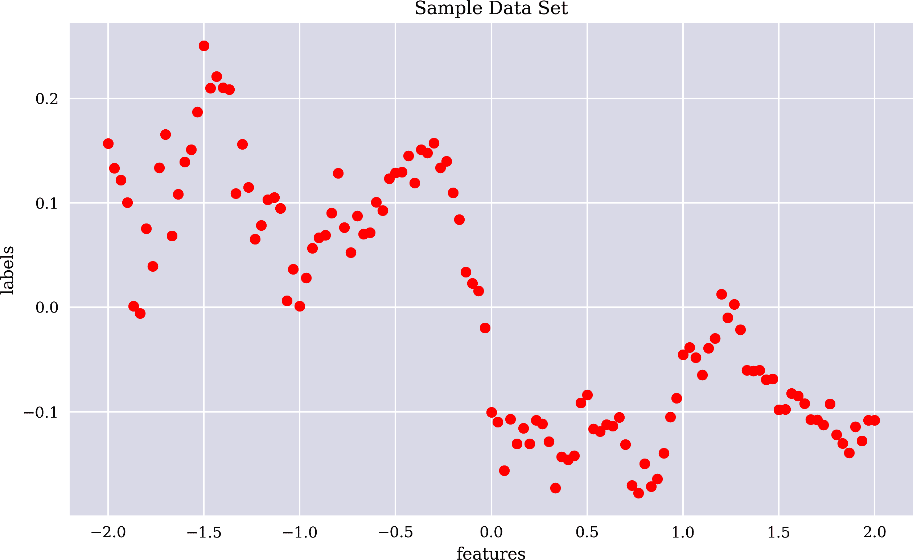

# 第五章：机器学习

> 数据主义认为宇宙由数据流组成，任何现象或实体的价值取决于其对数据处理的贡献……数据主义因此消除了动物（人类）和机器之间的障碍，并期望电子算法最终能够解读和超越生物化学算法。
> 
> Yuval Noah Harari（2015 年）
> 
> 机器学习是科学方法的高级版本。它遵循生成、测试、丢弃或精炼假设的相同过程。但是，一个科学家可能花一生时间提出和测试几百个假设，而一个机器学习系统可以在一秒钟内完成相同的工作。机器学习自动化了发现过程。因此，它正像革新商业一样，革新了科学。
> 
> Pedro Domingos（2015）

本章讨论的是*机器学习作为一个过程*。尽管使用了特定的算法和特定的数据来进行说明，但本章讨论的概念和方法是普遍适用的。本章的目标是以简单易懂和易于可视化的方式呈现机器学习的最重要元素。本章的方法是实用和说明性的，避免了大部分技术细节。从这个意义上说，本章提供了后续更为现实的机器学习应用的一种蓝图。

“学习”简要讨论了“学习”的机器概念。“数据”导入并预处理后续章节中使用的样本数据。样本数据基于 EUR/USD 汇率的时间序列。“成功”实施 OLS 回归和神经网络估计，使用均方误差作为成功的度量标准。“容量”讨论了模型容量在估计问题中使模型更成功的作用。“评估”解释了模型评估在机器学习过程中的角色，通常基于验证数据子集。“偏差和方差”讨论了*高偏差*和*高方差*模型在估计问题背景下的典型特征。“交叉验证”说明了交叉验证的概念，以避免由于过大的模型容量而导致的过拟合，其中之一。

VanderPlas（2017 年，第五章）讨论了与本章类似的主题，主要使用了`scikit-learn` Python 包。Chollet（2017 年，第四章）也提供了类似于这里提供的概述，但主要使用了`Keras`深度学习包。Goodfellow 等人（2016 年，第五章）对机器学习及其相关重要概念进行了更为技术化和数学化的概述。

# 学习

在更正式、更抽象的层面上，*学习*通过算法或计算机程序可以定义为 Mitchell（1997）中的方式：

> 据说计算机程序在某类任务<math alttext="upper T"><mi>T</mi></math>和性能度量<math alttext="upper P"><mi>P</mi></math>方面通过经验<math alttext="upper E"><mi>E</mi></math>来学习，如果它在任务<math alttext="upper T"><mi>T</mi></math>上的表现，由<math alttext="upper P"><mi>P</mi></math>来衡量，随着经验<math alttext="upper E"><mi>E</mi></math>而改善。

存在一类任务需要执行（例如，*估计*或*分类*）。然后有性能度量，例如*均方误差*（MSE）或*准确率比*。然后有*学习*，以算法在任务上的经验改进的性能来衡量。手头的任务类别是根据给定数据集描述的一般性质，其中包括监督学习情况下的特征数据和标签数据，或无监督学习情况下仅包括特征数据。

# 学习任务与待学习的任务

在通过算法或计算机程序进行学习的定义中，重要的是要注意学习任务和待学习任务之间的差异。*学习*意味着学习如何（最好地）执行某个任务，如估计或分类。

# 数据

本节介绍了接下来要使用的样本数据集。样本数据基于 EUR/USD 汇率的真实金融时间序列创建而成。首先，从 CSV 文件导入数据，然后将数据重新采样为月度数据，并存储在一个`Series`对象中：

```py
In [1]: import numpy as np
        import pandas as pd
        from pylab import plt, mpl
        np.random.seed(100)
        plt.style.use('seaborn')
        mpl.rcParams['savefig.dpi'] = 300
        mpl.rcParams['font.family'] = 'serif'

In [2]: url = 'http://hilpisch.com/aiif_eikon_eod_data.csv'  

In [3]: raw = pd.read_csv(url, index_col=0, parse_dates=True)['EUR=']  

In [4]: raw.head()
Out[4]: Date
        2010-01-01    1.4323
        2010-01-04    1.4411
        2010-01-05    1.4368
        2010-01-06    1.4412
        2010-01-07    1.4318
        Name: EUR=, dtype: float64

In [5]: raw.tail()
Out[5]: Date
        2019-12-26    1.1096
        2019-12-27    1.1175
        2019-12-30    1.1197
        2019-12-31    1.1210
        2020-01-01    1.1210
        Name: EUR=, dtype: float64

In [6]: l = raw.resample('1M').last()  

In [7]: l.plot(figsize=(10, 6), title='EUR/USD monthly');
```


导入金融时间序列数据


将数据重新采样为月度时间间隔

图 5-1 显示了金融时间序列。


###### 图 5-1\. EUR/USD 汇率作为时间序列（月度）

为了只有一个特征，以下 Python 代码创建了一个合成特征向量。这允许在二维中进行简单的可视化。当然，这个合成特征（自变量）对 EUR/USD 汇率（标签数据，因变量）没有任何解释能力。接下来，还将这些数据抽象为标签数据是顺序和时间性质的事实。本章中将样本数据集作为由一维特征向量和一维标签向量组成的通用数据集进行处理。图 5-2 展示了暗示一个*估计问题*是当前任务的样本数据集的可视化：

```py
In [8]: l = l.values  
        l -= l.mean()  

In [9]: f = np.linspace(-2, 2, len(l))  

In [10]: plt.figure(figsize=(10, 6))
         plt.plot(f, l, 'ro')
         plt.title('Sample Data Set')
         plt.xlabel('features')
         plt.ylabel('labels');
```


将标签数据转换为一个`ndarray`对象。


逐元素从数据中减去均值


创建一个合成特征作为 `ndarray` 对象



###### 图 5-2\. 样本数据集

# 成功

一般情况下，估计问题的成功度量是 MSE，如在第一章中使用的。根据 MSE，根据标签数据作为相关基准以及算法在暴露于数据集或其部分后的预测值进行评判。与第一章类似，本节及其后续节考虑了两种算法：OLS 回归和神经网络。

首先是 OLS 回归。应用是直接的，如下面的 Python 代码所示。回归结果在图 5-3 中展示，包括至五阶的单项式回归。计算得到的 MSE 也相应计算：

```py
In [11]: def MSE(l, p):
             return np.mean((l - p) ** 2)  

In [12]: reg = np.polyfit(f, l, deg=5)  
         reg  
Out[12]: array([-0.01910626, -0.0147182 ,  0.10990388,  0.06007211, -0.20833598,
                -0.03275423])

In [13]: p = np.polyval(reg, f)  

In [14]: MSE(l, p)  
Out[14]: 0.0034166422957371025

In [15]: plt.figure(figsize=(10, 6))
         plt.plot(f, l, 'ro', label='sample data')
         plt.plot(f, p, '--', label='regression')
         plt.legend();
```


函数 `MSE` 计算均方误差。


OLS 回归模型拟合到包括五阶单项式为止。


给出最优参数的 OLS 回归模型预测。


给出预测值的 MSE 值。


###### 图 5-3\. 样本数据和三次回归线

OLS 回归通常通过解析方法求解。因此，不存在迭代学习。然而，可以通过逐渐向算法暴露更多数据来模拟学习过程。以下 Python 代码实现了 OLS 回归和预测，从仅有的几个样本开始逐步增加数量，最终达到完整数据集的长度。回归步骤基于较小的子集实现，而预测步骤基于每种情况下的全部特征数据。一般而言，增加训练数据集时，MSE 明显下降：

```py
In [16]: for i in range(10, len(f) + 1, 20):
             reg = np.polyfit(f[:i], l[:i], deg=3)  
             p = np.polyval(reg, f)  
             mse = MSE(l, p)  
             print(f'{i:3d} | MSE={mse}')
          10 | MSE=248628.10681642237
          30 | MSE=731.9382249304651
          50 | MSE=12.236088505004465
          70 | MSE=0.7410590619743301
          90 | MSE=0.0057430617304093275
         110 | MSE=0.006492800939555582
```


基于数据子集的回归步骤


基于完整数据集的预测步骤


结果 MSE 值

其次是神经网络。对样本数据的应用再次是直接的，类似于第一章中的情况。图 5-4 展示了神经网络如何逼近样本数据：

```py
In [17]: import tensorflow as tf
         tf.random.set_seed(100)

In [18]: from keras.layers import Dense
         from keras.models import Sequential
         Using TensorFlow backend.

In [19]: model = Sequential()
         model.add(Dense(256, activation='relu', input_dim=1))  
         model.add(Dense(1, activation='linear')) 
         model.compile(loss='mse', optimizer='rmsprop')

In [20]: model.summary()
         Model: "sequential_1"
         _________________________________________________________________
         Layer (type)                 Output Shape              Param #
         =================================================================
         dense_1 (Dense)              (None, 256)               512
         _________________________________________________________________
         dense_2 (Dense)              (None, 1)                 257
         =================================================================
         Total params: 769
         Trainable params: 769
         Non-trainable params: 0
         _________________________________________________________________

In [21]: %time model.fit(f, l, epochs=1500, verbose=False)  
         CPU times: user 5.89 s, sys: 761 ms, total: 6.66 s
         Wall time: 4.43 s

Out[21]: <keras.callbacks.callbacks.History at 0x7fc05d599d90>

In [22]: p = model.predict(f).flatten()  

In [23]: MSE(l, p)  
Out[23]: 0.0020217512014360102

In [24]: plt.figure(figsize=(10, 6))
         plt.plot(f, l, 'ro', label='sample data')
         plt.plot(f, p, '--', label='DNN approximation')
         plt.legend();
```


神经网络是一个单隐藏层的浅层网络。


拟合步骤，具有相对较多的周期数。


预测步骤还会将 `ndarray` 对象展平。


DNN 预测的结果 MSE 值。


###### 图 5-4\. 示例数据和神经网络近似

使用`Keras`包，在每个学习步骤后存储 MSE 值。图 5-5 显示了神经网络训练的时期增加时（从图中可以看出）MSE 值（“损失”）的平均减少：

```py
In [25]: import pandas as pd

In [26]: res = pd.DataFrame(model.history.history)

In [27]: res.tail()
Out[27]:           loss
         1495  0.001547
         1496  0.001520
         1497  0.001456
         1498  0.001356
         1499  0.001325

In [28]: res.iloc[100:].plot(figsize=(10, 6))
         plt.ylabel('MSE')
         plt.xlabel('epochs');
```


###### 图 5-5\. MSE 值与训练时期数量的关系

# 容量

模型或算法的*容量*定义了模型或算法基本可以学习的函数或关系类型。在仅基于单项式的 OLS 回归中，只有一个参数定义了模型的容量：最高单项式的次数。如果将该次数参数设为`deg=3`，OLS 回归模型可以学习常数、线性、二次或三次类型的函数关系。参数`deg`越高，OLS 回归模型的容量就越高。

以下 Python 代码从`deg=1`开始，每次增加两个单位的次数。随着次数参数的增加，MSE 值单调减少。图 5-6 展示了考虑的所有次数的回归线：

```py
In [29]: reg = {}
         for d in range(1, 12, 2):
             reg[d] = np.polyfit(f, l, deg=d)  
             p = np.polyval(reg[d], f)
             mse = MSE(l, p)
             print(f'{d:2d} | MSE={mse}')
          1 | MSE=0.005322474034260403
          3 | MSE=0.004353110724143185
          5 | MSE=0.0034166422957371025
          7 | MSE=0.0027389501772354025
          9 | MSE=0.001411961626330845
         11 | MSE=0.0012651237868752322

In [30]: plt.figure(figsize=(10, 6))
         plt.plot(f, l, 'ro', label='sample data')
         for d in reg:
             p = np.polyval(reg[d], f)
             plt.plot(f, p, '--', label=f'deg={d}')
         plt.legend();
```


不同`deg`值的回归步骤


###### 图 5-6\. 不同最高次数的回归线

神经网络的容量取决于一些*超参数*。其中通常包括以下内容：

+   隐藏层的数量

+   每个隐藏层的隐藏单元数量

综合考虑这两个超参数，它们定义了神经网络中可训练参数（权重）的数量。前一节中的神经网络模型具有相对较少的可训练参数。例如，仅增加一个相同大小的层，可显著增加可训练参数的数量。虽然可能需要增加训练时期的数量，但容量更高的神经网络模型的 MSE 值显著减少，视觉上的拟合效果也更好，正如图 5-7 所示：

```py
In [31]: def create_dnn_model(hl=1, hu=256):
             ''' Function to create Keras DNN model.

             Parameters
             ==========
             hl: int
                 number of hidden layers
             hu: int
                 number of hidden units (per layer)
             '''
             model = Sequential()
             for _ in range(hl):
                 model.add(Dense(hu, activation='relu', input_dim=1))  
             model.add(Dense(1, activation='linear'))
             model.compile(loss='mse', optimizer='rmsprop')
             return model

In [32]: model = create_dnn_model(3)  

In [33]: model.summary()  
         Model: "sequential_2"
         _________________________________________________________________
         Layer (type)                 Output Shape              Param #
         =================================================================
         dense_3 (Dense)              (None, 256)               512
         _________________________________________________________________
         dense_4 (Dense)              (None, 256)               65792
         _________________________________________________________________
         dense_5 (Dense)              (None, 256)               65792
         _________________________________________________________________
         dense_6 (Dense)              (None, 1)                 257
         =================================================================
         Total params: 132,353
         Trainable params: 132,353
         Non-trainable params: 0
         _________________________________________________________________

In [34]: %time model.fit(f, l, epochs=2500, verbose=False)
         CPU times: user 34.9 s, sys: 5.91 s, total: 40.8 s
         Wall time: 15.5 s

Out[34]: <keras.callbacks.callbacks.History at 0x7fc03fc18890>

In [35]: p = model.predict(f).flatten()

In [36]: MSE(l, p)
Out[36]: 0.00046612284916401614

In [37]: plt.figure(figsize=(10, 6))
         plt.plot(f, l, 'ro', label='sample data')
         plt.plot(f, p, '--', label='DNN approximation')
         plt.legend();
```


可能向神经网络添加许多层


深度神经网络具有三个隐藏层


摘要显示了可训练参数的增加数量（增加的容量）


###### 图 5-7\. 示例数据和 DNN 近似（更高容量）

# 评估

在前几节中，分析侧重于估算算法在整个样本数据集上的性能。一般规则是，模型或算法的能力直接影响其在相同数据集上进行训练和评估时的性能。然而，在机器学习中，“简单且容易的情况”只是其中之一。更复杂和有趣的情况是，训练完成的模型或算法需要在其从未见过的数据上进行泛化。例如，这样的泛化可以是根据股票历史价格预测（估算）未来股票价格，或者根据现有债务人的数据对潜在债务人进行“信用良好”或“不良信用”的分类。

尽管在估算的上下文中经常自由使用“预测”这个术语，但在用于训练的特征数据集上，真正的预测可能意味着预测一些事先不知道并且从未见过的东西。再次强调，预测未来股票价格是在时间上的真正预测的一个很好的例子。

一般而言，给定数据集被划分为各具不同目的的子集：

训练数据集

这是用于算法训练的子集。

验证数据集

这是用于在训练期间验证算法性能的子集，而这个数据集与训练数据集不同。

测试数据集

这是在训练完成后仅对已训练算法进行测试的子集。

通过将（当前）训练过的算法应用于验证数据集获得的见解，可能会反映在训练本身上（例如通过调整模型的超参数）。另一方面，测试训练过的算法在测试数据集上的见解则不应该反映在训练本身或超参数中。

以下 Python 代码有些随意地选择了样本数据的 25%进行测试；模型或算法在训练（学习）完成之前不会见到这些数据。同样地，样本数据的 25%用于验证；这些数据用于在训练步骤中监视性能，可能在许多学习迭代中都会用到。剩余的 50%用于训练（学习）本身。¹ 鉴于样本数据集，将洗牌技术应用于随机填充所有样本数据子集是合理的：

```py
In [38]: te = int(0.25 * len(f))  
         va = int(0.25 * len(f))  

In [39]: np.random.seed(100)
         ind = np.arange(len(f))  
         np.random.shuffle(ind)  

In [40]: ind_te = np.sort(ind[:te])  
         ind_va = np.sort(ind[te:te + va])  
         ind_tr = np.sort(ind[te + va:])  

In [41]: f_te = f[ind_te]  
         f_va = f[ind_va]  
         f_tr = f[ind_tr]  

In [42]: l_te = l[ind_te]  
         l_va = l[ind_va]  
         l_tr = l[ind_tr]  
```


测试数据集样本数量


验证数据集样本数量


完整数据集的随机索引


对数据子集进行排序后的索引结果


得到的特征数据子集


得到的标签数据子集

# 随机抽样

对于既非顺序类也非时间性质的数据集，随机化训练、验证和测试数据集是一种常见且有用的技术。然而，当处理例如财务时间序列时，应避免对数据进行洗牌，因为这会破坏时间结构，并通过在训练中使用稍后的样本并在较早的样本上实施测试，引入先见性偏差。

基于训练和验证数据子集，以下 Python 代码实现了不同`deg`参数值的回归，并计算了对两个数据子集进行预测的 MSE 值。尽管训练数据集上的 MSE 值单调下降，但验证数据集上的 MSE 值通常会在某个参数值达到最小值后再次增加。这种现象表明了所谓的*过拟合*。图 5-8 显示了不同`deg`值的回归拟合，并比较了训练数据和验证数据集的拟合情况：

```py
In [43]: reg = {}
         mse = {}
         for d in range(1, 22, 4):
             reg[d] = np.polyfit(f_tr, l_tr, deg=d)
             p = np.polyval(reg[d], f_tr)
             mse_tr = MSE(l_tr, p)  
             p = np.polyval(reg[d], f_va)
             mse_va = MSE(l_va, p)  
             mse[d] = (mse_tr, mse_va)
             print(f'{d:2d} | MSE_tr={mse_tr:7.5f} | MSE_va={mse_va:7.5f}')
          1 | MSE_tr=0.00574 | MSE_va=0.00492
          5 | MSE_tr=0.00375 | MSE_va=0.00273
          9 | MSE_tr=0.00132 | MSE_va=0.00243
         13 | MSE_tr=0.00094 | MSE_va=0.00183
         17 | MSE_tr=0.00060 | MSE_va=0.00153
         21 | MSE_tr=0.00046 | MSE_va=0.00837

In [44]: fig, ax = plt.subplots(2, 1, figsize=(10, 8), sharex=True)
         ax[0].plot(f_tr, l_tr, 'ro', label='training data')
         ax[1].plot(f_va, l_va, 'go', label='validation data')
         for d in reg:
             p = np.polyval(reg[d], f_tr)
             ax[0].plot(f_tr, p, '--', label=f'deg={d} (tr)')
             p = np.polyval(reg[d], f_va)
             plt.plot(f_va, p, '--', label=f'deg={d} (va)')
         ax[0].legend()
         ax[1].legend();
```


训练数据集的 MSE 值


验证数据集的 MSE 值


###### 图 5-8\. 包括回归拟合的训练和验证数据

使用`Keras`和神经网络模型，可以监控每个学习步骤的验证数据集性能。还可以使用回调函数在观察到训练数据集上的性能没有进一步改进时，提前停止模型训练。以下 Python 代码利用了这样的回调函数。图 5-9 显示了神经网络对训练和验证数据集的预测：

```py
In [45]: from keras.callbacks import EarlyStopping

In [46]: model = create_dnn_model(2, 256)

In [47]: callbacks = EarlyStopping(monitor='loss',  
                                   restore_best_weights=True)]  

In [48]: %%time
         model.fit(f_tr, l_tr, epochs=3000, verbose=False,
                   validation_data=(f_va, l_va),  
                   callbacks=callbacks)  
         CPU times: user 8.07 s, sys: 1.33 s, total: 9.4 s
         Wall time: 4.81 s

Out[48]: <keras.callbacks.callbacks.History at 0x7fc0438b47d0>

In [49]: fig, ax = plt.subplots(2, 1, sharex=True, figsize=(10, 8))
         ax[0].plot(f_tr, l_tr, 'ro', label='training data')
         p = model.predict(f_tr)
         ax[0].plot(f_tr, p, '--', label=f'DNN (tr)')
         ax[0].legend()
         ax[1].plot(f_va, l_va, 'go', label='validation data')
         p = model.predict(f_va)
         ax[1].plot(f_va, p, '--', label=f'DNN (va)')
         ax[1].legend();
```


基于训练数据 MSE 值停止学习。


只有在一定数量的时期内没有显示改进时才会停止。


当学习停止时，最佳权重会被恢复。


指定了验证数据子集。


回调函数被传递给`fit()`方法。


###### 图 5-9\. 包括 DNN 预测的训练和验证数据

`Keras`允许分析模型在每个训练时期中在两个数据集上的 MSE 值的变化。图 5-10 显示，随着训练时期数量的增加，MSE 值平均下降，但不是单调的：

```py
In [50]: res = pd.DataFrame(model.history.history)

In [51]: res.tail()
Out[51]:       val_loss      loss
         1375  0.000854  0.000544
         1376  0.000685  0.000473
         1377  0.001326  0.000942
         1378  0.001026  0.000867
         1379  0.000710  0.000500

In [52]: res.iloc[35::25].plot(figsize=(10, 6))
         plt.ylabel('MSE')
         plt.xlabel('epochs');
```


###### 图 5-10\. DNN 模型在训练和验证数据集上的 MSE 值

在 OLS 回归的情况下，人们可能会选择一个高但不太高的度参数值，如`deg=9`。神经网络模型的参数化在训练结束时自动给出最佳模型配置。Figure 5-10 比较了两种模型的预测结果以及测试数据集。考虑到样本数据的性质，神经网络在测试数据集上表现稍好并不奇怪：

```py
In [53]: p_ols = np.polyval(reg[5], f_te)
         p_dnn = model.predict(f_te).flatten()

In [54]: MSE(l_te, p_ols)
Out[54]: 0.0038960346771028356

In [55]: MSE(l_te, p_dnn)
Out[55]: 0.000705705678438721

In [56]: plt.figure(figsize=(10, 6))
         plt.plot(f_te, l_te, 'ro', label='test data')
         plt.plot(f_te, p_ols, '--', label='OLS prediction')
         plt.plot(f_te, p_dnn, '-.', label='DNN prediction');
         plt.legend();
```


###### Figure 5-11\. 测试数据及 OLS 回归和 DNN 模型的预测结果

# 偏差和方差

机器学习普遍存在的主要问题，特别是在应用于金融数据时，是*过拟合*问题。当模型在验证和测试数据上的表现比在训练数据上差时，就称为模型过拟合训练数据。以 OLS 回归为例，可以通过视觉和数值上的示例来说明这个问题。

以下 Python 代码使用较小的训练和验证子集实施了线性回归，以及一个高阶回归。如 Figure 5-12 所示，线性回归拟合在训练数据集上具有*高偏差*，预测和标签数据之间的绝对差异相对较大。高阶拟合显示了*高方差*，它精确地命中所有训练数据点，但拟合本身因为追求完美拟合而变化显著：

```py
In [57]: f_tr = f[:20:2]  
         l_tr = l[:20:2]  

In [58]: f_va = f[1:20:2]  
         l_va = l[1:20:2]  

In [59]: reg_b = np.polyfit(f_tr, l_tr, deg=1)  

In [60]: reg_v = np.polyfit(f_tr, l_tr, deg=9, full=True)[0]  

In [61]: f_ = np.linspace(f_tr.min(), f_va.max(), 75)  

In [62]: plt.figure(figsize=(10, 6))
         plt.plot(f_tr, l_tr, 'ro', label='training data')
         plt.plot(f_va, l_va, 'go', label='validation data')
         plt.plot(f_, np.polyval(reg_b, f_), '--', label='high bias')
         plt.plot(f_, np.polyval(reg_v, f_), '--', label='high variance')
         plt.ylim(-0.2)
         plt.legend(loc=2);
```


较小特征数据子集


较小标签数据子集


高偏差 OLS 回归（线性）


高方差 OLS 回归（更高阶）


用于绘图的扩大特征数据集


###### Figure 5-12\. 高偏差和高方差 OLS 回归拟合

Figure 5-12 显示，在这个例子中，高偏差拟合在训练数据上的表现比高方差拟合差。但是这里的高方差拟合过度拟合，其在验证数据上表现更差。可以通过比较所有情况下的性能指标来说明这一点。以下 Python 代码不仅计算了 MSE 值，还计算了<math alttext="upper R squared"><msup><mi>R</mi> <mn>2</mn></msup></math>值：

```py
In [63]: from sklearn.metrics import r2_score

In [64]: def evaluate(reg, f, l):
             p = np.polyval(reg, f)
             bias = np.abs(l - p).mean()  
             var = p.var()  
             msg = f'MSE={MSE(l, p):.4f} | R2={r2_score(l, p):9.4f} | '
             msg += f'bias={bias:.4f} | var={var:.4f}'
             print(msg)

In [65]: evaluate(reg_b, f_tr, l_tr)  
         MSE=0.0026 | R2=   0.3484 | bias=0.0423 | var=0.0014

In [66]: evaluate(reg_b, f_va, l_va)  
         MSE=0.0032 | R2=   0.4498 | bias=0.0460 | var=0.0014

In [67]: evaluate(reg_v, f_tr, l_tr)  
         MSE=0.0000 | R2=   1.0000 | bias=0.0000 | var=0.0040

In [68]: evaluate(reg_v, f_va, l_va)  
         MSE=0.8752 | R2=-149.2658 | bias=0.3565 | var=0.7539
```


模型偏差定义为平均绝对差异


模型方差定义为模型预测的方差


*高偏差*模型在*训练数据*上的表现


*高偏差*模型在*验证数据*上的表现


*高方差*模型在*训练数据*上的表现


*高方差*模型在*验证数据*上的表现

结果显示，高偏差模型在训练和验证数据集上的表现大致相当。相比之下，高方差模型在训练数据上表现完美，但在验证数据上表现非常糟糕。

# 交叉验证

避免过拟合的标准方法是*交叉验证*，在此期间会对多个训练和验证数据集进行测试。`scikit-learn`包提供了一种标准化的实现交叉验证的功能。`cross_val_score`函数可应用于任何`scikit-learn`模型对象。

以下代码在完整样本数据集上实现 OLS 回归方法，使用`scikit-learn`的多项式 OLS 回归模型。为最高多项式的不同度数实现了五折交叉验证。随着最高度数的增加，交叉验证得分平均变得更差。当使用前 20%数据用于验证（图 5-3 左侧的数据）或使用最后 20%数据时，特别糟糕的结果被观察到（图 5-3 右侧的数据）。类似地，最佳验证分数出现在样本数据集中间的 20%上：

```py
In [69]: from sklearn.model_selection import cross_val_score
         from sklearn.preprocessing import PolynomialFeatures
         from sklearn.linear_model import LinearRegression
         from sklearn.pipeline import make_pipeline

In [70]: def PolynomialRegression(degree=None, **kwargs):
             return make_pipeline(PolynomialFeatures(degree),
                                 LinearRegression(**kwargs))  

In [71]: np.set_printoptions(suppress=True,
                 formatter={'float': lambda x: f'{x:12.2f}'})  

In [72]: print('\nCross-validation scores')
         print(74 * '=')
         for deg in range(0, 10, 1):
             model = PolynomialRegression(deg)
             cvs = cross_val_score(model, f.reshape(-1, 1), l, cv=5)  
             print(f'deg={deg} | ' + str(cvs.round(2)))

         Cross-validation scores
         ==========================================================================
         deg=0 | [       -6.07        -7.34        -0.09        -6.32        -8.69]
         deg=1 | [       -0.28        -1.40         0.16        -1.66        -4.62]
         deg=2 | [       -3.48        -2.45         0.19        -1.57       -12.94]
         deg=3 | [       -0.00        -1.24         0.32        -0.48       -43.62]
         deg=4 | [     -222.81        -2.88         0.37        -0.32      -496.61]
         deg=5 | [     -143.67        -5.85         0.49         0.12     -1241.04]
         deg=6 | [    -4038.96       -14.71         0.49        -0.33      -317.32]
         deg=7 | [    -9937.83       -13.98         0.64         0.22    -18725.61]
         deg=8 | [    -3514.36       -11.22        -0.15        -6.29   -298744.18]
         deg=9 | [    -7454.15        -0.91         0.15        -0.41    -13580.75]
```


创建多项式回归模型类


调整了`numpy`的默认打印设置


实现了五折交叉验证

`Keras`提供了包装类，用于将`Keras`模型对象与`scikit-learn`功能结合使用，例如`cross_val_score`函数。以下示例使用`KerasRegressor`类来包装神经网络模型，并对其应用交叉验证。与 OLS 回归交叉验证得分相比，这两个测试网络的交叉验证得分整体更好。在本例中，神经网络的容量并不起太大的作用：

```py
In [73]: np.random.seed(100)
         tf.random.set_seed(100)
         from keras.wrappers.scikit_learn import KerasRegressor

In [74]: model = KerasRegressor(build_fn=create_dnn_model,
                               verbose=False, epochs=1000,
                               hl=1, hu=36)  

In [75]: %time cross_val_score(model, f, l, cv=5)  
         CPU times: user 18.6 s, sys: 2.17 s, total: 20.8 s
         Wall time: 14.6 s

Out[75]: array([       -0.02,        -0.01,        -0.00,        -0.00,
                       -0.01])

In [76]: model = KerasRegressor(build_fn=create_dnn_model,
                               verbose=False, epochs=1000,
                               hl=3, hu=256)  

In [77]: %time cross_val_score(model, f, l, cv=5)  
         CPU times: user 1min 5s, sys: 11.6 s, total: 1min 16s
         Wall time: 30.1 s

Out[77]: array([       -0.08,        -0.00,        -0.00,        -0.00,
                       -0.05])
```


具有*低*容量的神经网络的包装类


具有*低*容量的神经网络的交叉验证


具有*高*容量的神经网络的包装类


具有*高*容量的神经网络的交叉验证

# 避免过拟合

过拟合指的是模型在训练数据集上表现比在验证和测试数据集上表现要好得多，这在机器学习中一般以及在金融领域尤其要避免。适当的评估程序和分析，比如交叉验证，有助于预防过拟合并找到合适的模型容量。

# 结论

本章提供了一个机器学习过程的蓝图。所呈现的主要元素如下：

学习

机器*学习*到底意味着什么？

数据

使用什么原始数据以及哪些（预处理过的）特征和标签数据？

成功

鉴于数据间接定义的问题（估计、分类等），什么是成功的适当衡量标准？

容量

模型容量扮演着什么角色，以及针对手头问题，什么样的容量可能是合适的？

评估

鉴于训练模型的目的，如何评估模型的性能？

偏差和方差

针对手头问题，哪种模型更适合：那些具有相当高的偏差还是相当高的方差？

交叉验证

对于非序列型数据集，当在不同配置上进行交叉验证时，模型在训练和验证数据子集上的表现如何？

此蓝图松散应用于后续章节中的多个实际金融用例。有关机器学习作为过程的更多背景信息和细节，请参阅本章末尾列出的参考文献。

# 参考文献

本章引用的书籍和论文：

+   Chollet，François。2017。*深度学习与 Python*。Shelter Island：Manning。

+   Domingos，Pedro。2015。*大师算法：寻找终极学习机器的探索如何重塑我们的世界*。纽约：基础书籍。

+   Goodfellow，Ian，Yoshua Bengio 和 Aaron Courville。2016。*深度学习*。剑桥：麻省理工学院出版社。[*http://deeplearningbook.org*](http://deeplearningbook.org)。

+   Harari，Yuval Noah。2015。*人类大未来：明日简史*。伦敦：Harvill Secker。

+   Mitchell，Tom M。1997。*机器学习*。纽约：麦格劳希尔。

+   VanderPlas，Jake。2017。*Python 数据科学手册*。Sebastopol：O’Reilly。

¹在这个上下文中提到的经验法则通常是“60％，20％，20％”，用于将给定数据集分割为训练、验证和测试数据子集。
