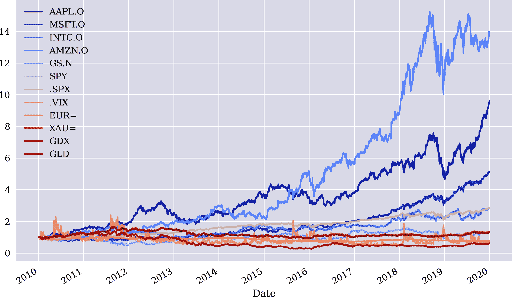
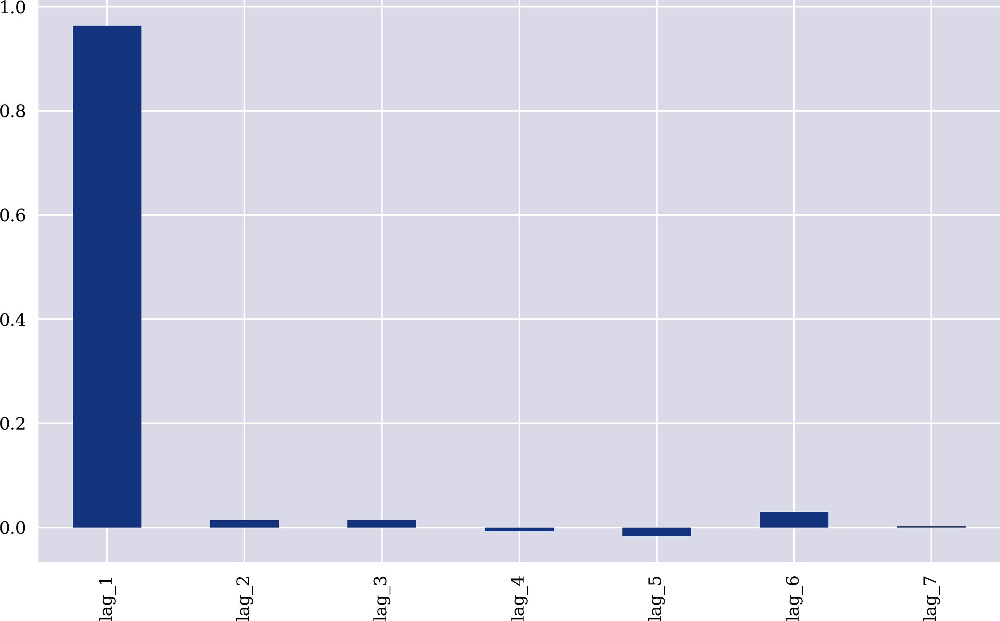

# 第六章：AI 优先金融

> 计算接收信息并对其进行转换，实现数学家所称的*函数*……如果你拥有一个函数，输入全球所有的金融数据并输出最佳股票购买建议，你很快就会变得非常富有。
> 
> Max Tegmark (2017)

本章旨在将数据驱动的金融与前一章的机器学习方法结合起来。这仅代表了这一努力的开端，因为首次使用神经网络来发现统计上的非效率性。“有效市场”讨论了有效市场假说，并使用 OLS 回归根据金融时间序列数据加以说明。“基于收益数据的市场预测”首次应用神经网络和 OLS 回归来预测金融工具价格的未来走向（“市场走向”）。分析仅依赖于收益数据。“添加更多特征的市场预测”混合了更多特征，如典型的财务指标。在这一背景下，初步结果表明统计上的非效率性可能确实存在。这在“市场预测—日内交易”中得到了证实，与每日结束数据相比，这里使用的是日内数据。最后，“结论”讨论了大数据与人工智能在某些领域的有效性，并认为 AI 优先、无理论的金融可能是摆脱传统金融理论谬误的一种途径。

# 有效市场

其中一种得到最强实证支持的假设是*有效市场假说*（EMH）。它也被称为*随机行走假说*（RWH）。¹ 简单地说，该假说认为某一时间点上的金融工具价格反映了此时所有可用信息。如果 EMH 成立，讨论股票价格是否过高或过低将是毫无意义的。根据 EMH，股票价格始终恰好处于其合适水平，考虑了当前可用信息。

自从上世纪 60 年代提出和首次讨论有效市场理论（EMH）以来，已经付出了大量努力来完善和形式化这一理念。Jensen（1978）中提出的定义至今仍在使用。Jensen 将有效市场定义如下：

> 一个市场在信息集合<math alttext="theta Subscript t"><msub><mi>θ</mi> <mi>t</mi></msub></math>的条件下是有效的，如果根据信息集合<math alttext="theta Subscript t"><msub><mi>θ</mi> <mi>t</mi></msub></math>进行交易是无法获得经济利润的。这里的经济利润指的是扣除所有成本后的风险调整收益。

在这个背景下，Jensen 区分了三种市场效率形式：

弱式 EMH

在这种情况下，信息集<math alttext="theta Subscript t"><msub><mi>θ</mi> <mi>t</mi></msub></math>仅包括市场过去的价格和回报历史。

EMH 的半强形式

在这种情况下，信息集<math alttext="theta Subscript t"><msub><mi>θ</mi> <mi>t</mi></msub></math>被认为是所有公开可获得的信息，包括过去的价格和回报历史，以及财务报告、新闻文章、天气数据等等。

EMH 的强形式

当信息集<math alttext="theta Subscript t"><msub><mi>θ</mi> <mi>t</mi></msub></math>包括任何人可获得的所有信息时（即，甚至包括私人信息）。

无论假设了哪种形式，EMH 的影响都是深远的。在他关于 EMH 的开创性文章中，Fama（1965）得出了以下结论：

> 多年来，经济学家、统计学家和金融教师一直对股价行为的模型进行开发和测试。从这项研究中发展而来的一个重要模型是随机漫步理论。这个理论严重质疑了许多其他描述和预测股价行为的方法——这些方法在学术界之外颇受欢迎。例如，我们将在后面看到，如果随机漫步理论准确描述了现实，那么各种用于预测股价的“技术”或“图表”程序完全没有价值。

换句话说，如果 EMH 成立，那么任何为了实现超额市场回报而进行的研究或数据分析在实践中都应该是无用的。另一方面，一个价值数万亿美元的资产管理行业已经发展起来，承诺通过严格的研究和资本的积极管理实现这种超额市场回报。特别是，对冲基金行业是基于承诺提供*alpha*——即超额市场回报甚至独立于市场回报，至少在很大程度上是如此。近期[Preqin](https://oreil.ly/C38Tl)的一项研究数据显示了实现这种承诺有多么困难。该研究报告称，2018 年 Preqin 全策略对冲基金指数下跌了-3.42%。研究覆盖的所有对冲基金中，近 40%在那一年经历了 5%或更大的损失。

如果股票价格（或任何其他金融工具的价格）遵循标准随机漫步，则其回报通常服从均值为零的正态分布。股票价格上涨的概率和下跌的概率均为 50%。在这种情况下，从最小二乘意义上讲，预测明天股票价格的最佳预测变量是今天的股票价格。这是由于随机漫步的马尔可夫性质，即未来股票价格的分布与价格过程的历史无关；它只依赖于当前价格水平。因此，在随机漫步的背景下，分析历史价格（或回报）对于预测未来价格是无用的。

在此背景下，可以实施一个半正式的有效市场检验。² 获取一个金融时间序列，将价格数据滞后多次，使用滞后价格数据作为 OLS 回归的特征数据，使用当前价格水平作为标签数据。这与依赖历史价格形态来预测未来价格的图表技术精神相似。

以下 Python 代码基于多个金融工具（可交易和不可交易的）的滞后价格数据实施了这样的分析。首先，导入数据及其可视化（见图 6-1）：

```py
In [1]: import numpy as np
        import pandas as pd
        from pylab import plt, mpl
        plt.style.use('seaborn')
        mpl.rcParams['savefig.dpi'] = 300
        mpl.rcParams['font.family'] = 'serif'
        pd.set_option('precision', 4)
        np.set_printoptions(suppress=True, precision=4)

In [2]: url = 'http://hilpisch.com/aiif_eikon_eod_data.csv'  

In [3]: data = pd.read_csv(url, index_col=0, parse_dates=True).dropna()  

In [4]: (data / data.iloc[0]).plot(figsize=(10, 6), cmap='coolwarm');  
```


将数据读入`DataFrame`对象中


绘制标准化的时间序列数据



###### 图 6-1\. 标准化的时间序列数据（每日末）

其次，对所有金融时间序列的价格数据进行滞后，并存储在`DataFrame`对象中：

```py
In [5]: lags = 7  

In [6]: def add_lags(data, ric, lags):
            cols = []
            df = pd.DataFrame(data[ric])
            for lag in range(1, lags + 1):
                col = 'lag_{}'.format(lag)  
                df[col] = df[ric].shift(lag)  
                cols.append(col)  
            df.dropna(inplace=True)  
            return df, cols

In [7]: dfs = {}
        for sym in data.columns:
            df, cols = add_lags(data, sym, lags)  
            dfs[sym] = df  

In [8]: dfs[sym].head(7)  
Out[8]:                GLD   lag_1   lag_2   lag_3   lag_4   lag_5   lag_6   lag_7
        Date
        2010-01-13  111.54  110.49  112.85  111.37  110.82  111.51  109.70  109.80
        2010-01-14  112.03  111.54  110.49  112.85  111.37  110.82  111.51  109.70
        2010-01-15  110.86  112.03  111.54  110.49  112.85  111.37  110.82  111.51
        2010-01-19  111.52  110.86  112.03  111.54  110.49  112.85  111.37  110.82
        2010-01-20  108.94  111.52  110.86  112.03  111.54  110.49  112.85  111.37
        2010-01-21  107.37  108.94  111.52  110.86  112.03  111.54  110.49  112.85
        2010-01-22  107.17  107.37  108.94  111.52  110.86  112.03  111.54  110.49
```


滞后数（以交易日计）


创建列名


滞后价格数据


将列名添加到`list`对象中


删除所有不完整的数据行


为每个财务时间序列创建滞后数据


将结果存储在`dict`对象中


展示滞后价格数据的示例

第三，准备好数据后，OLS 回归分析变得直观易行。图 6-2 展示了平均最优回归结果。毫无疑问，仅滞后一天的价格数据具有最高的解释力。其权重接近于 1，支持这样一个观点：金融工具明天价格的最佳预测者是今天的价格。对每个财务时间序列单独进行的回归结果也是如此：

```py
In [9]: regs = {}
        for sym in data.columns:
            df = dfs[sym]  
            reg = np.linalg.lstsq(df[cols], df[sym], rcond=-1)[0]  
            regs[sym] = reg  

In [10]: rega = np.stack(tuple(regs.values()))  

In [11]: regd = pd.DataFrame(rega, columns=cols, index=data.columns)  

In [12]: regd  
Out[12]:          lag_1   lag_2   lag_3   lag_4   lag_5   lag_6   lag_7
         AAPL.O  1.0106 -0.0592  0.0258  0.0535 -0.0172  0.0060 -0.0184
         MSFT.O  0.8928  0.0112  0.1175 -0.0832 -0.0258  0.0567  0.0323
         INTC.O  0.9519  0.0579  0.0490 -0.0772 -0.0373  0.0449  0.0112
         AMZN.O  0.9799 -0.0134  0.0206  0.0007  0.0525 -0.0452  0.0056
         GS.N    0.9806  0.0342 -0.0172  0.0042 -0.0387  0.0585 -0.0215
         SPY     0.9692  0.0067  0.0228 -0.0244 -0.0237  0.0379  0.0121
         .SPX    0.9672  0.0106  0.0219 -0.0252 -0.0318  0.0515  0.0063
         .VIX    0.8823  0.0591 -0.0289  0.0284 -0.0256  0.0511  0.0306
         EUR=    0.9859  0.0239 -0.0484  0.0508 -0.0217  0.0149 -0.0055
         XAU=    0.9864  0.0069  0.0166 -0.0215  0.0044  0.0198 -0.0125
         GDX     0.9765  0.0096 -0.0039  0.0223 -0.0364  0.0379 -0.0065
         GLD     0.9766  0.0246  0.0060 -0.0142 -0.0047  0.0223 -0.0106

In [13]: regd.mean().plot(kind='bar', figsize=(10, 6));  
```


获取当前时间序列的数据


实施回归分析。


将最优回归参数存储在`dict`对象中。


将最优结果合并为单个`ndarray`对象。


将结果放入`DataFrame`对象并展示。


可视化每个滞后期的平均最优回归参数（权重）。



###### 图 6-2。滞后价格的平均最优回归参数。

鉴于这种半正式分析，至少在其弱形式上，EMH 似乎有强有力的支持证据。值得注意的是，在此实施的 OLS 回归分析违反了几个假设。其中之一是假设特征在彼此间不相关，而实际上它们应该与标签数据高度相关。然而，滞后价格数据导致特征高度相关。以下 Python 代码展示了相关数据，显示所有特征之间几乎完美的相关性。这解释了为什么只需一个特征（“滞后 1”）就足以完成基于 OLS 回归方法的近似和预测。添加更多高度相关的特征并不会带来任何改进。另一个违反的基本假设是时间序列数据的*平稳性*，以下代码也对此进行了测试：³

```py
In [14]: dfs[sym].corr()  
Out[14]:           GLD   lag_1   lag_2   lag_3   lag_4   lag_5   lag_6   lag_7
         GLD    1.0000  0.9972  0.9946  0.9920  0.9893  0.9867  0.9841  0.9815
         lag_1  0.9972  1.0000  0.9972  0.9946  0.9920  0.9893  0.9867  0.9842
         lag_2  0.9946  0.9972  1.0000  0.9972  0.9946  0.9920  0.9893  0.9867
         lag_3  0.9920  0.9946  0.9972  1.0000  0.9972  0.9946  0.9920  0.9893
         lag_4  0.9893  0.9920  0.9946  0.9972  1.0000  0.9972  0.9946  0.9920
         lag_5  0.9867  0.9893  0.9920  0.9946  0.9972  1.0000  0.9972  0.9946
         lag_6  0.9841  0.9867  0.9893  0.9920  0.9946  0.9972  1.0000  0.9972
         lag_7  0.9815  0.9842  0.9867  0.9893  0.9920  0.9946  0.9972  1.0000

In [15]: from statsmodels.tsa.stattools import adfuller  

In [16]: adfuller(data[sym].dropna())  
Out[16]: (-1.9488969577009954,
          0.3094193074034718,
          0,
          2515,
          {'1%': -3.4329527780962255,
           '5%': -2.8626898965523724,
           '10%': -2.567382133955709},
          8446.683102944744)
```


展示了滞后时间序列之间的相关性。


使用[增广迪基-富勒](https://oreil.ly/rfdaC)检验稳定性。

综上所述，如果 EMH 成立，积极或算法投资组合管理或交易将毫无经济意义。简单地投资于股票或 MVP 意义上的高效投资组合，并长期 passively 持有投资，将会得到至少与不作任何努力相当的，如果不是更高的回报。根据 CAPM 和 MVP，投资者愿意承受的风险越高，预期回报也应该越高。事实上，正如 Copeland 等人（2005 年，第十章）指出的那样，CAPM 和 EMH 对金融市场形成了一个联合假设：如果 EMH 被拒绝，则 CAPM 也必须被拒绝，因为其推导假设 EMH 成立。

# 基于收益数据的市场预测。

正如第二章所示，机器学习（ML），特别是深度学习（DL）算法，在近年来在一些长期以来对标准统计或数学方法有抵抗力的领域中取得了突破。那么在金融市场呢？ML 和 DL 算法能否发现传统金融计量方法（如 OLS 回归）失效的地方？当然，对于这些问题目前还没有简单明了的答案。

然而，一些具体的例子可能会为可能的答案提供启示。为此，使用与前一节相同的数据，从价格数据中派生对数收益。其目的是比较 OLS 回归和神经网络在预测不同时间序列的下一日价格走势方面的表现。当前阶段的目标是发现*统计无效*与*经济无效*的差异。当模型能够以一定优势（例如，预测准确率达到 55%或 60%的情况下）预测未来价格走势时，称为统计无效。只有当这种统计无效能够通过考虑交易成本等因素实现盈利的交易策略时，才称为经济无效。

分析的第一步是创建带有滞后对数收益数据的数据集。还对归一化的滞后对数收益数据进行了平稳性测试（已给出），并测试了特征之间的相关性（无相关性）。由于以下分析仅依赖于与时间序列相关的数据，因此它们处理的是*弱式市场效率*：

```py
In [17]: rets = np.log(data / data.shift(1))  

In [18]: rets.dropna(inplace=True)

In [19]: dfs = {}
         for sym in data:
             df, cols = add_lags(rets, sym, lags)  
             mu, std = df[cols].mean(), df[cols].std()  
             df[cols] = (df[cols] - mu) / std  
             dfs[sym] = df

In [20]: dfs[sym].head()  
Out[20]:                GLD   lag_1   lag_2   lag_3   lag_4   lag_5   lag_6   lag_7
         Date
         2010-01-14  0.0044  0.9570 -2.1692  1.3386  0.4959 -0.6434  1.6613 -0.1028
         2010-01-15 -0.0105  0.4379  0.9571 -2.1689  1.3388  0.4966 -0.6436  1.6614
         2010-01-19  0.0059 -1.0842  0.4385  0.9562 -2.1690  1.3395  0.4958 -0.6435
         2010-01-20 -0.0234  0.5967 -1.0823  0.4378  0.9564 -2.1686  1.3383  0.4958
         2010-01-21 -0.0145 -2.4045  0.5971 -1.0825  0.4379  0.9571 -2.1680  1.3384

In [21]: adfuller(dfs[sym]['lag_1'])  
Out[21]: (-51.568251505825536,
          0.0,
          0,
          2507,
          {'1%': -3.4329610922579095,
           '5%': -2.8626935681060375,
           '10%': -2.567384088736619},
          7017.165474260225)

In [22]: dfs[sym].corr()  
Out[22]:           GLD   lag_1   lag_2       lag_3   lag_4       lag_5   lag_6   lag_7
         GLD    1.0000 -0.0297  0.0003  1.2635e-02 -0.0026 -5.9392e-03  0.0099 -0.0013
         lag_1 -0.0297  1.0000 -0.0305  8.1418e-04  0.0128 -2.8765e-03 -0.0053  0.0098
         lag_2  0.0003 -0.0305  1.0000 -3.1617e-02  0.0003  1.3234e-02 -0.0043 -0.0052
         lag_3  0.0126  0.0008 -0.0316  1.0000e+00 -0.0313 -6.8542e-06  0.0141 -0.0044
         lag_4 -0.0026  0.0128  0.0003 -3.1329e-02  1.0000 -3.1761e-02  0.0002  0.0141
         lag_5 -0.0059 -0.0029  0.0132 -6.8542e-06 -0.0318  1.0000e+00 -0.0323  0.0002
         lag_6  0.0099 -0.0053 -0.0043  1.4115e-02  0.0002 -3.2289e-02  1.0000 -0.0324
         lag_7 -0.0013  0.0098 -0.0052 -4.3869e-03  0.0141  2.1707e-04 -0.0324  1.0000
```


从价格数据中派生对数收益


滞后对数收益数据


对特征数据应用*高斯归一化*处理⁴


显示滞后收益数据的样本


测试时间序列数据的平稳性


显示特征数据的相关性

首先，实施 OLS 回归并生成回归结果的预测。分析是在完整数据集上实施的。它将展示 OLS 回归在样本内的表现如何。OLS 回归预测下一日价格走势的准确率略高于 50%，除了一个例外：

```py
In [23]: from sklearn.metrics import accuracy_score

In [24]: %%time
         for sym in data:
             df = dfs[sym]
             reg = np.linalg.lstsq(df[cols], df[sym], rcond=-1)[0]  
             pred = np.dot(df[cols], reg)  
             acc = accuracy_score(np.sign(df[sym]), np.sign(pred))  
             print(f'OLS | {sym:10s} | acc={acc:.4f}')
         OLS | AAPL.O     | acc=0.5056
         OLS | MSFT.O     | acc=0.5088
         OLS | INTC.O     | acc=0.5040
         OLS | AMZN.O     | acc=0.5048
         OLS | GS.N       | acc=0.5080
         OLS | SPY        | acc=0.5080
         OLS | .SPX       | acc=0.5167
         OLS | .VIX       | acc=0.5291
         OLS | EUR=       | acc=0.4984
         OLS | XAU=       | acc=0.5207
         OLS | GDX        | acc=0.5307
         OLS | GLD        | acc=0.5072
         CPU times: user 201 ms, sys: 65.8 ms, total: 267 ms
         Wall time: 60.8 ms
```


回归步骤


预测步骤


预测的准确性

其次，再次进行相同的分析，但这次使用`scikit-learn`中的神经网络作为学习和预测的模型。内样本预测准确率始终高于 50%，在某些情况下甚至高于 60%：

```py
In [25]: from sklearn.neural_network import MLPRegressor

In [26]: %%time
         for sym in data.columns:
             df = dfs[sym]
             model = MLPRegressor(hidden_layer_sizes=[512],
                                  random_state=100,
                                  max_iter=1000,
                                  early_stopping=True,
                                  validation_fraction=0.15,
                                  shuffle=False)  
             model.fit(df[cols], df[sym])  
             pred = model.predict(df[cols])  
             acc = accuracy_score(np.sign(df[sym]), np.sign(pred))  
             print(f'MLP | {sym:10s} | acc={acc:.4f}')
         MLP | AAPL.O     | acc=0.6005
         MLP | MSFT.O     | acc=0.5853
         MLP | INTC.O     | acc=0.5766
         MLP | AMZN.O     | acc=0.5510
         MLP | GS.N       | acc=0.6527
         MLP | SPY        | acc=0.5419
         MLP | .SPX       | acc=0.5399
         MLP | .VIX       | acc=0.6579
         MLP | EUR=       | acc=0.5642
         MLP | XAU=       | acc=0.5522
         MLP | GDX        | acc=0.6029
         MLP | GLD        | acc=0.5259
         CPU times: user 1min 37s, sys: 6.74 s, total: 1min 44s
         Wall time: 14 s
```


模型实例化


模型拟合


预测步骤


准确度计算

第三，再次进行相同的分析，但使用`Keras`包中的神经网络。准确性结果与`MLPRegressor`相似，但平均准确率更高：

```py
In [27]: import tensorflow as tf
         from keras.layers import Dense
         from keras.models import Sequential
         Using TensorFlow backend.

In [28]: np.random.seed(100)
         tf.random.set_seed(100)

In [29]: def create_model(problem='regression'):  
             model = Sequential()
             model.add(Dense(512, input_dim=len(cols),
                             activation='relu'))
             if problem == 'regression':
                 model.add(Dense(1, activation='linear'))
                 model.compile(loss='mse', optimizer='adam')
             else:
                 model.add(Dense(1, activation='sigmoid'))
                 model.compile(loss='binary_crossentropy', optimizer='adam')
             return model

In [30]: %%time
         for sym in data.columns[:]:
             df = dfs[sym]
             model = create_model()  
             model.fit(df[cols], df[sym], epochs=25, verbose=False)  
             pred = model.predict(df[cols])  
             acc = accuracy_score(np.sign(df[sym]), np.sign(pred))  
             print(f'DNN | {sym:10s} | acc={acc:.4f}')
         DNN | AAPL.O     | acc=0.6292
         DNN | MSFT.O     | acc=0.5981
         DNN | INTC.O     | acc=0.6073
         DNN | AMZN.O     | acc=0.5781
         DNN | GS.N       | acc=0.6196
         DNN | SPY        | acc=0.5829
         DNN | .SPX       | acc=0.6077
         DNN | .VIX       | acc=0.6392
         DNN | EUR=       | acc=0.5845
         DNN | XAU=       | acc=0.5881
         DNN | GDX        | acc=0.5829
         DNN | GLD        | acc=0.5666
         CPU times: user 34.3 s, sys: 5.34 s, total: 39.6 s
         Wall time: 23.1 s
```


模型创建函数


模型实例化


模型拟合


预测步骤


准确度计算

这个简单的例子表明，神经网络可以在预测下一天的价格走势方向上显著优于 OLS 回归。然而，当测试两种模型类型的*外样本*性能时，情况会如何变化？

为此，分析重复进行，但在前 80%的数据上实施训练（拟合）步骤，而在剩余的 20%上进行性能测试。首先实施 OLS 回归。外样本 OLS 回归显示与内样本类似的准确性水平—约为 50%：

```py
In [31]: split = int(len(dfs[sym]) * 0.8)

In [32]: %%time
         for sym in data.columns:
             df = dfs[sym]
             train = df.iloc[:split]  
             reg = np.linalg.lstsq(train[cols], train[sym], rcond=-1)[0]
             test = df.iloc[split:]  
             pred = np.dot(test[cols], reg)
             acc = accuracy_score(np.sign(test[sym]), np.sign(pred))
             print(f'OLS | {sym:10s} | acc={acc:.4f}')
         OLS | AAPL.O     | acc=0.5219
         OLS | MSFT.O     | acc=0.4960
         OLS | INTC.O     | acc=0.5418
         OLS | AMZN.O     | acc=0.4841
         OLS | GS.N       | acc=0.4980
         OLS | SPY        | acc=0.5020
         OLS | .SPX       | acc=0.5120
         OLS | .VIX       | acc=0.5458
         OLS | EUR=       | acc=0.4482
         OLS | XAU=       | acc=0.5299
         OLS | GDX        | acc=0.5159
         OLS | GLD        | acc=0.5100
         CPU times: user 200 ms, sys: 60.6 ms, total: 261 ms
         Wall time: 61.7 ms
```


创建*训练*数据子集


创建*测试*数据子集

`MLPRegressor`模型在外样本中的表现要比内样本差得多，并且与 OLS 回归结果相似：

```py
In [34]: %%time
         for sym in data.columns:
             df = dfs[sym]
             train = df.iloc[:split]
             model = MLPRegressor(hidden_layer_sizes=[512],
                                  random_state=100,
                                  max_iter=1000,
                                  early_stopping=True,
                                  validation_fraction=0.15,
                                  shuffle=False)
             model.fit(train[cols], train[sym])
             test = df.iloc[split:]
             pred = model.predict(test[cols])
             acc = accuracy_score(np.sign(test[sym]), np.sign(pred))
             print(f'MLP | {sym:10s} | acc={acc:.4f}')
         MLP | AAPL.O     | acc=0.4920
         MLP | MSFT.O     | acc=0.5279
         MLP | INTC.O     | acc=0.5279
         MLP | AMZN.O     | acc=0.4641
         MLP | GS.N       | acc=0.5040
         MLP | SPY        | acc=0.5259
         MLP | .SPX       | acc=0.5478
         MLP | .VIX       | acc=0.5279
         MLP | EUR=       | acc=0.4980
         MLP | XAU=       | acc=0.5239
         MLP | GDX        | acc=0.4880
         MLP | GLD        | acc=0.5000
         CPU times: user 1min 39s, sys: 4.98 s, total: 1min 44s
         Wall time: 13.7 s
```

对于来自`Keras`的`Sequential`模型，同样适用，其外样本数据显示的准确度值在 50%阈值上下浮动几个百分点：

```py
In [35]: %%time
         for sym in data.columns:
             df = dfs[sym]
             train = df.iloc[:split]
             model = create_model()
             model.fit(train[cols], train[sym], epochs=50, verbose=False)
             test = df.iloc[split:]
             pred = model.predict(test[cols])
             acc = accuracy_score(np.sign(test[sym]), np.sign(pred))
             print(f'DNN | {sym:10s} | acc={acc:.4f}')
         DNN | AAPL.O     | acc=0.5179
         DNN | MSFT.O     | acc=0.5598
         DNN | INTC.O     | acc=0.4821
         DNN | AMZN.O     | acc=0.4920
         DNN | GS.N       | acc=0.5179
         DNN | SPY        | acc=0.4861
         DNN | .SPX       | acc=0.5100
         DNN | .VIX       | acc=0.5378
         DNN | EUR=       | acc=0.4661
         DNN | XAU=       | acc=0.4602
         DNN | GDX        | acc=0.4841
         DNN | GLD        | acc=0.5378
         CPU times: user 50.4 s, sys: 7.52 s, total: 57.9 s
         Wall time: 32.9 s
```

# 弱有效市场效率

尽管将其标记为*弱有效*市场效率可能暗示着其他情况，但从只有时间序列相关数据可以用于识别统计非效率的角度来看，它是最难的形式。对于半强有效形式，可以添加任何其他公开可用数据源以提高预测准确性。

基于本节选择的方法，市场至少在弱有效形式上似乎是有效的。仅仅基于 OLS 回归或神经网络分析历史回报模式可能不足以发现统计上的非效率。

在本节选择的方法中，有两个主要元素可以调整，以期改善预测结果：

特征

除了普通价格和收益数据外，还可以向数据添加其他特征，例如技术指标（例如简单移动平均线，或简称为 SMA）。希望在技术图表主义者的传统中，这些指标能够提高预测准确性。

条形长度

与使用每日结束数据不同，日内数据可能允许更高的预测准确性。在这里，希望更有可能在一天内发现统计效率低下，而不是在每天结束时，当所有市场参与者通常会最关注做出最后交易时，考虑到所有可用信息。

以下两个部分讨论了这些要素。

# 更多特征的市场预测

在交易中，长期以来一直有使用技术指标来生成基于观察到的模式的买入或卖出信号的传统。这些技术指标，基本上任何一种，也可以用作训练神经网络的特征。

以下 Python 代码使用简单移动平均线、滚动最小和最大值、动量和滚动波动率作为特征：

```py
In [36]: url = 'http://hilpisch.com/aiif_eikon_eod_data.csv'

In [37]: data = pd.read_csv(url, index_col=0, parse_dates=True).dropna()

In [38]: def add_lags(data, ric, lags, window=50):
             cols = []
             df = pd.DataFrame(data[ric])
             df.dropna(inplace=True)
             df['r'] = np.log(df / df.shift())
             df['sma'] = df[ric].rolling(window).mean()  
             df['min'] = df[ric].rolling(window).min()  
             df['max'] = df[ric].rolling(window).max()  
             df['mom'] = df['r'].rolling(window).mean()  
             df['vol'] = df['r'].rolling(window).std()  
             df.dropna(inplace=True)
             df['d'] = np.where(df['r'] > 0, 1, 0)  
             features = [ric, 'r', 'd', 'sma', 'min', 'max', 'mom', 'vol']
             for f in features:
                 for lag in range(1, lags + 1):
                     col = f'{f}_lag_{lag}'
                     df[col] = df[f].shift(lag)
                     cols.append(col)
             df.dropna(inplace=True)
             return df, cols

In [39]: lags = 5

In [40]: dfs = {}
         for ric in data:
             df, cols = add_lags(data, ric, lags)
             dfs[ric] = df.dropna(), cols
```


简单移动平均线（SMA）


滚动最小值


滚动最大值


动量作为对数收益率的平均值


滚动波动率


方向作为二进制特征

# 技术指标作为特征

正如前面的例子所示，基本上任何用于投资或日内交易的传统技术指标都可以作为训练 ML 算法的特征。在这种意义上，人工智能和机器学习并不一定会使这些指标变得过时，相反，它们确实可以丰富基于 ML 的交易策略的推导。

样本内，当考虑到新特征并对其进行训练标准化时，`MLPClassifier`模型的表现要好得多。`Keras`的`Sequential`模型在训练的周期数中达到了约 70%的准确率。根据经验，通过增加训练周期数和/或神经网络的容量，这些准确率可以轻松提高：

```py
In [41]: from sklearn.neural_network import MLPClassifier

In [42]: %%time
         for ric in data:
             model = MLPClassifier(hidden_layer_sizes=[512],
                                   random_state=100,
                                   max_iter=1000,
                                   early_stopping=True,
                                   validation_fraction=0.15,
                                   shuffle=False)
             df, cols = dfs[ric]
             df[cols] = (df[cols] - df[cols].mean()) / df[cols].std()  
             model.fit(df[cols], df['d'])
             pred = model.predict(df[cols])
             acc = accuracy_score(df['d'], pred)
             print(f'IN-SAMPLE | {ric:7s} | acc={acc:.4f}')
         IN-SAMPLE | AAPL.O  | acc=0.5510
         IN-SAMPLE | MSFT.O  | acc=0.5376
         IN-SAMPLE | INTC.O  | acc=0.5607
         IN-SAMPLE | AMZN.O  | acc=0.5559
         IN-SAMPLE | GS.N    | acc=0.5794
         IN-SAMPLE | SPY     | acc=0.5729
         IN-SAMPLE | .SPX    | acc=0.5941
         IN-SAMPLE | .VIX    | acc=0.6940
         IN-SAMPLE | EUR=    | acc=0.5766
         IN-SAMPLE | XAU=    | acc=0.5672
         IN-SAMPLE | GDX     | acc=0.5847
         IN-SAMPLE | GLD     | acc=0.5567
         CPU times: user 1min 1s, sys: 4.5 s, total: 1min 6s
         Wall time: 9.05 s

In [43]: %%time
         for ric in data:
             model = create_model('classification')
             df, cols = dfs[ric]
             df[cols] = (df[cols] - df[cols].mean()) / df[cols].std()  
             model.fit(df[cols], df['d'], epochs=50, verbose=False)
             pred = np.where(model.predict(df[cols]) > 0.5, 1, 0)
             acc = accuracy_score(df['d'], pred)
             print(f'IN-SAMPLE | {ric:7s} | acc={acc:.4f}')
         IN-SAMPLE | AAPL.O  | acc=0.7156
         IN-SAMPLE | MSFT.O  | acc=0.7156
         IN-SAMPLE | INTC.O  | acc=0.7046
         IN-SAMPLE | AMZN.O  | acc=0.6640
         IN-SAMPLE | GS.N    | acc=0.6855
         IN-SAMPLE | SPY     | acc=0.6696
         IN-SAMPLE | .SPX    | acc=0.6579
         IN-SAMPLE | .VIX    | acc=0.7489
         IN-SAMPLE | EUR=    | acc=0.6737
         IN-SAMPLE | XAU=    | acc=0.7143
         IN-SAMPLE | GDX     | acc=0.6826
         IN-SAMPLE | GLD     | acc=0.7078
         CPU times: user 1min 5s, sys: 7.06 s, total: 1min 12s
         Wall time: 44.3 s
```


规范化特征数据

这些改进能够转化为样本外预测准确性吗？以下 Python 代码重复了分析，这次使用了之前使用的训练和测试拆分。不幸的是，情况最好是复杂的。与仅依赖滞后收益数据作为特征的方法相比，并没有真正的改进。对于选定的工具，与 50%基准相比，预测准确率似乎有几个百分点的优势。然而，对于其他工具，准确率仍然低于 50%——正如对于`MLPClassifier`模型所示：

```py
In [44]: def train_test_model(model):
             for ric in data:
                 df, cols = dfs[ric]
                 split = int(len(df) * 0.85)
                 train = df.iloc[:split].copy()
                 mu, std = train[cols].mean(), train[cols].std()  
                 train[cols] = (train[cols] - mu) / std
                 model.fit(train[cols], train['d'])
                 test = df.iloc[split:].copy()
                 test[cols] = (test[cols] - mu) / std
                 pred = model.predict(test[cols])
                 acc = accuracy_score(test['d'], pred)
                 print(f'OUT-OF-SAMPLE | {ric:7s} | acc={acc:.4f}')

In [45]: model_mlp = MLPClassifier(hidden_layer_sizes=[512],
                                   random_state=100,
                                   max_iter=1000,
                                   early_stopping=True,
                                   validation_fraction=0.15,
                                   shuffle=False)

In [46]: %time train_test_model(model_mlp)
         OUT-OF-SAMPLE | AAPL.O  | acc=0.4432
         OUT-OF-SAMPLE | MSFT.O  | acc=0.4595
         OUT-OF-SAMPLE | INTC.O  | acc=0.5000
         OUT-OF-SAMPLE | AMZN.O  | acc=0.5270
         OUT-OF-SAMPLE | GS.N    | acc=0.4838
         OUT-OF-SAMPLE | SPY     | acc=0.4811
         OUT-OF-SAMPLE | .SPX    | acc=0.5027
         OUT-OF-SAMPLE | .VIX    | acc=0.5676
         OUT-OF-SAMPLE | EUR=    | acc=0.4649
         OUT-OF-SAMPLE | XAU=    | acc=0.5514
         OUT-OF-SAMPLE | GDX     | acc=0.5162
         OUT-OF-SAMPLE | GLD     | acc=0.4946
         CPU times: user 44.9 s, sys: 2.64 s, total: 47.5 s
         Wall time: 6.37 s
```


训练数据集统计数据用于归一化。

优良的样本内表现和不太理想的样本外表现表明神经网络的过拟合可能起到关键作用。避免过拟合的一种方法是使用集成方法，将同一类型的多个训练模型组合起来，以产生更强大的元模型和更好的样本外预测。其中一种方法称为*装袋*。`scikit-learn`中有这种方法的实现，即[`BaggingClassifier`类](https://oreil.ly/gQLFZ)。使用多个估算器允许每个估算器训练，而不用将它们暴露于完整的训练数据集或所有特征。这应有助于避免过拟合。

以下 Python 代码实现了基于同一类型的多个基础估算器（`MLPClassifier`）的装袋方法。现在的预测准确率始终高于 50%。一些准确度值超过 55%，在这种情况下可以认为相当高。总体而言，装袋似乎至少在某种程度上避免了过拟合，并显著改善了预测：

```py
In [47]: from sklearn.ensemble import BaggingClassifier

In [48]: base_estimator = MLPClassifier(hidden_layer_sizes=[256],
                                   random_state=100,
                                   max_iter=1000,
                                   early_stopping=True,
                                   validation_fraction=0.15,
                                   shuffle=False)  

In [49]: model_bag = BaggingClassifier(base_estimator=base_estimator,  
                                   n_estimators=35,  
                                   max_samples=0.25,  
                                   max_features=0.5,  
                                   bootstrap=False,  
                                   bootstrap_features=True,  
                                   n_jobs=8,  
                                   random_state=100
                                  )

In [50]: %time train_test_model(model_bag)
         OUT-OF-SAMPLE | AAPL.O  | acc=0.5243
         OUT-OF-SAMPLE | MSFT.O  | acc=0.5703
         OUT-OF-SAMPLE | INTC.O  | acc=0.5027
         OUT-OF-SAMPLE | AMZN.O  | acc=0.5270
         OUT-OF-SAMPLE | GS.N    | acc=0.5243
         OUT-OF-SAMPLE | SPY     | acc=0.5595
         OUT-OF-SAMPLE | .SPX    | acc=0.5514
         OUT-OF-SAMPLE | .VIX    | acc=0.5649
         OUT-OF-SAMPLE | EUR=    | acc=0.5108
         OUT-OF-SAMPLE | XAU=    | acc=0.5378
         OUT-OF-SAMPLE | GDX     | acc=0.5162
         OUT-OF-SAMPLE | GLD     | acc=0.5432
         CPU times: user 2.55 s, sys: 494 ms, total: 3.05 s
         Wall time: 11.1 s
```


基础估算器


使用的估算器数量


每个估算器使用的训练数据的最大百分比


每个估算器使用的最大特征数量


是否引导（重用）数据


是否引导（重用）特征


并行作业数量

# 日终市场效率

效率市场假说可以追溯到 20 世纪 60 年代和 70 年代，那时日终数据基本上是唯一可用的时间序列数据。在那些日子里（至今如此），可以假设市场参与者在交易会话接近尾声时特别关注他们的头寸和交易。这对股票来说可能更为真实，但对货币来说可能稍微少一些，因为原则上它们是全天交易的。

# 市场预测盘中

本章尚未产生确凿的证据，但到目前为止实施的分析更倾向于认为市场在日终基础上是弱有效的。那么，关于盘中市场呢？是否有更一致的统计效率低下现象可以发现？为了回答这个问题，需要另一个数据集。以下 Python 代码使用一个数据集，其中包含与日终数据集相同的工具，但现在包含每小时的收盘价。由于交易时间可能因工具而异，数据集是不完整的。不过，这没有问题，因为分析是逐时间序列实施的。

按小时数据的技术实现与每日结束时分析所用的代码基本相同：

```py
In [51]: url = 'http://hilpisch.com/aiif_eikon_id_data.csv'

In [52]: data = pd.read_csv(url, index_col=0, parse_dates=True)

In [53]: data.info()
         <class 'pandas.core.frame.DataFrame'>
         DatetimeIndex: 5529 entries, 2019-03-01 00:00:00 to 2020-01-01 00:00:00
         Data columns (total 12 columns):
          #   Column  Non-Null Count  Dtype
         ---  ------  --------------  -----
          0   AAPL.O  3384 non-null   float64
          1   MSFT.O  3378 non-null   float64
          2   INTC.O  3275 non-null   float64
          3   AMZN.O  3381 non-null   float64
          4   GS.N    1686 non-null   float64
          5   SPY     3388 non-null   float64
          6   .SPX    1802 non-null   float64
          7   .VIX    2959 non-null   float64
          8   EUR=    5429 non-null   float64
          9   XAU=    5149 non-null   float64
          10  GDX     3173 non-null   float64
          11  GLD     3351 non-null   float64
         dtypes: float64(12)
         memory usage: 561.5 KB

In [54]: lags = 5

In [55]: dfs = {}
         for ric in data:
             df, cols = add_lags(data, ric, lags)
             dfs[ric] = df, cols
```

就一天内的市场预测准确度而言，单一神经网络的准确度再次分布在 50%左右，具有相对较大的波动。积木模型的表现更加一致，许多观察到的准确度值都略高于 50%的基准：

```py
In [56]: %time train_test_model(model_mlp)
         OUT-OF-SAMPLE | AAPL.O  | acc=0.5420
         OUT-OF-SAMPLE | MSFT.O  | acc=0.4930
         OUT-OF-SAMPLE | INTC.O  | acc=0.5549
         OUT-OF-SAMPLE | AMZN.O  | acc=0.4709
         OUT-OF-SAMPLE | GS.N    | acc=0.5184
         OUT-OF-SAMPLE | SPY     | acc=0.4860
         OUT-OF-SAMPLE | .SPX    | acc=0.5019
         OUT-OF-SAMPLE | .VIX    | acc=0.4885
         OUT-OF-SAMPLE | EUR=    | acc=0.5130
         OUT-OF-SAMPLE | XAU=    | acc=0.4824
         OUT-OF-SAMPLE | GDX     | acc=0.4765
         OUT-OF-SAMPLE | GLD     | acc=0.5455
         CPU times: user 1min 4s, sys: 5.05 s, total: 1min 9s
         Wall time: 9.56 s

In [57]: %time train_test_model(model_bag)
         OUT-OF-SAMPLE | AAPL.O  | acc=0.5660
         OUT-OF-SAMPLE | MSFT.O  | acc=0.5431
         OUT-OF-SAMPLE | INTC.O  | acc=0.5072
         OUT-OF-SAMPLE | AMZN.O  | acc=0.5110
         OUT-OF-SAMPLE | GS.N    | acc=0.5020
         OUT-OF-SAMPLE | SPY     | acc=0.5120
         OUT-OF-SAMPLE | .SPX    | acc=0.4677
         OUT-OF-SAMPLE | .VIX    | acc=0.5092
         OUT-OF-SAMPLE | EUR=    | acc=0.5242
         OUT-OF-SAMPLE | XAU=    | acc=0.5255
         OUT-OF-SAMPLE | GDX     | acc=0.5085
         OUT-OF-SAMPLE | GLD     | acc=0.5374
         CPU times: user 2.64 s, sys: 439 ms, total: 3.08 s
         Wall time: 12.4 s
```

# 一天内市场的效率

即使市场在每日结束时*弱有效*，它们在一天之内也可能*弱无效*。这种统计上的无效可能是由于临时失衡、买卖压力、市场过度反应、技术驱动的买卖订单等引起的。核心问题在于，一旦发现这些统计上的无效，是否可以通过特定的交易策略有利地加以利用。

# 结论

在他们广为引用的文章“数据的不合理有效性”中，Halevy 等人（2009 年）指出经济学家们患有所谓的*物理学嫉妒*。他们所指的是无法像物理学家那样用数学上优雅的方式解释人类行为，即使是描述复杂的现实世界现象。其中一个例子是阿尔伯特·爱因斯坦可能最为人熟知的公式 <math alttext="upper E equals m c squared"><mrow><mi>E</mi> <mo>=</mo> <mi>m</mi> <msup><mi>c</mi> <mn>2</mn></msup></mrow></math>，它将能量与物体的质量乘以光速的平方联系起来。

在经济学和金融领域，研究人员几十年来一直试图模仿物理学的方法，推导和证明简单而优雅的方程来解释经济和金融现象。但正如第三章和第四章一起展示的那样，许多最优雅的金融理论在现实金融世界中几乎没有支持性证据，这些理论的简化假设（如正态分布和线性关系）在现实中并不成立。

正如 Halevy 等人（2009 年）在他们的文章中解释的那样，可能存在某些领域（如自然语言及其遵循的规则），这些领域无法推导出简洁而优雅的理论。研究人员可能需要依赖由数据驱动的复杂理论和模型。尤其是对于语言而言，万维网代表着*大数据*的宝库。而在某些任务上，例如自然语言处理或人类水平的翻译，大数据似乎是训练机器学习和深度学习算法所必需的。

毕竟，金融可能与自然语言更相似，而非物理学。也许确实没有简单而优雅的公式来描述重要的金融现象，如货币汇率的日常变动或股票价格。⁵ 也许真相只能在如今以程序方式提供给金融研究人员和学者的大数据中找到。

本章介绍了揭示真相、发现金融圣杯的探索之始：证明市场实际上并不那么有效。本章相对简单的神经网络方法仅依赖于与时间序列相关的特征进行训练。标签简单明了：市场（金融工具的价格）是涨还是跌。目标是发现*统计上的低效*，以预测未来市场走向。这反过来代表了经济上利用这种低效的第一步，通过可实施的交易策略。

Agrawal 等人（2018）详细解释了，通过许多例子，预测本身只是一个方面。决策和实施规则详细说明了如何处理某种预测同样重要。在算法交易背景下也是如此：信号（预测）只是开始。难的是优化执行适当的交易，监控活跃交易，实施适当的风险措施—例如止损和止盈订单等。

在追求统计低效性的过程中，本章仅依赖于数据和神经网络。没有涉及理论，也没有假设市场参与者可能如何行动，或类似的推理。主要的建模工作是针对准备特征进行的，这当然代表了建模者认为重要的内容。在所采取的方法中的一个隐含假设是，可以仅基于时间序列相关数据来发现统计低效性。这就是说，市场甚至不是弱有效的—这是三种形式中最难证明的一种。

本书只依赖于金融数据，并将通用的机器学习和深度学习算法和模型应用于其中，这就是本书所称的*AI 首先的金融*。不需要理论，不需要建模人类行为，不假设分布或关系的本质—只有数据和算法。从这个意义上说，AI 首先的金融也可以标记为*无理论*或*无模型的金融*。

# 参考文献

本章引用的书籍和论文：

+   Agrawal, Ajay, Joshua Gans, and Avi Goldfarb. 2018\. *预测机器：人工智能的简单经济学.* 波士顿：哈佛商业评论出版社。

+   Copeland, Thomas, Fred Weston, and Kuldeep Shastri. 2005\. *金融理论与公司政策.* 第四版. 波士顿：皮尔逊出版社。

+   Fama, Eugene. 1965\. “股市价格的随机漫步.” *Financial Analysts Journal* (9/10): 55-59.

+   Halevy, Alon, Peter Norvig, and Fernando Pereira. 2009\. “数据的不合理有效性.” *IEEE Intelligent Systems*, 专家意见.

+   Hilpisch, Yves. 2018\. *Python for Finance: Mastering Data-Driven Finance.* 第二版. Sebastopol: O’Reilly.

+   Jensen, Michael. 1978\. “关于市场效率的一些异常证据.” *Journal of Financial Economics* 6 (2/3): 95-101.

+   Tegmark, Max. 2017\. *Life 3.0: Being Human in the Age of Artificial Intelligence*. 英国: Penguin Random House.

+   Tsay, Ruey S. 2005\. *Financial Time Series Analysis.* Hoboken: Wiley.

¹ 在本章和本书的目的中，这两个假设被视为相等，尽管随机漫步假说略强于有效市场假说。例如，参见 Copeland 等人 (2005, 第十章).

² 另见 Hilpisch (2018, 第十五章).

³ 有关金融时间序列中*平稳性*的详细信息，请参阅 Tsay (2005, 第 2.1 节)。Tsay 指出：“时间序列分析的基础是平稳性。”

⁴ 该方法的另一个术语是*z-score 标准化*。

⁵ 当然，还有更简单的金融方面，可以通过简单公式建模。例如，如果相关的对数收益率是 <math alttext="r equals"><mrow><mi>r</mi> <mo>=</mo></mrow></math> 0.01，那么为两年期连续贴现因子 <math alttext="upper D"><mi>D</mi></math> 的推导如下 <math alttext="upper D left-parenthesis r comma upper T right-parenthesis equals exp left-parenthesis minus r upper T right-parenthesis equals exp left-parenthesis"><mrow><mi>D</mi> <mo>(</mo> <mi>r</mi> <mo>,</mo> <mi>T</mi> <mo>)</mo> <mo>=</mo> <mo form="prefix">exp</mo> <mo>(</mo> <mo>-</mo> <mi>r</mi> <mi>T</mi> <mo>)</mo> <mo>=</mo> <mo form="prefix">exp</mo> <mo>(</mo></mrow></math> -0.01 <math alttext="dot 2 right-parenthesis equals"><mrow><mo>·</mo> <mn>2</mn> <mo>)</mo> <mo>=</mo></mrow></math> 0.9802\. 人工智能或机器学习在这里无法提供任何好处。
