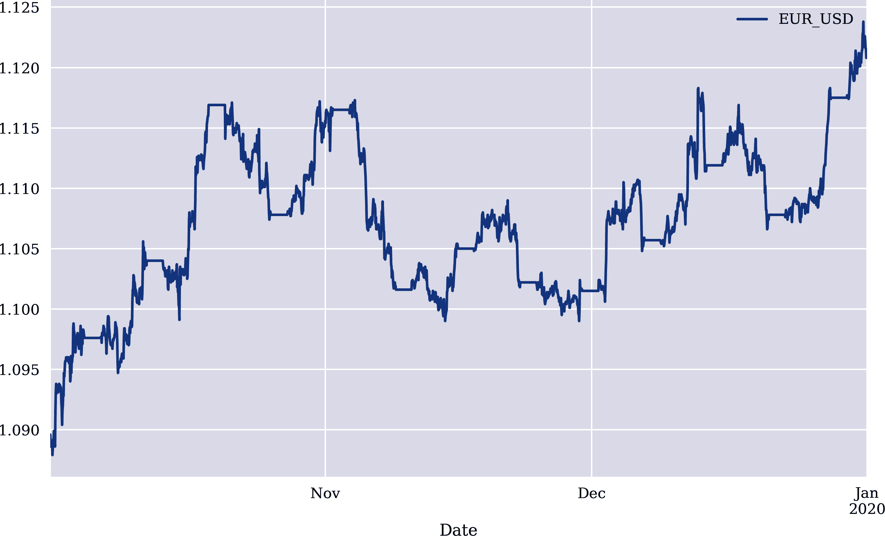

# 第七章 密集神经网络

> 如果你试图根据股票市场上的最近价格历史预测股票的走势，你可能不太可能成功，因为价格历史并没有包含太多的预测信息。
> 
> François Chollet（2017）

本章讨论*密集神经网络*的重要方面。之前的章节已经使用了这种类型的神经网络。特别地，来自`scikit-learn`的`MLPClassifier`和`MLPRegressor`模型，以及用于分类和估计的`Keras`的`Sequential`模型都是密集神经网络（DNNs）。本章专注于`Keras`，因为它在建模 DNNs 时提供更多的自由度和灵活性。^(1)

“数据”介绍了其他本章节中使用的外汇（FX）数据集。“基线预测”在新数据集上生成基线内样本预测。在“归一化”中介绍了训练和测试数据的归一化。为了避免过度拟合，“Dropout”和“正则化”讨论了作为流行方法的 dropout 和正则化。Bagging，作为另一种避免过度拟合的方法，在“Bagging”中重新审视。最后，“优化器”比较了可以与`Keras` DNN 模型一起使用的不同优化器的性能。

尽管本章的开篇引用可能给人希望不大的理由，但本章及整个第三部分的主要目标是通过应用神经网络在金融市场（时间序列）中发现统计效率低下的现象。本章提供的数值结果，例如在某些情况下达到 60%甚至更高的预测准确率，表明至少有一些希望是合理的。

# 数据

第六章发现了统计效率低下的线索，其中包括 EUR/USD 货币对的日内价格序列。本章及其后续章节关注外汇（FX）作为一种资产类别，特别关注 EUR/USD 货币对。总体而言，与其他资产类别（如 VIX 波动率指数等波动性产品）相比，经济上利用 FX 的统计效率低下通常不那么复杂。对于 FX，通常也可以自由和全面地获取数据。以下数据集来自 Refinitiv Eikon Data API。数据集通过 API 检索。数据集包含开盘价、最高价、最低价和收盘价值。图 7-1 展示了收盘价格的可视化：

```py
In [1]: import os
        import numpy as np
        import pandas as pd
        from pylab import plt, mpl
        plt.style.use('seaborn')
        mpl.rcParams['savefig.dpi'] = 300
        mpl.rcParams['font.family'] = 'serif'
        pd.set_option('precision', 4)
        np.set_printoptions(suppress=True, precision=4)
        os.environ['PYTHONHASHSEED'] = '0'

In [2]: url = 'http://hilpisch.com/aiif_eikon_id_eur_usd.csv'  

In [3]: symbol = 'EUR_USD'

In [4]: raw = pd.read_csv(url, index_col=0, parse_dates=True)  

In [5]: raw.head()
Out[5]:                        HIGH     LOW    OPEN   CLOSE
        Date
        2019-10-01 00:00:00  1.0899  1.0897  1.0897  1.0899
        2019-10-01 00:01:00  1.0899  1.0896  1.0899  1.0898
        2019-10-01 00:02:00  1.0898  1.0896  1.0898  1.0896
        2019-10-01 00:03:00  1.0898  1.0896  1.0897  1.0898
        2019-10-01 00:04:00  1.0898  1.0896  1.0897  1.0898

In [6]: raw.info()
        <class 'pandas.core.frame.DataFrame'>
        DatetimeIndex: 96526 entries, 2019-10-01 00:00:00 to 2019-12-31 23:06:00
        Data columns (total 4 columns):
         #   Column  Non-Null Count  Dtype
        ---  ------  --------------  -----
         0   HIGH    96526 non-null  float64
         1   LOW     96526 non-null  float64
         2   OPEN    96526 non-null  float64
         3   CLOSE   96526 non-null  float64
        dtypes: float64(4)
        memory usage: 3.7 MB

In [7]: data = pd.DataFrame(raw['CLOSE'].loc[:])  
        data.columns = [symbol]  

In [8]: data = data.resample('1h', label='right').last().ffill()  

In [9]: data.info()
        <class 'pandas.core.frame.DataFrame'>
        DatetimeIndex: 2208 entries, 2019-10-01 01:00:00 to 2020-01-01 00:00:00
        Freq: H
        Data columns (total 1 columns):
         #   Column   Non-Null Count  Dtype
        ---  ------   --------------  -----
         0   EUR_USD  2208 non-null   float64
        dtypes: float64(1)
        memory usage: 34.5 KB

In [10]: data.plot(figsize=(10, 6));  
```


将数据读入`DataFrame`对象中


选择、重新采样并绘制收盘价图表



###### 图 7-1\. EUR/USD 的中间收盘价格（盘中）

# 基线预测

基于新数据集，从 第六章 中的预测方法被重复使用。首先是创建滞后特征：

```py
In [11]: lags = 5

In [12]: def add_lags(data, symbol, lags, window=20):  
             cols = []
             df = data.copy()
             df.dropna(inplace=True)
             df['r'] = np.log(df / df.shift())
             df['sma'] = df[symbol].rolling(window).mean()
             df['min'] = df[symbol].rolling(window).min()
             df['max'] = df[symbol].rolling(window).max()
             df['mom'] = df['r'].rolling(window).mean()
             df['vol'] = df['r'].rolling(window).std()
             df.dropna(inplace=True)
             df['d'] = np.where(df['r'] > 0, 1, 0)
             features = [symbol, 'r', 'd', 'sma', 'min', 'max', 'mom', 'vol']
             for f in features:
                 for lag in range(1, lags + 1):
                     col = f'{f}_lag_{lag}'
                     df[col] = df[f].shift(lag)
                     cols.append(col)
             df.dropna(inplace=True)
             return df, cols

In [13]: data, cols = add_lags(data, symbol, lags)
```


从第六章略微调整的函数

其次是查看标签数据。在分类中可能出现的一个主要问题是*类别不平衡*。这意味着，在二元标签的情况下，一个特定类别相对于另一个类别的频率可能较高。这可能导致神经网络简单地预测具有更高频率的类别，因为这已经可以导致低损失和高准确率值。通过应用适当的权重，可以确保在 DNN 训练步骤中两个类别获得相等的重要性:^(2)

```py
In [14]: len(data)
Out[14]: 2183

In [15]: c = data['d'].value_counts()  
         c  
Out[15]: 0    1445
         1     738
         Name: d, dtype: int64

In [16]: def cw(df):  
             c0, c1 = np.bincount(df['d'])
             w0 = (1 / c0) * (len(df)) / 2
             w1 = (1 / c1) * (len(df)) / 2
             return {0: w0, 1: w1}

In [17]: class_weight = cw(data)  

In [18]: class_weight  
Out[18]: {0: 0.755363321799308, 1: 1.4789972899728998}

In [19]: class_weight[0] * c[0]  
Out[19]: 1091.5

In [20]: class_weight[1] * c[1]  
Out[20]: 1091.5
```


展示了两个类的频率


计算适当的权重以达到均衡权重


使用计算得出的权重，两个类别获得相等的权重

第三步是使用`Keras`创建 DNN 模型，并在完整数据集上训练模型。样本内基线表现约为 60%：

```py
In [21]: import random
         import tensorflow as tf
         from keras.layers import Dense
         from keras.models import Sequential
         from keras.optimizers import Adam
         from sklearn.metrics import accuracy_score
         Using TensorFlow backend.

In [22]: def set_seeds(seed=100):
             random.seed(seed)  
             np.random.seed(seed)  
             tf.random.set_seed(seed)  

In [23]: optimizer = Adam(lr=0.001)  

In [24]: def create_model(hl=1, hu=128, optimizer=optimizer):
             model = Sequential()
             model.add(Dense(hu, input_dim=len(cols),
                             activation='relu'))  
             for _ in range(hl):
                 model.add(Dense(hu, activation='relu'))  
             model.add(Dense(1, activation='sigmoid'))  
             model.compile(loss='binary_crossentropy',  
                           optimizer=optimizer,  
                           metrics=['accuracy'])  
             return model

In [25]: set_seeds()
         model = create_model(hl=1, hu=128)

In [26]: %%time
         model.fit(data[cols], data['d'], epochs=50,
                   verbose=False, class_weight=cw(data))
         CPU times: user 6.44 s, sys: 939 ms, total: 7.38 s
         Wall time: 4.07 s

Out[26]: <keras.callbacks.callbacks.History at 0x7fbfc2ee6690>

In [27]: model.evaluate(data[cols], data['d'])
         2183/2183 [==============================] - 0s 24us/step

Out[27]: [0.582192026280068, 0.6087952256202698]

In [28]: data['p'] = np.where(model.predict(data[cols]) > 0.5, 1, 0)

In [29]: data['p'].value_counts()
Out[29]: 1    1340
         0     843
         Name: p, dtype: int64
```


Python 随机数种子


`NumPy` 随机数种子


`TensorFlow` 随机数种子


默认优化器（参见[*https://oreil.ly/atpu8*](https://oreil.ly/atpu8)）


第一层


附加层


输出层


损失函数（参见[*https://oreil.ly/cVGVf*](https://oreil.ly/cVGVf)）


要使用的优化器


要收集的额外指标

对于模型的样本外表现也是如此。它仍然高于 60%。这可以被认为已经相当不错：

```py
In [30]: split = int(len(data) * 0.8)  

In [31]: train = data.iloc[:split].copy()  

In [32]: test = data.iloc[split:].copy()  

In [33]: set_seeds()
         model = create_model(hl=1, hu=128)

In [34]: %%time
         model.fit(train[cols], train['d'],
                   epochs=50, verbose=False,
                   validation_split=0.2, shuffle=False,
                   class_weight=cw(train))
         CPU times: user 4.72 s, sys: 686 ms, total: 5.41 s
         Wall time: 3.14 s

Out[34]: <keras.callbacks.callbacks.History at 0x7fbfc3231250>

In [35]: model.evaluate(train[cols], train['d'])  
         1746/1746 [==============================] - 0s 13us/step

Out[35]: [0.612861613500842, 0.5853379368782043]

In [36]: model.evaluate(test[cols], test['d'])  
         437/437 [==============================] - 0s 16us/step

Out[36]: [0.5946959675858714, 0.6247139573097229]

In [37]: test['p'] = np.where(model.predict(test[cols]) > 0.5, 1, 0)

In [38]: test['p'].value_counts()
Out[38]: 1    291
         0    146
         Name: p, dtype: int64
```


将整个数据集分割…


…进入训练数据集…


…以及测试数据集。


评估*样本内*表现。


评估*样本外*表现。

图 7-2 显示了训练和验证数据子集的准确率随训练时期的变化情况：

```py
In [39]: res = pd.DataFrame(model.history.history)

In [40]: res[['accuracy', 'val_accuracy']].plot(figsize=(10, 6), style='--');
```


###### 图 7-2\. 训练和验证准确率数值

本节的分析为使用`Keras`更为复杂的 DNNs 打下了基础。它展示了一个基准市场预测方法。接下来的部分添加了不同元素，这些元素主要旨在提高样本外模型性能，并避免模型对训练数据的过拟合。

# 标准化

在“基准预测”中，使用滞后特征。在第 6 章 中，特征数据通过减去每个特征的训练数据均值并除以训练数据的标准偏差进行标准化。这种标准化技术称为*高斯标准化*，在训练神经网络时往往（几乎总是）证明是一个重要的方面。如下面的 Python 代码及其结果所示，使用标准化后的特征数据能显著提高样本内表现。样本外表现也略有提高。然而，并不能保证通过特征标准化会提高样本外表现：

```py
In [41]: mu, std = train.mean(), train.std()  

In [42]: train_ = (train - mu) / std  

In [43]: set_seeds()
         model = create_model(hl=2, hu=128)

In [44]: %%time
         model.fit(train_[cols], train['d'],
                   epochs=50, verbose=False,
                   validation_split=0.2, shuffle=False,
                   class_weight=cw(train))
         CPU times: user 5.81 s, sys: 879 ms, total: 6.69 s
         Wall time: 3.53 s

Out[44]: <keras.callbacks.callbacks.History at 0x7fbfa51353d0>

In [45]: model.evaluate(train_[cols], train['d'])  
         1746/1746 [==============================] - 0s 14us/step

Out[45]: [0.4253406366728084, 0.887170672416687]

In [46]: test_ = (test - mu) / std  

In [47]: model.evaluate(test_[cols], test['d'])  
         437/437 [==============================] - 0s 24us/step

Out[47]: [1.1377735263422917, 0.681922197341919]

In [48]: test['p'] = np.where(model.predict(test_[cols]) > 0.5, 1, 0)

In [49]: test['p'].value_counts()
Out[49]: 0    281
         1    156
         Name: p, dtype: int64
```


计算所有*训练特征*的均值和标准偏差


根据高斯标准化对*训练数据*集进行标准化


评估*样本内*表现


根据高斯标准化对*测试数据*集进行标准化


评估*样本外*表现

经常出现的一个主要问题是*过拟合*。在图 7-3 中有一个令人印象深刻的可视化，显示训练准确率稳步提高而验证准确率缓慢下降：

```py
In [50]: res = pd.DataFrame(model.history.history)

In [51]: res[['accuracy', 'val_accuracy']].plot(figsize=(10, 6), style='--');
```


###### 图 7-3\. 训练和验证准确率数值（标准化特征数据）

避免过拟合的三种候选方法是*dropout*、*正则化*和*装袋*。接下来的部分将讨论这些方法。还将在本章后面讨论所选择优化器的影响。

# Dropout

*dropout* 的概念是神经网络在训练阶段不应使用所有隐藏单元。与人类大脑的类比是，人类经常忘记先前学到的信息。这种做法可以说是保持人类大脑“开放思维”的一种方式。理想情况下，神经网络应该类似：DNN 中的连接不应过于强大，以避免过度拟合训练数据。

从技术上讲，`Keras`模型在隐藏层之间有额外的层来管理 dropout。主要参数是层中隐藏单元被丢弃的速率。这些丢弃通常以随机方式发生。这可以通过固定`seed`参数来避免。虽然样本内性能降低了，但样本外性能也略有下降。但是，两个性能指标之间的差异较小，这通常是一种理想情况：

```py
In [52]: from keras.layers import Dropout

In [53]: def create_model(hl=1, hu=128, dropout=True, rate=0.3,
                          optimizer=optimizer):
             model = Sequential()
             model.add(Dense(hu, input_dim=len(cols),
                             activation='relu'))
             if dropout:
                 model.add(Dropout(rate, seed=100))  
             for _ in range(hl):
                 model.add(Dense(hu, activation='relu'))
                 if dropout:
                     model.add(Dropout(rate, seed=100))  
             model.add(Dense(1, activation='sigmoid'))
             model.compile(loss='binary_crossentropy', optimizer=optimizer,
                          metrics=['accuracy'])
             return model

In [54]: set_seeds()
         model = create_model(hl=1, hu=128, rate=0.3)

In [55]: %%time
         model.fit(train_[cols], train['d'],
                   epochs=50, verbose=False,
                   validation_split=0.15, shuffle=False,
                   class_weight=cw(train))
         CPU times: user 5.46 s, sys: 758 ms, total: 6.21 s
         Wall time: 3.53 s

Out[55]: <keras.callbacks.callbacks.History at 0x7fbfa6386550>

In [56]: model.evaluate(train_[cols], train['d'])
         1746/1746 [==============================] - 0s 20us/step

Out[56]: [0.4423361133190911, 0.7840778827667236]

In [57]: model.evaluate(test_[cols], test['d'])
         437/437 [==============================] - 0s 34us/step

Out[57]: [0.5875822428434883, 0.6430205702781677]
```


在每一层后添加 dropout

如图 7-4 所示，现在训练精度和验证精度不再像以前那样迅速分开：

```py
In [58]: res = pd.DataFrame(model.history.history)

In [59]: res[['accuracy', 'val_accuracy']].plot(figsize=(10, 6), style='--');
```


###### 图 7-4\. 训练和验证精度值（使用 dropout）

# 有意忘记

在`Keras`的`Sequential`模型中，dropout 模拟了所有人都会经历的情况：忘记以前记住的信息。这是通过在训练期间关闭隐藏层的某些隐藏单元来实现的。实际上，这往往可以更大程度地避免将神经网络过拟合到训练数据上。

# 正则化

避免过拟合的另一种方法是*正则化*。通过正则化，神经网络中的大权重在损失（函数）的计算中会受到惩罚。这避免了深度神经网络中某些连接过于强大和占主导地位的情况。正则化可以通过`Dense`层中的参数来引入`Keras` DNN。根据所选择的正则化参数，训练和测试精度可以保持非常接近。通常使用两种正则化器，一种基于线性范数`l1`，另一种基于欧几里得范数`l2`。以下 Python 代码将正则化添加到模型创建函数中：

```py
In [60]: from keras.regularizers import l1, l2

In [61]: def create_model(hl=1, hu=128, dropout=False, rate=0.3,
                          regularize=False, reg=l1(0.0005),
                          optimizer=optimizer, input_dim=len(cols)):
             if not regularize:
                 reg = None
             model = Sequential()
             model.add(Dense(hu, input_dim=input_dim,
                             activity_regularizer=reg,  
                             activation='relu'))
             if dropout:
                 model.add(Dropout(rate, seed=100))
             for _ in range(hl):
                 model.add(Dense(hu, activation='relu',
                                 activity_regularizer=reg))  
                 if dropout:
                     model.add(Dropout(rate, seed=100))
             model.add(Dense(1, activation='sigmoid'))
             model.compile(loss='binary_crossentropy', optimizer=optimizer,
                          metrics=['accuracy'])
             return model

In [62]: set_seeds()
         model = create_model(hl=1, hu=128, regularize=True)

In [63]: %%time
         model.fit(train_[cols], train['d'],
                   epochs=50, verbose=False,
                   validation_split=0.2, shuffle=False,
                   class_weight=cw(train))
         CPU times: user 5.49 s, sys: 1.05 s, total: 6.54 s
         Wall time: 3.15 s

Out[63]: <keras.callbacks.callbacks.History at 0x7fbfa6b8e110>

In [64]: model.evaluate(train_[cols], train['d'])
         1746/1746 [==============================] - 0s 15us/step

Out[64]: [0.5307255412568205, 0.7691867351531982]

In [65]: model.evaluate(test_[cols], test['d'])
         437/437 [==============================] - 0s 22us/step

Out[65]: [0.8428352184644826, 0.6590389013290405]
```


在每一层中添加正则化。

图 7-5 显示了在正则化下的训练和验证精度。两个性能指标比以前更接近：

```py
In [66]: res = pd.DataFrame(model.history.history)

In [67]: res[['accuracy', 'val_accuracy']].plot(figsize=(10, 6), style='--');
```


###### 图 7-5\. 训练和验证精度值（使用正则化）

当然，dropout 和正则化可以一起使用。其想法是，这两个措施结合起来可以更好地避免过拟合，并将样本内和样本外的精度值更接近。事实上，在这种情况下，两种措施之间的差异最小：

```py
In [68]: set_seeds()
         model = create_model(hl=2, hu=128,
                              dropout=True, rate=0.3,  
                              regularize=True, reg=l2(0.001),  
                             )

In [69]: %%time
         model.fit(train_[cols], train['d'],
                   epochs=50, verbose=False,
                   validation_split=0.2, shuffle=False,
                   class_weight=cw(train))
         CPU times: user 7.06 s, sys: 958 ms, total: 8.01 s
         Wall time: 4.28 s

Out[69]: <keras.callbacks.callbacks.History at 0x7fbfa701cb50>

In [70]: model.evaluate(train_[cols], train['d'])
         1746/1746 [==============================] - 0s 18us/step

Out[70]: [0.5007762827004764, 0.7691867351531982]

In [71]: model.evaluate(test_[cols], test['d'])
         437/437 [==============================] - 0s 23us/step

Out[71]: [0.6191965124699835, 0.6864988803863525]
```


在模型创建中添加了 dropout。


在模型创建中添加了正则化。

图 7-6 显示了在将 dropout 与正则化结合使用时的训练和验证精度。训练时期内训练数据和验证数据的精度之间的差异仅平均为四个百分点：

```py
In [72]: res = pd.DataFrame(model.history.history)

In [73]: res[['accuracy', 'val_accuracy']].plot(figsize=(10, 6), style='--');
```


###### 图 7-6\. 训练和验证准确率值（带有 dropout 和正则化）

# 惩罚大权重

正则化通过惩罚神经网络中的大权重来避免过拟合。单个权重不能变得足够大以主导神经网络。惩罚使权重保持在可比较的水平上。

# Bagging

Bagging 方法以避免过度拟合已经在第六章中使用，尽管仅用于`scikit-learn`的`MLPRegressor`模型。还有一个包装器用于将`Keras` DNN 分类模型以`scikit-learn`的方式公开，即`KerasClassifier`类。以下 Python 代码结合了基于包装器的`Keras` DNN 建模与`scikit-learn`中的`BaggingClassifier`。样本内和样本外的性能指标相对较高，约为 70%。然而，结果受类别不平衡的影响，如前所述，并在这里反映在`0`预测的高频率中：

```py
In [75]: from sklearn.ensemble import BaggingClassifier
         from keras.wrappers.scikit_learn import KerasClassifier

In [76]: max_features = 0.75

In [77]: set_seeds()
         base_estimator = KerasClassifier(build_fn=create_model,
                                 verbose=False, epochs=20, hl=1, hu=128,
                                 dropout=True, regularize=False,
                                 input_dim=int(len(cols) * max_features))  

In [78]: model_bag = BaggingClassifier(base_estimator=base_estimator,
                                   n_estimators=15,
                                   max_samples=0.75,
                                   max_features=max_features,
                                   bootstrap=True,
                                   bootstrap_features=True,
                                   n_jobs=1,
                                   random_state=100,
                                  )  

In [79]: %time model_bag.fit(train_[cols], train['d'])
         CPU times: user 40 s, sys: 5.23 s, total: 45.3 s
         Wall time: 26.3 s

Out[79]: BaggingClassifier(base_estimator=<keras.wrappers.scikit_learn.KerasClassifier
          object at 0x7fbfa7cc7b90>,
         bootstrap_features=True, max_features=0.75, max_samples=0.75,
                           n_estimators=15, n_jobs=1, random_state=100)

In [80]: model_bag.score(train_[cols], train['d'])
Out[80]: 0.720504009163803

In [81]: model_bag.score(test_[cols], test['d'])
Out[81]: 0.6704805491990846

In [82]: test['p'] = model_bag.predict(test_[cols])

In [83]: test['p'].value_counts()
Out[83]: 0    408
         1     29
         Name: p, dtype: int64
```


基本估计器，在这里是`Keras`的`Sequential`模型，被实例化。


`BaggingClassifier`模型为一些相等的基本估计器实例化。

# 分布式学习

Bagging 在某种意义上将学习分布在多个神经网络（或其他模型）之间，例如每个神经网络仅看到训练数据集的某些部分和特征的选择。这避免了单个神经网络过度拟合完整的训练数据集。预测基于所有选择性训练的神经网络的集合。

# 优化器

`Keras`包提供了一些可以与`Sequential`模型结合使用的优化器（参见[*https://oreil.ly/atpu8*](https://oreil.ly/atpu8)）。不同的优化器可能在训练所需时间和预测准确性方面表现不同。以下 Python 代码使用不同的优化器并评估其性能。在所有情况下，都使用了`Keras`的默认参数设置。样本外的性能变化不大。然而，由于不同的优化器，样本内的性能变化很大：

```py
In [84]: import time

In [85]: optimizers = ['sgd', 'rmsprop', 'adagrad', 'adadelta',
                       'adam', 'adamax', 'nadam']

In [86]: %%time
         for optimizer in optimizers:
             set_seeds()
             model = create_model(hl=1, hu=128,
                              dropout=True, rate=0.3,
                              regularize=False, reg=l2(0.001),
                              optimizer=optimizer
                             )  
             t0 = time.time()
             model.fit(train_[cols], train['d'],
                       epochs=50, verbose=False,
                       validation_split=0.2, shuffle=False,
                       class_weight=cw(train))  
             t1 = time.time()
             t = t1 - t0
             acc_tr = model.evaluate(train_[cols], train['d'], verbose=False)[1]  
             acc_te = model.evaluate(test_[cols], test['d'], verbose=False)[1]  
             out = f'{optimizer:10s} | time[s]: {t:.4f} | in-sample={acc_tr:.4f}'
             out += f' | out-of-sample={acc_te:.4f}'
             print(out)
         sgd        | time[s]: 2.8092 | in-sample=0.6363 | out-of-sample=0.6568
         rmsprop    | time[s]: 2.9480 | in-sample=0.7600 | out-of-sample=0.6613
         adagrad    | time[s]: 2.8472 | in-sample=0.6747 | out-of-sample=0.6499
         adadelta   | time[s]: 3.2068 | in-sample=0.7279 | out-of-sample=0.6522
         adam       | time[s]: 3.2364 | in-sample=0.7365 | out-of-sample=0.6545
         adamax     | time[s]: 3.2465 | in-sample=0.6982 | out-of-sample=0.6476
         nadam      | time[s]: 4.1275 | in-sample=0.7944 | out-of-sample=0.6590
         CPU times: user 35.9 s, sys: 4.55 s, total: 40.4 s
         Wall time: 23.1 s
```


为给定的优化器实例化 DNN 模型


使用给定的优化器拟合模型


评估*样本内*表现


评估*样本外*表现

# 结论

本章深入探讨了深度神经网络（DNNs）的世界，并以`Keras`作为主要工具包。`Keras`在组合 DNNs 方面提供了高度灵活性。本章的结果表明，无论是样本内还是样本外的预测准确率都稳定在 60%以上。然而，预测准确率只是一个方面。必须有合适的交易策略可以经济地从预测或“信号”中获利。在算法交易背景下，这个至关重要的话题在第四部分中有详细讨论。接下来的两章首先说明了不同神经网络（递归神经网络和卷积神经网络）以及学习技术（强化学习）的使用。

# 参考文献

`Keras`是一个强大而全面的深度学习工具包，其主要后端是 TensorFlow。该项目也在快速发展中。请通过[主项目页面](http://keras.io)保持最新。关于`Keras`的主要资源书籍如下：

+   Chollet, Francois. 2017\. *Python 深度学习*. Shelter Island: Manning。

+   Goodfellow, Ian, Yoshua Bengio, and Aaron Courville. 2016\. *深度学习*. Cambridge: MIT Press. [*http://deeplearningbook.org*](http://deeplearningbook.org)。

^(1) 更多关于`Keras`包的详细信息和背景，请参见 Chollet (2017)。关于神经网络及其相关方法的全面处理，请参见 Goodfellow 等人（2016）。

^(2) 查看这篇[博客文章](https://oreil.ly/3X1Qk)，讨论了使用`Keras`解决类别不平衡问题的解决方案。
