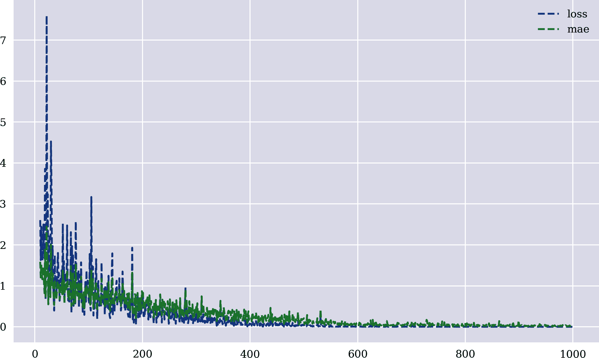
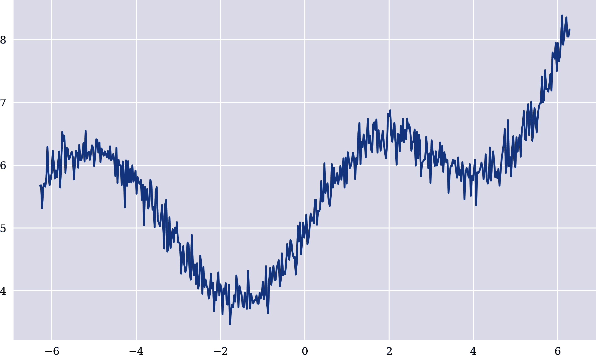
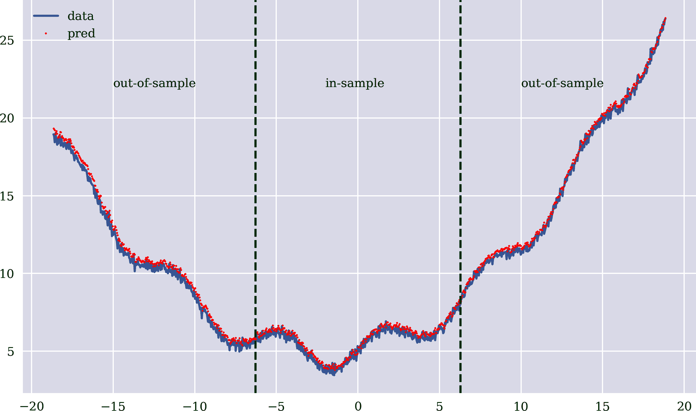
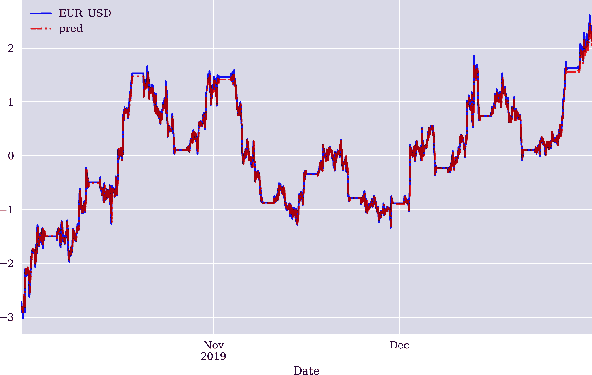
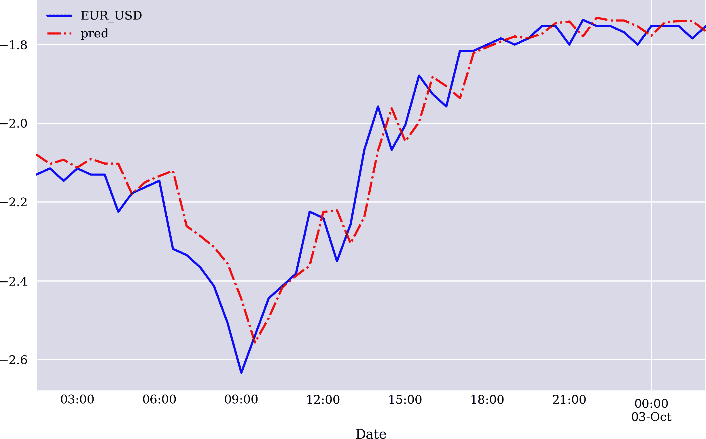
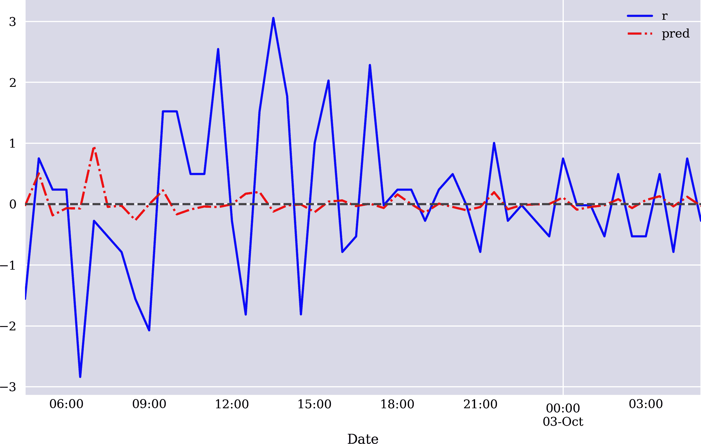

# 第八章。循环神经网络

> 历史永远不会重复，但却会押韵。
> 
> 马克·吐温（可能）
> 
> 我的生活似乎是一连串的事件和意外。然而，当我回顾过去时，我看到了一种模式。
> 
> 伯诺瓦·曼德布罗特

本章讨论的是*循环神经网络*（RNNs）。这种类型的网络专门设计用于学习顺序数据，例如文本或时间序列数据。本章的讨论采用与之前相同的实用方法，主要依赖于经过详细解释的 Python 示例，利用了 `Keras`。¹

“第一个示例”和“第二个示例”基于两个简单示例介绍了 RNNs，并使用样本数值数据进行说明。展示了将 RNNs 应用于预测顺序数据的方法。“金融价格序列”然后使用金融价格序列数据，并通过估计方法直接应用 RNN 方法来预测这样的序列。“金融收益序列”然后使用回报数据来预测金融工具价格的未来方向，也是通过估计方法。“金融特征”将金融特征添加到混合中—除了价格和回报数据外—以预测市场走向。本节介绍了三种不同的方法：通过浅层 RNN 进行估计和分类的预测，以及通过深层 RNN 进行分类的预测。

本章显示，将 RNNs 应用于金融时间序列数据可以在方向性市场预测的情况下在样本外获得高达 60% 以上的预测准确率。然而，所得结果不能完全跟上第七章中看到的结果。这可能令人惊讶，因为 RNNs 本应在金融时间序列数据中表现良好，而这正是本书的主要关注点。

# 第一个示例

为了说明循环神经网络（RNN）的训练和使用，考虑一个基于整数序列的简单示例。首先，进行一些导入和配置：

```py
In [1]: import os
        import random
        import numpy as np
        import pandas as pd
        import tensorflow as tf
        from pprint import pprint
        from pylab import plt, mpl
        plt.style.use('seaborn')
        mpl.rcParams['savefig.dpi'] = 300
        mpl.rcParams['font.family'] = 'serif'
        pd.set_option('precision', 4)
        np.set_printoptions(suppress=True, precision=4)
        os.environ['PYTHONHASHSEED'] = '0'

In [2]: def set_seeds(seed=100):  
            random.seed(seed)
            np.random.seed(seed)
            tf.random.set_seed(seed)
        set_seeds()  
```


设置所有种子值的函数

第二个是将简单数据集转换为适当形状的简单数据集：

```py
In [3]: a = np.arange(100)  
        a
Out[3]: array([ 0,  1,  2,  3,  4,  5,  6,  7,  8,  9, 10, 11, 12, 13, 14, 15, 16,
               17, 18, 19, 20, 21, 22, 23, 24, 25, 26, 27, 28, 29, 30, 31, 32, 33,
               34, 35, 36, 37, 38, 39, 40, 41, 42, 43, 44, 45, 46, 47, 48, 49, 50,
               51, 52, 53, 54, 55, 56, 57, 58, 59, 60, 61, 62, 63, 64, 65, 66, 67,
               68, 69, 70, 71, 72, 73, 74, 75, 76, 77, 78, 79, 80, 81, 82, 83, 84,
               85, 86, 87, 88, 89, 90, 91, 92, 93, 94, 95, 96, 97, 98, 99])

In [4]: a = a.reshape((len(a), -1))  

In [5]: a.shape  
Out[5]: (100, 1)

In [6]: a[:5]  
Out[6]: array([[0],
               [1],
               [2],
               [3],
               [4]])
```


样本数据


转换为二维

使用 `TimeseriesGenerator`，原始数据可以被转换为适合训练 RNN 的对象。其思想是使用一定数量的原始数据滞后值来训练模型，以预测序列中的下一个值。例如，`0, 1, 2` 是用于预测值 `3`（标签）的三个滞后值（特征）。同样，`1, 2, 3` 用于预测 `4`：

```py
In [7]: from keras.preprocessing.sequence import TimeseriesGenerator
        Using TensorFlow backend.

In [8]: lags = 3

In [9]: g = TimeseriesGenerator(a, a, length=lags, batch_size=5)  

In [10]: pprint(list(g)[0])  
         (array([[[0],
                 [1],
                 [2]],

                [[1],
                 [2],
                 [3]],

                [[2],
                 [3],
                 [4]],

                [[3],
                 [4],
                 [5]],

                [[4],
                 [5],
                 [6]]]),
          array([[3],
                [4],
                [5],
                [6],
                [7]]))
```


`TimeseriesGenerator` 创建滞后连续数据的批次。

创建 RNN 模型与 DNN 类似。以下 Python 代码使用单隐藏层类型为`SimpleRNN`（Chollet 2017，第六章；另见[Keras recurrent layers](https://oreil.ly/kpuqA)）。即使隐藏单元相对较少，可训练参数的数量也非常大。`.fit_generator()`方法以生成器对象为输入，例如使用`TimeseriesGenerator`创建的对象：

```py
In [11]: from keras.models import Sequential
         from keras.layers import SimpleRNN, LSTM, Dense

In [12]: model = Sequential()
         model.add(SimpleRNN(100, activation='relu',
                             input_shape=(lags, 1)))  
         model.add(Dense(1, activation='linear'))
         model.compile(optimizer='adagrad', loss='mse',
                       metrics=['mae'])

In [13]: model.summary()  
         Model: "sequential_1"
         _________________________________________________________________
         Layer (type)                 Output Shape              Param #
         =================================================================
         simple_rnn_1 (SimpleRNN)     (None, 100)               10200
         _________________________________________________________________
         dense_1 (Dense)              (None, 1)                 101
         =================================================================
         Total params: 10,301
         Trainable params: 10,301
         Non-trainable params: 0
         _________________________________________________________________

In [14]: %%time
         model.fit_generator(g, epochs=1000, steps_per_epoch=5,
                             verbose=False)  
         CPU times: user 17.4 s, sys: 3.9 s, total: 21.3 s
         Wall time: 30.8 s

Out[14]: <keras.callbacks.callbacks.History at 0x7f7f079058d0>
```


单隐藏层的类型为`SimpleRNN`。


浅层 RNN 的总结。


基于生成器对象的 RNN 拟合。

当训练 RNN 时，性能指标可能表现出相对不稳定的行为（见图 8-1）：

```py
In [15]: res = pd.DataFrame(model.history.history)

In [16]: res.tail(3)
Out[16]:        loss     mae
         997  0.0001  0.0109
         998  0.0007  0.0211
         999  0.0001  0.0101

In [17]: res.iloc[10:].plot(figsize=(10, 6), style=['--', '--']);
```



###### 图 8-1\. RNN 训练期间的性能指标

有了训练好的 RNN，以下 Python 代码生成样本内和样本外预测：

```py
In [18]: x = np.array([21, 22, 23]).reshape((1, lags, 1))
         y = model.predict(x, verbose=False)  
         int(round(y[0, 0]))
Out[18]: 24

In [19]: x = np.array([87, 88, 89]).reshape((1, lags, 1))
         y = model.predict(x, verbose=False)  
         int(round(y[0, 0]))
Out[19]: 90

In [20]: x = np.array([187, 188, 189]).reshape((1, lags, 1))
         y = model.predict(x, verbose=False)  
         int(round(y[0, 0]))
Out[20]: 190

In [21]: x = np.array([1187, 1188, 1189]).reshape((1, lags, 1))
         y = model.predict(x, verbose=False)  
         int(round(y[0, 0]))
Out[21]: 1194
```


样本内预测


样本外预测


远期预测

即使对于远期预测，总体上在这种简单情况下结果是不错的。然而，在手头问题中，例如通过 OLS 回归应用可以完美解决。因此，考虑到 RNN 的性能，对于这样的问题进行训练所需的工作量是相当大的。

# 第二个示例

第一个示例说明了对一个简单问题的 RNN 进行训练，这个问题不仅可以通过 OLS 回归轻松解决，而且人类检查数据时也能解决。第二个示例稍微有些挑战性。输入数据通过二次项和三角函数项的转换，以及添加白噪声来进行变换。图 8-2 展示了在区间<math alttext="left-bracket minus 2 pi comma 2 pi"><mrow><mo>[</mo> <mo>-</mo> <mn>2</mn> <mi>π</mi> <mo>,</mo> <mn>2</mn> <mi>π</mi></mrow></math> ]的结果序列：

```py
In [22]: def transform(x):
             y = 0.05 * x ** 2 + 0.2 * x + np.sin(x) + 5  
             y += np.random.standard_normal(len(x)) * 0.2  
             return y

In [23]: x = np.linspace(-2 * np.pi, 2 * np.pi, 500)
         a = transform(x)

In [24]: plt.figure(figsize=(10, 6))
         plt.plot(x, a);
```


确定性转换


随机转换



###### 图 8-2\. 样本序列数据

如前所述，原始数据被重新塑造，应用`TimeseriesGenerator`，并训练带有单隐藏层的 RNN：

```py
In [25]: a = a.reshape((len(a), -1))

In [26]: a[:5]
Out[26]: array([[5.6736],
                [5.68  ],
                [5.3127],
                [5.645 ],
                [5.7118]])

In [27]: lags = 5

In [28]: g = TimeseriesGenerator(a, a, length=lags, batch_size=5)

In [29]: model = Sequential()
         model.add(SimpleRNN(500, activation='relu', input_shape=(lags, 1)))
         model.add(Dense(1, activation='linear'))
         model.compile(optimizer='rmsprop', loss='mse', metrics=['mae'])

In [30]: model.summary()
         Model: "sequential_2"
         _________________________________________________________________
         Layer (type)                 Output Shape              Param #
         =================================================================
         simple_rnn_2 (SimpleRNN)     (None, 500)               251000
         _________________________________________________________________
         dense_2 (Dense)              (None, 1)                 501
         =================================================================
         Total params: 251,501
         Trainable params: 251,501
         Non-trainable params: 0
         _________________________________________________________________

In [31]: %%time
         model.fit_generator(g, epochs=500,
                             steps_per_epoch=10,
                             verbose=False)
         CPU times: user 1min 6s, sys: 14.6 s, total: 1min 20s
         Wall time: 23.1 s

Out[31]: <keras.callbacks.callbacks.History at 0x7f7f09c11810>
```

下面的 Python 代码预测区间 <math alttext="left-bracket minus 6 pi comma 6 pi"><mrow><mo></mo> <mo>-</mo> <mn>6</mn> <mi>π</mi> <mo>,</mo> <mn>6</mn> <mi>π</mi></mrow></math> 的序列值。这个区间是训练区间大小的三倍，并包含训练区间左右两侧的样本外预测。[Figure 8-3 显示模型表现相当良好，即使在样本外：

```py
In [32]: x = np.linspace(-6 * np.pi, 6 * np.pi, 1000)  
         d = transform(x)

In [33]: g_ = TimeseriesGenerator(d, d, length=lags, batch_size=len(d))  

In [34]: f = list(g_)[0][0].reshape((len(d) - lags, lags, 1))  

In [35]: y = model.predict(f, verbose=False)  

In [36]: plt.figure(figsize=(10, 6))
         plt.plot(x[lags:], d[lags:], label='data', alpha=0.75)
         plt.plot(x[lags:], y, 'r.', label='pred', ms=3)
         plt.axvline(-2 * np.pi, c='g', ls='--')
         plt.axvline(2 * np.pi, c='g', ls='--')
         plt.text(-15, 22, 'out-of-sample')
         plt.text(-2, 22, 'in-sample')
         plt.text(10, 22, 'out-of-sample')
         plt.legend();
```


扩大样本数据集


样本内 *和* 样本外预测

# 示例的简易性

前两个示例故意选择简单。例如，第二个示例可以通过允许在三角函数基础函数中使用 OLS 回归等更高效地解决。然而，对于金融时间序列数据等非平凡序列数据的 RNN 训练基本相同。在这种情况下，例如，OLS 回归通常无法与 RNN 的能力相匹敌。



###### 图 8-3\. RNN 的样本内和样本外预测

# 金融价格序列

作为对金融时间序列数据的 RNN 的第一个应用，考虑日内 EUR/USD 报价。使用前两节介绍的方法，对金融时间序列的 RNN 训练是直接的。首先，导入和重新采样数据。数据也被归一化，并转换为适当的 `ndarray` 对象：

```py
In [37]: url = 'http://hilpisch.com/aiif_eikon_id_eur_usd.csv'

In [38]: symbol = 'EUR_USD'

In [39]: raw = pd.read_csv(url, index_col=0, parse_dates=True)

In [40]: def generate_data():
             data = pd.DataFrame(raw['CLOSE'])  
             data.columns = [symbol]  
             data = data.resample('30min', label='right').last().ffill()  
             return data

In [41]: data = generate_data()

In [42]: data = (data - data.mean()) / data.std()  

In [43]: p = data[symbol].values  

In [44]: p = p.reshape((len(p), -1))  
```


选择单列


重命名列


对数据进行重新采样


进行高斯归一化处理


将数据集重塑为二维

其次，基于生成器对象训练 RNN。函数 `create_rnn_model()` 允许创建带有 `SimpleRNN` 或 `LSTM`（长短期记忆）层的 RNN（Chollet 2017, ch. 6; 另请参阅 [Keras recurrent layers](https://oreil.ly/kpuqA)）。

```py
In [45]: lags = 5

In [46]: g = TimeseriesGenerator(p, p, length=lags, batch_size=5)

In [47]: def create_rnn_model(hu=100, lags=lags, layer='SimpleRNN',
                                    features=1, algorithm='estimation'):
             model = Sequential()
             if layer is 'SimpleRNN':
                 model.add(SimpleRNN(hu, activation='relu',
                                     input_shape=(lags, features)))  
             else:
                 model.add(LSTM(hu, activation='relu',
                                input_shape=(lags, features)))  
             if algorithm == 'estimation':
                 model.add(Dense(1, activation='linear'))  
                 model.compile(optimizer='adam', loss='mse', metrics=['mae'])
             else:
                 model.add(Dense(1, activation='sigmoid'))  
                 model.compile(optimizer='adam', loss='mse', metrics=['accuracy'])
             return model

In [48]: model = create_rnn_model()

In [49]: %%time
         model.fit_generator(g, epochs=500, steps_per_epoch=10,
                             verbose=False)
         CPU times: user 20.8 s, sys: 4.66 s, total: 25.5 s
         Wall time: 11.2 s

Out[49]: <keras.callbacks.callbacks.History at 0x7f7ef6716590>
```


添加 `SimpleRNN` 层或 `LSTM` 层


添加用于 *估计* 或 *分类* 的输出层

第三，生成样本内预测。如 Figure 8-4 所示，RNN 能够捕捉归一化金融时间序列数据的结构。基于这种可视化，预测精度似乎相当不错：

```py
In [50]: y = model.predict(g, verbose=False)

In [51]: data['pred'] = np.nan
         data['pred'].iloc[lags:] = y.flatten()

In [52]: data[[symbol, 'pred']].plot(
                     figsize=(10, 6), style=['b', 'r-.'],
                     alpha=0.75);
```



###### 图 8-4\. RNN 对金融价格序列的样本内预测（整个数据集）

然而，可视化结果表明，进一步检查后结果并不成立。图 8-5 放大并仅显示原始数据集和预测数据集的 50 个数据点。可以明显看出，RNN 的预测值基本上只是前一个滞后，按一定时间间隔移动。从视觉上看，预测线就是金融时间序列本身，向右移动了一个时间间隔。

```py
In [53]: data[[symbol, 'pred']].iloc[50:100].plot(
                     figsize=(10, 6), style=['b', 'r-.'],
                     alpha=0.75);
```



###### 图 8-5\. RNN 对金融价格序列的样本内预测（数据子集）。

# RNN 与有效市场

基于 RNN 的金融价格序列预测结果与在第六章中用于说明有效市场假设（EMH）的 OLS 回归方法一致。在那里，说明了在最小二乘意义下，今天的价格是明天价格的最佳预测值。将 RNN 应用于价格数据并没有产生其他见解。

# 金融回报序列。

正如前面的分析所示，预测回报可能比预测价格更容易。因此，以下 Python 代码基于对数回报重复了前述分析：

```py
In [54]: data = generate_data()

In [55]: data['r'] = np.log(data / data.shift(1))

In [56]: data.dropna(inplace=True)

In [57]: data = (data - data.mean()) / data.std()

In [58]: r = data['r'].values

In [59]: r = r.reshape((len(r), -1))

In [60]: g = TimeseriesGenerator(r, r, length=lags, batch_size=5)

In [61]: model = create_rnn_model()

In [62]: %%time
         model.fit_generator(g, epochs=500, steps_per_epoch=10,
                             verbose=False)
         CPU times: user 20.4 s, sys: 4.2 s, total: 24.6 s
         Wall time: 11.3 s

Out[62]: <keras.callbacks.callbacks.History at 0x7f7ef47a8dd0>
```

如图 8-6 所示，RNN 的预测在绝对意义上并不太好。然而，它们似乎在某种程度上正确地捕捉了市场方向（回报的符号）。

```py
In [63]: y = model.predict(g, verbose=False)

In [64]: data['pred'] = np.nan
         data['pred'].iloc[lags:] = y.flatten()
         data.dropna(inplace=True)

In [65]: data[['r', 'pred']].iloc[50:100].plot(
                     figsize=(10, 6), style=['b', 'r-.'],
                     alpha=0.75);
         plt.axhline(0, c='grey', ls='--')
```



###### 图 8-6\. RNN 对金融回报序列的样本内预测（数据子集）。

虽然图 8-6 仅提供了一个指示，但相对较高的准确率得分支持了 RNN 在回报序列上可能比在价格序列上表现更好的假设。

```py
In [66]: from sklearn.metrics import accuracy_score

In [67]: accuracy_score(np.sign(data['r']), np.sign(data['pred']))
Out[67]: 0.6806532093445226
```

然而，为了得到一个真实的图像，需要进行训练-测试分割。样本外的准确率评分并不像样本内整体数据集那样高，但对于当前问题来说仍然很高。

```py
In [68]: split = int(len(r) * 0.8)  

In [69]: train = r[:split]  

In [70]: test = r[split:]  

In [71]: g = TimeseriesGenerator(train, train, length=lags, batch_size=5)  

In [72]: set_seeds()
         model = create_rnn_model(hu=100)

In [73]: %%time
         model.fit_generator(g, epochs=100, steps_per_epoch=10, verbose=False)  
         CPU times: user 5.67 s, sys: 1.09 s, total: 6.75 s
         Wall time: 2.95 s

Out[73]: <keras.callbacks.callbacks.History at 0x7f7ef5482dd0>

In [74]: g_ = TimeseriesGenerator(test, test, length=lags, batch_size=5)  

In [75]: y = model.predict(g_)  

In [76]: accuracy_score(np.sign(test[lags:]), np.sign(y))  
Out[76]: 0.6708428246013668
```


将数据分割为训练和测试数据子集。


在训练数据上拟合模型。


在测试数据上测试模型。

# 金融特征。

RNN 的应用不仅限于原始价格或收益数据。还可以添加额外的特征来改善 RNN 的预测能力。以下 Python 代码向数据集添加了典型的金融特征：

```py
In [77]: data = generate_data()

In [78]: data['r'] = np.log(data / data.shift(1))

In [79]: window = 20
         data['mom'] = data['r'].rolling(window).mean()  
         data['vol'] = data['r'].rolling(window).std()  

In [80]: data.dropna(inplace=True)
```


添加了时间序列*动量*特征。


添加了滚动的*波动率*特征。

## 估计。

在估计情况下，样本外准确率可能会显著下降，这可能会有些意外。换句话说，在这种特定情况下，添加金融特征并没有观察到改进。

```py
In [81]: split = int(len(data) * 0.8)

In [82]: train = data.iloc[:split].copy()

In [83]: mu, std = train.mean(), train.std()  

In [84]: train = (train - mu) / std  

In [85]: test = data.iloc[split:].copy()

In [86]: test = (test - mu) / std  

In [87]: g = TimeseriesGenerator(train.values, train['r'].values,
                                 length=lags, batch_size=5)  

In [88]: set_seeds()
         model = create_rnn_model(hu=100, features=len(data.columns),
                                  layer='SimpleRNN')

In [89]: %%time
         model.fit_generator(g, epochs=100, steps_per_epoch=10,
                             verbose=False)  
         CPU times: user 5.24 s, sys: 1.08 s, total: 6.32 s
         Wall time: 2.73 s

Out[89]: <keras.callbacks.callbacks.History at 0x7f7ef313c950>

In [90]: g_ = TimeseriesGenerator(test.values, test['r'].values,
                                  length=lags, batch_size=5)  

In [91]: y = model.predict(g_).flatten()  

In [92]: accuracy_score(np.sign(test['r'].iloc[lags:]), np.sign(y))  
Out[92]: 0.37299771167048057
```


计算训练数据的第一和第二时刻。


对训练数据应用高斯归一化


对测试数据应用高斯归一化，基于从训练数据中得出的统计数据


在训练数据上拟合模型


在测试数据上测试模型

## 分类

到目前为止的分析使用了`Keras`的 RNN 模型进行*估计*，以预测金融工具价格的未来走向。当前问题可能更适合直接设定为*分类*问题。以下 Python 代码处理二元标签数据，并直接预测价格走势的方向。这次还使用了 LSTM 层。即使隐藏单元较少且仅经过少数训练时期，样本外准确率也相当高。该方法再次通过适当调整类别权重考虑了类别不平衡。在这种情况下，预测准确率相当高，约为 65%：

```py
In [93]: set_seeds()
         model = create_rnn_model(hu=50,
                     features=len(data.columns),
                     layer='LSTM',
                     algorithm='classification')  

In [94]: train_y = np.where(train['r'] > 0, 1, 0)  

In [95]: np.bincount(train_y)  
Out[95]: array([2374, 1142])

In [96]: def cw(a):
             c0, c1 = np.bincount(a)
             w0 = (1 / c0) * (len(a)) / 2
             w1 = (1 / c1) * (len(a)) / 2
             return {0: w0, 1: w1}

In [97]: g = TimeseriesGenerator(train.values, train_y,
                                 length=lags, batch_size=5)

In [98]: %%time
         model.fit_generator(g, epochs=5, steps_per_epoch=10,
                             verbose=False, class_weight=cw(train_y))
         CPU times: user 1.25 s, sys: 159 ms, total: 1.41 s
         Wall time: 947 ms

Out[98]: <keras.callbacks.callbacks.History at 0x7f7ef43baf90>

In [99]: test_y = np.where(test['r'] > 0, 1, 0)  

In [100]: g_ = TimeseriesGenerator(test.values, test_y,
                                   length=lags, batch_size=5)

In [101]: y = np.where(model.predict(g_, batch_size=None) > 0.5, 1, 0).flatten()

In [102]: np.bincount(y)
Out[102]: array([492, 382])

In [103]: accuracy_score(test_y[lags:], y)
Out[103]: 0.6498855835240275
```


用于分类的 RNN 模型


二元训练标签


训练标签的类别频率


二元测试标签

## 深层 RNNs

最后，考虑深层 RNNs，它们是具有多个隐藏层的 RNNs。它们的创建与深度 DNNs 一样简单。唯一的要求是对于非最终隐藏层，参数`return_sequences`必须设置为`True`。以下 Python 函数用于创建深层 RNN，还允许添加`Dropout`层以潜在地避免过拟合。预测准确率与前一小节中看到的相当：

```py
In [104]: from keras.layers import Dropout

In [105]: def create_deep_rnn_model(hl=2, hu=100, layer='SimpleRNN',
                                    optimizer='rmsprop', features=1,
                                    dropout=False, rate=0.3, seed=100):
              if hl <= 2: hl = 2  
              if layer == 'SimpleRNN':
                  layer = SimpleRNN
              else:
                  layer = LSTM
              model = Sequential()
              model.add(layer(hu, input_shape=(lags, features),
                               return_sequences=True,
                              ))  
              if dropout:
                  model.add(Dropout(rate, seed=seed))  
              for _ in range(2, hl):
                  model.add(layer(hu, return_sequences=True))
                  if dropout:
                      model.add(Dropout(rate, seed=seed))  
              model.add(layer(hu))  
              model.add(Dense(1, activation='sigmoid'))  
              model.compile(optimizer=optimizer,
                            loss='binary_crossentropy',
                            metrics=['accuracy'])
              return model

In [106]: set_seeds()
          model = create_deep_rnn_model(
                      hl=2, hu=50, layer='SimpleRNN',
                      features=len(data.columns),
                      dropout=True, rate=0.3)  

In [107]: %%time
          model.fit_generator(g, epochs=200, steps_per_epoch=10,
                              verbose=False, class_weight=cw(train_y))
          CPU times: user 14.2 s, sys: 2.85 s, total: 17.1 s
          Wall time: 7.09 s

Out[107]: <keras.callbacks.callbacks.History at 0x7f7ef6428790>

In [108]: y = np.where(model.predict(g_, batch_size=None) > 0.5, 1, 0).flatten()

In [109]: np.bincount(y)
Out[109]: array([550, 324])

In [110]: accuracy_score(test_y[lags:], y)
Out[110]: 0.6430205949656751
```


至少确保两个隐藏层。


第一个隐藏层。


`Dropout`层。


最终隐藏层。


模型建立用于分类。

# 结论

本章介绍了使用`Keras`实现的 RNN，并展示了这些神经网络在金融时间序列数据中的应用。在 Python 层面上，使用 RNN 与使用 DNN 并没有太大区别。一个主要区别在于，训练和测试数据必须以顺序形式呈现给相应的方法。然而，`TimeseriesGenerator`函数的应用使得将顺序数据转换为`Keras`可处理的生成器对象变得简单。

本章的示例适用于金融价格序列和金融收益序列。此外，诸如时间序列动量等金融特征也可以轻松添加。所提供的模型创建功能允许使用`SimpleRNN`或`LSTM`层以及不同的优化器，等等。它们还允许在浅层和深层神经网络的背景下建模估计和分类问题。

在预测市场方向时，样本外预测准确性对于分类示例相对较高，但对于估计示例来说并不那么高，甚至可能相当低。

# 参考文献

本章引用的书籍和论文：

+   Chollet，François。2017 年。*Python 深度学习*。Shelter Island：Manning。

+   Goodfellow，Ian，Yoshua Bengio 和 Aaron Courville。2016 年。*深度学习*。剑桥：MIT Press。[*http://deeplearningbook.org*](http://deeplearningbook.org)

¹ 对于 RNN 的技术细节，请参考 Goodfellow 等人（2016 年，第十章）。至于实际实现，请参考 Chollet（2017 年，第六章）。
