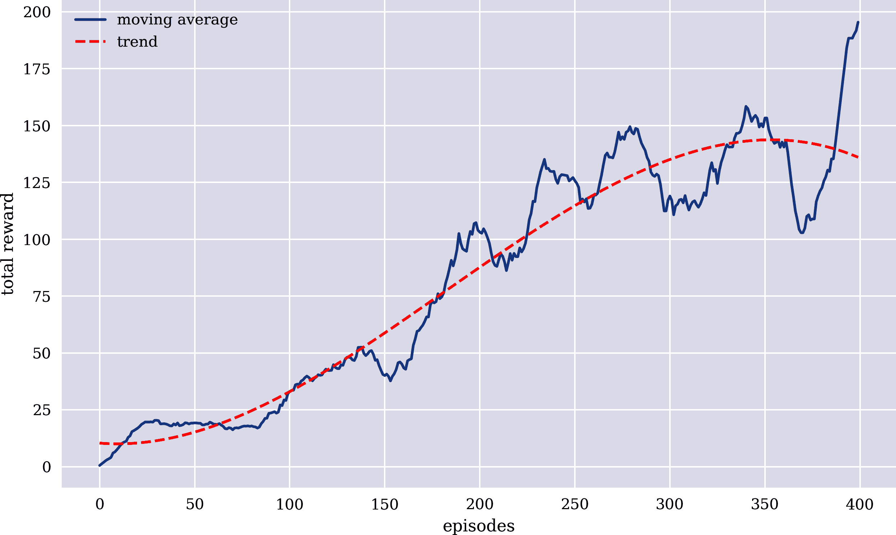
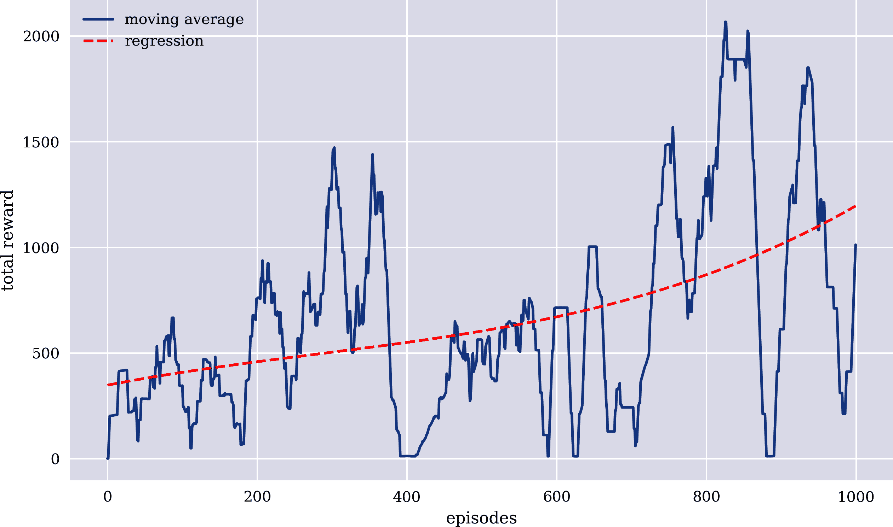
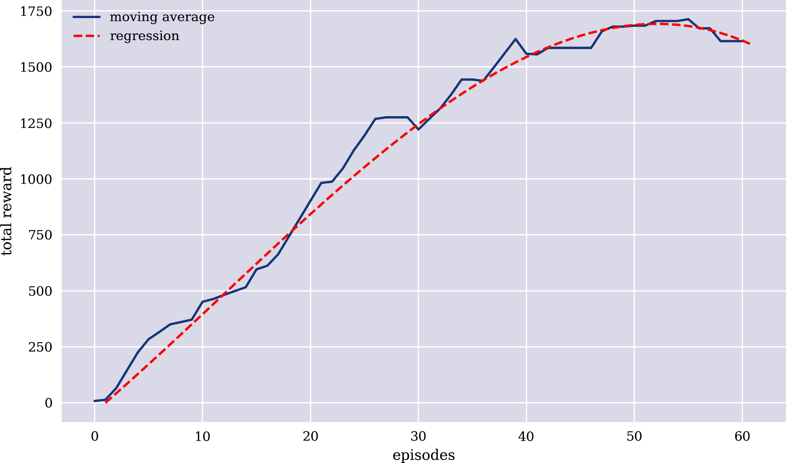
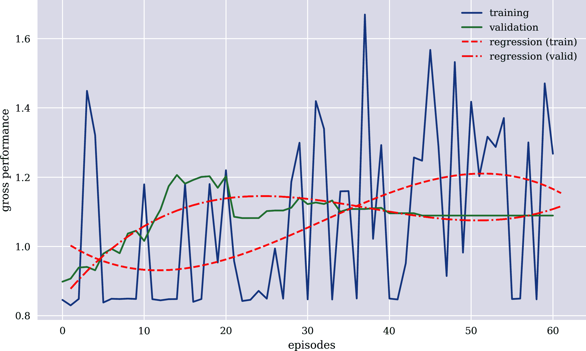
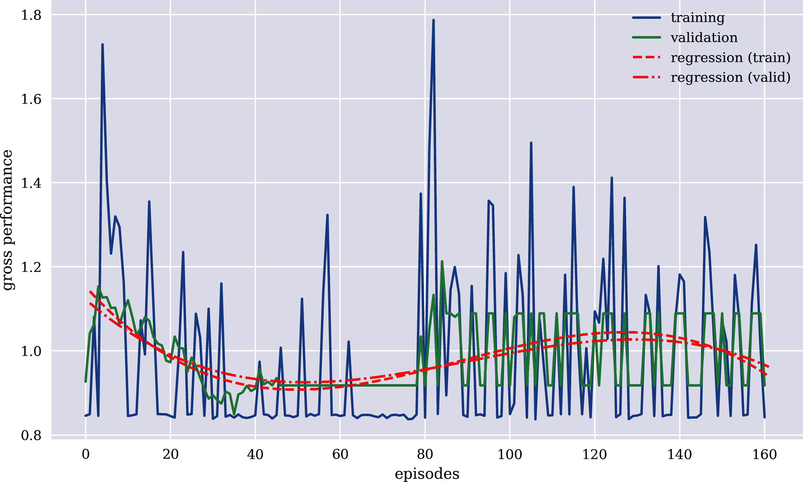

# 第九章 强化学习

> 像人类一样，我们的代理通过自己学习，以实现成功的策略，从而获得最大的长期回报。这种通过奖励或惩罚进行试错学习的范式称为强化学习。^(1)
> 
> DeepMind（2016）

应用于第七章和第八章的学习算法属于*监督学习*范畴。这些方法要求提供一个数据集，其中包含特征和标签，使得算法能够学习特征与标签之间的关系，以便在估计或分类任务中成功。正如第一章的简单示例所说明的那样，*强化学习*（RL）的工作方式不同。首先，无需事先提供完整的特征和标签数据集。数据是通过学习代理与感兴趣的环境交互而生成的。本章详细介绍了 RL，并引入了基本概念，以及领域中使用的最流行算法之一：*Q-learning*（QL）。神经网络并未被 RL 算法所取代；它们在这一背景下通常也起着重要作用。

“基本概念” 解释了 RL 中的基本概念，如环境、状态和代理。“OpenAI Gym” 介绍了 OpenAI Gym 的 RL 环境套件，其中`CartPole`环境作为示例。在这个环境中，第二章简要介绍并讨论了代理必须学习如何通过移动车辆左右来平衡杆的问题。“蒙特卡洛代理”展示了如何通过降维和蒙特卡洛模拟来解决`CartPole`问题。通常，标准监督学习算法如深度神经网络（DNNs）一般不适用于解决`CartPole`这类问题，因为它们缺乏延迟奖励的概念。这个问题在“神经网络代理”中有所说明。“DQL 代理”讨论了一个显式考虑延迟奖励并能够解决`CartPole`问题的 QL 代理。同样的代理也应用于“简单金融 Gym”中的一个简单金融市场环境。尽管该代理在这种情况下表现不佳，但该示例显示 QL 代理也可以学习交易并成为所谓的*交易机器人*。为了改善 QL 代理的学习能力，“更好的金融 Gym”提出了一个改进的金融市场环境，除其他好处外，还允许使用多种类型的特征来描述环境的状态。基于这种改进的环境，“FQL 代理”介绍并应用了一个改进的金融 QL 代理，表现更佳，作为交易机器人。

# 基本概念

本节简要概述了强化学习中的基本概念。其中包括以下内容：

环境

*环境*定义了面临的问题。这可以是要玩的电脑游戏，也可以是要进行交易的金融市场。

状态

*状态*包含描述当前环境状态的所有相关参数。在电脑游戏中，这可能是整个屏幕及其所有像素。在金融市场中，这可能包括当前和历史价格水平或金融指标如移动平均线、宏观经济变量等。

代理

*代理*一词涵盖了 RL 算法中与环境交互并从中学习的所有元素。在游戏背景下，代理可能代表玩家进行游戏。在金融背景下，代理可以代表交易员在上涨或下跌的市场上下注。

动作

代理可以从允许的（有限的）一组操作中选择一个*动作*。在电脑游戏中，向左或向右移动可能是允许的动作，而在金融市场中，做多或做空可能是允许的操作。

步骤

针对代理的一个行动，环境的状态会被更新。这样的更新通常被称为一个*步骤*。步骤的概念足够广泛，可以涵盖两个步骤之间的异质和同质时间间隔。在电脑游戏中，通过相当短、同质的时间间隔模拟与游戏环境的实时交互（“游戏时钟”），而交易机器人与金融市场环境交互可能需要更长、异质的时间间隔来执行操作。

奖励

根据代理选择的行动，会给予一定的*奖励*（或惩罚）。在电脑游戏中，分数通常是一种典型的奖励。在金融背景下，利润（或亏损）是一种标准的奖励（或惩罚）。

[目标](https://wiki.example.org/target)

*目标*指定了代理试图最大化的内容。在电脑游戏中，一般是代理达到的分数。对于金融交易机器人，这可能是累积的交易利润。

策略

*策略*定义了在特定环境状态下代理应该采取的行动。在电脑游戏中，代表当前场景的所有像素构成的状态下，策略可能指定代理选择“向右移动”作为行动。一个交易机器人观察到连续三次价格上涨，可能根据其策略决定做空市场。

回合

一个*回合*是从环境的初始状态到达成功或观察到失败的一系列步骤。在游戏中，这是从游戏开始到获胜或失败。在金融世界中，例如，这是从年初到年底或破产。

Sutton 和 Barto（2018）详细介绍了 RL 领域。该书详细讨论了前述概念，并且通过大量具体示例进行了说明。以下章节再次选择了一种实用的、实施导向的 RL 方法。讨论的示例通过 Python 代码说明了所有前述概念。

# OpenAI Gym

在大多数成功案例中，RL 在第二章中扮演了主导角色。这激发了对 RL 作为一种算法的广泛兴趣。OpenAI 是一个致力于推动 AI 研究的组织，特别是在 RL 领域。OpenAI 开发并开源了一套称为[`OpenAI Gym`](https://gym.openai.com)的环境套件，允许通过标准化 API 训练 RL 代理。

在众多环境中，有一个称为[`CartPole`](https://oreil.ly/f6tAK)的环境（或游戏），模拟了一个经典的 RL 问题。一个杆竖立在一个小车上，目标是通过移动小车向左或向右来学习平衡杆子的策略。环境的状态由四个参数给出，描述以下物理测量：小车位置、小车速度、杆角度和杆末端的杆角速度。Figure 9-1 展示了环境的可视化。



###### 图 9-1\. OpenAI Gym 的 CartPole 环境

考虑以下 Python 代码，实例化了一个 `CartPole` 环境对象，并检查*观察空间*。观察空间是环境状态的模型：

```py
In [1]: import os
        import math
        import random
        import numpy as np
        import pandas as pd
        from pylab import plt, mpl
        plt.style.use('seaborn')
        mpl.rcParams['savefig.dpi'] = 300
        mpl.rcParams['font.family'] = 'serif'
        np.set_printoptions(precision=4, suppress=True)
        os.environ['PYTHONHASHSEED'] = '0'
In [2]: import gym

In [3]: env = gym.make('CartPole-v0')  

In [4]: env.seed(100)  
        env.action_space.seed(100)  
Out[4]: [100]

In [5]: env.observation_space  
Out[5]: Box(4,)

In [6]: env.observation_space.low.astype(np.float16)  
Out[6]: array([-4.8  ,   -inf, -0.419,   -inf], dtype=float16)

In [7]: env.observation_space.high.astype(np.float16)  
Out[7]: array([4.8  ,   inf, 0.419,   inf], dtype=float16)

In [8]: state = env.reset()  

In [9]: state  
Out[9]: array([-0.0163,  0.0238, -0.0392, -0.0148])
```


环境对象，带有固定的种子值


观察空间的最小值和最大值


重置环境


初始状态：小车位置、小车速度、杆角度、杆角速度

在以下环境中，允许的动作由*动作空间*描述。在这种情况下，有两种动作，分别用`0`（向左推车）和`1`（向右推车）表示：

```py
In [10]: env.action_space  
Out[10]: Discrete(2)

In [11]: env.action_space.n  
Out[11]: 2

In [12]: env.action_space.sample()  
Out[12]: 1

In [13]: env.action_space.sample()   
Out[13]: 0

In [14]: a = env.action_space.sample()  
         a  
Out[14]: 1

In [15]: state, reward, done, info = env.step(a)  
         state, reward, done, info  
Out[15]: (array([-0.0158,  0.2195, -0.0395, -0.3196]), 1.0, False, {})
```


行动空间


从动作空间中随机采样随机动作


根据随机行动向前迈进


环境的新状态、奖励、成功/失败、额外信息

只要`done=False`，代理仍然在游戏中，并且可以选择另一个动作。当代理连续达到 200 步或总奖励达到 200 时（每步奖励为 1.0）即为成功。如果架在小车上的杆达到可能导致杆从小车上掉下的一定角度，则观察到失败。在这种情况下，将返回`done=True`。

简单代理是指遵循完全随机策略的代理：无论观察到什么状态，代理都会选择一个随机动作。以下代码实现了这一点。在这种情况下，代理能够走多少步完全取决于它的运气。不会发生更新策略的学习形式：

```py
In [16]: env.reset()
         for e in range(1, 200):
             a = env.action_space.sample()  
             state, reward, done, info = env.step(a) 
             print(f'step={e:2d} | state={state} | action={a} | reward={reward}')
             if done and (e + 1) < 200:  
                 print('*** FAILED ***')  
                 break
         step= 1 | state=[-0.0423  0.1982  0.0256 -0.2476] | action=1 | reward=1.0
         step= 2 | state=[-0.0383  0.0028  0.0206  0.0531] | action=0 | reward=1.0
         step= 3 | state=[-0.0383  0.1976  0.0217 -0.2331] | action=1 | reward=1.0
         step= 4 | state=[-0.0343  0.0022  0.017   0.0664] | action=0 | reward=1.0
         step= 5 | state=[-0.0343  0.197   0.0184 -0.2209] | action=1 | reward=1.0
         step= 6 | state=[-0.0304  0.0016  0.0139  0.0775] | action=0 | reward=1.0
         step= 7 | state=[-0.0303  0.1966  0.0155 -0.2107] | action=1 | reward=1.0
         step= 8 | state=[-0.0264  0.0012  0.0113  0.0868] | action=0 | reward=1.0
         step= 9 | state=[-0.0264  0.1962  0.013  -0.2023] | action=1 | reward=1.0
         step=10 | state=[-0.0224  0.3911  0.009  -0.4908] | action=1 | reward=1.0
         step=11 | state=[-0.0146  0.5861 -0.0009 -0.7807] | action=1 | reward=1.0
         step=12 | state=[-0.0029  0.7812 -0.0165 -1.0736] | action=1 | reward=1.0
         step=13 | state=[ 0.0127  0.9766 -0.0379 -1.3714] | action=1 | reward=1.0
         step=14 | state=[ 0.0323  1.1722 -0.0654 -1.6758] | action=1 | reward=1.0
         step=15 | state=[ 0.0557  0.9779 -0.0989 -1.4041] | action=0 | reward=1.0
         step=16 | state=[ 0.0753  0.7841 -0.127  -1.1439] | action=0 | reward=1.0
         step=17 | state=[ 0.0909  0.5908 -0.1498 -0.8936] | action=0 | reward=1.0
         step=18 | state=[ 0.1028  0.7876 -0.1677 -1.2294] | action=1 | reward=1.0
         step=19 | state=[ 0.1185  0.9845 -0.1923 -1.5696] | action=1 | reward=1.0
         step=20 | state=[ 0.1382  0.7921 -0.2237 -1.3425] | action=0 | reward=1.0
         *** FAILED ***

In [17]: done
Out[17]: True
```


随机动作策略


向前迈出一步


如果少于 200 步，则失败

# 通过交互获取数据

在监督学习中，训练、验证和测试数据集被假定在训练开始之前存在，而在 RL 中，代理通过与环境的交互自己生成其数据。在许多情况下，例如在游戏中，这是一个巨大的简化。考虑象棋游戏：与其将成千上万个历史人类下棋游戏加载到计算机中，不如使用 RL 代理自己生成数千甚至数百万个游戏，例如通过与另一个象棋引擎或其另一个版本对弈。

# 蒙特卡罗代理

`CartPole`问题不一定需要完整的强化学习方法或一些神经网络来解决。本节提供了一个基于蒙特卡罗模拟的简单解决方案，该解决方案基于*降维*。在这种情况下，定义了一个特定的策略，该策略利用线性组合将环境状态的四个参数折叠为一个实值参数。^(2) 以下 Python 代码实现了这个想法：

```py
In [18]: np.random.seed(100)  

In [19]: weights = np.random.random(4) * 2 - 1  

In [20]: weights  
Out[20]: array([ 0.0868, -0.4433, -0.151 ,  0.6896])

In [21]: state = env.reset()  

In [22]: state  
Out[22]: array([-0.0347, -0.0103,  0.047 , -0.0315])

In [23]: s = np.dot(state, weights)  
         s  
Out[23]: -0.02725361929630797
```


固定种子值的随机权重


环境的初始状态


状态和权重的点积

策略然后基于单个状态参数`s`的符号进行定义：

```py
In [24]: if s < 0:
             a = 0
         else:
             a = 1

In [25]: a
Out[25]: 0
```

然后可以使用此策略来玩一个`CartPole`游戏的回合。由于应用的权重具有随机性质，因此其结果通常不会比前一节中的随机行动策略更好：

```py
In [26]: def run_episode(env, weights):
             state = env.reset()
             treward = 0
             for _ in range(200):
                 s = np.dot(state, weights)
                 a = 0 if s < 0 else 1
                 state, reward, done, info = env.step(a)
                 treward += reward
                 if done:
                     break
             return treward

In [27]: run_episode(env, weights)
Out[27]: 41.0
```

因此，蒙特卡罗模拟被用来测试大量不同的权重。以下代码模拟了大量的权重，检查它们是否成功或失败，然后选择产生成功的权重：

```py
In [28]: def set_seeds(seed=100):
             random.seed(seed)
             np.random.seed(seed)
             env.seed(seed)

In [29]: set_seeds()
         num_episodes = 1000

In [30]: besttreward = 0
         for e in range(1, num_episodes + 1):
             weights = np.random.rand(4) * 2 - 1  
             treward = run_episode(env, weights)  
             if treward > besttreward:  
                 besttreward = treward  
                 bestweights = weights  
                 if treward == 200:
                     print(f'SUCCESS | episode={e}')
                     break
                 print(f'UPDATE  | episode={e}')
         UPDATE  | episode=1
         UPDATE  | episode=2
         SUCCESS | episode=13

In [31]: weights
Out[31]: array([-0.4282,  0.7048,  0.95  ,  0.7697])
```


随机权重。


这些权重的总奖励。


观察到改进了吗？


替换最佳总奖励。


替换最佳权重。

如果一个代理在连续的 100 个回合中的平均总奖励达到 195 或更高，则认为解决了`CartPole`问题。如下面的代码所示，蒙特卡洛代理确实达到了这个目标：

```py
In [32]: res = []
         for _ in range(100):
             treward = run_episode(env, weights)
             res.append(treward)
         res[:10]
Out[32]: [200.0, 200.0, 200.0, 200.0, 200.0, 200.0, 200.0, 200.0, 200.0, 200.0]

In [33]: sum(res) / len(res)
Out[33]: 200.0
```

当然，这是一个强大的基准，其他更复杂的方法也在与之竞争。

# 神经网络代理

`CartPole`游戏也可以视为分类设置。环境的状态由四个特征值组成。给定特征值，正确的动作是标签。通过与环境的交互，神经网络代理可以收集由特征值和标签组成的数据集。在这个逐渐增长的数据集的基础上，可以训练神经网络来学习给定环境状态时的正确动作。在这种情况下，神经网络代表了策略。代理根据新的经验更新策略。

首先，导入一些库：

```py
In [34]: import tensorflow as tf
         from keras.layers import Dense, Dropout
         from keras.models import Sequential
         from keras.optimizers import Adam, RMSprop
         from sklearn.metrics import accuracy_score
         Using TensorFlow backend.

In [35]: def set_seeds(seed=100):
             random.seed(seed)
             np.random.seed(seed)
             tf.random.set_seed(seed)
             env.seed(seed)
             env.action_space.seed(100)
```

其次是`NNAgent`类，它整合了代理的主要元素：策略的神经网络模型，根据策略选择动作，更新策略（训练神经网络），以及在多个回合中的学习过程。代理同时使用*探索*和*利用*来选择动作。探索是指独立于当前策略的随机动作。利用是指根据当前策略得出的动作。这样做的想法是一定程度的探索可以确保更丰富的经验，从而提高代理的学习效果：

```py
In [36]: class NNAgent:
             def __init__(self):
                 self.max = 0  
                 self.scores = list()
                 self.memory = list()
                 self.model = self._build_model()

             def _build_model(self):  
                 model = Sequential()
                 model.add(Dense(24, input_dim=4,
                                 activation='relu'))
                 model.add(Dense(1, activation='sigmoid'))
                 model.compile(loss='binary_crossentropy',
                               optimizer=RMSprop(lr=0.001))
                 return model

             def act(self, state):  
                 if random.random() <= 0.5:
                     return env.action_space.sample()
                 action = np.where(self.model.predict(
                     state, batch_size=None)[0, 0] > 0.5, 1, 0)
                 return action

             def train_model(self, state, action):  
                 self.model.fit(state, np.array([action,]),
                                epochs=1, verbose=False)

             def learn(self, episodes):  
                 for e in range(1, episodes + 1):
                     state = env.reset()
                     for _ in range(201):
                         state = np.reshape(state, [1, 4])
                         action = self.act(state)
                         next_state, reward, done, info = env.step(action)
                         if done:
                             score = _ + 1
                             self.scores.append(score)
                             self.max = max(score, self.max)  
                             print('episode: {:4d}/{} | score: {:3d} | max: {:3d}'
                                   .format(e, episodes, score, self.max), end='\r')
                             break
                         self.memory.append((state, action))
                         self.train_model(state, action)  
                         state = next_state
```


最大的总奖励


用于策略的 DNN 分类模型


选择动作的方法（探索和利用）


更新策略的方法（训练神经网络）


从与环境交互中学习的方法

对于所示的配置，神经网络代理无法解决问题。最大的总奖励 200 甚至没有达到一次：

```py
In [37]: set_seeds(100)
         agent = NNAgent()

In [38]: episodes = 500

In [39]: agent.learn(episodes)
         episode:  500/500 | score:  11 | max:  44
In [40]: sum(agent.scores) / len(agent.scores)  
Out[40]: 13.682
```


所有回合的平均总奖励

这种方法似乎存在一些问题。其中一个主要的缺失元素是超越当前状态和待选择动作的概念。当前实施的方法并没有考虑到只有当代理在 200 个连续步骤中生存下来时才算成功。简单来说，代理避免采取错误的动作，但并没有学会赢得游戏。

分析收集到的状态（特征）和动作（标签）的历史表明，神经网络达到了大约 75%的准确率。

然而，这并不意味着像以前那样转化为一个获胜的政策：

```py
In [41]: f = np.array([m[0][0] for m in agent.memory])  
         f  
Out[41]: array([[-0.0163,  0.0238, -0.0392, -0.0148],
                [-0.0158,  0.2195, -0.0395, -0.3196],
                [-0.0114,  0.0249, -0.0459, -0.0396],
                ...,
                [ 0.0603,  0.9682, -0.0852, -1.4595],
                [ 0.0797,  1.1642, -0.1144, -1.7776],
                [ 0.103 ,  1.3604, -0.15  , -2.1035]])

In [42]: l = np.array([m[1] for m in agent.memory])  
         l  
Out[42]: array([1, 0, 1, ..., 1, 1, 1])

In [43]: accuracy_score(np.where(agent.model.predict(f) > 0.5, 1, 0), l)
Out[43]: 0.7525626872733008
```


所有剧集的特征（状态）


所有剧集的标签（动作）

# DQL 代理

Q 学习（QL）是一种算法，除了行动的即时奖励外，还考虑了延迟奖励。该算法由 Watkins（1989 年）和 Watkins 和 Dayan（1992 年）提出，并在 Sutton 和 Barto（2018 年，第六章）中详细解释。QL 解决了与神经网络代理遇到的超出即时下一个奖励的问题。

该算法大致如下工作。有一个*动作值*策略<math alttext="upper Q"><mi>Q</mi></math>，为每个状态和动作组合分配一个值。值越高，从代理的角度来看，动作越好。如果代理使用策略<math alttext="upper Q"><mi>Q</mi></math>来选择动作，则选择价值最高的动作。

如何推导出一个动作的价值？一个动作的价值由其*直接奖励*和下一个状态中最优动作的*折扣值*组成。以下是形式表达：

<math alttext="upper Q left-parenthesis upper S Subscript t Baseline comma upper A Subscript t Baseline right-parenthesis equals upper R Subscript t plus 1 Baseline plus gamma max Underscript a Endscripts upper Q left-parenthesis upper S Subscript t plus 1 Baseline comma a right-parenthesis" display="block"><mrow><mi>Q</mi> <mrow><mo>(</mo> <msub><mi>S</mi> <mi>t</mi></msub> <mo>,</mo> <msub><mi>A</mi> <mi>t</mi></msub> <mo>)</mo></mrow> <mo>=</mo> <msub><mi>R</mi> <mrow><mi>t</mi><mo>+</mo><mn>1</mn></mrow></msub> <mo>+</mo> <mi>γ</mi> <munder><mo movablelimits="true" form="prefix">max</mo> <mi>a</mi></munder> <mi>Q</mi> <mrow><mo>(</mo> <msub><mi>S</mi> <mrow><mi>t</mi><mo>+</mo><mn>1</mn></mrow></msub> <mo>,</mo> <mi>a</mi> <mo>)</mo></mrow></mrow></math>

这里，<math alttext="upper S Subscript t"><msub><mi>S</mi> <mi>t</mi></msub></math> 是步骤（时间）<math alttext="t"><mi>t</mi></math> 的状态，<math alttext="upper A Subscript t"><msub><mi>A</mi> <mi>t</mi></msub></math> 是在状态<math alttext="upper S Subscript t"><msub><mi>S</mi> <mi>t</mi></msub></math> 下采取的动作，<math alttext="upper R Subscript t plus 1"><msub><mi>R</mi> <mrow><mi>t</mi><mo>+</mo><mn>1</mn></mrow></msub></math> 是动作<math alttext="upper A Subscript t"><msub><mi>A</mi> <mi>t</mi></msub></math> 的直接奖励，<math alttext="0 less-than gamma less-than 1"><mrow><mn>0</mn> <mo><</mo> <mi>γ</mi> <mo><</mo> <mn>1</mn></mrow></math> 是折扣因子，<math alttext="max Underscript a Endscripts upper Q left-parenthesis upper S Subscript t plus 1 Baseline comma a right-parenthesis"><mrow><msub><mo movablelimits="true" form="prefix">max</mo> <mi>a</mi></msub> <mi>Q</mi> <mrow><mo>(</mo> <msub><mi>S</mi> <mrow><mi>t</mi><mo>+</mo><mn>1</mn></mrow></msub> <mo>,</mo> <mi>a</mi> <mo>)</mo></mrow></mrow></math> 是给定当前策略<math alttext="upper Q"><mi>Q</mi></math> 的最佳行动后延迟奖励的最大值。

在简单环境中，只有有限数量的可能状态，<math alttext="upper Q"><mi>Q</mi></math> 例如可以被表示为*表格*，列出每个状态-动作组合对应的值。然而，在更有趣或复杂的环境中，比如`CartPole`环境，状态的数量对于<math alttext="upper Q"><mi>Q</mi></math>来说过于庞大，无法全面地写出来。因此，<math alttext="upper Q"><mi>Q</mi></math>通常被理解为一个*函数*。

这就是神经网络发挥作用的地方。在现实设置和环境中，对于函数<math alttext="upper Q"><mi>Q</mi></math>可能不存在闭合形式的解，或者基于动态规划可能太难推导。因此，QL 算法通常只针对*近似*。神经网络以其通用逼近能力，是实现<math alttext="upper Q"><mi>Q</mi></math>的自然选择。

QL 的另一个关键元素是*回放*。QL 代理会定期重放若干经验（状态-动作组合）以更新策略函数<math alttext="upper Q"><mi>Q</mi></math>。这可以显著改善学习效果。此外，在以下提供的 QL 代理——`DQLAgent`中，代理在学习过程中也会在探索和利用之间交替。这种交替是系统化的，代理从仅探索开始——开始时它可能还没有学到任何东西——然后缓慢但稳步地减少探索率<math alttext="epsilon"><mi>ϵ</mi></math>直到达到最低水平：^(3)

```py
In [44]: from collections import deque
         from keras.optimizers import Adam, RMSprop

In [45]: class DQLAgent:
             def __init__(self, gamma=0.95, hu=24, opt=Adam,
                    lr=0.001, finish=False):
                 self.finish = finish
                 self.epsilon = 1.0  
                 self.epsilon_min = 0.01  
                 self.epsilon_decay = 0.995  
                 self.gamma = gamma  
                 self.batch_size = 32  
                 self.max_treward = 0
                 self.averages = list()
                 self.memory = deque(maxlen=2000)  
                 self.osn = env.observation_space.shape[0]
                 self.model = self._build_model(hu, opt, lr)

             def _build_model(self, hu, opt, lr):
                 model = Sequential()
                 model.add(Dense(hu, input_dim=self.osn,
                                 activation='relu'))
                 model.add(Dense(hu, activation='relu'))
                 model.add(Dense(env.action_space.n, activation='linear'))
                 model.compile(loss='mse', optimizer=opt(lr=lr))
                 return model

             def act(self, state):
                 if random.random() <= self.epsilon:
                     return env.action_space.sample()
                 action = self.model.predict(state)[0]
                 return np.argmax(action)

             def replay(self):
                 batch = random.sample(self.memory, self.batch_size)  
                 for state, action, reward, next_state, done in batch:
                     if not done:
                         reward += self.gamma * np.amax(
                             self.model.predict(next_state)[0])  
                     target = self.model.predict(state)
                     target[0, action] = reward
                     self.model.fit(state, target, epochs=1,
                                    verbose=False)  
                 if self.epsilon > self.epsilon_min:
                     self.epsilon *= self.epsilon_decay  

             def learn(self, episodes):
                 trewards = []
                 for e in range(1, episodes + 1):
                     state = env.reset()
                     state = np.reshape(state, [1, self.osn])
                     for _ in range(5000):
                         action = self.act(state)
                         next_state, reward, done, info = env.step(action)
                         next_state = np.reshape(next_state,
                                                 [1, self.osn])
                         self.memory.append([state, action, reward,
                                              next_state, done])  
                         state = next_state
                         if done:
                             treward = _ + 1
                             trewards.append(treward)
                             av = sum(trewards[-25:]) / 25
                             self.averages.append(av)
                             self.max_treward = max(self.max_treward, treward)
                             templ = 'episode: {:4d}/{} | treward: {:4d} | '
                             templ += 'av: {:6.1f} | max: {:4d}'
                             print(templ.format(e, episodes, treward, av,
                                                self.max_treward), end='\r')
                             break
                     if av > 195 and self.finish:
                         break
                     if len(self.memory) > self.batch_size:
                         self.replay()  
             def test(self, episodes):
                 trewards = []
                 for e in range(1, episodes + 1):
                     state = env.reset()
                     for _ in range(5001):
                         state = np.reshape(state, [1, self.osn])
                         action = np.argmax(self.model.predict(state)[0])
                         next_state, reward, done, info = env.step(action)
                         state = next_state
                         if done:
                             treward = _ + 1
                             trewards.append(treward)
                             print('episode: {:4d}/{} | treward: {:4d}'
                                   .format(e, episodes, treward), end='\r')
                             break
                 return trewards
```


初始探索率


最小探索率


探索率衰减率


延迟奖励的折现因子


回放的批次大小


`deque`集合用于有限历史记录


随机选择历史批次用于回放


状态-动作对的<math alttext="upper Q"><mi>Q</mi></math>值


更新神经网络以适应新的动作-值对


更新探索率


存储新数据


回放以基于过去经验更新策略

QL 代理表现如何？ 如下所示的代码显示，它对`CartPole`达到了总奖励为 200 的获胜状态。图 9-2 显示了分数的移动平均值以及随时间的增长情况，尽管不是单调递增。相反，作为图 9-2 所示，代理的表现有时可能显著下降。在其他方面，始终进行的探索导致可能不一定会带来总奖励方面的良好结果但可能导致更新策略网络的有益体验的随机操作：

```py
In [46]: episodes = 1000

In [47]: set_seeds(100)
         agent = DQLAgent(finish=True)

In [48]: agent.learn(episodes)
         episode:  400/1000 | treward:  200 | av:  195.4 | max:  200
In [49]: plt.figure(figsize=(10, 6))
         x = range(len(agent.averages))
         y = np.polyval(np.polyfit(x, agent.averages, deg=3), x)
         plt.plot(agent.averages, label='moving average')
         plt.plot(x, y, 'r--', label='trend')
         plt.xlabel('episodes')
         plt.ylabel('total reward')
         plt.legend();
```



###### 图 9-2\. `DQLAgent`对`CartPole`的平均总奖励

QL 代理是否解决了`CartPole`问题？ 在这种特定情况下，根据 OpenAI Gym 的成功定义，它确实解决了这个问题：

```py
In [50]: trewards = agent.test(100)
         episode:  100/100 | treward:  200
In [51]: sum(trewards) / len(trewards)
Out[51]: 200.0
```

# 简单的财务健身房

为了将 QL 方法转移到金融领域，本节提供了一个类，模仿 OpenAI Gym 环境，但适用于由金融时间序列数据表示的金融市场。其想法是，类似于`CartPole`环境，四个历史价格代表了金融市场的状态。当呈现状态时，代理可以决定是持有多头还是持有空头。在这种情况下，两个环境是可比较的，因为一个状态由四个参数给出，代理可以采取两种不同的行动。

为了模仿 OpenAI Gym API，需要两个辅助类——一个用于观察空间，另一个用于行动空间：

```py
In [52]: class observation_space:
             def __init__(self, n):
                 self.shape = (n,)

In [53]: class action_space:
             def __init__(self, n):
                 self.n = n
             def seed(self, seed):
                 pass
             def sample(self):
                 return random.randint(0, self.n - 1)
```

以下 Python 代码定义了`Finance`类。它检索多个符号的每日历史价格。该类的主要方法是`.reset()`和`.step()`。`.step()`方法检查是否已采取正确的操作，相应地定义奖励，并检查成功或失败。当代理能够正确地贸易整个数据集时，就实现了成功。当然，可以以不同的方式定义成功（例如，当代理成功进行了 1,000 步的交易时即视为成功）。失败被定义为精度比低于 50％（总奖励除以总步数）。但是，这只是在一定数量的步骤之后进行检查，以避免此度量的高初始方差：

```py
In [54]: class Finance:
             url = 'http://hilpisch.com/aiif_eikon_eod_data.csv'
             def __init__(self, symbol, features):
                 self.symbol = symbol
                 self.features = features
                 self.observation_space = observation_space(4)
                 self.osn = self.observation_space.shape[0]
                 self.action_space = action_space(2)
                 self.min_accuracy = 0.475  
                 self._get_data()
                 self._prepare_data()
             def _get_data(self):
                 self.raw = pd.read_csv(self.url, index_col=0,
                                        parse_dates=True).dropna()
             def _prepare_data(self):
                 self.data = pd.DataFrame(self.raw[self.symbol])
                 self.data['r'] = np.log(self.data / self.data.shift(1))
                 self.data.dropna(inplace=True)
                 self.data = (self.data - self.data.mean()) / self.data.std()
                 self.data['d'] = np.where(self.data['r'] > 0, 1, 0)
             def _get_state(self):
                 return self.data[self.features].iloc[
                     self.bar - self.osn:self.bar].values  
             def seed(self, seed=None):
                 pass
             def reset(self):  
                 self.treward = 0
                 self.accuracy = 0
                 self.bar = self.osn
                 state = self.data[self.features].iloc[
                     self.bar - self.osn:self.bar]
                 return state.values
             def step(self, action):
                 correct = action == self.data['d'].iloc[self.bar]  
                 reward = 1 if correct else 0  
                 self.treward += reward  
                 self.bar += 1  
                 self.accuracy = self.treward / (self.bar - self.osn)  
                 if self.bar >= len(self.data):  
                     done = True
                 elif reward == 1:  
                     done = False
                 elif (self.accuracy < self.min_accuracy and
                       self.bar > self.osn + 10):  
                     done = True
                 else:  
                     done = False
                 state = self._get_state()
                 info = {}
                 return state, reward, done, info
```


定义所需的最小精度。


选择定义金融市场状态的数据。


将环境重置为其初始值。


检查代理是否选择了正确的行动（成功交易）。


定义代理接收的奖励。


将奖励添加到总奖励中。


将环境向前推进一步。


计算成功行动（交易）的准确性，考虑所有步骤（交易）。


如果智能体达到数据集的末尾，则视为成功。


如果智能体采取正确的行动，它可以继续前进。


在一些初始步骤之后，如果准确性降到最低水平以下，则该情节结束（失败）。


对于其余情况，智能体可以继续前进。

`Finance` 类的实例表现得像是 OpenAI Gym 的环境。特别是在这个基础案例中，该实例的行为与 `CartPole` 环境完全一致：

```py
In [55]: env = Finance('EUR=', 'EUR=')  

In [56]: env.reset()
Out[56]: array([1.819 , 1.8579, 1.7749, 1.8579])

In [57]: a = env.action_space.sample()
         a
Out[57]: 0

In [58]: env.step(a)
Out[58]: (array([1.8579, 1.7749, 1.8579, 1.947 ]), 0, False, {})
```


指定用于定义表示状态数据的符号和特征类型（符号或对数收益）。

`DQLAgent` 是否能像为 `CartPole` 游戏开发的那样，在金融市场中进行交易学习？是的，可以，正如下面的代码所示。然而，尽管智能体在训练情节中平均改善了其交易技能，但结果并不十分令人印象深刻（参见 图 9-3）：

```py
In [59]: set_seeds(100)
         agent = DQLAgent(gamma=0.5, opt=RMSprop)

In [60]: episodes = 1000

In [61]: agent.learn(episodes)
         episode: 1000/1000 | treward: 2511 | av: 1012.7 | max: 2511
In [62]: agent.test(3)
         episode:    3/3 | treward: 2511
Out[62]: [2511, 2511, 2511]

In [63]: plt.figure(figsize=(10, 6))
         x = range(len(agent.averages))
         y = np.polyval(np.polyfit(x, agent.averages, deg=3), x)
         plt.plot(agent.averages, label='moving average')
         plt.plot(x, y, 'r--', label='regression')
         plt.xlabel('episodes')
         plt.ylabel('total reward')
         plt.legend();
```



###### 图 9-3\. `Finance` 中 `DQLAgent` 的平均总奖励

# 通用 RL 智能体

本节为模仿 OpenAI Gym 环境 API 的金融市场环境提供了一个类。它还将 QL 智能体应用于新的金融市场环境，而无需对智能体本身进行任何更改。尽管智能体在这种新环境中的表现可能并不令人印象深刻，但它说明了本章介绍的 RL 方法相当通用。RL 智能体通常可以从其交互的不同环境中学习。这在某种程度上解释了为什么 DeepMind 的 AlphaZero 能够掌握围棋、国际象棋和将棋，如 第二章 中所讨论的那样。

# 更好的金融 Gym

前一节的想法是开发一个简单的类，允许在金融市场环境中进行强化学习。该节的主要目标是复制 OpenAI Gym 环境的 API。然而，并不需要将这样的环境限制在单一类型的特征来描述金融市场状态，也不需要仅使用四个滞后期。本节介绍了一个改进的 `Finance` 类，允许多个特征、灵活的滞后期数量以及用于基础数据集的特定起始点和结束点。这样做，除其他事项外，还允许将数据集的一部分用于学习，另一部分用于验证或测试。以下 Python 代码还允许使用杠杆。在考虑相对较小的绝对回报的分钟级数据时，这可能是有帮助的：

```py
In [64]: class Finance:
             url = 'http://hilpisch.com/aiif_eikon_eod_data.csv'
             def __init__(self, symbol, features, window, lags,
                          leverage=1, min_performance=0.85,
                          start=0, end=None, mu=None, std=None):
                 self.symbol = symbol
                 self.features = features  
                 self.n_features = len(features)
                 self.window = window
                 self.lags = lags  
                 self.leverage = leverage  
                 self.min_performance = min_performance  
                 self.start = start
                 self.end = end
                 self.mu = mu
                 self.std = std
                 self.observation_space = observation_space(self.lags)
                 self.action_space = action_space(2)
                 self._get_data()
                 self._prepare_data()
             def _get_data(self):
                 self.raw = pd.read_csv(self.url, index_col=0,
                                        parse_dates=True).dropna()
             def _prepare_data(self):
                 self.data = pd.DataFrame(self.raw[self.symbol])
                 self.data = self.data.iloc[self.start:]
                 self.data['r'] = np.log(self.data / self.data.shift(1))
                 self.data.dropna(inplace=True)
                 self.data['s'] = self.data[self.symbol].rolling(
                                                       self.window).mean()   
                 self.data['m'] = self.data['r'].rolling(self.window).mean()  
                 self.data['v'] = self.data['r'].rolling(self.window).std()  
                 self.data.dropna(inplace=True)
                 if self.mu is None:
                     self.mu = self.data.mean()  
                     self.std = self.data.std()  
                 self.data_ = (self.data - self.mu) / self.std  
                 self.data_['d'] = np.where(self.data['r'] > 0, 1, 0)
                 self.data_['d'] = self.data_['d'].astype(int)
                 if self.end is not None:
                     self.data = self.data.iloc[:self.end - self.start]
                     self.data_ = self.data_.iloc[:self.end - self.start]
             def _get_state(self):
                 return self.data_[self.features].iloc[self.bar -
                                         self.lags:self.bar]
             def seed(self, seed):
                 random.seed(seed)
                 np.random.seed(seed)
             def reset(self):
                 self.treward = 0
                 self.accuracy = 0
                 self.performance = 1
                 self.bar = self.lags
                 state = self.data_[self.features].iloc[self.bar-
                                 self.lags:self.bar]
                 return state.values
             def step(self, action):
                 correct = action == self.data_['d'].iloc[self.bar]
                 ret = self.data['r'].iloc[self.bar] * self.leverage  
                 reward_1 = 1 if correct else 0
                 reward_2 = abs(ret) if correct else -abs(ret)  
                 factor = 1 if correct else -1
                 self.treward += reward_1
                 self.bar += 1
                 self.accuracy = self.treward / (self.bar - self.lags)
                 self.performance *= math.exp(reward_2)  
                 if self.bar >= len(self.data):
                     done = True
                 elif reward_1 == 1:
                     done = False
                 elif (self.performance < self.min_performance and
                       self.bar > self.lags + 5):
                     done = True
                 else:
                     done = False
                 state = self._get_state()
                 info = {}
                 return state.values, reward_1 + reward_2 * 5, done, info
```


用于定义状态的特征


要使用的滞后数


所需的最低总体性能


附加的金融特征（简单移动平均线、动量、滚动波动性）


数据的高斯归一化


步骤的杠杆收益率


步骤的基于回报的奖励


步骤后的总体性能

新的`Finance`类为金融市场环境的建模提供了更大的灵活性。以下代码展示了两个特征和五个滞后的示例：

```py
In [65]: env = Finance('EUR=', ['EUR=', 'r'], 10, 5)

In [66]: a = env.action_space.sample()
         a
Out[66]: 0

In [67]: env.reset()
Out[67]: array([[ 1.7721, -1.0214],
                [ 1.5973, -2.4432],
                [ 1.5876, -0.1208],
                [ 1.6292,  0.6083],
                [ 1.6408,  0.1807]])

In [68]: env.step(a)
Out[68]: (array([[ 1.5973, -2.4432],
                 [ 1.5876, -0.1208],
                 [ 1.6292,  0.6083],
                 [ 1.6408,  0.1807],
                 [ 1.5725, -0.9502]]),
          1.0272827803740798,
          False,
          {})
```

# FQL 代理

基于新的`Finance`环境，本节改进了简单的 DQL 代理以提高在金融市场环境中的性能。`FQLAgent`类能够处理多个特征和灵活的滞后数。它还将学习环境(`learn_env`)与验证环境(`valid_env`)区分开来。这允许在训练期间获得代理的样本外性能的更真实的图片。该类的基本结构和 RL/QL 学习方法对于`DQLAgent`类和`FQLAgent`类都是相同的：

```py
In [69]: class FQLAgent:
             def __init__(self, hidden_units, learning_rate, learn_env, valid_env):
                 self.learn_env = learn_env
                 self.valid_env = valid_env
                 self.epsilon = 1.0
                 self.epsilon_min = 0.1
                 self.epsilon_decay = 0.98
                 self.learning_rate = learning_rate
                 self.gamma = 0.95
                 self.batch_size = 128
                 self.max_treward = 0
                 self.trewards = list()
                 self.averages = list()
                 self.performances = list()
                 self.aperformances = list()
                 self.vperformances = list()
                 self.memory = deque(maxlen=2000)
                 self.model = self._build_model(hidden_units, learning_rate)

             def _build_model(self, hu, lr):
                 model = Sequential()
                 model.add(Dense(hu, input_shape=(
                     self.learn_env.lags, self.learn_env.n_features),
                                 activation='relu'))
                 model.add(Dropout(0.3, seed=100))
                 model.add(Dense(hu, activation='relu'))
                 model.add(Dropout(0.3, seed=100))
                 model.add(Dense(2, activation='linear'))
                 model.compile(
                     loss='mse',
                     optimizer=RMSprop(lr=lr)
                 )
                 return model

             def act(self, state):
                 if random.random() <= self.epsilon:
                     return self.learn_env.action_space.sample()
                 action = self.model.predict(state)[0, 0]
                 return np.argmax(action)

             def replay(self):
                 batch = random.sample(self.memory, self.batch_size)
                 for state, action, reward, next_state, done in batch:
                     if not done:
                         reward += self.gamma * np.amax(
                             self.model.predict(next_state)[0, 0])
                     target = self.model.predict(state)
                     target[0, 0, action] = reward
                     self.model.fit(state, target, epochs=1,
                                    verbose=False)
                 if self.epsilon > self.epsilon_min:
                     self.epsilon *= self.epsilon_decay

             def learn(self, episodes):
                 for e in range(1, episodes + 1):
                     state = self.learn_env.reset()
                     state = np.reshape(state, [1, self.learn_env.lags,
                                                self.learn_env.n_features])
                     for _ in range(10000):
                         action = self.act(state)
                         next_state, reward, done, info = \
                                         self.learn_env.step(action)
                         next_state = np.reshape(next_state,
                                         [1, self.learn_env.lags,
                                          self.learn_env.n_features])
                         self.memory.append([state, action, reward,
                                              next_state, done])
                         state = next_state
                         if done:
                             treward = _ + 1
                             self.trewards.append(treward)
                             av = sum(self.trewards[-25:]) / 25
                             perf = self.learn_env.performance
                             self.averages.append(av)
                             self.performances.append(perf)
                             self.aperformances.append(
                                 sum(self.performances[-25:]) / 25)
                             self.max_treward = max(self.max_treward, treward)
                             templ = 'episode: {:2d}/{} | treward: {:4d} | '
                             templ += 'perf: {:5.3f} | av: {:5.1f} | max: {:4d}'
                             print(templ.format(e, episodes, treward, perf,
                                           av, self.max_treward), end='\r')
                             break
                     self.validate(e, episodes)
                     if len(self.memory) > self.batch_size:
                         self.replay()
             def validate(self, e, episodes):
                 state = self.valid_env.reset()
                 state = np.reshape(state, [1, self.valid_env.lags,
                                            self.valid_env.n_features])
                 for _ in range(10000):
                     action = np.argmax(self.model.predict(state)[0, 0])
                     next_state, reward, done, info = self.valid_env.step(action)
                     state = np.reshape(next_state, [1, self.valid_env.lags,
                                            self.valid_env.n_features])
                     if done:
                         treward = _ + 1
                         perf = self.valid_env.performance
                         self.vperformances.append(perf)
                         if e % 20 == 0:
                             templ = 71 * '='
                             templ += '\nepisode: {:2d}/{} | VALIDATION | '
                             templ += 'treward: {:4d} | perf: {:5.3f} | '
                             templ += 'eps: {:.2f}\n'
                             templ += 71 * '='
                             print(templ.format(e, episodes, treward,
                                                perf, self.epsilon))
                         break
```

以下 Python 代码显示了`FQLAgent`的性能明显优于解决`CartPole`问题的简单`DQLAgent`的性能。这个交易机器人似乎通过与金融市场环境的互动而相当一致地了解交易（见图 9-4）：

```py
In [70]: symbol = 'EUR='
         features = [symbol, 'r', 's', 'm', 'v']

In [71]: a = 0
         b = 2000
         c = 500

In [72]: learn_env = Finance(symbol, features, window=10, lags=6,
                          leverage=1, min_performance=0.85,
                          start=a, end=a + b, mu=None, std=None)

In [73]: learn_env.data.info()
         <class 'pandas.core.frame.DataFrame'>
         DatetimeIndex: 2000 entries, 2010-01-19 to 2017-12-26
         Data columns (total 5 columns):
          #   Column  Non-Null Count  Dtype
         ---  ------  --------------  -----
          0   EUR=    2000 non-null   float64
          1   r       2000 non-null   float64
          2   s       2000 non-null   float64
          3   m       2000 non-null   float64
          4   v       2000 non-null   float64
         dtypes: float64(5)
         memory usage: 93.8 KB

In [74]: valid_env = Finance(symbol, features, window=learn_env.window,
                          lags=learn_env.lags, leverage=learn_env.leverage,
                          min_performance=learn_env.min_performance,
                          start=a + b, end=a + b + c,
                          mu=learn_env.mu, std=learn_env.std)

In [75]: valid_env.data.info()
         <class 'pandas.core.frame.DataFrame'>
         DatetimeIndex: 500 entries, 2017-12-27 to 2019-12-20
         Data columns (total 5 columns):
          #   Column  Non-Null Count  Dtype
         ---  ------  --------------  -----
          0   EUR=    500 non-null    float64
          1   r       500 non-null    float64
          2   s       500 non-null    float64
          3   m       500 non-null    float64
          4   v       500 non-null    float64
         dtypes: float64(5)
         memory usage: 23.4 KB

In [76]: set_seeds(100)
         agent = FQLAgent(24, 0.0001, learn_env, valid_env)

In [77]: episodes = 61

In [78]: agent.learn(episodes)
         =======================================================================
         episode: 20/61 | VALIDATION | treward:  494 | perf: 1.169 | eps: 0.68
         =======================================================================
         =======================================================================
         episode: 40/61 | VALIDATION | treward:  494 | perf: 1.111 | eps: 0.45
         =======================================================================
         =======================================================================
         episode: 60/61 | VALIDATION | treward:  494 | perf: 1.089 | eps: 0.30
         =======================================================================
         episode: 61/61 | treward: 1994 | perf: 1.268 | av: 1615.1 | max: 1994
In [79]: agent.epsilon
Out[79]: 0.291602079838278

In [80]: plt.figure(figsize=(10, 6))
         x = range(1, len(agent.averages) + 1)
         y = np.polyval(np.polyfit(x, agent.averages, deg=3), x)
         plt.plot(agent.averages, label='moving average')
         plt.plot(x, y, 'r--', label='regression')
         plt.xlabel('episodes')
         plt.ylabel('total reward')
         plt.legend();
```



###### 图 9-4。`Finance`中`FQLAgent`的平均总奖励

对于训练和验证性能还出现了一个有趣的图像，如图 9-5 所示。训练性能显示出较高的方差，这是由于探索活动，除了目前最优政策的开发之外。相比之下，验证性能的方差要低得多，因为它仅依赖于目前最优政策的开发：

```py
In [81]: plt.figure(figsize=(10, 6))
         x = range(1, len(agent.performances) + 1)
         y = np.polyval(np.polyfit(x, agent.performances, deg=3), x)
         y_ = np.polyval(np.polyfit(x, agent.vperformances, deg=3), x)
         plt.plot(agent.performances[:], label='training')
         plt.plot(agent.vperformances[:], label='validation')
         plt.plot(x, y, 'r--', label='regression (train)')
         plt.plot(x, y_, 'r-.', label='regression (valid)')
         plt.xlabel('episodes')
         plt.ylabel('gross performance')
         plt.legend();
```



###### 图 9-5。`FQLAgent`每一集的训练和验证性能

# 结论

本章讨论了强化学习作为人工智能提供的最成功算法类之一。在第二章讨论的大部分进展和成功案例都源于强化学习领域的改进。在这种情况下，神经网络并没有变得无用。相反，它们在逼近最优动作策略方面起着重要作用，通常以策略 <math alttext="upper Q"><mi>Q</mi></math> 的形式表现，给定某个状态，为每个动作分配一个值。值越高，动作越好，同时考虑即时和延迟奖励。

当然，延迟奖励的包含在许多重要的背景中是相关的。在游戏背景中，通常有多种动作可供选择，选择承诺最高总奖励的动作是最优的，而不仅仅是最高的即时奖励。最终的总分是要被最大化的。在金融背景中也是如此。一般来说，长期的表现是交易和投资的适当目标，而不是可能带来增加破产风险的快速短期利润。

本章的例子还表明，强化学习方法在灵活性和普适性上非常强，可以同样适用于不同的设置。解决`CartPole`问题的 DQL 代理也可以学会如何在金融市场中交易，尽管效果不是很好。基于`Finance`环境和 FQL 代理的改进，FQL 交易机器人在样本内（训练数据）和样本外（验证数据）都展现出了可观的性能。

# 参考文献

本章引用的书籍和论文：

+   Sutton, Richard S. 和 Andrew G. Barto. 2018\. *强化学习：一种介绍*. 剑桥和伦敦：麻省理工学院出版社。

+   Watkins, Christopher. 1989\. *从延迟奖励中学习*. 剑桥大学博士论文。

+   Watkins, Christopher 和 Peter Dayan. 1992\. “Q 学习。” *机器学习* 8 (五月): 279-282.

^(1) 参见[深度强化学习](https://oreil.ly/h-EFL)。

^(2) 参见，例如，这篇[博客文章](https://oreil.ly/84RwE)。

^(3) 实现与这篇[博客文章](https://oreil.ly/8mI4m)中的类似。
