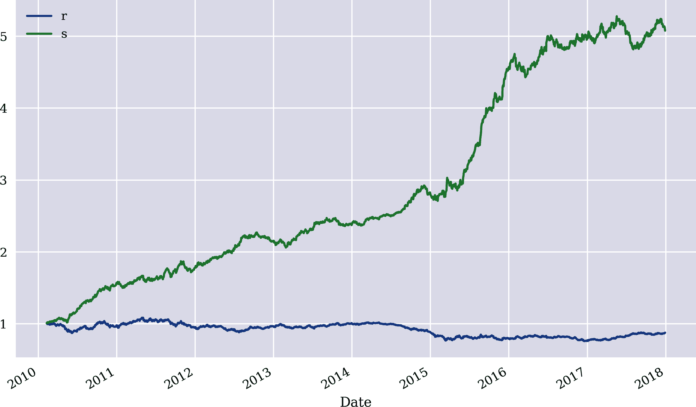
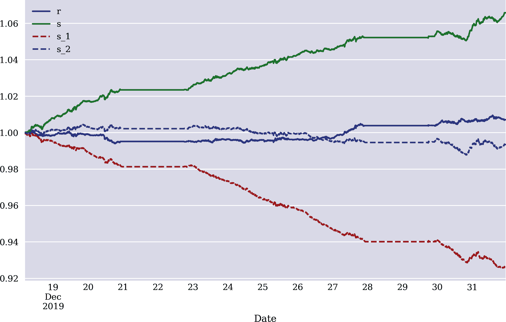

# 第十章 矢量化回测

> 特斯拉的首席执行官和连续技术企业家埃隆·马斯克表示，他的公司的汽车将能够在未来两年内被召唤并自主驾驶穿越美国，以接载他们的主人。
> 
> Samuel Gibbs（2016）
> 
> 赚取大笔资金是通过站在股市主要波动的正确一侧来实现的。
> 
> Martin Zweig

*矢量化回测* 这个术语指的是一种技术方法，用于回测基于密集神经网络（DNN）进行市场预测等算法交易策略。 Hilpisch 的书籍（2018 年，第十五章；2020 年，第四章）涵盖了基于多个具体例子的矢量化回测。在这个上下文中，*矢量化* 指的是一种编程范式，严重依赖甚至完全依赖于矢量化代码（即在 Python 级别上没有任何循环的代码）。在一般情况下，使用 `Numpy` 或 `pandas` 等软件包的代码矢量化是良好的实践，并且在前几章中也已经广泛使用。矢量化代码的好处是更简洁、易于阅读的代码，以及在许多重要情况下更快的执行速度。另一方面，与基于事件的回测（例如在 第十一章 中介绍和使用的方法）相比，矢量化代码在回测交易策略的灵活性上可能不足。

拥有一个能够击败简单基准预测器的良好 AI 预测器是重要的，但通常不足以产生*alpha*（即超过市场回报，可能根据风险调整）。例如，对于基于预测的交易策略，重要的是正确预测大市场波动，而不仅仅是多数（可能相当小的）市场波动。矢量化回测是快速了解交易策略经济潜力的简便方法。

与自动驾驶车辆（AV）相比，矢量化回测就像是在虚拟环境中测试 AV 的 AI，只是为了看它在“一般情况下”表现如何，而不会有风险。然而，对于 AV 的 AI 来说，不仅在“平均情况下”表现良好是重要的，更重要的是看它如何掌握关键甚至极端情况。这样的 AI 应该平均造成“零伤亡”，而不是 0.1 或 0.5。对于金融 AI 而言，同样重要（即使不完全相同）的是正确预测大市场波动。而本章重点讨论金融 AI 代理（交易机器人）的纯性能， 第十一章 则深入探讨风险评估和标准风险度量的回测。

“基于 SMA 的回测策略”介绍了基于简单移动平均线的向量化回测示例，使用每日收盘数据。这样可以进行深入的可视化和更轻松的理解初始方法。“基于每日 DNN 的回测策略”在每日收盘数据上训练了一个 DNN，并对基于预测的策略进行了经济绩效的回测。“基于日内 DNN 的回测策略”然后使用日内数据进行相同的操作。在所有示例中，都包括了比例交易成本，以假定的买卖价差形式。

# 基于 SMA 的回测策略

本节介绍基于经典交易策略的向量化回测，该策略使用简单移动平均线（SMAs）作为技术指标。以下代码实现了必要的导入和配置，并获取了 EUR/USD 货币对的每日收盘数据：

```py
In [1]: import os
        import math
        import numpy as np
        import pandas as pd
        from pylab import plt, mpl
        plt.style.use('seaborn')
        mpl.rcParams['savefig.dpi'] = 300
        mpl.rcParams['font.family'] = 'serif'
        pd.set_option('mode.chained_assignment', None)
        pd.set_option('display.float_format', '{:.4f}'.format)
        np.set_printoptions(suppress=True, precision=4)
        os.environ['PYTHONHASHSEED'] = '0'

In [2]: url = 'http://hilpisch.com/aiif_eikon_eod_data.csv'  

In [3]: symbol = 'EUR='  

In [4]: data = pd.DataFrame(pd.read_csv(url, index_col=0,
                                        parse_dates=True).dropna()[symbol])  

In [5]: data.info()  
        <class 'pandas.core.frame.DataFrame'>
        DatetimeIndex: 2516 entries, 2010-01-04 to 2019-12-31
        Data columns (total 1 columns):
         #   Column  Non-Null Count  Dtype
        ---  ------  --------------  -----
         0   EUR=    2516 non-null   float64
        dtypes: float64(1)
        memory usage: 39.3 KB
```


获取 EUR/USD 的每日收盘数据

策略的思路如下。计算较短的 `SMA1`，例如 42 天，和较长的 `SMA2`，例如 258 天。每当 `SMA1` 大于 `SMA2` 时，在金融工具上建立多头头寸。每当 `SMA1` 小于 `SMA2` 时，在金融工具上建立空头头寸。由于本示例基于 EUR/USD，因此很容易实现多头或空头。

下面的 Python 代码以向量化方式计算 SMA 值，并将结果时间序列与原始时间序列一起进行可视化（参见 图 10-1）：

```py
In [6]: data['SMA1'] = data[symbol].rolling(42).mean()  

In [7]: data['SMA2'] = data[symbol].rolling(258).mean()  

In [8]: data.plot(figsize=(10, 6));  
```


计算较短的 `SMA1`


计算较长的 `SMA2`


可视化了三个时间序列

使用了 SMA 时间序列数据后，再次以向量化方式计算出了相应的仓位。请注意，由于数据中存在前瞻偏差，所以需要将得出的仓位时间序列向后推移一天。这种推移是必要的，因为计算 SMA 包括当天的收盘价。因此，从一天的 SMA 值推导出的仓位需要应用到下一天的整个时间序列中。


###### 图 10-1\. EUR/USD 和 SMAs 的时间序列数据

图 10-2 将得出的仓位作为其他时间序列的叠加显示：

```py
In [9]: data.dropna(inplace=True)  

In [10]: data['p'] = np.where(data['SMA1'] > data['SMA2'], 1, -1)  

In [11]: data['p'] = data['p'].shift(1)  

In [12]: data.dropna(inplace=True)  

In [13]: data.plot(figsize=(10, 6), secondary_y='p');  
```


删除包含 `NaN` 值的行


根据同一日的 SMA 值推导出仓位值


将仓位值向后推移一天，以避免前瞻偏差


可视化从 SMAs 得出的仓位值


###### 图 10-2\. EUR/USD、SMAs 和生成的头寸的时间序列数据

还缺少一个关键步骤：将头寸与金融工具的收益结合起来。由于头寸可以方便地通过 `+1` 表示多头头寸，`-1` 表示空头头寸，因此这一步骤可以简化为再次向量化地将 `DataFrame` 对象的两列相乘。与被动基准投资相比，基于 SMA 的交易策略表现出色，如图 10-3 所示：

```py
In [14]: data['r'] = np.log(data[symbol] / data[symbol].shift(1))  

In [15]: data.dropna(inplace=True)

In [16]: data['s'] = data['p'] * data['r']  

In [17]: data[['r', 's']].sum().apply(np.exp)  
Out[17]: r   0.8640
         s   1.3773
         dtype: float64

In [18]: data[['r', 's']].sum().apply(np.exp) - 1  
Out[18]: r   -0.1360
         s    0.3773
         dtype: float64

In [19]: data[['r', 's']].cumsum().apply(np.exp).plot(figsize=(10, 6));  
```


计算对数收益


计算策略收益


计算总体表现


计算净表现


可视化随时间的总体表现


###### 图 10-3\. 被动基准投资和 SMA 策略的总体表现

到目前为止，表现数据并未考虑交易成本。当然，在评估交易策略的经济潜力时，这些成本是至关重要的因素。在当前设置中，可以轻松地将比例交易成本纳入计算中。其核心思想是确定交易发生的时机，并通过减少交易策略的表现来考虑相关的买卖价差。正如接下来的计算所示，并且如图 10-2 所示，交易策略并不经常改变头寸。因此，为了有效考虑交易成本的影响，假设其比通常的 EUR/USD 更高。在给定假设下，减去交易成本的净效果是几个百分点（见图 10-4）：

```py
In [20]: sum(data['p'].diff() != 0) + 2  
Out[20]: 10

In [21]: pc = 0.005  

In [22]: data['s_'] = np.where(data['p'].diff() != 0,
                               data['s'] - pc, data['s'])  

In [23]: data['s_'].iloc[0] -= pc  

In [24]: data['s_'].iloc[-1] -= pc  

In [25]: data[['r', 's', 's_']][data['p'].diff() != 0]  
Out[25]:                  r       s      s_
         Date
         2011-01-12  0.0123  0.0123  0.0023
         2011-10-10  0.0198 -0.0198 -0.0248
         2012-11-07 -0.0034 -0.0034 -0.0084
         2014-07-24 -0.0001  0.0001 -0.0049
         2016-03-16  0.0102  0.0102  0.0052
         2016-11-10 -0.0018  0.0018 -0.0032
         2017-06-05 -0.0025 -0.0025 -0.0075
         2018-06-15  0.0035 -0.0035 -0.0085

In [26]: data[['r', 's', 's_']].sum().apply(np.exp)
Out[26]: r    0.8640
         s    1.3773
         s_   1.3102
         dtype: float64

In [27]: data[['r', 's', 's_']].sum().apply(np.exp) - 1
Out[27]: r    -0.1360
         s     0.3773
         s_    0.3102
         dtype: float64

In [28]: data[['r', 's', 's_']].cumsum().apply(np.exp).plot(figsize=(10, 6));
```


计算交易次数，包括进入和退出交易


修正比例交易成本（故意设置得很高）


调整交易成本对策略表现的影响


调整*进入*交易的策略表现


调整*退出*交易的策略表现


展示常规交易的调整后表现数值


###### 图 10-4\. SMA 策略在交易成本前后的总体表现

关于交易策略的结果风险如何？对于基于方向预测且仅采取多头或空头头寸的交易策略，表达为波动率（对数收益标准差）的风险与被动基准投资完全相同：

```py
In [29]: data[['r', 's', 's_']].std()  
Out[29]: r    0.0054
         s    0.0054
         s_   0.0054
         dtype: float64

In [30]: data[['r', 's', 's_']].std() * math.sqrt(252)  
Out[30]: r    0.0853
         s    0.0853
         s_   0.0855
         dtype: float64
```


每日波动率


年化波动率

# 向量化回测

向量化回测是回测基于预测的交易策略“纯”性能的强大高效方法。它还可以适应比例交易成本等。然而，它不适合包含典型的风险管理措施，如（追踪）止损订单或获利订单。这在第十一章中有所涉及。

# 日常基于 DNN 的策略回测

前一节基于简单易于可视化的交易策略提出了向量化回测的蓝图。相同的蓝图可以应用于基于深度神经网络的交易策略，只需进行最少的技术调整。以下训练了一个`Keras` DNN 模型，如第七章讨论的那样。使用的数据与前面的例子相同。然而，就像在第七章中一样，需要向`DataFrame`对象添加不同的特征及其滞后值：

```py
In [31]: data = pd.DataFrame(pd.read_csv(url, index_col=0,
                                         parse_dates=True).dropna()[symbol])

In [32]: data.info()
         <class 'pandas.core.frame.DataFrame'>
         DatetimeIndex: 2516 entries, 2010-01-04 to 2019-12-31
         Data columns (total 1 columns):
          #   Column  Non-Null Count  Dtype
         ---  ------  --------------  -----
          0   EUR=    2516 non-null   float64
         dtypes: float64(1)
         memory usage: 39.3 KB

In [33]: lags = 5

In [34]: def add_lags(data, symbol, lags, window=20):
             cols = []
             df = data.copy()
             df.dropna(inplace=True)
             df['r'] = np.log(df / df.shift(1))
             df['sma'] = df[symbol].rolling(window).mean()
             df['min'] = df[symbol].rolling(window).min()
             df['max'] = df[symbol].rolling(window).max()
             df['mom'] = df['r'].rolling(window).mean()
             df['vol'] = df['r'].rolling(window).std()
             df.dropna(inplace=True)
             df['d'] = np.where(df['r'] > 0, 1, 0)
             features = [symbol, 'r', 'd', 'sma', 'min', 'max', 'mom', 'vol']
             for f in features:
                 for lag in range(1, lags + 1):
                     col = f'{f}_lag_{lag}'
                     df[col] = df[f].shift(lag)
                     cols.append(col)
             df.dropna(inplace=True)
             return df, cols

In [35]: data, cols = add_lags(data, symbol, lags, window=20)
```

以下 Python 代码完成了额外的导入并定义了`set_seeds()`和`create_model()`函数：

```py
In [36]: import random
         import tensorflow as tf
         from keras.layers import Dense, Dropout
         from keras.models import Sequential
         from keras.regularizers import l1
         from keras.optimizers import Adam
         from sklearn.metrics import accuracy_score
         Using TensorFlow backend.

In [37]: def set_seeds(seed=100):
             random.seed(seed)
             np.random.seed(seed)
             tf.random.set_seed(seed)
         set_seeds()

In [38]: optimizer = Adam(learning_rate=0.0001)

In [39]: def create_model(hl=2, hu=128, dropout=False, rate=0.3,
                         regularize=False, reg=l1(0.0005),
                         optimizer=optimizer, input_dim=len(cols)):
             if not regularize:
                 reg = None
             model = Sequential()
             model.add(Dense(hu, input_dim=input_dim,
                          activity_regularizer=reg,
                          activation='relu'))
             if dropout:
                 model.add(Dropout(rate, seed=100))
             for _ in range(hl):
                 model.add(Dense(hu, activation='relu',
                              activity_regularizer=reg))
                 if dropout:
                     model.add(Dropout(rate, seed=100))
             model.add(Dense(1, activation='sigmoid'))
             model.compile(loss='binary_crossentropy',
                           optimizer=optimizer,
                           metrics=['accuracy'])
             return model
```

基于历史数据的顺序训练测试分割，以下 Python 代码首先基于归一化的特征数据训练 DNN 模型：

```py
In [40]: split = '2018-01-01'  

In [41]: train = data.loc[:split].copy()  

In [42]: np.bincount(train['d'])  
Out[42]: array([ 982, 1006])

In [43]: mu, std = train.mean(), train.std()  

In [44]: train_ = (train - mu) / std  

In [45]: set_seeds()
         model = create_model(hl=2, hu=64)  

In [46]: %%time
         model.fit(train_[cols], train['d'],
                 epochs=20, verbose=False,
                 validation_split=0.2, shuffle=False)  
         CPU times: user 2.93 s, sys: 574 ms, total: 3.5 s
         Wall time: 1.93 s

Out[46]: <keras.callbacks.callbacks.History at 0x7fc9392f38d0>

In [47]: model.evaluate(train_[cols], train['d'])  
         1988/1988 [==============================] - 0s 17us/step

Out[47]: [0.6745863538872549, 0.5925553441047668]
```


将数据分割为训练和测试数据


显示标签类别的频率


规范化训练特征数据


创建 DNN 模型


在训练数据上训练 DNN 模型


评估模型在训练数据上的表现

到目前为止，这基本上重复了第七章的核心方法。现在可以应用向量化回测来评估基于模型预测的 DNN 交易策略的经济表现（见图 10-5）。在这种情况下，向上的预测自然被解释为多头头寸，向下的预测则被解释为空头头寸：

```py
In [48]: train['p'] = np.where(model.predict(train_[cols]) > 0.5, 1, 0)  

In [49]: train['p'] = np.where(train['p'] == 1, 1, -1)  

In [50]: train['p'].value_counts()  
Out[50]: -1    1098
          1     890
         Name: p, dtype: int64

In [51]: train['s'] = train['p'] * train['r']  

In [52]: train[['r', 's']].sum().apply(np.exp)  
Out[52]: r   0.8787
         s   5.0766
         dtype: float64

In [53]: train[['r', 's']].sum().apply(np.exp)  - 1  
Out[53]: r   -0.1213
         s    4.0766
         dtype: float64

In [54]: train[['r', 's']].cumsum().apply(np.exp).plot(figsize=(10, 6));  
```


生成二元预测


将预测转换为位置数值


展示多头和空头头寸的数量


计算策略的表现数值


计算毛收益和净收益（样本内）


可视化时间内的毛收益表现（样本内）



###### 图 10-5\. 被动基准投资和每日 DNN 策略的毛收益表现（样本内）

下面是针对测试数据集的同一计算序列。虽然样本内的超额表现显著，但样本外的数字并不那么令人印象深刻，但仍然令人信服（参见图 10-6)：

```py
In [55]: test = data.loc[split:].copy()  

In [56]: test_ = (test - mu) / std  

In [57]: model.evaluate(test_[cols], test['d'])  
         503/503 [==============================] - 0s 17us/step

Out[57]: [0.6933823573897421, 0.5407554507255554]

In [58]: test['p'] = np.where(model.predict(test_[cols]) > 0.5, 1, -1)

In [59]: test['p'].value_counts()
Out[59]: -1    406
          1     97
         Name: p, dtype: int64

In [60]: test['s'] = test['p'] * test['r']

In [61]: test[['r', 's']].sum().apply(np.exp)
Out[61]: r   0.9345
         s   1.2431
         dtype: float64

In [62]: test[['r', 's']].sum().apply(np.exp) - 1
Out[62]: r   -0.0655
         s    0.2431
         dtype: float64

In [63]: test[['r', 's']].cumsum().apply(np.exp).plot(figsize=(10, 6));
```


生成测试数据子集


标准化测试数据


在测试数据上评估模型的表现

基于深度神经网络的交易策略导致交易次数比基于 SMA 的策略更多。这使得在评估经济表现时，包括交易成本变得更加重要。


###### 图 10-6\. 被动基准投资和每日 DNN 策略的毛收益表现（样本外）

下面的代码现在假设 EUR/USD 的实际报价价差为 1.2 个点（即货币单位的 0.00012）。¹ 为了简化计算，基于 EUR/USD 的平均收盘价计算比例交易成本`pc`的平均值（参见图 10-7)：

```py
In [64]: sum(test['p'].diff() != 0)
Out[64]: 147

In [65]: spread = 0.00012  
         pc = spread / data[symbol].mean()  
         print(f'{pc:.6f}')
         0.000098

In [66]: test['s_'] = np.where(test['p'].diff() != 0,
                               test['s'] - pc, test['s'])

In [67]: test['s_'].iloc[0] -= pc

In [68]: test['s_'].iloc[-1] -= pc

In [69]: test[['r', 's', 's_']].sum().apply(np.exp)
Out[69]: r    0.9345
         s    1.2431
         s_   1.2252
         dtype: float64

In [70]: test[['r', 's', 's_']].sum().apply(np.exp) - 1
Out[70]: r    -0.0655
         s     0.2431
         s_    0.2252
         dtype: float64

In [71]: test[['r', 's', 's_']].cumsum().apply(np.exp).plot(figsize=(10, 6));
```


修正平均买卖价差


计算平均比例交易成本


###### 图 10-7\. 每日 DNN 策略在交易成本（样本外）前后的毛收益表现

基于深度神经网络的交易策略，无论是在典型的交易成本前后都显示出很大的潜力。然而，当观察到更多交易时，类似的策略在当天是否经济可行？接下来的部分将分析基于深度神经网络的当天交易策略。

# 回测基于当天的深度神经网络策略

要在当天数据上训练和回测 DNN 模型，需要另一个数据集：

```py
In [72]: url = 'http://hilpisch.com/aiif_eikon_id_eur_usd.csv'  

In [73]: symbol = 'EUR='  

In [74]: data = pd.DataFrame(pd.read_csv(url, index_col=0,
                             parse_dates=True).dropna()['CLOSE'])  
         data.columns = [symbol]

In [75]: data = data.resample('5min', label='right').last().ffill()  

In [76]: data.info()  
         <class 'pandas.core.frame.DataFrame'>
         DatetimeIndex: 26486 entries, 2019-10-01 00:05:00 to 2019-12-31 23:10:00
         Freq: 5T
         Data columns (total 1 columns):
          #   Column  Non-Null Count  Dtype
         ---  ------  --------------  -----
          0   EUR=    26486 non-null  float64
         dtypes: float64(1)
         memory usage: 413.8 KB

In [77]: lags = 5

In [78]: data, cols = add_lags(data, symbol, lags, window=20)
```


检索 EUR/USD 的当天数据并选择收盘价格


将数据重采样为五分钟柱

前一部分的过程现在可以使用新数据集重复。首先，训练深度神经网络模型：

```py
In [79]: split = int(len(data) * 0.85)

In [80]: train = data.iloc[:split].copy()

In [81]: np.bincount(train['d'])
Out[81]: array([16284,  6207])

In [82]: def cw(df):
             c0, c1 = np.bincount(df['d'])
             w0 = (1 / c0) * (len(df)) / 2
             w1 = (1 / c1) * (len(df)) / 2
             return {0: w0, 1: w1}

In [83]: mu, std = train.mean(), train.std()

In [84]: train_ = (train - mu) / std

In [85]: set_seeds()
         model = create_model(hl=1, hu=128,
                              reg=True, dropout=False)

In [86]: %%time
         model.fit(train_[cols], train['d'],
                   epochs=40, verbose=False,
                   validation_split=0.2, shuffle=False,
                   class_weight=cw(train))
         CPU times: user 40.6 s, sys: 5.49 s, total: 46 s
         Wall time: 25.2 s

Out[86]: <keras.callbacks.callbacks.History at 0x7fc91a6b2a90>

In [87]: model.evaluate(train_[cols], train['d'])
         22491/22491 [==============================] - 0s 13us/step

Out[87]: [0.5218664327576152, 0.6729803085327148]
```

样本内，表现看起来很有前途，如图 10-8 所示：

```py
In [88]: train['p'] = np.where(model.predict(train_[cols]) > 0.5, 1, -1)

In [89]: train['p'].value_counts()
Out[89]: -1    11519
          1    10972
         Name: p, dtype: int64

In [90]: train['s'] = train['p'] * train['r']

In [91]: train[['r', 's']].sum().apply(np.exp)
Out[91]: r   1.0223
         s   1.6665
         dtype: float64

In [92]: train[['r', 's']].sum().apply(np.exp) - 1
Out[92]: r   0.0223
         s   0.6665
         dtype: float64

In [93]: train[['r', 's']].cumsum().apply(np.exp).plot(figsize=(10, 6));
```


###### 图 10-8\. 被动基准投资和 DNN 日内策略的总体表现（样本内）

样本外，在未考虑交易成本的情况下，该策略看起来也是具有前景的。该策略似乎系统性地优于被动基准投资（见图 10-9）：

```py
In [94]: test = data.iloc[split:].copy()

In [95]: test_ = (test - mu) / std

In [96]: model.evaluate(test_[cols], test['d'])
         3970/3970 [==============================] - 0s 19us/step

Out[96]: [0.5226116042706168, 0.668513834476471]

In [97]: test['p'] = np.where(model.predict(test_[cols]) > 0.5, 1, -1)

In [98]: test['p'].value_counts()
Out[98]: -1    2273
          1    1697
         Name: p, dtype: int64

In [99]: test['s'] = test['p'] * test['r']

In [100]: test[['r', 's']].sum().apply(np.exp)
Out[100]: r   1.0071
          s   1.0658
          dtype: float64

In [101]: test[['r', 's']].sum().apply(np.exp) - 1
Out[101]: r   0.0071
          s   0.0658
          dtype: float64

In [102]: test[['r', 's']].cumsum().apply(np.exp).plot(figsize=(10, 6));
```

在纯经济表现方面的最终检验是加入交易成本后。该策略在相对较短的时间内进行了数百次交易。正如下文分析所示，基于标准零售买卖价差，基于 DNN 的策略是不可行的。


###### 图 10-9\. 被动基准投资和 DNN 日内策略的总体表现（样本外）

将交易价差降低到专业高交易量交易者可能达到的水平，该策略仍然无法达到收支平衡，而是大部分利润都损失给了交易成本（见图 10-10）：

```py
In [103]: sum(test['p'].diff() != 0)
Out[103]: 1303

In [104]: spread = 0.00012  
          pc_1 = spread / test[symbol]  

In [105]: spread = 0.00006  
          pc_2 = spread / test[symbol]  

In [106]: test['s_1'] = np.where(test['p'].diff() != 0,
                                 test['s'] - pc_1, test['s'])  

In [107]: test['s_1'].iloc[0] -= pc_1.iloc[0]  
          test['s_1'].iloc[-1] -= pc_1.iloc[0]  

In [108]: test['s_2'] = np.where(test['p'].diff() != 0,
                                 test['s'] - pc_2, test['s'])  

In [109]: test['s_2'].iloc[0] -= pc_2.iloc[0]  
          test['s_2'].iloc[-1] -= pc_2.iloc[0]  

In [110]: test[['r', 's', 's_1', 's_2']].sum().apply(np.exp)
Out[110]: r     1.0071
          s     1.0658
          s_1   0.9259
          s_2   0.9934
          dtype: float64

In [111]: test[['r', 's', 's_1', 's_2']].sum().apply(np.exp) - 1
Out[111]: r      0.0071
          s      0.0658
          s_1   -0.0741
          s_2   -0.0066
          dtype: float64

In [112]: test[['r', 's', 's_1', 's_2']].cumsum().apply(
              np.exp).plot(figsize=(10, 6), style=['-', '-', '--', '--']);
```


假设零售级别的买卖价差


假设专业水平的买卖价差



###### 图 10-10\. 高/低交易成本前后 DNN 日内策略的总体表现（样本外）

# 日内交易

本章讨论的形式中的日内算法交易在统计学上常常看起来很有吸引力。在样本内和样本外，DNN 模型在预测市场方向时达到了高准确率。不考虑交易成本的情况下，与被动基准投资相比，DNN 策略在样本内和样本外表现显著优于被动基准投资。然而，一旦将交易成本考虑在内，DNN 策略的表现显著下降，使其对于典型的零售买卖价差来说不可行，并且对于较低但高交易量买卖价差也不甚有吸引力。

# 结论

向量化回测被证明是一种有效和有价值的方法，用于回测基于人工智能的算法交易策略的表现。本章首先基于使用两个简单的简单移动平均线（SMA）从信号中派生的简单示例来解释这种方法的基本思想。这允许对策略和结果位置进行简单可视化。然后，结合 EOD 数据，通过回测基于 DNN 的交易策略（详细讨论见第七章），在交易成本之前和之后，都显示出在统计上发现的*统计效率*转化为*经济效率*，这意味着盈利的交易策略。当使用相同的向量化回测方法处理分钟数据时，与被动基准投资相比，DNN 策略也显示出显著的内外样本超额表现。在回测中增加交易成本说明，这些成本必须非常低，通常甚至大型专业交易者也无法达到这一水平，才能使交易策略在经济上可行。

# 参考文献

本章引用的书籍和论文：

+   Gibbs Samuel. 2016\. “**伊隆·马斯克：特斯拉汽车将在两年内能够在美国无司机行驶**。” *卫报*。2016 年 1 月 11 日。[*https://oreil.ly/C508Q*](https://oreil.ly/C508Q)。

+   Hilpisch, Yves. 2018\. *Python 金融分析：数据驱动金融的掌握.* 第 2 版。Sebastopol：O’Reilly。

+   ⸻。2020\. *Python 量化交易：从概念到云端部署.* Sebastopol：O’Reilly。

¹ 例如，这是[Oanda](http://oanda.com)向零售交易者提供的典型点差。
