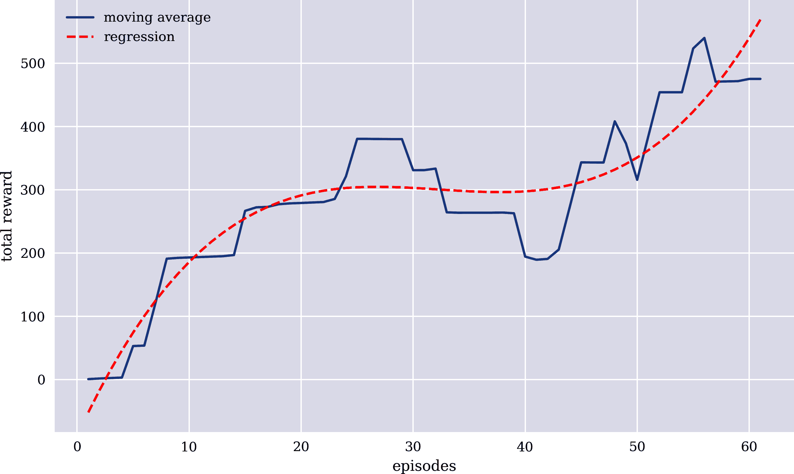
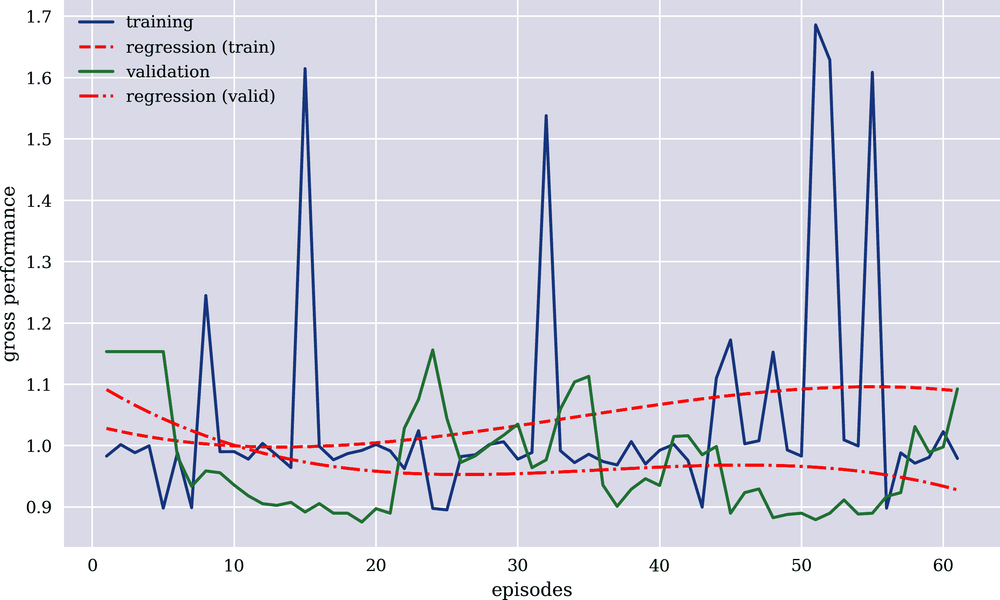
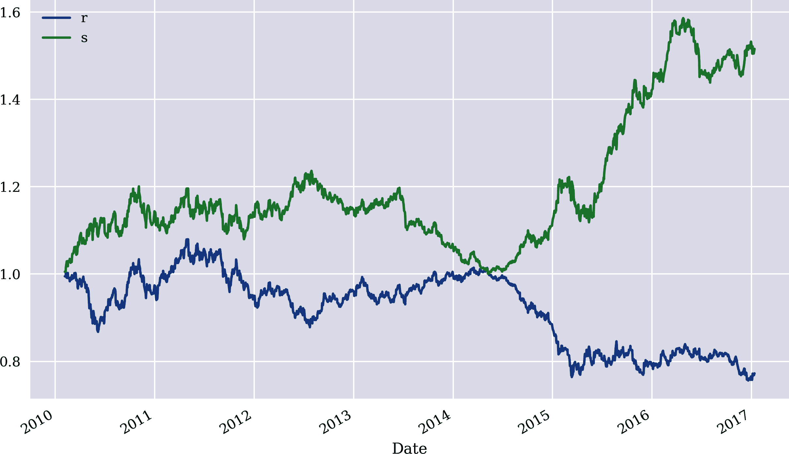
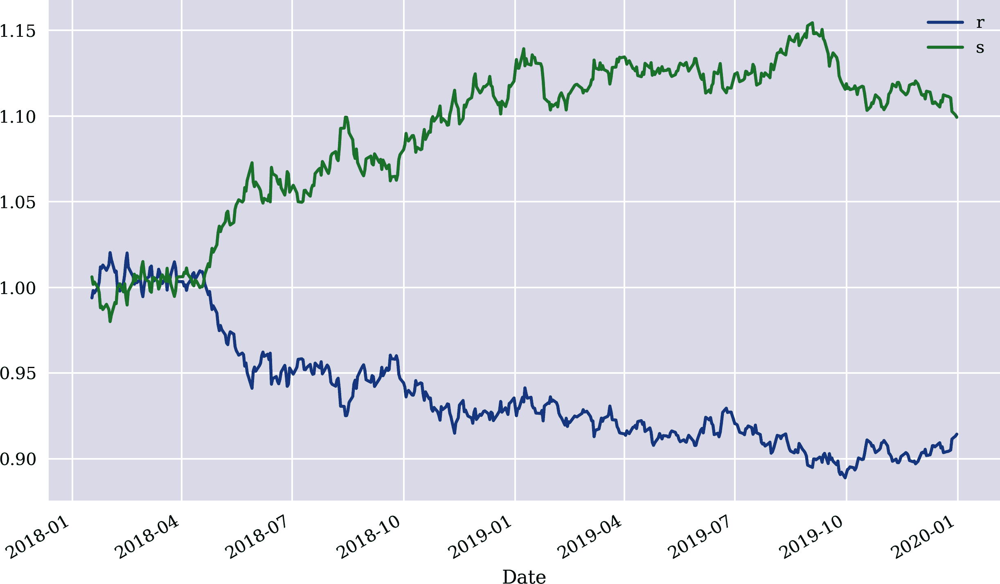
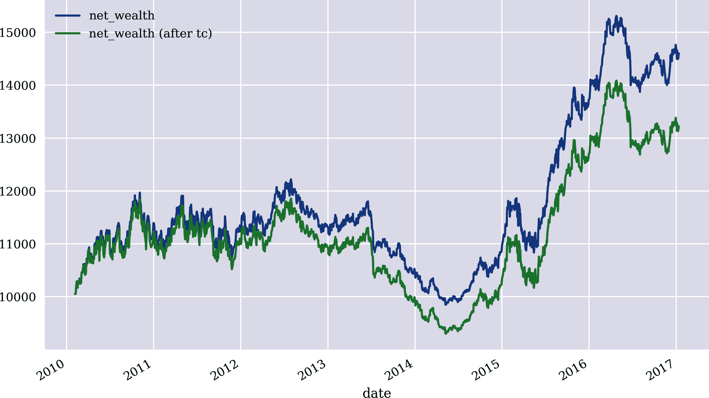
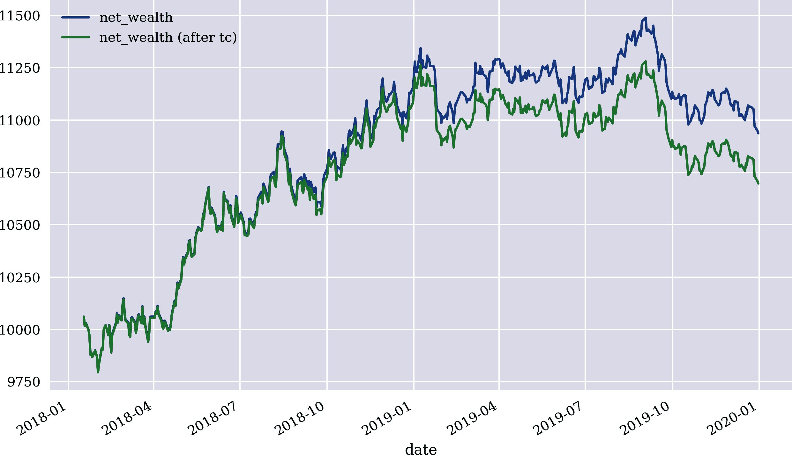
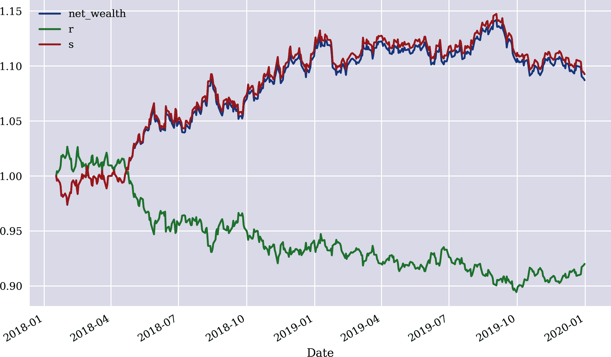
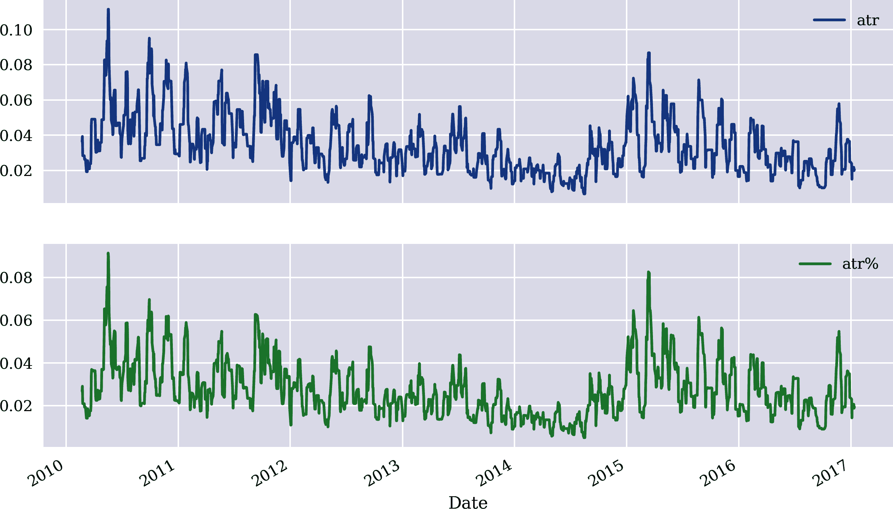

# 第十一章：风险管理

> 在大规模部署自动驾驶车辆（AVs）方面，安全保障是一个重大障碍。
> 
> Majid Khonji 等人（2019 年）
> 
> 有了更好的预测，判断的价值也会提升。毕竟，如果不知道你有多喜欢保持干燥，或者有多讨厌带伞，知道下雨的可能性也没什么帮助。
> 
> Ajay Agrawal 等人（2018 年）

通常情况下，向量化回测能够就基于预测的算法交易策略的经济潜力进行评估（即在其纯粹形式下）。实际应用中的大多数 AI 代理不仅仅包括预测模型。例如，自动驾驶车辆（AVs）的 AI 不是独立存在的，而是带有大量规则和启发式方法，限制了 AI 能够采取或可以采取的行动。在 AVs 的背景下，这主要涉及管理风险，如因碰撞或坠毁而产生的风险。

在财务背景下，AI 代理或交易机器人通常也不是原样部署的。相反，通常会使用一些标准的风险措施，如（追踪）止损订单或盈利订单。其理由显而易见。在金融市场上放置方向性赌注时，要避免过大的损失。同样，一旦达到某个利润水平，就应通过提前平仓来保护成功。这类风险措施的处理方式往往取决于人类判断，可能会受到相关数据和统计分析的形式支持。在 Agrawal 等人（2018 年）的书中概念上，这是一个重要的讨论点：AI 提供了改进的预测，但人类判断仍然在设定决策规则和行动边界方面发挥作用。

本章有三个主要目的。首先，它以训练过的深度 Q 学习代理产生的向量化和事件驱动方式回测算法交易策略。因此，这样的代理被称为*交易机器人*。其次，它评估了在实施这些策略的金融工具上相关的风险。第三，它使用本章介绍的事件驱动方法回测典型的风险措施，如止损订单。与向量化回测相比，事件驱动回测的主要优势是在建模和分析决策规则及风险管理措施方面具有更高的灵活性。换句话说，它允许我们关注那些在向量化编程方法中被推到背景中的细节。

“交易机器人”介绍并训练了基于金融 Q 学习代理的交易机器人，源自第九章。“矢量化回测”使用来自第十章的矢量化回测来评估交易机器人的（纯）经济表现。事件驱动的回测在“基于事件的回测”中进行介绍。首先讨论基类，然后基于基类实现和进行交易机器人的回测。在此背景下，还参考 Hilpisch（2020 年，第六章）。“风险评估”分析了设置风险管理规则所需的选定统计指标，如 *最大回撤* 和 *平均真实波幅*（ATR）。“回测风险指标”然后回测主要风险指标对交易机器人表现的影响。

# 交易机器人

本节介绍基于金融 Q 学习代理 `FQLAgent` 的交易机器人，源自第九章。这是随后分析的交易机器人。一如既往，我们首先引入所需的库：

```py
In [1]: import os
        import numpy as np
        import pandas as pd
        from pylab import plt, mpl
        plt.style.use('seaborn')
        mpl.rcParams['savefig.dpi'] = 300
        mpl.rcParams['font.family'] = 'serif'
        pd.set_option('mode.chained_assignment', None)
        pd.set_option('display.float_format', '{:.4f}'.format)
        np.set_printoptions(suppress=True, precision=4)
        os.environ['PYTHONHASHSEED'] = '0'
```

“金融环境”展示了一个 Python 模块，其中包含用于接下来的 `Finance` 类。“交易机器人”提供了一个 Python 模块，其中包含用于绘制训练和验证结果的 `TradingBot` 类及其一些辅助函数。这两个类与第九章介绍的类非常接近，因此在此处使用它们而无需进一步解释。

下面的代码在历史每日收盘数据（EOD）上训练交易机器人，包括用于验证的数据子集。图 11-1 显示了不同训练周期的平均总奖励：

```py
In [2]: import finance
        import tradingbot
        Using TensorFlow backend.

In [3]: symbol = 'EUR='
        features = [symbol, 'r', 's', 'm', 'v']

In [4]: a = 0
        b = 1750
        c = 250

In [5]: learn_env = finance.Finance(symbol, features, window=20, lags=3,
                         leverage=1, min_performance=0.9, min_accuracy=0.475,
                         start=a, end=a + b, mu=None, std=None)

In [6]: learn_env.data.info()
        <class 'pandas.core.frame.DataFrame'>
        DatetimeIndex: 1750 entries, 2010-02-02 to 2017-01-12
        Data columns (total 6 columns):
         #   Column  Non-Null Count  Dtype
        ---  ------  --------------  -----
         0   EUR=    1750 non-null   float64
         1   r       1750 non-null   float64
         2   s       1750 non-null   float64
         3   m       1750 non-null   float64
         4   v       1750 non-null   float64
         5   d       1750 non-null   int64
        dtypes: float64(5), int64(1)
        memory usage: 95.7 KB

In [7]: valid_env = finance.Finance(symbol, features=learn_env.features,
                                    window=learn_env.window,
                                    lags=learn_env.lags,
                                    leverage=learn_env.leverage,
                                    min_performance=0.0, min_accuracy=0.0,
                                    start=a + b, end=a + b + c,
                                    mu=learn_env.mu, std=learn_env.std)

In [8]: valid_env.data.info()
        <class 'pandas.core.frame.DataFrame'>
        DatetimeIndex: 250 entries, 2017-01-13 to 2018-01-10
        Data columns (total 6 columns):
         #   Column  Non-Null Count  Dtype
        ---  ------  --------------  -----
         0   EUR=    250 non-null    float64
         1   r       250 non-null    float64
         2   s       250 non-null    float64
         3   m       250 non-null    float64
         4   v       250 non-null    float64
         5   d       250 non-null    int64
        dtypes: float64(5), int64(1)
        memory usage: 13.7 KB

In [9]: tradingbot.set_seeds(100)
        agent = tradingbot.TradingBot(24, 0.001, learn_env, valid_env)

In [10]: episodes = 61

In [11]: %time agent.learn(episodes)
         =======================================================================
         episode: 10/61 | VALIDATION | treward:  247 | perf: 0.936 | eps: 0.95
         =======================================================================
         =======================================================================
         episode: 20/61 | VALIDATION | treward:  247 | perf: 0.897 | eps: 0.86
         =======================================================================
         =======================================================================
         episode: 30/61 | VALIDATION | treward:  247 | perf: 1.035 | eps: 0.78
         =======================================================================
         =======================================================================
         episode: 40/61 | VALIDATION | treward:  247 | perf: 0.935 | eps: 0.70
         =======================================================================
         =======================================================================
         episode: 50/61 | VALIDATION | treward:  247 | perf: 0.890 | eps: 0.64
         =======================================================================
         =======================================================================
         episode: 60/61 | VALIDATION | treward:  247 | perf: 0.998 | eps: 0.58
         =======================================================================
         episode: 61/61 | treward:   17 | perf: 0.979 | av: 475.1 | max: 1747
         CPU times: user 51.4 s, sys: 2.53 s, total: 53.9 s
         Wall time: 47 s

In [12]: tradingbot.plot_treward(agent)
```



###### 图 11-1\. 每个训练周期的平均总奖励

图 11-2 比较了交易机器人在训练数据集上的总体表现——由于在利用和探索之间交替而表现出相当大的差异——以及在仅利用开发数据集上的表现：

```py
In [13]: tradingbot.plot_performance(agent)
```



###### 图 11-2\. 训练集和验证集的总体表现

训练后的交易机器人在接下来的部分中用于回测。

# 矢量化回测

矢量化回测不能直接应用于交易机器人。第十章使用密集神经网络（DNNs）来说明该方法。在这种情况下，首先准备带有特征和标签子集的数据，然后将其一次性输入到 DNN 中以生成所有预测值。在强化学习（RL）的背景下，通过与环境的交互动作和逐步生成和收集数据。

为此，以下 Python 代码定义了 `backtest` 函数，该函数以 `TradingBot` 实例和 `Finance` 实例作为输入。它在原始 `DataFrame` 对象中生成了 `Finance` 环境列的交易机器人持有的仓位和相应的策略表现：

```py
In [14]: def reshape(s):
             return np.reshape(s, [1, learn_env.lags,
                                   learn_env.n_features])  

In [15]: def backtest(agent, env):
             env.min_accuracy = 0.0
             env.min_performance = 0.0
             done = False
             env.data['p'] = 0  
             state = env.reset()
             while not done:
                 action = np.argmax(
                     agent.model.predict(reshape(state))[0, 0])  
                 position = 1 if action == 1 else -1  
                 env.data.loc[:, 'p'].iloc[env.bar] = position  
                 state, reward, done, info = env.step(action)
             env.data['s'] = env.data['p'] * env.data['r'] * learn_env.leverage  
```


重塑单个特征-标签组合


生成一个用于持仓价值的列


推导出给定经过训练的 DNN 的最佳动作（预测）


推导出结果仓位（长/向上为 `+1`，空/向下为 `–1`）…


…并将其存储在相应的索引位置的相应列中


根据持仓价值计算策略对数收益率

配备了 `backtest` 函数，向量化的回测归结为几行 Python 代码，就像第 10 章中的那样。

图 11-3 比较了被动基准投资的总体表现与策略的总体表现：

```py
In [16]: env = agent.learn_env  

In [17]: backtest(agent, env)  

In [18]: env.data['p'].iloc[env.lags:].value_counts()  
Out[18]:  1    961
         -1    786
         Name: p, dtype: int64

In [19]: env.data[['r', 's']].iloc[env.lags:].sum().apply(np.exp)  
Out[19]: r   0.7725
         s   1.5155
         dtype: float64

In [20]: env.data[['r', 's']].iloc[env.lags:].sum().apply(np.exp) - 1  
Out[20]: r   -0.2275
         s    0.5155
         dtype: float64

In [21]: env.data[['r', 's']].iloc[env.lags:].cumsum(
                 ).apply(np.exp).plot(figsize=(10, 6));
```


指定相关环境


生成所需的额外数据


计算多头和空头仓位的数量


计算被动基准投资（`r`）和策略（`s`）的总体表现…


…以及相应的净表现



###### 图 11-3\. 被动基准投资和交易机器人的总体表现（样本内）

为了更真实地了解交易机器人的表现，以下 Python 代码创建了一个测试环境，其中包含交易机器人尚未见过的数据。图 11-4 显示了与被动基准投资相比，交易机器人的表现如何：

```py
In [22]: test_env = finance.Finance(symbol, features=learn_env.features,
                                    window=learn_env.window,
                                    lags=learn_env.lags,
                                    leverage=learn_env.leverage,
                                    min_performance=0.0, min_accuracy=0.0,
                                    start=a + b + c, end=None,
                                    mu=learn_env.mu, std=learn_env.std)

In [23]: env = test_env

In [24]: backtest(agent, env)

In [25]: env.data['p'].iloc[env.lags:].value_counts()
Out[25]: -1    437
          1     56
         Name: p, dtype: int64

In [26]: env.data[['r', 's']].iloc[env.lags:].sum().apply(np.exp)
Out[26]: r   0.9144
         s   1.0992
         dtype: float64

In [27]: env.data[['r', 's']].iloc[env.lags:].sum().apply(np.exp) - 1
Out[27]: r   -0.0856
         s    0.0992
         dtype: float64

In [28]: env.data[['r', 's']].iloc[env.lags:].cumsum(
                     ).apply(np.exp).plot(figsize=(10, 6));
```



###### 图 11-4\. 被动基准投资和交易机器人的总体表现（样本外）

没有任何风险措施的样本外表现似乎已经很有希望。然而，为了能够正确地评估交易策略的实际表现，应该包括风险措施。这就是基于事件的回测发挥作用的地方。

# 基于事件的回测

鉴于前一节的结果，没有任何风险措施的样本外表现似乎已经很有希望。然而，为了能够正确地分析风险措施，如移动止损订单，需要进行 *基于事件的回测*。本节介绍了这种替代方法来评估算法交易策略的表现。

“Backtesting Base Class”介绍了`BacktestingBase`类，可以灵活用于测试不同类型的定向交易策略。代码中对重要行进行了详细注释。该基础类提供以下方法：

`get_date_price()`

对于给定的`bar`（包含财务数据的`DataFrame`对象的索引值），返回相关的`date`和`price`。

`print_balance()`

对于给定的`bar`，打印交易机器人当前（现金）余额。

`calculate_net_wealth()`

对于给定的`price`，返回由当前（现金）余额和仪器持仓组成的净财富。

`print_net_wealth()`

对于给定的`bar`，打印交易机器人的净财富。

`place_buy_order()`，`place_sell_order()`

对于给定的`bar`和给定的`units`或给定的`amount`，这些方法会下买单或卖单，并相应调整相关数量（例如考虑交易成本）。

`close_out()`

在给定的`bar`，此方法关闭开放头寸并计算和报告绩效统计数据。

以下 Python 代码说明了`BacktestingBase`类的实例如何根据一些简单步骤运行：

```py
In [29]: import backtesting as bt

In [30]: bb = bt.BacktestingBase(env=agent.learn_env, model=agent.model,
                                 amount=10000, ptc=0.0001, ftc=1.0,
                                 verbose=True)  

In [31]: bb.initial_amount  
Out[31]: 10000

In [32]: bar = 100  

In [33]: bb.get_date_price(bar)  
Out[33]: ('2010-06-25', 1.2374)

In [34]: bb.env.get_state(bar)  
Out[34]:               EUR=       r       s       m      v
         Date
         2010-06-22 -0.0242 -0.5622 -0.0916 -0.2022 1.5316
         2010-06-23  0.0176  0.6940 -0.0939 -0.0915 1.5563
         2010-06-24  0.0354  0.3034 -0.0865  0.6391 1.0890

In [35]: bb.place_buy_order(bar, amount=5000)  
         2010-06-25 | buy 4040 units for 1.2374
         2010-06-25 | current balance = 4999.40

In [36]: bb.print_net_wealth(2 * bar)  
         2010-11-16 | net wealth = 10450.17

In [37]: bb.place_sell_order(2 * bar, units=1000)  
         2010-11-16 | sell 1000 units for 1.3492
         2010-11-16 | current balance = 6347.47

In [38]: bb.close_out(3 * bar)  
         ==================================================
         2011-04-11 | *** CLOSING OUT ***
         2011-04-11 | sell 3040 units for 1.4434
         2011-04-11 | current balance = 10733.97
         2011-04-11 | net performance [%] = 7.3397
         2011-04-11 | number of trades [#] = 3
         ==================================================
```


实例化`BacktestingBase`对象。


查找`initial_amount`属性值。


固定`bar`的值。


检索`bar`的`date`和`price`值。


检索`bar`的`Finance`环境状态。


使用`amount`参数下买单。


在稍后的时间点打印净财富（`2 * bar`）。


使用`units`参数在稍后的时间点下卖单。


更晚时候关闭剩余的多头头寸（`3 * bar`）。

继承自`BacktestingBase`类，`TBBacktester`类为交易机器人实现了基于事件的回测：

```py
In [39]: class TBBacktester(bt.BacktestingBase):
             def _reshape(self, state):
                 ''' Helper method to reshape state objects.
                 '''
                 return np.reshape(state, [1, self.env.lags, self.env.n_features])
             def backtest_strategy(self):
                 ''' Event-based backtesting of the trading bot's performance.
                 '''
                 self.units = 0
                 self.position = 0
                 self.trades = 0
                 self.current_balance = self.initial_amount
                 self.net_wealths = list()
                 for bar in range(self.env.lags, len(self.env.data)):
                     date, price = self.get_date_price(bar)
                     if self.trades == 0:
                         print(50 * '=')
                         print(f'{date} | *** START BACKTEST ***')
                         self.print_balance(bar)
                         print(50 * '=')
                     state = self.env.get_state(bar)  
                     action = np.argmax(self.model.predict(
                                 self._reshape(state.values))[0, 0])  
                     position = 1 if action == 1 else -1  
                     if self.position in [0, -1] and position == 1:  
                         if self.verbose:
                             print(50 * '-')
                             print(f'{date} | *** GOING LONG ***')
                         if self.position == -1:
                             self.place_buy_order(bar - 1, units=-self.units)
                         self.place_buy_order(bar - 1,
                                              amount=self.current_balance)
                         if self.verbose:
                             self.print_net_wealth(bar)
                         self.position = 1
                     elif self.position in [0, 1] and position == -1:  
                         if self.verbose:
                             print(50 * '-')
                             print(f'{date} | *** GOING SHORT ***')
                         if self.position == 1:
                             self.place_sell_order(bar - 1, units=self.units)
                         self.place_sell_order(bar - 1,
                                               amount=self.current_balance)
                         if self.verbose:
                             self.print_net_wealth(bar)
                         self.position = -1
                     self.net_wealths.append((date,
                                              self.calculate_net_wealth(price)))  
                 self.net_wealths = pd.DataFrame(self.net_wealths,
                                                 columns=['date', 'net_wealth'])  
                 self.net_wealths.set_index('date', inplace=True)  
                 self.net_wealths.index = pd.DatetimeIndex(
                                                 self.net_wealths.index)  
                 self.close_out(bar)
```


检索`Finance`环境的状态。


给定状态和`model`对象，生成最佳操作（预测）。


根据最佳操作（预测）确定最佳位置（多头/空头）。


如果满足条件，则进入*多头*头寸。


如果满足条件，则进入*空头*头寸。


收集随时间变化的净财富值并转换为`DataFrame`对象。

鉴于`Finance`和`TradingBot`实例已经准备好，`TBBacktester`类的应用非常简单。以下代码首先在*学习环境*数据上对交易机器人进行回测，分别在没有和有交易成本的情况下。图 11-5 在时间上进行了视觉对比：

```py
In [40]: env = learn_env

In [41]: tb = TBBacktester(env, agent.model, 10000,
                           0.0, 0, verbose=False)  

In [42]: tb.backtest_strategy()  
         ==================================================
         2010-02-05 | *** START BACKTEST ***
         2010-02-05 | current balance = 10000.00
         ==================================================
         ==================================================
         2017-01-12 | *** CLOSING OUT ***
         2017-01-12 | current balance = 14601.85
         2017-01-12 | net performance [%] = 46.0185
         2017-01-12 | number of trades [#] = 828
         ==================================================

In [43]: tb_ = TBBacktester(env, agent.model, 10000,
                            0.00012, 0.0, verbose=False)

In [44]: tb_.backtest_strategy()  
         ==================================================
         2010-02-05 | *** START BACKTEST ***
         2010-02-05 | current balance = 10000.00
         ==================================================
         ==================================================
         2017-01-12 | *** CLOSING OUT ***
         2017-01-12 | current balance = 13222.08
         2017-01-12 | net performance [%] = 32.2208
         2017-01-12 | number of trades [#] = 828
         ==================================================

In [45]: ax = tb.net_wealths.plot(figsize=(10, 6))
         tb_.net_wealths.columns = ['net_wealth (after tc)']
         tb_.net_wealths.plot(ax=ax);
```


基于事件的样本内回测 *不带* 交易成本


基于事件的样本内回测 *带* 交易成本



###### Figure 11-5\. 交易机器人在样本内交易前后的总体表现（毛利）

图 11-6 比较了测试环境数据中交易机器人的总体表现时间序列，再次在扣除交易成本前后进行比较：

```py
In [46]: env = test_env

In [47]: tb = TBBacktester(env, agent.model, 10000,
                           0.0, 0, verbose=False)  

In [48]: tb.backtest_strategy()  
         ==================================================
         2018-01-17 | *** START BACKTEST ***
         2018-01-17 | current balance = 10000.00
         ==================================================
         ==================================================
         2019-12-31 | *** CLOSING OUT ***
         2019-12-31 | current balance = 10936.79
         2019-12-31 | net performance [%] = 9.3679
         2019-12-31 | number of trades [#] = 186
         ==================================================

In [49]: tb_ = TBBacktester(env, agent.model, 10000,
                            0.00012, 0.0, verbose=False)

In [50]: tb_.backtest_strategy()  
         ==================================================
         2018-01-17 | *** START BACKTEST ***
         2018-01-17 | current balance = 10000.00
         ==================================================
         ==================================================
         2019-12-31 | *** CLOSING OUT ***
         2019-12-31 | current balance = 10695.72
         2019-12-31 | net performance [%] = 6.9572
         2019-12-31 | number of trades [#] = 186
         ==================================================

In [51]: ax = tb.net_wealths.plot(figsize=(10, 6))
         tb_.net_wealths.columns = ['net_wealth (after tc)']
         tb_.net_wealths.plot(ax=ax);
```


基于事件的样本外回测 *不带* 交易成本


基于事件的样本外回测 *带* 交易成本



###### Figure 11-6\. 交易机器人在样本外交易前后的总体表现（毛利）

基于事件的样本内回测与向量化回测在扣除交易成本前的表现有何不同？图 11-7 显示了随时间推移归一化的净财富相对总体表现的对比情况。由于采用了不同的技术方法，两个时间序列并不完全相同，但非常相似。主要的性能差异主要可以通过基于事件的回测假设每个仓位的金额相同来解释。向量化回测考虑了复利效应，导致报告的性能略高：

```py
In [52]: ax = (tb.net_wealths / tb.net_wealths.iloc[0]).plot(figsize=(10, 6))
         tp = env.data[['r', 's']].iloc[env.lags:].cumsum().apply(np.exp)
         (tp / tp.iloc[0]).plot(ax=ax);
```



###### Figure 11-7\. 被动基准投资和交易机器人的总体表现（向量化和基于事件的回测）

# 性能差异

向量化和基于事件的回测的表现数据相近但并非完全相同。在第一种情况下，假设金融工具是完全可分的。同时还进行了持续复利。而在后一种情况下，只接受完整单位的金融工具进行交易，这更接近实际情况。净财富计算基于价格差异。例如，基于事件的代码并不会检查当前余额是否足以通过现金支付来进行某项交易，这是一个简化的假设。例如，不一定总是可以买入保证金。在`BacktestingBase`类中很容易添加这方面的代码调整。

# 风险评估

实施风险措施需要理解交易所选择金融工具的风险。因此，正确设置风险措施参数（如止损订单）之前，需要对基础工具的风险进行评估。有许多方法可用于测量金融工具的风险。例如，有非定向风险度量，如波动率或平均真实范围（ATR）。还有定向度量，如最大回撤或风险值（VaR）。

设置止损（SL）、移动止损（TSL）或止盈订单（TP）的目标水平时，常见做法是将这些水平与 ATR 值关联起来。¹ 以下 Python 代码计算了在训练和回测交易机器人的金融工具上的 ATR 绝对值和相对值（即 EUR/USD 汇率）。这些计算依赖于学习环境的数据，并使用典型的 14 天（柱）窗口长度。图 11-8 显示了这些计算值，随时间显著变化：

```py
In [53]: data = pd.DataFrame(learn_env.data[symbol])  

In [54]: data.head()  
Out[54]:              EUR=
         Date
         2010-02-02 1.3961
         2010-02-03 1.3898
         2010-02-04 1.3734
         2010-02-05 1.3662
         2010-02-08 1.3652

In [55]: window = 14  

In [56]: data['min'] = data[symbol].rolling(window).min()  

In [57]: data['max'] = data[symbol].rolling(window).max()  

In [58]: data['mami'] = data['max'] - data['min']  

In [59]: data['mac'] = abs(data['max'] - data[symbol].shift(1))  

In [60]: data['mic'] = abs(data['min'] - data[symbol].shift(1))  

In [61]: data['atr'] = np.maximum(data['mami'], data['mac'])  

In [62]: data['atr'] = np.maximum(data['atr'], data['mic'])  

In [63]: data['atr%'] = data['atr'] / data[symbol]  

In [64]: data[['atr', 'atr%']].plot(subplots=True, figsize=(10, 6));
```


原始`DataFrame`对象中的工具价格列


用于计算的窗口长度


滚动最小值


滚动最大值


滚动最大值与最小值的差值


滚动最大值与前一天价格的绝对差值


滚动最小值与前一天价格的绝对差值


最大的最大-最小差值与最大-价格差值


前一个最大值与最小价格差的最大值（= ATR）


从 ATR 绝对值和价格计算的 ATR 值百分比



###### 图 11-8\. 平均真实范围（ATR）的绝对（价格）和相对（%）值

以下代码显示了 ATR 的最终数值，包括绝对值和相对值。一个典型的规则可能是设置止损（SL）水平为入场价格减去*x*倍的 ATR。根据交易者或投资者的风险偏好，*x*可能小于 1 或大于 1。这就是人类判断或正式风险策略发挥作用的地方。如果*x = 1*，那么 SL 水平将设置在入场水平以下约 2%处：

```py
In [65]: data[['atr', 'atr%']].tail()
Out[65]:               atr   atr%
         Date
         2017-01-06 0.0218 0.0207
         2017-01-09 0.0218 0.0206
         2017-01-10 0.0218 0.0207
         2017-01-11 0.0199 0.0188
         2017-01-12 0.0206 0.0194
```

然而，在此背景下，*杠杆*扮演了重要角色。例如，如果使用杠杆为 10，这在外汇交易中实际上是相当低的水平，那么 ATR 数值需要乘以杠杆。因此，对于假定的 ATR 因子为 1，之前的 SL 水平现在应该设置为约 20%而不仅仅是 2%。或者，当从整个数据集中取中位数的 ATR 值时，应将其设置为约 25%：

```py
In [66]: leverage = 10

In [67]: data[['atr', 'atr%']].tail() * leverage
Out[67]:               atr   atr%
         Date
         2017-01-06 0.2180 0.2070
         2017-01-09 0.2180 0.2062
         2017-01-10 0.2180 0.2066
         2017-01-11 0.1990 0.1881
         2017-01-12 0.2060 0.1942

In [68]: data[['atr', 'atr%']].median() * leverage
Out[68]: atr    0.3180
         atr%   0.2481
         dtype: float64
```

将 SL 或 TP 水平与 ATR 相关联的基本思想是，应避免将它们设置得太低或太高。考虑一个杠杆为 10 倍的头寸，ATR 为 20%的情况。将 SL 水平仅设置为 3%或 5%，可能会减少头寸的财务风险，但会引入过早触发的止损风险，这是由于金融工具的典型波动。在某些范围内的这些“典型波动”通常被称为*噪音*。一般来说，SL 指令应保护免受大于典型价格波动（噪音）的不利市场波动影响。

对于止盈水平也是如此。如果设置得太高，比如设为三倍的 ATR 水平，可能无法确保获得可观的利润，而头寸可能会保持开放太久，直到之前的利润被吞噬。即使在此背景下可以使用正式分析和数学公式，但设置这些目标水平涉及到更多的艺术而非科学。在金融背景下，设置这些目标水平有相当大的自由度，可以依靠人类判断来解决。在其他情况下，例如对自动驾驶车辆，情况就不同了，因为无需人类判断指导 AI 避免与人类碰撞。

# 非正态性和非线性

*保证金止损*在投资者的资金或已投资的权益被用光时，会平仓。假设一个杠杆交易中有保证金止损的设定。例如，当杠杆为 10 倍时，保证金为 10%的权益。交易工具出现*不利*的波动，如 10%或更大，会消耗所有权益并触发平仓操作——损失 100%的权益。而若交易工具出现*有利*的波动，如下涨 25%，则会带来 150%的权益回报。即使交易工具的回报通常服从正态分布，杠杆和保证金止损会导致回报非正态分布，以及交易工具与交易头寸之间的非对称、非线性关系。

# 回测风险度量

对于金融工具的 ATR 有一个概念往往是实施风险措施的良好起点。为了能够正确地回测典型风险管理订单的效果，对`BacktestingBase`类进行了一些调整是有帮助的。以下 Python 代码展示了一个新的基类—`BacktestBaseRM`，它继承自`BacktestingBase`—用于跟踪前一次交易的入场价格以及自那次交易以来的最高和最低价格。这些数值用于计算事件驱动回测期间的相关绩效指标，与 SL、TSL 和 TP 订单相关：

```py
#
# Event-Based Backtesting
# --Base Class (2)
#
# (c) Dr. Yves J. Hilpisch
#
from backtesting import *

class BacktestingBaseRM(BacktestingBase):

    def set_prices(self, price):
        ''' Sets prices for tracking of performance.
            To test for e.g. trailing stop loss hit.
        '''
        self.entry_price = price  
        self.min_price = price  
        self.max_price = price  

    def place_buy_order(self, bar, amount=None, units=None, gprice=None):
        ''' Places a buy order for a given bar and for
            a given amount or number of units.
        '''
        date, price = self.get_date_price(bar)
        if gprice is not None:
            price = gprice
        if units is None:
            units = int(amount / price)
        self.current_balance -= (1 + self.ptc) * units * price + self.ftc
        self.units += units
        self.trades += 1
        self.set_prices(price)  
        if self.verbose:
            print(f'{date} | buy {units} units for {price:.4f}')
            self.print_balance(bar)

    def place_sell_order(self, bar, amount=None, units=None, gprice=None):
        ''' Places a sell order for a given bar and for
            a given amount or number of units.
        '''
        date, price = self.get_date_price(bar)
        if gprice is not None:
            price = gprice
        if units is None:
            units = int(amount / price)
        self.current_balance += (1 - self.ptc) * units * price - self.ftc
        self.units -= units
        self.trades += 1
        self.set_prices(price)  
        if self.verbose:
            print(f'{date} | sell {units} units for {price:.4f}')
            self.print_balance(bar)
```


设置最近交易的*入场*价格


设置自最近交易以来的*最低*价格


设置自最近交易以来的*最高*价格


设置执行交易后的相关价格

基于这个新的基类，“回测类” 提供了一个新的回测类，`TBBacktesterRM`，允许包含 SL、TSL 和 TP 订单。相关的代码部分将在以下子章节中讨论。在前一节中计算的大约为 2%的 ATR 水平上，回测示例的参数设置大致为此。

# EUT 和风险测量

EUT、MVP 和 CAPM（见第三章和第四章）假设金融代理人了解金融工具收益的未来分布。MPT 和 CAPM 进一步假设收益呈正态分布，并且市场组合的收益与交易金融工具的收益之间存在线性关系。使用 SL、TSL 和 TP 订单以及与保证金止损组合使用的杠杆会导致“保证非正态”分布，并且导致与交易工具相关的非对称、非线性收益。

## 止损

第一个风险测量是 SL 订单。它固定了一个特定的价格水平或者更常见的是一个固定百分比值，当未杠杆头寸的入场价格为 100 时，SL 水平设置为 5%，那么长头寸在 95 时关闭，而短头寸在 105 时关闭。

以下 Python 代码是`TBBacktesterRM`类的相关部分，处理 SL 订单。对于 SL 订单，该类允许指定订单的价格水平是否保证。使用保证的 SL 价格水平可能导致过于乐观的绩效结果：²

```py
# stop loss order
if sl is not None and self.position != 0:  
    rc = (price - self.entry_price) / self.entry_price  
    if self.position == 1 and rc < -self.sl:  
        print(50 * '-')
        if guarantee:
            price = self.entry_price * (1 - self.sl)
            print(f'*** STOP LOSS (LONG  | {-self.sl:.4f}) ***')
        else:
            print(f'*** STOP LOSS (LONG  | {rc:.4f}) ***')
        self.place_sell_order(bar, units=self.units, gprice=price)  
        self.wait = wait  
        self.position = 0   
    elif self.position == -1 and rc > self.sl:  
        print(50 * '-')
        if guarantee:
            price = self.entry_price * (1 + self.sl)
            print(f'*** STOP LOSS (SHORT | -{self.sl:.4f}) ***')
        else:
            print(f'*** STOP LOSS (SHORT | -{rc:.4f}) ***')
        self.place_buy_order(bar, units=-self.units, gprice=price)  
        self.wait = wait  
        self.position = 0  
```


检查是否定义了 SL 以及仓位是否非中性


基于最后交易的入场价格计算表现


检查*多头*头寸是否给出了止损（SL）事件


关闭*多头*头寸，无论是当前价格还是保证价格水平


设置在下一笔交易发生之前等待的条数为`wait`


将头寸设置为中性


检查*空头*头寸是否给出了止损（SL）事件


关闭*空头*头寸，无论是当前价格还是保证价格水平

下面的 Python 代码对交易机器人的交易策略进行了回测，既不使用 SL 订单也不使用 SL 订单。对于给定的参数化，SL 订单对策略表现产生了负面影响：

```py
In [69]: import tbbacktesterrm as tbbrm

In [70]: env = test_env

In [71]: tb = tbbrm.TBBacktesterRM(env, agent.model, 10000,
                                   0.0, 0, verbose=False)  

In [72]: tb.backtest_strategy(sl=None, tsl=None, tp=None, wait=5)  
         ==================================================
         2018-01-17 | *** START BACKTEST ***
         2018-01-17 | current balance = 10000.00
         ==================================================
         ==================================================
         2019-12-31 | *** CLOSING OUT ***
         2019-12-31 | current balance = 10936.79
         2019-12-31 | net performance [%] = 9.3679
         2019-12-31 | number of trades [#] = 186
         ==================================================

In [73]: tb.backtest_strategy(sl=0.0175, tsl=None, tp=None,
                              wait=5, guarantee=False)  
         ==================================================
         2018-01-17 | *** START BACKTEST ***
         2018-01-17 | current balance = 10000.00
         ==================================================
         --------------------------------------------------
         *** STOP LOSS (SHORT | -0.0203) ***
         ==================================================
         2019-12-31 | *** CLOSING OUT ***
         2019-12-31 | current balance = 10717.32
         2019-12-31 | net performance [%] = 7.1732
         2019-12-31 | number of trades [#] = 188
         ==================================================

In [74]: tb.backtest_strategy(sl=0.017, tsl=None, tp=None,
                              wait=5, guarantee=True)  
         ==================================================
         2018-01-17 | *** START BACKTEST ***
         2018-01-17 | current balance = 10000.00
         ==================================================
         --------------------------------------------------
         *** STOP LOSS (SHORT | -0.0170) ***
         ==================================================
         2019-12-31 | *** CLOSING OUT ***
         2019-12-31 | current balance = 10753.52
         2019-12-31 | net performance [%] = 7.5352
         2019-12-31 | number of trades [#] = 188
         ==================================================
```


实例化用于风险管理的回测类


对交易机器人的性能进行回测，不使用任何风险度量


对交易机器人的性能进行回测，使用 SL 订单（无保证）


对交易机器人的性能进行回测，使用带有保证的 SL 订单

## 滑动止损

与常规止损单相比，每当基础订单下达后观察到新高时，TSL 订单会进行调整。假设无杠杆长头寸的基础订单入场价格为 95，TSL 设置为 5%。如果工具价格达到 100 并回落至 95，则意味着 TSL 事件，头寸在入场价格水平关闭。如果价格达到 110 并回落至 104.5，则会再次触发 TSL 事件。

下面的 Python 代码是`TBBacktesterRM`类的相关部分，用于处理 TSL 订单。为了正确处理这样的订单，需要跟踪最高价格（高点）和最低价格（低点）。最高价格适用于多头头寸，而最低价格适用于空头头寸：

```py
# trailing stop loss order
if tsl is not None and self.position != 0:
    self.max_price = max(self.max_price, price)  
    self.min_price = min(self.min_price, price)  
    rc_1 = (price - self.max_price) / self.entry_price  
    rc_2 = (self.min_price - price) / self.entry_price  
    if self.position == 1 and rc_1 < -self.tsl:  
        print(50 * '-')
        print(f'*** TRAILING SL (LONG  | {rc_1:.4f}) ***')
        self.place_sell_order(bar, units=self.units)
        self.wait = wait
        self.position = 0
    elif self.position == -1 and rc_2 < -self.tsl:  
        print(50 * '-')
        print(f'*** TRAILING SL (SHORT | {rc_2:.4f}) ***')
        self.place_buy_order(bar, units=-self.units)
        self.wait = wait
        self.position = 0
```


如有必要更新*最高*价格


如有必要更新*最低*价格


计算*多头*头寸的相关表现


计算*空头*头寸的相关表现


检查*多头*头寸是否给出了 TSL 事件


检查*空头*头寸是否给出了 TSL 事件

正如接下来展示的回测结果所示，使用给定参数化的 TSL 订单相比未设置 TSL 订单，显著降低了总体表现：

```py
In [75]: tb.backtest_strategy(sl=None, tsl=0.015,
                              tp=None, wait=5)  
         ==================================================
         2018-01-17 | *** START BACKTEST ***
         2018-01-17 | current balance = 10000.00
         ==================================================
         --------------------------------------------------
         *** TRAILING SL (SHORT | -0.0152) ***
         --------------------------------------------------
         *** TRAILING SL (SHORT | -0.0169) ***
         --------------------------------------------------
         *** TRAILING SL (SHORT | -0.0164) ***
         --------------------------------------------------
         *** TRAILING SL (SHORT | -0.0191) ***
         --------------------------------------------------
         *** TRAILING SL (SHORT | -0.0166) ***
         --------------------------------------------------
         *** TRAILING SL (SHORT | -0.0194) ***
         --------------------------------------------------
         *** TRAILING SL (SHORT | -0.0172) ***
         --------------------------------------------------
         *** TRAILING SL (SHORT | -0.0181) ***
         --------------------------------------------------
         *** TRAILING SL (SHORT | -0.0153) ***
         --------------------------------------------------
         *** TRAILING SL (SHORT | -0.0160) ***
         ==================================================
         2019-12-31 | *** CLOSING OUT ***
         2019-12-31 | current balance = 10577.93
         2019-12-31 | net performance [%] = 5.7793
         2019-12-31 | number of trades [#] = 201
         ==================================================
```


使用 TSL 订单回测交易机器人的表现

## 止盈

最后，有 TP 订单。 TP 订单关闭了达到一定利润水平的头寸。 假设无杠杆的多头头寸以 100 的价格开仓，TP 订单设置为 5％的水平。 如果价格达到 105，位置将关闭。

`TBBacktesterRM`类的以下代码最终显示了处理 TP 订单的部分。 鉴于 SL 和 TSL 订单代码的参考，TP 实施是直接的。 对于 TP 订单，还可以选择根据相关的高/低价格水平进行回测，这很可能会导致过于乐观的性能值：³

```py
# take profit order
if tp is not None and self.position != 0:
    rc = (price - self.entry_price) / self.entry_price
    if self.position == 1 and rc > self.tp:
        print(50 * '-')
        if guarantee:
            price = self.entry_price * (1 + self.tp)
            print(f'*** TAKE PROFIT (LONG  | {self.tp:.4f}) ***')
        else:
            print(f'*** TAKE PROFIT (LONG  | {rc:.4f}) ***')
        self.place_sell_order(bar, units=self.units, gprice=price)
        self.wait = wait
        self.position = 0
    elif self.position == -1 and rc < -self.tp:
        print(50 * '-')
        if guarantee:
            price = self.entry_price * (1 - self.tp)
            print(f'*** TAKE PROFIT (SHORT | {self.tp:.4f}) ***')
        else:
            print(f'*** TAKE PROFIT (SHORT | {-rc:.4f}) ***')
        self.place_buy_order(bar, units=-self.units, gprice=price)
        self.wait = wait
        self.position = 0
```

对于给定的参数化，添加 TP 订单——没有保证——显著提高了与被动基准投资相比的交易机器人表现。 这一结果可能过于乐观，考虑到前面的考虑因素。 因此，在本例中，具有保证的 TP 订单导致了更现实的性能值：

```py
In [76]: tb.backtest_strategy(sl=None, tsl=None, tp=0.015,
                              wait=5, guarantee=False)  
         ==================================================
         2018-01-17 | *** START BACKTEST ***
         2018-01-17 | current balance = 10000.00
         ==================================================
         --------------------------------------------------
         *** TAKE PROFIT (SHORT | 0.0155) ***
         --------------------------------------------------
         *** TAKE PROFIT (SHORT | 0.0155) ***
         --------------------------------------------------
         *** TAKE PROFIT (SHORT | 0.0204) ***
         --------------------------------------------------
         *** TAKE PROFIT (SHORT | 0.0240) ***
         --------------------------------------------------
         *** TAKE PROFIT (SHORT | 0.0168) ***
         --------------------------------------------------
         *** TAKE PROFIT (SHORT | 0.0156) ***
         --------------------------------------------------
         *** TAKE PROFIT (SHORT | 0.0183) ***
         ==================================================
         2019-12-31 | *** CLOSING OUT ***
         2019-12-31 | current balance = 11210.33
         2019-12-31 | net performance [%] = 12.1033
         2019-12-31 | number of trades [#] = 198
         ==================================================

In [77]: tb.backtest_strategy(sl=None, tsl=None, tp=0.015,
                              wait=5, guarantee=True)  
         ==================================================
         2018-01-17 | *** START BACKTEST ***
         2018-01-17 | current balance = 10000.00
         ==================================================
         --------------------------------------------------
         *** TAKE PROFIT (SHORT | 0.0150) ***
         --------------------------------------------------
         *** TAKE PROFIT (SHORT | 0.0150) ***
         --------------------------------------------------
         *** TAKE PROFIT (SHORT | 0.0150) ***
         --------------------------------------------------
         *** TAKE PROFIT (SHORT | 0.0150) ***
         --------------------------------------------------
         *** TAKE PROFIT (SHORT | 0.0150) ***
         --------------------------------------------------
         *** TAKE PROFIT (SHORT | 0.0150) ***
         --------------------------------------------------
         *** TAKE PROFIT (SHORT | 0.0150) ***
         ==================================================
         2019-12-31 | *** CLOSING OUT ***
         2019-12-31 | current balance = 10980.86
         2019-12-31 | net performance [%] = 9.8086
         2019-12-31 | number of trades [#] = 198
         ==================================================
```


使用 TP 订单（*无*保证）回测交易机器人的表现


使用 TP 订单（*带*保证）回测交易机器人的表现

当然，SL / TSL 订单也可以与 TP 订单结合使用。 下面的 Python 代码的回测结果在这两种情况下都比没有风险措施的策略要差。 在管理风险方面，几乎没有免费的午餐：

```py
In [78]: tb.backtest_strategy(sl=0.015, tsl=None,
                              tp=0.0185, wait=5)  
         ==================================================
         2018-01-17 | *** START BACKTEST ***
         2018-01-17 | current balance = 10000.00
         ==================================================
         --------------------------------------------------
         *** STOP LOSS (SHORT | -0.0203) ***
         --------------------------------------------------
         *** TAKE PROFIT (SHORT | 0.0202) ***
         --------------------------------------------------
         *** TAKE PROFIT (SHORT | 0.0213) ***
         --------------------------------------------------
         *** TAKE PROFIT (SHORT | 0.0240) ***
         --------------------------------------------------
         *** STOP LOSS (SHORT | -0.0171) ***
         --------------------------------------------------
         *** TAKE PROFIT (SHORT | 0.0188) ***
         --------------------------------------------------
         *** STOP LOSS (SHORT | -0.0153) ***
         --------------------------------------------------
         *** STOP LOSS (SHORT | -0.0154) ***
         ==================================================
         2019-12-31 | *** CLOSING OUT ***
         2019-12-31 | current balance = 10552.00
         2019-12-31 | net performance [%] = 5.5200
         2019-12-31 | number of trades [#] = 201
         ==================================================

In [79]: tb.backtest_strategy(sl=None, tsl=0.02,
                              tp=0.02, wait=5)  
         ==================================================
         2018-01-17 | *** START BACKTEST ***
         2018-01-17 | current balance = 10000.00
         ==================================================
         --------------------------------------------------
         *** TRAILING SL (SHORT | -0.0235) ***
         --------------------------------------------------
         *** TRAILING SL (SHORT | -0.0202) ***
         --------------------------------------------------
         *** TAKE PROFIT (SHORT | 0.0250) ***
         --------------------------------------------------
         *** TAKE PROFIT (SHORT | 0.0227) ***
         --------------------------------------------------
         *** TAKE PROFIT (SHORT | 0.0240) ***
         --------------------------------------------------
         *** TRAILING SL (SHORT | -0.0216) ***
         --------------------------------------------------
         *** TAKE PROFIT (SHORT | 0.0241) ***
         --------------------------------------------------
         *** TRAILING SL (SHORT | -0.0206) ***
         ==================================================
         2019-12-31 | *** CLOSING OUT ***
         2019-12-31 | current balance = 10346.38
         2019-12-31 | net performance [%] = 3.4638
         2019-12-31 | number of trades [#] = 198
         ==================================================
```


使用 SL 和 TP 订单回测交易机器人的表现


使用 TSL 和 TP 订单回测交易机器人的表现

# 性能影响

风险措施具有其理由和好处。 然而，减少风险可能会以降低整体表现为代价。 另一方面，使用 TP 订单的回测示例显示了可以通过某个金融工具的 ATR 来考虑某个利润水平足够实现利润的事实来解释的性能改善。 任何希望看到更高利润的希望通常会因市场再次反转而破灭。

# 结论

本章有三个主题。 它在向量化和事件驱动的方式下样本外回测交易机器人（即经过训练的深度 Q 学习代理）的表现。 它还评估了以平均真实范围（ATR）指标形式衡量感兴趣的金融工具价格的典型变化的风险。 最后，本章讨论并回测了以停损（SL）、跟踪停损（TSL）和止盈（TP）订单形式的事件驱动典型风险措施。

类似于自主车辆（AVs），交易机器人很少仅基于其人工智能的预测而部署。为了避免较大的下行风险并提高（风险调整后的）性能，风险度量通常发挥作用。标准的风险度量，如本章所讨论的，几乎在每个交易平台上都可以找到，也适用于零售交易者。下一章将在 [Oanda](http://oanda.com) 交易平台的背景下说明这一点。基于事件的回测方法提供了适当回测这些风险度量效果的算法灵活性。尽管“降低风险”听起来很吸引人，但回测结果表明，降低风险通常是有成本的：与没有任何风险度量的纯策略相比，性能可能较低。然而，当精细调整时，结果还显示，例如 TP 订单也可以对性能产生积极影响。

# 参考文献

本章引用的书籍和论文：

+   Agrawal, Ajay, Joshua Gans, 和 Avi Goldfarb. 2018\. *预测机器：人工智能的简单经济学.* 波士顿：哈佛商业评论出版社。

+   Hilpisch, Yves. 2020\. *Python 量化交易：从构想到云部署.* Sebastopol: O’Reilly。

+   Khonji, Majid, Jorge Dias, 和 Lakmal Seneviratne. 2019\. “自主车辆的风险感知推理。” arXiv. 2019 年 10 月 6 日。[*https://oreil.ly/2Z6WR*](https://oreil.ly/2Z6WR)。

# Python 代码

## 财务环境（Finance Environment）

以下是`财务（Finance）`环境类的 Python 模块：

```py
#
# Finance Environment
#
# (c) Dr. Yves J. Hilpisch
# Artificial Intelligence in Finance
#
import math
import random
import numpy as np
import pandas as pd

class observation_space:
    def __init__(self, n):
        self.shape = (n,)

class action_space:
    def __init__(self, n):
        self.n = n

    def sample(self):
        return random.randint(0, self.n - 1)

class Finance:
    intraday = False
    if intraday:
        url = 'http://hilpisch.com/aiif_eikon_id_eur_usd.csv'
    else:
        url = 'http://hilpisch.com/aiif_eikon_eod_data.csv'

    def __init__(self, symbol, features, window, lags,
                 leverage=1, min_performance=0.85, min_accuracy=0.5,
                 start=0, end=None, mu=None, std=None):
        self.symbol = symbol
        self.features = features
        self.n_features = len(features)
        self.window = window
        self.lags = lags
        self.leverage = leverage
        self.min_performance = min_performance
        self.min_accuracy = min_accuracy
        self.start = start
        self.end = end
        self.mu = mu
        self.std = std
        self.observation_space = observation_space(self.lags)
        self.action_space = action_space(2)
        self._get_data()
        self._prepare_data()

    def _get_data(self):
        self.raw = pd.read_csv(self.url, index_col=0,
                               parse_dates=True).dropna()
        if self.intraday:
            self.raw = self.raw.resample('30min', label='right').last()
            self.raw = pd.DataFrame(self.raw['CLOSE'])
            self.raw.columns = [self.symbol]

    def _prepare_data(self):
        self.data = pd.DataFrame(self.raw[self.symbol])
        self.data = self.data.iloc[self.start:]
        self.data['r'] = np.log(self.data / self.data.shift(1))
        self.data.dropna(inplace=True)
        self.data['s'] = self.data[self.symbol].rolling(self.window).mean()
        self.data['m'] = self.data['r'].rolling(self.window).mean()
        self.data['v'] = self.data['r'].rolling(self.window).std()
        self.data.dropna(inplace=True)
        if self.mu is None:
            self.mu = self.data.mean()
            self.std = self.data.std()
        self.data_ = (self.data - self.mu) / self.std
        self.data['d'] = np.where(self.data['r'] > 0, 1, 0)
        self.data['d'] = self.data['d'].astype(int)
        if self.end is not None:
            self.data = self.data.iloc[:self.end - self.start]
            self.data_ = self.data_.iloc[:self.end - self.start]

    def _get_state(self):
        return self.data_[self.features].iloc[self.bar -
                                              self.lags:self.bar]

    def get_state(self, bar):
        return self.data_[self.features].iloc[bar - self.lags:bar]

    def seed(self, seed):
        random.seed(seed)
        np.random.seed(seed)

    def reset(self):
        self.treward = 0
        self.accuracy = 0
        self.performance = 1
        self.bar = self.lags
        state = self.data_[self.features].iloc[self.bar -
                                               self.lags:self.bar]
        return state.values

    def step(self, action):
        correct = action == self.data['d'].iloc[self.bar]
        ret = self.data['r'].iloc[self.bar] * self.leverage
        reward_1 = 1 if correct else 0
        reward_2 = abs(ret) if correct else -abs(ret)
        self.treward += reward_1
        self.bar += 1
        self.accuracy = self.treward / (self.bar - self.lags)
        self.performance *= math.exp(reward_2)
        if self.bar >= len(self.data):
            done = True
        elif reward_1 == 1:
            done = False
        elif (self.performance < self.min_performance and
              self.bar > self.lags + 15):
            done = True
        elif (self.accuracy < self.min_accuracy and
              self.bar > self.lags + 15):
            done = True
        else:
            done = False
        state = self._get_state()
        info = {}
        return state.values, reward_1 + reward_2 * 5, done, info
```

## 交易机器人

以下是基于金融 Q-learning 代理的`TradingBot`类的 Python 模块：

```py
#
# Financial Q-Learning Agent
#
# (c) Dr. Yves J. Hilpisch
# Artificial Intelligence in Finance
#
import os
import random
import numpy as np
from pylab import plt, mpl
from collections import deque
import tensorflow as tf
from keras.layers import Dense, Dropout
from keras.models import Sequential
from keras.optimizers import Adam, RMSprop

os.environ['PYTHONHASHSEED'] = '0'
plt.style.use('seaborn')
mpl.rcParams['savefig.dpi'] = 300
mpl.rcParams['font.family'] = 'serif'

def set_seeds(seed=100):
    ''' Function to set seeds for all
 random number generators.
 '''
    random.seed(seed)
    np.random.seed(seed)
    tf.random.set_seed(seed)

class TradingBot:
    def __init__(self, hidden_units, learning_rate, learn_env,
                 valid_env=None, val=True, dropout=False):
        self.learn_env = learn_env
        self.valid_env = valid_env
        self.val = val
        self.epsilon = 1.0
        self.epsilon_min = 0.1
        self.epsilon_decay = 0.99
        self.learning_rate = learning_rate
        self.gamma = 0.5
        self.batch_size = 128
        self.max_treward = 0
        self.averages = list()
        self.trewards = []
        self.performances = list()
        self.aperformances = list()
        self.vperformances = list()
        self.memory = deque(maxlen=2000)
        self.model = self._build_model(hidden_units,
                             learning_rate, dropout)

    def _build_model(self, hu, lr, dropout):
        ''' Method to create the DNN model.
 '''
        model = Sequential()
        model.add(Dense(hu, input_shape=(
            self.learn_env.lags, self.learn_env.n_features),
            activation='relu'))
        if dropout:
            model.add(Dropout(0.3, seed=100))
        model.add(Dense(hu, activation='relu'))
        if dropout:
            model.add(Dropout(0.3, seed=100))
        model.add(Dense(2, activation='linear'))
        model.compile(
            loss='mse',
            optimizer=RMSprop(lr=lr)
        )
        return model

    def act(self, state):
        ''' Method for taking action based on
 a) exploration
 b) exploitation
 '''
        if random.random() <= self.epsilon:
            return self.learn_env.action_space.sample()
        action = self.model.predict(state)[0, 0]
        return np.argmax(action)

    def replay(self):
        ''' Method to retrain the DNN model based on
 batches of memorized experiences.
 '''
        batch = random.sample(self.memory, self.batch_size)
        for state, action, reward, next_state, done in batch:
            if not done:
                reward += self.gamma * np.amax(
                    self.model.predict(next_state)[0, 0])
            target = self.model.predict(state)
            target[0, 0, action] = reward
            self.model.fit(state, target, epochs=1,
                           verbose=False)
        if self.epsilon > self.epsilon_min:
            self.epsilon *= self.epsilon_decay

    def learn(self, episodes):
        ''' Method to train the DQL agent.
 '''
        for e in range(1, episodes + 1):
            state = self.learn_env.reset()
            state = np.reshape(state, [1, self.learn_env.lags,
                                       self.learn_env.n_features])
            for _ in range(10000):
                action = self.act(state)
                next_state, reward, done, info = self.learn_env.step(action)
                next_state = np.reshape(next_state,
                                        [1, self.learn_env.lags,
                                         self.learn_env.n_features])
                self.memory.append([state, action, reward,
                                    next_state, done])
                state = next_state
                if done:
                    treward = _ + 1
                    self.trewards.append(treward)
                    av = sum(self.trewards[-25:]) / 25
                    perf = self.learn_env.performance
                    self.averages.append(av)
                    self.performances.append(perf)
                    self.aperformances.append(
                        sum(self.performances[-25:]) / 25)
                    self.max_treward = max(self.max_treward, treward)
                    templ = 'episode: {:2d}/{} | treward: {:4d} | '
                    templ += 'perf: {:5.3f} | av: {:5.1f} | max: {:4d}'
                    print(templ.format(e, episodes, treward, perf,
                                       av, self.max_treward), end='\r')
                    break
            if self.val:
                self.validate(e, episodes)
            if len(self.memory) > self.batch_size:
                self.replay()
        print()

    def validate(self, e, episodes):
        ''' Method to validate the performance of the
 DQL agent.
 '''
        state = self.valid_env.reset()
        state = np.reshape(state, [1, self.valid_env.lags,
                                   self.valid_env.n_features])
        for _ in range(10000):
            action = np.argmax(self.model.predict(state)[0, 0])
            next_state, reward, done, info = self.valid_env.step(action)
            state = np.reshape(next_state, [1, self.valid_env.lags,
                                            self.valid_env.n_features])
            if done:
                treward = _ + 1
                perf = self.valid_env.performance
                self.vperformances.append(perf)
                if e % int(episodes / 6) == 0:
                    templ = 71 * '='
                    templ += '\nepisode: {:2d}/{} | VALIDATION | '
                    templ += 'treward: {:4d} | perf: {:5.3f} | eps: {:.2f}\n'
                    templ += 71 * '='
                    print(templ.format(e, episodes, treward,
                                       perf, self.epsilon))
                break

def plot_treward(agent):
    ''' Function to plot the total reward
 per training episode.
 '''
    plt.figure(figsize=(10, 6))
    x = range(1, len(agent.averages) + 1)
    y = np.polyval(np.polyfit(x, agent.averages, deg=3), x)
    plt.plot(x, agent.averages, label='moving average')
    plt.plot(x, y, 'r--', label='regression')
    plt.xlabel('episodes')
    plt.ylabel('total reward')
    plt.legend()

def plot_performance(agent):
    ''' Function to plot the financial gross
 performance per training episode.
 '''
    plt.figure(figsize=(10, 6))
    x = range(1, len(agent.performances) + 1)
    y = np.polyval(np.polyfit(x, agent.performances, deg=3), x)
    plt.plot(x, agent.performances[:], label='training')
    plt.plot(x, y, 'r--', label='regression (train)')
    if agent.val:
        y_ = np.polyval(np.polyfit(x, agent.vperformances, deg=3), x)
        plt.plot(x, agent.vperformances[:], label='validation')
        plt.plot(x, y_, 'r-.', label='regression (valid)')
    plt.xlabel('episodes')
    plt.ylabel('gross performance')
    plt.legend()
```

## 回测基类（Backtesting Base Class）

以下是基于事件回测的`BacktestingBase`类的 Python 模块：

```py
#
# Event-Based Backtesting
# --Base Class (1)
#
# (c) Dr. Yves J. Hilpisch
# Artificial Intelligence in Finance
#

class BacktestingBase:
    def __init__(self, env, model, amount, ptc, ftc, verbose=False):
        self.env = env  
        self.model = model  
        self.initial_amount = amount  
        self.current_balance = amount  
        self.ptc = ptc   
        self.ftc = ftc   
        self.verbose = verbose  
        self.units = 0  
        self.trades = 0  

    def get_date_price(self, bar):
        ''' Returns date and price for a given bar.
        '''
        date = str(self.env.data.index[bar])[:10]  
        price = self.env.data[self.env.symbol].iloc[bar]  
        return date, price

    def print_balance(self, bar):
        ''' Prints the current cash balance for a given bar.
        '''
        date, price = self.get_date_price(bar)
        print(f'{date} | current balance = {self.current_balance:.2f}')  

    def calculate_net_wealth(self, price):
        return self.current_balance + self.units * price  

    def print_net_wealth(self, bar):
        ''' Prints the net wealth for a given bar
            (cash + position).
        '''
        date, price = self.get_date_price(bar)
        net_wealth = self.calculate_net_wealth(price)
        print(f'{date} | net wealth = {net_wealth:.2f}')  

    def place_buy_order(self, bar, amount=None, units=None):
        ''' Places a buy order for a given bar and for
            a given amount or number of units.
        '''
        date, price = self.get_date_price(bar)
        if units is None:
            units = int(amount / price)  
            # units = amount / price 
        self.current_balance -= (1 + self.ptc) * \
            units * price + self.ftc  
        self.units += units  
        self.trades += 1  
        if self.verbose:
            print(f'{date} | buy {units} units for {price:.4f}')
            self.print_balance(bar)

    def place_sell_order(self, bar, amount=None, units=None):
        ''' Places a sell order for a given bar and for
            a given amount or number of units.
        '''
        date, price = self.get_date_price(bar)
        if units is None:
            units = int(amount / price)  
            # units = amount / price 
        self.current_balance += (1 - self.ptc) * \
            units * price - self.ftc  
        self.units -= units  
        self.trades += 1  
        if self.verbose:
            print(f'{date} | sell {units} units for {price:.4f}')
            self.print_balance(bar)

    def close_out(self, bar):
        ''' Closes out any open position at a given bar.
        '''
        date, price = self.get_date_price(bar)
        print(50 * '=')
        print(f'{date} | *** CLOSING OUT ***')
        if self.units < 0:
            self.place_buy_order(bar, units=-self.units)  
        else:
            self.place_sell_order(bar, units=self.units)  
        if not self.verbose:
            print(f'{date} | current balance = {self.current_balance:.2f}')
        perf = (self.current_balance / self.initial_amount - 1) * 100  
        print(f'{date} | net performance [%] = {perf:.4f}')
        print(f'{date} | number of trades [#] = {self.trades}')
        print(50 * '=')
```


与相关的`财务（Finance）`环境


自交易机器人的相关 DNN 模型


初始/当前余额


比例交易成本


固定交易成本


打印输出是否冗长


金融工具交易的初始数量


实施的初始交易数量


在给定某个柱状图时相关的*日期*


在某个柱状图上给定的相关*金融工具价格*


特定柱状图的*日期*和*当前余额*的输出


从当前余额和金融工具头寸计算*净财富*（net wealth）


在某个条的*日期*和*净财富*的输出


给定交易金额的交易单位数


交易对当前余额的影响及相关成本


调整持有单位的数量


调整已实施的交易数量


*空头*头寸的平仓…


…或*多头*头寸


考虑到初始金额和最终当前余额的净表现

## 回测类

以下是带有`TBBacktesterRM`类的 Python 模块，用于基于事件的回测，包括风险度量（止损、移动止损、止盈订单）：

```py
#
# Event-Based Backtesting
# --Trading Bot Backtester
# (incl. Risk Management)
#
# (c) Dr. Yves J. Hilpisch
#
import numpy as np
import pandas as pd
import backtestingrm as btr

class TBBacktesterRM(btr.BacktestingBaseRM):
    def _reshape(self, state):
        ''' Helper method to reshape state objects.
 '''
        return np.reshape(state, [1, self.env.lags, self.env.n_features])

    def backtest_strategy(self, sl=None, tsl=None, tp=None,
                          wait=5, guarantee=False):
        ''' Event-based backtesting of the trading bot's performance.
 Incl. stop loss, trailing stop loss and take profit.
 '''
        self.units = 0
        self.position = 0
        self.trades = 0
        self.sl = sl
        self.tsl = tsl
        self.tp = tp
        self.wait = 0
        self.current_balance = self.initial_amount
        self.net_wealths = list()
        for bar in range(self.env.lags, len(self.env.data)):
            self.wait = max(0, self.wait - 1)
            date, price = self.get_date_price(bar)
            if self.trades == 0:
                print(50 * '=')
                print(f'{date} | *** START BACKTEST ***')
                self.print_balance(bar)
                print(50 * '=')

            # stop loss order
            if sl is not None and self.position != 0:
                rc = (price - self.entry_price) / self.entry_price
                if self.position == 1 and rc < -self.sl:
                    print(50 * '-')
                    if guarantee:
                        price = self.entry_price * (1 - self.sl)
                        print(f'*** STOP LOSS (LONG  | {-self.sl:.4f}) ***')
                    else:
                        print(f'*** STOP LOSS (LONG  | {rc:.4f}) ***')
                    self.place_sell_order(bar, units=self.units, gprice=price)
                    self.wait = wait
                    self.position = 0
                elif self.position == -1 and rc > self.sl:
                    print(50 * '-')
                    if guarantee:
                        price = self.entry_price * (1 + self.sl)
                        print(f'*** STOP LOSS (SHORT | -{self.sl:.4f}) ***')
                    else:
                        print(f'*** STOP LOSS (SHORT | -{rc:.4f}) ***')
                    self.place_buy_order(bar, units=-self.units, gprice=price)
                    self.wait = wait
                    self.position = 0

            # trailing stop loss order
            if tsl is not None and self.position != 0:
                self.max_price = max(self.max_price, price)
                self.min_price = min(self.min_price, price)
                rc_1 = (price - self.max_price) / self.entry_price
                rc_2 = (self.min_price - price) / self.entry_price
                if self.position == 1 and rc_1 < -self.tsl:
                    print(50 * '-')
                    print(f'*** TRAILING SL (LONG  | {rc_1:.4f}) ***')
                    self.place_sell_order(bar, units=self.units)
                    self.wait = wait
                    self.position = 0
                elif self.position == -1 and rc_2 < -self.tsl:
                    print(50 * '-')
                    print(f'*** TRAILING SL (SHORT | {rc_2:.4f}) ***')
                    self.place_buy_order(bar, units=-self.units)
                    self.wait = wait
                    self.position = 0

            # take profit order
            if tp is not None and self.position != 0:
                rc = (price - self.entry_price) / self.entry_price
                if self.position == 1 and rc > self.tp:
                    print(50 * '-')
                    if guarantee:
                        price = self.entry_price * (1 + self.tp)
                        print(f'*** TAKE PROFIT (LONG  | {self.tp:.4f}) ***')
                    else:
                        print(f'*** TAKE PROFIT (LONG  | {rc:.4f}) ***')
                    self.place_sell_order(bar, units=self.units, gprice=price)
                    self.wait = wait
                    self.position = 0
                elif self.position == -1 and rc < -self.tp:
                    print(50 * '-')
                    if guarantee:
                        price = self.entry_price * (1 - self.tp)
                        print(f'*** TAKE PROFIT (SHORT | {self.tp:.4f}) ***')
                    else:
                        print(f'*** TAKE PROFIT (SHORT | {-rc:.4f}) ***')
                    self.place_buy_order(bar, units=-self.units, gprice=price)
                    self.wait = wait
                    self.position = 0

            state = self.env.get_state(bar)
            action = np.argmax(self.model.predict(
                self._reshape(state.values))[0, 0])
            position = 1 if action == 1 else -1
            if self.position in [0, -1] and position == 1 and self.wait == 0:
                if self.verbose:
                    print(50 * '-')
                    print(f'{date} | *** GOING LONG ***')
                if self.position == -1:
                    self.place_buy_order(bar - 1, units=-self.units)
                self.place_buy_order(bar - 1, amount=self.current_balance)
                if self.verbose:
                    self.print_net_wealth(bar)
                self.position = 1
            elif self.position in [0, 1] and position == -1 and self.wait == 0:
                if self.verbose:
                    print(50 * '-')
                    print(f'{date} | *** GOING SHORT ***')
                if self.position == 1:
                    self.place_sell_order(bar - 1, units=self.units)
                self.place_sell_order(bar - 1, amount=self.current_balance)
                if self.verbose:
                    self.print_net_wealth(bar)
                self.position = -1
            self.net_wealths.append((date, self.calculate_net_wealth(price)))
        self.net_wealths = pd.DataFrame(self.net_wealths,
                                        columns=['date', 'net_wealth'])
        self.net_wealths.set_index('date', inplace=True)
        self.net_wealths.index = pd.DatetimeIndex(self.net_wealths.index)
        self.close_out(bar)
```

¹ 要了解更多关于 ATR 指标的详细信息，请参阅[ATR (1) Investopedia](https://oreil.ly/2sUsg)或[ATR (2) Investopedia](https://oreil.ly/zwrnO)。

² *保证的*止损订单可能仅适用于某些司法管辖区的某些经纪客户群体，例如零售投资者/交易者。

³ 止盈订单有一个固定的目标价格水平。因此，使用一个时间间隔的高价计算多头头寸的实现利润或使用低价计算空头头寸的实现利润是不现实的。
