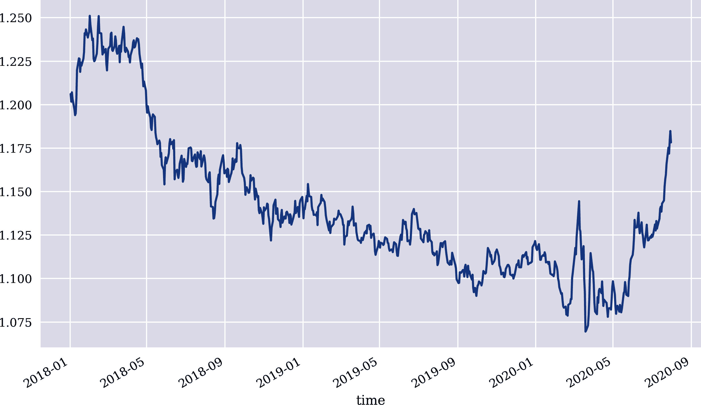
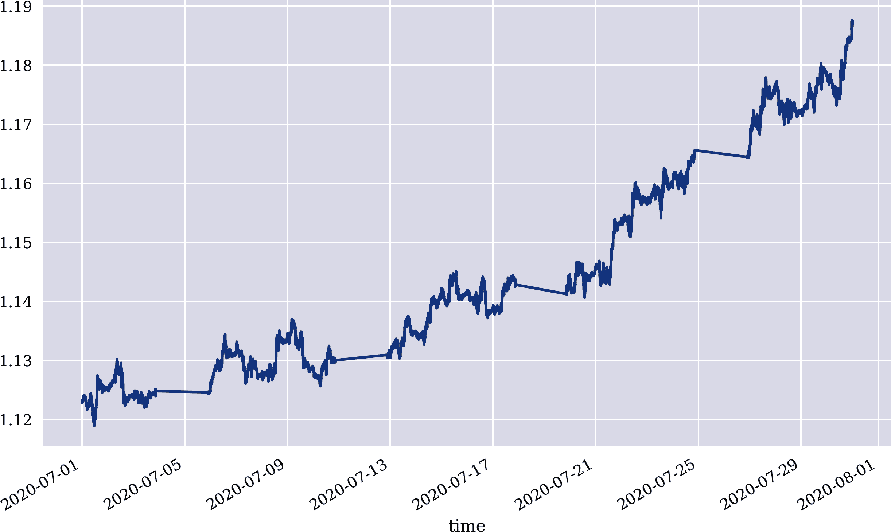
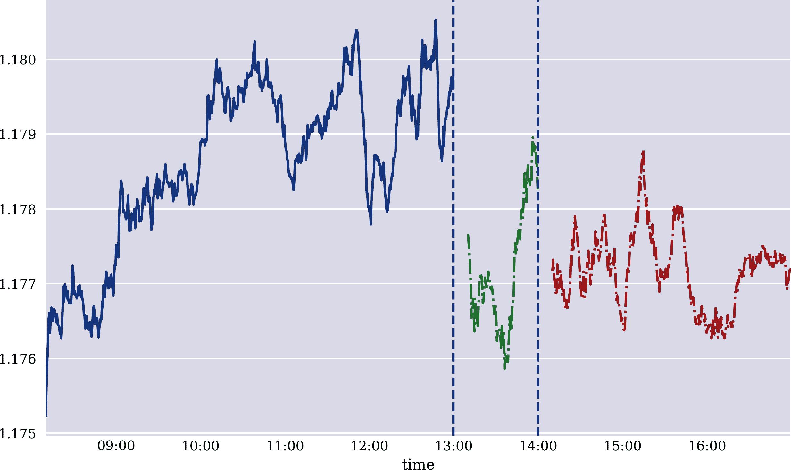
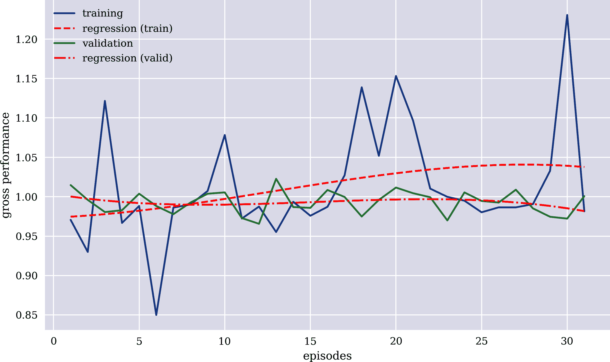
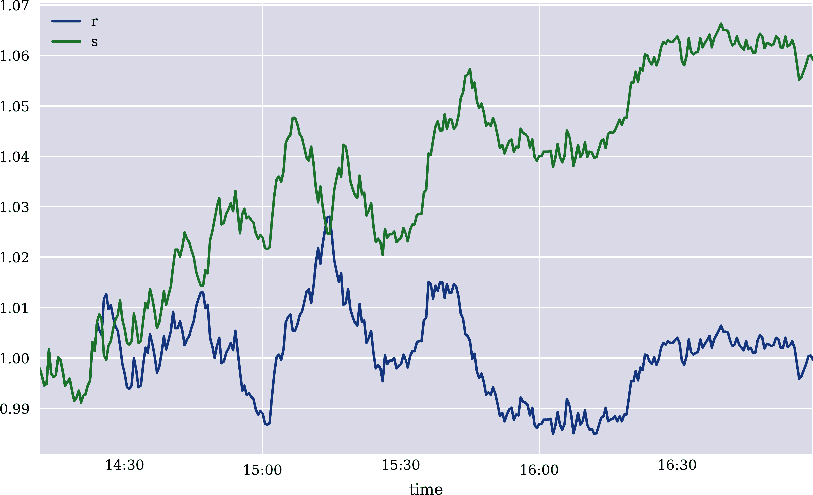

# 第十二章。执行和部署

> 在混合城市交通、大雨和雪、未铺装和未映射的道路以及无线接入不可靠的情况下，自动驾驶车辆可靠运行还需取得可观的进展。
> 
> Todd Litman（2020）
> 
> 从事算法交易的投资公司应当建立有效的系统和风险控制措施，适合其经营的业务，以确保其交易系统具有弹性和足够的容量，受到适当的交易阈值和限制的约束，并防止发送错误订单或以其他方式使系统在可能创造或促成混乱市场的方式中运行。
> 
> MiFID II（第 17 条）

第十一章以基于历史数据的金融 Q 学习代理形式训练交易机器人。它介绍了基于事件的回测作为一种灵活的方法，足以考虑典型的风险措施，如跟踪止损订单或利润目标。然而，所有这些都异步发生在仅基于历史数据的沙盒环境中。与自动驾驶车辆（AV）一样，部署 AI 到现实世界存在问题。对于 AV 来说，这意味着将 AI 与车辆硬件结合，并在测试和公共道路上部署 AV。对于交易机器人来说，这意味着将交易机器人连接到交易平台，并部署以实现订单的自动执行。换句话说，算法方面已经很清晰——现在需要添加执行和部署来实现算法交易。

本章介绍了用于算法交易的[Oanda](http://oanda.com)交易平台。因此，重点放在平台的[v20 API](https://oreil.ly/TbGKN)，而不是提供用户手动交易界面的应用程序上。为了简化代码，介绍并使用了包装器包[`tpqoa`](https://oreil.ly/72pWe)，它依赖于 Oanda 的[`v20`](https://oreil.ly/H_pIj) Python 包，并提供更符合 Python 风格的用户界面。

“Oanda 账户”详细介绍了使用 Oanda 的*演示账户*的先决条件。“数据检索”展示了如何从 API 检索历史和实时（流式）数据。“订单执行”处理买卖订单的执行，可能包括其他订单，如跟踪止损订单。“交易机器人”基于 Oanda 的历史分钟数据训练交易机器人，并以向量化方式进行性能回测。最后，“部署”展示了如何实时部署交易机器人和自动化部署。

# Oanda 账户

本章的代码依赖于 Python 包装器包[`tpqoa`](https://oreil.ly/72pWe)。可以通过以下方式使用`pip`安装此包：

```py
pip install --upgrade git+https://github.com/yhilpisch/tpqoa.git
```

要使用此包，仅需一个[Oanda](http://oanda.com)的演示账户即可。一旦账户开通，在登录后的账户页面生成一个*访问令牌*。然后将访问令牌和*账户 ID*（也可在账户页面找到）存储在配置文本文件中，如下所示：

```py
[oanda]
account_id = XYZ-ABC-...
access_token = ZYXCAB...
account_type = practice
```

如果配置文件名为*aiif.cfg*，并且存储在当前工作目录中，则可以如下使用`tpqoa`包：

```py
import tpqoa
api = tpqoa.tpqoa('aiif.cfg')
```

# 风险免责声明和披露

Oanda 是外汇（FX）和差价合约（CFD）交易的平台。这些工具涉及相当大的风险，特别是在使用杠杆交易时。强烈建议您在继续之前仔细阅读来自 Oanda 网站上所有相关的风险免责声明和披露（请查看适用司法管辖区）。

本章中呈现的所有代码和示例仅用于技术说明，不构成任何投资建议或类似内容。

# 数据检索

通常，首先进行一些 Python 导入和配置：

```py
In [1]: import os
        import time
        import numpy as np
        import pandas as pd
        from pprint import pprint
        from pylab import plt, mpl
        plt.style.use('seaborn')
        mpl.rcParams['savefig.dpi'] = 300
        mpl.rcParams['font.family'] = 'serif'
        pd.set_option('mode.chained_assignment', None)
        pd.set_option('display.float_format', '{:.5f}'.format)
        np.set_printoptions(suppress=True, precision=4)
        os.environ['PYTHONHASHSEED'] = '0'
```

根据账户的相关司法管辖权，Oanda 提供多种可交易的外汇和差价合约工具。以下 Python 代码检索给定账户的可用工具：

```py
In [2]: import tpqoa  

In [3]: api = tpqoa.tpqoa('../aiif.cfg')  

In [4]: ins = api.get_instruments()  

In [5]: ins[:5]  
Out[5]: [('AUD/CAD', 'AUD_CAD'),
         ('AUD/CHF', 'AUD_CHF'),
         ('AUD/HKD', 'AUD_HKD'),
         ('AUD/JPY', 'AUD_JPY'),
         ('AUD/NZD', 'AUD_NZD')]
```


导入`tpqoa`包


给定账户凭据实例化一个 API 对象


检索可用工具列表的格式为`(显示名称, 技术名称)`


展示其中几个工具

Oanda 通过其 v20 API 提供丰富的历史数据。以下示例检索 EUR/USD 货币对的历史数据，粒度设置为`D`（即*每日*）。

图 12-1 绘制了收盘（卖出）价格：

```py
In [6]: raw = api.get_history(instrument='EUR_USD',  
                              start='2018-01-01',  
                              end='2020-07-31',  
                              granularity='D',  
                              price='A')  

In [7]: raw.info()
        <class 'pandas.core.frame.DataFrame'>
        DatetimeIndex: 671 entries, 2018-01-01 22:00:00 to 2020-07-30 21:00:00
        Data columns (total 6 columns):
         #   Column    Non-Null Count  Dtype
        ---  ------    --------------  -----
         0   o         671 non-null    float64
         1   h         671 non-null    float64
         2   l         671 non-null    float64
         3   c         671 non-null    float64
         4   volume    671 non-null    int64
         5   complete  671 non-null    bool
        dtypes: bool(1), float64(4), int64(1)
        memory usage: 32.1 KB

In [8]: raw.head()
Out[8]:                           o       h       l       c  volume  complete
        time
        2018-01-01 22:00:00 1.20101 1.20819 1.20051 1.20610   35630      True
        2018-01-02 22:00:00 1.20620 1.20673 1.20018 1.20170   31354      True
        2018-01-03 22:00:00 1.20170 1.20897 1.20049 1.20710   35187      True
        2018-01-04 22:00:00 1.20692 1.20847 1.20215 1.20327   36478      True
        2018-01-07 22:00:00 1.20301 1.20530 1.19564 1.19717   27618      True

In [9]: raw['c'].plot(figsize=(10, 6));
```


指定工具…


…开始日期…


…结束日期…


…粒度（`D` = 每日）…


…和价格序列类型（`A` = 询价价）



###### 图 12-1\. Oanda 提供的 EUR/USD 历史每日收盘价格

就如下面的代码所示，分钟数据和日数据一样容易检索和使用。图 12-2 可视化了分钟条（中间价）价格数据：

```py
In [10]: raw = api.get_history(instrument='EUR_USD',
                               start='2020-07-01',
                               end='2020-07-31',
                               granularity='M1',  
                               price='M')   

In [11]: raw.info()
         <class 'pandas.core.frame.DataFrame'>
         DatetimeIndex: 30728 entries, 2020-07-01 00:00:00 to 2020-07-30 23:59:00
         Data columns (total 6 columns):
          #   Column    Non-Null Count  Dtype
         ---  ------    --------------  -----
          0   o         30728 non-null  float64
          1   h         30728 non-null  float64
          2   l         30728 non-null  float64
          3   c         30728 non-null  float64
          4   volume    30728 non-null  int64
          5   complete  30728 non-null  bool
         dtypes: bool(1), float64(4), int64(1)
         memory usage: 1.4 MB

In [12]: raw.tail()
Out[12]:                           o       h       l       c  volume  complete
         time
         2020-07-30 23:55:00 1.18724 1.18739 1.18718 1.18738      57      True
         2020-07-30 23:56:00 1.18736 1.18758 1.18722 1.18757      57      True
         2020-07-30 23:57:00 1.18756 1.18756 1.18734 1.18734      49      True
         2020-07-30 23:58:00 1.18736 1.18737 1.18713 1.18717      36      True
         2020-07-30 23:59:00 1.18718 1.18724 1.18714 1.18722      31      True

In [13]: raw['c'].plot(figsize=(10, 6));
```


指定粒度（`M1` = 一分钟）…


…和价格序列类型（`M` = 中间价）



###### 图 12-2\. Oanda 提供的 EUR/USD 历史一分钟条收盘价格

尽管历史数据很重要，例如用于训练和测试交易机器人，实时（流式）数据则是部署算法交易的必要条件。`tpqoa`允许通过单个方法调用同步流式传输所有可用工具的实时数据。该方法默认打印时间戳和买入/卖出价格。对于算法交易，可以根据需要调整此默认行为，如“部署”所示：

```py
In [14]: api.stream_data('EUR_USD', stop=10)
         2020-08-13T12:07:09.735715316Z 1.18328 1.18342
         2020-08-13T12:07:16.245253689Z 1.18329 1.18343
         2020-08-13T12:07:16.397803785Z 1.18328 1.18342
         2020-08-13T12:07:17.240232521Z 1.18331 1.18346
         2020-08-13T12:07:17.358476854Z 1.18334 1.18348
         2020-08-13T12:07:17.778061207Z 1.18331 1.18345
         2020-08-13T12:07:18.016544856Z 1.18333 1.18346
         2020-08-13T12:07:18.144762415Z 1.18334 1.18348
         2020-08-13T12:07:18.689365678Z 1.18331 1.18345
         2020-08-13T12:07:19.148039139Z 1.18331 1.18345
```

# 执行订单

自动驾驶车辆的 AI 需要能够控制实体车辆。为此，它向车辆发送不同类型的信号，例如加速、刹车、左转或右转。交易机器人需要能够在交易平台上下订单。本节涵盖了不同类型的订单，例如市价订单和止损订单。

最基本的订单类型是*市价订单*。该订单允许以当前市场价格（即购买时的*卖出价*和销售时的*买入价*）买入或卖出金融工具。以下示例基于 20 倍杠杆和相对较小的订单规模。因此，流动性问题并不重要。通过 Oanda v20 API 执行订单时，API 会返回详细的订单对象。首先，下了一个*买市场订单*：

```py
In [15]: order = api.create_order('EUR_USD', units=25000,
                                  suppress=True, ret=True)  
         pprint(order)  
         {'accountBalance': '98553.3172',
          'accountID': '101-004-13834683-001',
          'batchID': '1625',
          'commission': '0.0',
          'financing': '0.0',
          'fullPrice': {'asks': [{'liquidity': '10000000', 'price': 1.18345}],
                        'bids': [{'liquidity': '10000000', 'price': 1.18331}],
                        'closeoutAsk': 1.18345,
                        'closeoutBid': 1.18331,
                        'type': 'PRICE'},
          'fullVWAP': 1.18345,
          'gainQuoteHomeConversionFactor': '0.840811914585',
          'guaranteedExecutionFee': '0.0',
          'halfSpreadCost': '1.4788',
          'id': '1626',
          'instrument': 'EUR_USD',
          'lossQuoteHomeConversionFactor': '0.849262285586',
          'orderID': '1625',
          'pl': '0.0',
          'price': 1.18345,
          'reason': 'MARKET_ORDER',
          'requestID': '78757241547812154',
          'time': '2020-08-13T12:07:19.434407966Z',
          'tradeOpened': {'guaranteedExecutionFee': '0.0',
                          'halfSpreadCost': '1.4788',
                          'initialMarginRequired': '832.5',
                          'price': 1.18345,
                          'tradeID': '1626',
                          'units': '25000.0'},
          'type': 'ORDER_FILL',
          'units': '25000.0',
          'userID': 13834683}

In [16]: def print_details(order):  
             details = (order['time'][:-7], order['instrument'], order['units'],
                        order['price'], order['pl'])
             return details

In [17]: print_details(order)  
Out[17]: ('2020-08-13T12:07:19.434', 'EUR_USD', '25000.0', 1.18345, '0.0')

In [18]: time.sleep(1)
```


下单一个*买市场订单*并打印订单对象的详情


选择并显示订单的`时间`、`工具`、`单位`、`价格`和`pl`详情

其次，通过相同大小的*卖市场订单*关闭仓位。而第一笔交易由于其性质（在考虑交易成本之前）P＆L 为零——通常第二笔交易具有非零 P＆L：

```py
In [19]: order = api.create_order('EUR_USD', units=-25000,
                                  suppress=True, ret=True)  
         pprint(order)  
         {'accountBalance': '98549.283',
          'accountID': '101-004-13834683-001',
          'batchID': '1627',
          'commission': '0.0',
          'financing': '0.0',
          'fullPrice': {'asks': [{'liquidity': '9975000', 'price': 1.18339}],
                        'bids': [{'liquidity': '10000000', 'price': 1.18326}],
                        'closeoutAsk': 1.18339,
                        'closeoutBid': 1.18326,
                        'type': 'PRICE'},
          'fullVWAP': 1.18326,
          'gainQuoteHomeConversionFactor': '0.840850994445',
          'guaranteedExecutionFee': '0.0',
          'halfSpreadCost': '1.3732',
          'id': '1628',
          'instrument': 'EUR_USD',
          'lossQuoteHomeConversionFactor': '0.849301758209',
          'orderID': '1627',
          'pl': '-4.0342',
          'price': 1.18326,
          'reason': 'MARKET_ORDER',
          'requestID': '78757241552009237',
          'time': '2020-08-13T12:07:20.586564454Z',
          'tradesClosed': [{'financing': '0.0',
                            'guaranteedExecutionFee': '0.0',
                            'halfSpreadCost': '1.3732',
                            'price': 1.18326,
                            'realizedPL': '-4.0342',
                            'tradeID': '1626',
                            'units': '-25000.0'}],
          'type': 'ORDER_FILL',
          'units': '-25000.0',
          'userID': 13834683}

In [20]: print_details(order) 
Out[20]: ('2020-08-13T12:07:20.586', 'EUR_USD', '-25000.0', 1.18326, '-4.0342')

In [21]: time.sleep(1)
```


下单一个*卖市场订单*并打印订单对象的详情


选择并显示订单的`时间`、`工具`、`单位`、`价格`和`pl`详情

# 限价订单

本章仅涵盖*市价订单*作为一种基本订单类型。市价订单在下单时以当前价格买入或卖出金融工具。相比之下，*限价订单*作为另一种主要的基本订单类型，允许以最低或最高价格下单。只有当达到最低/最高价格时才执行订单。在此之前不进行任何交易。

接下来，考虑同一组合交易的示例，但这次使用*止损*（SL）订单。SL 订单被视为单独的（限价）订单。以下 Python 代码下单并显示了 SL 订单对象的详情：

```py
In [22]: order = api.create_order('EUR_USD', units=25000,
                                  sl_distance=0.005,  
                                  suppress=True, ret=True)

In [23]: print_details(order)
Out[23]: ('2020-08-13T12:07:21.740', 'EUR_USD', '25000.0', 1.18343, '0.0')

In [24]: sl_order = api.get_transaction(tid=int(order['id']) + 1)  

In [25]: sl_order  
Out[25]: {'id': '1631',
          'time': '2020-08-13T12:07:21.740825489Z',
          'userID': 13834683,
          'accountID': '101-004-13834683-001',
          'batchID': '1629',
          'requestID': '78757241556206373',
          'type': 'STOP_LOSS_ORDER',
          'tradeID': '1630',
          'price': 1.17843,
          'distance': '0.005',
          'timeInForce': 'GTC',
          'triggerCondition': 'DEFAULT',
          'reason': 'ON_FILL'}

In [26]: (sl_order['time'], sl_order['type'], order['price'],
          sl_order['price'], sl_order['distance'])  
Out[26]: ('2020-08-13T12:07:21.740825489Z',
          'STOP_LOSS_ORDER',
          1.18343,
          1.17843,
          '0.005')

In [27]: time.sleep(1)

In [28]: order = api.create_order('EUR_USD', units=-25000, suppress=True, ret=True)

In [29]: print_details(order)
Out[29]: ('2020-08-13T12:07:23.059', 'EUR_USD', '-25000.0', 1.18329, '-2.9725')
```


SL 距离以货币单位定义。


选择并显示 SL 订单对象数据。


选择并显示两个订单对象的一些相关细节。

*移动止损*（TSL）订单以相同的方式处理。唯一的区别是 TSL 订单没有固定的价格：

```py
In [30]: order = api.create_order('EUR_USD', units=25000,
                                  tsl_distance=0.005,  
                                  suppress=True, ret=True)

In [31]: print_details(order)
Out[31]: ('2020-08-13T12:07:23.204', 'EUR_USD', '25000.0', 1.18341, '0.0')

In [32]: tsl_order = api.get_transaction(tid=int(order['id']) + 1)  

In [33]: tsl_order  
Out[33]: {'id': '1637',
          'time': '2020-08-13T12:07:23.204457044Z',
          'userID': 13834683,
          'accountID': '101-004-13834683-001',
          'batchID': '1635',
          'requestID': '78757241564598562',
          'type': 'TRAILING_STOP_LOSS_ORDER',
          'tradeID': '1636',
          'distance': '0.005',
          'timeInForce': 'GTC',
          'triggerCondition': 'DEFAULT',
          'reason': 'ON_FILL'}

In [34]: (tsl_order['time'][:-7], tsl_order['type'],
          order['price'], tsl_order['distance'])  
Out[34]: ('2020-08-13T12:07:23.204', 'TRAILING_STOP_LOSS_ORDER', 1.18341, '0.005')

In [35]: time.sleep(1)

In [36]: order = api.create_order('EUR_USD', units=-25000,
                                  suppress=True, ret=True)

In [37]: print_details(order)
Out[37]: ('2020-08-13T12:07:24.551', 'EUR_USD', '-25000.0', 1.1833, '-2.3355')

In [38]: time.sleep(1)
```


TSL 距离以货币单位定义。


选择并显示 TSL 订单对象数据。


选择并显示两个订单对象的一些相关细节。

最后，这是一个*获利*（TP）订单。该订单需要一个固定的 TP 目标价格。因此，以下代码使用先前订单的执行价格来定义相对价格的 TP 价格。除此以外的小差异外，处理方式与之前一样。

```py
In [39]: tp_price = round(order['price'] + 0.01, 4)
         tp_price
Out[39]: 1.1933

In [40]: order = api.create_order('EUR_USD', units=25000,
                                  tp_price=tp_price,  
                                  suppress=True, ret=True)

In [41]: print_details(order)
Out[41]: ('2020-08-13T12:07:25.712', 'EUR_USD', '25000.0', 1.18344, '0.0')

In [42]: tp_order = api.get_transaction(tid=int(order['id']) + 1)  

In [43]: tp_order  
Out[43]: {'id': '1643',
          'time': '2020-08-13T12:07:25.712531725Z',
          'userID': 13834683,
          'accountID': '101-004-13834683-001',
          'batchID': '1641',
          'requestID': '78757241572993078',
          'type': 'TAKE_PROFIT_ORDER',
          'tradeID': '1642',
          'price': 1.1933,
          'timeInForce': 'GTC',
          'triggerCondition': 'DEFAULT',
          'reason': 'ON_FILL'}

In [44]: (tp_order['time'][:-7], tp_order['type'],
          order['price'], tp_order['price'])  
Out[44]: ('2020-08-13T12:07:25.712', 'TAKE_PROFIT_ORDER', 1.18344, 1.1933)

In [45]: time.sleep(1)

In [46]: order = api.create_order('EUR_USD', units=-25000,
                                  suppress=True, ret=True)

In [47]: print_details(order)
Out[47]: ('2020-08-13T12:07:27.020', 'EUR_USD', '-25000.0', 1.18332, '-2.5478')
```


TP 目标价格相对于先前执行价格定义。


选择并显示 TP 订单对象数据。


选择并显示两个订单对象的一些相关细节。

到目前为止，代码只处理单个订单的交易详情。然而，对于多个*历史交易*的概览也很有趣。为此，以下方法调用提供了本节中所有主要订单的概览数据，包括 P&L 数据：

```py
In [48]: api.print_transactions(tid=int(order['id']) - 22)
          1626 | 2020-08-13T12:07:19.434407966Z |   EUR_USD |      25000.0 |      0.0
          1628 | 2020-08-13T12:07:20.586564454Z |   EUR_USD |     -25000.0 |  -4.0342
          1630 | 2020-08-13T12:07:21.740825489Z |   EUR_USD |      25000.0 |      0.0
          1633 | 2020-08-13T12:07:23.059178023Z |   EUR_USD |     -25000.0 |  -2.9725
          1636 | 2020-08-13T12:07:23.204457044Z |   EUR_USD |      25000.0 |      0.0
          1639 | 2020-08-13T12:07:24.551026466Z |   EUR_USD |     -25000.0 |  -2.3355
          1642 | 2020-08-13T12:07:25.712531725Z |   EUR_USD |      25000.0 |      0.0
          1645 | 2020-08-13T12:07:27.020414342Z |   EUR_USD |     -25000.0 |  -2.5478
```

另一个方法调用提供了*账户详情*的快照。显示的细节来自使用已经进行了相当长时间的 Oanda 演示账户进行技术测试的目的：

```py
In [49]: api.get_account_summary()
Out[49]: {'id': '101-004-13834683-001',
          'alias': 'Primary',
          'currency': 'EUR',
          'balance': '98541.4272',
          'createdByUserID': 13834683,
          'createdTime': '2020-03-19T06:08:14.363139403Z',
          'guaranteedStopLossOrderMode': 'DISABLED',
          'pl': '-1248.5543',
          'resettablePL': '-1248.5543',
          'resettablePLTime': '0',
          'financing': '-210.0185',
          'commission': '0.0',
          'guaranteedExecutionFees': '0.0',
          'marginRate': '0.0333',
          'openTradeCount': 1,
          'openPositionCount': 1,
          'pendingOrderCount': 0,
          'hedgingEnabled': False,
          'unrealizedPL': '941.9536',
          'NAV': '99483.3808',
          'marginUsed': '380.83',
          'marginAvailable': '99107.2283',
          'positionValue': '3808.3',
          'marginCloseoutUnrealizedPL': '947.9546',
          'marginCloseoutNAV': '99489.3818',
          'marginCloseoutMarginUsed': '380.83',
          'marginCloseoutPercent': '0.00191',
          'marginCloseoutPositionValue': '3808.3',
          'withdrawalLimit': '98541.4272',
          'marginCallMarginUsed': '380.83',
          'marginCallPercent': '0.00383',
          'lastTransactionID': '1646'}
```

这结束了使用 Oanda 执行订单基础知识的讨论。所有元素现在都已准备好支持交易机器人的部署。本章剩余部分将在 Oanda 数据上训练交易机器人，并以自动化方式部署它。

# 交易机器人

第十一章详细介绍了如何训练深度 Q 学习交易机器人以及如何以矢量化和基于事件的方式进行回测。此节现在基于来自 Oanda 的历史数据重复了这方面的一些核心步骤。“Oanda 环境”提供了一个包含用于处理 Oanda 数据的环境类 `OandaEnv` 的 Python 模块。它可以与第十一章中的 `Finance` 类一样使用。

以下 Python 代码实例化了学习环境对象。在此步骤中，固定了驱动学习、验证和测试的主要数据相关参数。`OandaEnv` 类允许包含杠杆，这对于外汇和差价合约交易是典型的。杠杆放大了实现的回报，从而增加了利润潜力，但也增加了损失风险：

```py
In [50]: import oandaenv as oe

In [51]: symbol = 'EUR_USD'

In [52]: date = '2020-08-11'

In [53]: features = [symbol, 'r', 's', 'm', 'v']

In [54]: %%time
         learn_env = oe.OandaEnv(symbol=symbol,
                           start=f'{date} 08:00:00',
                           end=f'{date} 13:00:00',
                           granularity='S30',  
                           price='M',  
                           features=features,  
                           window=20,  
                           lags=3,  
                           leverage=20,  
                           min_accuracy=0.4,  
                           min_performance=0.85  
                          )
         CPU times: user 23.1 ms, sys: 2.86 ms, total: 25.9 ms
         Wall time: 26.8 ms

In [55]: np.bincount(learn_env.data['d'])
Out[55]: array([299, 281])

In [56]: learn_env.data.info()
         <class 'pandas.core.frame.DataFrame'>
         DatetimeIndex: 580 entries, 2020-08-11 08:10:00 to 2020-08-11 12:59:30
         Data columns (total 6 columns):
          #   Column   Non-Null Count  Dtype
         ---  ------   --------------  -----
          0   EUR_USD  580 non-null    float64
          1   r        580 non-null    float64
          2   s        580 non-null    float64
          3   m        580 non-null    float64
          4   v        580 non-null    float64
          5   d        580 non-null    int64
         dtypes: float64(5), int64(1)
         memory usage: 31.7 KB
```


设置数据的粒度为五秒钟


将价格类型设置为中间价格


定义要使用的特征集


定义滚动统计的窗口长度


指定滞后数


修正杠杆


设置所需的最低准确率


设置所需的最低性能

下一步，将实例化验证环境，依赖于学习环境的参数——除了时间间隔，由于显而易见的原因。图 12-3 显示了 EUR/USD 的收盘价格，作为学习、验证和测试环境中使用的（从左到右）：

```py
In [57]: valid_env = oe.OandaEnv(symbol=learn_env.symbol,
                           start=f'{date} 13:00:00',
                           end=f'{date} 14:00:00',
                           granularity=learn_env.granularity,
                           price=learn_env.price,
                           features=learn_env.features,
                           window=learn_env.window,
                           lags=learn_env.lags,
                           leverage=learn_env.leverage,
                           min_accuracy=0,
                           min_performance=0,
                           mu=learn_env.mu,
                           std=learn_env.std
                          )

In [58]: valid_env.data.info()
         <class 'pandas.core.frame.DataFrame'>
         DatetimeIndex: 100 entries, 2020-08-11 13:10:00 to 2020-08-11 13:59:30
         Data columns (total 6 columns):
          #   Column   Non-Null Count  Dtype
         ---  ------   --------------  -----
          0   EUR_USD  100 non-null    float64
          1   r        100 non-null    float64
          2   s        100 non-null    float64
          3   m        100 non-null    float64
          4   v        100 non-null    float64
          5   d        100 non-null    int64
         dtypes: float64(5), int64(1)
         memory usage: 5.5 KB

In [59]: test_env = oe.OandaEnv(symbol=learn_env.symbol,
                           start=f'{date} 14:00:00',
                           end=f'{date} 17:00:00',
                           granularity=learn_env.granularity,
                           price=learn_env.price,
                           features=learn_env.features,
                           window=learn_env.window,
                           lags=learn_env.lags,
                           leverage=learn_env.leverage,
                           min_accuracy=0,
                           min_performance=0,
                           mu=learn_env.mu,
                           std=learn_env.std
                          )

In [60]: test_env.data.info()
         <class 'pandas.core.frame.DataFrame'>
         DatetimeIndex: 340 entries, 2020-08-11 14:10:00 to 2020-08-11 16:59:30
         Data columns (total 6 columns):
          #   Column   Non-Null Count  Dtype
         ---  ------   --------------  -----
          0   EUR_USD  340 non-null    float64
          1   r        340 non-null    float64
          2   s        340 non-null    float64
          3   m        340 non-null    float64
          4   v        340 non-null    float64
          5   d        340 non-null    int64
         dtypes: float64(5), int64(1)
         memory usage: 18.6 KB

In [61]: ax = learn_env.data[learn_env.symbol].plot(figsize=(10, 6))
         plt.axvline(learn_env.data.index[-1], ls='--')
         valid_env.data[learn_env.symbol].plot(ax=ax, style='-.')
         plt.axvline(valid_env.data.index[-1], ls='--')
         test_env.data[learn_env.symbol].plot(ax=ax, style='-.');
```



###### 图 12-3\. Oanda 提供的 EUR/USD 历史 30 秒钟收盘价（学习 = 左，验证 = 中，测试 = 右）

基于 Oanda 环境，可以对第十一章中的交易机器人进行训练和验证。以下 Python 代码执行此任务并可视化性能结果（参见 图 12-4）：

```py
In [62]: import sys
         sys.path.append('../ch11/')  

In [63]: import tradingbot  
         Using TensorFlow backend.

In [64]: tradingbot.set_seeds(100)
         agent = tradingbot.TradingBot(24, 0.001, learn_env=learn_env,
                                       valid_env=valid_env)  

In [65]: episodes = 31

In [66]: %time agent.learn(episodes)  
         =======================================================================
         episode:  5/31 | VALIDATION | treward:   97 | perf: 1.004 | eps: 0.96
         =======================================================================
         =======================================================================
         episode: 10/31 | VALIDATION | treward:   97 | perf: 1.005 | eps: 0.91
         =======================================================================
         =======================================================================
         episode: 15/31 | VALIDATION | treward:   97 | perf: 0.986 | eps: 0.87
         =======================================================================
         =======================================================================
         episode: 20/31 | VALIDATION | treward:   97 | perf: 1.012 | eps: 0.83
         =======================================================================
         =======================================================================
         episode: 25/31 | VALIDATION | treward:   97 | perf: 0.995 | eps: 0.79
         =======================================================================
         =======================================================================
         episode: 30/31 | VALIDATION | treward:   97 | perf: 0.972 | eps: 0.75
         =======================================================================
         episode: 31/31 | treward:   16 | perf: 0.981 | av: 376.0 | max:  577
         CPU times: user 22.1 s, sys: 1.17 s, total: 23.3 s
         Wall time: 20.1 s

In [67]: tradingbot.plot_performance(agent)  
```


从第十一章导入`tradingbot`模块


基于 Oanda 数据对交易机器人进行训练和验证


可视化性能结果

如前两章所讨论的，训练和验证表现只是交易机器人表现的一个指标。



###### 图 12-4\. Oanda 数据的交易机器人的训练和验证性能结果

下面的代码实现了用于测试环境的交易机器人性能的矢量化回测——再次使用与学习环境相同的参数，除了使用的时间间隔。代码利用了 Python 模块中提供的`backtest()`函数，该模块在“矢量化回测”中有介绍。报告的性能数字包括杠杆为 20。这对于被动基准投资的总体表现和交易机器人的表现都是如此，如图 12-5 所示：

```py
In [68]: import backtest as bt

In [69]: env = test_env

In [70]: bt.backtest(agent, env)

In [71]: env.data['p'].iloc[env.lags:].value_counts()  
Out[71]:  1    263
         -1     74
         Name: p, dtype: int64

In [72]: sum(env.data['p'].iloc[env.lags:].diff() != 0)  
Out[72]: 25

In [73]: (env.data[['r', 's']].iloc[env.lags:] * env.leverage).sum(
                 ).apply(np.exp)  
Out[73]: r   0.99966
         s   1.05910
         dtype: float64

In [74]: (env.data[['r', 's']].iloc[env.lags:] * env.leverage).sum(
                 ).apply(np.exp) - 1  
Out[74]: r   -0.00034
         s    0.05910
         dtype: float64

In [75]: (env.data[['r', 's']].iloc[env.lags:] * env.leverage).cumsum(
                 ).apply(np.exp).plot(figsize=(10, 6));  
```


显示长仓和短仓的总数


显示实施该策略所需的交易次数


计算包括杠杆在内的总体表现


计算包括杠杆在内的净表现


可视化随时间推移的总体表现，包括杠杆



###### 图 12-5\. 被动基准投资和交易机器人随时间的总体表现（包括杠杆）

# 简化的回测

本节中交易机器人的训练和回测是在不现实的假设条件下进行的。基于 30 秒钟的柱状图的交易策略可能会在短时间内导致大量交易。假设典型的交易成本（买卖价差），这样的策略通常在经济上不可行。更长的柱状图或更少交易的策略可能更现实。但是，为了在下一节中允许“快速”部署演示，训练和回测是故意在相对短的 30 秒钟柱状图上实施的。

# 部署

本节结合了前几节的主要元素，以自动化方式部署训练过的交易机器人。这类似于 AV 准备在街上部署的时刻。以下代码中介绍的`OandaTradingBot`类继承自`tpqoa`类，并添加了一些辅助函数和交易逻辑：

```py
In [76]: import tpqoa

In [77]: class OandaTradingBot(tpqoa.tpqoa):
             def __init__(self, config_file, agent, granularity, units,
                          verbose=True):
                 super(OandaTradingBot, self).__init__(config_file)
                 self.agent = agent
                 self.symbol = self.agent.learn_env.symbol
                 self.env = agent.learn_env
                 self.window = self.env.window
                 if granularity is None:
                     self.granularity = agent.learn_env.granularity
                 else:
                     self.granularity = granularity
                 self.units = units
                 self.trades = 0
                 self.position = 0
                 self.tick_data = pd.DataFrame()
                 self.min_length = (self.agent.learn_env.window +
                                    self.agent.learn_env.lags)
                 self.pl = list()
                 self.verbose = verbose
             def _prepare_data(self):
                 self.data['r'] = np.log(self.data / self.data.shift(1))
                 self.data.dropna(inplace=True)
                 self.data['s'] = self.data[self.symbol].rolling(
                                                     self.window).mean()
                 self.data['m'] = self.data['r'].rolling(self.window).mean()
                 self.data['v'] = self.data['r'].rolling(self.window).std()
                 self.data.dropna(inplace=True)
                 # self.data_ = (self.data - self.env.mu) / self.env.std 
                 self.data_ = (self.data - self.data.mean()) / self.data.std()  
             def _resample_data(self):
                 self.data = self.tick_data.resample(self.granularity,
                                 label='right').last().ffill().iloc[:-1]  
                 self.data = pd.DataFrame(self.data['mid'])  
                 self.data.columns = [self.symbol,]  
                 self.data.index = self.data.index.tz_localize(None)  
             def _get_state(self):
                 state = self.data_[self.env.features].iloc[-self.env.lags:]  
                 return np.reshape(state.values, [1, self.env.lags,
                                                  self.env.n_features])  
             def report_trade(self, time, side, order):
                 self.trades += 1
                 pl = float(order['pl'])  
                 self.pl.append(pl)  
                 cpl = sum(self.pl)  
                 print('\n' + 75 * '=')
                 print(f'{time} | *** GOING {side} ({self.trades}) ***')
                 print(f'{time} | PROFIT/LOSS={pl:.2f} | CUMULATIVE={cpl:.2f}')
                 print(75 * '=')
                 if self.verbose:
                     pprint(order)
                     print(75 * '=')
             def on_success(self, time, bid, ask):
                 df = pd.DataFrame({'ask': ask, 'bid': bid,
                                    'mid': (bid + ask) / 2},
                                   index=[pd.Timestamp(time)])
                 self.tick_data = self.tick_data.append(df)  
                 self._resample_data()  
                 if len(self.data) > self.min_length:
                     self.min_length += 1
                     self._prepare_data()
                     state = self._get_state()  
                     prediction = np.argmax(
                         self.agent.model.predict(state)[0, 0])  
                     position = 1 if prediction == 1 else -1  
                     if self.position in [0, -1] and position == 1:  
                         order = self.create_order(self.symbol,
                                 units=(1 - self.position) * self.units,
                                         suppress=True, ret=True)
                         self.report_trade(time, 'LONG', order)
                         self.position = 1
                     elif self.position in [0, 1] and position == -1:  
                         order = self.create_order(self.symbol,
                                 units=-(1 + self.position) * self.units,
                                         suppress=True, ret=True)
                         self.report_trade(time, 'SHORT', order)
                         self.position = -1
```


为了演示，使用实时数据统计进行归一化处理。¹


收集 tick 数据并将其重新采样到所需的粒度。


返回当前金融市场的状态。


收集每笔交易的盈亏数据。


计算所有交易的累积盈亏。


预测市场方向并推导信号（头寸）。


检查是否满足*多头位*（买入订单）的条件。


检查是否满足*空头位*（卖出订单）的条件。

这个类的应用非常直接。首先，实例化一个对象，主要输入是上一节中训练过的交易机器人`agent`。其次，需要启动要交易的工具的流。每当有新的 tick 数据到达时，都会调用`.on_success()`方法，其中包含处理 tick 数据和下订单的主要逻辑。为了加快速度，部署示例依赖于之前的回测一样，使用 30 秒钟的柱状图。在管理真实资金时，生产环境中可能更长的时间间隔可能是更好的选择——如果只是为了减少交易数量和因此的交易成本：

```py
In [78]: otb = OandaTradingBot('../aiif.cfg', agent, '30s',
                               25000, verbose=False)  

In [79]: otb.tick_data.info()
         <class 'pandas.core.frame.DataFrame'>
         Index: 0 entries
         Empty DataFrame
In [80]: otb.stream_data(agent.learn_env.symbol, stop=1000)  

         ===========================================================================
         2020-08-13T12:19:32.320291893Z | *** GOING SHORT (1) ***
         2020-08-13T12:19:32.320291893Z | PROFIT/LOSS=0.00 | CUMULATIVE=0.00
         ===========================================================================

         ===========================================================================
         2020-08-13T12:20:00.083985447Z | *** GOING LONG (2) ***
         2020-08-13T12:20:00.083985447Z | PROFIT/LOSS=-6.80 | CUMULATIVE=-6.80
         ===========================================================================

         ===========================================================================
         2020-08-13T12:25:00.099901587Z | *** GOING SHORT (3) ***
         2020-08-13T12:25:00.099901587Z | PROFIT/LOSS=-7.86 | CUMULATIVE=-14.66
         ===========================================================================

In [81]: print('\n' + 75 * '=')
         print('*** CLOSING OUT ***')
         order = otb.create_order(otb.symbol,
                         units=-otb.position * otb.units,
                         suppress=True, ret=True)  
         otb.report_trade(otb.time, 'NEUTRAL', order)  
         if otb.verbose:
             pprint(order)
         print(75 * '=')

         ===========================================================================
         *** CLOSING OUT ***

         ===========================================================================
         2020-08-13T12:25:16.870357562Z | *** GOING NEUTRAL (4) ***
         2020-08-13T12:25:16.870357562Z | PROFIT/LOSS=-3.19 | CUMULATIVE=-17.84
         ===========================================================================
         ===========================================================================
```


实例化`OandaTradingBot`对象


启动实时数据和交易的流式传输


在检索到一定数量的 ticks 后关闭最终位置

在部署期间，利润和损失（P&L）数据被收集在`pl`属性中，这是一个`list`对象。一旦交易停止，可以分析 P&L 数据：

```py
In [82]: pl = np.array(otb.pl)  

In [83]: pl  
Out[83]: array([ 0.    , -6.7959, -7.8594, -3.1862])

In [84]: pl.cumsum()  
Out[84]: array([  0.    ,  -6.7959, -14.6553, -17.8415])
```


所有交易的 P&L 数据


累积 P&L 数据

简单的部署示例说明，人们可以使用少于 100 行的 Python 代码进行算法交易和自动化交易，使用深度 Q 学习交易机器人。主要前提是训练有素的交易机器人（即`tradingbot`类的实例）。此处有意省略了许多重要方面。例如，在生产环境中，可能希望持久化数据。还可能希望持久化订单对象。确保套接字连接仍然活动的措施也很重要（例如通过监视心跳）。总体而言，安全性、可靠性、日志记录和监控并未得到真正的关注。关于这方面的一些更多细节在 Hilpisch（2020）中提供。

Python 脚本中的“Oanda Trading Bot”展示了`OandaTradingBot`类的独立可执行版本。与 Jupyter Notebook 或 Jupyter Lab 等交互式环境相比，这代表了更稳健的部署选项的重要进展。脚本还包括为执行添加 SL、TSL 或 TP 订单的功能。脚本期望当前工作目录中有`agent`对象的 pickle 版本，以下 Python 代码将该对象 pickle 化以供脚本后续使用：

```py
In [85]: import pickle

In [86]: pickle.dump(agent, open('trading.bot', 'wb'))
```

# 结论

本章讨论了算法交易策略执行和交易机器人部署的核心方面。Oanda 交易平台通过其 v20 API 直接或间接提供所有必要的功能来执行以下操作：

+   检索历史数据

+   训练和回测交易机器人（深度 Q 学习代理）

+   实时数据流

+   下达市场（和限价）订单

+   使用 SL、TSL 和 TP 订单

+   以自动化方式部署交易机器人

实施所有这些步骤的先决条件是在 Oanda 拥有一个演示账户，标准硬件和软件（仅开源），以及稳定的互联网连接。换句话说，与在公共街道上部署 AV（自动驾驶车辆）的培训、设计和建造相比，利用算法交易来利用经济效率低下的目的的门槛非常低。换句话说，金融领域在 AI 代理实际部署方面（如本章和前一章中所关注的交易机器人）与其他行业和领域相比具有显著优势。

# 参考资料

本章引用的书籍和论文：

+   Hilpisch, Yves. 2020 年。《Python 量化交易：从想法到云部署》。Sebastopol：O’Reilly。

+   Litman, Todd. 2020 年。《自动驾驶车辆实施预测》。*维多利亚交通政策研究所*。[*https://oreil.ly/ds7YM*](https://oreil.ly/ds7YM)。

# Python 代码

此部分包含主章节中使用和引用的代码。

## Oanda 环境

以下是带有`OandaEnv`类的 Python 模块，用于基于历史 Oanda 数据训练交易机器人：

```py
#
# Finance Environment
#
# (c) Dr. Yves J. Hilpisch
# Artificial Intelligence in Finance
#
#
import math
import tpqoa
import random
import numpy as np
import pandas as pd

class observation_space:
    def __init__(self, n):
        self.shape = (n,)

class action_space:
    def __init__(self, n):
        self.n = n

    def sample(self):
        return random.randint(0, self.n - 1)

class OandaEnv:
    def __init__(self, symbol, start, end, granularity, price,
                 features, window, lags, leverage=1,
                 min_accuracy=0.5, min_performance=0.85,
                 mu=None, std=None):
        self.symbol = symbol
        self.start = start
        self.end = end
        self.granularity = granularity
        self.price = price
        self.api = tpqoa.tpqoa('../aiif.cfg')
        self.features = features
        self.n_features = len(features)
        self.window = window
        self.lags = lags
        self.leverage = leverage
        self.min_accuracy = min_accuracy
        self.min_performance = min_performance
        self.mu = mu
        self.std = std
        self.observation_space = observation_space(self.lags)
        self.action_space = action_space(2)
        self._get_data()
        self._prepare_data()

    def _get_data(self):
        ''' Method to retrieve data from Oanda.
        '''
        self.fn = f'../../source/oanda/'  
        self.fn += f'oanda_{self.symbol}_{self.start}_{self.end}_'  
        self.fn += f'{self.granularity}_{self.price}.csv'  
        self.fn = self.fn.replace(' ', '_').replace('-', '_').replace(':', '_')
        try:
            self.raw = pd.read_csv(self.fn, index_col=0, parse_dates=True)  
        except:
            self.raw = self.api.get_history(self.symbol, self.start,
                                       self.end, self.granularity,
                                       self.price)  
            self.raw.to_csv(self.fn)  
        self.data = pd.DataFrame(self.raw['c'])  
        self.data.columns = [self.symbol]  

    def _prepare_data(self):
        ''' Method to prepare additional time series data
            (such as features data).
        '''
        self.data['r'] = np.log(self.data / self.data.shift(1))
        self.data.dropna(inplace=True)
        self.data['s'] = self.data[self.symbol].rolling(self.window).mean()
        self.data['m'] = self.data['r'].rolling(self.window).mean()
        self.data['v'] = self.data['r'].rolling(self.window).std()
        self.data.dropna(inplace=True)
        if self.mu is None:
            self.mu = self.data.mean()
            self.std = self.data.std()
        self.data_ = (self.data - self.mu) / self.std
        self.data['d'] = np.where(self.data['r'] > 0, 1, 0)
        self.data['d'] = self.data['d'].astype(int)

    def _get_state(self):
        ''' Privat method that returns the state of the environment.
        '''
        return self.data_[self.features].iloc[self.bar -
                                    self.lags:self.bar].values

    def get_state(self, bar):
        ''' Method that returns the state of the environment.
        '''
        return self.data_[self.features].iloc[bar - self.lags:bar].values

    def reset(self):
        ''' Method to reset the environment.
        '''
        self.treward = 0
        self.accuracy = 0
        self.performance = 1
        self.bar = self.lags
        state = self._get_state()
        return state

    def step(self, action):
        ''' Method to step the environment forwards.
        '''
        correct = action == self.data['d'].iloc[self.bar]
        ret = self.data['r'].iloc[self.bar] * self.leverage
        reward_1 = 1 if correct else 0  
        reward_2 = abs(ret) if correct else -abs(ret)  
        reward = reward_1 + reward_2 * self.leverage  
        self.treward += reward_1
        self.bar += 1
        self.accuracy = self.treward / (self.bar - self.lags)
        self.performance *= math.exp(reward_2)
        if self.bar >= len(self.data):
            done = True
        elif reward_1 == 1:
            done = False
        elif (self.accuracy < self.min_accuracy and
              self.bar > self.lags + 15):
            done = True
        elif (self.performance < self.min_performance and
              self.bar > self.lags + 15):
            done = True
        else:
            done = False
        state = self._get_state()
        info = {}
        return state, reward, done, info
```


定义数据文件的路径


定义数据文件的文件名


如果存在相应的数据文件，则读取数据


如果不存在这样的文件，则检索 API 的数据


将数据写入`CSV`文件到磁盘


选择包含收盘价格的列


将列重命名为工具名称（符号）


正确预测的奖励


实现表现（回报）的奖励


预测和表现的综合奖励

## 矢量化回测

以下是带有助手函数`backtest`的 Python 模块，用于为深度 Q 学习交易机器人进行矢量化回测生成数据。此代码还用于第十一章：

```py
#
# Vectorized Backtesting of
# Trading Bot (Financial Q-Learning Agent)
#
# (c) Dr. Yves J. Hilpisch
# Artificial Intelligence in Finance
#
import numpy as np
import pandas as pd
pd.set_option('mode.chained_assignment', None)

def reshape(s, env):
    return np.reshape(s, [1, env.lags, env.n_features])

def backtest(agent, env):
    done = False
    env.data['p'] = 0
    state = env.reset()
    while not done:
        action = np.argmax(
            agent.model.predict(reshape(state, env))[0, 0])
        position = 1 if action == 1 else -1
        env.data.loc[:, 'p'].iloc[env.bar] = position
        state, reward, done, info = env.step(action)
    env.data['s'] = env.data['p'] * env.data['r']
```

## Oanda 交易机器人

以下是带有`OandaTradingBot`类和部署该类的 Python 脚本：

```py
#
# Oanda Trading Bot
# and Deployment Code
#
# (c) Dr. Yves J. Hilpisch
# Artificial Intelligence in Finance
#
import sys
import tpqoa
import pickle
import numpy as np
import pandas as pd

sys.path.append('../ch11/')

class OandaTradingBot(tpqoa.tpqoa):
    def __init__(self, config_file, agent, granularity, units,
                 sl_distance=None, tsl_distance=None, tp_price=None,
                 verbose=True):
        super(OandaTradingBot, self).__init__(config_file)
        self.agent = agent
        self.symbol = self.agent.learn_env.symbol
        self.env = agent.learn_env
        self.window = self.env.window
        if granularity is None:
            self.granularity = agent.learn_env.granularity
        else:
            self.granularity = granularity
        self.units = units
        self.sl_distance = sl_distance
        self.tsl_distance = tsl_distance
        self.tp_price = tp_price
        self.trades = 0
        self.position = 0
        self.tick_data = pd.DataFrame()
        self.min_length = (self.agent.learn_env.window +
                           self.agent.learn_env.lags)
        self.pl = list()
        self.verbose = verbose
    def _prepare_data(self):
        ''' Prepares the (lagged) features data.
 '''
        self.data['r'] = np.log(self.data / self.data.shift(1))
        self.data.dropna(inplace=True)
        self.data['s'] = self.data[self.symbol].rolling(self.window).mean()
        self.data['m'] = self.data['r'].rolling(self.window).mean()
        self.data['v'] = self.data['r'].rolling(self.window).std()
        self.data.dropna(inplace=True)
        self.data_ = (self.data - self.env.mu) / self.env.std
    def _resample_data(self):
        ''' Resamples the data to the trading bar length.
 '''
        self.data = self.tick_data.resample(self.granularity,
                                label='right').last().ffill().iloc[:-1]
        self.data = pd.DataFrame(self.data['mid'])
        self.data.columns = [self.symbol,]
        self.data.index = self.data.index.tz_localize(None)
    def _get_state(self):
        ''' Returns the (current) state of the financial market.
 '''
        state = self.data_[self.env.features].iloc[-self.env.lags:]
        return np.reshape(state.values, [1, self.env.lags, self.env.n_features])
    def report_trade(self, time, side, order):
        ''' Reports trades and order details.
 '''
        self.trades += 1
        pl = float(order['pl'])
        self.pl.append(pl)
        cpl = sum(self.pl)
        print('\n' + 71 * '=')
        print(f'{time} | *** GOING {side} ({self.trades}) ***')
        print(f'{time} | PROFIT/LOSS={pl:.2f} | CUMULATIVE={cpl:.2f}')
        print(71 * '=')
        if self.verbose:
            pprint(order)
            print(71 * '=')
    def on_success(self, time, bid, ask):
        ''' Contains the main trading logic.
 '''
        df = pd.DataFrame({'ask': ask, 'bid': bid, 'mid': (bid + ask) / 2},
                          index=[pd.Timestamp(time)])
        self.tick_data = self.tick_data.append(df)
        self._resample_data()
        if len(self.data) > self.min_length:
            self.min_length += 1
            self._prepare_data()
            state = self._get_state()
            prediction = np.argmax(self.agent.model.predict(state)[0, 0])
            position = 1 if prediction == 1 else -1
            if self.position in [0, -1] and position == 1:
                order = self.create_order(self.symbol,
                        units=(1 - self.position) * self.units,
                        sl_distance=self.sl_distance,
                        tsl_distance=self.tsl_distance,
                        tp_price=self.tp_price,
                        suppress=True, ret=True)
                self.report_trade(time, 'LONG', order)
                self.position = 1
            elif self.position in [0, 1] and position == -1:
                order = self.create_order(self.symbol,
                        units=-(1 + self.position) * self.units,
                        sl_distance=self.sl_distance,
                        tsl_distance=self.tsl_distance,
                        tp_price=self.tp_price,
                        suppress=True, ret=True)
                self.report_trade(time, 'SHORT', order)
                self.position = -1

if __name__ == '__main__':
    agent = pickle.load(open('trading.bot', 'rb'))
    otb = OandaTradingBot('../aiif.cfg', agent, '5s',
                          25000, verbose=False)
    otb.stream_data(agent.learn_env.symbol, stop=1000)
    print('\n' + 71 * '=')
    print('*** CLOSING OUT ***')
    order = otb.create_order(otb.symbol,
                    units=-otb.position * otb.units,
                    suppress=True, ret=True)
    otb.report_trade(otb.time, 'NEUTRAL', order)
    if otb.verbose:
        pprint(order)
    print(71 * '=')
```

¹ 在特定情境中，这个小技巧可以更快地导致交易，考虑到所使用的数据。对于真实部署，学习环境数据的统计数据将用于标准化。
