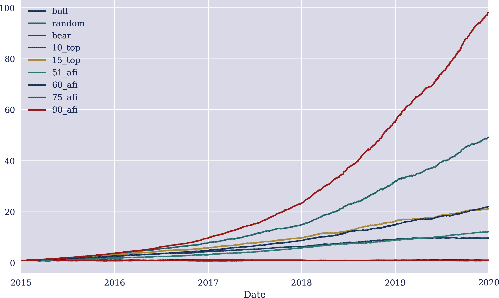

# 第十四章 金融奇点

> 我们发现自己身处战略复杂性的丛林中，被浓雾的不确定性所包围。
> 
> Nick Bostrom (2014)
> 
> “大多数交易和投资角色将消失，随着时间的推移，可能大多数需要人类服务的角色都将被自动化。”斯金纳先生说。“最终你将得到的是主要由管理者和机器运行的银行。管理者决定机器需要做什么，然后机器就会执行。”
> 
> Nick Huber (2020)

人工智能在金融行业的竞争是否会导致金融奇点？这是本章讨论的主要问题。它从“概念与定义”开始，定义了诸如*金融奇点*和*人工财务智能*（AFI）等表达。“利益所在”说明了在争夺 AFI 的竞赛中，可能积累的潜在财富。“通往金融奇点的路径”考虑了在第二章的背景下，可能导致 AFI 的路径。“正交技能与资源”认为有一些资源对于创造 AFI 的目标至关重要且正交。参与 AFI 竞争的任何人都将争夺这些资源。最后，“星际迷航还是星球大战”考虑到本章讨论的 AFI 是否只会使少数人受益还是整个人类受益。

# 概念与定义

表达*金融奇点*至少可以追溯到 2015 年希勒的博客文章。在这篇文章中，希勒写道：

> 每一种投资策略的 alpha 最终是否会趋近于零？更根本地，由于如此多的聪明人和更聪明的计算机，财务市场是否真的会变得完美，我们可以放心地坐下来，假设所有资产的定价都是正确的？
> 
> 这种想象中的状态可能被称为金融奇点，类似于假设中的未来技术奇点，即计算机取代人类智能的情况。金融奇点意味着所有投资决策最好交给计算机程序，因为专家和他们的算法已经找出了驱动市场结果的因素，并将其简化为无缝系统。

更广义地说，可以将*金融奇点*定义为计算机和算法开始接管金融及其整个行业的时间点，包括银行、资产管理公司、交易所等，而人类则作为管理者、监管者和控制者，如果有的话。

另一方面，可以定义金融奇点——根据本书的关注点，这是一个时刻，从这一时刻起，*一个交易机器人展示了一种持续预测金融市场运动的能力，达到了超人类和超机构水平，并具有前所未有的准确性*。在这种意义上，这样的交易机器人将被描述为人工狭义智能（ANI），而不是人工通用智能（AGI）或超智能（见第二章）。

可以假设，建立这样一个以交易机器人形式存在的 AFI 比建立 AGI 甚至超智能要容易得多。这一点对 AlphaZero 也是成立的，因为构建一个超过任何人类或其他代理人在下围棋游戏中的 AI 代理更容易。因此，即使目前尚不清楚是否会有符合 AGI 或超智能标准的 AI 代理存在，但无论如何，更有可能会出现一个符合 ANI 或 AFI 标准的交易机器人。

接下来，重点放在一个被定义为 AFI 的交易机器人上，以尽可能具体地讨论并嵌入本书的背景。

# 究竟是什么在危险中？

追求 AFI 可能本身就是具有挑战性和令人兴奋的。然而，如同金融界的通常情况一样，很少有倡议是出于利他动机驱动的；相反，大多数是由财务激励驱动（也就是说，硬现金）。但在建立 AFI 的竞赛中究竟有什么风险？这个问题不能确定地或一般地回答，但一些简单的计算可以为这个问题提供一些启示。

要了解拥有 AFI 相对于较差交易策略的价值，考虑以下基准：

牛市策略

一种仅在预期价格上涨时对金融工具采取多头交易策略。

随机策略

一种为特定金融工具随机选择多头或空头位置的交易策略。

熊市策略

一种仅在预期价格下跌时对金融工具采取空头交易策略。

这些基准策略将与具有以下成功特征的 AFI 进行比较：

前 X% 

AFI 在上升和下跌的前 X% 运动中预测正确，其余市场运动则随机预测。

X% 的 AFI

AFI 通过随机选择的市场运动的 X% 部分正确预测，其余市场运动则随机预测。

以下 Python 代码导入已知的时间序列数据集，其中包含多种金融工具的 EOD 数据。接下来的示例依赖于单一金融工具五年的 EOD 数据：

```py
In [1]: import random
        import numpy as np
        import pandas as pd
        from pylab import plt, mpl
        plt.style.use('seaborn')
        mpl.rcParams['savefig.dpi'] = 300
        mpl.rcParams['font.family'] = 'serif'

In [2]: url = 'https://hilpisch.com/aiif_eikon_eod_data.csv'

In [3]: raw = pd.read_csv(url, index_col=0, parse_dates=True)

In [4]: symbol = 'EUR='

In [5]: raw['bull'] = np.log(raw[symbol] / raw[symbol].shift(1))  

In [6]: data = pd.DataFrame(raw['bull']).loc['2015-01-01':]  

In [7]: data.dropna(inplace=True)

In [8]: data.info()
        <class 'pandas.core.frame.DataFrame'>
        DatetimeIndex: 1305 entries, 2015-01-01 to 2020-01-01
        Data columns (total 1 columns):
         #   Column  Non-Null Count  Dtype
        ---  ------  --------------  -----
         0   bull    1305 non-null   float64
        dtypes: float64(1)
        memory usage: 20.4 KB
```


*牛市* 基准回报（仅多头）

由于牛市策略已经由基础金融工具的对数回报定义，以下 Python 代码指定了另外两个基准策略，并为 AFI 策略的表现进行了推导。在这种情况下，考虑了多种 AFI 策略以说明 AFI 预测准确性提高的影响：

```py
In [9]: np.random.seed(100)

In [10]: data['random'] = np.random.choice([-1, 1], len(data)) * data['bull']  

In [11]: data['bear'] = -data['bull']  

In [12]: def top(t):
             top = pd.DataFrame(data['bull'])
             top.columns = ['top']
             top = top.sort_values('top')
             n = int(len(data) * t)
             top['top'].iloc[:n] = abs(top['top'].iloc[:n])
             top['top'].iloc[n:] = abs(top['top'].iloc[n:])
             top['top'].iloc[n:-n] = np.random.choice([-1, 1],
                             len(top['top'].iloc[n:-n])) * top['top'].iloc[n:-n]
             data[f'{int(t * 100)}_top'] = top.sort_index()

In [13]: for t in [0.1, 0.15]:
             top(t)  

In [14]: def afi(ratio):
             correct = np.random.binomial(1, ratio, len(data))
             random = np.random.choice([-1, 1], len(data))
             strat = np.where(correct, abs(data['bull']), random * data['bull'])
             data[f'{int(ratio * 100)}_afi'] = strat

In [15]: for ratio in [0.51, 0.6, 0.75, 0.9]:
             afi(ratio)  
```


*随机* 基准回报


*熊市* 基准回报（仅做空）


*X% top* 策略的回报


*X% AFI* 策略的回报

使用引入的标准向量化回测方法，如第十章所介绍的（忽略交易成本），可以清楚地看出预测准确率显著提高在金融方面意味着什么。考虑到“90% AFI”，它在预测上并不完美，而是在所有情况的 10%中缺乏任何优势。假设 90%的准确性导致在五年内净回报几乎是投资资本的 100 倍（在交易成本之前）。以 75%的准确性，AFI 仍将返回几乎 50 倍的投资资本（见图 14-1）。这不包括杠杆，杠杆可以在这种预测准确率存在的情况下几乎无风险地增加：

```py
In [16]: data.head()
Out[16]:                 bull    random      bear    10_top    15_top    51_afi  \
         Date
         2015-01-01  0.000413 -0.000413 -0.000413  0.000413 -0.000413  0.000413
         2015-01-02 -0.008464  0.008464  0.008464  0.008464  0.008464  0.008464
         2015-01-05 -0.005767 -0.005767  0.005767 -0.005767  0.005767 -0.005767
         2015-01-06 -0.003611 -0.003611  0.003611 -0.003611  0.003611  0.003611
         2015-01-07 -0.004299 -0.004299  0.004299  0.004299  0.004299  0.004299

                       60_afi    75_afi    90_afi
         Date
         2015-01-01  0.000413  0.000413  0.000413
         2015-01-02  0.008464  0.008464  0.008464
         2015-01-05  0.005767 -0.005767  0.005767
         2015-01-06  0.003611  0.003611  0.003611
         2015-01-07  0.004299  0.004299  0.004299

In [17]: data.sum().apply(np.exp)
Out[17]: bull       0.926676
         random     1.097137
         bear       1.079126
         10_top     9.815383
         15_top    21.275448
         51_afi    12.272497
         60_afi    22.103642
         75_afi    49.227314
         90_afi    98.176658
         dtype: float64

In [18]: data.cumsum().apply(np.exp).plot(figsize=(10, 6));
```



###### 图 14-1\. 基准和理论 AFI 策略的毛收益随时间变化

分析表明，虽然我们做了几个简化假设，但情况很严峻。时间在这个背景下起着重要作用。在一个 10 年的时间段内重新实施相同的分析使得这些数字变得更加令人印象深刻——在交易环境中几乎是难以想象的。正如以下输出所示，“90% AFI”的毛收益将是投资资本的 16,000 多倍（在交易成本之前）。复利和再投资的效应是巨大的：

```py
bull          0.782657
random        0.800253
bear          1.277698
10_top      165.066583
15_top     1026.275100
51_afi      206.639897
60_afi      691.751006
75_afi     2947.811043
90_afi    16581.526533
dtype: float64
```

# 通向金融奇点的路径

AFI 的出现将是一个非常具体的事件，发生在一个非常特定的环境中。例如，并不需要模仿人类大脑，因为 AGI 或超级智能并非主要目标。考虑到没有一个人似乎在金融市场上的交易中始终比其他人表现更出色，试图模仿人脑以实现 AFI 甚至可能是一条死胡同。也无需担心具象化的问题。AFI 可以作为软件存在，仅需连接到所需的数据和交易 API 的适当基础设施上。

另一方面，由于问题的本质，人工智能似乎是通往人工智能金融机构的一个有前途的路径：接受大量金融和其他数据，并生成关于未来价格走势的预测。这正是本书中介绍和应用的算法所关注的内容——特别是那些属于监督学习和强化学习类别的算法。

另一个选项可能是人类和机器智能的混合。虽然机器几十年来一直支持人类交易员，在许多情况下，角色已经发生了变化。人类通过提供理想的环境和最新的数据，在交易中支持机器，仅在极端情况下进行干预等。在许多情况下，机器已经完全独立地进行其算法交易决策。或者像文艺复兴技术公司创始人之一、最成功和最神秘的系统性交易对冲基金的吉姆·西蒙斯所说：“我们唯一的规则是我们永远不会覆盖计算机。”

尽管目前尚不清楚哪些路径可能导致超智能，但从今天的角度来看，人工智能最有可能铺平通往金融奇点和人工智能金融机构的道路。

# 正交技能与资源

第十三章讨论了在金融行业基于人工智能竞争背景下的资源竞争。在这一背景下，主要的四大资源包括人力资源（专家）、算法与软件、金融与替代数据，以及高性能硬件。在这种情况下，我们可以添加第五个资源，即获取其他资源所需的资本。

根据正交假设，获取这些正交技能和资源是明智的，甚至是必不可少的，无论 AFI 如何实现。参与构建 AFI 竞赛的金融机构将尽可能获取尽可能多的高质量资源，并合理地为清晰路径至少*一条*AFI 而定位自己尽可能有利。

在由人工智能驱动的金融世界中，这种行为和定位可能决定是繁荣、仅仅生存，还是离开市场。不能排除进展可能比预期快得多的可能性。尼克·博斯特罗姆在 2014 年预测，可能需要 10 年才能让人工智能在围棋比赛中击败世界冠军，基本上没有人预料到只需两年就能实现。主要的推动力是在应用强化学习到这类游戏中取得突破，至今仍受益于其他应用。金融领域也不能排除这类意外突破的可能性。

# 情景之前和之后

可以安全地假设，世界各地的每个主要金融机构和许多其他非金融实体目前都在研究并具有应用于金融的人工智能的实际经验。然而，并非所有金融行业的参与者都能同等地在第一个交易 AFI 到达之前做好准备。一些，如银行，受到监管要求的限制。其他一些则遵循不同的商业模式，例如交易所。另一些，如某些资产管理者，专注于提供低成本、商品化的投资产品，如 ETF，模仿更广泛市场指数的表现。换句话说，对每个金融机构来说，生成阿尔法并不是主要目标。

从外部看来，较大的对冲基金似乎是最有利于充分利用以人工智能为先的金融和 AI 驱动的算法交易的位置。总的来说，他们已经拥有了在这一领域中重要的许多所需资源：才华横溢且受过良好教育的人才，对交易算法的经验，几乎无限的传统和替代数据来源访问权限，以及可扩展的专业交易基础设施。如果缺少某些东西，大额的技术预算可以确保快速和有针对性的投资。

目前尚不清楚是否会有一个 AFI 首先出现，其它随后出现，或者是否可能同时出现几个 AFI。如果有几个 AFI 存在，我们可能会称之为多极或寡头垄断的情况。这些 AFI 可能主要会互相竞争，而“非-AFI”参与者可能会被边缘化。项目的发起者会努力获取优势，哪怕是微小的优势，因为这可能使一个 AFI 完全占据主导地位，并最终成为独占市场的单一者。

也可以想象从一开始就可能出现“赢家通吃”的情况。在这种情况下，一个单一的 AFI 出现并迅速达到了在金融交易中无法与任何其他竞争者匹敌的主导地位。这可能有几个原因。一个原因可能是第一个 AFI 产生了如此惊人的回报，以至于管理的资产以惊人的速度膨胀，导致预算不断增加，进而使其能够获取越来越多的相关资源。另一个原因可能是第一个 AFI 迅速达到了一个规模，在这个规模下，其行动可能对市场价格产生影响——例如，有能力操纵市场价格——从而使其成为金融市场的主要，甚至是唯一的推动力。

规定理论上可以防止一个人工智能金融机构（AFI）变得过于庞大或者获得过多的市场力量。主要问题在于这些法律在实践中是否可执行，以及它们需要如何设计才能达到预期效果。

# Star Trek 或 Star Wars

对于许多人来说，金融行业代表了纯粹的资本主义形式：一个一切以贪婪为驱动的行业。这肯定是一个高度竞争的行业，毋庸置疑。特别是交易和投资管理经常以亿万富翁的管理者和所有者来象征，他们愿意进行大赌注，并与竞争对手直接竞争，以争取下一个大交易或交易。人工智能的出现为雄心勃勃的管理者提供了丰富的工具集，将竞争推向下一个水平，正如在 第十三章 中讨论的那样。

然而，问题在于 AI 优先的金融，可能会导致金融乌托邦或者金融世界，即 AFI，是否会导致金钱在一些人手中无限积累的系统性、不可避免？理论上说，这种积累的财富可能只服务于少数人，或者潜在地可能造福于人类。不幸的是，我们必须假设，只有导致 AFI 的项目的赞助者才会直接从本章设想中的 AFI 类型中获益。因为这样的 AFI 只能通过在金融市场中交易而非发明新产品、解决重要问题或者发展业务和产业来生成利润。换句话说，仅通过在金融市场中交易以获取利润的 AFI，参与的是一个零和游戏，并不会直接增加可分配的财富。

有人可能会争辩说，例如，投资于由 AFI 管理的基金的养老基金也会从其异常高的回报中受益。但这仍然只会使某个特定的群体受益，而非整个人类。同时也有人质疑，成功的 AFI 项目的赞助者是否愿意向外部投资者开放。在这方面的一个很好的例子是文艺复兴技术管理的 Medallion 基金，是历史上表现最佳的投资工具之一。文艺复兴于 1993 年关闭了 Medallion，该基金基本上是由机器独家运行的，不接受外部投资者。其出色的表现肯定会吸引大量额外资产。然而，特定的考虑因素，如某些策略的能力，在这种情况下也发挥了作用，类似的考虑也可能适用于 AFI。

因此，尽管人们可以期望超级智能帮助克服整个人类面临的基本问题——严重的疾病、环境问题、来自外太空的未知威胁等——但 AFI 更可能导致市场中的更不平等和更激烈的竞争。与 *星际迷航* 风格的世界相比，这不排除 AFI 可能更多地导致像 *星球大战* 风格的世界，其中充斥着激烈的贸易战和对现有资源的争夺。在撰写本文时，全球贸易战（例如美国和中国之间的贸易战）似乎比以往任何时候都更加激烈，技术和人工智能是重要的战场。

# 结论

本章从高层次的视角讨论了金融奇点和人工金融智能的概念。AFI 是一个缺乏超级智能许多能力和特征的 ANI。AFI 可以与 AlphaZero 相提并论，后者是一个用于下棋或围棋等棋类游戏的 ANI。AFI 将在金融工具交易游戏中表现出色。当然，与棋类游戏相比，金融交易涉及的风险要大得多。

与 AlphaZero 类似，AI 更有可能铺平通往 AFI 的道路，而不是通过仿真人脑等替代路径。即使道路尚不完全明确，尽管无法确定单个项目已经进展到何种程度，但有几个重要的资源至关重要，无论哪种路径最终胜出：专家、算法、数据、硬件和资本。大型成功的对冲基金似乎最有可能赢得 AFI 的竞赛。

即使在本章所描绘的情况下创建 AFI 可能是不可能的，但 AI 系统地引入金融领域肯定会促进创新，并在许多情况下加剧行业竞争。AI 不是一时的潮流，而是一种终将引领行业范式转变的趋势。

# 参考资料：

本章引用的书籍和论文：

+   Bostrom, Nick. 2014\. *超级智能：路径、危险、策略*。牛津：牛津大学出版社。

+   Huber, Nick. 2020\. “AI‘只是触及金融服务潜力表面’。” *《金融时报》*，2020 年 7 月 1 日。

+   Shiller, Robert. 2015\. “金融奇点的幻象。” *耶鲁见解* (博客)。[*https://oreil.ly/cnWBh*](https://oreil.ly/cnWBh)。
