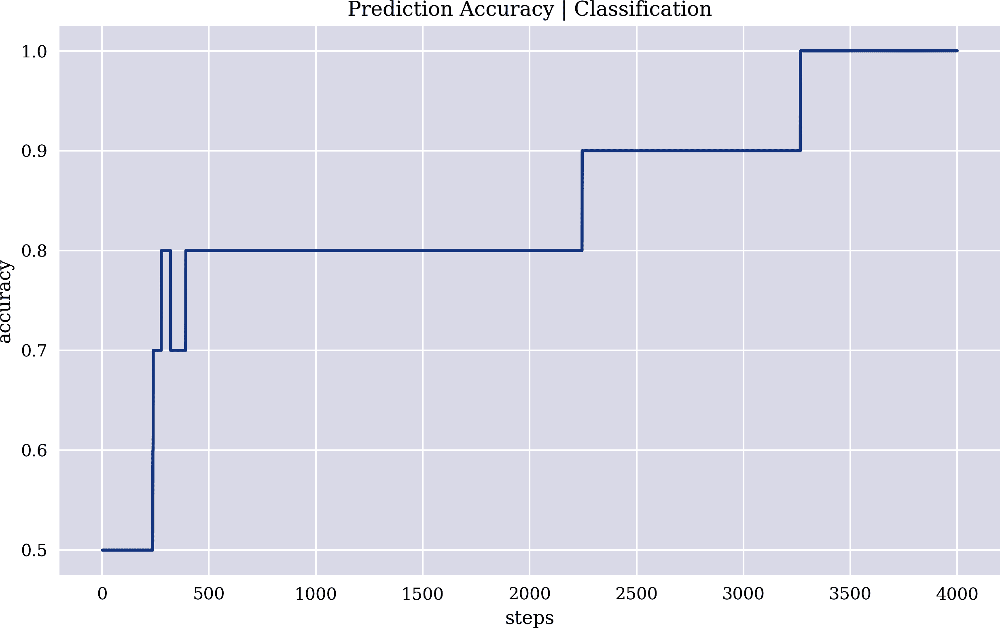

# 附录 A. 交互式神经网络

本附录通过基础的 Python 代码探讨了神经网络的基本概念，涵盖了简单和浅层神经网络。其目标是帮助读者对重要概念有一个深入的理解和直观感受，这些概念在使用标准机器学习和深度学习包时往往被高级抽象的 API 所掩盖。

本附录包含以下部分：

+   “张量和张量操作”介绍了*张量*的基础知识和在其上实施的操作。

+   “简单神经网络”讨论*简单神经网络*，即只有输入层和输出层的神经网络。

+   “浅层神经网络”关注*浅层神经网络*，即只有一个隐藏层的神经网络。

# 张量和张量操作

除了实现多个导入和配置外，以下 Python 代码展示了本附录目的上相关的四种张量类型：标量、向量、矩阵和立方体张量。在 Python 中，张量通常表示为可能是多维 `ndarray` 对象。有关更多详细信息和示例，请参阅 Chollet（2017，第二章）：

```py
In [1]: import math
        import numpy as np
        import pandas as pd
        from pylab import plt, mpl
        np.random.seed(1)
        plt.style.use('seaborn')
        mpl.rcParams['savefig.dpi'] = 300
        mpl.rcParams['font.family'] = 'serif'
        np.set_printoptions(suppress=True)

In [2]: t0 = np.array(10)  
        t0  
Out[2]: array(10)

In [3]: t1 = np.array((2, 1))  
        t1  
Out[3]: array([2, 1])

In [4]: t2 = np.arange(10).reshape(5, 2)  
        t2  
Out[4]: array([[0, 1],
               [2, 3],
               [4, 5],
               [6, 7],
               [8, 9]])

In [5]: t3 = np.arange(16).reshape(2, 4, 2)  
        t3  
Out[5]: array([[[ 0,  1],
                [ 2,  3],
                [ 4,  5],
                [ 6,  7]],

               [[ 8,  9],
                [10, 11],
                [12, 13],
                [14, 15]]])
```


标量张量


向量张量


矩阵张量


立方体张量

在神经网络的背景下，张量上的几种数学操作非常重要，例如逐元素操作或点积：

```py
In [6]: t2 + 1  
Out[6]: array([[ 1,  2],
               [ 3,  4],
               [ 5,  6],
               [ 7,  8],
               [ 9, 10]])

In [7]: t2 + t2  
Out[7]: array([[ 0,  2],
               [ 4,  6],
               [ 8, 10],
               [12, 14],
               [16, 18]])

In [8]: t1
Out[8]: array([2, 1])

In [9]: t2
Out[9]: array([[0, 1],
               [2, 3],
               [4, 5],
               [6, 7],
               [8, 9]])

In [10]: np.dot(t2, t1)  
Out[10]: array([ 1,  7, 13, 19, 25])

In [11]: t2[:, 0] * 2 + t2[:, 1] * 1  
Out[11]: array([ 1,  7, 13, 19, 25])

In [12]: np.dot(t1, t2.T)  
Out[12]: array([ 1,  7, 13, 19, 25])
```


广播操作


逐元素操作


用 `NumPy` 函数进行点积


显式符号中的点积

# 简单神经网络

理解张量的基础后，考虑仅有输入层和输出层的简单神经网络。

## 估计

第一个问题是一个*估计问题*，其标签是实值的：

```py
In [13]: features = 3  

In [14]: samples = 5  

In [15]: l0 = np.random.random((samples, features))  
         l0  
Out[15]: array([[0.417022  , 0.72032449, 0.00011437],
                [0.30233257, 0.14675589, 0.09233859],
                [0.18626021, 0.34556073, 0.39676747],
                [0.53881673, 0.41919451, 0.6852195 ],
                [0.20445225, 0.87811744, 0.02738759]])

In [16]: w = np.random.random((features, 1))  
         w  
Out[16]: array([[0.67046751],
                [0.4173048 ],
                [0.55868983]])

In [17]: l2 = np.dot(l0, w)  
         l2  
Out[17]: array([[0.58025848],
                [0.31553474],
                [0.49075552],
                [0.91901616],
                [0.51882238]])

In [18]: y = l0[:, 0] * 0.5 + l0[:, 1]   
         y = y.reshape(-1, 1)  
         y  
Out[18]: array([[0.9288355 ],
                [0.29792218],
                [0.43869083],
                [0.68860288],
                [0.98034356]])
```


特征数量


样本数量


随机输入层


随机权重


通过点积的输出层


待学习的标签

下面的 Python 代码逐步展示了一个学习过程，从计算误差到在更新权重后计算均方误差（MSE）：

```py
In [19]: e = l2 - y  
         e  
Out[19]: array([[-0.34857702],
                [ 0.01761256],
                [ 0.05206469],
                [ 0.23041328],
                [-0.46152118]])

In [20]: mse = (e ** 2).mean()  
         mse  
Out[20]: 0.07812379019517127

In [21]: d = e * 1  
         d  
Out[21]: array([[-0.34857702],
                [ 0.01761256],
                [ 0.05206469],
                [ 0.23041328],
                [-0.46152118]])

In [22]: a = 0.01  

In [23]: u = a * np.dot(l0.T, d)  
         u  
Out[23]: array([[-0.0010055 ],
                [-0.00539194],
                [ 0.00167488]])

In [24]: w  
Out[24]: array([[0.67046751],
                [0.4173048 ],
                [0.55868983]])

In [25]: w -= u  

In [26]: w  
Out[26]: array([[0.67147301],
                [0.42269674],
                [0.55701495]])

In [27]: l2 = np.dot(l0, w)  

In [28]: e = l2 - y  

In [29]: mse = (e ** 2).mean()  
         mse  
Out[29]: 0.07681782193617318
```


估计误差


给定估计的均方误差值


反向传播（这里 `d = e`）¹


学习率


更新值


更新前后的权重


更新后的新输出层（估计）


更新后的新误差值


更新后的新均方误差值

为了提高估计精度，通常需要重复相同的步骤多次。在下面的代码中，学习率增加，并且该过程执行了数百次。最终的均方误差值非常低，估计非常好：

```py
In [30]: a = 0.025  

In [31]: w = np.random.random((features, 1))  
         w  
Out[31]: array([[0.14038694],
                [0.19810149],
                [0.80074457]])

In [32]: steps = 800  

In [33]: for s in range(1, steps + 1):
             l2 = np.dot(l0, w)
             e = l2 - y
             u = a * np.dot(l0.T, e)
             w -= u
             mse = (e ** 2).mean()
             if s % 50 == 0:
                 print(f'step={s:3d} | mse={mse:.5f}')
         step= 50 | mse=0.03064
         step=100 | mse=0.01002
         step=150 | mse=0.00390
         step=200 | mse=0.00195
         step=250 | mse=0.00124
         step=300 | mse=0.00092
         step=350 | mse=0.00074
         step=400 | mse=0.00060
         step=450 | mse=0.00050
         step=500 | mse=0.00041
         step=550 | mse=0.00035
         step=600 | mse=0.00029
         step=650 | mse=0.00024
         step=700 | mse=0.00020
         step=750 | mse=0.00017
         step=800 | mse=0.00014

In [34]: l2 - y  
Out[34]: array([[-0.01240168],
                [-0.01606065],
                [ 0.01274072],
                [-0.00087794],
                [ 0.01072845]])

In [35]: w  
Out[35]: array([[0.41907514],
                [1.02965827],
                [0.04421136]])
```


调整后的学习率


初始随机权重


学习步骤的数量


估计的残差误差


神经网络的最终权重

## 分类

第二个问题是一个二元整数值标签的*分类问题*。为了改善学习算法的性能，输出层的激活采用了*sigmoid 函数*。图 A-1 展示了 sigmoid 函数及其一阶导数，并将其与简单的阶跃函数进行了比较：

```py
In [36]: def sigmoid(x, deriv=False):
             if deriv:
                 return sigmoid(x) * (1 - sigmoid(x))
             return 1 / (1 + np.exp(-x))

In [37]: x = np.linspace(-10, 10, 100)

In [38]: plt.figure(figsize=(10, 6))
         plt.plot(x, np.where(x > 0, 1, 0), 'y--', label='step function')
         plt.plot(x, sigmoid(x), 'r', label='sigmoid')
         plt.plot(x, sigmoid(x, True), '--', label='derivative')
         plt.legend();
```



###### 图 A-1\. 阶跃函数、sigmoid 函数及其一阶导数

为了简化问题，分类问题基于随机二进制特征和二进制标签数据。除了不同的特征和标签数据外，只有输出层的激活与估计问题有所不同。更新神经网络权重的学习算法基本相同：

```py
In [39]: features = 4
         samples = 5

In [40]: l0 = np.random.randint(0, 2, (samples, features))  
         l0  
Out[40]: array([[1, 1, 1, 1],
                [0, 1, 1, 0],
                [0, 1, 0, 0],
                [1, 1, 1, 0],
                [1, 0, 0, 1]])

In [41]: w = np.random.random((features, 1))
         w
Out[41]: array([[0.42110763],
                [0.95788953],
                [0.53316528],
                [0.69187711]])

In [42]: l2 = sigmoid(np.dot(l0, w))  
         l2
Out[42]: array([[0.93112111],
                [0.81623654],
                [0.72269905],
                [0.87126189],
                [0.75268514]])

In [43]: l2.round()
Out[43]: array([[1.],
                [1.],
                [1.],
                [1.],
                [1.]])

In [44]: y = np.random.randint(0, 2, samples)  
         y = y.reshape(-1, 1)  
         y  
Out[44]: array([[1],
                [1],
                [0],
                [0],
                [0]])

In [45]: e = l2 - y
         e
Out[45]: array([[-0.06887889],
                [-0.18376346],
                [ 0.72269905],
                [ 0.87126189],
                [ 0.75268514]])

In [46]: mse = (e ** 2).mean()
         mse
Out[46]: 0.37728788783411127

In [47]: a = 0.02

In [48]: d = e * sigmoid(l2, True)  
         d
Out[48]: array([[-0.01396723],
                [-0.03906484],
                [ 0.15899479],
                [ 0.18119776],
                [ 0.16384833]])

In [49]: u = a * np.dot(l0.T, d)
         u
Out[49]: array([[0.00662158],
                [0.00574321],
                [0.00256331],
                [0.00299762]])

In [50]: w
Out[50]: array([[0.42110763],
                [0.95788953],
                [0.53316528],
                [0.69187711]])

In [51]: w -= u

In [52]: w
Out[52]: array([[0.41448605],
                [0.95214632],
                [0.53060197],
                [0.68887949]])
```


具有二进制特征的输入层


sigmoid 激活的输出层


二进制标签数据


通过一阶导数进行反向传播

与之前一样，需要进行更多次迭代的循环来获得准确的分类结果。根据随机数的选择，像下面的例子中可能会达到 100%的准确率：

```py
In [53]: steps = 3001

In [54]: a = 0.025

In [55]: w = np.random.random((features, 1))
         w
Out[55]: array([[0.41253884],
                [0.03417131],
                [0.62402999],
                [0.66063573]])

In [56]: for s in range(1, steps + 1):
             l2 = sigmoid(np.dot(l0, w))
             e = l2 - y
             d = e * sigmoid(l2, True)
             u = a * np.dot(l0.T, d)
             w -= u
             mse = (e ** 2).mean()
             if s % 200 == 0:
                 print(f'step={s:4d} | mse={mse:.4f}')
         step= 200 | mse=0.1899
         step= 400 | mse=0.1572
         step= 600 | mse=0.1349
         step= 800 | mse=0.1173
         step=1000 | mse=0.1029
         step=1200 | mse=0.0908
         step=1400 | mse=0.0806
         step=1600 | mse=0.0720
         step=1800 | mse=0.0646
         step=2000 | mse=0.0583
         step=2200 | mse=0.0529
         step=2400 | mse=0.0482
         step=2600 | mse=0.0441
         step=2800 | mse=0.0405
         step=3000 | mse=0.0373

In [57]: l2
Out[57]: array([[0.71220474],
                [0.92308745],
                [0.16614971],
                [0.20193503],
                [0.17094583]])

In [58]: l2.round() == y
Out[58]: array([[ True],
                [ True],
                [ True],
                [ True],
                [ True]])

In [59]: w
Out[59]: array([[-3.86002022],
                [-1.61346536],
                [ 4.09895004],
                [ 2.28088807]])
```

# 浅层神经网络

前一节的神经网络仅由输入层和输出层组成。换句话说，输入层和输出层直接相连。*浅层神经网络*在输入层和输出层之间有一个隐藏层。考虑到这种结构，需要两组权重来连接神经网络中的三层。本节分析了用于估计和分类的浅层神经网络。

## 估计

如同前一节，首先解决估计问题。以下 Python 代码构建了具有三层和两组权重的神经网络。这第一个步骤序列通常称为*前向传播*。在这种情况下，输入层矩阵通常具有满秩，表明可以实现完美的估计结果：

```py
In [60]: features = 5
         samples = 5

In [61]: l0 = np.random.random((samples, features))  
         l0  
Out[61]: array([[0.29849529, 0.44613451, 0.22212455, 0.07336417, 0.46923853],
                [0.09617226, 0.90337017, 0.11949047, 0.52479938, 0.083623  ],
                [0.91686133, 0.91044838, 0.29893011, 0.58438912, 0.56591203],
                [0.61393832, 0.95653566, 0.26097898, 0.23101542, 0.53344849],
                [0.94993814, 0.49305959, 0.54060051, 0.7654851 , 0.04534573]])

In [62]: np.linalg.matrix_rank(l0)  
Out[62]: 5

In [63]: units = 3  

In [64]: w0 = np.random.random((features, units))  
         w0  
Out[64]: array([[0.13996612, 0.79240359, 0.02980136],
                [0.88312548, 0.54078819, 0.44798018],
                [0.89213587, 0.37758434, 0.53842469],
                [0.65229888, 0.36126102, 0.57100856],
                [0.63783648, 0.12631489, 0.69020459]])

In [65]: l1 = np.dot(l0, w0)  
         l1  
Out[65]: array([[0.98109007, 0.64743919, 0.69411448],
                [1.31351565, 0.81000928, 0.82927653],
                [1.94121167, 1.61435539, 1.32042417],
                [1.65444429, 1.25315104, 1.08742312],
                [1.57892999, 1.50576525, 1.00865941]])

In [66]: w1 = np.random.random((units, 1))  
         w1  
Out[66]: array([[0.6477494 ],
                [0.35393909],
                [0.76323305]])

In [67]: l2 = np.dot(l1, w1)  
         l2  
Out[67]: array([[1.39442565],
                [1.77045418],
                [2.83659354],
                [2.3451617 ],
                [2.32554234]])

In [68]: y = np.random.random((samples, 1))  
         y  
Out[68]: array([[0.35653172],
                [0.75278835],
                [0.88134183],
                [0.01166919],
                [0.49810907]])
```


随机输入层


输入层矩阵的秩


隐藏单元的数量


给定`features`和`units`参数的第一组随机权重


给定输入层和权重的隐藏层


第二组随机权重


给定隐藏层和权重的输出层


随机标签数据

第二个步骤序列通常称为*反向传播*，与估计误差相关。两组权重将被更新，从输出层开始更新连接隐藏层和输出层之间的权重`w1`。随后，在考虑更新后的权重`w1`之后，将更新连接输入层和隐藏层之间的权重`w0`：

```py
In [69]: e2 = l2 - y  
         e2  
Out[69]: array([[1.03789393],
                [1.01766583],
                [1.95525171],
                [2.33349251],
                [1.82743327]])

In [70]: mse = (e2 ** 2).mean()
         mse
Out[70]: 2.9441152813655007

In [71]: d2 = e2 * 1  
         d2  
Out[71]: array([[1.03789393],
                [1.01766583],
                [1.95525171],
                [2.33349251],
                [1.82743327]])

In [72]: a = 0.05

In [73]: u2 = a * np.dot(l1.T, d2)  
         u2  
Out[73]: array([[0.64482837],
                [0.51643336],
                [0.42634283]])

In [74]: w1  
Out[74]: array([[0.6477494 ],
                [0.35393909],
                [0.76323305]])

In [75]: w1 -= u2  

In [76]: w1  
Out[76]: array([[ 0.00292103],
                [-0.16249427],
                [ 0.33689022]])

In [77]: e1 = np.dot(d2, w1.T)  

In [78]: d1 = e1 * 1  

In [79]: u1 = a * np.dot(l0.T, d1)  

In [80]: w0 -= u1  

In [81]: w0  
Out[81]: array([[ 0.13918198,  0.8360247 , -0.06063583],
                [ 0.88220599,  0.59193836,  0.34193342],
                [ 0.89176585,  0.39816855,  0.49574861],
                [ 0.65175984,  0.39124762,  0.50883904],
                [ 0.63739741,  0.15074009,  0.63956519]])
```


更新过程的权重集`w1`


更新过程的权重集`w0`

以下 Python 代码实现了学习（即网络权重的更新）作为一个`for`循环，迭代次数更多。通过增加迭代次数，可以使估计结果任意精确：

```py
In [82]: a = 0.015
         steps = 5000

In [83]: for s in range(1, steps + 1):
             l1 = np.dot(l0, w0)
             l2 = np.dot(l1, w1)
             e2 = l2 - y
             u2 = a * np.dot(l1.T, e2)
             w1 -= u2
             e1 = np.dot(e2, w1.T)
             u1 = a * np.dot(l0.T, e1)
             w0 -= u1
             mse = (e2 ** 2).mean()
             if s % 750 == 0:
                 print(f'step={s:5d} | mse={mse:.6f}')
         step=  750 | mse=0.039263
         step= 1500 | mse=0.009867
         step= 2250 | mse=0.000666
         step= 3000 | mse=0.000027
         step= 3750 | mse=0.000001
         step= 4500 | mse=0.000000

In [84]: l2
Out[84]: array([[0.35634333],
                [0.75275415],
                [0.88135507],
                [0.01179945],
                [0.49809208]])

In [85]: y
Out[85]: array([[0.35653172],
                [0.75278835],
                [0.88134183],
                [0.01166919],
                [0.49810907]])

In [86]: (l2 - y)
Out[86]: array([[-0.00018839],
                [-0.00003421],
                [ 0.00001324],
                [ 0.00013025],
                [-0.00001699]])
```

## 分类

接下来是分类问题。在这种情况下，实现与估计问题非常接近。但是，再次使用 Sigmoid 函数进行激活。以下 Python 代码首先生成随机样本数据：

```py
In [87]: features = 5
         samples = 10
         units = 10

In [88]: np.random.seed(200)
         l0 = np.random.randint(0, 2, (samples, features))  
         w0 = np.random.random((features, units))
         w1 = np.random.random((units, 1))
         y = np.random.randint(0, 2, (samples, 1))  

In [89]: l0  
Out[89]: array([[0, 1, 0, 0, 0],
                [1, 0, 1, 1, 0],
                [1, 1, 1, 1, 0],
                [0, 0, 1, 1, 1],
                [1, 1, 1, 1, 0],
                [1, 1, 0, 1, 0],
                [0, 1, 0, 1, 0],
                [0, 1, 0, 0, 1],
                [0, 1, 1, 1, 1],
                [0, 0, 1, 0, 0]])

In [90]: y  
Out[90]: array([[1],
                [0],
                [1],
                [0],
                [1],
                [0],
                [0],
                [0],
                [1],
                [1]])
```


二进制特征数据（输入层）


二进制标签数据

学习算法的实现再次利用`for`循环来重复权重更新步骤，直到必要的次数。根据为特征和标签数据生成的随机数，经过足够的学习步骤后可以达到 100%的准确率：

```py
In [91]: a = 0.1
         steps = 20000

In [92]: for s in range(1, steps + 1):
             l1 = sigmoid(np.dot(l0, w0))  
             l2 = sigmoid(np.dot(l1, w1))  
             e2 = l2 - y  
             d2 = e2 * sigmoid(l2, True)  
             u2 = a * np.dot(l1.T, d2)  
             w1 -= u2  
             e1 = np.dot(d2, w1.T)  
             d1 = e1 * sigmoid(l1, True)  
             u1 = a * np.dot(l0.T, d1)  
             w0 -= u1  
             mse = (e2 ** 2).mean()
             if s % 2000 == 0:
                 print(f'step={s:5d} | mse={mse:.5f}')
         step= 2000 | mse=0.00933
         step= 4000 | mse=0.02399
         step= 6000 | mse=0.05134
         step= 8000 | mse=0.00064
         step=10000 | mse=0.00013
         step=12000 | mse=0.00009
         step=14000 | mse=0.00007
         step=16000 | mse=0.00007
         step=18000 | mse=0.00012
         step=20000 | mse=0.00015

In [93]: acc = l2.round() == y  
         acc  
Out[93]: array([[ True],
                [ True],
                [ True],
                [ True],
                [ True],
                [ True],
                [ True],
                [ True],
                [ True],
                [ True]])

In [94]: sum(acc) / len(acc)  
Out[94]: array([1.])
```


前向传播


反向传播


分类的准确性

# 参考资料

附录中引用的书籍：

+   Chollet, Francois. 2017\. *Python 深度学习*. Shelter Island: Manning.

¹ 由于没有隐藏层，反向传播的导数值为 1。输出层和输入层直接连接。
