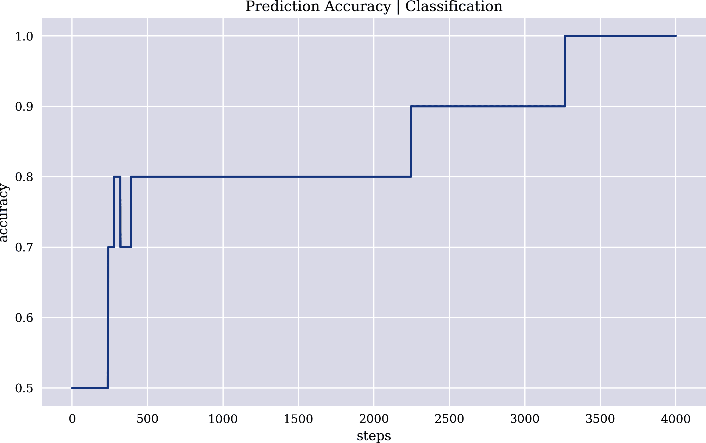

# 附录 B. 神经网络类

基于附录 A 的基础，本附录提供了类似于`scikit-learn`等包的 API 的简单基于类的神经网络实现。该实现基于纯粹简单的 Python 代码，仅供示例和教学之用。本附录中介绍的类不能替代标准 Python 包中发现的健壮、高效和可伸缩的实现，如`scikit-learn`或`TensorFlow`结合`Keras`。

附录包括以下部分：

+   “激活函数”介绍了一个带有不同激活函数的 Python 函数。

+   “简单神经网络”介绍了一个用于*简单神经网络*的 Python 类。

+   “浅层神经网络”介绍了一个用于*浅层神经网络*的 Python 类。

+   “预测市场方向”将浅层神经网络类应用于金融数据。

本附录中的实现和示例都非常简单直接。这些 Python 类并不适合解决更大的估计或分类问题。其主要目的是展示从头开始易于理解的 Python 实现。

# 激活函数

附录 A 隐式或显式地使用了两个激活函数：线性函数和 Sigmoid 函数。Python 函数`activation`添加了`relu`（修正线性单元）和`softplus`函数作为选项。对于所有这些激活函数，也定义了第一导数：

```py
In [1]: import math
        import numpy as np
        import pandas as pd
        from pylab import plt, mpl
        plt.style.use('seaborn')
        mpl.rcParams['savefig.dpi'] = 300
        mpl.rcParams['font.family'] = 'serif'
        np.set_printoptions(suppress=True)

In [2]: def activation(x, act='linear', deriv=False):
            if act == 'sigmoid':
                if deriv:
                    out = activation(x, 'sigmoid', False)
                    return out * (1 - out)
                return 1 / (1 + np.exp(-x))
            elif act == 'relu':
                if deriv:
                    return np.where(x > 0, 1, 0)
                return np.maximum(x, 0)
            elif act == 'softplus':
                if deriv:
                    return activation(x, act='sigmoid')
                return np.log(1 + np.exp(x))
            elif act == 'linear':
                if deriv:
                    return 1
                return x
            else:
                raise ValueError('Activation function not known.')

In [3]: x = np.linspace(-1, 1, 20)

In [4]: activation(x, 'sigmoid')
Out[4]: array([0.26894142, 0.29013328, 0.31228169, 0.33532221, 0.35917484,
               0.38374461, 0.40892261, 0.43458759, 0.46060812, 0.48684514,
               0.51315486, 0.53939188, 0.56541241, 0.59107739, 0.61625539,
               0.64082516, 0.66467779, 0.68771831, 0.70986672, 0.73105858])

In [5]: activation(x, 'sigmoid', True)
Out[5]: array([0.19661193, 0.20595596, 0.21476184, 0.22288122, 0.23016827,
               0.23648468, 0.24170491, 0.24572122, 0.24844828, 0.24982695,
               0.24982695, 0.24844828, 0.24572122, 0.24170491, 0.23648468,
               0.23016827, 0.22288122, 0.21476184, 0.20595596, 0.19661193])
```

# 简单神经网络

本节介绍了一个*简单神经网络*类，其 API 与标准 Python 包（特别是`scikit-learn`和`Keras`）中的模型类似。考虑到类`sinn`的 Python 代码如下所示。它实现了一个简单的神经网络，并定义了两个主要方法`.fit()`和`.predict()`。`.metrics()`方法计算了估计的均方误差（MSE）和分类的准确度等典型性能指标。该类还实现了前向传播和反向传播步骤的两个方法：

```py
In [6]: class sinn:
            def __init__(self, act='linear', lr=0.01, steps=100,
                         verbose=False, psteps=200):
                self.act = act
                self.lr = lr
                self.steps = steps
                self.verbose = verbose
                self.psteps = psteps
            def forward(self):
                ''' Forward propagation.
 '''
                self.l2 = activation(np.dot(self.l0, self.w), self.act)
            def backward(self):
                ''' Backward propagation.
 '''
                self.e = self.l2 - self.y
                d = self.e * activation(self.l2, self.act, True)
                u = self.lr * np.dot(self.l0.T, d)
                self.w -= u
            def metrics(self, s):
                ''' Performance metrics.
 '''
                mse = (self.e ** 2).mean()
                acc = float(sum(self.l2.round() == self.y) / len(self.y))
                self.res = self.res.append(
                    pd.DataFrame({'mse': mse, 'acc': acc}, index=[s,])
                )
                if s % self.psteps == 0 and self.verbose:
                        print(f'step={s:5d} | mse={mse:.6f}')
                        print(f'           | acc={acc:.6f}')
            def fit(self, l0, y, steps=None, seed=None):
                ''' Fitting step.
 '''
                self.l0 = l0
                self.y = y
                if steps is None:
                    steps = self.steps
                self.res = pd.DataFrame()
                samples, features = l0.shape
                if seed is not None:
                    np.random.seed(seed)
                self.w = np.random.random((features, 1))
                for s in range(1, steps + 1):
                    self.forward()
                    self.backward()
                    self.metrics(s)
            def predict(self, X):
                ''' Prediction step.
 '''
                return activation(np.dot(X, self.w), self.act)
```

## 估计

首先是可以通过回归技术解决的估计问题：

```py
In [7]: features = 5
        samples = 5

In [8]: np.random.seed(10)
        l0 = np.random.standard_normal((samples, features))
        l0
Out[8]: array([[ 1.3315865 ,  0.71527897, -1.54540029, -0.00838385,  0.62133597],
               [-0.72008556,  0.26551159,  0.10854853,  0.00429143, -0.17460021],
               [ 0.43302619,  1.20303737, -0.96506567,  1.02827408,  0.22863013],
               [ 0.44513761, -1.13660221,  0.13513688,  1.484537  , -1.07980489],
               [-1.97772828, -1.7433723 ,  0.26607016,  2.38496733,  1.12369125]])

In [9]: np.linalg.matrix_rank(l0)
Out[9]: 5

In [10]: y = np.random.random((samples, 1))
         y
Out[10]: array([[0.8052232 ],
                [0.52164715],
                [0.90864888],
                [0.31923609],
                [0.09045935]])

In [11]: reg = np.linalg.lstsq(l0, y, rcond=-1)[0]  

In [12]: reg  
Out[12]: array([[-0.74919308],
                [ 0.00146473],
                [-1.49864704],
                [-0.02498757],
                [-0.82793882]])

In [13]: np.allclose(np.dot(l0, reg), y)  
Out[13]: True
```


通过回归的精确解决方案

将`sinn`类应用于估计问题需要进行多次学习步骤的努力。但是，通过增加步骤的数量，可以使估计任意精确：

```py
In [14]: model = sinn(lr=0.015, act='linear', steps=6000,
                     verbose=True, psteps=1000)

In [15]: %time model.fit(l0, y, seed=100)
         step= 1000 | mse=0.008086
                    | acc=0.000000
         step= 2000 | mse=0.000545
                    | acc=0.000000
         step= 3000 | mse=0.000037
                    | acc=0.000000
         step= 4000 | mse=0.000002
                    | acc=0.000000
         step= 5000 | mse=0.000000
                    | acc=0.000000
         step= 6000 | mse=0.000000
                    | acc=0.000000
         CPU times: user 5.23 s, sys: 29.7 ms, total: 5.26 s
         Wall time: 5.26 s

In [16]: model.predict(l0)
Out[16]: array([[0.80512489],
                [0.52144986],
                [0.90872498],
                [0.31919803],
                [0.09045743]])

In [17]: model.predict(l0) - y  
Out[17]: array([[-0.0000983 ],
                [-0.00019729],
                [ 0.0000761 ],
                [-0.00003806],
                [-0.00000191]])
```


神经网络估计的残差误差

## 分类

其次是一个分类问题，也可以用`sinn`类来解决。在这里，标准的回归技术通常无效。对于随机特征和标签集合，`sinn`模型达到了 100%的准确率。同样地，需要大量的重复学习步骤。图 B-1 显示了预测准确率随学习步骤数量变化的情况：

```py
In [18]: features = 5
         samples = 10

In [19]: np.random.seed(3)
         l0 = np.random.randint(0, 2, (samples, features))
         l0
Out[19]: array([[0, 0, 1, 1, 0],
                [0, 0, 1, 1, 1],
                [0, 1, 1, 1, 0],
                [1, 1, 0, 0, 0],
                [0, 1, 1, 0, 0],
                [0, 1, 0, 0, 0],
                [0, 1, 0, 1, 1],
                [0, 1, 0, 0, 1],
                [1, 0, 0, 1, 0],
                [1, 0, 1, 1, 1]])

In [20]: np.linalg.matrix_rank(l0)
Out[20]: 5

In [21]: y = np.random.randint(0, 2, (samples, 1))
         y
Out[21]: array([[1],
                [0],
                [1],
                [0],
                [0],
                [1],
                [1],
                [1],
                [0],
                [0]])

In [22]: model = sinn(lr=0.01, act='sigmoid')  

In [23]: %time model.fit(l0, y, 4000)
         CPU times: user 3.57 s, sys: 9.6 ms, total: 3.58 s
         Wall time: 3.59 s

In [24]: model.l2
Out[24]: array([[0.51118415],
                [0.34390898],
                [0.84733758],
                [0.07601979],
                [0.40505454],
                [0.84145926],
                [0.95592461],
                [0.72680243],
                [0.11219587],
                [0.00806003]])

In [25]: model.predict(l0).round() == y  
Out[25]: array([[ True],
                [ True],
                [ True],
                [ True],
                [ True],
                [ True],
                [ True],
                [ True],
                [ True],
                [ True]])

In [26]: ax = model.res['acc'].plot(figsize=(10, 6),
                     title='Prediction Accuracy | Classification')
         ax.set(xlabel='steps', ylabel='accuracy');
```


sigmoid 函数用于激活


在这个特定数据集上表现完美



###### 图 B-1\. 预测准确率与学习步骤数量的关系

# 浅层神经网络

本节应用`shnn`类，该类实现了具有一个隐藏层的*浅层神经网络*，用于估计和分类问题。该类结构类似于前一节中的`sinn`类：

```py
In [27]: class shnn:
             def __init__(self, units=12, act='linear', lr=0.01, steps=100,
                          verbose=False, psteps=200, seed=None):
                 self.units = units
                 self.act = act
                 self.lr = lr
                 self.steps = steps
                 self.verbose = verbose
                 self.psteps = psteps
                 self.seed = seed
             def initialize(self):
                 ''' Initializes the random weights.
 '''
                 if self.seed is not None:
                     np.random.seed(self.seed)
                 samples, features = self.l0.shape
                 self.w0 = np.random.random((features, self.units))
                 self.w1 = np.random.random((self.units, 1))
             def forward(self):
                 ''' Forward propagation.
 '''
                 self.l1 = activation(np.dot(self.l0, self.w0), self.act)
                 self.l2 = activation(np.dot(self.l1, self.w1), self.act)
             def backward(self):
                 ''' Backward propagation.
 '''
                 self.e = self.l2 - self.y
                 d2 = self.e * activation(self.l2, self.act, True)
                 u2 = self.lr * np.dot(self.l1.T, d2)
                 self.w1 -= u2
                 e1 = np.dot(d2, self.w1.T)
                 d1 = e1 * activation(self.l1, self.act, True)
                 u1 = self.lr * np.dot(self.l0.T, d1)
                 self.w0 -= u1
             def metrics(self, s):
                 ''' Performance metrics.
 '''
                 mse = (self.e ** 2).mean()
                 acc = float(sum(self.l2.round() == self.y) / len(self.y))
                 self.res = self.res.append(
                     pd.DataFrame({'mse': mse, 'acc': acc}, index=[s,])
                 )
                 if s % self.psteps == 0 and self.verbose:
                         print(f'step={s:5d} | mse={mse:.5f}')
                         print(f'           | acc={acc:.5f}')
             def fit(self, l0, y, steps=None):
                 ''' Fitting step.
 '''
                 self.l0 = l0
                 self.y = y
                 if steps is None:
                     steps = self.steps
                 self.res = pd.DataFrame()
                 self.initialize()
                 self.forward()
                 for s in range(1, steps + 1):
                     self.backward()
                     self.forward()
                     self.metrics(s)
             def predict(self, X):
                 ''' Prediction step.
 '''
                 l1 = activation(np.dot(X, self.w0), self.act)
                 l2 = activation(np.dot(l1, self.w1), self.act)
                 return l2
```

## 估计

再次，估计问题排在首位。对于 5 个特征和 10 个样本，完美的回归解决方案不太可能存在。因此，相对于回归值，MSE 值相对较高：

```py
In [28]: features = 5
         samples = 10

In [29]: l0 = np.random.standard_normal((samples, features))

In [30]: np.linalg.matrix_rank(l0)
Out[30]: 5

In [31]: y = np.random.random((samples, 1))

In [32]: reg = np.linalg.lstsq(l0, y, rcond=-1)[0]

In [33]: (np.dot(l0, reg)  - y)
Out[33]: array([[-0.10226341],
                [-0.42357164],
                [-0.25150491],
                [-0.30984143],
                [-0.85213261],
                [-0.13791373],
                [-0.52336502],
                [-0.50304204],
                [-0.7728686 ],
                [-0.3716898 ]])

In [34]: ((np.dot(l0, reg)  - y) ** 2).mean()
Out[34]: 0.23567187607888118
```

然而，基于`shnn`类的浅层神经网络估计表现相当良好，并显示出与回归值相比相对较低的 MSE 值：

```py
In [35]: model = shnn(lr=0.01, units=16, act='softplus',
                      verbose=True, psteps=2000, seed=100)

In [36]: %time model.fit(l0, y, 8000)
         step= 2000 | mse=0.00205
                    | acc=0.00000
         step= 4000 | mse=0.00098
                    | acc=0.00000
         step= 6000 | mse=0.00043
                    | acc=0.00000
         step= 8000 | mse=0.00022
                    | acc=0.00000
         CPU times: user 8.15 s, sys: 69.2 ms, total: 8.22 s
         Wall time: 8.3 s

In [37]: model.l2 - y
Out[37]: array([[-0.00390976],
                [-0.00522077],
                [ 0.02053932],
                [-0.0042113 ],
                [-0.0006624 ],
                [-0.01001395],
                [ 0.01783203],
                [-0.01498316],
                [-0.0177866 ],
                [ 0.02782519]])
```

## 分类

分类示例将估计的数字应用四舍五入处理。浅层神经网络迅速收敛，以 100%的准确率预测标签（见图 B-2）：

```py
In [38]: model = shnn(lr=0.025, act='sigmoid', steps=200,
                      verbose=True, psteps=50, seed=100)

In [39]: l0.round()
Out[39]: array([[ 0., -1., -2.,  1., -0.],
                [-1., -2., -0., -0., -2.],
                [ 0.,  1., -1., -1., -1.],
                [-0.,  0., -1., -0., -1.],
                [ 1., -1.,  1.,  1., -1.],
                [ 1., -1.,  1., -2.,  1.],
                [-1., -0.,  1., -1.,  1.],
                [ 1.,  2., -1., -0., -0.],
                [-1.,  0.,  0.,  0.,  2.],
                [ 0.,  0., -0.,  1.,  1.]])

In [40]: np.linalg.matrix_rank(l0)
Out[40]: 5

In [41]: y.round()
Out[41]: array([[0.],
                [1.],
                [1.],
                [1.],
                [1.],
                [1.],
                [0.],
                [1.],
                [0.],
                [0.]])

In [42]: model.fit(l0.round(), y.round())
         step=   50 | mse=0.26774
                    | acc=0.60000
         step=  100 | mse=0.22556
                    | acc=0.60000
         step=  150 | mse=0.19939
                    | acc=0.70000
         step=  200 | mse=0.16924
                    | acc=1.00000

In [43]: ax = model.res.plot(figsize=(10, 6), secondary_y='mse')
         ax.get_legend().set_bbox_to_anchor((0.2, 0.5));
```


###### 图 B-2\. 浅层神经网络（分类）的性能指标

# 预测市场方向

本节应用`shnn`类来预测 EUR/USD 汇率未来的走向。分析仅适用于样本内，以说明`shnn`在实际数据中的应用。详见第十章，了解更真实的基于预测策略的向量化回测设置实现。

以下 Python 代码导入了金融数据——10 年的 EOD 数据，并创建了滞后、归一化的对数收益率作为特征。标签数据是价格序列方向的二进制数据集：

```py
In [44]: url = 'http://hilpisch.com/aiif_eikon_eod_data.csv'

In [45]: raw = pd.read_csv(url, index_col=0, parse_dates=True).dropna()

In [46]: sym = 'EUR='

In [47]: data = pd.DataFrame(raw[sym])

In [48]: lags = 5
         cols = []
         data['r'] = np.log(data / data.shift(1))
         data['d'] = np.where(data['r'] > 0, 1, 0)  
         for lag in range(1, lags + 1):
             col = f'lag_{lag}'
             data[col] = data['r'].shift(lag)  
             cols.append(col)
         data.dropna(inplace=True)
         data[cols] = (data[cols] - data[cols].mean()) / data[cols].std()  

In [49]: data.head()
Out[49]:               EUR=         r  d     lag_1     lag_2     lag_3     lag_4  \
         Date
         2010-01-12  1.4494 -0.001310  0  1.256582  1.177935 -1.142025  0.560551
         2010-01-13  1.4510  0.001103  1 -0.214533  1.255944  1.178974 -1.142118
         2010-01-14  1.4502 -0.000551  0  0.213539 -0.214803  1.256989  1.178748
         2010-01-15  1.4382 -0.008309  0 -0.079986  0.213163 -0.213853  1.256758
         2010-01-19  1.4298 -0.005858  0 -1.456028 -0.080289  0.214140 -0.214000

                        lag_5
         Date
         2010-01-12 -0.511372
         2010-01-13  0.560740
         2010-01-14 -1.141841
         2010-01-15  1.178904
         2010-01-19  1.256910
```


标签数据为市场方向


拖尾对数收益作为特征数据


特征数据的高斯归一化

数据预处理完成后，将浅层神经网络类`shnn`应用于监督分类问题非常简单。图 B-3 显示了样本内基于预测策略显著优于被动基准投资的情况：

```py
In [50]: model = shnn(lr=0.0001, act='sigmoid', steps=10000,
                      verbose=True, psteps=2000, seed=100)

In [51]: y = data['d'].values.reshape(-1, 1)

In [52]: %time model.fit(data[cols].values, y)
         step= 2000 | mse=0.24964
                    | acc=0.51594
         step= 4000 | mse=0.24951
                    | acc=0.52390
         step= 6000 | mse=0.24945
                    | acc=0.52231
         step= 8000 | mse=0.24940
                    | acc=0.52510
         step=10000 | mse=0.24936
                    | acc=0.52430
         CPU times: user 9min 1s, sys: 40.9 s, total: 9min 42s
         Wall time: 1min 21s

In [53]: data['p'] = np.where(model.predict(data[cols]) > 0.5, 1, -1)  

In [54]: data['p'].value_counts()  
Out[54]:  1    1257
         -1    1253
         Name: p, dtype: int64

In [55]: data['s'] = data['p'] * data['r']  

In [56]: data[['r', 's']].sum().apply(np.exp)  
Out[56]: r    0.772411
         s    1.885677
         dtype: float64

In [57]: data[['r', 's']].cumsum().apply(np.exp).plot(figsize=(10, 6));  
```


从预测值派生出位置值


从仓位价值和对数收益率计算策略收益


计算策略和基准投资的总体表现


显示策略和基准投资随时间的总体表现


###### 图 B-3\. 基于预测的策略与被动基准投资的总体表现（样本内）
