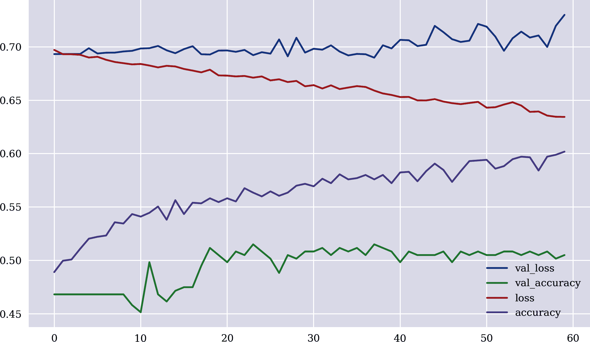
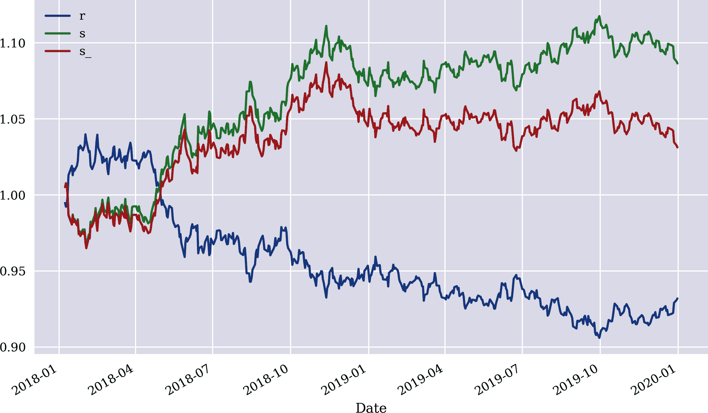

# 附录 C. 卷积神经网络

第三部分集中介绍了密集神经网络（DNNs）和递归神经网络（RNNs）作为两种标准的神经网络类型。DNNs 之所以迷人在于它们是良好的通用逼近器。例如，本书中的强化学习示例利用 DNNs 来逼近最优动作策略。另一方面，RNNs 专门设计用于处理序列数据，如时间序列数据，这在试图预测金融时间序列的未来值时非常有用。

*卷积神经网络*（CNNs）是另一种广泛应用的神经网络类型。在实践中它们非常成功，尤其在计算机视觉领域。CNNs 在诸如 ImageNet 挑战赛等多个标准测试和挑战中设立了新的基准；更多相关内容请参见《经济学人》（2016 年）或 Gerrish（2018 年）。计算机视觉在自动驾驶车辆、安全监控等领域尤为重要。

本附录简要展示了 CNN 在预测金融时间序列数据中的应用。有关 CNN 的详细信息，请参阅 Chollet（2017 年，第五章）和 Goodfellow 等人（2016 年，第九章）。

# 特征和标签数据

下面的 Python 代码首先处理所需的导入和定制。然后导入包含多种金融工具每日结束数据（EOD）的数据集。这个数据集在本书中的不同示例中都有使用：

```py
In [1]: import os
        import math
        import numpy as np
        import pandas as pd
        from pylab import plt, mpl
        plt.style.use('seaborn')
        mpl.rcParams['savefig.dpi'] = 300
        mpl.rcParams['font.family'] = 'serif'
        os.environ['PYTHONHASHSEED'] = '0'

In [2]: url = 'http://hilpisch.com/aiif_eikon_eod_data.csv'  

In [3]: symbol = 'EUR='  

In [4]: data = pd.DataFrame(pd.read_csv(url, index_col=0,
                                        parse_dates=True).dropna()[symbol])  

In [5]: data.info()  
        <class 'pandas.core.frame.DataFrame'>
        DatetimeIndex: 2516 entries, 2010-01-04 to 2019-12-31
        Data columns (total 1 columns):
         #   Column  Non-Null Count  Dtype
        ---  ------  --------------  -----
         0   EUR=    2516 non-null   float64
        dtypes: float64(1)
        memory usage: 39.3 KB
```


检索并选择金融时间序列数据

接下来的步骤是生成特征数据，延迟数据，将其拆分为训练和测试数据集，最后基于训练数据集的统计数据进行归一化：

```py
In [6]: lags = 5

In [7]: features = [symbol, 'r', 'd', 'sma', 'min', 'max', 'mom', 'vol']

In [8]: def add_lags(data, symbol, lags, window=20, features=features):
            cols = []
            df = data.copy()
            df.dropna(inplace=True)
            df['r'] = np.log(df / df.shift(1))
            df['sma'] = df[symbol].rolling(window).mean()  
            df['min'] = df[symbol].rolling(window).min()  
            df['max'] = df[symbol].rolling(window).max()  
            df['mom'] = df['r'].rolling(window).mean()  
            df['vol'] = df['r'].rolling(window).std()  
            df.dropna(inplace=True)
            df['d'] = np.where(df['r'] > 0, 1, 0)
            for f in features:
                for lag in range(1, lags + 1):
                    col = f'{f}_lag_{lag}'
                    df[col] = df[f].shift(lag)
                    cols.append(col)
            df.dropna(inplace=True)
            return df, cols

In [9]: data, cols = add_lags(data, symbol, lags, window=20, features=features)

In [10]: split = int(len(data) * 0.8)

In [11]: train = data.iloc[:split].copy()  

In [12]: mu, std = train[cols].mean(), train[cols].std()  

In [13]: train[cols] = (train[cols] - mu) / std  

In [14]: test = data.iloc[split:].copy()  

In [15]: test[cols] = (test[cols] - mu) / std  
```


简单移动平均特征


滚动最小值特征


滚动最大值特征


时间序列动量特征


滚动波动率特征


训练数据集的高斯归一化


测试数据集的高斯归一化

# 模型训练

CNN 的实现与 DNN 类似。以下 Python 代码首先处理来自`Keras`的导入以及设置所有相关随机数生成器种子值的函数定义：

```py
In [16]: import random
         import tensorflow as tf
         from keras.models import Sequential
         from keras.layers import Dense, Conv1D, Flatten
         Using TensorFlow backend.

In [17]: def set_seeds(seed=100):
             random.seed(seed)
             np.random.seed(seed)
             tf.random.set_seed(seed)
```

以下 Python 代码实现并训练了一个简单的 CNN 模型。该模型的核心是适用于时间序列数据的*一维卷积层*（详见[Keras 卷积层](https://oreil.ly/AXQ33)）：

```py
In [18]: set_seeds()
         model = Sequential()
         model.add(Conv1D(filters=96, kernel_size=5, activation='relu',
                          input_shape=(len(cols), 1)))
         model.add(Flatten())
         model.add(Dense(10, activation='relu'))
         model.add(Dense(1, activation='sigmoid'))

         model.compile(optimizer='adam',
                       loss='binary_crossentropy',
                       metrics=['accuracy'])

In [19]: model.summary()
         Model: "sequential_1"
         _________________________________________________________________
         Layer (type)                 Output Shape              Param #
         =================================================================
         conv1d_1 (Conv1D)            (None, 36, 96)            576
         _________________________________________________________________
         flatten_1 (Flatten)          (None, 3456)              0
         _________________________________________________________________
         dense_1 (Dense)              (None, 10)                34570
         _________________________________________________________________
         dense_2 (Dense)              (None, 1)                 11
         =================================================================
         Total params: 35,157
         Trainable params: 35,157
         Non-trainable params: 0
         _________________________________________________________________

In [20]: %%time
         model.fit(np.atleast_3d(train[cols]), train['d'],
                   epochs=60, batch_size=48, verbose=False,
                   validation_split=0.15, shuffle=False)
         CPU times: user 10.1 s, sys: 1.87 s, total: 12 s
         Wall time: 4.78 s

Out[20]: <keras.callbacks.callbacks.History at 0x7ffe3f32b110>
```

Figure C-1 展示了训练和验证数据集在不同训练时期的性能指标：

```py
In [21]: res = pd.DataFrame(model.history.history)

In [22]: res.tail(3)
Out[22]:     val_loss  val_accuracy      loss  accuracy
         57  0.699932      0.508361  0.635633  0.597165
         58  0.719671      0.501672  0.634539  0.598937
         59  0.729954      0.505017  0.634403  0.601890

In [23]: res.plot(figsize=(10, 6));
```



###### Figure C-1\. CNN 训练和验证的性能指标

# 测试模型

最后，下面的 Python 代码将训练好的模型应用于测试数据集。CNN 模型明显优于被动基准投资。然而，考虑到以典型（零售）买卖点差的形式存在的交易成本，它会吞噬大部分超额收益。Figure C-2 可视化了随时间的表现：

```py
In [24]: model.evaluate(np.atleast_3d(test[cols]), test['d'])  
         499/499 [==============================] - 0s 25us/step

Out[24]: [0.7364848222665653, 0.5210421085357666]

In [25]: test['p'] = np.where(model.predict(np.atleast_3d(test[cols])) > 0.5, 1, 0)

In [26]: test['p'] = np.where(test['p'] > 0, 1, -1)  

In [27]: test['p'].value_counts()  
Out[27]: -1    478
          1     21
         Name: p, dtype: int64

In [28]: (test['p'].diff() != 0).sum()  
Out[28]: 41

In [29]: test['s'] = test['p'] * test['r']  

In [30]: ptc = 0.00012 / test[symbol]  

In [31]: test['s_'] = np.where(test['p'] != 0, test['s'] - ptc, test['s'])  

In [32]: test[['r', 's', 's_']].sum().apply(np.exp)
Out[32]: r     0.931992
         s     1.086525
         s_    1.031307
         dtype: float64

In [33]: test[['r', 's', 's_']].cumsum().apply(np.exp).plot(figsize=(10, 6));
```


样本外准确率比例


根据预测的仓位（多头/空头）


基于仓位预测的交易数目


给定买卖点差的比例交易成本


在交易成本之前的策略表现


在交易成本之后的策略表现



###### Figure C-2\. 被动基准投资和 CNN 策略的总体表现（交易成本之前/之后）

# 资源

在本附录中引用的书籍和论文：

+   Chollet, François. 2017\. *Python 深度学习*. Shelter Island: Manning.

+   *《经济学家》*. 2016\. “从不工作到神经网络。” *《经济学家》* 特别报道, 2016 年 6 月 23 日. [*https://oreil.ly/6VvlS*](https://oreil.ly/6VvlS).

+   Gerrish, Sean. 2018\. *智能机器如何思考*. Cambridge: MIT Press.

+   Goodfellow, Ian, Yoshua Bengio, and Aaron Courville. 2016\. *深度学习*. Cambridge: MIT Press. [*http://deeplearningbook.org*](http://deeplearningbook.org).
