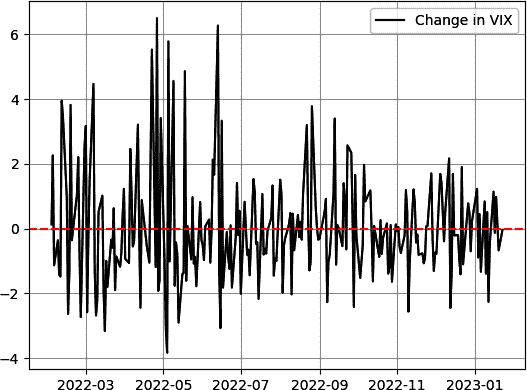

# 第一章：介绍数据科学和交易

开始学习复杂主题的最佳方式是将其分解为较小的部分并先理解这些部分。要理解面向金融的深度学习，需要了解数据科学和金融市场。

本章奠定了彻底理解数据科学及其用途所需的基础，以及理解金融市场以及如何利用数据科学从事交易和预测的基础。

在本章结束时，您应该知道数据科学是什么，它的应用是什么，以及您如何在金融中利用它来提取价值。

# 理解数据

要理解数据科学领域，首先要了解数据的类型和结构。毕竟，这个广阔领域的名称中的第一个词就是*数据*。那么，数据是什么？更重要的是，您能用它做什么？

*数据* 在其最简单和最纯粹的形式中是各种类型（数值、文本、布尔值等）的原始信息集合。

收集数据的最终目的是决策制定。这是一个复杂的过程，涵盖从收集和处理数据到解释数据并利用结果做出决策的各个环节。

让我们举个使用数据做决策的例子。假设您的投资组合由五种不同的等权重股息支付股票组成，详见表 1-1。

表 1-1\. 股票及其股息收益率

| 股票 | 股息收益率 |
| --- | --- |
| A | 5.20% |
| B | 3.99% |
| C | 4.12% |
| D | 6.94% |
| E | 5.55% |

###### 注

*股息* 是从公司利润中支付给股东的款项。*股息收益率* 是分配给股东的货币单位金额与公司当前股价的比率。

分析这些数据可以帮助您了解从投资组合中获得的平均股息收益率。平均值基本上是总和除以数量，它快速展示了投资组合的整体股息收益率情况：

<math alttext="Average dividend yield equals StartFraction 5.20 percent-sign plus 3.99 percent-sign plus 4.12 percent-sign plus 6.94 percent-sign plus 5.55 percent-sign Over 5 EndFraction equals 5.16 percent-sign"><mrow><mtext>Average</mtext> <mtext>dividend</mtext> <mtext>yield</mtext> <mo>=</mo> <mfrac><mrow><mn>5</mn><mo lspace="0%" rspace="0%">.</mo><mn>20</mn><mo lspace="0%" rspace="0%">%</mo><mo>+</mo><mn>3</mn><mo lspace="0%" rspace="0%">.</mo><mn>99</mn><mo lspace="0%" rspace="0%">%</mo><mo>+</mo><mn>4</mn><mo lspace="0%" rspace="0%">.</mo><mn>12</mn><mo lspace="0%" rspace="0%">%</mo><mo>+</mo><mn>6</mn><mo lspace="0%" rspace="0%">.</mo><mn>94</mn><mo lspace="0%" rspace="0%">%</mo><mo>+</mo><mn>5</mn><mo lspace="0%" rspace="0%">.</mo><mn>55</mn><mo lspace="0%" rspace="0%">%</mo></mrow> <mn>5</mn></mfrac> <mo>=</mo> <mn>5</mn> <mo lspace="0%" rspace="0%">.</mo> <mn>16</mn> <mo lspace="0%" rspace="0%">%</mo></mrow></math>

因此，您的投资组合的平均股息收益率为 5.16%。这些信息可以帮助您将平均股息收益率与其他投资组合进行比较，以便您知道是否需要进行任何调整。

您可以计算的另一个指标是投资组合中持有的股票数量。这可能是构建分散化墙壁的第一个信息砖块。尽管这两个信息（平均股息收益率和投资组合中的股票数量）非常简单，但复杂的数据分析始于简单的指标，有时可能不需要复杂的模型来正确解释情况。

您在前面示例中计算的两个指标称为*平均*（或均值）和*计数*（或元素数量）。它们是所谓的*描述统计*的一部分，详见第三章，描述统计也是数据科学的一部分。

让我们再来看一个数据分析的例子，用于推断性的目的。假设你已经计算了两种商品之间的年度相关性测量，并且想预测下一个年度相关性是正还是负。表格 1-2 中有详细的计算信息。

表格 1-2\. 年度相关性测量

| 年份 | 相关性 |
| --- | --- |
| 2015 | 正相关 |
| 2016 | 正相关 |
| 2017 | 正相关 |
| 2018 | 负相关 |
| 2019 | 正相关 |
| 2020 | 正相关 |
| 2021 | 正相关 |
| 2022 | 正相关 |
| 2023 | 正相关 |

###### 注释

*相关性* 是两个时间序列之间线性依赖关系的度量。*正相关* 通常意味着两个时间序列平均而言朝着相同方向移动，而*负相关* 则通常意味着两个时间序列平均而言朝着相反方向移动。相关性在第三章中有讨论。

根据表格 1-2，这两种商品之间的历史相关性大多数情况下（即 88%）是正相关的。根据历史观察，可以说下一个相关性测量的概率为 88%为正相关。这也意味着下一个相关性测量为负的概率为 12%：

<math alttext="upper E left-parenthesis Positive correlation right-parenthesis equals eight-ninths equals 88.88 percent-sign"><mrow><mi>E</mi> <mrow><mo>(</mo> <mtext>Positive</mtext> <mtext>correlation</mtext> <mo>)</mo></mrow> <mo>=</mo> <mfrac><mn>8</mn> <mn>9</mn></mfrac> <mo>=</mo> <mn>88</mn> <mo lspace="0%" rspace="0%">.</mo> <mn>88</mn> <mo lspace="0%" rspace="0%">%</mo></mrow></math>

这是另一个基本的例子，展示如何使用数据从观察中推断并做出决策。当然，在这里的假设是历史结果会完全反映未来结果，在现实生活中这是不太可能的，但有时候，预测未来唯一的依据就是过去的经验。

在讨论数据科学之前，让我们回顾一下可以使用的数据类型，并将其分成不同的组：

数值数据

这种数据由反映某种类型信息的数字组成，这些信息可以在规律或不规律的间隔时间内收集。例如市场数据（OHLC，¹ 成交量，价差等）和财务报表数据（资产，收入，成本等）。

分类数据

分类数据是可以用名称或标签将其组织成组或类别的数据。它是定性而非定量的。例如，患者的血型就是一种分类数据。另一个例子是从人群中取样的眼睛颜色。

*文本数据*

文本数据近年来随着自然语言处理（NLP）的发展而日益增长。机器学习模型利用文本数据进行翻译、解释和分析文本的情感。

视觉数据

图像和视频也被视为数据，你可以处理并转化它们成有价值的信息。例如，*卷积神经网络*（CNN）是一种算法（见第八章），它可以通过标签识别和分类照片（例如，将猫照片标记为猫）。

音频数据

音频数据非常有价值，可以帮助节省转录时间。例如，可以使用音频算法创建字幕并自动创建字幕。还可以创建模型，通过音频的语调和音量来解释说话者的情感。

*数据科学*是一个跨学科领域，试图使用不同的技术和模型从数据中提取智能和结论，无论这些技术和模型是简单还是复杂的。数据科学过程除了仅仅分析数据外还包括许多步骤。以下是这些步骤的总结：

1.  *数据收集*：这个过程涉及从可靠和准确的来源获取数据。计算机科学中广为人知的一句话通常认为是乔治·菲切尔的功劳：“垃圾进，垃圾出”，它指的是需要有质量可靠的数据，才能进行适当的分析。基本上，如果你有不准确或有缺陷的数据，那么所有的过程都将是无效的。

1.  *数据预处理*：偶尔，您获取的数据可能处于原始形式，需要进行预处理和清理，以便数据科学模型能够使用它。例如，删除不必要的数据，添加缺失值，或消除无效和重复的数据可能是预处理步骤的一部分。其他更复杂的例子可能包括数据的*归一化*和*去噪*。这一步的目的是使数据准备好进行分析。

1.  *数据探索*：在这一步骤中，进行基本的统计研究以发现数据中的趋势和其他特征。数据探索的一个例子是计算数据的平均值。

1.  *数据可视化*：这是上一步骤的一个重要补充。它包括创建直方图和热图等可视化图表，以帮助识别模式和趋势，并促进解释。

1.  *数据分析*：这是数据科学过程的主要焦点。这是你使用不同的学习模型对数据进行拟合（训练），以便根据给定的参数来解释和预测未来的结果。

1.  *数据解释*：这一步涉及理解数据科学模型呈现的反馈和结论。*优化*也可能是这一步的一部分；在这些情况下，我们会回到第五步，使用更新的参数再次运行模型，然后重新解释和评估性能。

让我们以 Python 中的一个简单例子来应用数据科学过程的步骤。假设你想分析和预测 VIX（波动率指数），这是一个代表标准普尔 500 股票市场指数的隐含波动率的波动率时间序列指标。VIX 自 1993 年以来就已经存在，并由芝加哥期权交易所（CBOE）发布。

###### 注意

数据科学过程中还有一个隐藏的步骤，我称之为*零步骤*，它发生在你形成一个想法的时候，这个想法指导了应该启动哪个过程。毕竟，如果没有首先有动机，你不会应用这个过程。例如，相信通货膨胀数据可能推动某些大宗商品的回报是一个想法和启动探索数据以证明这一假设的动机。

由于它旨在衡量股市中的恐惧或不确定性水平，VIX 经常被称为*恐慌指数*。它是通过对标准普尔 500 指数期权定价计算的百分比得出的。较高的 VIX 值与更大的市场动荡和不确定性相关，而较低的值则与更大的稳定性相关。

第一步是数据收集，在这种情况下可以使用 Python 自动化。以下代码块连接到圣路易斯联邦储备银行的网站，并下载了 1990 年 1 月 1 日至 2023 年 1 月 23 日期间的 VIX 历史数据（第六章专门介绍了 Python 和编写代码；目前，你无需理解代码，因为这不是目标）：

```py
# Importing the required library
import pandas_datareader as pdr
# Setting the beginning and end of the historical data
start_date = '1990-01-01'
end_date   = '2023-01-23'
# Creating a dataframe and downloading the VIX data
vix = pdr.DataReader('VIXCLS', 'fred', start_date, end_date)
# Printing the latest five observations of the dataframe
print(vix.tail())

```

代码使用*pandas*库导入`DataReader`函数，该函数从各种来源在线获取历史数据。`DataReader`函数以数据名称作为第一个参数，其次是来源和日期。`print(vix.tail())`的输出显示在表 1-3 中。

表 1-3\. `print(vix.tail())`的输出

| 日期 | VIXCLS |
| --- | --- |
| 2023-01-17 | 19.36 |
| 2023-01-01 | 20.34 |
| 2023-01-19 | 20.52 |
| 2023-01-20 | 19.85 |
| 2023-01-23 | 19.81 |

我们继续进行第二步：数据预处理。我将这部分分为检查无效数据和转换数据，以便准备使用。处理时间序列数据时，特别是下载的时间序列数据，有时可能会遇到`nan`值。NaN 代表*不是数字*，`nan`值由于缺失、无效或损坏的数据而出现。

你可以用多种方式处理`nan`值。为了本例子，让我们使用最简单的方法处理这些无效值，即消除它们。但首先，让我们编写一些简单的代码，输出数据框中`nan`值的数量，以便你了解要删除多少个值：

```py
# Calculating the number of nan values
count_nan = vix['VIXCLS'].isnull().sum()
# Printing the result
print('Number of nan values in the VIX dataframe: ' + str(count_nan))

```

代码使用`isnull()`函数并对其进行求和，得出`nan`值的数量。前一段代码片段的输出如下所示：

```py
Number of nan values in the VIX dataframe: 292

```

现在你已经知道要删除多少行了，可以使用以下代码删除无效的行：

```py
# Dropping the nan values from the rows
vix = vix.dropna()

```

第二部分第二步是转换数据。数据科学模型通常需要*稳定*数据，即具有稳定统计属性（如均值）的数据。

###### 注意

*稳定性* 的概念以及所需的统计指标在第三章中有详细讨论。目前，您只需要知道的是，在使用数据科学模型时，您可能需要将原始数据转换为稳定数据。

要将 VIX 数据转换为平稳数据，您可以简单地从一个值相对于前一个值的差异中取得。以下代码片段将 VIX 数据框转换为理论上暗示的平稳数据:²

```py
# Taking the differences in an attempt to make the data stationary
vix = vix.diff(periods = 1, axis = 0)
# Dropping the first value of the dataframe
vix = vix.iloc[1: , :]

```

第三步是数据探索，它完全是关于理解您面前的数据，从统计学角度来说。由于您将在第三章中详细了解统计指标，因此我将限制讨论仅计算数据集的平均值。

*平均值* 简单地是可以代表数据集中其他值的值，如果它们要选出一位领袖。它是数值总和除以其数量。平均值是描述性统计学中最简单的统计量，也是最常用的统计量。以下公式显示了一组值的平均值的数学表示：

<math alttext="x overbar equals StartFraction 1 Over n EndFraction sigma-summation Underscript i equals 1 Overscript i Endscripts x Subscript i"><mrow><mover><mi>x</mi> <mo>¯</mo></mover> <mo>=</mo> <mfrac><mn>1</mn> <mi>n</mi></mfrac> <msubsup><mo>∑</mo> <mrow><mi>i</mi><mo>=</mo><mn>1</mn></mrow> <mi>i</mi></msubsup> <msub><mi>x</mi> <mi>i</mi></msub></mrow></math>

您可以轻松地计算数据集的平均值如下：

```py
# Calculating the mean of the dataset
mean = vix["VIXCLS"].mean()
# Printing the result
print('The mean of the dataset = ' + str(mean))

```

前面代码片段的输出如下所示：

```py
The mean of the dataset = 0.0003
```

下一步是数据可视化，这在很大程度上被认为是有趣的步骤。让我们绘制 VIX 随时间变化的差异值。以下代码片段绘制了图 1-1 中显示的 VIX 数据：

```py
# Importing the required library
import matplotlib.pyplot as plt
# Plotting the latest 250 observations in black with a label
plt.plot(vix[–250:], color = 'black', linewidth = 1.5, 
         label = 'Change in VIX')
# Plotting a red dashed horizontal line that is equal to mean
plt.axhline(y = mean, color = 'red', linestyle = 'dashed')
# Calling a grid to facilitate the visual component
plt.grid()
# Calling the legend function so it appears with the chart
plt.legend()
# Calling the plot
plt.show()

```



###### 图 1-1\. 自 2022 年初以来 VIX 的变化

步骤 5 和 6，数据分析和数据解释，是本书中您将深入学习的内容，因此现在让我们跳过它们，专注于数据科学的入门部分。

在继续之前，让我们回顾一下无效或缺失数据的问题。有时数据是不完整的，存在缺失单元格。尽管这可能会影响算法的预测能力，但不应该阻止您继续分析，因为有快速的修复方法可以帮助减少空单元格的负面影响。例如，考虑表 1-4。

表 1-4\. 季度 GDP

| 季度 | GDP |
| --- | --- |
| 2020 年第一季度 | 0.9% |
| 2020 年第二季度 | 1.2% |
| 2020 年第三季度 | 0.5% |
| 2020 年第四季度 | 0.4% |
| 2021 年第一季度 | **#N/A** |
| 2021 年第二季度 | 1.0% |
| 2021 年第三季度 | 1.1% |
| 2021 年第四季度 | 0.6% |

表中包含一个虚构国家的季度国内生产总值（GDP）³。请注意表格缺少 2021 年第一季度的数值。解决此问题有三种基本方法：

删除包含缺失值的单元格。

这是 VIX 示例中使用的技术。它简单地认为时间戳不存在。这是最简单的修复方法。

假设缺失单元格等于前一个单元格。

这也是一个简单的修正方法，其目的是平滑数据，而不是完全忽略问题。

计算空值周围单元格的平均值或中位数。

此技术将平滑处理推进一步，并假设缺失值等于前后数值的平均值。此外，它可以是几个过去观察的平均值。

数据科学涵盖一系列数学和统计概念，并需要对机器学习算法有深入理解。本书详细讨论了这些概念，但也以易于理解的方式来使技术和非技术读者受益。许多模型被假定为神秘盒子，这其中有一些真实性，但数据科学家的工作是在解释结果之前理解这些模型，这有助于理解模型的局限性。

本书使用 Python 作为主要编程语言来创建算法。正如提到的，第六章介绍了 Python 及其用于操作和分析数据所需的知识，但也为创建不同模型提供了基础，如您所见，这些模型比您想象的简单得多。

在进入下一节之前，让我们先看看数据存储的概念。毕竟，数据很有价值，但您需要将其存储在可以轻松获取和分析的地方。

*数据存储* 是指用于将数据存储和组织以供未来分析的技术和领域。数据以多种格式存储，如 CSV 和 XLSX。其他类型的格式可能包括 XML、JSON，甚至 JPEG 用于图像。选择格式取决于数据的结构和组织。

数据可以存储在云端或本地，具体取决于您的存储能力和成本。例如，您可能希望将您的历史性一分钟苹果股票数据存储在云端，而不是在 CSV 文件中，以节省本地计算机的空间。

在 Python 中处理时间序列时，您主要会处理两种数据存储类型：数组和数据帧。让我们来看看它们是什么：

*数组*

*数组* 用于存储相同类型的元素。通常，同类数据集（如数字）最适合存储在数组中。

*数据帧*

*数据帧* 是一个二维结构，可以容纳各种类型的数据。它可以与具有列和行的表格进行比较。

一般情况下，当需要高效存储同类数据集合时应使用数组。当处理异类数据或需要以表格方式编辑和分析数据时，应使用数据帧。

###### 注意

数据科学在不断发展。新的存储方法正在不断开发，旨在提高效率并增加容量和速度。

# 理解数据科学

数据科学在技术和进步中发挥着重要作用。算法依赖于从数据科学工具提供的信息来执行其任务。但算法是什么？

*算法*是一组有序的程序，旨在完成特定活动或解决特定问题。算法可以简单到一个硬币翻转，也可以复杂到 Risch 算法。⁴

让我们来看一个非常简单的算法，它会更新一个图表平台所需的金融数据。该算法将按照以下步骤执行：

1.  连接服务器和在线数据提供商。

1.  复制带有最新时间戳的金融数据。

1.  将数据粘贴到图表平台。

1.  返回步骤 1 并重新执行整个过程。

这就是算法的本质：执行一组有限或无限目标的特定指令。

###### 注意

在前一节讨论的六个数据科学步骤也可以被视为一种算法。

交易策略也是算法，因为它们具有明确的进出场规则。市场套利是一个交易策略的例子。

*套利*是一种旨在从不同交易所上同一资产的价格差异中获利的交易策略。这些价格差异是由套利者通过他们的买卖活动消除的异常情况。考虑一个股票在不同国家的交易所 A 和 B 上交易（为了简单起见，这两个国家使用相同的货币）。自然地，该股票在两个交易所上的价格必须相同。当这种条件不成立时，套利者们就会出来捕猎。

他们在便宜的交易所购买股票，然后立即在更昂贵的交易所出售，从而确保几乎无风险的利润。这些操作以闪电般的速度执行，因为价格差异由于套利者的强大和速度而不会长时间存在。为了澄清，这里有一个例子：

+   交易所 A 的股票价格 = $10.00。

+   交易所 B 的股票价格 = $10.50。

在这种情况下，套利者的算法将执行以下操作：

1.  在交易所 A 以$10.00 购买股票。

1.  立即在交易所 B 以$10.50 出售股票。

1.  收取差额（$0.50），并重复直到差距被消除。

###### 注意

交易和执行算法可以非常复杂，并且需要专业知识和某种市场优势。

在这一点上，你应该意识到数据科学的两个主要用途，即数据解释和数据预测：

数据解释

也通常被称为*商业智能*或简称*数据智能*。部署算法的目的是理解数据的何时和如何。

数据预测

也常称为*预测分析*或简称*预测*。部署算法的目的是理解数据的接下来会发生什么。

在金融市场中使用学习算法的主要目的是预测未来资产价格，以便做出基于信息的交易决策，以高于随机的成功率实现资本增值。我在本书中讨论了许多简单和复杂的学习算法。这些学习算法或模型可以按以下方式分类：

监督学习

*监督学习算法*是需要带标签数据的模型。这意味着你必须提供数据，让模型在这些过去值上进行训练，并理解隐藏的模式，以便在遇到新数据时能够提供未来的输出。监督学习的例子包括线性回归算法和随机森林模型。

无监督学习

*无监督学习算法*是不需要带标签数据的模型。这意味着它们可以使用无标签数据完成工作，因为它们设计用于自行发现隐藏的模式。示例包括聚类算法和主成分分析（PCA）。

强化学习

*强化学习算法*是一种完全不需要数据的模型，因为它们可以发现并自主学习环境。与监督学习和无监督学习模型相比，强化学习模型通过从环境获得的奖励系统反馈来获取知识。通常情况下，这应用于代理与环境互动并学习最大化随时间奖励的行为的情况，因此可能不是时间序列回归的首选算法。另一方面，它可用于开发可应用于时间序列数据以生成预测的策略。

正如您可能已经注意到的那样，本书的标题是*金融深度学习*。这意味着除了涵盖其他学习模型外，本书将花费相当大的篇幅讨论用于时间序列预测的深度学习模型。深度学习主要围绕神经网络的使用展开，这是一种在第八章中深入讨论的算法。

深层监督学习模型（例如深度神经网络）能够学习数据的分层表示，因为它们包含许多层，每一层在不同抽象级别上提取特征。因此，深度模型可以学习隐藏且复杂的模式，而这些模式可能对浅层（非深度）模型来说很难学习。

另一方面，浅层监督学习模型（如线性回归）对于学习复杂的非线性关系能力有限。但它们需要较少的计算工作，因此速度更快。

当今数据科学算法几乎无处不在，不仅限于金融领域。一些应用包括以下几个方面：

+   *业务分析*：使用数据分析优化定价、预测客户流失或改进营销活动

+   *医疗保健*：通过深入分析患者数据，改善患者结果、寻找创新疗法或降低医疗成本

+   *体育*：分析体育数据以提升团队表现、球员选拔或投注

+   *研究*：分析数据以支持科学研究、证明理论或获得新知识

当有人谈论数据科学应用时，了解数据科学家的工作非常有帮助。*数据科学家*必须评估和理解复杂数据，以获取见解并为决策提供指导。这通常包括开发统计模型、应用机器学习技术和数据可视化。他们支持数据驱动解决方案的实施，并向利益相关者通报他们的结果。

###### 注意

数据科学家与数据工程师有所不同。数据科学家关注数据的解释和分析，而数据工程师则关注收集、存储和分析数据所需的工具和基础设施。

到现在为止，你应该理解了开始数据科学所需的一切。让我们介绍本书的第二个主要主题：金融市场。

# 金融市场和交易简介

本书的目标是以实际操作的方式介绍不同学习模型的应用，以预测金融时间序列数据。因此，理解交易和金融市场运作的坚实知识至关重要。

*金融市场*是人们可以交易股票、债券和货币等金融工具的地方。买卖行为称为 *交易*。购买金融工具的主要但不是唯一目的是资本增值。买方相信工具的价值大于其价格；因此，买方购买股票（*多头*）并在认为当前价格等于当前价值时出售。相反，交易员如果认为工具价格会下降，也可以赚钱。这个过程被称为 *卖空*，在期货和外汇（FX）等某些市场上很常见。

卖空的过程涉及从第三方借入金融工具，在市场上卖出，并在回归给第三方之前买回。理想情况下，当你预计工具价格下跌时，你会以较低的成本（价格下降后）买回它，并以市场价格归还给第三方，从而赚取差价。以下示例进一步解释了这些概念：

多头（买入）头寸示例

一位交易员预期微软股票价格未来几年会因技术法规改进而上涨，从而增加收益。他们以每股 250 美元的价格买入一定数量的股票，并计划在 500 美元时卖出。因此，交易员在微软股票上持有多头（也称为 *看涨*）。

空头（卖出）头寸示例

一名交易员预计洛克希德·马丁股票价格将在接下来的几天内下跌，因为技术策略发出了信号。他们以 450 美元的价格卖空了一些股票，并打算在 410 美元的价格买回来。因此，这名交易员在洛克希德·马丁股票上持有空头（也称为*看空*）。

###### 注意

上涨的市场称为牛市。源自词语*bull*和公牛的攻击性本质，看涨与乐观、狂喜和贪婪有关。

下跌的市场称为熊市。源自词语*bear*及其防御性本质，看跌与悲观、恐慌和恐惧有关。

金融工具可以以其原始形式（现货）或衍生形式存在。*衍生品*是交易员用来以特定方式交易市场的产品。例如，*远期*或*期货*合约是一种衍生合约，其中买方锁定资产的价格以便在以后的某个时间购买。

另一种衍生品是期权。*期权*是在未来以支付保费（期权价格）的方式购买特定资产的权利，而非义务。当买方希望购买基础股票时，他们行使他们的期权；否则，他们可能让期权到期。

交易活动也可能出现为了对冲目的，而不仅仅是投机。其中一个例子是法国航空公司（法国主要航空公司）通过购买石油期货对冲其业务运营。购买石油期货可以保护法国航空公司免受可能损害其主要运营（航空业务）的上涨油价。从使用燃料驱动飞机导致的成本上涨中获得的收益可以抵消期货的成本。这使得航空公司可以专注于其主要业务。这整个过程被称为*对冲*。

另一个例子是，假设一家航空公司预计在接下来的六个月内将消耗一定量的燃料，但对该期间油价的潜在增长感到担忧。为了防范这种价格风险，航空公司可以进入期货合约，以在未来某个日期以固定价格购买石油。

如果在那段时间内石油价格上涨，航空公司仍然可以以较低的固定价格购买石油，这是在期货合约中约定的。如果石油价格下跌，航空公司将有义务支付较高的固定价格，但较低的市场价格可以抵消这一成本。

通过这种方式，航空公司可以减少石油市场价格波动的风险，并稳定其燃料成本。这可以帮助航空公司更好地管理其预算并预测未来的收入。正如您所看到的，其目的不是通过交易操作获得财务收益，而是通过锁定已知的石油价格来稳定其成本。

典型地，根据它们的类型，金融工具被分组为资产类别：

股票市场

*股票市场*是公司发行股票以筹集业务资金的交易场所（无论是电子的还是实体的）。当人们购买一家公司的股票时，他们成为该公司的部分所有者，并根据公司的政策可能有资格获得股息。根据股票的种类，他们还可能获得在董事会会议上投票的权利。

固定收益

政府和企业可以在固定收益市场借钱。当一个人购买债券时，实际上是向借款人出借资金，借款人同意偿还贷款及利息。根据借款人的信用状况和当前利率，债券的价值可能会上升或下降。

货币

外汇市场，也被称为*货币市场*，是人们可以购买和出售各种货币的地方。一个国家的货币价值可以根据多种因素的变化而上升或下降，包括经济状况、利率和国家的政治稳定性。

大宗商品

农产品、黄金、石油等具有工业或其他用途的实物资产被称为*大宗商品*。它们通常是从全球经济趋势中获取利润的手段，同时也是对抗通胀的一种形式。

替代投资

在金融世界中，像房地产、私募股权基金和对冲基金这样的非传统投资被称为*替代资产类别*。这些资产类别有可能提供比传统资产更高的回报，并且提供多样化的好处，但它们通常流动性较差，评估可能更为困难。

至关重要的是，每种资产类别都有独特的特性和不同的风险水平，因此投资者在投资任何这些资产之前都应该做好功课。

金融市场允许企业和政府筹集运营所需的资金。它们还允许投资者通过投机和投资于有趣的机会赚取利润。交易活动为市场提供流动性。市场越流动，交易就越容易、成本也越低。但市场到底是如何运作的？是什么导致价格的波动呢？

*市场微观结构*是研究金融市场证券交易的学科。它探讨交易的运作方式以及交易者、投资者和市场做市商的行为。市场微观结构研究的目标是理解价格形成以及影响交易成本的变量。

订单流、流动性、市场效率和价格发现只是市场微观结构研究涵盖的众多主题之一。此外，这项研究还探讨了包括限价单、市价单和算法交易在内的各种交易技术如何影响市场动态。*流动性*可能是市场微观结构中最重要的概念之一。它描述了一种资产可以在不显著改变其价格的情况下买入或卖出的容易程度。流动性可能会因不同的金融工具和时间而异。它可能会受到多种变量的影响，包括交易量和波动性。

最后，我想讨论市场微观结构的另一个重要领域：*价格发现*。这指的是在市场中设置价格的方法。价格可以受到订单流、市场做市商活动和各种交易方法的影响。

想象一下，你想买入两只股票的大量股票：股票 A 和股票 B。股票 A 非常流动，而股票 B 非常不流动。如果你想在股票 A 上执行买单，你可能会以所需的市场价格获得成交，几乎没有影响。然而，对于股票 B，你可能会得到更差的价格，因为没有足够的卖家愿意以你期望的买入价格出售。因此，随着你的订单需求增加，价格上涨以匹配卖家的价格，因此，你将以更高（更差）的价格买入。这就是流动性对你的交易可能产生的影响。

# 数据科学在金融中的应用

让我们开始窥探金融数据科学的主要领域。每个领域都有其需要简单和复杂解决方案的挑战和问题。金融也不例外。近年来，数据科学在改善金融世界（从企业世界到市场世界）的应用大幅增加。让我们讨论其中一些领域：

预测市场走向

在金融时间序列上使用数据科学的目的是发现历史市场数据中的模式、趋势和关系，以便预测未来市场走势。

金融欺诈检测

可以使用数据科学模型检查金融交易中的模式和异常，试图发现可能的欺诈行为。利用数据科学阻止金融欺诈的一种方法是检查信用卡交易数据，寻找不寻常或可疑的支出模式，例如短时间内进行大量小额购买或从同一商店频繁或大额购买。

风险管理

数据科学可以用来分析金融数据，发现投资组合的潜在风险。这可能涉及使用统计建模、机器学习和人工智能等方法分析大量历史数据，以发现可用于预测风险因素的模式和趋势。

信用评分

数据科学可以用于检查金融数据和信用历史，预测个人或公司的信用价值，并做出贷款决策。利用财务数据，如收入和信用历史，来预测一个人的信用价值是应用数据科学进行信用评分研究的一个例子。这可能涉及使用统计建模和机器学习等技术来开发一个预测模型，该模型可以使用许多指标，如先前的信用表现、收入和工作历史，来评估一个人偿还贷款的可能性。

自然语言处理

为了做出更好的判断，NLP 分析和从非结构化的金融数据中提取见解，如新闻文章、报告和社交媒体帖子。NLP 利用文本的情感提取可能来自市场参与者和专家意图和感受的交易机会。NLP 属于情感分析领域（借助机器学习的帮助）。

# 总结

数据科学领域每天都在不断增长，不断推出新技术和模型来改善数据解释。本章提供了关于数据科学的简单介绍以及你在金融领域如何使用它所需知道的内容。

接下来的三章介绍了统计学、概率论和数学方面的知识，这些知识在尝试理解数据科学模型时可能会用到。尽管本书的目的是以实践方式介绍使用 Python 创建和应用不同模型，但了解你正在处理的内容而不是盲目地将其应用于数据是有帮助的。

如果你需要 Python 复习，请参阅第六章，这是一个基础介绍。它为接下来的内容打下了基础。你不需要成为 Python 专家，但你必须理解代码及其所指的内容，特别是如何调试和检测代码中的错误。

¹ OHLC 指的是市场数据的四个基本部分：开盘价、最高价、最低价和收盘价。

² 我说“暗示”是因为平稳性必须通过你将在第三章中看到的统计检验来验证。目前，假设是对数据进行差分可以得到平稳的时间序列。

³ GDP 的测量在第十二章中有更详细的讨论。

⁴ Risch 算法是一种用于寻找反导数的不定积分技术，你将在第四章中看到这个概念。
