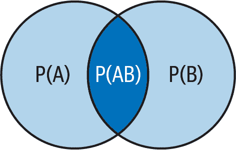

# 第二章。深度学习的基本概率方法

技术的兴起和普及使得每个人都能够运用机器学习和深度学习算法进行数据分析和优化。但不幸的是，许多用户并不了解不同学习模型的基础知识。这让机器学习对他们来说成了一个谜盒，这是一场灾难的前兆。

理解概率、统计和数学的基本概念对于理解和掌握数据以及创建旨在解释和预测数据的模型至关重要。本章介绍了直接或间接与算法相关的概率基础知识。请注意，你不太可能在日常生活中使用这些概率概念，但了解一些算法假设的来源是很重要的。

# 概率入门

*概率* 是描述随机变量和随机事件的工具。世界充满了随机性，通过概率方法试图解释混沌是找到我们的方向的最佳方式。诚然，“解释混沌”这个短语可能是个矛盾之词，因为混沌实际上不能被解释，但我们人类不能放弃对不确定事件的控制。这就是为什么我们开发了工具来理解我们充满未知事件的世界。

当你试图为金融交易开发机器学习算法时，你可能会想知道理解概率基础的用处是什么。这是一个合理的问题，你必须知道，一个学科的基础不一定与最终技能相似。

例如，要成为一名飞行员，你必须学习充满技术概念的空气动力学，这与最终的技能并不相似。这与本章节的做法类似；通过学习概率基本原理，你让你的大脑为即将到来的挑战做好了充分的准备。

知道你正在学习的东西的实用性应该会给你带来动力。以下是一些对于机器学习至关重要的关键概率主题：

概率分布函数

随机变量可能出现各种结果的可能性由*概率分布*描述。对于许多机器学习技术来说，理解典型概率分布的特征和属性至关重要。概率分布函数还描述了不同类型的时间序列数据，从而有助于选择正确的算法。为了简洁和连贯起见，这个话题在第三章中讨论。

假设检验

*假设检验* 用于确定基于数据样本的基于人口的断言更可能是正确还是不正确。稳态检验使用假设检验，并在第三章中讨论。

决策树

决策树是一种借鉴概率概念的机器学习算法，这些概念包括条件概率，本章有涉及。关于决策树的更多细节，请参阅第七章。

信息理论

*信息理论*是对信息如何量化、存储和传输进行复杂研究的学科。它被纳入到许多机器学习技术中，包括决策树。它还用于一种非线性相关性度量，称为最大信息系数，该内容在第三章中讨论。

# 概率概念简介

概率信息的最基本部分是*随机变量*，它是一个不确定的数字或结果。随机变量用于模拟被认为是不确定的事件，例如货币对未来回报。

随机变量可以是离散的或连续的。*离散随机变量*具有有限的值集，而*连续随机变量*在某个区间内有值。考虑以下例子以澄清问题：

+   离散随机变量的一个例子是掷骰子的结果。结果受以下集合限制：{1, 2, 3, 4, 5, 6}。

+   连续随机变量的一个例子是 EURUSD 的每日价格回报（一个欧元兑换成美元的汇率）。

随机变量由*概率分布*描述，这些分布是给出随机变量每个可能值的概率的函数。通常，直方图用于显示概率。直方图绘制在第三章中讨论。

在任何时刻，某个事件将发生的概率在 0 到 1 之间。这意味着概率被分配给随机变量，其范围在 0 到 1 之间，其中概率为 0 表示不可能发生，概率为 1 表示一定发生。

你也可以以百分比形式考虑这一点，百分比范围从 0%到 100%。这两个数字之间的值是有效的，这意味着你可以有一个 0.5133（51.33%）的概率来发生某个事件。考虑掷一个有六面的骰子，知道这个骰子没有任何操纵，那么获得 3 的概率是多少？

因为骰子有六个面，每个结果的概率相等，这意味着对于任何结果，概率如下找到：

<math alttext="upper P left-parenthesis x right-parenthesis equals one-sixth equals 0.167"><mrow><mi>P</mi> <mrow><mo>(</mo> <mi>x</mi> <mo>)</mo></mrow> <mo>=</mo> <mstyle displaystyle="false" scriptlevel="0"><mfrac><mn>1</mn> <mn>6</mn></mfrac></mstyle> <mo>=</mo> <mn>0</mn> <mo lspace="0%" rspace="0%">.</mo> <mn>167</mn></mrow></math>

使用*P(x)*指定事件*x*的概率。这给出了以下问题的答案：

<math alttext="upper P left-parenthesis 3 right-parenthesis equals one-sixth equals 0.167"><mrow><mi>P</mi> <mrow><mo>(</mo> <mn>3</mn> <mo>)</mo></mrow> <mo>=</mo> <mstyle displaystyle="false" scriptlevel="0"><mfrac><mn>1</mn> <mn>6</mn></mfrac></mstyle> <mo>=</mo> <mn>0</mn> <mo lspace="0%" rspace="0%">.</mo> <mn>167</mn></mrow></math>

当掷骰子时，只能有一个结果。它不能同时给出 3 和 4，因为一面必须支配另一面。这是*互斥*的概念。互斥事件（例如在掷骰子时得到 3 或得到 4）最终总和为 1。

看看以下例子：

<math alttext="upper P left-parenthesis 1 right-parenthesis equals one-sixth equals 0.167"><mrow><mi>P</mi> <mrow><mo>(</mo> <mn>1</mn> <mo>)</mo></mrow> <mo>=</mo> <mstyle displaystyle="false" scriptlevel="0"><mfrac><mn>1</mn> <mn>6</mn></mfrac></mstyle> <mo>=</mo> <mn>0</mn> <mo lspace="0%" rspace="0%">.</mo> <mn>167</mn></mrow></math>

<math alttext="upper P left-parenthesis 2 right-parenthesis equals one-sixth equals 0.167"><mrow><mi>P</mi> <mrow><mo>(</mo> <mn>2</mn> <mo>)</mo></mrow> <mo>=</mo> <mstyle displaystyle="false" scriptlevel="0"><mfrac><mn>1</mn> <mn>6</mn></mfrac></mstyle> <mo>=</mo> <mn>0</mn> <mo lspace="0%" rspace="0%">.</mo> <mn>167</mn></mrow></math>

<math alttext="upper P left-parenthesis 3 right-parenthesis equals one-sixth equals 0.167"><mrow><mi>P</mi> <mrow><mo>(</mo> <mn>3</mn> <mo>)</mo></mrow> <mo>=</mo> <mstyle displaystyle="false" scriptlevel="0"><mfrac><mn>1</mn> <mn>6</mn></mfrac></mstyle> <mo>=</mo> <mn>0</mn> <mo lspace="0%" rspace="0%">.</mo> <mn>167</mn></mrow></math>

<math alttext="upper P left-parenthesis 4 right-parenthesis equals one-sixth equals 0.167"><mrow><mi>P</mi> <mrow><mo>(</mo> <mn>4</mn> <mo>)</mo></mrow> <mo>=</mo> <mstyle displaystyle="false" scriptlevel="0"><mfrac><mn>1</mn> <mn>6</mn></mfrac></mstyle> <mo>=</mo> <mn>0</mn> <mo lspace="0%" rspace="0%">.</mo> <mn>167</mn></mrow></math>

<math alttext="upper P left-parenthesis 5 right-parenthesis equals one-sixth equals 0.167"><mrow><mi>P</mi> <mrow><mo>(</mo> <mn>5</mn> <mo>)</mo></mrow> <mo>=</mo> <mstyle displaystyle="false" scriptlevel="0"><mfrac><mn>1</mn> <mn>6</mn></mfrac></mstyle> <mo>=</mo> <mn>0</mn> <mo lspace="0%" rspace="0%">.</mo> <mn>167</mn></mrow></math>

<math alttext="upper P left-parenthesis 6 right-parenthesis equals one-sixth equals 0.167"><mrow><mi>P</mi> <mrow><mo>(</mo> <mn>6</mn> <mo>)</mo></mrow> <mo>=</mo> <mstyle displaystyle="false" scriptlevel="0"><mfrac><mn>1</mn> <mn>6</mn></mfrac></mstyle> <mo>=</mo> <mn>0</mn> <mo lspace="0%" rspace="0%">.</mo> <mn>167</mn></mrow></math>

所有这些互斥事件的总和为 1，这意味着六面骰子的可能性概率之和如下：

<math alttext="upper P left-parenthesis 1 right-parenthesis plus upper P left-parenthesis 2 right-parenthesis plus upper P left-parenthesis 3 right-parenthesis plus upper P left-parenthesis 4 right-parenthesis plus upper P left-parenthesis 5 right-parenthesis plus upper P left-parenthesis 6 right-parenthesis equals 1"><mrow><mi>P</mi> <mo>(</mo> <mn>1</mn> <mo>)</mo> <mo>+</mo> <mi>P</mi> <mo>(</mo> <mn>2</mn> <mo>)</mo> <mo>+</mo> <mi>P</mi> <mo>(</mo> <mn>3</mn> <mo>)</mo> <mo>+</mo> <mi>P</mi> <mo>(</mo> <mn>4</mn> <mo>)</mo> <mo>+</mo> <mi>P</mi> <mo>(</mo> <mn>5</mn> <mo>)</mo> <mo>+</mo> <mi>P</mi> <mo>(</mo> <mn>6</mn> <mo>)</mo> <mo>=</mo> <mn>1</mn></mrow></math>

###### 注意

声明随机变量有 0.8 的概率发生与声明相同的变量有 0.2 的概率不发生相同。

概率测量可以是条件的也可以是无条件的。*条件概率* 是指一个事件发生对另一个事件发生的概率影响。例如，考虑到正面就业数据的情况下主权利率上涨的概率是条件概率的一个例子。事件 A 给定事件 B 的发生由数学符号*P(A|B)*表示。

相反，*无条件概率* 不依赖于其他事件。以条件概率为例，您可以制定一个无条件概率计算，该计算测量利率上涨的概率，而不考虑其他经济事件。

概率具有特定的加法和乘法规则及其各自的解释。在看一个例子之前，让我们先看一下这些公式。两个事件实现的*联合概率* 是它们同时发生的概率。它是用以下公式计算的：

<math alttext="upper P left-parenthesis upper A upper B right-parenthesis equals upper P left-parenthesis upper A vertical-bar upper B right-parenthesis times upper P left-parenthesis upper B right-parenthesis"><mrow><mi>P</mi> <mo>(</mo> <mi>A</mi> <mi>B</mi> <mo>)</mo> <mo>=</mo> <mi>P</mi> <mo>(</mo> <mi>A</mi> <mo>|</mo> <mi>B</mi> <mo>)</mo> <mo>×</mo> <mi>P</mi> <mo>(</mo> <mi>B</mi> <mo>)</mo></mrow></math>

该公式表明了 A 和 B 同时发生的概率是 A 在给定 B 发生的情况下发生的概率乘以 B 发生的概率。因此，方程的右侧将条件概率乘以无条件概率。

*加法规则* 用于确定至少会发生其中一个结果的概率。这有两种方式：一种处理互斥事件，另一种处理非互斥事件。

如果事件不是互斥的，那么为了避免重复计数，公式是：

<math alttext="upper P left-parenthesis upper A o r upper B right-parenthesis equals upper P left-parenthesis upper A right-parenthesis plus upper P left-parenthesis upper B right-parenthesis minus upper P left-parenthesis upper A upper B right-parenthesis"><mrow><mi>P</mi> <mo>(</mo> <mi>A</mi> <mi>o</mi> <mi>r</mi> <mi>B</mi> <mo>)</mo> <mo>=</mo> <mi>P</mi> <mo>(</mo> <mi>A</mi> <mo>)</mo> <mo>+</mo> <mi>P</mi> <mo>(</mo> <mi>B</mi> <mo>)</mo> <mo>-</mo> <mi>P</mi> <mo>(</mo> <mi>A</mi> <mi>B</mi> <mo>)</mo></mrow></math>

如果事件是互斥的，那么公式简化为：

<math alttext="upper P left-parenthesis upper A upper B right-parenthesis equals 0"><mrow><mi>P</mi> <mo>(</mo> <mi>A</mi> <mi>B</mi> <mo>)</mo> <mo>=</mo> <mn>0</mn></mrow></math>

<math alttext="upper P left-parenthesis upper A o r upper B right-parenthesis equals upper P left-parenthesis upper A right-parenthesis plus upper P left-parenthesis upper B right-parenthesis minus 0"><mrow><mi>P</mi> <mo>(</mo> <mi>A</mi> <mi>o</mi> <mi>r</mi> <mi>B</mi> <mo>)</mo> <mo>=</mo> <mi>P</mi> <mo>(</mo> <mi>A</mi> <mo>)</mo> <mo>+</mo> <mi>P</mi> <mo>(</mo> <mi>B</mi> <mo>)</mo> <mo>-</mo> <mn>0</mn></mrow></math>

<math alttext="upper P left-parenthesis upper A o r upper B right-parenthesis equals upper P left-parenthesis upper A right-parenthesis plus upper P left-parenthesis upper B right-parenthesis"><mrow><mi>P</mi> <mo>(</mo> <mi>A</mi> <mi>o</mi> <mi>r</mi> <mi>B</mi> <mo>)</mo> <mo>=</mo> <mi>P</mi> <mo>(</mo> <mi>A</mi> <mo>)</mo> <mo>+</mo> <mi>P</mi> <mo>(</mo> <mi>B</mi> <mo>)</mo></mrow></math>

注意在互斥事件中，要么发生 A 要么发生 B，因此它们都发生的概率为零。要理解为什么需要减去 A 和 B 的联合概率，请参见图 2-1。

###### 图 2-1\. 概率的加法规则

注意在它们是互斥的情况下，发生 A 或 B 的概率必须不包括它们的联合概率。现在让我们看看独立事件的概念。

*独立事件* 不互相关联（例如，两次掷骰子）。在这种情况下，联合概率计算如下：

<math alttext="upper P left-parenthesis upper A upper B right-parenthesis equals upper P left-parenthesis upper A right-parenthesis times upper P left-parenthesis upper B right-parenthesis"><mrow><mi>P</mi> <mo>(</mo> <mi>A</mi> <mi>B</mi> <mo>)</mo> <mo>=</mo> <mi>P</mi> <mo>(</mo> <mi>A</mi> <mo>)</mo> <mo>×</mo> <mi>P</mi> <mo>(</mo> <mi>B</mi> <mo>)</mo></mrow></math>

独立事件是指一个事件的发生对其他事件的发生绝对没有影响的情况。让我们通过一个例子来验证这个概念。考虑一个简单的抛硬币游戏。得到正面的概率不取决于你在前一次抛硬币时得到了什么。因此，得到正面的概率始终是 0.50（50%）。进一步说，五次抛硬币后只得到正面的概率是多少？

因为每个事件的概率都独立于前一个或下一个事件，所以公式如下：

<math alttext="upper P left-parenthesis x right-parenthesis equals 0.50 times 0.50 times 0.50 times 0.50 times 0.50 equals 0.03125 equals 3.125 percent-sign"><mrow><mi>P</mi> <mo>(</mo> <mi>x</mi> <mo>)</mo> <mo>=</mo> <mn>0</mn> <mo lspace="0%" rspace="0%">.</mo> <mn>50</mn> <mo>×</mo> <mn>0</mn> <mo lspace="0%" rspace="0%">.</mo> <mn>50</mn> <mo>×</mo> <mn>0</mn> <mo lspace="0%" rspace="0%">.</mo> <mn>50</mn> <mo>×</mo> <mn>0</mn> <mo lspace="0%" rspace="0%">.</mo> <mn>50</mn> <mo>×</mo> <mn>0</mn> <mo lspace="0%" rspace="0%">.</mo> <mn>50</mn> <mo>=</mo> <mn>0</mn> <mo lspace="0%" rspace="0%">.</mo> <mn>03125</mn> <mo>=</mo> <mn>3</mn> <mo lspace="0%" rspace="0%">.</mo> <mn>125</mn> <mo lspace="0%" rspace="0%">%</mo></mrow></math>

随机变量的*期望值*是不同结果的加权平均值。因此，期望值实际上是指均值的另一种方式。从数学上讲，期望值如下：

<math alttext="upper E left-parenthesis upper X right-parenthesis equals sigma-summation Underscript i equals 1 Overscript n Endscripts left-parenthesis upper P left-parenthesis x Subscript i Baseline right-parenthesis x Subscript i Baseline right-parenthesis"><mrow><mi>E</mi> <mrow><mo>(</mo> <mi>X</mi> <mo>)</mo></mrow> <mo>=</mo> <msubsup><mo>∑</mo> <mrow><mi>i</mi><mo>=</mo><mn>1</mn></mrow> <mi>n</mi></msubsup> <mrow><mo>(</mo> <mi>P</mi> <mrow><mo>(</mo> <msub><mi>x</mi> <mi>i</mi></msub> <mo>)</mo></mrow> <msub><mi>x</mi> <mi>i</mi></msub> <mo>)</mo></mrow></mrow></math>

查看表 2-1，并尝试计算某年某月下一个就业人数的预期值。

表 2-1\. 就业人数

| 非农就业人数 | 概率 |
| --- | --- |
| 300,000 | 0.1 |
| 400,000 | 0.3 |
| 500,000 | 0.5 |
| 600,000 | 0.1 |

*非农业就业人数*指的是美国劳工部发布的每月报告，提供了除农业部门、政府及非营利组织外的全国有薪雇员总数信息。

从表 2-1 可知，经济学家假设在下一个就业人数中，500,000 人增加的概率为 50%，400,000 人增加的概率为 30%。因此，期望值为：

<math><mtable displaystyle="true"><mtr><mtd columnalign="right"><mrow><mi>E</mi> <mo>(</mo> <mi>X</mi> <mo>)</mo></mrow></mtd> <mtd columnalign="left"><mrow><mo>=</mo> <mo>(</mo> <mn>300</mn> <mo>,</mo> <mn>000</mn> <mo>×</mo> <mn>0</mn> <mo lspace="0%" rspace="0%">.</mo> <mn>1</mn> <mo>)</mo> <mo>+</mo> <mo>(</mo> <mn>400</mn> <mo>,</mo> <mn>000</mn> <mo>×</mo> <mn>0</mn> <mo lspace="0%" rspace="0%">.</mo> <mn>3</mn> <mo>)</mo> <mo>+</mo> <mo>(</mo> <mn>500</mn> <mo>,</mo> <mn>000</mn> <mo>×</mo> <mn>0</mn> <mo lspace="0%" rspace="0%">.</mo> <mn>5</mn> <mo>)</mo> <mo>+</mo> <mo>(</mo> <mn>600</mn> <mo>,</mo> <mn>000</mn> <mo>×</mo> <mn>0</mn> <mo lspace="0%" rspace="0%">.</mo> <mn>1</mn> <mo>)</mo></mrow></mtd></mtr> <mtr><mtd columnalign="left"><mrow><mo>=</mo> <mn>460</mn> <mo>,</mo> <mn>000</mn></mrow></mtd></mtr></mtable></math>

因此，代表经济学家共识的数字是 460,000，因为它是最接近大多数预测的加权值。它是代表数据集的值。

###### 注意

本节的主要要点如下：

+   概率描述随机变量和随机事件。它是一个介于 0 和 1 之间的值。

+   事件的概率可以被分组以形成更复杂的情景。

+   预期结果是指指定宇宙中每个概率的加权平均值。

# 抽样和假设检验

当总体较大时，采取代表性样本，使其成为数据的主要描述者。以美国为例。其民主制度意味着人民有权决定自己的命运，但不可能去找每个人并询问他们对每个话题的详细意见。这就是为什么会举行选举并选举代表来代表人民。

*抽样*是指在更大的总体内选择数据样本并对总体的统计性质做出结论的行为。有几种不同的抽样方法。其中最知名的是以下几种：

简单随机抽样

使用简单随机抽样，总体中的每个元素具有相等的被选中为样本的机会。这可以在一个标记了的总体上生成随机数，其中每个个体被选择的概率相同。

分层抽样

使用分层抽样，将总体根据某些特征分成组，然后从每组中按其大小比例随机抽取样本。

**聚类抽样**

使用聚类抽样，将总体分成簇，并选择一组随机样本的随机样本。然后，包括所选簇中的所有元素在内。

系统抽样

使用系统抽样，通过从总体中每隔*n*个个体选择一个元素来选择一个元素，其中*n*是固定数字。这意味着它不是随机的，而是事先指定的。

经验法则是，获取更多数据，指标反映出的群体就越好。在机器学习领域，抽样非常重要，因为经常需要对数据进行抽样以代表真实群体。例如，在对交易策略进行回测时，需要将整个数据集分成*训练样本*和*测试样本*，其中前者是算法理解其结构的样本（也称为*样本内集*），后者是算法测试其预测能力的样本（也称为*样本外集*）。

另一个使用抽样的例子是*交叉验证*。使用这种技术，数据集被分成两个或更多子集。模型使用一个子集进行训练，使用其他子集进行测试其结果。对数据的各种子集，该过程重复多次，然后确定模型的平均表现。

这些术语将在接下来的章节中更深入地讨论。现在，你应该明白在机器学习中，抽样的概念非常重要。

抽样并非完美，可能存在误差，就像任何其他估计方法一样。 *抽样误差*指的是样本统计量与总体统计量之间的差异（如果已知）。 *统计量*是描述分析数据集的指标（例如，平均值，在第三章中你将更详细地了解到统计量）。 那么，你应该具备多少最小样本量才能对总体进行推断？ 经验法则是至少要有 30 个观测值，越多越好。 这把讨论带到了*中心极限定理*，它指出从总体抽取的随机样本将在样本量增大时接近正态分布（一种对称和钟形的概率分布）。

中心极限定理使得在正态分布中应用推断和结论变得简单。 在进行假设检验之前，让我们先看看*置信区间*，这是预期的总体参数的值范围。 置信区间通常是通过从点估计值中加或减一个因子来构建的。 例如，给定样本均值 x̄，可以构建置信区间如下：

<math alttext="x overbar plus-or-minus left-parenthesis reliability factor times standard error right-parenthesis"><mrow><mover accent="true"><mi>x</mi> <mo>¯</mo></mover> <mo>±</mo> <mrow><mo>(</mo> <mtext>reliability</mtext> <mtext>factor</mtext> <mo>×</mo> <mtext>standard</mtext> <mtext>error</mtext> <mo>)</mo></mrow></mrow></math>

让我们逐步理解计算过程。 样本均值是对总体的估计，由于无法计算总体均值，因此进行随机抽样的假设是样本均值应等于总体均值。 然而，在现实生活中，情况可能有所不同，这就是为什么应该使用概率方法构建置信区间的原因。

###### 注意

*显著水平*是置信区间的阈值。 例如，95%的置信区间意味着在 95%的置信水平下，估计值应落在某个范围内。 其余 5%的概率不会这样，这就是显著水平（通常用希腊字母α表示）。

*可靠性系数*是一个统计量，依赖于估计分布和其落入置信区间的概率。 为了简单起见，我们假设总体的方差是正态分布的，总体也是正态分布的。 对于显著水平为 5%（因此置信区间为 95%），在这种情况下可靠性系数为 1.96（获得这个数字的方法与讨论的内容关系不大）。

*标准误差*是样本的标准偏差。 *标准偏差*在第三章中有更深入的讨论；暂时知道它代表了不同数值围绕平均值波动的程度。 标准误差使用以下公式计算：

<math alttext="s equals StartFraction sigma Over StartRoot n EndRoot EndFraction"><mrow><mi>s</mi> <mo>=</mo> <mfrac><mi>σ</mi> <msqrt><mi>n</mi></msqrt></mfrac></mrow></math>

<math alttext="sigma is the population standard deviation"><mrow><mi>σ</mi> <mtext>is</mtext> <mtext>the</mtext> <mtext>population</mtext> <mtext>standard</mtext> <mtext>deviation</mtext></mrow></math>

<math alttext="StartRoot n EndRoot is the square root of the population number"><mrow><msqrt><mi>n</mi></msqrt> <mtext>is</mtext> <mtext>the</mtext> <mtext>square</mtext> <mtext>root</mtext> <mtext>of</mtext> <mtext>the</mtext> <mtext>population</mtext> <mtext>number</mtext></mrow></math>

还值得知道，对于 1%显著水平，可靠因子为 2.575，对于 10%显著水平，可靠因子为 1.645。让我们通过一个实际例子来理解所有这些数学。

考虑一个由 100 种金融工具（债券、货币对、股票、结构化产品等）组成的总体。这些工具的年平均回报率为 1.4%。假设总体标准差为 4.34%，在 1%显著水平（99%置信区间）下，平均值的置信区间是多少？

答案仅通过按照以下公式插入数值来确定：

<math alttext="1.4 percent-sign plus-or-minus 2.575 times StartFraction 4.34 percent-sign Over StartRoot 100 EndRoot EndFraction equals 1.4 percent-sign plus-or-minus 1.11 percent-sign"><mrow><mn>1</mn> <mo lspace="0%" rspace="0%">.</mo> <mn>4</mn> <mo lspace="0%" rspace="0%">%</mo> <mo>±</mo> <mn>2</mn> <mo lspace="0%" rspace="0%">.</mo> <mn>575</mn> <mo>×</mo> <mfrac><mrow><mn>4</mn><mo lspace="0%" rspace="0%">.</mo><mn>34</mn><mo lspace="0%" rspace="0%">%</mo></mrow> <msqrt><mn>100</mn></msqrt></mfrac> <mo>=</mo> <mn>1</mn> <mo lspace="0%" rspace="0%">.</mo> <mn>4</mn> <mo lspace="0%" rspace="0%">%</mo> <mo>±</mo> <mn>1</mn> <mo lspace="0%" rspace="0%">.</mo> <mn>11</mn> <mo lspace="0%" rspace="0%">%</mo></mrow></math>

这意味着置信区间在（0.29%， 2.51%）之间。

###### 注：

如果样本量较小和/或总体标准差未知，则 t-分布可能比正态分布更合适。

*t-分布* 是一种用于建模样本均值分布的概率分布类型，当样本量较小时和/或总体标准差未知时使用。它在形状上类似于正态分布，但尾部更重，代表与较小样本量相关的不确定性。

下一个阶段是假设检验，这是一种获取数据样本结论的关键概率技术。这部分非常重要，因为在许多统计分析和模型中都会使用。

在统计学中，*假设检验* 是一种从少量数据样本中得出总体结论的技术。它包括建立两个竞争假设，*零假设* 和 *备择假设*，关于总体参数，然后通过样本数据确定哪一个更可能准确。

例如，假设一名金融分析师从风险角度评估两个投资组合。他们制定了两个假设：

+   零假设指出两个投资组合的波动性没有显著差异。

+   备择假设指出两个投资组合的波动性存在显著差异。

然后，使用统计分析来检验假设，以确定波动性差异是否具有统计显著性或纯属偶然。

根据零假设和备择假设的定义，使用样本数据计算出一个检验统计量。为了评估结果的显著性，将检验统计量与从标准分布中提取的临界值进行比较。如果检验统计量位于关键区域内，则拒绝零假设并接受备择假设。如果检验统计量不落入关键区域，则不拒绝零假设，并得出无足够证据支持备择假设的结论。

这只是一种花哨的说法，即假设检验基本上涉及创建两个相反的场景，运行概率检查，然后决定哪种场景更有可能是真实的。假设检验可以采用两种形式：

单侧检验

这是测试某些金融工具回报是否大于零的示例。

双侧检验

这是测试某些金融工具回报是否与零不同（意味着它可以大于或小于零）的示例。假设检验通常是双侧检验。

零假设是您想要拒绝的假设，因此被测试，希望被拒绝并接受备择方案。双侧检验采用以下一般形式：

<math alttext="upper H 0 colon x equals x 0"><mrow><msub><mi>H</mi> <mn>0</mn></msub> <mo>:</mo> <mi>x</mi> <mo>=</mo> <msub><mi>x</mi> <mn>0</mn></msub></mrow></math>

<math alttext="upper H Subscript a Baseline colon x not-equals x 0"><mrow><msub><mi>H</mi> <mi>a</mi></msub> <mo>:</mo> <mi>x</mi> <mo>≠</mo> <msub><mi>x</mi> <mn>0</mn></msub></mrow></math>

由于备择方案允许出现零假设中规定的零值以上和以下的值，因此应该有两个临界值。因此，双侧检验的规则是如果检验统计量大于上临界值或小于下临界值，则拒绝零假设。例如，对于正态分布的数据集，检验统计量与临界值（在 5% 显著水平下）进行比较，分别为 +1.96 和 -1.96。如果检验统计量落在 +1.96 和 -1.96 的范围之外，则拒绝零假设。

假设检验的过程包括计算检验统计量。这是通过将总体参数的点估计与零假设的假设值进行比较来完成的。然后，两者都按照样本的标准误差进行缩放。数学表示如下：

<math alttext="Test statistic equals StartFraction Sample statistic minus Hypothesized value Over Standard error EndFraction"><mrow><mtext>Test</mtext> <mtext>statistic</mtext> <mo>=</mo> <mstyle displaystyle="false" scriptlevel="0"><mfrac><mrow><mtext>Sample</mtext><mtext>statistic</mtext><mo>-</mo><mtext>Hypothesized</mtext><mtext>value</mtext></mrow> <mrow><mtext>Standard</mtext><mtext>error</mtext></mrow></mfrac></mstyle></mrow></math>

假设检验中的一个重要考虑因素是样本可能不具有代表性，这会导致对总体进行描述的错误。这产生了两种类型的错误：

*第一类错误*

当拒绝零假设时，即使它是真的，也会发生此错误。

*第二类错误*

当失败地拒绝零假设时，发生此错误，即使它是错误的。

直观地说，显著水平是发生第一类错误的概率。请记住，如果 α = 5%，那么错误地拒绝真实的零假设的机会为 5%。通过一个例子会更清楚。

考虑一位分析师在 20 年期间对长-短组合的年度回报进行研究。平均年回报率为 1%，标准偏差为 2%。分析师认为平均年回报率不等于零，并希望为此构建一个 95% 置信区间，然后进行假设检验。您可以按以下步骤进行：

1.  说明变量。样本大小为 20，标准偏差为 2%，均值为 1%。

1.  计算标准误差，根据公式，在这种情况下为 0.44%。

1.  确定 95%置信区间的临界值。临界值为+1.96 和-1.96。要找到置信区间，从样本均值中加减误差边界。因此，置信区间为（0.13%，1.86%）。

1.  指定零假设，根据分析师的观点，是一个双尾检验。零假设是年回报等于零。如果检验统计量小于-1.96 或大于+1.96，则应该拒绝它。

1.  使用公式找到检验统计量的结果为 2.27。因此，零假设被拒绝。

还有一个重要的度量指标需要讨论，那就是 p 值。*p 值*是在零假设为真的情况下，看到比统计检验中所见的更极端的检验统计量的概率。将 p 值与显著性水平（通常为 0.05）进行比较，可以帮助你理解它。如果 p 值小于或等于显著性水平，则结果被视为具有统计学意义，拒绝零假设，采纳备择假设。

如果 p 值小于 5%的显著性水平，则意味着如果零假设为真，则会看到与当前值一样极端的检验统计量的概率为 5%。另一种定义 p 值的方法是将其视为可以拒绝零假设的最小显著性水平。

###### 注意

本节的主要观点如下：

+   采样是指在人口中收集数据，旨在对上述人口的统计特性做出结论。

+   假设检验是一种从小样本数据中得出关于总体的结论的技术。

# 信息论初探

*信息理论*是一个与概率密切相关的抽象数学复杂领域。它研究了信息如何被量化、存储和传输。在事件发生时，有三种发生条件：

不确定性

如果事件尚未发生

惊喜

如果事件刚刚发生

信息

如果事件过去曾发生

信息论中的一个关键概念是*熵*，它是消息或信息源中的不确定性或随机性水平，并描述了事件或消息意外程度。相反，*信息增益*度量了接收新信息时熵（惊喜）的减少程度。

基本上，信息理论描述了事件的惊喜程度。当事件发生的概率较低时，它具有更多的惊喜，因此提供的信息更多。同样，当事件发生的概率较高时，它具有较少的惊喜，因此提供的信息也较少。你应该记住的是，从不太可能发生的事件中学到的信息量大于从可能发生的事件中学到的信息量。

在深入研究信息理论领域之前，了解什么是对数以及什么是指数是非常重要的。一般的指数函数将某个常数或变量提升到某个幂次方：

<math alttext="f left-parenthesis x right-parenthesis equals a Superscript x"><mrow><mi>f</mi> <mrow><mo>(</mo> <mi>x</mi> <mo>)</mo></mrow> <mo>=</mo> <msup><mi>a</mi> <mi>x</mi></msup></mrow></math>

换句话说，*一个数的指数* 是你将它乘以自己的次数：

<math alttext="4 cubed equals 4 times 4 times 4 equals 64"><mrow><msup><mn>4</mn> <mn>3</mn></msup> <mo>=</mo> <mn>4</mn> <mo>×</mo> <mn>4</mn> <mo>×</mo> <mn>4</mn> <mo>=</mo> <mn>64</mn></mrow></math>

对数是指数的反操作，其目的是找到指数——比如，从先前的例子中知道 4 和 64，找到 3：

<math alttext="log Subscript 4 Baseline left-parenthesis 64 right-parenthesis equals 3"><mrow><msub><mo form="prefix">log</mo> <mn>4</mn></msub> <mrow><mo>(</mo> <mn>64</mn> <mo>)</mo></mrow> <mo>=</mo> <mn>3</mn></mrow></math>

因此，对数是答案，用一个数乘以自己多少次可以得到另一个数。因为它们是互为反函数，所以可以一起使用来简化甚至解决 *x*。看下面的例子：

<math alttext="log Subscript 4 Baseline left-parenthesis x right-parenthesis equals 3"><mrow><msub><mo form="prefix">log</mo> <mn>4</mn></msub> <mrow><mo>(</mo> <mi>x</mi> <mo>)</mo></mrow> <mo>=</mo> <mn>3</mn></mrow></math>

这里的目标是找到给定对数函数的 *x*。第一步是在一侧使用指数函数，因为要取消右侧的对数（互为反函数会相互抵消）。这给我们带来了以下结果：

<math alttext="4 Superscript l o g 4 left-parenthesis x right-parenthesis Baseline equals 4 cubed"><mrow><msup><mn>4</mn> <mrow><mi>l</mi><mi>o</mi><msub><mi>g</mi> <mn>4</mn></msub> <mrow><mo>(</mo><mi>x</mi><mo>)</mo></mrow></mrow></msup> <mo>=</mo> <msup><mn>4</mn> <mn>3</mn></msup></mrow></math>

<math alttext="x equals 4 cubed"><mrow><mi>x</mi> <mo>=</mo> <msup><mn>4</mn> <mn>3</mn></msup></mrow></math>

<math alttext="x equals 64"><mrow><mi>x</mi> <mo>=</mo> <mn>64</mn></mrow></math>

对数可以有不同的底数。然而，最常用的对数具有底数 10。在计算机科学中，底数为 2 的对数表示比特（二进制位）。因此，信息以比特表示。信息增益的公式如下：

<math alttext="upper H left-parenthesis x Subscript i Baseline right-parenthesis equals minus l o g 2 left-parenthesis upper P left-parenthesis x Subscript i Baseline right-parenthesis right-parenthesis"><mrow><mi>H</mi> <mrow><mo>(</mo> <msub><mi>x</mi> <mi>i</mi></msub> <mo>)</mo></mrow> <mo>=</mo> <mo>-</mo> <mi>l</mi> <mi>o</mi> <msub><mi>g</mi> <mn>2</mn></msub> <mrow><mo>(</mo> <mi>P</mi> <mrow><mo>(</mo> <msub><mi>x</mi> <mi>i</mi></msub> <mo>)</mo></mrow> <mo>)</mo></mrow></mrow></math>

假设两个变量 *x* 和 *y*，其中 *x* 的概率为 1（100%，因此确定）和 *y* 的概率为 0.5（50%，因此大部分是随机的）。在这两种情况下的信息价值是多少？答案如下：

<math alttext="upper H left-parenthesis x right-parenthesis equals minus l o g 2 left-parenthesis upper P left-parenthesis 1 right-parenthesis right-parenthesis equals 0"><mrow><mi>H</mi> <mrow><mo>(</mo> <mi>x</mi> <mo>)</mo></mrow> <mo>=</mo> <mo>-</mo> <mi>l</mi> <mi>o</mi> <msub><mi>g</mi> <mn>2</mn></msub> <mrow><mo>(</mo> <mi>P</mi> <mrow><mo>(</mo> <mn>1</mn> <mo>)</mo></mrow> <mo>)</mo></mrow> <mo>=</mo> <mn>0</mn></mrow></math>

<math alttext="upper H left-parenthesis y right-parenthesis equals minus l o g 2 left-parenthesis upper P left-parenthesis 0.5 right-parenthesis right-parenthesis equals 1"><mrow><mi>H</mi> <mrow><mo>(</mo> <mi>y</mi> <mo>)</mo></mrow> <mo>=</mo> <mo>-</mo> <mi>l</mi> <mi>o</mi> <msub><mi>g</mi> <mn>2</mn></msub> <mrow><mo>(</mo> <mi>P</mi> <mrow><mo>(</mo> <mn>0</mn> <mo lspace="0%" rspace="0%">.</mo> <mn>5</mn> <mo>)</mo></mrow> <mo>)</mo></mrow> <mo>=</mo> <mn>1</mn></mrow></math>

因此，确定事件的信息价值为零，而有可能实现的事件的信息价值为 1。那么概率为 0.05（5%）的非常不可能发生的事件 *z* 的信息价值是多少呢？

<math alttext="upper H left-parenthesis z right-parenthesis equals minus l o g 2 left-parenthesis upper P left-parenthesis 0.05 right-parenthesis right-parenthesis equals 4.32"><mrow><mi>H</mi> <mrow><mo>(</mo> <mi>z</mi> <mo>)</mo></mrow> <mo>=</mo> <mo>-</mo> <mi>l</mi> <mi>o</mi> <msub><mi>g</mi> <mn>2</mn></msub> <mrow><mo>(</mo> <mi>P</mi> <mrow><mo>(</mo> <mn>0</mn> <mo lspace="0%" rspace="0%">.</mo> <mn>05</mn> <mo>)</mo></mrow> <mo>)</mo></mrow> <mo>=</mo> <mn>4</mn> <mo lspace="0%" rspace="0%">.</mo> <mn>32</mn></mrow></math>

概率与信息之间的负相关关系是信息理论的原则之一。熵和信息是相关概念，但它们具有不同的含义和应用。

*熵* 是用于评估系统有多混乱或随机的度量标准。熵描述了信号的不确定或不可预测程度。系统或通信中的无序或不可预测性随熵的增加而增加。

*信息* 是由于接收信号而导致的熵或不确定性的减少。信号减少接收者的不确定性或熵的能力与其信息内容成正比。

###### 注意

当所有事件同等可能时，熵被最大化。

熵（Entropy）通过以下公式计算：

<math alttext="upper S left-parenthesis x Subscript n Baseline right-parenthesis equals sigma-summation Underscript i equals 1 Overscript n Endscripts left-parenthesis minus l o g 2 left-parenthesis upper P left-parenthesis x Subscript i Baseline right-parenthesis right-parenthesis period left-parenthesis upper P left-parenthesis x Subscript i Baseline right-parenthesis right-parenthesis right-parenthesis"><mrow><mi>S</mi> <mrow><mo>(</mo> <msub><mi>x</mi> <mi>n</mi></msub> <mo>)</mo></mrow> <mo>=</mo> <msubsup><mo>∑</mo> <mrow><mi>i</mi><mo>=</mo><mn>1</mn></mrow> <mi>n</mi></msubsup> <mrow><mo>(</mo> <mo>-</mo> <mi>l</mi> <mi>o</mi> <msub><mi>g</mi> <mn>2</mn></msub> <mrow><mo>(</mo> <mi>P</mi> <mrow><mo>(</mo> <msub><mi>x</mi> <mi>i</mi></msub> <mo>)</mo></mrow> <mo>)</mo></mrow> <mo lspace="0%" rspace="0%">.</mo> <mrow><mo>(</mo> <mi>P</mi> <mrow><mo>(</mo> <msub><mi>x</mi> <mi>i</mi></msub> <mo>)</mo></mrow> <mo>)</mo></mrow> <mo>)</mo></mrow></mrow></math>

因此，熵是对数乘以其各自概率的和的平均值。

现在让我们讨论本节的最后一个概念，*信息增益*。通过信息增益来计算改变数据集引起的熵的减少。

###### 提示

信息增益是你在第七章中会见到的关键概念之一，特别是在决策树中，因此，在阅读该章节后可能会希望参考本节。

计算信息增益的典型方式是比较转换前后数据集的熵。回想一下，当随机事件的所有结果具有相同的概率时，熵达到最大值。这也可以表示为分布，其中对称分布（如正态分布）具有高熵，而偏斜分布具有低熵。

###### 注

最小化熵与最大化信息增益相关联。

在结束信息理论的介绍部分之前，让我们看看*互信息*的概念。这个度量是计算两个变量之间的关系，因此称为*互*信息，它衡量了在给定另一个变量的情况下变量的不确定性减少。互信息的公式如下：

<math alttext="upper M upper I left-parenthesis x comma y right-parenthesis equals upper S left-parenthesis x right-parenthesis minus upper S left-parenthesis x vertical-bar y right-parenthesis"><mrow><mi>M</mi> <mi>I</mi> <mo>(</mo> <mi>x</mi> <mo>,</mo> <mi>y</mi> <mo>)</mo> <mo>=</mo> <mi>S</mi> <mo>(</mo> <mi>x</mi> <mo>)</mo> <mo>-</mo> <mi>S</mi> <mo>(</mo> <mi>x</mi> <mo>|</mo> <mi>y</mi> <mo>)</mo></mrow></math>

+   *MI*(*x*, *y*) 是 *x* 和 *y* 的互信息。

+   *S*(*x*) 是 *x* 的熵。

+   *S*(*x*|*y*) 是 *x* 和 *y* 的条件熵。

因此，互信息衡量了变量之间的依赖关系。互信息越大，变量之间的关系越密切（值为零表示独立变量）。记住这个概念，因为你将在“相关性”中看到它。这是因为互信息也可以作为变量之间非线性关系的度量。

###### 注

总结一下，在信息理论中你需要掌握以下基础知识：

+   信息理论利用概率的概念来计算信息和熵，这些概念在机器学习模型和其他计算（如相关性）中使用。

+   信息是接收信号导致的熵或不确定性减少。熵是评估系统混乱或随机程度的度量。

+   互信息是两个随机变量之间依赖关系的度量。它也可以用来计算两者之间的相关性。

+   信息理论中的工具被用于一些机器学习模型，例如决策树。

# 摘要

在深入讨论机器学习和深度学习模型时，了解概率提供了一个基本框架。本章节概述了你在处理这些模型时可能遇到的概念。理解如何计算概率以及如何进行假设检验非常重要（尽管实际上，算法会替你完成这些操作）。

下一章非常重要，将介绍你需要的统计知识，不仅适用于机器学习，还包括金融交易和复杂数据分析。
