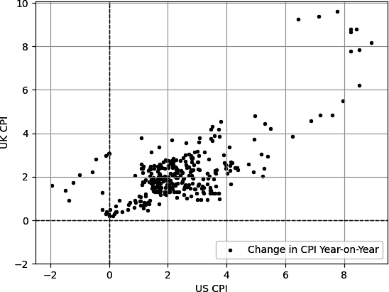

# 第三章。描述性统计和数据分析

*描述性统计* 是描述数据并尽可能多地从中提取信息的领域。基本上，描述性统计可以像数据的代表一样，因为它总结了其趋势、行为和趋势。

交易和分析从描述性统计中借用了许多指标。本章介绍了描述性统计和数据分析的主要概念。我总是发现最好的教育工具是实际的例子，因此我将使用经济时间序列的例子，即消费者价格指数（CPI），来解释这些概念。

CPI 测量城市居民每月支付的一系列产品和服务的价格；每个月都会向公众发布新的观测值，从而形成连续的时间序列。在任意两个时间段之间的通货膨胀率通过价格指数的百分比变化来衡量。例如，如果去年面包的价格是$1.00，而今天的价格是$1.01，则通胀率为 1.00%。CPI 通常以年度基础发布，这意味着它报告了当前月度观察值与 12 个月前观察值之间的差异。

导入 CPI 数据如下：

```py
# Importing the required library
import pandas_datareader as pdr
# Setting the beginning and end of the historical data
start_date = '1950-01-01'
end_date   = '2023-01-23'
# Creating a dataframe and downloading the CPI data
cpi = pdr.DataReader('CPIAUCSL', 'fred', start_date, end_date)
# Printing the latest five observations of the dataframe
print(cpi.tail())
# Checking if there are nan values in the CPI dataframe
count_nan = cpi['CPIAUCSL'].isnull().sum()
# Printing the result
print('Number of nan values in the CPI dataframe: ' + str(count_nan))
# Transforming the CPI into a year-on-year measure
cpi = cpi.pct_change(periods = 12, axis = 0) * 100
# Dropping the nan values from the rows
cpi = cpi.dropna()

```

###### 注意

您可以从书的专用[GitHub 页面](https://oreil.ly/5YGHI)下载全书中的所有代码示例。

年度变化是 CPI 上最常见的变换，因为它清晰简明地测量了总体价格水平在足够时间内的变化，以解释短期波动和季节性影响。

因此，CPI 的年度变化作为通货膨胀趋势的一个指标。这也简单易懂，并可与其他国家和历史时期进行比较，因此在决策者和经济学家中很受欢迎（尽管存在国家之间购物篮权重的缺陷）。以下部分展示了如何利用 CPI 示例对时间序列数据进行统计分析。

# 中心趋势测量

*中心趋势* 指的是将数据集总结成一个能代表它们的值的度量。最著名的中心趋势测量是均值（平均值）。*均值* 简单地是数值总和除以它们的数量。它是最能代表数据的值。均值的数学公式如下：

<math alttext="x overbar equals StartFraction 1 Over n EndFraction sigma-summation Underscript n Overscript i equals 1 Endscripts x Subscript i Baseline equals StartFraction 1 Over n EndFraction left-parenthesis x 1 plus period period period plus x Subscript n Baseline right-parenthesis"><mrow><mover accent="true"><mi>x</mi> <mo>¯</mo></mover> <mo>=</mo> <mstyle displaystyle="false" scriptlevel="0"><mfrac><mn>1</mn> <mi>n</mi></mfrac></mstyle> <msubsup><mo>∑</mo> <mrow><mi>n</mi></mrow> <mrow><mi>i</mi><mo>=</mo><mn>1</mn></mrow></msubsup> <msub><mi>x</mi> <mi>i</mi></msub> <mo>=</mo> <mstyle displaystyle="false" scriptlevel="0"><mfrac><mn>1</mn> <mi>n</mi></mfrac></mstyle> <mrow><mo>(</mo> <msub><mi>x</mi> <mn>1</mn></msub> <mo>+</mo> <mo lspace="0%" rspace="0%">.</mo> <mo lspace="0%" rspace="0%">.</mo> <mo lspace="0%" rspace="0%">.</mo> <mo>+</mo> <msub><mi>x</mi> <mi>n</mi></msub> <mo>)</mo></mrow></mrow></math>

让我们以两个数据集的简单例子来说明。假设您想在数据集 A 和数据集 B 上计算均值。你会怎么做呢？

+   数据集 A = [1, 2, 3, 4, 5]

+   数据集 B = [1, 1, 1, 1]

数据集 A 包含五个值（数量），总和为 15。使用上述公式，均值等于 3。数据集 B 包含四个值，总和为 4。这意味着均值为 1。

图 3-1 展示了自 2003 年以来的美国 CPI 同比值。较高的虚线是自 2003 年以来计算的月度平均值。较低的虚线象征着零，下面是通货紧缩期。

###### 注意

当数据集中的所有值都相同时，平均值与这些值相同。


###### 图 3-1\. 自 2003 年以来的美国 CPI 同比值，其中较高的虚线代表平均值

你可以使用以下代码创建图 3-1：

```py
# Calculating the mean of the CPI over the last 20 years
cpi_latest = cpi.iloc[–240:]
mean = cpi_latest["CPIAUCSL"].mean()
# Printing the result
print('The mean of the dataset: ' + str(mean), '%')
# Importing the required library
import matplotlib.pyplot as plt
# Plotting the latest observations in black with a label
plt.plot(cpi_latest[:], color = 'black', linewidth = 1.5, 
         label = 'Change in CPI Year-on-Year')
# Plotting horizontal lines that represent the mean and the zero threshold
plt.axhline(y = mean, color = 'red', linestyle = 'dashed', 
         label = 'Mean')
plt.axhline(y = 0, color = 'blue', linestyle = 'dashed', linewidth = 1)
plt.grid()
plt.legend()

```

平均值的输出应如下所示。

```py
The mean of the dataset: 2.49 %
```

这意味着年度平均通货膨胀率约为 2.50%。尽管美联储没有明确的通货膨胀目标，但普遍认为共识是维持年度通胀变化在约 2.00%左右，这与历史观察值相差不远。由于政治和经济动荡导致的高通胀数字自 2021 年以来，有必要回归到平均水平以稳定当前局势。这个例子为所谓的正常性（约 2.50%）自 2003 年以来提供了一个数值参考。

显然，由于 2023 年初高达约 6.00%的高通胀率，情况有些偏离正常，但有多偏离？这个问题将在接下来的部分得到回答，该部分讨论了变异性的度量。现在，让我们继续讨论中心趋势。

下一个度量是*中位数*，简单来说就是将数据集分成两个相等的部分的值。换句话说，如果你按升序排列数据集，中间的值就是中位数。在数据中有许多异常值或分布偏斜（可能会使平均值产生偏差并使其不太具代表性）时使用中位数。

通常有两个与计算中位数相关的主题。第一个与包含偶数值的数据集有关（例如，24 个观察结果），第二个与包含奇数值的数据集有关（例如，47 个观察结果）：

计算偶数数据集的中位数

如果排列的数据集具有偶数个值，则中位数是两个中间值的平均值。

计算奇数数据集的中位数

如果排列的数据集具有奇数个值，中位数就是中间值。

让我们举一个简单的例子来说明两个数据集。假设你想在数据集 A 和数据集 B 上计算中位数。你会怎么做？

+   数据集 A = [1, 2, 3, 4, 5]

+   数据集 B = [1, 2, 3, 4]

数据集 A 包含五个值，这是一个奇数。这意味着中间值是中位数。在这种情况下，它是 3（注意它也是数据集的平均值）。数据集 B 包含四个值，这是一个偶数。这意味着两个中间值的平均值是中位数。在这种情况下，它是 2.5，这是 2 和 3 之间的平均值。

图 3-2 显示自 2003 年以来的美国消费者物价指数同比值。较高的虚线是自 2003 年以来计算的月中位数。较低的虚线象征着零。基本上，这类似于图 3-1，但绘制的是中位数而不是均值。


###### 图 3-2。自 2003 年以来的美国消费者物价指数同比值，其中较高的虚线表示中位数

您可以使用以下代码创建图 3-2：

```py
# Calculating the median
median = cpi_latest["CPIAUCSL"].median() 
# Printing the result
print('The median of the dataset: ' + str(median), '%')
# Plotting the latest observations in black with a label
plt.plot(cpi_latest[:], color = 'black', linewidth = 1.5, 
         label = 'Change in CPI Year-on-Year')
# Plotting horizontal lines that represent the median and the zero threshold
plt.axhline(y = median, color = 'red', linestyle = 'dashed', 
            label = 'Median')
plt.axhline(y = 0, color = 'blue', linestyle = 'dashed', linewidth = 1)
plt.grid()
plt.legend()

```

中位数的输出应该如下所示：

```py
The median of the dataset: 2.12 %
```

显然，中位数受最近来自不寻常环境的异常值影响较小。中位数约为 2.12%，这与暗示的目标 2.00%更加一致。

###### 注意

请记住，第六章将为您提供关于本章节中所见 Python 代码的所有信息，因此您不必担心是否会错过编码概念。

本节最后的中心趋势度量是*众数*，它是最常见的值（但在数据分析中使用最少的）。

让我们以两个数据集的简单示例为例。假设您要计算以下数据集的众数。您将如何做呢？

+   数据集 A = [1, 2, 2, 4, 5]

+   数据集 B = [1, 2, 3, 4]

+   数据集 C = [1, 1, 2, 2, 3]

数据集 A 包含两次值为 2，这使其成为众数。数据集 B 没有众数，因为每个值仅观察一次。数据集 C 是*多峰的*，因为它包含多个众数（即 1 和 2）。

###### 注意

众数在处理分类变量（如信用评级）时很有用，而不适用于连续变量（如价格和回报时间序列）。

您不太可能使用众数来分析时间序列，因为均值和中位数更为有用。以下是在金融分析中使用均值和中位数的几个示例：

+   在价格数据上计算移动平均值以检测潜在趋势。您将在第五章中了解更多关于移动平均线的内容。

+   计算基于价格衍生指标的滚动中位数以检测其中性区域。

+   使用历史均值计算证券的预期回报。

中心趋势度量是理解重要的，特别是因为均值和中位数不仅作为独立指标广泛使用，还作为更复杂的度量的组成部分。

###### 注意

本节的关键要点如下：

+   主要有三种中心趋势度量：均值、中位数和众数。

+   均值是总和除以数量，而中位数是将数据分成两半的值。众数是数据集中出现最频繁的值。

# 变异性的度量

*变异性的度量*描述数据集中数值相对于中心趋势度量（主要是均值）的散布程度。最知名的变异性度量是方差。

*方差*描述了一组数字与它们的平均值之间的变异性。方差公式背后的理念是确定每个数据点距离均值的距离，然后对这些偏差进行平方以确保所有数字都是正数（因为距离不能是负数），最后将偏差除以观察次数。

计算方差的公式如下：

<math alttext="sigma squared equals StartFraction 1 Over n EndFraction sigma-summation Underscript n Overscript i equals 1 Endscripts left-parenthesis x Subscript i Baseline minus x overbar right-parenthesis squared"><mrow><msup><mi>σ</mi> <mn>2</mn></msup> <mo>=</mo> <mstyle displaystyle="false" scriptlevel="0"><mfrac><mn>1</mn> <mi>n</mi></mfrac></mstyle> <msubsup><mo>∑</mo> <mrow><mi>n</mi></mrow> <mrow><mi>i</mi><mo>=</mo><mn>1</mn></mrow></msubsup> <msup><mrow><mo>(</mo><msub><mi>x</mi> <mi>i</mi></msub> <mo>-</mo><mover accent="true"><mi>x</mi> <mo>¯</mo></mover><mo>)</mo></mrow> <mn>2</mn></msup></mrow></math>

此公式计算每个数据点与均值之间偏差的平方和，从而给出不同的距离观察值，然后计算这些距离观察值的平均值。

让我们来看两个数据集的简单例子。假设你想计算数据集 A 和数据集 B 的方差。你会怎么做？

+   数据集 A = [1, 2, 3, 4, 5]

+   数据集 B = [5, 5, 5, 5]

第一步是计算数据集的均值，因为这是你将计算数据变异性的基准。数据集 A 的均值为 3。下一步计算方差：

<math alttext="left-parenthesis x 1 minus x overbar right-parenthesis squared equals left-parenthesis 1 minus 3 right-parenthesis squared equals 4"><mrow><msup><mrow><mo>(</mo><msub><mi>x</mi> <mn>1</mn></msub> <mo>-</mo><mover accent="true"><mi>x</mi> <mo>¯</mo></mover><mo>)</mo></mrow> <mn>2</mn></msup> <mo>=</mo> <msup><mrow><mo>(</mo><mn>1</mn><mo>-</mo><mn>3</mn><mo>)</mo></mrow> <mn>2</mn></msup> <mo>=</mo> <mn>4</mn></mrow></math>

<math alttext="left-parenthesis x 2 minus x overbar right-parenthesis squared equals left-parenthesis 2 minus 3 right-parenthesis squared equals 1"><mrow><msup><mrow><mo>(</mo><msub><mi>x</mi> <mn>2</mn></msub> <mo>-</mo><mover accent="true"><mi>x</mi> <mo>¯</mo></mover><mo>)</mo></mrow> <mn>2</mn></msup> <mo>=</mo> <msup><mrow><mo>(</mo><mn>2</mn><mo>-</mo><mn>3</mn><mo>)</mo></mrow> <mn>2</mn></msup> <mo>=</mo> <mn>1</mn></mrow></math>

<math alttext="left-parenthesis x 3 minus x overbar right-parenthesis squared equals left-parenthesis 3 minus 3 right-parenthesis squared equals 0"><mrow><msup><mrow><mo>(</mo><msub><mi>x</mi> <mn>3</mn></msub> <mo>-</mo><mover accent="true"><mi>x</mi> <mo>¯</mo></mover><mo>)</mo></mrow> <mn>2</mn></msup> <mo>=</mo> <msup><mrow><mo>(</mo><mn>3</mn><mo>-</mo><mn>3</mn><mo>)</mo></mrow> <mn>2</mn></msup> <mo>=</mo> <mn>0</mn></mrow></math>

<math alttext="left-parenthesis x 4 minus x overbar right-parenthesis squared equals left-parenthesis 4 minus 3 right-parenthesis squared equals 1"><mrow><msup><mrow><mo>(</mo><msub><mi>x</mi> <mn>4</mn></msub> <mo>-</mo><mover accent="true"><mi>x</mi> <mo>¯</mo></mover><mo>)</mo></mrow> <mn>2</mn></msup> <mo>=</mo> <msup><mrow><mo>(</mo><mn>4</mn><mo>-</mo><mn>3</mn><mo>)</mo></mrow> <mn>2</mn></msup> <mo>=</mo> <mn>1</mn></mrow></math>

<math alttext="left-parenthesis x 5 minus x overbar right-parenthesis squared equals left-parenthesis 5 minus 3 right-parenthesis squared equals 4"><mrow><msup><mrow><mo>(</mo><msub><mi>x</mi> <mn>5</mn></msub> <mo>-</mo><mover accent="true"><mi>x</mi> <mo>¯</mo></mover><mo>)</mo></mrow> <mn>2</mn></msup> <mo>=</mo> <msup><mrow><mo>(</mo><mn>5</mn><mo>-</mo><mn>3</mn><mo>)</mo></mrow> <mn>2</mn></msup> <mo>=</mo> <mn>4</mn></mrow></math>

前述结果总结如下：

<math alttext="4 plus 1 plus 0 plus 1 plus 4 equals 10"><mrow><mn>4</mn> <mo>+</mo> <mn>1</mn> <mo>+</mo> <mn>0</mn> <mo>+</mo> <mn>1</mn> <mo>+</mo> <mn>4</mn> <mo>=</mo> <mn>10</mn></mrow></math>

最后，结果除以观察数以找到方差：

<math alttext="sigma squared equals StartFraction 10 Over 5 EndFraction equals 2"><mrow><msup><mi>σ</mi> <mn>2</mn></msup> <mo>=</mo> <mstyle displaystyle="false" scriptlevel="0"><mfrac><mn>10</mn> <mn>5</mn></mfrac></mstyle> <mo>=</mo> <mn>2</mn></mrow></math>

至于数据集 B，你应该从直觉上考虑。如果观察值全部相等，它们都代表数据集，这也意味着它们是自己的均值。在这种情况下，考虑数据的方差会怎么说？

如果你的回答是方差为零，那么你是正确的。在数学上，你可以如下计算它：

<math alttext="left-parenthesis x 1 minus x overbar right-parenthesis squared equals left-parenthesis 5 minus 5 right-parenthesis squared equals 0"><mrow><msup><mrow><mo>(</mo><msub><mi>x</mi> <mn>1</mn></msub> <mo>-</mo><mover accent="true"><mi>x</mi> <mo>¯</mo></mover><mo>)</mo></mrow> <mn>2</mn></msup> <mo>=</mo> <msup><mrow><mo>(</mo><mn>5</mn><mo>-</mo><mn>5</mn><mo>)</mo></mrow> <mn>2</mn></msup> <mo>=</mo> <mn>0</mn></mrow></math>

<math alttext="left-parenthesis x 2 minus x overbar right-parenthesis squared equals left-parenthesis 5 minus 5 right-parenthesis squared equals 0"><mrow><msup><mrow><mo>(</mo><msub><mi>x</mi> <mn>2</mn></msub> <mo>-</mo><mover accent="true"><mi>x</mi> <mo>¯</mo></mover><mo>)</mo></mrow> <mn>2</mn></msup> <mo>=</mo> <msup><mrow><mo>(</mo><mn>5</mn><mo>-</mo><mn>5</mn><mo>)</mo></mrow> <mn>2</mn></msup> <mo>=</mo> <mn>0</mn></mrow></math>

<math alttext="left-parenthesis x 3 minus x overbar right-parenthesis squared equals left-parenthesis 5 minus 5 right-parenthesis squared equals 0"><mrow><msup><mrow><mo>(</mo><msub><mi>x</mi> <mn>3</mn></msub> <mo>-</mo><mover accent="true"><mi>x</mi> <mo>¯</mo></mover><mo>)</mo></mrow> <mn>2</mn></msup> <mo>=</mo> <msup><mrow><mo>(</mo><mn>5</mn><mo>-</mo><mn>5</mn><mo>)</mo></mrow> <mn>2</mn></msup> <mo>=</mo> <mn>0</mn></mrow></math>

<math alttext="left-parenthesis x 4 minus x overbar right-parenthesis squared equals left-parenthesis 5 minus 5 right-parenthesis squared equals 0"><mrow><msup><mrow><mo>(</mo><msub><mi>x</mi> <mn>4</mn></msub> <mo>-</mo><mover accent="true"><mi>x</mi> <mo>¯</mo></mover><mo>)</mo></mrow> <mn>2</mn></msup> <mo>=</mo> <msup><mrow><mo>(</mo><mn>5</mn><mo>-</mo><mn>5</mn><mo>)</mo></mrow> <mn>2</mn></msup> <mo>=</mo> <mn>0</mn></mrow></math>

前述结果总和为零，如果你将零除以 4（数据集的数量），你将得到零。直觉上，没有方差，因为所有值都是常数，它们不偏离其均值：

<math alttext="sigma squared equals StartFraction 0 Over 4 EndFraction equals 0"><mrow><msup><mi>σ</mi> <mn>2</mn></msup> <mo>=</mo> <mstyle displaystyle="false" scriptlevel="0"><mfrac><mn>0</mn> <mn>4</mn></mfrac></mstyle> <mo>=</mo> <mn>0</mn></mrow></math>

在通货膨胀的例子中，你可以使用以下代码计算方差：

```py
# Calculating the variance
variance = cpi_latest["CPIAUCSL"].var() 
# Printing the result
print('The variance of the dataset: ' + str(variance), '%')
```

方差的输出应该如下所示：

```py
The variance of the dataset: 3.62 %
```

尽管如此，存在一个缺陷，即方差代表的是不可与均值比较的平方值，因为它们使用不同的单位。通过对方差取平方根轻松修正此问题。这带来了下一个变异性度量，*标准差*。它是方差的平方根，是值与均值的平均偏差。  

低标准差表明值倾向于接近均值（低波动性），而高标准差表明值相对于其均值分布在更广的范围内（高波动性）。

###### 注意

*标准差*和*波动率*这两个术语可以互换使用，它们指的是同一件事情。

计算标准差的公式如下：

<math alttext="sigma equals StartRoot StartFraction 1 Over n EndFraction sigma-summation Underscript n Overscript i equals 1 Endscripts left-parenthesis x Subscript i Baseline minus x overbar right-parenthesis squared EndRoot"><mrow><mi>σ</mi> <mo>=</mo> <msqrt><mrow><mstyle displaystyle="false" scriptlevel="0"><mfrac><mn>1</mn> <mi>n</mi></mfrac></mstyle> <msubsup><mo>∑</mo> <mrow><mi>n</mi></mrow> <mrow><mi>i</mi><mo>=</mo><mn>1</mn></mrow></msubsup> <msup><mrow><mo>(</mo><msub><mi>x</mi> <mi>i</mi></msub> <mo>-</mo><mover accent="true"><mi>x</mi> <mo>¯</mo></mover><mo>)</mo></mrow> <mn>2</mn></msup></mrow></msqrt></mrow></math>

如果考虑前面的方差示例，则可以如下找到标准差：

<math alttext="sigma Subscript upper D a t a s e t upper A Baseline equals StartRoot 2 EndRoot equals 1.41"><mrow><msub><mi>σ</mi> <mrow><mi>D</mi><mi>a</mi><mi>t</mi><mi>a</mi><mi>s</mi><mi>e</mi><mi>t</mi><mi>A</mi></mrow></msub> <mo>=</mo> <msqrt><mn>2</mn></msqrt> <mo>=</mo> <mn>1</mn> <mo lspace="0%" rspace="0%">.</mo> <mn>41</mn></mrow></math>

<math alttext="sigma Subscript upper D a t a s e t upper B Baseline equals StartRoot 0 EndRoot equals 0"><mrow><msub><mi>σ</mi> <mrow><mi>D</mi><mi>a</mi><mi>t</mi><mi>a</mi><mi>s</mi><mi>e</mi><mi>t</mi><mi>B</mi></mrow></msub> <mo>=</mo> <msqrt><mn>0</mn></msqrt> <mo>=</mo> <mn>0</mn></mrow></math>

由于标准差和均值使用相同的单位，所以标准差通常与均值一起使用。当我在下一节讨论正态分布函数时，您很快就会理解这个统计量的重要性。

您可以使用以下代码在 Python 中计算标准差：

```py
# Calculating the standard deviation
standard_deviation = cpi_latest["CPIAUCSL"].std() 
# Printing the result
print('The standard deviation of the dataset: ' + 
      str(standard_deviation), '%')

```

标准差的输出应如下所示：

```py
The standard deviation of the dataset: 1.90 %
```

您应该如何解释标准差？平均而言，CPI 年度同比值 tend to be ±1.90%，而同期均值为 2.49%。在“形状的度量”中，您将看到如何更好地利用标准差数据。

本节讨论的最后一个变异性度量是范围。*范围*是一个非常简单的统计量，显示了数据集中最大值和最小值之间的距离。这让您快速了解了两个历史极端值。查找范围的公式如下：

<math alttext="upper R a n g e equals m a x left-parenthesis x right-parenthesis minus m i n left-parenthesis x right-parenthesis"><mrow><mi>R</mi> <mi>a</mi> <mi>n</mi> <mi>g</mi> <mi>e</mi> <mo>=</mo> <mi>m</mi> <mi>a</mi> <mi>x</mi> <mo>(</mo> <mi>x</mi> <mo>)</mo> <mo>-</mo> <mi>m</mi> <mi>i</mi> <mi>n</mi> <mo>(</mo> <mi>x</mi> <mo>)</mo></mrow></math>

在 Python 中，您可以轻松地做到这一点，因为有内置函数可以在给定一组数据的情况下显示最大值和最小值：

```py
# Calculating the range
range_metric = max(cpi["CPIAUCSL"]) – min(cpi["CPIAUCSL"])
# Printing the result
print('The range of the dataset: ' + str(range_metric), '%')

```

上述代码的输出应如下所示：

```py
The range of the dataset: 16.5510 %
```

图 3-3 显示了自 1951 年以来的 CPI 值。对角虚线表示范围，水平虚线表示零阈值。

CPI 的范围显示了通货膨胀衡量值从一个时期到另一个时期的变化大小。不同国家通胀数字的年度变化各不相同。一般来说，像法国和美国这样的发达国家在稳定时期具有稳定的变化（在稳定时期），而像土耳其和阿根廷这样的新兴和前沿世界国家的通胀数字则更具波动性和更极端。


###### 图 3-3\. 自 1951 年以来美国 CPI 年度同比变化，带有表示范围的对角虚线

###### 注

本节的要点如下：

+   您应该知道的三个关键变异性指标是方差、标准差和范围。

+   标准差是方差的平方根。这样做是为了使其可与均值进行比较。

+   范围是数据集中最高值和最低值之间的差异。它是对观察值总体延伸的快速概览。

# 形状的度量

*形状的度量*描述了数据集中各个值围绕中心趋势度量的分布。均值和标准差是描述正态分布的两个因素。标准差描述了数据的扩散或分散程度，而均值反映了分布的中心。

*概率分布*是描述随机实验中不同结果或事件发生可能性的数学函数。换句话说，它给出了随机变量所有可能值的概率。

有许多类型的概率分布，包括离散和连续分布。*离散分布* 只能取有限数量的值。最著名的离散分布包括伯努利分布、二项分布和泊松分布。

*连续分布* 用于可以在给定范围内取任意值的随机变量（如股票价格和回报）。最著名的分布是正态分布。

*正态分布*（也称为*高斯分布*）是一种连续概率分布，其在均值周围对称且呈钟形。它是统计分析中最广泛使用的分布之一，通常用于描述诸如年龄、体重和考试成绩等自然现象。图 3-4 展示了正态分布的形状。


###### 图 3-4\. 均值 = 0，标准差 = 1 的正态分布图

您可以使用以下代码块生成图 3-4：

```py
# Importing libraries
import matplotlib.pyplot as plt
import numpy as np
import scipy.stats as stats
# Generate data for the plot
data = np.linspace(–3, 3, num = 1000)
# Define the mean and standard deviation of the normal distribution
mean = 0
std = 1
# Generate the function of the normal distribution
pdf = stats.norm.pdf(data, mean, std)
# Plot the normal distribution plot
plt.plot(data, pdf, '-', color = 'black', lw = 2)
plt.axvline(mean, color = 'black', linestyle = '--')
plt.grid()
plt.show()
```

###### 注

由于正态分布变量很常见，大多数统计测试和模型假设分析的数据是正态的。在金融回报中，它们被假设为正态，即使它们经历了一种称为偏度和峰度的形状，这两个测量在本节中讨论。

在正态分布中，数据围绕平均值对称分布，这也意味着平均数等于中位数和众数。此外，约 68% 的数据落在均值的一个标准差范围内，约 95% 落在两个标准差范围内，约 99.7% 落在三个标准差范围内。这一特性使得正态分布成为推断的有用工具。

总结来说，您应从正态分布中保留以下内容：

+   平均数和标准差描述了分布。

+   平均数将分布一分为二，使其等于中位数。由于对称性质，众数也等于平均数和中位数。

现在让我们讨论形状的测量。形状的第一个测量是偏度。*偏度* 描述了分布的不对称性。它分析了分布偏离对称的程度。

正态分布的偏度等于零。这意味着分布在其平均值周围完全对称，均值两侧的数据点数量相等。

*正偏* 表示分布向右有一个长尾，这意味着平均数大于中位数，因为平均数对异常值敏感，这些异常值会使平均数上升（因此，在*x*轴的右侧）。类似地，众数将是三个中心趋势测量中的最小值。图 3-5 展示了正偏。


###### 图 3-5\. 正偏分布的示例

负偏表示分布的左侧尾部较长，这意味着均值低于中位数。类似地，众数将是三种中心趋势测量之间的最大值。图 3-6 显示了负偏斜。


###### 图 3-6\. 一个负偏斜分布的示例

###### 注

在金融市场中如何解释偏度？如果分布呈正偏斜，则意味着高于均值的收益更多（分布的尾部在正侧更长）。

如果分布呈负偏斜，则意味着低于均值的收益更多（分布的尾部在负侧更长）。

一个收益系列的偏度可以提供有关投资的风险和回报的信息。例如，一个呈正偏的收益系列可能表明投资存在大量大额收益的潜力，但也伴随着频繁的小额损失的风险。

计算偏度的公式如下：

<math alttext="mu overTilde Subscript 3 Baseline equals StartFraction sigma-summation Underscript n equals 1 Overscript i Endscripts left-parenthesis x Subscript i Baseline minus x overbar right-parenthesis cubed Over upper N sigma cubed EndFraction"><mrow><msub><mover accent="true"><mi>μ</mi> <mo>˜</mo></mover> <mn>3</mn></msub> <mo>=</mo> <mstyle displaystyle="false" scriptlevel="0"><mfrac><mrow><msubsup><mo>∑</mo> <mrow><mi>n</mi><mo>=</mo><mn>1</mn></mrow> <mi>i</mi></msubsup> <msup><mrow><mo>(</mo><msub><mi>x</mi> <mi>i</mi></msub> <mo>-</mo><mover accent="true"><mi>x</mi> <mo>¯</mo></mover><mo>)</mo></mrow> <mn>3</mn></msup></mrow> <mrow><mi>N</mi><msup><mi>σ</mi> <mn>3</mn></msup></mrow></mfrac></mstyle></mrow></math>

让我们检查自 2003 年以来美国 CPI 年同比数据的偏度：

```py
# Calculating the skew
skew = cpi_latest["CPIAUCSL"].skew() 
# Printing the result
print('The skew of the dataset: ' + str(skew))

```

上述代码的输出应如下所示：

```py
The skew of the dataset: 1.17
```

数据的偏度为 1.17，但这意味着什么？让我们绘制数据分布图来便于解释。您可以使用以下代码片段来完成这一点：

```py
# Plotting the histogram of the data
fig, ax = plt.subplots()
ax.hist(cpi['CPIAUCSL'], bins = 30, edgecolor = 'black', color = 'white')
# Add vertical lines for better interpretation
ax.axvline(mean, color='black', linestyle='--', label = 'Mean', 
           linewidth = 2)
ax.axvline(median, color='grey', linestyle='-.', label = 'Median', 
           linewidth = 2)
plt.grid()
plt.legend()
plt.show()

```

图 3-7 显示了上一个代码片段的结果。由于均值大于中位数且偏度为正（大于零），数据显然呈正偏斜。


###### 图 3-7\. 美国 CPI 年同比数据分布，显示正偏斜

请记住，偏度是概率分布的不对称性度量。因此，它衡量分布偏离正态分布的程度。解释偏度的经验法则如下：

+   如果偏度在–0.5 到 0.5 之间，则数据被认为是对称的。

+   如果偏度在–1.0 到–0.5 或者 0.5 到 1.0 之间，则数据被认为是轻微偏斜的。

+   如果偏度小于–1.0 或大于 1.0，则数据被认为是高度偏斜的。

正偏表示什么？在这种情况下，1.17 表示高度正偏的数据（在正侧），这与在经济增长时支持通货膨胀的货币政策一致（存在少数导致偏度的通货膨胀性波动）。

###### 注

有趣的是，对于偏斜分布来说，中位数可能是首选的度量，因为均值往往会被异常值拉动，从而扭曲其值。

下一个形状的度量是*kurtosis*，它描述了一个分布相对于正态分布的尖峰或平坦程度。Kurtosis 描述了一个分布的尾部，特别是尾部是否比正态分布的更厚或更薄。

正态分布的峰度为 3，这意味着它是一个*中峰态*分布。如果一个分布的峰度大于 3，则被称为*尖峰态*，意味着比正态分布更高的峰值和更胖的尾巴。如果一个分布的峰度小于 3，则被称为*低峰态*，意味着比正态分布更扁平的峰值和更细的尾巴。

计算峰度的公式如下：

<math alttext="k equals StartFraction sigma-summation Underscript n equals 1 Overscript i Endscripts left-parenthesis x Subscript i Baseline minus x overbar right-parenthesis Superscript 4 Baseline Over upper N sigma Superscript 4 Baseline EndFraction"><mrow><mi>k</mi> <mo>=</mo> <mstyle displaystyle="false" scriptlevel="0"><mfrac><mrow><msubsup><mo>∑</mo> <mrow><mi>n</mi><mo>=</mo><mn>1</mn></mrow> <mi>i</mi></msubsup> <msup><mrow><mo>(</mo><msub><mi>x</mi> <mi>i</mi></msub> <mo>-</mo><mover accent="true"><mi>x</mi> <mo>¯</mo></mover><mo>)</mo></mrow> <mn>4</mn></msup></mrow> <mrow><mi>N</mi><msup><mi>σ</mi> <mn>4</mn></msup></mrow></mfrac></mstyle></mrow></math>

有时峰度被测量为*过量峰度*，以使其起始值为零（对于正态分布）。这意味着从 3 中减去峰度测量值以计算过量峰度。让我们计算美国 CPI 年度数据的过量峰度：

```py
# Calculating the excess kurtosis
excess_kurtosis = cpi_latest["CPIAUCSL"].kurtosis() 
# Printing the result
print('The excess kurtosis of the dataset: ' + str(excess_kurtosis))

```

前述代码的输出应如下所示：

```py
The excess kurtosis of the dataset: 2.15
```

在过去 20 年的美国 CPI 年度值的情况下，过量峰度为 2.15，这更符合尖峰态（峰值更高且尾部更胖）分布。正值表示分布比正态更尖峭，而负峰度表示形状比正态更扁平。

我们将在描述统计类别中讨论的最终指标是分位数。*分位数*是形状和变异性的度量，因为它们提供有关值的分布（形状）和这些值的离散度（变异性）的信息。最常用的类型是四分位数。

*四分位数*将数据集分为四等份。通过将数据按顺序排列然后执行分割来完成此操作。考虑表 3-1 作为一个例子。

表 3-1\. 按升序排列的数字

| Value |
| --- |
| 1 |
| 2 |
| 4 |
| 5 |
| 7 |
| 8 |
| 9 |

四分位数如下：

+   下四分位数（Q1）是第一四分位数，在本例中为 2。

+   中间四分位数（Q2）也是中位数，在本例中为 5。

+   在本例中，上四分位数（Q3）为 8。

从数学上讲，可以使用以下公式计算 Q1 和 Q3：

<math alttext="upper Q 1 equals left-parenthesis StartFraction n plus 1 Over 4 EndFraction right-parenthesis"><mrow><msub><mi>Q</mi> <mn>1</mn></msub> <mo>=</mo> <mrow><mo>(</mo> <mfrac><mrow><mi>n</mi><mo>+</mo><mn>1</mn></mrow> <mn>4</mn></mfrac> <mo>)</mo></mrow></mrow></math>

<math alttext="upper Q 3 equals 3 left-parenthesis StartFraction n plus 1 Over 4 EndFraction right-parenthesis"><mrow><msub><mi>Q</mi> <mn>3</mn></msub> <mo>=</mo> <mn>3</mn> <mrow><mo>(</mo> <mfrac><mrow><mi>n</mi><mo>+</mo><mn>1</mn></mrow> <mn>4</mn></mfrac> <mo>)</mo></mrow></mrow></math>

记住，公式的结果给出的是值的排名，而不是值本身：

<math alttext="upper Q 1 equals left-parenthesis StartFraction 7 plus 1 Over 4 EndFraction right-parenthesis equals 2 Superscript n d Baseline t e r m equals 2"><mrow><msub><mi>Q</mi> <mn>1</mn></msub> <mo>=</mo> <mrow><mo>(</mo> <mfrac><mrow><mn>7</mn><mo>+</mo><mn>1</mn></mrow> <mn>4</mn></mfrac> <mo>)</mo></mrow> <mo>=</mo> <msup><mn>2</mn> <mrow><mi>n</mi><mi>d</mi></mrow></msup> <mi>t</mi> <mi>e</mi> <mi>r</mi> <mi>m</mi> <mo>=</mo> <mn>2</mn></mrow></math>

<math alttext="upper Q 3 equals 3 left-parenthesis StartFraction 7 plus 1 Over 4 EndFraction right-parenthesis equals 6 Superscript t h Baseline t e r m equals 8"><mrow><msub><mi>Q</mi> <mn>3</mn></msub> <mo>=</mo> <mn>3</mn> <mrow><mo>(</mo> <mfrac><mrow><mn>7</mn><mo>+</mo><mn>1</mn></mrow> <mn>4</mn></mfrac> <mo>)</mo></mrow> <mo>=</mo> <msup><mn>6</mn> <mrow><mi>t</mi><mi>h</mi></mrow></msup> <mi>t</mi> <mi>e</mi> <mi>r</mi> <mi>m</mi> <mo>=</mo> <mn>8</mn></mrow></math>

*四分位间距*（IQR）是 Q3 和 Q1 之间的差异，并提供数据集中前 50%值的扩展度量。由于依赖中间值，IQR 对异常值具有鲁棒性，并提供大部分值扩展的简要摘要。根据以下公式，表 3-1 中数据的 IQR 为 6：

<math alttext="upper I upper Q upper R equals upper Q 3 minus upper Q 1"><mrow><mi>I</mi> <mi>Q</mi> <mi>R</mi> <mo>=</mo> <msub><mi>Q</mi> <mn>3</mn></msub> <mo>-</mo> <msub><mi>Q</mi> <mn>1</mn></msub></mrow></math>

<math alttext="upper I upper Q upper R equals 8 minus 2 equals 6"><mrow><mi>I</mi> <mi>Q</mi> <mi>R</mi> <mo>=</mo> <mn>8</mn> <mo>-</mo> <mn>2</mn> <mo>=</mo> <mn>6</mn></mrow></math>

IQR 是一个有价值的指标，可以用作许多不同模型中的输入或风险度量。它还可以用于检测数据中的异常值，因为它对它们是免疫的。此外，IQR 可以帮助评估所分析资产的当前波动性，进而与其他方法结合使用以创建更强大的模型。如理解的那样，IQR 在有用性和解释性上优于范围度量，因为前者容易受到异常值的影响。

计算四分位数时要小心，因为有许多方法用于对同一数据集进行不同的计算。最重要的是确保在所有分析中使用相同的方法。用于计算表 3-1 中四分位数的方法称为*图基的铰链*方法。

###### 注意

本节的主要要点如下：

+   正态分布是一种连续的概率分布，具有钟形曲线。大多数数据聚集在均值附近。正态分布曲线的均值、中位数和众数都相等。

+   偏度测量概率分布的不对称性。

+   峰度度量概率分布的尖峰程度。超额峰度通常用于描述当前的概率分布。

+   分位数将排列好的数据集分为相等的部分。最常用的分位数是将数据分为四等份的四分位数。

+   IQR 是第三四分位数与第一四分位数之间的差异。它对离群值免疫，因此在数据分析中非常有帮助。

# 数据可视化

在第一章中，我介绍了数据科学过程中的六个步骤。第 4 步是数据可视化。本节将展示几种以清晰的视觉方式呈现数据的方法，使您能够对其进行解释。

许多类型的统计图用于可视化数据。让我们讨论其中一些。

*散点图*用于绘制两个变量之间的关系，通过对应于变量交集的点。要创建散点图，请在 CPI 数据上使用以下代码：

```py
# Importing the required library
import matplotlib.pyplot as plt
# Resetting the index
cpi = cpi.reset_index()
# Creating the chart
fig, ax = plt.subplots()
ax.scatter(cpi['DATE'], cpi['CPIAUCSL'], color = 'black', 
           s = 8,  label = 'Change in CPI Year-on-Year')
plt.grid()
plt.legend()
plt.show()

```

图 3-8 显示了一个时间散点图的结果。这意呈现了 CPI 数据作为第一个变量（y 轴）和时间作为第二个变量（x 轴）。然而，散点图更常用于比较变量；因此，移除时间变量可以提供更多的见解。


###### 图 3-8. 美国 CPI 数据与时间轴的散点图

将英国 CPI 年度变化与美国 CPI 年度变化进行比较。注意在图 3-9 中它们之间的正相关性，因为其中一个变量的较高值与另一个变量的较高值相关。相关性是您将在下一节详细了解的关键度量。绘制图 3-9 的代码如下：

```py
# Setting the beginning and end of the historical data
start_date = '1995-01-01'
end_date   = '2022-12-01'
# Creating a dataframe and downloading the CPI data
cpi_us = pdr.DataReader('CPIAUCSL', 'fred', start_date, end_date)
cpi_uk = pdr.DataReader('GBRCPIALLMINMEI', 'fred', start_date, end_date)
# Dropping the NaN values from the rows
cpi_us = cpi_us.dropna()
cpi_uk = cpi_uk.dropna()
# Transforming the CPI into a year-on-year measure
cpi_us = cpi_us.pct_change(periods = 12, axis = 0) * 100
cpi_us = cpi_us.dropna()
cpi_uk = cpi_uk.pct_change(periods = 12, axis = 0) * 100
cpi_uk = cpi_uk.dropna()
# Creating the chart
fig, ax = plt.subplots()
ax.scatter(cpi_us['CPIAUCSL'], cpi_uk['GBRCPIALLMINMEI'], 
           color = 'black', s = 8, label = 'Change in CPI Year-on-Year')
# Adding a few aesthetic elements to the chart
ax.set_xlabel('US CPI')
ax.set_ylabel('UK CPI')
ax.axvline(x = 0, color='black', linestyle = 'dashed', linewidth = 1)
ax.axhline(y = 0, color='black', linestyle = 'dashed', linewidth = 1)
ax.set_ylim(-2,)
plt.grid()
plt.legend()
plt.show()

```



###### 图 3-9. 英国 CPI 数据与美国 CPI 数据的散点图

当可视化数据之间的相关性时，散点图非常有效。它们也很容易绘制和解释。通常，当点分散成一条向上倾斜的对角线时，可以假定相关性为正，因为当 x 轴上的变量增加时，y 轴上的变量也会增加。

另一方面，当可以画出一条斜向下的对角线来表示不同变量时，可能存在负相关。负相关意味着无论*x*轴上的变量如何移动，*y*轴上的变量很可能以相反的方式移动。

图 3-10 展示了来自图 3-9 的两个通胀数据集之间的最佳拟合线。请注意它是向上倾斜的。


###### 图 3-10\. 英国 CPI 数据与美国 CPI 数据的散点图及最佳拟合线

现在我们来看另一种图表方法。*折线图*是最基本的绘图类型，本质上是联结的散点图，大多数情况下都是针对时间轴（*x*轴）绘制的。你在图 3-1 和图 3-2 中看到了折线图。

折线图的优点在于简单易行。它们还展示了时间序列的演变，有助于检测趋势和模式。在第五章中，你将学习更复杂的蜡烛图，用于绘制金融时间序列。图 3-11 展示了自 1951 年以来美国 CPI 数据的基本折线图。


###### 图 3-11\. 美国 CPI 数据的折线图与时间轴

要创建图 3-11，你可以使用以下代码片段：

```py
# Creating the chart
plt.plot(cpi['DATE'], cpi['CPIAUCSL'], color = 'black', 
         label = 'Change in CPI Year-on-Year')
plt.grid()
plt.legend()
plt.show()

```

接下来是*条形图*，用于显示变量（通常是分类的）的分布。图 3-12 展示了自 2022 年初以来的美国 CPI 数据的条形图。


###### 图 3-12\. 美国 CPI 数据的条形图与时间轴

要创建图 3-12，你可以使用以下代码片段：

```py
# Taking the values of the previous twelve months
cpi_one_year = cpi.iloc[-12:]
# Creating the chart
plt.bar(cpi_one_year['DATE'], cpi_one_year['CPIAUCSL'], 
        color = 'black', label = 'Change in CPI Year-on-Year', width = 7)
plt.grid()
plt.legend()
plt.show()

```

条形图在绘制美国 CPI 或股票价格等连续数据时存在局限性。当比例失调时，它们也可能误导。由于后一原因，当处理大型数据集时，直方图更为合适。

*直方图*是一种特定类型的条形图，用于显示连续数据的频率分布，通过条形来表示统计信息。它指示落入特定类别或数值区间的观察次数。直方图的示例见图 3-13（还参见图 3-7）。


###### 图 3-13\. 美国 CPI 数据的直方图

要创建图 3-13，你可以使用以下代码片段：

```py
# Creating the chart
fig, ax = plt.subplots()
ax.hist(cpi['CPIAUCSL'], bins = 30, edgecolor = 'black', 
        color = 'white', label = 'Change in CPI Year-on-Year',)
# Add vertical lines for better interpretation
ax.axvline(0, color = 'black')
plt.grid()
plt.legend()
plt.show()

```

注意条形图是针对时间轴绘制的，而直方图则没有时间范围，因为它是一组数值，旨在显示整体分布情况。从视觉上看，你可以看到分布的正偏度。

统计学中另一种经典绘图技术是*箱形图*。它用于可视化连续变量的分布，同时包括中位数和四分位数以及异常值。理解箱形图的方法如下：

+   箱子代表 IQR。箱子在第一四分位数和第三四分位数之间绘制。箱子的高度表示该范围内数据的分布。

+   箱子内的线表示中位数。

+   “须”从箱子的顶部和底部延伸到最高和最低数据点，这些点仍然在 1.5 倍 IQR 范围内。这些数据点称为*异常值*，在图上表示为单个点。

图 3-14 显示了自 1950 年以来美国 CPI 数据的箱形图。


###### 图 3-14\. 美国 CPI 数据的箱形图

您还可以绘制不带异常值的数据（任何值，其值超过箱子长度的 1.5 倍）。要创建图 3-14，您可以使用以下代码片段：

```py
# Creating the chart
cpi_latest = cpi.iloc[–240:]
fig, ax = plt.subplots()
ax.boxplot(cpi_latest['CPIAUCSL'])
plt.grid()
plt.legend()
plt.show()

```

要从图中去除异常值，您只需使用以下小调整：

```py
# Replace the corresponding code line with the following
fig, ax = plt.subplots()
ax.boxplot(cpi_latest['CPIAUCSL'], showfliers = False)
```

这将为您提供图 3-15。


###### 图 3-15\. 不含异常值的美国 CPI 数据箱形图

存在许多其他数据可视化技术，例如*热力图*（通常与相关数据和温度映射一起使用）和*饼图*（通常用于预算和分割）。使用哪种技术取决于您需要理解的内容及其适合您需求的情况。例如，折线图更适合仅具有一个特征的时间序列（例如，仅有某种证券的收盘价）。直方图更适合与概率分布数据一起使用。

###### 注意

此部分的主要要点如下：

+   使用哪种数据可视化技术取决于您要执行的分析和解释类型。某些图表更适合与特定类型的数据一起使用。

+   数据可视化有助于在数值确认之前进行初步解释。

+   在处理金融时间序列时，您更有可能使用折线图和蜡烛图。

# 相关性

*相关性* 是用来计算两个变量之间线性关系程度的指标。它是一个介于-1.0 和 1.0 之间的数字，其中-1.0 表示变量之间强烈的负相关关系，1.0 表示强烈的正相关关系。

零值表示变量之间没有线性关联。然而，相关性并不意味着因果关系。如果两个变量同向运动，则它们被认为是相关的，但这并不意味着一个变量导致另一个变量移动，或者它们因相同事件而移动。

大多数人认为某些资产具有自然的相关性。例如，因为它们都属于同一行业并受相同趋势和事件的影响，苹果和微软的股票呈正相关（这意味着它们的总体趋势方向相同）。图 3-16 显示了这两只股票之间的图表。请注意它们如何一起移动。


###### 图 3-16。自 2021 年以来的苹果和微软股票价格

这两只股票的高点和低点几乎同时发生。同样，由于美国和英国有相似的经济驱动因素和影响，它们的通货膨胀数据也可能呈正相关，正如您在本章中早些时候看到的。

通过视觉解释和数学公式来检查相关性。在看一个例子之前，让我们讨论计算相关性的根源，以便您了解它的来源及其局限性。

###### 注意

简单地说，要计算相关性，您需要测量两个变量散点图中的点有多接近一条直线。它们看起来越像一条直线，它们的正相关性就越强，因此称为*线性相关*。

有两种主要计算相关性的方法：Spearman 方法和 Pearson 方法。¹

*皮尔逊*相关系数是从它们之间的标准差和协方差计算的两个变量之间线性关联的度量。

*协方差*计算两个变量均值之间差异的平均值。如果两个变量有一起移动的倾向，协方差为正，如果两个变量通常反向移动，协方差为负。它的范围在正无穷和负无穷之间。

计算变量*x*和*y*之间协方差的公式如下：

<math alttext="c o v Subscript x y Baseline equals StartFraction sigma-summation Underscript i equals 1 Overscript n Endscripts left-parenthesis x Subscript i Baseline minus x overbar right-parenthesis left-parenthesis y Subscript i Baseline minus y overbar right-parenthesis Over n EndFraction"><mrow><mi>c</mi> <mi>o</mi> <msub><mi>v</mi> <mrow><mi>x</mi><mi>y</mi></mrow></msub> <mo>=</mo> <mstyle displaystyle="false" scriptlevel="0"><mfrac><mrow><msubsup><mo>∑</mo> <mrow><mi>i</mi><mo>=</mo><mn>1</mn></mrow> <mi>n</mi></msubsup> <mrow><mo>(</mo><msub><mi>x</mi> <mi>i</mi></msub> <mo>-</mo><mover accent="true"><mi>x</mi> <mo>¯</mo></mover><mo>)</mo></mrow><mrow><mo>(</mo><msub><mi>y</mi> <mi>i</mi></msub> <mo>-</mo><mover accent="true"><mi>y</mi> <mo>¯</mo></mover><mo>)</mo></mrow></mrow> <mi>n</mi></mfrac></mstyle></mrow></math>

因此，协方差是变量之间平均偏差及其各自均值乘积之和（即，协方差度量它们关联的程度）。取平均值以标准化此计算。皮尔逊相关系数计算如下：

<math alttext="r Subscript x y Baseline equals StartFraction sigma-summation Underscript i equals 1 Overscript n Endscripts left-parenthesis x Subscript i Baseline minus x overbar right-parenthesis left-parenthesis y Subscript i Baseline minus y overbar right-parenthesis Over StartRoot sigma-summation Underscript i equals 1 Overscript n Endscripts left-parenthesis x Subscript i Baseline minus x overbar right-parenthesis squared EndRoot StartRoot sigma-summation Underscript i equals 1 Overscript n Endscripts left-parenthesis y Subscript i Baseline minus y overbar right-parenthesis squared EndRoot EndFraction"><mrow><msub><mi>r</mi> <mrow><mi>x</mi><mi>y</mi></mrow></msub> <mo>=</mo> <mstyle displaystyle="false" scriptlevel="0"><mfrac><mrow><msubsup><mo>∑</mo> <mrow><mi>i</mi><mo>=</mo><mn>1</mn></mrow> <mi>n</mi></msubsup> <mrow><mo>(</mo><msub><mi>x</mi> <mi>i</mi></msub> <mo>-</mo><mover accent="true"><mi>x</mi> <mo>¯</mo></mover><mo>)</mo></mrow><mrow><mo>(</mo><msub><mi>y</mi> <mi>i</mi></msub> <mo>-</mo><mover accent="true"><mi>y</mi> <mo>¯</mo></mover><mo>)</mo></mrow></mrow> <mrow><msqrt><mrow><msubsup><mo>∑</mo> <mrow><mi>i</mi><mo>=</mo><mn>1</mn></mrow> <mi>n</mi></msubsup> <msup><mrow><mo>(</mo><msub><mi>x</mi> <mi>i</mi></msub> <mo>-</mo><mover accent="true"><mi>x</mi> <mo>¯</mo></mover><mo>)</mo></mrow> <mn>2</mn></msup></mrow></msqrt> <msqrt><mrow><msubsup><mo>∑</mo> <mrow><mi>i</mi><mo>=</mo><mn>1</mn></mrow> <mi>n</mi></msubsup> <msup><mrow><mo>(</mo><msub><mi>y</mi> <mi>i</mi></msub> <mo>-</mo><mover accent="true"><mi>y</mi> <mo>¯</mo></mover><mo>)</mo></mrow> <mn>2</mn></msup></mrow></msqrt></mrow></mfrac></mstyle></mrow></math>

简化前述相关公式得到以下结果：

<math alttext="r Subscript x y Baseline equals StartFraction c o v Subscript x y Baseline Over sigma Subscript x Baseline sigma Subscript y Baseline EndFraction"><mrow><msub><mi>r</mi> <mrow><mi>x</mi><mi>y</mi></mrow></msub> <mo>=</mo> <mstyle displaystyle="false" scriptlevel="0"><mfrac><mrow><mi>c</mi><mi>o</mi><msub><mi>v</mi> <mrow><mi>x</mi><mi>y</mi></mrow></msub></mrow> <mrow><msub><mi>σ</mi> <mi>x</mi></msub> <msub><mi>σ</mi> <mi>y</mi></msub></mrow></mfrac></mstyle></mrow></math>

因此，皮尔逊相关系数简单地是两个变量之间的协方差除以它们标准差的乘积。让我们计算美国 CPI 年同比值和英国 CPI 年同比值之间的相关性。直觉上，由于英国和美国在经济上有关联，相关性大于零。以下代码块计算了这两个时间序列的皮尔逊相关系数：

```py
# Importing the required libraries
import pandas_datareader as pdr
import pandas as pd
# Setting the beginning and end of the historical data
start_date = '1995-01-01'
end_date   = '2022-12-01'
# Creating a dataframe and downloading the CPI data
cpi_us = pdr.DataReader('CPIAUCSL', 'fred', start_date, end_date)
cpi_uk = pdr.DataReader('GBRCPIALLMINMEI', 'fred', start_date, end_date)
# Dropping the nan values from the rows
cpi_us = cpi_us.dropna()
cpi_uk = cpi_uk.dropna()
# Transforming the US CPI into a year-on-year measure
cpi_us = cpi_us.pct_change(periods = 12, axis = 0) * 100
cpi_us = cpi_us.dropna()
# Transforming the UK CPI into a year-on-year measure
cpi_uk = cpi_uk.pct_change(periods = 12, axis = 0) * 100
cpi_uk = cpi_uk.dropna()
# Joining both CPI data into one dataframe
combined_cpi_data = pd.concat([cpi_us['CPIAUCSL'], 
                               cpi_uk['GBRCPIALLMINMEI']], axis = 1)
# Calculating Pearson correlation
combined_cpi_data.corr(method = 'pearson')

```

输出如下：

```py
                 CPIAUCSL  GBRCPIALLMINMEI
CPIAUCSL         1.000000         0.732164
GBRCPIALLMINMEI  0.732164         1.000000
```

这两者之间的相关系数高达 0.73。这符合预期。皮尔逊相关通常与具有比例变化且正态分布的变量一起使用。

*斯皮尔曼秩相关*是一种非参数秩相关，用于衡量变量之间关系的强度。它适用于不符合正态分布的变量。

###### 注意

记住，财务收益不服从正态分布，但有时出于简单起见会这样处理。

与皮尔逊相关不同，斯皮尔曼秩相关考虑值的顺序，而不是实际值。要计算斯皮尔曼秩相关，请按照以下步骤进行：

1.  给每个变量的值排名。这是通过将最小变量替换为 1 并将数据集的长度替换为最大数字来完成的。

1.  计算秩的差异。在数学上，秩的差异用数学公式中的字母*d*表示。然后，计算它们的平方差。

1.  求出第 2 步中计算的平方差的总和。

1.  使用以下公式计算斯皮尔曼秩相关：

    <math alttext="rho equals 1 minus StartFraction 6 sigma-summation Underscript i equals 1 Overscript n Endscripts d Subscript i Superscript 2 Baseline Over n cubed minus n EndFraction"><mrow><mi>ρ</mi> <mo>=</mo> <mn>1</mn> <mo>-</mo> <mfrac><mrow><mn>6</mn><msubsup><mo>∑</mo> <mrow><mi>i</mi><mo>=</mo><mn>1</mn></mrow> <mi>n</mi></msubsup> <msubsup><mi>d</mi> <mrow><mi>i</mi></mrow> <mn>2</mn></msubsup></mrow> <mrow><msup><mi>n</mi> <mn>3</mn></msup> <mo>-</mo><mi>n</mi></mrow></mfrac></mrow></math>

与皮尔逊相关类似，斯皮尔曼秩相关的范围也是从–1.00 到 1.00，并具有相同的解释。

###### 注意

强正相关通常大于 0.70，而强负相关通常小于–0.70。

以下代码块计算了两个时间序列的斯皮尔曼秩相关系数：

```py
# Calculating Spearman's rank correlation
combined_cpi_data.corr(method = 'spearman')

```

输出如下：

```py
                 CPIAUCSL  GBRCPIALLMINMEI
CPIAUCSL         1.000000         0.472526
GBRCPIALLMINMEI  0.472526         1.000000
```

在得到这个结果差异后，让我们回答一个非常重要的问题。为什么这两个测量结果如此不同？

首先要记住的是它们测量的内容。皮尔逊相关测量变量之间的线性关系（趋势），而斯皮尔曼秩相关测量单调趋势。单调一词指的是以相同方向移动，但不完全以相同速率或大小移动。此外，斯皮尔曼秩相关将数据转换为序数类型（通过秩），而不是像皮尔逊相关那样使用实际值。

*自相关*（也称为*串行相关*）是一种统计方法，用于查看给定时间序列与其滞后版本之间的关系。通常用于通过数据模式（例如季节性或趋势）来预测未来值。自相关因此是值与先前值的关系—例如，比较每一天的微软股票价格与前一天并查看是否存在可辨识的相关性。从算法的角度来看，这可以表示如下表 3-2。

表 3-2\. 滞后值

|      t |      t–1 |
| --- | --- |
|  $       1.25 |  $       1.65 |
|  $       1.77 |  $       1.25 |
|  $       1.78 |  $       1.77 |
|  $       1.25 |  $       1.78 |
|  $       1.90 |  $       1.25 |

每一行代表一个时间段。列*t*是当前价格，列*t-1*是将先前价格放在代表当前的行上。这是在创建机器学习模型时，为了了解当前值与每个时间步长（行）中先前值之间的关系而完成的。

正自相关在趋势资产中经常发生，并与持续性（趋势跟随）的概念相关联。负自相关在波动市场中表现出来，并与反向性（均值回归）的概念相关联。

###### 注意

计算不同时间序列（例如 NVIDIA 和 Oracle 股票）之间的短期相关性的度量通常使用价格的回报（例如差异）而不是实际价格。但是，可以直接利用价格来识别长期趋势。

下面的代码块计算美国 CPI 年度值的自相关：

```py
# Creating a dataframe and downloading the CPI data
cpi = pdr.DataReader('CPIAUCSL', 'fred', start_date, end_date)
# Transforming the US CPI into a year-on-year measure
cpi = cpi.pct_change(periods = 12, axis = 0) * 100
cpi = cpi.dropna()
# Transforming the data frame to a series structure
cpi = cpi.iloc[:,0]
# Calculating autocorrelation with a lag of 1
print('Correlation with a lag of 1 = ', round(cpi.autocorr(lag = 1), 2))
# Calculating autocorrelation with a lag of 6
print('Correlation with a lag of 6 = ', round(cpi.autocorr(lag = 6), 2))
# Calculating autocorrelation with a lag of 12
print('Correlation with a lag of 12 = ', round(cpi.autocorr(lag = 12), 2))

```

滞后 12 期意味着每个数据值都与 12 期前的数据进行比较，然后计算相关性指标。以下是代码的输出：

```py
Correlation with a lag of 1 =  0.97
Correlation with a lag of 6 =  0.65
Correlation with a lag of 12 =  0.17
```

现在，在进入下一节之前，让我们回到信息理论，讨论一个能够发现非线性关系的有趣相关系数。

*最大信息系数*（MIC）是两个变量之间的非参数相关性度量，旨在处理大规模和复杂的数据。它通常被视为传统相关性度量的更稳健的替代方法，如皮尔逊相关系数和斯皮尔曼秩相关系数。由大卫·N·雷舍夫等人引入，^（2）MIC 使用了信息理论中的概念，您在第二章中看到过。

MIC 通过计算对两个变量之间的关系最具信息量的列在列联表中的数量来衡量两个变量之间的关联强度。MIC 值的范围从 0 到 1，较高的值表示较强的关联。它可以处理高维数据，并且可以识别变量之间的非线性关系。

然而，它是无方向的，这意味着接近 1 的值仅表明两个变量之间存在强烈的相关性；它们并不表示相关性是正还是负。换句话说，在将每个变量的范围划分为一组箱之后，将计算每个箱内两个变量之间的相互信息。然后，通过在所有箱中获取最大相互信息值来估计两个变量之间的关联强度。

让我们看一个实际的例子，展示了 MIC 在检测非线性关系方面的优势。以下示例模拟了两个波形序列（正弦和余弦）。直觉上，从图 3-17 中看，似乎两者之间存在滞后-领先关系。


###### 图 3-17\. 显示非线性关系形式的两个波形系列

下面的 Python 代码片段创建了两个时间序列并绘制了图 3-17：

```py
# Importing the required libraries
import numpy as np
import matplotlib.pyplot as plt
# Setting the range of the data
data_range = np.arange(0, 30, 0.1)
# Creating the sine and the cosine waves
sine = np.sin(data_range)
cosine = np.cos(data_range)
# Plotting
plt.plot(sine, color = 'black', label = 'Sine Function')
plt.plot(cosine, color = 'grey', linestyle = 'dashed', 
         label = 'Cosine Function')
plt.grid()
plt.legend()

```

现在的任务是计算三种相关性度量并分析它们的结果。为了简化起见，本节将省略代码，并在第六章中分享，因为首先需要了解 Python 中的一些内容。结果如下：

```py
Correlation | Pearson:  0.035
Correlation | Spearman:  0.027
Correlation | MIC: 0.602
```

让我们解释一下结果：

+   *Pearson 相关性*: 注意到这里没有任何类型的相关性，因为它未能捕捉到非线性关联。

+   *Spearman 等级相关性*: 同样的情况也适用于这里，相关性非常弱。

+   *MIC*: 该指标显示了两者之间 0.60 的强关系，更接近实际情况。MIC 表明这两个波形有着强有力的非线性关系。

如果正确使用，MIC 在经济分析、金融分析甚至发现交易信号中非常有用。在这些复杂领域中非线性关系非常丰富，能够检测到它们可能会提供相当大的优势。

###### 注意

本节的关键要点如下：

+   相关性是用于计算变量之间线性关系程度的一个度量。它是一个介于–1.0 和 1.0 之间的数字，–1.0 表示变量之间有强烈的负相关关系，而 1.0 表示有强烈的正相关关系。

+   有两种主要类型的相关性：Spearman 等级相关性和 Pearson 相关性。它们各自有其优点和局限性。

+   自相关是变量与其自身滞后值的相关性。例如，如果沃尔玛股票收益的自相关是正的，则表示趋势配置。

+   当你使用适当的工具，例如 MIC 时，相关度测量也可以指代非线性关系。

# 平稳性的概念

在统计分析和机器学习中，**平稳性**是一个关键概念。*平稳性*发生在时间序列的统计特征（均值、方差等）随时间保持不变的情况下。换句话说，当在时间轴上绘制数据时，没有可识别的趋势。

不同的学习模型依赖于数据的平稳性，因为这是统计建模的基础之一，这主要是为了简化。在金融领域，价格时间序列不是平稳的，因为它们显示出具有变化方差（波动性）的趋势。看看图 3-18，看看你能否检测到趋势。你认为这个时间序列是平稳的吗？


###### 图 3-18\. 具有随时间变化的均值的模拟数据

自然地，答案是否定的，因为一个上升的趋势正在明显进行中。这种状态对统计分析和机器学习来说是不可取的。幸运的是，您可以对时间序列应用转换使其平稳。但首先，让我们看看如何通过数学方式检查平稳性，因为视觉方式并不能证明任何事情。解决数据平稳性问题的正确方法是按照以下步骤进行：

1.  使用您将在本节中看到的不同统计测试检查平稳性。

1.  如果测试显示数据平稳，您就可以使用数据进行算法处理。如果测试显示数据不是平稳的，则必须进行第三步。

1.  从前一个值中减去每个值（对值进行差分）。

1.  使用相同的测试重新检查新转换的数据的平稳性。

1.  如果测试显示数据平稳，那么您已成功转换了您的数据。否则，请重新进行转换并再次检查，直到您获得平稳的数据。

###### 注意

升序或降序的时间序列在时间上具有变化的均值和方差，因此很可能是非平稳的。当然，也有例外情况，稍后您将了解原因。

记住，平稳性的目标是随时间稳定和恒定的均值和方差。因此，当您看 Figure 3-19 时，您可以推断出什么？


###### 图 3-19。模拟数据在时间上的均值约为零

从视觉上看，数据看起来没有趋势，而且看起来围绕着稳定的均值波动，其方差也在稳定的均值附近变化。第一印象是数据是平稳的。当然，这必须通过统计测试来证明。

第一个也是最基本的测试是 *增强的迪基—富勒*（ADF）测试。这是使用假设检验来检验平稳性的。

ADF 测试搜索数据中的单位根。*单位根*是非平稳数据的属性，在时间序列分析的背景下，它指的是一种随机过程的特征，其中系列的根等于 1。简单来说，这意味着其统计特性，如均值和方差，会随时间变化。这是你需要知道的：

+   零假设假设存在单位根。这意味着，如果您试图证明数据是平稳的，您需要拒绝零假设（如“抽样与假设检验”所示）。

+   因此，备择假设是不存在单位根且数据具有平稳性。

+   从测试中获得的 p 值必须小于选择的显著性水平（在大多数情况下，为 5%）。

让我们来测试美国 CPI 年同比数据的平稳性。以下代码片段使用 ADF 测试检查平稳性：

```py
# Importing the required library
from statsmodels.tsa.stattools import adfuller
# Applying the ADF test on the CPI data
print('p-value: %f' % adfuller(cpi)[1])

```

代码的输出如下：

```py
p-value: 0.0152
```

假设 5%显著水平，看起来可以接受同比数据是平稳的（然而，如果你想更严格，使用 1%显著水平，那么 p 值表明数据是非平稳的）。无论如何，即使看图表也可能让你百思不得其解。请记住，在 Figure 3-11 中，美国 CPI 的年度变化似乎是稳定的，但并不像平稳数据。这就是为什么需要使用数值和统计测试的原因。

现在，让我们对美国 CPI 的原始数据应用代码，而不是考虑同比变化。以下是代码：

```py
# Creating a dataframe and downloading the CPI data
cpi = pdr.DataReader('CPIAUCSL', 'fred', start_date, end_date)
# Applying the ADF test on the CPI data
print('p-value: %f' % adfuller(cpi)[1])

```

代码的输出如下：

```py
p-value: 0.999

```

显然，p 值大于所有显著水平，这意味着时间序列是非平稳的。让我们总结一下这些结果：

+   看起来在涉及美国 CPI 数据的同比变化时，可以在 5%显著水平下拒绝零假设。数据集被假定为平稳。

+   看起来当涉及美国 CPI 数据的原始值时，无法在 5%显著水平下拒绝零假设。数据集被假定为非平稳。

当你绘制美国 CPI 数据的原始值时，如图 Figure 3-20 所示，这变得显而易见。


###### 图 3-20\. 美国 CPI 数据的绝对值显示出明显的趋势性质

另一个你必须了解的测试是*Kwiatkowski–Phillips–Schmidt–Shin*（KPSS）测试，这也是一个用于确定时间序列是平稳还是非平稳的统计测试。然而，KPSS 测试可以检测到趋势时间序列中的平稳性，使其成为一个强大的工具。

趋势时间序列实际上可以在其具有稳定均值的条件下是平稳的。

###### 警告

ADF 测试的零假设认为序列是非平稳的，备择假设则认为序列是平稳的。KPSS 测试的零假设认为序列是平稳的，备择假设则认为序列是非平稳的。

在分析通胀数据之前，让我们看看趋势时间序列如何可以是平稳的。记住，平稳性指的是稳定的均值和标准差，因此如果某种方式你有一个逐渐上升或下降的时间序列，但具有稳定的统计特性，它可能是平稳的。下一个代码片段模拟了一个正弦波然后为其添加了一点趋势：

```py
# Importing the required libraries
import numpy as np
import matplotlib.pyplot as plt
# Creating the first time series using sine waves
length = np.pi * 2 * 5
sinewave = np.sin(np.arange(0, length, length / 1000))
# Creating the second time series using trending sine waves
sinewave_ascending = np.sin(np.arange(0, length, length / 1000))
# Defining the trend variable
a = 0.01
# Looping to add a trend factor
for i in range(len(sinewave_ascending)): 
    sinewave_ascending[i] = a + sinewave_ascending[i]
    a = 0.01 + a

```

如图 Figure 3-21 所示，绘制两个序列表明趋势正弦波似乎是稳定的。但让我们通过统计测试来证明这一点。


###### 图 3-21\. 模拟具有趋势正弦波的正常正弦波序列

Figure 3-21 是使用以下代码生成的（确保你已经使用前面的代码块定义了系列）：

```py
# Plotting the series
plt.plot(sinewave, label = 'Sine Wave', color = 'black')
plt.plot(sinewave_ascending, label = 'Ascending Sine Wave', 
         color = 'grey')
plt.grid()
plt.legend()
plt.show()

```

让我们分别对这两个序列进行 ADF 测试，看看结果如何：

```py
# ADF testing | Normal sine wave
print('p-value: %f' % adfuller(sinewave)[1])
# ADF testing | Ascending sine wave
print('p-value: %f' % adfuller(sinewave_ascending)[1])

```

输出如下：

```py
p-value: 0.000000 # For the sine wave
p-value: 0.989341 # For the ascending sine wave

```

显然，ADF 检验与趋势市场不能平稳的观点一致。但是 KPSS 检验呢？以下代码使用 KPSS 检验在同一数据上检查平稳性：

```py
# Importing the KPSS library
from statsmodels.tsa.stattools import kpss
# KPSS testing | Normal sine wave
print('p-value: %f' % kpss(sinewave)[1])
# KPSS testing | Ascending sine wave
print('p-value: %f' % kpss(sinewave_ascending)[1])
# KPSS testing while taking into account the trend | Ascending sine wave
print('p-value: %f' % kpss(sinewave_ascending, regression = 'ct')[1])
`''' The 'ct' argument is used to check if the dataset is stationary  around a trend. By default, the argument is 'c' which is used to check if the data is stationary around a constant. '''`

```

输出如下：

```py
p-value: 0.10 # For the sine wave
p-value: 0.01 # For the ascending sine wave without trend consideration
p-value: 0.10 # For the ascending sine wave with trend consideration

```

请记住，KPSS 检验的零假设是数据是平稳的；因此，如果 p 值大于显著性水平，则认为数据是平稳的，因为不能拒绝零假设。

当考虑趋势时，KPSS 统计量表明上升的正弦波是一个平稳时间序列。这是如何在趋势时间序列中找到平稳数据的基本示例。

让我们测试美国 CPI 年度数据的平稳性。以下代码片段使用 KPSS 检验检查平稳性：

```py
# Applying the KPSS (no trend consideration) test on the CPI data
print('p-value: %f' % kpss(cpi)[1])
# Applying the KPSS (with trend consideration) test on the CPI data
print('p-value: %f' % kpss(cpi, regression = 'ct')[1])

```

代码的输出如下：

```py
p-value: 0.010000 # without trend consideration
p-value: 0.010000 # with trend consideration

```

看起来 KPSS 检验的结果与 ADF 检验的结果相矛盾。这种情况可能会时有发生，差分可能会解决这个问题（请注意，年度数据已经是从绝对 CPI 值差分得来的时间序列，但有些时间序列可能需要多次差分才能变得平稳，而这也取决于差分的期间）。在这种情况下，最安全的解决方案是再次转换数据。

在完成关于平稳性的本节之前，让我们讨论一个复杂的主题，您将在第九章中看到它的实际应用。转换数据可能会导致异常的记忆丢失问题。在他的书籍《金融机器学习进展》（Wiley）中，Marcos López de Prado 提出了一种称为分数阶差分的技术，旨在使数据保持平稳同时保留一些记忆。

当一个非平稳时间序列进行差分以使其平稳时，会发生记忆丢失，这另一种说法是值之间的自相关显著降低，从而移除趋势成分和基础资产的 DNA。原始序列中的差分程度和自相关结构的持久性决定了记忆丢失的程度。

###### 注意

本节的关键要点如下：

+   平稳性是指时间内稳定的均值和方差的概念。这是一个期望的特征，因为大多数机器学习模型依赖于此。

+   金融价格时间序列很可能是非平稳的，并且需要进行一阶差分以使其变得平稳并准备好进行统计建模。有些甚至可能需要进行二阶转换才能变得平稳。

+   ADF 和 KPSS 检验检查数据的平稳性，后者能够检查趋势数据的平稳性。

+   趋势数据可能是平稳的。尽管这种特征很少见，但 KPSS 检验可以检测到平稳性，而 ADF 检验则不能。

# 回归分析与统计推断

描述性统计描述数据并尽可能多地从中提取信息，而推断统计使用数据或数据样本进行推断（预测）。统计推断中的主要工具是线性回归。

*线性回归*是你在本书中将在第七章看到的基本机器学习算法之一，当我们讨论其他机器学习算法时，我们将简要讨论回归分析。线性回归方程的最基本形式如下所示：

<math alttext="y equals alpha plus beta x plus epsilon"><mrow><mi>y</mi> <mo>=</mo> <mi>α</mi> <mo>+</mo> <mi>β</mi> <mi>x</mi> <mo>+</mo> <mi>ϵ</mi></mrow></math>

+   *y* 是因变量；这是你想要预测的内容。

+   *x* 是自变量；这是你用作输入来预测*y*的内容。

+   α 是因变量在独立变量等于零时的期望值。

+   β 表示独立变量每单位变化对因变量的影响。

+   <math alttext="epsilon"><mi>ϵ</mi></math> 是残差或未解释的变化

基本的线性回归方程说明，一个因变量（你想要预测的内容）由一个常数、一个经过调整的敏感变量以及一个残差（用于解释未解释的变化）来解释。参考表 3-3。

表 3-3\. 给定*x*预测*y*

| y | x |
| --- | --- |
| 100 | 49 |
| 200 | 99 |
| 300 | 149 |
| 400 | 199 |
| ? | 249 |

预测给定*x*时预测*y*的线性方程如下所示：

<math alttext="y Subscript i Baseline equals 2 plus 2 x Subscript i"><mrow><msub><mi>y</mi> <mi>i</mi></msub> <mo>=</mo> <mn>2</mn> <mo>+</mo> <mn>2</mn> <msub><mi>x</mi> <mi>i</mi></msub></mrow></math>

因此，给定*x*=249 时的最新*y*应该是 500：

<math alttext="y Subscript i Baseline equals 2 plus 2 x Subscript i Baseline equals 2 plus left-parenthesis 2 times 249 right-parenthesis equals 500"><mrow><msub><mi>y</mi> <mi>i</mi></msub> <mo>=</mo> <mn>2</mn> <mo>+</mo> <mn>2</mn> <msub><mi>x</mi> <mi>i</mi></msub> <mo>=</mo> <mn>2</mn> <mo>+</mo> <mrow><mo>(</mo> <mn>2</mn> <mo>×</mo> <mn>249</mn> <mo>)</mo></mrow> <mo>=</mo> <mn>500</mn></mrow></math>

注意线性回归如何完美捕捉到两个变量之间的线性关系，因为没有残差（未解释的变化）。当线性回归完美捕捉到两个变量之间的关系时，这意味着它们的坐标点在*x*轴上完美对齐成一条线性线。

多元线性回归可以采用以下形式：

<math alttext="y Subscript i Baseline equals alpha plus beta 1 x 1 plus period period period plus beta Subscript n Baseline x Subscript n Baseline plus epsilon Subscript i Baseline"><mrow><msub><mi>y</mi> <mi>i</mi></msub> <mo>=</mo> <mi>α</mi> <mo>+</mo> <msub><mi>β</mi> <mn>1</mn></msub> <msub><mi>x</mi> <mn>1</mn></msub> <mo>+</mo> <mo lspace="0%" rspace="0%">.</mo> <mo lspace="0%" rspace="0%">.</mo> <mo lspace="0%" rspace="0%">.</mo> <mo>+</mo> <msub><mi>β</mi> <mi>n</mi></msub> <msub><mi>x</mi> <mi>n</mi></msub> <mo>+</mo> <msub><mi>ϵ</mi> <mi>i</mi></msub></mrow></math>

这基本上意味着因变量*y*可能受到多个变量的影响。例如，如果你想估计房价，可能需要考虑房间数量、面积、社区以及可能影响价格的任何其他变量。同样，如果你想预测商品价格，可能需要考虑不同的宏观经济因素、汇率以及任何其他的备选数据。

理解每个变量指代的内容非常重要。线性回归有一些假设：

线性关系

因变量与自变量之间的关系应该是线性的，意味着平面上的一条直线可以描述这种关系。在处理复杂变量时，这在现实生活中很少见。

变量的独立性

观察值应该彼此独立，意味着一个观察值的值不会影响另一个观察值的值。

同方差性

残差的方差（因变量的预测值与实际值之间的差异）应在所有独立变量的所有水平上保持恒定。

残差的正态性

残差应呈正态分布，意味着大多数残差接近零，并且分布是对称的。

在多元线性回归的情况下，你可以添加一个新的假设：*多重共线性*的缺失。独立变量不应高度相关；否则，这可能会使确定每个独立变量对因变量的独特影响变得困难。换句话说，这可以防止冗余。

###### 注意

本节的关键要点如下：

+   线性回归是推断统计学领域的一部分，它是描述变量之间关系的线性方程。

+   线性回归解释并预测遵循一个方程，当你训练过去的数据并期望关系在未来保持时获得。

# 总结

能够进行数据分析对于部署正确的算法以便你可以预测时间序列的未来值至关重要。通过来自统计学世界的大量工具来理解数据。确保你理解什么是平稳性和相关性，因为它们提供了极有价值的建模见解。

¹ 还有其他方式，但这两种方式是最受欢迎的表示形式。

² David N. Reshef 等人，“在大数据集中检测新的关联”，*Science* 334, no. 6062 (2011 年 12 月): 1518-24。
