# 第四章。深度学习的线性代数与微积分

代数和微积分是数据科学的重要组成部分。机器学习和深度学习算法大部分基于代数和微积分技术。本章以易懂的方式介绍了一些关键主题。

*代数*是研究运算和关系规则，以及由此产生的构造和思想的学科。代数涵盖了诸如线性方程和矩阵等主题。你可以将代数视为通向微积分的第一步。

*微积分*是研究曲线斜率和变化率的学科。微积分涵盖了诸如导数和积分之类的主题。它在许多领域如经济学和工程学中被广泛应用。许多学习算法依赖微积分的概念来执行复杂的操作。

两者之间的区别在于，微积分处理变化、运动和累积的概念，而代数处理数学符号以及操纵这些符号的规则。微积分关注于变化函数的特性和行为，而代数则提供了解方程和理解函数的基础。

# 线性代数

代数包含了各种数学结构，包括数字、变量以及加法、减法、乘法和除法等运算。*线性代数*是代数的一个基本分支，处理向量空间和线性变换。它在机器学习和深度学习中被广泛用于数据预处理、降维以及解线性方程组等任务。矩阵和向量是线性代数中的核心数据结构，矩阵乘法等操作在各种算法中很常见。

## 向量和矩阵

一个*向量*是一个具有大小（长度）和方向（箭头）的对象。向量的基本表示是带有坐标的箭头。但首先，让我们看看什么是轴。

*x*轴和*y*轴是垂直线，用于指定平面的边界以及其中不同点的位置，在二维笛卡尔坐标系中。*x*轴是水平的，*y*轴是垂直的。

这些轴可以表示向量，其中*x*轴代表向量的水平分量，*y*轴代表其垂直分量。

###### 注意

在时间序列分析中，*x*轴通常是时间步长（小时、天等），而*y*轴是在相应时间步长（价格、收益等）处的值。

图 4-1 展示了一个简单的二维笛卡尔坐标系，包括两个轴。

二维笛卡尔坐标系使用简单的括号来显示不同点的位置，遵循这个顺序：

+   点的坐标 = (`x`, `y`)

+   变量`x`代表水平位置

+   变量`y`代表水平位置

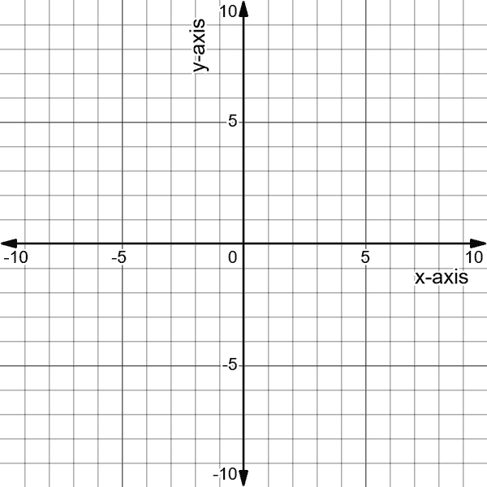

###### 图 4-1\. 二维笛卡尔坐标系

因此，如果你想要画出坐标为 (2, 3) 的点 A，你可能会从零点看一个图表，向右移动两个点，然后向上移动三个点。点的结果应该看起来像图 4-2。

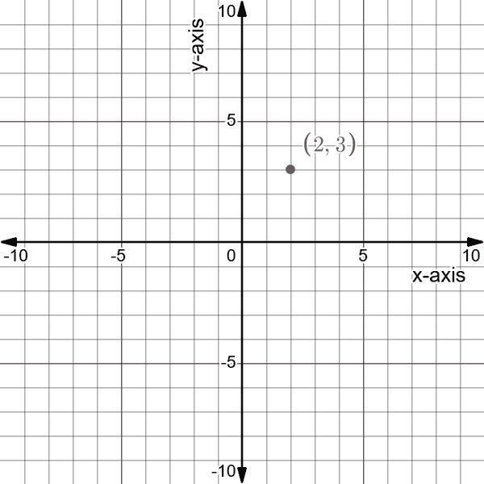

###### 图 4-2\. 点 A 在坐标系中的位置

现在让我们添加另一个点，并在它们之间画一个向量。假设你有坐标为 (4, 5) 的点 B。由于点 B 的坐标高于点 A 的坐标，你会预期向量 AB 呈现向上斜坡。图 4-3 显示了新点 B 和向量 AB。

###### 图 4-3\. 向量 AB 在大小和方向上连接点 A 和点 B

然而，通过使用两点的坐标画出向量后，你如何引用这个向量呢？简单地说，向量 AB 有其自己的坐标来表示它。请记住，向量是从点 A 到点 B 的移动表示。这意味着沿 *x* 轴和 *y* 轴的双点移动就是向量。在数学上，为了找到向量，你应该从彼此的两个坐标点中减去它们，并尊重方向。以下是如何做到这一点的：

+   *向量 AB* 意味着你从点 A 到点 B；因此，你需要从点 B 的坐标中减去点 A 的坐标：

    <math alttext="StartLayout 1st Row  ModifyingAbove upper A upper B With right-arrow equals mathematical left-angle 4 minus 2 comma 5 minus 3 mathematical right-angle 2nd Row  ModifyingAbove upper A upper B With right-arrow equals mathematical left-angle 2 comma 2 mathematical right-angle EndLayout"><mtable><mtr><mtd columnalign="left"><mrow><mover accent="true"><mrow><mi>A</mi><mi>B</mi></mrow> <mo>→</mo></mover> <mo>=</mo> <mrow><mo>〈</mo> <mn>4</mn> <mo>-</mo> <mn>2</mn> <mo>,</mo> <mn>5</mn> <mo>-</mo> <mn>3</mn> <mo>〉</mo></mrow></mrow></mtd></mtr> <mtr><mtd columnalign="left"><mrow><mover accent="true"><mrow><mi>A</mi><mi>B</mi></mrow> <mo>→</mo></mover> <mo>=</mo> <mrow><mo>〈</mo> <mn>2</mn> <mo>,</mo> <mn>2</mn> <mo>〉</mo></mrow></mrow></mtd></mtr></mtable></math>

+   *向量 BA* 意味着你从点 B 到点 A；因此，你需要从点 A 的坐标中减去点 B 的坐标：

    <math alttext="StartLayout 1st Row  ModifyingAbove upper B upper A With right-arrow equals mathematical left-angle 2 minus 4 comma 3 minus 5 mathematical right-angle 2nd Row  ModifyingAbove upper B upper A With right-arrow equals mathematical left-angle negative 2 comma negative 2 mathematical right-angle EndLayout"><mtable><mtr><mtd columnalign="left"><mrow><mover accent="true"><mrow><mi>B</mi><mi>A</mi></mrow> <mo>→</mo></mover> <mo>=</mo> <mrow><mo>〈</mo> <mn>2</mn> <mo>-</mo> <mn>4</mn> <mo>,</mo> <mn>3</mn> <mo>-</mo> <mn>5</mn> <mo>〉</mo></mrow></mrow></mtd></mtr> <mtr><mtd columnalign="left"><mrow><mover accent="true"><mrow><mi>B</mi><mi>A</mi></mrow> <mo>→</mo></mover> <mo>=</mo> <mrow><mo>〈</mo> <mo>-</mo> <mn>2</mn> <mo>,</mo> <mo>-</mo> <mn>2</mn> <mo>〉</mo></mrow></mrow></mtd></mtr></mtable></math>

要解释 AB 和 BA 向量，你需要从移动的角度思考。向量 AB 表示从点 A 到点 B，水平和垂直分别移动两个正向点（向右和向上）。向量 BA 表示从点 B 到点 A，水平和垂直分别移动两个负向点（向左和向下）。

###### 注意

尽管 AB 向量和 BA 向量具有相同的斜率，但它们并不是同一物体。那么斜率到底是什么呢？

*斜率* 是直线上两点之间的垂直变化与水平变化之比。你可以使用以下数学公式计算斜率：

<math alttext="StartLayout 1st Row  upper S l o p e equals StartFraction left-parenthesis normal upper Delta upper Y right-parenthesis Over left-parenthesis normal upper Delta upper X right-parenthesis EndFraction 2nd Row  upper S l o p e o f ModifyingAbove upper A upper B With right-arrow equals two-halves equals 1 3rd Row  upper S l o p e o f ModifyingAbove upper B upper A With right-arrow equals StartFraction negative 2 Over negative 2 EndFraction equals 1 EndLayout"><mtable><mtr><mtd columnalign="left"><mrow><mi>S</mi> <mi>l</mi> <mi>o</mi> <mi>p</mi> <mi>e</mi> <mo>=</mo> <mstyle displaystyle="false" scriptlevel="0"><mfrac><mrow><mo>(</mo><mi>Δ</mi><mi>Y</mi><mo>)</mo></mrow> <mrow><mo>(</mo><mi>Δ</mi><mi>X</mi><mo>)</mo></mrow></mfrac></mstyle></mrow></mtd></mtr> <mtr><mtd columnalign="left"><mrow><mi>S</mi> <mi>l</mi> <mi>o</mi> <mi>p</mi> <mi>e</mi> <mi>o</mi> <mi>f</mi> <mover accent="true"><mrow><mi>A</mi><mi>B</mi></mrow> <mo>→</mo></mover> <mo>=</mo> <mstyle displaystyle="false" scriptlevel="0"><mfrac><mn>2</mn> <mn>2</mn></mfrac></mstyle> <mo>=</mo> <mn>1</mn></mrow></mtd></mtr> <mtr><mtd columnalign="left"><mrow><mi>S</mi> <mi>l</mi> <mi>o</mi> <mi>p</mi> <mi>e</mi> <mi>o</mi> <mi>f</mi> <mover accent="true"><mrow><mi>B</mi><mi>A</mi></mrow> <mo>→</mo></mover> <mo>=</mo> <mstyle displaystyle="false" scriptlevel="0"><mfrac><mrow><mo>-</mo><mn>2</mn></mrow> <mrow><mo>-</mo><mn>2</mn></mrow></mfrac></mstyle> <mo>=</mo> <mn>1</mn></mrow></mtd></mtr></mtable></math>

如果这两个向量仅仅是线段（没有方向），那么它们将是相同的对象。然而，加上方向分量使它们成为两个可以区分的数学对象。

图 4-4 更详细地解释了斜率的概念，*x* 向右移动了两个点，*y* 向左移动了两个点。

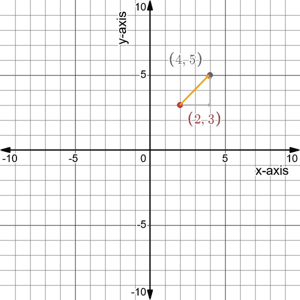

###### 图 4-4\. 向量 AB 的 *x* 变化和 *y* 变化

###### 注意

具有大小为 1 的向量被称为*单位向量*。

图 4-5 显示了向量 BA 的 *x* 变化和 *y* 变化情况。

###### 图 4-5\. 向量 BA 的 *x* 变化和 *y* 变化

研究人员通常将向量用作速度的表示，尤其是在工程领域。导航是一个严重依赖向量的领域。它允许航海员确定其位置并规划其目的地。自然地，大小表示速度，方向表示目的地。

您可以相互添加和减去向量，也可以与标量相加和减去向量。这允许在方向和大小上进行移动。您应该从前面的讨论中了解到，向量指示轴上不同点之间的方向。

###### 注意

*标量*是具有大小但没有方向的值。与向量相反，标量用于表示元素，如温度和价格。基本上，标量就是数字。

*矩阵*是一个包含数字并以行和列组织的矩形数组。[¹] 矩阵在计算机图形学和其他领域中都很有用，用来定义和操作线性方程组。矩阵与向量的区别是什么？最简单的答案是，向量是具有单列或单行的矩阵。这里是一个 3 × 3 矩阵的基本示例：

<math alttext="Start 3 By 3 Matrix 1st Row 1st Column 5 2nd Column 2 3rd Column 9 2nd Row 1st Column negative 8 2nd Column 10 3rd Column 13 3rd Row 1st Column 1 2nd Column 5 3rd Column 12 EndMatrix"><mfenced close="]" open="["><mtable><mtr><mtd><mn>5</mn></mtd> <mtd><mn>2</mn></mtd> <mtd><mn>9</mn></mtd></mtr> <mtr><mtd><mrow><mo>-</mo> <mn>8</mn></mrow></mtd> <mtd><mn>10</mn></mtd> <mtd><mn>13</mn></mtd></mtr> <mtr><mtd><mn>1</mn></mtd> <mtd><mn>5</mn></mtd> <mtd><mn>12</mn></mtd></mtr></mtable></mfenced></math>

矩阵的大小是它包含的行数和列数。行是水平线，列是垂直线。以下是一个 2 × 4 矩阵的表示（即两行四列）：

<math alttext="Start 2 By 4 Matrix 1st Row 1st Column 5 2nd Column 2 3rd Column 1 4th Column 3 2nd Row 1st Column negative 8 2nd Column 10 3rd Column 9 4th Column 4 EndMatrix"><mfenced close="]" open="["><mtable><mtr><mtd><mn>5</mn></mtd> <mtd><mn>2</mn></mtd> <mtd><mn>1</mn></mtd> <mtd><mn>3</mn></mtd></mtr> <mtr><mtd><mrow><mo>-</mo> <mn>8</mn></mrow></mtd> <mtd><mn>10</mn></mtd> <mtd><mn>9</mn></mtd> <mtd><mn>4</mn></mtd></mtr></mtable></mfenced></math>

以下是一个 4 × 2 矩阵的表示（即四行两列）：

<math alttext="Start 4 By 2 Matrix 1st Row 1st Column 5 2nd Column 2 2nd Row 1st Column negative 8 2nd Column 10 3rd Row 1st Column 8 2nd Column 22 4th Row 1st Column 7 2nd Column 3 EndMatrix"><mfenced close="]" open="["><mtable><mtr><mtd><mn>5</mn></mtd> <mtd><mn>2</mn></mtd></mtr> <mtr><mtd><mrow><mo>-</mo> <mn>8</mn></mrow></mtd> <mtd><mn>10</mn></mtd></mtr> <mtr><mtd><mn>8</mn></mtd> <mtd><mn>22</mn></mtd></mtr> <mtr><mtd><mn>7</mn></mtd> <mtd><mn>3</mn></mtd></mtr></mtable></mfenced></math>

###### 注意

矩阵在机器学习中被广泛使用。行通常表示时间，列表示特征。

不同矩阵的加法很简单，但只能在矩阵大小相同时使用（即它们具有相同的列数和行数）。例如，让我们来加下面这两个矩阵：

<math alttext="Start 2 By 2 Matrix 1st Row 1st Column 1 2nd Column 2 2nd Row 1st Column 5 2nd Column 8 EndMatrix plus Start 2 By 2 Matrix 1st Row 1st Column 3 2nd Column 9 2nd Row 1st Column 1 2nd Column 5 EndMatrix equals Start 2 By 2 Matrix 1st Row 1st Column 4 2nd Column 11 2nd Row 1st Column 6 2nd Column 13 EndMatrix"><mrow><mfenced close="]" open="["><mtable><mtr><mtd><mn>1</mn></mtd> <mtd><mn>2</mn></mtd></mtr> <mtr><mtd><mn>5</mn></mtd> <mtd><mn>8</mn></mtd></mtr></mtable></mfenced> <mo>+</mo> <mfenced close="]" open="["><mtable><mtr><mtd><mn>3</mn></mtd> <mtd><mn>9</mn></mtd></mtr> <mtr><mtd><mn>1</mn></mtd> <mtd><mn>5</mn></mtd></mtr></mtable></mfenced> <mo>=</mo> <mfenced close="]" open="["><mtable><mtr><mtd><mn>4</mn></mtd> <mtd><mn>11</mn></mtd></mtr> <mtr><mtd><mn>6</mn></mtd> <mtd><mn>13</mn></mtd></mtr></mtable></mfenced></mrow></math>

你可以看到，要将两个矩阵相加，只需将相同位置的数字相加即可。现在，如果你试图添加下一对矩阵，你将无法做到，因为要添加的内容不匹配：

<math alttext="Start 2 By 2 Matrix 1st Row 1st Column 8 2nd Column 3 2nd Row 1st Column 3 2nd Column 2 EndMatrix plus Start 3 By 2 Matrix 1st Row 1st Column 3 2nd Column 9 2nd Row 1st Column 1 2nd Column 5 3rd Row 1st Column 5 2nd Column 4 EndMatrix"><mrow><mfenced close="]" open="["><mtable><mtr><mtd><mn>8</mn></mtd> <mtd><mn>3</mn></mtd></mtr> <mtr><mtd><mn>3</mn></mtd> <mtd><mn>2</mn></mtd></mtr></mtable></mfenced> <mo>+</mo> <mfenced close="]" open="["><mtable><mtr><mtd><mn>3</mn></mtd> <mtd><mn>9</mn></mtd></mtr> <mtr><mtd><mn>1</mn></mtd> <mtd><mn>5</mn></mtd></mtr> <mtr><mtd><mn>5</mn></mtd> <mtd><mn>4</mn></mtd></mtr></mtable></mfenced></mrow></math>

矩阵的减法也很简单，遵循与矩阵加法相同的规则。让我们来看一个例子：

<math alttext="Start 2 By 2 Matrix 1st Row 1st Column 5 2nd Column 2 2nd Row 1st Column negative 8 2nd Column 10 EndMatrix minus Start 2 By 2 Matrix 1st Row 1st Column 3 2nd Column 9 2nd Row 1st Column negative 1 2nd Column negative 5 EndMatrix equals Start 2 By 2 Matrix 1st Row 1st Column 2 2nd Column negative 7 2nd Row 1st Column negative 9 2nd Column 15 EndMatrix"><mrow><mfenced close="]" open="["><mtable><mtr><mtd><mn>5</mn></mtd> <mtd><mn>2</mn></mtd></mtr> <mtr><mtd><mrow><mo>-</mo> <mn>8</mn></mrow></mtd> <mtd><mn>10</mn></mtd></mtr></mtable></mfenced> <mo>-</mo> <mfenced close="]" open="["><mtable><mtr><mtd><mn>3</mn></mtd> <mtd><mn>9</mn></mtd></mtr> <mtr><mtd><mrow><mo>-</mo> <mn>1</mn></mrow></mtd> <mtd><mrow><mo>-</mo> <mn>5</mn></mrow></mtd></mtr></mtable></mfenced> <mo>=</mo> <mfenced close="]" open="["><mtable><mtr><mtd><mn>2</mn></mtd> <mtd><mrow><mo>-</mo> <mn>7</mn></mrow></mtd></mtr> <mtr><mtd><mrow><mo>-</mo> <mn>9</mn></mrow></mtd> <mtd><mn>15</mn></mtd></mtr></mtable></mfenced></mrow></math>

显然，矩阵的减法也是矩阵加法，只是其中一个矩阵中的数字变为相反数。

标量乘以矩阵非常简单。让我们看一个例子：

<math alttext="3 times Start 2 By 2 Matrix 1st Row 1st Column 5 2nd Column 2 2nd Row 1st Column 8 2nd Column 22 EndMatrix equals Start 2 By 2 Matrix 1st Row 1st Column 15 2nd Column 6 2nd Row 1st Column 24 2nd Column 66 EndMatrix"><mrow><mn>3</mn> <mo>×</mo> <mfenced close="]" open="["><mtable><mtr><mtd><mn>5</mn></mtd> <mtd><mn>2</mn></mtd></mtr> <mtr><mtd><mn>8</mn></mtd> <mtd><mn>22</mn></mtd></mtr></mtable></mfenced> <mo>=</mo> <mfenced close="]" open="["><mtable><mtr><mtd><mn>15</mn></mtd> <mtd><mn>6</mn></mtd></mtr> <mtr><mtd><mn>24</mn></mtd> <mtd><mn>66</mn></mtd></mtr></mtable></mfenced></mrow></math>

因此，基本上是将矩阵中的每个单元格乘以标量。将一个矩阵乘以另一个矩阵稍微复杂一些，因为它使用*点积*方法。首先，要将两个矩阵相乘，它们必须满足以下条件：

<math alttext="Matrix Subscript x y Baseline times Matrix Subscript y z Baseline equals Matrix Subscript x z"><mrow><msub><mtext>Matrix</mtext> <mrow><mi>x</mi><mi>y</mi></mrow></msub> <mo>×</mo> <msub><mtext>Matrix</mtext> <mrow><mi>y</mi><mi>z</mi></mrow></msub> <mo>=</mo> <msub><mtext>Matrix</mtext> <mrow><mi>x</mi><mi>z</mi></mrow></msub></mrow></math>

这意味着第一个矩阵的列数必须等于第二个矩阵的行数，并且点积的结果矩阵是第一个矩阵的行数和第二个矩阵的列数。点积在以下示例中表示为 1 × 3 和 3 × 1 矩阵乘法的例子（注意列数和行数相等）：

<math alttext="Start 1 By 3 Matrix 1st Row 1st Column 1 2nd Column 2 3rd Column 3 EndMatrix times Start 3 By 1 Matrix 1st Row  3 2nd Row  2 3rd Row  1 EndMatrix equals Start 1 By 1 Matrix 1st Row  left-parenthesis 1 times 3 right-parenthesis plus left-parenthesis 2 times 2 right-parenthesis plus left-parenthesis 3 times 1 right-parenthesis EndMatrix equals Start 1 By 1 Matrix 1st Row  10 EndMatrix"><mrow><mfenced close="]" open="["><mtable><mtr><mtd><mn>1</mn></mtd> <mtd><mn>2</mn></mtd> <mtd><mn>3</mn></mtd></mtr></mtable></mfenced> <mo>×</mo> <mfenced close="]" open="["><mtable><mtr><mtd><mn>3</mn></mtd></mtr> <mtr><mtd><mn>2</mn></mtd></mtr> <mtr><mtd><mn>1</mn></mtd></mtr></mtable></mfenced> <mo>=</mo> <mfenced close="]" open="["><mtable><mtr><mtd><mrow><mo>(</mo> <mn>1</mn> <mo>×</mo> <mn>3</mn> <mo>)</mo> <mo>+</mo> <mo>(</mo> <mn>2</mn> <mo>×</mo> <mn>2</mn> <mo>)</mo> <mo>+</mo> <mo>(</mo> <mn>3</mn> <mo>×</mo> <mn>1</mn> <mo>)</mo></mrow></mtd></mtr></mtable></mfenced> <mo>=</mo> <mfenced close="]" open="["><mtable><mtr><mtd><mn>10</mn></mtd></mtr></mtable></mfenced></mrow></math>

现在让我们来看一个 2 × 2 矩阵乘法的例子：

<math alttext="Start 2 By 2 Matrix 1st Row 1st Column 1 2nd Column 2 2nd Row 1st Column 0 2nd Column 1 EndMatrix times Start 2 By 2 Matrix 1st Row 1st Column 3 2nd Column 0 2nd Row 1st Column 2 2nd Column 1 EndMatrix equals Start 2 By 2 Matrix 1st Row 1st Column 7 2nd Column 2 2nd Row 1st Column 2 2nd Column 1 EndMatrix"><mrow><mfenced close="]" open="["><mtable><mtr><mtd><mn>1</mn></mtd> <mtd><mn>2</mn></mtd></mtr> <mtr><mtd><mn>0</mn></mtd> <mtd><mn>1</mn></mtd></mtr></mtable></mfenced> <mo>×</mo> <mfenced close="]" open="["><mtable><mtr><mtd><mn>3</mn></mtd> <mtd><mn>0</mn></mtd></mtr> <mtr><mtd><mn>2</mn></mtd> <mtd><mn>1</mn></mtd></mtr></mtable></mfenced> <mo>=</mo> <mfenced close="]" open="["><mtable><mtr><mtd><mn>7</mn></mtd> <mtd><mn>2</mn></mtd></mtr> <mtr><mtd><mn>2</mn></mtd> <mtd><mn>1</mn></mtd></mtr></mtable></mfenced></mrow></math>

有一种特殊类型的矩阵称为*单位矩阵*，它基本上是矩阵的数字 1。对于 2 × 2 维度，它定义如下：

<math alttext="upper I equals Start 2 By 2 Matrix 1st Row 1st Column 1 2nd Column 0 2nd Row 1st Column 0 2nd Column 1 EndMatrix"><mrow><mi>I</mi> <mo>=</mo> <mfenced close="]" open="["><mtable><mtr><mtd><mn>1</mn></mtd> <mtd><mn>0</mn></mtd></mtr> <mtr><mtd><mn>0</mn></mtd> <mtd><mn>1</mn></mtd></mtr></mtable></mfenced></mrow></math>

对于 3 × 3 维度如下：

<math alttext="upper I equals Start 3 By 3 Matrix 1st Row 1st Column 1 2nd Column 0 3rd Column 0 2nd Row 1st Column 0 2nd Column 1 3rd Column 0 3rd Row 1st Column 0 2nd Column 0 3rd Column 1 EndMatrix"><mrow><mi>I</mi> <mo>=</mo> <mfenced close="]" open="["><mtable><mtr><mtd><mn>1</mn></mtd> <mtd><mn>0</mn></mtd> <mtd><mn>0</mn></mtd></mtr> <mtr><mtd><mn>0</mn></mtd> <mtd><mn>1</mn></mtd> <mtd><mn>0</mn></mtd></mtr> <mtr><mtd><mn>0</mn></mtd> <mtd><mn>0</mn></mtd> <mtd><mn>1</mn></mtd></mtr></mtable></mfenced></mrow></math>

将任何矩阵乘以单位矩阵会产生相同的原始矩阵。这就是为什么它可以被称为矩阵的单位元（将任何数字乘以 1 会得到相同的数字）。值得注意的是矩阵乘法不是可交换的，这意味着乘法顺序改变结果：

<math alttext="upper A upper B not-equals upper B upper A"><mrow><mi>A</mi> <mi>B</mi> <mo>≠</mo> <mi>B</mi> <mi>A</mi></mrow></math>

*矩阵转置*是一个过程，涉及将行变为列，反之亦然。矩阵的转置是通过沿其主对角线反射矩阵而获得的：

<math alttext="Start 2 By 3 Matrix 1st Row 1st Column 4 2nd Column 6 3rd Column 1 2nd Row 1st Column 1 2nd Column 4 3rd Column 2 EndMatrix Superscript upper T Baseline equals Start 3 By 2 Matrix 1st Row 1st Column 4 2nd Column 1 2nd Row 1st Column 6 2nd Column 4 3rd Row 1st Column 1 2nd Column 2 EndMatrix"><mrow><msup><mfenced close="]" open="["><mtable><mtr><mtd><mn>4</mn></mtd><mtd><mn>6</mn></mtd><mtd><mn>1</mn></mtd></mtr><mtr><mtd><mn>1</mn></mtd><mtd><mn>4</mn></mtd><mtd><mn>2</mn></mtd></mtr></mtable></mfenced> <mi>T</mi></msup> <mo>=</mo> <mfenced close="]" open=""><mtable><mtr><mtd><mn>4</mn></mtd> <mtd><mn>1</mn></mtd></mtr> <mtr><mtd><mn>6</mn></mtd> <mtd><mn>4</mn></mtd></mtr> <mtr><mtd><mn>1</mn></mtd> <mtd><mn>2</mn></mtd></mtr></mtable></mfenced></mrow></math>

在一些机器学习算法中使用了转置操作，处理这些模型时不是一个罕见的操作。如果你想了解矩阵在数据科学和机器学习中的角色，可以参考这个非详尽的列表：

数据表示

矩阵通常用来表示数据，其中行代表样本，列代表特征。例如，矩阵中的一行可以表示一个时间步中的 OHLC 数据。

线性代数

矩阵和线性代数是紧密相关的，许多学习算法在其操作中使用了矩阵的概念。对这些数学概念有基本的理解有助于在处理机器学习算法时平滑学习曲线。

数据关系矩阵

协方差和相关性度量通常表示为矩阵。这些关系计算是时间序列分析中的重要概念。

###### 注意

本节的关键要点如下：

+   向量是一个具有大小（长度）和方向（箭头）的对象。多个向量组合在一起形成一个矩阵。

+   矩阵可以用来存储数据。它有其特殊的执行操作方式。

+   矩阵乘法使用点积方法。

+   转置矩阵意味着交换其行和列。

## 线性方程介绍

你在[“回归分析和统计推断”中看到了线性方程的一个例子。*线性方程*基本上是介绍不同变量和常数之间平等关系的公式。在机器学习中，它通常是依赖变量（输出）和自变量（输入）之间的关系。理解线性方程的最佳方法是通过示例。

###### 注意

线性方程的目标是找到一个未知变量，通常用字母*x*表示。

我们将从一个非常基础的例子开始，你可以将其视为以后将要看到的更高级概念的第一个构建块。 下面的例子要求找到满足方程的*x*的值：

<math alttext="10 x equals 20"><mrow><mn>10</mn> <mi>x</mi> <mo>=</mo> <mn>20</mn></mrow></math>

你应该理解方程为“*10 乘以哪个数等于 20？*” 当一个常数直接附加到变量（比如*x*）上时，它指的是一个乘法操作。现在，要解出*x*（即找到使方程相等的*x*的值），你有一个明显的解决方案，就是去掉 10，这样你就在方程的一边得到*x*，另一边得到剩下的部分。

自然地，要摆脱 10，你需要除以 10，这样剩下的就是 1，如果与变量*x*相乘则无效。 但请记住两件重要的事情：

+   如果你在方程的一边进行数学运算，那么你必须在另一边也这样做。 这就是它们被称为方程的原因。

+   为了简单起见，不要除以常数以摆脱它，你应该乘以它的倒数。

一个数的*倒数*是 1 除以该数。 这是它的数学表示：

<math alttext="upper R e c i p r o c a l left-parenthesis x right-parenthesis equals StartFraction 1 Over x EndFraction"><mrow><mi>R</mi> <mi>e</mi> <mi>c</mi> <mi>i</mi> <mi>p</mi> <mi>r</mi> <mi>o</mi> <mi>c</mi> <mi>a</mi> <mi>l</mi> <mrow><mo>(</mo> <mi>x</mi> <mo>)</mo></mrow> <mo>=</mo> <mfrac><mn>1</mn> <mi>x</mi></mfrac></mrow></math>

现在，回到例子中，要找到*x*，你可以这样做：

<math alttext="left-parenthesis one-tenth right-parenthesis 10 x equals 20 left-parenthesis one-tenth right-parenthesis"><mrow><mrow><mo>(</mo> <mfrac><mn>1</mn> <mn>10</mn></mfrac> <mo>)</mo></mrow> <mn>10</mn> <mi>x</mi> <mo>=</mo> <mn>20</mn> <mrow><mo>(</mo> <mfrac><mn>1</mn> <mn>10</mn></mfrac> <mo>)</mo></mrow></mrow></math>

进行乘法并简化后得到以下结果：

<math alttext="x equals 2"><mrow><mi>x</mi> <mo>=</mo> <mn>2</mn></mrow></math>

这意味着方程的解为 2。 要验证这一点，你只需将 2 插入到原始方程中如下所示：

<math alttext="10 times 2 equals 20"><mrow><mn>10</mn> <mo>×</mo> <mn>2</mn> <mo>=</mo> <mn>20</mn></mrow></math>

因此，需要两个 10 才能得到 20。

###### 注意

将数字除以它本身等同于乘以它的倒数。

让我们来看一个如何通过线性技术解决*x*的例子。 考虑以下问题：

<math alttext="eight-sixths x equals 24"><mrow><mfrac><mn>8</mn> <mn>6</mn></mfrac> <mi>x</mi> <mo>=</mo> <mn>24</mn></mrow></math>

进行乘法并简化后得到以下结果：

<math alttext="left-parenthesis six-eighths right-parenthesis eight-sixths x equals 24 left-parenthesis six-eighths right-parenthesis"><mrow><mrow><mo>(</mo> <mfrac><mn>6</mn> <mn>8</mn></mfrac> <mo>)</mo></mrow> <mfrac><mn>8</mn> <mn>6</mn></mfrac> <mi>x</mi> <mo>=</mo> <mn>24</mn> <mrow><mo>(</mo> <mfrac><mn>6</mn> <mn>8</mn></mfrac> <mo>)</mo></mrow></mrow></math>

<math alttext="x equals 18"><mrow><mi>x</mi> <mo>=</mo> <mn>18</mn></mrow></math>

这意味着方程的解为 18。 要验证这一点，你只需将 18 插入到原始方程中如下所示：

<math alttext="eight-sixths times 18 equals 24"><mrow><mfrac><mn>8</mn> <mn>6</mn></mfrac> <mo>×</mo> <mn>18</mn> <mo>=</mo> <mn>24</mn></mrow></math>

通常，线性方程不会这么简单。 有时它们包含更多的变量和常数，需要更详细的解决方案，但让我们一步一步地进行。 考虑以下例子：

<math alttext="3 x minus 6 equals 12"><mrow><mn>3</mn> <mi>x</mi> <mo>-</mo> <mn>6</mn> <mo>=</mo> <mn>12</mn></mrow></math>

解出*x*需要稍微重新排列方程。 记住，目标是将*x*留在一边，其余部分留在另一边。 在这里，你必须在处理 3 之前去掉常数 6。 解决方案的第一部分如下：

<math alttext="3 x minus 6 left-parenthesis plus 6 right-parenthesis equals 12 left-parenthesis plus 6 right-parenthesis"><mrow><mn>3</mn> <mi>x</mi> <mo>-</mo> <mn>6</mn> <mo>(</mo> <mo>+</mo> <mn>6</mn> <mo>)</mo> <mo>=</mo> <mn>12</mn> <mo>(</mo> <mo>+</mo> <mn>6</mn> <mo>)</mo></mrow></math>

注意如何在方程的两边都加上 6。左边的部分将自行抵消，而右边的部分将加起来得到 18：

<math alttext="3 x equals 18"><mrow><mn>3</mn> <mi>x</mi> <mo>=</mo> <mn>18</mn></mrow></math>

最后，你需要将变量*x*附加的常数的倒数相乘：

<math alttext="left-parenthesis one-third right-parenthesis 3 x equals 18 left-parenthesis one-third right-parenthesis"><mrow><mrow><mo>(</mo> <mfrac><mn>1</mn> <mn>3</mn></mfrac> <mo>)</mo></mrow> <mn>3</mn> <mi>x</mi> <mo>=</mo> <mn>18</mn> <mrow><mo>(</mo> <mfrac><mn>1</mn> <mn>3</mn></mfrac> <mo>)</mo></mrow></mrow></math>

简化并解出*x*得到以下解决方案：

<math alttext="x equals 6"><mrow><mi>x</mi> <mo>=</mo> <mn>6</mn></mrow></math>

这意味着方程的解为 6。 要验证这一点，只需将 6 插入到原始方程中如下所示：

<math alttext="left-parenthesis 3 times 6 right-parenthesis minus 6 equals 12"><mrow><mo>(</mo> <mn>3</mn> <mo>×</mo> <mn>6</mn> <mo>)</mo> <mo>-</mo> <mn>6</mn> <mo>=</mo> <mn>12</mn></mrow></math>

到目前为止，你应该已经注意到，线性代数主要是关于使用快捷和快速的技巧简化方程并找到未知变量。下一个例子显示有时变量*x*可能出现在多个地方：

<math alttext="6 x plus x equals 27 minus 2 x"><mrow><mn>6</mn> <mi>x</mi> <mo>+</mo> <mi>x</mi> <mo>=</mo> <mn>27</mn> <mo>-</mo> <mn>2</mn> <mi>x</mi></mrow></math>

记住，主要重点是让*x*在方程的一边，其余部分在另一边：

<math alttext="6 x plus x plus 2 x equals 27"><mrow><mn>6</mn> <mi>x</mi> <mo>+</mo> <mi>x</mi> <mo>+</mo> <mn>2</mn> <mi>x</mi> <mo>=</mo> <mn>27</mn></mrow></math>

在*x*的常数上加给你以下结果：

<math alttext="9 x equals 27"><mrow><mn>9</mn> <mi>x</mi> <mo>=</mo> <mn>27</mn></mrow></math>

最后一步是除以 9，这样你就只剩下*x*：

<math alttext="x equals 3"><mrow><mi>x</mi> <mo>=</mo> <mn>3</mn></mrow></math>

现在，你可以通过在原方程中将 3 代入*x*的位置来验证这一点。你会注意到方程两边是相等的。

###### 注意

尽管本节内容很简单，但它包含了你在代数和微积分中开始进阶所需的基础。本节的关键要点如下：

+   线性方程是一种表示，其中任何变量的最高指数为一。这意味着没有变量被提升到二次及以上的幂次。

+   在图表上绘制时，线性方程的直线是直的。

+   在建模各种真实世界事件中应用线性方程的重要性使其在许多数学和研究领域至关重要。它们在机器学习中也被广泛应用。

+   解决*x*的过程是找到一个值，使得方程两边相等。

+   当对方程的一侧进行操作（例如加上常数或乘以常数）时，你也必须对另一侧进行相同的操作。

## 方程组

*方程组*是指有两个或更多个方程共同工作来解决一个或多个变量的情况。因此，不再是通常的单一方程：

<math alttext="x plus 10 equals 20"><mrow><mi>x</mi> <mo>+</mo> <mn>10</mn> <mo>=</mo> <mn>20</mn></mrow></math>

方程组类似于以下形式：

<math alttext="x plus 10 equals 20"><mrow><mi>x</mi> <mo>+</mo> <mn>10</mn> <mo>=</mo> <mn>20</mn></mrow></math>

<math alttext="y plus 2 x equals 10"><mrow><mi>y</mi> <mo>+</mo> <mn>2</mn> <mi>x</mi> <mo>=</mo> <mn>10</mn></mrow></math>

方程组在机器学习中非常有用，广泛应用于其许多方面。

让我们从本节开头的方程组出发，通过图形化方法来解决它。绘制这两个函数实际上可以直接给出解决方案。交点就是解决方案。因此，交点的坐标（*x, y*）分别指的是*x*和*y*的解决方案。

从图 4-6 可以看出，*x* = 10 而*y* = –10。将这些值代入各自的变量后得到正确答案：

10 + 10 = 20

(–10) + (2 × 10) = 10

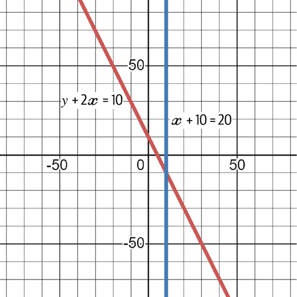

###### 图 4-6\. 显示两个函数及其交点（解决方案）

由于函数是线性的，解决它们可能导致三种结果之一：

1.  每个变量只有一个解决方案。

1.  不存在解决方案。这发生在函数*平行*时（这意味着它们从未相交）。

1.  存在无数个解。当通过简化时，两个函数相同时（因为所有点都落在直线上）。

在通过代数解方程组之前，让我们通过视觉方式看看如何没有解和如何有无限多个解。考虑以下系统：

<math alttext="2 x equals 10"><mrow><mn>2</mn> <mi>x</mi> <mo>=</mo> <mn>10</mn></mrow></math>

<math alttext="4 x equals 20"><mrow><mn>4</mn> <mi>x</mi> <mo>=</mo> <mn>20</mn></mrow></math>

图 4-7 将它们一起绘制。由于它们正好是同一方程，它们落在同一条线上。实际上，图 4-7 中有两条线，但由于它们相同，它们是无法区分的。对于线上的每个*x*，都有一个对应的*y*。

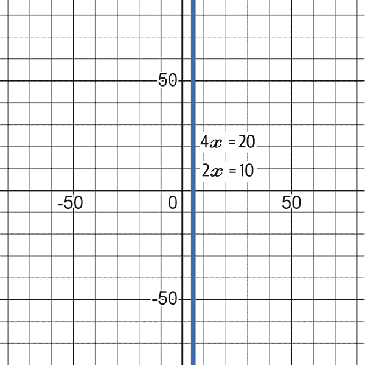

###### 图 4-7\. 显示两个函数及其无限交点的图表

现在考虑以下系统：

<math alttext="3 x equals 10"><mrow><mn>3</mn> <mi>x</mi> <mo>=</mo> <mn>10</mn></mrow></math>

<math alttext="6 x equals 10"><mrow><mn>6</mn> <mi>x</mi> <mo>=</mo> <mn>10</mn></mrow></math>

图 4-8 显示它们永不相交，这是直观的，因为你不能用不同的数字（由变量*x*表示）乘以同一个数字而期望得到相同的结果。

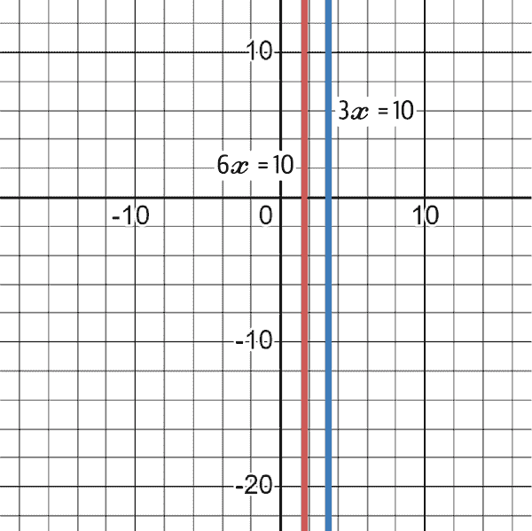

###### 图 4-8\. 显示两个函数及其不可能的交点的图表

代数方法用于解决超过两个变量的情况，因为它们无法通过图表求解。主要包括两种方法：替换法和消元法。

*替换法* 用于可以在一个方程中替换变量值并将其插入第二个方程的情况。考虑以下例子：

<math alttext="x plus y equals 2"><mrow><mi>x</mi> <mo>+</mo> <mi>y</mi> <mo>=</mo> <mn>2</mn></mrow></math>

<math alttext="10 x plus y equals 10"><mrow><mn>10</mn> <mi>x</mi> <mo>+</mo> <mi>y</mi> <mo>=</mo> <mn>10</mn></mrow></math>

最简单的方法是重新排列第一个方程，使得你可以用*x*来表示*y*：

<math alttext="y equals 2 minus x"><mrow><mi>y</mi> <mo>=</mo> <mn>2</mn> <mo>-</mo> <mi>x</mi></mrow></math>

<math alttext="10 x plus left-parenthesis 2 minus x right-parenthesis equals 10"><mrow><mn>10</mn> <mi>x</mi> <mo>+</mo> <mo>(</mo> <mn>2</mn> <mo>-</mo> <mi>x</mi> <mo>)</mo> <mo>=</mo> <mn>10</mn></mrow></math>

在第二个方程中解*x*变得很简单：

<math alttext="StartLayout 1st Row  10 x plus left-parenthesis 2 minus x right-parenthesis equals 10 2nd Row  10 x plus 2 minus x equals 10 3rd Row  10 x minus x equals 10 minus 2 4th Row  9 x equals 8 5th Row  x equals eight-ninths 6th Row  x equals 0.8889 EndLayout"><mtable><mtr><mtd columnalign="left"><mrow><mn>10</mn> <mi>x</mi> <mo>+</mo> <mo>(</mo> <mn>2</mn> <mo>-</mo> <mi>x</mi> <mo>)</mo> <mo>=</mo> <mn>10</mn></mrow></mtd></mtr> <mtr><mtd columnalign="left"><mrow><mn>10</mn> <mi>x</mi> <mo>+</mo> <mn>2</mn> <mo>-</mo> <mi>x</mi> <mo>=</mo> <mn>10</mn></mrow></mtd></mtr> <mtr><mtd columnalign="left"><mrow><mn>10</mn> <mi>x</mi> <mo>-</mo> <mi>x</mi> <mo>=</mo> <mn>10</mn> <mo>-</mo> <mn>2</mn></mrow></mtd></mtr> <mtr><mtd columnalign="left"><mrow><mn>9</mn> <mi>x</mi> <mo>=</mo> <mn>8</mn></mrow></mtd></mtr> <mtr><mtd columnalign="left"><mrow><mi>x</mi> <mo>=</mo> <mfrac><mn>8</mn> <mn>9</mn></mfrac></mrow></mtd></mtr> <mtr><mtd columnalign="left"><mrow><mi>x</mi> <mo>=</mo> <mn>0</mn> <mo lspace="0%" rspace="0%">.</mo> <mn>8889</mn></mrow></mtd></mtr></mtable></math>

现在你已经找到*x*的值，通过将*x*的值代入第一个方程中，你可以轻松找到*y*的值：

<math alttext="StartLayout 1st Row  0.8889 plus y equals 2 2nd Row  y equals 2 minus 0.8889 3rd Row  y equals 1.111 EndLayout"><mtable><mtr><mtd columnalign="left"><mrow><mn>0</mn> <mo lspace="0%" rspace="0%">.</mo> <mn>8889</mn> <mo>+</mo> <mi>y</mi> <mo>=</mo> <mn>2</mn></mrow></mtd></mtr> <mtr><mtd columnalign="left"><mrow><mi>y</mi> <mo>=</mo> <mn>2</mn> <mo>-</mo> <mn>0</mn> <mo lspace="0%" rspace="0%">.</mo> <mn>8889</mn></mrow></mtd></mtr> <mtr><mtd columnalign="left"><mrow><mi>y</mi> <mo>=</mo> <mn>1</mn> <mo lspace="0%" rspace="0%">.</mo> <mn>111</mn></mrow></mtd></mtr></mtable></math>

要检查你的解是否正确，可以在两个公式中分别代入*x*和*y*的值：

<math alttext="StartLayout 1st Row  0.8889 plus 1.111 equals 2 2nd Row  left-parenthesis 10 times 0.8889 right-parenthesis plus 1.111 equals 10 EndLayout"><mtable><mtr><mtd columnalign="left"><mrow><mn>0</mn> <mo lspace="0%" rspace="0%">.</mo> <mn>8889</mn> <mo>+</mo> <mn>1</mn> <mo lspace="0%" rspace="0%">.</mo> <mn>111</mn> <mo>=</mo> <mn>2</mn></mrow></mtd></mtr> <mtr><mtd columnalign="left"><mrow><mo>(</mo> <mn>10</mn> <mo>×</mo> <mn>0</mn> <mo lspace="0%" rspace="0%">.</mo> <mn>8889</mn> <mo>)</mo> <mo>+</mo> <mn>1</mn> <mo lspace="0%" rspace="0%">.</mo> <mn>111</mn> <mo>=</mo> <mn>10</mn></mrow></mtd></mtr></mtable></math>

从图形上看，这意味着两个方程在(0.8889, 1.111)处相交。这种技术可以用于多于两个变量。按照相同的过程进行，直到方程简化到足以给出答案。替换法的问题在于处理超过两个变量时可能需要一些时间。

*消元法* 是一个更快的替代方法。它涉及消除变量，直到只剩下一个。考虑以下例子：

<math alttext="StartLayout 1st Row  2 x plus 4 y equals 20 2nd Row  3 x plus 2 y equals 10 EndLayout"><mtable><mtr><mtd columnalign="left"><mrow><mn>2</mn> <mi>x</mi> <mo>+</mo> <mn>4</mn> <mi>y</mi> <mo>=</mo> <mn>20</mn></mrow></mtd></mtr> <mtr><mtd columnalign="left"><mrow><mn>3</mn> <mi>x</mi> <mo>+</mo> <mn>2</mn> <mi>y</mi> <mo>=</mo> <mn>10</mn></mrow></mtd></mtr></mtable></math>

注意到有 4*y*和 2*y*，可以将第二个方程乘以 2，这样你可以将两个方程相减（从而消除*y*变量）：

<math alttext="StartLayout 1st Row  2 x plus 4 y equals 20 2nd Row  6 x plus 4 y equals 20 EndLayout"><mtable><mtr><mtd columnalign="left"><mrow><mn>2</mn> <mi>x</mi> <mo>+</mo> <mn>4</mn> <mi>y</mi> <mo>=</mo> <mn>20</mn></mrow></mtd></mtr> <mtr><mtd columnalign="left"><mrow><mn>6</mn> <mi>x</mi> <mo>+</mo> <mn>4</mn> <mi>y</mi> <mo>=</mo> <mn>20</mn></mrow></mtd></mtr></mtable></math>

将两个方程相减得到以下结果：

<math alttext="StartLayout 1st Row  minus 4 x equals 0 2nd Row  x equals 0 EndLayout"><mtable><mtr><mtd columnalign="left"><mrow><mo>-</mo> <mn>4</mn> <mi>x</mi> <mo>=</mo> <mn>0</mn></mrow></mtd></mtr> <mtr><mtd columnalign="left"><mrow><mi>x</mi> <mo>=</mo> <mn>0</mn></mrow></mtd></mtr></mtable></math>

因此，*x* = 0\. 从图形上看，这意味着它们在*x* = 0 时相交（正好在垂直的*y*线上）。将*x*的值代入第一个公式中得到*y* = 5：

<math alttext="StartLayout 1st Row  left-parenthesis 2 times 0 right-parenthesis plus 4 y equals 20 2nd Row  4 y equals 20 3rd Row  y equals 5 EndLayout"><mtable><mtr><mtd columnalign="left"><mrow><mo>(</mo> <mn>2</mn> <mo>×</mo> <mn>0</mn> <mo>)</mo> <mo>+</mo> <mn>4</mn> <mi>y</mi> <mo>=</mo> <mn>20</mn></mrow></mtd></mtr> <mtr><mtd columnalign="left"><mrow><mn>4</mn> <mi>y</mi> <mo>=</mo> <mn>20</mn></mrow></mtd></mtr> <mtr><mtd columnalign="left"><mrow><mi>y</mi> <mo>=</mo> <mn>5</mn></mrow></mtd></mtr></mtable></math>

类似地，消元法也可以解决三个变量的方程。选择替换法或消元法取决于要解决的方程类型。

###### 注意

本节的主要收获如下：

+   方程组同时解决变量。它们在机器学习中非常有用，被一些算法使用。

+   对于简单的方程组，图形解法是首选。

+   通过代数解方程组涉及使用代入和消元方法。

+   当系统比较简单时，推荐使用代入法，但当系统稍微复杂时，则使用消元法。

## 三角学

*三角学*探索被称为*三角函数*的行为，这些函数将三角形的角度与其边长关联起来。最常用的三角形是直角三角形，其中一个角为 90**°**。图 4-9 展示了一个直角三角形的例子。

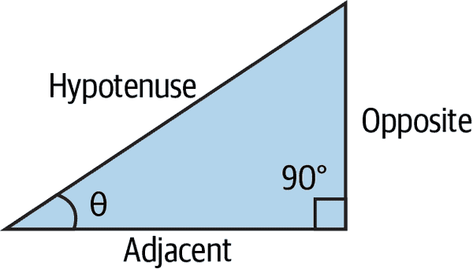

###### 图 4-9\. 直角三角形

让我们定义直角三角形的主要特征：

+   三角形的最长边称为*斜边*。

+   斜边对面的角是直角（90**°**的那个角）。

+   根据选择的另一个角（θ）（剩下的两个角之一），连接这个角和斜边的线称为*邻边*，另一条线称为*对边*。

###### 注意

三角函数是数学函数，用于将直角三角形的角度与其边长的比率关联起来。它们在几何学、物理学、工程学等领域有各种应用。它们帮助分析和解决与角度、距离、振荡和波形等相关的问题。

三角函数简单来说就是三角形的一条线除以另一条线的比值。记住三角形有三条边（斜边、对边和邻边）。三角函数如下找到：

<math alttext="s i n left-parenthesis theta right-parenthesis equals StartFraction Opposite Over Hypotenuse EndFraction"><mrow><mi>s</mi> <mi>i</mi> <mi>n</mi> <mrow><mo>(</mo> <mi>θ</mi> <mo>)</mo></mrow> <mo>=</mo> <mstyle displaystyle="false" scriptlevel="0"><mfrac><mtext>Opposite</mtext> <mtext>Hypotenuse</mtext></mfrac></mstyle></mrow></math>

<math alttext="c o s left-parenthesis theta right-parenthesis equals StartFraction Adjacent Over Hypotenuse EndFraction"><mrow><mi>c</mi> <mi>o</mi> <mi>s</mi> <mrow><mo>(</mo> <mi>θ</mi> <mo>)</mo></mrow> <mo>=</mo> <mstyle displaystyle="false" scriptlevel="0"><mfrac><mtext>Adjacent</mtext> <mtext>Hypotenuse</mtext></mfrac></mstyle></mrow></math>

<math alttext="t a n left-parenthesis theta right-parenthesis equals StartFraction Opposite Over Adjacent EndFraction"><mrow><mi>t</mi> <mi>a</mi> <mi>n</mi> <mrow><mo>(</mo> <mi>θ</mi> <mo>)</mo></mrow> <mo>=</mo> <mstyle displaystyle="false" scriptlevel="0"><mfrac><mtext>Opposite</mtext> <mtext>Adjacent</mtext></mfrac></mstyle></mrow></math>

从前面的三个三角函数中，可以通过基本的线性代数得到一个三角恒等式，通过*sin*和*cos*可以得到*tan*：

<math alttext="t a n left-parenthesis theta right-parenthesis equals StartFraction s i n left-parenthesis theta right-parenthesis Over c o s left-parenthesis theta right-parenthesis EndFraction"><mrow><mi>t</mi> <mi>a</mi> <mi>n</mi> <mrow><mo>(</mo> <mi>θ</mi> <mo>)</mo></mrow> <mo>=</mo> <mstyle displaystyle="false" scriptlevel="0"><mfrac><mrow><mi>s</mi><mi>i</mi><mi>n</mi><mo>(</mo><mi>θ</mi><mo>)</mo></mrow> <mrow><mi>c</mi><mi>o</mi><mi>s</mi><mo>(</mo><mi>θ</mi><mo>)</mo></mrow></mfrac></mstyle></mrow></math>

*双曲函数*类似于三角函数，但是使用指数函数来定义。在理解双曲函数之前，必须了解欧拉数。

###### 注意

这部分关于双曲函数的内容很有趣，因为它构成了所谓的*激活函数*的基础，这是神经网络中的一个关键概念，深度学习模型的主角。您将在第八章中详细了解它们。

*欧拉数*（记为*e*）是数学中最重要的数之一。它是一个*无理数*，即不能用分数表示的实数。*无理*一词来自于无法用*比率*来表示它的事实；这与其性质无关。欧拉数也是自然对数*ln*的底数，其前几位数字为 2.71828。一个最佳的近似值公式如下：

<math alttext="e equals left-parenthesis 1 plus StartFraction 1 Over n EndFraction right-parenthesis Superscript n"><mrow><mi>e</mi> <mo>=</mo> <msup><mrow><mo>(</mo><mn>1</mn><mo>+</mo><mfrac><mn>1</mn> <mi>n</mi></mfrac><mo>)</mo></mrow> <mi>n</mi></msup></mrow></math>

通过在前述公式中增加*n*，您将接近*e*的值。欧拉数有许多有趣的性质，最显著的是其斜率等于其自身的值。考虑以下函数（也称为*自然指数函数*）：

<math alttext="f left-parenthesis x right-parenthesis equals e Superscript x"><mrow><mi>f</mi> <mrow><mo>(</mo> <mi>x</mi> <mo>)</mo></mrow> <mo>=</mo> <msup><mi>e</mi> <mi>x</mi></msup></mrow></math>

在任何点，函数的斜率都是相同的值。看看图 4-10。

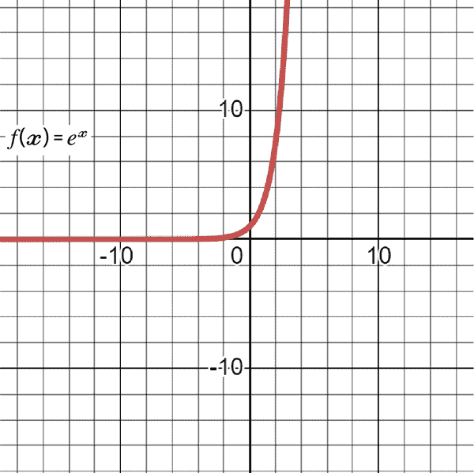

###### 图 4-10\. 自然指数函数的图表

###### 注意

你可能会想知道为什么我在这本书中解释指数和对数。主要有两个原因：

+   指数和更重要的是欧拉数在双曲函数中被使用，其中 *tanh(x)* 是神经网络中的主要激活函数，一种机器学习和深度学习模型。

+   对数在*损失函数*中非常有用，这是你在后面章节中会看到的概念。

双曲函数使用自然指数函数，并定义如下：

<math alttext="s i n h left-parenthesis x right-parenthesis equals StartFraction e Superscript x Baseline minus e Superscript negative x Baseline Over 2 EndFraction"><mrow><mi>s</mi> <mi>i</mi> <mi>n</mi> <mi>h</mi> <mrow><mo>(</mo> <mi>x</mi> <mo>)</mo></mrow> <mo>=</mo> <mstyle displaystyle="false" scriptlevel="0"><mfrac><mrow><msup><mi>e</mi> <mi>x</mi></msup> <mo>-</mo><msup><mi>e</mi> <mrow><mo>-</mo><mi>x</mi></mrow></msup></mrow> <mn>2</mn></mfrac></mstyle></mrow></math>

<math alttext="c o s h left-parenthesis x right-parenthesis equals StartFraction e Superscript x Baseline plus e Superscript negative x Baseline Over 2 EndFraction"><mrow><mi>c</mi> <mi>o</mi> <mi>s</mi> <mi>h</mi> <mrow><mo>(</mo> <mi>x</mi> <mo>)</mo></mrow> <mo>=</mo> <mstyle displaystyle="false" scriptlevel="0"><mfrac><mrow><msup><mi>e</mi> <mi>x</mi></msup> <mo>+</mo><msup><mi>e</mi> <mrow><mo>-</mo><mi>x</mi></mrow></msup></mrow> <mn>2</mn></mfrac></mstyle></mrow></math>

<math alttext="t a n h left-parenthesis x right-parenthesis equals StartFraction e Superscript x Baseline minus e Superscript negative x Baseline Over e Superscript x Baseline plus e Superscript negative x Baseline EndFraction"><mrow><mi>t</mi> <mi>a</mi> <mi>n</mi> <mi>h</mi> <mrow><mo>(</mo> <mi>x</mi> <mo>)</mo></mrow> <mo>=</mo> <mstyle displaystyle="false" scriptlevel="0"><mfrac><mrow><msup><mi>e</mi> <mi>x</mi></msup> <mo>-</mo><msup><mi>e</mi> <mrow><mo>-</mo><mi>x</mi></mrow></msup></mrow> <mrow><msup><mi>e</mi> <mi>x</mi></msup> <mo>+</mo><msup><mi>e</mi> <mrow><mo>-</mo><mi>x</mi></mrow></msup></mrow></mfrac></mstyle></mrow></math>

*tanh(x)* 的主要特征包括非线性、限制在 [–1, 1] 之间，并且其以零为中心。图 4-11 显示了 *tanh(x)* 的图表。

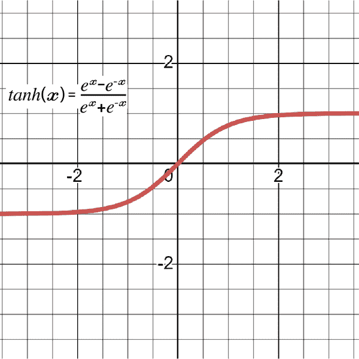

###### 图 4-11\. 显示了 *tanh(x)* 的图表，显示它在 –1 和 1 之间的限制。

###### 注意

本节的主要要点如下：

+   三角学是一个研究三角函数行为的领域，它将三角形的角度与其边长联系起来。

+   三角恒等式是将三角函数相互关联的快捷方式。

+   欧拉数 *e* 是无理数，是自然对数的底数。它在指数增长和双曲函数中有许多应用。

+   双曲正切函数在神经网络中，一种深度学习算法中被使用。

# 微积分

正如前面提到的，微积分是数学的一个分支，专注于速率变化和数量积累的研究。它包括两个主要分支：*微分学*（处理导数）和*积分学*（处理积分）。本节简要介绍了这两种微积分类型，同时讨论了诸如极限和优化等主题。

## 极限与连续性

> *微积分通过使微不足道的小量显现出来而起作用。*
> 
> —Keith Devlin

极限并不一定是噩梦。我一直发现人们对它们有所误解。实际上，它们非常容易理解。但首先，你需要动力，这源于了解学习极限的附加价值。

理解极限对于机器学习模型来说是非常重要的，原因有很多：

优化

在像梯度下降这样的优化方法中，极限可以用来调节步长并保证收敛到局部最小值。

特征选择

极限可以用来排列各种模型特征的重要性并进行特征选择，这可以使模型更简单且性能更好。

敏感性分析

机器学习模型对输入数据变化的敏感性以及其泛化到新数据的能力可以用来检验模型的行为。

同样，极限被用于你即将学习的更高级的微积分概念中。

极限的主要目的是在函数未定义时知道函数的值。但是什么是*未定义函数*？当您有一个给出不可能的解决方案的函数（例如除以零）时，极限帮助您绕过此问题以了解该点处函数的值。因此，极限的目的是即使在函数未定义时也能解决函数。

请记住，将 *x* 作为输入的函数的解是 *y* 轴上的一个值。 图 4-12 展示了以下函数的线性图形：

<math alttext="f left-parenthesis x right-parenthesis equals x plus 2"><mrow><mi>f</mi> <mo>(</mo> <mi>x</mi> <mo>)</mo> <mo>=</mo> <mi>x</mi> <mo>+</mo> <mn>2</mn></mrow></math>

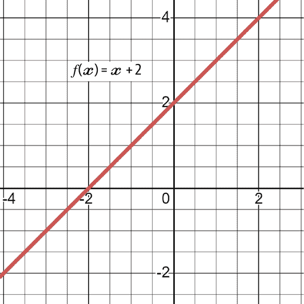

###### 图 4-12\. 函数 f(x) = x + 2 的图形

图形中函数的解是每次考虑 *x* 的值时位于线性线上的解。

当 *x* = 4 时，函数（*y* 的值）的解将是什么？显然，答案是 6，因为将 *x* 的值替换为 4 给出 6：

<math alttext="f left-parenthesis 4 right-parenthesis equals 4 plus 2 equals 6"><mrow><mi>f</mi> <mo>(</mo> <mn>4</mn> <mo>)</mo> <mo>=</mo> <mn>4</mn> <mo>+</mo> <mn>2</mn> <mo>=</mo> <mn>6</mn></mrow></math>

将此解释视为极限的解决方案就像询问函数在 *x* 从两侧（负/递减侧和正/递增侧）接近 4 时的解决方案一样。 表 4-1 简化了这个困境。

表 4-1\. 找到接近 4 的 *x*

| *f(x)* | *x* |
| --- | --- |
| 5.998 | 3.998 |
| 5.999 | 3.999 |
| 6.000 | 4.000 |
| 6.001 | 4.001 |
| 6.002 | 4.002 |

从负侧接近相当于在 4 以下添加一个数字的分数并每次分析结果。类似地，从正侧接近相当于在 4 以上减去一个数字的分数并每次分析结果。随着 *x* 接近 4，解似乎收敛到 6。这是极限的解。

一般形式的极限按照以下约定编写：

<math alttext="limit Underscript x right-arrow a Endscripts f left-parenthesis x right-parenthesis equals upper L"><mrow><msub><mo form="prefix" movablelimits="true">lim</mo> <mrow><mi>x</mi><mo>→</mo><mi>a</mi></mrow></msub> <mi>f</mi> <mrow><mo>(</mo> <mi>x</mi> <mo>)</mo></mrow> <mo>=</mo> <mi>L</mi></mrow></math>

极限的一般形式读作：当您沿着 *x* 轴接近 *a*（无论是从正侧还是从负侧），函数 *f(x)* 都会趋于值 *L*。

###### 注意

极限的概念表明，当您从任一侧（负或正）锁定并接近一个数字时，方程的解会接近某个数字，而极限的解就是那个数字。

如前所述，当使用传统的代入方法无法确定解的确切位置时，极限就变得很有用。

单侧极限与一般极限不同。对于左侧极限，您从负侧向正侧寻找极限，而对于右侧极限，您从正侧向负侧寻找极限。当两个单侧极限存在且相等时，一般极限存在。因此，前述陈述可以总结如下：

+   左侧极限存在。

+   右侧极限存在。

+   左侧极限等于右侧极限。

左侧极限定义如下：

<math alttext="limit Underscript x right-arrow a Superscript minus Baseline Endscripts f left-parenthesis x right-parenthesis equals upper L"><mrow><msub><mo form="prefix" movablelimits="true">lim</mo> <mrow><mi>x</mi><mo>→</mo><msup><mi>a</mi> <mo>-</mo></msup></mrow></msub> <mi>f</mi> <mrow><mo>(</mo> <mi>x</mi> <mo>)</mo></mrow> <mo>=</mo> <mi>L</mi></mrow></math>

右侧极限定义如下：

<math alttext="limit Underscript x right-arrow a Superscript plus Baseline Endscripts f left-parenthesis x right-parenthesis equals upper L"><mrow><msub><mo form="prefix" movablelimits="true">lim</mo> <mrow><mi>x</mi><mo>→</mo><msup><mi>a</mi> <mo>+</mo></msup></mrow></msub> <mi>f</mi> <mrow><mo>(</mo> <mi>x</mi> <mo>)</mo></mrow> <mo>=</mo> <mi>L</mi></mrow></math>

考虑以下方程：

<math alttext="f left-parenthesis x right-parenthesis equals StartFraction x cubed minus 27 Over x minus 3 EndFraction"><mrow><mi>f</mi> <mrow><mo>(</mo> <mi>x</mi> <mo>)</mo></mrow> <mo>=</mo> <mstyle displaystyle="false" scriptlevel="0"><mfrac><mrow><msup><mi>x</mi> <mn>3</mn></msup> <mo>-</mo><mn>27</mn></mrow> <mrow><mi>x</mi><mo>-</mo><mn>3</mn></mrow></mfrac></mstyle></mrow></math>

当 *x* = 3 时，函数的解决方案是什么？代入得出以下问题：

<math alttext="f left-parenthesis 3 right-parenthesis equals StartFraction 3 cubed minus 27 Over 3 minus 3 EndFraction equals StartFraction 27 minus 27 Over 3 minus 3 EndFraction equals StartFraction 0 Over 0 EndFraction equals Undefined"><mrow><mi>f</mi> <mrow><mo>(</mo> <mn>3</mn> <mo>)</mo></mrow> <mo>=</mo> <mstyle displaystyle="false" scriptlevel="0"><mfrac><mrow><msup><mn>3</mn> <mn>3</mn></msup> <mo>-</mo><mn>27</mn></mrow> <mrow><mn>3</mn><mo>-</mo><mn>3</mn></mrow></mfrac></mstyle> <mo>=</mo> <mstyle displaystyle="false" scriptlevel="0"><mfrac><mrow><mn>27</mn><mo>-</mo><mn>27</mn></mrow> <mrow><mn>3</mn><mo>-</mo><mn>3</mn></mrow></mfrac></mstyle> <mo>=</mo> <mstyle displaystyle="false" scriptlevel="0"><mfrac><mn>0</mn> <mn>0</mn></mfrac></mstyle> <mo>=</mo> <mtext>Undefined</mtext></mrow></math>

然而，从 表 4-2 显示的极限的角度来看，当从左侧或右侧逼近 *x* = 3 时，解决方案趋近于 27。

表 4-2\. 寻找 *x* 逼近 3 的值

| f(x) | x |
| --- | --- |
| 2.9998 | 26.9982 |
| 2.9999 | 26.9991 |
| 3.0000 | 未定义 |
| 3.0001 | 27.0009 |
| 3.0002 | 27.0018 |

从图形上看，这可以看作是图表在两个轴上的不连续性。这种不连续性存在于坐标 (3, 27) 附近的线上。一些函数没有极限。例如，当 *x* 接近 5 时，以下函数的极限是多少？

<math alttext="limit Underscript x right-arrow 5 Endscripts StartFraction 1 Over x minus 5 EndFraction"><mrow><msub><mo form="prefix" movablelimits="true">lim</mo> <mrow><mi>x</mi><mo>→</mo><mn>5</mn></mrow></msub> <mfrac><mn>1</mn> <mrow><mi>x</mi><mo>-</mo><mn>5</mn></mrow></mfrac></mrow></math>

查看 表 4-3，当 *x* 接近 5 时，从两边逼近结果显著分离。例如，从负侧逼近，4.9999 的极限是 –10,000，从正侧逼近，5.0001 的极限是 10,000。

表 4-3\. 寻找 *x* 逼近 5 的值

| f(x) | x |
| --- | --- |
| 4.9998 | –5000 |
| 4.9999 | –10000 |
| 5.0000 | 未定义 |
| 5.0001 | 10000 |
| 5.0002 | 5000 |

要记住，一般极限存在的条件是单侧极限必须存在且相等，但在这里并非如此。通过绘图可以看出，这为 图 4-13 说明了为何极限不存在。

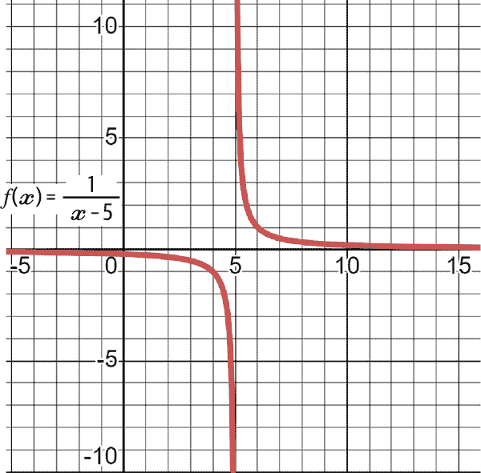

###### 图 4-13\. 证明极限不存在的函数图表

但如果你想分析的函数看起来像这样： 

<math alttext="limit Underscript x right-arrow 5 Endscripts StartFraction 1 Over StartAbsoluteValue x minus 5 EndAbsoluteValue EndFraction"><mrow><msub><mo form="prefix" movablelimits="true">lim</mo> <mrow><mi>x</mi><mo>→</mo><mn>5</mn></mrow></msub> <mfrac><mn>1</mn> <mrow><mo>|</mo><mi>x</mi><mo>-</mo><mn>5</mn><mo>|</mo></mrow></mfrac></mrow></math>

查看 表 4-3，当 *x* 接近 5 时，结果在逼近时快速加速到被称为无穷大 (∞) 的非常大的数值：

<math alttext="f left-parenthesis x right-parenthesis equals StartFraction 1 Over StartAbsoluteValue x minus 5 EndAbsoluteValue EndFraction"><mrow><mi>f</mi> <mrow><mo>(</mo> <mi>x</mi> <mo>)</mo></mrow> <mo>=</mo> <mstyle displaystyle="false" scriptlevel="0"><mfrac><mn>1</mn> <mrow><mo>|</mo><mi>x</mi><mo>-</mo><mn>5</mn><mo>|</mo></mrow></mfrac></mstyle></mrow></math>

查看 表 4-4：

表 4-4\. 另一种寻找 *x* 逼近 5 的尝试

| f(x) | x |
| --- | --- |
| 4.99997 | 334333.33 |
| 4.99998 | 50000 |
| 4.99999 | 100000 |
| 4.9999999 | 10000000 |
| 5.00000 | 未定义 |
| 5.0000001 | 10000000 |
| 5.00001 | 100000 |
| 5.00002 | 50000 |
| 5.00003 | 334333.33 |

在每一个微小的步骤中，*x* 接近 5，*y* 也逐渐接近正无穷大。因此极限的答案是正无穷大（+∞）。 图 4-14 显示了函数的图表。请注意，当 *x* 接近 5 时，两边的值都在上升。

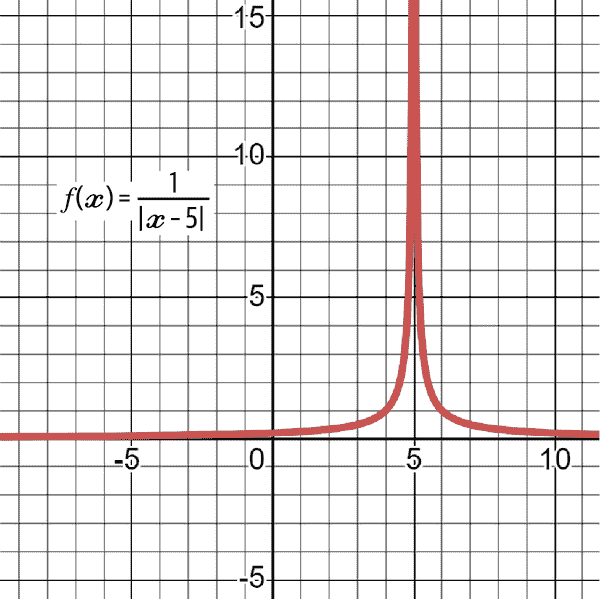

###### 图 4-14\. 证明极限存在的函数图表

*连续* 函数是在图表中没有间隙或空洞的函数，而 *不连续* 函数则包含这些间隙和空洞。这通常意味着后者包含函数未定义的点，并可能需要通过极限进行近似。因此，连续性和极限是两个相关的概念。

让我们继续解决极限问题；毕竟，你不会每次都创建表格并主观分析结果以找到极限。解决极限有三种方法：

+   *替换*：这是最简单的规则，通常首先使用。

+   *因式分解*：这是替换失败后的下一步。

+   *共轭方法*：这个解决方案是在前两个方法不起作用之后的选择。

*替换* 简单地将*x*接近的值代入。基本上，这些是使用极限的函数解。看下面的例子：

<math alttext="limit Underscript x right-arrow 5 Endscripts x plus 10 minus 2 x"><mrow><msub><mo form="prefix" movablelimits="true">lim</mo> <mrow><mi>x</mi><mo>→</mo><mn>5</mn></mrow></msub> <mi>x</mi> <mo>+</mo> <mn>10</mn> <mo>-</mo> <mn>2</mn> <mi>x</mi></mrow></math>

使用替换，函数的极限如下找到：

<math alttext="StartLayout 1st Row  limit Underscript x right-arrow 5 Endscripts x plus 10 minus 2 x equals 5 plus 10 minus left-parenthesis 2 times 5 right-parenthesis equals 5 EndLayout"><mtable displaystyle="true"><mtr><mtd columnalign="right"><mrow><munder><mo form="prefix" movablelimits="true">lim</mo> <mrow><mi>x</mi><mo>→</mo><mn>5</mn></mrow></munder> <mi>x</mi> <mo>+</mo> <mn>10</mn> <mo>-</mo> <mn>2</mn> <mi>x</mi> <mo>=</mo> <mn>5</mn> <mo>+</mo> <mn>10</mn> <mo>-</mo> <mrow><mo>(</mo> <mn>2</mn> <mo>×</mo> <mn>5</mn> <mo>)</mo></mrow> <mo>=</mo> <mn>5</mn></mrow></mtd></mtr></mtable></math>

因此，极限的答案为 5。

*因式分解* 是替换不起作用时的下一步选择（例如，将*x*的值代入函数后，极限未定义）。 *因式分解* 是通过使用因子以改变方程的形式的方法，使得在使用替换时方程不再是未定义的。看下面的例子：

<math alttext="limit Underscript x right-arrow negative 6 Endscripts StartFraction left-parenthesis x plus 6 right-parenthesis left-parenthesis x squared minus x plus 1 right-parenthesis Over x plus 6 EndFraction"><mrow><msub><mo form="prefix" movablelimits="true">lim</mo> <mrow><mi>x</mi><mo>→</mo><mo>-</mo><mn>6</mn></mrow></msub> <mfrac><mrow><mrow><mo>(</mo><mi>x</mi><mo>+</mo><mn>6</mn><mo>)</mo></mrow><mrow><mo>(</mo><msup><mi>x</mi> <mn>2</mn></msup> <mo>-</mo><mi>x</mi><mo>+</mo><mn>1</mn><mo>)</mo></mrow></mrow> <mrow><mi>x</mi><mo>+</mo><mn>6</mn></mrow></mfrac></mrow></math>

如果尝试替换，将得到一个未定义的值如下：

<math alttext="StartLayout 1st Row  limit Underscript x right-arrow negative 6 Endscripts StartFraction left-parenthesis x plus 6 right-parenthesis left-parenthesis x squared minus x plus 1 right-parenthesis Over x plus 6 EndFraction equals StartFraction left-parenthesis negative 6 plus 6 right-parenthesis left-parenthesis left-parenthesis negative 6 right-parenthesis squared minus left-parenthesis negative 6 right-parenthesis plus 1 right-parenthesis Over negative 6 plus 6 EndFraction equals StartFraction 0 Over 0 EndFraction equals Undefined EndLayout"><mtable displaystyle="true"><mtr><mtd columnalign="right"><mrow><munder><mo form="prefix" movablelimits="true">lim</mo> <mrow><mi>x</mi><mo>→</mo><mo>-</mo><mn>6</mn></mrow></munder> <mfrac><mrow><mrow><mo>(</mo><mi>x</mi><mo>+</mo><mn>6</mn><mo>)</mo></mrow><mrow><mo>(</mo><msup><mi>x</mi> <mn>2</mn></msup> <mo>-</mo><mi>x</mi><mo>+</mo><mn>1</mn><mo>)</mo></mrow></mrow> <mrow><mi>x</mi><mo>+</mo><mn>6</mn></mrow></mfrac> <mo>=</mo> <mfrac><mrow><mrow><mo>(</mo><mo>-</mo><mn>6</mn><mo>+</mo><mn>6</mn><mo>)</mo></mrow><mo>(</mo><msup><mrow><mo>(</mo><mo>-</mo><mn>6</mn><mo>)</mo></mrow> <mn>2</mn></msup> <mo>-</mo><mrow><mo>(</mo><mo>-</mo><mn>6</mn><mo>)</mo></mrow><mo>+</mo><mn>1</mn><mo>)</mo></mrow> <mrow><mo>-</mo><mn>6</mn><mo>+</mo><mn>6</mn></mrow></mfrac> <mo>=</mo> <mfrac><mn>0</mn> <mn>0</mn></mfrac> <mo>=</mo> <mtext>Undefined</mtext></mrow></mtd></mtr></mtable></math>

在这种情况下，因式分解可能有所帮助。例如，分子乘以（*x* + 6），然后除以（*x* + 6）。通过取消两个项来简化这个过程可能会得到一个解：

<math alttext="limit Underscript x right-arrow negative 6 Endscripts StartFraction left-parenthesis x plus 6 right-parenthesis left-parenthesis x squared minus x plus 1 right-parenthesis Over x plus 6 EndFraction equals limit Underscript x right-arrow negative 6 Endscripts x squared minus x plus 1"><mrow><msub><mo form="prefix" movablelimits="true">lim</mo> <mrow><mi>x</mi><mo>→</mo><mo>-</mo><mn>6</mn></mrow></msub> <mfrac><mrow><mrow><mo>(</mo><mi>x</mi><mo>+</mo><mn>6</mn><mo>)</mo></mrow><mrow><mo>(</mo><msup><mi>x</mi> <mn>2</mn></msup> <mo>-</mo><mi>x</mi><mo>+</mo><mn>1</mn><mo>)</mo></mrow></mrow> <mrow><mi>x</mi><mo>+</mo><mn>6</mn></mrow></mfrac> <mo>=</mo> <msub><mo form="prefix" movablelimits="true">lim</mo> <mrow><mi>x</mi><mo>→</mo><mo>-</mo><mn>6</mn></mrow></msub> <msup><mi>x</mi> <mn>2</mn></msup> <mo>-</mo> <mi>x</mi> <mo>+</mo> <mn>1</mn></mrow></math>

现在因式分解已完成，您可以再次尝试替换：

<math alttext="limit Underscript x right-arrow negative 6 Endscripts x squared minus x plus 1 equals left-parenthesis negative 6 right-parenthesis squared minus left-parenthesis negative 6 right-parenthesis plus 1 equals 43"><mrow><msub><mo form="prefix" movablelimits="true">lim</mo> <mrow><mi>x</mi><mo>→</mo><mo>-</mo><mn>6</mn></mrow></msub> <msup><mi>x</mi> <mn>2</mn></msup> <mo>-</mo> <mi>x</mi> <mo>+</mo> <mn>1</mn> <mo>=</mo> <msup><mrow><mo>(</mo><mo>-</mo><mn>6</mn><mo>)</mo></mrow> <mn>2</mn></msup> <mo>-</mo> <mrow><mo>(</mo> <mo>-</mo> <mn>6</mn> <mo>)</mo></mrow> <mo>+</mo> <mn>1</mn> <mo>=</mo> <mn>43</mn></mrow></math>

函数在*x*趋向于-6 时的极限因此为 43。

当替换和因式分解都不起作用时，形成共轭是下一步的选择。 *共轭* 是通过简单地改变两个变量之间的符号来形成的。例如，*x* + *y* 的共轭是 *x* - *y*。在分数的情况下，通过用其中一个的共轭来乘分子和分母（最好使用具有平方根的项的共轭，因为它将被取消）。考虑以下例子：

<math alttext="limit Underscript x right-arrow 9 Endscripts StartFraction x minus 9 Over StartRoot x EndRoot minus 3 EndFraction"><mrow><msub><mo form="prefix" movablelimits="true">lim</mo> <mrow><mi>x</mi><mo>→</mo><mn>9</mn></mrow></msub> <mstyle displaystyle="false" scriptlevel="0"><mfrac><mrow><mi>x</mi><mo>-</mo><mn>9</mn></mrow> <mrow><msqrt><mi>x</mi></msqrt><mo>-</mo><mn>3</mn></mrow></mfrac></mstyle></mrow></math>

通过将分母的共轭乘以两个项，您将开始使用共轭方法来解决问题：

<math alttext="limit Underscript x right-arrow 9 Endscripts StartFraction x minus 9 Over StartRoot x EndRoot minus 3 EndFraction left-parenthesis StartFraction StartRoot x EndRoot plus 3 Over StartRoot x EndRoot plus 3 EndFraction right-parenthesis"><mrow><msub><mo form="prefix" movablelimits="true">lim</mo> <mrow><mi>x</mi><mo>→</mo><mn>9</mn></mrow></msub> <mstyle displaystyle="false" scriptlevel="0"><mfrac><mrow><mi>x</mi><mo>-</mo><mn>9</mn></mrow> <mrow><msqrt><mi>x</mi></msqrt><mo>-</mo><mn>3</mn></mrow></mfrac></mstyle> <mrow><mo>(</mo> <mfrac><mrow><msqrt><mi>x</mi></msqrt><mo>+</mo><mn>3</mn></mrow> <mrow><msqrt><mi>x</mi></msqrt><mo>+</mo><mn>3</mn></mrow></mfrac> <mo>)</mo></mrow></mrow></math>

考虑乘法然后简化得到如下结果：

<math alttext="limit Underscript x right-arrow 9 Endscripts StartFraction left-parenthesis x minus 9 right-parenthesis left-parenthesis StartRoot x EndRoot plus 3 right-parenthesis Over left-parenthesis StartRoot x EndRoot minus 3 right-parenthesis left-parenthesis StartRoot x EndRoot plus 3 right-parenthesis EndFraction"><mrow><msub><mo form="prefix" movablelimits="true">lim</mo> <mrow><mi>x</mi><mo>→</mo><mn>9</mn></mrow></msub> <mstyle displaystyle="false" scriptlevel="0"><mfrac><mrow><mrow><mo>(</mo><mi>x</mi><mo>-</mo><mn>9</mn><mo>)</mo></mrow><mrow><mo>(</mo><msqrt><mi>x</mi></msqrt><mo>+</mo><mn>3</mn><mo>)</mo></mrow></mrow> <mrow><mrow><mo>(</mo><msqrt><mi>x</mi></msqrt><mo>-</mo><mn>3</mn><mo>)</mo></mrow><mrow><mo>(</mo><msqrt><mi>x</mi></msqrt><mo>+</mo><mn>3</mn><mo>)</mo></mrow></mrow></mfrac></mstyle></mrow></math>

您将得到以下熟悉的情况：

<math alttext="limit Underscript x right-arrow 9 Endscripts StartFraction left-parenthesis x minus 9 right-parenthesis left-parenthesis StartRoot x EndRoot plus 3 right-parenthesis Over x minus 9 EndFraction"><mrow><msub><mo form="prefix" movablelimits="true">lim</mo> <mrow><mi>x</mi><mo>→</mo><mn>9</mn></mrow></msub> <mfrac><mrow><mrow><mo>(</mo><mi>x</mi><mo>-</mo><mn>9</mn><mo>)</mo></mrow><mrow><mo>(</mo><msqrt><mi>x</mi></msqrt><mo>+</mo><mn>3</mn><mo>)</mo></mrow></mrow> <mrow><mi>x</mi><mo>-</mo><mn>9</mn></mrow></mfrac></mrow></math>

<math alttext="limit Underscript x right-arrow 9 Endscripts StartRoot x EndRoot plus 3"><mrow><msub><mo form="prefix" movablelimits="true">lim</mo> <mrow><mi>x</mi><mo>→</mo><mn>9</mn></mrow></msub> <msqrt><mi>x</mi></msqrt> <mo>+</mo> <mn>3</mn></mrow></math>

现在函数已准备好进行替换：

<math alttext="limit Underscript x right-arrow 9 Endscripts StartRoot 9 EndRoot plus 3 equals 3 plus 3 equals 6"><mrow><msub><mo form="prefix" movablelimits="true">lim</mo> <mrow><mi>x</mi><mo>→</mo><mn>9</mn></mrow></msub> <msqrt><mn>9</mn></msqrt> <mo>+</mo> <mn>3</mn> <mo>=</mo> <mn>3</mn> <mo>+</mo> <mn>3</mn> <mo>=</mo> <mn>6</mn></mrow></math>

因此，函数的解为 6。如您所见，有时需要对方程进行处理，然后才能进行替换。

###### 注意

本节的关键要点如下：

+   极限帮助找到在某些点可能未定义的函数的解。

+   对于一般的极限存在，两个单侧极限必须存在且必须相等。

+   有多种方法可以找到函数的极限，尤其是替换、因式分解和形成共轭。

## 导数

*导数* 衡量给定一个或多个输入变化时函数的变化。换句话说，它是给定点上函数变化率。

在构建机器学习模型中，对导数有深刻的理解是重要的，有多个原因：

优化

要使损失函数最小化，优化方法利用导数确定最陡下降的方向并修改模型的参数。

反向传播

在深度学习中执行梯度下降时，反向传播技术利用导数计算损失函数对模型参数的梯度。

超参数调优

为了提升模型性能，导数用于敏感性分析和超参数调优。

不要忘记前一节关于极限的知识，因为在本节中你同样会需要这些知识。微积分主要涉及导数和积分。本节讨论了导数及其用途。

你可以将导数视为表示（或建模）另一函数在某点斜率的函数。*斜率*是一条线相对于水平线的位置的度量。正斜率表示线上升，而负斜率表示线下降。

导数和斜率是相关的概念，但它们并不完全相同。以下是两者的主要区别：

斜率

斜率衡量了一条线的陡峭程度。它是*y*轴变化与*x*轴变化的比率。

导数

导数描述了给定函数的变化率。当函数上两点之间的距离趋近于零时，该函数在该点的导数就是切线斜率的极限。

在解释导数的通俗术语及展示一些例子之前，让我们先看看它们的形式定义：

<math alttext="f prime left-parenthesis x right-parenthesis equals limit Underscript h right-arrow 0 Endscripts StartFraction f left-parenthesis x plus h right-parenthesis minus f left-parenthesis x right-parenthesis Over h EndFraction"><mrow><msup><mi>f</mi> <mo>'</mo></msup> <mrow><mo>(</mo> <mi>x</mi> <mo>)</mo></mrow> <mo>=</mo> <msub><mo form="prefix" movablelimits="true">lim</mo> <mrow><mi>h</mi><mo>→</mo><mn>0</mn></mrow></msub> <mstyle displaystyle="false" scriptlevel="0"><mfrac><mrow><mi>f</mi><mo>(</mo><mi>x</mi><mo>+</mo><mi>h</mi><mo>)</mo><mo>-</mo><mi>f</mi><mo>(</mo><mi>x</mi><mo>)</mo></mrow> <mi>h</mi></mfrac></mstyle></mrow></math>

这个方程构成了求解导数的基础，尽管你将会学到许多简化的捷径。让我们尝试使用形式化定义找到函数的导数。考虑以下方程：

<math alttext="f left-parenthesis x right-parenthesis equals x squared plus 4 x minus 2"><mrow><mi>f</mi> <mrow><mo>(</mo> <mi>x</mi> <mo>)</mo></mrow> <mo>=</mo> <msup><mi>x</mi> <mn>2</mn></msup> <mo>+</mo> <mn>4</mn> <mi>x</mi> <mo>-</mo> <mn>2</mn></mrow></math>

要找到导数，将*f(x)*代入形式化定义，然后解决极限：

<math alttext="f prime left-parenthesis x right-parenthesis equals limit Underscript h right-arrow 0 Endscripts StartFraction f left-parenthesis x plus h right-parenthesis minus f left-parenthesis x right-parenthesis Over h EndFraction"><mrow><msup><mi>f</mi> <mo>'</mo></msup> <mrow><mo>(</mo> <mi>x</mi> <mo>)</mo></mrow> <mo>=</mo> <msub><mo form="prefix" movablelimits="true">lim</mo> <mrow><mi>h</mi><mo>→</mo><mn>0</mn></mrow></msub> <mstyle displaystyle="false" scriptlevel="0"><mfrac><mrow><mi>f</mi><mo>(</mo><mi>x</mi><mo>+</mo><mi>h</mi><mo>)</mo><mo>-</mo><mi>f</mi><mo>(</mo><mi>x</mi><mo>)</mo></mrow> <mi>h</mi></mfrac></mstyle></mrow></math>

为了简化问题，让我们找到*f(x + h)*，这样插入形式化定义会更容易：

<math alttext="f left-parenthesis x plus h right-parenthesis equals left-parenthesis x plus h right-parenthesis squared plus 4 left-parenthesis x plus h right-parenthesis minus 2"><mrow><mi>f</mi> <mrow><mo>(</mo> <mi>x</mi> <mo>+</mo> <mi>h</mi> <mo>)</mo></mrow> <mo>=</mo> <msup><mrow><mo>(</mo><mi>x</mi><mo>+</mo><mi>h</mi><mo>)</mo></mrow> <mn>2</mn></msup> <mo>+</mo> <mn>4</mn> <mrow><mo>(</mo> <mi>x</mi> <mo>+</mo> <mi>h</mi> <mo>)</mo></mrow> <mo>-</mo> <mn>2</mn></mrow></math>

<math alttext="f left-parenthesis x plus h right-parenthesis equals x squared plus 2 x h plus h squared plus 4 x plus 4 h minus 2"><mrow><mi>f</mi> <mrow><mo>(</mo> <mi>x</mi> <mo>+</mo> <mi>h</mi> <mo>)</mo></mrow> <mo>=</mo> <msup><mi>x</mi> <mn>2</mn></msup> <mo>+</mo> <mn>2</mn> <mi>x</mi> <mi>h</mi> <mo>+</mo> <msup><mi>h</mi> <mn>2</mn></msup> <mo>+</mo> <mn>4</mn> <mi>x</mi> <mo>+</mo> <mn>4</mn> <mi>h</mi> <mo>-</mo> <mn>2</mn></mrow></math>

现在让我们将*f(x + h)*代入定义中：

<math alttext="f prime left-parenthesis x right-parenthesis equals limit Underscript h right-arrow 0 Endscripts StartFraction x squared plus 2 x h plus h squared plus 4 x plus 4 h minus 2 minus x squared minus 4 x plus 2 Over h EndFraction"><mrow><msup><mi>f</mi> <mo>'</mo></msup> <mrow><mo>(</mo> <mi>x</mi> <mo>)</mo></mrow> <mo>=</mo> <msub><mo form="prefix" movablelimits="true">lim</mo> <mrow><mi>h</mi><mo>→</mo><mn>0</mn></mrow></msub> <mstyle displaystyle="false" scriptlevel="0"><mfrac><mrow><msup><mi>x</mi> <mn>2</mn></msup> <mo>+</mo><mn>2</mn><mi>x</mi><mi>h</mi><mo>+</mo><msup><mi>h</mi> <mn>2</mn></msup> <mo>+</mo><mn>4</mn><mi>x</mi><mo>+</mo><mn>4</mn><mi>h</mi><mo>-</mo><mn>2</mn><mo>-</mo><msup><mi>x</mi> <mn>2</mn></msup> <mo>-</mo><mn>4</mn><mi>x</mi><mo>+</mo><mn>2</mn></mrow> <mi>h</mi></mfrac></mstyle></mrow></math>

注意看有多少术语可以简化，这样公式会更清晰。记住，你现在是在寻找极限，而求导则是在解决了极限之后进行的：

<math alttext="f prime left-parenthesis x right-parenthesis equals limit Underscript h right-arrow 0 Endscripts StartFraction 2 x h plus h squared plus 4 h Over h EndFraction"><mrow><msup><mi>f</mi> <mo>'</mo></msup> <mrow><mo>(</mo> <mi>x</mi> <mo>)</mo></mrow> <mo>=</mo> <msub><mo form="prefix" movablelimits="true">lim</mo> <mrow><mi>h</mi><mo>→</mo><mn>0</mn></mrow></msub> <mstyle displaystyle="false" scriptlevel="0"><mfrac><mrow><mn>2</mn><mi>x</mi><mi>h</mi><mo>+</mo><msup><mi>h</mi> <mn>2</mn></msup> <mo>+</mo><mn>4</mn><mi>h</mi></mrow> <mi>h</mi></mfrac></mstyle></mrow></math>

通过除以*h*，进一步简化的潜力得以释放，因为你可以将分子中的所有项除以分母*h*：

<math alttext="f prime left-parenthesis x right-parenthesis equals limit Underscript h right-arrow 0 Endscripts 2 x plus h plus 4"><mrow><msup><mi>f</mi> <mo>'</mo></msup> <mrow><mo>(</mo> <mi>x</mi> <mo>)</mo></mrow> <mo>=</mo> <msub><mo form="prefix" movablelimits="true">lim</mo> <mrow><mi>h</mi><mo>→</mo><mn>0</mn></mrow></msub> <mn>2</mn> <mi>x</mi> <mo>+</mo> <mi>h</mi> <mo>+</mo> <mn>4</mn></mrow></math>

现在是时候解决极限了。由于方程简单，第一次尝试是通过代入求解，正如你所猜测的那样，这是可行的。通过代入变量*h*并使其趋向于零（根据极限），你得到如下结果：

<math alttext="f prime left-parenthesis x right-parenthesis equals 2 x plus 4"><mrow><msup><mi>f</mi> <mo>'</mo></msup> <mrow><mo>(</mo> <mi>x</mi> <mo>)</mo></mrow> <mo>=</mo> <mn>2</mn> <mi>x</mi> <mo>+</mo> <mn>4</mn></mrow></math>

这就是原始函数*f(x)*的导数。如果你想找到函数在*x* = 2 时的导数，只需将 2 代入导数函数即可：

<math alttext="f prime left-parenthesis 2 right-parenthesis equals 2 left-parenthesis 2 right-parenthesis plus 4 equals 8"><mrow><msup><mi>f</mi> <mo>'</mo></msup> <mrow><mo>(</mo> <mn>2</mn> <mo>)</mo></mrow> <mo>=</mo> <mn>2</mn> <mrow><mo>(</mo> <mn>2</mn> <mo>)</mo></mrow> <mo>+</mo> <mn>4</mn> <mo>=</mo> <mn>8</mn></mrow></math>

图 4-15 展示了原始函数的图像及其导数（直线）。注意*f'(2)*恰好在 8 处。当*x* = 2 时，*f(x)*的斜率为 8。

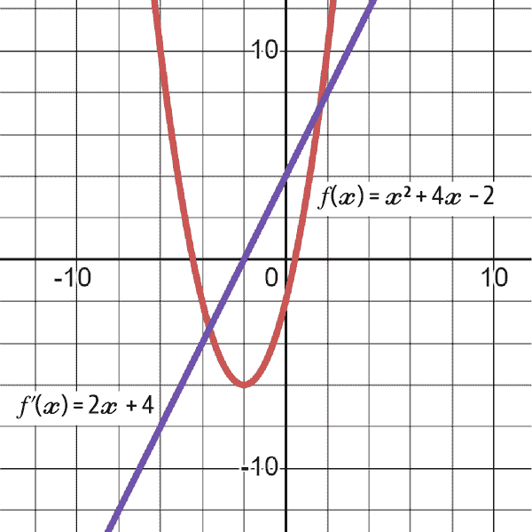

###### 图 4-15\. 原始函数*f(x)*及其导数*f'(x)*

###### 注意

注意当*f(x)*触底并开始上升时，*f'(x)*会穿过零线。

每次你想要找到导数时，可能不会使用形式化定义。有导数规则可以通过快捷方式节省大量时间。第一个规则称为*幂规则*，是找到具有指数的函数的导数的一种方法。

使用这种符号引用导数也很常见（这与*f'(x)*是一样的）：

<math alttext="StartFraction d y Over d x EndFraction"><mfrac><mrow><mi>d</mi><mi>y</mi></mrow> <mrow><mi>d</mi><mi>x</mi></mrow></mfrac></math>

寻找导数的幂规则如下：

<math alttext="StartFraction d y Over d x EndFraction left-parenthesis a x Superscript n Baseline right-parenthesis equals left-parenthesis a period n right-parenthesis x Superscript n minus 1"><mrow><mstyle displaystyle="false" scriptlevel="0"><mfrac><mrow><mi>d</mi><mi>y</mi></mrow> <mrow><mi>d</mi><mi>x</mi></mrow></mfrac></mstyle> <mrow><mo>(</mo> <mi>a</mi> <msup><mi>x</mi> <mi>n</mi></msup> <mo>)</mo></mrow> <mo>=</mo> <mrow><mo>(</mo> <mi>a</mi> <mo lspace="0%" rspace="0%">.</mo> <mi>n</mi> <mo>)</mo></mrow> <msup><mi>x</mi> <mrow><mi>n</mi><mo>-</mo><mn>1</mn></mrow></msup></mrow></math>

基本上，这意味着导数是通过将常数乘以指数然后从指数中减去 1 来找到的。这里有一个例子：

<math alttext="f left-parenthesis x right-parenthesis equals x Superscript 4"><mrow><mi>f</mi> <mrow><mo>(</mo> <mi>x</mi> <mo>)</mo></mrow> <mo>=</mo> <msup><mi>x</mi> <mn>4</mn></msup></mrow></math>

<math alttext="f prime left-parenthesis x right-parenthesis equals left-parenthesis 1 times 4 right-parenthesis x Superscript left-parenthesis 4 minus 1 right-parenthesis Baseline equals 4 x cubed"><mrow><msup><mi>f</mi> <mo>'</mo></msup> <mrow><mo>(</mo> <mi>x</mi> <mo>)</mo></mrow> <mo>=</mo> <mrow><mo>(</mo> <mn>1</mn> <mo>×</mo> <mn>4</mn> <mo>)</mo></mrow> <msup><mi>x</mi> <mrow><mo>(</mo><mn>4</mn><mo>-</mo><mn>1</mn><mo>)</mo></mrow></msup> <mo>=</mo> <mn>4</mn> <msup><mi>x</mi> <mn>3</mn></msup></mrow></math>

请记住，如果变量没有附加常数，这意味着该常数等于 1。这里有一个具有相同原则的更复杂的例子：

<math alttext="f left-parenthesis x right-parenthesis equals 2 x squared plus 3 x Superscript 7 Baseline minus 2 x cubed"><mrow><mi>f</mi> <mrow><mo>(</mo> <mi>x</mi> <mo>)</mo></mrow> <mo>=</mo> <mn>2</mn> <msup><mi>x</mi> <mn>2</mn></msup> <mo>+</mo> <mn>3</mn> <msup><mi>x</mi> <mn>7</mn></msup> <mo>-</mo> <mn>2</mn> <msup><mi>x</mi> <mn>3</mn></msup></mrow></math>

<math alttext="f prime left-parenthesis x right-parenthesis equals 4 x plus 21 x Superscript 6 Baseline minus 6 x squared"><mrow><msup><mi>f</mi> <mo>'</mo></msup> <mrow><mo>(</mo> <mi>x</mi> <mo>)</mo></mrow> <mo>=</mo> <mn>4</mn> <mi>x</mi> <mo>+</mo> <mn>21</mn> <msup><mi>x</mi> <mn>6</mn></msup> <mo>-</mo> <mn>6</mn> <msup><mi>x</mi> <mn>2</mn></msup></mrow></math>

值得注意的是，即使常数不符合幂规则的一般形式，该规则也适用于常数。常数的导数为零。虽然知道为什么有所帮助，但首先你必须了解以下数学概念：

<math alttext="x Superscript 0 Baseline equals 1"><mrow><msup><mi>x</mi> <mn>0</mn></msup> <mo>=</mo> <mn>1</mn></mrow></math>

话虽如此，你可以想象常数总是乘以*x*的零次幂（因为这样做不会改变它们的值）。现在，如果你想要找到 17 的导数，就像这样：

<math alttext="17 equals 17 x Superscript 0 Baseline equals left-parenthesis 0 times 17 right-parenthesis x Superscript 0 minus 1 Baseline equals 0 x Superscript negative 1 Baseline equals 0"><mrow><mn>17</mn> <mo>=</mo> <mn>17</mn> <msup><mi>x</mi> <mn>0</mn></msup> <mo>=</mo> <mrow><mo>(</mo> <mn>0</mn> <mo>×</mo> <mn>17</mn> <mo>)</mo></mrow> <msup><mi>x</mi> <mrow><mn>0</mn><mo>-</mo><mn>1</mn></mrow></msup> <mo>=</mo> <mn>0</mn> <msup><mi>x</mi> <mrow><mo>-</mo><mn>1</mn></mrow></msup> <mo>=</mo> <mn>0</mn></mrow></math>

正如你所知，任何乘以零的东西返回零作为结果。这为常数导数规则提供了如下定义：

<math alttext="StartFraction d y Over d x EndFraction left-parenthesis a right-parenthesis equals 0"><mrow><mfrac><mrow><mi>d</mi><mi>y</mi></mrow> <mrow><mi>d</mi><mi>x</mi></mrow></mfrac> <mrow><mo>(</mo> <mi>a</mi> <mo>)</mo></mrow> <mo>=</mo> <mn>0</mn></mrow></math>

遇到分数或负数指数时，你要遵循相同的逻辑。

导数的*乘积规则*在两个函数相乘时非常有用。乘积规则如下：

<math alttext="StartFraction d y Over d x EndFraction left-bracket f left-parenthesis x right-parenthesis g left-parenthesis x right-parenthesis right-bracket equals f prime left-parenthesis x right-parenthesis g left-parenthesis x right-parenthesis plus f left-parenthesis x right-parenthesis g prime left-parenthesis x right-parenthesis"><mrow><mfrac><mrow><mi>d</mi><mi>y</mi></mrow> <mrow><mi>d</mi><mi>x</mi></mrow></mfrac> <mrow><mo>[</mo> <mi>f</mi> <mrow><mo>(</mo> <mi>x</mi> <mo>)</mo></mrow> <mi>g</mi> <mrow><mo>(</mo> <mi>x</mi> <mo>)</mo></mrow> <mo>]</mo></mrow> <mo>=</mo> <msup><mi>f</mi> <mo>'</mo></msup> <mrow><mo>(</mo> <mi>x</mi> <mo>)</mo></mrow> <mi>g</mi> <mrow><mo>(</mo> <mi>x</mi> <mo>)</mo></mrow> <mo>+</mo> <mi>f</mi> <mrow><mo>(</mo> <mi>x</mi> <mo>)</mo></mrow> <msup><mi>g</mi> <mo>'</mo></msup> <mrow><mo>(</mo> <mi>x</mi> <mo>)</mo></mrow></mrow></math>

让我们举个例子，并使用乘积法则找到导数：

<math alttext="h left-parenthesis x right-parenthesis equals left-parenthesis x squared plus 2 right-parenthesis left-parenthesis x cubed plus 1 right-parenthesis"><mrow><mi>h</mi> <mrow><mo>(</mo> <mi>x</mi> <mo>)</mo></mrow> <mo>=</mo> <mrow><mo>(</mo> <msup><mi>x</mi> <mn>2</mn></msup> <mo>+</mo> <mn>2</mn> <mo>)</mo></mrow> <mrow><mo>(</mo> <msup><mi>x</mi> <mn>3</mn></msup> <mo>+</mo> <mn>1</mn> <mo>)</mo></mrow></mrow></math>

方程式可以明显地分成两个项，*f(x)*和*g(x)*，如下所示：

<math alttext="f left-parenthesis x right-parenthesis equals left-parenthesis x squared plus 2 right-parenthesis"><mrow><mi>f</mi> <mrow><mo>(</mo> <mi>x</mi> <mo>)</mo></mrow> <mo>=</mo> <mrow><mo>(</mo> <msup><mi>x</mi> <mn>2</mn></msup> <mo>+</mo> <mn>2</mn> <mo>)</mo></mrow></mrow></math>

<math alttext="g left-parenthesis x right-parenthesis equals left-parenthesis x cubed plus 1 right-parenthesis"><mrow><mi>g</mi> <mrow><mo>(</mo> <mi>x</mi> <mo>)</mo></mrow> <mo>=</mo> <mrow><mo>(</mo> <msup><mi>x</mi> <mn>3</mn></msup> <mo>+</mo> <mn>1</mn> <mo>)</mo></mrow></mrow></math>

在应用乘积法则之前，我们来找出这两个术语的导数。请注意，一旦理解了幂规则，找到*f(x)*和*g(x)*的导数就很容易：

<math alttext="f prime left-parenthesis x right-parenthesis equals 2 x"><mrow><msup><mi>f</mi> <mo>'</mo></msup> <mrow><mo>(</mo> <mi>x</mi> <mo>)</mo></mrow> <mo>=</mo> <mn>2</mn> <mi>x</mi></mrow></math>

<math alttext="g prime left-parenthesis x right-parenthesis equals 3 x squared"><mrow><msup><mi>g</mi> <mo>'</mo></msup> <mrow><mo>(</mo> <mi>x</mi> <mo>)</mo></mrow> <mo>=</mo> <mn>3</mn> <msup><mi>x</mi> <mn>2</mn></msup></mrow></math>

在应用乘积规则时，你应该得到以下结果：

<math alttext="h prime left-parenthesis x right-parenthesis equals left-parenthesis x squared plus 2 right-parenthesis left-parenthesis 3 x squared right-parenthesis plus left-parenthesis 2 x right-parenthesis left-parenthesis x cubed plus 1 right-parenthesis"><mrow><msup><mi>h</mi> <mo>'</mo></msup> <mrow><mo>(</mo> <mi>x</mi> <mo>)</mo></mrow> <mo>=</mo> <mrow><mo>(</mo> <msup><mi>x</mi> <mn>2</mn></msup> <mo>+</mo> <mn>2</mn> <mo>)</mo></mrow> <mrow><mo>(</mo> <mn>3</mn> <msup><mi>x</mi> <mn>2</mn></msup> <mo>)</mo></mrow> <mo>+</mo> <mrow><mo>(</mo> <mn>2</mn> <mi>x</mi> <mo>)</mo></mrow> <mrow><mo>(</mo> <msup><mi>x</mi> <mn>3</mn></msup> <mo>+</mo> <mn>1</mn> <mo>)</mo></mrow></mrow></math>

<math alttext="h prime left-parenthesis x right-parenthesis equals 3 x Superscript 4 Baseline plus 6 x squared plus 2 x Superscript 4 Baseline plus 2 x"><mrow><msup><mi>h</mi> <mo>'</mo></msup> <mrow><mo>(</mo> <mi>x</mi> <mo>)</mo></mrow> <mo>=</mo> <mn>3</mn> <msup><mi>x</mi> <mn>4</mn></msup> <mo>+</mo> <mn>6</mn> <msup><mi>x</mi> <mn>2</mn></msup> <mo>+</mo> <mn>2</mn> <msup><mi>x</mi> <mn>4</mn></msup> <mo>+</mo> <mn>2</mn> <mi>x</mi></mrow></math>

<math alttext="h prime left-parenthesis x right-parenthesis equals 5 x Superscript 4 Baseline plus 6 x squared plus 2 x"><mrow><msup><mi>h</mi> <mo>'</mo></msup> <mrow><mo>(</mo> <mi>x</mi> <mo>)</mo></mrow> <mo>=</mo> <mn>5</mn> <msup><mi>x</mi> <mn>4</mn></msup> <mo>+</mo> <mn>6</mn> <msup><mi>x</mi> <mn>2</mn></msup> <mo>+</mo> <mn>2</mn> <mi>x</mi></mrow></math>

图 4-16 显示了*h(x)*和*h'(x)*的图形。

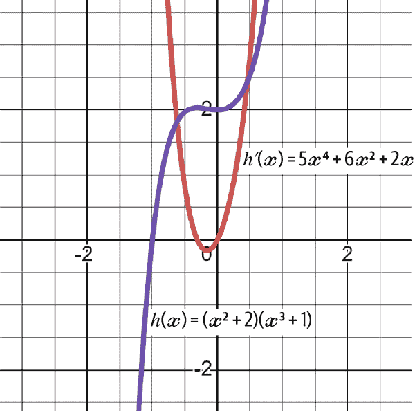

###### 图 4-16\. 原始*h(x)*及其导数*h'(x)*

现在让我们将注意力转向*商规则*，它处理两个函数的除法。形式定义如下：

<math alttext="StartFraction d y Over d x EndFraction left-bracket StartFraction f left-parenthesis x right-parenthesis Over g left-parenthesis x right-parenthesis EndFraction right-bracket equals StartFraction f prime left-parenthesis x right-parenthesis g left-parenthesis x right-parenthesis minus f left-parenthesis x right-parenthesis g prime left-parenthesis x right-parenthesis Over left-bracket g left-parenthesis x right-parenthesis right-bracket squared EndFraction"><mrow><mfrac><mrow><mi>d</mi><mi>y</mi></mrow> <mrow><mi>d</mi><mi>x</mi></mrow></mfrac> <mrow><mo>[</mo> <mstyle displaystyle="false" scriptlevel="0"><mfrac><mrow><mi>f</mi><mo>(</mo><mi>x</mi><mo>)</mo></mrow> <mrow><mi>g</mi><mo>(</mo><mi>x</mi><mo>)</mo></mrow></mfrac></mstyle> <mo>]</mo></mrow> <mo>=</mo> <mfrac><mrow><msup><mi>f</mi> <mo>'</mo></msup> <mrow><mo>(</mo><mi>x</mi><mo>)</mo></mrow><mi>g</mi><mrow><mo>(</mo><mi>x</mi><mo>)</mo></mrow><mo>-</mo><mi>f</mi><mrow><mo>(</mo><mi>x</mi><mo>)</mo></mrow><msup><mi>g</mi> <mo>'</mo></msup> <mrow><mo>(</mo><mi>x</mi><mo>)</mo></mrow></mrow> <msup><mrow><mo>[</mo><mi>g</mi><mrow><mo>(</mo><mi>x</mi><mo>)</mo></mrow><mo>]</mo></mrow> <mn>2</mn></msup></mfrac></mrow></math>

让我们将其应用到以下函数中：

<math alttext="f left-parenthesis x right-parenthesis equals StartFraction x squared minus x plus 1 Over x squared plus 1 EndFraction"><mrow><mi>f</mi> <mrow><mo>(</mo> <mi>x</mi> <mo>)</mo></mrow> <mo>=</mo> <mstyle displaystyle="false" scriptlevel="0"><mfrac><mrow><msup><mi>x</mi> <mn>2</mn></msup> <mo>-</mo><mi>x</mi><mo>+</mo><mn>1</mn></mrow> <mrow><msup><mi>x</mi> <mn>2</mn></msup> <mo>+</mo><mn>1</mn></mrow></mfrac></mstyle></mrow></math>

通常，最好先找到*f(x)*和*g(x)*的导数，在这种情况下，它们明显是分开的，*f(x)*是分子，*g(x)*是分母。在应用商规则时，你应该得到以下结果：

<math alttext="f prime left-parenthesis x right-parenthesis equals StartFraction left-parenthesis 2 x minus 1 right-parenthesis left-parenthesis x squared plus 1 right-parenthesis minus left-parenthesis x squared minus x plus 1 right-parenthesis left-parenthesis 2 x right-parenthesis Over left-parenthesis x squared plus 1 right-parenthesis squared EndFraction"><mrow><msup><mi>f</mi> <mo>'</mo></msup> <mrow><mo>(</mo> <mi>x</mi> <mo>)</mo></mrow> <mo>=</mo> <mstyle displaystyle="false" scriptlevel="0"><mfrac><mrow><mrow><mo>(</mo><mn>2</mn><mi>x</mi><mo>-</mo><mn>1</mn><mo>)</mo></mrow><mrow><mo>(</mo><msup><mi>x</mi> <mn>2</mn></msup> <mo>+</mo><mn>1</mn><mo>)</mo></mrow><mo>-</mo><mrow><mo>(</mo><msup><mi>x</mi> <mn>2</mn></msup> <mo>-</mo><mi>x</mi><mo>+</mo><mn>1</mn><mo>)</mo></mrow><mrow><mo>(</mo><mn>2</mn><mi>x</mi><mo>)</mo></mrow></mrow> <msup><mrow><mo>(</mo><msup><mi>x</mi> <mn>2</mn></msup> <mo>+</mo><mn>1</mn><mo>)</mo></mrow> <mn>2</mn></msup></mfrac></mstyle></mrow></math>

<math alttext="f prime left-parenthesis x right-parenthesis equals StartFraction 2 x cubed plus 2 x minus x squared minus 1 minus 2 x cubed plus 2 x squared minus 2 x Over left-parenthesis x squared plus 1 right-parenthesis squared EndFraction"><mrow><msup><mi>f</mi> <mo>'</mo></msup> <mrow><mo>(</mo> <mi>x</mi> <mo>)</mo></mrow> <mo>=</mo> <mstyle displaystyle="false" scriptlevel="0"><mfrac><mrow><mn>2</mn><msup><mi>x</mi> <mn>3</mn></msup> <mo>+</mo><mn>2</mn><mi>x</mi><mo>-</mo><msup><mi>x</mi> <mn>2</mn></msup> <mo>-</mo><mn>1</mn><mo>-</mo><mn>2</mn><msup><mi>x</mi> <mn>3</mn></msup> <mo>+</mo><mn>2</mn><msup><mi>x</mi> <mn>2</mn></msup> <mo>-</mo><mn>2</mn><mi>x</mi></mrow> <msup><mrow><mo>(</mo><msup><mi>x</mi> <mn>2</mn></msup> <mo>+</mo><mn>1</mn><mo>)</mo></mrow> <mn>2</mn></msup></mfrac></mstyle></mrow></math>

<math alttext="f prime left-parenthesis x right-parenthesis equals StartFraction x squared minus 1 Over left-parenthesis x squared plus 1 right-parenthesis squared EndFraction"><mrow><msup><mi>f</mi> <mo>'</mo></msup> <mrow><mo>(</mo> <mi>x</mi> <mo>)</mo></mrow> <mo>=</mo> <mstyle displaystyle="false" scriptlevel="0"><mfrac><mrow><msup><mi>x</mi> <mn>2</mn></msup> <mo>-</mo><mn>1</mn></mrow> <msup><mrow><mo>(</mo><msup><mi>x</mi> <mn>2</mn></msup> <mo>+</mo><mn>1</mn><mo>)</mo></mrow> <mn>2</mn></msup></mfrac></mstyle></mrow></math>

*指数导数*处理应用于常数的幂规则。看看下面的方程式。你会如何找到它的导数？

<math alttext="f left-parenthesis x right-parenthesis equals a Superscript x"><mrow><mi>f</mi> <mrow><mo>(</mo> <mi>x</mi> <mo>)</mo></mrow> <mo>=</mo> <msup><mi>a</mi> <mi>x</mi></msup></mrow></math>

不同于通常的变量-基数-常量-指数，它是常量-基数-变量-指数。在尝试计算导数时，这种处理方式有所不同。形式化定义如下：

<math alttext="StartFraction d y Over d x EndFraction a Superscript x Baseline equals a Superscript x Baseline left-parenthesis ln a right-parenthesis"><mrow><mfrac><mrow><mi>d</mi><mi>y</mi></mrow> <mrow><mi>d</mi><mi>x</mi></mrow></mfrac> <msup><mi>a</mi> <mi>x</mi></msup> <mo>=</mo> <msup><mi>a</mi> <mi>x</mi></msup> <mrow><mo>(</mo> <mo form="prefix">ln</mo> <mi>a</mi> <mo>)</mo></mrow></mrow></math>

下面的示例显示了如何做到这一点：

<math alttext="StartFraction d y Over d x EndFraction 4 Superscript x Baseline equals 4 Superscript x Baseline left-parenthesis ln 4 right-parenthesis"><mrow><mfrac><mrow><mi>d</mi><mi>y</mi></mrow> <mrow><mi>d</mi><mi>x</mi></mrow></mfrac> <msup><mn>4</mn> <mi>x</mi></msup> <mo>=</mo> <msup><mn>4</mn> <mi>x</mi></msup> <mrow><mo>(</mo> <mo form="prefix">ln</mo> <mn>4</mn> <mo>)</mo></mrow></mrow></math>

之前提到的欧拉数有一个特殊的导数。当涉及到找到*e*的导数时，答案很有趣：

<math alttext="StartFraction d y Over d x EndFraction e Superscript x Baseline equals e Superscript x Baseline left-parenthesis ln e right-parenthesis equals e Superscript x"><mrow><mfrac><mrow><mi>d</mi><mi>y</mi></mrow> <mrow><mi>d</mi><mi>x</mi></mrow></mfrac> <msup><mi>e</mi> <mi>x</mi></msup> <mo>=</mo> <msup><mi>e</mi> <mi>x</mi></msup> <mrow><mo>(</mo> <mo form="prefix">ln</mo> <mi>e</mi> <mo>)</mo></mrow> <mo>=</mo> <msup><mi>e</mi> <mi>x</mi></msup></mrow></math>

这是因为自然对数函数和指数函数是彼此的反函数，所以术语*ln e*等于 1。因此，指数函数*e*的导数就是它本身。

与此同时，让我们讨论一下对数导数。到现在为止，你应该知道指数和对数是什么。两种对数的一般定义如下：

<math alttext="StartFraction d y Over d x EndFraction log Subscript a Baseline x equals StartFraction 1 Over x ln a EndFraction"><mrow><mfrac><mrow><mi>d</mi><mi>y</mi></mrow> <mrow><mi>d</mi><mi>x</mi></mrow></mfrac> <msub><mo form="prefix">log</mo> <mi>a</mi></msub> <mi>x</mi> <mo>=</mo> <mfrac><mn>1</mn> <mrow><mi>x</mi><mo form="prefix">ln</mo><mi>a</mi></mrow></mfrac></mrow></math>

<math alttext="StartFraction d y Over d x EndFraction ln x equals log Subscript e Baseline x equals StartFraction 1 Over x ln e EndFraction equals StartFraction 1 Over x EndFraction"><mrow><mfrac><mrow><mi>d</mi><mi>y</mi></mrow> <mrow><mi>d</mi><mi>x</mi></mrow></mfrac> <mo form="prefix">ln</mo> <mi>x</mi> <mo>=</mo> <msub><mo form="prefix">log</mo> <mi>e</mi></msub> <mi>x</mi> <mo>=</mo> <mstyle displaystyle="false" scriptlevel="0"><mfrac><mn>1</mn> <mrow><mi>x</mi><mo form="prefix">ln</mo><mi>e</mi></mrow></mfrac></mstyle> <mo>=</mo> <mfrac><mn>1</mn> <mi>x</mi></mfrac></mrow></math>

注意在自然对数的二阶导函数中，再次遇到*ln e*项，因此使得简化变得非常容易，因为它等于 1。

以以下示例为例：

<math alttext="f left-parenthesis x right-parenthesis equals 7 l o g 2 left-parenthesis x right-parenthesis"><mrow><mi>f</mi> <mrow><mo>(</mo> <mi>x</mi> <mo>)</mo></mrow> <mo>=</mo> <mn>7</mn> <mi>l</mi> <mi>o</mi> <msub><mi>g</mi> <mn>2</mn></msub> <mrow><mo>(</mo> <mi>x</mi> <mo>)</mo></mrow></mrow></math>

使用正式定义，这个对数函数的导数如下：

<math alttext="f prime left-parenthesis x right-parenthesis equals 7 left-parenthesis StartFraction 1 Over x ln 2 EndFraction right-parenthesis equals StartFraction 7 Over x ln 2 EndFraction"><mrow><msup><mi>f</mi> <mo>'</mo></msup> <mrow><mo>(</mo> <mi>x</mi> <mo>)</mo></mrow> <mo>=</mo> <mn>7</mn> <mrow><mo>(</mo> <mfrac><mn>1</mn> <mrow><mi>x</mi><mo form="prefix">ln</mo><mn>2</mn></mrow></mfrac> <mo>)</mo></mrow> <mo>=</mo> <mstyle displaystyle="false" scriptlevel="0"><mfrac><mn>7</mn> <mrow><mi>x</mi><mo form="prefix">ln</mo><mn>2</mn></mrow></mfrac></mstyle></mrow></math>

###### 注意

对数*log*的基数是 10，但自然对数*ln*的基数是*e*（~2.7182）。

自然对数和对数函数实际上是通过简单的乘法线性相关的。如果你知道常数*a*的对数，你可以通过将*a*的对数乘以 2.4303 来找到它的自然对数*ln*。

导数中的一个主要概念是*链式法则*。让我们回到幂规则，它处理变量的指数。记住以下公式找到导数：

<math alttext="StartFraction d y Over d x EndFraction left-parenthesis a x Superscript n Baseline right-parenthesis equals left-parenthesis a period n right-parenthesis x Superscript n minus 1"><mrow><mstyle displaystyle="false" scriptlevel="0"><mfrac><mrow><mi>d</mi><mi>y</mi></mrow> <mrow><mi>d</mi><mi>x</mi></mrow></mfrac></mstyle> <mrow><mo>(</mo> <mi>a</mi> <msup><mi>x</mi> <mi>n</mi></msup> <mo>)</mo></mrow> <mo>=</mo> <mrow><mo>(</mo> <mi>a</mi> <mo lspace="0%" rspace="0%">.</mo> <mi>n</mi> <mo>)</mo></mrow> <msup><mi>x</mi> <mrow><mi>n</mi><mo>-</mo><mn>1</mn></mrow></msup></mrow></math>

这是一个简化的版本，因为只有*x*，但现实是你必须乘以幂指数下面的项的导数。到目前为止，你只看到*x*作为幂指数下的变量。*x*的导数是 1，这就是为什么它被简化和隐藏的原因。然而，对于更复杂的函数，比如这个：

<math alttext="f left-parenthesis x right-parenthesis equals left-parenthesis 4 x plus 1 right-parenthesis squared"><mrow><mi>f</mi> <mrow><mo>(</mo> <mi>x</mi> <mo>)</mo></mrow> <mo>=</mo> <msup><mrow><mo>(</mo><mn>4</mn><mi>x</mi><mo>+</mo><mn>1</mn><mo>)</mo></mrow> <mn>2</mn></msup></mrow></math>

通过以下两个步骤找到函数的导数：

1.  找到外部函数的导数而不触及内部函数。

1.  找到内部函数的导数并将其乘以函数的其余部分。

因此解决方案如下（知道*4x* + 1 的导数只是 4）：

<math alttext="f prime left-parenthesis x right-parenthesis equals 2 left-parenthesis 4 x plus 1 right-parenthesis .4"><mrow><msup><mi>f</mi> <mo>'</mo></msup> <mrow><mo>(</mo> <mi>x</mi> <mo>)</mo></mrow> <mo>=</mo> <mn>2</mn> <mrow><mo>(</mo> <mn>4</mn> <mi>x</mi> <mo>+</mo> <mn>1</mn> <mo>)</mo></mrow> <mo lspace="0%" rspace="0%">.</mo> <mn>4</mn></mrow></math>

<math alttext="f prime left-parenthesis x right-parenthesis equals 8 left-parenthesis 4 x plus 1 right-parenthesis"><mrow><msup><mi>f</mi> <mo>'</mo></msup> <mrow><mo>(</mo> <mi>x</mi> <mo>)</mo></mrow> <mo>=</mo> <mn>8</mn> <mrow><mo>(</mo> <mn>4</mn> <mi>x</mi> <mo>+</mo> <mn>1</mn> <mo>)</mo></mrow></mrow></math>

<math alttext="f prime left-parenthesis x right-parenthesis equals 32 x plus 8"><mrow><msup><mi>f</mi> <mo>'</mo></msup> <mrow><mo>(</mo> <mi>x</mi> <mo>)</mo></mrow> <mo>=</mo> <mn>32</mn> <mi>x</mi> <mo>+</mo> <mn>8</mn></mrow></math>

指数函数也是如此。接下来以以下示例为例：

<math alttext="f left-parenthesis x right-parenthesis equals e Superscript x"><mrow><mi>f</mi> <mrow><mo>(</mo> <mi>x</mi> <mo>)</mo></mrow> <mo>=</mo> <msup><mi>e</mi> <mi>x</mi></msup></mrow></math>

<math alttext="f prime left-parenthesis x right-parenthesis equals e Superscript x Baseline left-parenthesis 1 right-parenthesis equals e Superscript x"><mrow><msup><mi>f</mi> <mo>'</mo></msup> <mrow><mo>(</mo> <mi>x</mi> <mo>)</mo></mrow> <mo>=</mo> <msup><mi>e</mi> <mi>x</mi></msup> <mrow><mo>(</mo> <mn>1</mn> <mo>)</mo></mrow> <mo>=</mo> <msup><mi>e</mi> <mi>x</mi></msup></mrow></math>

链式法则实际上可以被认为是一条总规则，因为它适用于任何地方，即使是在乘积法则和商法则中也是如此。

在求导数中有更多的概念需要掌握，但是由于本书不打算成为完整的微积分大师课程，你至少应该了解导数的含义，如何找到它，它代表什么以及在机器学习和深度学习中如何使用它。

###### 注意

本节的关键点如下：

+   导数衡量给定一个或多个输入变化的函数的变化。

+   幂规则用于找到函数的幂的导数。

+   乘积法则用于找到两个相乘的函数的导数。

+   商法则用于找到两个相除的函数的导数。

+   链式法则是不同 iating 中使用的主要规则（这意味着找到导数的过程）。由于简单性，它经常被忽视。

+   导数在机器学习中发挥着关键作用，比如启用优化技术，帮助模型训练，并增强模型的可解释性。

## 积分与微积分基本定理

*积分* 是一种操作，表示在给定区间内函数曲线下的面积。它是导数的反操作，这也是为什么它被称为*反导数*。

找到积分的过程称为*积分*。积分可以用来找到曲线下的面积，在金融世界中广泛应用于风险管理、投资组合管理、概率方法，甚至期权定价等领域。

理解积分的最简单方法是考虑计算函数曲线下面积。可以通过手动计算*x*轴上的不同变化来完成这一过程，但添加这些片段以找到面积是一个繁琐的过程。这就是积分发挥作用的地方。

请记住，积分是导数的反操作。这很重要，因为它意味着两者之间存在直接关系。积分的基本定义如下：

<math alttext="integral f left-parenthesis x right-parenthesis d x equals upper F left-parenthesis upper X right-parenthesis plus upper C"><mrow><mo>∫</mo> <mi>f</mi> <mo>(</mo> <mi>x</mi> <mo>)</mo> <mi>d</mi> <mi>x</mi> <mo>=</mo> <mi>F</mi> <mo>(</mo> <mi>X</mi> <mo>)</mo> <mo>+</mo> <mi>C</mi></mrow></math>

<math alttext="The integral symbol represents the integration process"><mrow><mtext>The</mtext> <mo>∫</mo> <mtext>symbol</mtext> <mtext>represents</mtext> <mtext>the</mtext> <mtext>integration</mtext> <mtext>process</mtext></mrow></math>

<math alttext="f left-parenthesis x right-parenthesis is the derivative of the general function upper F left-parenthesis x right-parenthesis"><mrow><mi>f</mi> <mo>(</mo> <mi>x</mi> <mo>)</mo> <mtext>is</mtext> <mtext>the</mtext> <mtext>derivative</mtext> <mtext>of</mtext> <mtext>the</mtext> <mtext>general</mtext> <mtext>function</mtext> <mi>F</mi> <mo>(</mo> <mi>x</mi> <mo>)</mo></mrow></math>

<math alttext="upper C represents the lost constant in the differentiation process"><mrow><mi>C</mi> <mtext>represents</mtext> <mtext>the</mtext> <mtext>lost</mtext> <mtext>constant</mtext> <mtext>in</mtext> <mtext>the</mtext> <mtext>differentiation</mtext> <mtext>process</mtext></mrow></math>

<math alttext="d x represents slicing along x as it approaches zero"><mrow><mi>d</mi> <mi>x</mi> <mtext>represents</mtext> <mtext>slicing</mtext> <mtext>along</mtext> <mi>x</mi> <mtext>as</mtext> <mtext>it</mtext> <mtext>approaches</mtext> <mtext>zero</mtext></mrow></math>

前面的方程意味着*f(x)*的积分是一般函数*F(x)*加上一个常数*C*，这个常数在初始微分过程中丢失了。以下是一个例子，更好地解释放入常数的必要性。

考虑以下函数：

<math alttext="f left-parenthesis x right-parenthesis equals x squared plus 5"><mrow><mi>f</mi> <mrow><mo>(</mo> <mi>x</mi> <mo>)</mo></mrow> <mo>=</mo> <msup><mi>x</mi> <mn>2</mn></msup> <mo>+</mo> <mn>5</mn></mrow></math>

计算其导数，得到以下结果：

<math alttext="f prime left-parenthesis x right-parenthesis equals 2 x"><mrow><msup><mi>f</mi> <mo>'</mo></msup> <mrow><mo>(</mo> <mi>x</mi> <mo>)</mo></mrow> <mo>=</mo> <mn>2</mn> <mi>x</mi></mrow></math>

现在，如果你想要积分它，以便回到原始函数（在这种情况下用大写字母*F(x)*代表而不是*f(x)*）？

<math alttext="integral 2 x d x"><mrow><mo>∫</mo> <mn>2</mn> <mi>x</mi> <mi>d</mi> <mi>x</mi></mrow></math>

通常，看到差异化过程（这意味着取导数），你会返回 2 作为指数，这给出以下答案：

<math alttext="integral 2 x d x equals x squared"><mrow><mo>∫</mo> <mn>2</mn> <mi>x</mi> <mi>d</mi> <mi>x</mi> <mo>=</mo> <msup><mi>x</mi> <mn>2</mn></msup></mrow></math>

这看起来不像原始函数。它缺少常数 5\. 但你无法知道这一点，即使你知道有一个常数，你也无法知道它是多少：1？2？677？这就是为什么在积分过程中添加常数*C*来表示丢失的常数的原因。因此，积分问题的答案如下：

<math alttext="integral 2 x d x equals x squared plus upper C"><mrow><mo>∫</mo> <mn>2</mn> <mi>x</mi> <mi>d</mi> <mi>x</mi> <mo>=</mo> <msup><mi>x</mi> <mn>2</mn></msup> <mo>+</mo> <mi>C</mi></mrow></math>

###### 注意

到目前为止，讨论一直局限于*不定积分*，其中积分符号是*裸露的*（这意味着它没有边界）。我们将在定义完成积分所需的规则之后立即看到这意味着什么。

对于幂函数（就像前面的函数一样），积分的一般规则如下：

<math alttext="integral x Superscript a Baseline d x equals StartFraction x Superscript a plus 1 Baseline Over a plus 1 EndFraction plus upper C"><mrow><mo>∫</mo> <msup><mi>x</mi> <mi>a</mi></msup> <mi>d</mi> <mi>x</mi> <mo>=</mo> <mstyle displaystyle="false" scriptlevel="0"><mfrac><msup><mi>x</mi> <mrow><mi>a</mi><mo>+</mo><mn>1</mn></mrow></msup> <mrow><mi>a</mi><mo>+</mo><mn>1</mn></mrow></mfrac></mstyle> <mo>+</mo> <mi>C</mi></mrow></math>

这比看上去要简单得多。你只是在反转你之前看到的幂规则。考虑以下例子：

<math alttext="integral 2 x Superscript 6 d x"><mrow><mo>∫</mo> <mn>2</mn> <msup><mi>x</mi> <mn>6</mn></msup> <mi>d</mi> <mi>x</mi></mrow></math>

<math alttext="integral 2 x Superscript 6 Baseline d x equals StartFraction 2 x Superscript 7 Baseline Over 7 EndFraction plus upper C"><mrow><mo>∫</mo> <mn>2</mn> <msup><mi>x</mi> <mn>6</mn></msup> <mi>d</mi> <mi>x</mi> <mo>=</mo> <mstyle displaystyle="false" scriptlevel="0"><mfrac><mrow><mn>2</mn><msup><mi>x</mi> <mn>7</mn></msup></mrow> <mn>7</mn></mfrac></mstyle> <mo>+</mo> <mi>C</mi></mrow></math>

<math alttext="integral 2 x Superscript 6 Baseline d x equals two-sevenths x Superscript 7 Baseline plus upper C"><mrow><mo>∫</mo> <mn>2</mn> <msup><mi>x</mi> <mn>6</mn></msup> <mi>d</mi> <mi>x</mi> <mo>=</mo> <mstyle displaystyle="false" scriptlevel="0"><mfrac><mn>2</mn> <mn>7</mn></mfrac></mstyle> <msup><mi>x</mi> <mn>7</mn></msup> <mo>+</mo> <mi>C</mi></mrow></math>

要验证你的答案，你可以找到结果的导数（使用幂规则）：

<math alttext="upper F left-parenthesis x right-parenthesis equals two-sevenths x Superscript 7 Baseline plus upper C"><mrow><mi>F</mi> <mrow><mo>(</mo> <mi>x</mi> <mo>)</mo></mrow> <mo>=</mo> <mstyle displaystyle="false" scriptlevel="0"><mfrac><mn>2</mn> <mn>7</mn></mfrac></mstyle> <msup><mi>x</mi> <mn>7</mn></msup> <mo>+</mo> <mi>C</mi></mrow></math>

<math alttext="f prime left-parenthesis x right-parenthesis equals left-parenthesis 7 right-parenthesis two-sevenths x Superscript 7 minus 1 Baseline plus 0"><mrow><msup><mi>f</mi> <mo>'</mo></msup> <mrow><mo>(</mo> <mi>x</mi> <mo>)</mo></mrow> <mo>=</mo> <mrow><mo>(</mo> <mn>7</mn> <mo>)</mo></mrow> <mstyle displaystyle="false" scriptlevel="0"><mfrac><mn>2</mn> <mn>7</mn></mfrac></mstyle> <msup><mi>x</mi> <mrow><mn>7</mn><mo>-</mo><mn>1</mn></mrow></msup> <mo>+</mo> <mn>0</mn></mrow></math>

<math alttext="f prime left-parenthesis x right-parenthesis equals 2 x Superscript 6"><mrow><msup><mi>f</mi> <mo>'</mo></msup> <mrow><mo>(</mo> <mi>x</mi> <mo>)</mo></mrow> <mo>=</mo> <mn>2</mn> <msup><mi>x</mi> <mn>6</mn></msup></mrow></math>

让我们看另一个例子。考虑以下积分问题：

<math alttext="integral 2 d x"><mrow><mo>∫</mo> <mn>2</mn> <mi>d</mi> <mi>x</mi></mrow></math>

根据规则，您应该找到以下结果：

<math alttext="integral 2 d x equals 2 x plus upper C"><mrow><mo>∫</mo> <mn>2</mn> <mi>d</mi> <mi>x</mi> <mo>=</mo> <mn>2</mn> <mi>x</mi> <mo>+</mo> <mi>C</mi></mrow></math>

让我们继续讨论*定积分*，这些是在函数曲线下方用指定的上下限表示的积分。因此，*不定*积分在曲线下方找到的区域的任何地方，而定积分则在由点*a*和点*b*给定的区间内被限制。 不定积分的一般定义如下：

<math alttext="integral Subscript a Superscript b Baseline f left-parenthesis x right-parenthesis d x equals upper F left-parenthesis upper B right-parenthesis minus upper F left-parenthesis upper A right-parenthesis"><mrow><msubsup><mo>∫</mo> <mi>a</mi> <mi>b</mi></msubsup> <mi>f</mi> <mrow><mo>(</mo> <mi>x</mi> <mo>)</mo></mrow> <mi>d</mi> <mi>x</mi> <mo>=</mo> <mi>F</mi> <mrow><mo>(</mo> <mi>B</mi> <mo>)</mo></mrow> <mo>-</mo> <mi>F</mi> <mrow><mo>(</mo> <mi>A</mi> <mo>)</mo></mrow></mrow></math>

这是最简单的方法。您将解决积分，然后插入两个数字并从彼此减去两个函数。考虑以下积分评估（积分求解通常称为*评估*积分）：

<math alttext="integral Subscript 0 Superscript 6 Baseline 3 x squared minus 10 x plus 4 d x"><mrow><msubsup><mo>∫</mo> <mn>0</mn> <mn>6</mn></msubsup> <mn>3</mn> <msup><mi>x</mi> <mn>2</mn></msup> <mo>-</mo> <mn>10</mn> <mi>x</mi> <mo>+</mo> <mn>4</mn> <mi>d</mi> <mi>x</mi></mrow></math>

第一步是理解所询问的内容。从积分的定义来看，在*x*轴上[0, 2]之间的区域似乎是使用给定函数计算的：

<math alttext="upper F left-parenthesis x right-parenthesis equals left-parenthesis left-bracket x cubed minus 5 x squared plus 4 x plus upper C right-bracket right-parenthesis vertical-bar Subscript 0 Baseline Superscript 6 Baseline"><mrow><mi>F</mi> <mrow><mo>(</mo> <mi>x</mi> <mo>)</mo></mrow> <mo>=</mo> <mrow><mo>(</mo> <mrow><mo>[</mo> <msup><mi>x</mi> <mn>3</mn></msup> <mo>-</mo> <mn>5</mn> <msup><mi>x</mi> <mn>2</mn></msup> <mo>+</mo> <mn>4</mn> <mi>x</mi> <mo>+</mo> <mi>C</mi> <mo>]</mo></mrow> <mo>)</mo></mrow> <msubsup><mrow><mo>|</mo></mrow> <mn>0</mn> <mn>6</mn></msubsup></mrow></math>

要在给定点评估积分，只需按以下方式插入值：

<math alttext="upper F left-parenthesis x right-parenthesis equals left-parenthesis left-bracket 6 cubed minus 5 left-parenthesis 6 right-parenthesis squared plus 4 left-parenthesis 6 right-parenthesis plus upper C right-bracket right-parenthesis minus left-parenthesis left-bracket 0 cubed minus 5 left-parenthesis 0 right-parenthesis squared plus 4 left-parenthesis 0 right-parenthesis plus upper C right-bracket right-parenthesis"><mrow><mi>F</mi> <mrow><mo>(</mo> <mi>x</mi> <mo>)</mo></mrow> <mo>=</mo> <mrow><mo>(</mo> <mrow><mo>[</mo> <msup><mn>6</mn> <mn>3</mn></msup> <mo>-</mo> <mn>5</mn> <msup><mrow><mo>(</mo><mn>6</mn><mo>)</mo></mrow> <mn>2</mn></msup> <mo>+</mo> <mn>4</mn> <mrow><mo>(</mo> <mn>6</mn> <mo>)</mo></mrow> <mo>+</mo> <mi>C</mi> <mo>]</mo></mrow> <mo>)</mo></mrow> <mo>-</mo> <mrow><mo>(</mo> <mrow><mo>[</mo> <msup><mn>0</mn> <mn>3</mn></msup> <mo>-</mo> <mn>5</mn> <msup><mrow><mo>(</mo><mn>0</mn><mo>)</mo></mrow> <mn>2</mn></msup> <mo>+</mo> <mn>4</mn> <mrow><mo>(</mo> <mn>0</mn> <mo>)</mo></mrow> <mo>+</mo> <mi>C</mi> <mo>]</mo></mrow> <mo>)</mo></mrow></mrow></math>

<math alttext="upper F left-parenthesis x right-parenthesis equals left-parenthesis left-bracket 216 minus 180 plus 24 plus upper C right-bracket right-parenthesis minus left-parenthesis left-bracket 0 minus 0 plus 0 plus upper C right-bracket right-parenthesis"><mrow><mi>F</mi> <mo>(</mo> <mi>x</mi> <mo>)</mo> <mo>=</mo> <mo>(</mo> <mo>[</mo> <mn>216</mn> <mo>-</mo> <mn>180</mn> <mo>+</mo> <mn>24</mn> <mo>+</mo> <mi>C</mi> <mo>]</mo> <mo>)</mo> <mo>-</mo> <mo>(</mo> <mo>[</mo> <mn>0</mn> <mo>-</mo> <mn>0</mn> <mo>+</mo> <mn>0</mn> <mo>+</mo> <mi>C</mi> <mo>]</mo> <mo>)</mo></mrow></math>

<math alttext="upper F left-parenthesis x right-parenthesis equals left-parenthesis left-bracket 60 plus upper C right-bracket right-parenthesis minus left-parenthesis left-bracket 0 plus upper C right-bracket right-parenthesis"><mrow><mi>F</mi> <mo>(</mo> <mi>x</mi> <mo>)</mo> <mo>=</mo> <mo>(</mo> <mo>[</mo> <mn>60</mn> <mo>+</mo> <mi>C</mi> <mo>]</mo> <mo>)</mo> <mo>-</mo> <mo>(</mo> <mo>[</mo> <mn>0</mn> <mo>+</mo> <mi>C</mi> <mo>]</mo> <mo>)</mo></mrow></math>

<math alttext="upper F left-parenthesis x right-parenthesis equals left-parenthesis 60 minus 0 right-parenthesis"><mrow><mi>F</mi> <mo>(</mo> <mi>x</mi> <mo>)</mo> <mo>=</mo> <mo>(</mo> <mn>60</mn> <mo>-</mo> <mn>0</mn> <mo>)</mo></mrow></math>

<math alttext="upper F left-parenthesis x right-parenthesis equals 60"><mrow><mi>F</mi> <mo>(</mo> <mi>x</mi> <mo>)</mo> <mo>=</mo> <mn>60</mn></mrow></math>

###### 注意

常数*C*将始终取消掉不定积分，因此在这种问题中可以忽略它。

因此，图形*f(x)*下方和*x*轴上方的区域，以及在*x*轴上[0, 6]之间的区域，都等于 60 平方单位。以下显示了积分的一些经验法则（毕竟，本章旨在更新您的知识或使您对一些关键数学概念有基本理解）：

+   要找到常数的积分：

    <math alttext="integral a d x equals a x plus upper C"><mrow><mo>∫</mo> <mi>a</mi> <mi>d</mi> <mi>x</mi> <mo>=</mo> <mi>a</mi> <mi>x</mi> <mo>+</mo> <mi>C</mi></mrow></math>

+   要找到变量的积分：

    <math alttext="integral x d x equals one-half x squared plus upper C"><mrow><mo>∫</mo> <mi>x</mi> <mi>d</mi> <mi>x</mi> <mo>=</mo> <mfrac><mn>1</mn> <mn>2</mn></mfrac> <msup><mi>x</mi> <mn>2</mn></msup> <mo>+</mo> <mi>C</mi></mrow></math>

+   要找到倒数的积分：

    <math alttext="integral StartFraction 1 Over x EndFraction d x equals ln StartAbsoluteValue x EndAbsoluteValue plus upper C"><mrow><mo>∫</mo> <mfrac><mn>1</mn> <mi>x</mi></mfrac> <mi>d</mi> <mi>x</mi> <mo>=</mo> <mo form="prefix">ln</mo> <mrow><mo>|</mo> <mi>x</mi> <mo>|</mo></mrow> <mo>+</mo> <mi>C</mi></mrow></math>

+   要找到指数的积分：

    <math alttext="integral a Superscript x Baseline d x equals StartFraction a Superscript x Baseline Over ln left-parenthesis a right-parenthesis EndFraction plus upper C"><mrow><mo>∫</mo> <msup><mi>a</mi> <mi>x</mi></msup> <mi>d</mi> <mi>x</mi> <mo>=</mo> <mfrac><msup><mi>a</mi> <mi>x</mi></msup> <mrow><mo form="prefix">ln</mo><mo>(</mo><mi>a</mi><mo>)</mo></mrow></mfrac> <mo>+</mo> <mi>C</mi></mrow></math>

    <math alttext="integral e Superscript x Baseline d x equals e Superscript x Baseline plus upper C"><mrow><mo>∫</mo> <msup><mi>e</mi> <mi>x</mi></msup> <mi>d</mi> <mi>x</mi> <mo>=</mo> <msup><mi>e</mi> <mi>x</mi></msup> <mo>+</mo> <mi>C</mi></mrow></math>

*微积分基本定理*将导数与积分联系起来。这意味着它用积分来定义导数，反之亦然。 微积分的基本定理实际上由两部分组成：

第一部分

微积分基本定理的第一部分指出，如果您有一个连续的函数*f(x)*，那么原始函数*F(x)*，定义为*f(x)*的反导数，从固定的起点*a*到*x*是一个在*a*到*x*处处可微的函数，并且其导数简单地是在*x*处评估的*f(x)*。

第二部分

微积分基本定理的第二部分指出，如果您有一个在某个区间[*a, b*]上连续的函数*f(x)*，并定义一个新函数*F(x)*为*f(x)*从*a*到*x*的积分，则该函数*f(x)*在相同区间[*a, b*]上的定积分可以计算为*F(b) – F(a)*。

定理在许多领域都很有用，包括物理学和工程学，但优化和其他数学模型也受益于它。在不同学习算法中使用积分的一些例子可以总结如下：

密度估计

积分在密度估计中使用，这是许多机器学习算法的一部分，用于计算概率密度函数。

强化学习

积分在强化学习中用于计算奖励函数的期望值。强化学习在第十章中有详细介绍。

###### 注意

本节的要点如下：

+   积分也称为反导数，是导数的反向操作。

+   不定积分在曲线下的整体面积，而定积分在由点*a*和点*b*界定的区间内。

+   微积分基本定理是导数和积分之间的桥梁。

+   在机器学习中，积分用于建模不确定性、进行预测和估计期望值。

## 优化

几种机器学习和深度学习算法依赖于优化技术来减少误差函数。

*优化*是在所有可能的解决方案中找到最佳解决方案的过程。优化就是找到函数的最高点和最低点。图 4-17 展示了以下公式的图形：

<math alttext="f left-parenthesis x right-parenthesis equals x Superscript 4 Baseline minus 2 x squared plus x"><mrow><mi>f</mi> <mrow><mo>(</mo> <mi>x</mi> <mo>)</mo></mrow> <mo>=</mo> <msup><mi>x</mi> <mn>4</mn></msup> <mo>-</mo> <mn>2</mn> <msup><mi>x</mi> <mn>2</mn></msup> <mo>+</mo> <mi>x</mi></mrow></math>

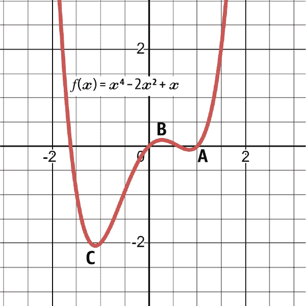

###### 图 4-17\. 函数图：<math alttext="f left-parenthesis x right-parenthesis equals x Superscript 4 Baseline minus 2 x squared plus x"><mrow><mi>f</mi> <mrow><mo>(</mo> <mi>x</mi> <mo>)</mo></mrow> <mo>=</mo> <msup><mi>x</mi> <mn>4</mn></msup> <mo>-</mo> <mn>2</mn> <msup><mi>x</mi> <mn>2</mn></msup> <mo>+</mo> <mi>x</mi></mrow></math>

*局部最小值*是指在*x*轴右侧的数值递减，直到达到一个开始递增的点。该点不一定是函数中的最低点，因此称为*局部*。在图 4-17 中，函数在点 A 处有局部最小值。

*局部最大值*是指在*x*轴右侧的数值递增，直到达到一个开始递减的点。该点不一定是函数中的最高点。在图 4-17 中，函数在点 B 处有局部最大值。

*全局最小值*是指在*x*轴右侧的数值递减，直到达到一个开始递增的点。该点必须是函数中的最低点，因此称为*全局*。在图 4-17 中，函数在点 C 处有全局最小值。

*全局最大值*是指在*x*轴右侧的数值递增，直到达到一个开始递减的点。该点必须是函数中的最高点。在图 4-17 中，没有全局最大值，因为函数将无限地继续而没有顶点。您可以清楚地看到函数如何向上加速。

当处理机器和深度学习模型时，目标是找到能使所谓的*损失函数*（给出预测误差的函数）最小化的模型参数（或输入）。如果损失函数是凸的，优化技术应当找到能使损失函数最小化的参数，趋向于全局最小值。

如果损失函数是非凸的，则不能保证收敛，优化可能只会导致接近局部最小值，这是目标的一部分，但这会忽略全局最小值，这才是最终的目标。

那么这些最小值和最大值是如何找到的呢？让我们一步一步来看：

1.  第一步是进行第一阶导数测试（即计算函数的导数）。然后，将函数设为零并解出*x*将给出所谓的临界点。*临界点*是函数变换方向的点（数值停止向一个方向移动并开始向另一个方向移动）。因此，这些点是极大值和极小值。

1.  第二步是进行二阶导数测试（即计算导数的导数）。然后，将函数设为零并解出*x*将给出所谓的拐点。*拐点*显示了函数凹向上和凹向下的地方。

换句话说，临界点是函数变换方向的地方，拐点是函数改变凹凸性的地方。图 4-18 显示了凹函数和凸函数之间的区别。

<math alttext="Concave up function equals x squared"><mrow><mtext>Concave</mtext> <mtext>up</mtext> <mtext>function</mtext> <mo>=</mo> <msup><mi>x</mi> <mn>2</mn></msup></mrow></math>

<math alttext="Concave down function equals minus x squared"><mrow><mtext>Concave</mtext> <mtext>down</mtext> <mtext>function</mtext> <mo>=</mo> <mo>-</mo> <msup><mi>x</mi> <mn>2</mn></msup></mrow></math>

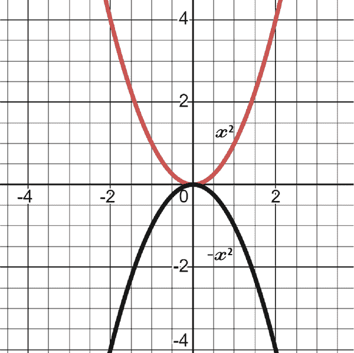

###### 图 4-18\. 一个凹向上的函数和一个凹向下的函数

找到极值的步骤如下：

1.  找到第一阶导数并将其设为零。

1.  解第一阶导数以找到*x*。这些值称为临界点，它们代表函数变换方向的点。

1.  将值插入公式中，这些值要么在临界点下要么在临界点上。如果第一阶导数的结果为正，则意味着在该点周围增长，如果为负，则意味着在该点周围减少。

1.  找到第二阶导数并将其设为零。

1.  解第二阶导数以找到*x*。这些值称为拐点，代表了凹凸性从向上变为向下或反之的点。

1.  将值插入公式中，这些值要么在拐点下要么在拐点上。如果第二阶导数的结果为正，则意味着该点有一个最小值，如果为负，则意味着该点有一个最大值。

重要的是要理解，第一阶导数测试与临界点相关，而第二阶导数测试与拐点相关。以下示例找到函数的极值：

<math alttext="f left-parenthesis x right-parenthesis equals x squared plus x plus 4"><mrow><mi>f</mi> <mrow><mo>(</mo> <mi>x</mi> <mo>)</mo></mrow> <mo>=</mo> <msup><mi>x</mi> <mn>2</mn></msup> <mo>+</mo> <mi>x</mi> <mo>+</mo> <mn>4</mn></mrow></math>

第一步是取第一阶导数，将其设为零并解出*x*：

<math alttext="f prime left-parenthesis x right-parenthesis equals 2 x plus 1"><mrow><msup><mi>f</mi> <mo>'</mo></msup> <mrow><mo>(</mo> <mi>x</mi> <mo>)</mo></mrow> <mo>=</mo> <mn>2</mn> <mi>x</mi> <mo>+</mo> <mn>1</mn></mrow></math>

<math alttext="2 x plus 1 equals 0"><mrow><mn>2</mn> <mi>x</mi> <mo>+</mo> <mn>1</mn> <mo>=</mo> <mn>0</mn></mrow></math>

<math alttext="x equals negative one-half"><mrow><mi>x</mi> <mo>=</mo> <mo>-</mo> <mfrac><mn>1</mn> <mn>2</mn></mfrac></mrow></math>

结果表明在该数值处存在临界点。现在找出二阶导数：

<math alttext="f double-prime left-parenthesis x right-parenthesis equals 2"><mrow><msup><mi>f</mi> <mrow><mo>'</mo><mo>'</mo></mrow></msup> <mrow><mo>(</mo> <mi>x</mi> <mo>)</mo></mrow> <mo>=</mo> <mn>2</mn></mrow></math>

接下来，必须将临界点代入二阶导数公式中：

<math alttext="f double-prime left-parenthesis negative one-half right-parenthesis equals 2"><mrow><msup><mi>f</mi> <mrow><mo>'</mo><mo>'</mo></mrow></msup> <mrow><mo>(</mo> <mo>-</mo> <mfrac><mn>1</mn> <mn>2</mn></mfrac> <mo>)</mo></mrow> <mo>=</mo> <mn>2</mn></mrow></math>

在临界点，二阶导数为正。这意味着在该点有一个局部最小值。

在接下来的章节中，您将看到更复杂的优化技术，如梯度下降和随机梯度下降，这些在机器学习算法中非常常见。请注意，您不必完全理解优化和解决未知变量的细节，因为算法将自行处理。

###### 注意

本节的关键要点如下：

+   优化是找到函数的极值点的过程。

+   临界点是函数改变方向的点。

+   拐点表明函数凹向上和凹向下的位置。

+   损失函数是衡量预测机器学习中预测误差的函数。

# 总结

第二章、第三章和第四章介绍了主要的数值概念，帮助您开始理解基本的机器学习和深度学习模型。我已尽最大努力尝试尽可能简化技术细节。然而，我建议您至少阅读这三章两次，这样您学到的所有东西就会变得非常熟悉。我还鼓励您在其他材料中深入研究这些概念。

当然，深度学习需要更深入的数学知识，但我相信通过本章的概念，您可以开始涉足算法的创建。毕竟，它们是从包和库中预构建的，本章的目的是帮助您了解您正在使用的内容。使用过时的工具从头构建模型的可能性不大。

到现在为止，您应该已经对数据科学和数学要求有了一定的理解，可以舒适地开始。在您能够开始构建第一个机器学习模型之前，我们还有两个主题需要涵盖：技术分析和 Python 数据科学。

^(1) 矩阵也可以包含符号和表达式，但出于简化的目的，让我们坚持使用数字。
