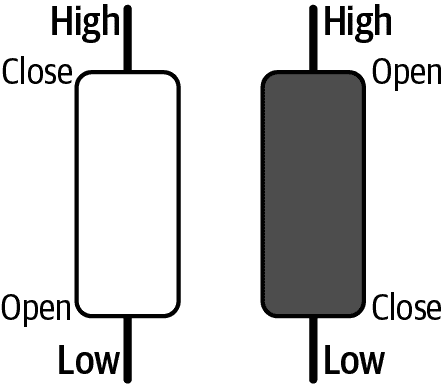
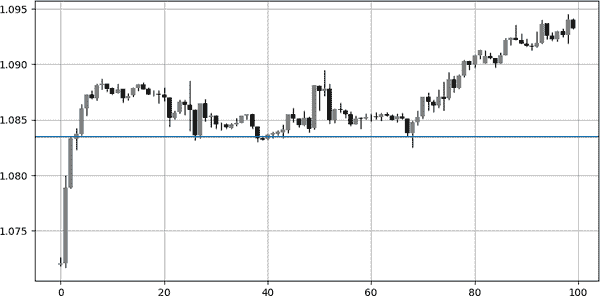
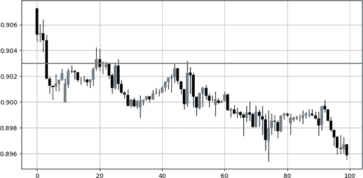
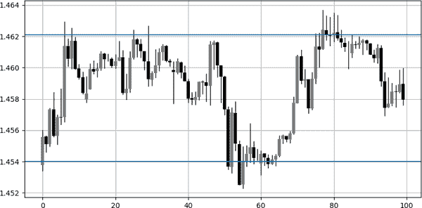
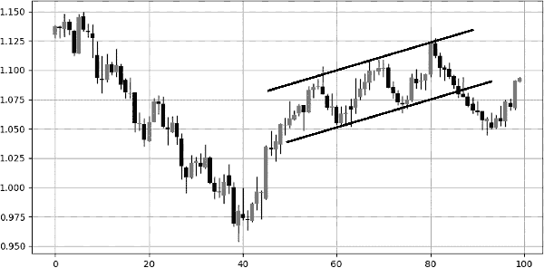
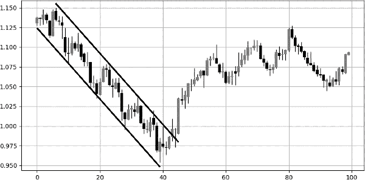
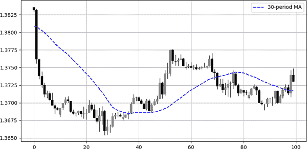
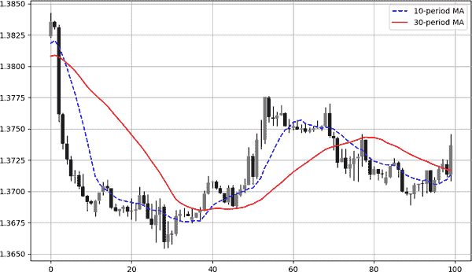
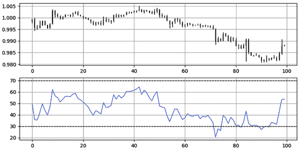
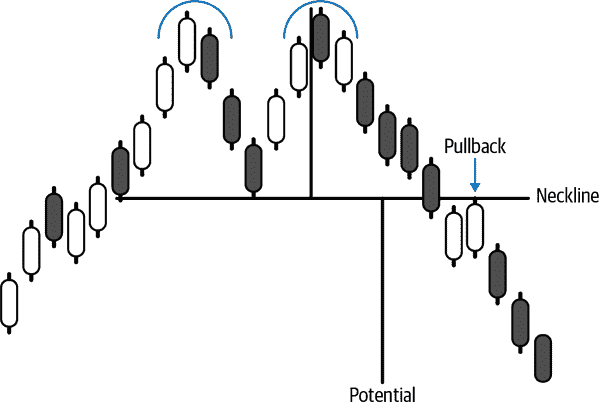

# 第五章：介绍技术分析

技术分析提供许多类型的输入（解释变量），您可以在深度学习模型中使用它们。本章介绍了这一广泛领域，以便您在接下来的章节中掌握创建基于技术的学习模型所需的必要知识。

*金融技术分析*依赖于对价格行动历史的视觉解释，以确定市场可能的整体方向。它依赖于过去是未来最好的预测者的理念。技术分析这一广泛领域内有几种技术，特别是以下几种：

图表分析

这是将主观的视觉解释技巧应用于图表上。通常使用绘制支撑和阻力线以及回调等方法来寻找能够确定下一步走势的反转水平。

指标分析

这是使用数学公式创建客观指标的地方，这些指标可以是趋势跟随或反向的。已知的指标包括*移动平均线*和*相对强度指数*（RSI），这两者在本章节中将有更详细的讨论。

模式识别

这是您监控某些重复配置并对其采取行动的地方。*模式*通常是偶尔出现的事件，呈现某种理论或实证结果。在金融领域，这更为复杂，但某些模式已被证明随着时间的推移增加了价值，部分原因可能是由于称为*自我实现预言*的现象（一种过程，初始预期导致其确认）。

让我们快速回顾一下技术分析的历史，这样您就可以更好地了解预期。技术分析依赖于三个原则：

历史会重演

在趋势和区间中，您可能会看到集群。此外，某些配置大多数情况下可能会产生类似的结果。

市场包含一切

假设当前价格已包含所有基本、技术和量化信息。

市场波动呈波浪形

由于不同的时间框架和需求，交易者以不同的频率买入和卖出，从而形成趋势和波浪，而不是直线。

不幸的是，技术分析在零售交易社区中被过度炒作和误用，这使得它在专业行业中的声誉略显不佳。每种分析方法都有其优势和劣势，有成功的基本分析、技术分析和量化投资者，但也有三个领域的失败投资者。

*基本分析*依赖经济和金融数据对特定证券或货币进行长期投资视角的判断，而*量化分析*则更为灵活，并且更常用于短期数据。它使用数学和统计概念进行预测或风险管理。

在其他假设中，技术分析表明市场并不有效，但这意味着什么呢？*市场效率*表明信息已经融入当前价格，而价格和价值是相同的。当你购买资产时，你希望它在基本分析术语中是*被低估*，或在技术分析术语中是*超卖*，这就是为什么你相信价格会上涨以达到价值。因此，你假设价值大于价格。

市场效率驳斥了价格不等于价值的任何主张，因此建议任何*阿尔法交易*都不应产生超过平均水平的回报（*阿尔法交易*是进行超过基准（通常是指数）的投机操作）。

市场效率假设是技术分析师的最大敌人之一，因为它的原则之一在弱式有效市场中，你无法通过技术分析获得超额收益。因此，技术分析在一开始就遭到质疑，随后基本分析也受到了打击。

公平地假设，在未来的某个时候，由于参与者数量和信息获取的便利性，市场将不得不变得有效。然而，正如政治和异常事件所示，市场往往远非有效。

###### 注意

一个导致市场恐慌和非理性的政治事件例子是 2022 年爆发的俄乌战争。一个异常经济事件的例子是央行意外加息。

# 图表分析

在你理解什么是图表分析之前，你需要知道打开图表——更具体地说，是蜡烛图。

假设某只股票的市场开盘价为$100。在一个小时内发生了一些交易活动。我们还记录了在这段时间内的最高价（$102）和最低价（$98）。同时，记录了每小时的收盘价（$101）。请记住，这四个数据分别称为*开盘价*、*最高价*、*最低价*和*收盘价*（OHLC），它们代表了创建蜡烛图所需的四个基本价格。

*蜡烛图*非常简单直观。它们是沿时间线排列的盒状元素，包含 OHLC 数据。图 5-1 展示了关于蜡烛图如何运作的一切。

###### 图 5-1\. 左侧为看涨蜡烛图；右侧为看跌蜡烛图

*看涨*蜡烛图的收盘价高于其开盘价，而*看跌*蜡烛图的收盘价低于其开盘价。

蜡烛图是分析金融时间序列的常见方法之一。它比简单的折线图包含更多信息，并且比条形图具有更高的视觉可解释性。

###### 注意

*折线图*是按时间顺序连接收盘价而创建的。这是绘制资产图表的最简单方式。它包含了三种图表类型中最少的信息，因为它只显示收盘价。

*图表分析*是通过主观绘图找到支撑和阻力线的任务。*线*，无论是水平还是斜线，是预测市场反应以下级别的核心：

支撑位

市场应该反弹的水平，因为暗示其周围的需求应该高于供给

阻力位

市场应该回落的水平，因为暗示其周围的供给应该高于需求

资产在时间轴上的方向可以分为三种：*上升趋势*，即价格创造更高的高点；*下降趋势*，即价格创造更低的低点；以及*横盘*（或波动），即价格在长时间内围绕同一水平波动。

图 5-2 显示欧元兑美元的水平支撑位接近 1.0840。通常，交易者在价格接近支撑时开始考虑买入。这是因为预期会出现向上的反应，因为力量平衡应更向需求（正面）方面转移，交易者接受支付更高价格，因为他们预计将来价格会更高（请记住前面讨论过的价格对价值的论点）。这里的含义是大多数交易者看到一个低于其价值的价格。

###### 图 5-2\. 欧元兑美元的蜡烛图显示支撑位于 1.0840

图 5-3 显示美元兑瑞士法郎的阻力水平接近 0.9030。通常，交易者在接近阻力时开始考虑做空市场。这是因为预期会出现向下的反应，因为力量平衡应更向供给方面转移。这里的含义是大多数交易者看到一个高于其价值的价格。

###### 图 5-3\. 美元兑瑞士法郎的蜡烛图显示阻力位于 0.9030

横盘（波动）市场更有把握水平支撑和阻力线会发挥作用。这是因为已经暗示了供需之间的一般平衡。因此，如果有过剩供应，市场会迅速调整，因为需求应该足以稳定价格。

图 5-4 展示了一个范围市场被困在两个水平水平之间；这是美元兑加元的情况（一个美元价格对加拿大元）。在范围市场中，每当市场接近阻力线时，你应该更有信心地认为将会出现下跌，而在接近支撑时，你应该更有信心地认为将会出现反弹，而不像在上升市场中那样，当市场接近阻力线时，你应该更有信心地认为将会出现下跌，而在接近支撑时，你应该更有信心地认为将会出现反弹。

图表分析同样适用于趋势市场。这体现在上升和下降通道的形式上。它们与水平水平具有相同的倾向，但有所偏见（稍后讨论）。

###### 图 5-4\. 美元兑加元蜡烛图显示支撑位在 1.4540，阻力位在 1.4620

图 5-5 展示了一个*上升通道*，在这里，支撑和阻力点随着时间的推移上升，反映出稳定增长的需求压力带来的看涨压力。

看到这种情况的交易者会预期市场接近上升通道的下部时会有看涨反应，而市场接近通道上部时则会有看跌反应。

这没有坚实的科学依据，因为没有规定市场必须平行移动，但可能是自我实现预言的原因，使得这种通道被认为具有预测性质。

###### 图 5-5\. 欧元兑美元蜡烛图显示一个上升通道

图 5-6 展示了一个下降通道，其中支撑和阻力点随时间下降，反映出稳定增长的供应压力带来的看跌压力。一般而言，看跌通道往往更为激进，因为恐惧主导了贪婪，卖方比买方更加恐慌。

###### 图 5-6\. 欧元兑美元蜡烛图显示一个下降通道

当处理上升和下降通道时，我提到了一种偏见。我将这种偏见称为*隐形之手*。原因如下：

“趋势是你的朋友。”这句话是股票投资者、投资顾问和金融分析师马丁·兹威格创造的，意味着在上升通道中，你需要更多地关注在市场回归支撑区域时的买入。这是因为你希望看涨压力的隐形之手增加你获胜交易的概率。类似地，在下降通道的情况下，你应该更多地关注市场达到上限时的卖空。兹威格格的格言的完整版本如下：“趋势是你的朋友，直到趋势结束时才会弯曲。”这意味着在任何时刻，市场都可能改变其制度，任何与趋势的友谊最终都会终止。最终，图表分析是主观的，更多地依赖于交易者或分析师的经验。

值得一提的是，除了通过视觉估计来绘制支撑和阻力水平外，还有许多其他找到支撑和阻力水平的方法：

斐波那契回撤

在这里，你可以使用斐波那契比率来确定反应水平。斐波那契回撤通常在市场向上或向下的趋势中计算，这样你就可以知道市场如果触及这些水平将会反转。这种方法的问题在于它非常主观，并且像任何其他技术一样并不完美。优点在于它提供了许多有趣的水平。

枢轴点

使用枢轴点，你使用简单的数学公式找到水平。基于昨天的交易活动，你使用公式预测今天未来的支撑和阻力水平。然后，每当市场接近这些水平，你都尝试通过朝相反方向交易来淡化移动。

移动平均线

这些将在下一节讨论。它们具有动态特性并跟随价格。你也可以用它们来检测当前的市场趋势。

###### 提示

找到支撑和阻力水平的最佳方法是尽可能结合多种技术，这样你就可以有一定的方法融合，进而增加对初始想法的信心。交易是一个数字游戏，尽可能地增加胜算，应该最终提高你的系统表现。

# 指标分析

*指标分析* 是第二常用的技术分析工具。通常与绘图一同使用以确认你的初始想法。你可以把*指标* 看作助手。它们可以分为两类：

趋势跟随指标

用于检测和交易预期继续的趋势市场。因此，它们与移动的持续性相关。

逆向指标

用于淡化移动¹，最好在横盘市场中使用²，因为它们通常标志着初始移动的结束。因此，它们与预期的移动逆转相关（因此与移动的反持续性相关）。

下一节将介绍技术分析的两大支柱：移动平均线（趋势跟随）和相对强弱指数（逆向）。

###### 注意

指标很重要，因为在后续章节中你会将它们作为不同学习算法的输入。

## 移动平均线

最著名的趋势跟随叠加指标是*移动平均线*。它的简单性使它无疑成为最受欢迎的工具之一。移动平均线有助于确认并跟随趋势。你还可以用它们来找到支撑和阻力水平、止损点和目标，以及理解潜在的趋势。

有许多类型的移动平均线，但最常见的是简单移动平均线，其中你取收盘价的滚动平均，如下公式所示：

<math alttext="Moving average Subscript i Baseline equals StartFraction upper P r i c e Subscript i Baseline plus upper P r i c e Subscript i minus 1 Baseline plus period period period plus upper P r i c e Subscript i minus n Baseline Over n EndFraction"><mrow><mtext>Moving</mtext> <msub><mtext>average</mtext> <mi>i</mi></msub> <mo>=</mo> <mfrac><mrow><mi>P</mi><mi>r</mi><mi>i</mi><mi>c</mi><msub><mi>e</mi> <mi>i</mi></msub> <mo>+</mo><mi>P</mi><mi>r</mi><mi>i</mi><mi>c</mi><msub><mi>e</mi> <mrow><mi>i</mi><mo>-</mo><mn>1</mn></mrow></msub> <mo>+</mo><mo lspace="0%" rspace="0%">.</mo><mo lspace="0%" rspace="0%">.</mo><mo lspace="0%" rspace="0%">.</mo><mo>+</mo><mi>P</mi><mi>r</mi><mi>i</mi><mi>c</mi><msub><mi>e</mi> <mrow><mi>i</mi><mo>-</mo><mi>n</mi></mrow></msub></mrow> <mi>n</mi></mfrac></mrow></math>

图 5-7 显示了应用于 USDCAD 的 30 小时简单移动平均线。*30 小时*表示我计算最近 30 个小时的移动平均线，针对每小时的条形图。

###### 图 5-7\. 在 USDCAD 上显示的 K 线图，带有 30 小时简单移动平均线

移动平均线的经验法则包括以下内容：

+   每当市场高于其移动平均线时，就会有牛市动量正在进行，你最好寻找买入机会。

+   每当市场低于其移动平均线时，就会有熊市动量正在进行，你最好寻找卖空机会。

+   每当市场穿过其移动平均线时，可以说动量已经改变，市场可能正在进入新的状态（趋势）。

你也可以结合移动平均线以获取信号。例如，每当短期移动平均线穿过长期移动平均线时，就会出现一个牛市交叉，市场可能会继续上涨。这也被称为*金叉*。

相反，每当短期移动平均线穿越长期移动平均线下方时，就会出现一个熊市交叉，市场可能会继续下跌。这也被称为*死亡交叉*。

图 5-8 显示了 USDCAD 与 10 小时（接近市场价格）和 30 小时移动平均线（远离市场价格）。

###### 图 5-8\. 在 USDCAD 上显示的 K 线图，带有 30 小时和 10 小时简单移动平均线

## 相对强弱指数

现在让我们看看反向指标。由 J. Welles Wilder Jr.首次引入³，*相对强弱指数*（RSI）是最流行和多功能的有界指标之一。它主要用作反向指标，极端值表明可以利用反应。使用以下步骤计算默认的 14 周期 RSI：

1.  计算前一次收盘价格的变化。

1.  将正净变化与负净变化分开。

1.  计算正净变化和负净变化的平滑移动平均线。

1.  将平滑的正变化除以平滑的绝对负变化。将此计算称为*相对强度*（RS）。

1.  对每个时间步骤应用这个归一化公式来得到 RSI：

<math alttext="upper R upper S upper I Subscript i Baseline equals 100 minus StartFraction 100 Over 1 plus upper R upper S Subscript i Baseline EndFraction"><mrow><mi>R</mi> <mi>S</mi> <msub><mi>I</mi> <mi>i</mi></msub> <mo>=</mo> <mn>100</mn> <mo>-</mo> <mfrac><mn>100</mn> <mrow><mn>1</mn><mo>+</mo><mi>R</mi><msub><mi>S</mi> <mi>i</mi></msub></mrow></mfrac></mrow></math>

###### 注意

*平滑*移动平均线是 RSI 的创始者开发的一种特殊类型的移动平均线。它比简单移动平均线更平稳、更稳定。

通常，默认情况下，RSI 使用 14 个周期的回溯期，尽管每位交易者可能对此有自己的偏好。以下是如何使用这个指标：

+   每当相对强弱指标（RSI）显示 30 或更低的读数时，市场被认为是超卖状态，可能会出现向上的修正。

+   每当 RSI 显示 70 或更高的读数时，市场被认为是超买的，可能会出现向下的修正。

+   每当 RSI 超过或跌破 50 水平时，可能会出现新的趋势，但这通常是一个薄弱的假设，更多是理论性的而不是实际性的。

图 5-9 显示了 EURUSD 相对于其 14 周期 RSI 在第二面板中。指标应用于确认多头或空头偏见，并且在时机和分析当前市场状态方面非常有帮助。

###### 图 5-9。EURUSD 小时线的值在顶部面板，14 周期 RSI 在底部面板

总结一下，指标可以用多种方式计算。两种最常用的是移动平均线和 RSI。

# 图案识别

*模式*是一种特定预测随后移动的重复配置。模式可以分为以下类型：

经典价格模式

这些被称为技术性反转价格模式，它们非常主观，并且由于在不考虑主观条件的情况下很难进行回测而被认为是不可靠的。然而，它们仍然被许多交易者和分析师使用。

时间模式

基于时间和价格的综合因素，这些模式不太为人所知，但如果正确使用，它们可以具有强大的预测能力。

蜡烛图形态⁴

这是使用 OHLC 数据来预测市场未来反应的地方。蜡烛图是可视化图表的最佳方式之一，因为它们包含许多可能标志反转或确认移动的模式。

经典价格模式指的是理论配置，如双顶和矩形。它们通常是反转或继续模式：

连续价格模式

这些是确认总体持续移动的配置。例如，矩形和三角形。

反转价格模式

这些是消退总体持续移动的配置。例如，头肩顶和双底。

传统图表分析师熟悉双顶和双底，它们标志着趋势反转并提供了这种反转的潜力。尽管它们很简单，但它们是主观的，有些并不像其他一些那样明显。

这阻碍了知道它们是否增加了价值。图 5-10 显示了双顶的插图，在验证图案后通常会给出一个空头偏见，这通常是打破连接两个顶部之间的低点线。这条线称为*颈线*。

###### 图 5-10。双顶插图

注意双顶中的这三个重要元素：

颈线

这是连接两个高峰之间的最低低点和图案的开始/结束的线。它用于确定回撤水平。

回撤

打破颈线后，市场应该朝着颈线做出绝望的尝试，但由于卖方利用该水平重新进场继续做空，未能进一步上涨。因此，回撤水平是在验证双顶后的理论上最佳卖出点。

潜力

这是双顶的目标。它被测量为模式顶部和向下投影的颈线之间的中点，从相同的颈线点开始。

双顶或双底可以有任何大小，但最好是对大多数市场参与者可见，以增加其影响力。从心理学角度来看，该模式的解释是在第二个顶部或底部时，市场未能将价格推高超过第一个峰值，因此显示出弱点，卖方可能会利用这一点。

这里有其他更为客观的模式；也就是说，它们具有明确的检测和启动规则。这些都基于明确的客观条件，不受分析师个人判断的影响。这有助于它们的回测和评估。

# 总结

技术分析提供了大量工具来数学、图形或甚至心理学（通过模式）分析市场。本章的学习目标是理解技术分析及其技术指标，以便在其作为解释变量时熟悉它们（正如在第十一章中所述）。

¹ *“对走势的衰退”* 是一种交易技术，其中您与正在进行的趋势相反地交易，希望能够把握其结束的时机。

² 横向市场通常处于均衡状态，没有特定的趋势描述它们。它们倾向于在接近彼此的顶部和底部之间摆动。

³ 请参阅 J. Welles Wilder Jr.（趋势研究）的*《技术交易系统中的新概念》*。

⁴ 请参阅我的书籍*《掌握金融模式识别》*（O’Reilly），详细讨论蜡烛图模式。
