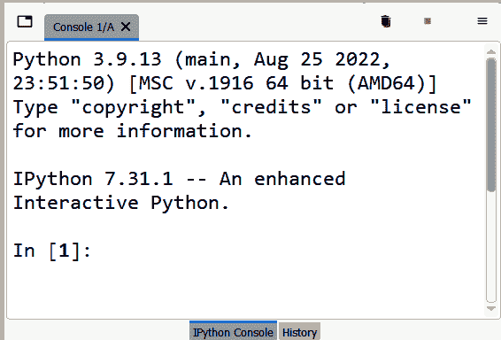
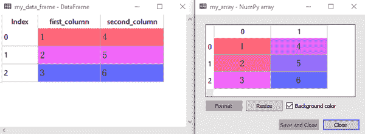
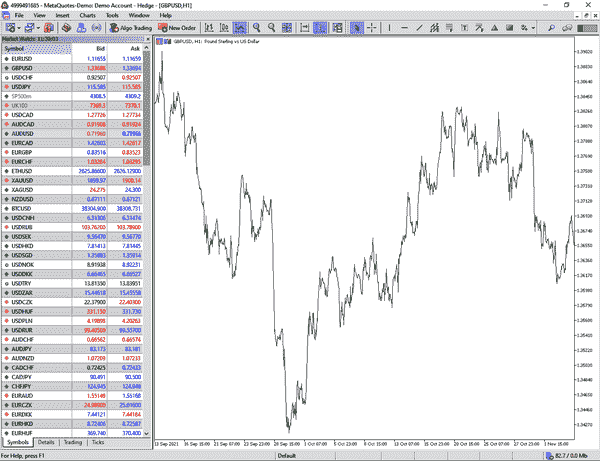

# 第六章：为数据科学介绍 Python

这是我们深入进入机器学习和深度学习领域之前的最后一章。对于有经验的 Python 开发人员来说，本章是可选的，但对于没有扎实编程背景的人来说却很重要。了解算法背后的直觉是一个很大的优势，但如果你不能正确实现这些算法，你的知识将无法发挥作用。毕竟，这些算法需要编写代码才能工作，而不能手动操作，因此你需要理解基本的语法以及如何操作和转换数据。

由于本书不旨在成为 Python 编程的 A-Z 指南，本章仅侧重于一些基础知识和一些额外的技术，这些将有助于你顺利地浏览后续章节。

# 下载 Python

*代码*被定义为一组指令，旨在由计算机执行。通常需要特定的语法，以便计算机无误地应用一组指令。有许多编程语言，它们分为两大类：

低级编程语言

这些是通常用于编写操作系统和固件的机器语言。它们非常难以阅读。这些语言对硬件有相当高的控制级别。汇编语言是低级语言的一个例子。

高级编程语言

这些是用户友好的高级语言（抽象级别高）。它们通常用于编写程序和软件。高级语言的例子包括 Python 和 Julia。

本书中使用的编程语言是 Python，这是一种流行且多才多艺的语言，在研究和专业交易社区中广泛采用。正如你从本章标题中可能已经了解到的那样，你将会对 Python 以及开始构建自己脚本所需的工具有所了解。但在此之前，你需要下载 Python。

*Python 解释器*是用于编写和执行使用 Python 语法编写的代码的软件。我使用 Spyder。有些人可能更熟悉其他解释器，如 Jupyter 和 PyCharm，但处理过程是一样的。你可以从[官方网站](https://oreil.ly/Vlh4c)下载 Spyder，或者更好地作为一个更大的包 Anaconda 的一部分下载它，Anaconda 便于安装并提供更多工具。请注意，Spyder 是开源且免费使用的。

图 6-1 显示了 Python 控制台，代码输出显示在其中。



###### 图 6-1 Spyder 的控制台

Python 文件的扩展名为*.py*，它们允许你保存代码并在以后引用它们。你还可以打开多个代码文件并在它们之间导航。

本章的大纲如下：

+   理解 Python 语言以及如何编写无错误的代码

+   了解如何使用控制流以及在时间序列分析中的重要性

+   理解库和函数及其在简化编码中的作用

+   理解不同类型的错误及其处理方法

+   理解如何使用数据操作库如*numpy*和*pandas*

+   最后，了解如何将历史财务时间序列数据导入 Python，以便使用适当的工具进行分析（这些工具我们已经讨论过，也将在接下来的章节中讨论）。

# 基本操作和语法

*语法*是定义编写可运行代码所需语句结构的一组规则。当您与计算机进行通信时，必须确保它能理解您，因此对语法有扎实的理解非常重要。

*注释*是非可执行代码，用于解释随后的可执行代码。注释用于让其他程序员理解代码。在 Python 中，注释前面带有井号（**#**）：

```py
# This is a comment. Comments are ignored by the interpreter
# Comments explain the code or give more details about its use
# Comments are written on one line; otherwise, you have to rewrite '#'
```

###### 注意

请确保理解注释是非可执行的。这意味着当您运行（执行）代码时，解释器会忽略它们，不会返回错误。

有时候，您需要为您的代码编写文档，这可能需要多行代码（在某些情况下甚至是段落）。在每一行写上井号可能会很乏味且凌乱。这就是为什么有一种方法可以编写长注释。为此，您可以使用三个单引号将您的注释写在其中，如下所示：

```py
'''
Python was created in the late 1980s by Guido van Rossum
The name "Python" was inspired by the comedy group Monty Python
'''

```

值得注意的是，三重引号称为*文档字符串*，实际上并不是注释（根据官方 Python 文档）。

让我们讨论变量和常量。*常量*是一个不变的值，而*变量*在给定事件时可以取不同的值。常量可以是数字 6，而变量可以是字母*x*，在一定条件或状态下可以取任何数字。变量使用`=`运算符进行定义：

```py
# Defining a variable
x = 10
# Writing a constant
6

```

运行（执行）前面的代码将会在变量资源管理器中存储变量`x`及其相应值。同时，代码的输出将是`6`。变量是区分大小写的。因此：

```py
# Declaring my_variable
my_variable = 1
# Declaring My_variable
My_variable = 2
# The variable my_variable is different from My_variable
```

变量声明不能以数字开头，但数字可以包含在变量声明的中间或末尾：

```py
# Returns a SyntaxError
1x = 5
# Valid declaration
x1 = 5
# Valid declaration
x1x = 5

```

变量还可以包含下划线，但不能包含其他字符：

```py
# Returns a SyntaxError
x–y = 5
# Valid declaration
x_y = 5

```

强烈建议变量使用简短而直接的名称。例如，考虑创建一个变量来保存某个移动平均线的回溯期（这是在第五章中介绍的技术指标）：

```py
# Recommended name
ma_lookback = 10
# Not recommended name
the_lookback_on_that_moving_average = 10

```

有几种不同的数据类型，具有不同的特性：

*数值数据类型*

这是最简单的数据类型，仅由数字组成。数值数据类型分为整数、浮点数和复数。*整数*是简单的整数（正数或负数），如 6 和-19。*浮点数*比整数更精确，因为它们包含逗号后的值，例如 2.7 和-8.09。*复数*包括虚数。¹

*字符串*

正如之前通过注释和文档字符串看到的那样，可以在代码旁边写入文本而不影响执行过程。*字符串*是表示字符序列的文本结构。字符串可以是函数的输入和参数，而不仅仅是注释。

*布尔值*

布尔值是用于评估给定表达式或条件的真值的二进制（真或假）数据类型。例如，可以使用布尔值来评估市场价格是否高于或低于 100 期移动平均线。

*数据集合*

这些是包含多个数据集的序列，每个数据集具有不同且独特的用途。*数组*是相同类型元素的序列（主要是数值）。在本书中经常会使用数组（使用一个名为*numpy*的 Python 库，在本章中进行讨论）。*数据框*是二维结构化数据表，也经常在本书中使用（使用一个名为*pandas*的 Python 库，在本章中也进行讨论）。*集合*是无序元素的序列。*列表*是有序元素的集合，可以是不同的数据类型。*元组*是有序的不可变元素集合，可以是不同的数据类型。用于存储固定值序列。*字典*表示键-值对的集合。

下面的代码片段显示了数值数据类型的几个示例：

```py
# Creating a variable that holds an integer
my_integer = 1
# Creating a variable that holds a float number
my_float_number = 1.2
# Using the built-in Python function type() to verify the variables
type(my_integer)
type(my_float_number)

```

输出应如下所示（请注意，创建的两个变量将出现在变量资源管理器中）：

```py
int # The output of type(my_integer)
float # The output of type(my_float_number)

```

字符串只是文本。用来解释字符串的最常用示例是短语“Hello World”：

```py
# Outputting the phrase Hello World
print('Hello World')
```

输出应如下所示：

```py
Hello World
```

字符串也可以作为函数的参数，后面你会在本章看到。

布尔值是真或假值。下面的代码片段展示了它们的使用示例：

```py
# Make a statement that the type of my_integer is integer
type(my_integer) is int
# Make a statement that the type of my_float_number is float
type(my_float_number) is float
# Make a statement that the type of my_integer is float
type(my_integer) is float
'''
Intuitively, the two first statements will return True as they are 
indeed true. The third statement is False as the variable my_integer
is an integer and not a float number
'''

```

上述代码的输出如下：

```py
True
True
False

```

让我们讨论操作符的工作原理。你已经看到了一个操作符的示例：赋值操作符`=`用于定义变量。*操作符*在变量、常量甚至数据结构之间执行特殊的数学和其他任务。有不同类型的操作符。让我们从*算术运算符*开始，如下面的代码片段所示：

```py
# Arithmetic operator - Addition
1 + 1 # The line outputs 2
# Arithmetic operator - Subtraction
1 – 1 # The line outputs 0
# Arithmetic operator - Multiplication
2 * 2 # The line outputs 4
# Arithmetic operator - Division
4 / 2 # The line outputs 2.0 as a float number
# Arithmetic operator - Exponents
2 ** 4 # The line outputs 16

```

下一个类型的运算符是*比较运算符*。这些用于比较不同的元素。它们在控制流事件中经常使用，如本章的下一节所述。以下代码片段显示了一些比较运算符：

```py
# Comparison operator - Equality
2 == 2 # The line outputs True
# Comparison operator - Non equality
2 != 3 # The line outputs True
# Comparison operator - Greater than
2 > 3 # The line outputs False
# Comparison operator - Greater than or equal to
2 >= 2 # The line outputs True
# Comparison operator - Less than
2 < 3 # The line outputs True
# Comparison operator - Less than or equal to
2 <= 2 # The line outputs True

```

*逻辑运算符*结合两个或多个条件进行后续评估。有三个逻辑运算符：`and`、`or`和`not`。以下代码块展示了逻辑运算符的一个例子：

```py
# Logical operator - and
2 and 1 < 4 # The line outputs True
2 and 5 < 4 # The line outputs False
# Logical operator - or
2 or 5 < 4 # The line outputs 2, which is the integer less than 4

```

数据收集结构（数组和数据帧）将在后续章节中讨论，因为它们由于复杂性和独特工具的原因需要深入介绍。让我们以结合到目前为止所讨论内容的代码结束这一部分：

```py
# Declaring two variables x and y and assigning them values
x = 10
y = 2.5
# Checking the types of the variables
type(x) # Returns int
type(y) # Returns float
# Taking x to the power of y and storing it in a variable z
z = x ** y # Returns 316.22
# Checking if the result is greater than or equal to 100
z >= 100 # Returns True as 316.22 >= 100
```

# 控制流

条件语句构成了所谓*控制流*的第一部分（第二部分是稍后讨论的*循环*）。*条件语句*作为今天人工智能的祖先，只有在满足特定条件时才执行代码。

使用`if`、`elif`和`else`来管理条件语句。以下代码片段是一个例子：

```py
# Declaring the variables
a = 9
b = 2
# First condition (specific)
if a > b:  
    print('a is greater than b')
# Second condition (specific)    
elif a < b:  
    print('a is less than b')
# Third condition (general)    
else:  
    print('a is equal to b')

```

因此，条件语句以`if`开始。然后，针对每个新的唯一和特定条件，使用`elif`（它是*else if*的融合），直到使用其余的概率宇宙作为独立的条件是有意义的，这是由`else`语句使用的。请注意，`else`语句不需要条件，因为它存在的目的是覆盖未覆盖的其余部分。

*循环*用于重复执行代码块，直到满足预定义条件。循环在时间序列中广泛用于计算指标、验证状态和回测交易策略。

使用`for`（用于迭代有限和定义的序列或一系列元素）和`while`（用于在满足条件之前继续迭代）语句管理循环。例如，以下代码使用循环打印值`{1, 2, 3, 4}`：

```py
# Using a for loop
for i in range(1, 5):
    print(i) 
# Using a while loop  
i = 1    
while i < 5:
    print(i)
    i = i + 1

```

翻译后的`for`循环简单地表示，对于范围从 1 开始到 5（不包括）的每个元素`i`（或任何其他字母，取决于编码器），在每次循环中打印`i`的值（因此，在第一次循环中，`i`的值为 1，在第二次循环中，其值为 2）。

`while`循环表示从`i = 1`开始，循环时打印其值，然后在完成第一次循环前将其加 1。当`i`变大于 4 时结束循环。

###### 注意

理论上，`while`循环是无限的，直到另有指示。

值得注意的是，`i = i + 1`也可以表达为`i += 1`。算法的目标是以客观的方式递归地应用许多操作，这使得循环结合条件语句尤其有用。让我们看一个金融时间序列的例子：

1.  创建一系列数值以模拟假设价格。

1.  在循环数据范围内循环，创建条件：如果价格自上一时期以来上涨，则打印 1。类似地，如果价格自上一时期以来下跌，则打印-1。最后，如果价格与上一时期相同，则打印 0。

可以通过以下代码块完成：

```py
# Creating the time series
time_series = [1, 3, 5, 2, 4, 1, 6, 4, 2, 4, 4, 4]
for i in range(len(time_series)):
    # The condition where the current price rose
    if time_series[i] > time_series[i – 1]:  
        print(1)
    # The condition where the current price fell
    elif time_series[i] < time_series[i – 1]:
        print(–1) 
    # The condition where the current price hasn't changed
    else: 
        print(0)

```

该代码定义了一个值列表（在本例中是一个称为`time_series`的时间序列），然后使用`len()`函数循环其长度以应用条件。请注意，在每个循环中，当前时间步被称为`i`，因此使得前一个时间步为`i – 1`。

# 库和函数

在 Python 中，*库*是一组预写代码，提供功能以便于创建应用程序。*模块*是独立的 Python 文件，包含可重复使用的代码和数据，可以被导入和在其他 Python 代码中使用，这在库中很常见。因此，模块是一个包含函数和其他类型代码的单个 Python 文件，可以被其他 Python 程序使用和导入。通过使用模块将相似的代码分成不同的文件，通常可以更轻松和有效地管理和维护大型代码库。

编程就是简化任务并使其更清晰的过程。函数在这方面至关重要。*函数*是一段可重复使用的代码块，在调用时执行特定任务。它只需要定义一次。例如，当您有一个重复的任务，比如计算时间序列的移动平均值时，可以使用函数，这样您就不必每次想使用它时都重新编写移动平均代码。相反，您定义函数与原始代码，然后在需要计算移动平均时调用它。

多个函数形成一个模块，多个模块形成一个库。一个库通常是主题导向的。例如，在本书中，*sklearn*库将与机器学习模型一起使用。类似地，数据处理和导入使用两个后面章节中讨论的库*numpy*和*pandas*。绘图和制图使用*matplotlib*库完成。

在使用之前必须将库导入 Python 解释器（这相当于承认它们的存在）。这样做的语法如下：

```py
# The import statement must be followed by the name of the library
import numpy
# Optionally, you can give the library a shortcut for easier reference
import numpy as np

```

有时您只需要从库中导入一个函数或模块。为此，您不需要导入整个库：

```py
# Importing one function from a library
from math import sqrt

```

上述代码说明了*math*是一个 Python 库，包含许多数学函数，特别是用于找出给定数字的平方根的`sqrt`函数。

让我们看看如何定义一个函数。使用`def`后跟函数名和任何可选参数来定义函数。以下示例创建了一个函数，用于对任意两个给定变量求和：

```py
# Defining the function sum_operation and giving it two arguments
def sum_operation(first_variable, second_variable):
    # Outputting the sum of the two variables
    print(first_variable + second_variable)
# Calling the function with 1 and 3 as arguments
sum_operation(1, 3) # The output of this line is 4

```

###### 注意

*调用*函数意味着执行其预期功能。换句话说，调用函数就是简单地使用它。函数的时间轴是定义和调用。

让我们看看如何从库中导入一个函数并使用其功能：

```py
# Importing the library    
import math
# Using the natural logarithm function
math.log(10)
# Using the exponential function (e)
math.exp(3)
# Using the factorial function
math.factorial(50)

```

顺便提一下，*阶乘*操作是一种数学操作，用于计算从 1 到某个数字（这是`math.factorial()`中请求的参数）的所有正整数的乘积。

库可能不像 1 加 1 那么容易。有时，需要先安装外部库，然后才能将其导入 Python 解释器。安装可以通过命令提示符使用以下语法完成：

```py
pip install library_name
```

回顾第三章，讨论了最大信息系数（MIC）。要计算 MIC，可以使用以下代码（在定义正弦和余弦波之后）。

```py
# Importing the library
from minepy import MINE
# Calculating the MIC
mine = MINE(alpha = 0.6, c = 15)
mine.compute_score(sine, cosine)
MIC = mine.mic()
print('Correlation | MIC: ', round(MIC, 3))
```

直接导入库可能会导致错误，因为它尚未通过`pip`安装。因此，您必须首先使用提示符安装库，语法如下（不在 Python 解释器中）：

```py
pip install minepy

```

###### 注意

您可能需要更新 Microsoft Visual C++（至少到版本 14.0）以避免在尝试运行*minepy*库时出现任何错误。

还需要仔细阅读库随附的文档，以便正确使用它们。库的文档将解释函数的目的，以及每个函数可以接受的参数类型（例如，字符串或数字）。

现在让我们回到函数的主题。函数可以有一个`return`语句，允许将结果存储在变量中，以便在代码的其他部分中使用。

让我们举两个简单的例子，然后逐步讨论它们：

```py
# Defining a function to sum two variables and return the result
def sum_operation(first_variable, second_variable):
    # The summing operation is stored in a variable called final_sum
    final_sum = first_variable + second_variable
    # The result is returned
    return final_sum
# Create a new variable that holds the result of the function    
summed_value = sum_operation(1, 2)
# Use the new variable in a new mathematical operation
double_summed_value = summed_value * 2

```

先前的代码定义了一个名为`sum_operation`的函数，该函数接受两个参数，然后将操作存储在一个名为`final_sum`的变量中，然后将其返回，以便可以在外部存储它。接下来，定义了一个名为`summed_value`的新变量，它作为函数的输出。最后，创建了另一个变量`double_summed_value`，它是`summed_value`乘以 2 的结果。这是如何在外部操作中使用函数结果作为变量的示例。现在让我们考虑一个嵌套函数的例子（请记住之前定义的`sum_operation`函数）：

```py
# Defining a function to square the result gotten from sum_operation()
def square_summed_value(first_variable, second_variable):
    # Calling the nested sum_operation function and storing its result
    final_sum = sum_operation(first_variable, second_variable) 
    # Creating a variable that stores the square of final_sum
    squared_sum = final_sum ** 2
    # The result is returned    
    return squared_sum
# Create a new variable that holds the result of the function   
squared_summed_value = square_summed_value(1, 2)

```

上述代码片段定义了一个名为`square_summed_value`的函数，它接受两个参数。此外，它使用了一个嵌套函数，在本例中是`sum_operation`。嵌套函数的结果再次存储在一个名为`final_sum`的变量中，该变量作为在找到`squared_sum`变量时的输入。该变量以`final_sum`的平方的形式找到。

让我们结束 Python 和机器学习中常见库的部分（除了*numpy*和*pandas*）：

+   *matplotlib*：用于绘制和可视化数据

+   *sklearn*：用于机器学习模型

+   *scipy*：用于科学计算和优化

+   *keras*：用于神经网络

+   *math*：用于使用数学工具，如平方根

+   *random*：用于生成随机变量

+   *requests*：用于进行网页抓取的 HTTP 请求

# 异常处理和错误

很多时候，当代码执行时出现错误，并且解释器遇到阻止其进一步执行的障碍时会发生错误。最基本的错误是`SyntaxError`，当单词拼写错误或缺少使代码无法理解的元素时会发生：

```py
# Will not output a SyntaxError if executed
my_range = range(1, 10)
# Will output a SyntaxError if executed
my_range = range(1, 10

```

从前面的代码可以看出，第二行代码末尾缺少括号，解释器无法理解。这种类型的错误可能是您最常见的错误之一。另一个常见错误是`NameError`，当在执行包含它的代码之前未定义变量时会发生。考虑以下示例：

```py
x + y
```

由于解释器不知道`x`和`y`的值，因为它们没有定义，上述代码将给您一个`NameError`。

当解释器无法找到您尝试导入的库或模块时，将发生`ModuleNotFoundError`。这通常发生在库或模块安装在错误的目录或未正确安装时。解决此问题的常见方法包括：

+   验证模块的名称是否正确写入

+   验证模块是否正确`pip`安装

+   验证模块是否安装在正确的位置

另一种常见错误类型是`TypeError`，当您在不兼容的元素上应用某个操作时会发生，例如将整数与字符串相加。以下操作会引发`TypeError`：

```py
# Defining variable x
x = 1
# Defining variable y
y = 'Hello
# Summing the two variables, which will raise a TypeError
x + y

```

在时间序列分析中，您可能会遇到以下四种错误：

`IndexError`

当引用当前数组或数据框超出范围的索引时，将引发此错误。想象一下，有一个包含 300 个值（行）的数组。如果您想循环遍历它们，并在每个循环中在下一个单元格（时间步长+1）中输入数字 1，那么解释器将引发`IndexError`，因为在最后一个循环中没有下一个单元格。

`ValueError`

当尝试用无效参数调用函数时，将引发此错误。例如，试图在调用函数时将整数元素作为字符串传递。

`KeyError`

当尝试访问不存在的数据框中的元素时会发生这种情况。例如，如果数据框中有三列，并且您引用一个不存在的列（可能由于语法问题），那么您可能会遇到`KeyError`。

`ZeroDivisionError`

这个错误很直观，在试图除以零时发生。

您可能会遇到其他类型的错误。重要的是要理解它们指的是什么，以便能够修复它们并使代码再次运行。

*异常* 是可能不会致命到代码的错误，因为它们只是显示一个警告，但不一定终止代码。因此，异常发生在代码执行期间（与错误相反，错误是因为解释器无法执行代码而发生的）。要忽略某些异常（和错误），使用 `try` 和 `except` 关键字。当你确信处理异常不会改变代码的输出时，这是很有用的。

让我们以创建一个将时间序列的第一列除以第二列的下一个值为例。第一步是将时间序列定义为数据框或数组（或任何其他数据收集结构）：

```py
# Importing the required library to create an array
import numpy as np
# Creating a two-column list with 8 rows
my_time_series = [(1, 3), 
                  (1, 4), 
                  (1, 4), 
                  (1, 6), 
                  (1, 4), 
                  (0, 2), 
                  (1, 1), 
                  (0, 6)]
# Transforming the list into an array
my_time_series = np.array(my_time_series)

```

现在让我们编写一个除法函数，它将获取第一列中的任何值，并将其除以第二列中的下一个值：

```py
# Defining the function
def division(first_column, second_column):
    # Looping through the length of the created array
    for i in range(len(my_time_series)):
        # Division operation and storing it in the variable x
        x = my_time_series[i, first_column] / 
            my_time_series[i + 1, second_column]
        # Outputting the result
        print(x)
# Calling the function
division(0, 1)

```

运行前两个代码块将会产生一个 `IndexError`，因为在最后一个循环中，函数找不到第二列的下一个值，因为它不存在：

```py
IndexError: index 8 is out of bounds for axis 0 with size 8
```

通过 `try` 和 `except` 来修复这个问题将忽略导致问题的最后一次计算，并返回期望的结果：

```py
# Defining the function
def division(first_column, second_column): 
    # Looping through the length of the created array    
    for i in range(len(my_time_series)): 
        # First part of the exception handling
        try:
            # Division operation and storing it in the variable x
            x = my_time_series[i, first_column] / 
                my_time_series[i + 1, second_column] 
            # Outputting the result            
            print(x)       
        # Exception handling of a specific error     
        except IndexError:
            # Ignoring (passing) the error
            pass
# Calling the function
division(0, 1)

```

输出如下：

```py
0.25
0.25
0.16
0.25
0.50
0.00
0.16

```

# numpy 和 pandas 中的数据结构

您现在了解了什么是库，并且知道 *numpy* 和 *pandas* 是在 Python 中操作、处理和导入数据的首选库。本节讨论了两者之间的区别，以及绝对是您数据分析工具箱中的重要功能。但首先，让我们定义这两个库：

*numpy*

*numpy* 是 Numerical Python 的缩写，是一个允许使用多维数组和矩阵的 Python 库。它提供了一个强大的接口，用于对数组和矩阵执行各种操作。

*pandas*

*pandas* 是 Panel Data 的缩写，是一个允许使用数据框（一种类型的表格数据）的 Python 库。它提供了两种主要的数据结构：series 和 dataframes。*series* 是一个类似数组的一维对象，可以保存任何数据类型。*dataframe* 是一个二维表格状结构，由行和列组成（类似于电子表格）。

这两个库在分析时间序列数据方面非常有用。数组仅保存数值类型数据，因此实际上不保存日期类型数据。这可能是使用 *pandas* 而不是 *numpy* 的优点之一，但两者都有各自的优势和相对的弱点。最终，这是一个选择问题。本书将优先使用 *numpy*，因为它简单，并且下一章中的机器学习模型使用 *sklearn* 库，该库应用于数组。

###### 注意

在 *numpy* 和 *pandas* 之间切换需要转换时间序列类型。这是一个相对简单的任务，但有时可能会导致某些类型数据的丢失（例如，日期数据）。

在讨论它们的潜力之前，让我们导入这两个库：

```py
import numpy as np
import pandas as pd

```

以下代码创建了两个具有两列和三行的时间序列。第一个时间序列称为`my_data_frame`，使用*pandas*库函数`pd.DataFrame`创建。第二个时间序列称为`my_array`，使用*numpy*库函数`np.array`创建：

```py
# Creating a dataframe
my_data_frame = pd.DataFrame({'first_column' : [1, 2, 3], 
                              'second_column' : [4, 5, 6]})
# Creating an array
my_array = np.array([[1, 4], [2, 5], [3, 6]])

```

如图 6-2 所示，数据框具有真实的索引，可以有列名。数组只能容纳一种数据类型。



###### 图 6-2。*pandas*数据框（左）和*numpy*数组（右）

要在这两种类型的数据之间切换，您将使用前面代码块中使用的相同两个函数：

```py
# To transform my_data_frame into my_new_array
my_new_array = np.array(my_data_frame)
# To transform my_array into my_new_data_frame
my_new_data_frame = pd.DataFrame(my_array)

```

现在让我们看看在处理模型时会非常有用的一些函数。切片和连接是您必须掌握的过程之一，以便在数据分析中顺利导航。考虑以下数组：

```py
first_array  = np.array([ 1,  2,  3,  5,   8,  13])
second_array = np.array([21, 34, 55, 89, 144, 233])

```

*连接*是将两个数据集合并在一起的行为，可以通过行（axis = 0）或列（axis = 1）来进行。让我们都来做一下：

```py
# Reshaping the arrays so they become dimensionally compatible
first_array  = np.reshape(first_array, (–1, 1))
second_array = np.reshape(second_array, (–1, 1))
# Concatenating both arrays by columns
combined_array = np.concatenate((first_array, second_array), axis = 1)
# Concatenating both arrays by rows
combined_array = np.concatenate((first_array, second_array), axis = 0)

```

现在让我们对数据框做同样的事情。考虑以下数据框：

```py
first_data_frame  = pd.DataFrame({'first_column'  : [ 1,  2,  3], 
                                  'second_column' : [ 4,  5,  6]})
second_data_frame = pd.DataFrame({'first_column'  : [ 7,  8,  9], 
                                  'second_column' : [10, 11, 12]})
```

当您希望将数据合并为一个结构时，连接非常有用。这是如何在数据框中完成的（请注意，这只是语法和函数源的简单更改）：

```py
# Concatenating both dataframes by columns
combined_data_frame = pd.concat([first_data_frame, second_data_frame], 
                                axis = 1)
# Concatenating both dataframes by rows
combined_data_frame = pd.concat([first_data_frame, second_data_frame], 
                                axis = 0)

```

记住，对于时间序列，*行*（水平单元格）代表一个时间步（例如，每小时），其中包含所有的数据，而*列*则代表不同类型的数据（例如，金融工具的开盘价和收盘价）。现在让我们看看数组的切片技术：

```py
# Defining a one-dimensional array
my_array = np.array([1, 2, 3, 4, 5, 6, 7, 8, 9, 10])
# Referring to the first value of the array
my_array[0] # Outputs 1
# Referring to the last value of the array
my_array[–1] # Outputs 10
# Referring to the sixth value of the array
my_array[6] # Outputs 7
# Referring to the first three values of the array
my_array[0:3] # Outputs array([1, 2, 3])
my_array[:3]  # Outputs array([1, 2, 3])
# Referring to the last three values of the array
my_array[–3:] # Outputs array([8, 9, 10])
# Referring to all the values as of the second value
my_array[1:] # Outputs array([2, 3, 4, 5, 6, 7, 8, 9, 10])
# Defining a multidimensional array
my_array = np.array([[ 1,  2,  3,  4,  5], 
                     [ 6,  7,  8,  9, 10], 
                     [11, 12, 13, 14, 15]])
# Referring to the first value and second column of the array
my_array[0, 1] # Outputs 2
# Referring to the last value and last column of the array
my_array[–1, –1] # Outputs 15
# Referring to the third value and second-to-last column of the array
my_array[2, –2] # Outputs 14
# Referring to the first three values and fourth column of the array
my_array[:, 2:4] # Outputs array([[3, 4], [8, 9], [13, 14]])
# Referring to the last two values and fifth column of the array
my_array[–2:, 4] # Outputs array([10, 15])
# Referring to all the values and all the columns up until the second row
my_array[:2, ] # Outputs array([[ 1, 2, 3, 4, 5], [6, 7, 8, 9, 10]])
# Referring to the last row with all the columns
my_array[–1:, :] # Outputs array([[11, 12, 13, 14, 15]])

```

###### 注意

重要的是要知道，Python 的索引从零开始。这意味着要引用数据结构中的第一个元素，您需要将其索引为 index = 0。值得注意的是，在范围内，最后一个元素是被排除的，这意味着数据结构中的前三个元素被称为 `[0, 3]`，这将给出索引为 0、1 和 2 的元素。

现在让我们看看数据框的同样的事情，这样当您想要操作数据结构时，这节就会成为一种迷你参考：

```py
# Defining a one-dimensional dataframe
my_df= pd.DataFrame({'first_column': [1, 2, 3, 4, 5, 
                                      6, 7, 8, 9, 10]})
# Referring to the first value of the dataframe
my_df.iloc[0]['first_column'] # Outputs 1
# Referring to the last value of the dataframe
my_df.iloc[–1]['first_column'] # Outputs 10
# Referring to the sixth value of the dataframe
my_df.iloc[6]['first_column'] # Outputs 7
# Referring to the first three values of the dataframe
my_df.iloc[0:3]['first_column'] # Outputs ([1, 2, 3])
# Referring to the last three values of the dataframe
my_df.iloc[–3:]['first_column'] # Outputs ([8, 9, 10])
# Referring to all the values as of the second value
my_df.iloc[1:]['first_column'] # Outputs ([2, 3, 4, 5, 6, 7, 8, 9, 10])
# Defining a multidimensional dataframe
my_df  = pd.DataFrame({'first_column'  : [ 1,  6,  11], 
                       'second_column' : [ 2,  7,  12],
                       'third_column'  : [ 3,  8,  13],
                       'fourth_column' : [ 4,  9,  14],
                       'fifth_column'  : [ 5,  10, 15]})
# Referring to the first value and second column of the dataframe
my_df.iloc[0]['second_column'] # Outputs 2
# Referring to the last value and last column of the dataframe
my_df.iloc[–1]['fifth_column'] # Outputs 15
# Referring to the third value and second-to-last column of the dataframe
my_df.iloc[2]['fourth_column'] # Outputs 14
# Referring to the first three values and fourth column of the dataframe
my_df.iloc[:][['third_column', 'fourth_column']]
# Referring to the last two values and fifth column of the dataframe
my_df.iloc[–2:]['fifth_column'] # Outputs ([10, 15])
# Referring to all the values and all the columns up until the second row
my_df.iloc[:2,] # Outputs ([[ 1, 2, 3, 4, 5], [6, 7, 8, 9, 10]])
# Referring to the last row with all the columns
my_df.iloc[–1:,]  # Outputs ([[11, 12, 13, 14, 15]])

```

###### 注意

尝试回到前面的章节执行那里提供的代码。现在你应该有更加牢固的理解了。

# 在 Python 中导入金融时间序列

本节讨论了部署机器和深度学习算法的关键方面。它涉及到运行模型和评估其性能所需的历史 OHLC 数据。

第一步是准备算法成功所需的环境和其他一切。为此，您需要两个程序：

+   您用来编写和执行代码的 Python 解释器。您已经完成了这一步骤。

+   您用作数据库的制图和金融软件。本节涵盖了这部分内容。

用于制定基准图表的是 MetaTrader 5，这是全球许多交易员使用的程序。MetaTrader 5 与 Spyder 一起工作，因此您应该先下载 Spyder 并熟悉其工作方式。

从 [官方网站](https://oreil.ly/YlNWu) 下载并安装 MetaTrader 5\. 你需要创建一个演示账户，这只是一个带有虚拟货币的虚拟账户。单词 *demo* 并不是指使用的时间有限，而是指它不使用真实货币。

要开设账户，请选择 文件 > 开设账户，选择 MetaQuotes Software Corp，然后点击下一步。然后选择第一个选项开设演示账户；这将允许你交易虚拟货币。最后，输入一些基本信息，如你的姓名、电子邮件和账户类型。你将不会收到验证请求或任何类型的确认，因为演示应直接启动，让你查看图表。

图 6-3 展示了平台的界面。默认情况下，MetaTrader 5 并不显示其覆盖的所有市场，因此，如果需要导入和可视化，你需要使其可访问。点击 View，点击 Market Watch，然后右键点击任何新标签中显示的符号，并选择 Show All。这样，你可以看到更多市场的扩展列表。

在你开始编码之前，你需要安装 MetaTrader 5 Python 集成库，以便稍后在 Spyder 中使用它。这很简单，只需一步。打开 Anaconda 提示符，输入：

```py
pip install MetaTrader5
```

安装是让你在解释器中使用为 MetaTrader 5 设计的 Python 模块和函数的桥梁。



###### 图 6-3\. MetaTrader 5 界面

以下代码块使用了内置语句 `import`，该语句调用了内部（自创建）或外部（第三方创建）的库。你会记得库是函数的存储库，因此，你需要导入与你想要做的事情相关的库。为了演示目的，导入以下模块、包和库：

```py
import datetime # Gives tools for manipulating dates and time
import pytz # Offers cross-platform time zone calculations
import MetaTrader5 as mt5 # Importing the software's library
import pandas as pd
import numpy as np 

```

下一步是创建你可以导入的时间框架的宇宙。尽管我将向你展示如何分析和回测小时数据，你可以定义一个更广泛的宇宙，如下面的代码片段所示：

```py
frame_M15 = mt5.TIMEFRAME_M15      # 15-minute time frame
frameframe_M30 = mt5.TIMEFRAME_M30 # 30-minute time frame
frame_H1 = mt5.TIMEFRAME_H1        # Hourly time frame
frame_H4 = mt5.TIMEFRAME_H4        # 4-hour time frame
frame_D1 = mt5.TIMEFRAME_D1        # Daily time frame
frame_W1 = mt5.TIMEFRAME_W1        # Weekly time frame
frame_M1 = mt5.TIMEFRAME_MN1       # Monthly time frame

```

###### 注意

完整代码可在本书的 [GitHub 仓库](https://oreil.ly/5YGHI) 中找到，名称为 *master_function.py*。

*时间框架* 是你记录价格频率的方式。使用小时数据时，你将每小时记录最后一个价格。这意味着在一天内，你可以有多达 24 个小时价格。这允许你查看价格的日内演变。目标是在特定期间内记录全部的 OHLC 数据。

以下代码定义了当前时间，这样算法在导入数据时就有了一个参考点。基本上，你正在创建一个存储当前时间和日期的变量：

```py
now = datetime.datetime.now()
```

现在我们继续定义您想要进行回测的金融工具的全集。在本书中，回测将专注于外汇市场（FX）。因此，让我们创建一个变量来存储一些关键的货币对：

```py
assets = ['EURUSD', 'USDCHF', 'GBPUSD', 'USDCAD']
```

现在，您已准备好时间和资产变量，只需创建导入算法的结构。函数`get_quotes()`完成此任务：

```py
def get_quotes(time_frame, year = 2005, month = 1, day = 1, 
               asset = "EURUSD"):
    if not mt5.initialize():   
        print("initialize() failed, error code =", mt5.last_error())
        quit()
    timezone = pytz.timezone("Europe/Paris")
    time_from = datetime.datetime(year, month, day, tzinfo = timezone)   
    time_to = datetime.datetime.now(timezone) + datetime.timedelta(days=1)
    rates = mt5.copy_rates_range(asset, time_frame, time_from, time_to)
    rates_frame = pd.DataFrame(rates)
    return rates_frame

```

注意，在`get_quotes()`函数中，您使用了*pytz*和*pandas*库。该函数首先定义了 Olson 时区，²您可以自行设置。以下是一个简要的、不详尽的时间区域列表，根据您的时区，您可以输入以下内容：

```py
America/New_York
Europe/London
Europe/Paris
Asia/Tokyo
Australia/Sydney

```

接下来定义两个名为`time_from`和`time_to`的变量：

+   变量`time_from`包含指向导入日期开始的`datetime`（例如，2020 年 01 月 01 日）。

+   变量`time_to`包含指向导入日期结束的`datetime`，它使用变量`now`表示当前时间和日期。

下一步是创建一个变量，使用您指定的时间段导入金融数据。通过`rates`变量使用`mt5.copy_rates_range()`函数完成。最后，使用*pandas*将数据转换为数据框。导入过程所需的最终函数是`mass_import()`函数。它允许您使用变量选择时间范围，然后使用`get_quotes()`函数导入和格式化数据到数组。以下代码片段定义了`mass_import()`函数：

```py
def mass_import(asset, time_frame):               
    if time_frame == 'H1':
        data = get_quotes(frame_H1, 2013, 1, 1, asset = assets[asset])
        data = data.iloc[:, 1:5].values
        data = data.round(decimals = 5)           
    return data 

```

函数`mass_import()`自动将数据框转换为数组，因此在使用自动导入时无需担心转换问题。

###### 注意

如果使用`mass_import()`函数时出现空数组，可能需要将年份参数调整得更高，以获取数据。例如，如果在`mass_import()`函数中得到空数组，尝试在`get_quotes()`函数中使用更新一些的年份（“2014”而不是“2013”）。

要导入从 2014 年初至今的历史小时级 EURUSD 数据，可以键入以下内容（假设已经定义了`get_quotes()`、`now`、数据框和相关库）：

```py
# Defining the universe of currency pairs
assets = ['EURUSD', 'USDCHF', 'GBPUSD', 'USDCAD']
# Redefining the mass_import function to switch to a default 2014
def mass_import(asset, time_frame):                
    if time_frame == 'H1':
        data = get_quotes(frame_H1, 2014, 1, 1, asset = assets[asset])
        data = data.iloc[:, 1:5].values
        data = data.round(decimals = 5)  
# Calling the mass_import function and storing it in a variable
eurusd_data = mass_import(0, 'H1')
```

###### 注意

注意在`mass_import`函数中如何使用`return`语句将历史数据存储在选择的变量中。

尽管 MetaTrader 5 有 macOS 版本，但 Python 库只在 Windows 上运行。在 macOS 或 Linux 上，您可能需要尝试手动导入方法（或者在第七章中提出的使用*pandas-datareader*库的替代方法）。

自动导入是一个巨大的时间节省器，但即使是 Windows 用户也可能遇到令人沮丧的错误。因此，我将向你展示手动导入的方法，这可以作为解决方法。在本书的[Github 页面](https://oreil.ly/5YGHI)上，你会找到一个名为*Historical Data*的文件夹。文件夹内包含一系列以 Excel 格式存储的历史金融时间序列，可以下载。

手动导入需要一个包含从第三方下载的 OHLC 数据的 Excel 文件（例如本书 GitHub 存储库中提供的 Excel 文件）。在这种情况下，你可以使用*pandas*库来导入并将其转换为数组。

让我们以*Daily_GBPUSD_Historical_Data.xlsx**.*为例。从存储库（在*Historical Data*中找到）下载文件并存储在桌面上。Spyder 目录必须与文件处于同一位置。通俗地讲，这意味着 Spyder 必须在你的桌面上搜索 Excel 文件。要选择正确的目录，点击箭头旁边的文件夹按钮。目录选项卡应该看起来像图 6-4。


###### 图 6-4\. 选择正确文件夹后的目录选项卡

你应该会得到一个单独的窗口，你可以在其中选择桌面位置，然后验证选择。完成这些步骤后，选项卡应该看起来像图 6-5。


###### 图 6-5\. 选择正确桌面位置后的目录选项卡

你可以使用内置于*pandas*中的`read_excel()`函数来获取 Excel 文件中的值。按照以下语法操作：

```py
# Importing the excel file into the Python interpreter
my_data = pd.read_excel('Daily_GBPUSD_Historical_Data.xlsx.xlsx')

```

你应该有一个名为*Daily_GBPUSD_Historical_Data.xlsx*的数据框，其中包含五列，分别代表开盘价、最高价、最低价和收盘价。通常在使用属于它的函数之前，你必须输入库的名称；这就是为什么`read_excel()`之前要加上`pd`的原因。

###### 注意

由于兼容性问题，我建议 Windows 用户使用自动导入，而 macOS 用户使用手动导入。

# 概要

Python，作为编程语言中的主要明星，得到了开发者社区的广泛采纳。掌握它对于开启数据科学领域的巨大潜力至关重要。

下一章将讨论机器学习和不同的预测算法。主要目标是能够编写这些算法并在金融数据上运行回测。你会发现，一旦开始理解这个过程，只需移除一个算法并插入另一个（如果它们具有相同的假设），就能轻松应对。热身章节结束了，现在是时候开始编程了。

¹ 虚数是一种表示负数平方根的复数类型。

² 这个 Olson 时区命名自其创建者阿瑟·大卫·奥尔森，处理与时区数据和夏令时规则相关的问题。对于开发人员和计算机系统来说，它是处理时间相关功能和转换的重要资源。
