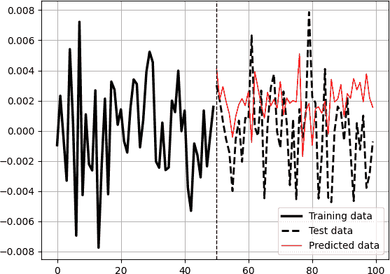

# 第七章：时间序列预测的机器学习模型

机器学习是人工智能的一个子领域，专注于开发能够使计算机在没有明确编程的情况下学习和进行预测或决策的算法和模型，因此被称为*学习*。机器学习涉及设计和构建能够从经验中自动学习和改进的系统，通常通过分析和从大量数据中提取模式来实现。

本章介绍了使用机器学习模型进行时间序列预测的框架，并讨论了一些已知的算法选择。

# 框架

*框架*非常重要，因为它组织了整个研究过程的方式（从数据收集到性能评估）。拥有适当的框架确保在回测中保持协调，从而允许在不同的机器学习模型之间进行适当的比较。框架可能遵循以下时间顺序步骤：

1.  导入和预处理历史数据，这些数据必须包含足够数量的值，以确保良好的回测和评估。

1.  进行*训练-测试*拆分，将数据分为两部分，其中数据的第一部分（例如从 2000 年到 2020 年）保留用于训练算法，以便理解预测未来值的数学公式，而数据的第二部分（例如从 2020 年到 2023 年）保留用于测试算法在其从未见过的数据上的表现。

1.  使用算法对数据进行拟合（训练）和预测（测试）。

1.  运行性能评估算法以了解模型在过去的表现。

###### 注意

*训练集*也称为*样本内数据*，而*测试集*也称为*样本外数据*。

框架的第一步已在第六章中讨论过。现在您应该能够使用 Python 轻松导入历史数据。训练-测试拆分将历史数据分为训练（样本内）集，其中模型被拟合（训练），以找到一个隐含的预测函数，以及测试（样本外）集，在测试集上应用和评估在训练集上计算的预测函数。理论上，如果模型在测试集上表现良好，那么您可能有一个潜在的交易策略候选，但这仅仅是第一步，现实远比这复杂得多。

为了一切顺利，从 [GitHub 仓库](https://oreil.ly/5YGHI) 下载 *master_function.py*，然后设置 Python 解释器（例如 Spyder）的目录与下载的文件位于同一位置，以便您可以将其作为库导入并使用其函数。例如，如果您将文件下载到桌面，您可能希望将目录设置为 第 6-5 图 所示的 第 6 章 的位置。通常可以在 Spyder 的右上角找到目录选项（变量资源管理器上方）。

###### 注意

如果您不想导入 *master_function.py*，您可以像正常文件一样在解释器中打开它并执行它，以便 Python 定义内部的函数。但是，每次重新启动内核时都必须执行此操作。

现在，对时间序列进行预处理（转换）并将其分割成四个不同的数组（或数据框），每个数组都具有以下实用性：

数组 `x_train`

解释您希望预测变量变化的样本内特征集（即独立变量）。它们是预测器。

数组 `y_train`

样本内的因变量集（即正确答案），您希望模型在其上校准其预测函数。

数组 `x_test`

作为模型的测试的样本外特征集，以查看它在此前未见数据上的表现。

数组 `y_test`

包含模型必须接近的实际值。换句话说，这些是将与模型预测进行比较的正确答案。

在分割之前，了解正在预测的内容以及用于预测的内容非常重要。在本章中，滞后价格差（收益率）将用于预测。通常，在执行此操作之前必须进行一些测试，但为了简单起见，让我们将它们略过，并假设最近的 500 个日常 EURUSD 收益率对当前收益率具有预测能力，这意味着您可以找到一个预测公式，该公式使用最近的 500 个观测值来观察下一个观测值：

因变量（预测）

EURUSD 日间时间框架中的 t+1 回报。这也称为 *y* 变量。

自变量（输入）

EURUSD 的最近 500 个日回报。这些也称为 *x* 变量。

图 7-1 显示了某一时间段内 EURUSD 的日收益率。注意其稳态外观。根据 ADF 测试（见 第 3 章），收益率数据集似乎是稳态的，适合进行回归分析。


###### 图 7-1\. EURUSD 的日收益率。

###### 注意

在本章中，特征（*x* 值）将是 EURUSD 滞后日价格差。¹ 在后续章节中，将使用滞后收益率或技术指标值作为特征。请注意，您可以使用任何您认为值得被视为预测的特征。

时间框架（每日）的选择非常适合希望获得一日市场视图并在当天结束前关闭仓位的交易者。

让我们首先使用虚拟回归模型作为第一个基本示例。*虚拟回归*是一种比较机器学习算法，仅用作基准，因为它使用非常简单的规则进行预测，不太可能增加任何真正的预测价值。虚拟回归的真正实用性在于看看你的真实模型是否胜过它。作为提醒，机器学习算法遵循以下步骤：

1.  导入数据。

1.  预处理并分割数据。

1.  训练算法。

1.  使用训练参数在测试数据上进行预测。此外，为了比较，还要在训练数据上进行预测。

1.  绘制和评估结果。

首先导入本章所需的库：

```py
import pandas as pd
import matplotlib.pyplot as plt
import numpy as np
from master_function import data_preprocessing, mass_import
from master_function import plot_train_test_values, 
from master_function import calculate_accuracy, model_bias
from sklearn.metrics import mean_squared_error
```

现在导入您将使用的算法的特定库：

```py
from sklearn.dummy import DummyRegressor
```

下一步是导入和转换收盘价数据。请记住，您正在尝试预测每日收益，这意味着您必须仅选择收盘列，然后对其应用差分函数，以使价格差异化：

```py
# Importing the differenced close price of EURUSD daily time frame
data = np.diff(mass_import(0, 'H1')[:, 3])
```

###### 注意

在金融中，术语*收益*通常指的是投资或某种资产产生的收益或损失，它可以通过当前资产价值与先前某个时间点的价值之间的差异来计算。这本质上是一种差分形式，因为您正在计算资产价值的变化或差异。

在时间序列分析中，差分是一种常用技术，用于使时间序列数据平稳化，这对于各种分析都很有帮助。差分涉及从彼此减去连续观测值，以消除趋势或季节性，从而关注数据的变化。

接下来，设置算法的超参数。对于这些基本算法而言，这将是滞后数（预测器数）和数据的百分比分割：

```py
# Setting the hyperparameters
num_lags = 500
train_test_split = 0.80
```

0.80 的`train_test_split`表示 80%的数据将用于训练，而剩余的 20%将用于测试。

用于拆分和定义回测所需的四个数组的函数可以定义如下：

```py
def data_preprocessing(data, num_lags, train_test_split):
    # Prepare the data for training
    x = []
    y = []
    for i in range(len(data) – num_lags):
        x.append(data[i:i + num_lags])
        y.append(data[i+ num_lags])
    # Convert the data to numpy arrays
    x = np.array(x)
    y = np.array(y)
    # Split the data into training and testing sets
    split_index = int(train_test_split * len(x))
    x_train = x[:split_index]
    y_train = y[:split_index]
    x_test = x[split_index:]
    y_test = y[split_index:]
    return x_train, y_train, x_test, y_test

```

调用函数创建四个数组：

```py
# Creating the training and test sets
x_train, y_train, x_test, y_test = data_preprocessing(data, 
                                                      num_lags, 
                                                      train_test_split)
```

您现在应该看到变量资源管理器中出现了四个新数组。下一步是使用所选算法对数据进行训练：

```py
# Fitting the model
model = DummyRegressor(strategy = 'mean')
model.fit(x_train, y_train)
```

请注意，虚拟回归可以采用以下任何策略作为参数：

`mean`

总是预测训练集的均值

`median`

总是预测训练集的中位数

`quantile`

总是预测训练集的指定分位数，由分位数参数提供

`constant`

总是预测由用户提供的常量值

如你从前面的代码中看到的，所选参数是`mean`。这自然意味着所有的预测都将简单地是训练集`y_train`的均值。这就是为什么虚拟回归只被用作基准，而不是作为严肃的机器学习模型。

下一步是对测试数据进行预测，以及对训练数据进行比较。请注意，对训练数据的预测没有价值，因为算法在训练期间已经见过数据，但了解算法在从未见过的数据上表现得更好或更差是很有意思的：

```py
# Predicting in-sample
y_predicted_train = np.reshape(model.predict(x_train), (–1, 1))
# Predicting out-of-sample
y_predicted = np.reshape(model.predict(x_test), (–1, 1))

```

为了确保你对使用虚拟回归算法的推理是正确的，手动计算`y_train`的平均值，并将其与每个`y_predicted`的值进行比较。你会发现它们是相同的：

```py
# Comparing the mean of y_train to an arbitrary value in y_predicted
y_train.mean() == y_predicted[123]

```

输出应该如下所示：

```py
True
```

最后，使用以下函数绘制最后的训练数据，然后是第一个测试数据和相应的预测数据：

```py
# Plotting
plot_train_test_values(100, 50, y_train, y_test, y_predicted)
```

###### 注意

你可以在本书的[GitHub 仓库](https://oreil.ly/5YGHI)中找到`plot_train_test_values()`函数的定义。

图 7-2 展示了从`y_train`的最后值到`y_test`和`y_predicted`的第一个值的预测任务的演变。显然，虚拟回归算法预测一个常数值，这就是为什么在测试值旁边的预测线是一条直线。


###### 图 7-2\. 训练数据后跟测试数据（虚线）和预测数据（细线）；垂直虚线代表测试期的开始。所使用的模型是虚拟回归算法。

###### 注意

如果你想要在单独的窗口中绘制图形，请在控制台中输入`**%matplotlib qt**`。如果你想要图形显示在绘图资源管理器中，请在控制台中输入`**%matplotlib inline**`。

你如何判断一个模型表现好还是不好？*性能评估*是交易和算法开发中的关键概念，因为它确保你选择了正确的模型并将其实施。然而，由于一个讽刺的简单问题，任务并不简单：*如果过去的表现很好，能保证未来也会表现良好吗？*

这个问题很痛苦，但它指向了正确的方向。对这个问题的答案是主观的。现在，让我们谈谈衡量模型性能的不同方法。为了简化任务，我将性能和评估指标分为两部分：模型评估和交易评估。*模型评估*关注算法在预测中的表现，而*交易评估*关注使用算法进行交易的系统的财务表现（交易评估指标的一个示例是净利润）。

让我们从模型评估开始。*准确率* 是比较预测与实际值时首先考虑的指标，尤其是在金融市场中。理论上，如果您预测方向（上涨或下跌）并且预测正确，您应该赚钱（不包括交易成本）。在金融术语中，准确率也称为*命中率*，计算方法如下：

<math alttext="Accuracy equals StartFraction Correct predictions Over Total predictions EndFraction times 100"><mrow><mtext>Accuracy</mtext> <mo>=</mo> <mstyle displaystyle="false" scriptlevel="0"><mfrac><mrow><mtext>Correct</mtext><mtext>predictions</mtext></mrow> <mrow><mtext>Total</mtext><mtext>predictions</mtext></mrow></mfrac></mstyle> <mo>×</mo> <mn>100</mn></mrow></math>

例如，如果您去年进行了 100 次预测，其中 73 次正确，那么您的准确率为 73%。

预测还可以通过预测值（`y_predicted`）与实际值（`y_test`）的接近程度来评估。这是通过损失函数完成的。*损失函数* 是衡量预测值与实际（测试）值之间差异的数学计算。最基本的损失函数是*平均绝对误差*（MAE）。它衡量预测值和实际值之间绝对差异的平均值。MAE 的数学表示如下：

<math alttext="upper M upper A upper E equals StartFraction sigma-summation Underscript i equals 1 Overscript n Endscripts StartAbsoluteValue ModifyingAbove y With caret minus y Subscript i Baseline EndAbsoluteValue Over n EndFraction"><mrow><mi>M</mi> <mi>A</mi> <mi>E</mi> <mo>=</mo> <mstyle displaystyle="false" scriptlevel="0"><mfrac><mrow><msubsup><mo>∑</mo> <mrow><mi>i</mi><mo>=</mo><mn>1</mn></mrow> <mi>n</mi></msubsup> <mrow><mo>|</mo><mover accent="true"><mi>y</mi> <mo>^</mo></mover><mo>-</mo><msub><mi>y</mi> <mi>i</mi></msub> <mo>|</mo></mrow></mrow> <mi>n</mi></mfrac></mstyle></mrow></math>

<math alttext="StartLayout 1st Row  ModifyingAbove y With caret is the predicted value 2nd Row  y is the real value EndLayout"><mtable><mtr><mtd columnalign="left"><mrow><mover accent="true"><mi>y</mi> <mo>^</mo></mover> <mtext>is</mtext> <mtext>the</mtext> <mtext>predicted</mtext> <mtext>value</mtext></mrow></mtd></mtr> <mtr><mtd columnalign="left"><mrow><mi>y</mi> <mtext>is</mtext> <mtext>the</mtext> <mtext>real</mtext> <mtext>value</mtext></mrow></mtd></mtr></mtable></math>

因此，MAE 计算预测值和实际值之间的平均距离（或正差异）。MAE 越低，模型越准确。

*均方误差*（MSE）是回归常用的损失函数之一。它衡量预测值和实际值之间平方差的平均值。您可以将 MSE 视为第三章中所见方差指标的等价物。MSE 的数学表示如下：

<math alttext="upper M upper S upper E equals StartFraction sigma-summation Underscript i equals 1 Overscript n Endscripts left-parenthesis ModifyingAbove y With caret minus y Subscript i Baseline right-parenthesis squared Over n EndFraction"><mrow><mi>M</mi> <mi>S</mi> <mi>E</mi> <mo>=</mo> <mstyle displaystyle="false" scriptlevel="0"><mfrac><mrow><msubsup><mo>∑</mo> <mrow><mi>i</mi><mo>=</mo><mn>1</mn></mrow> <mi>n</mi></msubsup> <msup><mrow><mo>(</mo><mover accent="true"><mi>y</mi> <mo>^</mo></mover><mo>-</mo><msub><mi>y</mi> <mi>i</mi></msub> <mo>)</mo></mrow> <mn>2</mn></msup></mrow> <mi>n</mi></mfrac></mstyle></mrow></math>

因此，MSE 计算预测值和实际值之间的平方距离的平均值。与 MAE 类似，MSE 值越低，模型越准确。有鉴于此，比较同类产品（例如方差和标准差，如第三章所示）非常有帮助。因此，*均方根误差*（RMSE）已被开发用于解决此问题（因此，将误差指标缩放回与目标变量相同的单位）。RMSE 的数学表示如下：

<math alttext="upper R upper M upper S upper E equals StartRoot StartFraction sigma-summation Underscript i equals 1 Overscript n Endscripts left-parenthesis ModifyingAbove y With caret minus y Subscript i Baseline right-parenthesis squared Over n EndFraction EndRoot"><mrow><mi>R</mi> <mi>M</mi> <mi>S</mi> <mi>E</mi> <mo>=</mo> <msqrt><mstyle displaystyle="false" scriptlevel="0"><mfrac><mrow><msubsup><mo>∑</mo> <mrow><mi>i</mi><mo>=</mo><mn>1</mn></mrow> <mi>n</mi></msubsup> <msup><mrow><mo>(</mo><mover accent="true"><mi>y</mi> <mo>^</mo></mover><mo>-</mo><msub><mi>y</mi> <mi>i</mi></msub> <mo>)</mo></mrow> <mn>2</mn></msup></mrow> <mi>n</mi></mfrac></mstyle></msqrt></mrow></math>

RMSE 相当于描述性统计中的标准偏差。

###### 注意

MAE 对异常值的敏感性相对较低，比 MSE 更少，通常在数据包含极端值或错误的绝对值比其平方值更重要时使用。另一方面，由于 MSE 更重视较大的错误，因此在试图提高模型性能时是首选的损失函数。

在使用 MAE、MSE 或 RMSE 评估模型时，重要的是有一个比较基准：

+   如果您已建立多个回归模型，则可以比较它们的度量标准，以确定哪个模型表现更好。通常情况下，具有较低度量标准的模型被认为在预测中更准确。

+   根   根据具体问题，您可能会对被视为可接受的预测误差水平设定一个阈值。例如，在某些情况下，低于某个阈值的 RMSE 可能被认为是令人满意的，而高于该阈值的值可能被认为是不可接受的。

+   您可以将训练数据的损失函数与测试数据的损失函数进行比较。

算法有时可能会出现多种原因的方向性偏见（无论是结构上的还是外部的）。*有偏模型* 在一个方向上进行的交易明显多于另一个方向（例如，一个算法有 200 个多头和 30 个空头）。*模型偏差* 将这种情况表示为一个比值，通过将多头头寸数除以空头头寸数。理想的模型偏差约为 1.00，这意味着一个平衡的交易系统。模型偏差的数学表示如下：

<math alttext="Model bias equals StartFraction Number of bullish signals Over Number of bearish signals EndFraction"><mrow><mtext>Model</mtext> <mtext>bias</mtext> <mo>=</mo> <mfrac><mrow><mtext>Number</mtext><mtext>of</mtext><mtext>bullish</mtext><mtext>signals</mtext></mrow> <mrow><mtext>Number</mtext><mtext>of</mtext><mtext>bearish</mtext><mtext>signals</mtext></mrow></mfrac></mrow></math>

如果一个模型今年有 934 个多头和 899 个空头，那么该模型的偏差度量为 1.038，这是可以接受的。这意味着该模型实际上没有偏见。值得注意的是，偏差度量为 0.0 表示没有任何看涨信号，而具有未定义值的偏差度量表示没有任何看跌信号（因为被零除）。

现在我们将把注意力转向交易评估。金融先驱们一直在开发度量标准，用于衡量策略和投资组合的表现。让我们讨论一下最常见和最有用的度量标准。最基本的度量标准是*净收益*，它实质上是在至少有一个已平仓交易的交易期之后的投资资本回报。净收益的数学表示如下：

<math alttext="Net return equals left-parenthesis StartFraction Final value Over Initial value EndFraction minus 1 right-parenthesis times 100"><mrow><mtext>Net</mtext> <mtext>return</mtext> <mo>=</mo> <mo>(</mo> <mstyle displaystyle="false" scriptlevel="0"><mfrac><mrow><mtext>Final</mtext><mtext>value</mtext></mrow> <mrow><mtext>Initial</mtext><mtext>value</mtext></mrow></mfrac></mstyle> <mo>-</mo> <mn>1</mn> <mo>)</mo> <mo>×</mo> <mn>100</mn></mrow></math>

*净值* 一词意味着扣除费用后的结果；否则，它被称为*毛收益*。例如，如果您年初有 52,000 美元，年底为 67,150 美元，您将获得 29.13% 的收益率（净利润为 15,150 美元）。

另一个盈利能力度量标准是*利润因子*，它是总毛利润与总毛亏损的比率。直观地，利润因子大于 1.00 意味着一个盈利策略，而小于 1.00 意味着一个亏损策略。利润因子的数学表示如下：

<math alttext="Profit factor equals StartFraction Gross profits Over Gross losses EndFraction"><mrow><mtext>Profit</mtext> <mtext>factor</mtext> <mo>=</mo> <mstyle displaystyle="false" scriptlevel="0"><mfrac><mrow><mtext>Gross</mtext><mtext>profits</mtext></mrow> <mrow><mtext>Gross</mtext><mtext>losses</mtext></mrow></mfrac></mstyle></mrow></math>

利润因子是评估交易策略盈利能力的一个有用度量标准，因为它同时考虑了策略产生的利润和损失，而不仅仅是看一方面。一个交易策略的利润因子，其利润为 54,012 美元，损失为 29,988 美元，为 1.80。

下一个有趣的指标与个别交易有关。*每笔交易的平均盈利*计算基于历史数据的每笔交易的平均利润（或正收益），而*每笔交易的平均亏损*计算基于历史数据的每笔交易的亏损（或负收益）。这两个指标根据以下公式计算：

<math alttext="StartLayout 1st Row  Average gain equals StartFraction Total profit Over Number of winning trades EndFraction 2nd Row  Average loss equals StartFraction Total losses Over Number of losing trades EndFraction EndLayout"><mtable><mtr><mtd columnalign="left"><mrow><mtext>Average</mtext> <mtext>gain</mtext> <mo>=</mo> <mfrac><mrow><mtext>Total</mtext><mtext>profit</mtext></mrow> <mrow><mtext>Number</mtext><mtext>of</mtext><mtext>winning</mtext><mtext>trades</mtext></mrow></mfrac></mrow></mtd></mtr> <mtr><mtd columnalign="left"><mrow><mtext>Average</mtext> <mtext>loss</mtext> <mo>=</mo> <mfrac><mrow><mtext>Total</mtext><mtext>losses</mtext></mrow> <mrow><mtext>Number</mtext><mtext>of</mtext><mtext>losing</mtext><mtext>trades</mtext></mrow></mfrac></mrow></mtd></mtr></mtable></math>

下一个指标与风险相关，是评估的最重要指标之一。*最大回撤*是一种衡量投资或投资组合价值从历史最高峰值到最低点的最大百分比下降的指标。它通常用于评估投资或投资组合的下行风险。例如，如果一个投资的峰值为 10 万美元，其价值随后下跌至 5 万美元后恢复，那么最大回撤将为 50%，即从峰值到谷底的百分比下降。最大回撤的计算方法如下：

<math alttext="Maximum drawdown equals left-parenthesis StartFraction Trough value minus Peak value Over Peak value EndFraction right-parenthesis times 100"><mrow><mtext>Maximum</mtext> <mtext>drawdown</mtext> <mo>=</mo> <mo>(</mo> <mstyle displaystyle="false" scriptlevel="0"><mfrac><mrow><mtext>Trough</mtext><mtext>value</mtext><mo>-</mo><mtext>Peak</mtext><mtext>value</mtext></mrow> <mrow><mtext>Peak</mtext><mtext>value</mtext></mrow></mfrac></mstyle> <mo>)</mo> <mo>×</mo> <mn>100</mn></mrow></math>

最后，让我们讨论一个众所周知的盈利能力比率，称为*夏普比率*。它衡量了单位超额风险所产生的回报。该比率的公式如下：

<math alttext="upper S h a r p e equals StartFraction mu minus r Over sigma EndFraction"><mrow><mi>S</mi> <mi>h</mi> <mi>a</mi> <mi>r</mi> <mi>p</mi> <mi>e</mi> <mo>=</mo> <mfrac><mrow><mi>μ</mi><mo>-</mo><mi>r</mi></mrow> <mi>σ</mi></mfrac></mrow></math>

+   μ 是净收益

+   *r* 是无风险利率

+   σ 是收益波动率

因此，如果净收益率为 5%，无风险利率为 2%，而收益波动率为 2.5%，则夏普比率为 1.20。任何高于 1.00 的值都是理想的，因为它意味着策略产生了正的超额风险调整回报。

本书的重点是开发机器和深度学习算法，因此性能评估步骤将仅专注于准确性、RMSE 和模型偏差（附带预测变量之间的相关性作为额外指标）。性能函数可以在 GitHub 存储库中找到，以及完整的脚本。

应用性能指标后，模型在 EURUSD 上的结果如下：

```py
Accuracy Train =  49.28 %
Accuracy Test =  49.33 %
RMSE Train =  0.0076467838
RMSE Test =  0.0053250347
Model Bias =  0.0
```

偏差为 0.0 时，很容易看出这是一个虚拟的回归模型。偏差意味着根据公式，所有的预测都是看跌的。仔细查看预测的细节，你会发现它们都是恒定值。

###### 注意

本节的主要要点如下：

+   自动数据导入和创建节省时间，让您可以专注于算法的主要问题。

+   为了进行适当的回测，数据必须分成训练集和测试集。

+   训练集包含`x_train`和`y_train`，前者包含了被认为对后者具有预测能力的值。

+   测试集包含`x_test`和`y_test`，前者包含了被认为对后者具有预测能力的值（即使模型在训练中没有遇到过它们）。

+   将数据拟合是指算法在训练集上运行；预测数据是指算法在测试集上运行。

+   预测存储在名为`y_predicted`的变量中，用于性能评估目的与`y_test`进行比较。

+   算法的主要目标是具有良好的准确性和稳定的低波动率回报。

# 机器学习模型

本节介绍了一些使用迄今为止开发的框架的机器学习模型的选择。了解每个模型的优缺点非常重要，这样您就知道根据预测任务选择哪种模型。

## 线性回归

*线性回归*算法通过找到最佳拟合线来最小化预测值和实际目标值之间的平方差。在此算法中最常用的优化技术是*普通最小二乘*（OLS）方法。²

该模型使用 OLS 方法在训练集上进行训练，该方法估计最小化预测值和实际目标值之间平方差的系数，以找到独立变量的最优系数（系数分别代表最佳拟合线的*y*-截距和斜率）。输出是一个线性函数，根据系数加权解释变量给出期望的回报，并对噪声和截距进行调整。

要从*sklearn*导入线性回归库，请使用以下代码：

```py
from sklearn.linear_model import LinearRegression
```

现在让我们看看算法的实现：

```py
# Fitting the model
model = LinearRegression()
model.fit(x_train, y_train)
# Predicting in-sample
y_predicted_train = np.reshape(model.predict(x_train), (–1, 1))
# Predicting out-of-sample
y_predicted = np.reshape(model.predict(x_test), (–1, 1))

```

该模型假设过去保持的线性关系在未来仍将保持不变。这是不现实的，并忽视了市场动态和驱动因素不断变化的事实，无论是短期还是长期。它们也是非线性的。

图 7-3 展示了从`y_train`的最后值到`y_test`和`y_predicted`的第一个值的预测任务的演变。


###### 图 7-3\. 训练数据后跟测试数据（虚线）和预测数据（细线）；垂直虚线表示测试期的开始。使用的模型是线性回归算法。

在应用性能指标后，EURUSD 的模型结果如下：

```py
Accuracy Train =  58.52 %
Accuracy Test =  49.54 %
RMSE Train =  0.007096094
RMSE Test =  0.0055932632
Correlation In-Sample Predicted/Train =  0.373
Correlation Out-of-Sample Predicted/Test =  0.014
Model Bias =  0.93

```

结果表明，线性回归算法的表现不佳，准确率低于 50.00%。正如您所看到的，切换到测试集后，准确率通常会下降。样本内预测与实际样本值之间的相关性也从 0.373 下降到 0.014。模型偏差接近均衡，这意味着长信号数量接近短信号数量。

模型结果有几个要注意的地方：

+   交易成本未被纳入考虑，因此这些是毛收益结果（非净结果）。

+   由于这是一个纯粹的时间序列机器学习模型，而不是包含止损和目标的完整交易算法，因此没有风险管理系统。因此，由于这是一个纯粹的定向模型，任务是尽量提高正确预测的数量。在每日时间段内，您正在寻找准确性。

+   不同的外汇数据提供商可能在历史数据上有细微差异，这可能导致回测之间的一些差异。

模型被设计为优化和调整。优化过程可能包括以下任一技术：

选择正确的预测因子对模型的成功至关重要。

在本章中，使用的预测因子是滞后收益率。这是任意选择的，并不一定是正确的选择。必须基于经济和统计直觉选择预测因子。例如，选择黄金的回报来解释（预测）标准普尔 500 指数的波动可能是合理的，因为它们在经济上有关联。避险资产如黄金在经济不确定时期上涨，而股市则倾向于下跌。这种负相关可能隐藏了这两种工具之间的潜在模式。选择预测因子的另一种方法是使用技术指标，如相对强度指数（RSI）和移动平均线。

适当的分割对正确评估模型至关重要。

训练测试分离很重要，因为它们决定评估的窗口。通常使用 20/80 和 30/70，这意味着数据的 20%（30%）用于测试样本，80%（70%）用于训练样本。

正则化技术可以帮助防止偏差。

岭回归和 Lasso 回归是线性回归中常见的两种正则化方法。*岭回归*在 OLS 函数中增加惩罚项，以减少大系数的影响，而*Lasso 回归*可以将一些系数驱动为零，有效进行特征选择。

本节中看到的模型被称为*自回归模型*，因为因变量取决于其过去的值，而不是外生数据。此外，由于在每个时间步骤中使用了 500 个不同的变量（及其系数）来预测下一个变量，因此该模型被称为*多元线性回归*模型。相比之下，当模型仅使用一个因变量来预测依赖变量时，它被称为*简单线性回归*模型。

线性回归的优点是：

+   实施和训练都很容易。它也不会消耗大量内存。

+   在数据具有线性依赖性时表现优越。

线性回归的缺点是：

+   对异常值敏感。

+   它很容易出现偏差（更多关于这种类型偏差的信息请参见“过拟合与欠拟合”）。

+   它具有不切实际的假设，例如数据的独立性。

在进入下一节之前，重要的是注意一些线性回归模型不会对数据进行转换。你可能看到非常高的准确度和非常接近真实数据的预测，但实际上预测是滞后一个时间步长的。这意味着在每个时间步长，预测值只是上一个真实值。让我们用之前的例子来证明这一点。使用与之前相同的代码，但省略价格差分代码。你应该看到图 7-4。


###### 图 7-4\. 非平稳训练数据接着测试数据（虚线）和预测数据（细线）；垂直虚线代表测试期的开始。使用的模型是线性回归算法。

注意它仅仅是滞后于真实值，并没有添加任何预测信息。处理此类模型时，始终要对非平稳数据进行转换。非平稳数据不能使用此类算法进行预测（当然也有例外，稍后会看到）。

在非平稳数据（如市场价格）上使用线性回归，并观察到预测结果与上一个值相同可能表明存在一种称为*天真预测*的问题。这种情况发生在最近的观察值（在本例中是上一个值）仅被用作下一个时间段的预测值。虽然这种方法有时对某些类型的数据有效，但通常不是一种复杂的预测方法，可能无法捕捉数据中的潜在模式或趋势。导致这种情况发生的原因有几个：

缺乏预测能力

线性回归假设自变量与因变量之间存在线性关系。如果数据高度非平稳且缺乏明确的线性关系，那么线性回归模型可能无法捕捉到有意义的模式，并会默认为类似天真预测的简单预测。

滞后指标

市场价格通常表现出强烈的自相关性，这意味着当前价格与先前价格高度相关。在这种情况下，如果模型仅考虑滞后值作为预测因子，它可能只是将最后一个值复制为预测值。

缺乏特征工程

线性回归模型依赖于您提供的特征（预测因子）来进行预测。如果您只使用滞后值作为预测因子，而没有整合其他相关特征，模型可能会难以生成有意义的预测。

模型复杂性

线性回归是一种相对简单的建模技术。如果数据中的基本关系比线性方程能够捕捉到的更复杂，那么该模型可能无法进行准确的预测。

## 支持向量回归

*支持向量回归*（SVR）是一种机器学习算法，属于 *支持向量机*（SVM）家族。SVR 专门设计用于回归问题，其目标是预测连续的数值（例如返回值）。

SVR 通过在高维特征空间中找到一个最佳超平面来执行回归，该超平面最佳地逼近输入特征和目标变量之间的关系。与传统回归技术不同，传统回归技术旨在最小化预测值与实际值之间的误差，SVR 则专注于找到一个能够捕捉数据中大部分数据的超平面，即所谓的 *epsilon tube*（损失函数）。

SVR 的关键思想是使用核函数将原始输入空间转换为更高维度的空间。这种转换允许 SVR 隐式地将数据映射到更高维的特征空间，在这个空间中更容易找到特征与目标变量之间的线性关系。核函数计算两个数据点之间的相似性，使得 SVR 算法能够有效地处理非线性回归问题。SVR 过程中执行的步骤如下：

1.  算法使用核函数将输入特征转换为更高维度的空间。常见的核函数包括线性核函数、多项式核函数、径向基函数（RBF）核函数和 sigmoid 核函数。核的选择取决于数据和潜在问题。

1.  算法然后旨在找到最佳拟合数据点的超平面，这些数据点在 epsilon 管道内。训练过程涉及解决优化问题，以最小化误差（使用例如 MSE 的损失函数）同时控制间隔。

###### 注意

RBF 核函数是 SVR 的流行选择，因为它能有效捕捉非线性关系。当对关系的具体形式没有先验知识时，它是合适的选择。RBF 核函数根据输入空间中特征向量之间的距离计算它们的相似性。它使用一个称为 *gamma* 的参数，决定每个训练样本对模型的影响。较高的 gamma 值使模型更加关注单个数据点，可能导致错误。

通过在 epsilon 管道内找到一个最优超平面，SVR 可以有效地捕捉数据中的潜在模式和关系，即使在存在噪声或异常值的情况下也是如此。对于回归任务，特别是处理特征与目标变量之间的非线性关系时，它是一种强大的技术。

由于 SVR 对特征的尺度敏感，将所有特征带到相似的尺度上是很重要的。常见的缩放方法包括 *标准化*（减去平均值并除以标准差）和 *归一化*（将特征缩放到范围，例如 [0, 1]）。

让我们看看 SVR 的运作方式。再次，目标是根据先前的收益预测下一个 EURUSD 的收益。要导入 SVR 库和缩放库，请使用以下代码：

```py
from sklearn.svm import SVR
from sklearn.preprocessing import StandardScaler
from sklearn.pipeline import make_pipeline

```

对于 SVR 算法，进行了一些微调以获得可接受的预测结果。调整是将滞后值的数量从 500 减少到 50：

```py
num_lags = 50
```

这使得 SVR 算法能够改善其预测能力。在本书中您将看到，执行这些类型的回测的一部分是调整和校准模型。

接下来，要实现算法，请使用以下代码：

```py
# Fitting the model
model = make_pipeline(StandardScaler(), 
                      SVR(kernel = 'rbf', C = 1, gamma = 0.04, 
                      epsilon = 0.01))
model.fit(x_train, y_train)
# Predicting in-sample
y_predicted_train = np.reshape(model.predict(x_train), (–1, 1))
# Predicting out-of-sample
y_predicted = np.reshape(model.predict(x_test), (–1, 1))

```

图 7-5 展示了从`y_train`的最后值到`y_test`和`y_predicted`的第一个值的预测任务的演变过程。


###### 图 7-5。训练数据后跟测试数据（虚线）和预测数据（细线）；垂直虚线表示测试期的开始。使用的模型是 SVR 算法。

模型的结果如下：

```py
Accuracy Train =  57.94 %
Accuracy Test =  50.14 %
RMSE Train =  0.0060447699
RMSE Test =  0.0054036167
Correlation In-Sample Predicted/Train =  0.686
Correlation Out-of-Sample Predicted/Test =  0.024
Model Bias =  0.98
```

SVR 的优点包括：

+   它在高维特征空间中表现良好，即特征数量远远大于样本数量时。在处理复杂数据集时特别有用。

+   它可以通过使用核函数捕捉输入特征与目标变量之间的非线性关系。

+   由于ε-tube 公式的存在，它对训练数据中的异常值具有鲁棒性。该模型专注于将大多数数据拟合在指定边界内，从而减少异常值的影响。

SVR 的缺点包括：

+   它有几个需要调整以达到最佳性能的超参数。选择适当的超参数可能是一项具有挑战性的任务，并且可能需要进行广泛的实验。

+   它可能计算成本较高，特别是对于大型数据集或使用复杂核函数时。

+   它可能对超参数的选择敏感。选择不当的超参数可能导致拟合问题。

## 随机梯度下降回归

*梯度下降*（GD）是一种常用的优化算法，用于最小化模型的成本或损失函数，它也是各种优化算法的基础。

###### 注意

*梯度*简单地指的是表面的斜率或倾斜度。要到达表面的最低点，必须沿着斜坡下降。

*随机梯度下降*（SGD）是一种常用的迭代优化算法，用于训练机器学习模型，包括回归模型。它特别适用于大型数据集和在线学习场景。当应用于时间序列预测时，SGD 可用于训练能够捕捉时间模式并基于历史数据进行预测的回归模型。因此，SGD 是一种使用随机梯度下降优化的线性回归类型。

与普通的最小二乘法不同，SGD 会迭代地更新模型的参数，使其更适用于大型数据集（以小批量方式处理）。SGD 不是使用整个数据集进行每次更新步骤，而是随机选择训练数据集中的一小批样本或单个样本。这种随机选择有助于引入随机性并避免陷入局部最优解（您可以参考第四章了解更多关于优化的信息）。GD 和 SGD 之间的主要区别在于它们在优化期间如何更新模型的参数。

###### 注意

SGD 不属于任何特定的机器学习模型家族；它本质上是一种优化技术。

GD 计算整个训练数据集上的梯度，每个时代更新一次模型的参数，而 SGD 基于单个训练示例或小批量计算梯度，更频繁地更新参数。SGD 更快但表现更不稳定，而 GD 更慢但具有更平滑的收敛轨迹。SGD 对局部最小值也更具鲁棒性。选择 GD 还是 SGD 取决于问题的具体要求、数据集的大小以及计算效率和收敛行为之间的权衡。

与往常一样，第一步是导入必要的库：

```py
from sklearn.linear_model import SGDRegressor
from sklearn.preprocessing import StandardScaler
from sklearn.pipeline import make_pipeline
```

接下来，要实现该算法，请使用以下代码：

```py
# Fitting the model
model = make_pipeline(StandardScaler(), SGDRegressor(max_iter = 50, 
                                                     tol = 1e–3))
model.fit(x_train, y_train)
# Predicting in-sample
y_predicted_train = np.reshape(model.predict(x_train), (–1, 1))
# Predicting out-of-sample
y_predicted = np.reshape(model.predict(x_test), (–1, 1))

```

图 7-6 显示了从`y_train`的最后值到`y_test`和`y_predicted`的第一个值的预测任务的演变。


###### 图 7-6。训练数据后跟测试数据（虚线）和预测数据（细线）；垂直虚线表示测试期的开始。所使用的模型是 SGD 算法。

模型的结果如下：

```py
Accuracy Train =  55.59 %
Accuracy Test =  46.45 %
RMSE Train =  0.007834505
RMSE Test =  0.0059334014
Correlation In-Sample Predicted/Train =  0.235
Correlation Out-of-Sample Predicted/Test =  –0.001
Model Bias =  0.95

```

SGD 的优点包括：

+   它在大型数据集上表现良好，因为它根据单个或小型训练示例逐步更新模型参数。

+   它可以逃脱局部最小值并找到更好的全局最优解（由于其随机性质）。

+   它可以通过在每次迭代中将模型暴露于不同的训练样本来提高泛化能力，从而减少过拟合。

SGD 的缺点包括：

+   收敛路径可能会有噪声并且比确定性优化算法表现出更多的波动。这可能导致较慢的收敛或在最优解周围的振荡。

+   它受特征缩放的影响，这意味着它对这种技术敏感。

## 最近邻回归

*最近邻回归*算法，也被称为*k*最近邻（KNN）回归，是一种非参数³算法，用于回归任务。它基于特征空间中最近邻的值来预测目标变量的值。该算法首先确定*k*，即在进行预测时要考虑的最近邻的数量。这是一个需要根据具体问题选择的超参数。

###### 注意

较大的*k*值提供了更平滑的预测，而较小的*k*值捕捉更多局部变化，但可能更容易受到噪音的影响。

然后，模型计算新的未见数据点与训练集中所有数据点之间的距离。距离度量的选择取决于输入特征的性质。常见的距离度量包括欧氏距离、曼哈顿距离和闵可夫斯基距离。接下来，算法选择距离查询点最近的*k*个数据点。这些数据点是*最近邻*，将用于进行预测。

要导入 KNN 回归器，请使用以下代码：

```py
from sklearn.neighbors import KNeighborsRegressor
```

现在让我们来看看算法的实现。使用*k* = 10 来拟合模型：

```py
# Fitting the model
model = KNeighborsRegressor(n_neighbors = 10)
model.fit(x_train, y_train)
# Predicting in-sample
y_predicted_train = np.reshape(model.predict(x_train), (–1, 1))
# Predicting out-of-sample
y_predicted = np.reshape(model.predict(x_test), (–1, 1))

```

图 7-7 展示了从`y_train`的最后值到`y_test`和`y_predicted`的第一个值的预测任务的演变。


###### 图 7-7\. 训练数据，随后是测试数据（虚线），以及预测数据（细线）；垂直虚线表示测试期的开始。使用的模型是 KNN 回归算法。

使用 KNN 回归器进行时间序列预测时，选择邻居数量取决于多个因素，包括数据集的特性和所需的精度水平。没有一个确定的答案来确定选择多少个邻居，通常通过实验和验证来确定。通常选择适当的邻居数量涉及偏差和方差之间的权衡：

+   较小的*k*值与能够捕捉数据中局部模式的模型相关联，但也可能对噪声或异常值敏感。

+   较大的*k*值与能够更加抗噪声或异常值的模型相关联，但可能忽略数据中的局部模式。

###### 注意

如果将*k*趋向于数据集大小的极限，将得到一个仅预测数据集中频率最高类别的模型。这被称为*贝叶斯误差*。

模型的结果如下：

```py
Accuracy Train =  67.69 %
Accuracy Test =  50.77 %
RMSE Train =  0.0069584171
RMSE Test =  0.0054027335
Correlation In-Sample Predicted/Train =  0.599
Correlation Out-of-Sample Predicted/Test =  0.002
Model Bias =  0.76

```

###### 注意

在考虑您的时间序列数据时，考虑其时间特性是至关重要的。如果存在跨多个数据点的明显趋势或模式，较大的*k*值可能更适合捕捉这些依赖关系。然而，如果时间序列展示出快速变化或短期波动，较小的*k*值可能更合适。

你的数据集的大小也可能影响*k*的选择。如果数据集很小，选择较小的*k*值可能更好，以避免过拟合。相反，较大的数据集可以容忍更高的*k*值。

KNN 的优点包括：

+   它的非线性允许捕捉金融数据中的复杂模式，这对于预测可能表现出非线性行为的回报序列有优势。

+   它可以适应变化的市场条件或模式。由于算法是基于实例的，当新数据可用时，不需要重新训练模型。这种适应性在金融回报的情境中可能是有益的，因为市场动态可以随时间变化。

+   它为预测提供直观的解释。由于该算法选择*k*个最近邻来进行预测，相对于更复杂的算法，理解和解释可能更容易。

KNN 的缺点包括：

+   在处理高维数据时，其性能可能会下降。金融回报序列通常涉及多个预测因子（如技术指标和其他相关回报），KNN 可能难以在高维空间中找到有意义的邻居。

+   随着数据集的增大，KNN 的计算要求可能变得显著。

+   它对噪声或异常数据点敏感，因为该算法平等地考虑所有邻居。

## 决策树回归

*决策树*是多功能且直观的机器学习模型。它们是基于特征值的一系列决策或选择的图形表示，这些选择导致不同的结果。决策树结构化为分层流程图，其中每个内部节点代表基于特征的决策，每个分支表示该决策的结果，每个叶节点表示最终的预测或类标签。

在决策树的根部，考虑所有的输入特征，并选择基于特定标准（例如在第二章中讨论的信息增益度量）最佳分离数据的特征。创建与所选特征相关联的决策节点。根据所选特征的可能值来分割数据。递归地重复前面的步骤，考虑每个节点处剩余的特征，直到达到停止条件为止，例如达到最大深度、节点中的最小样本数，或者在纯度或增益上不再有进一步的改善。

要导入决策树回归器，请使用以下代码：

```py
from sklearn.tree import DecisionTreeRegressor
```

现在让我们看一下算法的实现：

```py
# Fitting the model
model = DecisionTreeRegressor(random_state = 123)
model.fit(x_train, y_train)
# Predicting in-sample
y_predicted_train = np.reshape(model.predict(x_train), (–1, 1))
# Predicting out-of-sample
y_predicted = np.reshape(model.predict(x_test), (–1, 1))

```

###### 注意

参数`random_state`通常用于初始化包含随机性的算法，比如初始化权重。这确保了如果你多次使用相同的`random_state`来训练模型，你将得到相同的结果，这对于比较不同的算法或超参数是很重要的。

图 7-8 显示了预测任务从`y_train`的最后值到`y_test`和`y_predicted`的第一个值的演变。


###### 图 7-8\. 训练数据接着是测试数据（虚线）和预测数据（细线）；垂直虚线代表测试期的开始。使用的模型是决策树回归算法。

模型的结果如下：

```py
Accuracy Train =  100.0 %
Accuracy Test =  47.37 %
RMSE Train =  0.0
RMSE Test =  0.007640736
Correlation In-Sample Predicted/Train =  1.0
Correlation Out-of-Sample Predicted/Test =  –0.079
Model Bias =  0.94

```

注意训练集的准确度非常高。这明显是过度拟合的证据（受训练数据的 RMSE 支持）。

决策树的优点是：

+   它们需要最少的数据预处理并且可以处理缺失值。

+   它们可以捕捉非线性关系、交互作用和变量重要性。

决策树的缺点是：

+   如果没有适当正则化，它们可能对数据中的细微变化敏感，容易过度拟合。

+   它们可能难以捕捉需要更深树的复杂关系。

下一节介绍了另一类机器学习算法。这些被称为*集成算法*。可以使用集成方法将决策树组合起来以创建更稳健和准确的模型。随机森林是下一节中看到的算法，它结合了多个决策树以增强预测能力，尤其是减少过度拟合的风险。

## 随机森林回归

*随机森林*是一种利用多个决策树的力量形成单一输出（预测）的机器学习算法。它灵活且不需要太多调整。由于其集成学习技术，它也不太容易过度拟合。*集成学习*指的是将多个学习器（模型）组合起来以改善最终预测。

使用随机森林，多个学习器是不同的决策树，它们会汇聚到一个单一的预测。

因此，在随机森林算法中可以调整的超参数之一是决策树的数量。该算法使用装袋法。在随机森林的背景下，*装袋*指的是*自助聚合*技术，旨在通过减少偏差来改善机器学习模型（如决策树）的性能和鲁棒性。以下是随机森林算法中装袋的工作原理：

1.  *自助采样*：随机森林采用自助采样，这意味着通过替换抽样创建原始训练数据的多个子集。每个子集的大小与原始数据集相同，但可能包含重复实例并排除其中一些。这个过程对随机森林中的每棵树都是独立进行的。

1.  *树构建和特征选择*：对于每个自助采样，使用一种称为*递归分区*的过程构建决策树，其中数据基于特征进行分割，以创建优化目标变量分离的分支。在决策树的每个节点，考虑一个随机子集的特征进行分割。这有助于在森林中引入多样性，并防止它们过于依赖单一主导特征。

1.  *集成预测*：一旦所有树都构建完成，通过聚合各个树的输出进行预测。对于回归任务，预测值取平均值。

要导入随机森林回归器，请使用以下代码：

```py
from sklearn.ensemble import RandomForestRegressor

```

现在让我们来看看算法的实现：

```py
# Fitting the model
model = RandomForestRegressor(max_depth = 20, random_state = 123)
model.fit(x_train, y_train)
# Predicting in-sample
y_predicted_train = np.reshape(model.predict(x_train), (–1, 1))
# Predicting out-of-sample
y_predicted = np.reshape(model.predict(x_test), (–1, 1))

```

###### 注意

`max_depth`超参数控制随机森林中每棵决策树的深度。深度较大的决策树可以捕捉数据中更复杂的模式，但也更容易过拟合，这意味着在训练数据上表现很好但在未见数据上表现不佳。另一方面，较浅的树可能无法捕捉数据的所有细节，但在新的未见数据上可能更具一般化能力。

图 7-9 显示了从`y_train`的最后值到`y_test`和`y_predicted`的第一个值的预测任务演变过程。


###### 图 7-9\. 训练数据后跟测试数据（虚线），以及预测数据（细线）；垂直虚线表示测试期的开始。所用模型是随机森林回归算法。

模型的结果如下：

```py
Accuracy Train =  82.72 %
Accuracy Test =  50.15 %
RMSE Train =  0.0058106512
RMSE Test =  0.0053452064
Correlation In-Sample Predicted/Train =  0.809
Correlation Out-of-Sample Predicted/Test =  –0.049
Model Bias =  0.63

```

随机森林回归的优点如下：

+   由于其集成的特性，通常对数据有准确的预测。由于金融时间序列具有高噪声和边际随机性，尽管如此，其结果仍需优化。

+   由于其平均化的特性，它对噪声和异常值表现出鲁棒性。

随机森林回归的缺点如下：

+   有时可能难以解释。由于使用聚合方法，当使用大量树时可能会丢失真实和最终决策。

+   随着树的数量增加，算法的计算时间变长，训练过程缓慢。

## AdaBoost 回归

在理解 AdaBoost 算法之前，让我们先讨论梯度提升，这样就更容易理解其背后的算法。*梯度提升*是一种基于改进*弱学习器*（指表现略好于随机的模型）思想构建模型的技术。

提升这些弱学习器的方法是针对它们的弱点创建其他能处理这些弱点的弱学习器。这就诞生了所谓的*自适应增强*，简称*AdaBoost*。因此，通俗来说，*增强*就是将弱学习器结合起来形成更好的模型。

AdaBoost 中的学习器（如前所述，是弱的）是单分裂的决策树（称为*stumps*）。它们被赋予权重，对于更难分类的实例放置更多的权重，对其余实例放置较少的权重。同时，新的学习器被纳入以在困难部分进行训练，从而创建一个更强大的模型。因此，困难的实例获得更大的权重，直到它们被新的弱学习器解决。

预测基于弱学习器的投票。采用多数原则以最大化准确性。因此，梯度提升可以概括为三个步骤：

1.  它按顺序构建了一组弱预测模型，通常是决策树。

1.  每个后续模型都是为了纠正先前模型的错误或残差而构建的，使用梯度下降来调整预测以最小化总体错误。

1.  所有模型的预测通过加权平均或总和来组合，加权由学习率确定，以产生最终预测。

要导入 AdaBoost 回归器，请使用以下代码：

```py
from sklearn.ensemble import AdaBoostRegressor
```

现在让我们看一下算法的实现：

```py
# Fitting the model
model = AdaBoostRegressor(random_state = 123)
model.fit(x_train, y_train)
# Predicting in-sample
y_predicted_train = np.reshape(model.predict(x_train), (–1, 1))
# Predicting out-of-sample
y_predicted = np.reshape(model.predict(x_test), (–1, 1))

```

图 7-10 显示了从`y_train`的最后值到`y_test`和`y_predicted`的第一个值的预测任务的演变。


###### 图 7-10\. 训练数据后跟测试数据（虚线）和预测数据（细线）；垂直虚线表示测试期的开始。所使用的模型是 AdaBoost 回归算法。

模型的结果如下：

```py
Accuracy Train =  53.27 %
Accuracy Test =  51.7 %
RMSE Train =  0.0070124217
RMSE Test =  0.0053582343
Correlation In-Sample Predicted/Train =  0.461
Correlation Out-of-Sample Predicted/Test =  0.017
Model Bias =  0.72

```

AdaBoost 的优点是：

+   它通常具有很高的准确性。

+   它很容易理解。

AdaBoost 的缺点是：

+   它受异常值的影响，对噪声敏感。

+   它速度较慢，且未经优化。

## XGBoost 回归

*XGBoost*是一种快速且性能优异的梯度提升决策树算法。这个名字可能很复杂，但如果你理解了 AdaBoost 上一节中的梯度提升，就不难理解。XGBoost 代表*极端梯度提升*，是由陈天奇创建的。它的工作原理如下：

1.  XGBoost 从一个简单的基础模型开始，通常是一个决策树。

1.  它定义了一个衡量模型性能的目标函数。

1.  使用梯度下降优化，通过根据目标函数的梯度调整模型来迭代地改进模型的预测。

1.  新的决策树被添加到集合中以纠正先前模型的错误。

1.  采用正则化技术，如学习率和列子采样，以增强性能并防止拟合问题。

1.  最终预测是通过组合集合中所有模型的预测得到的。

Python 中 XGBoost 的实现比前面的算法需要更多步骤。第一步是`pip install`所需的模块。在提示符中输入以下命令：⁴

```py
pip install xgboost
```

要导入 XGBoost 库，请使用以下代码：

```py
from xgboost import XGBRegressor
```

算法的实现如下所示：

```py
# Fitting the model
model = XGBRegressor(random_state = 123, n_estimators = 16, 
                     max_depth = 12)
model.fit(x_train, y_train)
# Predicting in-sample
y_predicted_train = np.reshape(model.predict(x_train), (–1, 1))
# Predicting out-of-sample
y_predicted = np.reshape(model.predict(x_test), (–1, 1))

```

###### 注意

参数`n_estimators`是一个超参数，用于确定要在集成中构建的提升回合或树的数量。由于算法结合多个弱学习器（单个决策树）的预测来创建强预测模型，每个提升回合（迭代）将一个新的决策树添加到集成中，并且算法从之前树的错误中学习。`n_estimators`超参数控制在训练过程中将添加到集成中的树的最大数量。

AdaBoost 和 XGBoost 都是用于增强弱学习器（通常为决策树）预测能力的提升算法。AdaBoost 专注于使用指数损失迭代强调误分类样本，缺乏内置正则化，并且并行化能力有限。相比之下，XGBoost 利用梯度提升，支持各种损失函数，提供正则化，处理缺失值，通过并行化更好地扩展，提供全面的特征重要性，并允许更广泛的超参数调整。

因此，XGBoost 提供了更高级的功能。它通常因为整体性能更好和处理复杂任务的能力而受到青睐。然而，两者之间的选择取决于具体的问题、数据集和可用的计算资源。

图 7-11 展示了从`y_train`的最后值到`y_test`和`y_predicted`的第一个值的预测任务的演变。



###### 图 7-11。训练数据后跟测试数据（虚线）和预测数据（细线）；垂直虚线表示测试期的开始。使用的模型是 XGBoost 回归算法。

模型的结果如下所示：

```py
Accuracy Train =  75.77 %
Accuracy Test =  53.04 %
RMSE Train =  0.0042354698
RMSE Test =  0.0056622704
Correlation In-Sample Predicted/Train =  0.923
Correlation Out-of-Sample Predicted/Test =  0.05
Model Bias =  6.8

```

# 过拟合和欠拟合

机器学习预测分析中会出现问题，这是完全正常的，因为在数据科学（和金融）世界中，“完美”是一个不可能的词。本节涵盖了在预测数据时最重要的问题，即“拟合问题”。过度拟合和欠拟合是两个术语，您必须彻底了解它们，以避免在运行模型时遇到它们的后果。

*过拟合*发生在模型在训练数据上表现极好但在测试数据上结果糟糕的情况下。这表明模型不仅学习了样本内数据的细节，还学习了发生的噪声。过拟合通常与高方差和低偏差模型相关，但这两个术语的含义是什么？

*偏差*是指模型预测的期望值与目标变量的实际值之间的差异。低偏差模型是足够复杂，可以捕捉数据中的潜在模式。

*方差*指的是模型在不同训练集上预测结果的变化程度。高方差模型过于复杂，可能捕捉到训练数据中的随机噪声和波动，导致过拟合。这会使模型适应数据中的噪声。

为了避免过拟合，重要的是在偏差和方差之间找到平衡，选择一个足够复杂以捕捉数据中潜在模式的模型，但不要过于复杂以至于捕捉到数据中的随机噪声和波动。正则化技术也可以用来减少方差，防止过拟合。

过拟合出现的原因有多种，尤其包括：

数据不足

如果训练数据不够多样化，或者数据量不足，模型可能会对训练数据过拟合。

过度复杂的模型

如果模型过于复杂，可能会学习到数据中的噪声而非潜在模式。

特征过载

如果模型训练时使用了过多的特征，可能会学习到不具有泛化能力的无关或噪声特征。

缺乏正则化

如果模型的正则化不合适，可能会导致对训练数据的过拟合。

泄露

泄露发生在测试集的信息被无意中包含在训练集中时。这会导致过拟合，因为模型在学习后期测试时将再次见到这些数据。

高偏差模型过于简化，无法捕捉数据中真实的潜在模式。这可能导致欠拟合。类似地，低方差模型对训练数据的小变化不敏感，并且能够很好地泛化到未见过的新数据。

欠拟合出现的原因有多种，尤其包括：

模型复杂性不足

如果所用模型过于简单，无法捕捉数据中的潜在模式，可能导致欠拟合。例如，线性回归模型可能无法捕捉特征与目标变量之间的非线性关系。

训练不足

如果模型训练时间不够长，或者数据量不足，可能无法捕捉数据中的潜在模式。

过度正则化

正则化是一种防止过拟合的技术，但如果使用过度，可能导致欠拟合。

特征选择不当

如果为模型选择的特征信息量不足或不相关，可能会导致欠拟合。

图 7-12 显示了模型与数据之间不同拟合的比较。欠拟合模型未能从一开始就捕获真实关系，因此在预测过去值和未来值方面表现不佳。良好拟合的模型捕获了数据的一般趋势。它不是精确或完美的模型，但通常在整个时间段内具有令人满意的预测。过拟合模型捕捉了过去的每一个细节，即使是噪音或随机位移。过拟合模型的危险在于它给未来带来了虚假的承诺。


###### 图 7-12。不同的拟合情况。

因此，在构建用于时间序列预测的机器学习模型时，必须确保不调整参数以完美地拟合过去的值。为了减少拟合偏差，请确保在您的回测中包含以下最佳实践：

增加训练数据

收集更多的训练数据有助于捕获数据中更广泛的模式和变化，减少过拟合的机会。

特征选择

仔细选择与您的模型相关且信息丰富的特征。去除无关或冗余的特征可以减少数据中的噪音和复杂性，使模型更容易对未见示例进行良好泛化。

正则化技术

正则化方法明确控制模型的复杂性，以防止过拟合。

超参数调优

优化模型的超参数以找到最佳配置。超参数控制模型的行为和复杂性。

集成方法

使用集成方法，如随机森林，将多个模型的预测组合起来。集成方法可以通过聚合多个模型的预测结果，平滑个别模型的偏差，并提高泛化能力，从而减少过拟合。

定期模型评估

定期评估您的模型在未见数据或专门的验证集上的表现。这有助于监控模型的泛化能力，并检测过拟合或性能下降的任何迹象。

# 摘要

通过正确理解机器学习算法的来源，更容易解释它们并了解它们的局限性。本章提供了构建时间序列模型所需的知识（理论和实践），使用几种已知的机器学习算法来预测值，希望使用过去的值。

你必须明确知道的是，过去的价值不一定能反映未来的结果。回测总是存在某种程度的偏见，因为需要大量调整来调整结果，这可能会导致过度拟合。模式确实存在，但它们的结果不一定相同。金融时间序列预测的机器学习不断发展，大多数算法（以原始形式及其基本输入）都不太具有预测性，但通过适当的组合和添加风险管理工具和过滤器，您可能会得到一个可持续的算法，为整个框架增加价值。

¹ 为简单起见，价格差异将被称为收益。一般来说，收益也可以表示时间序列的百分比收益。

² 普通最小二乘法使用数学公式来估计系数。它涉及矩阵代数和微积分来求解最小化残差平方和的系数。

³ 一类不依赖于关于基础概率分布的特定假设的统计方法。

⁴ 提示符是一个命令行界面，通常可以在“开始”菜单中访问。它不同于您输入后将被执行的 Python 代码的区域。
