# 第八章。时间序列预测的深度学习 I

*深度学习*比机器学习稍微复杂和更详细一些。机器学习和深度学习都属于数据科学的范畴。正如你将看到的那样，深度学习主要是关于神经网络，这是一种高度复杂和强大的算法，因为它非常强大并且能够捕捉不同变量之间高度复杂的非线性关系。

本章的目的是在使用 Python 预测金融时间序列之前，解释神经网络的功能，就像您在第七章中看到的那样。

# 逐步理解神经网络

*人工神经网络*（ANNs）起源于神经科学的研究，研究人员试图理解人脑及其复杂的互联神经网络如何运作。人工神经网络旨在产生生物神经网络行为的计算表示。

自 1940 年代以来，人工神经网络（ANNs）就存在了，当时学者们首次开始探索基于人脑构建计算模型的方法。逻辑学家沃尔特·皮茨和神经生理学家沃伦·麦卡洛克是这一学科的早期先驱者之一。他们在一篇文章中发布了基于简化人工神经元的计算模型的概念。^(1)

人工神经网络的发展在 20 世纪 50 年代和 60 年代进一步加速，当时像弗兰克·罗森布拉特这样的研究人员致力于*感知器*的研究，这是一种可以从其输入中学习的人工神经元类型。罗森布拉特的工作为单层神经网络的发展铺平了道路，这种网络能够进行模式识别任务。

随着多层神经网络（也称为*深度神经网络*）的创建以及更强大算法的引入，人工神经网络在 1980 年代和 1990 年代取得了显著进展。这一创新使神经网络能够学习层次化的数据表示，从而提高了它们在挑战性任务上的性能。尽管有多位研究者为人工神经网络的发展和进步做出了贡献，但一个有影响力的人物是杰弗里·辛顿。辛顿与他的合作者通过开发新的学习算法和神经网络结构，在该领域做出了显著贡献。他在深度学习方面的工作对人工神经网络的最近复兴和成功起到了重要作用。

人工神经网络由相互连接的节点组成，称为人工神经元，组织成不同层。这些层通常分为三种类型：

输入层

输入层接收输入数据，可以是数值、分类或者原始感官数据。输入层是解释变量，它们被认为具有预测性质。

隐藏层

隐藏层（一个或多个）通过其相互连接的神经元处理输入数据。每个层中的神经元接收输入，执行计算（稍后讨论），并将输出传递到下一层。

输出层

输出层根据来自隐藏层的处理信息产生最终结果或预测。输出层中的神经元数量取决于网络设计的问题类型。

图 8-1 展示了人工神经网络的示意图，信息从左到右流动。它始于两个输入连接到四个隐藏层，在输出层输出加权预测之前进行计算。

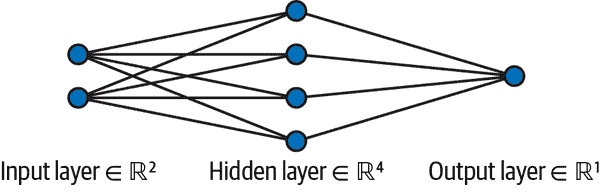

###### 图 8-1\. 人工神经网络的简单示意图。

人工神经网络中的每个神经元执行两个主要操作：

1.  神经元从上一层或直接从输入数据接收输入。每个输入乘以权重值，表示该连接的强度或重要性。加权输入然后求和。

1.  加权和之后，应用激活函数（下一节讨论）引入神经元输出的非线性。激活函数根据加权输入确定神经元的输出值。

在训练过程中，人工神经网络调整其连接的权重以改善其性能。通常通过迭代优化算法（如梯度下降）完成这一过程，其中网络的性能使用定义的损失函数进行评估。算法计算损失函数相对于网络权重的梯度，允许以最小化误差的方式更新权重。

**人工神经网络（ANNs）**具有从数据中学习和泛化的能力，使它们适用于诸如模式识别和回归的任务。随着深度学习的进展，具有多个隐藏层的人工神经网络在复杂任务上表现出色，利用其学习分层表示和捕捉数据中复杂模式的能力。

###### 注意

值得注意的是，从输入到输出的过程称为*前向传播*。

## 激活函数

在神经网络中，*激活函数*引入非线性到神经元的输出中，使神经网络能够建模复杂关系并从非线性数据中学习。它们根据输入的加权和确定神经元的输出。让我们详细讨论这些激活函数。

*Sigmoid 激活函数*将输入映射到 0 到 1 的范围内，适用于二元分类问题或作为阶跃函数的平滑近似。函数的数学表示如下：

<math alttext="upper S left-parenthesis x right-parenthesis equals StartFraction 1 Over 1 plus e Superscript negative x Baseline EndFraction"><mrow><mi>S</mi> <mrow><mo>(</mo> <mi>x</mi> <mo>)</mo></mrow> <mo>=</mo> <mfrac><mn>1</mn> <mrow><mn>1</mn><mo>+</mo><msup><mi>e</mi> <mrow><mo>-</mo><mi>x</mi></mrow></msup></mrow></mfrac></mrow></math>

图 8-2 展示了 Sigmoid 函数。

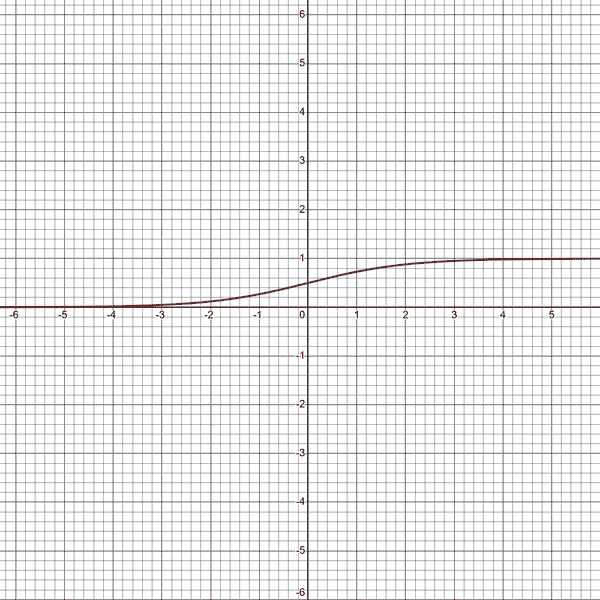

###### 图 8-2\. Sigmoid 函数的图形。

sigmoid 激活函数的优点包括以下几点：

+   它是一个既平滑又可微的函数，有助于基于梯度的优化算法。

+   它将输入压缩到有界范围内，可以解释为概率或置信水平。

但是，它也有其局限性：

+   它存在*梯度消失问题*，即梯度在极端输入值下变得非常小。这可能会阻碍学习过程。

+   输出不是零中心化的，这使得它在某些情况下不太适用，比如使用对称更新规则（如梯度下降）优化权重。

接下来的激活函数是*双曲正切函数*（tanh），你在第四章中见过。该函数的数学表示如下：

<math alttext="t a n h left-parenthesis x right-parenthesis equals StartFraction e Superscript x Baseline minus e Superscript negative x Baseline Over e Superscript x Baseline plus e Superscript negative x Baseline EndFraction"><mrow><mi>t</mi> <mi>a</mi> <mi>n</mi> <mi>h</mi> <mrow><mo>(</mo> <mi>x</mi> <mo>)</mo></mrow> <mo>=</mo> <mstyle displaystyle="false" scriptlevel="0"><mfrac><mrow><msup><mi>e</mi> <mi>x</mi></msup> <mo>-</mo><msup><mi>e</mi> <mrow><mo>-</mo><mi>x</mi></mrow></msup></mrow> <mrow><msup><mi>e</mi> <mi>x</mi></msup> <mo>+</mo><msup><mi>e</mi> <mrow><mo>-</mo><mi>x</mi></mrow></msup></mrow></mfrac></mstyle></mrow></math>

双曲正切函数的优点包括以下几点：

+   它类似于 sigmoid 函数，但是是零中心化的，这有助于减轻权重优化中非对称更新的问题。

+   其非线性可以捕捉比 sigmoid 函数更广泛的数据变化范围。

以下是它的一些局限性：

+   它遭受梯度消失问题，特别是在深度网络中。

+   输出仍然容易在极端情况下饱和，导致梯度接近零。

图 8-3 展示了双曲正切函数。

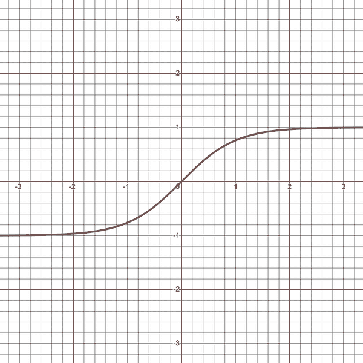

###### 图 8-3\. 双曲正切函数的图像。

接下来的函数称为*ReLU 激活函数*。ReLU 代表*修正线性单元*。该函数将负值设为零，保持正值不变。它高效且有助于避免梯度消失问题。该函数的数学表示如下：

<math alttext="f left-parenthesis x right-parenthesis equals m a x left-parenthesis 0 comma x right-parenthesis"><mrow><mi>f</mi> <mo>(</mo> <mi>x</mi> <mo>)</mo> <mo>=</mo> <mi>m</mi> <mi>a</mi> <mi>x</mi> <mo>(</mo> <mn>0</mn> <mo>,</mo> <mi>x</mi> <mo>)</mo></mrow></math>

ReLU 函数的优点包括以下几点：

+   它实现简单，只需取 0 和输入值的最大值。ReLU 的简单性导致比更复杂的激活函数更快的计算和训练。

+   它有助于缓解在深度神经网络训练中可能出现的梯度消失问题。ReLU 的导数要么是 0 要么是 1，这意味着梯度可以更自由地流动，避免随着网络深度增加而指数级变小。

该函数的局限性包括以下几点：

+   对于负输入值，它输出 0，这可能导致信息丢失。在某些情况下，具有能够产生负输出的激活函数可能是有益的。

+   它不是一个平滑的函数，因为它在 0 处的导数是不连续的。这可能会在某些场景下导致优化困难。

图 8-4 展示了 ReLU 函数。

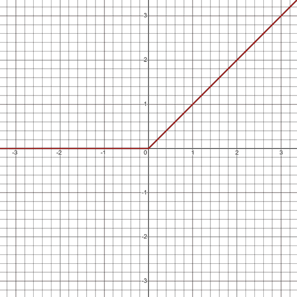

###### 图 8-4\. ReLU 函数的图像。

最后要讨论的激活函数是*泄漏整流线性单元激活函数*。该激活函数是 ReLU 函数的扩展，为负输入引入了一个小的斜率。该函数的数学表示如下：

<math alttext="f left-parenthesis x right-parenthesis equals m a x left-parenthesis 0.01 x comma x right-parenthesis"><mrow><mi>f</mi> <mo>(</mo> <mi>x</mi> <mo>)</mo> <mo>=</mo> <mi>m</mi> <mi>a</mi> <mi>x</mi> <mo>(</mo> <mn>0</mn> <mo lspace="0%" rspace="0%">.</mo> <mn>01</mn> <mi>x</mi> <mo>,</mo> <mi>x</mi> <mo>)</mo></mrow></math>

泄漏整流线性单元解决了 ReLU 中的死神经元问题，并允许负输入的某些激活，这有助于训练期间梯度的流动。

泄漏整流线性单元函数的优点包括以下几点：

+   它克服了 ReLU 可能出现的死神经元问题。通过为负输入引入一个小的斜率，泄漏整流线性单元确保即使神经元未被激活，它仍然可以在训练期间对梯度流做出贡献。

+   它是一个连续函数，即使在负输入值时也是如此。负输入的非零斜率允许激活函数在其输入范围内具有定义的导数。

函数的限制如下：

+   泄漏部分的斜率是一个需要手动设置的超参数。它需要仔细调整，以在避免死神经元的同时防止过多的泄漏，可能会阻碍激活函数的非线性。

+   尽管泄漏整流线性单元为负输入提供了非零响应，但在负激活水平方面，它与某些其他激活函数（如双曲正切（tanh）和 S 形函数）不同。在需要强烈的负激活响应的场景中，其他激活函数可能更合适。

图 8-5 展示了泄漏整流线性单元（leaky ReLU）函数。

你选择的激活函数取决于问题的性质、网络的结构以及网络中神经元的期望行为。

激活函数通常获取神经元输入的加权和，并对其应用非线性变换。转换后的值随后作为神经元的输出传递到网络的下一层。激活函数的具体形式和行为可能有所不同，但它们的整体目的是引入非线性，使网络能够学习数据中的复杂模式和关系。

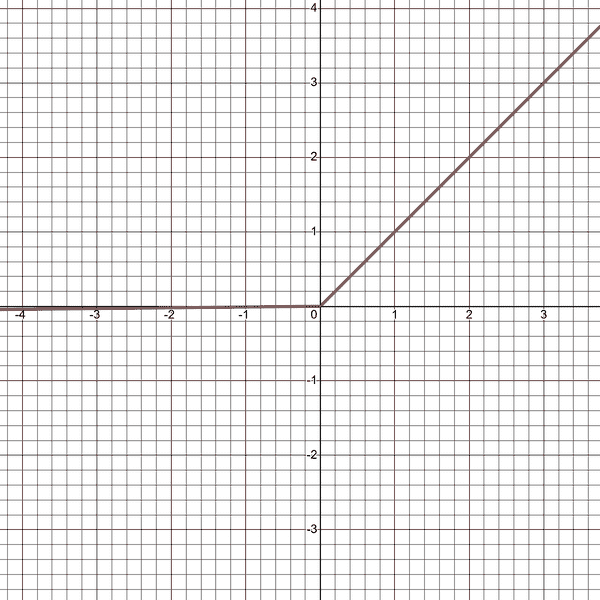

###### 图 8-5\. 泄漏整流线性单元函数的图示。

总之，激活函数通过引入非线性，对人工神经网络的计算起到关键作用。它们应用于单个神经元或中间层的输出，并根据其接收到的输入决定神经元是否应激活。如果没有激活函数，网络只能学习输入和输出之间的线性关系。然而，大多数现实世界的问题（特别是金融时间序列）涉及复杂的非线性关系，因此激活函数对于使神经网络有效地学习和表示这些关系至关重要。

## 反向传播

*反向传播* 是用于训练神经网络的基本算法。它使网络能够以最小化预测输出与期望输出之间差异的方式更新其权重。

###### 注意

反向传播是 *backward propagation of errors* 的简称。

训练神经网络包括以下步骤：

1.  随机初始化神经网络的权重和偏置。这使得在没有初始信息时能够迈出第一步。

1.  执行 *forward propagation*，一种计算网络给定输入的预测输出的技术。作为提醒，这一步包括计算每个神经元输入的加权和，应用激活函数到加权和，将值传递到下一层（如果不是最后一层），并继续这个过程直到达到输出层（预测）。

1.  将预测输出与实际输出（测试数据）进行比较并计算损失，表示它们之间的差异。选择损失函数（如 MAE 或 MSE）取决于正在解决的具体问题。

1.  执行反向传播计算损失相对于权重和偏置的梯度。在这一步中，算法将从输出层（最后一层）开始向后传播。它将计算当前层每个神经元输出相对于损失的梯度。然后，通过应用链式法则，它将计算当前层每个神经元输入加权和相对于损失的梯度。之后，它将使用前面步骤的梯度计算当前层每个神经元的权重和偏置相对于损失的梯度。这些步骤重复直到所有层的梯度都计算完成。

1.  使用计算得到的梯度和选择的优化算法在特定数量的数据批次上更新网络的权重和偏置，由超参数（称为批量大小）控制。更新权重是通过减去学习率和权重梯度的乘积。调整偏置是通过减去学习率和偏置梯度的乘积。重复上述步骤直到所有层的权重和偏置都更新完成。

1.  算法然后重复步骤 2–5 特定数量的 epochs 或者直到达到收敛标准。一个 *epoch* 代表一次完整通过整个训练数据集（理想情况下整个过程通过训练数据集多次进行）。

1.  训练完成后，评估训练好的神经网络在单独的验证或测试数据集上的表现。

###### 注意

*学习率*是一个超参数，确定在训练过程中更新神经网络权重的步长。它控制模型从正在训练的数据中学习的速度。

*批量大小*是一个超参数，确定在训练过程的每次迭代中更新模型权重时处理的样本数量。换句话说，它指定了每次用于计算梯度并更新权重的训练样例数量。

选择适当的批量大小对有效训练至关重要，可以影响收敛速度和内存需求。没有适合所有情况的理想批量大小，因为它取决于诸如数据集大小、可用的计算资源和模型复杂性等各种因素。

用于训练 MLP 的常用批量大小范围从小值（如 16、32 或 64）到较大值（如 128、256 或更大）。较小的批量大小可以提供更频繁的权重更新，并可能有助于模型更快地收敛，特别是当数据集很大或具有很多变化时。然而，较小的批量大小可能会引入更多噪声，并由于使用不太准确的梯度进行频繁更新而导致收敛速度较慢。另一方面，较大的批量大小可以提供更稳定的梯度和更好的并行处理能力利用，从而在现代硬件上实现更快的训练。然而，它们可能需要更多的内存，并且更新较少频繁，这可能会减慢收敛速度或使训练过程不够稳健。

作为一个经验法则，您可以从适度的批量大小，如 32 开始，并尝试不同的值，以找到您特定的 MLP 模型和数据集的收敛速度和计算效率之间的最佳平衡。

反向传播算法利用链式法则（参见第四章了解微积分的更多信息），通过网络向后传播错误来计算梯度。

通过根据通过网络向后传播的错误迭代调整权重，反向传播使网络能够随着时间的推移学习并改善其预测能力。反向传播是训练神经网络的关键算法，并在各个领域的显著进展中发挥了作用。

## 优化算法

在神经网络中，优化算法，也称为*优化器*，用于在训练过程中更新网络的参数（权重和偏置）。这些算法旨在最小化损失函数，并找到使网络性能最佳的参数的最优值。有几种类型的优化器：

梯度下降（GD）

梯度下降是最基础的优化算法。它根据损失函数关于参数的梯度的方向更新网络的权重和偏置。它通过步长与梯度的负值成比例来调整参数。

随机梯度下降（SGD）

随机梯度下降（SGD）是梯度下降的一种变体，它随机选择单个训练样本或小批量样本来计算梯度并更新参数。它提供了一种计算效率高的方法，并在训练过程中引入噪声，有助于逃离局部最优解。

自适应矩估计（Adam）

Adam 是一种自适应优化算法，它根据梯度的一阶和二阶矩估计计算每个参数的自适应学习率。由于其在各种应用中的高效性和有效性，Adam 得到了广泛应用。

均方根传播（RMSprop）

RMSprop 的目的是解决标准梯度下降算法的一些限制，例如收敛速度慢和在不同方向上的振荡。RMSprop 根据最近平方梯度的平均值调整每个参数的学习率。它会计算随时间指数加权移动平均的平方梯度。

每种优化器都有其独特的特性、优势和限制，它们的性能可以根据数据集和网络架构而异。通常需要进行实验和调优，以确定特定任务的最佳优化器。

## 正则化技术

*神经网络中的正则化技术* 是用于防止过拟合的方法，过拟合可能导致模型性能不佳，并减少模型在新样本上进行准确预测的能力。正则化技术有助于控制神经网络的复杂性，并提高其泛化到未见数据的能力。

*Dropout* 是神经网络中常用的正则化技术，用于防止过拟合（详见第七章关于过拟合的详细信息）。在训练过程中，它通过随机地省略（丢弃）部分神经元的输出（将其设置为零）来实现。这暂时从网络中删除神经元及其相应的连接，迫使剩余神经元学习更加健壮和独立的表示。

Dropout 的关键思想是它充当模型平均或集成学习的形式。通过随机丢弃神经元，网络减少对特定神经元或连接的依赖，从而学习更加健壮的特征。Dropout 还有助于防止神经元的共适应，即某些神经元过度依赖其他神经元，降低它们的个体学习能力。因此，Dropout 可以提高网络的泛化能力并减少过拟合。

*早停止* 是一种技术，它通过在训练过程中监控模型在验证集上的表现来防止过拟合。当模型在验证集上的表现开始恶化时，它会停止训练过程。早停止的理念是随着模型继续训练，它可能开始对训练数据过拟合，从而导致在未见数据上的性能下降。

训练过程通常分为若干个周期，每个周期代表对训练数据的完整遍历。在训练过程中，每个周期后评估模型在验证集上的表现。如果验证损失或选择的度量开始连续恶化达到一定数量的周期，训练将停止，并使用性能最佳时期的模型参数作为最终模型。

早停止通过找到模型学习最有用模式的最佳点来帮助防止过拟合，而不是记忆训练数据中的噪声或无关紧要的细节。辍学和早停止都是防止过拟合和帮助稳定模型的关键正则化技术。

## 多层感知器

*多层感知器*（MLP）是一种包含多层人工神经元或节点、按顺序排列的 ANN 类型。它是*前馈神经网络*，意味着信息在网络中单向流动，从输入层到输出层，没有任何循环或反馈连接（您将在后面的“递归神经网络”中学到更多）。

MLP 的基本构建块是*感知器*，它是一种人工神经元，接受多个输入，对这些输入应用权重，执行加权和，并通过激活函数产生输出（基本上是您已经见过的神经元）。MLP 包含多个按层组织的感知器。它通常包括一个输入层，一个或多个隐藏层（层数越多，学习过程越深入，直到某个点），以及一个输出层。

###### 注意

术语*感知器*有时更广泛地用于指称基于感知器类似架构的单层神经网络。在此背景下，术语*感知器*可以与*神经网络*或*单层感知器*交替使用。

作为提醒，输入层接收原始输入数据，例如数据集中的特征（例如移动平均的稳定值）。隐藏层位于输入层和输出层之间，对输入数据执行复杂的变换。隐藏层中的每个神经元从前一层的所有神经元接收输入，应用权重，执行加权和，并通过激活函数传递结果。输出层生成网络的最终输出。

MLP 使用反向传播进行训练，它调整网络中神经元的权重，以最小化预测输出与期望输出之间的差异。它们以能够学习数据中复杂的非线性关系而闻名，使它们适用于各种任务，包括模式识别。图 8-6 显示了深度 MLP 架构的示例。

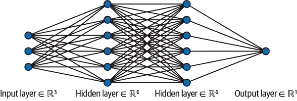

###### 图 8-6\. 一个具有两个隐藏层的 MLP 的简单示例。

在这个阶段，您应该理解深度学习基本上就是具有许多隐藏层的神经网络，这增加了学习过程的复杂性。

###### 注

从本书的 [GitHub 仓库](https://oreil.ly/5YGHI) 下载 *master_function.py* 是很重要的，以便访问本书中看到的函数。下载后，您必须将 Python 解释器的目录设置为存储 *master_function.py* 的路径。

本节旨在创建一个多层感知器（MLP）来预测每日标准普尔 500 指数的收益。导入所需的库：

```py
from keras.models import Sequential
from keras.layers import Dense
import keras
import numpy as np
import matplotlib.pyplot as plt
import pandas_datareader as pdr
from master_function import data_preprocessing, plot_train_test_values
from master_function import calculate_accuracy, model_bias
from sklearn.metrics import mean_squared_error

```

现在导入历史数据并进行转换：

```py
# Set the start and end dates for the data
start_date = '1990-01-01'
end_date   = '2023-06-01'
# Fetch S&P 500 price data
data = np.array((pdr.get_data_fred('SP500', start = start_date, 
                                   end = end_date)).dropna())
# Difference the data and make it stationary
data = np.diff(data[:, 0])

```

为模型设置超参数：

```py
num_lags = 100
train_test_split = 0.80
num_neurons_in_hidden_layers = 20
num_epochs = 500
batch_size = 16
```

使用数据预处理函数创建四个所需的数组：

```py
# Creating the training and test sets
x_train, y_train, x_test, y_test = data_preprocessing(data, num_lags, 
                                                      train_test_split)

```

下面的代码块显示了如何在 *keras* 中构建 MLP 架构。确保您理解代码中的注释：

```py
# Designing the architecture of the model
model = Sequential()
# First hidden layer with ReLU as activation function
model.add(Dense(num_neurons_in_hidden_layers, input_dim = num_lags, 
                activation = 'relu'))  
# Second hidden layer with ReLU as activation function
model.add(Dense(num_neurons_in_hidden_layers, activation = 'relu'))  
# Output layer
model.add(Dense(1))
# Compiling
model.compile(loss = 'mean_squared_error', optimizer = 'adam')
# Fitting the model
model.fit(x_train, np.reshape(y_train, (–1, 1)), epochs = num_epochs, 
          batch_size = batch_size)
# Predicting in-sample
y_predicted_train = np.reshape(model.predict(x_train), (–1, 1))
# Predicting out-of-sample
y_predicted = np.reshape(model.predict(x_test), (–1, 1))

```

###### 注

在创建 `Dense` 层时，需要在神经网络的第一层中指定 `input_dim` 参数。对于后续的 `Dense` 层，`input_dim` 将自动从上一层的输出中推断出来。

让我们绘制结果并分析性能：

```py
Accuracy Train =  92.4 %
Accuracy Test =  54.85 %
RMSE Train =  4.3602984254
RMSE Test =  75.7542774467
Correlation In-Sample Predicted/Train =  0.989
Correlation Out-of-Sample Predicted/Test =  0.044
Model Bias =  1.03

```

图 8-7 显示了从 `y_train` 的最后值到 `y_test` 和 `y_predicted` 的第一个值的预测任务的演变。

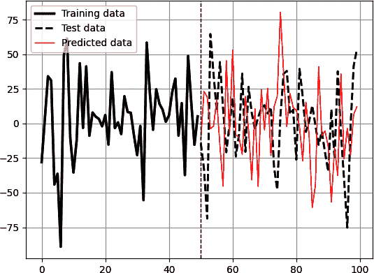

###### 图 8-7\. 训练数据后跟测试数据（虚线）和预测数据（细线）；垂直虚线表示测试期的开始。所使用的模型是 MLP 回归算法。

当更改超参数时，结果非常波动。这就是为什么在复杂数据上使用复杂模型需要大量的调整和优化。考虑以下改进来增强模型结果：

+   选择相关特征（输入），捕获金融时间序列的潜在模式和特征。这可以涉及计算技术指标（例如，移动平均线和相对强弱指数）或从数据中推导出其他有意义的变量。

+   审查模型的架构。考虑增加层数或神经元数量，以为模型提供更多学习复杂模式的能力。尝试不同的激活函数和正则化技术，如丢失和提前停止（见 第九章 中正则化技术的应用）。

+   调整你的 MLP 模型的超参数。像批量大小和 epoch 数这样的参数可以显著影响模型的收敛能力和泛化能力。

+   将多个 MLP 模型组合成一个集成模型。这可以涉及使用不同的初始化训练多个模型或使用数据的不同子集。聚合它们的预测结果可能比使用单个模型获得更好的结果。

随着模型训练，由于学习过程，损失函数应该会减少。可以通过以下代码来查看（在编译模型后运行）：

```py
import tensorflow as tf
losses = []
epochs = []
class LossCallback(tf.keras.callbacks.Callback):
    def on_epoch_end(self, epoch, logs = None):
        losses.append(logs['loss'])
        epochs.append(epoch + 1)
        plt.clf()
        plt.plot(epochs, losses, marker = 'o')
        plt.title('Loss Curve')
        plt.xlabel('Epoch')
        plt.ylabel('Loss Value')
        plt.grid(True)
        plt.pause(0.01)
model.fit(x_train, np.reshape(y_train, (–1, 1)), epochs = 100, 
          verbose = 0, callbacks = [LossCallback()])
plt.show()

```

前面的代码块绘制了每个 epoch 结束时的损失，从而创建了一个实时可视化的动态损失曲线。注意看它如何下降，直到达到一个难以进一步降低的平台期。图 8-8 展示了跨 epoch 的损失函数下降情况。

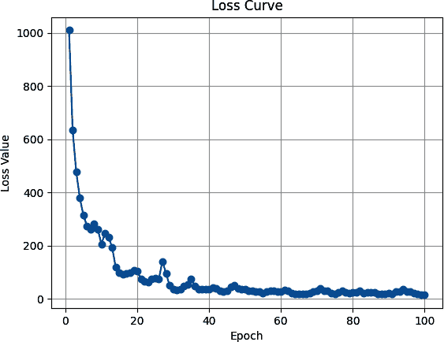

###### 图 8-8\. 跨 epoch 的损失值。

# 循环神经网络

*循环神经网络*（RNN）是一种设计用来处理序列数据或具有时间依赖性数据的人工神经网络类型。与前馈神经网络不同，后者只需单次通过从输入到输出处理数据，RNN 维护内部记忆或隐藏状态，以捕获先前输入的信息，并在处理后续输入时利用它。

RNN 的关键特征是*递归连接*的存在，这在网络中创建了一个循环。这个循环允许网络跨时间步保持信息，使其非常适合处理涉及顺序或时间相关数据的任务。

在每个时间步，RNN 接收一个输入向量并将其与前一个隐藏状态组合。然后应用激活函数计算新的隐藏状态并产生一个输出。此过程针对每个时间步重复进行，更新隐藏状态并将其作为信息传递到网络中。

递归连接使得 RNN 能够捕捉序列数据中的依赖关系和模式。它们可以建模数据的上下文和时间动态，因此在时间序列预测中非常有用。

然而，传统的 RNN 存在梯度消失问题，即通过递归连接反向传播的梯度可能变得非常小或非常大，导致训练网络困难。下一节将使用一种增强型神经网络来解决梯度消失问题。现在，让我们专注于 RNN 及其特性。

图 8-9 展示了一个循环神经网络（RNN）架构的示例。

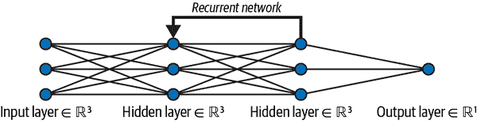

###### 图 8-9\. 一个包含两个隐藏层的简单循环神经网络示例。

让我们部署一个 RNN 算法来预测标准普尔 500 指数的日回报率。像往常一样，导入所需的库：

```py
from keras.models import Sequential
from keras.layers import Dense, SimpleRNN
import keras
import numpy as np
import matplotlib.pyplot as plt
import pandas_datareader as pdr
from master_function import data_preprocessing, plot_train_test_values
from master_function import calculate_accuracy, model_bias
from sklearn.metrics import mean_squared_error

```

现在设置模型的超参数：

```py
num_lags = 100
train_test_split = 0.80
num_neurons_in_hidden_layers = 20
num_epochs = 500
batch_size = 16

```

下面的代码块展示了如何在*keras*中构建 RNN 架构。

```py
# Designing the architecture of the model
model = Sequential()
# First hidden layer
model.add(Dense(num_neurons_in_hidden_layers, input_dim = num_lags, 
                activation = 'relu'))  
# Second hidden layer
model.add(Dense(num_neurons_in_hidden_layers, activation = 'relu'))  
# Output layer
model.add(Dense(1))
# Compiling
model.compile(loss = 'mean_squared_error', optimizer = 'adam')
# Fitting the model
model.fit(x_train, np.reshape(y_train, (–1, 1)), epochs = num_epochs, 
          batch_size = batch_size)
# Predicting in-sample
y_predicted_train = np.reshape(model.predict(x_train), (–1, 1))
# Predicting out-of-sample
y_predicted = np.reshape(model.predict(x_test), (–1, 1))

```

让我们绘制结果并分析性能：

```py
Accuracy Train =  67.16 %
Accuracy Test =  52.11 %
RMSE Train =  22.7704952044
RMSE Test =  60.3443059267
Correlation In-Sample Predicted/Train =  0.642
Correlation Out-of-Sample Predicted/Test =  –0.022
Model Bias =  2.18

```

图 8-10 展示了从`y_train`的最后值到`y_test`和`y_predicted`的第一个值的预测任务的演变。

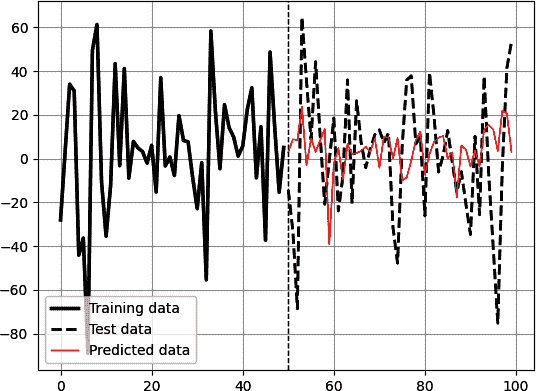

###### 图 8-10。训练数据后跟测试数据（虚线）和预测数据（细线）；垂直虚线表示测试期的开始。所使用的模型是 RNN 回归算法。

###### 提示

你可以做的一个好任务是创建一个优化函数，循环尝试不同的超参数并选择最佳的或对最佳的进行平均。这样，你可能能够基于集成技术获得一个健壮的模型。你还可以对不同的市场和不同的时间范围进行回测。请注意，这些技术不仅适用于金融时间序列，而且适用于所有类型的时间序列。

总之，RNN 是能够通过维护内部记忆并捕捉时间依赖关系处理序列数据的神经网络。它们对涉及时间序列或顺序数据的任务是强大的模型。作为提醒，稳定性是成功进行时间序列预测的重要属性。稳定的时间序列在时间上展现出恒定的均值、方差和自协方差。RNN（以及其他深度学习模型）假设底层时间序列是稳定的，这意味着数据的统计特性随时间不变。如果时间序列是非稳定的，它可能包含趋势、季节性或其他可能影响 RNN 性能的模式。MLP 的优化和增强建议在 RNN 上也是有效的。

# 长短期记忆网络（LSTM）

*长短期记忆*（LSTM）是一种能够解决梯度消失问题并允许网络捕捉序列数据中长期依赖的 RNN 类型。LSTM 由 Hochreiter 和 Schmidhuber 于 1997 年提出。

LSTM 旨在克服传统 RNN 在处理长序列数据时的局限性。它通过引入特殊的记忆细胞来实现在扩展时间段内保持信息的能力。LSTM 背后的关键思想是利用门控机制来控制信息在记忆细胞中的流动。

LSTM 结构由记忆细胞、输入门、遗忘门和输出门组成。记忆细胞在每个时间步存储和更新信息，而门控制信息的流动。以下是 LSTM 的工作原理：

输入门

输入门决定当前时间步的哪些信息应存储在记忆细胞中。它将当前输入和上一个隐藏状态作为输入，然后应用 Sigmoid 激活函数为记忆细胞的每个组件生成一个介于 0 和 1 之间的值。

忘记门

忘记门确定应从上一个记忆单元中遗忘哪些信息。它接受当前输入和上一个隐藏状态作为输入，然后应用 Sigmoid 激活函数以生成遗忘向量。然后，该向量与先前的记忆单元值逐元素相乘，允许 LSTM 遗忘无关信息。

更新

更新步骤结合了输入门和遗忘门的信息。它接受当前输入和上一个隐藏状态作为输入，然后应用 tanh 激活函数。然后，将得到的向量与输入门输出逐元素相乘，并将乘积添加到遗忘门和先前记忆单元值的乘积中。此更新操作确定要存储在记忆单元中的新信息。

输出门

输出门确定当前时间步的 LSTM 输出。它接受当前输入和上一个隐藏状态作为输入，然后应用 Sigmoid 激活函数。更新后的记忆单元值通过双曲正切(tanh)激活函数传递，并与输出门逐元素相乘。得到的向量成为当前隐藏状态，也是该时间步的 LSTM 输出。

LSTM 中的门控机制使其能够有选择地记住或遗忘长序列中的信息，使其非常适合涉及长期依赖关系的任务。通过解决梯度消失问题并捕捉长期依赖关系，LSTM 已成为顺序数据处理的流行选择，并在推动深度学习领域方面发挥了重要作用。

###### 注意

理论上，RNN 能够学习长期依赖关系，但在实践中并不会，因此需要 LSTM。

通常情况下，让我们将 LSTM 应用于相同的时间序列问题。然而，请注意，由于解释变量是任意的且超参数未调整，因此结果并无意义。进行这样的练习的目的是理解代码和算法背后的逻辑。之后，由您来选择值得测试的输入和变量。

如下导入所需的库：

```py
from keras.models import Sequential
from keras.layers import Dense, LSTM
import keras
import numpy as np
import matplotlib.pyplot as plt
import pandas_datareader as pdr
from master_function import data_preprocessing, plot_train_test_values
from master_function import calculate_accuracy, model_bias
from sklearn.metrics import mean_squared_error

```

现在设置模型的超参数：

```py
num_lags = 100
train_test_split = 0.80
num_neurons_in_hidden_layers = 20
num_epochs = 100
batch_size = 32

```

LSTM 模型需要特征的三维数组。可以使用以下代码完成：

```py
x_train = x_train.reshape((–1, num_lags, 1))
x_test = x_test.reshape((–1, num_lags, 1))
```

下面的代码块显示了如何在*keras*中构建 LSTM 架构：

```py
# Create the LSTM model
model = Sequential()
# First LSTM layer
model.add(LSTM(units = num_neurons_in_hidden_layers, 
               input_shape = (num_lags, 1)))
# Second hidden layer
model.add(Dense(num_neurons_in_hidden_layers, activation = 'relu'))  
# Output layer
model.add(Dense(units = 1))
# Compile the model
model.compile(loss = 'mean_squared_error', optimizer = 'adam')
# Train the model
model.fit(x_train, y_train, epochs = num_epochs, batch_size = batch_size)
# Predicting in-sample
y_predicted_train = np.reshape(model.predict(x_train), (–1, 1))
# Predicting out-of-sample
y_predicted = np.reshape(model.predict(x_test), (–1, 1))

```

让我们绘制结果并分析性能：

```py
Accuracy Train =  65.63 %
Accuracy Test =  50.42 %
RMSE Train =  25.5619843783
RMSE Test =  55.1133475721
Correlation In-Sample Predicted/Train =  0.515
Correlation Out-of-Sample Predicted/Test =  0.057
Model Bias =  2.56

```

图 8-11 显示了从`y_train`的最后值到`y_test`和`y_predicted`的第一个值的预测任务的演变。请注意，超参数与 RNN 模型中使用的相同。

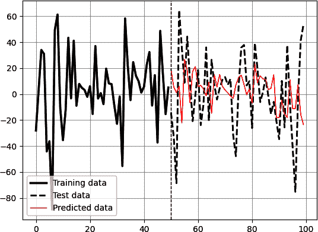

###### 图 8-11\. 训练数据后跟测试数据（虚线）和预测数据（细线）；垂直虚线表示测试期的开始。所使用的模型是 LSTM 回归算法。

值得一看的是算法如何与训练数据拟合良好。图 8-12 展示了来自 `y_predicted_train` 和 `y_train` 的值。

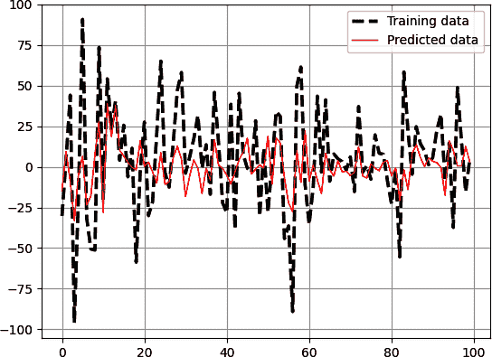

###### 图 8-12\. 使用 LSTM 回归算法的样本内预测。

在 LSTM 的上下文中，一个三维数组表示输入数据的形状，这些数据被馈送到模型中。它通常用于容纳顺序或时间序列数据的输入序列。三维数组的维度具有特定的含义：

维度 1（样本数）

这个维度代表数据集中的样本或示例数量。每个样本对应于一个特定的序列或时间序列实例。例如，如果你的数据集中有 1,000 个时间序列，那么维度 1 就是 1,000。

维度 2（时间步）

这个维度代表每个序列中的时间步或数据点的数量。它定义了 LSTM 或 RNN 模型在每个时间步处理的输入序列的长度。例如，如果你的输入序列长度为 10 个时间步，那么维度 2 就是 10。

维度 3（特征数）

这个维度代表与每个时间步的序列相关联的特征或变量的数量。它定义了每个时间步数据的维度。对于单变量时间序列数据，其中每个时间步只考虑一个单一值，维度 3 通常为 1。对于多变量时间序列，其中每个时间步观察到多个变量，维度 3 将大于 1。

让我们稍作休息，讨论一个有趣的话题。使用简单的线性算法来建模复杂的非线性关系很可能会产生糟糕的结果。与此同时，在简单且可预测的数据上使用像 LSTM 这样极其复杂的方法可能并非必要，尽管它可能会带来积极的结果。图 8-13 展示了一个看起来像是在正常间隔内振荡的升序时间序列。

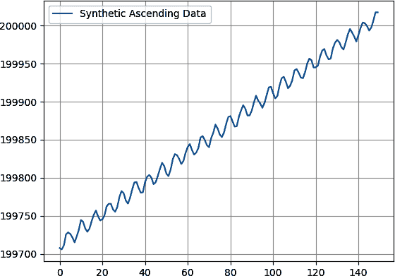

###### 图 8-13\. 一个生成的带有振荡特性的升序时间序列。

信不信由你，线性回归实际上可以很好地对这种原始时间序列进行建模。通过假设一个具有 100 个特征的自回归模型（这意味着为了预测下一个值，模型查看最后 100 个值），线性回归算法可以在样本内数据上训练，并输出在 图 8-14 中展示的样本外结果。

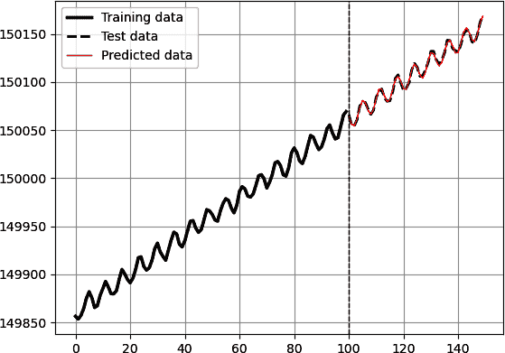

###### 图 8-14\. 使用线性回归对升序时间序列进行预测。

但让我们首先对其进行一阶差分，使其平稳化。 看看图 8-15，显示了从图 8-13 中差分时间序列创建的平稳时间序列。

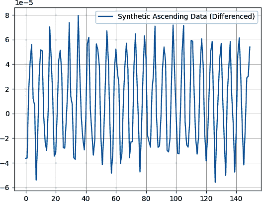

###### 图 8-15\. 生成的具有振荡特性的上升时间序列（差分）。

线性回归算法可以在样本内数据上进行训练，并输出在图 8-16 中显示的样本外结果，精度极高。

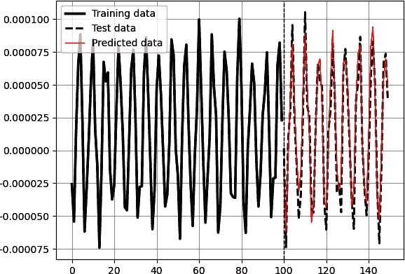

###### 图 8-16\. 使用线性回归进行差分时间序列预测。

评估线性回归模型拟合优度的另一种方法是使用 R²。也称为*决定系数*，*R²*是一个统计量，指示因变量方差中可以通过回归模型中的自变量解释的比例。

R²的取值范围从 0 到 1，并经常以百分比形式表示。 值为 0 表示自变量不能解释因变量的任何变异性，而值为 1 表示自变量可以完全解释因变量的变异性。

简单来说，R²表示可以归因于模型中包含的独立变量的因变量变异性的比例。它提供了回归模型拟合观察数据的程度的度量。然而，它并不表示变量之间的因果关系或模型的整体质量。 值得注意的是，R²是两个变量之间的平方相关性。 差异化时间序列的 R²指标为 0.935，表明非常良好的拟合度。

同时，使用一些优化的 MLP 也能产生良好的结果。 图 8-17 展示了在使用简单 MLP 模型（每个包含 24 个神经元的两个隐藏层和批大小为 128 经过 50 个 epochs 运行）时，使用差分值的结果。

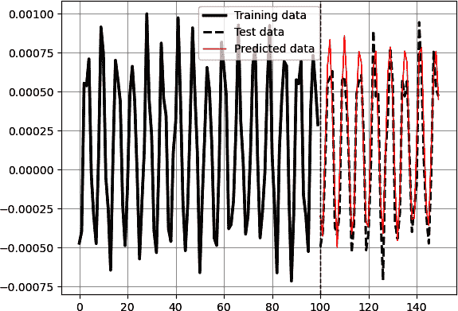

###### 图 8-17\. 使用 MLP 进行差分时间序列预测。

然而，使用深度学习方法预测这样一个简单时间序列可能并不值得增加复杂性。

# 时间卷积神经网络

*卷积神经网络* (CNNs) 是一类专为处理结构化网格数据设计的深度学习模型，特别强调处理图像和其他网格数据，如时间序列（使用较少）和音频频谱图。 CNNs 擅长从输入数据中学习和提取层次化模式和特征，使它们成为图像识别、物体检测、图像分割等任务的强大工具。

CNN 的核心构建模块是*卷积层*。这些层通过将一组可学习的滤波器应用于输入数据来执行卷积运算，生成捕获相关空间模式和局部依赖性的特征图。CNN 的另一个重要概念是*池化层*，这些层对卷积层生成的特征图进行降采样。常见的池化操作包括*最大池化*（选择邻域内的最大值）和*平均池化*（计算平均值）。池化有助于减少空间维度，提取主要特征，并提高计算效率。

###### 注意

专门用于时间序列预测的 CNN 通常称为 1D-CNN 或*时序卷积网络*。

术语*1D-CNN*表示卷积操作应用于输入数据的时间维度，这是时间序列数据的特征。这使其与传统的在空间维度上进行任务（如图像识别）的 CNN 有所不同。

典型的 CNN 架构包括三个主要组件：输入层，若干交替的卷积和池化层，以及最后的全连接层。卷积层负责特征提取，而池化层则降采样数据。全连接层提供最终的预测。

CNN 的架构可以根据具体任务的不同而大不相同。这些架构通常采用额外的技术，如 dropout 正则化来提高性能并解决过拟合等挑战。

CNN 可以通过利用其捕捉局部模式和从输入数据中提取相关特征的能力用于时间序列预测。该过程的框架如下：

1.  CNN 使用卷积层进行局部特征提取。卷积层由一组可学习的滤波器组成，这些滤波器与输入数据进行卷积。每个滤波器通过滑动窗口方式进行元素级乘法和求和，从输入数据的不同位置提取不同的特征。结果是一个在输入数据中不同位置突出显示重要模式或特征的特征图。

1.  池化层通常在卷积层之后使用，以减少特征图的空间维度。最大池化是一种常见的技术，其中选择局部邻域内的最大值，有效地对特征图进行降采样。池化有助于捕获最显著的特征，同时减少计算复杂性并增强网络的泛化能力。

1.  在卷积和池化层之后，生成的特征图通常被展平为一维向量。这种展平操作将空间分布的特征转换为线性序列，然后可以传递到全连接层。

1.  全连接层接收扁平化特征向量作为输入，并学习将其映射到所需的输出。这些层使网络能够学习输入特征和目标预测之间的复杂组合关系。最后一个全连接层通常代表输出层，用于预测时间序列的目标值。

在进行算法创建步骤之前，让我们回顾一些在 CNN 中使用的关键概念。在使用 CNN 进行时间序列预测时，*滤波器*沿着输入数据的时间维度应用。与考虑图像数据中的空间特征不同，这些滤波器旨在捕获时间序列内的时间模式或依赖关系。每个滤波器在时间序列上滑动，一次处理一组连续的时间步长子集。该滤波器学习在输入数据中检测特定的时间模式或特征。例如，它可能捕获短期趋势、季节性或对预测任务有关的重复模式。每个卷积层可以使用多个滤波器，使网络能够学习多样化的时间特征。每个滤波器捕获时间序列的不同方面，使模型能够捕获复杂的时间关系。

另一个概念是*卷积核大小*，它指的是在卷积操作期间滤波器考虑的连续时间步长的长度或数量。它定义了滤波器的接受域，并影响所提取的时间模式的大小。选择卷积核大小取决于时间序列数据的特性和要捕获的模式。较小的卷积核大小，如 3 或 5，专注于捕获短期模式，而较大的卷积核大小，如 7 或 10，则适合捕获长期依赖关系。通过尝试不同的卷积核大小，可以帮助确定捕获准确预测所需的相关时间模式的最佳接受域。通常使用具有不同卷积核大小的多个卷积层来捕获各种时间尺度上的模式。

现在让我们看看如何创建一个时间 CNN 来预测 S&P 500 的回报，使用其滞后值。如下导入所需的库：

```py
from keras.models import Sequential
from keras.layers import Conv1D, MaxPooling1D, Flatten, Dense
import keras
import numpy as np
import matplotlib.pyplot as plt
import pandas_datareader as pdr
from master_function import data_preprocessing, plot_train_test_values
from master_function import calculate_accuracy, model_bias
from sklearn.metrics import mean_squared_error

```

接下来，设置模型的超参数：

```py
num_lags = 100 
train_test_split = 0.80 
filters = 64 
kernel_size = 4
pool_size = 2
num_epochs = 100 
batch_size = 8

```

将特征数组重塑为三维数据结构：

```py
x_train = x_train.reshape((–1, num_lags, 1))
x_test = x_test.reshape((–1, num_lags, 1))
```

现在创建时间卷积网络（TCN）的架构并运行算法：

```py
# Create the temporal convolutional network model
model = Sequential()
model.add(Conv1D(filters = filters, kernel_size = kernel_size, 
                 activation = 'relu', input_shape = (num_lags, 1)))
model.add(MaxPooling1D(pool_size = pool_size))
model.add(Flatten())
model.add(Dense(units = 1))
# Compile the model
model.compile(loss = 'mean_squared_error', optimizer = 'adam')
# Train the model
model.fit(x_train, y_train, epochs = num_epochs , batch_size = batch_size)
# Predicting in-sample
y_predicted_train = np.reshape(model.predict(x_train), (–1, 1))
# Predicting out-of-sample
y_predicted = np.reshape(model.predict(x_test), (–1, 1))

```

让我们绘制结果并分析性能：

```py
Accuracy Train =  68.9 %
Accuracy Test =  49.16 %
RMSE Train =  18.3047790152
RMSE Test =  63.4069105299
Correlation In-Sample Predicted/Train =  0.786
Correlation Out-of-Sample Predicted/Test =  0.041
Model Bias =  0.98

```

图 8-18 显示了从`y_train`的最后值到`y_test`和`y_predicted`的第一个值的预测任务演变。

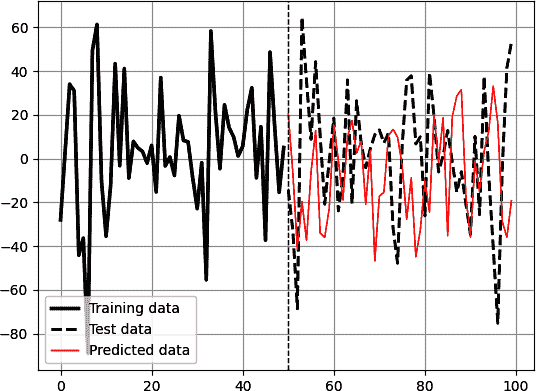

###### 图 8-18\. 训练数据后跟测试数据（虚线）和预测数据（细线）；垂直虚线表示测试期的开始。所使用的模型是 CNN 回归算法。

使用反映您选择的性能指标并寻找更好算法是很重要的。准确率可能是一个基本指标，能够快速了解模型的预测能力，但仅靠它是不够的。本章中的结果仅反映了使用选定超参数进行的训练。优化将使您能够在某些模型上获得非常好的结果。

###### 注意

没有严格的规定定义神经网络需要多少隐藏层才能被视为深度神经网络。然而，一个常见的约定是，具有两个或更多隐藏层的神经网络通常被认为是深度神经网络。

# 摘要

将深度学习算法应用于时间序列数据可以带来几个好处和挑战。深度学习算法在时间序列分析中展示了巨大的效用，通过有效捕捉复杂模式、提取有意义的特征和进行准确预测。然而，它们的成功很大程度上取决于数据的质量和所选择的特征。

将深度学习算法应用于时间序列数据的效用源于它们能够自动学习层次化表示和模拟复杂的时间依赖关系。它们能够处理非线性关系并捕捉局部和全局模式，使其适用于诸如预测、异常检测、分类和信号处理等广泛的时间序列任务。

然而，将深度学习算法应用于时间序列可能面临挑战：

数据质量

深度学习模型在训练时严重依赖大量高质量的标记数据。数据不足或噪声过多可能会影响模型的性能，导致预测不准确或洞察不可靠。数据预处理、清洗和处理缺失值成为确保数据质量的关键步骤。

特征工程

深度学习模型可以自动从数据中学习相关特征。然而，选择和提取信息性特征对模型的性能有重要影响。领域知识、数据探索和特征工程技术在选择或转换能够增强模型捕捉相关模式的特征方面至关重要。

模型复杂性

深度学习模型通常非常复杂，具有大量参数。训练这样的模型需要大量的计算资源、较长的训练时间和精细的超参数调整。过拟合是一个常见的挑战，即模型只记住了训练数据，而无法很好地推广到未见过的数据。

可解释性

深度学习模型通常被视为神秘盒子，这使得解释学习到的表示和理解预测背后的推理过程具有挑战性。在金融等领域，解释性和可解释性至关重要，这可能是一个问题。

要克服这些挑战并利用深度学习算法进行时间序列分析，需要仔细考虑数据质量、适当的特征工程、模型架构选择、正则化技术和解释性方法。理解时间序列数据的特定特征和任务要求是选择和调整深度学习方法的关键。

^(1) W. S. McCulloch 和 W. Pitts，《神经活动中的思想的逻辑演算》，*Bulletin of Mathematical Biophysics* 5 (1943): 115–33.
