# 第九章：时间序列预测的深度学习 II

本章介绍了一些技术和方法，用于补充机器学习和深度学习算法的预测任务。它由不同的主题组成，每个主题讨论一种改进和优化流程的方法。此时，您应该对机器学习和深度学习模型的基础知识有了扎实的理解，并且知道如何编写一个基本的算法来预测金融时间序列（或任何平稳时间序列）。本章弥合了基础知识和提升算法到功能水平所需的高级知识之间的差距。

# 分数阶微分

在他的书籍*金融机器学习进展*中，马科斯·洛佩斯·德普拉多描述了一种将非平稳数据转换为平稳数据的技术。这称为分数阶微分。

*分数阶微分*是一种数学技术，用于将时间序列转化为平稳序列，同时保留部分其记忆。它扩展了*微分*（或称为收益率），常用于去除趋势并使时间序列变得平稳的概念。

在传统的微分中，数据序列通过一个通常为 1 的整数进行微分，这涉及从当前值中减去前一个值。这有助于消除趋势并使系列平稳。然而，在某些情况下，系列可能表现出传统微分无法有效捕捉的长期依赖或记忆效应。这些依赖关系可能有助于预测时间序列，如果完全消除，可能会影响算法的性能。这些依赖关系被称为*记忆*。

分数阶微分通过允许微分参数为分数值来解决这一限制。分数阶微分算子有效地对系列中的每个观测值应用滞后值的加权和，其中权重由分数阶微分参数确定。这允许捕捉系列中的长期依赖或记忆效应。分数阶微分在金融时间序列分析中特别有用，其中数据经常表现出长期记忆或持续行为。这可以在 Python 中实现。首先，在命令提示符中使用`pip install`安装所需的库：

```py
pip install fracdiff
```

接下来，导入所需的库：

```py
from fracdiff.sklearn import Fracdiff
import pandas_datareader as pdr
import numpy as np
import matplotlib.pyplot as plt

```

让我们使用德普拉多在他的书中经典的例子，标普 500 指数，来证明分数阶微分将非平稳时间序列转化为具有可见保留记忆的平稳序列。

以下代码应用分数阶微分并与传统微分进行比较：

```py
# Set the start and end dates for the data
start_date = '1990-01-01'
end_date   = '2023-06-01'
# Fetch S&P 500 price data
data = np.array((pdr.get_data_fred('SP500', start = start_date, 
                                   end = end_date)).dropna())
# Calculate the fractional differentiation
window = 100
f = Fracdiff(0.48, mode = 'valid', window = window)
frac_data = f.fit_transform(data)
# Calculate a simple differencing function for comparison
diff_data = np.reshape(np.diff(data[:, 0]), (–1, 1))
# Harmonizing time indices
data = data[window – 1:, ]
diff_data = diff_data[window – 2:, ]

```

图 9-1 展示了三种类型的变换。您可以在顶部面板中注意到非变换的 S&P 500 数据的趋势性质。您还可以注意到在中间面板中，这种趋势性质减弱了但仍然存在。这就是分数阶差分的目标。通过保持市场记忆的线索同时使其稳定，这种技术可以帮助改进一些预测算法。底部面板显示了价格数据的正常差分。

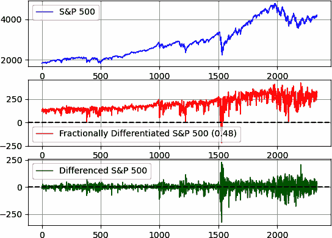

###### 图 9-1\. S&P 500 的分数阶差分（order = 0.48）

图 9-1 是使用此代码生成的：

```py
fig, axes = plt.subplots(nrows = 3, ncols = 1)
axes[0].plot(data[5:,], label = 'S&P 500', color = 'blue', linewidth = 1)
axes[1].plot(frac_data[5:,], label = 
             'Fractionally Differentiated S&P 500 (0.48)', 
             color = 'orange', linewidth = 1)
axes[2].plot(diff_data[5:,], label = 
             'Differenced S&P 500', color = 'green', linewidth = 1)
axes[0].legend()
axes[1].legend()
axes[2].legend()
axes[0].grid()
axes[1].grid()
axes[2].grid()   
axes[1].axhline(y = 0, color = 'black', linestyle = 'dashed') 
axes[2].axhline(y = 0, color = 'black', linestyle = 'dashed')  

```

让我们通过应用增广迪基—富勒（ADF）检验确保分数差分数据确实是稳定的（您在第三章 中使用了此检验）：

```py
from statsmodels.tsa.stattools import adfuller
print('p-value: %f' % adfuller(data)[1])
print('p-value: %f' % adfuller(frac_data)[1])
print('p-value: %f' % adfuller(diff_data)[1])

```

前一代码块的输出如下（假设显著性水平为 5%）：

```py
# The original S&P 500 dataset is nonstationary
p-value: 0.842099 
# The fractionally differentiated S&P 500 dataset is stationary
p-value: 0.038829
# The normally differenced S&P 500 dataset is stationary
p-value: 0.000000

```

根据结果显示，数据确实是稳定的。让我们看另一个例子。以下代码导入了 EURUSD 的日常数值：

```py
data = np.array((pdr.get_data_fred('DEXUSEU', start = start_date, 
                                   end = end_date)).dropna())
```

图 9-2 将 EURUSD 与应用了分数阶差分（0.20）进行了比较，底部面板显示了常规差分。

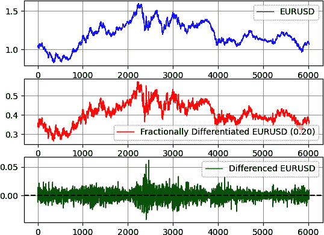

###### 图 9-2\. EURUSD 的分数阶差分（order = 0.20）

ADF 测试的结果如下：

```py
# The original EURUSD dataset is nonstationary
p-value: 0.397494
# The fractionally differentiated EURUSD  dataset is stationary
p-value: 0.043214
# The normally differenced EURUSD  dataset is stationary
p-value: 0.000000 
```

作为比较，图 9-3 将同一数据集与应用了分数阶差分（0.30）进行了比较，底部面板显示了常规差分。

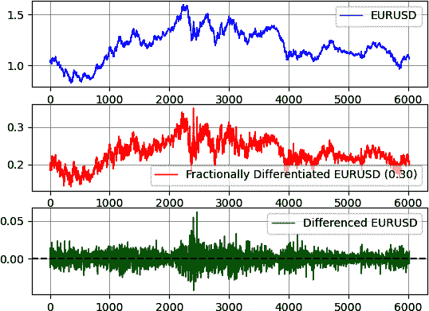

###### 图 9-3\. EURUSD 的分数阶差分（order = 0.30）

###### 注意

当接近 1.00 的阶数时，分数阶差分方法直观上变成了正常的整数差分。同样地，当接近 0.00 的阶数时，分数阶差分方法则变成了未经变换的数据序列。

图 9-3 在中间面板上显示的 EURUSD 系列比图 9-2 更加稳定，这是因为分数阶差分的阶数增加了。这也是为什么当阶数为 0.30 时，分数阶差分的 ADF 测试结果为 0.002，远低于当阶数为 0.20 时的 ADF 测试结果（为 0.043）。

总结一下，分数阶差分是时间序列预测的有价值工具，因为它捕捉长期依赖关系，处理非平稳性，适应各种动态，并保留积分属性。其捕捉复杂模式和提高预测精度的能力使其非常适合对各种实际时间序列数据进行建模和预测。

# 预测阈值

*预测阈值* 是验证信号所需的最低百分比预测。这意味着预测阈值技术是一种过滤器，用于删除低信度预测。

客观地说，低信度预测低于一定百分比。在表 9-1 中展示了一个假设性例子。阈值为±1%。

表 9-1\. 预测表

| 时间 | 预测 | 状态 |
| --- | --- | --- |
| 1 | 0.09% | 已取消 |
| 2 | –0.60% | 已取消 |
| 3 | –1.50% | 已接受 |
| 4 | 1.00% | 已接受 |
| 5 | 2.33% | 已接受 |

在时间 1，交易信号是看涨的，预计虚拟金融工具将上涨 0.09%。由于此预测低于 1.00% 的阈值，因此不进行交易。在时间 2，应用相同的直觉，因为看跌信号低于阈值。

其余信号都已被接受，因为它们等于或大于阈值（在大小方面）。本节的目的是开发多层感知器（MLP）模型并仅保留符合一定阈值的预测。

像往常一样，首先导入所需的库：

```py
import numpy as np
import matplotlib.pyplot as plt
from keras.models import Sequential
from keras.layers import Dense
from master_function import data_preprocessing, mass_import
from master_function import plot_train_test_values, forecasting_threshold

```

接下来，设置超参数并使用 `mass_import()` 导入数据：

```py
num_lags = 500
train_test_split = 0.80 
num_neurons_in_hidden_layers = 256 
num_epochs = 100 
batch_size = 10
threshold = 0.0015

```

导入并预处理数据，然后设计 MLP 架构：

```py
# Fetching the historical price data
data = np.diff(mass_import(0, 'D1')[:, 3])
# Creating the training and test sets
x_train, y_train, x_test, y_test = data_preprocessing(data, num_lags, 
                                                      train_test_split)
# Designing the architecture of the model
model = Sequential()
# First hidden layer
model.add(Dense(num_neurons_in_hidden_layers, input_dim = num_lags, 
                activation = 'relu'))  
# Second hidden layer
model.add(Dense(num_neurons_in_hidden_layers, activation = 'relu'))
# Output layer
model.add(Dense(1))
# Compiling
model.compile(loss = 'mean_squared_error', optimizer = 'adam')

```

下一步是拟合和预测数据，并保留满足您在超参数中定义的阈值的预测。这是使用函数 `forecasting_threshold()` 完成的：

```py
# Fitting
model.fit(x_train, y_train, epochs = num_epochs, batch_size = batch_size)
# Predicting
y_predicted = model.predict(x_test)
# Threshold function
y_predicted = forecasting_threshold(y_predicted, threshold)
# Plotting
plot_train_test_values(100, 50, y_train, y_test, y_predicted)

```

图 9-4 显示了真实值和预测值之间的比较图表。预测中的平坦观察表示没有低于所需阈值（在本例中为 0.0015）的信号。

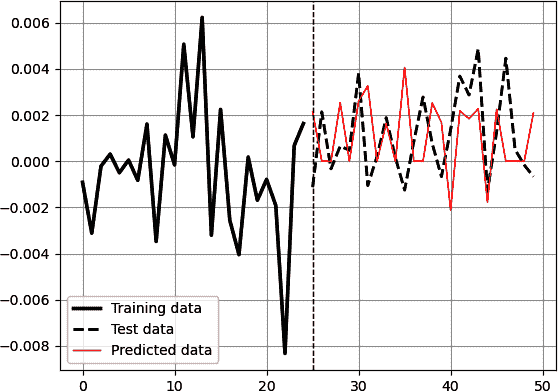

###### 图 9-4\. 使用预测阈值进行预测

阈值可以通过多种方式找到，特别是：

固定数值技术

正如您在前面的示例中看到的，该技术假设一个固定的任意数字用作阈值。

基于波动率的技术

使用这种技术，您可以使用波动率指标（例如价格滚动标准差）在每个时间步长上设置可变阈值。这种技术的好处是使用最新的波动率信息。

统计技术

使用此技术，您查看来自训练集（而不是测试集）的实际值，并选择某个分位数（例如，75% 分位数）作为验证信号的最低阈值。

总之，使用预测阈值可能有助于选择具有最高信心的交易，并且还可以帮助最小化交易成本，因为算法假定始终进行交易，这是不推荐的。这假设向算法添加一个新状态，总共有三个状态：

看涨信号

该算法预测一个较高的值。

看跌信号

该算法预测一个较低的值。

中性信号

该算法没有任何方向性信念。

# 连续重新训练

*重新训练* 指的是每次有新数据进来时对算法进行训练。这意味着在处理每日时间序列时，重新训练会每天进行一次，同时合并最新的每日输入。

连续重新训练技术值得测试，这就是本节的目的。算法的架构将遵循这个框架：

1.  在训练测试数据上训练数据。

1.  对于每次预测，重新运行算法并将新的实际输入包含在训练集中。

###### 注意

持续重新训练技术的一个重大限制是算法的速度，因为它必须在每个时间步重新训练。如果您有 1,000 个测试数据实例，每次训练都需要几分钟，那么回测过程将变得极其缓慢。这尤其是深度学习算法，例如 LSTM，可能需要很长时间来训练。

持续重新训练的主要原因是*概念漂移*，这是数据内部动态和结构的变化，可能会使训练阶段找到的函数失效。基本上，金融时间序列不表现出静态关系；相反，它们随着时间的推移而变化。因此，持续重新训练旨在通过始终使用最新数据进行训练来更新模型。

###### 注意

持续重新训练不需要在每个时间步骤都进行。您可以设置*n*周期进行重新训练。例如，如果您选择了 10，则模型在每组 10 个新值之后重新训练。

为了简化事情，本节展示了每天使用线性回归模型对每个时间步长的周 EURUSD 值进行连续重新训练的代码。您可以使用其他模型执行相同的操作；您只需更改导入和设计模型的代码行即可。首先，导入所需的库：

```py
import matplotlib.pyplot as plt
import numpy as np
from sklearn.linear_model import LinearRegression
from master_function import data_preprocessing, mass_import
from master_function import plot_train_test_values, 
from master_function import calculate_accuracy, model_bias
from sklearn.metrics import mean_squared_error

```

导入数据并设置算法的超参数：

```py
# Importing the time series
data = np.diff(mass_import(0, 'D1')[:, 3])
# Setting the hyperparameters
num_lags = 15
train_test_split = 0.80 
# Creating the training and test sets
x_train, y_train, x_test, y_test = data_preprocessing(data, num_lags, 
                                                      train_test_split)
# Fitting the model
model = LinearRegression()
model.fit(x_train, y_train)
# Predicting in-sample
y_predicted_train = np.reshape(model.predict(x_train), (–1, 1))

```

创建持续重新训练循环如下：

```py
# Store the new forecasts
y_predicted = []
# Reshape x_test to forecast one period
latest_values = np.transpose(np.reshape(x_test[0], (–1, 1)))
# Isolate the real values for comparison
y_test_store = y_test
y_train_store = y_train
for i in range(len(y_test)):
    try: 
        # Predict over the first x_test data
        predicted_value = model.predict(latest_values)
        # Store the prediction in an array
        y_predicted = np.append(y_predicted, predicted_value)
        # Add the first test values to the last training values
        x_train = np.concatenate((x_train, latest_values), axis = 0)
        y_train = np.append(y_train, y_test[0])
        # Remove the first test values from the test arrays
        y_test = y_test[1:]
        x_test = x_test[1:, ]
        # Retrain
        model.fit(x_train, y_train)
        # Select the first values of the test set
        latest_values = np.transpose(np.reshape(x_test[0], (–1, 1)))
    except IndexError:
        pass

```

绘制预测值：

```py
plot_train_test_values(100, 50, y_train, y_test_store, y_predicted)

```

图 9-5 显示了结果。

作为简单的比较，对没有重新训练的模型进行了相同的回测。与重新训练的同一模型相比，后者在 48.55%的测试集准确率上获得了 48.92%的测试集准确率。

持续重新训练并不能保证获得更好的结果，但由于市场动态的变化，定期更新模型是有意义的。您应该更新模型的频率可能是主观的。

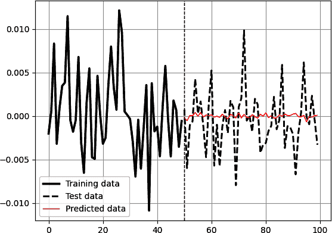

###### 图 9-5\. 使用持续重新训练技术进行预测

# 时间序列交叉验证

*交叉验证*是机器学习中用于评估模型性能的一种技术。它涉及将可用数据分成用于训练和评估的子集。在时间序列数据的情况下，观察值的顺序很重要（由于数据的顺序性质），传统的*k*-折叠交叉验证方法可能不适用。而是使用时间序列交叉验证技术，例如*滚动窗口*和*扩展窗口*方法。

###### 注意

在传统的*k*折交叉验证中，数据被随机分成*k*个大小相等的折叠。每个折叠被用作验证集，而其余*k-1*个折叠被组合用于训练模型。该过程重复*k*次，每个折叠一次作为验证集。最后，跨*k*次迭代对性能指标进行平均以评估模型的性能。

与传统的*k*折交叉验证不同，时间序列交叉验证方法尊重数据点的时间顺序。用于时间序列交叉验证的两种常用技术是滚动窗口和扩展窗口方法。

在*滚动窗口交叉验证*中，固定大小的训练窗口在时间序列数据上进行迭代移动。在每个步骤中，模型在窗口内的观察结果上进行训练，并在随后的窗口上进行评估。该过程重复，直到达到数据的末尾。窗口大小可以根据特定的时间持续时间或固定数量的观察来定义。图 9-6 显示了滚动窗口交叉验证的示意图。

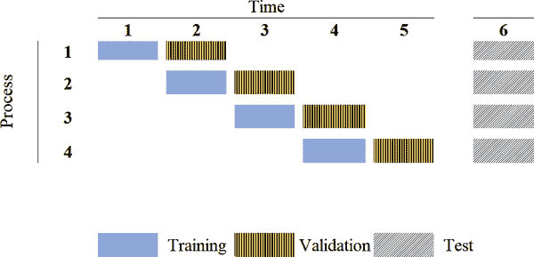

###### 图 9-6 滚动窗口交叉验证

在*扩展窗口交叉验证*中，训练集从一个小的初始窗口开始，并随着时间的推移不断扩展，每个步骤都会纳入更多的数据点。模型根据可用数据训练到特定点，并在随后的时间段进行评估。与滚动窗口方法类似，该过程重复，直到达到数据的末尾。图 9-7 显示了扩展窗口交叉验证的示意图。

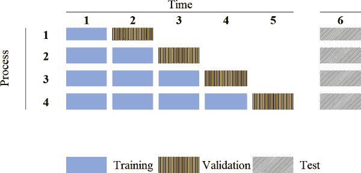

###### 图 9-7 扩展窗口交叉验证

在时间序列交叉验证的每次迭代中，使用适当的评估指标来衡量模型的性能。从每次迭代获得的性能结果可以进行汇总和总结，以评估模型在时间序列数据上的整体性能。

# 多期预测

*多期预测*（MPF）是一种旨在预测不止下一期的技术。它旨在生成一个由用户定义的*n*期路径。有两种方法可以处理 MPF：

递归模型

*递归模型*将预测作为下一个预测的输入。正如你可能已经猜到的那样，递归模型可能会由于在预测时使用预测作为输入而快速偏离轨道，导致指数级增长的误差项。

直接模型

*直接模型*从头开始训练模型，以在其各自的时间期间输出多个预测。该模型可能比递归模型更加健壮。

让我们从递归模型开始。从数学上讲，它的最基本形式可以表示如下：

<math alttext="upper P r e d i c t i o n Subscript i Baseline equals f x left-parenthesis upper P r e d i c t i o n Subscript i minus 1 Baseline comma period period period comma upper P r e d i c t i o n Subscript i minus n Baseline right-parenthesis"><mrow><mi>P</mi> <mi>r</mi> <mi>e</mi> <mi>d</mi> <mi>i</mi> <mi>c</mi> <mi>t</mi> <mi>i</mi> <mi>o</mi> <msub><mi>n</mi> <mi>i</mi></msub> <mo>=</mo> <mi>f</mi> <mi>x</mi> <mrow><mo>(</mo> <mi>P</mi> <mi>r</mi> <mi>e</mi> <mi>d</mi> <mi>i</mi> <mi>c</mi> <mi>t</mi> <mi>i</mi> <mi>o</mi> <msub><mi>n</mi> <mrow><mi>i</mi><mo>-</mo><mn>1</mn></mrow></msub> <mo>,</mo> <mo lspace="0%" rspace="0%">.</mo> <mo lspace="0%" rspace="0%">.</mo> <mo lspace="0%" rspace="0%">.</mo> <mo>,</mo> <mi>P</mi> <mi>r</mi> <mi>e</mi> <mi>d</mi> <mi>i</mi> <mi>c</mi> <mi>t</mi> <mi>i</mi> <mi>o</mi> <msub><mi>n</mi> <mrow><mi>i</mi><mo>-</mo><mi>n</mi></mrow></msub> <mo>)</mo></mrow></mrow></math>

本节将使用天气数据和经济指标应用深度学习算法。

预测分析的第一步是了解数据，所以让我们看看算法将要预测的内容。第一个时间序列是自 2005 年以来瑞士巴塞尔的平均日温度。Figure 9-8 显示了时间序列。

第二个时间序列是美国供应管理协会采购经理人指数（ISM PMI），这是一个广为认可的经济指标，提供有关制造业健康和整体经济状况的见解。该指数基于对来自各行业（包括制造业）的采购经理的月度调查，并评估新订单、生产、就业、供应商交付和库存等关键因素。

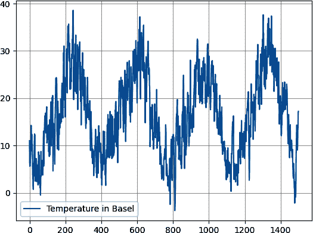

###### 图 9-8\. 数据集样本，显示温度的季节性特征

该指数报告为百分比，值超过 50 表示制造业扩张，值低于 50 表示收缩。更高的 PMI 通常表明积极的经济增长，而较低的 PMI 可能表示经济放缓或衰退条件。由于 ISM PMI 可以提供有关经济趋势和商业周期潜在转变的宝贵见解，因此它受到政策制定者、投资者和企业的密切关注。Figure 9-9 显示了 ISM PMI 的历史观测。

预测的目标是测试算法穿透噪音并对 ISM PMI 的原始均值回归特性建模的能力。让我们从递归模型开始。

递归模型的框架如下：

1.  使用通常的 80/20 分割在训练集上训练数据。

1.  使用来自测试集的所需输入预测第一个观察结果。

1.  使用步骤 2 中的最后一个预测和测试集中所需的数据预测第二个观察结果，同时放弃第一个观察结果。

1.  重复步骤 3，直到达到所需的预测数量。在某一点上，预测是通过仅查看先前的预测来进行的。

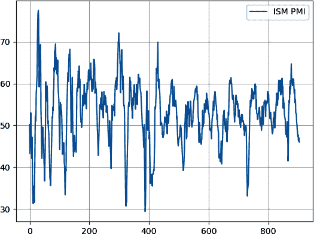

###### 图 9-9\. 导入数据集样本，显示 ISM PMI 的均值回归特性

###### 注意

到目前为止，您一直在使用`ca⁠lc⁠ul⁠ate_​ac⁠cur⁠acy()`评估准确性，当您预测正负值（如 EURUSD 价格变动）时，这是有效的。但是，在预测不围绕零点波动的多周期值时，最好计算方向准确性，这基本上是相同的计算，但不围绕零点。为此，使用函数`calculate_directional_accuracy()`。请记住，这些函数可以在书籍的*master_function.py*中的[GitHub 仓库](https://oreil.ly/5YGHI)中找到。

让我们从巴塞尔的平均温度开始。使用以下代码导入数据集（确保您从[GitHub 仓库](https://oreil.ly/5YGHI)下载了历史观测数据）：

```py
from keras.models import Sequential
from keras.layers import Dense
import keras
import numpy as np
import pandas as pd
import matplotlib.pyplot as plt
from master_function import data_preprocessing, plot_train_test_values, 
from master_function import recursive_mpf
from master_function import calculate_directional_accuracy
from sklearn.metrics import mean_squared_error

```

接下来，预处理数据：

```py
# Importing the data
data = np.reshape(np.array(pd.read_excel('Temperature_Basel.xlsx').dropna()
                  ), (–1))
# Setting the hyperparameters
num_lags = 500
train_test_split = 0.8
num_neurons_in_hidden_layers = 100
num_epochs = 200
batch_size = 12
# Creating the training and test sets
x_train, y_train, x_test, y_test = data_preprocessing(data, num_lags, 
                                                      train_test_split)

```

设计具有多个隐藏层的 MLP 架构。然后，基于递归方式进行拟合和预测：

```py
# Designing the architecture of the model
model = Sequential()
# First hidden layer
model.add(Dense(num_neurons_in_hidden_layers, input_dim = num_lags, 
          activation = 'relu'))  
# Second hidden layer
model.add(Dense(num_neurons_in_hidden_layers, activation = 'relu'))  
# Third hidden layer
model.add(Dense(num_neurons_in_hidden_layers, activation = 'relu'))  
# Fourth hidden layer
model.add(Dense(num_neurons_in_hidden_layers, activation = 'relu')) 
# Output layer
model.add(Dense(1))
# Compiling
model.compile(loss = 'mean_squared_error', optimizer = 'adam')
# Fitting the model
model.fit(x_train, np.reshape(y_train, (–1, 1)), epochs = num_epochs, 
          batch_size = batch_size)
# Predicting in-sample
y_predicted_train = np.reshape(model.predict(x_train), (–1, 1))
# Predicting in the test set on a recursive basis
x_test, y_predicted = recursive_mpf(x_test, y_test, num_lags, 
                                    model, architecture = 'MLP')

```

函数`recursive_mpf()`接受以下参数：

+   将持续更新的测试集特征。它们由变量`x_test`表示。

+   将持续更新的测试集依赖变量。它们由变量`y_test`表示。

+   滞后数。这个变量由`num_lags`表示。

+   变量`model`定义的拟合模型。

+   架构类型由参数`architecture`表示。它可以是`MLP`，适用于二维数组，或者`LSTM`，适用于三维数组。

图 9-10 显示了预测与实际值之间的对比（虚线时间序列在截断线之后）。注意深度神经网络如何重新创建时间序列的季节特性（虽然存在一些缺陷），并且很好地将其投影到未来，而无需沿途获取任何必要的知识。

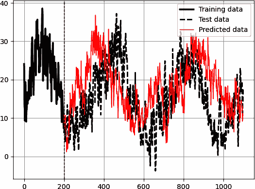

###### 图 9-10\. 多期预测与实际值

###### 注意

许多机器学习和深度学习算法能够很好地建模这种关系。本例中使用了 MLP，但这并不贬低其他模型，甚至简单的模型如线性回归也同样适用。你可以尝试用你选择的模型（如 LSTM）应用相同的例子并比较结果。如果你使用 LSTM 模型，请确保设置`architecture = 'LSTM'`。

现在在第二个时间序列上应用相同的过程。你只需要更改导入文件的名称和超参数（按照你的需求）：

```py
data = np.reshape(np.array(pd.read_excel('ISM_PMI.xlsx').dropna()), (–1))

```

图 9-11 显示了预测（虚线）与实际值之间的对比。

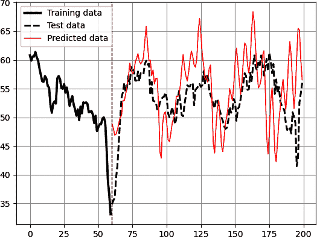

###### 图 9-11\. 提前多个周期预测；预测数据用细实线表示，测试数据用虚线表示

训练模型并不复杂，以避免过拟合。然而，在最初的预测期间，它确实能够很好地预测转折点。自然地，这种能力随着时间的推移逐渐减弱。调整超参数是实现良好方向准确性的关键。从以下超参数开始：

```py
num_lags = 200
train_test_split = 0.8
num_neurons_in_hidden_layers = 500
num_epochs = 400
batch_size = 100
```

第二种 MPF 技术从头开始训练模型，输出多个在各自时间段的预测。数学上可以表示如下：

<math alttext="StartLayout 1st Row  upper P r e d i c t i o n Subscript i Baseline equals f x left-parenthesis r e a l i n p u t Subscript i minus 1 Baseline comma period period period comma i n p u t Subscript i minus n Baseline right-parenthesis 2nd Row  upper P r e d i c t i o n Subscript i plus 1 Baseline equals f x left-parenthesis r e a l i n p u t Subscript i minus 1 Baseline comma period period period comma i n p u t Subscript i minus n Baseline right-parenthesis 3rd Row  upper P r e d i c t i o n Subscript i plus 2 Baseline equals f x left-parenthesis r e a l i n p u t Subscript i minus 1 Baseline comma period period period comma i n p u t Subscript i minus n Baseline right-parenthesis EndLayout"><mtable><mtr><mtd columnalign="left"><mrow><mi>P</mi> <mi>r</mi> <mi>e</mi> <mi>d</mi> <mi>i</mi> <mi>c</mi> <mi>t</mi> <mi>i</mi> <mi>o</mi> <msub><mi>n</mi> <mi>i</mi></msub> <mo>=</mo> <mi>f</mi> <mi>x</mi> <mrow><mo>(</mo> <mi>r</mi> <mi>e</mi> <mi>a</mi> <mi>l</mi> <mi>i</mi> <mi>n</mi> <mi>p</mi> <mi>u</mi> <msub><mi>t</mi> <mrow><mi>i</mi><mo>-</mo><mn>1</mn></mrow></msub> <mo>,</mo> <mo lspace="0%" rspace="0%">.</mo> <mo lspace="0%" rspace="0%">.</mo> <mo lspace="0%" rspace="0%">.</mo> <mo>,</mo> <mi>i</mi> <mi>n</mi> <mi>p</mi> <mi>u</mi> <msub><mi>t</mi> <mrow><mi>i</mi><mo>-</mo><mi>n</mi></mrow></msub> <mo>)</mo></mrow></mrow></mtd></mtr> <mtr><mtd columnalign="left"><mrow><mi>P</mi> <mi>r</mi> <mi>e</mi> <mi>d</mi> <mi>i</mi> <mi>c</mi> <mi>t</mi> <mi>i</mi> <mi>o</mi> <msub><mi>n</mi> <mrow><mi>i</mi><mo>+</mo><mn>1</mn></mrow></msub> <mo>=</mo> <mi>f</mi> <mi>x</mi> <mrow><mo>(</mo> <mi>r</mi> <mi>e</mi> <mi>a</mi> <mi>l</mi> <mi>i</mi> <mi>n</mi> <mi>p</mi> <mi>u</mi> <msub><mi>t</mi> <mrow><mi>i</mi><mo>-</mo><mn>1</mn></mrow></msub> <mo>,</mo> <mo lspace="0%" rspace="0%">.</mo> <mo lspace="0%" rspace="0%">.</mo> <mo lspace="0%" rspace="0%">.</mo> <mo>,</mo> <mi>i</mi> <mi>n</mi> <mi>p</mi> <mi>u</mi> <msub><mi>t</mi> <mrow><mi>i</mi><mo>-</mo><mi>n</mi></mrow></msub> <mo>)</mo></mrow></mrow></mtd></mtr> <mtr><mtd columnalign="left"><mrow><mi>P</mi> <mi>r</mi> <mi>e</mi> <mi>d</mi> <mi>i</mi> <mi>c</mi> <mi>t</mi> <mi>i</mi> <mi>o</mi> <msub><mi>n</mi> <mrow><mi>i</mi><mo>+</mo><mn>2</mn></mrow></msub> <mo>=</mo> <mi>f</mi> <mi>x</mi> <mrow><mo>(</mo> <mi>r</mi> <mi>e</mi> <mi>a</mi> <mi>l</mi> <mi>i</mi> <mi>n</mi> <mi>p</mi> <mi>u</mi> <msub><mi>t</mi> <mrow><mi>i</mi><mo>-</mo><mn>1</mn></mrow></msub> <mo>,</mo> <mo lspace="0%" rspace="0%">.</mo> <mo lspace="0%" rspace="0%">.</mo> <mo lspace="0%" rspace="0%">.</mo> <mo>,</mo> <mi>i</mi> <mi>n</mi> <mi>p</mi> <mi>u</mi> <msub><mi>t</mi> <mrow><mi>i</mi><mo>-</mo><mi>n</mi></mrow></msub> <mo>)</mo></mrow></mrow></mtd></mtr></mtable></math>

递归模型的框架如下：

1.  创建一个函数，将所需的输入数量与所需的输出数量相关联。这意味着神经网络的最后一层将包含等于你想要向未来投影的预测期数的输出数量。

1.  训练模型以预测每个时间步的多个输出，基于同一时间步的输入。

让我们继续使用 ISM PMI。像往常一样，导入所需的库：

```py
from keras.models import Sequential
from keras.layers import Dense
import keras
import numpy as np
import pandas as pd
import matplotlib.pyplot as plt
from master_function import direct_mpf
from master_function import calculate_directional_accuracy
from sklearn.metrics import mean_squared_error

```

导入和预处理数据时设置超参数：

```py
# Importing the data
data = np.reshape(np.array(pd.read_excel('ISM_PMI.xlsx').dropna()), (–1))
# Setting the hyperparameters
num_lags = 10
train_test_split = 0.80
num_neurons_in_hidden_layers = 200
num_epochs = 200
batch_size = 10
forecast_horizon = 18 # This means eighteen months
x_train, y_train, x_test, y_test = direct_mpf(data, num_lags, 
                                              train_test_split, 
                                              forecast_horizon)

```

函数`direct_mpf()`接受以下参数：

+   变量`data`表示的数据集

+   变量`num_lags`表示的滞后数目。

+   变量`train_test_split`表示的拆分。

+   变量`forecast_horizon`表示的要预测的观察次数。

准备数组，设计架构，并预测数据，预测时间跨度为 18 个月（因为 ISM PMI 是一个月度指标）：

```py
# Designing the architecture of the model
model = Sequential()
# First hidden layer
model.add(Dense(num_neurons_in_hidden_layers, input_dim = num_lags, 
                activation = 'relu'))  
# Second hidden layer
model.add(Dense(num_neurons_in_hidden_layers, activation = 'relu'))  
# Output layer
model.add(Dense(forecast_horizon))
# Compiling
model.compile(loss = 'mean_squared_error', optimizer = 'adam')
# Fitting (training) the model
model.fit(x_train, y_train, epochs = num_epochs, batch_size = batch_size)
# Make predictions
y_predicted = model.predict(x_test)
# Plotting
plt.plot(y_predicted[–1], label = 'Predicted data', color = 'red', 
         linewidth = 1)
plt.plot(y_test[–1], label = 'Test data', color = 'black', 
         linestyle = 'dashed', linewidth = 2)
plt.grid()
plt.legend()

```

图 9-12 在此时显示了预测数据和测试数据。

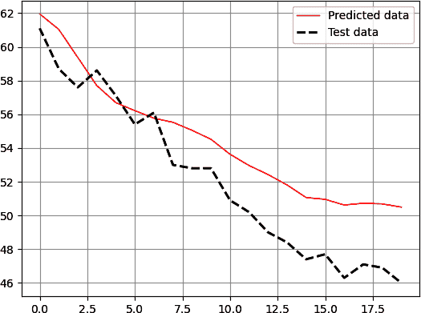

###### 图 9-12。模型的多周期预测与实际值比较，带有一些优化

在预测时，模型解释了连续 18 个月 ISM PMI 的下降。模型似乎在预测这个趋势方面表现良好。请注意，由于算法的随机初始化可能会影响其收敛到最小损失函数，因此可能会得到不同的结果。您可以使用`random_state`以确保每次获得相同的结果（您在第七章中看到了这一点）。

###### 注意

ISM PMI 与美国国内生产总值（GDP）呈正相关，与标准普尔 500 指数略有正相关。更确切地说，ISM PMI 的底部与股票市场的底部相吻合。

出于好奇，让我们尝试使用非常简单和基本的超参数来运行模型：

```py
num_lags = 1
train_test_split = 0.80
num_neurons_in_hidden_layers = 2
num_epochs = 10
batch_size = 1
forecast_horizon = 18
```

显然，对于一个滞后的情况，模型只会考虑先前的值来学习如何预测未来。隐藏层每个仅包含两个神经元，仅运行 10 个时期，使用批量大小为 1。自然地，使用这些超参数不会得到令人满意的结果。图 9-13 比较了预测值和实际值之间的巨大差异，因为模型未能捕捉到幅度或方向。

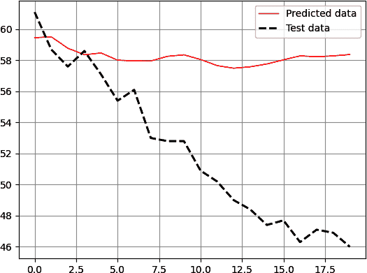

###### 图 9-13。使用基本超参数的模型的多周期预测与实际值比较

这就是为什么超参数优化很重要，需要一定程度的复杂性。毕竟，这些时间序列并不简单，其中带有相当大的噪音。

最后，让我们来看看在巴塞尔温度数据上运行以下超参数的结果，就像您在本节开头看到的那样：

```py
num_lags = 500
train_test_split = 0.80
num_neurons_in_hidden_layers = 128
num_epochs = 50
batch_size = 12
forecast_horizon = 500
```

图 9-14 比较了使用温度时间序列的预测值与实际值，预测的观察次数为 500。

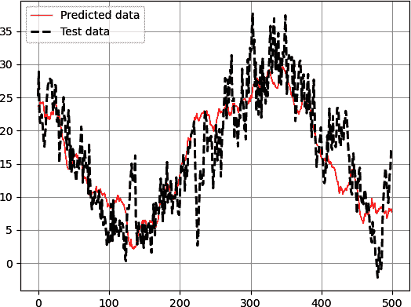

###### 图 9-14。使用温度时间序列的模型的多周期预测与实际值比较

使用哪种预测技术取决于您的偏好和需求。值得一提的是另一种 MPF 技术被称为*多输出模型*，它是预测一系列值的一次性预测。这意味着模型在训练集上训练，旨在产生预先定义数量的输出（预测）。显然，这种模型可能计算成本高昂，并且需要大量的数据。

# 将正则化应用于 MLPs

第八章讨论了深度学习中涉及的两种正则化概念：

+   丢弃作为一种正则化技术，在训练期间随机关闭神经元以防止过拟合

+   提前停止作为一种方法，通过监控模型性能并在性能开始下降时停止训练来防止过拟合

另一种值得讨论的正则化技术是*批归一化*，这是深度学习中用于改善神经网络训练和泛化的技术。它在训练期间规范化每个层的输入，有助于稳定和加速学习过程。

批归一化背后的主要思想是确保层的输入均值为零，方差为单位。该归一化独立应用于每个层内的每个特征（或神经元）。该过程可以总结为以下步骤：

1.  对于每个特征在一个小批次中，计算批次中所有样本的均值和方差。

1.  对于每个特征，减去均值并除以标准差（方差的平方根）。

1.  归一化后，特征通过可学习参数进行缩放和移位。这些参数允许模型为每个归一化特征学习最佳的缩放和移位。

本节介绍了使用 LSTM 进行简单预测任务的示例，同时添加了三种正则化技术。时间序列是标准普尔 500 的 20 天滚动自相关数据。导入所需的库：

```py
import numpy as np
import pandas as pd
import matplotlib.pyplot as plt
from keras.models import Sequential
from keras.layers import LSTM, Dense, Dropout, BatchNormalization
from tensorflow.keras.callbacks import EarlyStopping
import pandas_datareader as pdr
from master_function import data_preprocessing, plot_train_test_values
from master_function import calculate_directional_accuracy
from sklearn.metrics import mean_squared_error
```

导入并预处理数据：

```py
# Set the start and end dates for the data
start_date = '1990-01-01'
end_date   = '2023-06-01'
# Fetch S&P 500 price data
data = np.array((pdr.get_data_fred('SP500', start = start_date, 
                                   end = end_date)).dropna())

```

计算收盘价格的 20 天自相关性：

```py
rolling_autocorr = pd.DataFrame(data).rolling(window = 
                                              20).apply(lambda x: 
                                              x.autocorr(lag=1)).dropna()
rolling_autocorr = np.reshape(np.array(rolling_autocorr), (–1))
```

###### 注意

在 Python 中，`lambda`函数，也称为*匿名*函数，是一个小型的未命名函数，可以有任意数量的参数，但只能有一个表达式。这些函数通常用于创建简单的内联函数，而无需使用`def`关键字定义完整的函数。以下是一个简单的示例，说明了`lambda`的工作原理：

```py
# Create an anonymous function to divide two variables
divide = lambda x, y: x / y
# Call the function
result = divide(10, 2)
```

输出将是存储在`result`中的浮点数 5.0。

`apply()`函数是*pandas*中可用的方法。它主要用于沿着数据帧的轴应用给定函数。

继续之前，请尝试绘制您刚刚计算的标准普尔 500 价格数据与其 20 天自相关性的图。使用以下代码生成图 9-15：

```py
fig, axes = plt.subplots(nrows = 2, ncols = 1)
axes[0].plot(data[-350:,], label = 'S&P 500', linewidth = 1.5)
axes[1].plot(rolling_autocorr[-350:,], label = '20-Day Autocorrelation', 
             color = 'orange', linewidth = 1.5)
axes[0].legend()
axes[1].legend()
axes[0].grid()
axes[1].grid()
axes[1].axhline(y = 0.95, color = 'black', linestyle = 'dashed')

```

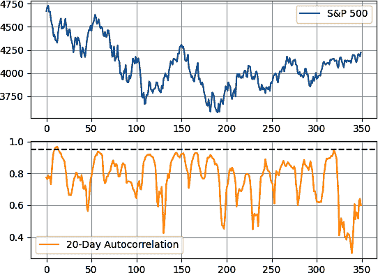

###### 图 9-15\. 标准普尔 500 与其 20 天价格自相关性（滞后 = 1）

从图表和自相关性的直觉中应该记住的是，每当自相关性接近 1.00 时，当前趋势可能会中断，从而导致市场纠正。这不是一个完美的假设，但您可以遵循这些基本规则来解释滚动自相关性的观察结果：

+   一个趋势市场（看涨或看跌）其自相关性迟早会接近 1.00。当这种情况发生时，可能表明潜在趋势暂停，或者在更少的情况下，完全反转。

+   一个横向（波动）市场的自相关性会很低。如果自相关接近历史最低点，则可能意味着市场准备好趋势。

现在让我们继续构建算法。下一步是设置超参数并准备数组：

```py
num_lags = 500 
train_test_split = 0.80 
num_neurons_in_hidden_layers = 128 
num_epochs = 100 
batch_size = 20
# Creating the training and test sets
x_train, y_train, x_test, y_test = data_preprocessing(rolling_autocorr, 
                                                      num_lags, 
                                                      train_test_split)

```

将输入数组转换为三维结构，以便在 LSTM 架构中无问题地处理它们：

```py
x_train = x_train.reshape((–1, num_lags, 1))
x_test = x_test.reshape((–1, num_lags, 1))

```

设计 LSTM 架构并添加 dropout 层和批归一化。在设置`restore_best_weights`为`True`的同时，添加早停实现以保持对测试数据的最佳预测参数：

```py
# Create the LSTM model
model = Sequential()
model.add(LSTM(units = num_neurons_in_hidden_layers, input_shape = 
               (num_lags, 1)))
# Adding batch normalization and a dropout of 10%
model.add(BatchNormalization())
model.add(Dropout(0.1)) 
# Adding the output layer
model.add(Dense(units = 1))
# Compile the model
model.compile(loss = 'mean_squared_error', optimizer = 'adam')
# Early stopping implementation
early_stopping = EarlyStopping(monitor = 'loss', patience = 15, 
 restore_best_weights = True)
# Train the model
model.fit(x_train, y_train, epochs = num_epochs, 
          batch_size = batch_size, callbacks = [early_stopping])

```

预测并绘制结果：

```py
# Predicting in-sample
y_predicted_train = np.reshape(model.predict(x_train), (–1, 1))
# Predicting out-of-sample
y_predicted = np.reshape(model.predict(x_test), (–1, 1))
# Plotting
plot_train_test_values(300, 50, y_train, y_test, y_predicted)

```

图 9-16 显示了预测与实际值的对比。由于早停机制的回调，模型在达到 100 个周期之前已停止训练。

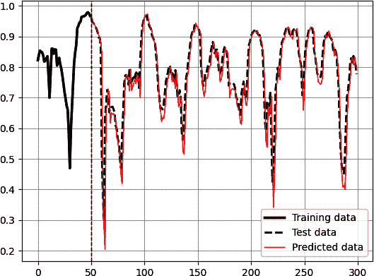

###### 图 9-16\. 预测相关性

结果如下：

```py
Accuracy Train =  70.37 %
Accuracy Test =  68.12 %
RMSE Train =  0.0658945761
RMSE Test =  0.0585669847
Correlation In-Sample Predicted/Train =  0.945
Correlation Out-of-Sample Predicted/Test =  0.936
```

需要注意的是，应谨慎使用诸如滚动自相关等指标。它们提供了历史模式的见解，但不能保证未来的表现。此外，滚动自相关作为技术指标的有效性取决于数据的性质和使用的上下文。您可以尝试将 MPF 方法应用于自相关数据。

其他存在的正则化技术包括以下内容：

L1 和 L2 正则化

也称为*权重衰减*，L1 和 L2 正则化根据权重的大小向损失函数添加惩罚项。*L1 正则化*将权重的绝对值加到损失中，促进模型的稀疏性。*L2 正则化*将权重的平方值加到损失中，抑制大的权重值，并倾向于更均匀地分布特征的影响。

DropConnect

这种技术类似于 dropout，但是应用于连接而不是神经元。这种技术在训练期间随机丢弃层之间的连接。

权重约束

限制权重值的大小可以防止模型从噪声中学习复杂模式，并帮助对模型进行正则化。

对抗训练

使用对抗性示例训练模型可以通过使其更抗小扰动来提高其鲁棒性。

使用这些正则化技术并不保证比不使用它们的模型结果更好。然而，深度学习的最佳实践鼓励使用这些技术来避免更严重的问题，如过拟合。

###### 注意

当手动上传包含历史数据的 Excel 文件（例如使用*pandas*）时，请确保其形状为`(n, )`，而不是`(n, 1)`。这样做可以确保在使用`data_preprocessing()`函数时，四个训练/测试数组将以正确的维度创建。

要将`(n, 1)`数组转换为`(n, )`，请使用以下语法：

```py
data = np.reshape(data, (–1))
```

要将`(n, )`数组转换为`(n, 1)`，请使用以下语法：

```py
data = np.reshape(data, (–1, 1))
```

# 概要

本章介绍了一些可能改进不同机器和深度学习算法的技术。我喜欢将这些技术称为*卫星*，因为它们围绕着主要组件——神经网络——盘旋。优化和增强对于分析的成功至关重要。例如，某些市场可能会从预测阈值技术和分数微分中受益。试错法是理解数据的关键，当您开始学习第十章并了解强化学习时，您会发现试错不仅仅是人类的任务，它也可以是计算机的任务。
