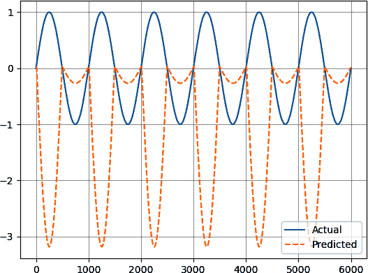
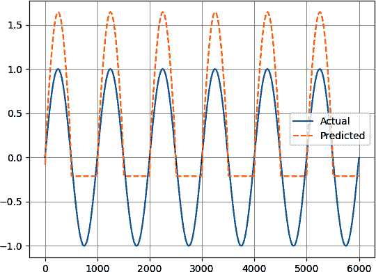
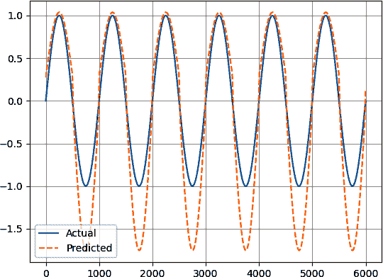
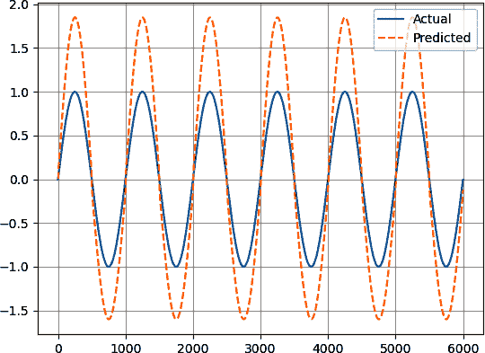
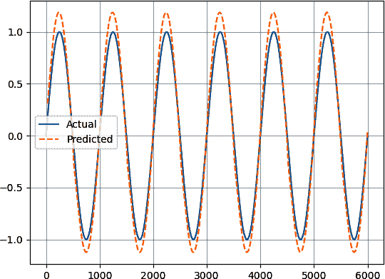

# 第十章：深度强化学习用于时间序列预测

*强化学习*是处理顺序决策问题的机器学习分支。该分支中的算法通过与环境的交互和奖励反馈来学习做出最优决策。在时间序列预测的背景下，它可以用来开发基于历史数据进行顺序预测的模型。传统的预测方法通常依赖于统计方法或监督学习技术，这些方法假设数据点之间是独立的。然而，时间序列数据表现出时间依赖性和模式，这些可以通过强化学习有效地捕捉。

用于时间序列预测的强化学习模型通常涉及一个基于观察到的状态采取行动并根据其预测准确性获得奖励的代理程序。代理通过试错学习以在时间上最大化累积奖励。关键挑战在于找到*探索*（尝试新行动）与*利用*（使用已学知识）之间的最佳平衡。

本章概述了关于预测时间序列数据的强化学习和深度强化学习的基本概念。

# 强化学习的直觉

简化总是理解更高级细节的正确途径。因此，在深入研究之前，让我们从一个简单的角度来看待强化学习。

强化学习主要涉及奖励和惩罚。想象一个孩子因做好事而受到奖励，因做坏事而受到惩罚。随着时间的推移，孩子会成长并积累经验，以便做好事并尽量避免做坏事（没有人是完美的）。因此，学习是通过经验来完成的。

从时间序列的角度来看，基本思想是一样的。想象在过去数据上训练模型，然后让其通过经验学习，在做出良好预测时奖励它，在犯错时校正其参数，以便下次实现更好的准确性。算法本质上是贪婪的，并且希望最大化其奖励；因此，随着时间的推移，它在预测下一个可能值时变得更加优秀，这当然依赖于分析的时间序列的质量和信噪比。

*强化学习*这个术语来源于算法在做出正确决策时给予*正向强化*，在做出错误决策时给予*负向强化*。你必须了解的前三个概念是状态、行动和奖励：

状态

每个时间步骤的特征。例如，在某个时间步骤，市场的当前状态是其 OHLC 数据和其交易量数据。更简单的话来说，状态是解释变量。

行动

交易员在每个时间步骤可能做出的决策。一般涉及买入、卖出或持有。更通俗的说法，动作是算法在面对特定状态时的决策（例如，交易员注意到市场估值过高并决定发起买单的简单自主性例子）。

奖励

正确动作的结果。最简单的奖励是正回报。请注意，设计不良的奖励函数可能导致模型问题，例如买入并持有策略[¹]。

表 10-1 展示了强化学习的三个主要元素。

表 10-1\. 一个假设的决策表

|   | 时间 | 开盘 | 最高 | 最低 | 收盘 | &#124; | **动作** | **奖励** |
| --- | --- | --- | --- | --- | --- | --- | --- | --- |
| **状态** |   1 | 10 | 14 | 8 | 10 | &#124; | 买入 |     0 |
| **状态** |   2 | 10 | 15 | 6 | 13 | &#124; | 买入 |     3 |
| **状态** |   3 | 13 | 16 | 8 | 14 | &#124; | 卖出 |   –1 |
| **状态** |   4 | 10 | 16 | 8 | 14 | &#124; | 持有 |     0 |

状态是从时间列到收盘列的行，动作可以是分类的，正如您从动作列看到的，奖励可以是数值（例如，正或负的利润）或分类的（例如，利润或亏损标签）。

从上述列表中可以看出，仅设计一个寻找奖励的系统似乎很复杂。*奖励函数*量化了处于特定状态或采取特定行动的可取性或效用。因此，奖励函数向代理提供反馈，指示其行动的即时质量，并引导其学习过程。在我们详细讨论奖励函数之前，让我们先看看什么是状态-动作表（也称为 Q 表）。

*Q 表*，即*质量表*，是一种数据结构，用于存储和更新在给定状态下采取特定行动的期望值（称为*Q 值*）。状态-动作对（*s*, *a*）在时间 *t* 的 Q 值表示代理通过遵循特定策略，在状态 *s* 中采取行动 *a* 能够达到的预期累积奖励。因此，Q 表是一种表格结构，将每个状态-动作对映射到其对应的 Q 值。

初始时，Q 表通常使用任意值或设为零进行初始化。随着算法探索环境（市场）并接收奖励，它基于观察到的奖励和预估的未来奖励更新表中的 Q 值。这一过程通常使用 Q 学习等算法完成。

###### 注

随着反复的探索和利用，Q 表逐渐收敛到对最优 Q 值更准确的估计，代表在每个状态下采取的最佳行动。通过使用 Q 表，代理可以做出明智的决策，并学会在给定环境中最大化累积奖励。记住，奖励可以是利润、夏普比率或任何其他绩效指标。

*Q-learning* 是一种流行的强化学习算法，通过迭代更新其动作值函数（即 *贝尔曼方程*），使代理程序能够学习到最优的行动：

<math alttext="upper Q left-parenthesis s Subscript t Baseline comma a Subscript t Baseline right-parenthesis equals upper R left-parenthesis s Subscript t Baseline comma a Subscript t Baseline right-parenthesis plus gamma m a x left-bracket upper Q left-parenthesis s Subscript t plus 1 Baseline comma a Subscript t plus 1 Baseline right-parenthesis right-bracket"><mrow><mi>Q</mi> <mrow><mo>(</mo> <msub><mi>s</mi> <mi>t</mi></msub> <mo>,</mo> <msub><mi>a</mi> <mi>t</mi></msub> <mo>)</mo></mrow> <mo>=</mo> <mi>R</mi> <mrow><mo>(</mo> <msub><mi>s</mi> <mi>t</mi></msub> <mo>,</mo> <msub><mi>a</mi> <mi>t</mi></msub> <mo>)</mo></mrow> <mo>+</mo> <mi>γ</mi> <mi>m</mi> <mi>a</mi> <mi>x</mi> <mrow><mo>[</mo> <mi>Q</mi> <mrow><mo>(</mo> <msub><mi>s</mi> <mrow><mi>t</mi><mo>+</mo><mn>1</mn></mrow></msub> <mo>,</mo> <msub><mi>a</mi> <mrow><mi>t</mi><mo>+</mo><mn>1</mn></mrow></msub> <mo>)</mo></mrow> <mo>]</mo></mrow></mrow></math>

<math alttext="StartLayout 1st Row  upper Q left-parenthesis s Subscript t Baseline comma a Subscript t Baseline right-parenthesis is the expected reward 2nd Row  upper R left-parenthesis s Subscript t Baseline comma a Subscript t Baseline right-parenthesis is the reward table 3rd Row  gamma is the learning rate left-parenthesis known as g a m m a right-parenthesis EndLayout"><mtable><mtr><mtd columnalign="left"><mrow><mi>Q</mi> <mo>(</mo> <msub><mi>s</mi> <mi>t</mi></msub> <mo>,</mo> <msub><mi>a</mi> <mi>t</mi></msub> <mo>)</mo> <mtext>is</mtext> <mtext>the</mtext> <mtext>expected</mtext> <mtext>reward</mtext></mrow></mtd></mtr> <mtr><mtd columnalign="left"><mrow><mi>R</mi> <mo>(</mo> <msub><mi>s</mi> <mi>t</mi></msub> <mo>,</mo> <msub><mi>a</mi> <mi>t</mi></msub> <mo>)</mo> <mtext>is</mtext> <mtext>the</mtext> <mtext>reward</mtext> <mtext>table</mtext></mrow></mtd></mtr> <mtr><mtd columnalign="left"><mrow><mi>γ</mi> <mtext>is</mtext> <mtext>the</mtext> <mtext>learning</mtext> <mtext>rate</mtext> <mtext>(known</mtext> <mtext>as</mtext> <mi>g</mi> <mi>a</mi> <mi>m</mi> <mi>m</mi> <mi>a</mi> <mtext>)</mtext></mrow></mtd></mtr></mtable></math>

学习率（γ）越大，算法越多考虑先前的经验。注意，如果 γ 等于零，那么学习就等同于什么都没学到，因为第二项将会自我抵消。举个简单的例子，考虑 表格 10-2。

表格 10-2\. R 表

| 时间（状态） | 行动（动作） | 等待（动作） |
| --- | --- | --- |
|        1 | 2 个奖励单位 | 0 个奖励单位 |
|        2 | 2 个奖励单位 | 0 个奖励单位 |
|        3 | 2 个奖励单位 | 0 个奖励单位 |
|        4 | 2 个奖励单位 | 0 个奖励单位 |
|        5 | 2 个奖励单位 | 4 个奖励单位 |

该表格描述了随时间的行动结果。每个时间步长，执行（做某事）将获得 2 的奖励，而在第五个时间步长等待行动将获得 4 的奖励。这意味着代理程序可以做出以下选择之一：

+   立即行动并获得 2 个奖励单位。

+   等待一段时间再行动，可以获得 4 个奖励单位。

假设 γ = 0.80\. 使用贝尔曼方程并向后工作，将得到以下结果：

<math alttext="StartLayout 1st Row  upper Q left-parenthesis s 1 comma a 1 right-parenthesis equals 0 plus 0.8 left-parenthesis 2.04 right-parenthesis equals 1.63 2nd Row  upper Q left-parenthesis s 2 comma a 2 right-parenthesis equals 0 plus 0.8 left-parenthesis 2.56 right-parenthesis equals 2.04 3rd Row  upper Q left-parenthesis s 3 comma a 3 right-parenthesis equals 0 plus 0.8 left-parenthesis 3.20 right-parenthesis equals 2.56 4th Row  upper Q left-parenthesis s 4 comma a 4 right-parenthesis equals 0 plus 0.8 left-parenthesis 4.00 right-parenthesis equals 3.20 EndLayout"><mtable><mtr><mtd columnalign="left"><mrow><mi>Q</mi> <mrow><mo>(</mo> <msub><mi>s</mi> <mn>1</mn></msub> <mo>,</mo> <msub><mi>a</mi> <mn>1</mn></msub> <mo>)</mo></mrow> <mo>=</mo> <mn>0</mn> <mo>+</mo> <mn>0</mn> <mo lspace="0%" rspace="0%">.</mo> <mn>8</mn> <mrow><mo>(</mo> <mn>2</mn> <mo lspace="0%" rspace="0%">.</mo> <mn>04</mn> <mo>)</mo></mrow> <mo>=</mo> <mn>1</mn> <mo lspace="0%" rspace="0%">.</mo> <mn>63</mn></mrow></mtd></mtr> <mtr><mtd columnalign="left"><mrow><mi>Q</mi> <mrow><mo>(</mo> <msub><mi>s</mi> <mn>2</mn></msub> <mo>,</mo> <msub><mi>a</mi> <mn>2</mn></msub> <mo>)</mo></mrow> <mo>=</mo> <mn>0</mn> <mo>+</mo> <mn>0</mn> <mo lspace="0%" rspace="0%">.</mo> <mn>8</mn> <mrow><mo>(</mo> <mn>2</mn> <mo lspace="0%" rspace="0%">.</mo> <mn>56</mn> <mo>)</mo></mrow> <mo>=</mo> <mn>2</mn> <mo lspace="0%" rspace="0%">.</mo> <mn>04</mn></mrow></mtd></mtr> <mtr><mtd columnalign="left"><mrow><mi>Q</mi> <mrow><mo>(</mo> <msub><mi>s</mi> <mn>3</mn></msub> <mo>,</mo> <msub><mi>a</mi> <mn>3</mn></msub> <mo>)</mo></mrow> <mo>=</mo> <mn>0</mn> <mo>+</mo> <mn>0</mn> <mo lspace="0%" rspace="0%">.</mo> <mn>8</mn> <mrow><mo>(</mo> <mn>3</mn> <mo lspace="0%" rspace="0%">.</mo> <mn>20</mn> <mo>)</mo></mrow> <mo>=</mo> <mn>2</mn> <mo lspace="0%" rspace="0%">.</mo> <mn>56</mn></mrow></mtd></mtr> <mtr><mtd columnalign="left"><mrow><mi>Q</mi> <mrow><mo>(</mo> <msub><mi>s</mi> <mn>4</mn></msub> <mo>,</mo> <msub><mi>a</mi> <mn>4</mn></msub> <mo>)</mo></mrow> <mo>=</mo> <mn>0</mn> <mo>+</mo> <mn>0</mn> <mo lspace="0%" rspace="0%">.</mo> <mn>8</mn> <mrow><mo>(</mo> <mn>4</mn> <mo lspace="0%" rspace="0%">.</mo> <mn>00</mn> <mo>)</mo></mrow> <mo>=</mo> <mn>3</mn> <mo lspace="0%" rspace="0%">.</mo> <mn>20</mn></mrow></mtd></mtr></mtable></math>

表格 10-2 可能会更新为以下的 表格 10-3 。

表格 10-3\. Q 表

| 时间（状态） | 行动（动作） | 等待（动作） |
| --- | --- | --- |
|       1 | 2 个奖励单位 | 1.63 个奖励单位 |
|       2 | 2 个奖励单位 | 2.04 个奖励单位 |
|       3 | 2 个奖励单位 | 2.56 个奖励单位 |
|       4 | 2 个奖励单位 | 3.20 个奖励单位 |
|       5 | 2 个奖励单位 | 4.00 个奖励单位 |

因此，Q 表会持续更新隐含的奖励，以帮助最大化最终的奖励。要理解贝尔曼方程中为什么有 *max* 这个术语，可以参考 表格 10-4 中的例子。

表格 10-4\. R 表

| 时间（状态） | 买入 | 卖出 | 持有 |
| --- | --- | --- | --- |
|       1 |  5 |  8 |  8 |
|       2 |  3 |  2 |  1 |
|       3 |  2 |  5 |  6 |

计算在 Q 表中（表格 10-5）假设学习率为 0.4 时，*x* 的预期值。

表格 10-5\. Q 表

| 时间（状态） | 买入 | 卖出 | 持有 |
| --- | --- | --- | --- |
|      1 |  ?   |  ? |  ? |
|      2 |  ? |  x |  ? |
|      3 |  2 |  5 |  6 |

按照公式，您应该得到以下结果：

<math alttext="x equals 2 plus 0.4 left-parenthesis m a x left-parenthesis 2 comma 5 comma 6 right-parenthesis right-parenthesis equals 4.4"><mrow><mi>x</mi> <mo>=</mo> <mn>2</mn> <mo>+</mo> <mn>0</mn> <mo lspace="0%" rspace="0%">.</mo> <mn>4</mn> <mo>(</mo> <mi>m</mi> <mi>a</mi> <mi>x</mi> <mo>(</mo> <mn>2</mn> <mo>,</mo> <mn>5</mn> <mo>,</mo> <mn>6</mn> <mo>)</mo> <mo>)</mo> <mo>=</mo> <mn>4</mn> <mo lspace="0%" rspace="0%">.</mo> <mn>4</mn></mrow></math>

状态（特征）必须具有预测性质，以便强化学习算法能够比随机预测更准确地预测下一个值。特征的例子可以是相对强弱指数（RSI）、移动平均和滞后收盘价格的值。

在输入统计偏好保持不变的情况下至关重要，即具有固定性。这带来了一个问题：如果移动平均值不是固定的，那么如何将其用作输入？简单的答案是通过通常的转换，即进行百分比差异。

###### 注意

可以使用分数差分来将非平稳时间序列转换为平稳时间序列，同时保留其记忆。

*策略* 定义了智能体在环境中的行为。它是一个从状态到动作的映射，指示智能体在给定状态下应该采取什么动作。策略本质上通过指定基于观察到的状态应执行的动作来引导智能体的决策过程。

强化学习的目标是找到最大化智能体长期累积奖励的最佳策略。这通常通过试错过程实现，智能体与环境互动，采取行动，获得奖励，并根据观察到的结果调整其策略。

开发策略通常比探索策略更快，但可能更受限，因为它寻求更大和即时的奖励，而在此之后可能有一条路径导致更大的奖励。理想情况下，最佳策略是两者的组合。但是你如何确定这种最佳混合？这个问题由 epsilon（ε）回答。

*Epsilon* 是用于探索和开发权衡的参数。它决定了智能体选择随机动作（探索）与选择估计值最高的动作（开发）的概率。

常用的探索策略包括 epsilon-greedy 和 softmax。在 *epsilon-greedy* 中，智能体以概率 (1 – ε) 选择估计值最高的动作，然后以 ε 的概率选择随机动作。这允许智能体探索不同的动作，并有可能发现更好的策略。随着智能体逐渐学习，epsilon 值通常会逐渐衰减，以减少探索并更多地专注于开发[²]。*Softmax* 动作选择考虑了估计的动作值，但在决策过程中引入了随机性。与 softmax 相关的温度参数决定了动作选择的随机性，温度越高，探索就越多。

###### 警告

不要混淆 epsilon 和 gamma：

+   *Gamma* 是一个参数，它决定了未来奖励的重要性。它控制了智能体对即时奖励与延迟奖励的价值比重（因此，它与延迟满足问题相关）。Gamma 的值通常在 0 和 1 之间，数值越接近 1，智能体就越重视未来奖励，而数值越接近 0，就越不重视未来奖励。要更好地理解这一点，请再次查看贝尔曼方程。

+   *Epsilon* 是用于探索和开发权衡的参数。它决定了智能体选择随机动作（探索）与选择估计值最高的动作（开发）的概率。

此时，你可能会感到对所呈现的大量新信息感到不知所措，特别是因为它与你在本书中迄今所见的内容不同。在进入更复杂的深度强化学习讨论之前，快速总结一下本章至今所见的内容可能会有益。强化学习本质上是给机器一个任务，然后让它自己学会如何完成。

在时间序列分析中，状态表示环境在特定时间的当前情况或状态。例如，技术指标的值就是一个状态的例子。状态由 Q 表表示。动作是不言自明的，可以是买入、卖出或持有（或者更复杂的组合，如减少权重和增加权重）。奖励是算法试图最大化的，可以是每笔交易的利润，夏普比率或任何性能评估指标。奖励也可以是惩罚，如交易次数或最大回撤（在这种情况下，你的目标是将其最小化）。强化学习算法将通过不同策略的多次迭代和变量来尝试检测隐藏的模式，并优化交易决策以最大化盈利。这说起来容易，实现起来难（或者编码起来难）。

一个问题迫切需要回答：使用 Q 表来表示金融时间序列的不同状态是否高效？这个问题将在下一节中回答。

# 深度强化学习

*深度强化学习* 将强化学习技术与深度学习架构，特别是深度神经网络结合在一起。它涉及训练代理程序通过与环境的互动来学习最优行为并做出决策，使用深度神经网络来逼近价值函数或策略。

强化学习算法和深度强化学习算法的主要区别在于，前者使用 Q 表估计 Q 值，而后者使用人工神经网络来估计 Q 值（详见第八章关于人工神经网络的详细信息）。

###### 注意

作为提醒，*人工神经网络*（ANNs）是一种受人脑结构和功能启发的计算模型。神经网络由连接的节点组成，组织成层。主要的层类型包括输入层、隐藏层和输出层。输入层接收初始数据，然后通过隐藏层处理，最后输出层产生网络的预测。

本节的主要目标是理解并设计一个深度强化学习算法，其目的是数据预测。请记住，强化学习由于一些问题（在本节末尾讨论），目前还没有广泛应用，需要在将其作为量化金融主要交易算法之前解决这些问题。

因此，深度强化学习将有两个主要元素具有重要任务：

+   一个深度神经网络架构来识别模式并逼近关联的因变量和自变量之间的最佳函数

+   强化学习架构允许算法通过试错学习如何最大化某个利润函数

在继续将各个关键概念定义清楚之前，让我们先介绍几个关键概念。*重放内存*，又称*经验重放*，涉及存储和重用过去的经验以增强学习过程并提高训练的稳定性和效率。

在深度强化学习中，一个代理与环境互动，观察状态，采取行动并获得奖励。每次观察、行动、奖励和导致的下一个状态被视为一次经验。重放内存作为一个缓冲区，存储了这些经验的集合。

重放内存具有以下关键特点：

存储

重放内存是一种可以存储固定数量经验的数据结构。每个经验通常包括当前状态、采取的行动、导致的奖励、下一个状态以及一个指示该情节是否终止的标志。

抽样

在训练过程中，代理程序不是立即使用发生的经验，而是从重放内存中抽取一批经验。从存储的大量转换中随机抽取经验有助于解相关数据并打破连续经验中存在的时间依赖关系。

批量学习

随机抽取的一批经验随后用于更新代理的神经网络。通过批量学习而不是单个经验的学习，代理可以更有效地利用计算资源并改善学习稳定性。批量学习还允许应用优化技术，如随机梯度下降，来更新网络权重。

重放内存为深度强化学习算法提供了几个好处。这些好处包括经验复用，因为代理可以从更多样化的数据集中学习，减少顺序更新可能引起的偏差。打破相关性是另一个好处，因为在强化学习的经验收集过程中，顺序的性质可能会在连续的经验之间引入相关性。从重放内存中随机抽取经验有助于打破这些相关性，使学习过程更加稳定。

到目前为止，我们已经讨论了以下步骤：

1.  定义和初始化环境

1.  设计神经网络架构

1.  设计带有经验重放的强化学习架构以稳定学习过程

1.  与环境交互并存储经验，直到学习过程完成并对新数据进行预测

我们尚未讨论的一件事是如何通过加倍神经网络架构来减少过度估计。

*双深度 Q 网络*（DDQN）模型是由 DeepMind 在 2015 年推出的原始 DQN 架构的扩展。DDQN 的主要动机是解决 DQN 算法中的已知问题，称为*过度估计偏差*，这可能导致次优的动作选择。

在原始 DQN 中，每个状态-动作对的动作值（Q 值）是使用单个神经网络估算的。然而，在学习过程中，Q 值是使用下一个状态中所有可能动作的最大 Q 值来估算的（查看 表 10-5）。这个最大 Q 值有时会导致真实动作值的过度估计，从而导致次优策略。

DDQN 通过利用两个独立的神经网络解决这种过度估计偏差：Q 网络和目标网络。*Q 网络*是一个深度神经网络，用于逼近动作值函数（Q 函数）。换句话说，它估算了给定状态下每个可能动作的价值。Q 网络的参数（权重和偏置）通过训练来学习，以最小化预测 Q 值和目标 Q 值之间的差异。*目标网络*是 Q 网络的一个单独副本，用于在训练期间估算目标 Q 值。它有助于稳定学习过程并改善 Q 网络的收敛性。目标网络的权重在训练过程中不会更新；相反，它们会定期更新以匹配 Q 网络的权重。

DDQN 的关键思想是将动作的选择与其值的估算分离开来。

###### 注意

算法定期更新 Q 网络和偶尔更新目标网络。这样做是为了避免同一模型用于估算下一个状态的 Q 值，然后将其传递给贝尔曼方程，以估算当前状态的 Q 值的问题。

因此，为了将这些元素放入有序序列中，深度强化学习架构可能如下所示：

1.  初始化环境。

1.  选择 epsilon 值。请记住，epsilon 是控制训练期间代理行为的探索-利用权衡参数。

1.  获取当前状态。请记住，当前状态的示例可能是 OHLC 数据、RSI、收益标准差，甚至是星期几。

1.  在第一轮中，由于模型尚未训练，算法通过探索选择动作；因此，动作是随机选择的（例如，从买入、卖出和持有的选择面板）。如果不是第一步，则可能使用利用来选择动作。利用是指动作由神经网络模型确定。

1.  应用动作。

1.  将前述元素存储在回放内存中。

1.  输入和目标数组被获取，并训练 Q 网络。

1.  如果轮次尚未结束，请从第 3 步开始重复该过程。否则，训练目标网络并从第 1 步重复。

要说明算法，让我们在合成正弦波时间序列上使用它。创建时间序列，然后应用深度强化学习算法，旨在预测未来值。

完整的代码可以在 [GitHub 仓库](https://oreil.ly/5YGHI) 中找到（供复制目的）。

图 10-1 显示了测试数据（实线）与预测数据（虚线），使用了 1 个周期，5 个输入（滞后值），批量大小为 64，并且有 1 个隐藏层，每个隐藏层有 6 个神经元。

###### 图 10-1\. 使用了 1 个周期，5 个输入，批量大小为 64，并且有 1 个隐藏层，每个隐藏层有 6 个神经元的测试数据与预测数据对比

图 10-2 显示了测试数据（实线）与预测数据（虚线），使用了 1 个周期，5 个输入（滞后值），批量大小为 64，并且有 2 个隐藏层，每个隐藏层有 6 个神经元。

###### 图 10-2\. 使用了 1 个周期，5 个输入，批量大小为 64，并且有 2 个隐藏层，每个隐藏层有 6 个神经元的预测值与实际值对比

图 10-3 显示了使用了 10 个周期，5 个输入（滞后值），批量大小为 32，并且有 2 个隐藏层，每个隐藏层有 6 个神经元的预测。

###### 图 10-3\. 使用了 10 个周期，5 个输入，批量大小为 32，并且有 2 个隐藏层，每个隐藏层有 6 个神经元的预测值与实际值对比

图 10-4 显示了使用了 10 个周期，5 个输入（滞后值），批量大小为 32，并且有 2 个隐藏层，每个隐藏层有 24 个神经元的预测。

###### 图 10-4\. 使用了 10 个周期，5 个输入，批量大小为 32，并且有 2 个隐藏层，每个隐藏层有 24 个神经元的预测值与实际值对比

图 10-5 显示了使用了 10 个周期，8 个输入（滞后值），批量大小为 32，并且有 2 个隐藏层，每个隐藏层有 64 个神经元的预测。

###### 图 10-5\. 使用了 10 个周期，8 个输入，批量大小为 32，并且有 2 个隐藏层，每个隐藏层有 64 个神经元的预测值与实际值对比

如您所知，更多周期意味着更好的拟合——直到某一点，过拟合可能开始成为问题。幸运的是，现在您知道如何减少这种风险。

###### 注意

请注意，正弦波示例非常基础，算法可以使用更复杂的数据。选择正弦波时间序列仅用于说明目的，您必须在更复杂的时间序列上使用更复杂的方法来评估算法。

强化学习容易过拟合，更容易学习简单的模式而不是隐藏且复杂的模式。此外，您现在应该意识到奖励函数设计的难度和特征选择的重要性。此外，这些模型通常被认为是神秘盒子，这使得解释其预测背后的推理变得困难。所有这些问题现在都成为实施稳定且盈利性强的深度强化学习算法用于交易的障碍。

# 总结

强化学习可以应用于时间序列预测任务，其目标是根据历史数据预测未来值。在这种方法中，代理与代表时间序列数据的环境互动。代理接收过去值的观察结果，并采取行动预测未来值。代理的行动涉及调整其内部模型或参数以进行预测。它使用强化学习算法从过去的经验中学习，并随着时间推移提高其预测准确性。

代理根据其预测的准确性接收奖励或惩罚。奖励可以设计成反映预测误差或预测对特定应用程序的效用。通过反复试验的过程，代理学会将时间序列数据中的某些模式或特征与未来结果联系起来。它学会了做出既能最大化奖励又能最小化误差的预测。

强化学习过程涉及在探索和利用之间取得平衡。代理探索不同的预测策略，试图发现模式并进行准确预测。它还利用其现有知识基础进行预测，根据迄今为止所学到的内容。强化学习用于时间序列预测的目标是训练代理以进行准确可靠的预测。通过不断接收反馈并更新其预测策略，代理适应时间序列中变化的模式并改进其预测能力。

第十一章 将展示如何运用更多的深度学习技术和应用。

¹ 买入并持有策略是一种被动行为，交易者或算法发起一笔买单，并长期持有以试图复制市场的回报，并最小化由于过度交易而产生的交易成本。

² 切记保持 epsilon 衰减，因为它将在稍后的代码中用作变量。
