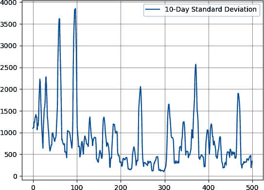

# 第十一章：高级技术和策略

到目前为止，您应该对深度学习算法及其如何开发模型以预测时间序列数据有了坚实的理解。尽管这只是部署盈利算法的第一步，但您应该知道，您从本书开始以来已经走了很长一段路。本章分为独立的几节，讨论了应用一些先进的深度学习技术和时间序列预测方法的有趣方式，以及增强该过程。

# 利用 COT 数据预测长期趋势

*交易者承诺*（COT）报告是由美国商品期货交易委员会（CFTC）发布的[每周发布](https://oreil.ly/PLtaP)，提供了期货市场各种市场参与者持仓情况的信息。该报告基于从期货交易所（包括芝加哥商品交易所（CME）和洲际交易所（ICE））收集的数据。COT 报告将交易者分为三大组：

商业交易商（也称为经销商或套期保值者）

这些通常是利用期货市场来对冲其主要业务活动的公司。例如，粮食生产商可能使用期货合约来保护农业市场价格波动。他们的头寸通常与基础市场呈负相关。

非商业交易者（也称为基金或杠杆资金）

此组包括大型投机者，如对冲基金和商品交易顾问。非商业交易者通常根据其市场展望和追求利润的策略进行头寸建立。他们的头寸通常与基础市场呈正相关，因为他们具有追随趋势的特性。

非报告类交易者

此类别包括小型投机者和其头寸不符合 CFTC 设定的报告要求的交易者。他们与基础市场之间没有明确的相关性。

该报告详细说明了每个组的持仓情况，指出它们在特定期货市场中是否*净多头*（持有的多头头寸多于空头头寸）或*净空头*（持有的空头头寸多于多头头寸）。

交易者和投资者分析 COT 报告，以深入了解不同市场参与者的情绪和行为。通过监控头寸变动，他们试图识别市场潜在趋势或反转。该报告在商品和货币市场特别受欢迎，被用作基本分析工具和评估市场情绪。本节介绍了以下内容：

+   创建一个算法自动下载 COT 数据并进行分析。

+   绘制并理解 COT 值与其相应基础市场之间的相关性。此外，检查 COT 值中的平稳性，以查看它们是否可以直接用于算法中。

+   使用滞后值创建一个 LSTM 算法，以预测下一个 COT 值并进行评估。这将被称为*间接单步 COT 模型*。

+   使用直接方法创建一个 LSTM 算法，以预测未来几周的 COT 观察值。这将被称为*MPF COT 直接模型*。

+   使用递归方法创建一个 LSTM 算法，以预测未来几周的 COT 观察值。这将被称为*MPF COT 递归模型*。

COT 报告中主要有四列感兴趣的内容：长期对冲者、短期对冲者、长期基金和短期基金。它们是计算净对冲者和净基金的四个基本支柱。一些交易者喜欢在进行净值计算和看到更大画面之前分析每一列。在进行净值过程之前了解每一列背后的逻辑有助于理解。

长期对冲者（商业交易者的多头头寸百分比）

你可以将这些对冲者视为资产的*消费者*。长期对冲者是购买某种资产（如小麦）期货以对冲其主要业务的实体。主要目标是通过在未来锁定所需的固定价格来保护自己免受价格上涨的风险。通过这样做，他们可以更准确地计划生产成本，并避免如果小麦价格上涨可能带来的损失。因此，长期对冲者购买资产是出于担心其价格将上涨。他们通常在价格下跌时购买，这导致与资产价格的负相关性。

短期对冲者（商业交易者的空头头寸百分比）

你可以将这些对冲者视为资产的*生产者*。短期对冲者是出售某种资产的空头期货以对冲其主要业务的实体。主要目标是保护自己免受价格下跌的风险。因此，短期对冲者在资产价格上涨时卖出。他们通常在价格上涨时出售，这导致与资产价格的正相关性（这意味着随着资产价格的上涨，短期对冲者的数量增加）。

长期基金（非商业交易者的多头头寸百分比）

投机性长期基金头寸是未来合约的买方，预期价格将上涨。由于其追随趋势的特性，它们与资产价格有正相关性。

空头基金（非商业交易者的空头头寸百分比）

投机性卖空基金头寸是未来合约的卖方，预期价格将下跌。由于其追随趋势的特性，它们与资产价格有负相关性。例如，当资产上涨时，这些空头基金的数量减少。

###### 注

根据您的需求，可以以不同方式进行 COT 报告的清算。如果您偏向于商业交易者，那么您可以简单地取商业多头和商业空头之间的差值（或者您可以称之为消费者和生产者）。如果您偏向于非商业交易者，那么您可以取非商业多头和非商业空头之间的差值。如果您偏向于全球视角，那么您可以取商业和非商业交易者的净清算差值，这样您将得到一个只总结特定资产市场定位全局图像的时间序列。

表 11-1 对净 COT 值的计算进行了一些解释。

表 11-1\. COT 净清算表示

| 套保者多头 | 套保者空头 | 基金多头 | 基金空头 | 净套保者 | 净基金 | 净 COT |
| --- | --- | --- | --- | --- | --- | --- |
| A | B | C | D | E = A - B | F = C - D | G = F - E |

净 COT 值具有以下公式：

Net COT = 净资金 - 净套保者

它与资产的基础价格呈正相关。图 11-1 显示了加拿大元（CAD）的净 COT 定位。


###### 图 11-1\. 自 2015 年以来的净 COT 加元；注意其价值的均值回归性质。

让我们看看如何使用 Python 下载 COT 值。首先，`pip install` 允许您自动从 CFTC 网站下载 COT 值的库：

```py
pip install cot_reports
```

如果库存在问题，您可以使用在[GitHub 仓库](https://oreil.ly/5YGHI)中找到的预下载的 Excel 格式 COT 报告进行手动导入（本节末尾提供了一个代码块）。

导入必要的库以下载 COT 报告的历史观察结果。为简单起见，让我们选择加元的定位：

```py
import pandas as pd
import matplotlib.pyplot as plt
import numpy as np
from master_function import import_cot_data
```

允许您获取所选市场 COT 值的 `import_cot_data()` 函数定义如下（在 *master_function.py* 中找到）：

```py
def import_cot_data(start_year, end_year, market):
    df = pd.DataFrame()
    for i in range(start_year, end_year + 1):
        single_year = pd.DataFrame(cot.cot_year(i, 
                      cot_report_type='traders_in_financial_futures_fut'))
        df = pd.concat([single_year, df], ignore_index=True)
    new_df = df.loc[:, ['Market_and_Exchange_Names',
                        'Report_Date_as_YYYY-MM-DD',
                        'Pct_of_OI_Dealer_Long_All',
                        'Pct_of_OI_Dealer_Short_All',
                        'Pct_of_OI_Lev_Money_Long_All',                    
                        'Pct_of_OI_Lev_Money_Short_All']]
    new_df['Report_Date_as_YYYY-MM-DD'] = 
                       pd.to_datetime(new_df['Report_Date_as_YYYY-MM-DD'])
    new_df = new_df.sort_values(by='Report_Date_as_YYYY-MM-DD')
    data = new_df[new_df['Market_and_Exchange_Names'] == market]
    data['Net_COT'] = (data['Pct_of_OI_Lev_Money_Long_All'] – \
                       data['Pct_of_OI_Lev_Money_Short_All']) – \
                      (data['Pct_of_OI_Dealer_Long_All'] –\
                       data['Pct_of_OI_Dealer_Short_All'])                
    return data

```

要导入加元 COT 值，使用以下语法：

```py
CAD = 'CANADIAN DOLLAR - CHICAGO MERCANTILE EXCHANGE'
data = import_cot_data(2015, 2023, CAD)
data = np.array(data.iloc[:, –1], dtype = np.float64)

```

值得一提的是，其他市场有以下代码名称，您可以用来导入它们：

```py
EUR = 'EURO FX - CHICAGO MERCANTILE EXCHANGE'
GBP = 'BRITISH POUND STERLING - CHICAGO MERCANTILE EXCHANGE'
JPY = 'JAPANESE YEN - CHICAGO MERCANTILE EXCHANGE'
CHF = 'SWISS FRANC - CHICAGO MERCANTILE EXCHANGE'
AUD = 'AUSTRALIAN DOLLAR - CHICAGO MERCANTILE EXCHANGE'
MXN = 'MEXICAN PESO - CHICAGO MERCANTILE EXCHANGE'
BRL = 'BRAZILIAN REAL - CHICAGO MERCANTILE EXCHANGE'
BTC = 'BITCOIN - CHICAGO MERCANTILE EXCHANGE'
SPX = 'E-MINI S&P 500 - CHICAGO MERCANTILE EXCHANGE'

```

###### 注意

如果出现请求错误，请在运行导入部分之前应用以下代码（记得 `pip install` *proxy_requests* 库）：

```py
from proxy_requests.proxy_requests import ProxyRequests
req = ProxyRequests("https://api.ipify.org")
req.get()
```

图 11-2 显示了加元相对于加元/美元的净 COT 定位。注意两者之间强烈的正相关性。计算最近 200 次观察的皮尔逊相关系数为惊人的 0.66。换句话说，净 COT 数据的高点与加元/美元的高点相吻合。同样，净 COT 数据的低点与加元/美元的低点相吻合。


###### 图 11-2\. 加元/美元（左刻度）与加元净 COT 定位（右刻度）。

###### 警告

请注意，图表显示的是 CADUSD 而不是常用的 USDCAD 货币对。这是因为您试图理解 CAD；因此，将其作为基础货币有助于您看到 CAD 投机者的正相关性以及 CAD 套期保值者的负相关性。要从 USDCAD 观察中获得 CADUSD，请取其倒数：

<math alttext="upper C upper A upper D upper U upper S upper D equals StartFraction 1 Over upper U upper S upper D upper C upper A upper D EndFraction"><mrow><mi>C</mi> <mi>A</mi> <mi>D</mi> <mi>U</mi> <mi>S</mi> <mi>D</mi> <mo>=</mo> <mstyle displaystyle="false" scriptlevel="0"><mfrac><mn>1</mn> <mrow><mi>U</mi><mi>S</mi><mi>D</mi><mi>C</mi><mi>A</mi><mi>D</mi></mrow></mfrac></mstyle></mrow></math>

下一步是检查 COT 值的平稳性，以了解是否需要进行转换。请记住，转换可以是差分、取百分比回报，甚至使用分数阶差分（如第九章所述）：

```py
from statsmodels.tsa.stattools import adfuller
print('p-value: %f' % adfuller(raw_data)[1])
```

输出如下：

```py
p-value: 0.000717
```

COT 值似乎是稳定的，可以用作算法的输入。

## 算法 1：间接单步 COT 模型

拟合优度模型将使用长短期记忆（LSTM）来预测每个时间步长的下一个 COT 值。假设预测与基础市场方向相关的值可能会对未来一周的预期移动产生偏见。例如，如果预测未来一周 COT 值较高，则您可能会在每周交易准备中有一个看涨 CAD 的偏好。

首先，导入所需的库：

```py
import pandas as pd
import matplotlib.pyplot as plt
import numpy as np
from keras.models import Sequential
from keras.layers import Dense, LSTM
from master_function import import_cot_data, data_preprocessing
from master_function import plot_train_test_values, 
from master_function import calculate_directional_accuracy
from sklearn.metrics import mean_squared_error
```

导入所需的数据：

```py
CAD = 'CANADIAN DOLLAR - CHICAGO MERCANTILE EXCHANGE'
data = import_cot_data(2015, 2023, CAD)
data = np.array(data.iloc[:, –1], dtype = np.float64)
```

设置超参数并创建数组：

```py
num_lags = 100
train_test_split = 0.80
num_neurons_in_hidden_layers = 200
num_epochs = 200
batch_size = 4
# Creating the training and test sets
x_train, y_train, x_test, y_test = data_preprocessing(data, 
                                                      num_lags, 
                                                      train_test_split)

```

为了符合 LSTM 架构，独立变量必须转换为三维数组。可以使用以下代码完成这一操作：

```py
x_train = x_train.reshape((–1, num_lags, 1))
x_test = x_test.reshape((–1, num_lags, 1))
```

接下来，创建模型的架构并预测训练集（仅了解拟合优度）和测试集上的值：

```py
# Create the LSTM model
model = Sequential()
# Adding a first layer
model.add(LSTM(units = neurons, input_shape = (num_lags, 1)))
# Adding a second layer
model.add(Dense(neurons, activation = 'relu')) 
# Adding the output layer
model.add(Dense(units = 1))
# Compiling the model
model.compile(loss = 'mean_squared_error', optimizer = 'adam')
# Fitting the model
model.fit(x_train, y_train, epochs = num_epochs, batch_size = batch_size)
# Predicting in the training set for illustrative purposes
y_predicted_train = model.predict(x_train)
# Predicting in the test set
y_predicted = model.predict(x_test)
```

要绘制预测值与实际值的图表，请使用以下语法：

```py
plot_train_test_values(100, 50, y_train, y_test, y_predicted)
```

图 11-3 将预测值与实际测试值进行了比较。乍看之下，模型似乎很好地捕捉了 COT 值的变化。让我们来看一下性能结果。


###### 图 11-3\. COT 训练数据后跟 COT 测试数据（虚线）和预测的 COT 数据（细线）；垂直虚线表示测试期的开始。使用的模型是 LSTM 回归算法。

在从 2015 年到 2023 年使用的 CADUSD 模型结果如下：

```py
Directional Accuracy Train =  86.18 %
Directional Accuracy Test =  60.87 %
RMSE Train =  5.3655332132
RMSE Test =  14.7772701349
Correlation In-Sample Predicted/Train =  0.995
Correlation Out-of-Sample Predicted/Test =  0.88

```

###### 注意

对您而言的一个有趣任务是应用模型来预测基础市场的回报，使用 COT 值作为输入。您可以使用净 COT 值或其他六个可用的系列之一，例如长期套期保值者和净资金。但请务必始终检查平稳性。

## 算法 2：MPF COT 直接模型

MPF COT 模型将使用 LSTM 预测 COT 值的轨迹，以引导主要市场走势的到来。假设通过预测下一个 COT 值（比市场本身更少噪音），您可以获得市场预期轨迹的指南。由于 COT 值是平稳的，并且与非平稳的市场高度相关，使用 MPF 直接在市场上预测比使用 MPF 在市场上直接预测要有更好的预测机会。该算法使用直接方法（更多信息，请参阅第九章）。首先，导入所需的库：

```py
import pandas as pd
import matplotlib.pyplot as plt
import numpy as np
from keras.models import Sequential
from keras.layers import Dense, LSTM
from master_function import import_cot_data, direct_mpf
from master_function import calculate_directional_accuracy
from sklearn.metrics import mean_squared_error

```

设置超参数并创建数组：

```py
# Setting the hyperparameters
num_lags = 100
train_test_split = 0.80
neurons = 400
num_epochs = 200
batch_size = 10
forecast_horizon = 50
# Creating the training and test sets
x_train, y_train, x_test, y_test = direct_mpf(data, 
                                              num_lags, 
                                              train_test_split, 
                                              forecast_horizon)

```

为了符合 LSTM 结构，必须将独立变量转换为三维数组。可以使用以下代码完成：

```py
x_train = x_train.reshape((–1, num_lags, 1))
x_test = x_test.reshape((–1, num_lags, 1))

```

接下来，创建模型的结构并使用递归函数预测值：

```py
# Create the LSTM model
model = Sequential()
# Adding a first layer
model.add(LSTM(units = neurons, input_shape = (num_lags, 1)))
# Adding a second layer
model.add(Dense(neurons, activation = 'relu')) 
# Adding the output layer 
model.add(Dense(units = forecast_horizon))
# Compiling the model
model.compile(loss = 'mean_squared_error', optimizer = 'adam')
# Fitting the model
model.fit(x_train, y_train, epochs = num_epochs, batch_size = batch_size)
# Predicting in the test set
y_predicted = model.predict(x_test)

```

要绘制预测值与实际值的图，使用以下语法：

```py
plt.plot(y_predicted[–1], label = 'Predicted data', color = 'red', 
         linewidth = 1)
plt.plot(y_test[–1], label = 'Test data', color = 'black', 
         linestyle = 'dashed', linewidth = 2)
plt.grid()
plt.legend()

```

图 11-4 将预测值与真实测试值进行了比较。


###### 图 11-4\. 预测数据与测试数据对比。

以下是对 CADUSD 使用的模型的结果：

```py
Directional Accuracy Test =  57.14 %
RMSE Test =  26.4021245739
Correlation Out-of-Sample Predicted/Test =  0.426

```

## 算法 3：MPF COT 递归模型

该算法使用递归方法（更多信息，请参阅第九章）。首先，导入所需的库：

```py
import pandas as pd
import matplotlib.pyplot as plt
import numpy as np
from keras.models import Sequential
from keras.layers import Dense, LSTM
from master_function import data_preprocessing, import_cot_data
from master_function import plot_train_test_values, recursive_mpf
from master_function import calculate_directional_accuracy

```

设置超参数并创建数组：

```py
num_lags = 100
train_test_split = 0.80
neurons = 100
num_epochs = 200
batch_size = 2
# Creating the training and test sets
x_train, y_train, x_test, y_test = data_preprocessing(data,
                                                      num_lags,
                                                      train_test_split)

```

为了符合 LSTM 结构，必须将独立变量转换为三维数组。可以使用以下代码完成：

```py
x_train = x_train.reshape((–1, num_lags, 1))
x_test = x_test.reshape((–1, num_lags, 1))
```

接下来，创建模型的结构并使用递归函数预测值：

```py
# Create the LSTM model
model = Sequential()
# Adding a first layer
model.add(LSTM(units = neurons, input_shape = (num_lags, 1)))
# Adding a second layer
model.add(Dense(neurons, activation = 'relu')) 
# Adding the output layer 
model.add(Dense(units = 1))
# Compiling the model
model.compile(loss = 'mean_squared_error', optimizer = 'adam')
# Fitting the model
model.fit(x_train, y_train, epochs = num_epochs, batch_size = batch_size)
# Predicting in the test set on a recursive basis
x_test, y_predicted = recursive_mpf(x_test, y_test, num_lags, model)

```

要绘制预测值与实际值的图，使用以下语法：

```py
plot_train_test_values(100, 50, y_train, y_test, y_predicted)
```

图 11-5 将预测值与测试值进行了比较。


###### 图 11-5\. COT 数据的多期预测。

以下是对从 2015 年到 2023 年 CADUSD 使用的模型的结果：

```py
Directional Accuracy Test =  52.17 %
RMSE Test =  40.3120541504
Correlation Out-of-Sample Predicted/Test =  0.737

```

###### 注意

记住，在设置 `random_state` 并确保可复现性对于实验是有用的，但如果数据分布确实是随机的，则可能限制模型良好泛化的能力。在许多情况下，建议使用不同的随机种子进行多次运行，以更好地了解模型的性能和稳健性。这就是为什么本书中许多模型的代码中没有 `random_state` 实现（除了第七章中的少数模型）。

不要忘记过拟合的症状。不幸的是，过拟合有时并不那么容易检测到，因此请考虑这些一般规则：

高训练精度和低测试精度

该模型在训练数据上表现出色，但在测试数据上表现不佳。这清楚地表明，该模型记住了训练数据，而非学习了一般模式。

训练和测试性能之间存在显著差距

训练和测试误差率之间存在显著差异。理想情况下，这两个指标应该接近，而较大的差距则表明过拟合。

模型复杂度异常高

如果模型过于复杂，具有大量参数或特征，则更容易出现过拟合。较简单的模型可能对新数据泛化效果更好。

噪声预测

过拟合模型倾向于在新数据上做出错误和不一致的预测。这是因为它们对输入数据的微小变化（包括噪声）非常敏感。

## 综合应用

每周五由 CFTC 发布的 COT 报告概述了关键市场参与者的持仓情况。它可以转化为时间序列预测任务，旨在改善市场预测。特别感兴趣的市场参与者是商业参与者（交易商或对冲者）和非商业参与者（杠杆资金或基金）。

###### 注意

确保将*master_function.py*放在解释器的目录中。或者，您可以简单地在 Python 中打开*master_function.py*并执行整个文件。但是，后一种方法需要您每次重新启动内核时都这样做。

深度学习技术可以应用于 COT 值，以预测市场定位通过隐藏模式和季节配置。本节讨论了三种算法从 COT 报告中挤出价值。您可以尝试使用机器学习模型、深度强化学习，甚至简单的统计技术来更好地理解 COT 数据。

要手动导入 COT 值，请参考在[GitHub 仓库](https://oreil.ly/5YGHI)找到的历史数据，并使用以下代码（将解释器的路径更改为下载文件所在的位置）：

```py
import pandas as pd
import numpy as np
# Import the data using pandas
data = pd.read_excel('name_of_file.xlsx')

```

重要的是要记住 COT 报告提供了市场参与者持仓的快照，应与其他工具和分析方法结合使用。虽然它可以提供有价值的信息，但它并不是独立的交易策略，而是需要仔细考虑其他因素才能做出明智的交易决策。

# 使用技术指标作为输入

您在第五章中学习了技术指标。现在是时候将它们作为输入，以预测底层市场的回报。使用滞后值意味着过去的观察值可能会转化为可观测的预测。本节将探讨这一假设之外的过去，并寻找其他价格变换中的价值。您可以进行以下价格衍生计算：

数学变换

这种转换类型很可能是对原始数据的直接操作。一个例子是基本差分或简单移动平均。归一化也是数学转换的一部分。

技术转换

这种类型的转换不太明显，结果可能一点也不像原始数据。例如，RSI 就是这样的一个技术指标，它是基于移动平均线和归一化的递归规则创建的。

分类转换

这种转换类型将数值数据转换为分类数据，反之亦然。例如，被称为*OneHotEncoder*的算法将分类数据转换为二进制数据，以便机器学习算法能够对其进行分类。

在继续之前，有一个值得讨论的数据问题。*多重共线性*是回归分析中的统计现象，当多个独立变量（输入）在多元回归模型中彼此高度相关时发生。换句话说，这种情况是指两个或更多预测变量之间存在强线性关系。这种相关性可能会使得回归模型难以区分每个预测变量对依赖变量（结果变量）的个别影响。显然，如果您使用具有不同时间周期的多个 RSI 指标，则很可能会遇到多重共线性问题。请确保寻找弱相关的指标。

本示例中使用了两个技术指标（或转换）：

+   五周 RSI，一个不需要任何转换的稳定指标。

+   周收盘价与 20 周移动平均线之间的差异。这也是一个不需要任何转换的稳定计算。

因此，将使用上周的 RSI 值和上周收盘价与 20 周移动平均线之间的距离来预测 EURUSD 的每周回报。

首先，导入所需的库：

```py
import pandas as pd
import matplotlib.pyplot as plt
import numpy as np
from keras.models import Sequential
from keras.layers import Dense, LSTM
from master_function import mass_import, rsi, ma, calculate_accuracy
from master_function import plot_train_test_values, 
from master_function import multiple_data_preprocessing
from sklearn.metrics import mean_squared_error
from master_function import add_column, delete_column

```

接下来，使用`mass_import()`函数导入数据：

```py
data = mass_import(0, 'W1')[:, –1]
data = rsi(np.reshape(data, (–1, 1)), 5, 0, 1)
data = ma(data, 5, 0, 2)
data[:, 2] = data[:, 0] – data[:, 2]
data = add_column(data, 1)
for i in range(len(data)):
    data[i, 3] = data[i, 0] – data[i – 1, 0]
data[:, 0] = data[:, –1]
data = delete_column(data, 3, 1)
```

定义多数据预处理函数，该函数获取两个技术指标的值并对它们进行滞后处理，以便用作预测 EURUSD 回报的输入。表 11-2 显示了训练表`x_train`，其中包含六个滞后值作为独立变量来解释和预测下一个 EURUSD 回报。

表 11-2。训练数组的示例

| RSI t–1 | (Close – MA)t–1 | RSI t–2 | (Close – MA)t–2 | RSI t–3 | (Close – MA)t–3 |
| --- | --- | --- | --- | --- | --- |
| 36.6190 | –0.003804 | 48.5188 | 0.001044 | 42.4396 | –0.001714 |
| 46.7928 | 0.001674 | 36.6190 | –0.003804 | 48.5188 | 0.001044 |
| 40.5430 | –0.002518 | 46.7928 | 0.001674 | 36.6190 | –0.003804 |
| 65.9614 | 0.011340 | 40.5430 | –0.002518 | 46.7928 | 0.001674 |
| 47.2585 | –0.000390 | 65.9614 | 0.011340 | 40.5430 | –0.002518 |
| 63.9755 | 0.011302 | 47.2585 | –0.000390 | 65.9614 | 0.011340 |

下一个函数已经定义，但讨论其功能并无害处。`multiple_data_preprocessing()`函数仅为回测创建了四个必需的数组，但使用了两个技术指标作为输入。你可以定义这个函数来处理六个滞后值（三个用于 RSI，三个用于收盘价与移动平均值之间的差）如下：

```py
def multiple_data_preprocessing(data, train_test_split):
    data = add_column(data, 4)
    data[:, 1] = np.roll(data[:, 1], 1, axis = 0)
    data[:, 2] = np.roll(data[:, 2], 1, axis = 0)
    data[:, 3] = np.roll(data[:, 1], 1, axis = 0)
    data[:, 4] = np.roll(data[:, 2], 1, axis = 0)
    data[:, 5] = np.roll(data[:, 3], 1, axis = 0)
    data[:, 6] = np.roll(data[:, 4], 1, axis = 0)
    data = data[1:, ]
    x = data[:, 1:]
    y = data[:, 0]
    split_index = int(train_test_split * len(x))
    x_train = x[:split_index]
    y_train = y[:split_index]
    x_test = x[split_index:]
    y_test = y[split_index:]
    return x_train, y_train, x_test, y_test
```

设定超参数并创建数组：

```py
num_lags = 6 # Must equal the number of the lagged values you create
train_test_split = 0.80
neurons = 500
num_epochs = 500
batch_size = 200
# Creating the training and test sets
x_train, y_train, x_test, y_test = multiple_data_preprocessing(data, 
                                                   train_test_split)

```

要符合 LSTM 架构，独立变量必须转换为三维数组。这可以通过以下代码完成：

```py
x_train = x_train.reshape((–1, num_lags, 1))
x_test = x_test.reshape((–1, num_lags, 1))
```

接下来，创建模型的架构并预测训练集（仅了解拟合程度）和测试集上的值：

```py
# Create the LSTM model
model = Sequential()
# Adding a first layer
model.add(LSTM(units = neurons, input_shape = (num_lags, 1)))
# Adding a second layer
model.add(Dense(neurons, activation = 'relu')) 
# Adding a third layer
model.add(Dense(neurons, activation = 'relu')) 
# Adding a fourth layer
model.add(Dense(neurons, activation = 'relu')) 
# Adding a fifth layer
model.add(Dense(neurons, activation = 'relu')) 
# Adding the output layer 
model.add(Dense(units = 1))
# Compiling the model
model.compile(loss = 'mean_squared_error', optimizer = 'ada
# Fitting the model
model.fit(x_train, y_train, epochs = num_epochs, batch_size = batch_size)
# Predicting in the training set for illustrative purposes
y_predicted_train = model.predict(x_train)
# Predicting in the test set
y_predicted = model.predict(x_test)

```

要绘制预测值与实际值，请使用以下语法：

```py
plot_train_test_values(100, 50, y_train, y_test, y_predicted)
```

图 11-6 将预测值与真实测试值进行比较。


###### 图 11-6\. 训练数据随后是测试数据（虚线），以及预测数据（细线）；垂直虚线代表测试期的开始。使用的模型是 LSTM 回归算法。

以下是模型的结果：

```py
Accuracy Train =  59.39 %
Accuracy Test =  51.82 %
RMSE Train =  0.0163232045
RMSE Test =  0.0122093494
Correlation In-Sample Predicted/Train =  0.255
Correlation Out-of-Sample Predicted/Test =  0.015
```

调整模型并看到如何改进是非常有趣的。由于这些是每周的预测，高准确率可能是优化模型和确保不过拟合的第一步。¹ 值得注意的是，由于此算法试图预测工具的财务回报，所以使用`calculate_accuracy()`函数而不是`ca⁠lc⁠ul⁠ate_​di⁠re⁠cti⁠on⁠al_accuracy()`。

###### 注意

尝试在 MPF 模式下运行本节中看到的算法，并看看你能从中提取什么。记住在执行时算法的限制条件。

# 使用深度学习预测比特币的波动性

*比特币*是一种去中心化的数字货币，由一个使用化名*Satoshi Nakamoto*的未知个人或实体于 2009 年创造。它是第一个引入的加密货币，至今仍然是最知名和广泛交易的加密货币。考虑到这些年对比特币的巨大炒作，你可能不需要介绍它，但多一些了解永远有好处。

比特币运行在一种名为*区块链*的技术上，这是一个分布式分类帐系统。与由政府或中央银行发行和监管的传统货币不同，比特币不受任何中央机构控制。

相反，它依赖于一个点对点网络的计算机节点来验证和记录交易。如今，比特币在加密货币交易所上交易频繁，并用于投机和套期保值操作。最常交易的货币对是 BTCUSD，即 1 比特币相对于美元的价值。

图 11-7 显示了 BTCUSD（比特币兑美元的价值）的演变。


###### Figure 11-7\. 自 2014 年以来 BTCUSD 的历史演变，使用线性刻度。

您可以使用以下代码生成 Figure 11-7：

```py
import pandas as pd
# Manually importing BTCUSD values
my_data = pd.read_excel('Bitcoin_Daily_Historical_Data.xlsx')
# Renaming the columns
my_data.columns = ['Date', 'Open', 'High', 'Low', 'Close']
# Setting the date column
my_data['Date'] = pd.to_datetime(my_data['Date'])
# Charting
plt.plot(my_data['Date'], my_data['Close'], label = 'BTCUSD', 
         color = 'black')
plt.legend()
plt.grid()

```

确保从[GitHub 仓库](https://oreil.ly/5YGHI)下载历史 BTCUSD 值，并将解释器目录设置为与下载文件相同的文件夹中。

Figure 11-7 使用线性刻度绘制，这意味着数据在直线和均匀间隔的轴上表示（10 和 20 之间的空间与 1230 和 1240 之间的空间相同）。还可以使用所谓的对数刻度来绘制经历大幅跳跃的时间序列。

Figure 11-8 显示了 BTCUSD（比特币价值以美元计价）的对数尺度演变。


###### Figure 11-8\. 自 2014 年以来 BTCUSD 的历史演变，使用半对数尺度。

使用以下代码使用`plt.semilogy()`函数生成 Figure 11-8：

```py
plt.semilogy(my_data['Date'], my_data['Close'], label = 'BTCUSD', 
             color = 'black')
plt.legend()
plt.grid()

```

###### 注意

*semilog*一词指的是将两个轴之一转换为对数刻度，而*log*指的是将两个轴都转换为对数刻度。

由于时间是线性的，因此您只需转换*y*-轴（即值），因此您在技术上使用的是半对数图表。这就是为什么`matplotlib()`函数被称为`pl⁠t.​se⁠mi⁠log⁠y()`。

如果您喜欢使用 Python 脚本导入 BTCUSD 值，请使用以下代码：

```py
import requests
import json
import pandas as pd
import numpy as np  
import datetime as dt

# Selecting the time frame
frequency = '1h'
# Defining the import function
def import_crypto(symbol, interval = frequency):
    # Getting the original link from Binance
    url = 'https://api.binance.com/api/v1/klines'
    # Linking the link with the cryptocurrency and the time frame
    link = url + '?symbol=' + symbol + '&interval=' + interval
    # Requesting the data in the form of text
    data = json.loads(requests.get(link).text)
    # Converting the text data to a dataframe
    data = np.array(data)
    data = data.astype(np.float)
    data = data[:, 1:5]
    return data
# Importing hourly BTCUSD data
data = import_crypto('BTCUSDT')

```

让我们看看深度学习是否有助于利用滞后值预测 BTCUSD 的波动性。但首先，有两个问题需要回答：

+   预测比特币波动性的用途是什么？

+   如何计算比特币的波动性？

要回答第一个问题，通过预测比特币的波动性，交易者可以潜在地识别出价格波动增加的时期，并从中获利。类似地，波动性预测还可以提供市场情绪的见解。当投资者预期不确定或动荡的市场条件时，可能表明缺乏信心，从而导致市场动态的潜在变化。

要回答第二个问题，您可以使用收盘价格的滚动标准差测量。这允许您创建一个反映比特币历史波动性的新时间序列。

###### 注意

通常，波动率的增加是市场压力和恐惧的迹象，这转化为熊市情绪。相反，波动率的减少是市场健康稳定的迹象，这转化为牛市。这种关系并不完美，其他变量可能会影响它。例如，如果你计算比特币每日收盘价格与 10 天滚动波动率的相关系数，你会发现它是正的（在某些时期，它非常正）。比特币以兴奋资产而闻名，涨势伴随着一种称为 FOMO 的现象，即*害怕错过*的缩写。这种心理偏差是市场泡沫的构成要素之一，所有人都希望从中获利而不断买入。

预测分析的第一步是理解你正在处理的数据。提醒一下，波动率指的是金融工具（如股票、债券、大宗商品或货币）价格在特定时间段内的变化或波动程度。它是该特定资产的离散度的统计度量。

图 11-9 显示了比特币的最新 10 天波动率值，这些值是通过滚动标准差计算得出的。最新的数据表明，最近，价格波动大部分时间都在 10 天均值周围的 500 美元左右波动（更深入地了解标准差，请参阅第三章）。



###### 图 11-9. 比特币的滚动 10 天标准差作为波动率的代理。

让我们开始吧。对于这个任务，让我们手动将 BTCUSD 导入解释器。首先，导入所需的库：

```py
import pandas as pd
import matplotlib.pyplot as plt
import numpy as np
from keras.models import Sequential
from keras.layers import Dense, LSTM
from master_function import add_column, delete_row, volatility
from master_function import data_preprocessing, plot_train_test_values
from master_function import calculate_directional_accuracy
from sklearn.metrics import mean_squared_error
from statsmodels.tsa.stattools import adfuller

```

接下来，使用*pandas*导入数据：

```py
data = pd.read_excel('Bitcoin_Daily_Historical_Data.xlsx').values

```

下一步是计算波动率。其函数在`master_function`中定义，因为你已经导入了它，所以应该可以直接使用：

```py
data = volatility(data, 10, 0, 1)
data = data[:, –1]
```

你必须检查是否平稳。如果数据是平稳的，那么它就准备好用于训练了。否则，你可能需要进行转换。以下代码对比特币的 10 天波动率应用 ADF 测试：

```py
print('p-value: %f' % adfuller(data)[1])
```

这是输出：

```py
p-value: 0.120516
```

看起来波动率值是非平稳的。让我们尝试进行差分：

```py
data = np.diff(data)
```

###### 注意

你也可以应用分数阶差分以保留一丝记忆。

图 11-10 显示了比特币的最新 10 天差异波动率值。


###### 图 11-10. 比特币的滚动 10 天标准差（差异）。

接下来是设置超参数并像往常一样准备数组：

```py
num_lags = 300
train_test_split = 0.80
neurons = 80
num_epochs = 100
batch_size = 500
# Prepare the arrays
x_train, y_train, x_test, y_test = direct_mpf(data, 
                                              num_lags, 
                                              train_test_split, 
                                              forecast_horizon)

```

要符合 LSTM 架构，独立变量必须转换为三维数组。这可以通过以下代码完成：

```py
x_train = x_train.reshape((–1, num_lags, 1))
x_test = x_test.reshape((–1, num_lags, 1))
```

创建深度神经网络架构，并添加几个额外的层：

```py
# Create the LSTM model
model = Sequential()
# Adding a first layer
model.add(LSTM(units = neurons, input_shape = (num_lags, 1)))
# Adding a second layer
model.add(Dense(neurons, activation = 'relu')) 
# Adding a third layer
model.add(Dense(neurons, activation = 'relu')) 
# Adding a fourth layer
model.add(Dense(neurons, activation = 'relu')) 
# Adding the output layer 
model.add(Dense(units = forecast_horizon))
# Compiling the model
model.compile(loss = 'mean_squared_error', optimizer = 'adam')

```

现在，拟合并预测数据：

```py
model.fit(x_train, y_train, epochs = num_epochs, batch_size = batch_size)
y_predicted = model.predict(x_test)

```

图 11-11 比较了预测值与测试值。


###### 图 11-11. 预测比特币的波动性；所使用的模型是 LSTM 回归算法。

以下是模型的结果：

```py
Accuracy Train =  66.56 %
Accuracy Test =  63.59 %
RMSE Train =  95.6086778521
RMSE Test =  186.1401365824
Correlation In-Sample Predicted/Train =  0.807
Correlation Out-of-Sample Predicted/Test =  0.56
```

请记住，由于回测期间、时间粒度、交易成本、不同经纪人的不同报价、不同超参数和不同随机化，回测结果可能会有显著差异。优化是关键组成部分，必须在对算法形成意见之前对结果进行验证。因此，你的任务是改善结果，并更好地预测波动性。

你可能还想知道是否可以直接准确地预测比特币的回报，而不是随机的。答案是肯定的，如果你需要一些可能有助于预测比特币回报的输入的想法，请查看以下非详尽列表：

+   *历史价格数据及其衍生品*：使用历史价格数据是预测回报的基本方面。你可以包括每日、每周或每月价格变动、移动平均值和价格波动率等特征。

+   *交易量*：比特币的交易量提供了有关市场活动水平和流动性的宝贵信息。更高的交易量通常伴随着重大的价格波动。

+   *市场情绪指标*：来自社交媒体平台、新闻文章或论坛的情绪分析可以帮助衡量市场对比特币的整体情绪。比特币的恐惧与贪婪指数是一个不错的选择，因为它每天发布一次，并使用许多基本变量来计算其值。

+   *网络指标*：比特币的区块链数据提供了有用的指标，例如交易数量、哈希率和难度水平。这些指标反映了比特币网络的活动和健康状况，这可能会影响价格。

+   *市场指标*：考虑使用一般市场指标，如标普 500 指数或恐慌指数作为外部变量。加密货币，包括比特币，有时会与传统金融市场表现出相关性。

+   *加密货币特定指标*：与加密货币领域特定的其他指标，例如所有加密货币的总市值和比特币的主导比例，可能提供有关更广泛市场情况的见解。

+   *技术指标*：各种技术分析指标，例如 RSI 和波动性，可以提供有关潜在价格趋势和逆转的见解。

+   *Google 趋势*：监测与比特币相关的搜索词在 Google 趋势上的流行度可以提供有关公众兴趣和潜在价格变动的见解。

+   *加密货币交易数据*：来自加密货币交易所的数据，例如未平仓合约、资金费率和清算数据，可以提供有关市场动态和潜在价格变动的见解。

# 训练的实时可视化

训练过程中发生了什么？当你查看每个时期的进度条时，你会发现训练过程正在进行中：

第 1/100 时期

9/9 [=============================] – 3s 77ms/step - loss: 0.0052

Epoch 2/100

9/9 [=============================] – 1s 78ms/step - loss: 0.0026

Epoch 3/100

9/9 [=============================] – 1s 68ms/step - loss: 0.0015

然而，您还可以编写一个动态图表，显示样本内预测如何通过时期更新并接近样本内的真实值。这将是本节的第一个目标。在继续之前，请刷新您对术语的理解：

在样本内的真实值

这些是`y_train`中包含的值。它们是模型用来校准训练的真实值。它们属于训练集。

样本内的预测

这些是`y_predicted_train`中包含的值。它们是模型在训练过程中输出的预测值。它们属于训练集，并受到*前瞻偏差*的影响，即在做出决策或预测时使用未来信息，而这些决策或预测应该基于当时仅有的历史数据。

样本外的真实值

这些是用于测试模型在从未见过的数据上预测值的测试值。它们属于测试集。

样本外的预测

这些是跟随训练阶段的预测值。它们属于测试集。

让我们举个你在第九章熟悉的例子，ISM PMI 数据。目标是创建一个一步预测的 LSTM 模型，预测 ISM PMI 值的差分，同时在训练过程中动态绘制图表，显示预测结果如何校准到训练集。首先，导入所需的库：

```py
import pandas as pd
import matplotlib.pyplot as plt
import numpy as np
from keras.models import Sequential
from keras.layers import Dense, LSTM
from master_function import data_preprocessing
from master_function import calculate_directional_accuracy
from sklearn.metrics import mean_squared_error
import tensorflow as tf
import random

```

从[GitHub 代码库](https://oreil.ly/5YGHI)中导入并进行 ISM PMI 数据的差分：

```py
 data = np.diff(np.reshape(pd.read_excel('ISM_PMI.xlsx').values, (–1)))
```

下一步是设置超参数并像往常一样准备数组：

```py
num_lags = 100
train_test_split = 0.80
neurons = 200
num_epochs = 200
batch_size = 4
# Creating the training and test sets
x_train, y_train, x_test, y_test = data_preprocessing(data, 
                                                      num_lags, 
                                                      train_test_split)

```

为了符合 LSTM 架构，必须将独立变量转换为三维数组。可以使用以下代码完成：

```py
x_train = x_train.reshape((–1, num_lags, 1))
x_test = x_test.reshape((–1, num_lags, 1))
```

创建深度神经网络架构：

```py
# Create the LSTM model
model = Sequential()
# Adding a first layer
model.add(LSTM(units = neurons, input_shape = (num_lags, 1)))
# Adding a second layer
model.add(Dense(neurons, activation = 'relu')) 
# Adding a third layer
model.add(Dense(neurons, activation = 'relu')) 
# Adding a fourth layer
model.add(Dense(neurons, activation = 'relu')) 
# Adding the output layer 
model.add(Dense(units = 1))
# Compiling the model
model.compile(loss = 'mean_squared_error', optimizer = 'adam')

```

以下代码将`x_train`数据拟合到`y_train`数据，并在每个时期绘制预测结果：

```py
def update_plot(epoch, logs):
    if epoch % 1 == 0:
        plt.cla()
        y_predicted_train = model.predict(x_train)
        plt.plot(y_train, label = 'Training data', 
                 color = 'black', linewidth = 2.5)
        plt.plot(y_predicted_train, label = 'Predicted data', 
                 color = 'red', linewidth = 1)
        plt.title(f'Training Epoch: {epoch}')
        plt.xlabel('Time')
        plt.ylabel('Value')
        plt.legend()
        plt.savefig(str(random.randint(1, 1000)))
# Create the dynamic plot
fig = plt.figure()
# Train the model using the on_epoch_end callback
class PlotCallback(tf.keras.callbacks.Callback):
    def on_epoch_end(self, epoch, logs = None):
        update_plot(epoch, logs)
        plt.pause(0.001)
plot_callback = PlotCallback()
history = model.fit(x_train, y_train, epochs = num_epochs, 
                    batch_size = batch_size, callbacks = [plot_callback])

```

图 11-12 展示了第 1 个时期的训练情况。注意算法刚刚开始，尚未完全捕捉独立和因变量之间的关系。


###### 图 11-12。ISM PMI 数据在第 1 个时期的训练正在进行中。

图 11-13 展示了第 21 个时期的训练情况。看起来算法仍在校准自身以适应特征。


###### 图 11-13。ISM PMI 数据在第 21 个时期的训练正在进行中。

图 11-14 展示了第 29 个时期的训练情况。模型开始适应数据。


###### 图 11-14。ISM PMI 数据在第 29 个时期的训练正在进行中。

图 11-15 展示了第 62 轮训练。模型似乎很好地拟合了数据，尽管存在一些错误，但这不是本节的主要目的。

动态训练图表可以是一个有趣的工具，用于观察模型的学习情况——以及它是否真正在学到东西。这有助于解决*常数预测*的问题，即当模型无法捕捉因变量和自变量之间的任何关系时。


###### 图 11-15\. ISM PMI 数据在第 62 轮训练中进行中。

几个因素可能导致深度学习中的常数预测问题：

糟糕的模型架构

如果模型表达能力不足，可能会难以学习有意义的模式，从而采用简单的常数预测。

数据有限或噪声过多

数据不足或噪声过多可能会阻碍模型学习有意义的模式。如果数据缺乏多样性或包含显著错误，模型可能会收敛到常数预测，因为这是最简单的方式来减少损失。

不恰当的损失函数

损失函数的选择在训练期间对指导模型起着至关重要的作用。如果损失函数不适合任务或模型架构，可能不会鼓励模型做出多样化预测，导致常数预测。

糟糕的超参数调整

超参数，如批量大小和神经元数量，可以显著影响训练过程。如果这些超参数未得到适当调整，模型可能无法有效收敛，导致常数预测。

此时，您一定想知道使用`Sequential()`和`Dense()`函数构建的架构是什么样子。自然地，它应该类似于您之前看到的神经网络图。要查看此内容，您必须从提示符中`pip install`所需的库：

```py
pip install pydot
pip install pydotplus
pip install graphviz
```

接着，从[官方网站](https://oreil.ly/SV5FO)下载*graphviz*二进制文件夹，解压文件内容，然后将*bin*文件夹设置为 Python 解释器（例如 Spyder）的路径之一。重新启动内核，然后像往常一样编译您的模型。最后，使用以下代码打印架构：

```py
from tensorflow.keras.utils import plot_model
from IPython.display import Image
plot_model(model, to_file = 'Architecture.png', 
           show_shapes = True, 
           show_layer_names = True)
Image('Architecture.png')

```

图 11-16 展示了代码的输出。


###### 图 11-16\. 模型架构示例。

代码输出编译后的 LSTM 模型当前的架构。

# 概要

这个信息密集的章节向你展示了使用一些交易算法预测回报的几个想法。它主要是激发批判性和创新性思维的一种方式，并从中找到可以推导交易信号的新想法。例如，你可以尝试在从算法得到的信号上应用过滤器。*过滤器* 就像开关一样，根据最终条件是否满足来允许信号。一个带有过滤器的假设交易策略的例子是，仅在市场位于其 200 日移动平均线之上时采取看涨信号，并且仅在市场位于其 200 日移动平均线之下时采取看跌信号。

你的主要收获应该是如何组织结构，以便理解回测过程。与本章相比，第十二章将是一场轻松的旅程，因为它探讨了风险管理和旨在增强研究过程的基本工具。

¹ 摇摆交易涉及持有短期到中期的头寸，通常是几天到几周，以从价格波动或大趋势中获利。

² 该指数用于衡量加密货币市场投资者的情绪和情绪。它提供了一个从 0 到 100 的数值，其中较低的值表示极度恐惧，较高的值表示极度贪婪。该指数旨在帮助交易员和投资者根据当前情绪识别潜在的市场转折点。
