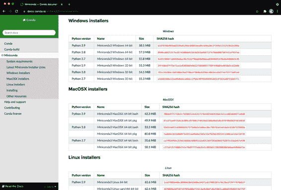
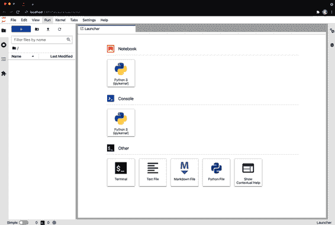
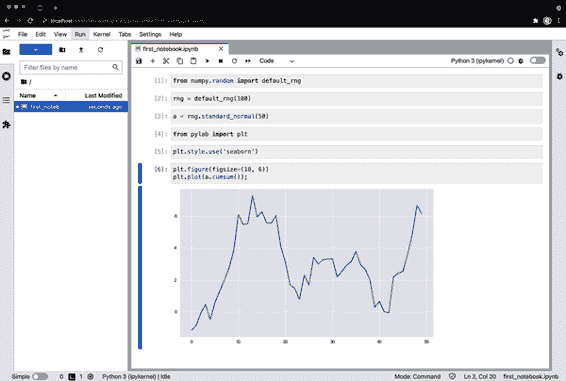
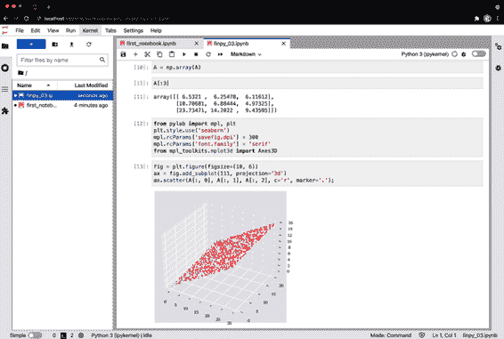

# 第一章 金融与 Python

> 金融理论的历史是抽象理论化与实际应用相互作用的有趣例子。
> 
> Frank Milne (1995)
> 
> 近年来，对冲基金吸引了数十亿美元的投资，越来越多地依靠技术。同样的技术也使得在这些机构做出财务决策的人们受益。
> 
> Laurence Fletcher (2020)

本章简要概述了本书相关主题。它旨在为接下来的章节提供财务和技术框架。"金融简史"首先简要介绍了金融的历史和现状。"金融主要趋势"讨论了推动金融演变的主要趋势：数学、技术、数据和人工智能。在此背景下，"四种语言的世界"认为当今的金融是四种紧密相互关联的语言学科：英语、金融、数学和编程。本书的整体方法在"本书的方法"中有详细说明。"Python 入门"展示了如何在读者的计算机上安装适当的 Python 环境。但所有代码也可以通过[Quant 平台](http://finpy.pqp.io)的常规 Web 浏览器使用和执行，以便稍后设置本地 Python 安装。

# 金融简史

要更好地理解金融及其行业的当前状态，有必要看一看它们如何随时间发展。金融作为一个科学领域的历史可以根据 Rubinstein（2006 年）的说法大致分为三个时期：

古代时期（1950 年前）

主要以非正式推理、经验法则和市场从业者的经验为特征的时期。

古典时期（1950 年至 1980 年）

主要特点是引入形式推理和数学到该领域。在此期间开发了专业模型（例如，Black 和 Scholes 的（1973 年）期权定价模型）以及通用框架（例如，Harrison 和 Kreps 的（1979 年）风险中性定价方法）。

现代时期（1980 年至 2000 年）

这一时期在金融的具体子领域中取得了许多进展（例如，计算金融），并处理了金融市场中的重要经验现象，如随机利率（例如，Cox，Ingersoll 和 Ross（1985 年））或随机波动率（例如，Heston（1993 年））。

在 Rubinstein（2006 年）书籍出版十五年后，我们今天可以添加第四和第五个时期。这两个时期促成了 Python 在金融中的崛起和当前无处不在：

计算时期（2000 年至 2020 年）

在这一时期，金融领域由理论重心向计算重心转变，这一变化受到了金融硬件和软件的进步推动。Longstaff 和 Schwartz（2001 年）提供了一种高效的数值算法，通过蒙特卡罗模拟对美式期权进行估值，很好地展示了这一范式转变。他们的算法在一般情况下对于估值一个单一期权需要进行数十万次模拟和多次普通最小二乘回归。

人工智能时代（2020 年后）

人工智能（AI）的进步和相关成功案例促使人们在金融领域利用 AI 的能力产生了浓厚兴趣。虽然 AI 在金融中已经有成功的应用（参见 Hilpisch（2020）），但可以预期从 2020 年开始，会逐步向*AI 优先金融*的系统范式转变。AI 优先金融描述了从金融中简单的、通常是线性的模型向使用 AI 中的先进模型和算法——如深度神经网络或强化学习——捕捉、描述和解释金融现象的转变。

# 金融的主要趋势

像许多其他学科和行业一样，金融随着时间的推移变得更加形式化的科学学科，驱动因素包括日益使用的正式数学、先进技术、增加的数据可用性和改进的算法，如来自 AI 的算法。因此，随着时间的推移，金融的演变可以被四个主要趋势所描述：

数学

从 1950 年代开始的古典时期起，金融变得越来越形式化，系统地利用数学的不同领域，如线性代数或随机微积分。马科维茨（1952 年）的均值方差组合理论可以被认为是量化金融的一大突破，如果不是其起始点本身——这使得古代时期主要以非正式推理为特征。

技术

个人计算机、工作站和服务器的普及与使用，主要始于 20 世纪 80 年代末和 90 年代初，将更多技术引入了金融领域。尽管计算能力和容量起初相对有限，但如今已经达到了足以攻克金融中甚至最复杂问题的水平，往往通过纯粹的暴力计算，常常使得寻找特定的高效模型和方法——这些特征了古典和现代时期的模式——变得过时。如今的硬件主张变成了“扩展您的硬件，并结合现代软件和适当的数值方法使用”。另一方面，大多数宿舍和起居室中现代硬件已经足够强大，以至于甚至高性能的方法，如并行处理，通常可以在这类大众硬件上使用——极大地降低了计算和 AI 优先金融的准入门槛。

数据

虽然研究人员和从业者们主要依赖于古代和古典时期印刷的金融信息和数据（想想*华尔街日报*或*金融时报*），但从现代时期开始，电子金融数据集的可用性变得更加广泛。然而，计算时期见证了金融数据可用性的爆炸性增长。高频日内数据集已成为经验研究的主要基础，已取代了每日结束价格。单只股票每个交易日可能会生成超过 100,000 个数据点的日内数据集——这个数量大致相当于同一只股票 400 年的每日结束价格（每年 250 个交易日乘以 400 年）。最近更进一步，观察到了开放或免费数据集的激增，这也显著降低了进入计算金融、算法交易或金融计量经济学的门槛。

人工智能

越来越多的金融数据的可用性（“大数据金融数据”）使得应用 AI 算法（例如机器学习、深度学习或强化学习，详见 Hilpisch (2020)）不仅仅是可能的，而且在许多情况下现在是必需的。传统的金融计量经济学中的传统统计方法通常不再适用于应对当今金融市场的复杂性。面对非线性、多维、不断变化的金融环境，基于 AI 的算法往往可能是发现相关关系和模式、生成有价值洞察并从改进的预测能力中获益的唯一选择。

通过阅读本书，读者在金融数学和用于实施正式金融模型的现代技术领域奠定了基础。读者还获得了处理金融领域常见的金融数据集的技能。总之，这为读者更轻松地探索应用于金融的高级主题，如计算金融或 AI，做好了准备。

# Python 和金融

越来越多的金融领域由计算需求量大的算法、日益增加的数据可用性和 AI 驱动。Python 已被证明是应对该领域观察到的主要趋势所带来的要求和挑战的正确编程语言和技术平台。

# 一个四语言世界

在此背景下，金融已经成为一个四语言世界：

自然语言

今天，*英语*语言是该领域在发布的研究、书籍、文章或新闻方面唯一相关的语言。

金融语言

像其他领域一样，*金融*有描述某些现象或想法的技术术语、概念和表达，这些在其他领域通常不相关。

数学语言

*数学*是在形式化金融的概念和观念方面的首选工具和语言。

编程语言

正如前言开头的引语所指出的那样，[*Python*](http://python.org) 作为一种编程语言已经成为金融行业许多领域的首选语言。

因此，精通金融需要学术界和从业者流利掌握四种语言：英语、财务、数学和 Python。这并*不*意味着，例如，英语和 Python 是*唯一*相关的自然语言或编程语言。相反，如果你只有有限的时间学习一门编程语言，你应该优先选择 Python——在学习数学金融的过程中。

# 本书的方法论

本书如何处理金融所需的四种语言？英语是显而易见的——你已经在阅读它了。然而，还有三种语言需要学习。

例如，本书无法详细介绍金融所需的每一个数学细节，也无法详细介绍计算金融所需的每一个（Python）编程概念。然而，它在可能和合理的情况下尽量同时介绍金融、数学和编程相关的概念。

从第二章开始，本书介绍了一个金融概念，并且分别以数学表示和 Python 实现为基础进行阐述。例如，请看下面来自第三章的表格。该表格列出了金融主题、主要的数学元素以及用于实现金融数学的主要 Python 数据结构：

| 财务 | 数学 | Python |
| --- | --- | --- |
| 不确定性 | 概率空间 | `ndarray` |
| 金融资产 | 向量、矩阵 | `ndarray` |
| 可实现的偶发索赔 | 向量空间的跨度、向量空间的基 | `ndarray` |

以下是一个具体示例的步骤，其详细信息在后续章节中提供。此时的示例仅用于说明本书的一般方法论。

举例来说，从前述表格中的金融领域中获取 *不确定性* 的中心概念。不确定性体现了模型经济的未来状态事先不可知的概念。经济的未来状态的不同可能是重要的，例如用于确定欧式看涨期权的支付。在离散情况下，人们处理这种状态的有限数量，如两个、三个或更多。在仅有两个未来状态的最简单情况下，欧式看涨期权的支付在数学上表示为一个 *随机变量*，进而可以形式化地表示为一个自身是 *向量* <math alttext="v"><mi>v</mi></math> 的 *向量空间* <math alttext="double-struck upper R squared"><msup><mi>ℝ</mi> <mn>2</mn></msup></math> 的元素。向量空间是对象集合，称为向量，对其定义了加法和标量乘法。形式上，对于这样一个向量 <math alttext="v"><mi>v</mi></math> ，例如可以写成：

<math mode="display"><mrow><mi>v</mi> <mo>=</mo> <mfenced open="(" close=")"><mtable><mtr><mtd><msup><mi>v</mi> <mi>u</mi></msup></mtd></mtr> <mtr><mtd><msup><mi>v</mi> <mi>d</mi></msup></mtd></mtr></mtable></mfenced> <mo>∈</mo> <msubsup><mi>ℝ</mi> <mrow><mn>≥0</mn></mrow> <mn>2</mn></msubsup></mrow></math>

在此，假设向量的两个元素都是非负实数 <math><mrow><msup><mi>v</mi> <mi>u</mi></msup> <mo>,</mo><msup><mi>v</mi> <mi>d</mi></msup> <mo>∈</mo><msub><mi>ℝ</mi> <mrow><mn>≥0</mn></mrow></msub></mrow></math> 。更具体地说，如果在此背景下给定的欧式看涨期权所写的股票的不确定、状态相关价格是：

<math mode="display"><mrow><mi>S</mi> <mo>=</mo> <mfenced open="(" close=")"><mtable><mtr><mtd><mn>20</mn></mtd></mtr> <mtr><mtd><mn>5</mn></mtd></mtr></mtable></mfenced> <mo>∈</mo> <msubsup><mi>ℝ</mi> <mrow><mn>≥0</mn></mrow> <mn>2</mn></msubsup></mrow></math>

若期权的行使价格为 <math alttext="upper K equals 15"><mrow><mi>K</mi> <mo>=</mo> <mn>15</mn></mrow></math>，则欧式看涨期权的支付 <math alttext="upper C"><mi>C</mi></math> 为

<math mode="display"><mrow><mi>C</mi> <mo>=</mo> <mo movablelimits="true" form="prefix">max</mo> <mrow><mo>(</mo> <mi>S</mi> <mo>-</mo> <mi>K</mi> <mo>,</mo> <mn>0</mn> <mo>)</mo></mrow> <mo>=</mo> <mfenced open="(" close=")"><mtable><mtr><mtd><mrow><mo movablelimits="true" form="prefix">max</mo> <mo>(</mo> <mn>20</mn> <mo>-</mo> <mn>15</mn> <mo>,</mo> <mn>0</mn> <mo>)</mo></mrow></mtd></mtr> <mtr><mtd><mrow><mo movablelimits="true" form="prefix">max</mo> <mo>(</mo> <mn>5</mn> <mo>-</mo> <mn>15</mn> <mo>,</mo> <mn>0</mn> <mo>)</mo></mrow></mtd></mtr></mtable></mfenced> <mo>=</mo> <mfenced open="(" close=")"><mtable><mtr><mtd><mn>5</mn></mtd></mtr> <mtr><mtd><mn>0</mn></mtd></mtr></mtable></mfenced> <mo>∈</mo> <msubsup><mi>ℝ</mi> <mrow><mn>≥0</mn></mrow> <mn>2</mn></msubsup></mrow></math>

这说明了如何数学上建模 *股票的不确定价格* 和 *欧式期权的状态相关支付* 作为一个向量。处理数学中向量和向量空间的学科称为 *线性代数*。

如何将这一切翻译成 Python 编程？首先，*实数* 在 Python 中表示为 *浮点数* 或 `float` 对象：

```py
In [1]: vu = 1.5  

In [2]: vd = 3.75  

In [3]: type(vu)  
Out[3]: float

In [4]: vu + vd  
Out[4]: 5.25
```


定义一个名为 `vu` 的变量，并赋值为 1.5。


定义一个名为 `vd` 的变量，并赋值为 3.75。


查找 `vu` 对象的类型——它是一个 `float` 对象。


计算 `vu` 和 `vd` 的值的总和。

其次，在编程中，通常称同一类型对象的集合为 *数组*。在 Python 中，[`NumPy`](http://numpy.org) 包提供了对这种数据结构的支持。该包提供的主要数据结构称为 `ndarray`，这是 <math alttext="n"><mi>n</mi></math> 维数组的缩写。用 `NumPy` 可以轻松地建模实数向量：

```py
In [5]: import numpy as np  

In [6]: v = np.array((vu, vd))  

In [7]: v  
Out[7]: array([1.5 , 3.75])

In [8]: v.dtype  
Out[8]: dtype('float64')

In [9]: v.shape  
Out[9]: (2,)

In [10]: v + v  
Out[10]: array([3. , 7.5])

In [11]: 3 * v  
Out[11]: array([ 4.5 , 11.25])
```


导入 `NumPy` 包。


实例化一个 `ndarray` 对象。


打印对象中存储的数据。


查找所有元素的数据类型。


查找对象的形状。


向量加法的示例。


标量乘法的示例。

这展示了围绕向量的数学概念如何在 Python 中表示和应用。然后，将这些见解应用于金融只是进一步的一步：

```py
In [12]: S = np.array((20, 5))  

In [13]: K = 15  

In [14]: C = np.maximum(S - K, 0)  

In [15]: C  
Out[15]: array([5, 0])
```


将股票的不确定价格定义为 `ndarray` 对象。


将行权价格定义为具有整数值的 Python 变量（`int` 对象）。


计算每个表达式元素的最大值。


显示现在存储在 `ndarray` 对象 `C` 中的结果数据。

这说明了本书的风格和方法：

1.  介绍了金融中的概念和概念。

1.  提供数学表示和模型。

1.  将数学模型转化为可执行的 Python 代码。

在这个意义上，金融激发了数学的使用，而数学的使用又激发了 Python 编程技术的使用。

# Python 入门指南

Python 的一个好处是它是一种开源语言，绝大多数重要的包也是如此。这使得语言和所需的包在 macOS、Windows 和 Linux 等所有主要操作系统上的安装变得非常容易。除了基本的 Python 解释器外，这本书和金融一般需要的代码只需要几个重要的包：

[`NumPy`](http://numpy.org)

这个包允许高效处理大型、*n* 维数的数值数据集。

[`pandas`](http://pandas.pydata.org)

这个包主要用于高效处理表格数据集，如金融时间序列数据。尽管本书的目的不需要，但 `pandas` 已经成为金融领域最流行的 Python 包之一。

[`SciPy`](http://scipy.org)

这个包是科学函数的集合，例如解决典型的优化问题所需的函数。

[`SymPy`](http://sympy.org)

这个包允许使用 Python 进行符号数学运算，在处理金融模型和算法时有时会派上用场。

[`matplotlib`](http://matplotlib.org)

这个包是 Python 中用于可视化的标准包。它允许您生成和自定义不同类型的图表，如线图、条形图和直方图。

同样，只有两个工具是开始交互式 Python 编码所需的：

[IPython](http://ipython.org)

这是在命令行（终端、Shell）上进行交互式 Python 编码的最受欢迎环境。

[JupyterLab](http://jupyter.org)

这是在浏览器中进行交互式 Python 编码和开发的互动开发环境。

学习 Python 编程的技术先决条件很少。这本书中使用 Python 代码的基本选择有两种：

Quant Platform

在[Quant Platform](http://finpy.pqp.io)上（您可以免费注册），您会找到一个完整的互动金融分析环境，可以通过浏览器使用本书中提供的 Python 代码，无需本地安装。免费注册后，您可以自动访问所有代码和附带书籍的 Jupyter 笔记本，可以立即在浏览器中执行代码。

本地 Python 环境

如今安装本地 Python 环境并在自己的计算机上进行金融分析和书籍代码的最有效方式也是非常直接的。本节介绍如何执行此操作。

# 本地安装与 Quant Platform 比较

根据经验，对于刚开始接触编程的人来说，本地安装适当的 Python 环境有时可能会比较困难。因此，如果在本地安装 Python 时遇到任何问题，建议您不要在开始阶段花费太多时间。相反，可以利用[Quant Platform](http://finpy.pqp.io)，稍后在积累了一些经验后，仍然可以返回并在本地机器上安装 Python。

使用[`conda`](http://conda.io)软件包和环境管理器安装 Python 的简单而现代的方式（参见图 1-1)。


###### 图 1-1\. `conda` 网页

安装`conda`和基本 Python 解释器的最高效方式是通过[Miniconda](https://oreil.ly/NI0Wi)发行版（见 Miniconda [下载页面](https://oreil.ly/gaWTP)，提供了最重要的操作系统和 Python 版本的安装包（参见图 1-2）。Miniforge 项目还提供了额外的选项，如适用于 Apple M1 芯片（“Apple Silicon”）的选项（https://oreil.ly/gKeo3）。



###### 图 1-2\. Miniconda 下载页面

根据操作系统提供的指南安装了 Miniconda 或 Miniforge 之后，应打开 Shell 或命令提示符，并检查`conda`是否可用。以下示例基于在搭载 M1 芯片的 Apple Mac 计算机上通过 Miniforge 安装的`conda`。您应该会得到类似于这样的输出：

```py
(base) minione:finpy yves$ conda --version
conda 4.10.3
(base) minione:finpy yves$
```

还要注意`conda`基础 Python 安装的提示符中的`(base)`部分。下一步是按以下方式创建一个新的*Python 环境*（并在提示时回答“y”）：

```py
pro:finpy yves$ conda create --name finpy python=3.9
...
Preparing transaction: done
Verifying transaction: done
Executing transaction: done
#
# To activate this environment, use
#
#     $ conda activate finpy
#
# To deactivate an active environment, use
#
#     $ conda deactivate
```

成功完成后，激活环境如下所示：

```py
(base) minione:finpy yves$ conda activate finpy
(finpy) minione:finpy yves$
```

注意提示符的变化。接下来，按照以下方式安装所需工具 IPython 和 JupyterLab（在提示时回答“y”）：

```py
(finpy) minione:finpy yves$ conda install ipython jupyterlab
...
```

然后，你应该安装通常用于金融数据科学的主要 Python 包，如下所示（使用 `-y` 标志避免确认提示）：

```py
(finpy) minione:finpy yves$ conda install -y numpy pandas matplotlib scipy sympy
...
```

这提供了一般数据分析和特别是金融分析中最重要的 Python 包。你可以检查是否已经安装完成，如下所示：

```py
(finpy) minione:finpy yves$ conda list
# packages in environment at /Users/yves/Python/envs/finpy:
#
# Name                    Version                   Build    Channel
anyio                     3.3.0            py39h2804cbe_0    conda-forge
appnope                   0.1.2            py39h2804cbe_1    conda-forge
argon2-cffi               20.1.0           py39h5161555_2    conda-forge
...
jupyterlab                3.1.12             pyhd8ed1ab_0    conda-forge
...
numpy                     1.21.2           py39h1f3b974_0    conda-forge
...
python                    3.9.7        h54d631c_1_cpython    conda-forge
...
zipp                      3.5.0              pyhd8ed1ab_0    conda-forge
zlib                      1.2.11            h31e879b_1009    conda-forge
zstd                      1.5.0                h861e0a7_0    conda-forge
(finpy) minione:finpy yves$
```

通过简单地输入 `python`，然后启动交互式 Python 会话：

```py
(finpy) minione:finpy yves$ python
Python 3.9.7 | packaged by conda-forge | (default, Sep 14 2021, 01:14:24)
[Clang 11.1.0 ] on darwin
Type "help", "copyright", "credits" or "license" for more information.
>>> print('Hello Finance World.')
Hello Finance World.
>>> exit()
(finpy) minione:finpy yves$
```

更好的交互式 shell 由 IPython 提供，通过在 shell 上输入 `ipython` 启动：

```py
(finpy) minione:finpy yves$ ipython
Python 3.9.7 | packaged by conda-forge | (default, Sep 14 2021, 01:14:24)
Type 'copyright', 'credits' or 'license' for more information
IPython 7.27.0 -- An enhanced Interactive Python. Type '?' for help.

In [1]: from numpy.random import default_rng

In [2]: rng = default_rng(100)

In [3]: rng.random(10)
Out[3]:
array([0.83498163, 0.59655403, 0.28886324, 0.04295157, 0.9736544 ,
       0.5964717 , 0.79026316, 0.91033938, 0.68815445, 0.18999147])

In [4]: exit
(finpy) minione:finpy yves$
```

然而，特别是对于 Python 初学者，推荐在浏览器中使用 JupyterLab。为此，请在 shell 中输入 `jupyter lab`，将输出类似以下的消息：

```py
(finpy) minione:finpy yves$ jupyter lab
...
[I 2021-09-16 14:18:21.774 ServerApp] Jupyter Server 1.11.0 is running at:
[I 2021-09-16 14:18:21.774 ServerApp] http://localhost:8888/lab
[I 2021-09-16 14:18:21.774 ServerApp]  or http://127.0.0.1:8888/lab
[I 2021-09-16 14:18:21.774 ServerApp] Use Control-C to stop this server
	 and shut down all kernels (twice to skip confirmation).
```

通常会自动打开一个新的浏览器标签页，然后显示类似 图 1-3 的 JupyterLab 启动页面。

接下来，你可以打开一个新的 Jupyter Notebook 并开始交互式 Python 编码，如 图 1-4 所示。要在单元格中编写代码，请单击单元格。要执行代码，请使用 Shift-Return、Ctrl-Return 或 Alt-Return（你会注意到不同）。



###### 图 1-3\. JupyterLab 启动页面



###### 图 1-4\. 新的 Jupyter Notebook

你也可以打开本书提供的其中一个 Jupyter Notebook 文件（见 图 1-5）。



###### 图 1-5\. 本书附带的 Jupyter Notebook

本节只提供了开始使用 Python 和相关工具（如 IPython 和 JupyterLab）的基础知识。关于如何使用 IPython 等更多详细信息，请参考 VanderPlas（2016）在 第七章 中列出的书籍。

# 结论

金融可以回顾长期历史。从 1950 年到 1980 年，以严格的数学分析引入为特征。从 1980 年代开始，特别是自 2000 年以来，计算机和计算金融的角色显著增加。这一趋势将因人工智能在领域中的增加作用而进一步加强，其机器学习（ML）和深度学习（DL）的计算需求算法。

金融领域使用四种不同类型的语言：*自然语言*（一般是英语）、*金融语言*（专有名词和表达方式）、*数学语言*（如线性代数或概率论）、以及*编程语言*（例如本书使用的 Python）。

本书的方法是将金融、数学和 Python 编程的相关概念同时介绍。目前，Python 方面的必备先决条件很少，`conda`包和环境管理器通常是管理 Python 环境的首选工具。

您现在可以继续阅读第二章，该章节讨论了本书中介绍的最简单的金融模型，并引入了许多核心的金融概念。您在最简单的金融模型中获得的直觉应该很容易转移到从第三章开始讨论的更高级模型和方法中。

# 参考文献

在本章引用的文章和书籍中：

+   Cox, John, Jonathan Ingersoll 和 Stephen Ross. 1985\. “利率期限结构理论.” *计量经济学* 53 (2): 385–407.

+   Fletcher, Laurence. 2020\. “对冲基金利用技术降低成本和浪费.” *《金融时报》*, 2020 年 12 月 15 日. [*https://oreil.ly/HE4Cc*](https://oreil.ly/HE4Cc).

+   Heston, Steven. 1993\. “随机波动率期权的闭式解及其在债券和货币期权中的应用.” *金融研究评论* 6 (2): 327–343.

+   Hilpisch, Yves. 2018\. *Python 金融实战*. 第 2 版. Sebastopol: O’Reilly.

+   Hilpisch, Yves. 2020\. *金融中的人工智能：基于 Python 的指南*. Sebastopol: O’Reilly.

+   Longstaff, Francis 和 Eduardo Schwartz. 2001\. “通过模拟估值美式期权：一种简单的最小二乘方法.” *金融研究评论* 14 (1): 113–147.

+   Markowitz, Harry. 1952\. “投资组合选择.” *《金融杂志》* 7 (1): 77-91.

+   Milne, Frank. 1995\. *金融理论与资产定价*. New York: Oxford University Press.

+   Rubinstein, Mark. 2006\. *投资理论的历史*. Hoboken: Wiley Finance.
