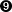

# 第二章 两态经济

> 作为一个经验领域，金融旨在寻找特定的答案，例如给定证券的适当价值，或者持有其股票的最佳数量。
> 
> 达雷尔·达菲（1988 年）
> 
> 套利的概念对现代金融理论至关重要。
> 
> 德尔班和沙赫迈尔（2006 年）

本章的分析基于最简单的*模型经济*，它足够丰富，可以引入金融的许多重要概念和思想：一个只有两个相关时间点和两个不确定未来状态的经济。它还允许我们呈现该领域的一些重要结果，如*资产定价基本定理*，这些结果在本章中进行了讨论。¹

所选的简单模型是为了简化正式引入有时相当抽象的数学概念和金融思想，尽可能避免技术性问题。一旦这些思想被详细阐述和深入理解，转移到更现实的金融模型通常是无缝的。

本章主要涵盖了金融、数学和 Python 编程的以下核心主题：

| 金融 | 数学 | Python |
| --- | --- | --- |
| 时间 | 自然数 <math alttext="double-struck upper N"><mi>ℕ</mi></math> | `int`, `type` |
| 货币（货币单位） | 实数 <math alttext="double-struck upper R"><mi>ℝ</mi></math> | `float` |
| 现金流 | 元组 | `tuple`, `list` |
| 回报、利息 | 实数 <math alttext="double-struck upper R"><mi>ℝ</mi></math> | `abs` |
| （净）现值 | 函数 | `def`, `return` |
| 不确定性 | 向量空间 <math alttext="double-struck upper R squared"><msup><mi>ℝ</mi> <mn>2</mn></msup></math> | `NumPy`, `ndarray`, `np.array` |
| 金融资产 | 过程 | `ndarray`, `tuple` |
| 风险 | 概率、状态空间、幂集、映射 | `ndarray` |
| 期望、预期回报 | 点积 | `np.dot` |
| 波动率 | 方差、标准差 | `np.sqrt` |
| 条件性索赔 | 随机变量 | `np.arange`, `np.maximum`, `plt.plot` |
| 复制、套利 | 线性方程、矩阵形式 | `ndarray(2d)`, `np.linalg.solve`, `np.dot` |
| 完备性、阿罗-德布鲁证券 | 线性独立性、张成 | `np.linalg.solve` |
| 鞅定价 | 鞅、鞅测度 | `np.dot` |
| 均值-方差 | 期望、方差、标准差 | `np.linspace`, `.std()`, `[x for y in z]` |

# 经济

金融模型的第一个要素是*经济*的概念。经济是一个抽象概念，涵盖了金融模型的其他元素，如资产（实际、金融）、代理人（个人、机构）或货币。就像现实世界一样，经济不能被看到或触摸。也不能直接进行形式化建模——但是拥有这样一个概括性术语可以简化沟通。单一的模型元素共同形成经济。²

## 实际资产

经济中有多个*实际资产*可供使用，可以用于不同目的。实际资产可能是鸡蛋或用于生产其他实际资产的复杂机器。在这一点上，例如，生产实际资产的人或者拥有它们的人并不重要。

## 代理人

*代理人*可以被视为在经济中活跃的个体人类。他们可能参与生产实际资产，消费它们或交易它们。他们在交易中接受货币并在其他交易中支出它。代理人也可以是像银行这样的机构，允许其他代理人存入货币，并支付利息。

## 时间

经济活动，如交易实际资产，仅在离散的时间点发生。形式上，这适用于时间点 <math alttext="t element-of 0 comma 1 comma 2 comma 3 comma period period period"><mrow><mi>t</mi> <mo>∈</mo> <mrow><mn>0</mn> <mo>,</mo> <mn>1</mn> <mo>,</mo> <mn>2</mn> <mo>,</mo> <mn>3</mn> <mo>,</mo> <mo>.</mo> <mo>.</mo> <mo>.</mo></mrow></mrow></math> 或 <math alttext="t element-of double-struck upper N 0"><mrow><mi>t</mi> <mo>∈</mo> <msub><mi>ℕ</mi> <mn>0</mn></msub></mrow></math> 。在接下来的内容中，只有两个时间点 <math alttext="t equals 0"><mrow><mi>t</mi> <mo>=</mo> <mn>0</mn></mrow></math> 和 <math alttext="t equals 1"><mrow><mi>t</mi> <mo>=</mo> <mn>1</mn></mrow></math> 是相关的。它们最好被理解为*今天*和*一年后*，尽管这不一定是相关时间间隔的唯一解释。在许多背景下，也可以将其视为*今天*和*明天*。无论如何，如果只有两个时间点相关，金融理论则谈论*静态经济*。

用于模拟自然数 <math alttext="double-struck upper N"><mi>ℕ</mi></math> 的 Python 数据类型是`int`，代表*整数*。³ 可对整数进行典型的算术运算，如加法、减法、乘法等：

```py
In [1]: 1 + 3  
Out[1]: 4

In [2]: 3 * 4  
Out[2]: 12

In [3]: t = 0  

In [4]: t  
Out[4]: 0

In [5]: t = 1  

In [6]: type(t)  
Out[6]: int
```


将两个整数值相加。


计算两个整数值的乘积。


将变量名`t`的值赋为`0`。


输出变量`t`的值。


将变量`t`的新值赋为`1`。


查找并输出变量`t`的 Python 类型。

## 货币

在经济中，*货币*（或*货币*）供应是无限的。货币也是无限可分的。货币和货币应仅以抽象术语思考，而不是以现金（实体硬币或纸币）的形式。

通常来说，货币在经济中作为*计量单位*，其中一个货币单位（例如美元、欧元、英镑等）的价值被标准化为精确的 1。其他所有商品的价格则以这些单位的分数或倍数表示。形式上，货币单位被表示为（非负）实数 <math><mrow><mi>c</mi><mo>∈</mo><msub><mi>ℝ</mi> <mrow><mn>≥0</mn></mrow></msub></mrow></math> 。

在 Python 中，`float`是用于表示实数 <math alttext="double-struck upper R"><mi>ℝ</mi></math> 的标准数据类型。它代表*浮点数*。与`int`类型一样，它允许进行典型的算术运算，如加法和减法：

```py
In [7]: 1 + 0.5   
Out[7]: 1.5

In [8]: 10.5 - 2  
Out[8]: 8.5

In [9]: c = 2 + 0.75  

In [10]: c  
Out[10]: 2.75

In [11]: type(c)  
Out[11]: float
```


加两个数。


减去两个数。


将加法结果赋给变量`c`。


打印变量`c`的值。


查找并打印变量`c`的 Python 类型。

除了作为计量单位，货币还允许经济主体买卖实物资产或在时间上储存价值。这两个功能基于对货币确实具有今天和一年后都有内在价值的信任。一般来说，这转化为对人们和机构愿意在任何交易中今天和将来都接受货币的信任。计量单位功能独立于此信任，因为它仅仅是一个数值操作。

# 现金流量

结合时间与货币导致*现金流*的概念。考虑一个投资项目，今天需要投资 9.5 货币单位，并在一年后支付 11.75 货币单位。投资通常被认为是现金*流出*，通常将其表示为负实数， <math><mrow><mi>c</mi><mo>∈</mo><msub><mi>ℝ</mi> <mrow><mn><0</mn></mrow></msub></mrow></math> ，或者更具体地说， <math alttext="c equals"><mrow><mi>c</mi> <mo>=</mo></mrow></math> –9.5。支付是现金*流入*，因此是正实数， <math><mrow><mi>c</mi><mo>∈</mo><msub><mi>ℝ</mi> <mrow><mn>≥0</mn></mrow></msub></mrow></math> ，或者在例子中是 <math alttext="c equals"><mrow><mi>c</mi> <mo>=</mo></mrow></math> +11.75。

为了指示现金流发生的时间点，使用时间索引：在例子中，<math alttext="c Subscript t equals 0 Baseline equals"><mrow><msub><mi>c</mi> <mrow><mi>t</mi><mo>=</mo><mn>0</mn></mrow></msub> <mo>=</mo></mrow></math> –9.5 和 <math alttext="c Subscript t equals 1 Baseline equals"><mrow><msub><mi>c</mi> <mrow><mi>t</mi><mo>=</mo><mn>1</mn></mrow></msub> <mo>=</mo></mrow></math> 11.75，或简称为 <math alttext="c 0 equals"><mrow><msub><mi>c</mi> <mn>0</mn></msub> <mo>=</mo></mrow></math> –9.5 和 <math alttext="c 1 equals"><mrow><msub><mi>c</mi> <mn>1</mn></msub> <mo>=</mo></mrow></math> 11.75。

数学上，现在和一年后的现金流对被建模为*有序对*或*二元组*，将两个相关的现金流组合成一个对象：<math alttext="c element-of double-struck upper R squared"><mrow><mi>c</mi> <mo>∈</mo> <msup><mi>ℝ</mi> <mn>2</mn></msup></mrow></math>，其中 <math alttext="c equals left-parenthesis c 0 comma c 1 right-parenthesis"><mrow><mi>c</mi> <mo>=</mo> <mo>(</mo> <msub><mi>c</mi> <mn>0</mn></msub> <mo>,</mo> <msub><mi>c</mi> <mn>1</mn></msub> <mo>)</mo></mrow></math>，且 <math alttext="c 0 comma c 1 element-of double-struck upper R"><mrow><msub><mi>c</mi> <mn>0</mn></msub> <mo>,</mo> <msub><mi>c</mi> <mn>1</mn></msub> <mo>∈</mo> <mi>ℝ</mi></mrow></math>。

在 Python 中，有多种数据结构可用于建模这样的数学对象。最基本的两种是`tuple`和`list`。类型为`tuple`的对象是不可变的，即在实例化后无法更改；而类型为`list`的对象是可变的，在实例化后可以更改。首先是`tuple`对象的示例（用括号表示）：

```py
In [12]: c0 = -9.5  

In [13]: c1 = 11.75  

In [14]: c = (c0, c1)  

In [15]: c  
Out[15]: (-9.5, 11.75)

In [16]: type(c)  
Out[16]: tuple

In [17]: c[0]  
Out[17]: -9.5

In [18]: c[1]  
Out[18]: 11.75
```


定义今天的现金流出。


定义一年后的现金流入。


定义`tuple`对象`c`（请注意使用括号）。


打印现金流对（请注意括号）。


查找并显示对象`c`的类型。


访问对象`c`的第一个元素。


访问对象`c`的第二个元素。

其次，`list`对象的示例（用方括号表示）：

```py
In [19]: c = [c0, c1]  

In [20]: c  
Out[20]: [-9.5, 11.75]

In [21]: type(c)  
Out[21]: list

In [22]: c[0]  
Out[22]: -9.5

In [23]: c[1]  
Out[23]: 11.75

In [24]: c[0] = 10  

In [25]: c  
Out[25]: [10, 11.75]
```


定义`list`对象`c`（请注意使用方括号）。


打印现金流对（请注意括号）。


查找并显示对象 `c` 的类型。


访问对象 `c` 的第一个元素。


访问对象 `c` 的第二个元素。


覆盖对象 `c` 中第一个索引位置的值。


显示结果的变化。

## 返回

考虑一个具有现金流 <math alttext="c equals left-parenthesis c 0 comma c 1 right-parenthesis equals"><mrow><mi>c</mi> <mo>=</mo> <mo>(</mo> <msub><mi>c</mi> <mn>0</mn></msub> <mo>,</mo> <msub><mi>c</mi> <mn>1</mn></msub> <mo>)</mo> <mo>=</mo></mrow></math> (–10, 12) 的投资项目。该项目的 *回报* <math alttext="upper R element-of double-struck upper R"><mrow><mi>R</mi> <mo>∈</mo> <mi>ℝ</mi></mrow></math> 是现金流的总和 <math alttext="upper R equals c 0 plus c 1 equals"><mrow><mi>R</mi> <mo>=</mo> <msub><mi>c</mi> <mn>0</mn></msub> <mo>+</mo> <msub><mi>c</mi> <mn>1</mn></msub> <mo>=</mo></mrow></math> –10 + 12 = 2\. 项目的 *回报率*， <math alttext="r element-of double-struck upper R"><mrow><mi>r</mi> <mo>∈</mo> <mi>ℝ</mi></mrow></math> ，是回报 <math alttext="upper R"><mi>R</mi></math> 除以投资现值的绝对值 <math alttext="bar c 0 bar"><mrow><mo>|</mo> <msub><mi>c</mi> <mn>0</mn></msub> <mo>|</mo></mrow></math> 得到的结果：

<math alttext="r equals StartFraction upper R Over bar c 0 bar EndFraction equals StartFraction negative 10 plus 12 Over 10 EndFraction equals two-tenths equals 0.2" display="block"><mrow><mi>r</mi> <mo>=</mo> <mfrac><mi>R</mi> <mrow><mo>|</mo><msub><mi>c</mi> <mn>0</mn></msub> <mo>|</mo></mrow></mfrac> <mo>=</mo> <mfrac><mrow><mo>-</mo><mn>10</mn><mo>+</mo><mn>12</mn></mrow> <mn>10</mn></mfrac> <mo>=</mo> <mfrac><mn>2</mn> <mn>10</mn></mfrac> <mo>=</mo> <mn>0.2</mn></mrow></math>

在 Python 中，这归结为简单的算术操作：

```py
In [26]: c = (-10, 12)  

In [27]: R = sum(c)  

In [28]: R  
Out[28]: 2

In [29]: r = R / abs(c[0])  

In [30]: r  
Out[30]: 0.2
```


将现金流对定义为 `tuple` 对象。


使用 `c` 的所有元素的总和计算回报 `R` 并…


…打印出结果。


使用 `abs(x)` 计算利率 `r`，给出 `x` 的绝对值并…


…打印出结果。

## 利息

今天现金流和一年后的现金流之间存在差异。这种差异是由于货币单位上 *赚取的利息* 或需要 *支付的利息* 导致的。在这种情况下，利息是为控制属于另一位代理的资金而支付的 *代价*。

拥有不需要的货币单位的代理可以将其存入银行或借给另一位代理以 *赚取利息*。如果代理需要比当前可用的货币单位更多的货币单位，可以向银行或其他代理借款，但需 *支付利息*。

假设一个代理人今天在银行存入<math alttext="c 0 equals"><mrow><msub><mi>c</mi> <mn>0</mn></msub> <mo>=</mo></mrow></math> -10 货币单位。根据存款合同，一年后他们从银行获得<math alttext="c 1 equals 11"><mrow><msub><mi>c</mi> <mn>1</mn></msub> <mo>=</mo> <mn>11</mn></mrow></math>货币单位。存款所产生的利息<math alttext="upper I element-of double-struck upper R"><mrow><mi>I</mi> <mo>∈</mo> <mi>ℝ</mi></mrow></math>，为<math alttext="upper I equals c 0 plus c 1 equals"><mrow><mi>I</mi> <mo>=</mo> <msub><mi>c</mi> <mn>0</mn></msub> <mo>+</mo> <msub><mi>c</mi> <mn>1</mn></msub> <mo>=</mo></mrow></math> -10 + 11 = 1。*利率*<math alttext="i element-of double-struck upper R"><mrow><mi>i</mi> <mo>∈</mo> <mi>ℝ</mi></mrow></math>，相应地为<math alttext="i equals StartFraction upper I Over bar c 0 bar EndFraction equals"><mrow><mi>i</mi> <mo>=</mo> <mfrac><mi>I</mi> <mrow><mo>|</mo><msub><mi>c</mi> <mn>0</mn></msub> <mo>|</mo></mrow></mfrac> <mo>=</mo></mrow></math> 0.1。

下文假设，对于借贷和存款，相关利率相同且在整个经济中固定。

## 现值

提供了借贷或存款选择，导致在投资项目中使用资金的*机会成本*。比如，一年后的现金流<math alttext="c 1 equals"><mrow><msub><mi>c</mi> <mn>1</mn></msub> <mo>=</mo></mrow></math> 12.1 不能直接与今天的现金流<math alttext="c 0 equals"><mrow><msub><mi>c</mi> <mn>0</mn></msub> <mo>=</mo></mrow></math> 12.1 价值相比，因为货币单位未投入项目可以获得利息。

要适当地比较一年后的现金流和今天的现金流，需要计算*现值*。这通过在经济中使用的固定利率*折现*来完成。折现可以建模为函数<math alttext="upper D colon"><mrow><mi>D</mi> <mo>:</mo></mrow></math> <math alttext="double-struck upper R right-arrow double-struck upper R comma c 1 right-arrow from bar upper D left-parenthesis c 1 right-parenthesis"><mrow><mi>ℝ</mi> <mo>→</mo> <mi>ℝ</mi> <mo>,</mo> <msub><mi>c</mi> <mn>1</mn></msub> <mo>↦</mo> <mi>D</mi> <mrow><mo>(</mo> <msub><mi>c</mi> <mn>1</mn></msub> <mo>)</mo></mrow></mrow></math>，将一年后的现金流映射到今天的另一个实数。它满足

<math alttext="StartLayout 1st Row 1st Column c 0 2nd Column equals 3rd Column upper D left-parenthesis c 1 right-parenthesis 2nd Row 1st Column Blank 2nd Column equals 3rd Column StartFraction c 1 Over 1 plus i EndFraction 3rd Row 1st Column Blank 2nd Column equals 3rd Column StartFraction 12.1 Over 1 plus 0.1 EndFraction 4th Row 1st Column Blank 2nd Column equals 3rd Column 11 EndLayout" display="block"><mtable><mtr><mtd><msub><mi>c</mi> <mn>0</mn></msub></mtd> <mtd><mo>=</mo></mtd> <mtd><mrow><mi>D</mi> <mo>(</mo> <msub><mi>c</mi> <mn>1</mn></msub> <mo>)</mo></mrow></mtd></mtr> <mtr><mtd><mo>=</mo></mtd> <mtd><mfrac><msub><mi>c</mi> <mn>1</mn></msub> <mrow><mn>1</mn><mo>+</mo><mi>i</mi></mrow></mfrac></mtd></mtr> <mtr><mtd><mo>=</mo></mtd> <mtd><mfrac><mrow><mn>12</mn><mo>.</mo><mn>1</mn></mrow> <mrow><mn>1</mn><mo>+</mo><mn>0</mn><mo>.</mo><mn>1</mn></mrow></mfrac></mtd></mtr> <mtr><mtd><mo>=</mo></mtd> <mtd><mn>11</mn></mtd></mtr></mtable></math>

对于利率<math alttext="i equals"><mrow><mi>i</mi> <mo>=</mo></mrow></math> 0.1。这种关系源于与银行存款的替代“投资”：

<math alttext="c 1 equals left-parenthesis 1 plus i right-parenthesis dot c 0 left right double arrow c 0 equals StartFraction c 1 Over 1 plus i EndFraction" display="block"><mrow><msub><mi>c</mi> <mn>1</mn></msub> <mo>=</mo> <mrow><mo>(</mo> <mn>1</mn> <mo>+</mo> <mi>i</mi> <mo>)</mo></mrow> <mo>·</mo> <msub><mi>c</mi> <mn>0</mn></msub> <mo>⇔</mo> <msub><mi>c</mi> <mn>0</mn></msub> <mo>=</mo> <mfrac><msub><mi>c</mi> <mn>1</mn></msub> <mrow><mn>1</mn><mo>+</mo><mi>i</mi></mrow></mfrac></mrow></math>

Python 函数非常适合表示数学函数，比如折现函数：

```py
In [31]: i = 0.1  

In [32]: def D(c1):  
             return c1 / (1 + i)  

In [33]: D(12.1)  
Out[33]: 10.999999999999998

In [34]: D(11)  
Out[34]: 10.0
```


固定利率`i`。


使用`def`语句定义函数；`D`为函数名称；`c1`为参数名称。


使用`return`语句返回现值。


计算 12.1 的现值；注意由于内部浮点数表示问题而导致的舍入误差。


计算 11 的现值（在这种情况下为“准确地”）。

## 净现值

一个代理如何决定是否进行投资项目？其中一个标准是*净现值*。净现值，<math alttext="upper N upper P upper V element-of double-struck upper R"><mrow><mi>N</mi> <mi>P</mi> <mi>V</mi> <mo>∈</mo> <mi>ℝ</mi></mrow></math>，是今天的现金流出总和以及一年后现金流入的现值之和：

<math alttext="upper N upper P upper V left-parenthesis c right-parenthesis equals c 0 plus upper D left-parenthesis c 1 right-parenthesis" display="block"><mrow><mi>N</mi> <mi>P</mi> <mi>V</mi> <mrow><mo>(</mo> <mi>c</mi> <mo>)</mo></mrow> <mo>=</mo> <msub><mi>c</mi> <mn>0</mn></msub> <mo>+</mo> <mi>D</mi> <mrow><mo>(</mo> <msub><mi>c</mi> <mn>1</mn></msub> <mo>)</mo></mrow></mrow></math>

在这里，净现值计算是一个函数<math alttext="upper N upper P upper V colon double-struck upper R squared right-arrow double-struck upper R"><mrow><mi>N</mi> <mi>P</mi> <mi>V</mi> <mo>:</mo> <msup><mi>ℝ</mi> <mn>2</mn></msup> <mo>→</mo> <mi>ℝ</mi></mrow></math>，将现金流元组映射到一个实数。如果净现值为正，则应进行项目；如果为负，则不应—因为将钱存入银行的替代方案更具吸引力。

考虑一个投资项目，其现金流为<math alttext="c Superscript upper A Baseline equals"><mrow><msup><mi>c</mi> <mi>A</mi></msup> <mo>=</mo></mrow></math> (–10.5, 12.1)。净现值为<math alttext="upper N upper P upper V left-parenthesis c Superscript upper A Baseline right-parenthesis equals"><mrow><mi>N</mi> <mi>P</mi> <mi>V</mi> <mo>(</mo> <msup><mi>c</mi> <mi>A</mi></msup> <mo>)</mo> <mo>=</mo></mrow></math> –10.5 + <math alttext="upper D"><mi>D</mi></math> (12.1) = –10.5 + 11 = 0.5。该项目应当进行。考虑另一个投资项目，现金流为<math alttext="c Superscript upper B Baseline equals"><mrow><msup><mi>c</mi> <mi>B</mi></msup> <mo>=</mo></mrow></math> (–10.5, 11)。该项目的净现值为负数，不应进行： <math alttext="upper N upper P upper V left-parenthesis c Superscript upper B Baseline right-parenthesis equals"><mrow><mi>N</mi> <mi>P</mi> <mi>V</mi> <mo>(</mo> <msup><mi>c</mi> <mi>B</mi></msup> <mo>)</mo> <mo>=</mo></mrow></math> –10.5 + <math alttext="upper D"><mi>D</mi></math> (11) = –10.5 + 10 = –0.5。

在前述定义基础上，可以轻松定义相应的 Python 函数：

```py
In [35]: def NPV(c):
             return c[0] + D(c[1])

In [36]: cA = (-10.5, 12.1)  

In [37]: cB = (-10.5, 11)  

In [38]: NPV(cA)  
Out[38]: 0.4999999999999982

In [39]: NPV(cB)  
Out[39]: -0.5
```


正净现值项目。


负净现值项目。

# 不确定性

从投资项目一年后的现金流入总体上来说是*不确定*的。它们可能受到现实中多种因素的影响（竞争力量、新技术、经济增长、天气、项目实施中的问题等）。在模型经济中，一年后经济的*状态*的概念涵盖了所有相关因素的影响。

假设一年后经济可能处于两种不同的状态 <math alttext="u"><mi>u</mi></math> 和 <math alttext="d"><mi>d</mi></math> ，可以解释为*上升*（“好”）和*下降*（“坏”）。项目一年后的现金流 <math alttext="c 1"><msub><mi>c</mi> <mn>1</mn></msub></math> 就成为一个*向量*

<math alttext="c 1 element-of double-struck upper R squared" display="block"><mrow><msub><mi>c</mi> <mn>1</mn></msub> <mo>∈</mo> <msup><mi>ℝ</mi> <mn>2</mn></msup></mrow></math>

具有两个不同的值

<math alttext="c 1 Superscript u Baseline comma c 1 Superscript d Baseline element-of double-struck upper R" display="block"><mrow><msubsup><mi>c</mi> <mn>1</mn> <mi>u</mi></msubsup> <mo>,</mo> <msubsup><mi>c</mi> <mn>1</mn> <mi>d</mi></msubsup> <mo>∈</mo> <mi>ℝ</mi></mrow></math>

表示与经济状态相关的现金流量的相关现金流。从形式上讲，这被称为所谓的*列向量*：

<math alttext="c 1 equals StartBinomialOrMatrix c 1 Superscript u Baseline Choose c 1 Superscript d EndBinomialOrMatrix" display="block"><mrow><msub><mi>c</mi> <mn>1</mn></msub> <mo>=</mo> <mfenced open="(" close=")"><mtable><mtr><mtd><msubsup><mi>c</mi> <mn>1</mn> <mi>u</mi></msubsup></mtd></mtr> <mtr><mtd><msubsup><mi>c</mi> <mn>1</mn> <mi>d</mi></msubsup></mtd></mtr></mtable></mfenced></mrow></math>

在数学上，对这种向量定义了一些操作，如*标量乘法*和*加法*，例如：

<math alttext="alpha dot c 1 plus beta equals alpha dot StartBinomialOrMatrix c 1 Superscript u Baseline Choose c 1 Superscript d Baseline EndBinomialOrMatrix plus beta equals StartBinomialOrMatrix alpha dot c 1 Superscript u Baseline plus beta Choose alpha dot c 1 Superscript d Baseline plus beta EndBinomialOrMatrix" display="block"><mrow><mi>α</mi> <mo>·</mo> <msub><mi>c</mi> <mn>1</mn></msub> <mo>+</mo> <mi>β</mi> <mo>=</mo> <mi>α</mi> <mo>·</mo> <mfenced open="(" close=")"><mtable><mtr><mtd><msubsup><mi>c</mi> <mn>1</mn> <mi>u</mi></msubsup></mtd></mtr> <mtr><mtd><msubsup><mi>c</mi> <mn>1</mn> <mi>d</mi></msubsup></mtd></mtr></mtable></mfenced> <mo>+</mo> <mi>β</mi> <mo>=</mo> <mfenced open="(" close=")"><mtable><mtr><mtd><mrow><mi>α</mi> <mo>·</mo> <msubsup><mi>c</mi> <mn>1</mn> <mi>u</mi></msubsup> <mo>+</mo> <mi>β</mi></mrow></mtd></mtr> <mtr><mtd><mrow><mi>α</mi> <mo>·</mo> <msubsup><mi>c</mi> <mn>1</mn> <mi>d</mi></msubsup> <mo>+</mo> <mi>β</mi></mrow></mtd></mtr></mtable></mfenced></mrow></math>

向量的另一个重要操作是向量的*线性组合*的创建。考虑两个不同的向量：<math alttext="c 1 comma d 1 element-of double-struck upper R squared"><mrow><msub><mi>c</mi> <mn>1</mn></msub> <mo>,</mo> <msub><mi>d</mi> <mn>1</mn></msub> <mo>∈</mo> <msup><mi>ℝ</mi> <mn>2</mn></msup></mrow></math> 。线性组合由以下给出：

<math alttext="alpha dot c 1 plus beta dot d 1 equals StartBinomialOrMatrix alpha dot c 1 Superscript u Baseline plus beta dot d 1 Superscript u Baseline Choose alpha dot c 1 Superscript d Baseline plus beta dot d 1 Superscript d EndBinomialOrMatrix" display="block"><mrow><mi>α</mi> <mo>·</mo> <msub><mi>c</mi> <mn>1</mn></msub> <mo>+</mo> <mi>β</mi> <mo>·</mo> <msub><mi>d</mi> <mn>1</mn></msub> <mo>=</mo> <mfenced open="(" close=")"><mtable><mtr><mtd><mrow><mi>α</mi> <mo>·</mo> <msubsup><mi>c</mi> <mn>1</mn> <mi>u</mi></msubsup> <mo>+</mo> <mi>β</mi> <mo>·</mo> <msubsup><mi>d</mi> <mn>1</mn> <mi>u</mi></msubsup></mrow></mtd></mtr> <mtr><mtd><mrow><mi>α</mi> <mo>·</mo> <msubsup><mi>c</mi> <mn>1</mn> <mi>d</mi></msubsup> <mo>+</mo> <mi>β</mi> <mo>·</mo> <msubsup><mi>d</mi> <mn>1</mn> <mi>d</mi></msubsup></mrow></mtd></mtr></mtable></mfenced></mrow></math>

在此之前和之后，假定 <math alttext="alpha comma beta element-of double-struck upper R"><mrow><mi>α</mi> <mo>,</mo> <mi>β</mi> <mo>∈</mo> <mi>ℝ</mi></mrow></math> 。

在 Python 中建模向量（和矩阵）的最常见方式是通过[`NumPy`](http://numpy.org)包，这是一个外部包，需要单独安装。对于以下代码，请考虑一个投资项目，其中 <math alttext="c 0 equals"><mrow><msub><mi>c</mi> <mn>0</mn></msub> <mo>=</mo></mrow></math> –10 和 <math alttext="c 1 equals left-parenthesis 20 comma 5 right-parenthesis Superscript upper T"><mrow><msub><mi>c</mi> <mn>1</mn></msub> <mo>=</mo> <msup><mrow><mo>(</mo><mn>20</mn><mo>,</mo><mn>5</mn><mo>)</mo></mrow> <mi>T</mi></msup></mrow></math> ，其中上标 <math alttext="upper T"><mi>T</mi></math> 表示向量的转置（将*行或水平向量*转换为*列或垂直向量*）。用于建模向量的主要类是 `ndarray` 类，代表*n 维数组*：

```py
In [40]: import numpy as np  

In [41]: c0 = -10  

In [42]: c1 = np.array((20, 5))  

In [43]: type(c1)  
Out[43]: numpy.ndarray

In [44]: c1  
Out[44]: array([20,  5])

In [45]: c = (c0, c1)  

In [46]: c  
Out[46]: (-10, array([20,  5]))

In [47]: 1.5 * c1 + 2  
Out[47]: array([32. ,  9.5])

In [48]: c1 + 1.5 * np.array((10, 4))  
Out[48]: array([35., 11.])
```


导入 `numpy` 包作为 `np`。


今天的现金流出。


一年后的不确定现金流；一维 `ndarray` 对象不区分行（水平）和列（垂直）。


查找并打印 `c1` 的类型。


打印现金流向量。


将现金流组合成一个`tuple`对象。


一个`tuple`，就像一个`list`对象一样，可以包含其他复杂的数据结构。


通过标量乘法和加法对向量进行线性变换；技术上也谈论向量化数值操作和广播。


两个`ndarray`对象（向量）的线性组合。

# 金融资产

*金融资产*是具有今天固定价格和一年后不确定价格的金融工具（“合同”）。想象一下，一个公司进行投资项目的股权份额。这样的股份可能今天以价格<math><mrow><msub><mi>S</mi> <mn>0</mn></msub> <mo>∈</mo><msub><mi>ℝ</mi> <mrow><mn>>0</mn></mrow></msub></mrow></math> 的价格可用。一年后股份的价格取决于投资项目的成功，即在<u>u</u>状态观察到高现金流入还是在<d>d</d>状态观察到低现金流入。形式上，<math><mrow><msubsup><mi>S</mi> <mn>1</mn> <mi>u</mi></msubsup> <mo>,</mo><msubsup><mi>S</mi> <mn>1</mn> <mi>d</mi></msubsup> <mo>∈</mo><msub><mi>ℝ</mi> <mrow><mn>≥0</mn></mrow></msub></mrow></math> ，其中 <math alttext="upper S 1 Superscript u Baseline greater-than upper S 1 Superscript d"><mrow><msubsup><mi>S</mi> <mn>1</mn> <mi>u</mi></msubsup> <mo>></mo> <msubsup><mi>S</mi> <mn>1</mn> <mi>d</mi></msubsup></mrow></math> 。

人们也称之为金融资产<math><mrow><mi>S</mi><mo>:</mo><msub><mi>ℕ</mi> <mn>0</mn></msub> <mo>×</mo><mrow><mo>{</mo><mi>u</mi><mo>,</mo><mi>d</mi><mo>}</mo></mrow><mo>→</mo><msub><mi>ℝ</mi> <mrow><mn>≥0</mn></mrow></msub></mrow></math>的*价格过程*，将时间和经济状态映射到金融资产价格上。注意，今天的价格与状态<math alttext="upper S 0 Superscript u Baseline equals upper S 0 Superscript d Baseline identical-to upper S 0"><mrow><msubsup><mi>S</mi> <mn>0</mn> <mi>u</mi></msubsup> <mo>=</mo> <msubsup><mi>S</mi> <mn>0</mn> <mi>d</mi></msubsup> <mo>≡</mo> <msub><mi>S</mi> <mn>0</mn></msub></mrow></math>无关，而一年后的价格一般而言不是。人们也写成<math alttext="left-parenthesis upper S Subscript t Baseline right-parenthesis Subscript t element-of StartSet 0 comma 1 EndSet Baseline equals left-parenthesis upper S 0 comma upper S 1 right-parenthesis"><mrow><msub><mrow><mo>(</mo><msub><mi>S</mi> <mi>t</mi></msub> <mo>)</mo></mrow> <mrow><mi>t</mi><mo>∈</mo><mo>{</mo><mn>0</mn><mo>,</mo><mn>1</mn><mo>}</mo></mrow></msub> <mo>=</mo> <mrow><mo>(</mo> <msub><mi>S</mi> <mn>0</mn></msub> <mo>,</mo> <msub><mi>S</mi> <mn>1</mn></msub> <mo>)</mo></mrow></mrow></math>，或简写为<math alttext="upper S equals left-parenthesis upper S 0 comma upper S 1 right-parenthesis"><mrow><mi>S</mi> <mo>=</mo> <mo>(</mo> <msub><mi>S</mi> <mn>0</mn></msub> <mo>,</mo> <msub><mi>S</mi> <mn>1</mn></msub> <mo>)</mo></mrow></math>。建模的工具再次是`NumPy`包：

```py
In [49]: S0 = 10  

In [50]: S1 = np.array((12.5, 7.5))  

In [51]: S = (S0, S1)  

In [52]: S  
Out[52]: (10, array([12.5,  7.5]))

In [53]: S[0]  
Out[53]: 10

In [54]: S[1][0]  
Out[54]: 12.5

In [55]: S[1][1]  
Out[55]: 7.5
```


今天的金融资产价格。


一年后的不确定价格作为一个向量（`ndarray`对象）。


价格过程作为一个`tuple`对象。


打印价格过程信息。


访问今天的价格。


访问<math alttext="u"><mi>u</mi></math>（第一个）状态下一年后的价格。


访问<math alttext="d"><mi>d</mi></math>（第二个）状态下一年后的价格。

# 风险

通常会默认假设经济的两种状态*等可能*。这通常意味着，在经济实验被重复（无限次）进行时，观察到一半的时间为状态<math alttext="u"><mi>u</mi></math>，另一半时间为状态<math alttext="d"><mi>d</mi></math>。

这是一种频率主义的观点，根据这种观点，状态发生的概率是根据观察到该状态的频率除以导致观察的实验总数来计算的。如果状态<math alttext="u"><mi>u</mi></math>在 50 次实验中观察到 30 次，则概率<math><mrow><mi>p</mi><mo>∈</mo><msub><mi>ℝ</mi> <mrow><mn>≥0</mn></mrow></msub></mrow></math>，满足<math alttext="0 less-than-or-equal-to p less-than-or-equal-to 1"><mrow><mn>0</mn> <mo>≤</mo> <mi>p</mi> <mo>≤</mo> <mn>1</mn></mrow></math>，相应地为<math alttext="p equals StartFraction 30 Over 50 EndFraction"><mrow><mi>p</mi> <mo>=</mo> <mfrac><mn>30</mn> <mn>50</mn></mfrac></mrow></math> = 0.6，或 60%。

在建模的背景下，所有可能状态发生的概率被认为是*先验*给定的。有时候会谈到*客观*或*物理*概率。

## 概率测度

对于物理上可能的事件的概率一起形成*概率测度*。这样的概率测度是一个函数<math alttext="upper P colon normal script upper P left-parenthesis StartSet u comma d EndSet right-parenthesis right-arrow double-struck upper R Subscript 0 Baseline"><mrow><mi>P</mi> <mo>:</mo> <mi>℘</mi> <mrow><mo>(</mo> <mrow><mo>{</mo> <mi>u</mi> <mo>,</mo> <mi>d</mi> <mo>}</mo></mrow> <mo>)</mo></mrow> <mo>→</mo> <msub><mi>ℝ</mi> <mrow><mo>≥</mo><mn>0</mn></mrow></msub></mrow></math>，将<math alttext="StartSet u comma d EndSet"><mrow><mo>{</mo> <mi>u</mi> <mo>,</mo> <mi>d</mi> <mo>}</mo></mrow></math>的*幂集*的所有元素映射到单位区间。在这种情况下，幂集包含所有物理上可能发生的事件。

在这个背景下，集合<math alttext="StartSet u comma d EndSet"><mrow><mo>{</mo> <mi>u</mi> <mo>,</mo> <mi>d</mi> <mo>}</mo></mrow></math>也被称为*状态空间*，用<math alttext="normal upper Omega"><mi>Ω</mi></math>符号表示。三元组<math alttext="left-parenthesis normal upper Omega comma normal script upper P left-parenthesis normal upper Omega right-parenthesis comma upper P right-parenthesis"><mrow><mo>(</mo> <mi>Ω</mi> <mo>,</mo> <mi>℘</mi> <mo>(</mo> <mi>Ω</mi> <mo>)</mo> <mo>,</mo> <mi>P</mi> <mo>)</mo></mrow></math>称为*概率空间*。

代表概率测度的函数<math alttext="upper P"><mi>P</mi></math>需要满足三个条件：

1.  <math alttext="upper P left-parenthesis normal empty-set right-parenthesis equals 0"><mrow><mi>P</mi> <mo>(</mo> <mi>∅</mi> <mo>)</mo> <mo>=</mo> <mn>0</mn></mrow></math>

1.  <math alttext="0 less-than-or-equal-to upper P left-parenthesis omega right-parenthesis comma omega element-of normal upper Omega less-than-or-equal-to 1"><mrow><mn>0</mn> <mo>≤</mo> <mi>P</mi> <mo>(</mo> <mi>ω</mi> <mo>)</mo> <mo>,</mo> <mi>ω</mi> <mo>∈</mo> <mi>Ω</mi> <mo>≤</mo> <mn>1</mn></mrow></math>

1.  <math alttext="upper P left-parenthesis normal upper Omega right-parenthesis equals upper P left-parenthesis u right-parenthesis plus upper P left-parenthesis d right-parenthesis equals 1"><mrow><mi>P</mi> <mo>(</mo> <mi>Ω</mi> <mo>)</mo> <mo>=</mo> <mi>P</mi> <mo>(</mo> <mi>u</mi> <mo>)</mo> <mo>+</mo> <mi>P</mi> <mo>(</mo> <mi>d</mi> <mo>)</mo> <mo>=</mo> <mn>1</mn></mrow></math>

第一个条件意味着至少会出现其中一个状态。第二个条件暗示着状态实现的概率在 0 到 1 之间。第三个条件表明所有概率相加等于 1。

在仅有两个状态的简单模型经济中，定义 <math alttext="p 等于 P(u)"><mrow><mi>p</mi> <mo>≡</mo> <mi>P</mi> <mo>(</mo> <mi>u</mi> <mo>)</mo></mrow></math> 是方便的，并相应地有 <math alttext="P(d) 等于 1 减去 p"><mrow><mi>P</mi> <mo>(</mo> <mi>d</mi> <mo>)</mo> <mo>=</mo> <mn>1</mn> <mo>-</mo> <mi>p</mi></mrow></math> ，考虑到前述第三个条件。固定 <math alttext="p"><mi>p</mi></math> 就定义了概率度量 <math alttext="P"><mi>P</mi></math> 。

如果有一个完全指定的概率度量可用，模型经济通常称为 *风险经济* 。如果一个模型经济没有完全指定的概率度量，通常称为 *歧义经济* 。

在应用中，概率度量通常也被建模为向量和 `ndarray` 对象，分别适用于具有有限元素的离散状态空间：

```py
In [56]: p = 0.4

In [57]: 1 - p
Out[57]: 0.6

In [58]: P = np.array((p, 1-p))

In [59]: P
Out[59]: array([0.4, 0.6])
```

# 不确定性的概念

在金融背景下，不确定性可以采取不同的形式。 *风险* 通常指的是在整个经济未来状态的概率分布是（假定为）已知的情况。 *歧义* 指的是这样的情况，即这种分布是未知的。传统上，金融几乎完全依赖于在风险下的模型经济，尽管有一些研究致力于处理歧义下的金融问题（参见 Guidolin 和 Rinaldi（2012 年）对研究文献的概述）。

## 期望值

基于概率度量，可以计算不确定数量的 *期望值* ，例如金融资产一年后的价格。期望值可以解释为 *加权平均值* ，其中权重由概率给出。这是一个平均值，因为概率相加等于一。

考虑价格过程为 <math alttext="S = (S0, S1)"><mrow><mi>S</mi> <mo>=</mo> <mfenced separators="" open="(" close=")"><msub><mi>S</mi> <mn>0</mn></msub> <mo>,</mo> <msub><mi>S</mi> <mn>1</mn></msub></mfenced></mrow></math> 的金融资产。一年后在概率度量 <math alttext="P"><mi>P</mi></math> 下，不确定价格 <math alttext="S1"><msub><mi>S</mi> <mn>1</mn></msub></math> 的期望值为

<math alttext="bold upper E Superscript upper P Baseline left-parenthesis upper S 1 right-parenthesis identical-to sigma-summation Underscript omega element-of normal upper Omega Endscripts upper P left-parenthesis omega right-parenthesis dot upper S 1 Superscript omega Baseline equals p dot upper S 1 Superscript u Baseline plus left-parenthesis 1 minus p right-parenthesis dot upper S 1 Superscript d" display="block"><mrow><msup><mi>𝐄</mi> <mi>P</mi></msup> <mrow><mo>(</mo> <msub><mi>S</mi> <mn>1</mn></msub> <mo>)</mo></mrow> <mo>≡</mo> <munder><mo>∑</mo> <mrow><mi>ω</mi><mo>∈</mo><mi>Ω</mi></mrow></munder> <mi>P</mi> <mrow><mo>(</mo> <mi>ω</mi> <mo>)</mo></mrow> <mo>·</mo> <msubsup><mi>S</mi> <mn>1</mn> <mi>ω</mi></msubsup> <mo>=</mo> <mi>p</mi> <mo>·</mo> <msubsup><mi>S</mi> <mn>1</mn> <mi>u</mi></msubsup> <mo>+</mo> <mrow><mo>(</mo> <mn>1</mn> <mo>-</mo> <mi>p</mi> <mo>)</mo></mrow> <mo>·</mo> <msubsup><mi>S</mi> <mn>1</mn> <mi>d</mi></msubsup></mrow></math>

其中 <math alttext="p 等于 上大写 P 左括号 小写 u 右括号"><mrow><mi>p</mi> <mo>≡</mo> <mi>P</mi> <mo>(</mo> <mi>u</mi> <mo>)</mo></mrow></math> 。如果 <math alttext="上标记 S 1 等于 左括号 20 逗号 5 右括号 上标记 T"><mrow><msub><mi>S</mi> <mn>1</mn></msub> <mo>=</mo> <msup><mrow><mo>(</mo><mn>20</mn><mo>,</mo><mn>5</mn><mo>)</mo></mrow> <mi>T</mi></msup></mrow></math> 并且 <math alttext="p 等于"><mrow><mi>p</mi> <mo>=</mo></mrow></math> 0.4 成立，期望值为：

<math mode="display"><mrow><msup><mi>𝐄</mi> <mi>P</mi></msup> <mrow><mo>(</mo> <msub><mi>S</mi> <mn>1</mn></msub> <mo>)</mo></mrow> <mo>=</mo> <mn>0.4</mn> <mo>·</mo> <mn>20</mn> <mo>+</mo> <mrow><mo>(</mo> <mn>1</mn> <mo>-</mo> <mn>0.4</mn> <mo>)</mo></mrow> <mo>·</mo> <mn>5</mn> <mo>=</mo> <mn>11</mn></mrow></math>

在数学上，期望可以表达为两个向量的*点乘*（或*内积*）。如果 <math alttext="x、y 属于 实数 上标 2"><mrow><mi>x</mi> <mo>,</mo> <mi>y</mi> <mo>∈</mo> <msup><mi>ℝ</mi> <mn>2</mn></msup></mrow></math> ，则点乘被定义为

<math alttext="left-parenthesis x comma y right-parenthesis equals sigma-summation Underscript i equals 1 Overscript 2 Endscripts x Subscript i Baseline dot y Subscript i Baseline equals x 1 dot y 1 plus x 2 dot y 2" display="block"><mrow><mrow><mo>(</mo> <mi>x</mi> <mo>,</mo> <mi>y</mi> <mo>)</mo></mrow> <mo>=</mo> <munderover><mo>∑</mo> <mrow><mi>i</mi><mo>=</mo><mn>1</mn></mrow> <mn>2</mn></munderover> <msub><mi>x</mi> <mi>i</mi></msub> <mo>·</mo> <msub><mi>y</mi> <mi>i</mi></msub> <mo>=</mo> <msub><mi>x</mi> <mn>1</mn></msub> <mo>·</mo> <msub><mi>y</mi> <mn>1</mn></msub> <mo>+</mo> <msub><mi>x</mi> <mn>2</mn></msub> <mo>·</mo> <msub><mi>y</mi> <mn>2</mn></msub></mrow></math>

因此，有 <math alttext="上标记 P 等于 左括号 小写 p 逗号 1 减小写 p 右括号 上标索引 上标 T"><mrow><mi>P</mi> <mo>≡</mo> <msup><mrow><mo>(</mo><mi>p</mi><mo>,</mo><mn>1</mn><mo>-</mo><mi>p</mi><mo>)</mo></mrow> <mi>T</mi></msup></mrow></math> 和 <math alttext="上标记 S 1 等于 左括号 上标记 S 1 上标 u 下标索引 右括号 上标索引 T"><mrow><msub><mi>S</mi> <mn>1</mn></msub> <mo>=</mo> <msup><mrow><mo>(</mo><msubsup><mi>S</mi> <mn>1</mn> <mi>u</mi></msubsup> <mo>,</mo><msubsup><mi>S</mi> <mn>1</mn> <mi>d</mi></msubsup> <mo>)</mo></mrow> <mi>T</mi></msup></mrow></math> ，期望值是

<math alttext="bold upper E Superscript upper P Baseline left-parenthesis upper S 1 right-parenthesis equals left-parenthesis upper P comma upper S 1 right-parenthesis equals left-parenthesis StartBinomialOrMatrix p Choose 1 minus p EndBinomialOrMatrix comma StartBinomialOrMatrix upper S 1 Superscript u Baseline Choose upper S 1 Superscript d Baseline EndBinomialOrMatrix right-parenthesis equals p dot upper S 1 Superscript u Baseline plus left-parenthesis 1 minus p right-parenthesis dot upper S 1 Superscript d" display="block"><mrow><msup><mi>𝐄</mi> <mi>P</mi></msup> <mrow><mo>(</mo> <msub><mi>S</mi> <mn>1</mn></msub> <mo>)</mo></mrow> <mo>=</mo> <mrow><mo>(</mo> <mi>P</mi> <mo>,</mo> <msub><mi>S</mi> <mn>1</mn></msub> <mo>)</mo></mrow> <mo>=</mo> <mfenced separators="" open="(" close=")"><mfenced open="(" close=")"><mtable><mtr><mtd><mi>p</mi></mtd></mtr> <mtr><mtd><mrow><mn>1</mn> <mo>-</mo> <mi>p</mi></mrow></mtd></mtr></mtable></mfenced> <mo>,</mo> <mfenced open="(" close=")"><mtable><mtr><mtd><msubsup><mi>S</mi> <mn>1</mn> <mi>u</mi></msubsup></mtd></mtr> <mtr><mtd><msubsup><mi>S</mi> <mn>1</mn> <mi>d</mi></msubsup></mtd></mtr></mtable></mfenced></mfenced> <mo>=</mo> <mi>p</mi> <mo>·</mo> <msubsup><mi>S</mi> <mn>1</mn> <mi>u</mi></msubsup> <mo>+</mo> <mrow><mo>(</mo> <mn>1</mn> <mo>-</mo> <mi>p</mi> <mo>)</mo></mrow> <mo>·</mo> <msubsup><mi>S</mi> <mn>1</mn> <mi>d</mi></msubsup></mrow></math>

在 Python 中使用 `ndarray` 对象，点乘被定义为 `NumPy` 包提供的一个函数：

```py
In [60]: P  
Out[60]: array([0.4, 0.6])

In [61]: S0 = 10  

In [62]: S1 = np.array((20, 5))  

In [63]: np.dot(P, S1)  
Out[63]: 11.0
```


先前定义的概率测度。


金融资产的今天价格。


一年后的不确定价格向量。


计算两个向量的点乘以求期望值。

## 预期回报

在不确定性下，回报和回报率的概念需要调整。在这种情况下，金融资产的*预期回报*被定义为一年后价格的期望值减去今天的价格。这可以通过对不确定回报 <math alttext="上标记 R 等于 左括号 上标记 R 上标记 u 索引 底标 点上标索引 下标 R 上标 d 索引 底标 右括号 上标索引 上标 T"><mrow><mi>R</mi> <mo>=</mo> <msup><mrow><mo>(</mo><msup><mi>R</mi> <mi>u</mi></msup> <mo>,</mo><msup><mi>R</mi> <mi>d</mi></msup> <mo>)</mo></mrow> <mi>T</mi></msup></mrow></math> 进行期望值计算得出：

<math alttext="StartLayout 1st Row 1st Column bold upper E Superscript upper P Baseline left-parenthesis upper R right-parenthesis 2nd Column equals 3rd Column left-parenthesis StartBinomialOrMatrix p Choose 1 minus p EndBinomialOrMatrix comma StartBinomialOrMatrix upper R Superscript u Baseline Choose upper R Superscript d Baseline EndBinomialOrMatrix right-parenthesis 2nd Row 1st Column Blank 2nd Column equals 3rd Column left-parenthesis StartBinomialOrMatrix p Choose 1 minus p EndBinomialOrMatrix comma StartBinomialOrMatrix upper S 1 Superscript u Baseline minus upper S 0 Choose upper S 1 Superscript d Baseline minus upper S 0 EndBinomialOrMatrix right-parenthesis 3rd Row 1st Column Blank 2nd Column equals 3rd Column p dot left-parenthesis upper S 1 Superscript u Baseline minus upper S 0 right-parenthesis plus left-parenthesis 1 minus p right-parenthesis dot left-parenthesis upper S 1 Superscript d Baseline minus upper S 0 right-parenthesis 4th Row 1st Column Blank 2nd Column equals 3rd Column p dot upper S 1 Superscript u plus left-parenthesis 1 minus p right-parenthesis dot upper S 1 Superscript d minus upper S 0 5th Row 1st Column Blank 2nd Column equals 3rd Column bold upper E Superscript upper P Baseline left-parenthesis upper S 1 right-parenthesis minus upper S 0 EndLayout" display="block"><mtable><mtr><mtd><mrow><msup><mi>𝐄</mi> <mi>P</mi></msup> <mrow><mo>(</mo> <mi>R</mi> <mo>)</mo></mrow></mrow></mtd> <mtd><mo>=</mo></mtd> <mtd><mfenced separators="" open="(" close=")"><mfenced open="(" close=")"><mtable><mtr><mtd><mi>p</mi></mtd></mtr> <mtr><mtd><mrow><mn>1</mn> <mo>-</mo> <mi>p</mi></mrow></mtd></mtr></mtable></mfenced> <mo>,</mo> <mfenced open="(" close=")"><mtable><mtr><mtd><msup><mi>R</mi> <mi>u</mi></msup></mtd></mtr> <mtr><mtd><msup><mi>R</mi> <mi>d</mi></msup></mtd></mtr></mtable></mfenced></mfenced></mtd></mtr> <mtr><mtd><mo>=</mo></mtd> <mtd><mfenced separators="" open="(" close=")"><mfenced open="(" close=")"><mtable><mtr><mtd><mi>p</mi></mtd></mtr> <mtr><mtd><mrow><mn>1</mn> <mo>-</mo> <mi>p</mi></mrow></mtd></mtr></mtable></mfenced> <mo>,</mo> <mfenced open="(" close=")"><mtable><mtr><mtd><mrow><msubsup><mi>S</mi> <mn>1</mn> <mi>u</mi></msubsup> <mo>-</mo> <msub><mi>S</mi> <mn>0</mn></msub></mrow></mtd></mtr> <mtr><mtd><mrow><msubsup><mi>S</mi> <mn>1</mn> <mi>d</mi></msubsup> <mo>-</mo> <msub><mi>S</mi> <mn>0</mn></msub></mrow></mtd></mtr></mtable></mfenced></mfenced></mtd></mtr> <mtr><mtd><mo>=</mo></mtd> <mtd><mrow><mi>p</mi> <mo>·</mo> <mrow><mo>(</mo> <msubsup><mi>S</mi> <mn>1</mn> <mi>u</mi></msubsup> <mo>-</mo> <msub><mi>S</mi> <mn>0</mn></msub> <mo>)</mo></mrow> <mo>+</mo> <mrow><mo>(</mo> <mn>1</mn> <mo>-</mo> <mi>p</mi> <mo>)</mo></mrow> <mo>·</mo> <mrow><mo>(</mo> <msubsup><mi>S</mi> <mn>1</mn> <mi>d</mi></msubsup> <mo>-</mo> <msub><mi>S</mi> <mn>0</mn></msub> <mo>)</mo></mrow></mrow></mtd></mtr> <mtr><mtd><mo>=</mo></mtd> <mtd><mrow><mi>p</mi> <mo>·</mo> <msubsup><mi>S</mi> <mn>1</mn> <mi>u</mi></msubsup> <mo>+</mo> <mrow><mo>(</mo> <mn>1</mn> <mo>-</mo> <mi>p</mi> <mo>)</mo></mrow> <mo>·</mo> <msubsup><mi>S</mi> <mn>1</mn> <mi>d</mi></msubsup> <mo>-</mo> <msub><mi>S</mi> <mn>0</mn></msub></mrow></mtd></mtr> <mtr><mtd><mo>=</mo></mtd> <mtd><mrow><msup><mi>𝐄</mi> <mi>P</mi></msup> <mrow><mo>(</mo> <msub><mi>S</mi> <mn>1</mn></msub> <mo>)</mo></mrow> <mo>-</mo> <msub><mi>S</mi> <mn>0</mn></msub></mrow></mtd></mtr></mtable></math>

根据之前的假设，得到以下结果：

<math mode="display"><mrow><msup><mi>𝐄</mi> <mi>P</mi></msup> <mrow><mo>(</mo> <mi>R</mi> <mo>)</mo></mrow> <mo>=</mo> <mn>0.4</mn> <mo>·</mo> <mrow><mo>(</mo> <mn>20</mn> <mo>-</mo> <mn>10</mn> <mo>)</mo></mrow> <mo>+</mo> <mrow><mo>(</mo> <mn>1</mn> <mo>-</mo> <mn>0.4</mn> <mo>)</mo></mrow> <mo>·</mo> <mrow><mo>(</mo> <mn>5</mn> <mo>-</mo> <mn>10</mn> <mo>)</mo></mrow> <mo>=</mo> <mn>11</mn> <mo>-</mo> <mn>10</mn> <mo>=</mo> <mn>1</mn></mrow></math>

*预期回报率* 简单地是预期回报除以今天的价格

<math alttext="bold upper E Superscript upper P Baseline left-parenthesis r right-parenthesis equals StartFraction bold upper E Superscript upper P Baseline left-parenthesis upper R right-parenthesis Over upper S 0 EndFraction" display="block"><mrow><msup><mi>𝐄</mi> <mi>P</mi></msup> <mrow><mo>(</mo> <mi>r</mi> <mo>)</mo></mrow> <mo>=</mo> <mfrac><mrow><msup><mi>𝐄</mi> <mi>P</mi></msup> <mrow><mo>(</mo><mi>R</mi><mo>)</mo></mrow></mrow> <msub><mi>S</mi> <mn>0</mn></msub></mfrac></mrow></math>

这也可以通过类似于对预期收益的变换一步步导出。接下来，预期收益率用 <math alttext="mu 等于 𝐄 上标 P 左括号 r 右括号"><mrow><mi>μ</mi> <mo>≡</mo> <msup><mi>𝐄</mi> <mi>P</mi></msup> <mrow><mo>(</mo> <mi>r</mi> <mo>)</mo></mrow></mrow></math> 符号表示以简洁。

预期收益和收益率的计算可以通过两个简单的 Python 函数进行建模：

```py
In [64]: def ER(x0, x1):
             return np.dot(P, x1) - x0  

In [65]: ER(S0, S1)  
Out[65]: 1.0

In [66]: def mu(x0, x1):
             return (np.dot(P, x1) - x0) / x0  

In [67]: mu(S0, S1)  
Out[67]: 0.1
```


预期收益的定义。


先前定义的金融资产的预期收益。


预期收益率的定义。


计算该资产的预期收益率。

## 波动率

在金融领域，*风险和预期收益* 是支配性的一对概念。风险可以用许多方式来衡量，而由收益率的标准差测量的 *波动率* 可能是最常见的度量。在当前情境下，金融资产的收益率的 *方差* 由以下定义： 

<math alttext="StartLayout 1st Row 1st Column sigma squared left-parenthesis r right-parenthesis 2nd Column equals 3rd Column bold upper E Superscript upper P Baseline left-parenthesis left-parenthesis r minus mu right-parenthesis squared right-parenthesis 2nd Row 1st Column Blank 2nd Column equals 3rd Column left-parenthesis StartBinomialOrMatrix p Choose 1 minus p EndBinomialOrMatrix comma StartBinomialOrMatrix left-parenthesis r Superscript u Baseline minus mu right-parenthesis squared Choose left-parenthesis r Superscript d Baseline minus mu right-parenthesis squared EndBinomialOrMatrix right-parenthesis EndLayout" display="block"><mtable><mtr><mtd><mrow><msup><mi>σ</mi> <mn>2</mn></msup> <mrow><mo>(</mo> <mi>r</mi> <mo>)</mo></mrow></mrow></mtd> <mtd><mo>=</mo></mtd> <mtd><mrow><msup><mi>𝐄</mi> <mi>P</mi></msup> <mfenced separators="" open="(" close=")"><msup><mrow><mo>(</mo><mi>r</mi><mo>-</mo><mi>μ</mi><mo>)</mo></mrow> <mn>2</mn></msup></mfenced></mrow></mtd></mtr> <mtr><mtd><mo>=</mo></mtd> <mtd><mfenced separators="" open="(" close=")"><mfenced open="(" close=")"><mtable><mtr><mtd><mi>p</mi></mtd></mtr> <mtr><mtd><mrow><mn>1</mn> <mo>-</mo> <mi>p</mi></mrow></mtd></mtr></mtable></mfenced> <mo>,</mo> <mfenced open="(" close=")"><mtable><mtr><mtd><msup><mrow><mo>(</mo><msup><mi>r</mi> <mi>u</mi></msup> <mo>-</mo><mi>μ</mi><mo>)</mo></mrow> <mn>2</mn></msup></mtd></mtr> <mtr><mtd><msup><mrow><mo>(</mo><msup><mi>r</mi> <mi>d</mi></msup> <mo>-</mo><mi>μ</mi><mo>)</mo></mrow> <mn>2</mn></msup></mtd></mtr></mtable></mfenced></mfenced></mtd></mtr></mtable></math>

用 <math alttext="r 上标 omega 基线 等于 左括号 大写 S 上标 1 上标 omega 基线 减去 大写 S 下标 0 上标 omega 基线 右括号 除以 大写 S 下标 0 上标 omega 基线，omega 属于 大写 Omega"><mrow><msup><mi>r</mi> <mi>ω</mi></msup> <mo>≡</mo> <mrow><mo>(</mo> <msubsup><mi>S</mi> <mn>1</mn> <mi>ω</mi></msubsup> <mo>-</mo> <msub><mi>S</mi> <mn>0</mn></msub> <mo>)</mo></mrow> <mo>/</mo> <msub><mi>S</mi> <mn>0</mn></msub> <mo>,</mo> <mi>ω</mi> <mo>∈</mo> <mi>Ω</mi></mrow></math> 。 *波动率* 定义为收益率的标准差，即方差的平方根。

<math alttext="sigma left-parenthesis r right-parenthesis equals StartRoot sigma squared left-parenthesis r right-parenthesis EndRoot" display="block"><mrow><mi>σ</mi> <mrow><mo>(</mo> <mi>r</mi> <mo>)</mo></mrow> <mo>=</mo> <msqrt><mrow><msup><mi>σ</mi> <mn>2</mn></msup> <mrow><mo>(</mo> <mi>r</mi> <mo>)</mo></mrow></mrow></msqrt></mrow></math>

以下给出了这两种风险度量的 Python 函数，以及用于计算收益率向量的辅助函数：

```py
In [68]: def r(x0, x1):
             return (x1 - x0) / x0  

In [69]: r(S0, S1)  
Out[69]: array([ 1. , -0.5])

In [70]: mu = np.dot(P, r(S0, S1))  

In [71]: mu  
Out[71]: 0.10000000000000003

In [72]: def sigma2(P, r, mu):
             return np.dot(P, (r - mu) ** 2)  

In [73]: sigma2(P, r(S0, S1), mu)  
Out[73]: 0.54

In [74]: def sigma(P, r, mu):
             return np.sqrt(np.dot(P, (r - mu) ** 2))  

In [75]: sigma(P, r(S0, S1), mu)  
Out[75]: 0.7348469228349535
```


收益率向量的矢量化计算。


将函数应用于之前的金融资产。


通过点积计算的预期收益率…


…打印出。


收益率的方差的定义。


应用于收益率向量的函数。


波动率的定义。


应用于回报率向量。

# 向量、矩阵和 NumPy

作为应用数学学科的金融学在很大程度上依赖于线性代数和概率论。在离散模型经济中，可以通过使用`NumPy`包及其强大的`ndarray`对象高效处理这两个数学学科。这不仅仅从建模角度来看是真实的，而且从处理、计算、优化、可视化及其他角度也是如此。本书中的所有示例都将支持这些说法。

# 有条件索赔

现在假设经济中交易一个*有条件索赔*。这是一种金融资产，由某些合同正式化，它提供从现在起一年后的状态相关偿付。这样的有条件索赔可以具有任意的状态相关偿付或者从其他金融资产的偿付派生而来。在后一种情况下，通常称为*衍生资产*或*衍生工具*。形式上，有条件索赔是一个函数 <math alttext="upper C 1 colon normal upper Omega right-arrow double-struck upper R Subscript 0 Baseline comma omega right-arrow from bar upper C 1 left-parenthesis omega right-parenthesis"><mrow><msub><mi>C</mi> <mn>1</mn></msub> <mo>:</mo> <mi>Ω</mi> <mo>→</mo> <msub><mi>ℝ</mi> <mrow><mo>≥</mo><mn>0</mn></mrow></msub> <mo>,</mo> <mi>ω</mi> <mo>↦</mo> <msub><mi>C</mi> <mn>1</mn></msub> <mrow><mo>(</mo> <mi>ω</mi> <mo>)</mo></mrow></mrow></math> 将事件映射到（非负）实数。

假设在经济中交易两种金融资产：价格过程为 <math alttext="upper B equals left-parenthesis upper B 0 comma upper B 1 right-parenthesis"><mrow><mi>B</mi> <mo>=</mo> <mo>(</mo> <msub><mi>B</mi> <mn>0</mn></msub> <mo>,</mo> <msub><mi>B</mi> <mn>1</mn></msub> <mo>)</mo></mrow></math> 的无风险债券和价格过程

<math alttext="upper S equals left-parenthesis upper S 0 comma left-parenthesis upper S 1 Superscript u Baseline comma upper S 1 Superscript d Baseline right-parenthesis Superscript upper T Baseline right-parenthesis" display="block"><mrow><mi>S</mi> <mo>=</mo> <mfenced separators="" open="(" close=")"><msub><mi>S</mi> <mn>0</mn></msub> <mo>,</mo> <msup><mrow><mo>(</mo><msubsup><mi>S</mi> <mn>1</mn> <mi>u</mi></msubsup> <mo>,</mo><msubsup><mi>S</mi> <mn>1</mn> <mi>d</mi></msubsup> <mo>)</mo></mrow> <mi>T</mi></msup></mfenced></mrow></math>

股票的*看涨期权*在一年后的偿付为 <math alttext="upper C 1 left-parenthesis upper S 1 left-parenthesis omega right-parenthesis right-parenthesis equals max left-parenthesis upper S 1 left-parenthesis omega right-parenthesis minus upper K comma 0 right-parenthesis"><mrow><msub><mi>C</mi> <mn>1</mn></msub> <mrow><mo>(</mo> <msub><mi>S</mi> <mn>1</mn></msub> <mrow><mo>(</mo> <mi>ω</mi> <mo>)</mo></mrow> <mo>)</mo></mrow> <mo>=</mo> <mo movablelimits="true" form="prefix">max</mo> <mrow><mo>(</mo> <msub><mi>S</mi> <mn>1</mn></msub> <mrow><mo>(</mo> <mi>ω</mi> <mo>)</mo></mrow> <mo>-</mo> <mi>K</mi> <mo>,</mo> <mn>0</mn> <mo>)</mo></mrow></mrow></math>，其中 <math alttext="omega element-of normal upper Omega"><mrow><mi>ω</mi> <mo>∈</mo> <mi>Ω</mi></mrow></math> 。 <math><mrow><mi>K</mi><mo>∈</mo><msub><mi>ℝ</mi> <mrow><mn>≥0</mn></mrow></msub></mrow></math> 被称为期权的*行权价格*。

在概率论中，有条件索赔通常称为*随机变量*，其定义特征是将状态空间的元素映射到实数——可能通过其他随机变量，如衍生资产的情况。从这个意义上说，股票一年后的价格 <math><mrow><msub><mi>S</mi> <mn>1</mn></msub> <mo>:</mo><mi>Ω</mi><mo>→</mo><msub><mi>ℝ</mi> <mrow><mn>≥0</mn></mrow></msub> <mo>,</mo><mi>ω</mi><mo>↦</mo><msub><mi>S</mi> <mn>1</mn></msub> <mrow><mo>(</mo><mi>ω</mi><mo>)</mo></mrow></mrow></math> 也是一个随机变量。⁴

为了说明，以下 Python 代码在实线段上可视化期权的支付。在经济中，当然只有两个状态——因此只有两个相关的值。图 2-1 图形地显示了支付函数：

```py
In [76]: S1 = np.arange(20)  

In [77]: S1[:7]  
Out[77]: array([0, 1, 2, 3, 4, 5, 6])

In [78]: K = 10  

In [79]: C1 = np.maximum(S1 - K, 0)  

In [80]: C1  
Out[80]: array([0, 0, 0, 0, 0, 0, 0, 0, 0, 0, 0, 1, 2, 3, 4, 5, 6, 7, 8, 9])

In [81]: from pylab import mpl, plt  
         # plotting configuration
         plt.style.use('seaborn')
         mpl.rcParams['savefig.dpi'] = 300
         mpl.rcParams['font.family'] = 'serif'

In [82]: plt.figure(figsize=(10, 6))
         plt.plot(S1, C1, lw = 3.0, label='$C_1 = \max(S_1 - K, 0)$')  
         plt.legend(loc=0)  
         plt.xlabel('$S_1$')  
         plt.ylabel('$C_1$');  
```


生成一个`ndarray`对象，其中包含从 0 到 19 的数字。


展示前几个数字。


为期权设定执行价格。


以向量化方式计算期权的支付值。


显示这些值——许多值为 0。


从[`matplotlib`](http://matplotlib.org)中导入主绘图子包。


绘制期权支付与股票价值的图表，将线宽设置为 3 像素，并定义一个标签作为包含`Latex`代码的字符串对象。


将图例放在最佳位置（与绘图元素最小重叠）。


在`x`轴上放置标签…


…以及`y`轴。


###### 图 2-1\. 期权的支付

## 复制

当将一项有条件的索赔引入经济时，一个重要的问题是索赔的支付是否冗余。数学上，人们称有条件索赔的支付向量为*线性相关*或*线性独立*。

期权的支付在以下问题存在解时被称为线性相关或冗余。

<math alttext="b dot StartBinomialOrMatrix upper B 1 Choose upper B 1 EndBinomialOrMatrix plus s dot StartBinomialOrMatrix upper S 1 Superscript u Baseline Choose upper S 1 Superscript d Baseline EndBinomialOrMatrix equals StartBinomialOrMatrix upper C 1 Superscript u Baseline Choose upper C 1 Superscript d EndBinomialOrMatrix" display="block"><mrow><mi>b</mi> <mo>·</mo> <mfenced open="(" close=")"><mtable><mtr><mtd><msub><mi>B</mi> <mn>1</mn></msub></mtd></mtr> <mtr><mtd><msub><mi>B</mi> <mn>1</mn></msub></mtd></mtr></mtable></mfenced> <mo>+</mo> <mi>s</mi> <mo>·</mo> <mfenced open="(" close=")"><mtable><mtr><mtd><msubsup><mi>S</mi> <mn>1</mn> <mi>u</mi></msubsup></mtd></mtr> <mtr><mtd><msubsup><mi>S</mi> <mn>1</mn> <mi>d</mi></msubsup></mtd></mtr></mtable></mfenced> <mo>=</mo> <mfenced open="(" close=")"><mtable><mtr><mtd><msubsup><mi>C</mi> <mn>1</mn> <mi>u</mi></msubsup></mtd></mtr> <mtr><mtd><msubsup><mi>C</mi> <mn>1</mn> <mi>d</mi></msubsup></mtd></mtr></mtable></mfenced></mrow></math>

其中 <math alttext="b comma s element-of double-struck upper R"><mrow><mi>b</mi> <mo>,</mo> <mi>s</mi> <mo>∈</mo> <mi>ℝ</mi></mrow></math> 。

这个问题可以表示为*线性方程组*：

<math alttext="StartLayout Enlarged left-brace 1st Row  b dot upper B 1 plus s dot upper S 1 Superscript u Baseline equals upper C 1 Superscript u Baseline 2nd Row  b dot upper B 1 plus s dot upper S 1 Superscript d Baseline equals upper C 1 Superscript d EndLayout" display="block"><mfenced separators="" open="{" close=""><mtable><mtr><mtd columnalign="left"><mrow><mi>b</mi> <mo>·</mo> <msub><mi>B</mi> <mn>1</mn></msub> <mo>+</mo> <mi>s</mi> <mo>·</mo> <msubsup><mi>S</mi> <mn>1</mn> <mi>u</mi></msubsup> <mo>=</mo> <msubsup><mi>C</mi> <mn>1</mn> <mi>u</mi></msubsup></mrow></mtd></mtr> <mtr><mtd columnalign="left"><mrow><mi>b</mi> <mo>·</mo> <msub><mi>B</mi> <mn>1</mn></msub> <mo>+</mo> <mi>s</mi> <mo>·</mo> <msubsup><mi>S</mi> <mn>1</mn> <mi>d</mi></msubsup> <mo>=</mo> <msubsup><mi>C</mi> <mn>1</mn> <mi>d</mi></msubsup></mrow></mtd></mtr></mtable></mfenced></math>

对于 <math alttext="upper S 1 Superscript u Baseline not-equals upper S 1 Superscript d"><mrow><msubsup><mi>S</mi> <mn>1</mn> <mi>u</mi></msubsup> <mo>≠</mo> <msubsup><mi>S</mi> <mn>1</mn> <mi>d</mi></msubsup></mrow></math> ，解决方案为

<math alttext="s Superscript asterisk Baseline equals StartFraction upper C 1 Superscript u Baseline minus upper C 1 Superscript d Baseline Over upper S 1 Superscript u Baseline minus upper S 1 Superscript d Baseline EndFraction" display="block"><mrow><msup><mi>s</mi> <mo>*</mo></msup> <mo>=</mo> <mfrac><mrow><msubsup><mi>C</mi> <mn>1</mn> <mi>u</mi></msubsup> <mo>-</mo><msubsup><mi>C</mi> <mn>1</mn> <mi>d</mi></msubsup></mrow> <mrow><msubsup><mi>S</mi> <mn>1</mn> <mi>u</mi></msubsup> <mo>-</mo><msubsup><mi>S</mi> <mn>1</mn> <mi>d</mi></msubsup></mrow></mfrac></mrow></math>

和

<math alttext="b Superscript asterisk Baseline equals StartFraction 1 Over upper B 1 EndFraction StartFraction upper C 1 Superscript d Baseline dot upper S 1 Superscript u Baseline minus upper C 1 Superscript u Baseline dot upper S 1 Superscript d Baseline Over upper S 1 Superscript u Baseline minus upper S 1 Superscript d Baseline EndFraction" display="block"><mrow><msup><mi>b</mi> <mo>*</mo></msup> <mo>=</mo> <mfrac><mn>1</mn> <msub><mi>B</mi> <mn>1</mn></msub></mfrac> <mfrac><mrow><msubsup><mi>C</mi> <mn>1</mn> <mi>d</mi></msubsup> <mo>·</mo><msubsup><mi>S</mi> <mn>1</mn> <mi>u</mi></msubsup> <mo>-</mo><msubsup><mi>C</mi> <mn>1</mn> <mi>u</mi></msubsup> <mo>·</mo><msubsup><mi>S</mi> <mn>1</mn> <mi>d</mi></msubsup></mrow> <mrow><msubsup><mi>S</mi> <mn>1</mn> <mi>u</mi></msubsup> <mo>-</mo><msubsup><mi>S</mi> <mn>1</mn> <mi>d</mi></msubsup></mrow></mfrac></mrow></math>

假设如前所述，交易两个金融资产，一个无风险债券 <math alttext="upper B equals left-parenthesis 10 comma 11 right-parenthesis"><mrow><mi>B</mi> <mo>=</mo> <mo>(</mo> <mn>10</mn> <mo>,</mo> <mn>11</mn> <mo>)</mo></mrow></math> 和一个风险股票 <math alttext="upper S equals left-parenthesis 10 comma left-parenthesis 20 comma 5 right-parenthesis Superscript upper T Baseline right-parenthesis"><mrow><mi>S</mi> <mo>=</mo> <mo>(</mo> <mn>10</mn> <mo>,</mo> <msup><mrow><mo>(</mo><mn>20</mn><mo>,</mo><mn>5</mn><mo>)</mo></mrow> <mi>T</mi></msup> <mo>)</mo></mrow></math> 。进一步假设 <math alttext="upper K equals 15"><mrow><mi>K</mi> <mo>=</mo> <mn>15</mn></mrow></math> 使得 <math alttext="upper C 1 equals left-parenthesis 5 comma 0 right-parenthesis Superscript upper T"><mrow><msub><mi>C</mi> <mn>1</mn></msub> <mo>=</mo> <msup><mrow><mo>(</mo><mn>5</mn><mo>,</mo><mn>0</mn><mo>)</mo></mrow> <mi>T</mi></msup></mrow></math> 。则最优数值解为

<math alttext="s Superscript asterisk Baseline equals StartFraction 5 minus 0 Over 20 minus 5 EndFraction equals one-third" display="block"><mrow><msup><mi>s</mi> <mo>*</mo></msup> <mo>=</mo> <mfrac><mrow><mn>5</mn><mo>-</mo><mn>0</mn></mrow> <mrow><mn>20</mn><mo>-</mo><mn>5</mn></mrow></mfrac> <mo>=</mo> <mfrac><mn>1</mn> <mn>3</mn></mfrac></mrow></math>

和

<math alttext="b Superscript asterisk Baseline equals one-eleventh dot StartFraction 0 dot 20 minus 5 dot 5 Over 20 minus 5 EndFraction equals negative five-thirty-thirds" display="block"><mrow><msup><mi>b</mi> <mo>*</mo></msup> <mo>=</mo> <mfrac><mn>1</mn> <mn>11</mn></mfrac> <mo>·</mo> <mfrac><mrow><mn>0</mn><mo>·</mo><mn>20</mn><mo>-</mo><mn>5</mn><mo>·</mo><mn>5</mn></mrow> <mrow><mn>20</mn><mo>-</mo><mn>5</mn></mrow></mfrac> <mo>=</mo> <mo>-</mo> <mfrac><mn>5</mn> <mn>33</mn></mfrac></mrow></math>

换句话说，购买股票的三分之一并将债券的 *五分之三十三* 卖空可以完美复制看涨期权的回报。因此，看涨期权的回报与债券和股票的回报向量线性相关。

从技术上讲，*空头卖出* 意味着从另一个代理商借入今天的相应数量的金融资产单位，并立即在市场上出售这些单位。一年后，借款代理商以当时的市场价格购买相同数量的金融资产单位，并将其转回给另一代理商。

这里的分析假设所有金融资产——如货币——都是无限可分的，这在实际中可能并非如此。它还假设所有交易的金融资产可以进行空头卖出，这在市场实践中可能并不是太不现实的情况。

作为在 Python 中实现的准备工作，考虑另一种制定复制问题的方式。为此，需要数学概念 *矩阵*。而向量是一维对象，矩阵是二维对象。对于本节的目的，请考虑一个四元素的方阵 <math alttext="script upper M"><mi>ℳ</mi></math> — 意味着 <math alttext="script upper M element-of double-struck upper R Superscript 2 times 2"><mrow><mi>ℳ</mi> <mo>∈</mo> <msup><mi>ℝ</mi> <mrow><mn>2</mn><mo>×</mo><mn>2</mn></mrow></msup></mrow></math> — 其中

<math alttext="script upper M equals Start 2 By 2 Matrix 1st Row 1st Column upper B 1 2nd Column upper S 1 Superscript u Baseline 2nd Row 1st Column upper B 1 2nd Column upper S 1 Superscript d EndMatrix" display="block"><mrow><mi>ℳ</mi> <mo>=</mo> <mfenced open="(" close=")"><mtable><mtr><mtd><msub><mi>B</mi> <mn>1</mn></msub></mtd> <mtd><msubsup><mi>S</mi> <mn>1</mn> <mi>u</mi></msubsup></mtd></mtr> <mtr><mtd><msub><mi>B</mi> <mn>1</mn></msub></mtd> <mtd><msubsup><mi>S</mi> <mn>1</mn> <mi>d</mi></msubsup></mtd></mtr></mtable></mfenced></mrow></math>

债券和股票的未来支付向量分别代表矩阵的第一列和第二列中的值。第一行包含状态<math alttext="u"><mi>u</mi></math>中两种金融资产的支付，而第二行包含来自状态<math alttext="d"><mi>d</mi></math>的支付。按照这些约定，复制问题可以用*矩阵形式*表示为

<math alttext="script upper M dot phi equals upper C 1" display="block"><mrow><mi>ℳ</mi> <mo>·</mo> <mi>ϕ</mi> <mo>=</mo> <msub><mi>C</mi> <mn>1</mn></msub></mrow></math>

其中<math alttext="phi element-of double-struck upper R squared"><mrow><mi>ϕ</mi> <mo>∈</mo> <msup><mi>ℝ</mi> <mn>2</mn></msup></mrow></math>是包含债券和股票投资组合位置的向量，用于复制<math alttext="phi identical-to left-parenthesis b comma s right-parenthesis Superscript upper T"><mrow><mi>ϕ</mi> <mo>≡</mo> <msup><mrow><mo>(</mo><mi>b</mi><mo>,</mo><mi>s</mi><mo>)</mo></mrow> <mi>T</mi></msup></mrow></math>。 <math alttext="phi"><mi>ϕ</mi></math>通常被称为*投资组合*或*交易策略*。因此：

<math alttext="Start 2 By 2 Matrix 1st Row 1st Column upper B 1 2nd Column upper S 1 Superscript u Baseline 2nd Row 1st Column upper B 1 2nd Column upper S 1 Superscript d Baseline EndMatrix dot StartBinomialOrMatrix b Choose s EndBinomialOrMatrix equals StartBinomialOrMatrix upper C 1 Superscript u Baseline Choose upper C 1 Superscript d EndBinomialOrMatrix" display="block"><mrow><mfenced open="(" close=")"><mtable><mtr><mtd><msub><mi>B</mi> <mn>1</mn></msub></mtd> <mtd><msubsup><mi>S</mi> <mn>1</mn> <mi>u</mi></msubsup></mtd></mtr> <mtr><mtd><msub><mi>B</mi> <mn>1</mn></msub></mtd> <mtd><msubsup><mi>S</mi> <mn>1</mn> <mi>d</mi></msubsup></mtd></mtr></mtable></mfenced> <mo>·</mo> <mfenced open="(" close=")"><mtable><mtr><mtd><mi>b</mi></mtd></mtr> <mtr><mtd><mi>s</mi></mtd></mtr></mtable></mfenced> <mo>=</mo> <mfenced open="(" close=")"><mtable><mtr><mtd><msubsup><mi>C</mi> <mn>1</mn> <mi>u</mi></msubsup></mtd></mtr> <mtr><mtd><msubsup><mi>C</mi> <mn>1</mn> <mi>d</mi></msubsup></mtd></mtr></mtable></mfenced></mrow></math>

在这个背景下，*矩阵乘法*定义为

<math alttext="Start 2 By 2 Matrix 1st Row 1st Column upper B 1 2nd Column upper S 1 Superscript u Baseline 2nd Row 1st Column upper B 1 2nd Column upper S 1 Superscript d Baseline EndMatrix dot StartBinomialOrMatrix b Choose s EndBinomialOrMatrix identical-to StartBinomialOrMatrix upper B 1 dot b plus upper S 1 Superscript u Baseline dot s Choose upper B 1 dot b plus upper S 1 Superscript d Baseline dot s EndBinomialOrMatrix" display="block"><mrow><mfenced open="(" close=")"><mtable><mtr><mtd><msub><mi>B</mi> <mn>1</mn></msub></mtd> <mtd><msubsup><mi>S</mi> <mn>1</mn> <mi>u</mi></msubsup></mtd></mtr> <mtr><mtd><msub><mi>B</mi> <mn>1</mn></msub></mtd> <mtd><msubsup><mi>S</mi> <mn>1</mn> <mi>d</mi></msubsup></mtd></mtr></mtable></mfenced> <mo>·</mo> <mfenced open="(" close=")"><mtable><mtr><mtd><mi>b</mi></mtd></mtr> <mtr><mtd><mi>s</mi></mtd></mtr></mtable></mfenced> <mo>≡</mo> <mfenced open="(" close=")"><mtable><mtr><mtd><mrow><msub><mi>B</mi> <mn>1</mn></msub> <mo>·</mo> <mi>b</mi> <mo>+</mo> <msubsup><mi>S</mi> <mn>1</mn> <mi>u</mi></msubsup> <mo>·</mo> <mi>s</mi></mrow></mtd></mtr> <mtr><mtd><mrow><msub><mi>B</mi> <mn>1</mn></msub> <mo>·</mo> <mi>b</mi> <mo>+</mo> <msubsup><mi>S</mi> <mn>1</mn> <mi>d</mi></msubsup> <mo>·</mo> <mi>s</mi></mrow></mtd></mtr></mtable></mfenced></mrow></math>

这显示了表示复制问题的这种方式与之前的方式之间的等价性。

`ndarray`类允许在 Python 中对矩阵进行建模。`NumPy`包在子包`np.linalg`中提供了大量的线性代数操作函数，其中包括解决矩阵形式线性方程组的函数——正是这里需要的：

```py
In [83]: B = (10, np.array((11, 11)))  

In [84]: S = (10, np.array((20, 5)))  

In [85]: M = np.array((B[1], S[1])).T  

In [86]: M  
Out[86]: array([[11, 20],
                [11,  5]])

In [87]: K = 15  

In [88]: C1 = np.maximum(S[1] - K, 0)  

In [89]: C1  
Out[89]: array([5, 0])

In [90]: phi = np.linalg.solve(M, C1)  

In [91]: phi  
Out[91]: array([-0.15151515,  0.33333333])
```


定义了无风险债券的价格过程。


定义了风险股票的价格过程。


定义了一个矩阵——即一个二维`ndarray`对象——带有未来的支付向量。


展示了具有数值的矩阵。


确定了看涨期权的执行价格和…


…计算了一年后支付向量的值。


展示了支付向量的数值。


以矩阵形式解决复制问题以获取最优投资组合位置。

## 套利定价

如何复制看涨期权的支付需要多少成本？一旦推导出用于完成复制的投资组合，这个问题就很容易回答了。通过定义今天复制投资组合的价值为<math alttext="upper V 0 left-parenthesis phi right-parenthesis"><mrow><msub><mi>V</mi> <mn>0</mn></msub> <mrow><mo>(</mo> <mi>ϕ</mi> <mo>)</mo></mrow></mrow></math>。 它由点乘法表示

<math alttext="upper V 0 left-parenthesis phi right-parenthesis identical-to left-parenthesis StartBinomialOrMatrix b Choose s EndBinomialOrMatrix comma StartBinomialOrMatrix upper B 0 Choose upper S 0 EndBinomialOrMatrix right-parenthesis equals b dot upper B 0 plus s dot upper S 0" display="block"><mrow><msub><mi>V</mi> <mn>0</mn></msub> <mrow><mo>(</mo> <mi>ϕ</mi> <mo>)</mo></mrow> <mo>≡</mo> <mfenced separators="" open="(" close=")"><mfenced open="(" close=")"><mtable><mtr><mtd><mi>b</mi></mtd></mtr> <mtr><mtd><mi>s</mi></mtd></mtr></mtable></mfenced> <mo>,</mo> <mfenced open="(" close=")"><mtable><mtr><mtd><msub><mi>B</mi> <mn>0</mn></msub></mtd></mtr> <mtr><mtd><msub><mi>S</mi> <mn>0</mn></msub></mtd></mtr></mtable></mfenced></mfenced> <mo>=</mo> <mi>b</mi> <mo>·</mo> <msub><mi>B</mi> <mn>0</mn></msub> <mo>+</mo> <mi>s</mi> <mo>·</mo> <msub><mi>S</mi> <mn>0</mn></msub></mrow></math>

或者用数字表示为

<math alttext="upper V 0 left-parenthesis phi right-parenthesis equals b dot upper B 0 plus s dot upper S 0 equals StartFraction 10 Over 3 EndFraction minus StartFraction 50 Over 33 EndFraction equals 1.818181" display="block"><mrow><msub><mi>V</mi> <mn>0</mn></msub> <mrow><mo>(</mo> <mi>ϕ</mi> <mo>)</mo></mrow> <mo>=</mo> <mi>b</mi> <mo>·</mo> <msub><mi>B</mi> <mn>0</mn></msub> <mo>+</mo> <mi>s</mi> <mo>·</mo> <msub><mi>S</mi> <mn>0</mn></msub> <mo>=</mo> <mfrac><mn>10</mn> <mn>3</mn></mfrac> <mo>-</mo> <mfrac><mn>50</mn> <mn>33</mn></mfrac> <mo>=</mo> <mn>1</mn> <mo>.</mo> <mn>818181</mn></mrow></math>

一年内再现投资组合的不确定价值 <math alttext="upper V 1 left-parenthesis phi right-parenthesis"><mrow><msub><mi>V</mi> <mn>1</mn></msub> <mrow><mo>(</mo> <mi>ϕ</mi> <mo>)</mo></mrow></mrow></math> 可以通过矩阵乘法表示为

<math alttext="upper V 1 left-parenthesis phi right-parenthesis equals Start 2 By 2 Matrix 1st Row 1st Column upper B 1 2nd Column upper S 1 Superscript u Baseline 2nd Row 1st Column upper B 1 2nd Column upper S 1 Superscript d Baseline EndMatrix dot StartBinomialOrMatrix b Choose s EndBinomialOrMatrix equals StartBinomialOrMatrix 5 Choose 0 EndBinomialOrMatrix" display="block"><mrow><msub><mi>V</mi> <mn>1</mn></msub> <mrow><mo>(</mo> <mi>ϕ</mi> <mo>)</mo></mrow> <mo>=</mo> <mfenced open="(" close=")"><mtable><mtr><mtd><msub><mi>B</mi> <mn>1</mn></msub></mtd> <mtd><msubsup><mi>S</mi> <mn>1</mn> <mi>u</mi></msubsup></mtd></mtr> <mtr><mtd><msub><mi>B</mi> <mn>1</mn></msub></mtd> <mtd><msubsup><mi>S</mi> <mn>1</mn> <mi>d</mi></msubsup></mtd></mtr></mtable></mfenced> <mo>·</mo> <mfenced open="(" close=")"><mtable><mtr><mtd><mi>b</mi></mtd></mtr> <mtr><mtd><mi>s</mi></mtd></mtr></mtable></mfenced> <mo>=</mo> <mfenced open="(" close=")"><mtable><mtr><mtd><mn>5</mn></mtd></mtr> <mtr><mtd><mn>0</mn></mtd></mtr></mtable></mfenced></mrow></math>

联合起来，投资组合的*价值过程*可以表示为 <math alttext="upper V left-parenthesis phi right-parenthesis equals left-parenthesis upper V 0 left-parenthesis phi right-parenthesis comma upper V 1 left-parenthesis phi right-parenthesis right-parenthesis"><mrow><mi>V</mi> <mrow><mo>(</mo> <mi>ϕ</mi> <mo>)</mo></mrow> <mo>=</mo> <mo>(</mo> <msub><mi>V</mi> <mn>0</mn></msub> <mrow><mo>(</mo> <mi>ϕ</mi> <mo>)</mo></mrow> <mo>,</mo> <msub><mi>V</mi> <mn>1</mn></msub> <mrow><mo>(</mo> <mi>ϕ</mi> <mo>)</mo></mrow> <mo>)</mo></mrow></math> ，或者简写为 <math alttext="upper V equals left-parenthesis upper V 0 comma upper V 1 right-parenthesis"><mrow><mi>V</mi> <mo>=</mo> <mo>(</mo> <msub><mi>V</mi> <mn>0</mn></msub> <mo>,</mo> <msub><mi>V</mi> <mn>1</mn></msub> <mo>)</mo></mrow></math>，如果投资组合没有歧义。

拥有一个能够完全再现未来条件索赔的投资组合引发了下一个问题：如果今天条件索赔的价格与设置再现投资组合的成本不同怎么办？答案很简单但严肃：这时经济中存在*套利*或*套利机会*。套利是一种交易策略 <math alttext="phi"><mi>ϕ</mi></math>，从零投资中获得无风险利润。形式上，如果存在一个*套利*，那么 <math alttext="phi"><mi>ϕ</mi></math> 是套利。

<math alttext="upper V 0 left-parenthesis phi right-parenthesis equals 0"><mrow><msub><mi>V</mi> <mn>0</mn></msub> <mrow><mo>(</mo> <mi>ϕ</mi> <mo>)</mo></mrow> <mo>=</mo> <mn>0</mn></mrow></math> 和 <math alttext="bold upper E Superscript upper P Baseline left-parenthesis upper V 1 left-parenthesis phi right-parenthesis right-parenthesis greater-than 0"><mrow><msup><mi>𝐄</mi> <mi>P</mi></msup> <mfenced separators="" open="(" close=")"><msub><mi>V</mi> <mn>1</mn></msub> <mrow><mo>(</mo> <mi>ϕ</mi> <mo>)</mo></mrow></mfenced> <mo>></mo> <mn>0</mn></mrow></math>

或者

<math alttext="upper V 0 left-parenthesis phi right-parenthesis greater-than 0"><mrow><msub><mi>V</mi> <mn>0</mn></msub> <mrow><mo>(</mo> <mi>ϕ</mi> <mo>)</mo></mrow> <mo>></mo> <mn>0</mn></mrow></math> 和 <math alttext="upper V 1 left-parenthesis phi right-parenthesis equals 0"><mrow><msub><mi>V</mi> <mn>1</mn></msub> <mrow><mo>(</mo> <mi>ϕ</mi> <mo>)</mo></mrow> <mo>=</mo> <mn>0</mn></mrow></math>

假设期权的价格为 <math alttext="upper C 0 equals 2"><mrow><msub><mi>C</mi> <mn>0</mn></msub> <mo>=</mo> <mn>2</mn></mrow></math> ，高于建立复制组合的成本。在市场上以 2 的价格出售期权并以 1.81818 的价格购买复制组合的交易策略将立即获得差额利润。一年后，复制组合和期权的支付互相抵消，形成无套利价格过程

<math alttext="minus StartBinomialOrMatrix upper C 1 Superscript u Baseline Choose upper C 1 Superscript d Baseline EndBinomialOrMatrix plus b Superscript asterisk Baseline StartBinomialOrMatrix upper B 1 Choose upper B 1 EndBinomialOrMatrix plus s Superscript asterisk Baseline StartBinomialOrMatrix upper S 1 Superscript u Baseline Choose upper S 1 Superscript d Baseline EndBinomialOrMatrix equals StartBinomialOrMatrix 0 Choose 0 EndBinomialOrMatrix" display="block"><mrow><mo>-</mo> <mfenced open="(" close=")"><mtable><mtr><mtd><msubsup><mi>C</mi> <mn>1</mn> <mi>u</mi></msubsup></mtd></mtr> <mtr><mtd><msubsup><mi>C</mi> <mn>1</mn> <mi>d</mi></msubsup></mtd></mtr></mtable></mfenced> <mo>+</mo> <msup><mi>b</mi> <mo>*</mo></msup> <mfenced open="(" close=")"><mtable><mtr><mtd><msub><mi>B</mi> <mn>1</mn></msub></mtd></mtr> <mtr><mtd><msub><mi>B</mi> <mn>1</mn></msub></mtd></mtr></mtable></mfenced> <mo>+</mo> <msup><mi>s</mi> <mo>*</mo></msup> <mfenced open="(" close=")"><mtable><mtr><mtd><msubsup><mi>S</mi> <mn>1</mn> <mi>u</mi></msubsup></mtd></mtr> <mtr><mtd><msubsup><mi>S</mi> <mn>1</mn> <mi>d</mi></msubsup></mtd></mtr></mtable></mfenced> <mo>=</mo> <mfenced open="(" close=")"><mtable><mtr><mtd><mn>0</mn></mtd></mtr> <mtr><mtd><mn>0</mn></mtd></mtr></mtable></mfenced></mrow></math>

通过复制组合的定义。在另一种情况下，当今天期权的价格低于复制组合的价格时，假设 <math alttext="upper C 0 equals"><mrow><msub><mi>C</mi> <mn>0</mn></msub> <mo>=</mo></mrow></math> 1.5，购买期权并卖出复制组合的交易策略将带来无风险利润，即市场期权价格与建立复制组合的成本之间的差额。当然，在两种情况下，无风险利润可以通过简单地将头寸乘以大于一的正因子来增加。

可以考虑允许套利机会的经济模型是不可行的。因此，与无套利一致的唯一价格是 <math alttext="upper C 0 equals"><mrow><msub><mi>C</mi> <mn>0</mn></msub> <mo>=</mo></mrow></math> 1.818181。这个价格被称为期权的*套利价格*。每当存在一个复制条件性索赔的组合 <math alttext="phi"><mi>ϕ</mi></math> ，使得 <math alttext="upper V 1 left-parenthesis phi right-parenthesis equals upper C 1"><mrow><msub><mi>V</mi> <mn>1</mn></msub> <mrow><mo>(</mo> <mi>ϕ</mi> <mo>)</mo></mrow> <mo>=</mo> <msub><mi>C</mi> <mn>1</mn></msub></mrow></math> ，那么条件性索赔的套利价格是 <math alttext="upper C 0 equals upper V 0 left-parenthesis phi right-parenthesis"><mrow><msub><mi>C</mi> <mn>0</mn></msub> <mo>=</mo> <msub><mi>V</mi> <mn>0</mn></msub> <mrow><mo>(</mo> <mi>ϕ</mi> <mo>)</mo></mrow></mrow></math> 。

形式上，套利价格是复制组合和复制金融资产价格向量的点积。

<math alttext="upper C 0 identical-to upper V 0 left-parenthesis phi right-parenthesis equals left-parenthesis phi Superscript asterisk Baseline comma StartBinomialOrMatrix upper B 0 Choose upper S 0 EndBinomialOrMatrix right-parenthesis equals b Superscript asterisk Baseline dot upper B 0 plus s Superscript asterisk Baseline dot upper S 0" display="block"><mrow><msub><mi>C</mi> <mn>0</mn></msub> <mo>≡</mo> <msub><mi>V</mi> <mn>0</mn></msub> <mrow><mo>(</mo> <mi>ϕ</mi> <mo>)</mo></mrow> <mo>=</mo> <mfenced separators="" open="(" close=")"><msup><mi>ϕ</mi> <mo>*</mo></msup> <mo>,</mo> <mfenced open="(" close=")"><mtable><mtr><mtd><msub><mi>B</mi> <mn>0</mn></msub></mtd></mtr> <mtr><mtd><msub><mi>S</mi> <mn>0</mn></msub></mtd></mtr></mtable></mfenced></mfenced> <mo>=</mo> <msup><mi>b</mi> <mo>*</mo></msup> <mo>·</mo> <msub><mi>B</mi> <mn>0</mn></msub> <mo>+</mo> <msup><mi>s</mi> <mo>*</mo></msup> <mo>·</mo> <msub><mi>S</mi> <mn>0</mn></msub></mrow></math>

产生条件性索赔的无套利价格过程为 <math alttext="upper C equals left-parenthesis upper C 0 comma upper C 1 right-parenthesis"><mrow><mi>C</mi> <mo>=</mo> <mo>(</mo> <msub><mi>C</mi> <mn>0</mn></msub> <mo>,</mo> <msub><mi>C</mi> <mn>1</mn></msub> <mo>)</mo></mrow></math> 。

在 Python 中，这是一个单独的计算，给定先前的定义和计算：

```py
In [92]: C0 = np.dot(phi, (B[0], S[0]))

In [93]: C0
Out[93]: 1.8181818181818183

In [94]: 10/3 - 50/33
Out[94]: 1.8181818181818183
```

## 市场完备性

套利定价对于每一个条件性索赔都有效吗？是的，至少对于那些可以通过在经济中交易的金融资产组合复制的索赔。*可达条件性索赔集合* <math alttext="double-struck upper A"><mi>𝔸</mi></math> 包括所有可以通过交易金融资产来复制的条件性索赔。它由*张成*给出，即所有交易金融资产未来价格向量的所有线性组合的集合

<math mode="display"><mrow><mi>𝔸</mi> <mo>=</mo> <mfenced separators="" open="{" close="}"><mi>ℳ</mi> <mo>·</mo> <mi>ϕ</mi> <mo>,</mo> <mi>ϕ</mi> <mo>∈</mo> <msubsup><mi>ℝ</mi> <mrow><mn>≥0</mn></mrow> <mn>2</mn></msubsup></mfenced></mrow></math>

如果禁止做空，并

<math alttext="double-struck upper A equals StartSet script upper M dot phi comma phi element-of double-struck upper R squared EndSet" display="block"><mrow><mi>𝔸</mi> <mo>=</mo> <mfenced separators="" open="{" close="}"><mi>ℳ</mi> <mo>·</mo> <mi>ϕ</mi> <mo>,</mo> <mi>ϕ</mi> <mo>∈</mo> <msup><mi>ℝ</mi> <mn>2</mn></msup></mfenced></mrow></math>

如果允许无限制地进行。

考虑之前的无风险债券和风险股票，其价格过程为<math alttext="upper B equals left-parenthesis upper B 0 comma upper B 1 right-parenthesis"><mrow><mi>B</mi> <mo>=</mo> <mo>(</mo> <msub><mi>B</mi> <mn>0</mn></msub> <mo>,</mo> <msub><mi>B</mi> <mn>1</mn></msub> <mo>)</mo></mrow></math> 和 <math alttext="upper S equals left-parenthesis upper S 0 comma left-parenthesis upper S 1 Superscript u Baseline comma upper S 1 Superscript d Baseline right-parenthesis Superscript upper T Baseline right-parenthesis"><mrow><mi>S</mi> <mo>=</mo> <mfenced separators="" open="(" close=")"><msub><mi>S</mi> <mn>0</mn></msub> <mo>,</mo> <msup><mrow><mo>(</mo><msubsup><mi>S</mi> <mn>1</mn> <mi>u</mi></msubsup> <mo>,</mo><msubsup><mi>S</mi> <mn>1</mn> <mi>d</mi></msubsup> <mo>)</mo></mrow> <mi>T</mi></msup></mfenced></mrow></math> ，分别为<math><mrow><msub><mi>B</mi> <mn>1</mn></msub> <mo>,</mo><msub><mi>S</mi> <mn>1</mn></msub> <mo>∈</mo><msubsup><mi>ℝ</mi> <mrow><mn>≥0</mn></mrow> <mn>2</mn></msubsup></mrow></math> 和<math alttext="upper S 1 Superscript u Baseline not-equals upper S 1 Superscript d"><mrow><msubsup><mi>S</mi> <mn>1</mn> <mi>u</mi></msubsup> <mo>≠</mo> <msubsup><mi>S</mi> <mn>1</mn> <mi>d</mi></msubsup></mrow></math> 。因此很容易显示复制问题

<math alttext="script upper M dot phi equals upper C 1" display="block"><mrow><mi>ℳ</mi> <mo>·</mo> <mi>ϕ</mi> <mo>=</mo> <msub><mi>C</mi> <mn>1</mn></msub></mrow></math>

因此对于任何<math><mrow><msub><mi>C</mi> <mn>1</mn></msub> <mo>∈</mo><msubsup><mi>ℝ</mi> <mrow><mn>≥0</mn></mrow> <mn>2</mn></msubsup></mrow></math> 都有唯一解。解由以下给出

<math alttext="phi Superscript asterisk Baseline equals StartBinomialOrMatrix b Superscript asterisk Baseline Choose s Superscript asterisk EndBinomialOrMatrix" display="block"><mrow><msup><mi>ϕ</mi> <mo>*</mo></msup> <mo>=</mo> <mfenced separators="" open="(" close=")"><mtable><mtr><mtd><msup><mi>b</mi> <mo>*</mo></msup></mtd></mtr> <mtr><mtd><msup><mi>s</mi> <mo>*</mo></msup></mtd></mtr></mtable></mfenced></mrow></math>

因此，每一个条件性索赔都可以通过复制和套利来定价。形式上，唯一的要求是一年内两个金融资产的价格向量线性无关。这意味着

<math alttext="phi Superscript asterisk Baseline equals StartBinomialOrMatrix StartFraction 1 Over upper B 1 EndFraction StartFraction upper C 1 Superscript d Baseline dot upper S 1 Superscript u Baseline minus upper C 1 Superscript u Baseline dot upper S 1 Superscript d Baseline Over upper S 1 Superscript u Baseline minus upper S 1 Superscript d Baseline EndFraction Choose StartFraction upper C 1 Superscript u Baseline minus upper C 1 Superscript d Baseline Over upper S 1 Superscript u Baseline minus upper S 1 Superscript d Baseline EndFraction EndBinomialOrMatrix" display="block"><mrow><msup><mi>ϕ</mi> <mo>*</mo></msup> <mo>=</mo> <mfenced separators="" open="(" close=")"><mtable><mtr><mtd><mrow><mfrac><mn>1</mn> <msub><mi>B</mi> <mn>1</mn></msub></mfrac> <mfrac><mrow><msubsup><mi>C</mi> <mn>1</mn> <mi>d</mi></msubsup> <mo>·</mo><msubsup><mi>S</mi> <mn>1</mn> <mi>u</mi></msubsup> <mo>-</mo><msubsup><mi>C</mi> <mn>1</mn> <mi>u</mi></msubsup> <mo>·</mo><msubsup><mi>S</mi> <mn>1</mn> <mi>d</mi></msubsup></mrow> <mrow><msubsup><mi>S</mi> <mn>1</mn> <mi>u</mi></msubsup> <mo>-</mo><msubsup><mi>S</mi> <mn>1</mn> <mi>d</mi></msubsup></mrow></mfrac></mrow></mtd></mtr> <mtr><mtd><mfrac><mrow><msubsup><mi>C</mi> <mn>1</mn> <mi>u</mi></msubsup> <mo>-</mo><msubsup><mi>C</mi> <mn>1</mn> <mi>d</mi></msubsup></mrow> <mrow><msubsup><mi>S</mi> <mn>1</mn> <mi>u</mi></msubsup> <mo>-</mo><msubsup><mi>S</mi> <mn>1</mn> <mi>d</mi></msubsup></mrow></mfrac></mtd></mtr></mtable></mfenced></mrow></math>

它是在特殊认购期权收益复制的背景下推导出来的。由于对支付没有作任何特殊假设，解可以推广到一般情况，除了<math><mrow><msub><mi>C</mi> <mn>1</mn></msub> <mo>∈</mo><msubsup><mi>ℝ</mi> <mrow><mn>≥0</mn></mrow> <mn>2</mn></msubsup></mrow></math>。

由于*每一个*条件性索赔都可以通过持有无风险债券和风险股票的组合来复制，因此我们谈论*完全市场模型*。

<math alttext="Start 2 By 2 Matrix 1st Row 1st Column upper B 1 2nd Column upper S 1 Superscript u Baseline 2nd Row 1st Column upper B 1 2nd Column upper S 1 Superscript d Baseline EndMatrix dot StartBinomialOrMatrix b Choose s EndBinomialOrMatrix equals StartBinomialOrMatrix 0 Choose 0 EndBinomialOrMatrix" display="block"><mrow><mfenced open="(" close=")"><mtable><mtr><mtd><msub><mi>B</mi> <mn>1</mn></msub></mtd> <mtd><msubsup><mi>S</mi> <mn>1</mn> <mi>u</mi></msubsup></mtd></mtr> <mtr><mtd><msub><mi>B</mi> <mn>1</mn></msub></mtd> <mtd><msubsup><mi>S</mi> <mn>1</mn> <mi>d</mi></msubsup></mtd></mtr></mtable></mfenced> <mo>·</mo> <mfenced open="(" close=")"><mtable><mtr><mtd><mi>b</mi></mtd></mtr> <mtr><mtd><mi>s</mi></mtd></mtr></mtable></mfenced> <mo>=</mo> <mfenced open="(" close=")"><mtable><mtr><mtd><mn>0</mn></mtd></mtr> <mtr><mtd><mn>0</mn></mtd></mtr></mtable></mfenced></mrow></math>

仅有唯一解<math alttext="phi Superscript asterisk Baseline equals left-parenthesis 0 comma 0 right-parenthesis Superscript upper T"><mrow><msup><mi>ϕ</mi> <mo>*</mo></msup> <mo>=</mo> <msup><mrow><mo>(</mo><mn>0</mn><mo>,</mo><mn>0</mn><mo>)</mo></mrow> <mi>T</mi></msup></mrow></math>，没有其他解。事实上，在市场完备性下，任意权利的复制问题都有唯一解。这两个交易金融资产的支付向量跨越了<math alttext="double-struck upper R squared"><msup><mi>ℝ</mi> <mn>2</mn></msup></math>，因为它们构成<math alttext="double-struck upper R squared"><msup><mi>ℝ</mi> <mn>2</mn></msup></math>的*基础*。

可以通过 Python 和[`matplotlib`](https://matplotlib.org)包来可视化跨度属性。为此，模拟了 1,000 个随机投资组合。首要限制条件是投资组合位置应为正，并且总和应为 1。图 2-2 显示了结果：

```py
In [95]: from numpy.random import default_rng
         rng = default_rng(100)  

In [96]: n = 1000  

In [97]: b = rng.random(n)  

In [98]: b[:5]  
Out[98]: array([0.83498163, 0.59655403, 0.28886324, 0.04295157, 0.9736544 ])

In [99]: s = (1 - b)  

In [100]: s[:5]  
Out[100]: array([0.16501837, 0.40344597, 0.71113676, 0.95704843, 0.0263456 ])

In [101]: def portfolio(b, s):
              A = [b[i] * B[1] + s[i] * S[1] for i in range(n)]  
              return np.array(A)  

In [102]: A = portfolio(b, s)  

In [103]: A[:3]  
Out[103]: array([[12.48516533, 10.00988978],
                 [14.63101376,  8.57932416],
                 [17.40023082,  6.73317945]])

In [104]: plt.figure(figsize=(10, 6))
          plt.plot(A[:, 0], A[:, 1], 'r.');  
```


为随机数发生器设置种子。


要模拟的值的数量。


通过均匀分布模拟值在 0 到 1 之间的债券头寸。


推导出股票头寸，即 1 与债券头寸的差值。


计算所有随机投资组合构成的投资组合收益向量，并将它们收集到一个`list`对象中；这种 Python 惯用语称为`list`推导。


该函数返回结果的`ndarray`版本。


启动计算。


绘制结果。


###### 图 2-2。随机投资组合仅跨越一维线。

图 2-3 显示了图形结果，在此处投资组合位置无需加起来等于 1：

```py
In [105]: s = rng.random(n)  

In [106]: b[:5] + s[:5]
Out[106]: array([1.36885777, 1.5863474 , 0.71245805, 0.32077672, 1.5401562 ])

In [107]: A = portfolio(b, s)  

In [108]: plt.figure(figsize=(10, 6))
          plt.plot(A[:, 0], A[:, 1], 'r.');
```


股票头寸可以自由模拟在 0 到 1 之间的值。


计算投资组合的收益向量。


###### 图 2-3。随机投资组合跨越二维区域（菱形）

最后，图 2-4 允许债券和股票的正和负的投资组合。产生的投资组合回报向量覆盖原点周围的（椭圆形）区域：

```py
In [109]: b = rng.standard_normal(n)  

In [110]: s = rng.standard_normal(n)  

In [111]: b[:5] + s[:5]  
Out[111]: array([-0.23046605, -3.45760465,  1.10260637, -2.44445777,
           1.05866637])

In [112]: A = portfolio(b, s)

In [113]: plt.figure(figsize=(10, 6))
          plt.plot(A[:, 0], A[:, 1], 'r.');
```


通过标准正态分布模拟正和负的投资组合头寸。


###### 图 2-4\. 随机投资组合覆盖的二维区域（围绕原点）

如果<math alttext="b"><mi>b</mi></math> 和 <math alttext="s"><mi>s</mi></math> 在实线上可以取任意值，<math alttext="b comma s element-of double-struck upper R"><mrow><mi>b</mi> <mo>,</mo> <mi>s</mi> <mo>∈</mo> <mi>ℝ</mi></mrow></math>，则得到的投资组合完全覆盖了向量空间<math alttext="double-struck upper R squared"><msup><mi>ℝ</mi> <mn>2</mn></msup></math>。正如前面指出的，交易的金融资产的回报向量在这种情况下跨越了<math alttext="double-struck upper R squared"><msup><mi>ℝ</mi> <mn>2</mn></msup></math>。

# 阿罗-德布鲁证券

*阿罗-德布鲁证券*的定义是在指定的未来状态下支付一单位货币。在仅有两种不同未来状态的模型经济中，只能存在两种不同的这种证券。阿罗-德布鲁证券简单地说就是一个特殊情况的条件索赔，之前的复制论证同样适用。换句话说，由于市场是完备的，阿罗-德布鲁证券可以通过债券和股票的投资组合进行复制。因此，两个复制问题都有（唯一的）解，并且这两种证券有唯一的套利价格。这两个复制问题是

<math alttext="script upper M dot phi equals StartBinomialOrMatrix 1 Choose 0 EndBinomialOrMatrix" display="block"><mrow><mi>ℳ</mi> <mo>·</mo> <mi>ϕ</mi> <mo>=</mo> <mfenced open="(" close=")"><mtable><mtr><mtd><mn>1</mn></mtd></mtr> <mtr><mtd><mn>0</mn></mtd></mtr></mtable></mfenced></mrow></math>

并且

<math alttext="script upper M dot phi equals StartBinomialOrMatrix 0 Choose 1 EndBinomialOrMatrix" display="block"><mrow><mi>ℳ</mi> <mo>·</mo> <mi>ϕ</mi> <mo>=</mo> <mfenced open="(" close=")"><mtable><mtr><mtd><mn>0</mn></mtd></mtr> <mtr><mtd><mn>1</mn></mtd></mtr></mtable></mfenced></mrow></math>

为什么这些证券很重要？数学上，这两种回报向量形成了<math alttext="double-struck upper R squared"><msup><mi>ℝ</mi> <mn>2</mn></msup></math> 向量空间的*标准基*或*自然基*。这反过来意味着该空间中的任何向量都可以作为形成标准基的向量的线性组合唯一表达（复制）。从财务上讲，用阿罗-德布鲁证券替代债券和股票的原始未来价格向量作为模型经济的基础，极大地简化了所有其他条件索赔的复制问题。

过程是首先推导出两个阿罗-德布鲁证券的复制投资组合和两者的套利价格。然后基于标准基和这两种证券的套利价格复制和定价其他条件索赔。

考虑两个 Arrow-Debreu 证券，其价格过程为 <math alttext="gamma Superscript u Baseline equals left-parenthesis gamma 0 Superscript u Baseline comma left-parenthesis 1 comma 0 right-parenthesis Superscript upper T Baseline right-parenthesis"><mrow><msup><mi>γ</mi> <mi>u</mi></msup> <mo>=</mo> <mrow><mo>(</mo> <msubsup><mi>γ</mi> <mn>0</mn> <mi>u</mi></msubsup> <mo>,</mo> <msup><mrow><mo>(</mo><mn>1</mn><mo>,</mo><mn>0</mn><mo>)</mo></mrow> <mi>T</mi></msup> <mo>)</mo></mrow></mrow></math> 和 <math alttext="gamma Superscript d Baseline equals left-parenthesis gamma 0 Superscript d Baseline comma left-parenthesis 0 comma 1 right-parenthesis Superscript upper T Baseline right-parenthesis"><mrow><msup><mi>γ</mi> <mi>d</mi></msup> <mo>=</mo> <mrow><mo>(</mo> <msubsup><mi>γ</mi> <mn>0</mn> <mi>d</mi></msubsup> <mo>,</mo> <msup><mrow><mo>(</mo><mn>0</mn><mo>,</mo><mn>1</mn><mo>)</mo></mrow> <mi>T</mi></msup> <mo>)</mo></mrow></mrow></math> 并定义：

<math alttext="upper M Superscript gamma Baseline equals Start 2 By 2 Matrix 1st Row 1st Column 1 2nd Column 0 2nd Row 1st Column 0 2nd Column 1 EndMatrix" display="block"><mrow><msup><mi>M</mi> <mi>γ</mi></msup> <mo>=</mo> <mfenced open="(" close=")"><mtable><mtr><mtd><mn>1</mn></mtd> <mtd><mn>0</mn></mtd></mtr> <mtr><mtd><mn>0</mn></mtd> <mtd><mn>1</mn></mtd></mtr></mtable></mfenced></mrow></math>

考虑一个一般的条件索赔，其未来支付向量为：

<math alttext="upper C 1 equals StartBinomialOrMatrix upper C 1 Superscript u Baseline Choose upper C 1 Superscript d EndBinomialOrMatrix" display="block"><mrow><msub><mi>C</mi> <mn>1</mn></msub> <mo>=</mo> <mfenced open="(" close=")"><mtable><mtr><mtd><msubsup><mi>C</mi> <mn>1</mn> <mi>u</mi></msubsup></mtd></mtr> <mtr><mtd><msubsup><mi>C</mi> <mn>1</mn> <mi>d</mi></msubsup></mtd></mtr></mtable></mfenced></mrow></math>

条件索赔的复制投资组合 <math alttext="phi Superscript gamma"><msup><mi>ϕ</mi> <mi>γ</mi></msup></math> 则显然由 <math alttext="phi Superscript gamma Baseline equals left-parenthesis upper C 1 Superscript u Baseline comma upper C 1 Superscript d Baseline right-parenthesis Superscript upper T"><mrow><msup><mi>ϕ</mi> <mi>γ</mi></msup> <mo>=</mo> <msup><mrow><mo>(</mo><msubsup><mi>C</mi> <mn>1</mn> <mi>u</mi></msubsup> <mo>,</mo><msubsup><mi>C</mi> <mn>1</mn> <mi>d</mi></msubsup> <mo>)</mo></mrow> <mi>T</mi></msup></mrow></math> ，因为：

<math alttext="StartLayout 1st Row 1st Column upper V 1 left-parenthesis phi Superscript gamma Baseline right-parenthesis 2nd Column equals 3rd Column script upper M Superscript gamma Baseline dot phi Superscript gamma 2nd Row 1st Column Blank 2nd Column equals 3rd Column Start 2 By 2 Matrix 1st Row 1st Column 1 2nd Column 0 2nd Row 1st Column 0 2nd Column 1 EndMatrix dot StartBinomialOrMatrix upper C 1 Superscript u Choose upper C 1 Superscript d EndBinomialOrMatrix 3rd Row 1st Column Blank 2nd Column equals 3rd Column StartBinomialOrMatrix upper C 1 Superscript u Choose upper C 1 Superscript d EndBinomialOrMatrix EndLayout" display="block"><mtable><mtr><mtd><mrow><msub><mi>V</mi> <mn>1</mn></msub> <mrow><mo>(</mo> <msup><mi>ϕ</mi> <mi>γ</mi></msup> <mo>)</mo></mrow></mrow></mtd> <mtd><mo>=</mo></mtd> <mtd><mrow><msup><mi>ℳ</mi> <mi>γ</mi></msup> <mo>·</mo> <msup><mi>ϕ</mi> <mi>γ</mi></msup></mrow></mtd></mtr> <mtr><mtd><mo>=</mo></mtd> <mtd><mrow><mfenced open="(" close=")"><mtable><mtr><mtd><mn>1</mn></mtd> <mtd><mn>0</mn></mtd></mtr> <mtr><mtd><mn>0</mn></mtd> <mtd><mn>1</mn></mtd></mtr></mtable></mfenced> <mo>·</mo> <mfenced open="(" close=")"><mtable><mtr><mtd><msubsup><mi>C</mi> <mn>1</mn> <mi>u</mi></msubsup></mtd></mtr> <mtr><mtd><msubsup><mi>C</mi> <mn>1</mn> <mi>d</mi></msubsup></mtd></mtr></mtable></mfenced></mrow></mtd></mtr> <mtr><mtd><mo>=</mo></mtd> <mtd><mfenced open="(" close=")"><mtable><mtr><mtd><msubsup><mi>C</mi> <mn>1</mn> <mi>u</mi></msubsup></mtd></mtr> <mtr><mtd><msubsup><mi>C</mi> <mn>1</mn> <mi>d</mi></msubsup></mtd></mtr></mtable></mfenced></mtd></mtr></mtable></math>

因此，条件索赔的套利价格是：

<math alttext="upper C 0 equals upper V 0 left-parenthesis phi Superscript gamma Baseline right-parenthesis equals upper C 1 Superscript u Baseline dot gamma 0 Superscript u Baseline plus upper C 1 Superscript d Baseline dot gamma 0 Superscript d" display="block"><mrow><msub><mi>C</mi> <mn>0</mn></msub> <mo>=</mo> <msub><mi>V</mi> <mn>0</mn></msub> <mrow><mo>(</mo> <msup><mi>ϕ</mi> <mi>γ</mi></msup> <mo>)</mo></mrow> <mo>=</mo> <msubsup><mi>C</mi> <mn>1</mn> <mi>u</mi></msubsup> <mo>·</mo> <msubsup><mi>γ</mi> <mn>0</mn> <mi>u</mi></msubsup> <mo>+</mo> <msubsup><mi>C</mi> <mn>1</mn> <mi>d</mi></msubsup> <mo>·</mo> <msubsup><mi>γ</mi> <mn>0</mn> <mi>d</mi></msubsup></mrow></math>

这说明引入 Arrow-Debreu 证券如何简化条件索赔复制和套利定价。

# 鞅定价

*鞅测度* <math><mrow><mi>Q</mi><mo>:</mo><mi>℘</mi><mrow><mo>(</mo><mi>Ω</mi><mo>)</mo></mrow><mo>→</mo><msub><mi>ℝ</mi> <mrow><mn>≥0</mn></mrow></msub></mrow></math> 是一种特殊的概率测度。它使得金融资产的折现价格过程成为*鞅*。为了使得股票在 <math alttext="upper Q"><mi>Q</mi></math> 下成为鞅，以下关系必须成立：

<math alttext="upper S 0 equals StartFraction 1 Over 1 plus i EndFraction dot bold upper E Superscript upper Q Baseline left-parenthesis upper S 1 right-parenthesis" display="block"><mrow><msub><mi>S</mi> <mn>0</mn></msub> <mo>=</mo> <mfrac><mn>1</mn> <mrow><mn>1</mn><mo>+</mo><mi>i</mi></mrow></mfrac> <mo>·</mo> <msup><mi>𝐄</mi> <mi>Q</mi></msup> <mrow><mo>(</mo> <msub><mi>S</mi> <mn>1</mn></msub> <mo>)</mo></mrow></mrow></math>

如果 <math alttext="i equals StartFraction upper B 1 minus upper B 0 Over upper B 0 EndFraction"><mrow><mi>i</mi> <mo>=</mo> <mfrac><mrow><msub><mi>B</mi> <mn>1</mn></msub> <mo>-</mo><msub><mi>B</mi> <mn>0</mn></msub></mrow> <msub><mi>B</mi> <mn>0</mn></msub></mfrac></mrow></math> ，那么对于无风险债券，这个关系显然成立：

<math alttext="upper B 0 equals StartFraction 1 Over 1 plus i EndFraction dot bold upper E Superscript upper Q Baseline left-parenthesis upper B 1 right-parenthesis equals StartFraction 1 Over 1 plus i EndFraction dot upper B 1" display="block"><mrow><msub><mi>B</mi> <mn>0</mn></msub> <mo>=</mo> <mfrac><mn>1</mn> <mrow><mn>1</mn><mo>+</mo><mi>i</mi></mrow></mfrac> <mo>·</mo> <msup><mi>𝐄</mi> <mi>Q</mi></msup> <mrow><mo>(</mo> <msub><mi>B</mi> <mn>1</mn></msub> <mo>)</mo></mrow> <mo>=</mo> <mfrac><mn>1</mn> <mrow><mn>1</mn><mo>+</mo><mi>i</mi></mrow></mfrac> <mo>·</mo> <msub><mi>B</mi> <mn>1</mn></msub></mrow></math>

人们还谈论到价格过程在鞅测度下（平均）漂移与无风险利率的关系：

<math alttext="StartLayout Enlarged left-brace 1st Row  upper B 0 dot left-parenthesis 1 plus i right-parenthesis equals upper B 1 2nd Row  upper S 0 dot left-parenthesis 1 plus i right-parenthesis equals bold upper E Superscript upper Q Baseline left-parenthesis upper S 1 right-parenthesis EndLayout" display="block"><mfenced separators="" open="{" close=""><mtable><mtr><mtd columnalign="left"><mrow><msub><mi>B</mi> <mn>0</mn></msub> <mo>·</mo> <mrow><mo>(</mo> <mn>1</mn> <mo>+</mo> <mi>i</mi> <mo>)</mo></mrow> <mo>=</mo> <msub><mi>B</mi> <mn>1</mn></msub></mrow></mtd></mtr> <mtr><mtd columnalign="left"><mrow><msub><mi>S</mi> <mn>0</mn></msub> <mo>·</mo> <mrow><mo>(</mo> <mn>1</mn> <mo>+</mo> <mi>i</mi> <mo>)</mo></mrow> <mo>=</mo> <msup><mi>𝐄</mi> <mi>Q</mi></msup> <mrow><mo>(</mo> <msub><mi>S</mi> <mn>1</mn></msub> <mo>)</mo></mrow></mrow></mtd></mtr></mtable></mfenced></math>

记 <math alttext="q identical-to upper Q left-parenthesis u right-parenthesis"><mrow><mi>q</mi> <mo>≡</mo> <mi>Q</mi> <mo>(</mo> <mi>u</mi> <mo>)</mo></mrow></math> 。得到

<math alttext="q dot upper S 1 Superscript u Baseline plus left-parenthesis 1 minus q right-parenthesis dot upper S 1 Superscript d Baseline equals upper S 0 dot left-parenthesis 1 plus i right-parenthesis" display="block"><mrow><mi>q</mi> <mo>·</mo> <msubsup><mi>S</mi> <mn>1</mn> <mi>u</mi></msubsup> <mo>+</mo> <mrow><mo>(</mo> <mn>1</mn> <mo>-</mo> <mi>q</mi> <mo>)</mo></mrow> <mo>·</mo> <msubsup><mi>S</mi> <mn>1</mn> <mi>d</mi></msubsup> <mo>=</mo> <msub><mi>S</mi> <mn>0</mn></msub> <mo>·</mo> <mrow><mo>(</mo> <mn>1</mn> <mo>+</mo> <mi>i</mi> <mo>)</mo></mrow></mrow></math>

或经过一些简单的操作后：

<math alttext="q equals StartFraction upper S 0 dot left-parenthesis 1 plus i right-parenthesis minus upper S 1 Superscript d Baseline Over upper S 1 Superscript u Baseline minus upper S 1 Superscript d Baseline EndFraction" display="block"><mrow><mi>q</mi> <mo>=</mo> <mfrac><mrow><msub><mi>S</mi> <mn>0</mn></msub> <mo>·</mo><mrow><mo>(</mo><mn>1</mn><mo>+</mo><mi>i</mi><mo>)</mo></mrow><mo>-</mo><msubsup><mi>S</mi> <mn>1</mn> <mi>d</mi></msubsup></mrow> <mrow><msubsup><mi>S</mi> <mn>1</mn> <mi>u</mi></msubsup> <mo>-</mo><msubsup><mi>S</mi> <mn>1</mn> <mi>d</mi></msubsup></mrow></mfrac></mrow></math>

给定前提条件，对于 <math alttext="q"><mi>q</mi></math> 来定义一个有效的概率测度，必须满足 <math alttext="upper S 1 Superscript u Baseline greater-than upper S 0 dot left-parenthesis 1 plus i right-parenthesis greater-than upper S 1 Superscript d"><mrow><msubsup><mi>S</mi> <mn>1</mn> <mi>u</mi></msubsup> <mo>></mo> <msub><mi>S</mi> <mn>0</mn></msub> <mo>·</mo> <mrow><mo>(</mo> <mn>1</mn> <mo>+</mo> <mi>i</mi> <mo>)</mo></mrow> <mo>></mo> <msubsup><mi>S</mi> <mn>1</mn> <mi>d</mi></msubsup></mrow></math>。如果满足，就会得到一个新的概率空间 <math alttext="left-parenthesis normal upper Omega comma normal script upper P left-parenthesis normal upper Omega right-parenthesis comma upper Q right-parenthesis"><mrow><mo>(</mo> <mi>Ω</mi> <mo>,</mo> <mi>℘</mi> <mo>(</mo> <mi>Ω</mi> <mo>)</mo> <mo>,</mo> <mi>Q</mi> <mo>)</mo></mrow></math>，其中 <math alttext="upper Q"><mi>Q</mi></math> 取代 <math alttext="upper P"><mi>P</mi></math>。

如果这些关系对 <math alttext="upper S 1"><msub><mi>S</mi> <mn>1</mn></msub></math> 不成立，那么一个*简单的套利*要么是在情况 <math alttext="upper S 0 dot left-parenthesis 1 plus i right-parenthesis less-than-or-equal-to upper S 1 Superscript d"><mrow><msub><mi>S</mi> <mn>0</mn></msub> <mo>·</mo> <mrow><mo>(</mo> <mn>1</mn> <mo>+</mo> <mi>i</mi> <mo>)</mo></mrow> <mo>≤</mo> <msubsup><mi>S</mi> <mn>1</mn> <mi>d</mi></msubsup></mrow></math> 中买入风险资产，或者在另一种情况下简单地卖出它，<math alttext="upper S 0 dot left-parenthesis 1 plus i right-parenthesis greater-than-or-equal-to upper S 1 Superscript u"><mrow><msub><mi>S</mi> <mn>0</mn></msub> <mo>·</mo> <mrow><mo>(</mo> <mn>1</mn> <mo>+</mo> <mi>i</mi> <mo>)</mo></mrow> <mo>≥</mo> <msubsup><mi>S</mi> <mn>1</mn> <mi>u</mi></msubsup></mrow></math>。

如果在这些关系中等号成立，那么也称为*弱套利*，因为无风险利润只能平均预期而非确定性地获得。

假设之前的数值价格过程，用 Python 计算 <math alttext="q"><mi>q</mi></math> 只是在浮点数上进行算术运算：

```py
In [114]: i = (B[1][0] - B[0]) / B[0]

In [115]: i
Out[115]: 0.1

In [116]: q = (S[0] * (1 + i) - S[1][1]) / (S[1][0] - S[1][1])

In [117]: q
Out[117]: 0.4
```

## 资产定价的第一基本定理

前一节的考虑暗示了对一方面的鞅测度与对另一方面的套利之间存在关系。在数学金融中，形式上关联这些看似不相关的概念的一个中心结果是*资产定价的第一基本定理*。在这方面的开创性工作由 Cox 和 Ross（1976）、Harrison 和 Kreps（1979）以及 Harrison 和 Pliska（1981）发表。

资产定价的第一基本定理（1FTAP）

下列陈述等价：

1.  存在一个鞅测度。

1.  经济是无套利的。

给定之前的计算和讨论，对于具有无风险债券和风险股票的模型经济体来说，该定理很容易证明。

首先，陈述 1 意味着陈述 2：如果存在鞅测度，则价格过程不允许简单（弱）套利。由于两个未来价格向量线性独立，每个条件索赔都可以通过交易两个金融资产来复制，暗示唯一的套利价格。因此，不存在套利机会。

其次，陈述 2 意味着陈述 1：如果模型经济是无套利的，则存在鞅测度，如前所述。

## 期望定价

1FTAP 的一个推论是，任何可实现的条件索赔<math alttext="upper C 1 element-of double-struck upper A"><mrow><msub><mi>C</mi> <mn>1</mn></msub> <mo>∈</mo> <mi>𝔸</mi></mrow></math>可以通过在鞅测度下对其未来回报的期望和以无风险利率折现来定价。看涨期权的套利价格通过复制已知。假设交易的金融资产具有相同的数字价格过程，并且看涨期权的未来支付向量相同，则看涨期权的*鞅价格*为：

<math mode="display"><mtable><mtr><mtd><msub><mi>C</mi> <mn>0</mn></msub></mtd> <mtd><mo>=</mo></mtd> <mtd><mrow><mfrac><mn>1</mn> <mrow><mn>1</mn><mo>+</mo><mi>i</mi></mrow></mfrac> <mo>·</mo> <msup><mi>𝐄</mi> <mi>Q</mi></msup> <mrow><mo>(</mo> <msub><mi>C</mi> <mn>1</mn></msub> <mo>)</mo></mrow></mrow></mtd></mtr> <mtr><mtd><mo>=</mo></mtd> <mtd><mrow><mfrac><mn>1</mn> <mrow><mn>1</mn><mo>+</mo><mi>i</mi></mrow></mfrac> <mo>·</mo> <mrow><mo>(</mo> <mi>q</mi> <mo>·</mo> <msubsup><mi>C</mi> <mn>1</mn> <mi>u</mi></msubsup> <mo>+</mo> <mrow><mo>(</mo> <mn>1</mn> <mo>-</mo> <mi>q</mi> <mo>)</mo></mrow> <mo>·</mo> <msubsup><mi>C</mi> <mn>1</mn> <mi>d</mi></msubsup> <mo>)</mo></mrow></mrow></mtd></mtr> <mtr><mtd><mo>=</mo></mtd> <mtd><mrow><mfrac><mn>1</mn> <mrow><mn>1</mn><mo>+</mo><mn>0</mn><mo>.</mo><mn>1</mn></mrow></mfrac> <mo>·</mo> <mrow><mo>(</mo> <mn>0.4</mn> <mo>·</mo> <mn>5</mn> <mo>+</mo> <mrow><mo>(</mo> <mn>1</mn> <mo>-</mo> <mn>0.4</mn> <mo>)</mo></mrow> <mo>·</mo> <mn>0</mn> <mo>)</mo></mrow></mrow></mtd></mtr> <mtr><mtd><mo>=</mo></mtd> <mtd><mrow><mn>1</mn> <mo>.</mo> <mn>818181</mn></mrow></mtd></mtr></mtable></math>

换句话说，看涨期权的折现价格过程——以及任何其他条件索赔——在鞅测度下是一个鞅，使得：

<math alttext="StartLayout Enlarged left-brace 1st Row  upper B 0 dot left-parenthesis 1 plus i right-parenthesis equals upper B 1 2nd Row  upper S 0 dot left-parenthesis 1 plus i right-parenthesis equals bold upper E Superscript upper Q Baseline left-parenthesis upper S 1 right-parenthesis 3rd Row  upper C 0 dot left-parenthesis 1 plus i right-parenthesis equals bold upper E Superscript upper Q Baseline left-parenthesis upper C 1 right-parenthesis EndLayout" display="block"><mfenced separators="" open="{" close=""><mtable><mtr><mtd columnalign="left"><mrow><msub><mi>B</mi> <mn>0</mn></msub> <mo>·</mo> <mrow><mo>(</mo> <mn>1</mn> <mo>+</mo> <mi>i</mi> <mo>)</mo></mrow> <mo>=</mo> <msub><mi>B</mi> <mn>1</mn></msub></mrow></mtd></mtr> <mtr><mtd columnalign="left"><mrow><msub><mi>S</mi> <mn>0</mn></msub> <mo>·</mo> <mrow><mo>(</mo> <mn>1</mn> <mo>+</mo> <mi>i</mi> <mo>)</mo></mrow> <mo>=</mo> <msup><mi>𝐄</mi> <mi>Q</mi></msup> <mrow><mo>(</mo> <msub><mi>S</mi> <mn>1</mn></msub> <mo>)</mo></mrow></mrow></mtd></mtr> <mtr><mtd columnalign="left"><mrow><msub><mi>C</mi> <mn>0</mn></msub> <mo>·</mo> <mrow><mo>(</mo> <mn>1</mn> <mo>+</mo> <mi>i</mi> <mo>)</mo></mrow> <mo>=</mo> <msup><mi>𝐄</mi> <mi>Q</mi></msup> <mrow><mo>(</mo> <msub><mi>C</mi> <mn>1</mn></msub> <mo>)</mo></mrow></mrow></mtd></mtr></mtable></mfenced></math>

在 Python 中，鞅测定价归结为评估一个点乘积：

```py
In [118]: Q = (q, 1 - q)  

In [119]: np.dot(Q, C1) / (1 + i)  
Out[119]: 1.8181818181818181
```


将鞅测度定义为元组`Q`。


实施鞅测定价公式。

## 资产定价第二基本定理

还有另一个重要的结果，通常称为*资产定价第二基本定理*，它将鞅测度的唯一性与市场完备性联系起来。

资产定价第二基本定理（2FTAP）

以下陈述等效：

1.  鞅测度是唯一的。

1.  市场模型是完备的。

结果也适用于以前讨论的简单模型经济体。对市场完备性的更详细分析发生在第三章中。

# 均值-方差组合投资组合

金融领域的一个重大突破是通过由马尔科维茨（1952 年）开创的*均值-方差组合投资组合理论*（MVP）的形式化和量化来投资组合化。从某种程度上讲，这种方法可以被认为是量化金融的开始，引发了将更多数学引入金融领域的趋势。

MVP 将金融资产简化为其回报的一阶和二阶矩，即*均值*作为预期收益率和*方差*作为收益率的*波动性*，定义为收益率的标准偏差。尽管这种方法通常被称为“均值-方差”，但通常使用的是“均值-波动率”组合。

考虑前面提到的无风险债券和风险股票，其价格过程为<math alttext="upper B equals left-parenthesis upper B 0 comma upper B 1 right-parenthesis"><mrow><mi>B</mi> <mo>=</mo> <mo>(</mo> <msub><mi>B</mi> <mn>0</mn></msub> <mo>,</mo> <msub><mi>B</mi> <mn>1</mn></msub> <mo>)</mo></mrow></math> 和 <math alttext="upper S equals left-parenthesis upper S 0 comma left-parenthesis upper S 1 Superscript u Baseline comma upper S 1 Superscript d Baseline right-parenthesis Superscript upper T Baseline right-parenthesis"><mrow><mi>S</mi> <mo>=</mo> <mfenced separators="" open="(" close=")"><msub><mi>S</mi> <mn>0</mn></msub> <mo>,</mo> <msup><mrow><mo>(</mo><msubsup><mi>S</mi> <mn>1</mn> <mi>u</mi></msubsup> <mo>,</mo><msubsup><mi>S</mi> <mn>1</mn> <mi>d</mi></msubsup> <mo>)</mo></mrow> <mi>T</mi></msup></mfenced></mrow></math> 和未来价格矩阵<math alttext="script upper M"><mi>ℳ</mi></math>，其中两列由两个金融资产的未来价格向量给出。对于由<math alttext="b"><mi>b</mi></math>投资于债券和<math alttext="s"><mi>s</mi></math>投资于股票组成的投资组合<math alttext="phi"><mi>ϕ</mi></math>，其预期收益率和波动率是多少？请注意，现在假定<math alttext="b plus s equals 1"><mrow><mi>b</mi> <mo>+</mo> <mi>s</mi> <mo>=</mo> <mn>1</mn></mrow></math>，其中<math><mrow><mi>b</mi><mo>,</mo><mi>s</mi><mo>∈</mo><msub><mi>ℝ</mi> <mrow><mn>≥0</mn></mrow></msub></mrow></math>成立。当然，这可以放宽，但简化了本节的表达。

*预期投资组合收益*为：

<math alttext="StartLayout 1st Row 1st Column bold upper E Superscript upper P Baseline left-parenthesis script upper M dot phi right-parenthesis 2nd Column equals 3rd Column p dot left-parenthesis b dot upper B 1 plus s dot upper S 1 Superscript u Baseline right-parenthesis plus left-parenthesis 1 minus p right-parenthesis dot left-parenthesis b dot upper B 1 plus s dot upper S 1 Superscript d Baseline right-parenthesis 2nd Row 1st Column Blank 2nd Column equals 3rd Column p dot left-parenthesis b dot upper B 1 right-parenthesis plus left-parenthesis 1 minus p right-parenthesis dot left-parenthesis b dot upper B 1 right-parenthesis plus p dot left-parenthesis s dot upper S 1 Superscript u Baseline right-parenthesis plus left-parenthesis 1 minus p right-parenthesis left-parenthesis s dot upper S 1 Superscript d Baseline right-parenthesis 3rd Row 1st Column Blank 2nd Column equals 3rd Column b dot bold upper E Superscript upper P Baseline left-parenthesis upper B 1 right-parenthesis plus s dot bold upper E Superscript upper P Baseline left-parenthesis upper S 1 right-parenthesis 4th Row 1st Column Blank 2nd Column equals 3rd Column b dot upper B 1 plus s dot bold upper E Superscript upper P Baseline left-parenthesis upper S 1 right-parenthesis EndLayout" display="block"><mtable><mtr><mtd><mrow><msup><mi>𝐄</mi> <mi>P</mi></msup> <mrow><mo>(</mo> <mi>ℳ</mi> <mo>·</mo> <mi>ϕ</mi> <mo>)</mo></mrow></mrow></mtd> <mtd><mo>=</mo></mtd> <mtd><mrow><mi>p</mi> <mo>·</mo> <mrow><mo>(</mo> <mi>b</mi> <mo>·</mo> <msub><mi>B</mi> <mn>1</mn></msub> <mo>+</mo> <mi>s</mi> <mo>·</mo> <msubsup><mi>S</mi> <mn>1</mn> <mi>u</mi></msubsup> <mo>)</mo></mrow> <mo>+</mo> <mrow><mo>(</mo> <mn>1</mn> <mo>-</mo> <mi>p</mi> <mo>)</mo></mrow> <mo>·</mo> <mrow><mo>(</mo> <mi>b</mi> <mo>·</mo> <msub><mi>B</mi> <mn>1</mn></msub> <mo>+</mo> <mi>s</mi> <mo>·</mo> <msubsup><mi>S</mi> <mn>1</mn> <mi>d</mi></msubsup> <mo>)</mo></mrow></mrow></mtd></mtr> <mtr><mtd><mo>=</mo></mtd> <mtd><mrow><mi>p</mi> <mo>·</mo> <mrow><mo>(</mo> <mi>b</mi> <mo>·</mo> <msub><mi>B</mi> <mn>1</mn></msub> <mo>)</mo></mrow> <mo>+</mo> <mrow><mo>(</mo> <mn>1</mn> <mo>-</mo> <mi>p</mi> <mo>)</mo></mrow> <mo>·</mo> <mrow><mo>(</mo> <mi>b</mi> <mo>·</mo> <msub><mi>B</mi> <mn>1</mn></msub> <mo>)</mo></mrow> <mo>+</mo> <mi>p</mi> <mo>·</mo> <mrow><mo>(</mo> <mi>s</mi> <mo>·</mo> <msubsup><mi>S</mi> <mn>1</mn> <mi>u</mi></msubsup> <mo>)</mo></mrow> <mo>+</mo> <mrow><mo>(</mo> <mn>1</mn> <mo>-</mo> <mi>p</mi> <mo>)</mo></mrow> <mrow><mo>(</mo> <mi>s</mi> <mo>·</mo> <msubsup><mi>S</mi> <mn>1</mn> <mi>d</mi></msubsup> <mo>)</mo></mrow></mrow></mtd></mtr> <mtr><mtd><mo>=</mo></mtd> <mtd><mrow><mi>b</mi> <mo>·</mo> <msup><mi>𝐄</mi> <mi>P</mi></msup> <mrow><mo>(</mo> <msub><mi>B</mi> <mn>1</mn></msub> <mo>)</mo></mrow> <mo>+</mo> <mi>s</mi> <mo>·</mo> <msup><mi>𝐄</mi> <mi>P</mi></msup> <mrow><mo>(</mo> <msub><mi>S</mi> <mn>1</mn></msub> <mo>)</mo></mrow></mrow></mtd></mtr> <mtr><mtd><mo>=</mo></mtd> <mtd><mrow><mi>b</mi> <mo>·</mo> <msub><mi>B</mi> <mn>1</mn></msub> <mo>+</mo> <mi>s</mi> <mo>·</mo> <msup><mi>𝐄</mi> <mi>P</mi></msup> <mrow><mo>(</mo> <msub><mi>S</mi> <mn>1</mn></msub> <mo>)</mo></mrow></mrow></mtd></mtr></mtable></math>

用文字描述，预期投资组合收益就是简单地<math alttext="b"><mi>b</mi></math>乘以无风险债券收益加上<math alttext="s"><mi>s</mi></math>乘以预期股票收益。

定义<math alttext="script upper R element-of double-struck upper R Superscript 2 times 2"><mrow><mi>ℛ</mi> <mo>∈</mo> <msup><mi>ℝ</mi> <mrow><mn>2</mn><mo>×</mo><mn>2</mn></mrow></msup></mrow></math>为*收益率矩阵*，其中

<math alttext="script upper R equals Start 2 By 2 Matrix 1st Row 1st Column i 2nd Column r 1 Superscript u Baseline 2nd Row 1st Column i 2nd Column r 1 Superscript d EndMatrix" display="block"><mrow><mi>ℛ</mi> <mo>=</mo> <mfenced open="(" close=")"><mtable><mtr><mtd><mi>i</mi></mtd> <mtd><msubsup><mi>r</mi> <mn>1</mn> <mi>u</mi></msubsup></mtd></mtr> <mtr><mtd><mi>i</mi></mtd> <mtd><msubsup><mi>r</mi> <mn>1</mn> <mi>d</mi></msubsup></mtd></mtr></mtable></mfenced></mrow></math>

对于预期投资组合收益率

<math alttext="StartLayout 1st Row 1st Column bold upper E Superscript upper P Baseline left-parenthesis script upper R dot phi right-parenthesis 2nd Column equals 3rd Column b dot bold upper E Superscript upper P Baseline left-parenthesis i right-parenthesis plus s dot bold upper E Superscript upper P Baseline left-parenthesis r 1 right-parenthesis 2nd Row 1st Column Blank 2nd Column equals 3rd Column b dot i plus s dot mu EndLayout" display="block"><mtable><mtr><mtd><mrow><msup><mi>𝐄</mi> <mi>P</mi></msup> <mrow><mo>(</mo> <mi>ℛ</mi> <mo>·</mo> <mi>ϕ</mi> <mo>)</mo></mrow></mrow></mtd> <mtd><mo>=</mo></mtd> <mtd><mrow><mi>b</mi> <mo>·</mo> <msup><mi>𝐄</mi> <mi>P</mi></msup> <mrow><mo>(</mo> <mi>i</mi> <mo>)</mo></mrow> <mo>+</mo> <mi>s</mi> <mo>·</mo> <msup><mi>𝐄</mi> <mi>P</mi></msup> <mrow><mo>(</mo> <msub><mi>r</mi> <mn>1</mn></msub> <mo>)</mo></mrow></mrow></mtd></mtr> <mtr><mtd><mo>=</mo></mtd> <mtd><mrow><mi>b</mi> <mo>·</mo> <mi>i</mi> <mo>+</mo> <mi>s</mi> <mo>·</mo> <mi>μ</mi></mrow></mtd></mtr></mtable></math>

用文字描述，预期的投资组合收益率是<math alttext="b"><mi>b</mi></math>乘以无风险利率，再加上<math alttext="s"><mi>s</mi></math>乘以股票的预期收益率。

下一步是计算*投资组合方差*：

<math alttext="StartLayout 1st Row 1st Column sigma squared left-parenthesis script upper R dot phi right-parenthesis 2nd Column equals 3rd Column double-struck upper E Superscript upper P Baseline left-parenthesis left-parenthesis r minus bold upper E Superscript upper P Baseline left-parenthesis script upper R dot phi right-parenthesis right-parenthesis squared right-parenthesis 2nd Row 1st Column Blank 2nd Column equals 3rd Column left-parenthesis StartBinomialOrMatrix p Choose 1 minus p EndBinomialOrMatrix comma StartBinomialOrMatrix left-parenthesis b dot i plus s dot r 1 Superscript u Baseline minus b dot i minus s dot mu right-parenthesis squared Choose left-parenthesis b dot i plus s dot r 1 Superscript d Baseline minus b dot i minus s dot mu right-parenthesis squared EndBinomialOrMatrix right-parenthesis 3rd Row 1st Column Blank 2nd Column equals 3rd Column left-parenthesis StartBinomialOrMatrix p Choose 1 minus p EndBinomialOrMatrix comma StartBinomialOrMatrix left-parenthesis s dot r 1 Superscript u Baseline minus s dot mu right-parenthesis squared Choose left-parenthesis s dot r 1 Superscript d Baseline minus s dot mu right-parenthesis squared EndBinomialOrMatrix right-parenthesis 4th Row 1st Column Blank 2nd Column equals 3rd Column s squared dot sigma squared left-parenthesis r 1 right-parenthesis EndLayout" display="block"><mtable><mtr><mtd><mrow><msup><mi>σ</mi> <mn>2</mn></msup> <mrow><mo>(</mo> <mi>ℛ</mi> <mo>·</mo> <mi>ϕ</mi> <mo>)</mo></mrow></mrow></mtd> <mtd><mo>=</mo></mtd> <mtd><mrow><msup><mi>𝔼</mi> <mi>P</mi></msup> <mfenced separators="" open="(" close=")"><msup><mfenced separators="" open="(" close=")"><mi>r</mi><mo>-</mo><msup><mi>𝐄</mi> <mi>P</mi></msup> <mrow><mo>(</mo><mi>ℛ</mi><mo>·</mo><mi>ϕ</mi><mo>)</mo></mrow></mfenced> <mn>2</mn></msup></mfenced></mrow></mtd></mtr> <mtr><mtd><mo>=</mo></mtd> <mtd><mfenced separators="" open="(" close=")"><mfenced open="(" close=")"><mtable><mtr><mtd><mi>p</mi></mtd></mtr> <mtr><mtd><mrow><mn>1</mn> <mo>-</mo> <mi>p</mi></mrow></mtd></mtr></mtable></mfenced> <mo>,</mo> <mfenced open="(" close=")"><mtable><mtr><mtd><msup><mrow><mo>(</mo><mi>b</mi><mo>·</mo><mi>i</mi><mo>+</mo><mi>s</mi><mo>·</mo><msubsup><mi>r</mi> <mn>1</mn> <mi>u</mi></msubsup> <mo>-</mo><mi>b</mi><mo>·</mo><mi>i</mi><mo>-</mo><mi>s</mi><mo>·</mo><mi>μ</mi><mo>)</mo></mrow> <mn>2</mn></msup></mtd></mtr> <mtr><mtd><msup><mrow><mo>(</mo><mi>b</mi><mo>·</mo><mi>i</mi><mo>+</mo><mi>s</mi><mo>·</mo><msubsup><mi>r</mi> <mn>1</mn> <mi>d</mi></msubsup> <mo>-</mo><mi>b</mi><mo>·</mo><mi>i</mi><mo>-</mo><mi>s</mi><mo>·</mo><mi>μ</mi><mo>)</mo></mrow> <mn>2</mn></msup></mtd></mtr></mtable></mfenced></mfenced></mtd></mtr> <mtr><mtd><mo>=</mo></mtd> <mtd><mfenced separators="" open="(" close=")"><mfenced open="(" close=")"><mtable><mtr><mtd><mi>p</mi></mtd></mtr> <mtr><mtd><mrow><mn>1</mn> <mo>-</mo> <mi>p</mi></mrow></mtd></mtr></mtable></mfenced> <mo>,</mo> <mfenced open="(" close=")"><mtable><mtr><mtd><msup><mrow><mo>(</mo><mi>s</mi><mo>·</mo><msubsup><mi>r</mi> <mn>1</mn> <mi>u</mi></msubsup> <mo>-</mo><mi>s</mi><mo>·</mo><mi>μ</mi><mo>)</mo></mrow> <mn>2</mn></msup></mtd></mtr> <mtr><mtd><msup><mrow><mo>(</mo><mi>s</mi><mo>·</mo><msubsup><mi>r</mi> <mn>1</mn> <mi>d</mi></msubsup> <mo>-</mo><mi>s</mi><mo>·</mo><mi>μ</mi><mo>)</mo></mrow> <mn>2</mn></msup></mtd></mtr></mtable></mfenced></mfenced></mtd></mtr> <mtr><mtd><mo>=</mo></mtd> <mtd><mrow><msup><mi>s</mi> <mn>2</mn></msup> <mo>·</mo> <msup><mi>σ</mi> <mn>2</mn></msup> <mrow><mo>(</mo> <msub><mi>r</mi> <mn>1</mn></msub> <mo>)</mo></mrow></mrow></mtd></mtr></mtable></math>

用文字描述，投资组合方差是<math alttext="s squared"><msup><mi>s</mi> <mn>2</mn></msup></math>乘以股票方差，这在直觉上是有意义的，因为债券是无风险的，不应对投资组合方差有贡献。这立即得到了关于*投资组合波动率*的良好比例结果：

<math alttext="StartLayout 1st Row 1st Column sigma left-parenthesis script upper R dot phi right-parenthesis 2nd Column equals 3rd Column StartRoot sigma squared left-parenthesis script upper R dot phi right-parenthesis EndRoot 2nd Row 1st Column Blank 2nd Column equals 3rd Column StartRoot s squared dot sigma squared left-parenthesis r 1 right-parenthesis EndRoot 3rd Row 1st Column Blank 2nd Column equals 3rd Column s dot sigma left-parenthesis r 1 right-parenthesis EndLayout" display="block"><mtable><mtr><mtd><mrow><mi>σ</mi> <mo>(</mo> <mi>ℛ</mi> <mo>·</mo> <mi>ϕ</mi> <mo>)</mo></mrow></mtd> <mtd><mo>=</mo></mtd> <mtd><msqrt><mrow><msup><mi>σ</mi> <mn>2</mn></msup> <mrow><mo>(</mo> <mi>ℛ</mi> <mo>·</mo> <mi>ϕ</mi> <mo>)</mo></mrow></mrow></msqrt></mtd></mtr> <mtr><mtd><mo>=</mo></mtd> <mtd><msqrt><mrow><msup><mi>s</mi> <mn>2</mn></msup> <mo>·</mo> <msup><mi>σ</mi> <mn>2</mn></msup> <mrow><mo>(</mo> <msub><mi>r</mi> <mn>1</mn></msub> <mo>)</mo></mrow></mrow></msqrt></mtd></mtr> <mtr><mtd><mo>=</mo></mtd> <mtd><mrow><mi>s</mi> <mo>·</mo> <mi>σ</mi> <mo>(</mo> <msub><mi>r</mi> <mn>1</mn></msub> <mo>)</mo></mrow></mtd></mtr></mtable></math>

整个分析在 Python 中实现起来非常直接。首先，一些准备工作：

```py
In [120]: B = (10, np.array((11, 11)))

In [121]: S = (10, np.array((20, 5)))

In [122]: M = np.array((B[1], S[1])).T  

In [123]: M  
Out[123]: array([[11, 20],
                 [11,  5]])

In [124]: M0 = np.array((B[0], S[0]))  

In [125]: R = M / M0 - 1  

In [126]: R  
Out[126]: array([[ 0.1,  1. ],
                 [ 0.1, -0.5]])

In [127]: P = np.array((0.5, 0.5))  
```


金融资产的未来价格矩阵。


今天金融资产价格的向量。


以向量化方式计算回报矩阵。


显示计算结果。


定义概率测度。

根据这些定义，预期的投资组合回报和波动率被计算为点积：

```py
In [128]: np.dot(P, R)  
Out[128]: array([0.1 , 0.25])

In [129]: s = 0.55  

In [130]: phi = (1-s, s)  

In [131]: mu = np.dot(phi, np.dot(P, R))  

In [132]: mu  
Out[132]: 0.18250000000000005

In [133]: sigma = s * R[:, 1].std()  

In [134]: sigma  
Out[134]: 0.41250000000000003
```


债券和股票的预期回报。


股票的例子配置以百分比（小数）。


具有标准化权重为 1 的结果投资组合。


给定分配后的预期投资组合回报。


该值位于无风险回报和股票回报之间。


投资组合的波动率；这里的 Python 代码仅适用于<math alttext="p equals"><mrow><mi>p</mi> <mo>=</mo></mrow></math> 0.5。


再次，该值位于债券的波动率（= 0）和股票的波动率（= 0.75）之间。

调整投资组合中股票权重会导致不同的风险-回报组合。图 2-5 显示了股票分配<math alttext="s"><mi>s</mi></math>在 0 到 1 之间的预期投资组合回报和波动率。如图所示，预期投资组合回报（从 0.1 到 0.25）和波动率（从 0.0 到 0.75）都随着股票分配<math alttext="s"><mi>s</mi></math>的增加而线性增加：

```py
In [135]: values = np.linspace(0, 1, 25)  

In [136]: mu = [np.dot(((1-s), s), np.dot(P, R))
                for s in values]  

In [137]: sigma = [s * R[:, 1].std() for s in values]  

In [138]: plt.figure(figsize=(10, 6))
          plt.plot(values, mu, lw = 3.0, label='$\mu_p$')
          plt.plot(values, sigma, '--', lw = 3.0, label='$\sigma_p$')
          plt.legend(loc=0)
          plt.xlabel('$s$');
```


生成一个`ndarray`对象，在 0 和 1 之间均匀间隔的 24 个区间。


对`values`中的每个元素计算预期投资组合回报，并将它们存储在一个`list`对象中。


对`values`中的每个元素计算投资组合波动率，并将其存储在另一个`list`对象中。


###### 图 2-5。不同分配的预期投资组合回报和波动率

注意，在前面的列表推导式`sigma = [s * R[:, 1].std() for s in values]`中，`⁵`是以下代码的缩写。

```py
sigma = list()
for s in values:
    sigma.append(s * R[:, 1].std())
```

在 MVP 环境中看到的典型图形之一是将预期投资组合回报绘制成投资组合波动性的图。图 2-6 显示，投资者可以期待更高的回报，如果他们愿意承担更多风险（波动性）。在本节的特殊情况下，这种关系是线性的：

```py
In [139]: plt.figure(figsize=(10, 6))
          plt.plot(sigma, mu, lw = 3.0, label='risk-return')
          plt.legend(loc=0)
          plt.xlabel('$\sigma_p$')
          plt.ylabel('$\mu_p$');
```


###### 图 2-6\. 预期组合的投资组合回报和波动性的可行组合

# 结论

本章介绍金融，从基础开始，并通过简单的 Python 代码示例说明中心数学对象和金融概念。美妙之处在于，金融的基本思想——如套利定价或风险与回报关系——甚至可以在静态的两状态经济中介绍和理解。具备这种基本理解和一些金融和数学直觉后，过渡到越来越现实的金融模型就会显着简化。例如，随后的章节将第三个未来状态添加到状态空间，讨论在市场不完全性背景下出现的问题。

# 进一步的资源

本章引用的书籍和论文：

+   Cox, John 和 Stephen Ross。1976 年。《替代随机过程的期权定价》。《金融经济学杂志》(3)：145–166。

+   Delbaen, Freddy 和 Walter Schachermayer。2006 年。《套利的数学》。柏林：施普林格出版社。

+   Guidolin, Massimo 和 Francesca Rinaldi。2013 年。《资产定价和投资组合选择中的歧义：文献综述》。《理论与决策》(74)：183–217。[*https://ssrn.com/abstract=1673494*](https://ssrn.com/abstract=1673494)

+   Harrison, Michael 和 David Kreps。1979 年。《多期证券市场中的鞅和套利》。《经济理论杂志》(20)：381–408。

+   Harrison, Michael 和 Stanley Pliska。1981 年。《连续交易的鞅和随机积分理论》。《随机过程及其应用》(11)：215–260。

+   Markowitz, Harry。1952 年。《投资组合选择》。《金融学杂志》7 (1)：77–91。

关于资产定价基本定理的详细信息，请参阅 Harrison 和 Kreps(1979)以及 Harrison 和 Pliska(1981)的开创性论文。

在第五章中可以找到对*经济*概念的更正式处理。

有关 Python 标准数据类型的详细信息，请参阅[内置类型](https://oreil.ly/YTWep)文档。

查看随机变量的正式定义，请参阅第五章。

参考[数据结构文档](https://oreil.ly/0dbCi)了解 Python 中数据结构和理解习语的更多内容。
