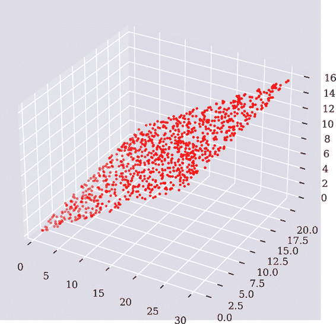
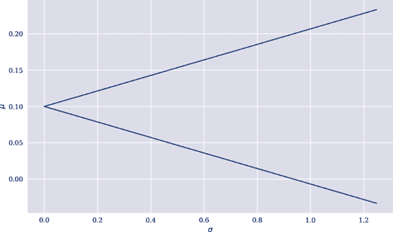
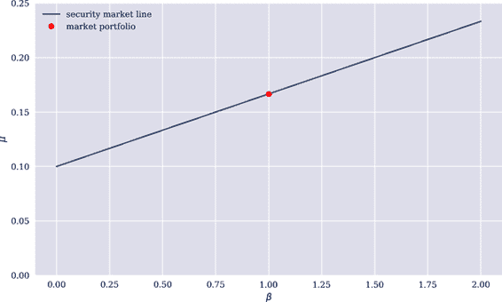

# 第三章\. 三态经济

> 如果每一个条件性索赔都可以通过某种交易策略生成，则模型被称为*完全*的。否则，模型被称为*不完全*的。
> 
> Stanley Pliska (1997)
> 
> 假设个人将任何投资的结果视为概率术语来看待；也就是说，他认为可能的结果可以用某种概率分布来描述。然而，在评估特定投资的可取性时，他只愿意基于该分布的两个参数行动——其期望值和标准偏差。
> 
> William Sharpe (1964)

前一章是基于最简单模型经济的，其中可以分析金融不确定性的概念。本章通过增加一个额外状态而使得二态经济稍微丰富化，同时保持交易的金融资产数量恒定为两个。在这种略微丰富的*静态三态经济*中，讨论了市场不完全性和鞍点测度的不确定性概念。介绍了超复制和近似复制方法以应对不完全性及其对条件性索赔定价的影响。本章还介绍了资本资产定价模型（CAPM），该模型基于均值-方差组合分析，并增加了均衡论点，以推导金融资产在均值-波动率空间中的价格，即使它们无法复制。

本章主要涵盖了金融、数学和 Python 编程中以下几个主题：

| 金融 | 数学 | Python |
| --- | --- | --- |
| 不确定性 | 概率空间 | `ndarray` |
| 金融资产 | 向量，矩阵 | `ndarray` |
| 可达到的条件性索赔 | 向量的跨度，向量空间的基 | `ndarray` |
| 鞍点定价，套利 | 概率测度集合，期望值 | `ndarray, np.dot` |
| 超复制 | 最小化，约束 | `scipy.optimize.minimize, dict, lambda` |
| 近似复制 | 均方误差，OLS 回归 | `np.linalg.lstsq` |
| 资本市场线 | 期望值，标准偏差 | `NumPy` |
| 资本资产定价模型 | 相关性，协方差 | `NumPy` |

如果没有明确说明，前一章节的二态经济的假设和概念可以延续到本章讨论的三态经济中。

# 不确定性

有两个*时间点*是相关的，即今天，<math alttext="t equals 0"><mrow><mi>t</mi> <mo>=</mo> <mn>0</mn></mrow></math>，和未来一年后的时间点，<math alttext="t equals 1"><mrow><mi>t</mi> <mo>=</mo> <mn>1</mn></mrow></math>。让*状态空间*由<math alttext="normal upper Omega equals StartSet u comma m comma d EndSet"><mrow><mi>Ω</mi> <mo>=</mo> <mo>{</mo> <mi>u</mi> <mo>,</mo> <mi>m</mi> <mo>,</mo> <mi>d</mi> <mo>}</mo></mrow></math>给定。<math alttext="StartSet u comma m comma d EndSet"><mrow><mo>{</mo> <mi>u</mi> <mo>,</mo> <mi>m</mi> <mo>,</mo> <mi>d</mi> <mo>}</mo></mrow></math>代表经济可能出现的三种不同状态。*幂集*在状态空间上给出为：

<math alttext="normal script upper P left-parenthesis normal upper Omega right-parenthesis equals StartSet normal empty-set comma StartSet u EndSet comma StartSet m EndSet comma StartSet d EndSet comma StartSet u comma m EndSet comma StartSet u comma d EndSet comma StartSet m comma d EndSet comma normal upper Omega EndSet" display="block"><mrow><mi>℘</mi> <mrow><mo>(</mo> <mi>Ω</mi> <mo>)</mo></mrow> <mo>=</mo> <mfenced separators="" open="{" close="}"><mi>∅</mi> <mo>,</mo> <mo>{</mo> <mi>u</mi> <mo>}</mo> <mo>,</mo> <mo>{</mo> <mi>m</mi> <mo>}</mo> <mo>,</mo> <mo>{</mo> <mi>d</mi> <mo>}</mo> <mo>,</mo> <mo>{</mo> <mi>u</mi> <mo>,</mo> <mi>m</mi> <mo>}</mo> <mo>,</mo> <mo>{</mo> <mi>u</mi> <mo>,</mo> <mi>d</mi> <mo>}</mo> <mo>,</mo> <mo>{</mo> <mi>m</mi> <mo>,</mo> <mi>d</mi> <mo>}</mo> <mo>,</mo> <mi>Ω</mi></mfenced></mrow></math>

概率度量<math alttext="upper P"><mi>P</mi></math>定义在幂集上，并假设<math alttext="upper P left-parenthesis omega right-parenthesis equals one-third comma omega element-of normal upper Omega"><mrow><mi>P</mi> <mrow><mo>(</mo> <mi>ω</mi> <mo>)</mo></mrow> <mo>=</mo> <mfrac><mn>1</mn> <mn>3</mn></mfrac> <mo>,</mo> <mi>ω</mi> <mo>∈</mo> <mi>Ω</mi></mrow></math>。由此产生的*概率空间*<math alttext="left-parenthesis normal upper Omega comma normal script upper P left-parenthesis normal upper Omega right-parenthesis comma upper P right-parenthesis"><mrow><mo>(</mo> <mi>Ω</mi> <mo>,</mo> <mi>℘</mi> <mo>(</mo> <mi>Ω</mi> <mo>)</mo> <mo>,</mo> <mi>P</mi> <mo>)</mo></mrow></math>代表模型经济中的*不确定性*。

# 金融资产

模型经济中有两种金融资产交易。第一种是*无风险债券*<math alttext="upper B equals left-parenthesis upper B 0 comma upper B 1 right-parenthesis"><mrow><mi>B</mi> <mo>=</mo> <mo>(</mo> <msub><mi>B</mi> <mn>0</mn></msub> <mo>,</mo> <msub><mi>B</mi> <mn>1</mn></msub> <mo>)</mo></mrow></math>，其中<math alttext="upper B 0 equals 10"><mrow><msub><mi>B</mi> <mn>0</mn></msub> <mo>=</mo> <mn>10</mn></mrow></math>，<math alttext="upper B 1 equals left-parenthesis 11 comma 11 comma 11 right-parenthesis Superscript upper T"><mrow><msub><mi>B</mi> <mn>1</mn></msub> <mo>=</mo> <msup><mrow><mo>(</mo><mn>11</mn><mo>,</mo><mn>11</mn><mo>,</mo><mn>11</mn><mo>)</mo></mrow> <mi>T</mi></msup></mrow></math>。因此，无风险利率为<math alttext="i equals"><mrow><mi>i</mi> <mo>=</mo></mrow></math> 0.1。

第二个是*风险股票*，<math alttext="upper S equals left-parenthesis upper S 0 comma left-parenthesis upper S 1 Superscript u Baseline comma upper S 1 Superscript m Baseline comma upper S 1 Superscript d Baseline right-parenthesis Superscript upper T Baseline right-parenthesis"><mrow><mi>S</mi> <mo>=</mo> <mfenced separators="" open="(" close=")"><msub><mi>S</mi> <mn>0</mn></msub> <mo>,</mo> <msup><mrow><mo>(</mo><msubsup><mi>S</mi> <mn>1</mn> <mi>u</mi></msubsup> <mo>,</mo><msubsup><mi>S</mi> <mn>1</mn> <mi>m</mi></msubsup> <mo>,</mo><msubsup><mi>S</mi> <mn>1</mn> <mi>d</mi></msubsup> <mo>)</mo></mrow> <mi>T</mi></msup></mfenced></mrow></math> ，其中 <math alttext="upper S 0 equals 10"><mrow><msub><mi>S</mi> <mn>0</mn></msub> <mo>=</mo> <mn>10</mn></mrow></math> 和:

<math alttext="upper S 1 equals Start 3 By 1 Matrix 1st Row  20 2nd Row  10 3rd Row  5 EndMatrix" display="block"><mrow><msub><mi>S</mi> <mn>1</mn></msub> <mo>=</mo> <mfenced open="(" close=")"><mtable><mtr><mtd><mn>20</mn></mtd></mtr> <mtr><mtd><mn>10</mn></mtd></mtr> <mtr><mtd><mn>5</mn></mtd></mtr></mtable></mfenced></mrow></math>

定义市场支付矩阵 <math alttext="script upper M element-of double-struck upper R Superscript 3 times 2"><mrow><mi>ℳ</mi> <mo>∈</mo> <msup><mi>ℝ</mi> <mrow><mn>3</mn><mo>×</mo><mn>2</mn></mrow></msup></mrow></math> 如下：

<math alttext="script upper M identical-to Start 3 By 2 Matrix 1st Row 1st Column upper B 1 2nd Column upper S 1 Superscript u Baseline 2nd Row 1st Column upper B 1 2nd Column upper S 1 Superscript m Baseline 3rd Row 1st Column upper B 1 2nd Column upper S 1 Superscript d Baseline EndMatrix equals Start 3 By 2 Matrix 1st Row 1st Column 11 2nd Column 20 2nd Row 1st Column 11 2nd Column 10 3rd Row 1st Column 11 2nd Column 5 EndMatrix" display="block"><mrow><mi>ℳ</mi> <mo>≡</mo> <mfenced open="(" close=")"><mtable><mtr><mtd><msub><mi>B</mi> <mn>1</mn></msub></mtd> <mtd><msubsup><mi>S</mi> <mn>1</mn> <mi>u</mi></msubsup></mtd></mtr> <mtr><mtd><msub><mi>B</mi> <mn>1</mn></msub></mtd> <mtd><msubsup><mi>S</mi> <mn>1</mn> <mi>m</mi></msubsup></mtd></mtr> <mtr><mtd><msub><mi>B</mi> <mn>1</mn></msub></mtd> <mtd><msubsup><mi>S</mi> <mn>1</mn> <mi>d</mi></msubsup></mtd></mtr></mtable></mfenced> <mo>=</mo> <mfenced open="(" close=")"><mtable><mtr><mtd><mn>11</mn></mtd> <mtd><mn>20</mn></mtd></mtr> <mtr><mtd><mn>11</mn></mtd> <mtd><mn>10</mn></mtd></mtr> <mtr><mtd><mn>11</mn></mtd> <mtd><mn>5</mn></mtd></mtr></mtable></mfenced></mrow></math>

# 可达可实现索赔

交易的金融资产的*跨度*也被称为*可达可实现索赔集合* <math alttext="double-struck upper A"><mi>𝔸</mi></math> 。一个可实现的索赔 <math alttext="upper C 1 colon normal upper Omega right-arrow double-struck upper R Subscript 0 Baseline"><mrow><msub><mi>C</mi> <mn>1</mn></msub> <mo>:</mo> <mi>Ω</mi> <mo>→</mo> <msub><mi>ℝ</mi> <mrow><mo>≥</mo><mn>0</mn></mrow></msub></mrow></math> 是指其支付可以表示为交易资产的支付向量的线性组合。换句话说，存在一个投资组合 <math alttext="phi"><mi>ϕ</mi></math> 使得 <math alttext="upper V 1 left-parenthesis phi right-parenthesis equals script upper M dot phi equals upper C 1"><mrow><msub><mi>V</mi> <mn>1</mn></msub> <mrow><mo>(</mo> <mi>ϕ</mi> <mo>)</mo></mrow> <mo>=</mo> <mi>ℳ</mi> <mo>·</mo> <mi>ϕ</mi> <mo>=</mo> <msub><mi>C</mi> <mn>1</mn></msub></mrow></math> 。因此

<math alttext="double-struck upper A equals StartSet script upper M dot phi comma phi element-of double-struck upper R squared EndSet" display="block"><mrow><mi>𝔸</mi> <mo>=</mo> <mfenced separators="" open="{" close="}"><mi>ℳ</mi> <mo>·</mo> <mi>ϕ</mi> <mo>,</mo> <mi>ϕ</mi> <mo>∈</mo> <msup><mi>ℝ</mi> <mn>2</mn></msup></mfenced></mrow></math>

如果投资组合头寸没有限制，或者

<math mode="display"><mrow><mi>𝔸</mi> <mo>=</mo> <mfenced separators="" open="{" close="}"><mi>ℳ</mi> <mo>·</mo> <mi>ϕ</mi> <mo>,</mo> <mi>ϕ</mi> <mo>∈</mo> <msubsup><mi>ℝ</mi> <mrow><mn>≥0</mn></mrow> <mn>2</mn></msubsup></mfenced></mrow></math>

如果禁止做空。

很容易验证两种金融资产的支付向量是线性独立的。然而，只有两个这样的向量和三种不同的状态。 根据线性代数的标准结果，需要一个矢量空间 <math alttext="double-struck upper R cubed"><msup><mi>ℝ</mi> <mn>3</mn></msup></math> 的基础由三个线性无关的向量组成。换句话说，并非每一个可达索赔都能通过交易的金融资产的投资组合复制。 一个例子是，例如，*第一个 Arrow-Debreu 安全性*。 复制的线性方程组是：

<math alttext="StartLayout Enlarged left-brace 1st Row  b dot 11 plus s dot 20 equals 1 2nd Row  b dot 11 plus s dot 10 equals 0 3rd Row  b dot 11 plus s dot 5 equals 0 EndLayout" display="block"><mfenced separators="" open="{" close=""><mtable><mtr><mtd columnalign="left"><mrow><mi>b</mi> <mo>·</mo> <mn>11</mn> <mo>+</mo> <mi>s</mi> <mo>·</mo> <mn>20</mn> <mo>=</mo> <mn>1</mn></mrow></mtd></mtr> <mtr><mtd columnalign="left"><mrow><mi>b</mi> <mo>·</mo> <mn>11</mn> <mo>+</mo> <mi>s</mi> <mo>·</mo> <mn>10</mn> <mo>=</mo> <mn>0</mn></mrow></mtd></mtr> <mtr><mtd columnalign="left"><mrow><mi>b</mi> <mo>·</mo> <mn>11</mn> <mo>+</mo> <mi>s</mi> <mo>·</mo> <mn>5</mn> <mo>=</mo> <mn>0</mn></mrow></mtd></mtr></mtable></mfenced></math>

从第一个方程式减去第二个方程式得到 <math alttext="s equals one-tenth"><mrow><mi>s</mi> <mo>=</mo> <mfrac><mn>1</mn> <mn>10</mn></mfrac></mrow></math> 。从第一个方程式减去第三个方程式得到 <math alttext="s equals one-fifteenth"><mrow><mi>s</mi> <mo>=</mo> <mfrac><mn>1</mn> <mn>15</mn></mfrac></mrow></math> ，显然与第一个结果矛盾。因此，这个复制问题没有解决方案。

使用 Python，可以在三维空间中可视化可达的条件索赔集合。该方法基于蒙特卡洛模拟进行投资组合。为简单起见，模拟仅允许在 0 到 1 之间的正面投资组合位置。图 3-1 图形显示了结果，并说明这两个向量只能跨越三维空间的二维区域。如果市场是完整的，模拟的支付向量将填充一个立方体（金融资产将跨越 <math alttext="double-struck upper R cubed"><msup><mi>ℝ</mi> <mn>3</mn></msup></math> ），而不仅仅是一个矩形区域（跨越 <math alttext="double-struck upper R squared"><msup><mi>ℝ</mi> <mn>2</mn></msup></math> ）。不确定性建模沿用了 第 2 章 中介绍的 Python 代码，针对经济三种可能的未来状态进行了必要的调整：

```py
In [1]: import numpy as np
        from numpy.random import default_rng
        np.set_printoptions(precision=5, suppress=True)

In [2]: rng = default_rng(100)

In [3]: B = (10, np.array((11, 11, 11)))

In [4]: S = (10, np.array((20, 10, 5)))

In [5]: n = 1000  

In [6]: b = rng.random(n)  

In [7]: b[:5]  
Out[7]: array([0.83498, 0.59655, 0.28886, 0.04295, 0.97365])

In [8]: s = rng.random(n)  

In [9]: A = [b[i] * B[1] + s[i] * S[1] for i in range(n)]  

In [10]: A = np.array(A)  

In [11]: A[:3]  
Out[11]: array([[19.86232, 14.52356, 11.85418],
                [26.35796, 16.46003, 11.51106],
                [11.64939,  7.41344,  5.29547]])

In [12]: from pylab import mpl, plt   
         plt.style.use('seaborn')
         mpl.rcParams['savefig.dpi'] = 300
         mpl.rcParams['font.family'] = 'serif'
         from mpl_toolkits.mplot3d import Axes3D  

In [13]: fig = plt.figure(figsize=(10, 6))  
         ax = fig.add_subplot(111, projection='3d')  
         ax.scatter(A[:, 0], A[:, 1], A[:, 2], c='r', marker='.');  
```


需要模拟的投资组合数量。


在债券中的随机位置，这里列出了一些示例—所有位置值都介于 0 到 1 之间。


在股票中的随机位置。


一个 `list` 推导式，用于计算随机组合投资组合的结果支付向量。


`matplotlib` 的基本绘图子包。


三维绘图能力。


创建一个空画布。


添加一个三维对象的子图。


将支付向量可视化为每个红点。

# 市场不完备性

在完整模型经济中，*每一个*条件索赔都是可达的，但在不完全市场中，通常只有*小部分*条件索赔是可达的。在这个意义上，从完全模型经济转变为不完全模型经济具有巨大的后果。复制定价，正如 第 2 章 中介绍的那样，依赖于条件索赔的可达性。那么，当复制失败时如何定价？在本章的其余部分回答了这些问题及其他相关问题。



###### 图 3-1。在三维中可视化的随机投资组合收益向量

# **马丁格尔定价**

从资产定价的第一基本定理（1FTAP）和第二基本定理（2FTAP）清楚地可以看出马丁格尔测度的重要性。

## **马丁格尔测度**

任何概率测度都使得折现债券价格过程成为马丁格尔过程。那么股票价格过程呢？马丁格尔测度<math><mrow><mi>Q</mi><mo>:</mo><mi>℘</mi><mrow><mo>(</mo><mi>Ω</mi><mo>)</mo></mrow><mo>→</mo><msub><mi>ℝ</mi> <mrow><mn>≥0</mn></mrow></msub></mrow></math>的定义方程是：

<math alttext="upper S 0 dot left-parenthesis 1 plus i right-parenthesis equals bold upper E Superscript upper Q Baseline left-parenthesis upper S 1 right-parenthesis" display="block"><mrow><msub><mi>S</mi> <mn>0</mn></msub> <mo>·</mo> <mrow><mo>(</mo> <mn>1</mn> <mo>+</mo> <mi>i</mi> <mo>)</mo></mrow> <mo>=</mo> <msup><mi>𝐄</mi> <mi>Q</mi></msup> <mrow><mo>(</mo> <msub><mi>S</mi> <mn>1</mn></msub> <mo>)</mo></mrow></mrow></math>

或者

<math alttext="upper S 0 dot left-parenthesis 1 plus i right-parenthesis equals q Superscript u Baseline dot upper S 1 Superscript u Baseline plus q Superscript m Baseline dot upper S 1 Superscript m Baseline plus q Superscript d Baseline dot upper S 1 Superscript d" display="block"><mrow><msub><mi>S</mi> <mn>0</mn></msub> <mo>·</mo> <mrow><mo>(</mo> <mn>1</mn> <mo>+</mo> <mi>i</mi> <mo>)</mo></mrow> <mo>=</mo> <msup><mi>q</mi> <mi>u</mi></msup> <mo>·</mo> <msubsup><mi>S</mi> <mn>1</mn> <mi>u</mi></msubsup> <mo>+</mo> <msup><mi>q</mi> <mi>m</mi></msup> <mo>·</mo> <msubsup><mi>S</mi> <mn>1</mn> <mi>m</mi></msubsup> <mo>+</mo> <msup><mi>q</mi> <mi>d</mi></msup> <mo>·</mo> <msubsup><mi>S</mi> <mn>1</mn> <mi>d</mi></msubsup></mrow></math>

与<math alttext="q Superscript omega Baseline identical-to upper Q left-parenthesis omega right-parenthesis comma omega element-of normal upper Omega"><mrow><msup><mi>q</mi> <mi>ω</mi></msup> <mo>≡</mo> <mi>Q</mi> <mrow><mo>(</mo> <mi>ω</mi> <mo>)</mo></mrow> <mo>,</mo> <mi>ω</mi> <mo>∈</mo> <mi>Ω</mi></mrow></math> 。用数字和<math alttext="q Superscript d Baseline equals 1 minus q Superscript u Baseline minus q Superscript m"><mrow><msup><mi>q</mi> <mi>d</mi></msup> <mo>=</mo> <mn>1</mn> <mo>-</mo> <msup><mi>q</mi> <mi>u</mi></msup> <mo>-</mo> <msup><mi>q</mi> <mi>m</mi></msup></mrow></math>表示：

<math alttext="StartLayout 1st Row 1st Column 11 2nd Column equals 3rd Column q Superscript u Baseline dot 20 plus q Superscript m Baseline dot 10 plus left-parenthesis 1 minus q Superscript u Baseline minus q Superscript m Baseline right-parenthesis dot 5 2nd Row 1st Column q Superscript m Baseline 2nd Column equals 3rd Column StartFraction 6 minus 15 dot q Superscript u Baseline Over 5 EndFraction EndLayout" display="block"><mtable><mtr><mtd><mn>11</mn></mtd> <mtd><mo>=</mo></mtd> <mtd><mrow><msup><mi>q</mi> <mi>u</mi></msup> <mo>·</mo> <mn>20</mn> <mo>+</mo> <msup><mi>q</mi> <mi>m</mi></msup> <mo>·</mo> <mn>10</mn> <mo>+</mo> <mrow><mo>(</mo> <mn>1</mn> <mo>-</mo> <msup><mi>q</mi> <mi>u</mi></msup> <mo>-</mo> <msup><mi>q</mi> <mi>m</mi></msup> <mo>)</mo></mrow> <mo>·</mo> <mn>5</mn></mrow></mtd></mtr> <mtr><mtd><mrow><mo>⇔</mo> <msup><mi>q</mi> <mi>m</mi></msup></mrow></mtd> <mtd><mo>=</mo></mtd> <mtd><mfrac><mrow><mn>6</mn><mo>-</mo><mn>15</mn><mo>·</mo><msup><mi>q</mi> <mi>u</mi></msup></mrow> <mn>5</mn></mfrac></mtd></mtr></mtable></math>

回顾概率测度的性质，必须成立（约束条件）

<math alttext="StartLayout 1st Row 1st Column 6 minus 15 dot q Superscript u 2nd Column greater-than-or-equal-to 3rd Column 0 2nd Row 1st Column q Superscript u Baseline 2nd Column less-than-or-equal-to 3rd Column two-fifths EndLayout" display="block"><mtable><mtr><mtd><mrow><mn>6</mn> <mo>-</mo> <mn>15</mn> <mo>·</mo> <msup><mi>q</mi> <mi>u</mi></msup></mrow></mtd> <mtd><mo>≥</mo></mtd> <mtd><mn>0</mn></mtd></mtr> <mtr><mtd><mrow><mo>⇔</mo> <msup><mi>q</mi> <mi>u</mi></msup></mrow></mtd> <mtd><mo>≤</mo></mtd> <mtd><mfrac><mn>2</mn> <mn>5</mn></mfrac></mtd></mtr></mtable></math>

和（非约束条件）

<math alttext="StartLayout 1st Row 1st Column StartFraction 6 minus 15 dot q Superscript u Baseline Over 5 EndFraction 2nd Column less-than-or-equal-to 3rd Column 1 2nd Row 1st Column q Superscript u Baseline 2nd Column greater-than-or-equal-to 3rd Column one-fifteenth EndLayout" display="block"><mtable><mtr><mtd><mfrac><mrow><mn>6</mn><mo>-</mo><mn>15</mn><mo>·</mo><msup><mi>q</mi> <mi>u</mi></msup></mrow> <mn>5</mn></mfrac></mtd> <mtd><mo>≤</mo></mtd> <mtd><mn>1</mn></mtd></mtr> <mtr><mtd><mrow><mo>⇔</mo> <msup><mi>q</mi> <mi>u</mi></msup></mrow></mtd> <mtd><mo>≥</mo></mtd> <mtd><mfrac><mn>1</mn> <mn>15</mn></mfrac></mtd></mtr></mtable></math>

以及（约束条件）

<math alttext="StartLayout 1st Row 1st Column q Superscript d Baseline equals 1 minus q Superscript u Baseline minus q Superscript m Baseline 2nd Column greater-than-or-equal-to 3rd Column 0 2nd Row 1st Column q Superscript u Baseline 2nd Column greater-than-or-equal-to 3rd Column one-tenth EndLayout" display="block"><mtable><mtr><mtd><mrow><msup><mi>q</mi> <mi>d</mi></msup> <mo>=</mo> <mn>1</mn> <mo>-</mo> <msup><mi>q</mi> <mi>u</mi></msup> <mo>-</mo> <msup><mi>q</mi> <mi>m</mi></msup></mrow></mtd> <mtd><mo>≥</mo></mtd> <mtd><mn>0</mn></mtd></mtr> <mtr><mtd><mrow><mo>⇔</mo> <msup><mi>q</mi> <mi>u</mi></msup></mrow></mtd> <mtd><mo>≥</mo></mtd> <mtd><mfrac><mn>1</mn> <mn>10</mn></mfrac></mtd></mtr></mtable></math>

和（非约束条件）

<math alttext="StartLayout 1st Row 1st Column q Superscript d Baseline equals 1 minus q Superscript u Baseline minus q Superscript m Baseline 2nd Column less-than-or-equal-to 3rd Column 1 2nd Row 1st Column q Superscript u Baseline 2nd Column less-than-or-equal-to 3rd Column three-fifths EndLayout" display="block"><mtable><mtr><mtd><mrow><msup><mi>q</mi> <mi>d</mi></msup> <mo>=</mo> <mn>1</mn> <mo>-</mo> <msup><mi>q</mi> <mi>u</mi></msup> <mo>-</mo> <msup><mi>q</mi> <mi>m</mi></msup></mrow></mtd> <mtd><mo>≤</mo></mtd> <mtd><mn>1</mn></mtd></mtr> <mtr><mtd><mrow><mo>⇔</mo> <msup><mi>q</mi> <mi>u</mi></msup></mrow></mtd> <mtd><mo>≤</mo></mtd> <mtd><mfrac><mn>3</mn> <mn>5</mn></mfrac></mtd></mtr></mtable></math>

因此，存在无穷多个概率测度使得折现股票价格过程成为马丁格尔过程。设置<math alttext="q identical-to q Superscript u"><mrow><mi>q</mi> <mo>≡</mo> <msup><mi>q</mi> <mi>u</mi></msup></mrow></math>，与市场模型一致的所有马丁格尔测度<math alttext="double-struck upper Q"><mi>ℚ</mi></math>的集合是：

<math alttext="double-struck upper Q equals StartSet Start 3 By 1 Matrix 1st Row  q 2nd Row  StartFraction 6 minus 15 dot q Over 5 EndFraction 3rd Row  1 minus q minus StartFraction 6 minus 15 dot q Over 5 EndFraction EndMatrix comma one-tenth less-than-or-equal-to q less-than-or-equal-to two-fifths EndSet" display="block"><mrow><mi>ℚ</mi> <mo>=</mo> <mfenced separators="" open="{" close="}"><mfenced open="(" close=")"><mtable><mtr><mtd><mi>q</mi></mtd></mtr> <mtr><mtd><mfrac><mrow><mn>6</mn><mo>-</mo><mn>15</mn><mo>·</mo><mi>q</mi></mrow> <mn>5</mn></mfrac></mtd></mtr> <mtr><mtd><mrow><mn>1</mn> <mo>-</mo> <mi>q</mi> <mo>-</mo> <mfrac><mrow><mn>6</mn><mo>-</mo><mn>15</mn><mo>·</mo><mi>q</mi></mrow> <mn>5</mn></mfrac></mrow></mtd></mtr></mtable></mfenced> <mo>,</mo> <mfrac><mn>1</mn> <mn>10</mn></mfrac> <mo>≤</mo> <mi>q</mi> <mo>≤</mo> <mfrac><mn>2</mn> <mn>5</mn></mfrac></mfenced></mrow></math>

举例来说，取<math alttext="q equals three-tenths"><mrow><mi>q</mi> <mo>=</mo> <mfrac><mn>3</mn> <mn>10</mn></mfrac></mrow></math>。结果是

<math alttext="upper Q left-parenthesis q equals three-tenths right-parenthesis equals Start 3 By 1 Matrix 1st Row  three-tenths 2nd Row  StartFraction 6 minus 15 dot three-tenths Over 5 EndFraction 3rd Row  1 minus three-tenths minus three-tenths EndMatrix equals Start 3 By 1 Matrix 1st Row  three-tenths 2nd Row  three-tenths 3rd Row  four-tenths EndMatrix" display="block"><mrow><mi>Q</mi> <mfenced separators="" open="(" close=")"><mi>q</mi> <mo>=</mo> <mfrac><mn>3</mn> <mn>10</mn></mfrac></mfenced> <mo>=</mo> <mfenced open="(" close=")"><mtable><mtr><mtd><mfrac><mn>3</mn> <mn>10</mn></mfrac></mtd></mtr> <mtr><mtd><mfrac><mrow><mn>6</mn><mo>-</mo><mn>15</mn><mo>·</mo><mfrac><mn>3</mn> <mn>10</mn></mfrac></mrow> <mn>5</mn></mfrac></mtd></mtr> <mtr><mtd><mrow><mn>1</mn> <mo>-</mo> <mfrac><mn>3</mn> <mn>10</mn></mfrac> <mo>-</mo> <mfrac><mn>3</mn> <mn>10</mn></mfrac></mrow></mtd></mtr></mtable></mfenced> <mo>=</mo> <mfenced open="(" close=")"><mtable><mtr><mtd><mfrac><mn>3</mn> <mn>10</mn></mfrac></mtd></mtr> <mtr><mtd><mfrac><mn>3</mn> <mn>10</mn></mfrac></mtd></mtr> <mtr><mtd><mfrac><mn>4</mn> <mn>10</mn></mfrac></mtd></mtr></mtable></mfenced></mrow></math>

和

<math alttext="three-tenths dot 20 plus three-tenths dot 10 plus four-tenths dot 5 equals 11" display="block"><mrow><mfrac><mn>3</mn> <mn>10</mn></mfrac> <mo>·</mo> <mn>20</mn> <mo>+</mo> <mfrac><mn>3</mn> <mn>10</mn></mfrac> <mo>·</mo> <mn>10</mn> <mo>+</mo> <mfrac><mn>4</mn> <mn>10</mn></mfrac> <mo>·</mo> <mn>5</mn> <mo>=</mo> <mn>11</mn></mrow></math>

作为股票价格过程的期望。

根据之前的规范，Python 中的计算如下所示：

```py
In [14]: Q = np.array((0.3, 0.3, 0.4))

In [15]: np.dot(Q, S[1])
Out[15]: 11.0
```

根据第二基本定理，市场模型是*不完全的*，因为有不止一个与市场模型一致的马丁格尔测度。

# 不完全市场中的马丁格尔测度

完全市场模型的特征是具有唯一的马丁格尔测度。相比之下，不完全市场模型通常允许与模型经济一致的无穷多个马丁格尔测度。这对于衍生品的定价具有重要的后果，因为不同的马丁格尔测度将导致衍生品的不同价值，这些价值都与无套利的存在一致。

## 风险中性定价

无限数量的市场一致鞅测度对套期权定价的影响是什么？首先，对于那些可达到的套期权，**𝔸**，套利定价类似于完全市场设置：复制投资组合的价值等于要复制的套期权的价格 — 否则存在套利机会。形式上，如果**V₀(ϕ)**等于**C₀**，则**C₀**等于**V₀(ϕ)**。

对于那些不可达到的套期权，如果**C₁ ∈ 𝔸̅ = ℝ³ \ 𝔸**，答案并不简单。假设第一个 Arrow-Debreu 证券**γᵘ**。正如之前所示，它不能被复制，因此属于集合**𝔸̅**。它的鞅价格是：

<math alttext="gamma 0 Superscript u Baseline left-parenthesis q right-parenthesis equals StartFraction 1 Over 1 plus i EndFraction dot double-struck upper E Superscript upper Q Baseline left-parenthesis left-parenthesis 1 comma 0 comma 0 right-parenthesis Superscript upper T Baseline right-parenthesis equals StartFraction 1 Over 1 plus i EndFraction dot q" display="block"><mrow><msubsup><mi>γ</mi> <mn>0</mn> <mi>u</mi></msubsup> <mrow><mo>(</mo> <mi>q</mi> <mo>)</mo></mrow> <mo>=</mo> <mfrac><mn>1</mn> <mrow><mn>1</mn><mo>+</mo><mi>i</mi></mrow></mfrac> <mo>·</mo> <msup><mi>𝔼</mi> <mi>Q</mi></msup> <mfenced separators="" open="(" close=")"><msup><mrow><mo>(</mo><mn>1</mn><mo>,</mo><mn>0</mn><mo>,</mo><mn>0</mn><mo>)</mo></mrow> <mi>T</mi></msup></mfenced> <mo>=</mo> <mfrac><mn>1</mn> <mrow><mn>1</mn><mo>+</mo><mi>i</mi></mrow></mfrac> <mo>·</mo> <mi>q</mi></mrow></math>

数量**γ₀ᵘᵦ**通常称为在状态**ω ∈ Ω**中一单位货币的*状态价格*。它简单地是该状态的折现鞅概率。

在模型经济中，必须保持**1/10 ≤ q ≤ 2/5**，因此避免套利机会的鞅价格位于区间内：

<math alttext="StartFraction 10 Over 11 EndFraction dot one-tenth equals one-eleventh less-than-or-equal-to gamma 0 Superscript u Baseline less-than-or-equal-to StartFraction 10 Over 11 EndFraction dot two-fifths equals four-elevenths" display="block"><mrow><mfrac><mn>10</mn> <mn>11</mn></mfrac> <mo>·</mo> <mfrac><mn>1</mn> <mn>10</mn></mfrac> <mo>=</mo> <mfrac><mn>1</mn> <mn>11</mn></mfrac> <mo>≤</mo> <msubsup><mi>γ</mi> <mn>0</mn> <mi>u</mi></msubsup> <mo>≤</mo> <mfrac><mn>10</mn> <mn>11</mn></mfrac> <mo>·</mo> <mfrac><mn>2</mn> <mn>5</mn></mfrac> <mo>=</mo> <mfrac><mn>4</mn> <mn>11</mn></mfrac></mrow></math>

简言之，对于第一个 Arrow-Debreu 证券，介于**1/11**和**4/11**之间的每个价格都与消除套利的假设一致。对于不可达到的其他套期权的计算导致类似的结果。

# 超复制

复制不仅在*定价*背景下很重要。它还是处理由于不确定权利要求支付而导致的风险的方法。考虑一个任意可达到的权利要求。除了持有权利要求之外，还可以卖空复制组合，以消除任何来自未来支付不确定性的风险。这是因为权利要求和复制组合的支付完美地互相抵消。形式上，如果组合 <math alttext="phi Superscript asterisk"><msup><mi>ϕ</mi> <mo>*</mo></msup></math> 复制权利要求 <math alttext="upper C 1"><msub><mi>C</mi> <mn>1</mn></msub></math> ，则

<math alttext="upper C 1 minus upper V 1 left-parenthesis phi Superscript asterisk Baseline right-parenthesis equals upper C 1 minus script upper M dot phi Superscript asterisk Baseline equals 0" display="block"><mrow><msub><mi>C</mi> <mn>1</mn></msub> <mo>-</mo> <msub><mi>V</mi> <mn>1</mn></msub> <mrow><mo>(</mo> <msup><mi>ϕ</mi> <mo>*</mo></msup> <mo>)</mo></mrow> <mo>=</mo> <msub><mi>C</mi> <mn>1</mn></msub> <mo>-</mo> <mi>ℳ</mi> <mo>·</mo> <msup><mi>ϕ</mi> <mo>*</mo></msup> <mo>=</mo> <mn>0</mn></mrow></math>

对于不可达到的权利要求，这样一个完美的对冲是不可用的。但是，总是可以构造一个组合来*超复制*这样一个权利要求的支付。一个组合 <math alttext="phi"><mi>ϕ</mi></math> 超复制一个权利要求 <math alttext="upper C 1"><msub><mi>C</mi> <mn>1</mn></msub></math> ，如果它在经济的每一个未来状态下的支付都大于或等于权利要求的支付 <math alttext="upper V 1 left-parenthesis phi right-parenthesis greater-than-or-equal-to upper C 1"><mrow><msub><mi>V</mi> <mn>1</mn></msub> <mrow><mo>(</mo> <mi>ϕ</mi> <mo>)</mo></mrow> <mo>≥</mo> <msub><mi>C</mi> <mn>1</mn></msub></mrow></math> 。

再次考虑第一个 Arrow-Debreu 证券 <math alttext="gamma Superscript u"><msup><mi>γ</mi> <mi>u</mi></msup></math> ，它是不可达到的。例如，可以通过仅包含无风险债券的组合来超复制其支付：

<math alttext="phi equals left-parenthesis StartFraction 1 Over upper B 1 EndFraction comma 0 right-parenthesis Superscript upper T" display="block"><mrow><mi>ϕ</mi> <mo>=</mo> <msup><mfenced separators="" open="(" close=")"><mfrac><mn>1</mn> <msub><mi>B</mi> <mn>1</mn></msub></mfrac> <mo>,</mo><mn>0</mn></mfenced> <mi>T</mi></msup></mrow></math>

结果的支付是

<math alttext="upper V 1 left-parenthesis phi right-parenthesis equals StartFraction 1 Over upper B 1 EndFraction dot Start 3 By 1 Matrix 1st Row  upper B 1 2nd Row  upper B 1 3rd Row  upper B 1 EndMatrix equals Start 3 By 1 Matrix 1st Row  1 2nd Row  1 3rd Row  1 EndMatrix greater-than-or-equal-to Start 3 By 1 Matrix 1st Row  1 2nd Row  0 3rd Row  0 EndMatrix equals upper C 1" display="block"><mrow><msub><mi>V</mi> <mn>1</mn></msub> <mrow><mo>(</mo> <mi>ϕ</mi> <mo>)</mo></mrow> <mo>=</mo> <mfrac><mn>1</mn> <msub><mi>B</mi> <mn>1</mn></msub></mfrac> <mo>·</mo> <mfenced open="(" close=")"><mtable><mtr><mtd><msub><mi>B</mi> <mn>1</mn></msub></mtd></mtr> <mtr><mtd><msub><mi>B</mi> <mn>1</mn></msub></mtd></mtr> <mtr><mtd><msub><mi>B</mi> <mn>1</mn></msub></mtd></mtr></mtable></mfenced> <mo>=</mo> <mfenced open="(" close=")"><mtable><mtr><mtd><mn>1</mn></mtd></mtr> <mtr><mtd><mn>1</mn></mtd></mtr> <mtr><mtd><mn>1</mn></mtd></mtr></mtable></mfenced> <mo>≥</mo> <mfenced open="(" close=")"><mtable><mtr><mtd><mn>1</mn></mtd></mtr> <mtr><mtd><mn>0</mn></mtd></mtr> <mtr><mtd><mn>0</mn></mtd></mtr></mtable></mfenced> <mo>=</mo> <msub><mi>C</mi> <mn>1</mn></msub></mrow></math>

其中 <math alttext="greater-than-or-equal-to"><mo>≥</mo></math> 符号是逐元理解的。虽然这满足超复制的定义，但在设置超复制组合的成本方面可能不是最佳选择。因此，一般引入了*成本最小化*的论证。

一个权利要求 <math alttext="upper C 1"><msub><mi>C</mi> <mn>1</mn></msub></math> 的*最小成本*超复制问题是：

<math alttext="StartLayout 1st Row  min Underscript phi Endscripts upper V 0 left-parenthesis phi right-parenthesis 2nd Row  s period t period upper V 1 left-parenthesis phi right-parenthesis greater-than-or-equal-to upper C 1 EndLayout" display="block"><mtable><mtr><mtd><mrow><munder><mo movablelimits="true" form="prefix">min</mo> <mi>ϕ</mi></munder> <msub><mi>V</mi> <mn>0</mn></msub> <mrow><mo>(</mo> <mi>ϕ</mi> <mo>)</mo></mrow></mrow></mtd></mtr> <mtr><mtd><mrow><mtext>s.t.</mtext> <msub><mi>V</mi> <mn>1</mn></msub> <mrow><mo>(</mo> <mi>ϕ</mi> <mo>)</mo></mrow> <mo>≥</mo> <msub><mi>C</mi> <mn>1</mn></msub></mrow></mtd></mtr></mtable></math>

或者

<math alttext="StartLayout 1st Row  min Underscript b comma s Endscripts b dot upper B 0 plus s dot upper S 0 2nd Row  s period t period StartLayout Enlarged left-brace 1st Row  b dot upper B 1 plus s dot upper S 1 Superscript u Baseline greater-than-or-equal-to upper C 1 Superscript u Baseline 2nd Row  b dot upper B 1 plus s dot upper S 1 Superscript m Baseline greater-than-or-equal-to upper C 1 Superscript m Baseline 3rd Row  b dot upper B 1 plus s dot upper S 1 Superscript d Baseline greater-than-or-equal-to upper C 1 Superscript d EndLayout EndLayout" display="block"><mtable><mtr><mtd><mrow><munder><mo movablelimits="true" form="prefix">min</mo> <mrow><mi>b</mi><mo>,</mo><mi>s</mi></mrow></munder> <mi>b</mi> <mo>·</mo> <msub><mi>B</mi> <mn>0</mn></msub> <mo>+</mo> <mi>s</mi> <mo>·</mo> <msub><mi>S</mi> <mn>0</mn></msub></mrow></mtd></mtr> <mtr><mtd><mrow><mtext>s.t.</mtext> <mfenced separators="" open="{" close=""><mtable><mtr><mtd columnalign="left"><mrow><mi>b</mi> <mo>·</mo> <msub><mi>B</mi> <mn>1</mn></msub> <mo>+</mo> <mi>s</mi> <mo>·</mo> <msubsup><mi>S</mi> <mn>1</mn> <mi>u</mi></msubsup> <mo>≥</mo> <msubsup><mi>C</mi> <mn>1</mn> <mi>u</mi></msubsup></mrow></mtd></mtr> <mtr><mtd columnalign="left"><mrow><mi>b</mi> <mo>·</mo> <msub><mi>B</mi> <mn>1</mn></msub> <mo>+</mo> <mi>s</mi> <mo>·</mo> <msubsup><mi>S</mi> <mn>1</mn> <mi>m</mi></msubsup> <mo>≥</mo> <msubsup><mi>C</mi> <mn>1</mn> <mi>m</mi></msubsup></mrow></mtd></mtr> <mtr><mtd columnalign="left"><mrow><mi>b</mi> <mo>·</mo> <msub><mi>B</mi> <mn>1</mn></msub> <mo>+</mo> <mi>s</mi> <mo>·</mo> <msubsup><mi>S</mi> <mn>1</mn> <mi>d</mi></msubsup> <mo>≥</mo> <msubsup><mi>C</mi> <mn>1</mn> <mi>d</mi></msubsup></mrow></mtd></mtr></mtable></mfenced></mrow></mtd></mtr></mtable></math>

当使用 [`SciPy`](http://scipy.org) 包时，这种最小化问题可以在 Python 中直接建模和求解。以下代码首先计算了仅使用债券的低效超复制组合的成本。然后定义了一个组合的价值函数。它还说明了替代的组合构成确实可以更加成本有效：

```py
In [16]: C1 = np.array((1, 0, 0))  

In [17]: 1 / B[1][0] * B[1] >= C1  
Out[17]: array([ True,  True,  True])

In [18]: 1 / B[1][0] * B[0]  
Out[18]: 0.9090909090909092

In [19]: def V(phi, t):  
             return phi[0] * B[t] + phi[1] * S[t]

In [20]: phi = np.array((0.04, 0.03))  

In [21]: V(phi, 0)  
Out[21]: 0.7

In [22]: V(phi, 1)  
Out[22]: array([1.04, 0.74, 0.59])
```


权利要求的支付（第一个 Arrow-Debreu 证券）。


仅包含债券的组合已经检查了超复制特性。


设置这个组合的成本。


一个用于计算投资组合`phi`在今天（`t=0`）或一年后（`t=1`）价值的函数。


另一个用于超复制投资组合的猜测。


设置它的成本，比仅使用债券要低。


和一年后的结果值（回报），它超复制了第一个阿罗-德布鲁证券。

代码的第二部分以向量化的方式实现基于先前不等式约束的*最小化程序*。成本最优的超复制投资组合比仅使用债券或已经更有效的包括债券和股票的投资组合要便宜得多：

```py
In [23]: from scipy.optimize import minimize  

In [24]: cons = ({'type': 'ineq', 'fun': lambda phi: V(phi, 1) - C1})  

In [25]: res = minimize(lambda phi: V(phi, 0),  
                        (0.01, 0.01),  
                        method='SLSQP',  
                        constraints=cons)  

In [26]: res  
Out[26]:      fun: 0.3636363636310989
              jac: array([10., 10.])
          message: 'Optimization terminated successfully'
             nfev: 6
              nit: 2
             njev: 2
           status: 0
          success: True
                x: array([-0.0303 ,  0.06667])

In [27]: V(res['x'], 0)  
Out[27]: 0.3636363636310989

In [28]: V(res['x'], 1)  
Out[28]: array([ 1.     ,  0.33333, -0.     ])
```


从`scipy.optimize`中导入`minimize`函数。


以向量化方式定义基于`lambda`（或匿名）函数的不等式约束；这里建模的函数<math alttext="lamda"><mi>λ</mi></math>为<math alttext="lamda left-parenthesis phi right-parenthesis equals upper V 1 left-parenthesis phi right-parenthesis minus upper C 1"><mrow><mi>λ</mi> <mrow><mo>(</mo> <mi>ϕ</mi> <mo>)</mo></mrow> <mo>=</mo> <msub><mi>V</mi> <mn>1</mn></msub> <mrow><mo>(</mo> <mi>ϕ</mi> <mo>)</mo></mrow> <mo>-</mo> <msub><mi>C</mi> <mn>1</mn></msub></mrow></math>，对应的不等式约束<math alttext="lamda left-parenthesis phi right-parenthesis greater-than-or-equal-to 0"><mrow><mi>λ</mi> <mo>(</mo> <mi>ϕ</mi> <mo>)</mo> <mo>≥</mo> <mn>0</mn></mrow></math>必须成立。


要最小化的函数也是一个`lambda`函数。


最优解的初始猜测（这里不太重要）。


用于最小化的方法，在这里是顺序最小二乘编程（`SLSQP`）。


之前定义的最小化问题的约束。


从最小化中获得的完整结果字典，最优参数在`x`下，最小函数值在`fun`下。


今天最优超复制投资组合的价值。


未来最优超复制投资组合的不确定价值；卖空债券并买入股票的最优投资组合在两种状态下恰好复制相关的回报，并且在中间状态下仅超复制。

# 近似复制

超复制假设了一种有些极端的情况：有条件索赔的回报必须在任何情况下达到或超过。在实践中可以看到这种情况，例如，当寿险公司投资以满足在所有情况下（这通常在现实世界中转化为“以 99.9%的概率”）其未来的债务和义务（有条件索赔）。然而，在许多情况下，这可能不是一个经济上合理或甚至可行的选择。

这就是*近似*发挥作用的地方。其思想是在给定一个客观函数的情况下尽可能地复制一个有条件索赔的回报。然后，问题就变成了在给定交易金融资产的情况下最小化*复制误差*。

一个可能作为客观函数或误差函数的候选是*均方误差*（MSE）。设 <math alttext="upper V 1 left-parenthesis phi right-parenthesis"><mrow><msub><mi>V</mi> <mn>1</mn></msub> <mrow><mo>(</mo> <mi>ϕ</mi> <mo>)</mo></mrow></mrow></math> 为在给定复制投资组合 <math alttext="phi"><mi>ϕ</mi></math> 的情况下的值向量。对于给定投资组合 <math alttext="phi"><mi>ϕ</mi></math> 的有条件索赔 <math alttext="upper C 1"><msub><mi>C</mi> <mn>1</mn></msub></math>，MSE 是：

<math alttext="upper M upper S upper E left-parenthesis upper V 1 left-parenthesis phi right-parenthesis minus upper C 1 right-parenthesis equals StartFraction 1 Over bar normal upper Omega bar EndFraction sigma-summation Underscript omega element-of normal upper Omega Endscripts left-parenthesis upper V 1 Superscript omega Baseline left-parenthesis phi right-parenthesis minus upper C 1 Superscript omega Baseline right-parenthesis squared" display="block"><mrow><mi>M</mi> <mi>S</mi> <mi>E</mi> <mrow><mo>(</mo> <msub><mi>V</mi> <mn>1</mn></msub> <mrow><mo>(</mo> <mi>ϕ</mi> <mo>)</mo></mrow> <mo>-</mo> <msub><mi>C</mi> <mn>1</mn></msub> <mo>)</mo></mrow> <mo>=</mo> <mfrac><mn>1</mn> <mrow><mo>|</mo><mi>Ω</mi><mo>|</mo></mrow></mfrac> <munder><mo>∑</mo> <mrow><mi>ω</mi><mo>∈</mo><mi>Ω</mi></mrow></munder> <msup><mrow><mo>(</mo><msubsup><mi>V</mi> <mn>1</mn> <mi>ω</mi></msubsup> <mrow><mo>(</mo><mi>ϕ</mi><mo>)</mo></mrow><mo>-</mo><msubsup><mi>C</mi> <mn>1</mn> <mi>ω</mi></msubsup> <mo>)</mo></mrow> <mn>2</mn></msup></mrow></math>

这是要最小化的量。对于可达到的有条件索赔，MSE 为零。问题本身以矩阵形式是：

<math alttext="min Underscript phi Endscripts upper M upper S upper E left-parenthesis script upper M dot phi minus upper C 1 right-parenthesis" display="block"><mrow><munder><mo movablelimits="true" form="prefix">min</mo> <mi>ϕ</mi></munder> <mi>M</mi> <mi>S</mi> <mi>E</mi> <mrow><mo>(</mo> <mi>ℳ</mi> <mo>·</mo> <mi>ϕ</mi> <mo>-</mo> <msub><mi>C</mi> <mn>1</mn></msub> <mo>)</mo></mrow></mrow></math>

在线性代数中，这是一种属于*普通最小二乘回归*（OLS 回归）问题的问题。前一个问题是*线性*OLS 回归问题的特例。

`NumPy` 提供了函数 `np.linalg.lstsq`，以标准化和高效的方式解决这类问题：

```py
In [29]: M = np.array((B[1], S[1])).T  

In [30]: M  
Out[30]: array([[11, 20],
                [11, 10],
                [11,  5]])

In [31]: reg = np.linalg.lstsq(M, C1, rcond=-1)  

In [32]: reg
         # (array, 
         #  array, 
         #  int, 
         #  array) 
Out[32]: (array([-0.04545,  0.07143]), array([0.07143]), 2, array([28.93836,
          7.11136]))

In [33]: V(reg[0], 0)  
Out[33]: 0.2597402597402598

In [34]: V(reg[0], 1)  
Out[34]: array([ 0.92857,  0.21429, -0.14286])

In [35]: V(reg[0], 1) - C1  
Out[35]: array([-0.07143,  0.21429, -0.14286])

In [36]: np.mean((V(reg[0], 1) - C1) ** 2)  
Out[36]: 0.02380952380952381
```


两个交易金融资产的未来价格矩阵。


这通过最小化 MSE 来解决线性 OLS 回归问题。


最优投资组合位置，即问题的解决方案。


来自优化过程的 MSE（最小均方复制误差）。


矩阵 <math alttext="upper M"><mi>M</mi></math> 的秩…


...及其奇异值。


近似投资组合的价值（低于成本最小化投资组合的价值）。


近似复制的回报。


复制误差的向量。


来自近似复制的 MSE。

在所有情况下，近似复制可能并非适用。但是，有自主决策权的投资者或财务经理可以决定，近似值已经足够好。例如，在可能被认为是超级复制成本过高的情况下，可以做出这样的决定。

# 资本市场线

假设是均值-方差或者更确切地说是均值-波动率的背景。在接下来的内容中，风险股票被解释为*市场组合*。人们可以将市场组合看作是广泛的股票指数，如标准普尔 500 股票指数。

正如以前一样，代理人可以组成由债券和市场组合组成的投资组合。债券的回报率—无风险利率—是 <math alttext="i equals"><mrow><mi>i</mi> <mo>=</mo></mrow></math> 0.1，波动率为 0。市场组合的预期回报率为：

<math alttext="mu Subscript upper S Baseline equals StartFraction bold upper E Superscript upper P Baseline left-parenthesis upper S 1 right-parenthesis Over upper S 0 EndFraction minus 1 equals seven-sixths minus 1 equals one-sixth" display="block"><mrow><msub><mi>μ</mi> <mi>S</mi></msub> <mo>=</mo> <mfrac><mrow><msup><mi>𝐄</mi> <mi>P</mi></msup> <mrow><mo>(</mo><msub><mi>S</mi> <mn>1</mn></msub> <mo>)</mo></mrow></mrow> <msub><mi>S</mi> <mn>0</mn></msub></mfrac> <mo>-</mo> <mn>1</mn> <mo>=</mo> <mfrac><mn>7</mn> <mn>6</mn></mfrac> <mo>-</mo> <mn>1</mn> <mo>=</mo> <mfrac><mn>1</mn> <mn>6</mn></mfrac></mrow></math>

它的波动性为：

<math alttext="sigma Subscript upper S Baseline equals StartRoot bold upper E Superscript upper P Baseline left-parenthesis left-parenthesis StartFraction upper S 1 minus upper S 0 Over upper S 0 EndFraction minus mu Subscript upper S Baseline right-parenthesis squared right-parenthesis EndRoot" display="block"><mrow><msub><mi>σ</mi> <mi>S</mi></msub> <mo>=</mo> <msqrt><mrow><msup><mi>𝐄</mi> <mi>P</mi></msup> <mfenced separators="" open="(" close=")"><msup><mfenced separators="" open="(" close=")"><mfrac><mrow><msub><mi>S</mi> <mn>1</mn></msub> <mo>-</mo><msub><mi>S</mi> <mn>0</mn></msub></mrow> <msub><mi>S</mi> <mn>0</mn></msub></mfrac> <mo>-</mo><msub><mi>μ</mi> <mi>S</mi></msub></mfenced> <mn>2</mn></msup></mfenced></mrow></msqrt></mrow></math>

在 Python 中进行快速计算，可以得到相应的数值：

```py
In [37]: mu_S = 7 / 6 - 1  

In [38]: mu_S  
Out[38]: 0.16666666666666674

In [39]: sigma_S = (S[1] / S[0]).std()  

In [40]: sigma_S  
Out[40]: 0.6236095644623235
```


市场组合的预期回报。


市场组合回报的波动率。^(1)

具有总权重为 1 或 100%的归一化投资组合的可行均值为债券和市场组合，而没有卖空，从 0 到约 0.166。就波动性而言，可能的值介于 0 到约 0.623 之间。

考虑到可以进行卖空，图 3-2 显示出由不同的投资组合组成的*资本市场线*（CML）。因为允许对债券进行卖空，可以在上升线（具有正斜率）上实现风险和回报的组合，这通常被称为*资本市场线*。下降线（具有负斜率）原则上无关紧要，因为这些投资组合源于市场组合的空头头寸，在相同的风险下具有较低的预期回报，这是该图表的组成部分：

```py
In [41]: s = np.linspace(-2, 2, 25)  

In [42]: b = (1 - s)  

In [43]: i = 0.1  

In [44]: mu = b * i + s * mu_S  

In [45]: sigma = np.abs(s * sigma_S)  

In [46]: plt.figure(figsize=(10, 6))
         plt.plot(sigma, mu)  
         plt.xlabel('$\sigma$')
         plt.ylabel('$\mu$');
```


市场组合的仓位取值范围在–200%到 200%之间。


债券组合的仓位填满了 100%的总投资组合权重。


无风险利率。


投资组合的预期回报。


投资组合的预期波动率值。


绘制市场组合的短头寸和多头寸的 CML。



###### 图 3-2\. 资本市场线（上升部分）

描述（上升部分的）CML 的方程式为：

<math alttext="mu equals i plus StartFraction mu Subscript upper S Baseline minus i Over sigma Subscript upper S Baseline EndFraction dot sigma" display="block"><mrow><mi>μ</mi> <mo>=</mo> <mi>i</mi> <mo>+</mo> <mfrac><mrow><msub><mi>μ</mi> <mi>S</mi></msub> <mo>-</mo><mi>i</mi></mrow> <msub><mi>σ</mi> <mi>S</mi></msub></mfrac> <mo>·</mo> <mi>σ</mi></mrow></math>

# 资本资产定价模型

*资本资产定价模型*（CAPM），由 Sharpe（1964 年）首创，是一个均衡定价模型，主要是关联任意金融资产或投资组合的预期收益率及其波动性与市场组合的预期收益率和波动性。

此外，金融资产的收益率与市场组合的相关性是重要的。除了市场组合外，考虑另一个风险金融资产，其价格过程为<math alttext="upper T equals left-parenthesis upper T 0 comma upper T 1 right-parenthesis"><mrow><mi>T</mi> <mo>=</mo> <mo>(</mo> <msub><mi>T</mi> <mn>0</mn></msub> <mo>,</mo> <msub><mi>T</mi> <mn>1</mn></msub> <mo>)</mo></mrow></math> 。相关性<math alttext="rho"><mi>ρ</mi></math> 的定义为：

<math alttext="rho Subscript upper S upper T Baseline equals StartFraction bold upper E Superscript upper P Baseline left-parenthesis left-parenthesis r 1 Superscript upper S Baseline minus mu Subscript upper S Baseline right-parenthesis dot left-parenthesis r 1 Superscript upper T Baseline minus mu Subscript upper T Baseline right-parenthesis right-parenthesis Over sigma Subscript upper S Baseline dot sigma Subscript upper T Baseline EndFraction" display="block"><mrow><msub><mi>ρ</mi> <mrow><mi>S</mi><mi>T</mi></mrow></msub> <mo>=</mo> <mfrac><mrow><msup><mi>𝐄</mi> <mi>P</mi></msup> <mfenced separators="" open="(" close=")"><mrow><mo>(</mo><msubsup><mi>r</mi> <mn>1</mn> <mi>S</mi></msubsup> <mo>-</mo><msub><mi>μ</mi> <mi>S</mi></msub> <mo>)</mo></mrow><mo>·</mo><mrow><mo>(</mo><msubsup><mi>r</mi> <mn>1</mn> <mi>T</mi></msubsup> <mo>-</mo><msub><mi>μ</mi> <mi>T</mi></msub> <mo>)</mo></mrow></mfenced></mrow> <mrow><msub><mi>σ</mi> <mi>S</mi></msub> <mo>·</mo><msub><mi>σ</mi> <mi>T</mi></msub></mrow></mfrac></mrow></math>

如果相关性为<math alttext="negative 1 less-than-or-equal-to rho Subscript upper S upper T Baseline less-than-or-equal-to 1"><mrow><mo>-</mo> <mn>1</mn> <mo>≤</mo> <msub><mi>ρ</mi> <mrow><mi>S</mi><mi>T</mi></mrow></msub> <mo>≤</mo> <mn>1</mn></mrow></math> ，那么两个金融资产有同向移动的趋势。如果是负的，则金融资产有相反方向的移动趋势。在完美正相关的特殊情况下，<math alttext="rho Subscript upper S upper T Baseline equals 1"><mrow><msub><mi>ρ</mi> <mrow><mi>S</mi><mi>T</mi></mrow></msub> <mo>=</mo> <mn>1</mn></mrow></math> ，两个金融资产始终同向移动。例如，对于位于 CML 上的投资组合，其回报率仅仅是市场组合回报率按市场组合权重缩放的回报率。在这种情况下，不确定性仅仅来自市场组合部分，因此任何风险的变化都是由市场组合权重变化引起的。

考虑一个金融资产<math alttext="upper T"><mi>T</mi></math>的情况，它是市场组合的一部分，并且其与市场组合的相关性不会是完美的。对于这样的金融资产，预期收益率由以下给出：

<math alttext="StartLayout 1st Row 1st Column mu Subscript upper T 2nd Column equals 3rd Column i plus StartFraction left-parenthesis mu Subscript upper S Baseline minus i right-parenthesis dot rho Subscript upper S upper T Baseline Over sigma Subscript upper S Baseline EndFraction dot sigma Subscript upper T 2nd Row 1st Column Blank 2nd Column equals 3rd Column i plus StartFraction rho Subscript upper S upper T Baseline dot sigma Subscript upper S Baseline dot sigma Subscript upper T Baseline Over sigma Subscript upper S Superscript 2 Baseline EndFraction dot left-parenthesis mu Subscript upper S Baseline minus i right-parenthesis EndLayout" display="block"><mtable><mtr><mtd><msub><mi>μ</mi> <mi>T</mi></msub></mtd> <mtd><mo>=</mo></mtd> <mtd><mrow><mi>i</mi> <mo>+</mo> <mfrac><mrow><mrow><mo>(</mo><msub><mi>μ</mi> <mi>S</mi></msub> <mo>-</mo><mi>i</mi><mo>)</mo></mrow><mo>·</mo><msub><mi>ρ</mi> <mrow><mi>S</mi><mi>T</mi></mrow></msub></mrow> <msub><mi>σ</mi> <mi>S</mi></msub></mfrac> <mo>·</mo> <msub><mi>σ</mi> <mi>T</mi></msub></mrow></mtd></mtr> <mtr><mtd><mo>=</mo></mtd> <mtd><mrow><mi>i</mi> <mo>+</mo> <mfrac><mrow><msub><mi>ρ</mi> <mrow><mi>S</mi><mi>T</mi></mrow></msub> <mo>·</mo><msub><mi>σ</mi> <mi>S</mi></msub> <mo>·</mo><msub><mi>σ</mi> <mi>T</mi></msub></mrow> <msubsup><mi>σ</mi> <mi>S</mi> <mn>2</mn></msubsup></mfrac> <mo>·</mo> <mrow><mo>(</mo> <msub><mi>μ</mi> <mi>S</mi></msub> <mo>-</mo> <mi>i</mi> <mo>)</mo></mrow></mrow></mtd></mtr></mtable></math>

确定证券组合和债券之间的相关性为零是容易的，以致于以前的关系给出了无风险利率，即财务资产<math alttext="upper T"><mi>T</mi></math>的预期回报。

<math alttext="upper S 1"><msub><mi>S</mi> <mn>1</mn></msub></math> 和 <math alttext="upper T 1"><msub><mi>T</mi> <mn>1</mn></msub></math> 之间的 *协方差* 定义为 <math alttext="sigma Subscript upper S upper T Baseline equals rho Subscript upper S upper T Baseline dot sigma Subscript upper S Baseline dot sigma Subscript upper T"><mrow><msub><mi>σ</mi> <mrow><mi>S</mi><mi>T</mi></mrow></msub> <mo>=</mo> <msub><mi>ρ</mi> <mrow><mi>S</mi><mi>T</mi></mrow></msub> <mo>·</mo> <msub><mi>σ</mi> <mi>S</mi></msub> <mo>·</mo> <msub><mi>σ</mi> <mi>T</mi></msub></mrow></math>，如下所示

<math alttext="StartLayout 1st Row 1st Column mu Subscript upper T 2nd Column equals 3rd Column i plus StartFraction sigma Subscript upper S upper T Baseline Over sigma Subscript upper S Superscript 2 Baseline EndFraction dot left-parenthesis mu Subscript upper S Baseline minus i right-parenthesis 2nd Row 1st Column Blank 2nd Column equals 3rd Column i plus beta Subscript upper T Baseline dot left-parenthesis mu Subscript upper S Baseline minus i right-parenthesis EndLayout" display="block"><mtable><mtr><mtd><msub><mi>μ</mi> <mi>T</mi></msub></mtd> <mtd><mo>=</mo></mtd> <mtd><mrow><mi>i</mi> <mo>+</mo> <mfrac><msub><mi>σ</mi> <mrow><mi>S</mi><mi>T</mi></mrow></msub> <msubsup><mi>σ</mi> <mi>S</mi> <mn>2</mn></msubsup></mfrac> <mo>·</mo> <mrow><mo>(</mo> <msub><mi>μ</mi> <mi>S</mi></msub> <mo>-</mo> <mi>i</mi> <mo>)</mo></mrow></mrow></mtd></mtr> <mtr><mtd><mo>=</mo></mtd> <mtd><mrow><mi>i</mi> <mo>+</mo> <msub><mi>β</mi> <mi>T</mi></msub> <mo>·</mo> <mrow><mo>(</mo> <msub><mi>μ</mi> <mi>S</mi></msub> <mo>-</mo> <mi>i</mi> <mo>)</mo></mrow></mrow></mtd></mtr></mtable></math>

其中

<math alttext="beta Subscript upper T Baseline identical-to StartFraction sigma Subscript upper S upper T Baseline Over sigma Subscript upper S Superscript 2 Baseline EndFraction" display="block"><mrow><msub><mi>β</mi> <mi>T</mi></msub> <mo>≡</mo> <mfrac><msub><mi>σ</mi> <mrow><mi>S</mi><mi>T</mi></mrow></msub> <msubsup><mi>σ</mi> <mi>S</mi> <mn>2</mn></msubsup></mfrac></mrow></math>

这给出了著名的 CAPM 线性关系，即市场投资组合的预期收益率与金融资产 <math alttext="upper T"><mi>T</mi></math> 的预期回报之间的关系，或者任何其他金融资产。从这个意义上讲，CAPM 表明，任何金融资产的回报率仅由市场投资组合超过无风险利率的预期超额回报和贝塔因子决定，贝塔因子是两者之间的协方差，按市场投资组合波动率的平方（收益的方差）进行缩放。

对于 CAPM，CML 被 *证券市场线*（SML）替代，在 beta-收益空间中绘制如下。图示在 图 3-3 中给出：

```py
In [47]: beta = np.linspace(0, 2, 25)  

In [48]: mu = i + beta * (mu_S - i)  

In [49]: plt.figure(figsize=(10, 6))
         plt.plot(beta, mu, label='security market line')  
         plt.xlabel('$\\beta$')
         plt.ylabel('$\mu$')
         plt.ylim(0, 0.25)  
         plt.plot(1, mu_S, 'ro', label='market portfolio')  
         plt.legend(loc=0);
```


生成一个带有 `beta` 值的 `ndarray` 对象。


根据 CAPM 计算预期收益 `mu`。


绘制 `beta-mu` 组合。


调整 `y` 轴的限制。


绘制 beta 和市场投资组合的预期回报。



###### 图 3-3\. 证券市场线

但是，为什么上述关系—特别是 CAPM 公式—首先成立？要回答这个问题，请考虑一个投资组合，其金融资产 <math alttext="upper T"><mi>T</mi></math> 的标准化权重为 1 或 100%，其中比例 <math alttext="a"><mi>a</mi></math> 投资于金融资产 <math alttext="upper T"><mi>T</mi></math>，余下的 <math alttext="1 minus a"><mrow><mn>1</mn> <mo>-</mo> <mi>a</mi></mrow></math> 投资于市场投资组合。这一投资组合的预期收益率为：

<math alttext="mu left-parenthesis a right-parenthesis equals a dot mu Subscript upper T Baseline plus left-parenthesis 1 minus a right-parenthesis dot mu Subscript upper S" display="block"><mrow><mi>μ</mi> <mrow><mo>(</mo> <mi>a</mi> <mo>)</mo></mrow> <mo>=</mo> <mi>a</mi> <mo>·</mo> <msub><mi>μ</mi> <mi>T</mi></msub> <mo>+</mo> <mrow><mo>(</mo> <mn>1</mn> <mo>-</mo> <mi>a</mi> <mo>)</mo></mrow> <mo>·</mo> <msub><mi>μ</mi> <mi>S</mi></msub></mrow></math>

投资组合的波动率为（见 Sharpe (1964)）：

<math alttext="sigma left-parenthesis a right-parenthesis equals left-parenthesis a squared dot sigma Subscript upper T Superscript 2 Baseline plus left-parenthesis 1 minus a right-parenthesis squared dot sigma Subscript upper S Superscript 2 Baseline plus 2 dot a dot left-parenthesis 1 minus a right-parenthesis dot sigma Subscript upper S upper T Baseline right-parenthesis Superscript one-half" display="block"><mrow><mi>σ</mi> <mrow><mo>(</mo> <mi>a</mi> <mo>)</mo></mrow> <mo>=</mo> <msup><mfenced separators="" open="(" close=")"><msup><mi>a</mi> <mn>2</mn></msup> <mo>·</mo><msubsup><mi>σ</mi> <mi>T</mi> <mn>2</mn></msubsup> <mo>+</mo><msup><mrow><mo>(</mo><mn>1</mn><mo>-</mo><mi>a</mi><mo>)</mo></mrow> <mn>2</mn></msup> <mo>·</mo><msubsup><mi>σ</mi> <mi>S</mi> <mn>2</mn></msubsup> <mo>+</mo><mn>2</mn><mo>·</mo><mi>a</mi><mo>·</mo><mrow><mo>(</mo><mn>1</mn><mo>-</mo><mi>a</mi><mo>)</mo></mrow><mo>·</mo><msub><mi>σ</mi> <mrow><mi>S</mi><mi>T</mi></mrow></msub></mfenced> <mfrac><mn>1</mn> <mn>2</mn></mfrac></msup></mrow></math>

给定金融资产 <math alttext="upper T"><mi>T</mi></math> 分配的边际变化，预期投资组合收益率的边际变化由以下偏导数确定：

<math alttext="StartFraction normal partial-differential mu Over normal partial-differential a EndFraction equals mu Subscript upper T Baseline minus mu Subscript upper S" display="block"><mrow><mfrac><mrow><mi>∂</mi><mi>μ</mi></mrow> <mrow><mi>∂</mi><mi>a</mi></mrow></mfrac> <mo>=</mo> <msub><mi>μ</mi> <mi>T</mi></msub> <mo>-</mo> <msub><mi>μ</mi> <mi>S</mi></msub></mrow></math>

给定金融资产 <math alttext="upper T"><mi>T</mi></math> 分配的边际变化，投资组合波动率的边际变化由以下偏导数确定：

<math alttext="StartFraction normal partial-differential sigma Over normal partial-differential a EndFraction equals StartFraction a dot sigma Subscript upper T Superscript 2 Baseline minus sigma Subscript upper S Superscript 2 Baseline plus a dot sigma Subscript upper S Superscript 2 Baseline plus sigma Subscript upper S upper T Baseline minus 2 dot a dot sigma Subscript upper S upper T Baseline Over StartRoot a squared dot sigma Subscript upper T Superscript 2 Baseline plus left-parenthesis 1 minus a right-parenthesis squared dot sigma Subscript upper S Superscript 2 Baseline plus 2 dot a dot left-parenthesis 1 minus a right-parenthesis dot sigma Subscript upper S upper T Baseline EndRoot EndFraction" display="block"><mrow><mfrac><mrow><mi>∂</mi><mi>σ</mi></mrow> <mrow><mi>∂</mi><mi>a</mi></mrow></mfrac> <mo>=</mo> <mfrac><mrow><mi>a</mi><mo>·</mo><msubsup><mi>σ</mi> <mi>T</mi> <mn>2</mn></msubsup> <mo>-</mo><msubsup><mi>σ</mi> <mi>S</mi> <mn>2</mn></msubsup> <mo>+</mo><mi>a</mi><mo>·</mo><msubsup><mi>σ</mi> <mi>S</mi> <mn>2</mn></msubsup> <mo>+</mo><msub><mi>σ</mi> <mrow><mi>S</mi><mi>T</mi></mrow></msub> <mo>-</mo><mn>2</mn><mo>·</mo><mi>a</mi><mo>·</mo><msub><mi>σ</mi> <mrow><mi>S</mi><mi>T</mi></mrow></msub></mrow> <msqrt><mrow><msup><mi>a</mi> <mn>2</mn></msup> <mo>·</mo><msubsup><mi>σ</mi> <mi>T</mi> <mn>2</mn></msubsup> <mo>+</mo><msup><mrow><mo>(</mo><mn>1</mn><mo>-</mo><mi>a</mi><mo>)</mo></mrow> <mn>2</mn></msup> <mo>·</mo><msubsup><mi>σ</mi> <mi>S</mi> <mn>2</mn></msubsup> <mo>+</mo><mn>2</mn><mo>·</mo><mi>a</mi><mo>·</mo><mrow><mo>(</mo><mn>1</mn><mo>-</mo><mi>a</mi><mo>)</mo></mrow><mo>·</mo><msub><mi>σ</mi> <mrow><mi>S</mi><mi>T</mi></mrow></msub></mrow></msqrt></mfrac></mrow></math>

CAPM 作为*均衡模型*的基本见解是金融资产<math alttext="upper T"><mi>T</mi></math>已经是市场组合的一部分。因此，<math alttext="a"><mi>a</mi></math>只能被解释为对金融资产的*超额需求*，在均衡状态下，当所有金融资产的超额需求都为零时，<math alttext="a"><mi>a</mi></math>也必须等于零。因此，在均衡状态下，预期组合收益率的偏导数保持不变，而在均衡点<math alttext="a equals 0"><mrow><mi>a</mi> <mo>=</mo> <mn>0</mn></mrow></math>评估时，组合波动率的偏导数显著简化：

<math alttext="StartLayout 1st Row 1st Column StartFraction normal partial-differential sigma Over normal partial-differential a EndFraction vertical-bar Subscript a equals 0 2nd Column equals 3rd Column one-half sigma Subscript upper S dot left-parenthesis negative 2 dot sigma Subscript upper S Superscript 2 Baseline plus 2 dot sigma Subscript upper S upper T Baseline right-parenthesis 2nd Row 1st Column Blank 2nd Column equals 3rd Column sigma Subscript upper S Baseline dot sigma Subscript upper S upper T minus sigma Subscript upper S Baseline dot sigma Subscript upper S Superscript 2 3rd Row 1st Column Blank 2nd Column equals 3rd Column StartFraction sigma Subscript upper S upper T Baseline minus sigma Subscript upper S Superscript 2 Baseline Over sigma Subscript upper S Baseline EndFraction EndLayout" display="block"><mtable><mtr><mtd><msub><mfenced separators="" open="" close="|"><mfrac><mrow><mi>∂</mi><mi>σ</mi></mrow> <mrow><mi>∂</mi><mi>a</mi></mrow></mfrac></mfenced> <mrow><mi>a</mi><mo>=</mo><mn>0</mn></mrow></msub></mtd> <mtd><mo>=</mo></mtd> <mtd><mrow><mfrac><mn>1</mn> <mn>2</mn></mfrac> <msub><mi>σ</mi> <mi>S</mi></msub> <mo>·</mo> <mfenced separators="" open="(" close=")"><mo>-</mo> <mn>2</mn> <mo>·</mo> <msubsup><mi>σ</mi> <mi>S</mi> <mn>2</mn></msubsup> <mo>+</mo> <mn>2</mn> <mo>·</mo> <msub><mi>σ</mi> <mrow><mi>S</mi><mi>T</mi></mrow></msub></mfenced></mrow></mtd></mtr> <mtr><mtd><mo>=</mo></mtd> <mtd><mrow><msub><mi>σ</mi> <mi>S</mi></msub> <mo>·</mo> <msub><mi>σ</mi> <mrow><mi>S</mi><mi>T</mi></mrow></msub> <mo>-</mo> <msub><mi>σ</mi> <mi>S</mi></msub> <mo>·</mo> <msubsup><mi>σ</mi> <mi>S</mi> <mn>2</mn></msubsup></mrow></mtd></mtr> <mtr><mtd><mo>=</mo></mtd> <mtd><mfrac><mrow><msub><mi>σ</mi> <mrow><mi>S</mi><mi>T</mi></mrow></msub> <mo>-</mo><msubsup><mi>σ</mi> <mi>S</mi> <mn>2</mn></msubsup></mrow> <msub><mi>σ</mi> <mi>S</mi></msub></mfrac></mtd></mtr></mtable></math>

市场均衡下的*风险-收益权衡*因此是：

<math alttext="StartLayout 1st Row 1st Column StartStartFraction StartFraction normal partial-differential mu Over normal partial-differential a EndFraction OverOver StartFraction normal partial-differential sigma Over normal partial-differential a EndFraction EndEndFraction vertical-bar Subscript a equals 0 2nd Column equals 3rd Column StartStartFraction mu Subscript upper T Baseline minus mu Subscript upper S Baseline OverOver StartFraction sigma Subscript upper S upper T Baseline minus sigma Subscript upper S Superscript 2 Baseline Over sigma Subscript upper S Baseline EndFraction EndEndFraction EndLayout" display="block"><mtable><mtr><mtd><msub><mfenced separators="" open="" close="|"><mfrac><mfrac><mrow><mi>∂</mi><mi>μ</mi></mrow> <mrow><mi>∂</mi><mi>a</mi></mrow></mfrac> <mfrac><mrow><mi>∂</mi><mi>σ</mi></mrow> <mrow><mi>∂</mi><mi>a</mi></mrow></mfrac></mfrac></mfenced> <mrow><mi>a</mi><mo>=</mo><mn>0</mn></mrow></msub></mtd> <mtd><mo>=</mo></mtd> <mtd><mfrac><mrow><msub><mi>μ</mi> <mi>T</mi></msub> <mo>-</mo><msub><mi>μ</mi> <mi>S</mi></msub></mrow> <mfrac><mrow><msub><mi>σ</mi> <mrow><mi>S</mi><mi>T</mi></mrow></msub> <mo>-</mo><msubsup><mi>σ</mi> <mi>S</mi> <mn>2</mn></msubsup></mrow> <msub><mi>σ</mi> <mi>S</mi></msub></mfrac></mfrac></mtd></mtr></mtable></math>

推导出前述*CAPM 公式*所需的最终见解是，在均衡状态下，前述项需要等于 CML 的斜率：

<math alttext="StartLayout 1st Row 1st Column StartStartFraction mu Subscript upper T Baseline minus mu Subscript upper S Baseline OverOver StartFraction sigma Subscript upper S upper T Baseline minus sigma Subscript upper S Superscript 2 Baseline Over sigma Subscript upper S Baseline EndFraction EndEndFraction 2nd Column equals 3rd Column StartFraction mu Subscript upper S Baseline minus i Over sigma Subscript upper S Baseline EndFraction 2nd Row 1st Column mu Subscript upper T Baseline 2nd Column equals 3rd Column i plus StartFraction sigma Subscript upper S upper T Baseline Over sigma Subscript upper S Superscript 2 Baseline EndFraction dot left-parenthesis mu Subscript upper S Baseline minus i right-parenthesis 3rd Row 1st Column Blank 2nd Column equals 3rd Column i plus beta Subscript upper T Baseline dot left-parenthesis mu Subscript upper S Baseline minus i right-parenthesis EndLayout" display="block"><mtable><mtr><mtd><mfrac><mrow><msub><mi>μ</mi> <mi>T</mi></msub> <mo>-</mo><msub><mi>μ</mi> <mi>S</mi></msub></mrow> <mfrac><mrow><msub><mi>σ</mi> <mrow><mi>S</mi><mi>T</mi></mrow></msub> <mo>-</mo><msubsup><mi>σ</mi> <mi>S</mi> <mn>2</mn></msubsup></mrow> <msub><mi>σ</mi> <mi>S</mi></msub></mfrac></mfrac></mtd> <mtd><mo>=</mo></mtd> <mtd><mfrac><mrow><msub><mi>μ</mi> <mi>S</mi></msub> <mo>-</mo><mi>i</mi></mrow> <msub><mi>σ</mi> <mi>S</mi></msub></mfrac></mtd></mtr> <mtr><mtd><mrow><mo>⇔</mo> <msub><mi>μ</mi> <mi>T</mi></msub></mrow></mtd> <mtd><mo>=</mo></mtd> <mtd><mrow><mi>i</mi> <mo>+</mo> <mfrac><msub><mi>σ</mi> <mrow><mi>S</mi><mi>T</mi></mrow></msub> <msubsup><mi>σ</mi> <mi>S</mi> <mn>2</mn></msubsup></mfrac> <mo>·</mo> <mrow><mo>(</mo> <msub><mi>μ</mi> <mi>S</mi></msub> <mo>-</mo> <mi>i</mi> <mo>)</mo></mrow></mrow></mtd></mtr> <mtr><mtd><mo>=</mo></mtd> <mtd><mrow><mi>i</mi> <mo>+</mo> <msub><mi>β</mi> <mi>T</mi></msub> <mo>·</mo> <mrow><mo>(</mo> <msub><mi>μ</mi> <mi>S</mi></msub> <mo>-</mo> <mi>i</mi> <mo>)</mo></mrow></mrow></mtd></mtr></mtable></math>

CAPM 如何帮助定价不能复制的金融资产？鉴于一年后金融资产<math alttext="upper T 1"><msub><mi>T</mi> <mn>1</mn></msub></math>的不确定价格向量，不确定收益率为

<math alttext="r Superscript upper T Baseline equals StartFraction upper T 1 minus upper T 0 Over upper T 0 EndFraction" display="block"><mrow><msup><mi>r</mi> <mi>T</mi></msup> <mo>=</mo> <mfrac><mrow><msub><mi>T</mi> <mn>1</mn></msub> <mo>-</mo><msub><mi>T</mi> <mn>0</mn></msub></mrow> <msub><mi>T</mi> <mn>0</mn></msub></mfrac></mrow></math>

其中<math alttext="upper T 0"><msub><mi>T</mi> <mn>0</mn></msub></math>是今天需要确定的均衡价格。以下关系也成立：

<math alttext="mu Subscript upper T Baseline equals StartFraction bold upper E Superscript upper P Baseline left-parenthesis upper T 1 right-parenthesis minus upper T 0 Over upper T 0 EndFraction" display="block"><mrow><msub><mi>μ</mi> <mi>T</mi></msub> <mo>=</mo> <mfrac><mrow><msup><mi>𝐄</mi> <mi>P</mi></msup> <mrow><mo>(</mo><msub><mi>T</mi> <mn>1</mn></msub> <mo>)</mo></mrow><mo>-</mo><msub><mi>T</mi> <mn>0</mn></msub></mrow> <msub><mi>T</mi> <mn>0</mn></msub></mfrac></mrow></math>

现在将*单位风险价格*定义为市场组合每单位方差的超额回报

<math alttext="lamda equals StartFraction mu Subscript upper S Baseline minus i Over sigma Subscript upper S Superscript 2 Baseline EndFraction" display="block"><mrow><mi>λ</mi> <mo>=</mo> <mfrac><mrow><msub><mi>μ</mi> <mi>S</mi></msub> <mo>-</mo><mi>i</mi></mrow> <msubsup><mi>σ</mi> <mi>S</mi> <mn>2</mn></msubsup></mfrac></mrow></math>

因此，根据 CAPM，可以得出

<math alttext="StartLayout 1st Row 1st Column mu Subscript upper T 2nd Column equals 3rd Column i plus lamda dot sigma Subscript upper S upper T EndLayout" display="block"><mtable><mtr><mtd><msub><mi>μ</mi> <mi>T</mi></msub></mtd> <mtd><mo>=</mo></mtd> <mtd><mrow><mi>i</mi> <mo>+</mo> <mi>λ</mi> <mo>·</mo> <msub><mi>σ</mi> <mrow><mi>S</mi><mi>T</mi></mrow></msub></mrow></mtd></mtr></mtable></math>

这表明在均衡状态下，金融资产的预期收益率仅由其与市场组合的协方差决定。将其与金融资产<math alttext="upper T"><mi>T</mi></math>的预期收益率的前一项相等，得到

<math alttext="StartLayout 1st Row 1st Column StartFraction bold upper E Superscript upper P Baseline left-parenthesis upper T 1 right-parenthesis minus upper T 0 Over upper T 0 EndFraction 2nd Column equals 3rd Column i plus lamda dot sigma Subscript upper S upper T 2nd Row 1st Column upper T 0 2nd Column equals 3rd Column StartFraction bold upper E Superscript upper P Baseline left-parenthesis upper T 1 right-parenthesis Over 1 plus i plus lamda dot sigma Subscript upper S upper T Baseline EndFraction EndLayout" display="block"><mtable><mtr><mtd><mfrac><mrow><msup><mi>𝐄</mi> <mi>P</mi></msup> <mrow><mo>(</mo><msub><mi>T</mi> <mn>1</mn></msub> <mo>)</mo></mrow><mo>-</mo><msub><mi>T</mi> <mn>0</mn></msub></mrow> <msub><mi>T</mi> <mn>0</mn></msub></mfrac></mtd> <mtd><mo>=</mo></mtd> <mtd><mrow><mi>i</mi> <mo>+</mo> <mi>λ</mi> <mo>·</mo> <msub><mi>σ</mi> <mrow><mi>S</mi><mi>T</mi></mrow></msub></mrow></mtd></mtr> <mtr><mtd><mrow><mo>⇔</mo> <msub><mi>T</mi> <mn>0</mn></msub></mrow></mtd> <mtd><mo>=</mo></mtd> <mtd><mfrac><mrow><msup><mi>𝐄</mi> <mi>P</mi></msup> <mrow><mo>(</mo><msub><mi>T</mi> <mn>1</mn></msub> <mo>)</mo></mrow></mrow> <mrow><mn>1</mn><mo>+</mo><mi>i</mi><mo>+</mo><mi>λ</mi><mo>·</mo><msub><mi>σ</mi> <mrow><mi>S</mi><mi>T</mi></mrow></msub></mrow></mfrac></mtd></mtr></mtable></math>

分母也可以看作是*风险调整贴现因子*。

# MVP、CAPM 和市场完备性

MVP 和 CAPM 都仅依赖于高级统计数据，如期望值、波动性和协方差。例如，当复制有条件权利时，每个可能未来状态中的每个支付都起重要作用—因市场不完备而导致的证明后果。在 MVP 和 CAPM 的背景下，假设投资者只关心总体统计数据而不是每个单独状态。

考虑两个初始价格相同的金融资产的例子，在相等概率测度下，一个金融资产在一种状态下支付 20 货币单位，其他状态下不支付，另一个金融资产在另一种状态下支付与其他金融资产相同的 20 货币单位，其他状态下不支付。这两种金融资产具有相同的风险-收益特征。然而，一个代理可能强烈偏好其中一个，与它们的总体统计数据相同无关。专注于风险和收益通常是方便的简化，但并不总是适当的。

# 结论

本章的主要内容是不完全的金融市场。从一个两状态模型经济转移到一个具有三状态的模型，并且保持交易金融资产的数量恒定为两个，立即导致市场不完全性。这反过来意味着条件性索赔通常不能通过由无风险债券和风险股票组成的投资组合完全复制。

但是，如果必须在所有情况下满足或超过，则可以对条件性索赔的回报进行超级复制。虽然一般情况下存在无限多个这样的超级复制投资组合，但通常要求选择成本最低的投资组合。如果有更多的灵活性，也可以近似地实现不可实现的条件性索赔的回报。在这种情况下，复制问题被替换为优化问题，根据该问题，复制投资组合的均方误差被最小化。从数学上讲，这归结为线性 OLS 回归问题。

CAPM 基于均衡定价论证来推导预期收益率，同时也给出了在平均-波动率空间中的交易金融资产的价格，考虑了它们的风险-回报特征。相关性和金融资产与市场组合的协方差起着核心作用，假定市场组合包含金融资产本身。

# 更多资源

本章引用的文章和书籍：

+   Pliska, Stanley. 1997. *数学金融导论.* Malden 和 Oxford: Blackwell 出版社。

+   Sharpe, William. 1964. “资本资产价格：在风险条件下市场均衡理论。” *财经杂志* 19 (3): 425–442。

^(1) 请注意，由于假设三种状态的等概率，因此这种波动性计算仅在这种情况下有效。
