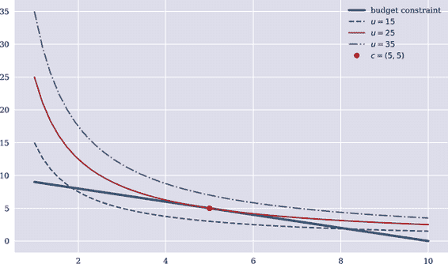
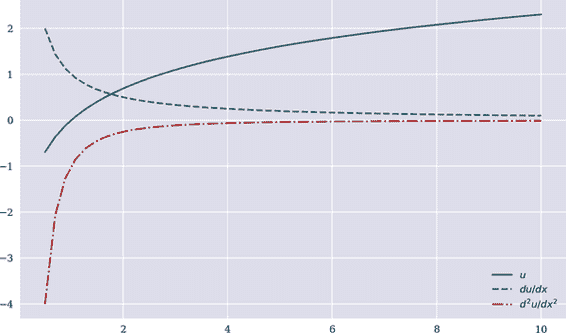

# 第四章 优化与均衡

> 经济理论的大部分基于这样一个前提：在给定两个选择时，一个代理人可以，并且如果能够的话，会选择更喜欢的一个。
> 
> 达雷尔·达菲（1988）
> 
> 投资组合分析始于个别证券的信息，以整体投资组合的结论结束。分析的目的是找到最能满足投资者目标的投资组合。
> 
> 哈里·马尔科维茨（1959）

本章主要讨论代理人及其优化问题的建模。它呈现了微观经济理论（见 Varian（1992））和金融经济学（见 Eichberger 和 Harper（1997））的一些基本构建模块。本章的核心是*预期效用最大化*范式，这是在金融经济学中建模代理人偏好的主要方式。基于这一范式，讨论了两个核心主题。

首先，我们讨论了在给定偏好和初始财富的情况下，一个代理人如何选择最佳投资组合。这种类型的问题通常被称为*最优投资组合选择*。这里提出的方法不依赖于任何形式的简化，例如，不像均值-方差组合（MVP）方法和资本资产定价模型（CAPM）那样，它将选择投资组合的问题简化为金融资产收益分布的一阶和二阶矩以及它们的协方差。

其次，在前两章中，金融资产的价格是事先给定的，而本章从基本原理推导它们，分析了基于所谓*代表性代理人*的优化问题的*金融资产定价*，以及*均衡论证*。粗略地说，代表性代理人可以被视为在（金融）市场中独立行动的（无限）多个代理人的聚合体。这种代表性代理人的存在条件是众所周知的（见 Milne（1995）第六章）——然而，本章并未讨论这些条件，因为一般的金融理论只是假定其存在。

本章主要涵盖了金融、数学和 Python 编程中的以下主题。在 Python 方面，并未引入太多新元素。在离散模型中进行金融的基本数学和 Python 工具集已在前两章中引入和发展：

| 金融 | 数学 | Python |
| --- | --- | --- |
| 偏好和效用 | 效用函数 | `NumPy` |
| 效用最大化 | 目标函数，预算约束，拉格朗日定理 | `scipy.optimize.minimize` |
| 无差异曲线，预算线 | 函数 | `NumPy`, `matplotlib` |
| 对数效用 | 自然对数 | `NumPy`, `matplotlib` |
| 时间加法效用 | 效用函数 | `NumPy`, `scipy.optimize.minimize` |
| （时间加法）期望效用 | 概率测度，拉格朗日定理 | `NumPy`, `scipy.optimize.minimize` |
| 最优投资组合 | 拉格朗日定理，一阶条件 | `NumPy`, `scipy.optimize.minimize` |
| 市场均衡定价，代理人 | 拉格朗日定理，一阶条件 | `NumPy`, `scipy.optimize.minimize`, `SymPy` |
| 不完全市场中的鞅测度 | 概率测度集合 | `SymPy`, `sy.Symbol`, `sy.solve` |
| 通过有条件索赔完成市场 | 拉格朗日定理，一阶条件 | `NumPy`, `scipy.optimize.minimize` |

# 效用最大化

形式上，代理人通过 *效用函数* 进行建模，该函数对代理人面临的一系列选择进行排序，是代理人 *偏好* 的一种表现（参见 Varian (1992) 第七章）。考虑到没有来自第二章的不确定性的静态经济。此外，假设代理人被赋予一些初始财富， <math><mrow><mi>w</mi><mo>∈</mo><msub><mi>ℝ</mi> <mrow><mn>>0</mn></mrow></msub></mrow></math> 。代理人可以决定今天花费这些财富的多少， <math alttext="t equals 0"><mrow><mi>t</mi> <mo>=</mo> <mn>0</mn></mrow></math> ，以及通过银行存款储蓄多少用于未来消费。可以把一个代理人看作是面临如何为退休储蓄的问题。

代理人根据今天的货币效用 <math alttext="c 0"><msub><mi>c</mi> <mn>0</mn></msub></math> 和一年后的效用 <math alttext="c 1"><msub><mi>c</mi> <mn>1</mn></msub></math> 接收效用函数：

<math mode="display"><mrow><mi>U</mi> <mo>:</mo> <msubsup><mi>ℝ</mi> <mrow><mn>≥0</mn></mrow> <mn>2</mn></msubsup> <mo>→</mo> <msub><mi>ℝ</mi> <mrow><mn>≥0</mn></mrow></msub> <mo>,</mo> <mrow><mo>(</mo> <msub><mi>c</mi> <mn>0</mn></msub> <mo>,</mo> <msub><mi>c</mi> <mn>1</mn></msub> <mo>)</mo></mrow> <mo>↦</mo> <mi>u</mi> <mrow><mo>(</mo> <msub><mi>c</mi> <mn>0</mn></msub> <mo>,</mo> <msub><mi>c</mi> <mn>1</mn></msub> <mo>)</mo></mrow></mrow></math>

例如，假设 <math alttext="u left-parenthesis c 0 comma c 1 right-parenthesis equals c 0 dot c 1"><mrow><mi>u</mi> <mrow><mo>(</mo> <msub><mi>c</mi> <mn>0</mn></msub> <mo>,</mo> <msub><mi>c</mi> <mn>1</mn></msub> <mo>)</mo></mrow> <mo>=</mo> <msub><mi>c</mi> <mn>0</mn></msub> <mo>·</mo> <msub><mi>c</mi> <mn>1</mn></msub></mrow></math> —表达了今天和一年后的金钱是替代品的想法，尽管不是完美的替代品（如果其中一个为零，效用也为零）。代理人的受限优化问题形式上为：

<math alttext="StartLayout 1st Row  max Underscript c 0 comma c 1 Endscripts c 0 dot c 1 2nd Row  s period t period c 0 plus c 1 equals w EndLayout" display="block"><mtable><mtr><mtd><mrow><munder><mo movablelimits="true" form="prefix">max</mo> <mrow><msub><mi>c</mi> <mn>0</mn></msub> <mo>,</mo><msub><mi>c</mi> <mn>1</mn></msub></mrow></munder> <msub><mi>c</mi> <mn>0</mn></msub> <mo>·</mo> <msub><mi>c</mi> <mn>1</mn></msub></mrow></mtd></mtr> <mtr><mtd><mrow><mtext>s.t.</mtext> <msub><mi>c</mi> <mn>0</mn></msub> <mo>+</mo> <msub><mi>c</mi> <mn>1</mn></msub> <mo>=</mo> <mi>w</mi></mrow></mtd></mtr></mtable></math>

根据拉格朗日定理（参见 Sundaram (1996) 第五章），受限优化问题可以转化为以下形式的无约束问题：

<math alttext="max Underscript c 0 comma c 1 comma lamda Endscripts f left-parenthesis c 0 comma c 1 comma lamda right-parenthesis equals c 0 dot c 1 minus lamda dot left-parenthesis c 0 plus c 1 minus w right-parenthesis" display="block"><mrow><munder><mo movablelimits="true" form="prefix">max</mo> <mrow><msub><mi>c</mi> <mn>0</mn></msub> <mo>,</mo><msub><mi>c</mi> <mn>1</mn></msub> <mo>,</mo><mi>λ</mi></mrow></munder> <mi>f</mi> <mrow><mo>(</mo> <msub><mi>c</mi> <mn>0</mn></msub> <mo>,</mo> <msub><mi>c</mi> <mn>1</mn></msub> <mo>,</mo> <mi>λ</mi> <mo>)</mo></mrow> <mo>=</mo> <msub><mi>c</mi> <mn>0</mn></msub> <mo>·</mo> <msub><mi>c</mi> <mn>1</mn></msub> <mo>-</mo> <mi>λ</mi> <mo>·</mo> <mrow><mo>(</mo> <msub><mi>c</mi> <mn>0</mn></msub> <mo>+</mo> <msub><mi>c</mi> <mn>1</mn></msub> <mo>-</mo> <mi>w</mi> <mo>)</mo></mrow></mrow></math>

优化的一阶必要条件是：

<math alttext="StartLayout Enlarged left-brace 1st Row 1st Column StartFraction normal partial-differential f Over normal partial-differential c 0 EndFraction 2nd Column equals 3rd Column c 1 minus lamda equals 0 2nd Row 1st Column StartFraction normal partial-differential f Over normal partial-differential c 1 EndFraction 2nd Column equals 3rd Column c 0 minus lamda equals 0 3rd Row 1st Column StartFraction normal partial-differential f Over normal partial-differential lamda EndFraction 2nd Column equals 3rd Column c 0 plus c 1 minus w equals 0 EndLayout" display="block"><mfenced separators="" open="{" close=""><mtable><mtr><mtd columnalign="left"><mfrac><mrow><mi>∂</mi><mi>f</mi></mrow> <mrow><mi>∂</mi><msub><mi>c</mi> <mn>0</mn></msub></mrow></mfrac></mtd> <mtd columnalign="left"><mo>=</mo></mtd> <mtd><mrow><msub><mi>c</mi> <mn>1</mn></msub> <mo>-</mo> <mi>λ</mi> <mo>=</mo> <mn>0</mn></mrow></mtd></mtr> <mtr><mtd columnalign="left"><mfrac><mrow><mi>∂</mi><mi>f</mi></mrow> <mrow><mi>∂</mi><msub><mi>c</mi> <mn>1</mn></msub></mrow></mfrac></mtd> <mtd columnalign="left"><mo>=</mo></mtd> <mtd><mrow><msub><mi>c</mi> <mn>0</mn></msub> <mo>-</mo> <mi>λ</mi> <mo>=</mo> <mn>0</mn></mrow></mtd></mtr> <mtr><mtd columnalign="left"><mfrac><mrow><mi>∂</mi><mi>f</mi></mrow> <mrow><mi>∂</mi><mi>λ</mi></mrow></mfrac></mtd> <mtd columnalign="left"><mo>=</mo></mtd> <mtd><mrow><msub><mi>c</mi> <mn>0</mn></msub> <mo>+</mo> <msub><mi>c</mi> <mn>1</mn></msub> <mo>-</mo> <mi>w</mi> <mo>=</mo> <mn>0</mn></mrow></mtd></mtr></mtable></mfenced></math>

从这些中，可以很容易地推导出 <math alttext="c 0 equals c 1 equals StartFraction w Over 2 EndFraction"><mrow><msub><mi>c</mi> <mn>0</mn></msub> <mo>=</mo> <msub><mi>c</mi> <mn>1</mn></msub> <mo>=</mo> <mfrac><mi>w</mi> <mn>2</mn></mfrac></mrow></math> 作为最佳的消费储蓄计划。

这个优化问题可以在 Python 中进行数值建模和求解，其中应满足 <math alttext="w equals 10"><mrow><mi>w</mi> <mo>=</mo> <mn>10</mn></mrow></math> ：

```py
In [1]: def u(c):
            return -c[0] * c[1]  

In [2]: w = 10  

In [3]: from scipy.optimize import minimize

In [4]: cons = ({'type': 'eq', 'fun': lambda c: c[0] + c[1] - w})  

In [5]: opt = minimize(u, (1, 1), constraints=cons)  

In [6]: opt
Out[6]:      fun: -24.999999999999996
             jac: array([-5., -5.])
         message: 'Optimization terminated successfully'
            nfev: 6
             nit: 2
            njev: 2
          status: 0
         success: True
               x: array([5., 5.])

In [7]: opt['x']  
Out[7]: array([5., 5.])

In [8]: -opt['fun']   
Out[8]: 24.999999999999996
```


具有负号的效用函数，以通过最小化实现最大化。


代理人的初始财富，在今天和未来之间分配。


预算约束作为 `minimize` 函数的等式约束。


具有初始猜测和预算约束的优化。


最优消费储蓄计划。


通过最优计划获得的最大效用。

## 无差异曲线

前一节的最优解可以通过 *无差异曲线* 的方式可视化。无差异曲线由所有这样的组合 <math alttext="c equals left-parenthesis c 0 comma c 1 right-parenthesis"><mrow><mi>c</mi> <mo>=</mo> <mo>(</mo> <msub><mi>c</mi> <mn>0</mn></msub> <mo>,</mo> <msub><mi>c</mi> <mn>1</mn></msub> <mo>)</mo></mrow></math> 组成，它们给出相同的效用 <math alttext="u overbar"><mover accent="true"><mi>u</mi> <mo>¯</mo></mover></math>。在 <math alttext="left-parenthesis c 0 comma c 1 right-parenthesis"><mrow><mo>(</mo> <msub><mi>c</mi> <mn>0</mn></msub> <mo>,</mo> <msub><mi>c</mi> <mn>1</mn></msub> <mo>)</mo></mrow></math> 空间中描述这样一条曲线的方程式是：

<math alttext="StartLayout 1st Row 1st Column u overbar 2nd Column equals 3rd Column c 0 dot c 1 2nd Row 1st Column c 1 2nd Column equals 3rd Column StartFraction u overbar Over c 0 EndFraction EndLayout" display="block"><mtable><mtr><mtd><mover accent="true"><mi>u</mi> <mo>¯</mo></mover></mtd> <mtd><mo>=</mo></mtd> <mtd><mrow><msub><mi>c</mi> <mn>0</mn></msub> <mo>·</mo> <msub><mi>c</mi> <mn>1</mn></msub></mrow></mtd></mtr> <mtr><mtd><mrow><mo>⇔</mo> <msub><mi>c</mi> <mn>1</mn></msub></mrow></mtd> <mtd><mo>=</mo></mtd> <mtd><mfrac><mover accent="true"><mi>u</mi> <mo>¯</mo></mover> <msub><mi>c</mi> <mn>0</mn></msub></mfrac></mtd></mtr></mtable></math>

描述 *预算约束* 的方程式是：

<math alttext="StartLayout 1st Row 1st Column w 2nd Column equals 3rd Column c 0 plus c 1 2nd Row 1st Column c 1 2nd Column equals 3rd Column w minus c 0 EndLayout" display="block"><mtable><mtr><mtd><mi>w</mi></mtd> <mtd><mo>=</mo></mtd> <mtd><mrow><msub><mi>c</mi> <mn>0</mn></msub> <mo>+</mo> <msub><mi>c</mi> <mn>1</mn></msub></mrow></mtd></mtr> <mtr><mtd><mrow><mo>⇔</mo> <msub><mi>c</mi> <mn>1</mn></msub></mrow></mtd> <mtd><mo>=</mo></mtd> <mtd><mrow><mi>w</mi> <mo>-</mo> <msub><mi>c</mi> <mn>0</mn></msub></mrow></mtd></mtr></mtable></math>

在 图 4-1 中可视化了优化问题，其中最优计划由点给出 — 这是 <math alttext="u overbar equals 25"><mrow><mover accent="true"><mi>u</mi> <mo>¯</mo></mover> <mo>=</mo> <mn>25</mn></mrow></math> 的无差异曲线与表示预算约束线相切的地方。

在 Python 中，这被转化为以下代码：

```py
In [9]: def iu(u, c0):
            return u / c0  

In [10]: def c1(c0):
             return w - c0  

In [11]: import numpy as np
         np.set_printoptions(precision=5)

In [12]: from pylab import mpl, plt
         plt.style.use('seaborn')
         mpl.rcParams['savefig.dpi'] = 300
         mpl.rcParams['font.family'] = 'serif'

In [13]: c0 = np.linspace(1, w)  

In [14]: plt.figure(figsize=(10, 6))
         plt.plot(c0, c1(c0), label='budget constraint', lw=3.0)
         plt.plot(c0, iu(15, c0), '--', label='$u=15$')
         plt.plot(c0, iu(25, c0), label='$u=25$')
         plt.plot(c0, iu(35, c0), '-.', label='$u=35$')
         plt.plot(opt['x'][0], opt['x'][1], 'ro', label='$c=(5, 5)$')
         plt.legend(loc=0);
```


无差异曲线函数。


预算线函数。


绘制两者的域。



###### 图 4-1\. 最优化问题

## 适当的效用函数

在金融中，代理人从其在某一特定时间点可用的资金中获得的效用 — 作为可以用该资金购买的任何其他实际资产的替代物 — 通常表示为函数 <math><mrow><mi>u</mi><mo>:</mo><msub><mi>ℝ</mi> <mrow><mn>≥0</mn></mrow></msub> <mo>→</mo><mi>ℝ</mi></mrow></math>，假定满足三个条件：

1.  <math alttext="u left-parenthesis x right-parenthesis"><mrow><mi>u</mi> <mo>(</mo> <mi>x</mi> <mo>)</mo></mrow></math> 具有两次可微性

1.  <math alttext="StartFraction d u Over d x EndFraction greater-than 0"><mrow><mfrac><mrow><mi>d</mi><mi>u</mi></mrow> <mrow><mi>d</mi><mi>x</mi></mrow></mfrac> <mo>></mo> <mn>0</mn></mrow></math>

1.  <math alttext="StartFraction d squared u Over d x squared EndFraction less-than-or-equal-to 0"><mrow><mfrac><mrow><msup><mi>d</mi> <mn>2</mn></msup> <mi>u</mi></mrow> <mrow><mi>d</mi><msup><mi>x</mi> <mn>2</mn></msup></mrow></mfrac> <mo>≤</mo> <mn>0</mn></mrow></math>

第一个条件是其他两个的技术前提条件。第二个条件形式化了更多的金钱——其他条件相等——比更少的金钱更好的想法。假设代理人是不知足的。第三个条件规定，从额外的一单位货币获得的边际效用比之前的边际单位货币的边际效用要小（或在最大值时相同）。因此，该函数被假定为递增的和（准）凹的。

## 对数效用

这一部分介绍了一种非常适合基于效用最大化代理的金融分析的函数类型。这样一个函数——满足上一节的三个条件，并且在金融领域中经常用于模拟代理从金钱（或消费）中获得的效用——就是*自然对数* <math alttext="u left-parenthesis x right-parenthesis equals ln x"><mrow><mi>u</mi> <mo>(</mo> <mi>x</mi> <mo>)</mo> <mo>=</mo> <mo form="prefix">ln</mo> <mi>x</mi></mrow></math> 。对于它，可以得到：

1.  <math alttext="StartFraction d u Over d x EndFraction equals StartFraction 1 Over x EndFraction greater-than 0 for x element-of double-struck upper R Subscript 0 Baseline"><mrow><mfrac><mrow><mi>d</mi><mi>u</mi></mrow> <mrow><mi>d</mi><mi>x</mi></mrow></mfrac> <mo>=</mo> <mfrac><mn>1</mn> <mi>x</mi></mfrac> <mo>></mo> <mn>0</mn> <mtext>for</mtext> <mi>x</mi> <mo>∈</mo> <msub><mi>ℝ</mi> <mrow><mo>></mo><mn>0</mn></mrow></msub></mrow></math>

1.  <math alttext="StartFraction d squared u Over d x squared EndFraction equals minus StartFraction 1 Over x squared EndFraction less-than 0"><mrow><mfrac><mrow><msup><mi>d</mi> <mn>2</mn></msup> <mi>u</mi></mrow> <mrow><mi>d</mi><msup><mi>x</mi> <mn>2</mn></msup></mrow></mfrac> <mo>=</mo> <mo>-</mo> <mfrac><mn>1</mn> <msup><mi>x</mi> <mn>2</mn></msup></mfrac> <mo><</mo> <mn>0</mn></mrow></math> 对于 <math><mrow><mi>x</mi><mo>∈</mo><msub><mi>ℝ</mi> <mrow><mn>>0</mn></mrow></msub></mrow></math>

Python 允许我们可视化这三个相关函数。`NumPy`与向量化计算结合使用。图 4-2 展示了以下代码生成的图形：

```py
In [15]: x = np.linspace(0.5, 10, 50)  

In [16]: x[:5]  
Out[16]: array([0.5    , 0.69388, 0.88776, 1.08163, 1.27551])

In [17]: u = np.log(x)  

In [18]: u1 = 1 / x  

In [19]: u2 = -1 / x ** 2  

In [20]: plt.figure(figsize=(10, 6))  
         plt.plot(x, u, label='$u$')  
         plt.plot(x, u1, '--', label='$du/dx$')  
         plt.plot(x, u2, '-.', label='$d²u/dx²$')  
         plt.legend(loc=0);  
```


创建一个包含从 0.5 到 10 之间的浮点数，并且均匀间隔的`ndarray`对象，以获得 50 个值。


展示了所得到的数字的一部分选择。


计算效用函数的值。


以及其一阶导数……


…对其二阶导数。


创建一个新的绘图画布，并提供大小参数。


绘制效用函数。


绘制一阶导数。


绘制第二导数。


在最佳位置放置图例 (`loc=0`)。



###### 图 4-2\. 自然对数函数及其一阶和二阶导数

## 时间加性效用

使用自然对数作为函数来模拟代理人对于货币的效用，代理人对于消费-储蓄计划 <math alttext="c equals left-parenthesis c 0 comma c 1 right-parenthesis"><mrow><mi>c</mi> <mo>=</mo> <mo>(</mo> <msub><mi>c</mi> <mn>0</mn></msub> <mo>,</mo> <msub><mi>c</mi> <mn>1</mn></msub> <mo>)</mo></mrow></math> 的偏好可以描述为以下形式的时间加性函数：

<math mode="display"><mrow><mi>U</mi> <mo>:</mo> <msubsup><mi>ℝ</mi> <mrow><mn>≥0</mn></mrow> <mn>2</mn></msubsup> <mo>→</mo> <mi>ℝ</mi> <mo>,</mo> <mrow><mo>(</mo> <msub><mi>c</mi> <mn>0</mn></msub> <mo>,</mo> <msub><mi>c</mi> <mn>1</mn></msub> <mo>)</mo></mrow> <mo>↦</mo> <mo form="prefix">ln</mo> <msub><mi>c</mi> <mn>0</mn></msub> <mo>+</mo> <mi>κ</mi> <mo>·</mo> <mo form="prefix">ln</mo> <msub><mi>c</mi> <mn>1</mn></msub></mrow></math>

<math><mrow><mi>κ</mi><mo>∈</mo><msub><mi>ℝ</mi> <mrow><mn>≥0</mn></mrow></msub></mrow></math> 假定取值 <math alttext="0 less-than kappa less-than-or-equal-to 1"><mrow><mn>0</mn> <mo><</mo> <mi>κ</mi> <mo>≤</mo> <mn>1</mn></mrow></math> ，代表代理人的*时间偏好*。它体现了今天的金钱和消费比一年后更受重视的观念。至少在弱意义上，100 美元现在比一年后的 100 美元更受欢迎——无论哪种确切的函数描述了随时间的一致偏好（假设随时间偏好的一致性）。它可以被视为一种非货币折现因子。可以轻松验证该函数满足前述的三个条件——它是二次可微的、增加的和凹的——基于对 <math alttext="c 0"><msub><mi>c</mi> <mn>0</mn></msub></math> 和 <math alttext="c 1"><msub><mi>c</mi> <mn>1</mn></msub></math> 的偏导数。

如果代理人的初始财富为 <math alttext="w"><mi>w</mi></math> ，他们的约束优化问题是：

<math alttext="StartLayout 1st Row  max Underscript c 0 comma c 1 Endscripts ln c 0 plus kappa dot ln c 1 2nd Row  s period t period c 0 plus c 1 equals w EndLayout" display="block"><mtable><mtr><mtd><mrow><munder><mo movablelimits="true" form="prefix">max</mo> <mrow><msub><mi>c</mi> <mn>0</mn></msub> <mo>,</mo><msub><mi>c</mi> <mn>1</mn></msub></mrow></munder> <mo form="prefix">ln</mo> <msub><mi>c</mi> <mn>0</mn></msub> <mo>+</mo> <mi>κ</mi> <mo>·</mo> <mo form="prefix">ln</mo> <msub><mi>c</mi> <mn>1</mn></msub></mrow></mtd></mtr> <mtr><mtd><mrow><mtext>s.t.</mtext> <msub><mi>c</mi> <mn>0</mn></msub> <mo>+</mo> <msub><mi>c</mi> <mn>1</mn></msub> <mo>=</mo> <mi>w</mi></mrow></mtd></mtr></mtable></math>

或

<math alttext="max Underscript c 0 comma c 1 comma lamda Endscripts f left-parenthesis c 0 comma c 1 comma lamda right-parenthesis equals ln c 0 plus kappa dot ln c 1 minus lamda dot left-parenthesis c 0 plus c 1 minus w right-parenthesis" display="block"><mrow><munder><mo movablelimits="true" form="prefix">max</mo> <mrow><msub><mi>c</mi> <mn>0</mn></msub> <mo>,</mo><msub><mi>c</mi> <mn>1</mn></msub> <mo>,</mo><mi>λ</mi></mrow></munder> <mi>f</mi> <mrow><mo>(</mo> <msub><mi>c</mi> <mn>0</mn></msub> <mo>,</mo> <msub><mi>c</mi> <mn>1</mn></msub> <mo>,</mo> <mi>λ</mi> <mo>)</mo></mrow> <mo>=</mo> <mo form="prefix">ln</mo> <msub><mi>c</mi> <mn>0</mn></msub> <mo>+</mo> <mi>κ</mi> <mo>·</mo> <mo form="prefix">ln</mo> <msub><mi>c</mi> <mn>1</mn></msub> <mo>-</mo> <mi>λ</mi> <mo>·</mo> <mrow><mo>(</mo> <msub><mi>c</mi> <mn>0</mn></msub> <mo>+</mo> <msub><mi>c</mi> <mn>1</mn></msub> <mo>-</mo> <mi>w</mi> <mo>)</mo></mrow></mrow></math>

最优性的一阶必要条件是：

<math alttext="StartLayout Enlarged left-brace 1st Row 1st Column StartFraction normal partial-differential f Over normal partial-differential c 0 EndFraction 2nd Column equals 3rd Column StartFraction 1 Over c 0 EndFraction minus lamda equals 0 2nd Row 1st Column StartFraction normal partial-differential f Over normal partial-differential c 1 EndFraction 2nd Column equals 3rd Column kappa dot StartFraction 1 Over c 1 EndFraction minus lamda equals 0 3rd Row 1st Column StartFraction normal partial-differential f Over normal partial-differential lamda EndFraction 2nd Column equals 3rd Column c 0 plus c 1 minus w equals 0 EndLayout" display="block"><mfenced separators="" open="{" close=""><mtable><mtr><mtd columnalign="left"><mfrac><mrow><mi>∂</mi><mi>f</mi></mrow> <mrow><mi>∂</mi><msub><mi>c</mi> <mn>0</mn></msub></mrow></mfrac></mtd> <mtd columnalign="left"><mo>=</mo></mtd> <mtd><mrow><mfrac><mn>1</mn> <msub><mi>c</mi> <mn>0</mn></msub></mfrac> <mo>-</mo> <mi>λ</mi> <mo>=</mo> <mn>0</mn></mrow></mtd></mtr> <mtr><mtd columnalign="left"><mfrac><mrow><mi>∂</mi><mi>f</mi></mrow> <mrow><mi>∂</mi><msub><mi>c</mi> <mn>1</mn></msub></mrow></mfrac></mtd> <mtd columnalign="left"><mo>=</mo></mtd> <mtd><mrow><mi>κ</mi> <mo>·</mo> <mfrac><mn>1</mn> <msub><mi>c</mi> <mn>1</mn></msub></mfrac> <mo>-</mo> <mi>λ</mi> <mo>=</mo> <mn>0</mn></mrow></mtd></mtr> <mtr><mtd columnalign="left"><mfrac><mrow><mi>∂</mi><mi>f</mi></mrow> <mrow><mi>∂</mi><mi>λ</mi></mrow></mfrac></mtd> <mtd columnalign="left"><mo>=</mo></mtd> <mtd><mrow><msub><mi>c</mi> <mn>0</mn></msub> <mo>+</mo> <msub><mi>c</mi> <mn>1</mn></msub> <mo>-</mo> <mi>w</mi> <mo>=</mo> <mn>0</mn></mrow></mtd></mtr></mtable></mfenced></math>

由此可得：

<math alttext="StartLayout 1st Row 1st Column StartFraction 1 Over c 0 EndFraction 2nd Column equals 3rd Column kappa dot StartFraction 1 Over c 1 EndFraction 2nd Row 1st Column c 1 2nd Column equals 3rd Column kappa dot c 0 EndLayout" display="block"><mtable><mtr><mtd><mfrac><mn>1</mn> <msub><mi>c</mi> <mn>0</mn></msub></mfrac></mtd> <mtd><mo>=</mo></mtd> <mtd><mrow><mi>κ</mi> <mo>·</mo> <mfrac><mn>1</mn> <msub><mi>c</mi> <mn>1</mn></msub></mfrac></mrow></mtd></mtr> <mtr><mtd><mrow><mo>⇔</mo> <msub><mi>c</mi> <mn>1</mn></msub></mrow></mtd> <mtd><mo>=</mo></mtd> <mtd><mrow><mi>κ</mi> <mo>·</mo> <msub><mi>c</mi> <mn>0</mn></msub></mrow></mtd></mtr></mtable></math>

现在的最优消费储蓄计划反映了时间偏好，即一年内的消费 <math alttext="c 1"><msub><mi>c</mi> <mn>1</mn></msub></math> 设置为 <math alttext="kappa dot c 0"><mrow><mi>κ</mi> <mo>·</mo> <msub><mi>c</mi> <mn>0</mn></msub></mrow></math> 。还有

<math alttext="StartLayout 1st Row 1st Column c 0 plus kappa dot c 0 2nd Column equals 3rd Column w 2nd Row 1st Column c 0 2nd Column equals 3rd Column StartFraction w Over 1 plus kappa EndFraction EndLayout" display="block"><mtable><mtr><mtd><mrow><msub><mi>c</mi> <mn>0</mn></msub> <mo>+</mo> <mi>κ</mi> <mo>·</mo> <msub><mi>c</mi> <mn>0</mn></msub></mrow></mtd> <mtd><mo>=</mo></mtd> <mtd><mi>w</mi></mtd></mtr> <mtr><mtd><mrow><mo>⇔</mo> <msub><mi>c</mi> <mn>0</mn></msub></mrow></mtd> <mtd><mo>=</mo></mtd> <mtd><mfrac><mi>w</mi> <mrow><mn>1</mn><mo>+</mo><mi>κ</mi></mrow></mfrac></mtd></mtr></mtable></math>

和

<math alttext="StartLayout 1st Row 1st Column StartFraction w Over 1 plus kappa EndFraction plus c 1 2nd Column equals 3rd Column w 2nd Row 1st Column c 1 2nd Column equals 3rd Column StartFraction kappa dot w Over 1 plus kappa EndFraction EndLayout" display="block"><mtable><mtr><mtd><mrow><mfrac><mi>w</mi> <mrow><mn>1</mn><mo>+</mo><mi>κ</mi></mrow></mfrac> <mo>+</mo> <msub><mi>c</mi> <mn>1</mn></msub></mrow></mtd> <mtd><mo>=</mo></mtd> <mtd><mi>w</mi></mtd></mtr> <mtr><mtd><mrow><mo>⇔</mo> <msub><mi>c</mi> <mn>1</mn></msub></mrow></mtd> <mtd><mo>=</mo></mtd> <mtd><mfrac><mrow><mi>κ</mi><mo>·</mo><mi>w</mi></mrow> <mrow><mn>1</mn><mo>+</mo><mi>κ</mi></mrow></mfrac></mtd></mtr></mtable></math>

预算约束是紧绷的：

<math alttext="StartFraction w Over 1 plus kappa EndFraction plus StartFraction kappa dot w Over 1 plus kappa EndFraction equals StartFraction w plus kappa dot w Over 1 plus kappa EndFraction equals w" display="block"><mrow><mfrac><mi>w</mi> <mrow><mn>1</mn><mo>+</mo><mi>κ</mi></mrow></mfrac> <mo>+</mo> <mfrac><mrow><mi>κ</mi><mo>·</mo><mi>w</mi></mrow> <mrow><mn>1</mn><mo>+</mo><mi>κ</mi></mrow></mfrac> <mo>=</mo> <mfrac><mrow><mi>w</mi><mo>+</mo><mi>κ</mi><mo>·</mo><mi>w</mi></mrow> <mrow><mn>1</mn><mo>+</mo><mi>κ</mi></mrow></mfrac> <mo>=</mo> <mi>w</mi></mrow></math>

下面的代码通过数值方法解决了优化问题，其中 <math alttext="w equals 10"><mrow><mi>w</mi> <mo>=</mo> <mn>10</mn></mrow></math> 。最优计划反映了时间偏好：

```py
In [21]: import math

In [22]: from scipy.optimize import minimize

In [23]: kappa = 10 / 11

In [24]: def U(c):
             return -(math.log(c[0]) +  kappa * math.log(c[1]))  

In [25]: w = 10

In [26]: cons = ({'type': 'eq', 'fun': lambda c: c[0] + c[1] - w})  

In [27]: opt = minimize(U, (1, 1), constraints=cons)

In [28]: opt
Out[28]:      fun: -3.0747286083026886
              jac: array([-0.19091, -0.19091])
          message: 'Optimization terminated successfully'
             nfev: 18
              nit: 6
             njev: 6
           status: 0
          success: True
                x: array([5.23811, 4.76189])

In [29]: opt['x']  
Out[29]: array([5.23811, 4.76189])

In [30]: -opt['fun']  
Out[30]: 3.0747286083026886
```


为了通过最小化来实现最大化，效用函数带有负号。


预算约束作为 `minimize` 函数的等式约束。


最优消费储蓄计划反映了时间偏好，其中<math alttext="c 0"><msub><mi>c</mi> <mn>0</mn></msub></math>比<math alttext="c 1"><msub><mi>c</mi> <mn>1</mn></msub></math>高出 10%。


通过最优计划获得的最大效用。¹

# 期望效用

现在考虑静态的两状态经济体*不确定性*。假设一个代理人在一年后只通过在那时可能存在的两种状态中的一种状态中可用的资金来获得效用。这将代表一个*纯投资问题*，其中所有可用的初始财富将被最优地投资于交易的金融资产中。

假设交易*两种金融资产*，一个无风险债券的价格过程

<math alttext="upper B equals left-parenthesis upper B 0 comma left-parenthesis upper B 1 comma upper B 1 right-parenthesis Superscript upper T Baseline right-parenthesis" display="block"><mrow><mi>B</mi> <mo>=</mo> <mfenced separators="" open="(" close=")"><msub><mi>B</mi> <mn>0</mn></msub> <mo>,</mo> <msup><mrow><mo>(</mo><msub><mi>B</mi> <mn>1</mn></msub> <mo>,</mo><msub><mi>B</mi> <mn>1</mn></msub> <mo>)</mo></mrow> <mi>T</mi></msup></mfenced></mrow></math>

以及风险股票的价格过程

<math alttext="upper S equals left-parenthesis upper S 0 comma left-parenthesis upper S 1 Superscript u Baseline comma upper S 1 Superscript d Baseline right-parenthesis Superscript upper T Baseline right-parenthesis" display="block"><mrow><mi>S</mi> <mo>=</mo> <mfenced separators="" open="(" close=")"><msub><mi>S</mi> <mn>0</mn></msub> <mo>,</mo> <msup><mrow><mo>(</mo><msubsup><mi>S</mi> <mn>1</mn> <mi>u</mi></msubsup> <mo>,</mo><msubsup><mi>S</mi> <mn>1</mn> <mi>d</mi></msubsup> <mo>)</mo></mrow> <mi>T</mi></msup></mfenced></mrow></math>

金融资产是将今天的初始财富转移到将来某一时间点的手段。代理人的主要决策问题是决定在未来任一状态中消费什么。

面临不确定性的代理人的投资问题模型由要最大化的代理人的*期望效用*给出，给定<math alttext="w"><mi>w</mi></math>。*期望效用函数*如下：

<math mode="display"><mrow><mi>U</mi> <mo>:</mo> <msubsup><mi>ℝ</mi> <mrow><mn>≥0</mn></mrow> <mn>2</mn></msubsup> <mo>→</mo> <mi>ℝ</mi> <mo>,</mo> <msub><mi>c</mi> <mn>1</mn></msub> <mo>↦</mo> <msup><mi>𝐄</mi> <mi>P</mi></msup> <mrow><mo>(</mo> <mi>u</mi> <mrow><mo>(</mo> <msub><mi>c</mi> <mn>1</mn></msub> <mo>)</mo></mrow> <mo>)</mo></mrow></mrow></math>

用*价格向量*<math alttext="script upper M 0 equals left-parenthesis upper B 0 comma upper S 0 right-parenthesis Superscript upper T"><mrow><msub><mi>ℳ</mi> <mn>0</mn></msub> <mo>=</mo> <msup><mrow><mo>(</mo><msub><mi>B</mi> <mn>0</mn></msub> <mo>,</mo><msub><mi>S</mi> <mn>0</mn></msub> <mo>)</mo></mrow> <mi>T</mi></msup></mrow></math> ，代理人可以根据以下方式分配其初始财富：

<math alttext="script upper M 0 dot phi equals w left right double arrow upper B 0 dot b plus upper S 0 dot s equals w" display="block"><mrow><msub><mi>ℳ</mi> <mn>0</mn></msub> <mo>·</mo> <mi>ϕ</mi> <mo>=</mo> <mi>w</mi> <mo>⇔</mo> <msub><mi>B</mi> <mn>0</mn></msub> <mo>·</mo> <mi>b</mi> <mo>+</mo> <msub><mi>S</mi> <mn>0</mn></msub> <mo>·</mo> <mi>s</mi> <mo>=</mo> <mi>w</mi></mrow></math>

其中<math><mrow><mi>ϕ</mi><mo>=</mo><msup><mrow><mo>(</mo><mi>b</mi><mo>,</mo><mi>s</mi><mo>)</mo></mrow> <mi>T</mi></msup> <mo>∈</mo><msubsup><mi>ℝ</mi> <mrow><mn>≥0</mn></mrow> <mn>2</mn></msubsup></mrow></math>表示代理人组成的包括无风险债券和风险股票在内的*投资组合*。由于代理人贪得无厌，这*预算约束*将始终是有效的。不允许进行空头交易。

*市场回报矩阵*如下：

<math alttext="script upper M equals Start 2 By 2 Matrix 1st Row 1st Column upper B 1 2nd Column upper S 1 Superscript u Baseline 2nd Row 1st Column upper B 1 2nd Column upper S 1 Superscript d EndMatrix" display="block"><mrow><mi>ℳ</mi> <mo>=</mo> <mfenced open="(" close=")"><mtable><mtr><mtd><msub><mi>B</mi> <mn>1</mn></msub></mtd> <mtd><msubsup><mi>S</mi> <mn>1</mn> <mi>u</mi></msubsup></mtd></mtr> <mtr><mtd><msub><mi>B</mi> <mn>1</mn></msub></mtd> <mtd><msubsup><mi>S</mi> <mn>1</mn> <mi>d</mi></msubsup></mtd></mtr></mtable></mfenced></mrow></math>

代理人在今后一年中在任何状态下都有多少资金可用？这由代理人选择组成的投资组合决定：

<math alttext="c 1 equals script upper M dot phi equals StartBinomialOrMatrix upper B 1 Choose upper B 1 EndBinomialOrMatrix dot b plus StartBinomialOrMatrix upper S 1 Superscript u Baseline Choose upper S 1 Superscript d Baseline EndBinomialOrMatrix dot s" display="block"><mrow><msub><mi>c</mi> <mn>1</mn></msub> <mo>=</mo> <mi>ℳ</mi> <mo>·</mo> <mi>ϕ</mi> <mo>=</mo> <mfenced open="(" close=")"><mtable><mtr><mtd><msub><mi>B</mi> <mn>1</mn></msub></mtd></mtr> <mtr><mtd><msub><mi>B</mi> <mn>1</mn></msub></mtd></mtr></mtable></mfenced> <mo>·</mo> <mi>b</mi> <mo>+</mo> <mfenced open="(" close=")"><mtable><mtr><mtd><msubsup><mi>S</mi> <mn>1</mn> <mi>u</mi></msubsup></mtd></mtr> <mtr><mtd><msubsup><mi>S</mi> <mn>1</mn> <mi>d</mi></msubsup></mtd></mtr></mtable></mfenced> <mo>·</mo> <mi>s</mi></mrow></math>

这导致

<math alttext="c 1 equals StartBinomialOrMatrix b dot upper B 1 plus s dot upper S 1 Superscript u Baseline Choose b dot upper B 1 plus s dot upper S 1 Superscript d EndBinomialOrMatrix" display="block"><mrow><msub><mi>c</mi> <mn>1</mn></msub> <mo>=</mo> <mfenced open="(" close=")"><mtable><mtr><mtd><mrow><mi>b</mi> <mo>·</mo> <msub><mi>B</mi> <mn>1</mn></msub> <mo>+</mo> <mi>s</mi> <mo>·</mo> <msubsup><mi>S</mi> <mn>1</mn> <mi>u</mi></msubsup></mrow></mtd></mtr> <mtr><mtd><mrow><mi>b</mi> <mo>·</mo> <msub><mi>B</mi> <mn>1</mn></msub> <mo>+</mo> <mi>s</mi> <mo>·</mo> <msubsup><mi>S</mi> <mn>1</mn> <mi>d</mi></msubsup></mrow></mtd></mtr></mtable></mfenced></mrow></math>

或

<math alttext="StartLayout Enlarged left-brace 1st Row 1st Column c 1 Superscript u 2nd Column equals 3rd Column b dot upper B 1 plus s dot upper S 1 Superscript u 2nd Row 1st Column c 1 Superscript d 2nd Column equals 3rd Column b dot upper B 1 plus s dot upper S 1 Superscript d EndLayout" display="block"><mfenced separators="" open="{" close=""><mtable><mtr><mtd columnalign="left"><msubsup><mi>c</mi> <mn>1</mn> <mi>u</mi></msubsup></mtd> <mtd columnalign="left"><mo>=</mo></mtd> <mtd><mrow><mi>b</mi> <mo>·</mo> <msub><mi>B</mi> <mn>1</mn></msub> <mo>+</mo> <mi>s</mi> <mo>·</mo> <msubsup><mi>S</mi> <mn>1</mn> <mi>u</mi></msubsup></mrow></mtd></mtr> <mtr><mtd columnalign="left"><msubsup><mi>c</mi> <mn>1</mn> <mi>d</mi></msubsup></mtd> <mtd columnalign="left"><mo>=</mo></mtd> <mtd><mrow><mi>b</mi> <mo>·</mo> <msub><mi>B</mi> <mn>1</mn></msub> <mo>+</mo> <mi>s</mi> <mo>·</mo> <msubsup><mi>S</mi> <mn>1</mn> <mi>d</mi></msubsup></mrow></mtd></mtr></mtable></mfenced></math>

代理人的完整决策问题—关于*最优投资组合选择*—可以表示为以下*受约束优化问题*：

<math alttext="StartLayout 1st Row 1st Column Blank 2nd Column max Underscript c 1 Endscripts 3rd Column bold upper E Superscript upper P Baseline left-parenthesis u left-parenthesis c 1 right-parenthesis right-parenthesis 2nd Row 1st Column left-parenthesis i right-parenthesis w 2nd Column equals 3rd Column script upper M 0 dot phi 3rd Row 1st Column left-parenthesis ii right-parenthesis c 1 2nd Column equals 3rd Column script upper M dot phi EndLayout" display="block"><mtable><mtr><mtd><munder><mo movablelimits="true" form="prefix">max</mo> <msub><mi>c</mi> <mn>1</mn></msub></munder></mtd> <mtd><mrow><msup><mi>𝐄</mi> <mi>P</mi></msup> <mrow><mo>(</mo> <mi>u</mi> <mrow><mo>(</mo> <msub><mi>c</mi> <mn>1</mn></msub> <mo>)</mo></mrow> <mo>)</mo></mrow></mrow></mtd></mtr> <mtr><mtd><mrow><mtext>(i)</mtext> <mi>w</mi></mrow></mtd> <mtd><mo>=</mo></mtd> <mtd><mrow><msub><mi>ℳ</mi> <mn>0</mn></msub> <mo>·</mo> <mi>ϕ</mi></mrow></mtd></mtr> <mtr><mtd><mrow><mtext>(ii)</mtext> <msub><mi>c</mi> <mn>1</mn></msub></mrow></mtd> <mtd><mo>=</mo></mtd> <mtd><mrow><mi>ℳ</mi> <mo>·</mo> <mi>ϕ</mi></mrow></mtd></mtr></mtable></math>

或在替代<math alttext="c 1"><msub><mi>c</mi> <mn>1</mn></msub></math>之后

<math alttext="StartLayout 1st Row 1st Column Blank 2nd Column max Underscript phi Endscripts 3rd Column bold upper E Superscript upper P Baseline left-parenthesis u left-parenthesis script upper M dot phi right-parenthesis right-parenthesis 2nd Row 1st Column w 2nd Column equals 3rd Column script upper M 0 dot phi EndLayout" display="block"><mtable><mtr><mtd><munder><mo movablelimits="true" form="prefix">max</mo> <mi>ϕ</mi></munder></mtd> <mtd><mrow><msup><mi>𝐄</mi> <mi>P</mi></msup> <mrow><mo>(</mo> <mi>u</mi> <mrow><mo>(</mo> <mi>ℳ</mi> <mo>·</mo> <mi>ϕ</mi> <mo>)</mo></mrow> <mo>)</mo></mrow></mrow></mtd></mtr> <mtr><mtd><mi>w</mi></mtd> <mtd><mo>=</mo></mtd> <mtd><mrow><msub><mi>ℳ</mi> <mn>0</mn></msub> <mo>·</mo> <mi>ϕ</mi></mrow></mtd></mtr></mtable></math>

根据拉格朗日定理，可以将这个问题转化为以下形式的*无约束优化问题*

<math alttext="max Underscript b comma s comma lamda Endscripts f left-parenthesis b comma s comma lamda right-parenthesis equals bold upper E Superscript upper P Baseline left-parenthesis u left-parenthesis b dot upper B 1 plus s dot upper S 1 right-parenthesis right-parenthesis minus lamda dot left-parenthesis b dot upper B 0 plus s dot upper S 0 minus w right-parenthesis" display="block"><mrow><munder><mo movablelimits="true" form="prefix">max</mo> <mrow><mi>b</mi><mo>,</mo><mi>s</mi><mo>,</mo><mi>λ</mi></mrow></munder> <mi>f</mi> <mrow><mo>(</mo> <mi>b</mi> <mo>,</mo> <mi>s</mi> <mo>,</mo> <mi>λ</mi> <mo>)</mo></mrow> <mo>=</mo> <msup><mi>𝐄</mi> <mi>P</mi></msup> <mfenced separators="" open="(" close=")"><mi>u</mi> <mo>(</mo> <mi>b</mi> <mo>·</mo> <msub><mi>B</mi> <mn>1</mn></msub> <mo>+</mo> <mi>s</mi> <mo>·</mo> <msub><mi>S</mi> <mn>1</mn></msub> <mo>)</mo></mfenced> <mo>-</mo> <mi>λ</mi> <mo>·</mo> <mrow><mo>(</mo> <mi>b</mi> <mo>·</mo> <msub><mi>B</mi> <mn>0</mn></msub> <mo>+</mo> <mi>s</mi> <mo>·</mo> <msub><mi>S</mi> <mn>0</mn></msub> <mo>-</mo> <mi>w</mi> <mo>)</mo></mrow></mrow></math>

其中代理人选择 <math alttext="b"><mi>b</mi></math> 和 <math alttext="s"><mi>s</mi></math> 在给定预算约束下最大化预期效用。

# 预期效用理论

几十年来，预期效用理论（EUT）在金融决策中仍然是主导的范式。 其主要假设之一——代理人完全了解可能的未来状态及其概率——在现实中几乎从未得到满足。 然而，对许多人来说，EUT 在理论上很有吸引力，并导致“好”的结果，这些结果通常易于理解和解释。 关于金融中这一核心范式问题的更多信息，请参见 Hilpisch（2020 年，第三章和第四章）。

## 最优投资组合

预期效用最大化代理人的最优解看起来是什么样的？ 一般来说，可以根据必要和充分的一阶条件给出答案：

<math alttext="StartLayout Enlarged left-brace 1st Row 1st Column StartFraction normal partial-differential f Over normal partial-differential b EndFraction 2nd Column equals 3rd Column 0 2nd Row 1st Column StartFraction normal partial-differential f Over normal partial-differential s EndFraction 2nd Column equals 3rd Column 0 3rd Row 1st Column StartFraction normal partial-differential f Over normal partial-differential lamda EndFraction 2nd Column equals 3rd Column 0 EndLayout" display="block"><mfenced separators="" open="{" close=""><mtable><mtr><mtd columnalign="left"><mfrac><mrow><mi>∂</mi><mi>f</mi></mrow> <mrow><mi>∂</mi><mi>b</mi></mrow></mfrac></mtd> <mtd columnalign="left"><mo>=</mo></mtd> <mtd><mn>0</mn></mtd></mtr> <mtr><mtd columnalign="left"><mfrac><mrow><mi>∂</mi><mi>f</mi></mrow> <mrow><mi>∂</mi><mi>s</mi></mrow></mfrac></mtd> <mtd columnalign="left"><mo>=</mo></mtd> <mtd><mn>0</mn></mtd></mtr> <mtr><mtd columnalign="left"><mfrac><mrow><mi>∂</mi><mi>f</mi></mrow> <mrow><mi>∂</mi><mi>λ</mi></mrow></mfrac></mtd> <mtd columnalign="left"><mo>=</mo></mtd> <mtd><mn>0</mn></mtd></mtr></mtable></mfenced></math>

或者

<math alttext="StartLayout 1st Row 1st Column StartFraction normal partial-differential f Over normal partial-differential b EndFraction 2nd Column equals 3rd Column p dot upper B 1 dot u prime left-parenthesis b dot upper B 1 plus s dot upper S 1 Superscript u Baseline right-parenthesis 2nd Row 1st Column Blank 2nd Column plus 3rd Column left-parenthesis 1 minus p right-parenthesis dot upper B 1 dot u prime left-parenthesis b dot upper B 1 plus s dot upper S 1 Superscript d Baseline right-parenthesis minus lamda dot upper B 0 equals 0 EndLayout" display="block"><mtable><mtr><mtd><mfrac><mrow><mi>∂</mi><mi>f</mi></mrow> <mrow><mi>∂</mi><mi>b</mi></mrow></mfrac></mtd> <mtd><mo>=</mo></mtd> <mtd><mrow><mi>p</mi> <mo>·</mo> <msub><mi>B</mi> <mn>1</mn></msub> <mo>·</mo> <msup><mi>u</mi> <mo>'</mo></msup> <mfenced separators="" open="(" close=")"><mi>b</mi> <mo>·</mo> <msub><mi>B</mi> <mn>1</mn></msub> <mo>+</mo> <mi>s</mi> <mo>·</mo> <msubsup><mi>S</mi> <mn>1</mn> <mi>u</mi></msubsup></mfenced></mrow></mtd></mtr> <mtr><mtd><mo>+</mo></mtd> <mtd><mrow><mrow><mo>(</mo> <mn>1</mn> <mo>-</mo> <mi>p</mi> <mo>)</mo></mrow> <mo>·</mo> <msub><mi>B</mi> <mn>1</mn></msub> <mo>·</mo> <msup><mi>u</mi> <mo>'</mo></msup> <mfenced separators="" open="(" close=")"><mi>b</mi> <mo>·</mo> <msub><mi>B</mi> <mn>1</mn></msub> <mo>+</mo> <mi>s</mi> <mo>·</mo> <msubsup><mi>S</mi> <mn>1</mn> <mi>d</mi></msubsup></mfenced> <mo>-</mo> <mi>λ</mi> <mo>·</mo> <msub><mi>B</mi> <mn>0</mn></msub> <mo>=</mo> <mn>0</mn></mrow></mtd></mtr></mtable></math>

和

<math alttext="StartLayout 1st Row 1st Column StartFraction normal partial-differential f Over normal partial-differential s EndFraction 2nd Column equals 3rd Column p dot upper S 1 Superscript u Baseline dot u prime left-parenthesis b dot upper B 1 plus s dot upper S 1 Superscript u Baseline right-parenthesis 2nd Row 1st Column Blank 2nd Column plus 3rd Column left-parenthesis 1 minus p right-parenthesis dot upper S 1 Superscript d Baseline dot u prime left-parenthesis b dot upper B 1 plus s dot upper S 1 Superscript d Baseline right-parenthesis minus lamda dot upper S 0 equals 0 EndLayout" display="block"><mtable><mtr><mtd><mfrac><mrow><mi>∂</mi><mi>f</mi></mrow> <mrow><mi>∂</mi><mi>s</mi></mrow></mfrac></mtd> <mtd><mo>=</mo></mtd> <mtd><mrow><mi>p</mi> <mo>·</mo> <msubsup><mi>S</mi> <mn>1</mn> <mi>u</mi></msubsup> <mo>·</mo> <msup><mi>u</mi> <mo>'</mo></msup> <mfenced separators="" open="(" close=")"><mi>b</mi> <mo>·</mo> <msub><mi>B</mi> <mn>1</mn></msub> <mo>+</mo> <mi>s</mi> <mo>·</mo> <msubsup><mi>S</mi> <mn>1</mn> <mi>u</mi></msubsup></mfenced></mrow></mtd></mtr> <mtr><mtd><mo>+</mo></mtd> <mtd><mrow><mrow><mo>(</mo> <mn>1</mn> <mo>-</mo> <mi>p</mi> <mo>)</mo></mrow> <mo>·</mo> <msubsup><mi>S</mi> <mn>1</mn> <mi>d</mi></msubsup> <mo>·</mo> <msup><mi>u</mi> <mo>'</mo></msup> <mfenced separators="" open="(" close=")"><mi>b</mi> <mo>·</mo> <msub><mi>B</mi> <mn>1</mn></msub> <mo>+</mo> <mi>s</mi> <mo>·</mo> <msubsup><mi>S</mi> <mn>1</mn> <mi>d</mi></msubsup></mfenced> <mo>-</mo> <mi>λ</mi> <mo>·</mo> <msub><mi>S</mi> <mn>0</mn></msub> <mo>=</mo> <mn>0</mn></mrow></mtd></mtr></mtable></math>

使用通常的表示法 <math alttext="u prime left-parenthesis x right-parenthesis identical-to StartFraction d u Over d x EndFraction"><mrow><msup><mi>u</mi> <mo>'</mo></msup> <mrow><mo>(</mo> <mi>x</mi> <mo>)</mo></mrow> <mo>≡</mo> <mfrac><mrow><mi>d</mi><mi>u</mi></mrow> <mrow><mi>d</mi><mi>x</mi></mrow></mfrac></mrow></math> 以及

<math alttext="b dot upper B 0 plus s dot upper S 0 equals w" display="block"><mrow><mi>b</mi> <mo>·</mo> <msub><mi>B</mi> <mn>0</mn></msub> <mo>+</mo> <mi>s</mi> <mo>·</mo> <msub><mi>S</mi> <mn>0</mn></msub> <mo>=</mo> <mi>w</mi></mrow></math>

假设对数效用和两种交易金融资产的价格过程 <math alttext="upper B equals left-parenthesis 10 comma 11 right-parenthesis"><mrow><mi>B</mi> <mo>=</mo> <mo>(</mo> <mn>10</mn> <mo>,</mo> <mn>11</mn> <mo>)</mo></mrow></math> 和 <math alttext="upper S equals left-parenthesis 10 comma left-parenthesis 20 comma 5 right-parenthesis Superscript upper T Baseline right-parenthesis"><mrow><mi>S</mi> <mo>=</mo> <mfenced separators="" open="(" close=")"><mn>10</mn> <mo>,</mo> <msup><mrow><mo>(</mo><mn>20</mn><mo>,</mo><mn>5</mn><mo>)</mo></mrow> <mi>T</mi></msup></mfenced></mrow></math> ，分别。 对于 <math alttext="w equals 10"><mrow><mi>w</mi> <mo>=</mo> <mn>10</mn></mrow></math> ，它保持 <math alttext="b plus s equals 1"><mrow><mi>b</mi> <mo>+</mo> <mi>s</mi> <mo>=</mo> <mn>1</mn></mrow></math> 使得投资组合头寸表示百分比值。

在 Python 中，`scipy.optimize` 子包中的 `minimize` 函数也适用于解决代理人的投资问题：

```py
In [31]: B = (10, (11, 11))  

In [32]: S = (10, (20, 5))  

In [33]: M0 = np.array((B[0], S[0]))  

In [34]: M = np.array((B[1], S[1])).T  

In [35]: p = 0.5  

In [36]: P = np.array((p, 1-p))  

In [37]: def U(phi):
             c1 = np.dot(M, phi)  
             return -np.dot(P, np.log(c1))  

In [38]: -U((1, 0))  
Out[38]: 2.3978952727983707

In [39]: -U((0, 1))  
Out[39]: 2.3025850929940455

In [40]: -U((0.5, 0.5))  
Out[40]: 2.410140782802518

In [41]: w = 10

In [42]: cons = ({'type': 'eq',
                  'fun': lambda phi: np.dot(M0, phi) - w})  

In [43]: opt = minimize(U, (1, 1), constraints=cons)  

In [44]: opt
Out[44]:      fun: -2.4183062699261972
              jac: array([-1.     , -0.99999])
          message: 'Optimization terminated successfully'
             nfev: 15
              nit: 5
             njev: 5
           status: 0
          success: True
                x: array([0.69442, 0.30558])

In [45]: opt['x']  
Out[45]: array([0.69442, 0.30558])

In [46]: -opt['fun']  
Out[46]: 2.4183062699261972

In [47]: -U(opt['x'])  
Out[47]: 2.4183062699261972

In [48]: np.dot(M, opt['x'])  
Out[48]: array([13.75022,  9.16652])
```


债券价格过程和...


…股价过程。


两种交易金融资产的价格向量。


两种交易金融资产的市场收益矩阵。


经济的物理概率测度。


具有对数效用的期望效用函数。


一些总投资组合权重为 1 的示例值——分散投资是值得的。


基于价格和投资组合向量的预算约束。


将期望效用最大化问题视为最小化。


债券和股票之间的最优配置。


最优期望效用值。


来自最优投资组合的状态相关支付。

## 时间加法期望效用

可以将代理人的决策问题制定为包含当天货币效用的问题：

<math alttext="upper U colon upper R Subscript 0 Baseline times double-struck upper R Subscript 0 Baseline right-arrow double-struck upper R comma left-parenthesis c 0 comma c 1 right-parenthesis right-arrow from bar u left-parenthesis c 0 right-parenthesis plus kappa dot bold upper E Superscript upper P Baseline left-parenthesis u left-parenthesis c 1 right-parenthesis right-parenthesis" display="block"><mrow><mi>U</mi> <mo>:</mo> <msub><mi>R</mi> <mrow><mo>≥0</mo></mrow></msub> <mo>×</mo> <msub><mi>ℝ</mi> <mrow><mo>≥0</mo></mrow></msub> <mo>→</mo> <mi>ℝ</mi> <mo>,</mo> <mrow><mo>(</mo> <msub><mi>c</mi> <mn>0</mn></msub> <mo>,</mo> <msub><mi>c</mi> <mn>1</mn></msub> <mo>)</mo></mrow> <mo>↦</mo> <mi>u</mi> <mrow><mo>(</mo> <msub><mi>c</mi> <mn>0</mn></msub> <mo>)</mo></mrow> <mo>+</mo> <mi>κ</mi> <mo>·</mo> <msup><mi>𝐄</mi> <mi>P</mi></msup> <mrow><mo>(</mo> <mi>u</mi> <mrow><mo>(</mo> <msub><mi>c</mi> <mn>1</mn></msub> <mo>)</mo></mrow> <mo>)</mo></mrow></mrow></math><math mode="display"><mrow><mi>U</mi> <mo>:</mo> <msub><mi>R</mi> <mrow><mn>≥0</mn></mrow></msub> <mo>×</mo> <msub><mi>ℝ</mi> <mrow><mn>≥0</mn></mrow></msub> <mo>→</mo> <mi>ℝ</mi> <mo>,</mo> <mrow><mo>(</mo> <msub><mi>c</mi> <mn>0</mn></msub> <mo>,</mo> <msub><mi>c</mi> <mn>1</mn></msub> <mo>)</mo></mrow> <mo>↦</mo> <mi>u</mi> <mrow><mo>(</mo> <msub><mi>c</mi> <mn>0</mn></msub> <mo>)</mo></mrow> <mo>+</mo> <mi>κ</mi> <mo>·</mo> <msup><mi>𝐄</mi> <mi>P</mi></msup> <mrow><mo>(</mo> <mi>u</mi> <mrow><mo>(</mo> <msub><mi>c</mi> <mn>1</mn></msub> <mo>)</mo></mrow> <mo>)</mo></mrow></mrow></math>

初始财富<math alttext="w"><mi>w</mi></math>，无约束形式的优化问题如下：

<math alttext="StartLayout 1st Row 1st Column max Underscript c 0 comma b comma s comma lamda Endscripts f left-parenthesis c 0 comma b comma s comma lamda right-parenthesis 2nd Column equals 3rd Column u left-parenthesis c 0 right-parenthesis plus kappa dot bold upper E Superscript upper P Baseline left-parenthesis u left-parenthesis b dot upper B 1 plus s dot upper S 1 right-parenthesis right-parenthesis 2nd Row 1st Column Blank 2nd Column minus 3rd Column lamda dot left-parenthesis c 0 plus b dot upper B 0 plus s dot upper S 0 minus w right-parenthesis EndLayout" display="block"><mtable><mtr><mtd><mrow><munder><mo movablelimits="true" form="prefix">max</mo> <mrow><msub><mi>c</mi> <mn>0</mn></msub> <mo>,</mo><mi>b</mi><mo>,</mo><mi>s</mi><mo>,</mo><mi>λ</mi></mrow></munder> <mi>f</mi> <mrow><mo>(</mo> <msub><mi>c</mi> <mn>0</mn></msub> <mo>,</mo> <mi>b</mi> <mo>,</mo> <mi>s</mi> <mo>,</mo> <mi>λ</mi> <mo>)</mo></mrow></mrow></mtd> <mtd><mo>=</mo></mtd> <mtd><mrow><mi>u</mi> <mrow><mo>(</mo> <msub><mi>c</mi> <mn>0</mn></msub> <mo>)</mo></mrow> <mo>+</mo> <mi>κ</mi> <mo>·</mo> <msup><mi>𝐄</mi> <mi>P</mi></msup> <mfenced separators="" open="(" close=")"><mi>u</mi> <mo>(</mo> <mi>b</mi> <mo>·</mo> <msub><mi>B</mi> <mn>1</mn></msub> <mo>+</mo> <mi>s</mi> <mo>·</mo> <msub><mi>S</mi> <mn>1</mn></msub> <mo>)</mo></mfenced></mrow></mtd></mtr> <mtr><mtd><mo>-</mo></mtd> <mtd><mrow><mi>λ</mi> <mo>·</mo> <mo>(</mo> <msub><mi>c</mi> <mn>0</mn></msub> <mo>+</mo> <mi>b</mi> <mo>·</mo> <msub><mi>B</mi> <mn>0</mn></msub> <mo>+</mo> <mi>s</mi> <mo>·</mo> <msub><mi>S</mi> <mn>0</mn></msub> <mo>-</mo> <mi>w</mi> <mo>)</mo></mrow></mtd></mtr></mtable></math>

根据前述假设，使用 Python 可以得出最优解如下代码：

```py
In [49]: M0 = np.array((1, B[0], S[0]))  

In [50]: kappa = 10 / 11  

In [51]: def U(phi):
             c0 = phi[0]  
             c1 = np.dot(M, phi[1:])  
             return -(np.log(c0) + kappa * np.dot(P, np.log(c1)))  

In [52]: opt = minimize(U, (1, 1, 1), constraints=cons)

In [53]: opt
Out[53]:      fun: -3.1799295980286093
              jac: array([-0.19088, -1.90932, -1.90974])
          message: 'Optimization terminated successfully'
             nfev: 32
              nit: 8
             njev: 8
           status: 0
          success: True
                x: array([5.23899, 0.33087, 0.14523])

In [54]: -opt['fun']
Out[54]: 3.1799295980286093

In [55]: opt['x'][0]  
Out[55]: 5.23898714830318

In [56]: np.dot(M, opt['x'][1:])  
Out[56]: array([6.54422, 4.36571])
```


包括今天消费价格为 1 的价格向量。


时间偏好因子。


考虑到今天消费和时间偏好的预期效用函数。


这是代理从<math alttext="w"><mi>w</mi></math>消费的今天。


这是债券和股票头寸的状态相关支付。

# 完全市场定价

在这一节中，分析基于优化原则转变为定价设置。假设两个 Arrow-Debreu 证券在经济中交易，有两个未来状态，两者的*净供应*都为一。两个支付向量形成<math alttext="double-struck upper R squared"><msup><mi>ℝ</mi> <mn>2</mn></msup></math>的*标准基*，市场支付矩阵为：

<math alttext="script upper M equals Start 2 By 2 Matrix 1st Row 1st Column 1 2nd Column 0 2nd Row 1st Column 0 2nd Column 1 EndMatrix" display="block"><mrow><mi>ℳ</mi> <mo>=</mo> <mfenced open="(" close=")"><mtable><mtr><mtd><mn>1</mn></mtd> <mtd><mn>0</mn></mtd></mtr> <mtr><mtd><mn>0</mn></mtd> <mtd><mn>1</mn></mtd></mtr></mtable></mfenced></mrow></math>

现在假设经济中存在一个*代表性代理*，这个代理是唯一交易这两种证券的人。在*均衡*中，代表性代理需要持有两种证券的净供应量，因为没有其他人。确保均衡的机制是今天两种证券的价格，即价格向量：

<math mode="display"><mrow><msub><mi>ℳ</mi> <mn>0</mn></msub> <mo>=</mo> <msup><mrow><mo>(</mo><msup><mi>γ</mi> <mi>u</mi></msup> <mo>,</mo><msup><mi>γ</mi> <mi>d</mi></msup> <mo>)</mo></mrow> <mi>T</mi></msup> <mo>∈</mo> <msubsup><mi>ℝ</mi> <mrow><mn>≥0</mn></mrow> <mn>2</mn></msubsup></mrow></math>

平衡定价的理念是，这个价格向量需要调整，以便代表性代理持有所有可用金融资产的净供应量。因为否则就不会有均衡。

通过投资组合<math alttext="phi equals left-parenthesis phi Superscript u Baseline comma phi Superscript d Baseline right-parenthesis Superscript upper T"><mrow><mi>ϕ</mi> <mo>=</mo> <msup><mfenced separators="" open="(" close=")"><msup><mi>ϕ</mi> <mi>u</mi></msup> <mo>,</mo><msup><mi>ϕ</mi> <mi>d</mi></msup></mfenced> <mi>T</mi></msup></mrow></math>，最大化预期效用的代表性代理问题是

<math alttext="StartLayout 1st Row  max Underscript phi Endscripts bold upper E Superscript upper P Baseline left-parenthesis u left-parenthesis script upper M dot phi right-parenthesis right-parenthesis 2nd Row  s period t period script upper M 0 dot phi equals w EndLayout" display="block"><mtable><mtr><mtd><mrow><munder><mo movablelimits="true" form="prefix">max</mo> <mi>ϕ</mi></munder> <msup><mi>𝐄</mi> <mi>P</mi></msup> <mrow><mo>(</mo> <mi>u</mi> <mrow><mo>(</mo> <mi>ℳ</mi> <mo>·</mo> <mi>ϕ</mi> <mo>)</mo></mrow> <mo>)</mo></mrow></mrow></mtd></mtr> <mtr><mtd><mrow><mtext>s.t.</mtext> <msub><mi>ℳ</mi> <mn>0</mn></msub> <mo>·</mo> <mi>ϕ</mi> <mo>=</mo> <mi>w</mi></mrow></mtd></mtr></mtable></math>

或

<math alttext="max Underscript phi comma lamda Endscripts bold upper E Superscript upper P Baseline left-parenthesis u left-parenthesis script upper M dot phi right-parenthesis right-parenthesis minus lamda dot left-parenthesis script upper M 0 dot phi minus w right-parenthesis" display="block"><mrow><munder><mo movablelimits="true" form="prefix">max</mo> <mrow><mi>ϕ</mi><mo>,</mo><mi>λ</mi></mrow></munder> <msup><mi>𝐄</mi> <mi>P</mi></msup> <mrow><mo>(</mo> <mi>u</mi> <mrow><mo>(</mo> <mi>ℳ</mi> <mo>·</mo> <mi>ϕ</mi> <mo>)</mo></mrow> <mo>)</mo></mrow> <mo>-</mo> <mi>λ</mi> <mo>·</mo> <mrow><mo>(</mo> <msub><mi>ℳ</mi> <mn>0</mn></msub> <mo>·</mo> <mi>ϕ</mi> <mo>-</mo> <mi>w</mi> <mo>)</mo></mrow></mrow></math>

由于特殊的市场支付矩阵，这转化为

<math alttext="StartLayout 1st Row  max Underscript phi Superscript u Baseline comma phi Superscript d Baseline Endscripts p dot u left-parenthesis phi Superscript u Baseline right-parenthesis plus left-parenthesis 1 minus p right-parenthesis dot u left-parenthesis phi Superscript d Baseline right-parenthesis 2nd Row  s period t period gamma Superscript u Baseline dot phi Superscript u Baseline plus gamma Superscript d Baseline dot phi Superscript d Baseline equals w EndLayout" display="block"><mtable><mtr><mtd><mrow><munder><mo movablelimits="true" form="prefix">max</mo> <mrow><msup><mi>ϕ</mi> <mi>u</mi></msup> <mo>,</mo><msup><mi>ϕ</mi> <mi>d</mi></msup></mrow></munder> <mi>p</mi> <mo>·</mo> <mi>u</mi> <mfenced separators="" open="(" close=")"><msup><mi>ϕ</mi> <mi>u</mi></msup></mfenced> <mo>+</mo> <mrow><mo>(</mo> <mn>1</mn> <mo>-</mo> <mi>p</mi> <mo>)</mo></mrow> <mo>·</mo> <mi>u</mi> <mfenced separators="" open="(" close=")"><msup><mi>ϕ</mi> <mi>d</mi></msup></mfenced></mrow></mtd></mtr> <mtr><mtd><mrow><mtext>s.t.</mtext> <msup><mi>γ</mi> <mi>u</mi></msup> <mo>·</mo> <msup><mi>ϕ</mi> <mi>u</mi></msup> <mo>+</mo> <msup><mi>γ</mi> <mi>d</mi></msup> <mo>·</mo> <msup><mi>ϕ</mi> <mi>d</mi></msup> <mo>=</mo> <mi>w</mi></mrow></mtd></mtr></mtable></math>

和

<math alttext="max Underscript phi Superscript u Baseline comma phi Superscript d Baseline comma lamda Endscripts f left-parenthesis phi Superscript u Baseline comma phi Superscript d Baseline comma lamda right-parenthesis equals p dot u left-parenthesis phi Superscript u Baseline right-parenthesis plus left-parenthesis 1 minus p right-parenthesis dot u left-parenthesis phi Superscript d Baseline right-parenthesis minus lamda dot left-parenthesis gamma Superscript u Baseline dot phi Superscript u Baseline plus gamma Superscript d Baseline dot phi Superscript d Baseline minus w right-parenthesis" display="block"><mrow><munder><mo movablelimits="true" form="prefix">max</mo> <mrow><msup><mi>ϕ</mi> <mi>u</mi></msup> <mo>,</mo><msup><mi>ϕ</mi> <mi>d</mi></msup> <mo>,</mo><mi>λ</mi></mrow></munder> <mi>f</mi> <mrow><mo>(</mo> <msup><mi>ϕ</mi> <mi>u</mi></msup> <mo>,</mo> <msup><mi>ϕ</mi> <mi>d</mi></msup> <mo>,</mo> <mi>λ</mi> <mo>)</mo></mrow> <mo>=</mo> <mi>p</mi> <mo>·</mo> <mi>u</mi> <mfenced separators="" open="(" close=")"><msup><mi>ϕ</mi> <mi>u</mi></msup></mfenced> <mo>+</mo> <mrow><mo>(</mo> <mn>1</mn> <mo>-</mo> <mi>p</mi> <mo>)</mo></mrow> <mo>·</mo> <mi>u</mi> <mfenced separators="" open="(" close=")"><msup><mi>ϕ</mi> <mi>d</mi></msup></mfenced> <mo>-</mo> <mi>λ</mi> <mo>·</mo> <mfenced separators="" open="(" close=")"><msup><mi>γ</mi> <mi>u</mi></msup> <mo>·</mo> <msup><mi>ϕ</mi> <mi>u</mi></msup> <mo>+</mo> <msup><mi>γ</mi> <mi>d</mi></msup> <mo>·</mo> <msup><mi>ϕ</mi> <mi>d</mi></msup> <mo>-</mo> <mi>w</mi></mfenced></mrow></math>

无约束问题的三个一阶条件为：

<math alttext="StartLayout Enlarged left-brace 1st Row  StartFraction normal partial-differential f Over normal partial-differential phi Superscript u Baseline EndFraction equals p dot u prime left-parenthesis phi Superscript u Baseline right-parenthesis minus lamda dot gamma Superscript u Baseline equals 0 2nd Row  StartFraction normal partial-differential f Over normal partial-differential phi Superscript d Baseline EndFraction equals left-parenthesis 1 minus p right-parenthesis dot u prime left-parenthesis phi Superscript d Baseline right-parenthesis minus lamda dot gamma Superscript d Baseline equals 0 3rd Row  StartFraction normal partial-differential f Over normal partial-differential lamda EndFraction equals gamma Superscript u Baseline dot phi Superscript u Baseline plus gamma Superscript d Baseline dot phi Superscript d Baseline minus w equals 0 EndLayout" display="block"><mfenced separators="" open="{" close=""><mtable><mtr><mtd columnalign="left"><mrow><mfrac><mrow><mi>∂</mi><mi>f</mi></mrow> <mrow><mi>∂</mi><msup><mi>ϕ</mi> <mi>u</mi></msup></mrow></mfrac> <mo>=</mo> <mi>p</mi> <mo>·</mo> <msup><mi>u</mi> <mo>'</mo></msup> <mrow><mo>(</mo> <msup><mi>ϕ</mi> <mi>u</mi></msup> <mo>)</mo></mrow> <mo>-</mo> <mi>λ</mi> <mo>·</mo> <msup><mi>γ</mi> <mi>u</mi></msup> <mo>=</mo> <mn>0</mn></mrow></mtd></mtr> <mtr><mtd columnalign="left"><mrow><mfrac><mrow><mi>∂</mi><mi>f</mi></mrow> <mrow><mi>∂</mi><msup><mi>ϕ</mi> <mi>d</mi></msup></mrow></mfrac> <mo>=</mo> <mrow><mo>(</mo> <mn>1</mn> <mo>-</mo> <mi>p</mi> <mo>)</mo></mrow> <mo>·</mo> <msup><mi>u</mi> <mo>'</mo></msup> <mrow><mo>(</mo> <msup><mi>ϕ</mi> <mi>d</mi></msup> <mo>)</mo></mrow> <mo>-</mo> <mi>λ</mi> <mo>·</mo> <msup><mi>γ</mi> <mi>d</mi></msup> <mo>=</mo> <mn>0</mn></mrow></mtd></mtr> <mtr><mtd columnalign="left"><mrow><mfrac><mrow><mi>∂</mi><mi>f</mi></mrow> <mrow><mi>∂</mi><mi>λ</mi></mrow></mfrac> <mo>=</mo> <msup><mi>γ</mi> <mi>u</mi></msup> <mo>·</mo> <msup><mi>ϕ</mi> <mi>u</mi></msup> <mo>+</mo> <msup><mi>γ</mi> <mi>d</mi></msup> <mo>·</mo> <msup><mi>ϕ</mi> <mi>d</mi></msup> <mo>-</mo> <mi>w</mi> <mo>=</mo> <mn>0</mn></mrow></mtd></mtr></mtable></mfenced></math>

这些最优条件对于价格<math alttext="script upper M 0"><msub><mi>ℳ</mi> <mn>0</mn></msub></math>有什么后果？首先是关于两个 Arrow-Debreu 证券的*相对价格*：

<math alttext="StartFraction gamma Superscript u Baseline Over gamma Superscript d Baseline EndFraction equals StartFraction p dot u prime left-parenthesis phi Superscript u Baseline right-parenthesis Over left-parenthesis 1 minus p right-parenthesis dot u prime left-parenthesis phi Superscript d Baseline right-parenthesis EndFraction" display="block"><mrow><mfrac><msup><mi>γ</mi> <mi>u</mi></msup> <msup><mi>γ</mi> <mi>d</mi></msup></mfrac> <mo>=</mo> <mfrac><mrow><mi>p</mi><mo>·</mo><msup><mi>u</mi> <mo>'</mo></msup> <mrow><mo>(</mo><msup><mi>ϕ</mi> <mi>u</mi></msup> <mo>)</mo></mrow></mrow> <mrow><mrow><mo>(</mo><mn>1</mn><mo>-</mo><mi>p</mi><mo>)</mo></mrow><mo>·</mo><msup><mi>u</mi> <mo>'</mo></msup> <mrow><mo>(</mo><msup><mi>ϕ</mi> <mi>d</mi></msup> <mo>)</mo></mrow></mrow></mfrac></mrow></math>

相对价格完全由两种状态发生的概率和在这两种状态下消费所得到的边际效用决定。 考虑到在均衡状态下 <math alttext="phi Superscript u Baseline equals phi Superscript d Baseline equals 1"><mrow><msup><mi>ϕ</mi> <mi>u</mi></msup> <mo>=</mo> <msup><mi>ϕ</mi> <mi>d</mi></msup> <mo>=</mo> <mn>1</mn></mrow></math> 必须成立，相对价格仅由概率测度确定：

<math alttext="StartFraction gamma Superscript u Baseline Over gamma Superscript d Baseline EndFraction equals StartFraction p Over left-parenthesis 1 minus p right-parenthesis EndFraction" display="block"><mrow><mfrac><msup><mi>γ</mi> <mi>u</mi></msup> <msup><mi>γ</mi> <mi>d</mi></msup></mfrac> <mo>=</mo> <mfrac><mi>p</mi> <mrow><mo>(</mo><mn>1</mn><mo>-</mo><mi>p</mi><mo>)</mo></mrow></mfrac></mrow></math>

加上这个额外条件后，我们也得到：

<math alttext="gamma Superscript u Baseline plus gamma Superscript d Baseline equals w" display="block"><mrow><msup><mi>γ</mi> <mi>u</mi></msup> <mo>+</mo> <msup><mi>γ</mi> <mi>d</mi></msup> <mo>=</mo> <mi>w</mi></mrow></math>

虽然在这种情况下相对价格由概率测度确定，但绝对价格由初始可用财富决定。 这在直觉上是有吸引力的，因为给定两种证券的净供应是固定的，初始财富越多，价格应该越高。

将初始财富归一化为 <math alttext="w equals 1"><mrow><mi>w</mi> <mo>=</mo> <mn>1</mn></mrow></math> ，例如，通过以下方式修正价格：

<math alttext="gamma Superscript u Baseline equals 1 minus gamma Superscript d" display="block"><mrow><msup><mi>γ</mi> <mi>u</mi></msup> <mo>=</mo> <mn>1</mn> <mo>-</mo> <msup><mi>γ</mi> <mi>d</mi></msup></mrow></math>

最终得到均衡价格为：

<math alttext="StartLayout Enlarged left-brace 1st Row  gamma Superscript u Baseline equals p 2nd Row  gamma Superscript d Baseline equals 1 minus p EndLayout" display="block"><mfenced separators="" open="{" close=""><mtable><mtr><mtd columnalign="left"><mrow><msup><mi>γ</mi> <mi>u</mi></msup> <mo>=</mo> <mi>p</mi></mrow></mtd></mtr> <mtr><mtd columnalign="left"><mrow><msup><mi>γ</mi> <mi>d</mi></msup> <mo>=</mo> <mn>1</mn> <mo>-</mo> <mi>p</mi></mrow></mtd></mtr></mtable></mfenced></math>

或均衡价格向量 <math alttext="script upper M 0 Superscript asterisk Baseline equals left-parenthesis p comma 1 minus p right-parenthesis Superscript upper T"><mrow><msubsup><mi>ℳ</mi> <mn>0</mn> <mo>*</mo></msubsup> <mo>=</mo> <msup><mrow><mo>(</mo><mi>p</mi><mo>,</mo><mn>1</mn><mo>-</mo><mi>p</mi><mo>)</mo></mrow> <mi>T</mi></msup></mrow></math> 。

## 价格套利

关于给定均衡价格向量 <math alttext="script upper M 0 Superscript asterisk"><msubsup><mi>ℳ</mi> <mn>0</mn> <mo>*</mo></msubsup></math> 的套利索赔价格如何？ 在每个套利市场中，其中每个套利索赔都是可以达到的，任何这样的可达套利索赔 <math><mrow><msub><mi>C</mi> <mn>1</mn></msub> <mo>∈</mo><mi>𝔸</mi><mo>=</mo><msubsup><mi>ℝ</mi> <mrow><mn>≥0</mn></mrow> <mn>2</mn></msubsup></mrow></math> 的价格如下给出：

<math alttext="upper C 0 equals script upper M 0 Superscript asterisk Baseline dot upper C 1 equals gamma Superscript u Baseline dot upper C 1 Superscript u Baseline plus gamma Superscript d Baseline dot upper C 1 Superscript d" display="block"><mrow><msub><mi>C</mi> <mn>0</mn></msub> <mo>=</mo> <msubsup><mi>ℳ</mi> <mn>0</mn> <mo>*</mo></msubsup> <mo>·</mo> <msub><mi>C</mi> <mn>1</mn></msub> <mo>=</mo> <msup><mi>γ</mi> <mi>u</mi></msup> <mo>·</mo> <msubsup><mi>C</mi> <mn>1</mn> <mi>u</mi></msubsup> <mo>+</mo> <msup><mi>γ</mi> <mi>d</mi></msup> <mo>·</mo> <msubsup><mi>C</mi> <mn>1</mn> <mi>d</mi></msubsup></mrow></math>

这是因为复制投资组合简单地是特定状态的支付本身 <math alttext="phi equals upper C 1"><mrow><mi>ϕ</mi> <mo>=</mo> <msub><mi>C</mi> <mn>1</mn></msub></mrow></math> 在两种 Arrow-Debreu 证券的特殊情况下。 因此，Arrow-Debreu 证券的价格也被称为*状态价格*，因为它们表示在特定状态下一单位货币（消费）的价格。

## 鞅定价

当前经济的唯一鞅测度是什么样子？ 鞅测度 <math alttext="upper Q"><mi>Q</mi></math> 的条件是使所有交易金融资产的贴现价格过程成为鞅。 在矩阵形式中，这些条件是：

<math alttext="script upper M 0 Superscript asterisk Baseline equals StartFraction 1 Over 1 plus i EndFraction dot bold upper E Superscript upper Q Baseline left-parenthesis script upper M right-parenthesis" display="block"><mrow><msubsup><mi>ℳ</mi> <mn>0</mn> <mo>*</mo></msubsup> <mo>=</mo> <mfrac><mn>1</mn> <mrow><mn>1</mn><mo>+</mo><mi>i</mi></mrow></mfrac> <mo>·</mo> <msup><mi>𝐄</mi> <mi>Q</mi></msup> <mrow><mo>(</mo> <mi>ℳ</mi> <mo>)</mo></mrow></mrow></math>

更明确地说，我们得到：

<math alttext="StartLayout Enlarged left-brace 1st Row 1st Column p dot left-parenthesis 1 plus i right-parenthesis 2nd Column equals 3rd Column q 2nd Row 1st Column left-parenthesis 1 minus p right-parenthesis dot left-parenthesis 1 plus i right-parenthesis 2nd Column equals 3rd Column 1 minus q EndLayout" display="block"><mfenced separators="" open="{" close=""><mtable><mtr><mtd columnalign="left"><mrow><mi>p</mi> <mo>·</mo> <mo>(</mo> <mn>1</mn> <mo>+</mo> <mi>i</mi> <mo>)</mo></mrow></mtd> <mtd columnalign="left"><mo>=</mo></mtd> <mtd><mi>q</mi></mtd></mtr> <mtr><mtd columnalign="left"><mrow><mo>(</mo> <mn>1</mn> <mo>-</mo> <mi>p</mi> <mo>)</mo> <mo>·</mo> <mo>(</mo> <mn>1</mn> <mo>+</mo> <mi>i</mi> <mo>)</mo></mrow></mtd> <mtd columnalign="left"><mo>=</mo></mtd> <mtd><mrow><mn>1</mn> <mo>-</mo> <mi>q</mi></mrow></mtd></mtr></mtable></mfenced></math>

从这些中得到<math alttext="i equals 0"><mrow><mi>i</mi> <mo>=</mo> <mn>0</mn></mrow></math>，同时也得到<math alttext="q equals p"><mrow><mi>q</mi> <mo>=</mo> <mi>p</mi></mrow></math> 。物理概率测度使所有概率已经是一个鞅。反过来，两个 Arrow-Debreu 证券的价格在均衡状态下设定得以一种方式，使得折现价格过程是鞅。

每个可达的条件索赔<math alttext="upper C 1 element-of double-struck upper A"><mrow><msub><mi>C</mi> <mn>1</mn></msub> <mo>∈</mo> <mi>𝔸</mi></mrow></math> 可以通过在这种特殊类型的代表性代理人经济中简单地采用物理概率测度的期望来定价。形式上，这转化为：

<math alttext="upper C 0 equals bold upper E Superscript upper P Baseline left-parenthesis upper C 1 right-parenthesis" display="block"><mrow><msub><mi>C</mi> <mn>0</mn></msub> <mo>=</mo> <msup><mi>𝐄</mi> <mi>P</mi></msup> <mrow><mo>(</mo> <msub><mi>C</mi> <mn>1</mn></msub> <mo>)</mo></mrow></mrow></math>

# 无风险利率

为什么均衡无风险利率为零？答案非常简单：因为没有交易的无风险金融资产可以固定另一利率。考虑一个*无风险金融资产*在每个状态下支付 1。该金融资产的*套利价格*为

<math alttext="upper B 0 equals script upper M 0 Superscript asterisk Baseline dot upper B 1 equals p plus left-parenthesis 1 minus p right-parenthesis equals 1" display="block"><mrow><msub><mi>B</mi> <mn>0</mn></msub> <mo>=</mo> <msubsup><mi>ℳ</mi> <mn>0</mn> <mo>*</mo></msubsup> <mo>·</mo> <msub><mi>B</mi> <mn>1</mn></msub> <mo>=</mo> <mi>p</mi> <mo>+</mo> <mrow><mo>(</mo> <mn>1</mn> <mo>-</mo> <mi>p</mi> <mo>)</mo></mrow> <mo>=</mo> <mn>1</mn></mrow></math>

暗示着无风险利率为<math alttext="i equals 0"><mrow><mi>i</mi> <mo>=</mo> <mn>0</mn></mrow></math>。任何其他价格<math alttext="0 less-than upper B 0 less-than 1"><mrow><mn>0</mn> <mo><</mo> <msub><mi>B</mi> <mn>0</mn></msub> <mo><</mo> <mn>1</mn></mrow></math>，即表示正的无风险利率，也会暗示套利机会。

# 数值示例（I）

到目前为止的均衡定价分析依赖于一些简化假设，允许优雅的解决方案和简单的关系。现在考虑一个具有某种程度更现实的数值假设的案例，这已被多次使用。

具体来说，假设基于对数效用的期望效用最大化，适用于代表性代理人。进一步假设无风险债券的价格过程为

<math alttext="upper B equals left-parenthesis upper B 0 comma left-parenthesis 11 comma 11 right-parenthesis Superscript upper T Baseline right-parenthesis" display="block"><mrow><mi>B</mi> <mo>=</mo> <mfenced separators="" open="(" close=")"><msub><mi>B</mi> <mn>0</mn></msub> <mo>,</mo> <msup><mrow><mo>(</mo><mn>11</mn><mo>,</mo><mn>11</mn><mo>)</mo></mrow> <mi>T</mi></msup></mfenced></mrow></math>

以及对于风险股票的

<math alttext="upper S equals left-parenthesis upper S 0 comma left-parenthesis 20 comma 5 right-parenthesis Superscript upper T Baseline right-parenthesis" display="block"><mrow><mi>S</mi> <mo>=</mo> <mfenced separators="" open="(" close=")"><msub><mi>S</mi> <mn>0</mn></msub> <mo>,</mo> <msup><mrow><mo>(</mo><mn>20</mn><mo>,</mo><mn>5</mn><mo>)</mo></mrow> <mi>T</mi></msup></mfenced></mrow></math>

市场支付矩阵相应地为：

<math alttext="script upper M equals Start 2 By 2 Matrix 1st Row 1st Column 11 2nd Column 20 2nd Row 1st Column 11 2nd Column 5 EndMatrix" display="block"><mrow><mi>ℳ</mi> <mo>=</mo> <mfenced open="(" close=")"><mtable><mtr><mtd><mn>11</mn></mtd> <mtd><mn>20</mn></mtd></mtr> <mtr><mtd><mn>11</mn></mtd> <mtd><mn>5</mn></mtd></mtr></mtable></mfenced></mrow></math>

物理概率测度由<math alttext="upper P equals left-parenthesis p comma left-parenthesis 1 minus p right-parenthesis right-parenthesis Superscript upper T"><mrow><mi>P</mi> <mo>=</mo> <msup><mfenced separators="" open="(" close=")"><mi>p</mi><mo>,</mo><mo>(</mo><mn>1</mn><mo>-</mo><mi>p</mi><mo>)</mo></mfenced> <mi>T</mi></msup></mrow></math>给出，其中<math alttext="p equals one-third"><mrow><mi>p</mi> <mo>=</mo> <mfrac><mn>1</mn> <mn>3</mn></mfrac></mrow></math>。无风险债券的净供给为<math alttext="b equals 1"><mrow><mi>b</mi> <mo>=</mo> <mn>1</mn></mrow></math>，风险股票为<math alttext="s equals 1"><mrow><mi>s</mi> <mo>=</mo> <mn>1</mn></mrow></math>。代理人可用的初始财富为<math alttext="w equals 15"><mrow><mi>w</mi> <mo>=</mo> <mn>15</mn></mrow></math>。

代表性代理人的问题是

<math alttext="max Underscript phi comma lamda Endscripts f left-parenthesis phi comma lamda right-parenthesis equals bold upper E Superscript upper P Baseline left-parenthesis u left-parenthesis script upper M dot phi right-parenthesis right-parenthesis minus lamda dot left-parenthesis script upper M 0 dot phi minus w right-parenthesis" display="block"><mrow><munder><mo movablelimits="true" form="prefix">max</mo> <mrow><mi>ϕ</mi><mo>,</mo><mi>λ</mi></mrow></munder> <mi>f</mi> <mrow><mo>(</mo> <mi>ϕ</mi> <mo>,</mo> <mi>λ</mi> <mo>)</mo></mrow> <mo>=</mo> <msup><mi>𝐄</mi> <mi>P</mi></msup> <mfenced separators="" open="(" close=")"><mi>u</mi> <mo>(</mo> <mi>ℳ</mi> <mo>·</mo> <mi>ϕ</mi> <mo>)</mo></mfenced> <mo>-</mo> <mi>λ</mi> <mo>·</mo> <mfenced separators="" open="(" close=")"><msub><mi>ℳ</mi> <mn>0</mn></msub> <mo>·</mo> <mi>ϕ</mi> <mo>-</mo> <mi>w</mi></mfenced></mrow></math>

或

<math alttext="max Underscript b comma s comma lamda Endscripts f left-parenthesis b comma s comma lamda right-parenthesis equals bold upper E Superscript upper P Baseline left-parenthesis u left-parenthesis b dot upper B 1 plus s dot upper S 1 right-parenthesis right-parenthesis minus lamda dot left-parenthesis b dot upper B 0 plus s dot upper S 0 minus w right-parenthesis" display="block"><mrow><munder><mo movablelimits="true" form="prefix">max</mo> <mrow><mi>b</mi><mo>,</mo><mi>s</mi><mo>,</mo><mi>λ</mi></mrow></munder> <mi>f</mi> <mrow><mo>(</mo> <mi>b</mi> <mo>,</mo> <mi>s</mi> <mo>,</mo> <mi>λ</mi> <mo>)</mo></mrow> <mo>=</mo> <msup><mi>𝐄</mi> <mi>P</mi></msup> <mfenced separators="" open="(" close=")"><mi>u</mi> <mo>(</mo> <mi>b</mi> <mo>·</mo> <msub><mi>B</mi> <mn>1</mn></msub> <mo>+</mo> <mi>s</mi> <mo>·</mo> <msub><mi>S</mi> <mn>1</mn></msub> <mo>)</mo></mfenced> <mo>-</mo> <mi>λ</mi> <mo>·</mo> <mfenced separators="" open="(" close=")"><mi>b</mi> <mo>·</mo> <msub><mi>B</mi> <mn>0</mn></msub> <mo>+</mo> <mi>s</mi> <mo>·</mo> <msub><mi>S</mi> <mn>0</mn></msub> <mo>-</mo> <mi>w</mi></mfenced></mrow></math>

第一阶段条件为：

<math alttext="StartLayout Enlarged left-brace 1st Row  StartFraction normal partial-differential f Over normal partial-differential b EndFraction equals bold upper E Superscript upper P Baseline left-parenthesis upper B 1 dot u prime left-parenthesis b dot upper B 1 plus s dot upper S 1 right-parenthesis right-parenthesis minus lamda dot upper B 0 equals 0 2nd Row  StartFraction normal partial-differential f Over normal partial-differential s EndFraction equals bold upper E Superscript upper P Baseline left-parenthesis upper S 1 dot u prime left-parenthesis b dot upper B 1 plus s dot upper S 1 right-parenthesis right-parenthesis minus lamda dot upper S 0 equals 0 3rd Row  StartFraction normal partial-differential f Over normal partial-differential lamda EndFraction equals b dot upper B 0 plus s dot upper S 0 minus w equals 0 EndLayout" display="block"><mfenced separators="" open="{" close=""><mtable><mtr><mtd columnalign="left"><mrow><mfrac><mrow><mi>∂</mi><mi>f</mi></mrow> <mrow><mi>∂</mi><mi>b</mi></mrow></mfrac> <mo>=</mo> <msup><mi>𝐄</mi> <mi>P</mi></msup> <mfenced separators="" open="(" close=")"><msub><mi>B</mi> <mn>1</mn></msub> <mo>·</mo> <msup><mi>u</mi> <mo>'</mo></msup> <mrow><mo>(</mo> <mi>b</mi> <mo>·</mo> <msub><mi>B</mi> <mn>1</mn></msub> <mo>+</mo> <mi>s</mi> <mo>·</mo> <msub><mi>S</mi> <mn>1</mn></msub> <mo>)</mo></mrow></mfenced> <mo>-</mo> <mi>λ</mi> <mo>·</mo> <msub><mi>B</mi> <mn>0</mn></msub> <mo>=</mo> <mn>0</mn></mrow></mtd></mtr> <mtr><mtd columnalign="left"><mrow><mfrac><mrow><mi>∂</mi><mi>f</mi></mrow> <mrow><mi>∂</mi><mi>s</mi></mrow></mfrac> <mo>=</mo> <msup><mi>𝐄</mi> <mi>P</mi></msup> <mfenced separators="" open="(" close=")"><msub><mi>S</mi> <mn>1</mn></msub> <mo>·</mo> <msup><mi>u</mi> <mo>'</mo></msup> <mrow><mo>(</mo> <mi>b</mi> <mo>·</mo> <msub><mi>B</mi> <mn>1</mn></msub> <mo>+</mo> <mi>s</mi> <mo>·</mo> <msub><mi>S</mi> <mn>1</mn></msub> <mo>)</mo></mrow></mfenced> <mo>-</mo> <mi>λ</mi> <mo>·</mo> <msub><mi>S</mi> <mn>0</mn></msub> <mo>=</mo> <mn>0</mn></mrow></mtd></mtr> <mtr><mtd columnalign="left"><mrow><mfrac><mrow><mi>∂</mi><mi>f</mi></mrow> <mrow><mi>∂</mi><mi>λ</mi></mrow></mfrac> <mo>=</mo> <mi>b</mi> <mo>·</mo> <msub><mi>B</mi> <mn>0</mn></msub> <mo>+</mo> <mi>s</mi> <mo>·</mo> <msub><mi>S</mi> <mn>0</mn></msub> <mo>-</mo> <mi>w</mi> <mo>=</mo> <mn>0</mn></mrow></mtd></mtr></mtable></mfenced></math>

根据优化条件和考虑到两种金融资产的净供应以及对数效用，*相对价格*是：

<math alttext="StartLayout 1st Row 1st Column StartFraction upper S 0 Over upper B 0 EndFraction 2nd Column equals 3rd Column StartFraction bold upper E Superscript upper P Baseline left-parenthesis upper S 1 dot u prime left-parenthesis b dot upper B 1 plus s dot upper S 1 right-parenthesis right-parenthesis Over bold upper E Superscript upper P Baseline left-parenthesis upper B 1 dot u prime left-parenthesis b dot upper B 1 plus s dot upper S 1 right-parenthesis right-parenthesis EndFraction 2nd Row 1st Column Blank 2nd Column equals 3rd Column StartStartFraction bold upper E Superscript upper P Baseline left-parenthesis StartFraction upper S 1 Over upper B 1 plus upper S 1 EndFraction right-parenthesis OverOver bold upper E Superscript upper P Baseline left-parenthesis StartFraction upper B 1 Over upper B 1 plus upper S 1 EndFraction right-parenthesis EndEndFraction identical-to zeta EndLayout" display="block"><mtable><mtr><mtd><mfrac><msub><mi>S</mi> <mn>0</mn></msub> <msub><mi>B</mi> <mn>0</mn></msub></mfrac></mtd> <mtd><mo>=</mo></mtd> <mtd><mfrac><mrow><msup><mi>𝐄</mi> <mi>P</mi></msup> <mfenced separators="" open="(" close=")"><msub><mi>S</mi> <mn>1</mn></msub> <mo>·</mo><msup><mi>u</mi> <mo>'</mo></msup> <mrow><mo>(</mo><mi>b</mi><mo>·</mo><msub><mi>B</mi> <mn>1</mn></msub> <mo>+</mo><mi>s</mi><mo>·</mo><msub><mi>S</mi> <mn>1</mn></msub> <mo>)</mo></mrow></mfenced></mrow> <mrow><msup><mi>𝐄</mi> <mi>P</mi></msup> <mfenced separators="" open="(" close=")"><msub><mi>B</mi> <mn>1</mn></msub> <mo>·</mo><msup><mi>u</mi> <mo>'</mo></msup> <mrow><mo>(</mo><mi>b</mi><mo>·</mo><msub><mi>B</mi> <mn>1</mn></msub> <mo>+</mo><mi>s</mi><mo>·</mo><msub><mi>S</mi> <mn>1</mn></msub> <mo>)</mo></mrow></mfenced></mrow></mfrac></mtd></mtr> <mtr><mtd><mo>=</mo></mtd> <mtd><mrow><mfrac><mrow><msup><mi>𝐄</mi> <mi>P</mi></msup> <mfenced separators="" open="(" close=")"><mfrac><msub><mi>S</mi> <mn>1</mn></msub> <mrow><msub><mi>B</mi> <mn>1</mn></msub> <mo>+</mo><msub><mi>S</mi> <mn>1</mn></msub></mrow></mfrac></mfenced></mrow> <mrow><msup><mi>𝐄</mi> <mi>P</mi></msup> <mfenced separators="" open="(" close=")"><mfrac><msub><mi>B</mi> <mn>1</mn></msub> <mrow><msub><mi>B</mi> <mn>1</mn></msub> <mo>+</mo><msub><mi>S</mi> <mn>1</mn></msub></mrow></mfrac></mfenced></mrow></mfrac> <mo>≡</mo> <mi>ζ</mi></mrow></mtd></mtr></mtable></math>

将预算约束添加到混合中，不仅修正了*相对价格*<math alttext="zeta"><mi>ζ</mi></math>，还修正了绝对价格水平：

<math alttext="upper B 0 plus zeta dot upper B 0 equals w left right double arrow upper B 0 equals StartFraction w Over 1 plus zeta EndFraction" display="block"><mrow><msub><mi>B</mi> <mn>0</mn></msub> <mo>+</mo> <mi>ζ</mi> <mo>·</mo> <msub><mi>B</mi> <mn>0</mn></msub> <mo>=</mo> <mi>w</mi> <mo>⇔</mo> <msub><mi>B</mi> <mn>0</mn></msub> <mo>=</mo> <mfrac><mi>w</mi> <mrow><mn>1</mn><mo>+</mo><mi>ζ</mi></mrow></mfrac></mrow></math>

在 Python 中，这些考虑转化为简单的向量化操作，使用`NumPy`：

```py
In [57]: p = 1 / 3  

In [58]: P = np.array((p, (1-p)))  

In [59]: B1 = np.array((11, 11))

In [60]: S1 = np.array((20, 5))

In [61]: zeta = np.dot(S1 / (B1 + S1), P) / np.dot(B1 / (B1 + S1), P)  

In [62]: zeta  
Out[62]: 0.7342657342657343

In [63]: w = 15  

In [64]: B0 = w / (1 + zeta)  

In [65]: B0  
Out[65]: 8.649193548387098

In [66]: S0 = zeta * B0  

In [67]: S0  
Out[67]: 6.350806451612904

In [68]: B0 + S0  
Out[68]: 15.000000000000002

In [69]: i = B1.mean() / B0 - 1  

In [70]: i  
Out[70]: 0.2717948717948717

In [71]: mu = np.dot(S1, P) / S0 - 1  

In [72]: mu  
Out[72]: 0.5746031746031743
```


概率测度。


给定优化条件的价格比`zeta`。


初始财富。


给定价格比`zeta`和初始财富`w`的无风险债券的均衡价格水平。


风险股票的均衡价格水平。


预算约束是紧束的。


风险无息债券的价格水平给定的均衡利率。


风险股票的均衡预期收益率。

在这种情况下，均衡定价不导致折现价格过程在物理概率测度下成为鞅。然而，*鞅测度*可以很容易地推导出来。分析使用 Python 的[`SymPy`](http://sympy.org)包进行符号计算。

```py
In [73]: import sympy as sy  

In [74]: q = sy.Symbol('q')  

In [75]: eq = (q * 20 + (1 - q) * 5) / (1 + i) - S0  

In [76]: eq  
Out[76]: 11.7943548387097*q - 2.41935483870968

In [77]: q = sy.solve(eq)[0]  

In [78]: q  
Out[78]: 0.205128205128205

In [79]: Q = np.array((q, 1 - q))  

In [80]: np.dot(B1, Q) / (1 + i)  
Out[80]: 8.64919354838710

In [81]: np.dot(S1, Q) / (1 + i)  
Out[81]: 6.35080645161290
```


导入符号计算包`SymPy`。


定义符号`q`。


给定鞅条件的 `q` 的方程制定。


简化的方程。


通过数值方法解决这个方程。


导致的鞅测度。


在 `Q` 下，两个折现价格过程都是鞅。

# 不完全市场定价

*不完全市场*中代表性代理定价是如何工作的？幸运的是答案是：与完全市场完全相同。

假设两日期，三状态经济中一个带有价格过程的 *无风险债券*。

<math alttext="upper B equals left-parenthesis upper B 0 comma left-parenthesis 11 comma 11 comma 11 right-parenthesis Superscript upper T Baseline right-parenthesis" display="block"><mrow><mi>B</mi> <mo>=</mo> <mfenced separators="" open="(" close=")"><msub><mi>B</mi> <mn>0</mn></msub> <mo>,</mo> <msup><mrow><mo>(</mo><mn>11</mn><mo>,</mo><mn>11</mn><mo>,</mo><mn>11</mn><mo>)</mo></mrow> <mi>T</mi></msup></mfenced></mrow></math>

和一个价格过程为 *风险股票*。

<math alttext="upper S equals left-parenthesis upper S 0 comma left-parenthesis 20 comma 10 comma 5 right-parenthesis Superscript upper T Baseline right-parenthesis" display="block"><mrow><mi>S</mi> <mo>=</mo> <mfenced separators="" open="(" close=")"><msub><mi>S</mi> <mn>0</mn></msub> <mo>,</mo> <msup><mrow><mo>(</mo><mn>20</mn><mo>,</mo><mn>10</mn><mo>,</mo><mn>5</mn><mo>)</mo></mrow> <mi>T</mi></msup></mfenced></mrow></math>

被交易。物理概率度量是 <math alttext="upper P equals left-parenthesis p comma p comma p right-parenthesis Superscript upper T"><mrow><mi>P</mi> <mo>=</mo> <msup><mrow><mo>(</mo><mi>p</mi><mo>,</mo><mi>p</mi><mo>,</mo><mi>p</mi><mo>)</mo></mrow> <mi>T</mi></msup></mrow></math> ，其中 <math alttext="p equals one-third"><mrow><mi>p</mi> <mo>=</mo> <mfrac><mn>1</mn> <mn>3</mn></mfrac></mrow></math> 。其他一切与前一节相同。

形式上，代表性代理的优化问题没有改变：

<math alttext="max Underscript b comma s comma lamda Endscripts f left-parenthesis b comma s comma lamda right-parenthesis equals bold upper E Superscript upper P Baseline left-parenthesis u left-parenthesis b dot upper B 1 plus s dot upper S 1 right-parenthesis right-parenthesis minus lamda dot left-parenthesis b dot upper B 0 plus s dot upper S 0 minus w right-parenthesis" display="block"><mrow><munder><mo movablelimits="true" form="prefix">max</mo> <mrow><mi>b</mi><mo>,</mo><mi>s</mi><mo>,</mo><mi>λ</mi></mrow></munder> <mi>f</mi> <mrow><mo>(</mo> <mi>b</mi> <mo>,</mo> <mi>s</mi> <mo>,</mo> <mi>λ</mi> <mo>)</mo></mrow> <mo>=</mo> <msup><mi>𝐄</mi> <mi>P</mi></msup> <mfenced separators="" open="(" close=")"><mi>u</mi> <mo>(</mo> <mi>b</mi> <mo>·</mo> <msub><mi>B</mi> <mn>1</mn></msub> <mo>+</mo> <mi>s</mi> <mo>·</mo> <msub><mi>S</mi> <mn>1</mn></msub> <mo>)</mo></mfenced> <mo>-</mo> <mi>λ</mi> <mo>·</mo> <mfenced separators="" open="(" close=")"><mi>b</mi> <mo>·</mo> <msub><mi>B</mi> <mn>0</mn></msub> <mo>+</mo> <mi>s</mi> <mo>·</mo> <msub><mi>S</mi> <mn>0</mn></msub> <mo>-</mo> <mi>w</mi></mfenced></mrow></math>

也不会改变相对价格变化的公式：

<math alttext="StartLayout 1st Row 1st Column StartFraction upper S 0 Over upper B 0 EndFraction 2nd Column equals 3rd Column StartStartFraction bold upper E Superscript upper P Baseline left-parenthesis StartFraction upper S 1 Over upper B 1 plus upper S 1 EndFraction right-parenthesis OverOver bold upper E Superscript upper P Baseline left-parenthesis StartFraction upper B 1 Over upper B 1 plus upper S 1 EndFraction right-parenthesis EndEndFraction identical-to zeta EndLayout" display="block"><mtable><mtr><mtd><mfrac><msub><mi>S</mi> <mn>0</mn></msub> <msub><mi>B</mi> <mn>0</mn></msub></mfrac></mtd> <mtd><mo>=</mo></mtd> <mtd><mrow><mfrac><mrow><msup><mi>𝐄</mi> <mi>P</mi></msup> <mfenced separators="" open="(" close=")"><mfrac><msub><mi>S</mi> <mn>1</mn></msub> <mrow><msub><mi>B</mi> <mn>1</mn></msub> <mo>+</mo><msub><mi>S</mi> <mn>1</mn></msub></mrow></mfrac></mfenced></mrow> <mrow><msup><mi>𝐄</mi> <mi>P</mi></msup> <mfenced separators="" open="(" close=")"><mfrac><msub><mi>B</mi> <mn>1</mn></msub> <mrow><msub><mi>B</mi> <mn>1</mn></msub> <mo>+</mo><msub><mi>S</mi> <mn>1</mn></msub></mrow></mfrac></mfenced></mrow></mfrac> <mo>≡</mo> <mi>ζ</mi></mrow></mtd></mtr></mtable></math>

在 Python 中，只需调整金融资产的未来价格向量和表示概率度量的向量：

```py
In [82]: p = 1 / 3  

In [83]: P = np.array((p, p, p))  

In [84]: B1 = np.array((11, 11, 11))

In [85]: S1 = np.array((20, 10, 5))

In [86]: zeta = np.dot(S1 / (B1 + S1), P) / np.dot(B1 / (B1 + S1), P)  

In [87]: zeta  
Out[87]: 0.9155274934101636

In [88]: w = 15  

In [89]: B0 = w / (1 + zeta)  

In [90]: B0  
Out[90]: 7.8307411674347165

In [91]: S0 = zeta * B0  

In [92]: S0  
Out[92]: 7.169258832565284

In [93]: B0 + S0  
Out[93]: 15.0

In [94]: i = B1.mean() / B0 - 1  

In [95]: i  
Out[95]: 0.40472016183411985

In [96]: mu = np.dot(S1, P) / S0 - 1  

In [97]: mu  
Out[97]: 0.6273183796451287
```


概率度量。


给定最优条件的相对价格 `zeta` 的方程。


初始财富。


给定价格比率 `zeta` 和初始财富 `w` 的无风险债券的均衡价格水平。


风险股票的均衡价格水平。


预算约束是约束性的。


给定无风险债券的价格水平的均衡利率。


**风险股票**的均衡预期收益率。

# 代表性代理定价

根据代表性代理人优化计算的证券定价是一种适用于完整和不完整市场的方法。与其通过基于额外证券的市场完备性调整市场，此方法做出了额外的假设，例如代表性代理人的初始财富是为了得出特定的绝对证券价格，而不仅仅是相对价格。

## 鞅测度

虽然在不完全市场中，代表性代理定价与完全市场中的方式相同，但遗憾的是，它并不能直接解决无法实现的偶发索赔定价问题。仍然存在无限多个与市场一致的鞅测度。

下面的 Python 代码显示，存在无限多个与前一节中推导出的平衡价格过程一致的鞅测度：

```py
In [98]: qu = sy.Symbol('qu')  
         qm = sy.Symbol('qm')  

In [99]: eq = (qu * 20 + qm * 10 + (1 - qu - qm) * 5) / (1 + i) - S0  

In [100]: eq  
Out[100]: 3.55942780337942*qm + 10.6782834101383*qu - 3.60983102918587

In [101]: Q = sy.solve(eq, set=True)  

In [102]: Q  
Out[102]: ([qm], {(1.01416048550236 - 3.00000000000001*qu,)})
```


定义符号 `qu` 和 `qm`。


为了给定鞅条件而制定 `qu` 和 `qm` 的方程。


化简方程。


这个数值解决了方程，提供了一组解作为结果；这并没有考虑条件 <math alttext="0 less-than-or-equal-to q Superscript u Baseline comma q Superscript d Baseline less-than-or-equal-to 1"><mrow><mn>0</mn> <mo>≤</mo> <msup><mi>q</mi> <mi>u</mi></msup> <mo>,</mo> <msup><mi>q</mi> <mi>d</mi></msup> <mo>≤</mo> <mn>1</mn></mrow></math> 。


`qu` 和 `qm` 之间的关系作为解的指示——表明存在无限多个解。

# 不完全市场中的鞅测度

鞅定价是完备市场中估算偶发索赔的一种便捷而优雅的方法。在不完全市场中，通常有 *无限多个* 与市场一致的鞅测度。实际上，可以通过使用公开观察到的流动交易偶发索赔的市场价格来解决这个问题，例如普通的欧式看涨或看跌期权。这些价格用于校准模型参数或直接与市场一致的鞅测度。有关模型校准的背景信息和详细信息，请参阅 Hilpisch (2015)。

## 平衡定价

关于定价有偶发性索赔怎么办？如果它们通过由交易金融资产组成的复制投资组合是*可达的*，它们的价格可以通过*通常的套利论证*确定。如果一项偶发性索赔是*不可达的*呢？在当前调查的简单不完全市场设置中，这只能意味着支付向量与交易金融资产的两个未来价格向量线性无关。这反过来意味着引入具有这种支付向量的偶发性索赔是*市场完备*的—因为无论如何三个线性无关的向量形成<math alttext="double-struck upper R cubed"><msup><mi>ℝ</mi> <mn>3</mn></msup></math> 的一组基础。

考虑来自前两个 Arrow-Debreu 证券的市场支付矩阵，每个都以净供给量为一可获得：

<math alttext="script upper M equals Start 3 By 2 Matrix 1st Row 1st Column 1 2nd Column 0 2nd Row 1st Column 0 2nd Column 1 3rd Row 1st Column 0 2nd Column 0 EndMatrix" display="block"><mrow><mi>ℳ</mi> <mo>=</mo> <mfenced open="(" close=")"><mtable><mtr><mtd><mn>1</mn></mtd> <mtd><mn>0</mn></mtd></mtr> <mtr><mtd><mn>0</mn></mtd> <mtd><mn>1</mn></mtd></mtr> <mtr><mtd><mn>0</mn></mtd> <mtd><mn>0</mn></mtd></mtr></mtable></mfenced></mrow></math>

显然，这个市场是不完全的，因为这两种证券不能跨越<math alttext="double-struck upper R cubed"><msup><mi>ℝ</mi> <mn>3</mn></msup></math> 。引入一项具有净供给量为一的偶发性索赔，在<math alttext="d"><mi>d</mi></math> 状态支付一单位货币—也就是说，支付确切等同于第三个 Arrow-Debreu 证券的偶发性索赔—完成了市场，如由产生的支付矩阵所示：

<math alttext="script upper M equals Start 3 By 3 Matrix 1st Row 1st Column 1 2nd Column 0 3rd Column 0 2nd Row 1st Column 0 2nd Column 1 3rd Column 0 3rd Row 1st Column 0 2nd Column 0 3rd Column 1 EndMatrix" display="block"><mrow><mi>ℳ</mi> <mo>=</mo> <mfenced open="(" close=")"><mtable><mtr><mtd><mn>1</mn></mtd> <mtd><mn>0</mn></mtd> <mtd><mn>0</mn></mtd></mtr> <mtr><mtd><mn>0</mn></mtd> <mtd><mn>1</mn></mtd> <mtd><mn>0</mn></mtd></mtr> <mtr><mtd><mn>0</mn></mtd> <mtd><mn>0</mn></mtd> <mtd><mn>1</mn></mtd></mtr></mtable></mfenced></mrow></math>

这三个支付向量现在形成了<math alttext="double-struck upper R cubed"><msup><mi>ℝ</mi> <mn>3</mn></msup></math> 的标准基础。

形式上，代表性代理人的优化问题与之前相同：

<math alttext="StartLayout 1st Row  max Underscript phi Endscripts bold upper E Superscript upper P Baseline left-parenthesis u left-parenthesis script upper M dot phi right-parenthesis right-parenthesis 2nd Row  s period t period script upper M 0 dot phi equals w EndLayout" display="block"><mtable><mtr><mtd><mrow><munder><mo movablelimits="true" form="prefix">max</mo> <mi>ϕ</mi></munder> <msup><mi>𝐄</mi> <mi>P</mi></msup> <mrow><mo>(</mo> <mi>u</mi> <mrow><mo>(</mo> <mi>ℳ</mi> <mo>·</mo> <mi>ϕ</mi> <mo>)</mo></mrow> <mo>)</mo></mrow></mrow></mtd></mtr> <mtr><mtd><mrow><mtext>s.t.</mtext> <msub><mi>ℳ</mi> <mn>0</mn></msub> <mo>·</mo> <mi>ϕ</mi> <mo>=</mo> <mi>w</mi></mrow></mtd></mtr></mtable></math>

在这里，<math alttext="script upper M 0 equals left-parenthesis gamma Superscript u Baseline comma gamma Superscript m Baseline comma gamma Superscript d Baseline right-parenthesis Superscript upper T"><mrow><msub><mi>ℳ</mi> <mn>0</mn></msub> <mo>=</mo> <msup><mfenced separators="" open="(" close=")"><msup><mi>γ</mi> <mi>u</mi></msup> <mo>,</mo><msup><mi>γ</mi> <mi>m</mi></msup> <mo>,</mo><msup><mi>γ</mi> <mi>d</mi></msup></mfenced> <mi>T</mi></msup></mrow></math> 是状态价格向量，<math alttext="phi equals left-parenthesis 1 comma 1 comma 1 right-parenthesis Superscript upper T"><mrow><mi>ϕ</mi> <mo>=</mo> <msup><mrow><mo>(</mo><mn>1</mn><mo>,</mo><mn>1</mn><mo>,</mo><mn>1</mn><mo>)</mo></mrow> <mi>T</mi></msup></mrow></math> 是市场投资组合。

明确表述，根据 Lagrange 定理的无约束优化问题为：

<math alttext="StartLayout 1st Row 1st Column max Underscript phi Superscript u Baseline comma phi Superscript m Baseline comma phi Superscript d Baseline comma lamda Endscripts f left-parenthesis phi Superscript u Baseline comma phi Superscript m Baseline comma phi Superscript d Baseline comma lamda right-parenthesis 2nd Column equals 3rd Column p Superscript u Baseline dot u left-parenthesis phi Superscript u Baseline right-parenthesis plus p Superscript m Baseline dot u left-parenthesis phi Superscript m Baseline right-parenthesis plus p Superscript d Baseline dot u left-parenthesis phi Superscript d Baseline right-parenthesis 2nd Row 1st Column Blank 2nd Column minus 3rd Column lamda dot left-parenthesis gamma Superscript u Baseline dot phi Superscript u Baseline plus gamma Superscript m Baseline dot phi Superscript m Baseline plus gamma Superscript d Baseline dot phi Superscript d Baseline minus w right-parenthesis EndLayout" display="block"><mtable><mtr><mtd><mrow><munder><mo movablelimits="true" form="prefix">max</mo> <mrow><msup><mi>ϕ</mi> <mi>u</mi></msup> <mo>,</mo><msup><mi>ϕ</mi> <mi>m</mi></msup> <mo>,</mo><msup><mi>ϕ</mi> <mi>d</mi></msup> <mo>,</mo><mi>λ</mi></mrow></munder> <mi>f</mi> <mrow><mo>(</mo> <msup><mi>ϕ</mi> <mi>u</mi></msup> <mo>,</mo> <msup><mi>ϕ</mi> <mi>m</mi></msup> <mo>,</mo> <msup><mi>ϕ</mi> <mi>d</mi></msup> <mo>,</mo> <mi>λ</mi> <mo>)</mo></mrow></mrow></mtd> <mtd><mo>=</mo></mtd> <mtd><mrow><msup><mi>p</mi> <mi>u</mi></msup> <mo>·</mo> <mi>u</mi> <mfenced separators="" open="(" close=")"><msup><mi>ϕ</mi> <mi>u</mi></msup></mfenced> <mo>+</mo> <msup><mi>p</mi> <mi>m</mi></msup> <mo>·</mo> <mi>u</mi> <mfenced separators="" open="(" close=")"><msup><mi>ϕ</mi> <mi>m</mi></msup></mfenced> <mo>+</mo> <msup><mi>p</mi> <mi>d</mi></msup> <mo>·</mo> <mi>u</mi> <mfenced separators="" open="(" close=")"><msup><mi>ϕ</mi> <mi>d</mi></msup></mfenced></mrow></mtd></mtr> <mtr><mtd><mo>-</mo></mtd> <mtd><mrow><mi>λ</mi> <mo>·</mo> <mfenced separators="" open="(" close=")"><msup><mi>γ</mi> <mi>u</mi></msup> <mo>·</mo> <msup><mi>ϕ</mi> <mi>u</mi></msup> <mo>+</mo> <msup><mi>γ</mi> <mi>m</mi></msup> <mo>·</mo> <msup><mi>ϕ</mi> <mi>m</mi></msup> <mo>+</mo> <msup><mi>γ</mi> <mi>d</mi></msup> <mo>·</mo> <msup><mi>ϕ</mi> <mi>d</mi></msup> <mo>-</mo> <mi>w</mi></mfenced></mrow></mtd></mtr></mtable></math>

无约束问题的四个一阶条件是：

<math alttext="StartLayout Enlarged left-brace 1st Row  StartFraction normal partial-differential f Over normal partial-differential phi Superscript u Baseline EndFraction equals p Superscript u Baseline dot u prime left-parenthesis phi Superscript u Baseline right-parenthesis minus lamda dot gamma Superscript u Baseline equals 0 2nd Row  StartFraction normal partial-differential f Over normal partial-differential phi Superscript m Baseline EndFraction equals p Superscript m Baseline dot u prime left-parenthesis phi Superscript m Baseline right-parenthesis minus lamda dot gamma Superscript m Baseline equals 0 3rd Row  StartFraction normal partial-differential f Over normal partial-differential phi Superscript d Baseline EndFraction equals p Superscript d Baseline dot u prime left-parenthesis phi Superscript d Baseline right-parenthesis minus lamda dot gamma Superscript d Baseline equals 0 4th Row  StartFraction normal partial-differential f Over normal partial-differential lamda EndFraction equals gamma Superscript u Baseline dot phi Superscript u Baseline plus gamma Superscript m Baseline dot phi Superscript m Baseline plus gamma Superscript d Baseline dot phi Superscript d Baseline minus w equals 0 EndLayout" display="block"><mfenced separators="" open="{" close=""><mtable><mtr><mtd columnalign="left"><mrow><mfrac><mrow><mi>∂</mi><mi>f</mi></mrow> <mrow><mi>∂</mi><msup><mi>ϕ</mi> <mi>u</mi></msup></mrow></mfrac> <mo>=</mo> <msup><mi>p</mi> <mi>u</mi></msup> <mo>·</mo> <msup><mi>u</mi> <mo>'</mo></msup> <mrow><mo>(</mo> <msup><mi>ϕ</mi> <mi>u</mi></msup> <mo>)</mo></mrow> <mo>-</mo> <mi>λ</mi> <mo>·</mo> <msup><mi>γ</mi> <mi>u</mi></msup> <mo>=</mo> <mn>0</mn></mrow></mtd></mtr> <mtr><mtd columnalign="left"><mrow><mfrac><mrow><mi>∂</mi><mi>f</mi></mrow> <mrow><mi>∂</mi><msup><mi>ϕ</mi> <mi>m</mi></msup></mrow></mfrac> <mo>=</mo> <msup><mi>p</mi> <mi>m</mi></msup> <mo>·</mo> <msup><mi>u</mi> <mo>'</mo></msup> <mrow><mo>(</mo> <msup><mi>ϕ</mi> <mi>m</mi></msup> <mo>)</mo></mrow> <mo>-</mo> <mi>λ</mi> <mo>·</mo> <msup><mi>γ</mi> <mi>m</mi></msup> <mo>=</mo> <mn>0</mn></mrow></mtd></mtr> <mtr><mtd columnalign="left"><mrow><mfrac><mrow><mi>∂</mi><mi>f</mi></mrow> <mrow><mi>∂</mi><msup><mi>ϕ</mi> <mi>d</mi></msup></mrow></mfrac> <mo>=</mo> <msup><mi>p</mi> <mi>d</mi></msup> <mo>·</mo> <msup><mi>u</mi> <mo>'</mo></msup> <mrow><mo>(</mo> <msup><mi>ϕ</mi> <mi>d</mi></msup> <mo>)</mo></mrow> <mo>-</mo> <mi>λ</mi> <mo>·</mo> <msup><mi>γ</mi> <mi>d</mi></msup> <mo>=</mo> <mn>0</mn></mrow></mtd></mtr> <mtr><mtd columnalign="left"><mrow><mfrac><mrow><mi>∂</mi><mi>f</mi></mrow> <mrow><mi>∂</mi><mi>λ</mi></mrow></mfrac> <mo>=</mo> <msup><mi>γ</mi> <mi>u</mi></msup> <mo>·</mo> <msup><mi>ϕ</mi> <mi>u</mi></msup> <mo>+</mo> <msup><mi>γ</mi> <mi>m</mi></msup> <mo>·</mo> <msup><mi>ϕ</mi> <mi>m</mi></msup> <mo>+</mo> <msup><mi>γ</mi> <mi>d</mi></msup> <mo>·</mo> <msup><mi>ϕ</mi> <mi>d</mi></msup> <mo>-</mo> <mi>w</mi> <mo>=</mo> <mn>0</mn></mrow></mtd></mtr></mtable></mfenced></math>

对于相对价格，可以得到：

<math alttext="StartLayout Enlarged left-brace 1st Row  StartFraction gamma Superscript u Baseline Over gamma Superscript m Baseline EndFraction equals StartFraction p Superscript u Baseline dot u prime left-parenthesis phi Superscript u Baseline right-parenthesis Over p Superscript m Baseline dot u prime left-parenthesis phi Superscript m Baseline right-parenthesis EndFraction 2nd Row  StartFraction gamma Superscript u Baseline Over gamma Superscript d Baseline EndFraction equals StartFraction p Superscript u Baseline dot u prime left-parenthesis phi Superscript u Baseline right-parenthesis Over p Superscript d Baseline dot u prime left-parenthesis phi Superscript d Baseline right-parenthesis EndFraction EndLayout" display="block"><mfenced separators="" open="{" close=""><mtable><mtr><mtd columnalign="left"><mrow><mfrac><msup><mi>γ</mi> <mi>u</mi></msup> <msup><mi>γ</mi> <mi>m</mi></msup></mfrac> <mo>=</mo> <mfrac><mrow><msup><mi>p</mi> <mi>u</mi></msup> <mo>·</mo><msup><mi>u</mi> <mo>'</mo></msup> <mrow><mo>(</mo><msup><mi>ϕ</mi> <mi>u</mi></msup> <mo>)</mo></mrow></mrow> <mrow><msup><mi>p</mi> <mi>m</mi></msup> <mo>·</mo><msup><mi>u</mi> <mo>'</mo></msup> <mrow><mo>(</mo><msup><mi>ϕ</mi> <mi>m</mi></msup> <mo>)</mo></mrow></mrow></mfrac></mrow></mtd></mtr> <mtr><mtd columnalign="left"><mrow><mfrac><msup><mi>γ</mi> <mi>u</mi></msup> <msup><mi>γ</mi> <mi>d</mi></msup></mfrac> <mo>=</mo> <mfrac><mrow><msup><mi>p</mi> <mi>u</mi></msup> <mo>·</mo><msup><mi>u</mi> <mo>'</mo></msup> <mrow><mo>(</mo><msup><mi>ϕ</mi> <mi>u</mi></msup> <mo>)</mo></mrow></mrow> <mrow><msup><mi>p</mi> <mi>d</mi></msup> <mo>·</mo><msup><mi>u</mi> <mo>'</mo></msup> <mrow><mo>(</mo><msup><mi>ϕ</mi> <mi>d</mi></msup> <mo>)</mo></mrow></mrow></mfrac></mrow></mtd></mtr></mtable></mfenced></math>

通过这些，第三个相对价格也被确定了。在对数效用和初始财富固定为<math alttext="w equals 1"><mrow><mi>w</mi> <mo>=</mo> <mn>1</mn></mrow></math> 的特殊情况下，最终得到：

<math alttext="StartLayout Enlarged left-brace 1st Row  gamma Superscript u Baseline equals p Superscript u Baseline 2nd Row  gamma Superscript m Baseline equals p Superscript m Baseline 3rd Row  gamma Superscript d Baseline equals p Superscript d EndLayout" display="block"><mfenced separators="" open="{" close=""><mtable><mtr><mtd columnalign="left"><mrow><msup><mi>γ</mi> <mi>u</mi></msup> <mo>=</mo> <msup><mi>p</mi> <mi>u</mi></msup></mrow></mtd></mtr> <mtr><mtd columnalign="left"><mrow><msup><mi>γ</mi> <mi>m</mi></msup> <mo>=</mo> <msup><mi>p</mi> <mi>m</mi></msup></mrow></mtd></mtr> <mtr><mtd columnalign="left"><mrow><msup><mi>γ</mi> <mi>d</mi></msup> <mo>=</mo> <msup><mi>p</mi> <mi>d</mi></msup></mrow></mtd></mtr></mtable></mfenced></math>

平衡价格向量是 <math alttext="script upper M 0 Superscript asterisk Baseline equals left-parenthesis p Superscript u Baseline comma p Superscript m Baseline comma p Superscript d Baseline right-parenthesis Superscript upper T"><mrow><msubsup><mi>ℳ</mi> <mn>0</mn> <mo>*</mo></msubsup> <mo>=</mo> <msup><mrow><mo>(</mo><msup><mi>p</mi> <mi>u</mi></msup> <mo>,</mo><msup><mi>p</mi> <mi>m</mi></msup> <mo>,</mo><msup><mi>p</mi> <mi>d</mi></msup> <mo>)</mo></mrow> <mi>T</mi></msup></mrow></math> ，即代表概率测度的向量。这反过来意味着所有折现价格过程在物理概率测度下都是鞅。

# 数值例子（II）

回到之前的数值例子：假设基于*对数效用*的预期效用最大化代表性代理。进一步假设*无风险债券*的价格过程为

<math alttext="upper B equals left-parenthesis upper B 0 comma left-parenthesis 11 comma 11 comma 11 right-parenthesis Superscript upper T Baseline right-parenthesis" display="block"><mrow><mi>B</mi> <mo>=</mo> <mfenced separators="" open="(" close=")"><msub><mi>B</mi> <mn>0</mn></msub> <mo>,</mo> <msup><mrow><mo>(</mo><mn>11</mn><mo>,</mo><mn>11</mn><mo>,</mo><mn>11</mn><mo>)</mo></mrow> <mi>T</mi></msup></mfenced></mrow></math>

and for the *risky stock* of

<math alttext="upper S equals left-parenthesis upper S 0 comma left-parenthesis 20 comma 10 comma 5 right-parenthesis Superscript upper T Baseline right-parenthesis" display="block"><mrow><mi>S</mi> <mo>=</mo> <mfenced separators="" open="(" close=")"><msub><mi>S</mi> <mn>0</mn></msub> <mo>,</mo> <msup><mrow><mo>(</mo><mn>20</mn><mo>,</mo><mn>10</mn><mo>,</mo><mn>5</mn><mo>)</mo></mrow> <mi>T</mi></msup></mfenced></mrow></math>

市场支付矩阵为：

<math alttext="script upper M equals Start 3 By 2 Matrix 1st Row 1st Column 11 2nd Column 20 2nd Row 1st Column 11 2nd Column 10 3rd Row 1st Column 11 2nd Column 5 EndMatrix" display="block"><mrow><mi>ℳ</mi> <mo>=</mo> <mfenced open="(" close=")"><mtable><mtr><mtd><mn>11</mn></mtd> <mtd><mn>20</mn></mtd></mtr> <mtr><mtd><mn>11</mn></mtd> <mtd><mn>10</mn></mtd></mtr> <mtr><mtd><mn>11</mn></mtd> <mtd><mn>5</mn></mtd></mtr></mtable></mfenced></mrow></math>

物理概率测度为 <math alttext="upper P equals left-parenthesis p comma p comma p right-parenthesis Superscript upper T"><mrow><mi>P</mi> <mo>=</mo> <msup><mfenced separators="" open="(" close=")"><mi>p</mi><mo>,</mo><mi>p</mi><mo>,</mo><mi>p</mi></mfenced> <mi>T</mi></msup></mrow></math> ，其中 <math alttext="p equals one-third"><mrow><mi>p</mi> <mo>=</mo> <mfrac><mn>1</mn> <mn>3</mn></mfrac></mrow></math> 。无风险债券的净供应量为 <math alttext="b equals 1"><mrow><mi>b</mi> <mo>=</mo> <mn>1</mn></mrow></math> ，而*风险股票*的净供应量为 <math alttext="s equals 1"><mrow><mi>s</mi> <mo>=</mo> <mn>1</mn></mrow></math> 。代理可用的初始财富为 <math alttext="w equals 15"><mrow><mi>w</mi> <mo>=</mo> <mn>15</mn></mrow></math> 。

引入具有支付 <math alttext="upper C 1 equals left-parenthesis 5 comma 0 comma 0 right-parenthesis Superscript upper T"><mrow><msub><mi>C</mi> <mn>1</mn></msub> <mo>=</mo> <msup><mrow><mo>(</mo><mn>5</mn><mo>,</mo><mn>0</mn><mo>,</mo><mn>0</mn><mo>)</mo></mrow> <mi>T</mi></msup></mrow></math> 和净供应量 <math alttext="c equals 1"><mrow><mi>c</mi> <mo>=</mo> <mn>1</mn></mrow></math> 的权益索赔。

因此，代表性代理的问题是：

<math alttext="max Underscript phi comma lamda Endscripts f left-parenthesis phi comma lamda right-parenthesis equals bold upper E Superscript upper P Baseline left-parenthesis u left-parenthesis script upper M dot phi right-parenthesis right-parenthesis minus lamda dot left-parenthesis script upper M 0 dot phi minus w right-parenthesis" display="block"><mrow><munder><mo movablelimits="true" form="prefix">max</mo> <mrow><mi>ϕ</mi><mo>,</mo><mi>λ</mi></mrow></munder> <mi>f</mi> <mrow><mo>(</mo> <mi>ϕ</mi> <mo>,</mo> <mi>λ</mi> <mo>)</mo></mrow> <mo>=</mo> <msup><mi>𝐄</mi> <mi>P</mi></msup> <mfenced separators="" open="(" close=")"><mi>u</mi> <mo>(</mo> <mi>ℳ</mi> <mo>·</mo> <mi>ϕ</mi> <mo>)</mo></mfenced> <mo>-</mo> <mi>λ</mi> <mo>·</mo> <mfenced separators="" open="(" close=")"><msub><mi>ℳ</mi> <mn>0</mn></msub> <mo>·</mo> <mi>ϕ</mi> <mo>-</mo> <mi>w</mi></mfenced></mrow></math>

或

<math alttext="max Underscript b comma s comma c comma lamda Endscripts f left-parenthesis b comma s comma lamda right-parenthesis equals bold upper E Superscript upper P Baseline left-parenthesis u left-parenthesis b dot upper B 1 plus s dot upper S 1 plus c dot upper C 1 right-parenthesis right-parenthesis minus lamda dot left-parenthesis b dot upper B 0 plus s dot upper S 0 plus c dot upper C 0 minus w right-parenthesis" display="block"><mrow><munder><mo movablelimits="true" form="prefix">max</mo> <mrow><mi>b</mi><mo>,</mo><mi>s</mi><mo>,</mo><mi>c</mi><mo>,</mo><mi>λ</mi></mrow></munder> <mi>f</mi> <mrow><mo>(</mo> <mi>b</mi> <mo>,</mo> <mi>s</mi> <mo>,</mo> <mi>λ</mi> <mo>)</mo></mrow> <mo>=</mo> <msup><mi>𝐄</mi> <mi>P</mi></msup> <mfenced separators="" open="(" close=")"><mi>u</mi> <mo>(</mo> <mi>b</mi> <mo>·</mo> <msub><mi>B</mi> <mn>1</mn></msub> <mo>+</mo> <mi>s</mi> <mo>·</mo> <msub><mi>S</mi> <mn>1</mn></msub> <mo>+</mo> <mi>c</mi> <mo>·</mo> <msub><mi>C</mi> <mn>1</mn></msub> <mo>)</mo></mfenced> <mo>-</mo> <mi>λ</mi> <mo>·</mo> <mfenced separators="" open="(" close=")"><mi>b</mi> <mo>·</mo> <msub><mi>B</mi> <mn>0</mn></msub> <mo>+</mo> <mi>s</mi> <mo>·</mo> <msub><mi>S</mi> <mn>0</mn></msub> <mo>+</mo> <mi>c</mi> <mo>·</mo> <msub><mi>C</mi> <mn>0</mn></msub> <mo>-</mo> <mi>w</mi></mfenced></mrow></math>

四个一阶条件是：

<math alttext="StartLayout Enlarged left-brace 1st Row  StartFraction normal partial-differential f Over normal partial-differential b EndFraction equals bold upper E Superscript upper P Baseline left-parenthesis upper B 1 dot u prime left-parenthesis b dot upper B 1 plus s dot upper S 1 plus c dot upper C 1 right-parenthesis right-parenthesis minus lamda dot upper B 0 equals 0 2nd Row  StartFraction normal partial-differential f Over normal partial-differential s EndFraction equals bold upper E Superscript upper P Baseline left-parenthesis upper S 1 dot u prime left-parenthesis b dot upper B 1 plus s dot upper S 1 plus c dot upper C 1 right-parenthesis right-parenthesis minus lamda dot upper S 0 equals 0 3rd Row  StartFraction normal partial-differential f Over normal partial-differential c EndFraction equals bold upper E Superscript upper P Baseline left-parenthesis upper C 1 dot u prime left-parenthesis b dot upper B 1 plus s dot upper S 1 plus c dot upper C 1 right-parenthesis right-parenthesis minus lamda dot upper C 0 equals 0 4th Row  StartFraction normal partial-differential f Over normal partial-differential lamda EndFraction equals b dot upper B 0 plus s dot upper S 0 plus c dot upper C 0 minus w equals 0 EndLayout" display="block"><mfenced separators="" open="{" close=""><mtable><mtr><mtd columnalign="left"><mrow><mfrac><mrow><mi>∂</mi><mi>f</mi></mrow> <mrow><mi>∂</mi><mi>b</mi></mrow></mfrac> <mo>=</mo> <msup><mi>𝐄</mi> <mi>P</mi></msup> <mfenced separators="" open="(" close=")"><msub><mi>B</mi> <mn>1</mn></msub> <mo>·</mo> <msup><mi>u</mi> <mo>'</mo></msup> <mrow><mo>(</mo> <mi>b</mi> <mo>·</mo> <msub><mi>B</mi> <mn>1</mn></msub> <mo>+</mo> <mi>s</mi> <mo>·</mo> <msub><mi>S</mi> <mn>1</mn></msub> <mo>+</mo> <mi>c</mi> <mo>·</mo> <msub><mi>C</mi> <mn>1</mn></msub> <mo>)</mo></mrow></mfenced> <mo>-</mo> <mi>λ</mi> <mo>·</mo> <msub><mi>B</mi> <mn>0</mn></msub> <mo>=</mo> <mn>0</mn></mrow></mtd></mtr> <mtr><mtd columnalign="left"><mrow><mfrac><mrow><mi>∂</mi><mi>f</mi></mrow> <mrow><mi>∂</mi><mi>s</mi></mrow></mfrac> <mo>=</mo> <msup><mi>𝐄</mi> <mi>P</mi></msup> <mfenced separators="" open="(" close=")"><msub><mi>S</mi> <mn>1</mn></msub> <mo>·</mo> <msup><mi>u</mi> <mo>'</mo></msup> <mrow><mo>(</mo> <mi>b</mi> <mo>·</mo> <msub><mi>B</mi> <mn>1</mn></msub> <mo>+</mo> <mi>s</mi> <mo>·</mo> <msub><mi>S</mi> <mn>1</mn></msub> <mo>+</mo> <mi>c</mi> <mo>·</mo> <msub><mi>C</mi> <mn>1</mn></msub> <mo>)</mo></mrow></mfenced> <mo>-</mo> <mi>λ</mi> <mo>·</mo> <msub><mi>S</mi> <mn>0</mn></msub> <mo>=</mo> <mn>0</mn></mrow></mtd></mtr> <mtr><mtd columnalign="left"><mrow><mfrac><mrow><mi>∂</mi><mi>f</mi></mrow> <mrow><mi>∂</mi><mi>c</mi></mrow></mfrac> <mo>=</mo> <msup><mi>𝐄</mi> <mi>P</mi></msup> <mfenced separators="" open="(" close=")"><msub><mi>C</mi> <mn>1</mn></msub> <mo>·</mo> <msup><mi>u</mi> <mo>'</mo></msup> <mrow><mo>(</mo> <mi>b</mi> <mo>·</mo> <msub><mi>B</mi> <mn>1</mn></msub> <mo>+</mo> <mi>s</mi> <mo>·</mo> <msub><mi>S</mi> <mn>1</mn></msub> <mo>+</mo> <mi>c</mi> <mo>·</mo> <msub><mi>C</mi> <mn>1</mn></msub> <mo>)</mo></mrow></mfenced> <mo>-</mo> <mi>λ</mi> <mo>·</mo> <msub><mi>C</mi> <mn>0</mn></msub> <mo>=</mo> <mn>0</mn></mrow></mtd></mtr> <mtr><mtd columnalign="left"><mrow><mfrac><mrow><mi>∂</mi><mi>f</mi></mrow> <mrow><mi>∂</mi><mi>λ</mi></mrow></mfrac> <mo>=</mo> <mi>b</mi> <mo>·</mo> <msub><mi>B</mi> <mn>0</mn></msub> <mo>+</mo> <mi>s</mi> <mo>·</mo> <msub><mi>S</mi> <mn>0</mn></msub> <mo>+</mo> <mi>c</mi> <mo>·</mo> <msub><mi>C</mi> <mn>0</mn></msub> <mo>-</mo> <mi>w</mi> <mo>=</mo> <mn>0</mn></mrow></mtd></mtr></mtable></mfenced></math>

三种金融资产的*相对价格*通过以下方式固定：

<math alttext="StartLayout Enlarged left-brace 1st Row 1st Column StartFraction upper S 0 Over upper B 0 EndFraction 2nd Column equals 3rd Column StartStartFraction bold upper E Superscript upper P Baseline left-parenthesis StartFraction upper S 1 Over upper B 1 plus upper S 1 plus upper C 1 EndFraction right-parenthesis OverOver bold upper E Superscript upper P Baseline left-parenthesis StartFraction upper B 1 Over upper B 1 plus upper S 1 plus upper C 1 EndFraction right-parenthesis EndEndFraction identical-to zeta 1 2nd Row 1st Column StartFraction upper C 0 Over upper B 0 EndFraction 2nd Column equals 3rd Column StartStartFraction bold upper E Superscript upper P Baseline left-parenthesis StartFraction upper C 1 Over upper B 1 plus upper S 1 plus upper C 1 EndFraction right-parenthesis OverOver bold upper E Superscript upper P Baseline left-parenthesis StartFraction upper B 1 Over upper B 1 plus upper S 1 plus upper C 1 EndFraction right-parenthesis EndEndFraction identical-to zeta 2 EndLayout" display="block"><mfenced separators="" open="{" close=""><mtable><mtr><mtd columnalign="left"><mfrac><msub><mi>S</mi> <mn>0</mn></msub> <msub><mi>B</mi> <mn>0</mn></msub></mfrac></mtd> <mtd columnalign="left"><mo>=</mo></mtd> <mtd><mrow><mfrac><mrow><msup><mi>𝐄</mi> <mi>P</mi></msup> <mfenced separators="" open="(" close=")"><mfrac><msub><mi>S</mi> <mn>1</mn></msub> <mrow><msub><mi>B</mi> <mn>1</mn></msub> <mo>+</mo><msub><mi>S</mi> <mn>1</mn></msub> <mo>+</mo><msub><mi>C</mi> <mn>1</mn></msub></mrow></mfrac></mfenced></mrow> <mrow><msup><mi>𝐄</mi> <mi>P</mi></msup> <mfenced separators="" open="(" close=")"><mfrac><msub><mi>B</mi> <mn>1</mn></msub> <mrow><msub><mi>B</mi> <mn>1</mn></msub> <mo>+</mo><msub><mi>S</mi> <mn>1</mn></msub> <mo>+</mo><msub><mi>C</mi> <mn>1</mn></msub></mrow></mfrac></mfenced></mrow></mfrac> <mo>≡</mo> <msub><mi>ζ</mi> <mn>1</mn></msub></mrow></mtd></mtr> <mtr><mtd columnalign="left"><mfrac><msub><mi>C</mi> <mn>0</mn></msub> <msub><mi>B</mi> <mn>0</mn></msub></mfrac></mtd> <mtd columnalign="left"><mo>=</mo></mtd> <mtd><mrow><mfrac><mrow><msup><mi>𝐄</mi> <mi>P</mi></msup> <mfenced separators="" open="(" close=")"><mfrac><msub><mi>C</mi> <mn>1</mn></msub> <mrow><msub><mi>B</mi> <mn>1</mn></msub> <mo>+</mo><msub><mi>S</mi> <mn>1</mn></msub> <mo>+</mo><msub><mi>C</mi> <mn>1</mn></msub></mrow></mfrac></mfenced></mrow> <mrow><msup><mi>𝐄</mi> <mi>P</mi></msup> <mfenced separators="" open="(" close=")"><mfrac><msub><mi>B</mi> <mn>1</mn></msub> <mrow><msub><mi>B</mi> <mn>1</mn></msub> <mo>+</mo><msub><mi>S</mi> <mn>1</mn></msub> <mo>+</mo><msub><mi>C</mi> <mn>1</mn></msub></mrow></mfrac></mfenced></mrow></mfrac> <mo>≡</mo> <msub><mi>ζ</mi> <mn>2</mn></msub></mrow></mtd></mtr></mtable></mfenced></math>

将*预算约束*添加到混合中，不仅修复了相对价格 <math alttext="zeta 1"><msub><mi>ζ</mi> <mn>1</mn></msub></math> 和 <math alttext="zeta 2"><msub><mi>ζ</mi> <mn>2</mn></msub></math>，而且修复了绝对价格水平：

<math alttext="upper B 0 plus zeta 1 dot upper B 0 plus zeta 2 dot upper B 0 equals w left right double arrow upper B 0 equals StartFraction w Over 1 plus zeta 1 plus zeta 2 EndFraction" display="block"><mrow><msub><mi>B</mi> <mn>0</mn></msub> <mo>+</mo> <msub><mi>ζ</mi> <mn>1</mn></msub> <mo>·</mo> <msub><mi>B</mi> <mn>0</mn></msub> <mo>+</mo> <msub><mi>ζ</mi> <mn>2</mn></msub> <mo>·</mo> <msub><mi>B</mi> <mn>0</mn></msub> <mo>=</mo> <mi>w</mi> <mo>⇔</mo> <msub><mi>B</mi> <mn>0</mn></msub> <mo>=</mo> <mfrac><mi>w</mi> <mrow><mn>1</mn><mo>+</mo><msub><mi>ζ</mi> <mn>1</mn></msub> <mo>+</mo><msub><mi>ζ</mi> <mn>2</mn></msub></mrow></mfrac></mrow></math>

Python 代码的调整仅在完全市场情况下较小：

```py
In [103]: p = 1 / 3  

In [104]: P = np.array((p, p, p))  

In [105]: B1 = np.array((11, 11, 11))  

In [106]: S1 = np.array((20, 10, 5))  

In [107]: C1 = np.array((5, 0, 0))  

In [108]: zeta_1 = (np.dot(S1 / (B1 + S1 + C1), P) /
                    np.dot(B1 / (B1 + S1 + C1), P))  

In [109]: zeta_1  
Out[109]: 0.8862001308044474

In [110]: zeta_2 = (np.dot(C1 / (B1 + S1 + C1), P) /
                    np.dot(B1 / (B1 + S1 + C1), P))  

In [111]: zeta_2  
Out[111]: 0.09156311314584695

In [112]: w = 15  

In [113]: B0 = w / (1 + zeta_1 + zeta_2)  

In [114]: B0  
Out[114]: 7.584325396825396

In [115]: S0 = zeta_1 * B0  

In [116]: S0  
Out[116]: 6.721230158730158

In [117]: C0 = zeta_2 * B0  

In [118]: C0  
Out[118]: 0.6944444444444443

In [119]: B0 + S0 + C0  
Out[119]: 14.999999999999998

In [120]: i = B1.mean() / B0 - 1  

In [121]: i  
Out[121]: 0.45035971223021587

In [122]: muS = np.dot(S1, P) / S0 - 1  

In [123]: muS  
Out[123]: 0.7357933579335794

In [124]: muC = np.dot(C1, P) / C0 - 1  

In [125]: muC  
Out[125]: 1.4000000000000004
```


概率测度。


支付向量。


第一个相对价格。


第二个相对价格。


初始财富…


…以及无风险债券的结果价格。


风险股票的均衡价格。


风险索赔的均衡价格。


预算约束是有约束力的。


无风险利率。


风险股票的均衡预期收益率。


风险索赔的均衡预期收益率。

可以通过事实看出，引入风险索赔作为第三个交易金融资产，市场完备性得到满足，因为现在存在唯一的鞅测度：

```py
In [126]: M = np.array((B1, S1, C1)).T  

In [127]: M  
Out[127]: array([[11, 20,  5],
                 [11, 10,  0],
                 [11,  5,  0]])

In [128]: M0 = np.array((B0, S0, C0))  

In [129]: Q = np.linalg.solve(M.T / (1 + i), M0)  

In [130]: Q  
Out[130]: array([0.20144, 0.34532, 0.45324])

In [131]: sum(Q)  
Out[131]: 1.0

In [132]: np.allclose(np.dot(M.T, Q), M0 * (1 + i))  
Out[132]: True
```


包括风险索赔的新市场支付矩阵。


三个金融资产/风险索赔的价格向量。


解决表示鞅测度 <math alttext="upper Q"><mi>Q</mi></math> 的向量 `Q` （请注意转置运算符 `.T` 的使用）。


向量解决方案的分量总和为 1。


最后检查是否所有贴现价格过程确实是鞅测度。

# 结论

本章讨论代理商及其优化问题的建模，主要基于预期效用最大化方法。讨论了两个中心主题：*最优投资组合选择* 和 *完整和不完整市场中金融资产和风险索赔的均衡定价*。在第一种情况下，给定价格并选择投资组合中的数量，在后一种情况下，投资组合中持有的数量是固定的，价格是为了对代表性代理人最优化而调整的。Python 再次证明是一个强大的生态系统，具有有用的包来建模和解决相关的优化问题。

虽然本章和前两章的模型经济学确实是简化的，但引入的技术和方法可以推广到**一般静态模型经济学**，即具有许多甚至是可数无限多个未来状态（而不仅仅是两个或三个）。通过一些额外的形式主义，它们甚至可以推广到具有许多—潜在可数无限多个—相关时间点的**动态经济**。

# 进一步资源

本章引用的书籍：

+   Duffie, Darrell. 1988\. *证券市场—随机模型*. 圣地亚哥：学术出版社。

+   Eichberger, Jürgen 和 Ian Harper. 1997\. *金融经济学*. 纽约：牛津大学出版社。

+   Hilpisch, Yves. 2020\. *金融中的人工智能*. Sebastopol：O’Reilly。

+   Hilpisch, Yves. 2015\. *Python 衍生品分析*. Wiley Finance。

+   Markowitz, Harry. 1959\. *投资组合选择—有效的投资多样化*. 纽约：John Wiley & Sons。

+   Milne, Frank. 1995\. *金融理论与资产定价*. 纽约：牛津大学出版社。

+   Sundaram, Rangarajan. 1996\. *优化理论初级课程*. 剑桥大学出版社，剑桥。

+   Varian, Hal. 1992\. *微观经济分析*. 第三版。纽约和伦敦：W.W. Norton & Company。

¹ **效用**只能按**序数方式**理解，即按照不同计划进行排序。将这个数值与之前的最优数值进行比较是没有意义的，因为效用函数是不同的。
