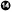
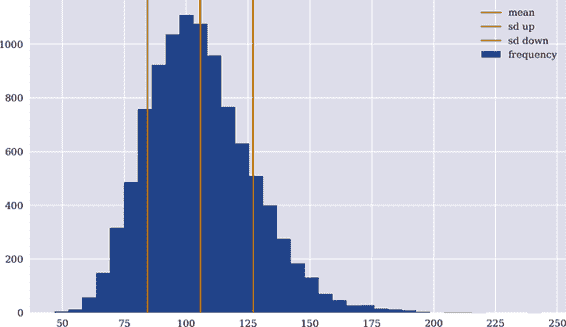
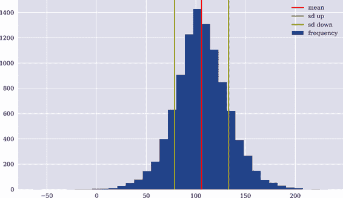
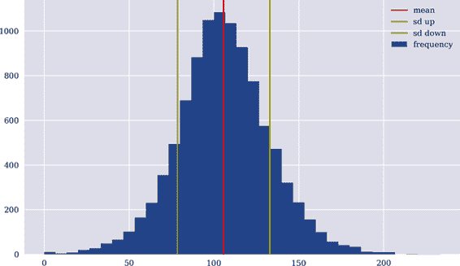

# 第五章。静态经济

> 证券市场模型仅在存在至少一个等价鞅测度时才是可行的。
> 
> Harrison 和 Kreps（1979）
> 
> 与无套利论据和鞅理论相关的理论核心是所谓的资产定价基本定理。
> 
> Delbaen 和 Schachermayer（2006）

本章引入更多形式化内容，以模拟一般静态经济。这样的经济特点是具有任意大但仍有限的状态空间。如前所述，一般静态经济仅在两个相关时间点上分析，例如今天和一年后。因此，本章引入了一个主要的泛化——即关于状态空间。下一章则进一步泛化模型经济，关于相关时间点的数量。这使得可以模拟动态。

本章继续运用线性代数和概率理论概念。在本章目的下，涵盖这些主题的好书包括 Aleskerov 等人（2011）的线性代数和 Jacod 和 Protter（2004）的概率理论。Milne（1995）提供了对一般静态经济及其分析的初步介绍。Pliska（1997）是一本介绍性的教科书，既易于理解又严谨。Duffie（1988）是一本深入研究一般静态经济的高级文献，以自包含的方式提供了所有线性代数和概率的必要工具。

本章涵盖的主题包括一般离散概率空间、金融资产和条件索赔、市场完备性、资产定价的两大基本定理、复制和套利定价、Black-Scholes-Merton（1973）和 Merton（1976）期权定价，以及具有 Arrow-Debreu 证券的代理人定价。以下表格概述了本章发现的金融、数学和 Python 主题：

| 金融 | 数学 | Python |
| --- | --- | --- |
| 不确定性 | 状态空间、代数、概率测度、概率空间 | `NumPy`, `ndarray`, `rng.normal` |
| 金融资产、条件索赔 | 随机变量、期望 | `rng`, `mean()`, `np.dot` |
| 市场支付矩阵 | 矩阵 | `ndarray`, `mean()`, `std()` |
| 复制、套利定价 | 解线性方程组、点乘 | `np.maximum`, `np.linalg.solve`, `np.dot` |
| 市场完备性 | 秩、张成、向量空间 | `ndarray`, `np.dot`, `np.linalg.matrix_rank` |
| 马丁格尔测度 | 概率测度 | `ndarray`, `scipy.optimize.minimize` |
| Black-Scholes-Merton 模型（1973） | 几何布朗运动、正态分布、蒙特卡洛模拟、复制 | `rng.standard_normal`, `np.linalg.lstsq` |
| Merton（1976）模型、对数正态跳跃 | 跳跃扩散、泊松分布 | `rng.poisson`, `np.linalg.lstsq` |

本章的主要目标是*泛化*。几乎所有本章介绍的概念和观念都在之前的章节中有所介绍。状态空间的扩展使得引入一些更加正式的形式主义变得必要。然而，在 Python 方面，代码仍然像以前一样简洁。这种泛化的好处应该是显而易见的。仅仅假设可能的未来苹果股票价格只有两三种状态是不现实的。更为现实的假设是股票价格可能取得 100、500 甚至更多个可能的值之一。这是朝着更为现实的金融模型迈出的重要一步。

# 不确定性

考虑一个具有*一般的离散状态空间* <math alttext="正常上Ω"><mi>Ω</mi></math> 和有限数量元素的经济体 <math alttext="开始绝对值正常上Ω结束绝对值小于正无穷"><mrow><mfenced open="|" close="|"><mi>Ω</mi></mfenced> <mo><</mo> <mi>∞</mi></mrow></math> 。在 <math alttext="正常上Ω"><mi>Ω</mi></math> 中的*代数* <math alttext="脚本上 F"><mi>ℱ</mi></math> 是一组集合，满足以下陈述成立：

1.  <math alttext="normal upper Omega element-of script upper F"><mrow><mi>Ω</mi> <mo>∈</mo> <mi>ℱ</mi></mrow></math>

1.  <math alttext="double-struck upper E element-of script upper F right double arrow double-struck upper E Superscript c Baseline element-of script upper F"><mrow><mi>𝔼</mi> <mo>∈</mo> <mi>ℱ</mi> <mo>⇒</mo> <msup><mi>𝔼</mi> <mi>c</mi></msup> <mo>∈</mo> <mi>ℱ</mi></mrow></math>

1.  <math alttext="double-struck upper E 1 comma double-struck upper E 2 comma period period period comma double-struck upper E Subscript upper I Baseline element-of script upper F right double arrow union double-struck upper E Subscript i Baseline element-of script upper F"><mrow><msub><mi>𝔼</mi> <mn>1</mn></msub> <mo>,</mo> <msub><mi>𝔼</mi> <mn>2</mn></msub> <mo>,</mo> <mo>.</mo> <mo>.</mo> <mo>.</mo> <mo>,</mo> <msub><mi>𝔼</mi> <mi>I</mi></msub> <mo>∈</mo> <mi>ℱ</mi> <mo>⇒</mo> <msubsup><mo>∪</mo> <mrow><mi>i</mi><mo>=</mo><mn>1</mn></mrow> <mi>I</mi></msubsup> <msub><mi>𝔼</mi> <mi>i</mi></msub> <mo>∈</mo> <mi>ℱ</mi></mrow></math>

<math alttext="双击上 E 上标 c"><msup><mi>𝔼</mi> <mi>c</mi></msup></math> 表示集合 <math alttext="双击上 E"><mi>𝔼</mi></math> 的补集。幂集 <math alttext="正常脚本上 P 左括号正常上Ω右括号"><mrow><mi>℘</mi> <mo>(</mo> <mi>Ω</mi> <mo>)</mo></mrow></math> 是最大的代数结构，而集合 <math alttext="脚本上 F 等于开始集合正常空集逗号正常上Ω结束集合"><mrow><mi>ℱ</mi> <mo>=</mo> <mo>{</mo> <mi>∅</mi> <mo>,</mo> <mi>Ω</mi> <mo>}</mo></mrow></math> 是 <math alttext="正常上Ω"><mi>Ω</mi></math> 中最小的代数。代数是经济中*可观察事件*的一个模型。在这个背景下，经济体的一个单一状态 <math alttext="omega 属于正常上Ω"><mrow><mi>ω</mi> <mo>∈</mo> <mi>Ω</mi></mrow></math> 可以被解释为一个*原子事件*。

*概率* 将实数 <math alttext="0 less-than-or-equal-to p Subscript omega Baseline identical-to upper P left-parenthesis StartSet omega EndSet right-parenthesis less-than-or-equal-to 1"><mrow><mn>0</mn> <mo>≤</mo> <msub><mi>p</mi> <mi>ω</mi></msub> <mo>≡</mo> <mi>P</mi> <mrow><mo>(</mo> <mrow><mo>{</mo> <mi>ω</mi> <mo>}</mo></mrow> <mo>)</mo></mrow> <mo>≤</mo> <mn>1</mn></mrow></math> 分配给状态 <math alttext="omega element-of normal upper Omega"><mrow><mi>ω</mi> <mo>∈</mo> <mi>Ω</mi></mrow></math> 或实数 <math alttext="0 less-than-or-equal-to upper P left-parenthesis double-struck upper E double-struck right-parenthesis less-than-or-equal-to 1"><mrow><mn>0</mn> <mo>≤</mo> <mi>P</mi> <mo>(</mo> <mi>𝔼</mi> <mo>)</mo> <mo>≤</mo> <mn>1</mn></mrow></math> 分配给事件 <math alttext="double-struck upper E element-of script upper F"><mrow><mi>𝔼</mi> <mo>∈</mo> <mi>ℱ</mi></mrow></math> 。如果所有状态的概率都已知，则有 <math alttext="upper P left-parenthesis double-struck upper E right-parenthesis equals sigma-summation Underscript omega element-of double-struck upper E Endscripts p Subscript omega"><mrow><mi>P</mi> <mrow><mo>(</mo> <mi>𝔼</mi> <mo>)</mo></mrow> <mo>=</mo> <msub><mo>∑</mo> <mrow><mi>ω</mi><mo>∈</mo><mi>𝔼</mi></mrow></msub> <msub><mi>p</mi> <mi>ω</mi></msub></mrow></math> 。

*概率测度* <math alttext="upper P colon script upper F right-arrow left-bracket 0 comma 1 right-bracket"><mrow><mi>P</mi> <mo>:</mo> <mi>ℱ</mi> <mo>→</mo> <mo>[</mo> <mn>0</mn> <mo>,</mo> <mn>1</mn> <mo>]</mo></mrow></math> 具有以下特征：

1.  <math alttext="for-all double-struck upper E element-of script upper F colon upper P left-parenthesis double-struck upper E right-parenthesis greater-than-or-equal-to 0"><mrow><mo>∀</mo> <mi>𝔼</mi> <mo>∈</mo> <mi>ℱ</mi> <mo>:</mo> <mi>P</mi> <mo>(</mo> <mi>𝔼</mi> <mo>)</mo> <mo>≥</mo> <mn>0</mn></mrow></math>

1.  <math alttext="upper P left-parenthesis union double-struck upper E Subscript i Baseline right-parenthesis equals sigma-summation Underscript i equals 1 Overscript upper I Endscripts double-struck upper E Subscript i Baseline for disjoint sets double-struck upper E Subscript i Baseline element-of script upper F"><mrow><mi>P</mi> <mfenced separators="" open="(" close=")"><msubsup><mo>∪</mo> <mrow><mi>i</mi><mo>=</mo><mn>1</mn></mrow> <mi>I</mi></msubsup> <msub><mi>𝔼</mi> <mi>i</mi></msub></mfenced> <mo>=</mo> <msubsup><mo>∑</mo> <mrow><mi>i</mi><mo>=</mo><mn>1</mn></mrow> <mi>I</mi></msubsup> <msub><mi>𝔼</mi> <mi>i</mi></msub> <mtext>for</mtext> <mtext>disjoint</mtext> <mtext>sets</mtext> <msub><mi>𝔼</mi> <mi>i</mi></msub> <mo>∈</mo> <mi>ℱ</mi></mrow></math>

1.  <math alttext="upper P left-parenthesis normal upper Omega right-parenthesis equals 1"><mrow><mi>P</mi> <mo>(</mo> <mi>Ω</mi> <mo>)</mo> <mo>=</mo> <mn>1</mn></mrow></math>

这三个元素一起 <math alttext="StartSet normal upper Omega comma script upper F comma upper P EndSet"><mrow><mo>{</mo> <mi>Ω</mi> <mo>,</mo> <mi>ℱ</mi> <mo>,</mo> <mi>P</mi> <mo>}</mo></mrow></math> 形成一个 *概率空间* 。概率空间是对模型经济中的 *不确定性* 的形式化表示。

## 随机变量

给定概率空间 <math alttext="StartSet normal upper Omega comma script upper F comma upper P EndSet"><mrow><mo>{</mo> <mi>Ω</mi> <mo>,</mo> <mi>ℱ</mi> <mo>,</mo> <mi>P</mi> <mo>}</mo></mrow></math> ，*随机变量* 是一个 <math alttext="script upper F minus"><mrow><mi>ℱ</mi> <mo>-</mo></mrow></math> 可测函数：

<math mode="display"><mrow><mi>S</mi> <mo>:</mo> <mi>Ω</mi> <mo>→</mo> <msub><mi>ℝ</mi> <mrow><mn>≥0</mn></mrow></msub> <mo>,</mo> <mi>ω</mi> <mo>↦</mo> <mi>S</mi> <mrow><mo>(</mo> <mi>ω</mi> <mo>)</mo></mrow></mrow></math>

<math alttext="script upper F minus"><mrow><mi>ℱ</mi> <mo>-</mo></mrow></math> 可测性意味着对于每个 <math alttext="double-struck upper E element-of left-brace left-bracket a comma b left-bracket colon a comma b element-of double-struck upper R comma a less-than b right-brace"><mrow><mi>𝔼</mi> <mo>∈</mo> <mo>{</mo> <mo>[</mo> <mi>a</mi> <mo>,</mo> <mi>b</mi> <mo>[</mo> <mo>:</mo> <mi>a</mi> <mo>,</mo> <mi>b</mi> <mo>∈</mo> <mi>ℝ</mi> <mo>,</mo> <mi>a</mi> <mo><</mo> <mi>b</mi> <mo>}</mo></mrow></math> ，有：

<math alttext="upper S Superscript negative 1 Baseline left-parenthesis double-struck upper E right-parenthesis identical-to StartSet omega element-of normal upper Omega colon upper S left-parenthesis omega right-parenthesis element-of double-struck upper E EndSet element-of script upper F" display="block"><mrow><msup><mi>S</mi> <mrow><mo>-</mo><mn>1</mn></mrow></msup> <mrow><mo>(</mo> <mi>𝔼</mi> <mo>)</mo></mrow> <mo>≡</mo> <mrow><mo>{</mo> <mi>ω</mi> <mo>∈</mo> <mi>Ω</mi> <mo>:</mo> <mi>S</mi> <mrow><mo>(</mo> <mi>ω</mi> <mo>)</mo></mrow> <mo>∈</mo> <mi>𝔼</mi> <mo>}</mo></mrow> <mo>∈</mo> <mi>ℱ</mi></mrow></math>

如果<math alttext="script upper F identical-to normal script upper P left-parenthesis normal upper Omega right-parenthesis"><mrow><mi>ℱ</mi> <mo>≡</mo> <mi>℘</mi> <mo>(</mo> <mi>Ω</mi> <mo>)</mo></mrow></math>，则随机变量的*期望*定义为：

<math alttext="bold upper E Superscript upper P Baseline left-parenthesis upper S right-parenthesis equals sigma-summation Underscript omega element-of normal upper Omega Endscripts upper P left-parenthesis omega right-parenthesis dot upper S left-parenthesis omega right-parenthesis" display="block"><mrow><msup><mi>𝐄</mi> <mi>P</mi></msup> <mrow><mo>(</mo> <mi>S</mi> <mo>)</mo></mrow> <mo>=</mo> <munder><mo>∑</mo> <mrow><mi>ω</mi><mo>∈</mo><mi>Ω</mi></mrow></munder> <mi>P</mi> <mrow><mo>(</mo> <mi>ω</mi> <mo>)</mo></mrow> <mo>·</mo> <mi>S</mi> <mrow><mo>(</mo> <mi>ω</mi> <mo>)</mo></mrow></mrow></math>

否则，有：

<math alttext="bold upper E Superscript upper P Baseline left-parenthesis upper S right-parenthesis equals sigma-summation Underscript double-struck upper E element-of script upper F Endscripts upper P left-parenthesis double-struck upper E right-parenthesis dot upper S left-parenthesis double-struck upper E right-parenthesis" display="block"><mrow><msup><mi>𝐄</mi> <mi>P</mi></msup> <mrow><mo>(</mo> <mi>S</mi> <mo>)</mo></mrow> <mo>=</mo> <munder><mo>∑</mo> <mrow><mi>𝔼</mi><mo>∈</mo><mi>ℱ</mi></mrow></munder> <mi>P</mi> <mrow><mo>(</mo> <mi>𝔼</mi> <mo>)</mo></mrow> <mo>·</mo> <mi>S</mi> <mrow><mo>(</mo> <mi>𝔼</mi> <mo>)</mo></mrow></mrow></math>

## 数值示例

为了举一个具体的例子，假设状态空间为<math alttext="normal upper Omega equals StartSet omega 1 comma omega 2 comma omega 3 comma omega 4 EndSet"><mrow><mi>Ω</mi> <mo>=</mo> <mo>{</mo> <msub><mi>ω</mi> <mn>1</mn></msub> <mo>,</mo> <msub><mi>ω</mi> <mn>2</mn></msub> <mo>,</mo> <msub><mi>ω</mi> <mn>3</mn></msub> <mo>,</mo> <msub><mi>ω</mi> <mn>4</mn></msub> <mo>}</mo></mrow></math> 。此外，假设有一个代数<math alttext="script upper F equals StartSet normal empty-set comma StartSet omega 1 comma omega 2 EndSet comma StartSet omega 3 comma omega 4 EndSet comma normal upper Omega EndSet"><mrow><mi>ℱ</mi> <mo>=</mo> <mo>{</mo> <mi>∅</mi> <mo>,</mo> <mrow><mo>{</mo> <msub><mi>ω</mi> <mn>1</mn></msub> <mo>,</mo> <msub><mi>ω</mi> <mn>2</mn></msub> <mo>}</mo></mrow> <mo>,</mo> <mrow><mo>{</mo> <msub><mi>ω</mi> <mn>3</mn></msub> <mo>,</mo> <msub><mi>ω</mi> <mn>4</mn></msub> <mo>}</mo></mrow> <mo>,</mo> <mi>Ω</mi> <mo>}</mo></mrow></math> 已知。可以轻松验证该集合满足<math alttext="normal upper Omega"><mi>Ω</mi></math>中代数的三个特征。概率测度由<math alttext="upper P left-parenthesis StartSet omega 1 comma omega 2 EndSet right-parenthesis equals upper P left-parenthesis StartSet omega 3 comma omega 4 EndSet right-parenthesis equals one-half"><mrow><mi>P</mi> <mrow><mo>(</mo> <mrow><mo>{</mo> <msub><mi>ω</mi> <mn>1</mn></msub> <mo>,</mo> <msub><mi>ω</mi> <mn>2</mn></msub> <mo>}</mo></mrow> <mo>)</mo></mrow> <mo>=</mo> <mi>P</mi> <mrow><mo>(</mo> <mrow><mo>{</mo> <msub><mi>ω</mi> <mn>3</mn></msub> <mo>,</mo> <msub><mi>ω</mi> <mn>4</mn></msub> <mo>}</mo></mrow> <mo>)</mo></mrow> <mo>=</mo> <mfrac><mn>1</mn> <mn>2</mn></mfrac></mrow></math>。同样，可以看出<math alttext="upper P"><mi>P</mi></math>确实是这些假设下<math alttext="script upper F"><mi>ℱ</mi></math>上的概率测度。

现在考虑一个函数<math alttext="upper T"><mi>T</mi></math>，其满足<math alttext="upper T left-parenthesis omega 1 right-parenthesis equals 1 comma upper T left-parenthesis omega 2 right-parenthesis equals 2 comma upper T left-parenthesis omega 3 right-parenthesis equals 3"><mrow><mi>T</mi> <mrow><mo>(</mo> <msub><mi>ω</mi> <mn>1</mn></msub> <mo>)</mo></mrow> <mo>=</mo> <mn>1</mn> <mo>,</mo> <mi>T</mi> <mrow><mo>(</mo> <msub><mi>ω</mi> <mn>2</mn></msub> <mo>)</mo></mrow> <mo>=</mo> <mn>2</mn> <mo>,</mo> <mi>T</mi> <mrow><mo>(</mo> <msub><mi>ω</mi> <mn>3</mn></msub> <mo>)</mo></mrow> <mo>=</mo> <mn>3</mn></mrow></math> ，以及<math alttext="upper T left-parenthesis omega 4 right-parenthesis equals 4"><mrow><mi>T</mi> <mo>(</mo> <msub><mi>ω</mi> <mn>4</mn></msub> <mo>)</mo> <mo>=</mo> <mn>4</mn></mrow></math> 。这个函数*不是*在概率空间上定义的随机变量，因为代数<math alttext="script upper F"><mi>ℱ</mi></math>不能区分，例如<math alttext="omega 1"><msub><mi>ω</mi> <mn>1</mn></msub></math> 和<math alttext="omega 2"><msub><mi>ω</mi> <mn>2</mn></msub></math> ——它们都包含在集合<math alttext="StartSet omega 1 comma omega 2 EndSet"><mrow><mo>{</mo> <msub><mi>ω</mi> <mn>1</mn></msub> <mo>,</mo> <msub><mi>ω</mi> <mn>2</mn></msub> <mo>}</mo></mrow></math> 中。可以说这个代数“不够精细”。

再考虑另一个函数<math alttext="upper S"><mi>S</mi></math>，其满足<math alttext="upper S left-parenthesis omega 1 right-parenthesis equals 20 comma upper S left-parenthesis omega 2 right-parenthesis equals 20 comma upper S left-parenthesis omega 3 right-parenthesis equals 5"><mrow><mi>S</mi> <mrow><mo>(</mo> <msub><mi>ω</mi> <mn>1</mn></msub> <mo>)</mo></mrow> <mo>=</mo> <mn>20</mn> <mo>,</mo> <mi>S</mi> <mrow><mo>(</mo> <msub><mi>ω</mi> <mn>2</mn></msub> <mo>)</mo></mrow> <mo>=</mo> <mn>20</mn> <mo>,</mo> <mi>S</mi> <mrow><mo>(</mo> <msub><mi>ω</mi> <mn>3</mn></msub> <mo>)</mo></mrow> <mo>=</mo> <mn>5</mn></mrow></math> 。现在，这是在概率空间上定义的随机变量，其期望为：

<math alttext="bold upper E Superscript upper P Baseline left-parenthesis upper S right-parenthesis equals sigma-summation Underscript double-struck upper E element-of script upper F Endscripts upper P left-parenthesis double-struck upper E right-parenthesis dot upper S left-parenthesis double-struck upper E right-parenthesis equals one-half dot 20 plus one-half dot 5 equals 12.5" display="block"><mrow><msup><mi>𝐄</mi> <mi>P</mi></msup> <mrow><mo>(</mo> <mi>S</mi> <mo>)</mo></mrow> <mo>=</mo> <munder><mo>∑</mo> <mrow><mi>𝔼</mi><mo>∈</mo><mi>ℱ</mi></mrow></munder> <mi>P</mi> <mrow><mo>(</mo> <mi>𝔼</mi> <mo>)</mo></mrow> <mo>·</mo> <mi>S</mi> <mrow><mo>(</mo> <mi>𝔼</mi> <mo>)</mo></mrow> <mo>=</mo> <mfrac><mn>1</mn> <mn>2</mn></mfrac> <mo>·</mo> <mn>20</mn> <mo>+</mo> <mfrac><mn>1</mn> <mn>2</mn></mfrac> <mo>·</mo> <mn>5</mn> <mo>=</mo> <mn>12</mn> <mo>.</mo> <mn>5</mn></mrow></math>

通常假设<math alttext="script upper F identical-to normal script upper P left-parenthesis normal upper Omega right-parenthesis"><mrow><mi>ℱ</mi> <mo>≡</mo> <mi>℘</mi> <mo>(</mo> <mi>Ω</mi> <mo>)</mo></mrow></math> ，相应地定义<math alttext="upper P"><mi>P</mi></math> ，使得函数（随机变量）<math alttext="upper T"><mi>T</mi></math> 也是<math alttext="script upper F minus"><mrow><mi>ℱ</mi> <mo>-</mo></mrow></math> 可测的，并且期望得到了恰当定义。

使用 Python，可以有效地展示 <math alttext="normal upper Omega"><mi>Ω</mi></math> 很大的情况。以下 Python 代码假设所有可能的状态有相等的概率：

```py
In [1]: import numpy as np
        from numpy.random import default_rng
        np.set_printoptions(precision=5, suppress=True)

In [2]: rng = default_rng(100)  

In [3]: I = 1000  

In [4]: S = rng.normal(loc=100, scale=20, size=I)  

In [5]: S[:14]  
Out[5]: array([ 76.84901, 105.79512, 115.61708, 110.87947,  80.77235, 121.42017,
               114.02911, 114.09947, 114.90125, 122.08694, 144.85945,  87.77014,
               100.94422, 135.08469])

In [6]: S.mean()  
Out[6]: 100.88376804485935
```


设置 `NumPy` 随机数生成器的种子值，以确保结果的可重现性。


固定状态空间中的状态数（以便后续模拟）。


生成 `I` 个正态分布（伪）随机数，均值为 `loc`，标准差为 `scale`。


假设每个模拟值（状态）有相等的概率，计算期望（均值）。

当然，也可以选择任何其他概率测度：

```py
In [7]: P = rng.random(I)  

In [8]: P[:10]  
Out[8]: array([0.34914, 0.33408, 0.41319, 0.06102, 0.6339 , 0.51285, 0.51177,
               0.92149, 0.72853, 0.58985])

In [9]: P /= P.sum()  

In [10]: P.sum()  
Out[10]: 1.0

In [11]: P[:10]  
Out[11]: array([0.00072, 0.00069, 0.00085, 0.00013, 0.00131, 0.00106, 0.00106,
                0.0019 , 0.0015 , 0.00122])

In [12]: np.dot(P, S)  
Out[12]: 100.71981640185018
```


在 0 和 1 之间绘制均匀分布的随机数。


将 `ndarray` 对象中的值标准化，使其总和为 1。


根据随机概率测度得到的权重。


期望值作为概率向量和表示随机变量的向量的点积。

# 数学技术

除了线性代数外，传统概率论在离散金融中起着核心作用。它允许我们以系统化、成熟的方式捕捉和分析不确定性和特别是风险。当从离散金融模型转向连续模型时，需要更先进的方法，如随机微积分。对于离散金融模型，标准的线性代数和概率论在大多数情况下已经足够强大。有关离散金融的更多详细信息，请参考 Pliska（1997）。

# 金融资产

在两个不同日期的经济中考虑 <math alttext="t element-of StartSet 0 comma 1 EndSet"><mrow><mi>t</mi> <mo>∈</mo> <mo>{</mo> <mn>0</mn> <mo>,</mo> <mn>1</mn> <mo>}</mo></mrow></math> ，即今天和一年后（或任何未来时间段）。假设给定一个概率空间 <math alttext="StartSet normal upper Omega comma script upper F identical-to normal script upper P left-parenthesis normal upper Omega right-parenthesis comma upper P EndSet"><mrow><mo>{</mo> <mi>Ω</mi> <mo>,</mo> <mi>ℱ</mi> <mo>≡</mo> <mi>℘</mi> <mo>(</mo> <mi>Ω</mi> <mo>)</mo> <mo>,</mo> <mi>P</mi> <mo>}</mo></mrow></math> ，表示模型经济中未来的*不确定性*，其中 <math alttext="StartAbsoluteValue normal upper Omega EndAbsoluteValue identical-to upper I"><mrow><mfenced open="|" close="|"><mi>Ω</mi></mfenced> <mo>≡</mo> <mi>I</mi></mrow></math> 可能的未来状态。在这种情况下，<math alttext="normal upper Omega equals StartSet omega 1 comma omega 2 comma period period period comma omega Subscript upper I Baseline EndSet"><mrow><mi>Ω</mi> <mo>=</mo> <mo>{</mo> <msub><mi>ω</mi> <mn>1</mn></msub> <mo>,</mo> <msub><mi>ω</mi> <mn>2</mn></msub> <mo>,</mo> <mo>.</mo> <mo>.</mo> <mo>.</mo> <mo>,</mo> <msub><mi>ω</mi> <mi>I</mi></msub> <mo>}</mo></mrow></math> 。

一个交易的*金融资产*由价格过程表示为 <math alttext="upper S equals left-parenthesis upper S 0 comma upper S 1 right-parenthesis"><mrow><mi>S</mi> <mo>=</mo> <mo>(</mo> <msub><mi>S</mi> <mn>0</mn></msub> <mo>,</mo> <msub><mi>S</mi> <mn>1</mn></msub> <mo>)</mo></mrow></math> ，其中今天的价格固定 <math><mrow><msub><mi>S</mi> <mn>0</mn></msub> <mo>∈</mo><msub><mi>ℝ</mi> <mrow><mn>>0</mn></mrow></msub></mrow></math> ，一年后的价格 <math><mrow><msub><mi>S</mi> <mn>1</mn></msub> <mo>:</mo><mi>Ω</mi><mo>→</mo><msub><mi>ℝ</mi> <mrow><mn>≥0</mn></mrow></msub></mrow></math> ，是一个随机变量，其在<math alttext="script upper F minus"><mrow><mi>ℱ</mi> <mo>-</mo></mrow></math> 可测。形式上，一个交易金融资产的未来价格向量是一个具有 <math alttext="upper I"><mi>I</mi></math> 个元素的向量：

<math alttext="upper S 1 equals Start 4 By 1 Matrix 1st Row  upper S 1 left-parenthesis omega 1 right-parenthesis 2nd Row  upper S 1 left-parenthesis omega 2 right-parenthesis 3rd Row  period period period 4th Row  upper S 1 left-parenthesis omega Subscript upper I Baseline right-parenthesis EndMatrix" display="block"><mrow><msub><mi>S</mi> <mn>1</mn></msub> <mo>=</mo> <mfenced open="(" close=")"><mtable><mtr><mtd><mrow><msub><mi>S</mi> <mn>1</mn></msub> <mrow><mo>(</mo> <msub><mi>ω</mi> <mn>1</mn></msub> <mo>)</mo></mrow></mrow></mtd></mtr> <mtr><mtd><mrow><msub><mi>S</mi> <mn>1</mn></msub> <mrow><mo>(</mo> <msub><mi>ω</mi> <mn>2</mn></msub> <mo>)</mo></mrow></mrow></mtd></mtr> <mtr><mtd><mrow><mo>.</mo> <mo>.</mo> <mo>.</mo></mrow></mtd></mtr> <mtr><mtd><mrow><msub><mi>S</mi> <mn>1</mn></msub> <mrow><mo>(</mo> <msub><mi>ω</mi> <mi>I</mi></msub> <mo>)</mo></mrow></mrow></mtd></mtr></mtable></mfenced></mrow></math>

如果有多个交易的金融资产，例如<math alttext="upper K greater-than 1"><mrow><mi>K</mi> <mo>></mo> <mn>1</mn></mrow></math>，它们可以由多个价格过程表示，<math alttext="upper S Superscript k Baseline equals left-parenthesis upper S 0 Superscript k Baseline comma upper S 1 Superscript k Baseline right-parenthesis comma k equals 1 comma 2 comma period period period comma upper K"><mrow><msup><mi>S</mi> <mi>k</mi></msup> <mo>=</mo> <mrow><mo>(</mo> <msubsup><mi>S</mi> <mn>0</mn> <mi>k</mi></msubsup> <mo>,</mo> <msubsup><mi>S</mi> <mn>1</mn> <mi>k</mi></msubsup> <mo>)</mo></mrow> <mo>,</mo> <mi>k</mi> <mo>=</mo> <mn>1</mn> <mo>,</mo> <mn>2</mn> <mo>,</mo> <mo>.</mo> <mo>.</mo> <mo>.</mo> <mo>,</mo> <mi>K</mi></mrow></math>。*市场回报矩阵*由交易的金融资产的未来价格向量组成：

<math alttext="script upper M equals Start 4 By 4 Matrix 1st Row 1st Column upper S 1 Superscript 1 Baseline left-parenthesis omega 1 right-parenthesis 2nd Column upper S 1 squared left-parenthesis omega 1 right-parenthesis 3rd Column period period period 4th Column upper S 1 Superscript upper K Baseline left-parenthesis omega 1 right-parenthesis 2nd Row 1st Column upper S 1 Superscript 1 Baseline left-parenthesis omega 2 right-parenthesis 2nd Column upper S 1 squared left-parenthesis omega 2 right-parenthesis 3rd Column period period period 4th Column upper S 1 Superscript upper K Baseline left-parenthesis omega 2 right-parenthesis 3rd Row 1st Column period period period 2nd Column period period period 3rd Column period period period 4th Column period period period 4th Row 1st Column upper S 1 Superscript 1 Baseline left-parenthesis omega 3 right-parenthesis 2nd Column upper S 1 squared left-parenthesis omega 3 right-parenthesis 3rd Column period period period 4th Column upper S 1 Superscript upper K Baseline left-parenthesis omega 3 right-parenthesis EndMatrix" display="block"><mrow><mi>ℳ</mi> <mo>=</mo> <mfenced open="(" close=")"><mtable><mtr><mtd><mrow><msubsup><mi>S</mi> <mn>1</mn> <mn>1</mn></msubsup> <mrow><mo>(</mo> <msub><mi>ω</mi> <mn>1</mn></msub> <mo>)</mo></mrow></mrow></mtd> <mtd><mrow><msubsup><mi>S</mi> <mn>1</mn> <mn>2</mn></msubsup> <mrow><mo>(</mo> <msub><mi>ω</mi> <mn>1</mn></msub> <mo>)</mo></mrow></mrow></mtd> <mtd><mrow><mo>.</mo> <mo>.</mo> <mo>.</mo></mrow></mtd> <mtd><mrow><msubsup><mi>S</mi> <mn>1</mn> <mi>K</mi></msubsup> <mrow><mo>(</mo> <msub><mi>ω</mi> <mn>1</mn></msub> <mo>)</mo></mrow></mrow></mtd></mtr> <mtr><mtd><mrow><msubsup><mi>S</mi> <mn>1</mn> <mn>1</mn></msubsup> <mrow><mo>(</mo> <msub><mi>ω</mi> <mn>2</mn></msub> <mo>)</mo></mrow></mrow></mtd> <mtd><mrow><msubsup><mi>S</mi> <mn>1</mn> <mn>2</mn></msubsup> <mrow><mo>(</mo> <msub><mi>ω</mi> <mn>2</mn></msub> <mo>)</mo></mrow></mrow></mtd> <mtd><mrow><mo>.</mo> <mo>.</mo> <mo>.</mo></mrow></mtd> <mtd><mrow><msubsup><mi>S</mi> <mn>1</mn> <mi>K</mi></msubsup> <mrow><mo>(</mo> <msub><mi>ω</mi> <mn>2</mn></msub> <mo>)</mo></mrow></mrow></mtd></mtr> <mtr><mtd><mrow><mo>.</mo> <mo>.</mo> <mo>.</mo></mrow></mtd> <mtd><mrow><mo>.</mo> <mo>.</mo> <mo>.</mo></mrow></mtd> <mtd><mrow><mo>.</mo> <mo>.</mo> <mo>.</mo></mrow></mtd> <mtd><mrow><mo>.</mo> <mo>.</mo> <mo>.</mo></mrow></mtd></mtr> <mtr><mtd><mrow><msubsup><mi>S</mi> <mn>1</mn> <mn>1</mn></msubsup> <mrow><mo>(</mo> <msub><mi>ω</mi> <mn>3</mn></msub> <mo>)</mo></mrow></mrow></mtd> <mtd><mrow><msubsup><mi>S</mi> <mn>1</mn> <mn>2</mn></msubsup> <mrow><mo>(</mo> <msub><mi>ω</mi> <mn>3</mn></msub> <mo>)</mo></mrow></mrow></mtd> <mtd><mrow><mo>.</mo> <mo>.</mo> <mo>.</mo></mrow></mtd> <mtd><mrow><msubsup><mi>S</mi> <mn>1</mn> <mi>K</mi></msubsup> <mrow><mo>(</mo> <msub><mi>ω</mi> <mn>3</mn></msub> <mo>)</mo></mrow></mrow></mtd></mtr></mtable></mfenced></mrow></math>

用<math alttext="script upper S identical-to left-parenthesis upper S Superscript 1 Baseline comma upper S squared comma period period period comma upper S Superscript upper K Baseline right-parenthesis"><mrow><mi>𝒮</mi> <mo>≡</mo> <mo>(</mo> <msup><mi>S</mi> <mn>1</mn></msup> <mo>,</mo> <msup><mi>S</mi> <mn>2</mn></msup> <mo>,</mo> <mo>.</mo> <mo>.</mo> <mo>.</mo> <mo>,</mo> <msup><mi>S</mi> <mi>K</mi></msup> <mo>)</mo></mrow></math> 表示*交易的金融资产集合*。*静态模型经济*可以总结如下：

<math alttext="script upper E equals left-parenthesis StartSet normal upper Omega comma script upper F comma upper P EndSet comma script upper S right-parenthesis" display="block"><mrow><mi>ℰ</mi> <mo>=</mo> <mo>(</mo> <mo>{</mo> <mi>Ω</mi> <mo>,</mo> <mi>ℱ</mi> <mo>,</mo> <mi>P</mi> <mo>}</mo> <mo>,</mo> <mi>𝒮</mi> <mo>)</mo></mrow></math>

在通常假设的情况下，<math alttext="script upper F identical-to normal script upper P left-parenthesis normal upper Omega right-parenthesis"><mrow><mi>ℱ</mi> <mo>≡</mo> <mi>℘</mi> <mo>(</mo> <mi>Ω</mi> <mo>)</mo></mrow></math> 。

将可能的未来状态数固定为五个<math alttext="normal upper Omega equals StartSet omega 1 comma period period period comma omega 5 EndSet"><mrow><mi>Ω</mi> <mo>=</mo> <mo>{</mo> <msub><mi>ω</mi> <mn>1</mn></msub> <mo>,</mo> <mo>.</mo> <mo>.</mo> <mo>.</mo> <mo>,</mo> <msub><mi>ω</mi> <mn>5</mn></msub> <mo>}</mo></mrow></math>，每个状态的概率相等<math alttext="for-all omega element-of normal upper Omega colon upper P left-parenthesis omega right-parenthesis equals one-fifth"><mrow><mo>∀</mo> <mi>ω</mi> <mo>∈</mo> <mi>Ω</mi> <mo>:</mo> <mi>P</mi> <mrow><mo>(</mo> <mi>ω</mi> <mo>)</mo></mrow> <mo>=</mo> <mfrac><mn>1</mn> <mn>5</mn></mfrac></mrow></math>，并且交易的金融资产数量也为五个，Python 的数值示例说明了这样一个静态模型经济：

```py
In [13]: M = np.array((
             (11, 25, 0,  0,  25),
             (11, 20, 30, 15, 25),
             (11, 10, 0,  20, 10),
             (11, 5,  30, 15, 0),
             (11, 0,  0,  0,  0)
         ))  

In [14]: M0 = np.array(5 * [10.])  

In [15]: M0  
Out[15]: array([10., 10., 10., 10., 10.])

In [16]: M.mean(axis=0)  
Out[16]: array([11., 12., 12., 10., 12.])

In [17]: mu = M.mean(axis=0) / M0 - 1  

In [18]: mu  
Out[18]: array([0.1, 0.2, 0.2, 0. , 0.2])

In [19]: (M / M0 - 1)  
Out[19]: array([[ 0.1,  1.5, -1. , -1. ,  1.5],
                [ 0.1,  1. ,  2. ,  0.5,  1.5],
                [ 0.1,  0. , -1. ,  1. ,  0. ],
                [ 0.1, -0.5,  2. ,  0.5, -1. ],
                [ 0.1, -1. , -1. , -1. , -1. ]])

In [20]: sigma = (M / M0 - 1).std(axis=0)  

In [21]: sigma  
Out[21]: array([0.     , 0.92736, 1.46969, 0.83666, 1.1225 ])
```


假设市场回报矩阵，其中列表示交易的金融资产的未来、不确定价格向量。


五种资产的当前价格向量，每种资产的价格均固定为 10。


这计算了每个交易的金融资产的预期（或平均）未来价格。


这进而计算了预期（或平均）收益率。


计算并打印出收益率矩阵。


计算每种交易金融资产的收益率标准差或波动率——第一个是无风险的；可以被视为债券。

# 偶然索赔

鉴于一个模型经济 <math alttext="script upper E"><mi>ℰ</mi></math> ，*偶然索赔*由价格过程 <math alttext="upper C equals left-parenthesis upper C 0 comma upper C 1 right-parenthesis"><mrow><mi>C</mi> <mo>=</mo> <mo>(</mo> <msub><mi>C</mi> <mn>0</mn></msub> <mo>,</mo> <msub><mi>C</mi> <mn>1</mn></msub> <mo>)</mo></mrow></math> 特征化，其中 <math alttext="upper C 1"><msub><mi>C</mi> <mn>1</mn></msub></math> 是一个 <math alttext="script upper F minus"><mrow><mi>ℱ</mi> <mo>-</mo></mrow></math> 可测随机变量。

人们可以将欧式看涨和看跌期权视为偶然索赔的典型示例。例如，欧式看涨期权的支付可以相对于第二个交易金融资产定义为 <math alttext="upper C 1 equals max left-parenthesis upper S 1 squared minus upper K comma 0 right-parenthesis"><mrow><msub><mi>C</mi> <mn>1</mn></msub> <mo>=</mo> <mo movablelimits="true" form="prefix">max</mo> <mrow><mo>(</mo> <msubsup><mi>S</mi> <mn>1</mn> <mn>2</mn></msubsup> <mo>-</mo> <mi>K</mi> <mo>,</mo> <mn>0</mn> <mo>)</mo></mrow></mrow></math> ，其中 <math><mrow><mi>K</mi><mo>∈</mo><msub><mi>ℝ</mi> <mrow><mn>≥0</mn></mrow></msub></mrow></math> 是期权的执行价格。由于期权的支付是“派生”自另一个资产，因此人们经常称其为*衍生工具*或简称为*衍生品*。

如果一种偶然索赔可以由交易金融资产的投资组合 <math alttext="phi element-of double-struck upper R Superscript upper K"><mrow><mi>ϕ</mi> <mo>∈</mo> <msup><mi>ℝ</mi> <mi>K</mi></msup></mrow></math> 复制

<math alttext="script upper M dot phi equals upper C 1" display="block"><mrow><mi>ℳ</mi> <mo>·</mo> <mi>ϕ</mi> <mo>=</mo> <msub><mi>C</mi> <mn>1</mn></msub></mrow></math>

那么偶然索赔的*套利价格*是

<math alttext="script upper M script 0 dot phi equals upper C 0" display="block"><mrow><msub><mi>ℳ</mi> <mn mathvariant="script">0</mn></msub> <mo>·</mo> <mi>ϕ</mi> <mo>=</mo> <msub><mi>C</mi> <mn>0</mn></msub></mrow></math>

在数学中，<math><mrow><msub><mi>ℳ</mi> <mn mathvariant="script">0</mn></msub> <mo>=</mo><msup><mfenced separators="" open="(" close=")"><msubsup><mi>S</mi> <mn>0</mn> <mn>1</mn></msubsup> <mo>,</mo><msubsup><mi>S</mi> <mn>0</mn> <mn>2</mn></msubsup> <mo>,</mo><mo>.</mo><mo>.</mo><mo>.</mo><mo>,</mo><msubsup><mi>S</mi> <mn>0</mn> <mi>K</mi></msubsup></mfenced> <mi>T</mi></msup> <mo>∈</mo><msubsup><mi>ℝ</mi> <mrow><mn>>0</mn></mrow> <mi>I</mi></msubsup></mrow></math> 是交易金融资产的*当前价格向量*。

继续前面的 Python 示例，基于线性代数方法复制偶然索赔如下所示：

```py
In [22]: K = 15  

In [23]: M[:, 1]  
Out[23]: array([25, 20, 10,  5,  0])

In [24]: C1 = np.maximum(M[:, 1] - K, 0)  

In [25]: C1  
Out[25]: array([10,  5,  0,  0,  0])

In [26]: phi = np.linalg.solve(M, C1)  

In [27]: phi  
Out[27]: array([ 0.,  0.5,  0.01667, -0.2, -0.1])

In [28]: np.allclose(C1, np.dot(M, phi))  
Out[28]: True

In [29]: C0 = np.dot(M0, phi)  

In [30]: C0  
Out[30]: 2.1666666666666665
```


欧式看涨期权的行权价，以及相关金融资产的支付向量。


看涨期权写在第二个交易金融资产上，未来支付为 <math alttext="upper S 1 squared equals left-parenthesis 25 comma 20 comma 10 comma 5 comma 0 right-parenthesis"><mrow><msubsup><mi>S</mi> <mn>1</mn> <mn>2</mn></msubsup> <mo>=</mo> <mrow><mo>(</mo> <mn>25</mn> <mo>,</mo> <mn>20</mn> <mo>,</mo> <mn>10</mn> <mo>,</mo> <mn>5</mn> <mo>,</mo> <mn>0</mn> <mo>)</mo></mrow></mrow></math> 。


这解决了市场支付矩阵的复制问题。


检查复制投资组合是否确实复制欧式看涨期权的未来支付。


从复制投资组合中，通过与交易金融资产的当前价格向量的组合得到套利价格。

# 市场完整性

可以基于交易金融资产 <math alttext="script upper S"><mi>𝒮</mi></math> 定义的市场静态模型经济的*排名*分析市场完整性。矩阵的排名等于线性独立（列）向量的数量（见 Aleskerov 等人（2011 年），第 2.7 节）。考虑代表交易金融资产未来价格向量的列向量。如果它们是*线性独立*的，那么

<math alttext="script upper M dot phi equals 0" display="block"><mrow><mi>ℳ</mi> <mo>·</mo> <mi>ϕ</mi> <mo>=</mo> <mn>0</mn></mrow></math>

有唯一解，即空向量 <math alttext="phi equals left-parenthesis 0 comma 0 comma period period period comma 0 right-parenthesis Superscript upper T Baseline element-of double-struck upper R Superscript upper K"><mrow><mi>ϕ</mi> <mo>=</mo> <msup><mrow><mo>(</mo><mn>0</mn><mo>,</mo><mn>0</mn><mo>,</mo><mo>.</mo><mo>.</mo><mo>.</mo><mo>,</mo><mn>0</mn><mo>)</mo></mrow> <mi>T</mi></msup> <mo>∈</mo> <msup><mi>ℝ</mi> <mi>K</mi></msup></mrow></math> 。

对市场支付矩阵 <math alttext="script upper M"><mi>ℳ</mi></math> 的*跨度*由所有列向量的线性组合给出：

<math alttext="span left-parenthesis script upper M right-parenthesis equals StartSet phi element-of double-struck upper R Superscript upper K Baseline colon script upper M dot phi EndSet" display="block"><mrow><mtext>span</mtext> <mrow><mo>(</mo> <mi>ℳ</mi> <mo>)</mo></mrow> <mo>=</mo> <mfenced separators="" open="{" close="}"><mi>ϕ</mi> <mo>∈</mo> <msup><mi>ℝ</mi> <mi>K</mi></msup> <mo>:</mo> <mi>ℳ</mi> <mo>·</mo> <mi>ϕ</mi></mfenced></mrow></math>

如果可实现的权益索赔集满足<math alttext="double-struck upper A equals double-struck upper R Superscript upper I"><mrow><mi>𝔸</mi> <mo>=</mo> <msup><mi>ℝ</mi> <mi>I</mi></msup></mrow></math>，则模型经济<math alttext="script upper E"><mi>ℰ</mi></math>是完备的。然而，可实现的权益索赔集的定义即为交易金融资产<math alttext="double-struck upper A identical-to span left-parenthesis script upper M right-parenthesis"><mrow><mi>𝔸</mi> <mo>≡</mo> <mtext>span</mtext> <mo>(</mo> <mi>ℳ</mi> <mo>)</mo></mrow></math>。因此，模型经济<math alttext="script upper E"><mi>ℰ</mi></math>是*完备*的，如果：

<math alttext="span left-parenthesis script upper M right-parenthesis equals double-struck upper R Superscript upper I" display="block"><mrow><mtext>span</mtext> <mrow><mo>(</mo> <mi>ℳ</mi> <mo>)</mo></mrow> <mo>=</mo> <msup><mi>ℝ</mi> <mi>I</mi></msup></mrow></math>

在哪些情况下会发生这种情况？如果矩阵的秩至少与可能的未来状态数目一样大，则会发生这种情况。

<math alttext="rank left-parenthesis script upper M right-parenthesis greater-than-or-equal-to upper I" display="block"><mrow><mtext>rank</mtext> <mo>(</mo> <mi>ℳ</mi> <mo>)</mo> <mo>≥</mo> <mi>I</mi></mrow></math>

换句话说，<math alttext="script upper M"><mi>ℳ</mi></math>的列向量形成了向量空间<math alttext="double-struck upper R Superscript upper I"><msup><mi>ℝ</mi> <mi>I</mi></msup></math>的*基础*（可能比所需的基础向量更多）。一个*向量空间*<math alttext="double-struck upper V"><mi>𝕍</mi></math>是一组称为*向量*的元素，其特征包括：

1.  一个加法函数将两个向量<math alttext="v 1 comma v 2 element-of double-struck upper V"><mrow><msub><mi>v</mi> <mn>1</mn></msub> <mo>,</mo> <msub><mi>v</mi> <mn>2</mn></msub> <mo>∈</mo> <mi>𝕍</mi></mrow></math>映射到向量空间的另一个元素<math alttext="left-parenthesis v 1 plus v 2 right-parenthesis element-of double-struck upper V"><mrow><mo>(</mo> <msub><mi>v</mi> <mn>1</mn></msub> <mo>+</mo> <msub><mi>v</mi> <mn>2</mn></msub> <mo>)</mo> <mo>∈</mo> <mi>𝕍</mi></mrow></math>。

1.  一个标量乘法函数将标量<math alttext="alpha element-of double-struck upper R"><mrow><mi>α</mi> <mo>∈</mo> <mi>ℝ</mi></mrow></math>和向量<math alttext="v element-of double-struck upper V"><mrow><mi>v</mi> <mo>∈</mo> <mi>𝕍</mi></mrow></math>映射到向量空间的另一个元素<math alttext="left-parenthesis alpha dot v right-parenthesis element-of double-struck upper V"><mrow><mo>(</mo> <mi>α</mi> <mo>·</mo> <mi>v</mi> <mo>)</mo> <mo>∈</mo> <mi>𝕍</mi></mrow></math>。

1.  一个特殊元素——通常称为“零”或“中性元素”——<math alttext="0 element-of double-struck upper V"><mrow><mn>0</mn> <mo>∈</mo> <mi>𝕍</mi></mrow></math>，使得<math alttext="v plus 0 equals v"><mrow><mi>v</mi> <mo>+</mo> <mn>0</mn> <mo>=</mo> <mi>v</mi></mrow></math>。

可以轻松验证，例如集合<math alttext="double-struck upper R comma double-struck upper R Superscript 5"><mrow><mi>ℝ</mi> <mo>,</mo> <msup><mi>ℝ</mi> <mn>5</mn></msup></mrow></math>或<math><mrow><msup><mi>ℝ</mi> <mi>I</mi></msup> <mo>,</mo><mi>I</mi><mo>∈</mo><msub><mi>ℕ</mi> <mrow><mn>>0</mn></mrow></msub></mrow></math>都是向量空间。

结果，如果模型经济是*不完备*的：

<math alttext="rank left-parenthesis script upper M right-parenthesis less-than upper I" display="block"><mrow><mtext>rank</mtext> <mo>(</mo> <mi>ℳ</mi> <mo>)</mo> <mo><</mo> <mi>I</mi></mrow></math>

为了更具体，考虑一个只有三种可能未来状态的状态空间，<math alttext="normal upper Omega equals StartSet omega 1 comma omega 2 comma omega 3 EndSet"><mrow><mi>Ω</mi> <mo>=</mo> <mo>{</mo> <msub><mi>ω</mi> <mn>1</mn></msub> <mo>,</mo> <msub><mi>ω</mi> <mn>2</mn></msub> <mo>,</mo> <msub><mi>ω</mi> <mn>3</mn></msub> <mo>}</mo></mrow></math>。那么所有随机变量都是向量空间<math alttext="double-struck upper R cubed"><msup><mi>ℝ</mi> <mn>3</mn></msup></math>中的向量。下面的市场支付矩阵——由三种交易金融资产导致——仅具有秩为 2，因为两列向量线性相关。这导致了一个不完全市场：

<math alttext="script upper M equals Start 3 By 3 Matrix 1st Row 1st Column 11 2nd Column 20 3rd Column 10 2nd Row 1st Column 11 2nd Column 10 3rd Column 5 3rd Row 1st Column 11 2nd Column 5 3rd Column 2.5 EndMatrix right double arrow rank left-parenthesis script upper M right-parenthesis equals 2" display="block"><mrow><mi>ℳ</mi> <mo>=</mo> <mfenced open="(" close=")"><mtable><mtr><mtd><mn>11</mn></mtd> <mtd><mn>20</mn></mtd> <mtd><mn>10</mn></mtd></mtr> <mtr><mtd><mn>11</mn></mtd> <mtd><mn>10</mn></mtd> <mtd><mn>5</mn></mtd></mtr> <mtr><mtd><mn>11</mn></mtd> <mtd><mn>5</mn></mtd> <mtd><mrow><mn>2</mn> <mo>.</mo> <mn>5</mn></mrow></mtd></mtr></mtable></mfenced> <mo>⇒</mo> <mtext>rank</mtext> <mrow><mo>(</mo> <mi>ℳ</mi> <mo>)</mo></mrow> <mo>=</mo> <mn>2</mn></mrow></math>

很容易验证金融资产 2 和 3 确实是线性相关的。

<math alttext="upper S 1 squared equals Start 3 By 1 Matrix 1st Row  20 2nd Row  10 3rd Row  5 EndMatrix equals 2 dot Start 3 By 1 Matrix 1st Row  10 2nd Row  5 3rd Row  2.5 EndMatrix equals 2 dot upper S 1 cubed" display="block"><mrow><msubsup><mi>S</mi> <mn>1</mn> <mn>2</mn></msubsup> <mo>=</mo> <mfenced open="(" close=")"><mtable><mtr><mtd><mn>20</mn></mtd></mtr> <mtr><mtd><mn>10</mn></mtd></mtr> <mtr><mtd><mn>5</mn></mtd></mtr></mtable></mfenced> <mo>=</mo> <mn>2</mn> <mo>·</mo> <mfenced open="(" close=")"><mtable><mtr><mtd><mn>10</mn></mtd></mtr> <mtr><mtd><mn>5</mn></mtd></mtr> <mtr><mtd><mrow><mn>2</mn> <mo>.</mo> <mn>5</mn></mrow></mtd></mtr></mtable></mfenced> <mo>=</mo> <mn>2</mn> <mo>·</mo> <msubsup><mi>S</mi> <mn>1</mn> <mn>3</mn></msubsup></mrow></math>

相比之下，接下来的市场支付矩阵——由另一组三种交易金融资产导致——具有秩为 3，导致了一个完全市场。在这种情况下，也称矩阵具有*满秩*：

<math alttext="script upper M equals Start 3 By 3 Matrix 1st Row 1st Column 11 2nd Column 20 3rd Column 10 2nd Row 1st Column 11 2nd Column 10 3rd Column 25 3rd Row 1st Column 11 2nd Column 5 3rd Column 10 EndMatrix right double arrow rank left-parenthesis script upper M right-parenthesis equals 3" display="block"><mrow><mi>ℳ</mi> <mo>=</mo> <mfenced open="(" close=")"><mtable><mtr><mtd><mn>11</mn></mtd> <mtd><mn>20</mn></mtd> <mtd><mn>10</mn></mtd></mtr> <mtr><mtd><mn>11</mn></mtd> <mtd><mn>10</mn></mtd> <mtd><mn>25</mn></mtd></mtr> <mtr><mtd><mn>11</mn></mtd> <mtd><mn>5</mn></mtd> <mtd><mn>10</mn></mtd></mtr></mtable></mfenced> <mo>⇒</mo> <mtext>rank</mtext> <mrow><mo>(</mo> <mi>ℳ</mi> <mo>)</mo></mrow> <mo>=</mo> <mn>3</mn></mrow></math>

假设一个概率空间已经确定，状态空间有五个元素，<math alttext="normal upper Omega equals StartSet omega 1 comma period period period comma omega 5 EndSet"><mrow><mi>Ω</mi> <mo>=</mo> <mo>{</mo> <msub><mi>ω</mi> <mn>1</mn></msub> <mo>,</mo> <mo>.</mo> <mo>.</mo> <mo>.</mo> <mo>,</mo> <msub><mi>ω</mi> <mn>5</mn></msub> <mo>}</mo></mrow></math>。未来（不确定的）价格和五个交易金融资产<math alttext="script upper S"><mi>𝒮</mi></math>及所有相关索赔的支付向量，现在都是向量空间<math alttext="double-struck upper R Superscript 5"><msup><mi>ℝ</mi> <mn>5</mn></msup></math>的元素。接下来的 Python 代码分析基于这样一个模型经济<math alttext="script upper E"><mi>ℰ</mi></math>的相关索赔复制。它假定所有五种 Arrow-Debreu 证券都在交易中，并进入随机化市场支付矩阵：

```py
In [31]: M = np.eye(5)  

In [32]: M  
Out[32]: array([[1., 0., 0., 0., 0.],
                [0., 1., 0., 0., 0.],
                [0., 0., 1., 0., 0.],
                [0., 0., 0., 1., 0.],
                [0., 0., 0., 0., 1.]])

In [33]: np.linalg.linalg.matrix_rank(M)  
Out[33]: 5

In [34]: C1 = np.arange(10, 0, -2)  

In [35]: C1  
Out[35]: array([10,  8,  6,  4,  2])

In [36]: np.linalg.solve(M, C1)  
Out[36]: array([10.,  8.,  6.,  4.,  2.])
```


创建一个二维的`ndarray`对象，这里是一个单位矩阵。它可以解释为由五种 Arrow-Debreu 证券交易导致的市场支付矩阵。它形成了向量空间<math alttext="double-struck upper R Superscript 5"><msup><mi>ℝ</mi> <mn>5</mn></msup></math>的所谓*标准*基础。


计算矩阵的秩，对于单位矩阵来说也是显然的。


一个需要用交易金融资产复制的相关索赔支付。


这解决了复制（表示）问题，在单位矩阵的情况下也是显而易见的。

接下来，生成随机市场支付矩阵，其也具有完整的秩（总体上一般情况下不能保证）：

```py
In [37]: rng = default_rng(100)  

In [38]: M = rng.integers(1, 10, (5, 5))  

In [39]: M  
Out[39]: array([[7, 8, 2, 6, 1],
                [3, 4, 1, 6, 9],
                [9, 6, 4, 8, 9],
                [9, 1, 7, 7, 2],
                [5, 9, 7, 3, 3]])

In [40]: np.linalg.matrix_rank(M)  
Out[40]: 5

In [41]: np.linalg.matrix_rank(M.T)  
Out[41]: 5

In [42]: phi = np.linalg.solve(M, C1)  

In [43]: phi  
Out[43]: array([-1.16988,  0.52471, -0.3861 ,  2.56409, -0.62085])

In [44]: np.dot(M, phi)  
Out[44]: array([10.,  8.,  6.,  4.,  2.])
```


设置`NumPy`随机数生成器的种子，以便结果可重现。


创建一个随机化市场支付矩阵（形状为`(5, 5)`的`ndarray`对象，由介于 1 到 10 之间的随机整数填充）。


矩阵具有完整的秩——列向量和行向量均线性独立。


使用随机基础解决向量空间<math alttext="double-struck upper R Superscript 5"><msup><mi>ℝ</mi> <mn>5</mn></msup></math> 的复制问题的非平凡解。


检查实现完全复制的解决方案。

# 资产定价的基本定理

考虑一般的静态模型经济<math alttext="script upper E equals left-parenthesis StartSet normal upper Omega comma script upper F comma upper P EndSet comma script upper S right-parenthesis"><mrow><mi>ℰ</mi> <mo>=</mo> <mo>(</mo> <mo>{</mo> <mi>Ω</mi> <mo>,</mo> <mi>ℱ</mi> <mo>,</mo> <mi>P</mi> <mo>}</mo> <mo>,</mo> <mi>𝒮</mi> <mo>)</mo></mrow></math> ，其中<math alttext="upper I"><mi>I</mi></math>个可能的状态和<math alttext="upper K"><mi>K</mi></math>个交易金融资产。假设经济中的无风险短期借贷利率为<math><mrow><mi>r</mi><mo>∈</mo><msub><mi>ℝ</mi> <mrow><mn>≥0</mn></mrow></msub></mrow></math> 。¹

*套利机会*是一种交易金融资产<math alttext="phi element-of double-struck upper R Superscript upper K"><mrow><mi>ϕ</mi> <mo>∈</mo> <msup><mi>ℝ</mi> <mi>K</mi></msup></mrow></math> 的投资组合，其组合价格为零

<math alttext="upper S 0 dot phi equals sigma-summation Underscript k equals 1 Overscript upper K Endscripts upper S 0 Superscript k Baseline dot phi Superscript k Baseline equals 0" display="block"><mrow><msub><mi>S</mi> <mn>0</mn></msub> <mo>·</mo> <mi>ϕ</mi> <mo>=</mo> <munderover><mo>∑</mo> <mrow><mi>k</mi><mo>=</mo><mn>1</mn></mrow> <mi>K</mi></munderover> <msubsup><mi>S</mi> <mn>0</mn> <mi>k</mi></msubsup> <mo>·</mo> <msup><mi>ϕ</mi> <mi>k</mi></msup> <mo>=</mo> <mn>0</mn></mrow></math>

期望的支付大于零：

<math alttext="bold upper E Superscript upper P Baseline left-parenthesis script upper M dot phi right-parenthesis greater-than 0" display="block"><mrow><msup><mi>𝐄</mi> <mi>P</mi></msup> <mrow><mo>(</mo> <mi>ℳ</mi> <mo>·</mo> <mi>ϕ</mi> <mo>)</mo></mrow> <mo>></mo> <mn>0</mn></mrow></math>

将*所有套利机会的集合*表示为：

<math alttext="double-struck upper O identical-to StartSet phi element-of double-struck upper R Superscript upper K Baseline colon upper S 0 dot phi equals 0 comma bold upper E Superscript upper P Baseline left-parenthesis script upper M dot phi right-parenthesis greater-than 0 EndSet" display="block"><mrow><mi>𝕆</mi> <mo>≡</mo> <mo>{</mo> <mi>ϕ</mi> <mo>∈</mo> <msup><mi>ℝ</mi> <mi>K</mi></msup> <mo>:</mo> <msub><mi>S</mi> <mn>0</mn></msub> <mo>·</mo> <mi>ϕ</mi> <mo>=</mo> <mn>0</mn> <mo>,</mo> <msup><mi>𝐄</mi> <mi>P</mi></msup> <mrow><mo>(</mo> <mi>ℳ</mi> <mo>·</mo> <mi>ϕ</mi> <mo>)</mo></mrow> <mo>></mo> <mn>0</mn> <mo>}</mo></mrow></math>

一个*马丁格尔测度* <math alttext="upper Q"><mi>Q</mi></math> 使得折现价格过程是马丁格尔，并因此满足以下条件：

<math alttext="StartFraction 1 Over 1 plus r EndFraction dot bold upper E Superscript upper Q Baseline left-parenthesis script upper M right-parenthesis equals upper S 0" display="block"><mrow><mfrac><mn>1</mn> <mrow><mn>1</mn><mo>+</mo><mi>r</mi></mrow></mfrac> <mo>·</mo> <msup><mi>𝐄</mi> <mi>Q</mi></msup> <mrow><mo>(</mo> <mi>ℳ</mi> <mo>)</mo></mrow> <mo>=</mo> <msub><mi>S</mi> <mn>0</mn></msub></mrow></math>

根据这些定义，*资产定价的第一基本定理*（参见第二章）将马丁格尔测度的存在与套利机会的缺失联系起来。关于讨论和证明，请参考 Pliska（1997 年，第 1.3 节）。

资产定价的第一基本定理（1FTAP）

以下陈述等价：

1.  存在一个马丁格尔测度<math alttext="upper Q"><mi>Q</mi></math>。

1.  经济体是无套利的，它成立 <math alttext="double-struck 0 equals normal empty-set"><mrow><mn mathvariant="double-struck">0</mn> <mo>=</mo> <mi>∅</mi></mrow></math> 。

马丁格尔测度的推导在形式上与对应索赔的复制问题的解决方案相同 <math alttext="upper C equals left-parenthesis upper C 0 comma upper C 1 right-parenthesis"><mrow><mi>C</mi> <mo>=</mo> <mo>(</mo> <msub><mi>C</mi> <mn>0</mn></msub> <mo>,</mo> <msub><mi>C</mi> <mn>1</mn></msub> <mo>)</mo></mrow></math> ，其读取

<math alttext="script upper M dot phi equals upper C 1" display="block"><mrow><mi>ℳ</mi> <mo>·</mo> <mi>ϕ</mi> <mo>=</mo> <msub><mi>C</mi> <mn>1</mn></msub></mrow></math>

并且复制投资组合 <math alttext="phi"><mi>ϕ</mi></math> 需要被确定。从数学上讲，这相当于解决一个线性方程组，正如在第二章中所说明的。寻找一个马丁格尔测度可以被写成

<math alttext="StartFraction 1 Over 1 plus r EndFraction dot bold upper E Superscript upper Q Baseline left-parenthesis script upper M right-parenthesis equals StartFraction 1 Over 1 plus r EndFraction script upper M Superscript upper T Baseline dot upper Q equals script upper M overTilde dot upper Q equals upper S 0" display="block"><mrow><mfrac><mn>1</mn> <mrow><mn>1</mn><mo>+</mo><mi>r</mi></mrow></mfrac> <mo>·</mo> <msup><mi>𝐄</mi> <mi>Q</mi></msup> <mrow><mo>(</mo> <mi>ℳ</mi> <mo>)</mo></mrow> <mo>=</mo> <mfrac><mn>1</mn> <mrow><mn>1</mn><mo>+</mo><mi>r</mi></mrow></mfrac> <msup><mi>ℳ</mi> <mi>T</mi></msup> <mo>·</mo> <mi>Q</mi> <mo>=</mo> <mover accent="true"><mi>ℳ</mi> <mo>˜</mo></mover> <mo>·</mo> <mi>Q</mi> <mo>=</mo> <msub><mi>S</mi> <mn>0</mn></msub></mrow></math>

其中 <math alttext="script upper M overTilde identical-to StartFraction 1 Over 1 plus r EndFraction script upper M Superscript upper T"><mrow><mover accent="true"><mi>ℳ</mi> <mo>˜</mo></mover> <mo>≡</mo> <mfrac><mn>1</mn> <mrow><mn>1</mn><mo>+</mo><mi>r</mi></mrow></mfrac> <msup><mi>ℳ</mi> <mi>T</mi></msup></mrow></math> 并且其中

<math alttext="upper Q equals Start 4 By 1 Matrix 1st Row  upper Q left-parenthesis omega 1 right-parenthesis 2nd Row  upper Q left-parenthesis omega 2 right-parenthesis 3rd Row  period period period 4th Row  upper Q left-parenthesis omega Subscript upper I Baseline right-parenthesis EndMatrix comma for-all omega element-of normal upper Omega colon 0 less-than-or-equal-to upper Q left-parenthesis omega right-parenthesis less-than-or-equal-to 1 comma sigma-summation Underscript omega element-of normal upper Omega Endscripts upper Q left-parenthesis omega right-parenthesis equals 1" display="block"><mrow><mi>Q</mi> <mo>=</mo> <mfenced open="(" close=")"><mtable><mtr><mtd><mrow><mi>Q</mi> <mo>(</mo> <msub><mi>ω</mi> <mn>1</mn></msub> <mo>)</mo></mrow></mtd></mtr> <mtr><mtd><mrow><mi>Q</mi> <mo>(</mo> <msub><mi>ω</mi> <mn>2</mn></msub> <mo>)</mo></mrow></mtd></mtr> <mtr><mtd><mrow><mo>.</mo> <mo>.</mo> <mo>.</mo></mrow></mtd></mtr> <mtr><mtd><mrow><mi>Q</mi> <mo>(</mo> <msub><mi>ω</mi> <mi>I</mi></msub> <mo>)</mo></mrow></mtd></mtr></mtable></mfenced> <mo>,</mo> <mo>∀</mo> <mi>ω</mi> <mo>∈</mo> <mi>Ω</mi> <mo>:</mo> <mn>0</mn> <mo>≤</mo> <mi>Q</mi> <mrow><mo>(</mo> <mi>ω</mi> <mo>)</mo></mrow> <mo>≤</mo> <mn>1</mn> <mo>,</mo> <munder><mo>∑</mo> <mrow><mi>ω</mi><mo>∈</mo><mi>Ω</mi></mrow></munder> <mi>Q</mi> <mrow><mo>(</mo> <mi>ω</mi> <mo>)</mo></mrow> <mo>=</mo> <mn>1</mn></mrow></math>

这个问题可以被认为是复制问题的*对偶问题* ——尽管在一些限制性约束条件下。这些约束条件由于要求解的解必须是一个概率测度，使得在 Python 中需要一种不同的技术方法。找到一个马丁格尔测度的问题可以被建模为一个受限制的最小化问题 —— 而不仅仅是解决一个线性方程组。该示例假设具有五个元素的状态空间和之前的市场支付结构：

```py
In [45]: import scipy.optimize as sco    

In [46]: M = np.array((
             (11, 25, 0,  0,  25),
             (11, 20, 30, 15, 25),
             (11, 10, 0,  20, 10),
             (11, 5,  30, 15, 0),
             (11, 0,  0,  0,  0)
         ))  

In [47]: np.linalg.matrix_rank(M)  
Out[47]: 5

In [48]: M0 = np.ones(5) * 10  

In [49]: M0  
Out[49]: array([10., 10., 10., 10., 10.])

In [50]: r = 0.1  

In [51]: def E(Q):
             return np.sum((np.dot(M.T, Q) - M0 * (1 + r)) ** 2)   

In [52]: E(np.array(5 * [0.2]))
Out[52]: 4.0

In [53]: cons = ({'type': 'eq', 'fun': lambda Q: Q.sum() - 1})  

In [54]: bnds = (5 * [(0, 1)])  

In [55]: bnds  
Out[55]: [(0, 1), (0, 1), (0, 1), (0, 1), (0, 1)]

In [56]: res = sco.minimize(E, 5 * [1],  
                            method='SLSQP',  
                            constraints=cons,  
                            bounds=bnds)  

In [57]: Q = res['x']  

In [58]: Q  
Out[58]: array([0.14667, 0.18333, 0.275  , 0.18333, 0.21167])

In [59]: np.dot(M.T, Q) / (1 + r)  
Out[59]: array([10.     ,  9.99998,  9.99999, 10.00001,  9.99998])

In [60]: np.allclose(M0, np.dot(M.T, Q) / (1 + r))
Out[60]: True
```


从 `scipy` 导入 `optimize` 子包作为 `sco`。


定义市场支付矩阵。


验证矩阵具有全秩。


为交易的金融资产定义价格向量…


…并显示所有设置为 10 的值。


修正恒定短期利率。


定义要最小化的目标函数。这种方法是必要的，因为线性系统要在所有参数的约束和边界条件下解决。


单一概率需要加总为一的约束。


确定每个单一概率的边界。


最小化函数 `E` 的优化过程…


…定义所使用的方法，…


…提供需遵守的限制条件，并…


…提供参数的界限。


结果向量是马丁格尔测度。


在马丁格尔测度下，贴现价格过程是马丁格尔。

在一般静态模型经济 <math alttext="script upper E"><mi>ℰ</mi></math> 中，第二资产定价基本定理也成立。有关讨论和证明，请参阅 Pliska（1997 年，1.5 节）。

第二资产定价基本定理（2FTAP）

以下陈述等价：

1.  马丁格尔测度 <math alttext="upper Q"><mi>Q</mi></math> 是唯一的。

1.  经济是完备的，它满足 <math alttext="double-struck upper A equals double-struck upper R Subscript plus Superscript upper I"><mrow><mi>𝔸</mi> <mo>=</mo> <msubsup><mi>ℝ</mi> <mo>+</mo> <mi>I</mi></msubsup></mrow></math> 。

# 基本定理

追寻有效期权定价模型的历程导致了 Black 和 Scholes（1973 年）以及 Merton（1973 年）的开创性期权定价模型——共同构成 Black-Scholes-Merton（1973 年）。这些开创性论文中使用的模型相当特定，因为它们假定几何布朗运动作为唯一风险资产价格过程的模型。上世纪 70 年代末和 80 年代初的研究，尤其是 Harrison 和 Kreps（1979 年）以及 Harrison 和 Pliska（1981 年），为金融衍生品定价提供了一个通用框架。在他们的通用框架中，马丁格尔测度和（半）马丁格尔过程发挥了核心作用。（半）马丁格尔过程的类别非常广泛，既包括早期模型（例如几何布朗运动），也包括后来提出并分析的许多更复杂的金融模型（例如跳跃扩散或随机波动率过程）。这也是为什么这些呈现的定理被称为*基本*定理之一的原因之一——它们适用于许多有趣和重要的金融模型。

# Black-Scholes-Merton Option Pricing

Black-Scholes-Merton（1973 年）期权定价模型基于连续模型经济，通常由具有适当边界条件的随机微分方程（SDEs）表示。用于描述*单一风险资产*（例如股票或股票指数）演变的 SDE 是*几何布朗运动*。除了风险资产外，模型经济还交易另一个*无风险资产*，其支付连续、无风险的短期利率。

在只有两个相关时间点的静态情况下，例如<math alttext="t equals 0"><mrow><mi>t</mi> <mo>=</mo> <mn>0</mn></mrow></math>和<math alttext="t equals upper T greater-than 0"><mrow><mi>t</mi> <mo>=</mo> <mi>T</mi> <mo>></mo> <mn>0</mn></mrow></math>，未来的不确定风险资产<math alttext="upper S Subscript upper T"><msub><mi>S</mi> <mi>T</mi></msub></math>的值由以下给出：

<math alttext="upper S Subscript upper T Baseline equals upper S 0 dot e Superscript left-parenthesis r minus StartFraction sigma squared Over 2 EndFraction right-parenthesis upper T plus sigma StartRoot upper T EndRoot z" display="block"><mrow><msub><mi>S</mi> <mi>T</mi></msub> <mo>=</mo> <msub><mi>S</mi> <mn>0</mn></msub> <mo>·</mo> <msup><mi>e</mi> <mrow><mfenced separators="" open="(" close=")"><mi>r</mi><mo>-</mo><mfrac><msup><mi>σ</mi> <mn>2</mn></msup> <mn>2</mn></mfrac></mfenced><mi>T</mi><mo>+</mo><mi>σ</mi><msqrt><mi>T</mi></msqrt><mi>z</mi></mrow></msup></mrow></math>

其中<math><mrow><msub><mi>S</mi> <mn>0</mn></msub> <mo>∈</mo><msub><mi>ℝ</mi> <mrow><mn>>0</mn></mrow></msub></mrow></math>是今天风险资产的价格，<math><mrow><mi>r</mi><mo>∈</mo><msub><mi>ℝ</mi> <mrow><mn>≥0</mn></mrow></msub></mrow></math>是固定的无风险短期利率，<math><mrow><mi>σ</mi><mo>∈</mo><msub><mi>ℝ</mi> <mrow><mn>>0</mn></mrow></msub></mrow></math>是固定的波动率因子，而<math alttext="z"><mi>z</mi></math>是标准正态分布的随机变量（见 Jacod 和 Protter（2004），第十六章）。

在离散的数值背景下，例如，可以绘制伪随机数<math alttext="z Subscript i Baseline comma i equals 1 comma 2 comma period period period comma upper I"><mrow><msub><mi>z</mi> <mi>i</mi></msub> <mo>,</mo> <mi>i</mi> <mo>=</mo> <mn>1</mn> <mo>,</mo> <mn>2</mn> <mo>,</mo> <mo>.</mo> <mo>.</mo> <mo>.</mo> <mo>,</mo> <mi>I</mi></mrow></math>，这些数是标准正态分布的，用于根据前述方程得出<math alttext="upper I"><mi>I</mi></math>个数值为<math alttext="upper S Subscript upper T"><msub><mi>S</mi> <mi>T</mi></msub></math>的模拟值。

<math alttext="upper S Subscript upper T Baseline left-parenthesis z Subscript i Baseline right-parenthesis equals upper S 0 dot e Superscript left-parenthesis r minus StartFraction sigma squared Over 2 EndFraction right-parenthesis upper T plus sigma StartRoot upper T EndRoot z Super Subscript i Superscript Baseline comma i equals 1 comma 2 comma period period period comma upper I" display="block"><mrow><msub><mi>S</mi> <mi>T</mi></msub> <mrow><mo>(</mo> <msub><mi>z</mi> <mi>i</mi></msub> <mo>)</mo></mrow> <mo>=</mo> <msub><mi>S</mi> <mn>0</mn></msub> <mo>·</mo> <msup><mi>e</mi> <mrow><mfenced separators="" open="(" close=")"><mi>r</mi><mo>-</mo><mfrac><msup><mi>σ</mi> <mn>2</mn></msup> <mn>2</mn></mfrac></mfenced><mi>T</mi><mo>+</mo><mi>σ</mi><msqrt><mi>T</mi></msqrt><msub><mi>z</mi> <mi>i</mi></msub></mrow></msup> <mo>,</mo> <mi>i</mi> <mo>=</mo> <mn>1</mn> <mo>,</mo> <mn>2</mn> <mo>,</mo> <mo>.</mo> <mo>.</mo> <mo>.</mo> <mo>,</mo> <mi>I</mi></mrow></math>

这样的过程通常被称为*蒙特卡罗模拟*。为了简化表示，从现在起<math alttext="upper S Subscript upper T"><msub><mi>S</mi> <mi>T</mi></msub></math>将指定为股票未来模拟值的向量：

<math alttext="upper S Subscript upper T Baseline identical-to Start 4 By 1 Matrix 1st Row  upper S Subscript upper T Baseline left-parenthesis z 1 right-parenthesis 2nd Row  upper S Subscript upper T Baseline left-parenthesis z 2 right-parenthesis 3rd Row  period period period 4th Row  upper S Subscript upper T Baseline left-parenthesis z Subscript upper I Baseline right-parenthesis EndMatrix" display="block"><mrow><msub><mi>S</mi> <mi>T</mi></msub> <mo>≡</mo> <mfenced open="(" close=")"><mtable><mtr><mtd><mrow><msub><mi>S</mi> <mi>T</mi></msub> <mrow><mo>(</mo> <msub><mi>z</mi> <mn>1</mn></msub> <mo>)</mo></mrow></mrow></mtd></mtr> <mtr><mtd><mrow><msub><mi>S</mi> <mi>T</mi></msub> <mrow><mo>(</mo> <msub><mi>z</mi> <mn>2</mn></msub> <mo>)</mo></mrow></mrow></mtd></mtr> <mtr><mtd><mrow><mo>.</mo> <mo>.</mo> <mo>.</mo></mrow></mtd></mtr> <mtr><mtd><mrow><msub><mi>S</mi> <mi>T</mi></msub> <mrow><mo>(</mo> <msub><mi>z</mi> <mi>I</mi></msub> <mo>)</mo></mrow></mrow></mtd></mtr></mtable></mfenced></mrow></math>

根据这些定义，模型经济如下。存在一个通用概率空间<math alttext="StartSet normal upper Omega comma script upper F identical-to normal script upper P left-parenthesis normal upper Omega right-parenthesis comma upper P EndSet"><mrow><mo>{</mo> <mi>Ω</mi> <mo>,</mo> <mi>ℱ</mi> <mo>≡</mo> <mi>℘</mi> <mo>(</mo> <mi>Ω</mi> <mo>)</mo> <mo>,</mo> <mi>P</mi> <mo>}</mo></mrow></math>，其经济有<math alttext="upper I"><mi>I</mi></math>个可能的未来状态。假设每个状态是等可能的，即有：

<math alttext="for-all omega element-of normal upper Omega colon upper P left-parenthesis omega right-parenthesis equals StartFraction 1 Over upper I EndFraction" display="block"><mrow><mo>∀</mo> <mi>ω</mi> <mo>∈</mo> <mi>Ω</mi> <mo>:</mo> <mi>P</mi> <mrow><mo>(</mo> <mi>ω</mi> <mo>)</mo></mrow> <mo>=</mo> <mfrac><mn>1</mn> <mi>I</mi></mfrac></mrow></math>

交易金融资产集合 <math alttext="script upper S"><mi>𝒮</mi></math> 由无风险资产 *债券* 和价格过程 <math alttext="upper B equals left-parenthesis upper B 0 comma upper B 0 dot e Superscript r upper T Baseline right-parenthesis"><mrow><mi>B</mi> <mo>=</mo> <mfenced separators="" open="(" close=")"><msub><mi>B</mi> <mn>0</mn></msub> <mo>,</mo> <msub><mi>B</mi> <mn>0</mn></msub> <mo>·</mo> <msup><mi>e</mi> <mrow><mi>r</mi><mi>T</mi></mrow></msup></mfenced></mrow></math> 和风险资产 *股票*（不支付股利），价格过程 <math alttext="upper S equals left-parenthesis upper S 0 comma upper S Subscript upper T Baseline right-parenthesis"><mrow><mi>S</mi> <mo>=</mo> <mo>(</mo> <msub><mi>S</mi> <mn>0</mn></msub> <mo>,</mo> <msub><mi>S</mi> <mi>T</mi></msub> <mo>)</mo></mrow></math> 和之前定义的 <math alttext="upper S Subscript upper T"><msub><mi>S</mi> <mi>T</mi></msub></math> 组成。这形成了 Black-Scholes-Merton（1973）模型经济体：

<math alttext="script upper E Superscript upper B upper S upper M Baseline equals left-parenthesis StartSet normal upper Omega comma script upper F comma upper P EndSet comma script upper S equals StartSet upper B comma upper S EndSet right-parenthesis" display="block"><mrow><msup><mi>ℰ</mi> <mrow><mi>B</mi><mi>S</mi><mi>M</mi></mrow></msup> <mo>=</mo> <mfenced separators="" open="(" close=")"><mo>{</mo> <mi>Ω</mi> <mo>,</mo> <mi>ℱ</mi> <mo>,</mo> <mi>P</mi> <mo>}</mo> <mo>,</mo> <mi>𝒮</mi> <mo>=</mo> <mo>{</mo> <mi>B</mi> <mo>,</mo> <mi>S</mi> <mo>}</mo></mfenced></mrow></math>

假设作为条件要求的欧式看涨期权写在股票上。支付是

<math alttext="upper C Subscript upper T Baseline identical-to left-parenthesis upper S Subscript upper T Baseline minus upper K comma 0 right-parenthesis" display="block"><mrow><msub><mi>C</mi> <mi>T</mi></msub> <mo>≡</mo> <mrow><mo>(</mo> <msub><mi>S</mi> <mi>T</mi></msub> <mo>-</mo> <mi>K</mi> <mo>,</mo> <mn>0</mn> <mo>)</mo></mrow></mrow></math>

具有行权价格 <math><mrow><mi>K</mi><mo>∈</mo><msub><mi>ℝ</mi> <mrow><mn>≥0</mn></mrow></msub></mrow></math> 。期权价格——这里是 *蒙特卡洛估计量*——由预期（平均）折现支付给出：

<math alttext="upper C 0 equals e Superscript minus r upper T Baseline StartFraction 1 Over upper I EndFraction sigma-summation Underscript i equals 1 Overscript upper I Endscripts max left-parenthesis upper S Subscript upper T Baseline left-parenthesis z Subscript i Baseline right-parenthesis minus upper K comma 0 right-parenthesis" display="block"><mrow><msub><mi>C</mi> <mn>0</mn></msub> <mo>=</mo> <msup><mi>e</mi> <mrow><mo>-</mo><mi>r</mi><mi>T</mi></mrow></msup> <mfrac><mn>1</mn> <mi>I</mi></mfrac> <munderover><mo>∑</mo> <mrow><mi>i</mi><mo>=</mo><mn>1</mn></mrow> <mi>I</mi></munderover> <mo movablelimits="true" form="prefix">max</mo> <mrow><mo>(</mo> <msub><mi>S</mi> <mi>T</mi></msub> <mrow><mo>(</mo> <msub><mi>z</mi> <mi>i</mi></msub> <mo>)</mo></mrow> <mo>-</mo> <mi>K</mi> <mo>,</mo> <mn>0</mn> <mo>)</mo></mrow></mrow></math>

在 Python 中实现模型经济体和基于蒙特卡洛的定价方法是直接的。图 5-1 展示了模拟股票价格值的频率分布，包括均值和均值周围的标准差：

```py
In [61]: import math

In [62]: S0 = 100  
         r = 0.05  
         sigma = 0.2  
         T = 1.0  
         I = 10000  

In [63]: rng = default_rng(100)  

In [64]: ST = S0 * np.exp((r - sigma ** 2 / 2) * T +
              sigma * math.sqrt(T) * rng.standard_normal(I))  

In [65]: ST[:8].round(1)  
Out[65]: array([ 81.7, 109.2, 120.5, 114.9,  85. , 127.7, 118.6, 118.6])

In [66]: ST.mean()  
Out[66]: 105.6675325917807

In [67]: S0 * math.exp(r * T)  
Out[67]: 105.12710963760242

In [68]: from pylab import mpl, plt
         plt.style.use('seaborn')
         mpl.rcParams['savefig.dpi'] = 300
         mpl.rcParams['font.family'] = 'serif'

In [69]: plt.figure(figsize=(10, 6))
         plt.hist(ST, bins=35, label='frequency');
         plt.axvline(ST.mean(), color='r', label='mean')
         plt.axvline(ST.mean() + ST.std(), color='y', label='sd up')
         plt.axvline(ST.mean() - ST.std(), color='y', label='sd down')
         plt.legend(loc=0);   
```


初始股票价格水平。


常数短期利率。


波动率因子。


年分数时间视角。


状态数量和模拟数量。


为了可重现性固定了种子值。


核心代码行：以`NumPy`向量化方式实现蒙特卡洛模拟，一步模拟`I`个值。


从模拟的股票价格集合获得的均值。


理论上可以期望的股票价格值。


这些代码行将模拟结果绘制成直方图，并添加一些主要统计数据。



###### 图 5-1\. Black-Scholes-Merton（1973）模型中模拟的股票价格的频率分布。

有了模拟股票价格值后，欧式期权定价仅仅是两个更多向量化操作的问题：

```py
In [70]: K = 105  

In [71]: CT = np.maximum(ST - K, 0)  

In [72]: CT[:8].round(1)
Out[72]: array([ 0. ,  4.2, 15.5,  9.9,  0. , 22.7, 13.6, 13.6])

In [73]: C0 = math.exp(-r * T) * CT.mean()  

In [74]: C0  
Out[74]: 8.288763195530931
```


期权的行使价格。


期权的支付向量。


欧式期权价格的蒙特卡罗估计量。

# Black-Scholes-Merton 的完备性。

Black-Scholes-Merton 模型经济体的完备性<math alttext="script upper E Superscript upper B upper S upper M"><msup><mi>ℰ</mi> <mrow><mi>B</mi><mi>S</mi><mi>M</mi></mrow></msup></math>如何？前一节推导了蒙特卡罗估计量，用于欧式看涨期权的（套利）价格，尽管经济体的状态远超过金融资产交易的状态数目<math alttext="upper I much-greater-than 2"><mrow><mi>I</mi> <mo>≫</mo> <mn>2</mn></mrow></math>，而金融资产交易只有<math alttext="upper K equals 2"><mrow><mi>K</mi> <mo>=</mo> <mn>2</mn></mrow></math>。可以得出两个观察结果：

广义的不完备性。

从更广义上讲，经济体不完备，因为并非每个条件性索赔都可以通过交易资产组合复制，也因为不存在唯一的鞅测度（见 2FTAP）。

特定的完备性。

在狭义上，该模型是完备的，因为每个可以表示为股票价格向量的函数<math alttext="upper C 1 equals f left-parenthesis upper S 1 squared right-parenthesis"><mrow><msub><mi>C</mi> <mn>1</mn></msub> <mo>=</mo> <mi>f</mi> <mrow><mo>(</mo> <msubsup><mi>S</mi> <mn>1</mn> <mn>2</mn></msubsup> <mo>)</mo></mrow></mrow></math>的条件性索赔都可以通过债券和股票的头寸复制。

在前述章节中使用蒙特卡罗模拟推导套利价格的估计量时，利用了模型经济体<math alttext="script upper E Superscript upper B upper S upper M"><msup><mi>ℰ</mi> <mrow><mi>B</mi><mi>S</mi><mi>M</mi></mrow></msup></math>在前述具体而狭义上的完备性。欧式看涨期权的支付仅依赖于股票未来价格向量。目前缺失的是复制组合和相应套利价格的计算，以验证蒙特卡罗模拟方法的合理性。

到目前为止，解决复制问题的`NumPy`函数是`np.linalg.solve`，需要一个方阵（市场支付）。在只有两个交易金融资产和许多可能未来状态的 Black-Scholes-Merton 经济中，这一先决条件并不存在。然而，可以通过`np.linalg.lstsq`使用最小二乘法来找到复制问题的数值解：

```py
In [75]: B0 = 100  

In [76]: M0 = np.array((B0, S0))  

In [77]: BT = B0 * np.ones(len(ST)) * math.exp(r * T)  

In [78]: BT[:4]  
Out[78]: array([105.12711, 105.12711, 105.12711, 105.12711])

In [79]: M = np.array((BT, ST)).T  

In [80]: M  
Out[80]: array([[105.12711,  81.74955],
                [105.12711, 109.19348],
                [105.12711, 120.4628 ],
                ...,
                [105.12711,  71.10624],
                [105.12711, 105.32038],
                [105.12711, 134.77647]])

In [81]: phi = np.linalg.lstsq(M, CT, rcond=None)[0]  

In [82]: phi  
Out[82]: array([-0.51089,  0.59075])

In [83]: np.mean((np.dot(M, phi) - CT))  
Out[83]: 1.1798206855928583e-14

In [84]: np.dot(M0, phi)  
Out[84]: 7.9850808951857335
```


债券的任意固定价格。


今天两个交易金融资产的价格向量。


给定初始价格和短期利率的债券的未来价格向量。


结果市场收益矩阵，仅为 2 级，相比于 10,000 个未来状态。


这通过最小二乘表示解决了复制问题。对于看涨期权的复制，应卖出（做空）债券，并买入股票。


平均复制误差，例如由于浮点不精确性和所使用的数值方法而产生，实际上并非零，但非常接近零。


这计算了给定（数值上）最优复制投资组合的套利价格。这与之前的蒙特卡罗估算器接近。

# Merton 跳跃扩散期权定价

本节介绍了另一个重要的模型经济，可追溯至 Merton（1976 年），并将跳跃组件添加到 Black-Scholes-Merton（1973 年）的股票价格模型中。随机跳跃组件使得模型经济<math alttext="script upper M Superscript upper M Baseline 76"><msup><mi>ℳ</mi> <mrow><mi>M</mi><mn>76</mn></mrow></msup></math>一般上是不完全的。然而，在本章的离散设置中，可以应用与前两节介绍的<math alttext="script upper E Superscript upper B upper S upper M"><msup><mi>ℰ</mi> <mrow><mi>B</mi><mi>S</mi><mi>M</mi></mrow></msup></math>期权定价相同的数值方法。该模型被称为*跳跃扩散*模型，尽管扩散仅在动态背景下定义。

在实际金融时间序列中，人们观察到带有一定规律性的跳跃。它们可能是由股市崩盘或其他罕见和/或极端事件引起的。Merton（1976 年）的模型允许我们明确地建模这些罕见事件及其对金融工具价格的影响。没有跳跃的模型通常不适合解释金融时间序列中常见的某些特征和现象。该模型还能够模拟正跳和负跳。尽管实际上股票指数可能会观察到负跳（大幅下跌），但在波动率指数中，正跳（尖峰）是常见的。

*默顿跳跃扩散经济* <math alttext="script upper E Superscript upper M Baseline 76"><msup><mi>ℰ</mi> <mrow><mi>M</mi><mn>76</mn></mrow></msup></math> 与 Black-Scholes-Merton 经济 <math alttext="script upper E Superscript upper B upper S upper M"><msup><mi>ℰ</mi> <mrow><mi>B</mi><mi>S</mi><mi>M</mi></mrow></msup></math> 相同，除了在时间 <math alttext="upper T"><mi>T</mi></math> 的股票未来价格，这可以在这个经济中模拟，根据

<math alttext="upper S Subscript upper T Baseline left-parenthesis z Subscript i Baseline right-parenthesis equals upper S 0 dot left-parenthesis e Superscript left-parenthesis r minus r Super Subscript j Superscript minus StartFraction sigma squared Over 2 EndFraction right-parenthesis upper T plus sigma StartRoot upper T EndRoot z Super Subscript i Super Superscript 1 Superscript plus Baseline plus left-parenthesis e Superscript mu plus delta z Super Subscript i Super Superscript 2 Superscript Baseline minus 1 right-parenthesis y Subscript i Baseline right-parenthesis comma i equals 1 comma 2 comma period period period comma upper I" display="block"><mrow><msub><mi>S</mi> <mi>T</mi></msub> <mrow><mo>(</mo> <msub><mi>z</mi> <mi>i</mi></msub> <mo>)</mo></mrow> <mo>=</mo> <msub><mi>S</mi> <mn>0</mn></msub> <mo>·</mo> <mfenced separators="" open="(" close=")"><msup><mi>e</mi> <mrow><mfenced separators="" open="(" close=")"><mi>r</mi><mo>-</mo><msub><mi>r</mi> <mi>j</mi></msub> <mo>-</mo><mfrac><msup><mi>σ</mi> <mn>2</mn></msup> <mn>2</mn></mfrac></mfenced><mi>T</mi><mo>+</mo><mi>σ</mi><msqrt><mi>T</mi></msqrt><msubsup><mi>z</mi> <mi>i</mi> <mn>1</mn></msubsup> <mo>+</mo></mrow></msup> <mo>+</mo> <mfenced separators="" open="(" close=")"><msup><mi>e</mi> <mrow><mi>μ</mi><mo>+</mo><mi>δ</mi><msubsup><mi>z</mi> <mi>i</mi> <mn>2</mn></msubsup></mrow></msup> <mo>-</mo> <mn>1</mn></mfenced> <msub><mi>y</mi> <mi>i</mi></msub></mfenced> <mo>,</mo> <mi>i</mi> <mo>=</mo> <mn>1</mn> <mo>,</mo> <mn>2</mn> <mo>,</mo> <mo>.</mo> <mo>.</mo> <mo>.</mo> <mo>,</mo> <mi>I</mi></mrow></math>

其中 <math alttext="z Subscript i Superscript 1 Baseline comma z Subscript i Superscript 2"><mrow><msubsup><mi>z</mi> <mi>i</mi> <mn>1</mn></msubsup> <mo>,</mo> <msubsup><mi>z</mi> <mi>i</mi> <mn>2</mn></msubsup></mrow></math> 是标准正态分布，而 <math alttext="y Subscript i"><msub><mi>y</mi> <mi>i</mi></msub></math> 是强度为 <math alttext="lambda"><mi>λ</mi></math> 的泊松分布（参见 Jacod 和 Protter (2004)，第四章）。跳跃是对数正态分布，期望值为 <math alttext="mu"><mi>μ</mi></math>，标准差为 <math alttext="delta"><mi>δ</mi></math>（参见 Jacod 和 Protter (2004)，第七章）。期望的跳跃大小为：

<math alttext="r Subscript j Baseline equals lamda dot left-parenthesis e Superscript mu plus delta squared slash 2 Baseline minus 1 right-parenthesis" display="block"><mrow><msub><mi>r</mi> <mi>j</mi></msub> <mo>=</mo> <mi>λ</mi> <mo>·</mo> <mfenced separators="" open="(" close=")"><msup><mi>e</mi> <mrow><mi>μ</mi><mo>+</mo><msup><mi>δ</mi> <mn>2</mn></msup> <mo>/</mo><mn>2</mn></mrow></msup> <mo>-</mo> <mn>1</mn></mfenced></mrow></math>

在 Python 中实现并模拟这个模型需要定义额外的参数并模拟三个随机变量。图 5-2 展示了模拟值的频率分布，考虑到假设的参数和使用的 Python 代码，这些值可能为负：

```py
In [85]: M0 = np.array((100, 100))   

In [86]: r = 0.05
         sigma = 0.2
         lmbda = 0.3
         mu = -0.3
         delta = 0.1
         rj = lmbda * (math.exp(mu + delta ** 2 / 2) - 1)
         T = 1.0
         I = 10000

In [87]: BT = M0[0] * np.ones(I) * math.exp(r * T)

In [88]: z = rng.standard_normal((2, I))  
         z -= z.mean()  
         z /= z.std()  
         y = rng.poisson(lmbda, I)  

In [89]: ST = S0 * (
             np.exp((r - rj - sigma ** 2 / 2) * T +
                    sigma * math.sqrt(T) * z[0]) +
             (np.exp(mu + delta * z[1]) - 1) * y
         )  

In [90]: ST.mean() * math.exp(-r * T)  
Out[90]: 100.53765025420363

In [91]: plt.figure(figsize=(10, 6))
         plt.hist(ST, bins=35, label='frequency');
         plt.axvline(ST.mean(), color='r', label='mean')
         plt.axvline(ST.mean() + ST.std(), color='y', label='sd up')
         plt.axvline(ST.mean() - ST.std(), color='y', label='sd down')
         plt.legend(loc=0);
```


修复两种交易金融资产（债券和股票）的初始价格向量。


第一组标准正态分布随机数。


第二组标准正态分布随机数。


带有强度为 `lambda` 的泊松分布随机数集合。


给定三组随机数，在时间 <math alttext="upper T"><mi>T</mi></math> 模拟股票价格值。


计算模拟股票价格的折现均值。



###### 图 5-2\. 默顿（1976）股票价格模拟值的频率分布

在股票价格中添加最大函数，蒙特卡洛模拟避免负值（参见 图 5-3）：

```py
In [92]: ST = np.maximum(S0 * (
             np.exp((r - rj - sigma ** 2 / 2) * T +
                    sigma * math.sqrt(T) * z[0]) +
             (np.exp(mu + delta * z[1]) - 1) * y
         ), 0)  

In [93]: plt.figure(figsize=(10, 6))
         plt.hist(ST, bins=35, label='frequency')  
         plt.axvline(ST.mean(), color='r', label='mean')
         plt.axvline(ST.mean() + ST.std(), color='y', label='sd up')
         plt.axvline(ST.mean() - ST.std(), color='y', label='sd down')
         plt.legend(loc=0);
```


最大函数…


…避免股票价格为负值。



###### 图 5-3。Merton（1976）中股价的模拟值（截断）

最后一步是通过蒙特卡洛估计法和近似复制方法定价欧式看涨期权：

```py
In [94]: K = 105

In [95]: CT = np.maximum(ST - K, 0)

In [96]: C0 = math.exp(-r * T)  * np.mean(CT)  

In [97]: C0  
Out[97]: 10.306374338651601

In [98]: M = np.array((BT, ST)).T

In [99]: phi = np.linalg.lstsq(M, CT, rcond=-1)[0]  

In [100]: phi  
Out[100]: array([-0.41827,  0.51847])

In [101]: np.mean(np.dot(M, phi) - CT)  
Out[101]: 1.1823431123048067e-15

In [102]: np.dot(M0, phi)  
Out[102]: 10.020157308565008
```


欧式看涨期权价格的蒙特卡洛估计法。


近似复制组合。


最优组合的复制误差。


根据最优组合的套利价格。

# 通过跳跃引起的不完备性

尽管 Black-Scholes-Merton（1973）模型在狭义上是完备的，但在 Merton（1976）跳跃扩散模型中添加跳跃组分使其在广义上不完备。这意味着即使引入额外的金融资产，也不能使其完备。跳跃组分可以取无限多个值，这要求引入无限多个额外的金融资产才能使模型完备。

# 代表性代理定价

再假设现在是由*代表性、预期效用最大化的代理*构成的一般静态经济<math alttext="script upper E"><mi>ℰ</mi></math>。该代理在今天具有初始财富<math><mrow><mi>w</mi><mo>∈</mo><msub><mi>ℝ</mi> <mrow><mn>>0</mn></mrow></msub></mrow></math>，其偏好可以用效用函数表示<math alttext="u colon c right-arrow double-struck upper R comma u left-parenthesis c right-parenthesis right-arrow from bar ln c"><mrow><mi>u</mi> <mo>:</mo> <mi>c</mi> <mo>→</mo> <mi>ℝ</mi> <mo>,</mo> <mi>u</mi> <mo>(</mo> <mi>c</mi> <mo>)</mo> <mo>↦</mo> <mo form="prefix">ln</mo> <mi>c</mi></mrow></math>。形式上，代理的问题与第四章中的相同：

<math alttext="StartLayout 1st Row 1st Column Blank 2nd Column max Underscript phi Endscripts 3rd Column bold upper E Superscript upper P Baseline left-parenthesis u left-parenthesis script upper M dot phi right-parenthesis right-parenthesis 2nd Row 1st Column w 2nd Column equals 3rd Column script upper M 0 dot phi EndLayout" display="block"><mtable><mtr><mtd><munder><mo movablelimits="true" form="prefix">max</mo> <mi>ϕ</mi></munder></mtd> <mtd><mrow><msup><mi>𝐄</mi> <mi>P</mi></msup> <mfenced separators="" open="(" close=")"><mi>u</mi> <mo>(</mo> <mi>ℳ</mi> <mo>·</mo> <mi>ϕ</mi> <mo>)</mo></mfenced></mrow></mtd></mtr> <mtr><mtd><mi>w</mi></mtd> <mtd><mo>=</mo></mtd> <mtd><mrow><msub><mi>ℳ</mi> <mn>0</mn></msub> <mo>·</mo> <mi>ϕ</mi></mrow></mtd></mtr></mtable></math>

不同之处在于现在可能存在更多的未来状态和更多的交易金融资产。

此外，假设完整的 Arrow-Debreu 证券集合，每种证券的净供应量为一，被交易，<math alttext="upper K equals upper I"><mrow><mi>K</mi> <mo>=</mo> <mi>I</mi></mrow></math> ，*市场支付矩阵*为：

<math alttext="script upper M equals Start 4 By 4 Matrix 1st Row 1st Column 1 2nd Column 0 3rd Column period period period 4th Column 0 2nd Row 1st Column 0 2nd Column 1 3rd Column period period period 4th Column 0 3rd Row 1st Column period period period 2nd Column period period period 3rd Column period period period 4th Column period period period 4th Row 1st Column 0 2nd Column 0 3rd Column period period period 4th Column 1 EndMatrix" display="block"><mrow><mi>ℳ</mi> <mo>=</mo> <mfenced open="(" close=")"><mtable><mtr><mtd><mn>1</mn></mtd> <mtd><mn>0</mn></mtd> <mtd><mrow><mo>.</mo> <mo>.</mo> <mo>.</mo></mrow></mtd> <mtd><mn>0</mn></mtd></mtr> <mtr><mtd><mn>0</mn></mtd> <mtd><mn>1</mn></mtd> <mtd><mrow><mo>.</mo> <mo>.</mo> <mo>.</mo></mrow></mtd> <mtd><mn>0</mn></mtd></mtr> <mtr><mtd><mrow><mo>.</mo> <mo>.</mo> <mo>.</mo></mrow></mtd> <mtd><mrow><mo>.</mo> <mo>.</mo> <mo>.</mo></mrow></mtd> <mtd><mrow><mo>.</mo> <mo>.</mo> <mo>.</mo></mrow></mtd> <mtd><mrow><mo>.</mo> <mo>.</mo> <mo>.</mo></mrow></mtd></mtr> <mtr><mtd><mn>0</mn></mtd> <mtd><mn>0</mn></mtd> <mtd><mrow><mo>.</mo> <mo>.</mo> <mo>.</mo></mrow></mtd> <mtd><mn>1</mn></mtd></mtr></mtable></mfenced></mrow></math>

无约束形式的优化问题根据拉格朗日定理给出：

<math alttext="max Underscript phi comma lamda Endscripts f left-parenthesis phi comma lamda right-parenthesis equals bold upper E Superscript upper P Baseline left-parenthesis u left-parenthesis script upper M dot phi right-parenthesis right-parenthesis minus lamda dot left-parenthesis script upper M script 0 dot phi minus w right-parenthesis" display="block"><mrow><munder><mo movablelimits="true" form="prefix">max</mo> <mrow><mi>ϕ</mi><mo>,</mo><mi>λ</mi></mrow></munder> <mi>f</mi> <mrow><mo>(</mo> <mi>ϕ</mi> <mo>,</mo> <mi>λ</mi> <mo>)</mo></mrow> <mo>=</mo> <msup><mi>𝐄</mi> <mi>P</mi></msup> <mfenced separators="" open="(" close=")"><mi>u</mi> <mo>(</mo> <mi>ℳ</mi> <mo>·</mo> <mi>ϕ</mi> <mo>)</mo></mfenced> <mo>-</mo> <mi>λ</mi> <mo>·</mo> <mrow><mo>(</mo> <msub><mi>ℳ</mi> <mn mathvariant="script">0</mn></msub> <mo>·</mo> <mi>ϕ</mi> <mo>-</mo> <mi>w</mi> <mo>)</mo></mrow></mrow></math>

对于所有投资组合头寸 <math alttext="phi Subscript i Baseline comma i equals 1 comma 2 comma period period period comma upper I"><mrow><msub><mi>ϕ</mi> <mi>i</mi></msub> <mo>,</mo> <mi>i</mi> <mo>=</mo> <mn>1</mn> <mo>,</mo> <mn>2</mn> <mo>,</mo> <mo>.</mo> <mo>.</mo> <mo>.</mo> <mo>,</mo> <mi>I</mi></mrow></math> 的一阶条件—其中 <math alttext="i"><mi>i</mi></math> 指的是在状态 <math alttext="omega Subscript i"><msub><mi>ω</mi> <mi>i</mi></msub></math> 下支付的 Arrow-Debreu 证券—为：

<math alttext="StartFraction normal partial-differential f Over normal partial-differential phi Subscript i Baseline EndFraction equals upper P left-parenthesis omega Subscript i Baseline right-parenthesis minus lamda dot upper S 0 Superscript i Baseline equals 0 comma i equals 1 comma 2 comma period period period comma upper I" display="block"><mrow><mfrac><mrow><mi>∂</mi><mi>f</mi></mrow> <mrow><mi>∂</mi><msub><mi>ϕ</mi> <mi>i</mi></msub></mrow></mfrac> <mo>=</mo> <mi>P</mi> <mrow><mo>(</mo> <msub><mi>ω</mi> <mi>i</mi></msub> <mo>)</mo></mrow> <mo>-</mo> <mi>λ</mi> <mo>·</mo> <msubsup><mi>S</mi> <mn>0</mn> <mi>i</mi></msubsup> <mo>=</mo> <mn>0</mn> <mo>,</mo> <mi>i</mi> <mo>=</mo> <mn>1</mn> <mo>,</mo> <mn>2</mn> <mo>,</mo> <mo>.</mo> <mo>.</mo> <mo>.</mo> <mo>,</mo> <mi>I</mi></mrow></math>

<math alttext="upper S 0 Superscript i"><msubsup><mi>S</mi> <mn>0</mn> <mi>i</mi></msubsup></math> 是支付状态为 <math alttext="omega Subscript i"><msub><mi>ω</mi> <mi>i</mi></msub></math> 的 Arrow-Debreu 证券的价格。因此，所有 Arrow-Debreu 证券之间的相对价格由各自支付状态发生的概率来确定：

<math alttext="StartFraction upper S 0 Superscript i Baseline Over upper S 0 Superscript j Baseline EndFraction equals StartFraction upper P left-parenthesis omega Subscript i Baseline right-parenthesis Over upper P left-parenthesis omega Subscript j Baseline right-parenthesis EndFraction comma omega Subscript i Baseline comma omega Subscript j Baseline element-of normal upper Omega" display="block"><mrow><mfrac><msubsup><mi>S</mi> <mn>0</mn> <mi>i</mi></msubsup> <msubsup><mi>S</mi> <mn>0</mn> <mi>j</mi></msubsup></mfrac> <mo>=</mo> <mfrac><mrow><mi>P</mi><mo>(</mo><msub><mi>ω</mi> <mi>i</mi></msub> <mo>)</mo></mrow> <mrow><mi>P</mi><mo>(</mo><msub><mi>ω</mi> <mi>j</mi></msub> <mo>)</mo></mrow></mfrac> <mo>,</mo> <msub><mi>ω</mi> <mi>i</mi></msub> <mo>,</mo> <msub><mi>ω</mi> <mi>j</mi></msub> <mo>∈</mo> <mi>Ω</mi></mrow></math>

修正 <math alttext="w equals 1"><mrow><mi>w</mi> <mo>=</mo> <mn>1</mn></mrow></math> ，则得到绝对价格为：

<math alttext="upper S 0 Superscript i Baseline equals upper P left-parenthesis omega Subscript i Baseline right-parenthesis" display="block"><mrow><msubsup><mi>S</mi> <mn>0</mn> <mi>i</mi></msubsup> <mo>=</mo> <mi>P</mi> <mrow><mo>(</mo> <msub><mi>ω</mi> <mi>i</mi></msub> <mo>)</mo></mrow></mrow></math>

换句话说，支付状态为 <math alttext="omega Subscript i"><msub><mi>ω</mi> <mi>i</mi></msub></math> 的 Arrow-Debreu 证券的价格等于此状态发生的概率 <math alttext="upper P left-parenthesis omega Subscript i Baseline right-parenthesis"><mrow><mi>P</mi> <mo>(</mo> <msub><mi>ω</mi> <mi>i</mi></msub> <mo>)</mo></mrow></math>。

这个小分析表明，在解决代表性代理人问题以进行定价方面，一般静态经济与 第四章 的简单经济基本相同。

# 结论

本章涵盖了具有潜在大量状态的*一般静态经济*—例如，Black-Scholes-Merton（1973）模型模拟中假设了 10,000 种不同的状态。引入的额外形式主义效果相当不错，因为它允许更加现实的模型应用于实践中，例如，对股票指数或单个股票的欧式看跌或看涨期权进行估值。

Python 与 `NumPy` 结合，对比以前看到的规模更大的市场回报矩阵的建模具有强大的实力。通过向量化技术，蒙特卡罗模拟也可以高效快速地完成。在这种情况下，使用最小二乘回归技术可以有效地推导出近似复制投资组合。

然而，静态经济本身在金融领域中可以建模的内容方面存在限制。例如，像在美式期权背景下看到的提前行权特征是无法考虑在内的。这个缺陷将在扩大时间点的相关集合—从而在下一章中迈出到动态经济的自然步骤—时被克服。

# 更多资源

本章引用的论文有：

+   Black, Fischer 和 Myron Scholes. 1973\. “期权定价与公司负债的定价.” *Journal of Political Economy* 81 (3): 638–659.

+   Harrison, Michael 和 David Kreps. 1979\. “多期证券市场中的鞅与套利.” *Journal of Economic Theory* (20): 381–408.

+   Harrison, Michael 和 Stanley Pliska. 1981\. “连续交易理论中的鞅和随机积分.” *Stochastic Processes and their Applications* (11): 215–260.

+   Merton, Robert. 1973\. “Rational Option Pricing Theory.” *Bell Journal of Economics and Management Science* (4): 141–183.

+   Merton, Robert. 1976\. “股票回报不连续情况下的期权定价.” *Journal of Financial Economics* 3 (3): 125–144.

本章引用的书籍：

+   Aleskerov, Fuad, Hasan Ersel, 和 Dmitri Piontkovski. 2011\. *经济学家的线性代数*. Heidelberg: Springer.

+   Delbaen, Freddy 和 Walter Schachermayer. 2006\. *套利的数学*. Berlin: Springer Verlag.

+   Duffie, Darrell. 1988\. *证券市场—随机模型*. San Diego: Academic Press.

+   Jacod, Jean 和 Philip Protter. 2004\. *概率基础*. Berlin 和 Heidelberg: Springer.

+   Milne, Frank. 1995\. *金融理论与资产定价*. New York: Oxford University Press.

+   Pliska, Stanley. 1997\. *数学金融导论.* Malden 和 Oxford: Blackwell Publishers.

¹ 这里的符号从 <math alttext="i"><mi>i</mi></math> 变为 <math alttext="r"><mi>r</mi></math>，以强调*短期利率*。
