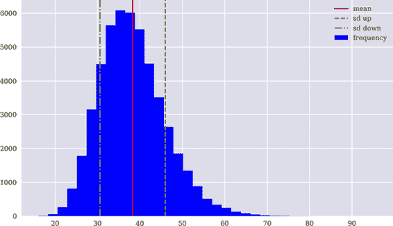
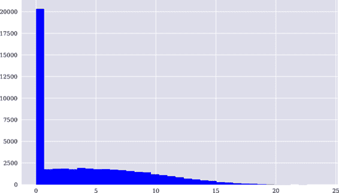

# 第六章。动态经济

> 证券市场的多期模型比单期模型更加真实。事实上，在金融行业中，它们被广泛用于实际目的。
> 
> Stanley Pliska（1997）
> 
> 尽管市场在任何一个时间点上都不完全，但从某种意义上说，它们在动态上是完全的，因为任何消费过程都可以通过交易给定的一组金融证券来融资，随着时间的推移调整投资组合，因为不确定性逐步解决。
> 
> Darrell Duffie（1986）

实际上，量化信息（如股票价格或利率的变化）会随着时间逐渐显露出来。尽管静态模型经济学是引入金融基本概念的一种优雅方式，但现实的金融模型需要对金融世界进行动态表示。

为了正确地建模动态经济，需要更多的形式化工具，这在本章中无法完全详细说明。然而，本章可以介绍基于离散时间动态的两个最重要的动态模型经济：Cox-Ross-Rubinstein（1979）二叉期权定价模型和 Black-Scholes-Merton（1973）期权定价模型的离散蒙特卡罗模拟版本。在这种情况下，“离散时间”意味着相关日期集从仅两个扩展到更大但仍有限的数字，比如说，五个或五十个。

本章使用的工具与以前大致相同：线性代数，概率论，以及像前一章一样的随机元素来实现蒙特卡罗模拟。Duffie（1988）和 Pliska（1997）是离散时间动态金融建模的优秀资源。Glasserman（2004）是金融中蒙特卡罗模拟方法的全面参考书。

本章涵盖的主题包括随机过程，动态完全市场中的期权定价，二叉期权定价，Black-Scholes-Merton（1973）动态模拟，早期行权和美式期权定价，以及最小二乘蒙特卡罗（LSM）期权定价。

下表概述了本章发现的金融、数学和 Python 主题：

| 金融 | 数学 | Python |
| --- | --- | --- |
| 不确定性，基于树结构 | 随机过程，二叉树 | `NumPy`, `ndarray` |
| 不确定性，基于模拟 | 随机过程，蒙特卡罗模拟 | `NumPy`, `ndarray`, `rng.standard_normal` |
| 欧式期权定价 | 内在价值，反向归纳，风险中性期望 | `NumPy`, `ndarray`, `np.maximum` |
| 美式期权定价 | 内在价值，继续价值，OLS 回归，反向归纳，风险中性期望 | `NumPy`, `ndarray`, `np.polyval`, `np.polyfit`, `np.where` |

如同第五章，本章的主要目标是*泛化*。虽然第五章泛化了*状态空间*，本章旨在泛化*时间上的离散的相关点*，这些点在新信息揭示和经济行动发生时。虽然需要一些额外的形式主义来实现这一点，但本章则较少形式化，因为它只专注于两个特定的模型，并不试图为离散时间中的动态经济提供一般框架。这样的一般框架，包括许多 Python 实现的例子，可以在 Hilpisch (2015)中找到。

# 二项式期权定价

1979 年发布后，二项式期权定价模型立即流行起来——既作为计算欧式期权和美式期权的数值高效方法，也作为教学工具。虽然 Black-Scholes-Merton (1973)模型依赖于连续时间金融和随机微积分，但二项式期权定价模型在某种意义上是 BSM 模型的离散时间版本，可以完全通过基础数学理解。

在 Cox-Ross-Rubinstein (1979)模型中，有两种交易金融资产：一种风险的，称为*股票*，一种无风险的，称为*债券*。该模型经济在一个*有限日期集合* <math alttext="script upper T identical-to StartSet t 0 equals 0 comma t 1 comma t 2 comma period period period comma t Subscript upper M Baseline equals upper T EndSet"><mrow><mi>𝒯</mi> <mo>≡</mo> <mo>{</mo> <msub><mi>t</mi> <mn>0</mn></msub> <mo>=</mo> <mn>0</mn> <mo>,</mo> <msub><mi>t</mi> <mn>1</mn></msub> <mo>,</mo> <msub><mi>t</mi> <mn>2</mn></msub> <mo>,</mo> <mo>.</mo> <mo>.</mo> <mo>.</mo> <mo>,</mo> <msub><mi>t</mi> <mi>M</mi></msub> <mo>=</mo> <mi>T</mi> <mo>}</mo></mrow></math> 中进行，其中包含 <math alttext="upper M plus 1 comma upper M greater-than 1"><mrow><mi>M</mi> <mo>+</mo> <mn>1</mn> <mo>,</mo> <mi>M</mi> <mo>></mo> <mn>1</mn></mrow></math> 个元素。

给定股票价格为 <math alttext="upper S Subscript t Sub Subscript i"><msub><mi>S</mi> <msub><mi>t</mi> <mi>i</mi></msub></msub></math> ，股票在下一个日期 <math alttext="upper S Subscript t Sub Subscript i plus 1"><msub><mi>S</mi> <msub><mi>t</mi> <mrow><mi>i</mi><mo>+</mo><mn>1</mn></mrow></msub></msub></math> 只能取两个不同的值：

<math alttext="upper S Subscript t Sub Subscript i plus 1 Baseline equals StartLayout Enlarged left-brace 1st Row  upper S Subscript t Sub Subscript i Baseline dot u 2nd Row  upper S Subscript t Sub Subscript i Baseline dot d EndLayout" display="block"><mrow><msub><mi>S</mi> <msub><mi>t</mi> <mrow><mi>i</mi><mo>+</mo><mn>1</mn></mrow></msub></msub> <mo>=</mo> <mfenced separators="" open="{" close=""><mtable><mtr><mtd columnalign="left"><mrow><msub><mi>S</mi> <msub><mi>t</mi> <mi>i</mi></msub></msub> <mo>·</mo> <mi>u</mi></mrow></mtd></mtr> <mtr><mtd columnalign="left"><mrow><msub><mi>S</mi> <msub><mi>t</mi> <mi>i</mi></msub></msub> <mo>·</mo> <mi>d</mi></mrow></mtd></mtr></mtable></mfenced></mrow></math>

<math alttext="u"><mi>u</mi></math> 代表*向上移动*，<math alttext="d"><mi>d</mi></math> 代表*向下移动*。

为了简化日期处理，假设时间网格均匀分布，长度为 <math alttext="upper M"><mi>M</mi></math> 个时间间隔，每个间隔长度为 <math alttext="normal upper Delta t equals StartFraction upper T Over upper M EndFraction"><mrow><mi>Δ</mi> <mi>t</mi> <mo>=</mo> <mfrac><mi>T</mi> <mi>M</mi></mfrac></mrow></math> 。那么有限的日期集合可以写成 <math alttext="script upper T identical-to StartSet t 0 equals 0 comma t 1 equals normal upper Delta t comma t 2 equals 2 normal upper Delta t comma period period period comma upper T EndSet"><mrow><mi>𝒯</mi> <mo>≡</mo> <mo>{</mo> <msub><mi>t</mi> <mn>0</mn></msub> <mo>=</mo> <mn>0</mn> <mo>,</mo> <msub><mi>t</mi> <mn>1</mn></msub> <mo>=</mo> <mi>Δ</mi> <mi>t</mi> <mo>,</mo> <msub><mi>t</mi> <mn>2</mn></msub> <mo>=</mo> <mn>2</mn> <mi>Δ</mi> <mi>t</mi> <mo>,</mo> <mo>.</mo> <mo>.</mo> <mo>.</mo> <mo>,</mo> <mi>T</mi> <mo>}</mo></mrow></math> 。此外，定义：

<math alttext="StartLayout Enlarged left-brace 1st Row  u identical-to e Superscript sigma StartRoot normal upper Delta t EndRoot Baseline 2nd Row  d identical-to e Superscript minus sigma StartRoot normal upper Delta t EndRoot Baseline equals u Superscript negative 1 EndLayout" display="block"><mfenced separators="" open="{" close=""><mtable><mtr><mtd columnalign="left"><mrow><mi>u</mi> <mo>≡</mo> <msup><mi>e</mi> <mrow><mi>σ</mi><msqrt><mrow><mi>Δ</mi><mi>t</mi></mrow></msqrt></mrow></msup></mrow></mtd></mtr> <mtr><mtd columnalign="left"><mrow><mi>d</mi> <mo>≡</mo> <msup><mi>e</mi> <mrow><mo>-</mo><mi>σ</mi><msqrt><mrow><mi>Δ</mi><mi>t</mi></mrow></msqrt></mrow></msup> <mo>=</mo> <msup><mi>u</mi> <mrow><mo>-</mo><mn>1</mn></mrow></msup></mrow></mtd></mtr></mtable></mfenced></math>

结果表明，这一定义的一个后果是性质 <math alttext="u dot d equals 1"><mrow><mi>u</mi> <mo>·</mo> <mi>d</mi> <mo>=</mo> <mn>1</mn></mrow></math> ，这在创建所谓的*可重组*二项树时非常方便。 <math><mrow><mi>σ</mi><mo>∈</mo><msub><mi>ℝ</mi> <mrow><mn>>0</mn></mrow></msub></mrow></math> 表示常数*波动率因子*。

假设无风险、恒定的短期利率由 <math><mrow><mi>r</mi><mo>∈</mo><msub><mi>ℝ</mi> <mrow><mn>≥0</mn></mrow></msub></mrow></math> 给定。给定债券价格为 <math alttext="upper B Subscript t Sub Subscript i"><msub><mi>B</mi> <msub><mi>t</mi> <mi>i</mi></msub></msub></math> ，则债券在一期后的价格为

<math alttext="upper B Subscript t Sub Subscript i plus 1 Baseline equals upper B Subscript t Sub Subscript i Baseline dot e Superscript r dot left-parenthesis t Super Subscript i plus 1 Superscript minus t Super Subscript i Superscript right-parenthesis" display="block"><mrow><msub><mi>B</mi> <msub><mi>t</mi> <mrow><mi>i</mi><mo>+</mo><mn>1</mn></mrow></msub></msub> <mo>=</mo> <msub><mi>B</mi> <msub><mi>t</mi> <mi>i</mi></msub></msub> <mo>·</mo> <msup><mi>e</mi> <mrow><mi>r</mi><mo>·</mo><mo>(</mo><msub><mi>t</mi> <mrow><mi>i</mi><mo>+</mo><mn>1</mn></mrow></msub> <mo>-</mo><msub><mi>t</mi> <mi>i</mi></msub> <mo>)</mo></mrow></msup></mrow></math>

或者

<math alttext="upper B Subscript t plus normal upper Delta t Baseline equals upper B Subscript t Baseline dot e Superscript r dot normal upper Delta t" display="block"><mrow><msub><mi>B</mi> <mrow><mi>t</mi><mo>+</mo><mi>Δ</mi><mi>t</mi></mrow></msub> <mo>=</mo> <msub><mi>B</mi> <mi>t</mi></msub> <mo>·</mo> <msup><mi>e</mi> <mrow><mi>r</mi><mo>·</mo><mi>Δ</mi><mi>t</mi></mrow></msup></mrow></math>

对于一些 <math alttext="t element-of script upper T minus upper T"><mrow><mi>t</mi> <mo>∈</mo> <mi>𝒯</mi> <mo>∖</mo> <mi>T</mi></mrow></math> 。

基于上述假设推导出的一个重要数值参数是任何给定节点上向上移动的鞅概率。鉴于每个节点只有两个分支，向下概率也因此被确定。用 <math><mrow><mi>q</mi><mo>∈</mo><msub><mi>ℝ</mi> <mrow><mn>>0</mn></mrow></msub> <mo>,</mo><mn>0</mn><mo><</mo><mi>q</mi><mo><</mo><mn>1</mn></mrow></math> 表示*鞅概率*向上移动。从股票价格的鞅性质可以得出：

<math alttext="StartLayout 1st Row 1st Column upper S Subscript t 2nd Column equals 3rd Column e Superscript minus r normal upper Delta t Baseline bold upper E Superscript upper Q Baseline left-parenthesis upper S Subscript t plus normal upper Delta t Baseline right-parenthesis 2nd Row 1st Column Blank 2nd Column equals 3rd Column e Superscript minus r normal upper Delta t Baseline left-parenthesis q upper S Subscript t Baseline u plus left-parenthesis 1 minus q right-parenthesis upper S Subscript t Baseline d right-parenthesis 3rd Row 1st Column 1 2nd Column equals 3rd Column e Superscript minus r normal upper Delta t Baseline left-parenthesis q u plus left-parenthesis 1 minus q right-parenthesis d right-parenthesis 4th Row 1st Column q 2nd Column equals 3rd Column StartFraction e Superscript r normal upper Delta t Baseline minus d Over u minus d EndFraction EndLayout" display="block"><mtable><mtr><mtd><msub><mi>S</mi> <mi>t</mi></msub></mtd> <mtd><mo>=</mo></mtd> <mtd><mrow><msup><mi>e</mi> <mrow><mo>-</mo><mi>r</mi><mi>Δ</mi><mi>t</mi></mrow></msup> <msup><mi>𝐄</mi> <mi>Q</mi></msup> <mrow><mo>(</mo> <msub><mi>S</mi> <mrow><mi>t</mi><mo>+</mo><mi>Δ</mi><mi>t</mi></mrow></msub> <mo>)</mo></mrow></mrow></mtd></mtr> <mtr><mtd><mo>=</mo></mtd> <mtd><mrow><msup><mi>e</mi> <mrow><mo>-</mo><mi>r</mi><mi>Δ</mi><mi>t</mi></mrow></msup> <mfenced separators="" open="(" close=")"><mi>q</mi> <msub><mi>S</mi> <mi>t</mi></msub> <mi>u</mi> <mo>+</mo> <mrow><mo>(</mo> <mn>1</mn> <mo>-</mo> <mi>q</mi> <mo>)</mo></mrow> <msub><mi>S</mi> <mi>t</mi></msub> <mi>d</mi></mfenced></mrow></mtd></mtr> <mtr><mtd><mrow><mo>⇔</mo> <mn>1</mn></mrow></mtd> <mtd><mo>=</mo></mtd> <mtd><mrow><msup><mi>e</mi> <mrow><mo>-</mo><mi>r</mi><mi>Δ</mi><mi>t</mi></mrow></msup> <mfenced separators="" open="(" close=")"><mi>q</mi> <mi>u</mi> <mo>+</mo> <mo>(</mo> <mn>1</mn> <mo>-</mo> <mi>q</mi> <mo>)</mo> <mi>d</mi></mfenced></mrow></mtd></mtr> <mtr><mtd><mrow><mo>⇔</mo> <mi>q</mi></mrow></mtd> <mtd><mo>=</mo></mtd> <mtd><mfrac><mrow><msup><mi>e</mi> <mrow><mi>r</mi><mi>Δ</mi><mi>t</mi></mrow></msup> <mo>-</mo><mi>d</mi></mrow> <mrow><mi>u</mi><mo>-</mo><mi>d</mi></mrow></mfrac></mtd></mtr></mtable></math>

这表明鞅测度在每个节点以及整个树上都是固定的。

二项期权定价模型的基础很容易转化为 Python 代码：¹

```py
In [1]: import math
        import numpy as np

In [2]: S0 = 36.  
        K = 40.  
        r = 0.06  
        T = 1.0  
        sigma = 0.2  

In [3]: m = 4  
        dt = T / m  
        df = math.exp(-r * dt)  
        up = math.exp(sigma * math.sqrt(dt))  
        down = 1 / up  

In [4]: q = (1 / df - down) / (up - down)  
```


初始股票价格值。


期权的行使价格。


常数无风险短期利率。


时间跨度和期权到期时间。


恒定波动率因子。


时间间隔的数量。


每个时间间隔的结果长度。


固定时间间隔的折现因子。


上涨和下跌因子。


上涨移动的马丁格尔概率。

该模型中股票价格过程的模拟和期权估值稍微复杂。以下展示了两种不同的实现方式：一种基于*Python 循环*，可能更容易理解；另一种基于*向量化的`NumPy`代码*，更为简洁高效，但一开始可能更难理解。

## 基于 Python 循环的模拟和估值

即使本小节的实现使用了 Python 循环，基本数据结构是`NumPy`的`ndarray`对象：

```py
In [5]: S = np.zeros((m + 1, m + 1))  
        S  
Out[5]: array([[0., 0., 0., 0., 0.],
               [0., 0., 0., 0., 0.],
               [0., 0., 0., 0., 0.],
               [0., 0., 0., 0., 0.],
               [0., 0., 0., 0., 0.]])

In [6]: S[0, 0] = S0  
        S  
Out[6]: array([[36.,  0.,  0.,  0.,  0.],
               [ 0.,  0.,  0.,  0.,  0.],
               [ 0.,  0.,  0.,  0.,  0.],
               [ 0.,  0.,  0.,  0.,  0.],
               [ 0.,  0.,  0.,  0.,  0.]])

In [7]: z = 1  
        for t in range(1, m + 1):  
            for i in range(0, z):  
                S[i, t] = S[i, t - 1] * up  
                S[i + 1 ,t] = S[i, t - 1] * down  
            z += 1  

In [8]: np.set_printoptions(formatter=
                {'float_kind': lambda x: '%7.3f' % x})

In [9]: S  
Out[9]: array([[ 36.000,  39.786,  43.970,  48.595,  53.706],
               [  0.000,  32.574,  36.000,  39.786,  43.970],
               [  0.000,   0.000,  29.474,  32.574,  36.000],
               [  0.000,   0.000,   0.000,  26.669,  29.474],
               [  0.000,   0.000,   0.000,   0.000,  24.132]])
```


初始化`ndarray`对象。


设置左上角的初始股票价格值。


将计数器`z`设为 1。


从`1`到`m+1`迭代，即从 0 后的所有时间步。


迭代给定时间步骤的相关节点。


计算上涨和下跌值，并在`ndarray`对象中设置它们。


将计数器增加 1 以包括下一步中更多相关节点。


结果的再组合二项树。

### 欧式期权定价

根据可用股票价格过程对欧式期权进行估值是通过计算期权在到期时的内在价值，并应用*反向归纳*来实现的。这基本上意味着从末尾开始，逐步向前移动到现在，在每个节点重复应用风险中性定价范式，正如在第二章中介绍的简单静态双状态经济中。

以下 Python 代码假设欧式看跌期权的支付：

```py
In [10]: h = np.zeros_like(S)  

In [11]: z = 1
         for t in range(0, m + 1):
             for i in range(0, z):
                 h[i, t] = max(K - S[i, t], 0)  
             z += 1

In [12]: h  
Out[12]: array([[  4.000,   0.214,   0.000,   0.000,   0.000],
                [  0.000,   7.426,   4.000,   0.214,   0.000],
                [  0.000,   0.000,  10.526,   7.426,   4.000],
                [  0.000,   0.000,   0.000,  13.331,  10.526],
                [  0.000,   0.000,   0.000,   0.000,  15.868]])

In [13]: V = np.zeros_like(S)
         V[:, -1] = h[:, -1]
         V
Out[13]: array([[  0.000,   0.000,   0.000,   0.000,   0.000],
                [  0.000,   0.000,   0.000,   0.000,   0.000],
                [  0.000,   0.000,   0.000,   0.000,   4.000],
                [  0.000,   0.000,   0.000,   0.000,  10.526],
                [  0.000,   0.000,   0.000,   0.000,  15.868]])

In [14]: m
Out[14]: 4

In [15]: # European option pricing
         z = 0
         for t in range(m - 1, -1, -1):
             for i in range(0, m - z):
                 V[i, t] = df * (q * V[i, t + 1] +
                             (1-q) * V[i + 1, t + 1])  
             z += 1

In [16]: V  
Out[16]: array([[  3.977,   2.190,   0.784,   0.000,   0.000],
                [  0.000,   6.299,   3.985,   1.771,   0.000],
                [  0.000,   0.000,   9.344,   6.830,   4.000],
                [  0.000,   0.000,   0.000,  12.735,  10.526],
                [  0.000,   0.000,   0.000,   0.000,  15.868]])

In [17]: V[0, 0]  
Out[17]: 3.9771456941187893
```


内部值的`ndarray`对象。


这计算了相关节点的内在价值。


通过应用风险中性定价进行节点估值。


结果的现值二项树。


欧式看跌期权的现值。

### 美式期权定价

二项式期权定价模型的主要特点之一是美式期权与其欧式对应物一样容易估值。*美式期权*可以在到期日之前的任何时间行使。向后估值算法需要进行的调整很简单：只需检查美式期权在任何给定节点的内在价值是否高于继续价值，即不行使期权的现值。如果是这样，则行使该期权，并将美式期权的价值设置为内在价值。形式上，可以得到

<math alttext="upper V Subscript t Baseline equals max left-bracket h Subscript t Baseline comma e Superscript minus r normal upper Delta t Baseline bold upper E Superscript upper Q Baseline left-parenthesis upper V Subscript t plus normal upper Delta t Baseline right-parenthesis right-bracket" display="block"><mrow><msub><mi>V</mi> <mi>t</mi></msub> <mo>=</mo> <mo movablelimits="true" form="prefix">max</mo> <mfenced separators="" open="[" close="]"><msub><mi>h</mi> <mi>t</mi></msub> <mo>,</mo> <msup><mi>e</mi> <mrow><mo>-</mo><mi>r</mi><mi>Δ</mi><mi>t</mi></mrow></msup> <msup><mi>𝐄</mi> <mi>Q</mi></msup> <mrow><mo>(</mo> <msub><mi>V</mi> <mrow><mi>t</mi><mo>+</mo><mi>Δ</mi><mi>t</mi></mrow></msub> <mo>)</mo></mrow></mfenced></mrow></math>

其中<math alttext="h Subscript t"><msub><mi>h</mi> <mi>t</mi></msub></math>是时间<math alttext="t"><mi>t</mi></math>的内在价值，而<math alttext="e Superscript minus r normal upper Delta t Baseline bold upper E Superscript upper Q Baseline left-parenthesis upper V Subscript t plus normal upper Delta t Baseline right-parenthesis"><mrow><msup><mi>e</mi> <mrow><mo>-</mo><mi>r</mi><mi>Δ</mi><mi>t</mi></mrow></msup> <msup><mi>𝐄</mi> <mi>Q</mi></msup> <mrow><mo>(</mo> <msub><mi>V</mi> <mrow><mi>t</mi><mo>+</mo><mi>Δ</mi><mi>t</mi></mrow></msub> <mo>)</mo></mrow></mrow></math>是继续价值。

在 Python 中，只需添加一行代码：

```py
In [18]: # American option pricing
         z = 0
         for t in range(m - 1, -1, -1):
             for i in range(0, m-z):
                 V[i, t] = df * (q * V[i, t + 1] +
                           (1 - q) * V[i + 1, t + 1])
                 V[i, t] = max(h[i, t], V[i, t])  
             z += 1

In [19]: V  
Out[19]: array([[  4.540,   2.307,   0.784,   0.000,   0.000],
                [  0.000,   7.426,   4.249,   1.771,   0.000],
                [  0.000,   0.000,  10.526,   7.426,   4.000],
                [  0.000,   0.000,   0.000,  13.331,  10.526],
                [  0.000,   0.000,   0.000,   0.000,  15.868]])

In [20]: V[0, 0]  
Out[20]: 4.539560595224299
```


此行检查是否应提前行权，并在内在价值高于继续价值时将内在价值作为美式期权价值。


美式看跌期权现值的结果二项树。


今天的美式看跌期权现值显著高于不提前行权时的价值。

## 基于向量化代码的模拟和估值

随后的算法实现系统地利用了`NumPy`的向量化能力。该实现逐步呈现，还包括一些示例性代码行，这些行不是算法实现本身所需的：

```py
In [21]: u = np.arange(m + 1)  
         u  
Out[21]: array([0, 1, 2, 3, 4])

In [22]: u ** 2  
Out[22]: array([ 0,  1,  4,  9, 16])

In [23]: 2 ** u  
Out[23]: array([ 1,  2,  4,  8, 16])

In [24]: u = np.resize(u, (m + 1, m + 1))  
         u
Out[24]: array([[0, 1, 2, 3, 4],
                [0, 1, 2, 3, 4],
                [0, 1, 2, 3, 4],
                [0, 1, 2, 3, 4],
                [0, 1, 2, 3, 4]])

In [25]: d = u.T  
         d  
Out[25]: array([[0, 0, 0, 0, 0],
                [1, 1, 1, 1, 1],
                [2, 2, 2, 2, 2],
                [3, 3, 3, 3, 3],
                [4, 4, 4, 4, 4]])

In [26]: (u - 2 * d)  
Out[26]: array([[ 0,  1,  2,  3,  4],
                [-2, -1,  0,  1,  2],
                [-4, -3, -2, -1,  0],
                [-6, -5, -4, -3, -2],
                [-8, -7, -6, -5, -4]])
```


为从`0`到`m`的向上运动次数创建`ndarray`对象。


使用向量化操作计算向量的平方。


使用`u`对象作为向量指数计算 2 的幂。


将`u`对象从一维调整为二维。现在每行中存储向上运动的次数。


转置`u`对象以获得二维`ndarray`对象`d`，其中每列中的下降运动次数。


将`u`和`d`对象组合起来，得到向上和向下移动的净数目。例如，`+2`表示“比向下移动多两次向上移动”或`-1`表示“比向上移动少一次向下移动”。²

配备有包含二叉树中净移动次数的矩阵，股票价格过程的仿真归结为单行代码：

```py
In [27]: S = S0 * np.exp(sigma * math.sqrt(dt) * (u - 2 * d))  
         S  
Out[27]: array([[ 36.000,  39.786,  43.970,  48.595,  53.706],
                [ 29.474,  32.574,  36.000,  39.786,  43.970],
                [ 24.132,  26.669,  29.474,  32.574,  36.000],
                [ 19.757,  21.835,  24.132,  26.669,  29.474],
                [ 16.176,  17.877,  19.757,  21.835,  24.132]])
```


股票价格过程的向量化仿真（二叉树）。


与之前一样，只有对角线及以上的数字才相关。

对欧式和美式看跌期权的估值在某种程度上也进行了向量化。仅需对时间步长进行一次循环：

```py
In [28]: h = np.maximum(K - S, 0)  
         h  
Out[28]: array([[  4.000,   0.214,   0.000,   0.000,   0.000],
                [ 10.526,   7.426,   4.000,   0.214,   0.000],
                [ 15.868,  13.331,  10.526,   7.426,   4.000],
                [ 20.243,  18.165,  15.868,  13.331,  10.526],
                [ 23.824,  22.123,  20.243,  18.165,  15.868]])

In [29]: V = h.copy()  

In [30]: # European option pricing
         for t in range(m - 1, -1, -1):  
             V[0:-1, t] = df * (q * V[:-1, t + 1] +
                            (1-q) * V[1:, t + 1])  

In [31]: V[0, 0]  
Out[31]: 3.977145694118792

In [32]: # American option pricing
         for t in range(m - 1, -1, -1):  
             V[0:-1, t] = df * (q * V[:-1, t + 1] +
                            (1-q) * V[1:, t + 1])  
             V[:, t] = np.maximum(h[:, t], V[:, t])  

In [33]: V
Out[33]: array([[  4.540,   2.307,   0.784,   0.000,   0.000],
                [ 10.526,   7.426,   4.249,   1.771,   0.000],
                [ 15.868,  13.331,  10.526,   7.426,   4.000],
                [ 20.243,  18.165,  15.868,  13.331,  10.526],
                [ 23.824,  22.123,  20.243,  18.165,  15.868]])

In [34]: V[0, 0]  
Out[34]: 4.5395605952243
```


此次完全向量化的看跌期权内在价值的计算。


与之前一样，只有对角线及以上的数字才相关。


创建`h`对象的副本。


部分向量化的欧式看跌期权估值算法。


欧式看跌期权的现值。


部分向量化的美式看跌期权估值算法。


美式看跌期权的现值。

# 欧美期权

Cox、Ross 和 Rubinstein（1979）的（再组合）二叉期权定价模型之美不仅在于其简单性，还在于其能够高效且精确地对欧式期权和美式期权进行估值的事实。在极限情况下，时间步长无限小，该模型收敛于 Black-Scholes-Merton（1973）模型，这是另一个优点。

## 速度比较

向量化代码不仅使 Python 代码更简洁，而且通常可以显著提高速度。以下代码片段实现了前述算法，用于基于更大、更现实的时间步长进行速度比较。首先，需要调整基本数值参数：

```py
In [35]: m = 500  
         dt = T / m
         df = math.exp(-r * dt)
         up = math.exp(sigma * math.sqrt(dt))
         down = 1 / up
         q = (1 / df - down) / (up - down)
         q
Out[35]: 0.5044724639230862
```


将时间间隔增加到一个现实水平，得出相当精确的数值期权价值。

函数`binomial_looping()`集成了对美式看跌期权的仿真和估值算法的*基于循环的实现*的所有要素：

```py
In [36]: def binomial_looping():
             # stock price simulation in binomial tree
             S = np.zeros((m + 1, m + 1))
             S[0, 0] = S0
             z = 1
             for t in range(1, m + 1):
                 for i in range(0, z):
                     S[i, t] = S[i, t - 1] * up
                     S[i + 1 ,t] = S[i, t - 1] * down
                 z += 1
             # inner value calculation
             h = np.zeros_like(S)
             z = 1
             for t in range(0, m + 1):
                 for i in range(0, z):
                     h[i, t] = max(K - S[i, t], 0)
                 z += 1
             # American option pricing
             V = np.zeros_like(S)
             V[:, -1] = h[:, -1]
             z = 0
             for t in range(m - 1, -1, -1):
                 for i in range(0, m - z):
                     V[i, t] = df * (q * V[i, t + 1] +
                               (1 - q) * V[i + 1, t + 1])
                     V[i, t] = max(h[i, t], V[i, t])
                 z += 1
             return V[0, 0]
```

作者电脑上执行速度不到 200 毫秒：

```py
In [37]: %time binomial_looping()
         CPU times: user 190 ms, sys: 4.69 ms, total: 194 ms
         Wall time: 190 ms

Out[37]: 4.486374777505983

In [38]: %timeit binomial_looping()
         173 ms ± 2.48 ms per loop (mean ± std. dev. of 7 runs, 10 loops each)
```

函数`binomial_vectorization()`集成了对美式看跌期权的仿真和估值算法的*向量化实现*的所有要素：

```py
In [39]: def binomial_vectorization():
             u = np.arange(m + 1)
             u = np.resize(u, (m + 1, m + 1))
             d = u.T
             # stock price simulation
             S = S0 * np.exp(sigma * math.sqrt(dt) * (u - 2 * d))
             # inner value calculation
             h = np.maximum(K - S, 0)
             # American option pricing
             V = h.copy()
             for t in range(m-1, -1, -1):
                 V[0:-1, t] = df * (q * V[:-1, t + 1] +
                                (1-q) * V[1:, t + 1])
                 V[:, t] = np.maximum(h[:, t], V[:, t])
             return V[0, 0]
```

这种实现比基于循环的实现快约 40 倍，这充分展示了向量化实现方法在性能改进方面的强大力量：

```py
In [40]: %time binomial_vectorization()
         CPU times: user 4.67 ms, sys: 2.39 ms, total: 7.07 ms
         Wall time: 8.73 ms

Out[40]: 4.486374777506075

In [41]: %timeit binomial_vectorization()
         4.7 ms ± 252 µs per loop (mean ± std. dev. of 7 runs, 100 loops each)
```

# 基础设施和性能

所有这里报告的绝对时间都取决于所使用的硬件和软件配置。例如，您可以在 Intel 处理器系统上使用`NumPy`与[英特尔数学核心库（MKL）](https://oreil.ly/dWyk9)的组合。这种组合可以显著加快数值运算速度。在不同基础设施上，相对时间和加速比应大致相似。

# Black-Scholes-Merton 期权定价

Black-Scholes-Merton（1973 年）模型的静态仿真版本用于期权定价，在第五章中进行了讨论。本节介绍了他们开创性的期权定价模型的*动态仿真版本*。有关该模型的更多背景信息，请参阅第五章。

Black-Scholes-Merton（1973 年）经济的随机微分方程如下

<math alttext="d upper S Subscript t Baseline equals r upper S Subscript t Baseline d t plus sigma upper S Subscript t Baseline d upper Z Subscript t" display="block"><mrow><mi>d</mi> <msub><mi>S</mi> <mi>t</mi></msub> <mo>=</mo> <mi>r</mi> <msub><mi>S</mi> <mi>t</mi></msub> <mi>d</mi> <mi>t</mi> <mo>+</mo> <mi>σ</mi> <msub><mi>S</mi> <mi>t</mi></msub> <mi>d</mi> <msub><mi>Z</mi> <mi>t</mi></msub></mrow></math>

在时间<math><mrow><msub><mi>t</mi> <mi>t</mi></msub> <mo>∈</mo><msub><mi>ℝ</mi> <mrow><mn>>0</mn></mrow></msub></mrow></math>处的股票价格，其中<math><mrow><mi>r</mi><mo>∈</mo><msub><mi>ℝ</mi> <mrow><mn>≥0</mn></mrow></msub></mrow></math>是恒定的短期利率，<math><mrow><mi>σ</mi><mo>∈</mo><msub><mi>ℝ</mi> <mrow><mn>>0</mn></mrow></msub></mrow></math>是恒定的波动率因子，<math alttext="upper Z Subscript t"><msub><mi>Z</mi> <mi>t</mi></msub></math>是算术布朗运动（参见 Glasserman（2004 年，第三章）和 Hilpisch（2018 年，第十二章））。

## 蒙特卡洛模拟股价路径

假设时间<math alttext="script upper T identical-to StartSet t 0 equals 0 comma t 1 comma t 2 comma period period period comma t Subscript upper M Baseline equals upper T EndSet"><mrow><mi>𝒯</mi> <mo>≡</mo> <mo>{</mo> <msub><mi>t</mi> <mn>0</mn></msub> <mo>=</mo> <mn>0</mn> <mo>,</mo> <msub><mi>t</mi> <mn>1</mn></msub> <mo>,</mo> <msub><mi>t</mi> <mn>2</mn></msub> <mo>,</mo> <mo>.</mo> <mo>.</mo> <mo>.</mo> <mo>,</mo> <msub><mi>t</mi> <mi>M</mi></msub> <mo>=</mo> <mi>T</mi> <mo>}</mo></mrow></math>中有限的相关点，具有<math alttext="upper M plus 1 comma upper M greater-than 1"><mrow><mi>M</mi> <mo>+</mo> <mn>1</mn> <mo>,</mo> <mi>M</mi> <mo>></mo> <mn>1</mn></mrow></math>，以及固定的时间间隔长度<math alttext="normal upper Delta t"><mrow><mi>Δ</mi> <mi>t</mi></mrow></math>。给定前一股票价格<math alttext="upper S Subscript t minus normal upper Delta t"><msub><mi>S</mi> <mrow><mi>t</mi><mo>-</mo><mi>Δ</mi><mi>t</mi></mrow></msub></math>，则股票价格<math alttext="upper S Subscript t Baseline comma 0 less-than t less-than-or-equal-to upper T"><mrow><msub><mi>S</mi> <mi>t</mi></msub> <mo>,</mo> <mn>0</mn> <mo><</mo> <mi>t</mi> <mo>≤</mo> <mi>T</mi></mrow></math>可以按照差分方程进行模拟。

<math alttext="upper S Subscript t Baseline equals upper S Subscript t minus normal upper Delta t Baseline dot exp left-parenthesis left-parenthesis r minus StartFraction sigma squared Over 2 EndFraction right-parenthesis normal upper Delta t plus sigma StartRoot normal upper Delta t EndRoot z right-parenthesis" display="block"><mrow><msub><mi>S</mi> <mi>t</mi></msub> <mo>=</mo> <msub><mi>S</mi> <mrow><mi>t</mi><mo>-</mo><mi>Δ</mi><mi>t</mi></mrow></msub> <mo>·</mo> <mo form="prefix">exp</mo> <mfenced separators="" open="(" close=")"><mfenced separators="" open="(" close=")"><mi>r</mi> <mo>-</mo> <mfrac><msup><mi>σ</mi> <mn>2</mn></msup> <mn>2</mn></mfrac></mfenced> <mi>Δ</mi> <mi>t</mi> <mo>+</mo> <mi>σ</mi> <msqrt><mrow><mi>Δ</mi> <mi>t</mi></mrow></msqrt> <mi>z</mi></mfenced></mrow></math>

其中<math alttext="z"><mi>z</mi></math>是标准正态分布的随机变量。这种方案称为*欧拉离散化*。已知它能确保随着<math alttext="normal upper Delta t"><mrow><mi>Δ</mi> <mi>t</mi></mrow></math>趋于 0，离散时间过程收敛于连续时间过程。

动态蒙特卡洛模拟在静态模拟的背景知识支持下（参见第五章）在 Python 中易于实现。图 6-1 显示了 10 条模拟股价路径：

```py
In [43]: S0 = 36.  
         K = 40.  
         r = 0.06  
         T = 1.0  
         sigma = 0.2  

In [44]: M = 100  
         I = 50000  

In [45]: dt = T / M  
         dt  
Out[45]: 0.01

In [46]: df = math.exp(-r * dt)  
         df  
Out[46]: 0.9994001799640054

In [47]: from numpy.random import default_rng
         rng = default_rng(100)

In [48]: rn = rng.standard_normal((M + 1, I))  
         rn 
Out[48]: array([[ -1.160,   0.290,   0.780, ...,   1.890,   0.050,  -0.760],
                [  0.460,  -1.400,   0.140, ...,  -1.350,   0.150,  -0.530],
                [  0.200,  -0.040,  -0.730, ...,   2.140,   0.170,  -0.340],
                ...,
                [ -0.220,  -1.310,   0.730, ...,  -0.820,  -0.600,  -0.400],
                [ -2.130,  -1.240,   0.580, ...,   0.960,   0.890,   0.780],
                [  2.130,  -0.410,   0.710, ...,   1.190,   0.100,  -0.520]])

In [49]: S = np.zeros_like(rn)  
         S[0] = S0  
         S  
Out[49]: array([[ 36.000,  36.000,  36.000, ...,  36.000,  36.000,  36.000],
                [  0.000,   0.000,   0.000, ...,   0.000,   0.000,   0.000],
                [  0.000,   0.000,   0.000, ...,   0.000,   0.000,   0.000],
                ...,
                [  0.000,   0.000,   0.000, ...,   0.000,   0.000,   0.000],
                [  0.000,   0.000,   0.000, ...,   0.000,   0.000,   0.000],
                [  0.000,   0.000,   0.000, ...,   0.000,   0.000,   0.000]])

In [50]: for t in range(1, M + 1):
             S[t] = S[t - 1] * np.exp((r - sigma ** 2 / 2) * dt +
                                    sigma * math.sqrt(dt) * rn[t])  

In [51]: S  
Out[51]: array([[ 36.000,  36.000,  36.000, ...,  36.000,  36.000,  36.000],
                [ 36.349,  35.023,  36.114, ...,  35.056,  36.119,  35.633],
                [ 36.508,  35.009,  35.602, ...,  36.601,  36.259,  35.402],
                ...,
                [ 42.689,  39.760,  40.681, ...,  37.516,  47.893,  42.846],
                [ 40.921,  38.804,  41.175, ...,  38.260,  48.769,  43.534],
                [ 42.716,  38.499,  41.782, ...,  39.200,  48.884,  43.103]])

In [52]: from pylab import mpl, plt
         plt.style.use('seaborn')
         mpl.rcParams['font.family'] = 'serif'
         mpl.rcParams['savefig.dpi'] = 300

In [53]: plt.figure(figsize=(10, 6))
         plt.plot(S[:, :10]);  
```


金融参数与之前相同。


这些是蒙特卡洛模拟的参数（路径、时间步长、时间间隔长度、单个时间间隔的折现因子）。


生成了一个适当大小的标准正态分布随机数的二维`ndarray`对象。


另一个相同形状的二维`ndarray`对象被实例化，并设置了单只股票价格路径的初始值。


基于初始股票价格、随机数矩阵和几何布朗运动的差分方程，模拟了单只股票价格路径。


绘制前 10 条模拟路径。


###### 图 6-1\. Black-Scholes-Merton（1973 年）模拟股价路径

与静态情况一样，股票期末价值可以以直方图形式可视化（参见 图 6-2）：

```py
In [54]: ST = S[-1]
         plt.figure(figsize=(10, 6))
         plt.hist(ST, bins=35, color='b', label='frequency');
         plt.axvline(ST.mean(), color='r', label='mean')
         plt.axvline(ST.mean() + ST.std(), ls='--', color='y', label='sd up')
         plt.axvline(ST.mean() - ST.std(), ls='-.', color='y', label='sd down')
         plt.legend(loc=0);
In [55]: S0 * math.exp(r * T)  
Out[55]: 38.22611567563295

In [56]: ST.mean()  
Out[56]: 38.25248936738523
```


数学期望值为 <math alttext="upper S Subscript upper T"><msub><mi>S</mi> <mi>T</mi></msub></math> 。


所有模拟值 `ST` 的平均值。



###### 图 6-2\. Black-Scholes-Merton (1973) 模型模拟期末股票价格频率分布

## 欧式看跌期权的蒙特卡洛估值

欧式看跌期权价格的蒙特卡洛估计量是

<math alttext="upper P 0 equals e Superscript minus r upper T Baseline StartFraction 1 Over upper I EndFraction sigma-summation Underscript i equals 1 Overscript upper I Endscripts max left-parenthesis upper K minus upper S Subscript upper T Baseline left-parenthesis i right-parenthesis comma 0 right-parenthesis" display="block"><mrow><msub><mi>P</mi> <mn>0</mn></msub> <mo>=</mo> <msup><mi>e</mi> <mrow><mo>-</mo><mi>r</mi><mi>T</mi></mrow></msup> <mfrac><mn>1</mn> <mi>I</mi></mfrac> <munderover><mo>∑</mo> <mrow><mi>i</mi><mo>=</mo><mn>1</mn></mrow> <mi>I</mi></munderover> <mo movablelimits="true" form="prefix">max</mo> <mrow><mo>(</mo> <mi>K</mi> <mo>-</mo> <msub><mi>S</mi> <mi>T</mi></msub> <mrow><mo>(</mo> <mi>i</mi> <mo>)</mo></mrow> <mo>,</mo> <mn>0</mn> <mo>)</mo></mrow></mrow></math>

其中 <math alttext="upper I"><mi>I</mi></math> 是模拟价格路径的数量。在这种背景下，欧式看跌期权定价仅涉及几行 Python 代码，仅需给定模拟股价路径。图 6-3 显示了到期内在价值的模拟直方图：

```py
In [57]: h = np.maximum(K - ST, 0)  
         h  
Out[57]: array([  0.000,   1.501,   0.000, ...,   0.800,   0.000,   0.000])

In [58]: plt.figure(figsize=(10, 6))
         plt.hist(h, color='b', bins=35);  
In [59]: math.exp(-r * T) * h.mean()  
Out[59]: 3.818117261795047
```


以向量化方式计算内在价值。


绘制了到期内在价值的频率分布，说明典型的期权高度不对称回报。


计算所有内在价值的平均值并对其现值折现。



###### 图 6-3\. 欧式看跌期权到期内在价值模拟频率分布

## 美式看跌期权的蒙特卡洛估值

基于蒙特卡洛模拟的美式（看跌）期权定价稍显复杂。在这方面最流行的算法是 Longstaff 和 Schwartz (2001) 的*最小二乘蒙特卡洛*（LSM）算法，因为在数值和计算角度上相对简单高效。本章的范围不允许深入讨论，但可以呈现一种简明扼要、高度向量化的 Python 实现。有关应用于 Black-Scholes-Merton (1973) 模型经济学的 LSM 算法的详细处理，包括 Python 代码，请参阅 Hilpisch (2015, 第七章)。

下面的 Python 代码实现了 LSM 算法用于美式期权定价：

```py
In [60]: h = np.maximum(K - S, 0)  

In [61]: # Least-Squares Monte Carlo Valuation (LSM algorithm)
         V = h[-1]  
         for t in range(M - 1, 0, -1):  
             reg = np.polyfit(S[t], df * V, deg=5)  
             C = np.polyval(reg, S[t])  
             V = np.where(h[t] > C, h[t], df * V)  

In [62]: df * V.mean()  
Out[62]: 4.454837750511421
```


计算完整股价路径 `ndarray` 对象的内在价值。


将初始模拟的美式期权价格值设定为到期内在价值。


该算法还基于反向归纳法，从 <math alttext="upper T minus normal upper Delta t"><mrow><mi>T</mi> <mo>-</mo> <mi>Δ</mi> <mi>t</mi></mrow></math> 开始，并在 <math alttext="normal upper Delta t"><mrow><mi>Δ</mi> <mi>t</mi></mrow></math> 处停止。


这是算法的核心步骤，在此步骤中，根据当前模拟期权价值对股价水平进行 OLS 回归，估计（近似）继续价值。


如果内在价值高于估计（近似）的继续价值，就进行行权，否则不行权。


当前值被计算为基于 LSM 算法导出的在<math alttext="t equals normal upper Delta t"><mrow><mi>t</mi> <mo>=</mo> <mi>Δ</mi> <mi>t</mi></mrow></math>时刻的美式期权价格向量的平均值，并对剩余的时间间隔到当前<math alttext="t equals 0"><mrow><mi>t</mi> <mo>=</mo> <mn>0</mn></mrow></math>进行折现。

# 提前行权和蒙特卡洛模拟

直到 1990 年代末，基于蒙特卡洛模拟的具有提前行权特征的期权和衍生产品的有效定价一直是一个主要未解决的问题。直到 2000 年初，研究人员才能够提出在模拟环境中处理提前行权的计算有效算法。在科学和金融中，一旦有了这样的算法——比如 LSM 算法——实现和应用几乎显得相当自然。毕竟，仅仅需要几行 Python 代码就能够基于模拟准确地估值本节中的美式看涨期权。然而，LSM 算法必须被视为金融计算时期的一个重大突破（见第一章）。

# 结论

本章以比较非正式的方式介绍了两种流行的、动态完备的金融模型。第一种是由考克斯-罗斯-鲁宾斯坦（1979 年）提出的所谓*再组合二叉树模型*。其美妙之处在于其简单性，它使人能够以高中数学为基础以一种数值高效的方式实现欧式期权和美式期权定价。与需要高级随机微积分的连续时间金融模型相比，它还是一个很好的“教学和理解”工具。

第二种模型是 Black-Scholes-Merton（1973 年）连续时间期权定价模型的*动态蒙特卡洛模拟版本*。使用`NumPy`模拟技术，动态蒙特卡洛模拟也可以以数值高效的方式实现。即使是包含耗时 OLS 回归步骤的 Longstaff 和 Schwartz（2001 年）的计算要求较高的最小二乘蒙特卡洛算法，基于向量化技术实现时也相当快速。

总之，`NumPy`凭借其强大的向量化能力再次证明，它不仅可以编写简洁的算法代码，而且可以实现快速的执行时间——即使在更加现实和复杂的动态模型经济环境下也是如此。

# 进一步资源

本章引用的论文有：

+   Black, Fischer 和 Myron Scholes. 1973\. “期权定价与公司负债。” *政治经济学杂志* 81 (3): 638–659.

+   Cox, John, Stephen Ross 和 Mark Rubinstein. 1979\. “期权定价：一种简化方法。” *金融经济学杂志* 7 (3): 229–263.

+   Duffie, Darrell. 1986\. “随机均衡：存在性、跨度数及*金融交易无预期收益*假设。” *计量经济学* 54 (5): 1161–1183.

+   Longstaff, Francis 和 Eduardo Schwartz. 2001\. “模拟法估值美式期权：一种简单的最小二乘方法。” *金融研究评论* 14 (1): 113–147.

+   Merton, Robert. 1973\. “理性期权定价理论。” *贝尔经济与管理科学杂志* (4): 141–183.

本章引用的书籍：

+   Duffie, Darrell. 1988\. *证券市场—随机模型*. 圣迭戈: Academic Press.

+   Glasserman, Paul. 2004\. *金融工程中的蒙特卡洛方法*. 纽约: Springer Verlag.

+   Hilpisch, Yves. 2018\. *Python 金融学*. 第二版. Sebastopol: O’Reilly.

+   Hilpisch, Yves. 2015\. *Python 衍生品分析*. Wiley Finance.

+   Pliska, Stanley. 1997\. *数学金融导论.* Malden 和 Oxford: Blackwell Publishers.

¹ 本章假设的参数来自 Longstaff 和 Schwartz（2001 年，表 1）。

² 需要注意只有对角线及以上的数字是相关的。忽略对角线以下的数字，这些数字是在`ndarray`对象上实现的特定向量化操作的结果。

³ 此处，正如在实践中经常见到的，有大量情况是期权无价值到期，即回报为 0。
