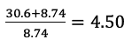
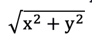
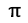
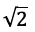
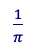
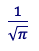
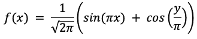
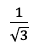
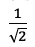
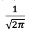

# 第一章：C++ 概述

在深入学习 C++ 编程之前，介绍语言、C++ 标准库以及 C++ 在量化金融中继续占据主导地位的简要概述将非常有用。

你可能已经被声称 C++ 学习难度极大且充满陷阱的意见和传言所吓到。因此，在本章中，我们将试图首先揭穿关于 C++ 的一些常见神话，然后通过简单的示例帮助你快速上手。

大部分内容对大多数读者来说可能都很熟悉，但本节讨论尝试通过关于量化编程和通常不包括在入门书籍中的最佳实践来扩展一些基础知识。我们还将首次介绍 C++20，即已添加到 C++ 标准库中的数学常数。

通过本章的学习，你应该能够编写、编译和运行简单的 C++ 程序，理解基本的数值类型，并在标准库中应用数学函数，这些函数在包括金融在内的任何量化学科中都是基础。

# C++ 和量化金融

C++ 在 1990 年代中期开始在金融领域迅速发展。在这个时候，许多从事该行业的人都是在 FORTRAN 上成长起来的，特别是用于编写数值例程和科学应用程序。虽然 FORTRAN 及其支持库在数学和线性代数支持方面非常成熟，但在面向对象编程方面却有所欠缺。

抽象中的金融建模自然由相互作用的不同组件组成。例如，即使是基于外汇和利率的简单衍生品合同的定价，通常也需要以下几点：

+   每种货币的利率期限结构

+   实时外汇汇率报价的市场利率信息源

+   外汇汇率和利率的波动曲线或曲面

+   一组定价方法，例如封闭形式、模拟或其他数值逼近方法

这些组件中的每一个都可以用一个*对象*来表示，而 C++ 则提供了创建这些对象和管理它们彼此关系的手段。

银行和其他金融机构还需要一种方法来计算区域和全球范围内的风险度量。对于在纽约、伦敦和东京等主要金融中心分布有交易业务的公司来说，这是一个特别的挑战，同时还要考虑本地和全球维护的投资组合在每个交易日开始时的风险报告。这可能是一个计算密集型的任务，但是 C++ 的性能使其成为可能，也是其在金融行业早期被广泛采用的另一个重要因素。

在世纪之交左右，新型面向对象语言如 Java 和 C#使软件开发变得相对简单快捷，同时更高效的处理器价格也变得更加合理。然而，这些语言中带来更快部署的特性，如内置管理内存和中间编译，也可能在运行时性能方面引入额外开销。管理决策往往需要在更快开发与运行时效率之间权衡选择。即使选择其中一种语言，计算密集型的定价模型和风险计算通常仍然会委托给现有的 C++库，并通过接口调用。还应注意，C++还提供了一些在其他编程语言中无法实现的编译时优化。

## C++11：现代时代诞生

2011 年，[标准 C++基金会](https://isocpp.org)发布了一项重大修订，解决了长期以来需要现代化的问题，特别是提供了一些非常受量化开发者欢迎的抽象。其中包括：

+   从各种概率分布生成随机数

+   封装数学函数的 Lambda 表达式，也可作为参数传递

+   并行化计算的任务并发，无需手动线程管理

+   智能指针可以防止与内存相关的程序崩溃，而不影响性能

这些主题及更多内容将在接下来的章节中讨论。还有一本出色的参考书籍，涵盖了 C++进入现代时代的历史和演变，来自 O’Reilly 出版社：《C++ Today: The Beast is Back》，作者为 Jon Kalb 和 Gasper Azman [1]。还应注意，通过 ISO C++委员会对[最佳实践](https://isocpp.org/wiki/faq/coding-standards)[1]和[指南](https://isocpp.github.io/CppCoreGuidelines/CppCoreGuidelines)[2]的更多关注和推广，跨平台开发现在比过去容易得多。

随着 C++11 之后，每三年发布一次新版本，增加了越来越多面向金融和数据科学行业需求的现代特性，最新版本为 C++20。本书主要涵盖了截至 C++20 的发展，特别是对金融量化开发者感兴趣的内容。还提到了正在进行中的未来标准的建议。

私人和高频交易公司一直在积极采纳 C++11 及其后版本，因为在统计策略中对市场和交易簿信号做出反应的速度可能导致利润和损失上的深刻差异。现代 C++在投资银行和对冲基金的交易员和风险管理人员中，也急需用于衍生品定价模型。例如，标准库中最近增加的随机数生成和并发特性提供了内置支持，用于高效的蒙特卡洛模拟，这是评估交易策略和定价复杂异国期权的关键组成部分。过去，这些任务通常需要大量分布式随机数生成代码的开发工作和耗时的平台相关线程库的集成。

## 开源数学库

过去十年中另一个非常受欢迎的发展是，标准 C++编写的健壮的开源数学库大量涌现，因此不再需要过去那种耗时的 C 语言接口操作。主要包括 Boost 库、Eigen 和 Armadillo 矩阵代数库，以及 TensorFlow 和 PyTorch 等机器学习库。我们将在本书的后续部分详细介绍 Boost 和 Eigen。

# 拆解有关 C++的神话

关于 C++存在许多神话。以下是几个较为臭名昭著的信念，以及解释反驳它们。

+   *学习 C 是学习 C++的必要条件*：尽管 C++标准保留了大部分 C 语言的特性，但完全可以在不了解 C 语言的情况下学习 C++，我们将看到这一点。固守于 C 风格实际上可能阻碍对 C++强大抽象和潜在优势的学习。

+   *C++太难了*：毫无疑问，C++是一门丰富的语言，提供了大量谚语式的绞索，可以让人自缢，但通过利用语言的现代特性，并在初期暂时搁置传统问题，完全可以在 C++中迅速成为一名非常高效的量化开发人员。

+   *内存泄漏在 C++中总是一个问题*：自从 C++11 引入智能指针以来，在大多数金融模型实现中，这不再是一个问题，我们将会看到。

# 编译与解释代码

正如上文所暗示的，C++是一种编译语言，我们凡人在文件中键入的命令会被翻译成计算机处理器能理解的二进制指令，或者*机器码*。与 Python、R 和 Matlab 等非类型和解释性语言相比，这些语言中的每一行代码都必须在运行时单独翻译成机器码，因此会减慢大型应用程序的执行速度。

这绝不是对这些语言的贬低，因为它们的强大体现在它们在金融、数据科学和生物科学等量化领域中的流行度中，其内置的数学和统计函数通常是用 C、C++ 或 FORTRAN 编译的。然而，至少在金融界，有很多故事可以说明，一个模型在解释性语言中可能需要几天才能运行，而在 C++ 中重新实现后，运行时间可以缩短到几分钟。

一个有效的方法是以互补的方式将解释性数学语言与 C++ 结合使用。例如，当在 C++ 库中编写计算密集型模型代码，并且在 R 中的应用程序中以交互方式或调用方式调用时，C++ 可以有效地处理数值计算。然后，结果可以在 R 中强大的绘图和其他可视化工具中使用，这些工具在 C++ 中不可用。

另一个优点是，模型代码仅需编写一次，并在可以跨多个部门、部门甚至跨国界部署的 C++ 库中维护，并通过不同前端语言编写的应用程序接口调用，同时确保整个组织内数值结果的一致性。这对于符合监管合规要求尤为有利。

流行的开源 C++ 包分别适用于 R 和 Python，即 [Rcpp](http://www.rcpp.org/) 和 [pybind11](https://github.com/pybind/pybind11)。Matlab 也提供了用于 C++ 接口的选项。

# C++ 的组成部分

标准的 C++ 发行版，从高层面来看，由两个组成部分组成：语言特性和 C++ 标准库。软件库本质上是一组函数和类，它们不能单独执行，而是由应用程序或系统调用。与前几十年流行的独立应用程序相比，现代 C++ 开发中的库开发（包括开源和商业）现在占据主导地位，我们稍后将讨论一些对计算工作有用的库。最重要的 C++ 库是与现代编译器一起提供的标准库。

## C++ 语言特性

C++ 语言特性大部分与其他编程语言中常见的基本运算符和结构重叠，比如：

+   基本整数和浮点数数值类型

+   条件分支：`if/else if/else` 语句和 switch/case 语句

+   迭代结构：for 循环和 `while` 循环

+   标准数学变量类型：整数、双精度浮点数等

+   数值类型的标准数学和逻辑运算符：加法、减法、乘法、除法、模数和不等式

此外，C++并不仅限于面向对象编程；相反，语言还支持另外三种主要的编程范式，即过程式编程、泛型编程和函数式编程。这些将在随后的章节中讨论。

C++是一种强类型语言，这意味着在使用变量之前，我们必须声明它们的类型。语言提供了各种数值类型；然而，我们主要使用的是以下几种：

| 类型 | 描述 | 最小值 | 最大值 |
| --- | --- | --- | --- |
| double | 双精度 | +/- 2.2e-308 | +/- 1.8e308 |
| int | 整数 | -2,147,483,648 | 2,147,483,647 |

其他类型，如无符号和扩展整数类型，将在需要时介绍。

## C++标准库

正如 Nicolai Josuttis 在他不可或缺的著作《*The C++ Standard Library - A Tutorial and Reference, 2nd Edition*》[3]中描述的那样，C++标准库“使程序员能够使用通用组件和更高层次的抽象，而不会失去可移植性，而不必从头开始开发所有代码。”直到最新的 C++20 发布，用于量化模型实现的非常有用的库功能包括：

+   数组样式的容器，特别是受尊敬的`vector`类

+   一系列标准算法，操作这些数组容器，如排序、搜索和高效地应用函数到容器中一系列元素

+   标准实数值数学函数，如平方根、指数和三角函数

+   复数和复数运算

+   从一组标准概率分布中生成随机数

+   基于任务的并发，可以内部和安全地管理线程

+   智能指针，抽象了与内存管理相关的危险

+   一个用于存储和管理字符数据的类

+   流函数用于从控制台获取输入并显示结果

使用标准库组件需要程序员将它们显式地导入到代码中，因为它们存储在一个单独的库中，而不是在核心语言中。这个思想类似于将 NumPy 数组导入 Python 程序或在 R 脚本中加载外部函数包。在 C++中，这是一个两步过程，首先加载包含我们希望使用的标准库函数和类声明的文件，然后使用标准库命名空间名`std`来限定这些函数（C++开发人员通常称之为“stood”）。

# 编译器和集成开发环境（IDE）

学习 C++的第一步是获取一个编译器和开发环境。现代主要的免费可用编译器有三种，并且它们都包含了它们的 C++标准库的实现：

+   [Microsoft Visual Studio 2019 编译器](https://visualstudio.microsoft.com/vs/features/cplusplus/)

+   [Clang (LLVM 项目)](https://clang.llvm.org/)

+   [GNU gcc 编译器](https://gcc.gnu.org/)

也有几种集成开发环境（IDE's）可用，即 Visual Studio、Apple 的 Xcode（附带 Clang 编译器）和 CLion，后者是一款通常需要从 JetBrains 购买的产品。对于本书来说，强烈推荐使用微软的 Visual Studio 编译器和 IDE。它们是友好的选项，能够快速上手 C++，并具有非常强大的调试工具。

此外，Visual Studio 选项还包括一个 Clang 选项，允许程序员在微软编译器和 Clang 之间切换，有助于确保跨平台兼容性。

不幸的是，C++的 Visual Studio 选项仅适用于 Windows，因为 Mac 版本不提供 C++选项。在这种情况下，可以选择下载附带 Clang 编译器的 Apple Xcode。Linux 用户通常会选择 gcc 或 Clang 编译器。

# C++基础复习

以下将是对 C++的快速复习，使用一些简单的代码示例。我们还将首次看到 C++20 中的一个新功能，即数学常数。

## 经典的“Hello World！”

首先，这里有一个“Hello World！”的示例以便开始。以下代码将消息返回到屏幕，然后允许用户输入要打招呼的人的名字：

```
 #include <iostream>
#include <string>
int main()
{
	std::cout << "Hello World!" << '\n';
	std::string person;
	std::cout << "To whom do you wish to say hello? ";
	std::cin >> person;
	std::cout << "Hello "<< person << "!" << '\n';
	return 0;
}
```

如果您想向您的母亲打招呼，那么编译并运行代码后，屏幕将如下所示：

```
Hello World!
To whom do you wish to say hello? Mom
Hello Mom!
```

主要复习点如下：

+   `cout`和`cin`以及 string 类，都依赖于包含 C++标准库声明文件 iostream 和 string。

    标准库的成员需要在其命名空间`std`下进行作用域限定。另一种方法是将带有命名空间作用域的`using`语句放在文件顶部，表明每当这些元素出现在代码中时，它们来自 std 命名空间。此外，您可能会发现输入`endl`（行末）比'\n'更容易：

    ```
     #include <iostream>
    using std::cout;
    using std::cin;
    using std::endl;
    #include <string>
    using std::string;
    int main()
    {
    	cout << "Hello World!" << endl;
    	string person;
    	cout << "To whom do you wish to say hello? ";
    	cin >> person;
    	cout << "Hello " << person << "!" << endl;
    	return 0;
    }
    ```

+   使用以下方式将 std 命名空间导入全局命名空间中

    ```
    using namespace std;
    ```

    有时用于替代单独的 using 语句；然而，这不被认为是良好的做法，因为它可能导致编译时命名冲突。命名空间背后的动机将在第三章中介绍。

+   几乎不会在生产级别的金融编程中使用控制台输入和输出。用户输入数据通常来自图形用户界面（GUI）或 Web 应用程序，而市场数据通常来自实时数据源。结果通常显示在用户界面中，然后存储在数据库中，例如在执行交易时。

+   我们将使用`cout`和`cin`来模拟这些输入，但在生产代码中应避免使用它们。

## C++中的简单过程式编程

过程式程序的结构应该是熟悉的，即：

+   `main()`函数，在程序执行中首先调用的函数，

+   一组包含组成程序的各个任务的用户定义函数。

在最简单的情况下，所有这些都可以写在一个包含`main()`的单个可执行文件中。

我们首先在`main()`函数的开始之前，在函数*声明*语句中*声明*每个用户定义函数。 函数声明说明其名称，返回类型和输入参数类型，后跟一个分号。

函数*实现*写在`main()`下面，每个函数包含一系列在开放和关闭大括号中的命令。 可以在`main`函数中或从其他用户定义函数中进行用户定义函数调用。

单行注释由两个连续的斜杠表示。 高级格式如下所示：

```
 // Function declarations ("//" indicates a comment line)
return_type function_01(input arguments);
return_type function_02(input arguments);
return_type function_03(input arguments);
.
.
.
int main()
{
  // Call each function 
  function_01(input arguments);
  function_02(input arguments);
  function_03(input arguments);
.
.
.
}
return_type function_01(input arguments)
{
  // Do stuff
  // Return something (or void return)
}
return_type function_02(input arguments)
{
  // Do stuff
  // Return something (or void return)
}
return_type function_03(input arguments)
{
  // Do stuff
  // Return something (or void return)
}
.
.
.
```

###### 注意

对于更大更健壮的生产应用程序，我们很快将研究在单独的*C++20*模块中编写函数的方法，其中声明和实现函数的相同方法将延续。

函数声明的更多细节将在接下来的两个小节中详细说明。

### 函数声明

C++函数可能有可能没有返回值；此外，它们可能有可能没有输入参数。 没有返回值的函数由`void`返回类型指示。 例如，如果我们将我们的“Hello World”示例移到一个单独的函数中，当从`main`函数调用时，它只需向屏幕输出一条消息而不返回任何值，因此它将被声明为`void`函数。 另外，它不需要任何输入参数，因此其声明将采用以下形式

```
 void hello_world(); 
```

接下来，假设我们想编写一个真实值函数，该函数接受一个变量并返回其两倍值。 在这种情况下，我们的声明将具有双精度浮点返回类型，由`double`表示，并且具有相同类型的输入。 如果我们将此函数命名为`twice_a_real`，输入变量为`x`，则我们的声明将写为

```
double twice_a_real(double x);    
```

最后一个例子，与其他编程语言一样，函数可以接受多个变量。 假设我们希望在名为`add_three_ints`的函数中添加三个整数，并返回变量`i`，`j`和`k`的总和。 整数类型由`int`表示，因此我们的函数声明将是

```
int add_three_ints(int i, int j, int k);    
```

### 函数实现

函数实现，也称为函数*定义*，是我们在其中实现显示消息到屏幕，计算数学结果或执行其他任务的实际命令的地方。 函数的*主体*放在括号内，如此处所示的`hello_world`函数。 我们再次需要指定`void`返回类型。

```
 void hello_world()
{
  std::cout << "Hello World!\n";
}
```

接下来，我们可以编写我们两个简单数学函数的实现。 就像它们的声明一样，必须包括`double`和`int`返回类型以及它们的输入变量类型：

```
double twice_a_real(double x)
{
	double y = 2.0 * x;
	return y;
}
int add_three_ints(int i, int j, int k)
{
	return i + j + k;
}
```

在第一种情况下，我们初始化了一个新的`double`变量`y`，并使用计算结果。因为 C++是一个强类型语言，我们在初始化变量时需要注明变量的类型。然后，这个变量将结果返回给`main`函数。在第二个函数中，我们只将求和操作放在返回语句本身；这也是完全合法的。

最后，我们将所有内容放在一个`main`函数中，当程序启动时调用，并调用我们的用户定义函数。它位于用户定义函数声明及其实现之间，如下所示：

```
#include <iostream>
// Maybe put in using statements here(?)
void hello_world();
double twice_a_real(double x);
int add_three_ints(int i, int j, int k);
int main()
{
	hello_world();
	double prod = twice_a_real(2.5);
	std::cout << "2 x 2.5 = " << prod << std::endl;
	std::cout << "1 + 2 + 3 = " << add_three_ints(1, 2, 3) << std::endl;
	double r;
	std::cout << "Enter a real number: ";
	std::cin >> r;
	std::cout << "2 x " << r << " = " << twice_a_real(r) << std::endl;
	return 0;
}
void hello_world()
{
	std::cout << "Hello World!\n";
}
double twice_a_real(double x)
{
	double y = 2.0 * x;
	return y;
}
int add_three_ints(int i, int j, int k)
{
	return i + j + k;
}
```

## C++ 语法和风格指南

在本节中，提供了 C++语法的基本回顾，以及关于代码格式和变量命名的指南。尽管许多人可能不把这些讨论放在优先事项上，但在编写金融系统中的关键生产代码时，这个话题实际上非常重要，尤其是在像 C++这样的功能丰富的语言中。如果源代码写得清晰可维护，避免或解决 bug、运行时错误和程序崩溃将更加容易。

我们将回顾有关 C++语法的基本规则。即使你已经熟悉其中一些内容，仍将在一个地方总结，可能会对你有所帮助。

### 大括号中的代码块

函数实现，也称为*函数定义*，被放置在大括号内，如上文 6.2.2 中每个函数实现所示。当控制到达闭括号时，函数终止。对于其他代码块，如条件语句、循环、用户定义的函数和用户定义的类，当遇到闭括号时，块内定义的非静态局部变量和对象被称为 _ 超出作用域 _。也就是说，它们从内存中被清除，无法再访问。指针可能是此规则的一个例外，但我们将在第 XX 章中详细讨论。

### 语法复习

C++中的命令和声明以分号结束：

```
 double y = 2.0 * x;
```

同样，由于 C++是一个强类型语言，数值变量类型应该在初始化之前注明。

```
double x1 = 10.6;
int k;	// Defaults to zero
double y1 = twice_a_real(x1);
```

###### 注意

C++11 引入了`auto`关键字，可以自动推断变量或对象类型，以及统一初始化（使用大括号）。对于它们的使用存在不同的意见，但许多程序员仍然倾向于显式声明普通数据类型（POD），如`int`和`double`，以避免模糊不清的情况。本书将遵循这种风格。`auto`和统一初始化将在后续的上下文中讨论，这些上下文中它们更为有用。

单行注释用两个斜杠表示，例如，

```
// This is a comment
```

多行注释也可以在块中注释掉，如下所示：

```
/*
    Owl loved to rest quietly whilst no one was talking
    Sitting on a fence one day, he was surprised when
    suddenly a kangaroo ran close by.
*/
```

对于编译器来说，单个空格和多个空格没有区别；例如，尽管空白字符有变化，以下代码是合法的：

```
  int j = 1101;
  int k=   603;
  int sum = j +    k;
  std::cout <<    "j + k = " <<   sum << "\n";
```

然而，在编程中众所周知的一句箴言，特别是在 C++中，是*因为你可以做某事，并不意味着你应该这么做*。如果以清晰一致的间距编写，上述代码将更易读和易于维护：

```
  int j = 1101;
  int k = 603;
  int sum = j + k;
  std::cout << "j + k = " << sum << "\n";
```

同样，对于更加真实和复杂的代码，这一箴言应该牢记于心。在本书的后续章节中，这将是一个经常出现的主题。

代码也可以跨多行而不使用连续字符，并且垂直空间被忽略。回到我们之前的例子，编写

```
  int j = 1101;
  int k = 
          603;

  int sum = j + k;
  std::cout << "j + k = " 
            << sum 
            << "\n";
```

将得到相同的结果。与之前一样，具有统一间距且每个命令放在单独一行的前述示例更为可取。然而，需要注意的是，在涉及复杂和嵌套计算的量化编程中，通常非常建议将公式和算法拆分为多行以提高代码的清晰度和可维护性。我们将在后续章节中看到此类示例。

最后，C++ 语法是*区分大小写*的。例如，两个`double`变量`x`和`X`会像`kirk`和`spock`等其他变量一样不同。函数名也是如此。在上面的例子中，我们使用了标准库函数`std::cout`。尝试写成`std::Cout`将触发编译器错误。

### 命名约定

变量、函数和类名可以是任意连续的字母和数字组合，但需满足以下条件：

+   名称必须以字母或下划线开头；不能以数字开头。

+   除了下划线字符外，不允许使用特殊字符，如`@`、`=``$`等。

+   不允许使用空格。名称必须连续。

+   不允许使用语言关键字命名，如`double`、`if`、`while`等。可以在 https://en.cppreference.com/w/cpp/keyword 找到完整列表。

最大名称长度取决于编译器，并且在至少一个情况下 - GNU gcc 编译器 - 没有限制；然而，请参考上述*箴言*。

对于简单示例和简单的数学函数，单个字母的变量和函数名是可以接受的。然而，在量化模型中，通常最好使用更具描述性的名称来传递函数参数。函数和类名也应该提供一些关于其功能的指示。

多年来，几种命名风格已经很常见，即

+   小驼峰命名法；例如，`optionDelta`、`riskFreeRate`、`efficientFrontier`：第一个单词以小写字母开头，后续单词首字母大写

+   大驼峰命名法；例如，`OptionDelta`、`RiskFreeRate`、`EfficientFrontier`：每个单词的首字母大写

+   蛇形命名法；例如，`option_delta`、`risk_free_rate`、`efficient_frontier`：每个单词以小写字母开头，用下划线分隔

小驼峰命名法和蛇形命名法是 C++函数和变量名中最常见的形式，类名通常采用大驼峰形式。近年来，可能受到[Google 的 C++风格指南](https://google.github.io/styleguide/cppguide.html=General_Naming_Rules) [5]的推动，变量和函数名更倾向于使用蛇形命名法。因此，在本书中，我们将采用这种约定，并使用大驼峰命名类名。

在整数计数变量中使用单个字符时，仍然常见使用 FORTRAN 约定的字母 `i` 到 `n`，尽管这不是必须的。我们也将采纳这一做法。

# C++中的数学运算符、函数和常量

在前面的讨论非常有趣，但本书的重点在于数学和金融。我们已经在上文中使用了内置的 C++数值类型的加法和乘法数学运算符。这些都是 C++语言的特性，接下来会对这些标准运算符进行全面的讨论。然而，常见的数学函数如余弦、指数等，是由 C++标准库提供而不是核心语言功能。

## 标准算术运算符

如上面的例子所示，C++提供了整数和浮点数类型的加法、减法、乘法和除法运算符 `+`、`-`、`*` 和 `/`，这通常也是其他编程语言中的做法。此外，还包括取模运算符 `%`。示例如下：

```
 // integers:		
int i = 8;		    
int j = 5;		    
int k = i + 7;		
int v = j - 3;		
int u = i % j;		
  // double precision:
double x1 = 30.6;
double x2 = 8.74;
double y = x1 + x2;
double z = x1 - x2;
double twice_x2 = 2.0 * x2;
```

算术运算符的顺序和优先级与大多数其他编程语言相同，即：

+   顺序从左到右：

```
i + j - v
```

使用上述整数值会得到 8 + 5 - 2 = 11

+   乘法、除法和取模运算优先于加法和减法：

```
x1 + twice_x2/x2
```

使用上述双精度值会得到 30.6 + 2.0 = 32.6

+   使用圆括号改变优先级：

```
(x1 + twice_x2)/x2
```

这将产生 

使用相同的双精度值。

## C++标准库中的数学函数

计算金融中常用的许多常见数学函数在 C++中具有相同或类似的语法，其中假定 `x` 和 `y` 是双精度变量：

| `cos(x)` | *x* 的余弦 |
| --- | --- |
| `sin(x)` | *x* 的正弦 |
| `tan` | *x* 的正切 |
| `exp` | 指数函数 *e^x* |
| `log` | 自然对数 *ln(x)* |
| `sqrt` | *x* 的平方根 |
| `cbrt` | *x* 的立方根 |
| `pow` | *x* 的 *y* 次幂 |
| `hypot` | 计算两个数值 x 和 y 的  |

由于这些函数位于标准库而不是语言功能中。应始终包括 `cmath` 头文件，并使用 `std::` 前缀限定函数的作用域：

```
 #include <cmath>      // Put this at top of the file.
double trig_fcn(double theta, double phi)
{  
  return = std::sin(theta) + std::cos(phi);
} 
```

如果你不想每次都打出 `std::`，在 `include` 语句后面放置 `using` 语句也是可以的：

```
#include <cmath>      // Put this at top of the file.
using std::sin;
using std::cos;
double trig_fcn(double theta, double phi)
{  
  return = sin(theta) + cos(phi);
}
```

现在我们可以编写我们的第一个金融例子了。我们想要定价一张零息债券

Ae^(-rt)

其中

A = 债券的面值，

r 是利率，而

t 是到期时间，以年分数表示。

在 C++中，我们可以这样写

```
double zero_coupon_bond(double face_value, double int_rate, double year_fraction)
{  
    return face_value * std::exp(-int_rate * year_fraction);
}
```

要获取更全面的标准库数学函数列表，请参阅 Josuttis 的《C++标准库（第 2 版）》[4]第 17.3 节，或者访问[CppReference 网站](https://en.cppreference.com/w/cpp/numeric/math) [6]上的列表。这两者对于任何现代 C++开发者都是必不可少的参考资料，也是本书的高级补充资源强烈推荐。接下来的两个部分将进一步指导如何使用标准库数学函数。

### C++中没有幂运算符

与其他语言不同，指数通常由`^`或`**`操作符表示，但这在 C++语言中并不存在。相反，需要调用`cmath`中的标准库`std::pow`函数。然而，在计算多项式时，通过霍纳方法进行因式分解并减少乘法操作是更有效的。例如，如果我们希望实现一个函数

最好将其在 C++中写成

*f(x)* = 8*x*⁴ + 7*x*³ + 4*x*²- 10^x - 6

```
 double f(double x)
{  
  return x * (x * (x * (8.0 * x + 7.0) + 4.0 * x) - 10.0) - 6.0;
}
```

而不是

```
 double f(double x)
{  
  return 8.0 * std::pow(x, 4) + 7.0 * std::pow(x, 3) + 
    4.0 * std::pow(x, 2) + 10.0 * x - 6.0;
}
```

对于非整数指数的情况，比如

*g(x,y)* = *x*^(-1.368*x*) + 4.19*y*

则必须使用`std::pow`：

```
double g(double x, double y)
{  
  return std::pow(x, -1.368 * x) + 4.19 * y; 
}
```

#### `<cmath>` 确保跨编译器的一致性

也许在某些情况下，可以在没有包含`#include <cmath>`的情况下使用这些数学函数，但是应坚持包含`<cmath>`并使用`std::`来限定函数的作用域。首先，因为 C++建立在 C 之上，一些编译器保留了来自 C 的旧数学函数，放置在所谓的*全局命名空间*中。然而，其他编译器可能将`cmath`放置在全局命名空间中。因此，实际上可能调用的是旧的 C 函数而不是 ISO C++标准版本，这可能导致不同编译器之间的意外或不一致的行为。

另一个可能出现的不一致性的例子涉及绝对值函数。在 C 语言和旧版 C++编译器中，`abs`函数仅适用于整数类型。要计算浮点数的绝对值，需要使用`fabs`函数。然而，`std::abs`函数对整数和浮点数（如`double`）参数都进行了重载，应优先选择使用。

不幸的是，这是由于 C++长期与 C 的关联而导致的一个怪异之处；然而，故事的教训非常简单：为了保持 C++代码的 ISO 兼容性，我们应始终包含`#include <cmath>`，并使用`std::`来限定数学函数的作用域。这将有助于确保在不同编译器和操作系统平台上的跨兼容性。

###### 注意

注意：关于 C 头文件和命名空间 std 的问题，例如在 gcc 编译器的规范中已经明确说明：

*标准规定，如果包括 C 样式头文件（在本例中为<**math.h**>），则符号将在全局命名空间中可用，可能也在* *std::* *命名空间中可用（但这不再是一个确定的要求）。另一方面，包括 C++样式头文件（<**cmath**>）将保证实体将在命名空间 std 中找到，可能也在全局命名空间中找到。*[8]

## 常量

在任何类型的数量编程中，通常需要在计算中使用常量值。在 C++中，可以通过简单地在赋值时附加关键字`const`来定义常量。此外，从 C++20 开始，现在还提供了一组常用的数学常量。

### `const`关键字

如果一个变量不改变值，使用`const`关键字将其声明为常量类型更安全。例如，我们可以用它来存储地球的重力加速度常数的近似值：

```
const double grav_accel = 9.80665;
```

然后，如果在相同作用域内尝试将其重新分配为不同的值：

```
grav_accel = 1.625;	// Gravitational constant for the moon
```

将导致编译器错误，并显示尝试修改常量值的消息。在编译时捕获错误比在运行时追踪并找出原因要好，特别是在实时生产环境中。

`const`还有其他重要用途和有趣的属性，我们将在稍后介绍，特别是在面向对象编程的上下文中。

### 标准库数学常量

C++ 20 标准库的一个方便之处是一组常用的数学常量，例如，*e*，等。以下表格显示了对量化金融方便的一些常量。

| C++常量 | `e` | `pi` | `inv_pi` | `inv_sqrt_pi` | `sqrt2` |
| --- | --- | --- | --- | --- | --- |
| 定义 | *e* |  |  |  |  |

要使用这些常量，必须首先在标准库中包含`numbers`头文件。在撰写本文时，每个常量必须使用`std::numbers`命名空间进行作用域限定。例如，要实现函数



我们可以编写

```
 #include <cmath>
#include <numbers>
. . . 
double some_fcn(double x, double y)
{
	double math_inv_sqrt_two_pi = 
		std::numbers::inv_sqrtpi / std::numbers::sqrt2;
	return math_inv_sqrt_two_pi*(std::sin(std::numbers::pi * x) + 
		std::cos(std::numbers::inv_pi*y));
}
```

这样，例如在计算中使用时，其值将在整个程序中保持一致，而不是交给项目中不同的程序员，他们可能会使用不同精度的近似值，从而导致数值结果可能不一致。

此外，数学计算中可能经常出现的的值无需重新计算

```
std::sqrt(2.0)
```

每次需要时都必须引用常量

```
std::numbers::sqrt2
```

本身保存了双精度的近似值。尽管在单次性能方面可能无关紧要，但在计算密集型代码中数百万次重复调用`std::sqrt`函数可能会产生一定影响。

###### 注意

尽管在这一点上了解它并非必要，但值得至少提到这些常量是在 *编译时* 而不是运行时设置的，使用了 C++11 中称为 `constexpr` 的设计。这与更广泛和更高级的 *模板元编程* 主题相关联，在其中计算常量值以在运行时使用时在编译时执行。

作为结束语，有点奇怪的是，在 C++20 提供的数学常量集中包括值 ，但不包括  或 ，尽管后两者在统计计算中更为常见。[[查看 Boost 库的后续章节 - 在那里包括它们]]

# 结论

这就是我们对 C++ 的风潮性概述。我们强调了量化编程，以及现在包括在 C++20 中的数学常量。

我们在编码风格方面的最佳实践覆盖将是本书的一贯主题，因为 C++ 是一种功能极其丰富的语言，有足够的“绳索”让自己上吊。遵循最佳实践和一致的编码风格对于确保代码可维护性和可靠性至关重要。

还有一点要记住的是，虽然我们使用大量的屏幕输出和输入，但这并不是 C++ 在量化开发中典型的使用方式。`std::cout` 和 `std::cin` 应该被视为真实世界接口的占位符。我们将继续将它们用作检查结果的设备，但它们主要会被降低到从 `main()` 调用的测试函数内部使用，而不是在实际数学和模型代码中使用，实际上在这些代码中应该避免它们。

# 参考文献

[1] Kalb 和 Azman，*C++* *今天：野兽回归*，可在 [`resources.jetbrains.com/storage/products/cpp/books/Cplusplus_Today.pdf`](https://resources.jetbrains.com/storage/products/cpp/books/Cplusplus_Today.pdf) 上找到（链接）

[2] [指南支持库（ISO）](https://isocpp.github.io/CppCoreGuidelines/CppCoreGuidelines)（链接）

[3] [ISO C++ 编程标准](https://isocpp.org/wiki/faq/coding-standards)（链接）

[4] Nicolai Josuttis，《*The C++ Standard Library (2E)*》（http://www.cppstdlib.com）（链接）

[5] Google C++ 风格指南（https://google.github.io/styleguide/cppguide.html）

[6] cppreference.com

[7] Stepanov，《泛型编程的数学》（霍纳方法）

[8] GNU gcc 编译器文档

（https://gcc.gnu.org/onlinedocs/libstdc++/manual/using_headers.html
