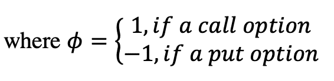
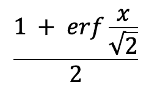

# 第三章：在模块中编写用户定义的函数和类

到目前为止，在我们的代码示例中，我们将所有代码放入一个文件中，采用自顶向下的设计，从`main`函数开始执行程序。当然，这对于实际的生产编程来说是不切实际的。在 C++20 之前，编写用户定义（非模板化）函数和类的通常方法首先涉及将它们的声明放在头文件中（通常是`.h`、`.hpp`或`.hxx`扩展名）。然后，一个实现文件（通常是`.cpp`、`.cxx`或`.cc`扩展名）会使用`#include`预处理器命令加载这些声明。然后，每个实现文件将被编译成一个*翻译单元*（事实上标准扩展名为`.o`用于 Clang 和 gcc，以及`.obj`用于 Visual Studio）。

C++20 引入了*模块*，在这里不详细展开，它们提供了编译和构建代码库所需时间减少、消除头文件和预处理器指令可能引发的问题、以及对导出到其他代码文件的内容更大的控制权等优势。一个方便的结果是不再需要将声明包装在包含保护宏中。此外，头文件泄漏的问题也可以避免，因为一个导入到另一个模块的模块不会携带它导入的所有内容，不像一个头文件中的`#include`宏会传播到另一个头文件中。[[更多细节，请参阅 Ranier Grimm 和 Niall Cooling (https://blog.feabhas.com/2021/08/c20-modules-with-gcc11/)]]

模块还允许将声明和实现放在一个文件中，尽管也可以将它们分开放在一个接口和多个实现文件中。对于本书，我们将把讨论限制在单文件情况下[[至少目前是这样]].

单文件模块可以用于实现类似于 C#和 Java 的函数和类，而无需单独的声明。但即使在一个文件中保持分离仍然具有某些优势，即接口和实现的清晰分离，以及减少或消除消耗模块的其他代码重新编译的潜力。

单文件模块的默认文件扩展名在这个阶段似乎正在收敛到`.ixx`用于 Visual Studio，以及`.cppm`用于 Clang，尽管使用`.cpp`也是一个选项。[[查看 Ranier Grimm 关于使用 cppm 的警告；他建议在 Clang 中使用.cpp，或在 MSVC 中使用 Clang-Cl 中使用.ixx]]. 在本书中，我们将使用`.ixx`扩展名来命名模块文件。

###### 注意

在撰写本文时，仍有一些关于标准化的问题尚未解决。这在本书出版时可能会发生变化。

在本章中，我们首先展示了使用模块来定义用户自定义非成员函数和类的初步示例。这将为更深入讨论类设计铺平道路，包括编译器提供的默认特殊函数、用户定义的构造函数和析构函数以及运算符重载。移动语义是在 C++11 中添加的一种语言特性，也将被介绍。对于一些读者来说，这将是复习内容，但这些示例将在 C++20 模块的上下文中再次展示。

# 使用模块编写用户自定义函数

现在，我们将逐步构建编写模块中函数的过程，从一个非常简单的示例开始，然后逐步介绍细节。

## 非成员函数的第一个示例

假设我们想编写一个函数，用于计算整数向量中元素的总和：

```
int vector_sum_of_ints()
{
	vector<int> v = { 1,2,3 };
	int sum = 0;
	for (int elem : v) sum += elem;
	return sum;
}
```

这个模块被放置在一个名为 `CppMod` 的模块中，位于一个单独的 `.ixx` 文件中，比如 `CppModule.ixx`。通过在这个文件中直接编写整个代码，然后逐部分进行详细讨论，将更容易理解。

```
module;	// The global fragment
#include <vector>
export module CppMod;	// The global fragment ends at this point, and 
					// the functionality of the module starts here.
using std::vector;
// Declare the function first, using the
// export keyword to make it accessible outside the module.
export int vector_sum_of_ints();
// Implementation of the function.  The export keyword
// is not necessary here as it is already included 
// in the declaration.
int vector_sum_of_ints()
{
	vector<int> v = { 1,2,3 };
	int sum = 0;
	for (int elem : v) sum += elem;
	return sum;
}
```

第一行上的 `module` 语句确定了模块的 *全局片段* 开始的位置。这一部分专门用于预处理器命令，特别是用于标准库和其他地方的头文件的 `#include` 声明，这些声明在实现时是必需的。

接下来，`export module` 语句表示全局片段的结束并定义模块本身。这将使其能够被 *import* 到其他模块和源代码中。首先是 ` vector_sum_of_ints ` 函数的声明，前面是另一个 `export` 关键字的使用。这样做的作用是告诉编译器，该函数可以从模块外部的代码中调用。未标记为 `export` 的函数只能从模块内部调用。

在此之后，我们可以编写函数的实现。请注意，我们不需要在这里放置 `export`，因为在函数声明时放置它就足够了。

为了看看我们如何使用这个模块，我们将它导入到我们通常的 `Main.cpp` 文件中（此时还不是模块本身）。这是在 `main` 函数之前使用 `import` 关键字来实现的。然后，从 `main` 中，我们将调用 ` vector_sum_of_ints `：

```
#include <iostream>		// #include <iostream> as usual
using std::cout;
using std::endl;
import CppMod;		// Import the CppMod module
				// containing the vector_sum_of_ints function.
int main()
{
	cout << vector_sum_of_ints() << endl;
}
```

运行这段代码，你可以验证结果为 6。

接下来，我们可以看看如果向模块添加一个非导出函数 `add_stuff` 会发生什么。再次，这是一个非常简单的例子，它只会将整数值加倍。如果我们从导出函数内部调用它，那么向量结果的两倍将被返回：

```
module;
#include <vector>
export module CppMod;
using std::vector;
export int vector_sum_of_ints();
int add_stuff (int n);
int vector_sum_of_ints()
{
	vector<int> v = { 1,2,3 };
	int sum = 0;
	for (int elem : v) sum += elem;
	sum = add_one(sum);
	return sum;
}
int add_stuff (int n)
{
	return n + n;
}
```

再次编译和运行程序，结果毫不奇怪（请鼓掌），是 12。然而，试图从外部 `main` 函数调用 `add_stuff` 将导致编译器错误。

也可以定义一个局限于模块内部且外部不可访问的*变量*。例如，我们可以声明并初始化一个非导出的整数变量为 0，然后如果重新赋值，它将在模块内部保持新值。例如，我们可以在`add_stuff`函数内将其设置为`n`，然后在导出的函数中再次添加它，它将保持其重新分配的值为 6：

```
module;
#include <vector>
export module CppMod;
using std::vector;
export int vector_sum_of_ints();
int add_one(int n);
int k = 0;
int vector_sum_of_ints()
{
	vector<int> v = { 1,2,3 };
	int sum = 0;
	for (int elem : v) sum += elem;
	sum = add_k(sum);
	return sum + k;		// k still = 6; returns 18
}
int add_stuff(int n)
{
	k = n;			// k = 6
	return k + n;		// 12
}
```

现在结果为 18，但`k`局限于模块内部并且无法从外部访问这一点才更为重要。类似于非导出函数，尝试在`main`函数内使用`k`将无法编译通过。从概念上讲，非导出函数和变量都像类的私有成员一样，但是相对于模块和其非成员函数而言。

此外，可以通过将函数实现重新排列到所谓的*私有片段*中来更清晰地分离接口和实现。这必须是模块中的最后部分，并且用`module: private`将上面的声明与下面的实现分开：

```
module;
#include <vector>
export module CppMod;
using std::vector;
// Interface section is here:
export int vector_sum_of_ints();
int add_stuff(int n);
int k = 0;
// Implementations are placed in the private fragment:
module:private;
int vector_sum_of_ints()
{
	vector<int> v = { 1,2,3 };
	int sum = 0;
	for (int elem : v) sum += elem;
	sum = add_stuff(sum);
	return sum + k;		// k still = 6; returns 18
}
int add_stuff(int n)
{
	k = n;			// k = 6
	return k + n;		// 12
}
```

使用私有片段还据称可以防止使用模块的外部代码在模块内部发生更改时重新编译。对于这一点仍然存在一些模糊之处，希望在接下来的几个月内能够澄清。

我们很快将看到，在更实际的示例中，带有私有片段的模块如何有用。

## 标准库头单元

向[ISO C++委员会](https://isocpp.org/std/the-committee)提交的重组标准库为“[标准模块版本](http://www.open-std.org/jtc1/sc22/wg21/docs/papers/2021/p2412r0.pdf)” [Stroustrup P2412r0] 的提案也已草拟并提交，以便包含在 C++20 中，但此努力已延期至 2023 年计划的下一个版本。在此期间，作为占位符，保证[“[现有的标准库头文件的`#include`在 C++20 中会透明地变为模块导入](http://www.open-std.org/jtc1/sc22/wg21/docs/papers/2019/p1502r1.html)” [ISO P1502R1] 已经可用。这基本上意味着预处理器语句，如

```
#include <vector>
#include <algorithm>
```

可以通过导入它们的头文件等价物进行替换：

```
import <vector>;		// Note these require a semicolon
import <algorithm>;
```

这适用于所有 C++标准库声明文件；然而，由于继承自 C 的头文件引起的复杂性，例如<cassert>和<cmath>，分别基于遗留的 C 头文件<assert.h>和<math.h> – 这些不在范围内。

因此，在上述示例中，我们可以消除全局片段，并在`export module`语句下导入`vector`头文件；即，

```
export module CppMod;
import <vector>;
using std::vector;
```

如果需要`#include`标准库之外的其他头文件，作为预处理指令，*必须*放入模块的全局片段中。

除了导入标准库头文件单元的便利性外，它们还显示减少了构建时间和二进制文件的膨胀，尽管这并不总是保证的。

示例可以在 Stroustrup 的[P2412r0]中找到。

## 模块防止泄漏到其他模块

当导入到其他模型时，一个模块不会在其内部“泄漏”导入的模块。也就是说，如果模块`A`导入另一个模块`B`，

```
// Define module A that imports module B:
export module A;
import B;
```

然后，如果将`A`导入到另一个模块`C`中，或者导入到`Main.cpp`文件中，`B`也不会隐式导入，除非它也显式地被导入：

```
// Define module C that imports module A:
export module C;
import A;
import B;		// Not implicitly imported with module A.
			// Must be explicitly imported if functions
			// in B are also to be used inside module C
```

这与`#include`的头文件不同，后者会泄漏。例如，头文件`MyHeader.h`包含用户定义的`YourHeader.h`和 STL 的`<vector>`头文件：

```
// MyHeader.h
#include “YourHeader.h”
#include <vector>
```

如果在`Main.cpp`中`#include`了`MyHeader.h`，那么它将同时包含“YourHeader.h”中的函数和`std::vector`类：

// Main.cpp

```
#include “MyHeader.h”
int main()
{
	// This will compile:
	auto y = my_header_fcn(…);
	// But so will these lines:
	auto z = your_header_fcn(…);
	std::vector <double> v;
}
```

使用预处理器`#include`语句时，包含在`YourHeader.h`和`std::vector`中的内容会“泄漏”到`main`函数中。在实际情况下，可能涉及许多更多的头文件，迷失在哪些被包含和哪些没有被包含中可能会导致意外行为或运行时错误。此外，这也可能导致更长的构建时间。使用模块，程序员可以更好地控制导入的内容，并且构建时间可以大大缩短。

更多详细信息请参阅[Ranier Grimm 的非常信息丰富的 ModernesCpp 博客网站](https://www.modernescpp.com/index.php/cpp20-modules)。

## Black-Scholes 模块示例

对于更接近现实的金融示例，可以将 Black-Scholes 模型用于定价欧式股票期权，该模型可以写在一个模块内。但在编写该模型之前，我们需要一种可靠的方法来指示期权的支付类型，即认购或认沽。为此，一个名为`Enums`的模块将包含一个导出的枚举类`PayoffType`：

对于 Black-Scholes 函数，将使用 James 的 Option Theory 中显示的数学公式。



### 包含枚举定义的模块

首先，为了防止ɸ的伪输入值，使用枚举类表示支付类型，并将其放置在自己的模块和独立文件中，例如`Enums.ixx`，以便可以在其他地方重复使用。

```
// File Enums.ixx
export module Enums;
export enum class PayoffType
{
	CALL,
	PUT
};
```

在实践中，可以附加表示债券类型、期货合约标识符、货币代码等的其他枚举类到这个模块中，然后根据需要将其导入其他定价和风险模块中。

### Black-Scholes 公式模块

该模型需要自然对数函数和计算标准正态分布的累积分布函数的方法。在这里，我们很幸运，因为累积分布函数可以写成



其中 erf 是[误差函数](https://en.wikipedia.org/wiki/Error_function)，并且它在 `<cmath>` 中可用，如自然对数函数 `log`。然而，由于此头文件在 C++20 标准中没有保证的头部单元，因此它需要在模块的全局片段中 `#include`。

```
module;
#include <cmath>	// cstuff headers (derived from stuff.h) 
				// should be #include(d) in the global fragment
```

接下来是一个 `export` 语句，并定义了模块的名称，比如 `BlackScholesFcns`。为方便起见，所需的 `<cmath>` 函数 `using` 别名接下来会被引入。

```
export module BlackScholesFcns;
// <cmath> functions used below:
using std::log;
using std::erf;
```

公式还使用了 ，这在 C++20 中现在作为常量别名可用。它还需要确定期权到期时期权支付和零之间的最大值。为此，在 `<numbers>` 中的 `sqrt2` 常量和 `<algorithms>` 中的 `std::max` 函数都是可用的。由于 `<numbers>` 和 `<algorithms>` 作为头部单元可用，因此可以 `import` 而不是 `#include`：

```
// Standard Library header units, and using aliases
import <numbers>;
using std::numbers::sqrt2;
import <algorithm>;
using std::max;
```

### `export import`

`BlackScholesFcns` 模块需要 `import` `Enums` 模块，以指示期权是看涨还是看跌。但正如前面所述，使用模块的好处在于不会将已导入的模块泄漏到其他位置。这意味着如果将 `BlackScholesFcns` 导入到 `Main.cpp` 中，则程序员需要知道还需将 `Enums` 模块 `import` 进去。这不是一个理想的做法，因为这需要在可以在其他地方使用之前检查模块的源代码，看它导入了哪些模块。

幸运的是，`export import` 命令可用。它将首先将 `Enums` 模块 `import` 到 `BlackScholesFcns`，然后在任何消耗后者的地方 `export` 它。

```
export import Enums;
```

这样，当 `BlackScholesFcns` 被导入到另一个模块或文件中时，就不需要在 `BlackScholesFcns` 的源代码中寻找已导入的 `Enums`，然后重新将其导入到新目标中。此外，一般来说，只有标记为 `export import` 的导入模块可以通过。这样可以避免由于意外泄漏的模块而导致的意外行为。

###### 注意

由于 `#include` 语句，`<cmath>` 头文件将泄漏到导入 `BlackScholesFcns` 的目标中。这应该在预定用于 C++23 的标准模块版的标准库中得到纠正。

计算自然分为一个导出的 Black-Scholes 函数，以及计算 *d*1 和 *d*2 值，以及标准正态分布函数的两个私有函数。声明如下：

```
export double black_scholes_price(double strike, double spot, double rate,
	double sigma, double year_frac, PayoffType pot);
// Internal functions and variables
void dee_fcns(double strike, double rate, double spot,
	double sigma, double year_frac);
double norm_cdf(double x);
```

这里的关键点是模块用户只需关注 `black_scholes_price` 函数。调用其他两个函数的责任被委托给了导出函数。

因为 *d*1 和 *d*2 值是模块内部的，它们被声明和初始化，但也没有被导出。这使它们对模块中的函数可访问，但不对外部世界可访问，就像类的私有成员函数一样。

```
// Internal module variables
double d1 = 0.0, d2 = 0.0;		// d1 and d2 values in Black-Scholes
```

函数实现放在最后，首先是导出的`black_scholes_price`函数，然后是私有片段中的两个辅助函数。请注意，`dee_fcns`是一个`void`函数。与其有两个单独的函数来计算*d*1 和*d*2 值，不如通过在一个函数中设置`d1`和`d2`变量的结果来完成，这两个变量对于模块是公共的，但对其用户是隐藏的。

```
double black_scholes_price(double strike, double spot, double rate,
	double sigma, double year_frac, PayoffType pot)
{
	double opt_price = 0.0;
	// phi, as in the James book: 
	double phi = (pot == PayoffType::CALL) ? 1.0 : -1.0;
	if (year_frac > 0.0)
	{		
		dee_fcns(strike, rate, spot, sigma, year_frac);
		double n_dee_one = norm_cdf(phi * d1);		// N(d1)
		double n_dee_two = norm_cdf(phi * d2); 	// N(d2)
		double disc_fctr = exp(-rate * year_frac);
		opt_price = phi * (spot * n_dee_one - disc_fctr * strike * n_dee_two);
	}
	else
	{
		opt_price = max(phi * (spot - strike), 0.0);
	}
	return opt_price;
}
module : private;
void dee_fcns(double strike, double rate, double spot,
	double sigma, double year_frac)
{
	double numer = log(spot / strike) + rate * year_frac
		+ 0.5 * year_frac * sigma * sigma;
	double sigma_sqrt = sigma * sqrt(year_frac);
	d1 = numer / sigma_sqrt;
	d2 = d1 - sigma_sqrt;
}
double norm_cdf(double x)
{
	return (1.0 + erf(x / sqrt2)) / 2.0;
}
```

在`Main.cpp`文件中，放入

```
import BlackScholesFcns;
```

要导入模型，然后调用导出的函数；例如，一个在到期前约三个月的实值看跌期权。请注意，可以分配支付枚举类型，因为`Enums`模块是通过`export import`命令从`BlackScholesFcns`导出的。

```
	strike = 200.0;
	porc = PayoffType::PUT;
	spot = 185.0;
	rate = 0.05;
	sigma = 0.25;
	year_frac = 0.25;
	cout << "Put Option price = "
		<< black_scholes_price(strike, spot, rate, sigma, year_frac, porc )
		<< endl;
```

这给出了一个价格为 17.0649。

如（希望）所见，模块除了其他好处外，在实施需要大量内部计算但使用者不必关心的金融模型时也非常有用。这种方式，中间值可以封装成类的私有变量一样，而不是在函数之间传递并暴露于意外修改之下，而且不会增加对象的开销。对于比布莱克-斯科尔斯模型复杂的模型 - 当然存在许多模型 - 这意味着更少的外部可访问的运动部件，因此出错的可能性更少。

这并不是说使用类来实现金融模型是错误的，但是选择使用非成员函数的模块而不是类将取决于设计决策。也许有些情况下，将一组模型符合在抽象基类上设置的契约中可能更可取，正如我们将在下一章讨论的那样。因此，真正的问题在于在设计阶段考虑到的每个要求时权衡每种方法的利弊。

至于编写类，现代方法也涉及使用模块。这是下一节的主题。

# 模块中的用户定义类实现

在 C++中写（非模板）类的传统方法也是在头文件中编写声明，在单独的文件中编写实现。对于类来说，这在代码维护方面可能也有好处，因为仅仅是声明 - 假设成员函数和变量命名具有信息性 - 本质上就提前呈现了类的概要，而没有来自所有函数实现的“杂乱”。

转向模块，再次，现在可以将声明和实现放在单个文件中，同时保持将类声明与实现分开的最佳实践。这样一来，可以减少编译时间，而且在头文件中找到的类的概述也被保存在模块内部。

除了用来保存名为`BlackScholes`的类的新模块名字以外，

```
export module BlackScholesClass;
```

与非成员函数版本相同的初步 `import`，`export` 和 `export import` 语句保持不变。然后，将类声明而不是单独的函数声明写入，注意整个类声明都放在 `export class` 语句的作用域内。

```
export class BlackScholes
{
public:
	double black_scholes_price(double strike, double spot, double rate,
		double sigma, double year_frac, PayoffType pot);
private:
	void dee_fcns_(double strike, double rate, double spot,
		double sigma, double year_frac);
	double norm_cdf_(double x);
	double d1_ = 0.0, d2_ = 0.0;
};
```

成员函数与之前相同，但与类名一起作用域：

```
double BlackScholes::black_scholes_price(double strike, double spot, double rate,
	double sigma, double year_frac, PayoffType pot)
{
	double opt_price = 0.0;
	// phi, as in the James book: 
	double phi = (pot == PayoffType::CALL) ? 1.0 : -1.0;
	if (year_frac > 0.0) . . . 
	return opt_price;
}
etc. . .
```

由于类声明标记为 `export`，实现被隐式导出，所以不需要对公共的 `black_scholes_price` 函数进行 `export`。

# 在模块中使用命名空间

命名空间经常被用来防止来自不同源文件或库的具有相同名称和签名的函数之间的名称冲突。它们也可以防止来自两个不同模块的类似编译器错误。

假设有两个模块，`ThisModule` 和 `ThatModule`，每个模块都包含一个 `maximum` 函数，用于返回两个实数的最大值。

```
export module ThisModule;
export double maximum(double x, double y)
{
	double max_val = x > y ? x : y;
	return max_val;
}
export module ThatModule;
export double maximum(double x, double y)
{
	double max_val = 2*x > 2*y ? x : y;
	return max_val;
}
```

如果两个模块都被导入到另一个翻译单元（例如 Main.cpp）中，并且调用 `maximum` 函数，则编译器将无法确定所需函数的版本，导致编译器错误。

```
// In some other location:
import ThisModule;
import ThatModule;
//. . .
double compare_max(double x, double y)
{
	return maximum(x, y);	// Compiler error!
} 
```

通过将 `maximum` 函数包装在一个独立的命名空间中，并在模块外部调用时指定命名空间作用域，可以避免编译器错误。

```
export module ThisModule;
export namespace this_nsp
{
	export double maximum(double x, double y)
	{
		double max_val = x > y ? x : y;
		return max_val;
	}
}
export module ThatModule;
export namespace that_nsp
{
	export double maximum(double x, double y)
	{
		double max_val = 2*x > 2*y ? x : y;
		return max_val;
	}
}
```

现在，就像我们对标准库中的类函数一样，将函数调用限定在一个命名空间中，并且代码将能够编译：

```
import ThisModule;
import ThatModule;
//. . .
double compare_max(double x, double y)
{
	return this_nsp::maximum(x, y);	// Will now compile
}
```

另一种方法是为一个命名空间使用 `using` 别名：

```
import ThisModule;
import ThatModule;
using that_nsp::maximum
// …
double compare_max(double x, double y)
{
	return this_nsp::maximum(x, y);	// Will also compile
}
```

注意，如果在 `Main.cpp` 中，每个命名空间的全部内容都加载到全局命名空间中，使用 `using namespace` 语句不对 `maximum` 函数进行作用域限定，将导致同样的问题：

```
import ThisModule;
import ThatModule;
using namespace this_nsp;
using namespace that_nsp;
// . . .
double compare_max(double x, double y)
{
	return maximum(x, y);	// Compiler error!
}
```

作为推论，现在您可以看到为什么在全局使用

```
`using namespace::std;`
```

也不被视为良好的实践。由于标准库中有如此多的类和函数，完全有可能某人会在其他地方使用常见名称作为用户定义的类或函数，导致名称冲突从而导致编译器错误。

###### 注意

许多 C++ 的新特性，从 C++11 开始，都源于 Boost 库。例如，智能指针 `unique_ptr` 和 `shared_ptr` 在 Boost 和标准库中使用相同的名称。由于 Boost 库被广泛使用，全局打开 `std` 和 `boost` 命名空间可能会给代码维护和构建团队带来麻烦。

特别是智能指针和 Boost 库将在本书的后续章节中详细讨论。

我们在这里讨论命名空间更具体地与模块相关，但有关在 C++ 中使用命名空间的最佳实践的更多信息，请参阅 Sutter 和 Alexandrescu 的《编码风格》第 X 章仍然是一个很好的资源。

作为一个总体结论，属于命名空间的类和函数应明确作用域；例如，

```
import <vector>;
import ThisModule;
//. . .
std::vector<double> v;
return this_nsp::maximum(x, y);
```

或包含在使用别名中；

```
import <vector>;
using std::vector;
import ThisModule;
using this_nsp::maximum; 
```

而不是全局暴露整个命名空间。

# 摘要

待定…

一些参考资料：

[`www.open-std.org/jtc1/sc22/wg21/docs/papers/2019/p1502r1.html`](http://www.open-std.org/jtc1/sc22/wg21/docs/papers/2019/p1502r1.html)

[`www.open-std.org/jtc1/sc22/wg21/docs/papers/2019/p1453r0.html`](http://www.open-std.org/jtc1/sc22/wg21/docs/papers/2019/p1453r0.html)

[`www.open-std.org/jtc1/sc22/wg21/docs/papers/2018/p0581r1.pdf`](http://www.open-std.org/jtc1/sc22/wg21/docs/papers/2018/p0581r1.pdf)

[`www.open-std.org/jtc1/sc22/wg21/docs/papers/2021/p2412r0.pdf`](http://www.open-std.org/jtc1/sc22/wg21/docs/papers/2021/p2412r0.pdf)

[`devblogs.microsoft.com/cppblog/a-tour-of-cpp-modules-in-visual-studio/`](https://devblogs.microsoft.com/cppblog/a-tour-of-cpp-modules-in-visual-studio/)

[`github.com/microsoft/STL/issues/60`](https://github.com/microsoft/STL/issues/60)

[`www.open-std.org/jtc1/sc22/wg21/docs/papers/2018/p0955r0.pdf`](http://www.open-std.org/jtc1/sc22/wg21/docs/papers/2018/p0955r0.pdf)
