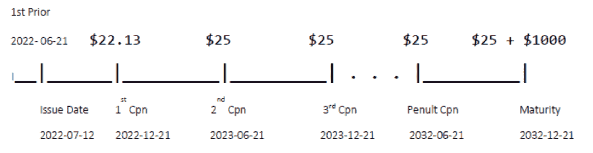

# 第四章：日期和固定收益证券

日期和日期计算可能看起来不是讨论的最引人注目的主题，但在量化金融中至关重要，特别是在固定收益交易和分析中。

与过去的分布式随机数生成类似，金融 C++程序员面临相似的选择：要么编写自己的日期类和函数，要么使用商业或开源的外部库。这在 C++20 中已经改变。它包括一个日期类，该类由整数年、月和日值确定。该类依赖于已经存在的（自 C++11 以来）`std::chrono`的持续时间、时间点和系统时钟 - 即，时间计算 - 以及基于相对纪元的天数的日历计算，并考虑每个月的非均匀天数。

虽然本章的目标是展示如何在金融应用中使用新的日期特性，但`std::chrono`的作者 Howard Hinnant 在他的 GitHub 网站上提供了更多关于其原始开发代码的细节，以及`std::chrono`日期的详细信息{1}。（此后将称为“GitHub 日期代码站点”）。

使用`std::chrono`中的日历选项可以影响年份和月份的添加，但添加天数需要转换为时间点。这些是需要在适当时候讨论的重要操作，但首先让我们来看看 C++20 中如何表示和实例化日期。从那里开始，我们将看看在金融中所需的常见日期计算，一个封装这些功能的类，日计数约定和收益曲线，最后是在估值付息债券中的应用。

# 日期的表示

C++11 将`std::chrono`库引入了标准库中，提供了以下抽象：

+   时间段：在给定时间间隔内的测量方法，例如以分钟、天、毫秒等为单位

+   时间点：相对于纪元的时间段，例如 UNIX 纪元 1970-1-1

+   时钟：指定纪元并标准化持续时间测量的对象{0}

`std::chrono`中的日期基于这些时间基础，但作为新 C++20 功能的一部分，现在也提供了到日历形式的转换。这些可用于涉及年份和月份的计算。

在`std::chrono`中，标准日期由类`std::chrono::year_month_day`的对象表示。这个类有各种构造函数，其中几个在这里讨论。

首先，提供了一个接受年、月和日的构造函数。但是，每个构造函数参数不是整数值，而是必须定义为单独的`std::chrono::year`、`std::chrono::month`和`std::chrono::day`对象。例如，要创建一个保存日期为 2002 年 11 月 14 日的对象，我们将如下创建它。

```
import <chrono>;

std::chrono::year_month_day ymd{ std::chrono::year{2002},
	std::chrono::month{11}, std::chrono::day{14} };
```

或者，通过名称在`std::chrono`中定义单独的常量`month`对象，因此构造上述相同月份的等效方法是用先前示例中构造的月份对象替换为预定义的`November`实例：

```
std::chrono::year_month_day ymd_alt{ std::chrono::year{2002},
	std::chrono::November, std::chrono::day(14) };
```

对于赋值，`/`运算符也已被重载以定义一个`year_month_day`对象：

```
ymd = std::chrono::year{ 2002 } / std::chrono::month{11} / std::chrono::day{14};
```

可以使用不同的顺序，以及整数类型，只要第一个参数是明显的。对于 yyyy/mm/dd 格式，放置

```
ymd = std::chrono::year{ 2002 } / 11 / 14;
```

将产生相同的结果，编译器将 11 和 14 解释为`unsigned`类型。也可以使用 mm/dd/yyyy 格式：`auto mdy = std::chrono::November / 14 / 2002;`

在这种情况下，14 被识别为`unsigned`，年份被识别为`int`。在`std::chrono`中，`month`和`day`类型可以转换为`unsigned`，而`year`只能转换为`int`。上面的示例并非详尽无遗，更全面的列表可以在 GitHub 日期代码网站{1}上找到。

请注意，输出流运算符已被重载为`year_month_day`，因此可以使用`cout`将上述任何内容输出到控制台。例如，

```
cout << ymd << endl;
```

将在屏幕上显示日期为`2002-11-14`

# 1.1 串行表示和日期差异

一个`year_month_day`日期也可以根据自纪元以来的天数来衡量，`system_clock`的默认值是 UNIX 纪元 1970 年 1 月 1 日。类似于 Excel - 其纪元是 1900 年 1 月 1 日 - 这种表示法对于金融中某些类型的日期算术可能很方便，特别是确定两个日期之间的天数。然而，与 Excel 不同，UNIX 纪元由 0 而不是 1 表示，即串行日期是以*自纪元以来的天数*来衡量的。考虑以下示例，日期为 1970-1-1 和 1970-1-2。

```
std::chrono::year_month_day epoch{ date::year{1970}, date::month{1}, date::day{1} };
std::chrono::year_month_day epoch_plus_1{ date::year{1970}, date::month{1}, date::day{2} };
```

然后，可以按如下方式访问相应的串行日期：

```
int first_days_test =
	std::chrono::sys_days(epoch).time_since_epoch().count();		// 0

first_days_test =
	std::chrono::sys_days(epoch_plus_1).time_since_epoch().count();	// 1
```

这些分别返回`int`值 0 和 1。与 Excel 不同，`std::chrono`日期在纪元之前也是有效的，但带有负整数值。在接下来的语句中，返回的值为-1。

```
first_days_test =
	std::chrono::sys_days(epoch_minus_1).time_since_epoch().count();	// -1
```

对于典型的金融交易，通常不需要回溯到 1970 年之前，但在一些领域，如养老金责任的精算估值中，许多退休人员出生在此日期之前。市场的历史模拟也可能使用追溯数十年的数据。

回想一下`year_month_day`类是建立在最初列出的三个`std::chrono`抽象之上的，从技术上讲，在这里发生的是`sys_days`运算符将`ymd`日期返回为`std::chrono::time_point`对象，其中`sys_days`是`time_point`的别名。然后，它的`time_since_epoch`成员函数返回一个`std::chrono::duration`类型。然后，相应的整数值通过`count`函数访问。

在金融中一个重要的计算是两个日期之间的天数。再次使用 `ymd` 作为 2002-11-14，并将 `ymd_later` 初始化为六个月后的日期 - 2003-5-14 - 取得两个 `sys_days` 对象的差异，然后应用 `count` 函数来计算差异：

```
// ymd = 2002-11-14
// ymd_later = 2003-5-14

auto diff = (std::chrono::sys_days(ymd_later) –
	std::chrono::sys_days(ymd)).count();		// 181
```

结果为 181，再次返回为一个 `int`。

接下来，在处理日期时，通常需要执行几个检查，即日期是否有效，是否为闰年，找到一个月中的天数，以及日期是否为周末。在 `std::chrono` 中方便地包含了一些函数来处理这些检查，但在其他情况下，可能需要更多的工作。

# 1.2 年、月和日的访问函数

为了获取年、月和日，提供了在 `year_month_day` 上的访问函数，但它们作为它们各自的 `year`、`month` 和 `day` 对象返回。

```
year()		// returns std::chrono::year
month()		// returns std::chrono::month
day()		// returns std::chrono::day
```

假设我们有两个 `year_month_day` 对象 `date1` 和 `date2`，方便地应用于差异（一个 `duration`）的 `count` 函数，结果是 `int` 类型。

```
(date2.year() - date1.year()).count()		// returns int
(date2.month() - date1.month()).count()		// returns int
(date2.day() - date1.day()).count()			// returns int
```

每个单独访问的年、月和日组件也可以转换为整数（在数学意义上），但需要注意的重要一点是 `year` 可以转换为 `int`，但对于 `month` 或 `day`，这些需要转换为 `unsigned`。

```
auto the_year = static_cast<int>(date1.year());
auto the_month = static_cast<unsigned>(date1.month());
auto the_day = static_cast<unsigned>(date1.day());
```

###### 注意

未来，为了方便起见，我们将使用命名空间别名 `namespace date = std::chrono;`

# 1.3 日期的有效性

`year_month_day` 对象可以设置为无效日期。例如，稍后将看到，将一个日期设置为 1 月 31 日再加一个月会导致 2 月 31 日。此外，构造函数还允许月份和日期值超出范围。不会抛出异常，而是由程序员来检查日期是否有效。幸运的是，可以通过布尔值 `ok` 成员函数轻松实现这一点。在下面的例子中，`ymd` 日期（与上述相同）是有效的，而其后的两个显然是无效的。

```
// date is now an alias for std::chrono

date::year_month_day ymd{ date::year{2002},
	date::month{11}, date::day{14} };

bool torf = ymd.ok();			// true

date::year_month_day negative_year{ date::year{-1000},
	date::October, date::day{10} };

torf = negative_year.ok();		// true – negative year is valid

date::year_month_day ymd_invalid{ date::year{2018},
	date::month{2}, date::day{31} };

torf = ymd_invalid.ok();			// false

date::year_month_day ymd_completely_bogus{ date::year{-2004},
	date::month{19}, date::day{58} };

torf = ymd_completely_bogus.ok();	// false
```

在后续的示例中，`ok` 成员函数将非常有用，特别是在日期操作导致正确的年和月，但在月末情况下设置错误的日期时。很快就会解决这个问题。总之，`year_month_day` 类的消费者需要检查有效性，因为它不会抛出异常或自动调整。

# 1.4 闰年和月末最后一天

您可以轻松地检查一个日期是否为闰年。一个布尔值成员函数，不出所料地称为 `is_leap`，帮助我们处理这个问题：

```
date::year_month_day ymd_leap{ date::year{2016},
	date::month{10}, date::day{26} };

torf = ymd_leap.year().is_leap()		// true
```

在 `year_month_day` 上没有一个成员函数可以返回月的最后一天。可以使用 `std::chrono` 中的一个单独类来解决这个问题，表示月末日期 `year_month_day_last`，从中也可以像以前一样访问其月的最后一天，然后转换为无符号整数。

```
date::year_month_day_last
	eom_apr{ date::year{ 2009 } / date:April / date::last };

auto last_day = static_cast<unsigned>(eom_apr.day());	// result = 30
```

这也可以用作检查日期是否落在月末的一种方法：

```
date::year_month_day ymd_eom{ date::year{2009},
	date::month{4}, date::day{30} };

bool torf = ymd_eom == eom_apr;		// Returns true (torf = "true or false")
```

对于任意日期，月底最后一天也可以确定：

```
date::year_month_day ymd = date::year{ 2024 } / 2 / 21;

year_month_day_last
	eom{ date::year{ ymd.year() } / date::month{ ymd.month() } / date::last };

last_day = static_cast<unsigned>(eom.day());	// result = 29
```

还应注意，`year_month_day_last`类型通过重新分配隐式转换为`year_month_day`类型：

```
ymd = eom_apr;			// ymd is now 2009-04-30
```

更多背景信息可以在{2}中找到。

尽管这有效，但每次调用时都带有创建`year_month_day_last`的开销，并在重新分配时有额外的对象复制，就像上面代码示例的最后一行所示。尽管结果可能有所不同，但在金融系统中管理大量交易和包含固定收益证券的大型投资组合时，这可能会对性能产生负面影响。

在 GitHub 日期代码站点{3}的其他地方提供了一组“`chrono`兼容的低级日期算法”。这些替代方法适用于独立于`year_month_day`类方法的方法，并且它们在文档中的描述中声明这些低级算法是“能够编写自己的日期类的关键算法”。这是我们最终要达到的方向。

要确定月末的最后一天，可以从本组算法提供的代码中推导出一个更有效的用户定义函数，如下所示：

```
// User-defined last_day_of_the_month
unsigned last_day_of_the_month(const std::chrono::year_month_day& ymd)
{
    constexpr std::array<unsigned, 12>
        normal_end_dates{ 31, 28, 31, 30, 31, 30, 31, 31, 30, 31, 30, 31 };

    if (!(ymd.month() == date::February && ymd.year().is_leap()))
    {
        unsigned m = static_cast<unsigned>(ymd.month());
        return normal_end_dates[m - 1];
    }
    else
    {
        return 29;
    }
}
```

这更像是一种通过硬编码非闰年每个月的天数来暴力解决的方法，但它确实避免了额外的对象创建和复制。

这里使用的另一个要点是`constexpr`，这是 C++11 中添加的另一个语言特性。由于`array`的长度和其内容是预先已知的，`constexpr`指示编译器在编译时初始化`end_dates`，因此消除了每次调用`last_day_of_the_month`函数时的重新初始化。接下来有两个相关的要点：

1.  在这种特定情况下使用`constexpr`可能对性能产生重要影响，但在计算密集型代码中多次调用函数的情况下可能有效，例如在投资组合风险模拟和计算中。

1.  大多数金融数据，如市场和交易数据，将不可避免地是动态的，因此在编译时是未知的，因此`constexpr`在金融应用中的使用可能有限。然而，上面的例子演示了何时和如何可以有效地使用它的示例。

# 1.5 周工作日和周末

与月底日期类似，没有成员函数可以检查日期是否落在周末。再次有一个解决方法，我们可以从中得到我们需要的结果。

`std::chrono`包含一个`weekday`类，表示一周的日子，从星期一到星期日，而不仅仅是工作日（这里的术语可能有些令人困惑）。它可以通过在构造函数参数中再次应用`sys_days`运算符来构造。

```
// Define a year_month_day date that falls on a business day (Wednesday)

date::year_month_day ymd_biz_day{ date::year{2022},
	date::month{10}, date::day{26} };	// Wednesday

// Its day of the week can be constructed as a weekday object:
date::weekday dw{ date::sys_days(ymd_biz_day) };
```

从 `iso_encoding` 成员函数返回的无符号整数值可以标识星期几，其中值 1 到 7 分别代表星期一到星期日。流操作符被重载，以便显示缩写的星期几。

```
unsigned iso_code = dw.iso_encoding();
cout << ymd_biz_day << ", " << dw << ", " << iso_code << endl;
```

输出结果是 `2022-10-26, Wed, 3`，这使我们可以定义自己的函数，比如这里的 lambda 函数，来判断一个日期是否为周末。

```
auto is_weekend = [](const date::year_month_day& ymd)->bool
{
	date::weekday dw{ date::sys_days(ymd) };
	return dw.iso_encoding() >= 6;
};
```

现在，还构造一个落在星期六的 `year_month_day` 日期：

```
date::year_month_day ymd_weekend{ date::year{2022},
	date::month{10}, date::day{29} };	// Saturday
```

然后，我们可以使用 lambda 函数来测试每一天是否是工作日。

```
torf = is_weekend(ymd_biz_day);		// false (Wed)
torf = is_weekend(ymd_weekend);		// true (Sat)
```

在 `std::chrono` 中可以找到关于周末的补充信息，详见 {4}。

# 1.6 添加年、月和日

另一个金融重要日期操作是向现有日期添加年、月和日。这些操作尤其适用于生成固定支付计划。添加年或月非常简单，使用 `+=` 运算符，但添加天数则涉及不同的方法。

## 1.6.1 添加年份

添加年份非常简单。例如，将两年添加到 2002-11-14，然后再向结果添加另外 18 年。需要注意，要添加的年数必须表示为 `std::chrono::years` 对象，这是一个代表一年的 `duration` 的别名。

```
// Start with 2002-11-14
date::year_month_day ymd{ date::year{2002}, date::month{11}, date::day{14} };

ymd += date::years{ 2 };		// ymd is now 2004-11-14
ymd += date::years{ 18 };		// ymd is now 2022-11-14
```

然而，我们遇到了一个问题，如果日期是闰年二月的最后一天。向 2016-02-29 加两年会导致无效年份。

```
date::year_month_day
	ymd_feb_end{ date::year{2016}, date::month{2}, date::day{29} };

ymd_feb_end += date::years{ 2 };	// Invalid result: 2018-02-29
```

在 `std::chrono` 中，日期既不会抛出异常，也不会调整日期，因此开发人员需要处理将年份添加到闰年二月 29 日的情况。

## 1.6.2 添加月份和月末边缘情况

向 `year_month_day` 对象添加月份类似于添加年份，但现在需要处理多个月末边缘情况，因为不同月份的天数不同，还有闰年中二月的情况。

如果没有涉及月末日期，操作非常直接，类似于添加年份，使用加法赋值运算符。与添加年份类似，月份数量需要表示为 `duration` 对象，在这种情况下是一个代表一个月的周期的别名。

```
date::year_month_day ymd{ date::year{2002}, date::month{11}, date::day{14} };
ymd += date::months(1);			// Result: 2002-12-14
ymd += date::months(18);		// Result: 2004-06-14
```

也可以使用减法赋值：

```
ymd -= date::months(2);		// Result: 2004-04-14
```

同样，使用 `+=` 运算符进行月末情况操作可能会导致无效日期。为了验证这一点，构造以下月末日期：

```
date::year_month_day ymd_eom_1{ date::year{2015}, date::month{1},
	date::day{31} };
date::year_month_day ymd_eom_2{ date::year{2014}, date::month{8},
	date::day{31} };
date::year_month_day ymd_eom_3{ date::year{2016}, date::month{2},
	date::day{29} };
```

简单地尝试添加月份会导致无效日期：

```
ymd_eom_1 += date::months{ 1 };		// 2015-02-31 is not a valid date
ymd_eom_2 += date::months{ 1 };		// 2014-09-31 is not a valid date
ymd_eom_3 += date::months{ 12 };	// 2017-02-29 is not a valid date
```

虽然结果无效，但每一个年份和月份都是正确的。也就是说，例如，将 2015-01-31 加一个月应映射到 2015-02-28。

反过来说，如果我们从 2015-02-28 开始，再加一个月，结果将是正确的：2015-03-28。

回顾先前定义的`last_day_of_the_month`函数，一个解决方法相当简单。添加赋值是天真地应用的，但如果结果无效，则必须是由于天数值超过了一个月中实际天数。在这种情况下，因为结果年份和月份将是有效的，所以这只是将天数重置为该月的天数。

```
auto add_months = [](date::year_month_day& ymd, unsigned mths) -> void
{
    ymd += date::months(mths);    // Naively attempt the addition

    if (!ymd.ok())
    {
        ymd = ymd.year() / ymd.month() / date::day{ last_day_of_the_month(ymd) };
    }
}
```

## 1.6.3 添加天数

对于年份和月份而言，并没有为添加天数定义`+=`运算符。因此，在添加天数之前，我们需要获取`sys_days`的等效值。

```
date::year_month_day ymd{date::year(2022), date::month(10), date::day(7)};

// Obtain the sys_days equivalent of ymd, and then add three days:
auto add_days = date::sys_days(ymd3) + date::days(3);  // ymd still = 2022/10/07
```

注意，在这一点上，`ymd`还没有被修改，而结果`add_days`也是一个`sys_days`类型。为了将`year_month_day`对象设置为等效值，赋值运算符提供了隐式转换。类似于先前应用的`sys_days`，我们只需将原始`ymd`日期更新为三天后：

```
ymd = add_days;	// Implicit conversion to year_month_day
				// ymd is now = 2022-10-10
```

更多有关添加天数的信息可以在{5}中找到。

# 一个日期类包装器

正如你现在可能看到的那样，管理`std::chrono`日期的所有复杂性最终可能变得复杂起来。因此，我们现在将概述财务日期计算的典型要求，并在基于`year_month_day`成员的类中声明它们。这样，调整和`year_month_day`函数调用将在接口成员函数和运算符的后面一次性实现，这些运算符对于消费者来说可能更直观。这些可以分为两大类，即检查日期可能状态和执行日期的算术操作。我们已经涵盖的总结列在以下的要求列表中。大多数这些结果将被集成到类的实现中。

**状态**

+   月份中的天数

+   闰年

**算术操作**

+   两个日期之间的天数

+   添加

    +   年份

    +   天数

    +   月份

我们想要的额外功能列在下面。这些额外要求也将成为实现的一部分。

**访问器**

+   年、月、日

+   串行日期整数表示（自纪元以来的天数）

+   `year_month_day`数据成员

**比较运算符**

```
==
<=>
```

首先，类声明将为我们提供一个实现路线图来遵循。

## 类声明

我们将上述列出的要求整合到一个名为`ChronoDate`的类中。它将包装一个`std::chrono::year_month_day`对象以及一些在财务计算中有用的关联成员函数。日期对象的唯一其他数据成员将是日期对象的串行日期表示。

在处理成员函数之前，让我们从构造函数开始。

### 构造函数

为了方便起见，提供了一个构造函数，它接受整数值用于年、月和日，而不是要求用户创建单独的 `year`、`month` 和 `day` 对象。`ChronoDate{ int year, unsigned month, unsigned day }`; 请注意，年份的参数是 `int`，而月份和日期的参数是 `unsigned`。这是由于`year_month_day`类的设计，正如前面讨论的那样。

正如我们稍后将看到的方便起见，第二个构造函数将接受一个 `year_month_day` 对象：

```
ChronoDate{ date::year_month_day };
```

最后，一个默认构造函数将构造一个设置为 UNIX 纪元的 `ChronoDate`。

## 公共成员函数和运算符

这些大部分应该从下面的成员函数声明中可以自解释。此外，主要是将先前开发的功能集成到各自的成员函数中。至于比较运算符 `==` 和 ```<⇒```，以及友元流运算符，这些已经在 `year_month_day` 类上定义好了，因此只需将它们包装成 `ChronoDate` 上的相同运算符即可。

在声明中还有一个未涵盖的公共函数 `weekend_roll`，它将用于在日期落在星期六或星期日时将日期滚动到最近的工作日。其实现将很快介绍。

```
// Check state:
int days_in_month() const;
bool leap_year() const;

// Arithmetic operations:
unsigned operator - (const ChronoDate& rhs) const;
ChronoDate& add_years(int rhs_years);
ChronoDate& add_months(int rhs_months);
ChronoDate& add_days(int rhs_days);

// Accessors
int year() const;
unsigned month() const;
unsigned day() const;
int serial_date() const;
date::year_month_day ymd() const;

// Modfying function
ChronoDate& weekend_roll(); 		 // Roll to business day if weekend

// Operators
bool operator == (const ChronoDate& rhs) const;
std::strong_ordering operator <=> (const ChronoDate& rhs) const;

// friend operator so that we can output date details with cout
friend std::ostream& operator << (std::ostream& os, const ChronoDate& rhs);
```

## 私有成员和辅助函数

两个私有成员变量将存储基础的 `year_month_day` 对象和日期的序列化表示。一个私有函数将封装所需的函数调用，以获取自 UNIX 纪元以来的天数，以便可以在构造时设置序列化日期，并且在修改类对象的状态时随时更新。

```
private:
    date::year_month_day date_;
    int serial_date_;
    void reset_serial_date_();
```

## 类的实现

由于我们几乎已经具备了所有必要的功能，剩下的主要是将其包装成成员函数，再实现 `weekend_roll` 函数和一些私有辅助函数。此外，还介绍了两个构造函数，以及私有的 `reset_serial_date_` 方法，它将计算并设置日期的序列化表示，无论是在构造时，还是在修改活动 `ChronoDate` 的状态时。

### 构造函数

第一个声明的构造函数的实现允许使用整数值（`int` 和 `unsigned`）创建一个 `ChronoDate` 的实例，而不是需要单独的 `year`、`month` 和 `day` 对象。

```
ChronoDate::ChronoDate(int year, unsigned month, unsigned day) :
	date_{ date::year{year} / date::month{month} / date::day{day} }
{
	if(!date_.ok())		// std::chrono member function to check if valid date
	{
		throw std::exception e{ "ChronoDate constructor: Invalid date." };
	}
	reset_serial_date_();
}
```

还要记住，由于可能构造无效的 `year_month_day` 对象，比如 2 月 30 日，构造函数中还包括一个验证检查，利用 `year_month_day` 上的 `ok` 成员函数。在构造日期时还需要进行的一个设置是序列化日期。这委托给了私有方法 `reset_serial_date_`。正如本章开头所示，这是对 `sys_days` 操作符的应用，以提供自 UNIX 纪元以来的天数。

```
void ChronoDate::reset_serial_date_()
{
	serial_date_ = date::sys_days(date_).time_since_epoch().count();
}
```

这个函数也将从每个修改成员函数中调用。

最后，默认构造函数仅将日期设置为 UNIX 纪元，并将序列日期初始化为 0：

```
ChronoDate::ChronoDate():date_{date::year(1970), date::month{1}, date::day{1} } :
    serial_date_{0} {}
```

### 成员函数和运算符

以下描述了先前在声明部分引入的函数的实现。

#### 访问器

为序列日期和`year_month_day`成员实现访问器的实现是微不足道的，但在返回年份、月份和日期的整数值时需要做更多工作。`std::chrono::year`对象可以转换为`int`，而`month`和`day`可以转换为`unsigned`类型。考虑到这一点，它们的访问器实现是直接的：

```
int ChronoDate::year() const
{
	return static_cast<int>(date_.year());
}

unsigned ChronoDate::month() const
{
	return static_cast<unsigned>(date_.month());
}

unsigned ChronoDate::day() const
{
	return static_cast<unsigned>(date_.day());
}
```

#### 状态方法

检查日期是否为闰年只需包装相应的`year_month_day`成员函数即可。

```
bool ChronoDate::leap_year() const
{
	return date_.year().is_leap();
}
```

获取月份中的天数更加复杂，但只是对来自第[1.4]节中`std::chrono`低级算法的函数进行了重新调整。

```
unsigned ChronoDate::days_in_month() const
{
	unsigned m = static_cast<unsigned>(date_.month());
	std::array<unsigned, 12>
        normal_end_dates{ 31, 28, 31, 30, 31, 30, 31, 31, 30, 31, 30, 31 };

	return (m != 2 || !date_.year().is_leap() ? normal_end_dates[m - 1] : 29);
}
```

#### 算术运算

这些是将用于典型固定收益应用程序的核心成员函数，例如计算年分数和生成支付计划。首先，让我们重新审视计算两个日期之间天数的计算。由于我们已经在类上存储了序列日期，并且仅在构造或修改日期时更新它，因此我们可以删除`sys_days`转换和函数调用，并将减法运算符实现为整数等效值之间的差异。

```
unsigned ChronoDate::operator - (const ChronoDate& rhs) const
{
	return this->serial_date_ - rhs.serial_date_;
}
```

添加年份和月份也很简单，因为现在我们有了处理问题月末问题的方法。添加年份时唯一的问题是，如果结果日期落在非闰年的 2 月 29 日，那么可以通过将天数值重置为 28 来轻松解决此问题。请注意，由于结果基于底层的`year_month_day` `+=`运算符，对象的状态被修改，因此有必要同时更新序列日期。

```
ChronoDate& ChronoDate::add_years(int rhs_years)
{
	// Proceed naively:
	date_ += date::years(rhs_years);

	if (!date_.ok())
	{
		date_ = date_.year() / date_.month() / 28;
	}

	reset_serial_date_();

	return *this;
}
```

当向日期添加月份时，情况变得更加复杂，因为每个月的天数不同，并且在 2 月中有闰年条件，但现在有了`days_in_month`成员函数，这变得相对容易。再次尝试添加月份时，如果结果月份无效，则调整天数。这种错误状态只有在朴素结果的天数超过其相应月份的天数时才会发生。

```
ChronoDate& ChronoDate::add_months(int rhs_months)
{
	date_ += date::months(rhs_months);    // Naively attempt the addition

	// If the date is invalid, it is because the
	// result is an invalid end-of-month:
	if (!date_.ok())
	{
		date_ = date_.year() / date_.month() / date::day{ days_in_month() };
	}

	reset_serial_date_();

	return *this;
}
```

正如前面所见，没有添加天数的加法赋值运算符，因此在`std::chrono`中，这将需要转换为`sys_days`。

```
ChronoDate& ChronoDate::add_days(int rhs_days)
{
	date_ = date::sys_days(date_) + date::days(rhs_days);

	return *this;
}
```

注意，将`sys_days`的总和和要添加的`days`隐式转换回`year_month_day`对象时，将分配给`date_`成员。关于此背后的更多细节也在{5}中可用。

#### 工作日滚动规则

我们还没有讨论的一个重要函数是将周末日期滚动到下一个工作日的函数。

在实践中，有各种常用的计息方法。在本讨论中，我们将选择一个在实践中经常使用的方法，即 Modified Following 规则。在继续之前，让我们回顾一下使用`std::chrono`中的`weekday`类确定星期几的方法。

如前所述，“weekday”这个术语可能有些混淆。它不是指星期一到星期五，而是指一周中的“星期几”。`iso_encoding`成员函数将返回每周的整数代码，从星期一的 1 开始，到星期日的 7；因此，6 或 7 的值将表示日期落在周末。

`weekend_roll`函数将简单地重用这个功能，首先确定日期是否落在周末。如果是，它将首先朴素地向前滚动到下一个星期一。然而，如果这个新日期进到了下个月，它将滚动回到上个工作日，即原月份的星期五。这就是为什么首先存储原月份的原因。

```
ChronoDate& ChronoDate::weekend_roll() {
    date::weekday wd{ sys_days(date_) };
    month orig_mth{ date_.month() };

    unsigned wdn{ wd.iso_encoding() }; // Mon =  1, ..., Sat = 6, Sun = 7
    if (wdn > 5) date_ = sys_days(date_) + days(8 - wdn);

    // If advance to next month, roll back; also handle roll to January
    if (orig_mth < date_.month()
        || (orig_mth == December && date_.month() == January))
            date_ = sys_days(date_) - days(3);

    reset_serial_date_();
    return *this;
}
```

滚动日期将被修改，因此在这里也需要更新序列日期。

#### 比较和流运算符

比较运算符`==`和```<⇒```是即时的，因为它们对`year_month_day`进行了定义。我们只需要确保对```<⇒```使用`std::strong_ordering`作为返回类型，因为最终比较的是两个整数值 - 自历元以来的天数。

```
bool ChronoDate::operator == (const ChronoDate& rhs) const
{
	return date_ == rhs.date_;
}

std::strong_ordering ChronoDate::operator <=> (const ChronoDate& rhs) const
{
	return date_ <=> rhs.date_;
}
```

我们还可以依靠`year_month_day`的流操作符，并将其定义为`ChronoDate`的友元运算符。

```
// This is a 'friend' of the ChronoDate class
export std::ostream& operator << (std::ostream& os, const ChronoDate& rhs)
{
	os << rhs.ymd();
	return os;
}
```

###### 注意

因为这个操作符是`ChronoDate`类的友元，所以即使在同一个模块中包含它，也需要单独的实现`export`。

现在`ChronoDate`类已准备就绪，我们可以继续处理与固定收益交易相关的日计数约定和其他通常所需的组件。

# 日计数基准

日计数基准用于将两个日期之间的间隔转换为以年为单位的时间，或者*年分数*，在固定收益交易中通常被称为。每当进行利息计算时都会使用日计数基准。利率由三个属性定义：年百分比值，例如 3％，类型，例如简单或复利，以及日计数基准。考虑一个定期存款，1000 美元以 3％复利投资，投资于 2022 年 10 月 25 日，到期于 2023 年 12 月 31 日。计算 F，即到期时投资的价值的公式为

<math alttext="upper F equals 1000 left-parenthesis 1 plus 0.03 right-parenthesis Superscript t" display="block"><mrow><mi>F</mi> <mo>=</mo> <mn>1000</mn> <msup><mrow><mo>(</mo><mn>1</mn><mo>+</mo><mn>0</mn><mo>.</mo><mn>03</mn><mo>)</mo></mrow> <mi>t</mi></msup></mrow></math>

*t*的值取决于日计数基准。美国和欧盟的货币市场计算最可能使用 Actual/360 日计数基准：

<math alttext="upper A c t Baseline 360 left-parenthesis d 1 comma d 2 right-parenthesis equals StartFraction d 2 minus d 1 Over 360 EndFraction" display="block"><mrow><mi>A</mi> <mi>c</mi> <mi>t</mi> <mn>360</mn> <mrow><mo>(</mo> <msub><mi>d</mi> <mn>1</mn></msub> <mo>,</mo> <msub><mi>d</mi> <mn>2</mn></msub> <mo>)</mo></mrow> <mo>=</mo> <mfrac><mrow><msub><mi>d</mi> <mn>2</mn></msub> <mo>-</mo><msub><mi>d</mi> <mn>1</mn></msub></mrow> <mn>360</mn></mfrac></mrow></math>

在英国、加拿大和澳大利亚的货币市场中，实际/365 日计算基数 —— 将 360 替换为 365 —— 更为常见。在更广泛的固定收益交易中使用的其他常见日计算基数包括 30/360 方法，该方法假设每个月有 30 天，一年有 360 天。实际/实际方法使用分子和分母中的实际天数。在股票组合管理中，经常使用实际/252 基数，假设一年有 252 个工作日。

在 C++中实现日计算约定是接口继承能够有用的一个例子。我们可以定义一个纯抽象基类，强制实施日计算调整年分数的实现，然后由派生类实施具体的计算。

接口简单声明一个纯虚拟的 `operator()` 用于派生类的计算。

```
export class DayCount
{
public:
	virtual double operator()
        (const ChronoDate& date1, const ChronoDate& date2) const = 0;

	virtual ~DayCount() = default;
};
```

实际/365 年分数计算是微不足道的：

```
export class Act365 : public DayCount
{
public:
	double operator() (const ChronoDate& date1, const ChronoDate& date2) const
        override
    {
        return (date2 - date1) / 365.0;
    }
};
```

一个 `Act360` 类将与之相同，只是分母被 360 替换。

30/360 情况稍微复杂，因为分子必须根据公式 {放在这里} 首先进行计算。

日值的月末调整将取决于 30/360 的具体形式，其中有几种可以依赖于交易桌的地理位置。在美国，国际掉期与衍生品协会（ISDA）版本{6}常用，并在下面的示例中作为私有的 `date_diff_` 助手函数实现。然后，结果在公共操作符重载中除以 360。

```
export class Thirty360 : public DayCount
{
public:
	double operator()
        (const ChronoDate& date1, const ChronoDate& date2) const override
    {
        return static_cast<double>( date_diff_(date1, date2)) / 360.0;
    }

private:
	unsigned date_diff_(const ChronoDate& date1, const ChronoDate& date2) const
	{
	    unsigned d1, d2;
        d1 = date1.day();
        d2 = date2.day();

        auto f = [](unsigned& d) {
	    if (d == 31)
		{
			d = 30;
		}
	}

        f(d1);
        f(d2);

        return 360 * (date2.year() - date1.year()) + 30 * (date2.month() –
            date1.month()) + d2 - d1;
    }
};
```

然后，举几个例子：

```
	Act365 act_365{};
	Act360 act_360{};
	Thirty360 thirty_360{};

	ChronoDate sd1{ 2021, 4, 26 };
	ChronoDate ed1{ 2023, 10, 26 };
	ChronoDate sd2{ 2022, 10, 10 };
	ChronoDate ed2{ 2023, 4, 10 };

	auto yf_act_365_01 = act_365(sd1, ed1);	// 2.50137
	auto yf_act_365_02 = act_365(sd2, ed2);	// 0.49863

	auto yf_act_360_01 = act_360(sd1, ed1);	// 2.53611
	auto yf_act_360_02 = act_360(sd2, ed2);	// 0.505556

	auto yf_thirty_01 = thirty_360(sd1, ed1);	// 2.5
	auto yf_thirty_02 = thirty_360(sd2, ed2);	// 0.5
```

结果显示在注释中。注意，只有 30/360 日计算基数产生半年的年分数完全精确。

作为对日计算基数 {5.5}（斯泰纳）的快速应用，考虑获取短期政府国债的价格。在美国，这些国债的到期期限从四个月到一年不等，定价基于实际/365 天。在英国，到期期限可能长达六个月，使用实际/360 天基数。我们可以编写一个估值函数，通过运行时多态性来适应任意的日计算基数，因此美国和英国的情况可以使用相同的函数定价。

```
double treasury_bill(const ChronoDate& sett_date,
	const ChronoDate& maturity_date, double mkt_yield, double face_value,
	const DayCount& dc)
{
	// pp 40-41, Steiner
	return face_value / (1.0 + mkt_yield * dc(sett_date, maturity_date));
}
```

# 收益曲线

收益曲线源自市场数据 —— 一组离散日期上的固定点 —— 截至其结算日期（价格观察日，例如当前交易日）。固定收益头寸的估值过程依赖于从贴现因子获得的标准化收益曲线，以计算每笔未来支付的现值。这个过程的审查在下一节中详细说明。然后，这些结果将在随后的收益曲线类设计中实施。

## 从市场数据中派生收益曲线

本质上，收益率是从不同角度看待的利率。如果将资金投资于已知利率的存款账户，则可以计算出投资在未来某个日期的累积价值。然而，假设我们可以在 2022 年 10 月 25 日投资 1000 美元，并在 2023 年 12 月 31 日收到 1035.60 美元。为了与其他投资进行比较，我们计算其收益率。假设复利和实际/365 天计息基准，则

<math alttext="1000 left-parenthesis 1 plus y right-parenthesis Superscript 432 slash 365 Baseline equals 1035.60" display="block"><mrow><mn>1000</mn> <msup><mrow><mo>(</mo><mn>1</mn><mo>+</mo><mi>y</mi><mo>)</mo></mrow> <mrow><mn>432</mn><mo>/</mo><mn>365</mn></mrow></msup> <mo>=</mo> <mn>1035</mn> <mo>.</mo> <mn>60</mn></mrow></math>

从中我们找到了产量

<math alttext="y equals exp left-parenthesis ln left-parenthesis 1035.60 slash 1000 right-parenthesis times 365 slash 432 right-parenthesis minus 1 equals 3 percent-sign" display="block"><mrow><mi>y</mi> <mo>=</mo> <mo form="prefix">exp</mo> <mo>(</mo> <mo form="prefix">ln</mo> <mo>(</mo> <mn>1035</mn> <mo>.</mo> <mn>60</mn> <mo>/</mo> <mn>1000</mn> <mo>)</mo> <mo>×</mo> <mn>365</mn> <mo>/</mo> <mn>432</mn> <mo>)</mo> <mo>-</mo> <mn>1</mn> <mo>=</mo> <mn>3</mn> <mo>%</mo></mrow></math>

一般而言，收益率曲线是时间的函数，记为 <math alttext="y left-parenthesis t right-parenthesis"><mrow><mi>y</mi> <mo>(</mo> <mi>t</mi> <mo>)</mo></mrow></math>，并且是由市场数据构建的，如国库券、互换和债券。时间值以年（或年分数）为单位。

这些产品都有已知的未来现金流，被称为固定收益证券。此外，每种固定收益证券都有其自己的收益类型（简单、折扣或复利），以及其自己的计息基准，这些可能在单一产品组内有所不同。为避免使用多种利率类型和计息基准，收益率曲线通常将其收益定义为以实际/365 天计息基准连续复利。

为了说明收益率曲线的输入是如何推导出来的，考虑一个美国国库券；其收益类型为折扣，计息基准为 Act/360，市场报价为该券的收益率。假设面值为*F*，到期日期为*m*，结算时的市场收益率为<math alttext="y Subscript m"><msub><mi>y</mi> <mi>m</mi></msub></math>。则该券的价格*P*为

<math alttext="upper P equals upper F left-parenthesis 1 minus normal upper A normal c normal t Baseline 360 left-parenthesis s comma m right-parenthesis y Subscript m Baseline right-parenthesis" display="block"><mrow><mi>P</mi> <mo>=</mo> <mi>F</mi> <mfenced separators="" open="(" close=")"><mn>1</mn> <mo>-</mo> <mi>Act</mi> <mn>360</mn> <mrow><mo>(</mo> <mi>s</mi> <mo>,</mo> <mi>m</mi> <mo>)</mo></mrow> <msub><mi>y</mi> <mi>m</mi></msub></mfenced></mrow></math>

对于收益率曲线，对应的收益率为 <math alttext="y left-parenthesis t right-parenthesis"><mrow><mi>y</mi> <mo>(</mo> <mi>t</mi> <mo>)</mo></mrow></math>，其中 <math alttext="t equals normal upper A normal c normal t Baseline 365 left-parenthesis s comma m right-parenthesis"><mrow><mi>t</mi> <mo>=</mo> <mi>Act</mi> <mn>365</mn> <mo>(</mo> <mi>s</mi> <mo>,</mo> <mi>m</mi> <mo>)</mo></mrow></math>，以便

<math alttext="upper P e Superscript t y left-parenthesis t right-parenthesis Baseline equals upper F" display="block"><mrow><mi>P</mi> <msup><mi>e</mi> <mrow><mi>t</mi><mi>y</mi><mo>(</mo><mi>t</mi><mo>)</mo></mrow></msup> <mo>=</mo> <mi>F</mi></mrow></math>

$y(t)$的值可以从这两个方程中找到。它是

<math alttext="y left-parenthesis t right-parenthesis equals StartFraction minus ln left-parenthesis 1 minus normal upper A normal c normal t Baseline 360 left-parenthesis s comma m right-parenthesis y Subscript m Baseline right-parenthesis Over t EndFraction" display="block"><mrow><mi>y</mi> <mrow><mo>(</mo> <mi>t</mi> <mo>)</mo></mrow> <mo>=</mo> <mfrac><mrow><mo>-</mo><mo form="prefix">ln</mo><mo>(</mo><mn>1</mn><mo>-</mo> <mi>Act</mi> <mn>360</mn><mrow><mo>(</mo><mi>s</mi><mo>,</mo><mi>m</mi><mo>)</mo></mrow><msub><mi>y</mi> <mi>m</mi></msub> <mo>)</mo></mrow> <mi>t</mi></mfrac></mrow></math>

任何用于创建收益率曲线的一组利率产品都必须具有相同的结算日期至关重要。让产品的到期日期为*d*[1],< *d*[2] < …​ < *d[n]*，其中 *s* < *d*[1]，关联的收益率为*y*[1], *y*[2], …​, *y*[n]，其中 <math alttext="y Subscript i Baseline equals y left-parenthesis t Subscript i Baseline right-parenthesis"><mrow><msub><mi>y</mi> <mi>i</mi></msub> <mo>=</mo> <mi>y</mi> <mrow><mo>(</mo> <msub><mi>t</mi> <mi>i</mi></msub> <mo>)</mo></mrow></mrow></math> 和 *t[i]* = Act365(*s*,*d[i]*). 由于这些收益率是针对一个以结算日期为第一天的日期区间计算的，因此这些收益率被称为即期收益率。

有许多连续曲线穿过这些点

<math alttext="left-parenthesis t 1 comma y 1 right-parenthesis comma left-parenthesis t 2 comma y 2 right-parenthesis comma ellipsis comma left-parenthesis t Subscript n Baseline comma y Subscript n Baseline right-parenthesis" display="block"><mrow><mrow><mo>(</mo> <msub><mi>t</mi> <mn>1</mn></msub> <mo>,</mo> <msub><mi>y</mi> <mn>1</mn></msub> <mo>)</mo></mrow> <mo>,</mo> <mrow><mo>(</mo> <msub><mi>t</mi> <mn>2</mn></msub> <mo>,</mo> <msub><mi>y</mi> <mn>2</mn></msub> <mo>)</mo></mrow> <mo>,</mo> <mo>⋯</mo> <mo>,</mo> <mrow><mo>(</mo> <msub><mi>t</mi> <mi>n</mi></msub> <mo>,</mo> <msub><mi>y</mi> <mi>n</mi></msub> <mo>)</mo></mrow></mrow></math>

选择适当的曲线是收益曲线的使用者所做的商业决策。这通常基于一种采用特定插值方法的曲线拟合技术。

### 贴现因子

考虑在时间 *m* 进行单位支付，其在结算日期 *s* < *m* 的价值是多少？设 *P*(*s*,*m*) 为在结算日期支付的价格，设 *t*=Act365(*s*,*m*)，设 *y*(*t*) 为相关收益率。那么

<math alttext="upper P left-parenthesis s comma m right-parenthesis e Superscript t y left-parenthesis t right-parenthesis Baseline equals 1" display="block"><mrow><mi>P</mi> <mrow><mo>(</mo> <mi>s</mi> <mo>,</mo> <mi>m</mi> <mo>)</mo></mrow> <msup><mi>e</mi> <mrow><mi>t</mi><mi>y</mi><mo>(</mo><mi>t</mi><mo>)</mo></mrow></msup> <mo>=</mo> <mn>1</mn></mrow></math>

从中可以得到 *P*(*s*,*m*) = e^(*-ty*(*t*)). 现在 *P*(*s*,*m*) 是在日期 *s* 看到的现值，用于在日期 *m* 进行单位支付。换句话说，这是从 *s* 到 *m* 期间的贴现因子。由于 *y*(*t*) 是即期收益率，这是一个即期贴现因子。

### 远期贴现因子

我们如何计算从时间 *d*[1] 开始到时间 *d*[2] 结束的期间的贴现因子，其中 *s* < *d*[1] \leq d_2？

考虑在时间 *d*[2] 进行单位支付，并且让其在 *d*[1] 的价值表示为 *P*(*s*; *d*[1],*d*[2])。其即期价值 - 因此参数 *s* - 是

<math alttext="upper P left-parenthesis s comma d 1 right-parenthesis upper P left-parenthesis s semicolon d 1 comma d 2 right-parenthesis" display="block"><mrow><mi>P</mi> <mrow><mo>(</mo> <mi>s</mi> <mo>,</mo> <msub><mi>d</mi> <mn>1</mn></msub> <mo>)</mo></mrow> <mi>P</mi> <mrow><mo>(</mo> <mi>s</mi> <mo>;</mo> <msub><mi>d</mi> <mn>1</mn></msub> <mo>,</mo> <msub><mi>d</mi> <mn>2</mn></msub> <mo>)</mo></mrow></mrow></math>

为了避免套利机会，我们必须有

<math alttext="upper P left-parenthesis s comma d 2 right-parenthesis equals upper P left-parenthesis s comma d 1 right-parenthesis upper P left-parenthesis s semicolon d 1 comma d 2 right-parenthesis comma s o t h a t" display="block"><mrow><mi>P</mi> <mrow><mo>(</mo> <mi>s</mi> <mo>,</mo> <msub><mi>d</mi> <mn>2</mn></msub> <mo>)</mo></mrow> <mo>=</mo> <mi>P</mi> <mrow><mo>(</mo> <mi>s</mi> <mo>,</mo> <msub><mi>d</mi> <mn>1</mn></msub> <mo>)</mo></mrow> <mi>P</mi> <mrow><mo>(</mo> <mi>s</mi> <mo>;</mo> <msub><mi>d</mi> <mn>1</mn></msub> <mo>,</mo> <msub><mi>d</mi> <mn>2</mn></msub> <mo>)</mo></mrow> <mo>,</mo> <mi>s</mi> <mi>o</mi> <mi>t</mi> <mi>h</mi> <mi>a</mi> <mi>t</mi></mrow></math><math alttext="upper P left-parenthesis s semicolon d 1 comma d 2 right-parenthesis equals StartFraction upper P left-parenthesis s comma d 2 right-parenthesis Over upper P left-parenthesis s comma d 1 right-parenthesis EndFraction" display="block"><mrow><mi>P</mi> <mrow><mo>(</mo> <mi>s</mi> <mo>;</mo> <msub><mi>d</mi> <mn>1</mn></msub> <mo>,</mo> <msub><mi>d</mi> <mn>2</mn></msub> <mo>)</mo></mrow> <mo>=</mo> <mfrac><mrow><mi>P</mi><mo>(</mo><mi>s</mi><mo>,</mo><msub><mi>d</mi> <mn>2</mn></msub> <mo>)</mo></mrow> <mrow><mi>P</mi><mo>(</mo><mi>s</mi><mo>,</mo><msub><mi>d</mi> <mn>1</mn></msub> <mo>)</mo></mrow></mfrac></mrow></math>

替换即期贴现因子：

<math alttext="upper P left-parenthesis s semicolon d 1 comma d 2 right-parenthesis equals StartFraction e Superscript minus t 2 y left-parenthesis t 2 right-parenthesis Baseline Over e Superscript minus t 1 y left-parenthesis t 1 right-parenthesis Baseline EndFraction equals e Superscript t 1 y left-parenthesis t 1 right-parenthesis minus t 2 y left-parenthesis t 2 right-parenthesis" display="block"><mrow><mi>P</mi> <mrow><mo>(</mo> <mi>s</mi> <mo>;</mo> <msub><mi>d</mi> <mn>1</mn></msub> <mo>,</mo> <msub><mi>d</mi> <mn>2</mn></msub> <mo>)</mo></mrow> <mo>=</mo> <mfrac><msup><mi>e</mi> <mrow><mo>-</mo><msub><mi>t</mi> <mn>2</mn></msub> <mi>y</mi><mrow><mo>(</mo><msub><mi>t</mi> <mn>2</mn></msub> <mo>)</mo></mrow></mrow></msup> <msup><mi>e</mi> <mrow><mo>-</mo><msub><mi>t</mi> <mn>1</mn></msub> <mi>y</mi><mrow><mo>(</mo><msub><mi>t</mi> <mn>1</mn></msub> <mo>)</mo></mrow></mrow></msup></mfrac> <mo>=</mo> <msup><mi>e</mi> <mrow><msub><mi>t</mi> <mn>1</mn></msub> <mi>y</mi><mrow><mo>(</mo><msub><mi>t</mi> <mn>1</mn></msub> <mo>)</mo></mrow><mo>-</mo><msub><mi>t</mi> <mn>2</mn></msub> <mi>y</mi><mrow><mo>(</mo><msub><mi>t</mi> <mn>2</mn></msub> <mo>)</mo></mrow></mrow></msup></mrow></math>

由于 *d*[1] > *s*，*P*(*s*;_d_[1],*d*[2]) 是一个远期贴现因子。

接下来的部分将描述 C++ 中的收益曲线框架，然后是一个简单的收益曲线示例及其用于估值债券的用法

## 一个收益曲线类

收益率曲线类的基本功能将返回两个任意日期之间的连续复利前向折现因子，如前一节详细说明。通过点 <math alttext="left-parenthesis t 1 comma y 1 right-parenthesis comma left-parenthesis t 2 comma y 2 right-parenthesis comma ellipsis comma left-parenthesis t Subscript n Baseline comma y Subscript n Baseline right-parenthesis"><mrow><mrow><mo>(</mo> <msub><mi>t</mi> <mn>1</mn></msub> <mo>,</mo> <msub><mi>y</mi> <mn>1</mn></msub> <mo>)</mo></mrow> <mo>,</mo> <mrow><mo>(</mo> <msub><mi>t</mi> <mn>2</mn></msub> <mo>,</mo> <msub><mi>y</mi> <mn>2</mn></msub> <mo>)</mo></mrow> <mo>,</mo> <mo>⋯</mo> <mo>,</mo> <mrow><mo>(</mo> <msub><mi>t</mi> <mi>n</mi></msub> <mo>,</mo> <msub><mi>y</mi> <mi>n</mi></msub> <mo>)</mo></mrow></mrow></math> 的结果曲线拟合可以基于文献中的大量数值方法。例如，这些可以是从简单的线性插值收益率曲线到更复杂的示例，如立方样条插值曲线、最平滑收益率曲线{7}或单调凸方法{8}。

在较高层面上，我们可以定义一个抽象基类，该类

1.  基于上述结果，提供一种将市场收益率数据转换为连续复利收益率的常用方法{[4.1]}。

1.  要求派生类实现自己的曲线拟合方法作为私有成员函数

{UML Diagram Here}

基类将包含一个非虚公共函数，用于计算两个日期之间的前向折现因子，使用从每个派生类的重载`yield_curve_`方法确定的插值收益率。假定每个派生类确定的插值收益率使用 Act/365 日计算基础进行连续复利。重载的`yield_curve_`方法将依赖于与特定结算日期相关的市场数据。

```
export class YieldCurve
{
public:
	// d1 <= d2 < infinity
	double discount_factor(const ChronoDate& d1, const ChronoDate& d2) const;
	virtual ~YieldCurve() = default;

protected:
	ChronoDate settle_;

private:
	Act365 act365_{};

	virtual double yield_curve_(double t) const = 0;
};
```

然后根据数学推导，实施`discount_factor`，如在[[4.1.2]]中所示。请注意，如果第一个日期`d1`是结算日期，则结果默认为日期`d2`处的即期折现因子。

```
double YieldCurve::discount_factor(const ChronoDate& d1, const ChronoDate& d2) const
{
	if (d2 < d1)
		throw std::exception("YieldCurve::discount_factor: d2 < d1");

	if (d1 < settle_ || d2 < settle_)
		throw std::exception("YieldCurve::discount_factor: date < settle");

	// P(t1, t2) = exp( -(t2-t1) * f(t1, t2) )

	// if d1 == settle_ then P(t1,t2) = P(0,t2) = exp(-t2 * y2 )
	double t2 = act365_(settle_, d2);
	double y2 = yield_curve_(t2);
	if (d1 == settle_) return exp(-t2 * y2);

	double t1 = act365_(settle_, d1);
	double y1 = yield_curve_(t1);
	// (t2-t1) f(t1,t2) = t2 * y2 - t1 * y1
	return exp(t1 * y1 - t2 * y2);
}
```

## 线性插值收益率曲线类实现

最简单的曲线拟合方法——有时仍然在实践中使用——是线性插值。还存在更复杂的插值方法，例如上面提到的方法，但这些方法需要更多的数学计算能力。因此，为了讨论简洁，我们将在此处将例子限制在线性插值情况下，但重要的是要记住，更高级的方法也可以集成到相同的继承结构中。

```
export class LinearInterpYieldCurve final : public YieldCurve
{
public:
	LinearInterpYieldCurve(
		const ChronoDate& settle_date,
		const vector<double>& maturities,   	// In Act/365 years.
		const vector<double>& spot_yields); 	// Continuously compounded,
												// Act/365 day count basis

private:
	vector<double> maturities_; // maturities in years
	vector<double> yields_;

	double yield_curve_(const double t) const override;
};
```

构造函数将根据实际/365 天计息基础，根据结算日期接收与每个收益数据点相关的到期日期。相应的即期收益值随后在第三个参数的向量中跟随。其实现将检查到期和收益向量是否长度相同，以及结算日期值是否为负。如果有任何一个条件为真，则抛出异常。为了演示目的，我们假设到期日期按升序排列，但在实际生产中，这将是另一个不变量要检查的条件。

```
LinearInterpYieldCurve::LinearInterpYieldCurve(
	const ChronoDate& settle_date,
	const vector<double>& maturities,
	const vector<double>& spot_yields) : maturities_{ maturities },
		yields_{ spot_yields }	// Maybe move semantics instead?
{
	settle_ = settle_date;

	if (maturities.size() != spot_yields.size())
    throw std::exception("LinearInterpYieldCurve: maturities and spot_yields are different lengths");

	if (maturities.front() < 0.0 )
	  throw std::exception("LinearInterpYieldCurve: first maturity cannot be negative");

	// Assume maturities are in order
}
```

线性插值方法实现在指定的`yield_curve_`私有成员函数中。如果要插值的年分超过数据中的最大时间值，则结果就是最后的收益值。否则，`while`循环将定位围绕时间`t`输入值的时间点间隔。然后，计算并返回比例加权收益。

```
double LinearInterpYieldCurve::yield_curve_(const double t) const
{
	// interp_yield called from discount_factor, so maturities_front() <= t

	if (t >= maturities_.back())
	{
		auto check{ maturities_.back() };
		return yields_.back();
	}

	// Now know maturities_front() <= t < maturities_.back()
	size_t indx{ 0 };
	while (maturities_[indx + 1] < t) ++indx;
	return yields_[indx] + (yields_[indx + 1] - yields_[indx])
		/ (maturities_[indx + 1] - maturities_[indx]) * (t - maturities_[indx]);
}
```

# 一个债券类

现在，我们可以利用前面类的对象以及用户定义的`Bond`类来计算支付票息的债券的价值。包括在其中的普通债券的常见例子是由政府发行的国库券，机构债券（由美国政府赞助的企业如美国政府全国抵押协会（GNMA）发行），企业债券以及地方州和市政债券。作为债务义务，发行者以交换所借金额为代价，在一段时间内进行一系列定期支付。与传统贷款的主要区别在于，面值即本金金额在债券到期时偿还，而不是在一段时间内摊销。

## 债券支付和估值

在继续进一步的代码开发之前，总结债券支付结构和债券通常如何估值可能是值得的。这些背后的细节在编写现实世界中的债券交易软件中非常重要，但令人惊讶的是，在计算金融课程和教科书中，它们经常被忽视。接下来的讨论将基本上成为随后实现的`Bond`类的设计要求。

总体想法是债券按照固定的时间表支付固定金额；例如，假设一张债券的票面价值为$1000，并且每六个月支付其面值的 5%。然后支付频率是每年两次，票息金额将是

<math alttext="StartFraction 0.05 left-parenthesis 1000 right-parenthesis Over 2 EndFraction equals 25" display="block"><mrow><mfrac><mrow><mn>0</mn><mo>.</mo><mn>05</mn><mo>(</mo><mn>1000</mn><mo>)</mo></mrow> <mn>2</mn></mfrac> <mo>=</mo> <mn>25</mn></mrow></math>

通常的公式是

<math alttext="r e g u l a r c o u p o n a m o u n t equals left-parenthesis c o u p o n r a t e right-parenthesis StartFraction left-parenthesis f a c e v a l u e right-parenthesis Over left-parenthesis c o u p o n f r e q u e n c y right-parenthesis EndFraction" display="block"><mrow><mi>r</mi> <mi>e</mi> <mi>g</mi> <mi>u</mi> <mi>l</mi> <mi>a</mi> <mi>r</mi> <mi>c</mi> <mi>o</mi> <mi>u</mi> <mi>p</mi> <mi>o</mi> <mi>n</mi> <mi>a</mi> <mi>m</mi> <mi>o</mi> <mi>u</mi> <mi>n</mi> <mi>t</mi> <mo>=</mo> <mrow><mo>(</mo> <mi>c</mi> <mi>o</mi> <mi>u</mi> <mi>p</mi> <mi>o</mi> <mi>n</mi> <mi>r</mi> <mi>a</mi> <mi>t</mi> <mi>e</mi> <mo>)</mo></mrow> <mfrac><mrow><mo>(</mo><mi>f</mi><mi>a</mi><mi>c</mi><mi>e</mi><mi>v</mi><mi>a</mi><mi>l</mi><mi>u</mi><mi>e</mi><mo>)</mo></mrow> <mrow><mo>(</mo><mi>c</mi><mi>o</mi><mi>u</mi><mi>p</mi><mi>o</mi><mi>n</mi><mi>f</mi><mi>r</mi><mi>e</mi><mi>q</mi><mi>u</mi><mi>e</mi><mi>n</mi><mi>c</mi><mi>y</mi><mo>)</mo></mrow></mfrac></mrow></math>

首要任务是创建一个付款日期列表，以及每个日期的票息支付金额。除了票面价值和年息率外，债券的合同条款还包括以下四个日期：

+   发行日期

+   第一张票息付款日

+   倒数第二张票息付款日

+   到期日期

*发行日期*是债券首次上市销售的日期。通常会支付一系列固定付款，例如每六个月一次，从*第一个优惠券日期*开始。倒数第二笔付款发生在*倒数第二个优惠券日期*，最后一笔付款包括最后一个优惠券支付和面值的偿还，发生在*到期日期*。我们再次假设优惠券日期小于 29，以避免月底问题。

### 确定支付时间表

回到上面的例子，一张面值为$1000 的债券支付 5%的优惠券，优惠券频率为 2，支付日期将是什么时候？

在第一个优惠券日期和倒数第二个日期之间，支付*截止日期*将按照*常规时间表*安排。这意味着每六个月支付$25 的常量。为确保这些日期属于常规截止日期时间表，通常对第一个和倒数第二个优惠券日期以及优惠券频率有一些限制。这两个日期必须是相同的工作日，并且必须以 12/(优惠券频率)个月的倍数相差。

由于到期日期可能不是工作日，债券还有相应的*支付日期*，会根据周末和节假日进行调整。为了简化问题，我们假设除了星期六和星期日外没有其他假期，并且假设支付日期不会落在值大于 28 的任何一天上，因此如果到期日期落在周末，则正常的优惠券支付将在下一个周一进行。

例如，假设债券的第一个优惠券日期是 2023 年 3 月 17 日，倒数第二个优惠券日期是 2025 年 3 月 17 日。这两个日期相差 36 个月，这是 12/2=6 的倍数，符合要求。然后，中间的到期日期分别是 2023 年 9 月 17 日、2024 年 3 月 17 日，……、2025 年 3 月 17 日。这些到期日期不会全部落在工作日，因此每个日期都需要检查并在必要时向前推移，以符合支付日期的要求。

如果第一个和最后一个支付也按照常规周期发生，它们将分别是\$25 和\$1025。但是，第一个和最后一个优惠券期间可能是不规则的。通常引用的案例是第一个支付期间不规则，但也可能存在从倒数第二个到到期日期的不规则期间。

对于第一个期间较短的情况，票息支付通过将年票息率乘以期间实际天数与正常第一个期间天数的比率来计算。再次举例说明，假设一张面值为\$1000、年票息率为 5%、半年付息（\$25 定期票息支付）的十年期债券于 2022 年 7 月 12 日发行，第一次支付日期为 2022 年 12 月 21 日。随后的支付日期分别为 6 月 21 日和 12 月 21 日。如果第一次支付期间是常规的，发行日期将是 2022 年 6 月 21 日。这个日期称为*第一个先前日期*。现在，第一次支付如下分摊：

<math alttext="StartFraction left-parenthesis c o u p o n p a y m e n t right-parenthesis left-parenthesis n u m b e r o f d a y s f r o m i s s u e t o Baseline 1 s t p m t right-parenthesis Over left-parenthesis n u m b e r o f d a y s f r o m Baseline 1 s t p r i o r t o Baseline 1 s t p m t EndFraction equals" display="block"><mrow><mfrac><mrow><mo>(</mo><mi>c</mi><mi>o</mi><mi>u</mi><mi>p</mi><mi>o</mi><mi>n</mi><mi>p</mi><mi>a</mi><mi>y</mi><mi>m</mi><mi>e</mi><mi>n</mi><mi>t</mi><mo>)</mo><mo>(</mo><mi>n</mi><mi>u</mi><mi>m</mi><mi>b</mi><mi>e</mi><mi>r</mi><mi>o</mi><mi>f</mi><mi>d</mi><mi>a</mi><mi>y</mi><mi>s</mi><mi>f</mi><mi>r</mi><mi>o</mi><mi>m</mi><mi>i</mi><mi>s</mi><mi>s</mi><mi>u</mi><mi>e</mi><mi>t</mi><mi>o</mi><mn>1</mn><mi>s</mi><mi>t</mi><mi>p</mi><mi>m</mi><mi>t</mi><mo>)</mo></mrow> <mrow><mo>(</mo><mi>n</mi><mi>u</mi><mi>m</mi><mi>b</mi><mi>e</mi><mi>r</mi><mi>o</mi><mi>f</mi><mi>d</mi><mi>a</mi><mi>y</mi><mi>s</mi><mi>f</mi><mi>r</mi><mi>o</mi><mi>m</mi><mn>1</mn><mi>s</mi><mi>t</mi><mi>p</mi><mi>r</mi><mi>i</mi><mi>o</mi><mi>r</mi><mi>t</mi><mi>o</mi><mn>1</mn><mi>s</mi><mi>t</mi><mi>p</mi><mi>m</mi><mi>t</mi></mrow></mfrac> <mo>=</mo></mrow></math><math alttext="25 left-parenthesis StartFraction 162 Over 183 EndFraction right-parenthesis equals normal dollar-sign 22.13" display="block"><mrow><mn>25</mn> <mo>(</mo> <mfrac><mn>162</mn> <mn>183</mn></mfrac> <mo>)</mo> <mo>=</mo> <mi>$</mi> <mn>22</mn> <mo>.</mo> <mn>13</mn></mrow></math>



对于第一个期间较长的情况，假设我们有一张面值为\$1000、年票息率为 5%、半年付息的债券，发行日期现在是 2022 年 5 月 12 日。


在这种情况下，第一次的票息支付将包括从发行之前的第一个日期到发行日期的正常票息$25，*加上*从第二个先前日期到第一个日期之间的部分支付（以红色显示）。这额外支付按照从第二个先前日期到第一个日期的六个月期间进行分摊。即，

<math alttext="StartFraction left-parenthesis c o u p o n p a y m e n t right-parenthesis left-parenthesis n u m b e r o f d a y s f r o m i s s u e t o Baseline 1 s t p r i o r right-parenthesis Over left-parenthesis n u m b e r o f d a y s f r o m Baseline 2 n d p r i o r t o Baseline 1 s t p r i o r right-parenthesis EndFraction equals" display="block"><mrow><mfrac><mrow><mo>(</mo><mi>c</mi><mi>o</mi><mi>u</mi><mi>p</mi><mi>o</mi><mi>n</mi><mi>p</mi><mi>a</mi><mi>y</mi><mi>m</mi><mi>e</mi><mi>n</mi><mi>t</mi><mo>)</mo><mo>(</mo><mi>n</mi><mi>u</mi><mi>m</mi><mi>b</mi><mi>e</mi><mi>r</mi><mi>o</mi><mi>f</mi><mi>d</mi><mi>a</mi><mi>y</mi><mi>s</mi><mi>f</mi><mi>r</mi><mi>o</mi><mi>m</mi><mi>i</mi><mi>s</mi><mi>s</mi><mi>u</mi><mi>e</mi><mi>t</mi><mi>o</mi><mn>1</mn><mi>s</mi><mi>t</mi><mi>p</mi><mi>r</mi><mi>i</mi><mi>o</mi><mi>r</mi><mo>)</mo></mrow> <mrow><mo>(</mo><mi>n</mi><mi>u</mi><mi>m</mi><mi>b</mi><mi>e</mi><mi>r</mi><mi>o</mi><mi>f</mi><mi>d</mi><mi>a</mi><mi>y</mi><mi>s</mi><mi>f</mi><mi>r</mi><mi>o</mi><mi>m</mi><mn>2</mn><mi>n</mi><mi>d</mi><mi>p</mi><mi>r</mi><mi>i</mi><mi>o</mi><mi>r</mi><mi>t</mi><mi>o</mi><mn>1</mn><mi>s</mi><mi>t</mi><mi>p</mi><mi>r</mi><mi>i</mi><mi>o</mi><mi>r</mi><mo>)</mo></mrow></mfrac> <mo>=</mo></mrow></math><math alttext="25 left-parenthesis StartFraction 40 Over 182 EndFraction right-parenthesis equals normal dollar-sign 5.49" display="block"><mrow><mn>25</mn> <mo>(</mo> <mfrac><mn>40</mn> <mn>182</mn></mfrac> <mo>)</mo> <mo>=</mo> <mi>¥</mi> <mn>5</mn> <mo>.</mo> <mn>49</mn></mrow></math>

总第一次票息支付为 25 + 5.49 = 30.49

计算不规则最终期间的比例付款类似，不过会利用在发行之前的前期付款期间，以及延伸到到期后的额外付款期间。

### 估值债券

发行人在发行日出售债券，向债券所有者支付票面利息，并在到期时还本付息。债券所有者随后可以在二级市场上出售债券，买卖双方会商定业务日期，称为债券结算日，交易将在此日进行。在此结算日，卖方收到款项，买方成为注册所有者，有权收取结算日后到期的所有付款。如果债券所有者希望随时估值债券，可以通过使用自己选择的收益率曲线，以及从结算日到相应付款日期计算的折现因子来完成。


回顾图 9-1 中的示例，假设债券在 2023-10-24 以现金交换，如图 9-3 中的红色哈希标记所示。所有之前的付息已支付给前任所有者，因此债券的价值仅取决于从第三次付息开始到到期的付款。如果债券和收益率曲线的结算日期相同，则在此日期上使用上述折现因子表示法，债券的价值将为

<math alttext="25 left-parenthesis upper P left-parenthesis s comma d 3 right-parenthesis plus ellipsis plus upper P left-parenthesis s comma d Subscript p Baseline right-parenthesis right-parenthesis plus left-parenthesis 1000 plus 25 right-parenthesis upper P left-parenthesis s comma d Subscript m Baseline right-parenthesis" display="block"><mrow><mn>25</mn> <mrow><mo>(</mo> <mi>P</mi> <mrow><mo>(</mo> <mi>s</mi> <mo>,</mo> <msub><mi>d</mi> <mn>3</mn></msub> <mo>)</mo></mrow> <mo>+</mo> <mo>⋯</mo> <mo>+</mo> <mi>P</mi> <mrow><mo>(</mo> <mi>s</mi> <mo>,</mo> <msub><mi>d</mi> <mi>p</mi></msub> <mo>)</mo></mrow> <mo>)</mo></mrow> <mo>+</mo> <mrow><mo>(</mo> <mn>1000</mn> <mo>+</mo> <mn>25</mn> <mo>)</mo></mrow> <mi>P</mi> <mrow><mo>(</mo> <mi>s</mi> <mo>,</mo> <msub><mi>d</mi> <mi>m</mi></msub> <mo>)</mo></mrow></mrow></math>

其中*s* = 2023-10-24 是收益率曲线结算日期，*d[p]* = 2032-6-21 是倒数第二次付息日，*d[m]* = 2032-12-21 是到期日。

债券结算日期也可能晚于收益率曲线结算日期。假设债券交易发生在收益率曲线结算日期后的两个工作日。如果我们设定*s[b]* = 2023-10-26，则债券价值变为

<math alttext="25 left-parenthesis upper P left-parenthesis s semicolon s Subscript b Baseline comma d 3 right-parenthesis plus ellipsis plus upper P left-parenthesis s semicolon s Subscript b Baseline comma d Subscript p Baseline right-parenthesis right-parenthesis plus left-parenthesis 1000 plus 25 right-parenthesis upper P left-parenthesis s semicolon s Subscript b Baseline comma d Subscript m Baseline right-parenthesis" display="block"><mrow><mn>25</mn> <mrow><mo>(</mo> <mi>P</mi> <mrow><mo>(</mo> <mi>s</mi> <mo>;</mo> <msub><mi>s</mi> <mi>b</mi></msub> <mo>,</mo> <msub><mi>d</mi> <mn>3</mn></msub> <mo>)</mo></mrow> <mo>+</mo> <mo>⋯</mo> <mo>+</mo> <mi>P</mi> <mrow><mo>(</mo> <mi>s</mi> <mo>;</mo> <msub><mi>s</mi> <mi>b</mi></msub> <mo>,</mo> <msub><mi>d</mi> <mi>p</mi></msub> <mo>)</mo></mrow> <mo>)</mo></mrow> <mo>+</mo> <mrow><mo>(</mo> <mn>1000</mn> <mo>+</mo> <mn>25</mn> <mo>)</mo></mrow> <mi>P</mi> <mrow><mo>(</mo> <mi>s</mi> <mo>;</mo> <msub><mi>s</mi> <mi>b</mi></msub> <mo>,</mo> <msub><mi>d</mi> <mi>m</mi></msub> <mo>)</mo></mrow></mrow></math>

折现估值也是交易和风险管理软件中的常规计算。现代专业交易员使用这个值作为确定债券公平（或均衡）市场价格的基准。风险管理人员将根据多个受冲击或随机收益率曲线情景计算债券，以确定其投资组合面临的市场风险度量。

## 债券类

现在我们的任务是在用户定义的`Bond`类中实现上述要求，使用债券的合同条款作为输入数据。首先，让我们在这里整合和审视与债券发行相关的基本数据输入。

+   面值

+   年度利率

+   每年的付息次数（付息频率）

+   发行日期

+   首次付息日

+   倒数第二次付息日

+   到期日期

+   日计数基础

我们的`Bond`类可以如下类声明正式总结。

```
export class Bond
{
public:
	Bond(string bond_id, const ChronoDate& issue_date, const ChronoDate& first_coupon_date,
		const ChronoDate& penultimate_couppn_date, const ChronoDate& maturity_date,
		int coupon_frequency, double coupon_rate, double face_value);

	double discounted_value(const ChronoDate& bond_settle_date,
		const YieldCurve& yield_curve);

	string bond_id() const;

private:
	string bond_id_;

	vector<ChronoDate> due_dates_;    	// Dates on which payments are due,
										// whether business days or not.
	vector<ChronoDate> payment_dates_;	// Business dates on which payments are made.
	vector<double> payment_amounts_;
};
```

注意，所有合同信息都包含在构造函数中，债券的估值将委托给公共的`discounted_value`函数。这将“接口”（即合同债券数据的输入和处理）与“实现”（计算债券价值的地方）分离开来。根据{[5.1]}的讨论，这个估值函数基于债券结算日期和市场收益率曲线，这些输入独立于构造函数参数。其中一个特定优势是可以创建单个`Bond`实例，并在不同市场情景下多次调用其估值函数，用于风险报告目的，如前面提到的。

三个长度相等的向量，`due_dates_`，`payment_dates_`和`payment_amounts_`，分别对应上述第{[5.1.1]} {确定付款计划}部分的描述。计算债券的折现价值需要这三个向量。

债券 ID 字段通常也需要用于交易和风险应用程序，因此它作为构造函数参数和数据成员添加，以及一个公共访问器。`coupon_frequency`参数表示每年的票息支付次数 - 即半年度为 2 次，季度为 4 次 - 如在债券合同中定义。

## 债券类实现

接下来，我们将逐步完成类实现。构造函数将生成到期日和支付日期以及支付金额。请注意，`first_coupon_date`，`penultimate_coupon_date`和`maturity_date`是落在工作日的到期日。`first_coupon_date`和`penultimate_coupon_date`输入对象也是常规到期日计划的一部分。到期日可能是常规到期日计划的一部分，也可能不是，如前面讨论过的。

```
Bond::Bond(string bond_id, const ChronoDate& issue_date, const ChronoDate& first_coupon_date,
	const ChronoDate& penultimate_coupon_date, const ChronoDate& maturity_date,
	int coupon_frequency, double coupon_rate, double face_value) : bond_id_(bond_id)
{

 	// (1) Number of months in coupon period:
	const int months_in_regular_coupon_period = 12 / coupon_frequency;

	// (2) Regular coupon payment:
	const double regular_coupon_payment = coupon_rate * face_value / coupon_frequency;

	// (3) Generate vectors containing due dates, payment dates,
	// and regular coupon payment amounts:
	for (ChronoDate regular_due_date{ first_coupon_date };
		regular_due_date <= penultimate_coupon_date;
		regular_due_date.add_months(months_in_regular_coupon_period))
	{
		// The due and payment Dates
		due_dates_.push_back(regular_due_date);
		ChronoDate payment_date{ regular_due_date };

		// (4) Roll any due dates falling on a weekend:
		payment_dates_.push_back(payment_date.weekend_roll());
		// Assume all coupons are regular; deal with short first period later.
		payment_amounts_.push_back(regular_coupon_payment);
	}

	// (5) If first coupon is irregular, amend the coupon payment:
	// Calculate the first_prior, the last regular date before first_coupon_date.
	ChronoDate first_prior{ first_coupon_date };
	first_prior.add_months(-months_in_regular_coupon_period);
	if (first_prior != issue_date) // if true then irregular coupon
	{
		if (first_prior < issue_date) // if true then short coupon period
		{
			double coupon_fraction =
				static_cast<double>(first_coupon_date - issue_date) /
				static_cast<double>(first_coupon_date - first_prior );
			payment_amounts_[0] *= coupon_fraction;
		}
		else // issue_date < first_prior, so long coupon period
		{
			// long_first_coupon = regular_coupon + extra_interest
			// Calculate the second_prior, the last regular date before the first_prior
			ChronoDate second_prior{ first_prior };
			second_prior.add_months(-months_in_regular_coupon_period);
			double coupon_fraction =
				static_cast<double>(first_prior - issue_date) /
					static_cast<double>(first_prior - second_prior);
			payment_amounts_[0] += coupon_fraction * regular_coupon_payment;
		}
	}

  // (6) The maturity date is a due date which falls on a business day:
	due_dates_.push_back( maturity_date );
	payment_dates_.push_back( maturity_date );
	// Assume maturity date is a regular due date:
	double final_coupon{ regular_coupon_payment };

  // (7) If final coupon period is irregular amend the coupon payment
  // Calculate maturity_regular_date, the first regular date after penultimate_coupon_date
	ChronoDate maturity_regular_date{ penultimate_coupon_date };
	maturity_regular_date.add_months(months_in_regular_coupon_period);
	if (maturity_regular_date != maturity_date) // if true then irregular coupon period
	{
		if (maturity_date < maturity_regular_date) // if true then short coupon period
		{
			double coupon_fraction =
				static_cast<double>(maturity_date - penultimate_coupon_date) /
				static_cast<double>(maturity_regular_date - penultimate_coupon_date);
			final_coupon *= coupon_fraction;
		}
		else  // maturity_regular_date < maturity_date, do long coupon period
		{
			// final_coupon = regular_coupon_amount + extra_interest
			// Calculate the next_regular_date, the first regular date
			// after the maturity_regular_date
			ChronoDate next_regular_date{ maturity_regular_date };
			next_regular_date.add_months(months_in_regular_coupon_period);
			double extra_coupon_fraction =
				static_cast<double>(maturity_date - maturity_regular_date) /
			static_cast<double>(next_regular_date - maturity_regular_date);
			final_coupon += extra_coupon_fraction * regular_coupon_payment;
	  }
	}

	// (8) Calculate final payment:
	payment_amounts_.push_back(face_value + final_coupon);

}
```

首先（1），尽管`coupon_frequency`值在债券合同中定义，并且通常存储在债券数据库中，但在接下来的任务中使用常规票息期间的长度更容易 - 例如 3 个月，6 个月等等。这个等效的月数是按照上面显示的方式计算并存储为常量整数值`months_in_regular_coupon_period`。接下来（2），根据上面提出的公式{[5.1]}，`regular_coupon_payment`将此值存储为常量。请记住，常规票息期间是跨越两个相邻到期日的期间，除了第一个和最后一个之外，所有票息期间都保证是常规的。

### 生成日期和支付向量

现在（3），构造函数实现将生成到期日和支付日期以及支付金额。`due_dates_`向量将包含为每个相应票息期间生成的常规日期 - 例如每六个月 - 直到合同倒数第二个票息日期。这些日期不会调整为周末。因为`std::chrono::year_month_day`上的`+=`运算符保证相同的日期值，具有正确的年份和月份结果，只要连续日期有效，我们就没问题。债券有许多变体，但由于这不是生产代码，因此通过假设票息日小于 29 来简化。这避免了月底计算。

在（4）点，`weekend_roll`成员函数被应用于每个到期日的连续副本，并在倒数第二个支付日期之前推送到`payment_dates_`向量中。因此，任何落在周末的到期日都会滚动到下一个工作日。常规票息支付金额也附加到与每个常规日期对应的`payment_amounts_`向量中。

在前一步骤中，第一次利息支付被天真地设置为正常金额，因此在（5）中，检查第一次支付期间是否不规则。如果是，则嵌套条件语句确定此期间是短期还是长期。在短期情况下，第一个先前日期是通过从第一个支付日期减去常规期间的月份数来确定，然后计算按比例分配的利息支付。在长期情况下，确定第二个先前日期，然后计算从发行到第一个先前日期间隔的按比例分配的利息支付。然后，总的第一次利息支付即为此按比例分配的金额加上正常支付 {[见 5.1.1]}。

到期日是工作日，并附加到每个日期向量。暂定假设遵循正常支付周期，因此在这一点上（6），最终支付设为此时债券的正常利息金额加上面值。然后，另一个条件语句检查最后期间是否规则。如果是，则对最终支付进行调整。执行类似于不规则首期的计算，但使用前瞻性而不是回顾性延伸（7）。

最后（8），最终支付包括最后的利息支付和面值的返回，附加到支付向量中。

### 债券估值

尽管债券可以按照买卖双方的协议进行交易，但交易者通常需要访问基准“公平”价格，即债券结算日期剩余折现支付总和。正如第 {[5.1.2]} 节所述，债券买方有权获得在结算日期**之后**严格到期的所有支付。这引入了一个特殊情况，在代码中进行了处理，即如果债券结算日期恰逢到期日，则利息支付将支付给卖方。因此，只有结算日期后到期的利息支付以折现金额的形式增加到债券价值中。如果到期日恰逢周末，则不能作为结算日期，因此支付日期被推迟到下个周一并支付给买方。正因如此，`Bond` 类具有到期日和支付日期向量作为数据成员。

```
double Bond::discounted_value(const ChronoDate& bond_settle_date,
     const YieldCurve& yield_curve)
{
	// The buyer receives the payments which fall due after the bond_settle_date
	// If the bond_settle_date falls on a due_date the seller receives the payment
	double pv{ 0.0 };
	for (size_t i{ 0 }; i < due_dates_.size(); i++)
	{
		if (bond_settle_date < due_dates_[i])
			pv += yield_curve.discount_factor(bond_settle_date, payment_dates_[i])
				* payment_amounts_[i];
	}
	return pv;
}
```

代码将循环遍历 `due_dates_` 成员向量，直到找到严格晚于结算的第一个到期日期。此时，从 `payment_amounts_` 向量获取每个剩余支付 - 从与 `due_dates_` 相同的当前索引开始。每个支付值从支付日期折现回债券结算日期。通过 `yield_curve` 输入对象的同名成员函数轻松获得乘以每笔支付的折现因子。然后将这些折现支付的累积总和作为债券的公平市场价值返回。

正如您所注意到的，这个估值函数简短而紧凑，因为到期日已经由构造函数生成，并根据需要调整为工作日的付款日期。付款金额 - 包括最后一次付息和面值归还组成的最后一笔付款 - 也是由构造函数计算的，包括在不规则的短期或长期付款期间的第一笔付款的任何调整。

从债券结算日期回溯的折现因子可以轻松地从输入`yield_curve`对象上的成员函数`discounted_value`中获得，而所有日期功能都封装在`ChronoDate`类中。实质上，`discounted_value`函数不需要关心折现因子或日期计算是如何获得的。它只是使用对象上的公共成员函数获取所需的信息并计算结果。

## 债券估值示例

现在我们可以将之前介绍的各个类放入一个定价债券的示例中。请记住，`YieldCurve`抽象基类将需要一个派生的曲线拟合方法。同样，有许多不同的方法可供选择，从简单到高级不等，但为了保持示例简洁，我们将使用线性插值。在构建一个`Bond`对象时，我们需要提供债券的面值、发行日期、首次付息日期、倒数第二次付款日期和到期日期，以及其面值。

{UML 图在此处} 举例来说，假设一张 20 年期债券的条款如下：

表 4-1。表 9-1：合同债券条款 - 示例

|  |  |
| --- | --- |
| 面值 | $1000 |
| 年付息率 | 6.2% |
| 付息频率 | 每六个月（半年度） |
| 发行日期 | 周一，2023 年 5 月 8 日 |
| 首次付息日 | 周二，2023 年 11 月 7 日 |
| 倒数第二次付息日 | 周三，2042 年 5 月 7 日 |
| 到期日 | 周五，2042 年 11 月 7 日 |

在实践中，数据将从接口中输入并转换为`ChronoDate`类型，但我们可以如下复制结果：

```
std::string bond_id = "20 yr bond"; // normal 20 year bond

ChronoDate issue_date{ 2023, 5, 8 };		   		// (Mon)
ChronoDate first_coupon_date{ 2023, 11, 7 };       	// Short first coupon (Tue)
ChronoDate penultimate_coupon_date{ 2042, 5, 7 };  	// (Wed)
ChronoDate maturity_date{ 2042, 11, 7 };           	// Long final coupon (Fri)

int coupon_frequency{ 2 };
double coupon_rate{ 0.062 };
double face_value{ 1000.00 };
Construction of the bond is then straightforward:
Bond bond_20_yr{ bond_id, issue_date, first_coupon_date, penultimate_coupon_date,
		maturity_date, coupon_frequency, coupon_rate, face_value, day_count };
```

但请记住，到期日、付款日期和付款金额都是在构造函数的主体中生成和调整的。每个到期日都将携带一个 7 的日期值，付款日期相同，除了落在周末的到期日会被推迟到下一个周一：

2026 年 11 月 9 日，2027 年 11 月 8 日，2028 年 5 月 8 日，

2032 年 11 月 8 日，2033 年 5 月 9 日，2034 年 5 月 8 日，

2037 年 11 月 9 日，2038 年 11 月 8 日，2039 年 5 月 9 日

常规付息金额为

<math alttext="StartFraction 1000 left-parenthesis 0.0625 right-parenthesis Over 2 EndFraction equals normal dollar-sign 31.00" display="block"><mrow><mfrac><mrow><mn>1000</mn><mo>(</mo><mn>0</mn><mo>.</mo><mn>0625</mn><mo>)</mo></mrow> <mn>2</mn></mfrac> <mo>=</mo> <mi>$</mi> <mn>31</mn> <mo>.</mo> <mn>00</mn></mrow></math>

唯一的不规则期间将是从结算日到第一次付息日，从 2023 年 5 月 8 日到 2023 年 11 月 7 日，导致计算出的付息金额为

<math alttext="31 left-parenthesis StartFraction 183 Over 184 EndFraction right-parenthesis equals normal dollar-sign 24.86" display="block"><mrow><mn>31</mn> <mo>(</mo> <mfrac><mn>183</mn> <mn>184</mn></mfrac> <mo>)</mo> <mo>=</mo> <mi>$</mi> <mn>24</mn> <mo>.</mo> <mn>86</mn></mrow></math>

其中<math alttext="分数 183 除以 184"><mfrac><mn>183</mn> <mn>184</mn></mfrac></math>是第一个期间实际天数与前一个日期到第一次付息日期天数的比率。

接下来，假设我们希望在发行日和第一个票息支付日之间的某一日期对债券进行估值，例如 2023 年 10 月 10 日星期二。假设截至此日期的市场数据表明以下即期收益率：

表 4-2\. 表 9-2：即期收益率 - 示例（数字已四舍五入）

| 期间 | 到期日 | 年分数 | 收益率 |
| --- | --- | --- | --- |
| 隔夜 | 2023-10-11 | 0.00274 | 2% |
| 3 个月 | 2024-01-10 | 0.25205 | 2.19% |
| 6 个月 | 2024-04-10 | 0.50137 | 2.37% |
| 1 年 | 2024-10-10 | 1.00274 | 2.67% |
| 2 年 | 2025-10-10 | 2.00274 | 3.12% |
| 3 年 | 2026-10-12 | 3.00822 | 3.43% |
| 5 年 | 2028-10-10 | 5.00548 | 3.78% |
| 7 年 | 2030-10-10 | 7.00548 | 3.93% |
| 10 年 | 2033-10-10 | 10.0082 | 4% |
| 15 年 | 2038-10-11 | 15.0137 | 4.01% |
| 20 年 | 2043-10-12 | 20.0192 | 4.01% |
| 30 年 | 2053-10-10 | 30.0219 | 4% |

创建两个包含上述到期期限（作为年分数）和贴现债券价格的向量（再次强调，这些通常在接口中被初始化的容器被代替）：

```
std::vector<double> maturities{0.00273973, 0.252055, . . ., 30.0219};
std::vector<double> spot_yields{0.0200219, 0.021924, . . ., 0.0400049};
```

并且结算日期：

```
ChronoDate spot_settle_date{ 2023, 10, 10 };
```

有了这些，我们可以创建一个线性插值收益率曲线的实例：

```
LinearInterpYieldCurve yc{ spot_settle_date, maturities , spot_yields };
```

然后，根据相同的结算日期将结算日期和收益率曲线数据提供给`Bond`对象的相应成员函数以对债券进行估值：

```
double value = bond_20_yr.discounted_value(spot_settle_date, yc);
```

此函数将定位结算日期后的第一个到期日（在本例中为第一个票息支付日），使用收益率曲线上的插值率计算从每个支付日期到结算日期的每个连续复利贴现因子，将每个支付乘以此贴现因子，然后将贴现值求和以确定债券的贴现值。在本例中，结果为$1315.34。

注意设计，将债券数据的“接口”与“实现”分开，可提供两方面的灵活性。首先，如上所述，可以创建一个`Bond`对象，然后将多个随机或冲击收益率曲线场景应用于对同一债券的估值。这可以通过避免为每个场景创建全新的`Bond`对象来提高风险测量的效率。在这些情况下通常应用数千个场景，并且在金融机构的所有国际交易运营中可能持有数千只债券的多个债券组合。在每一步避免创建新对象可以显著减少计算风险价值所需的时间。

另一种情况可能是债券结算日期设定在（近）未来某一点，但需要根据当前市场条件进行预期估值。只要债券结算日期在或之后的收益率曲线结算日期，估值将有效。

## 摘要

待定

## 参考资料

{0} 尼古拉·约苏蒂斯（Nicolai Josuttis），C++ 标准库第二版，5.7.1 节，第 143-144 页

{1} `std::chrono` date GitHub 仓库：[*https://github.com/HowardHinnant/date*](https://github.com/HowardHinnant/date)

{2} Howard Hinnant, Stack Overflow（Fact 5），[*https://stackoverflow.com/questions/59418514/using-c20-chrono-how-to-compute-various-facts-about-a-date*](https://stackoverflow.com/questions/59418514/using-c20-chrono-how-to-compute-various-facts-about-a-date)

{3} `chrono`-兼容低级日期算法 [*https://howardhinnant.github.io/date_algorithms.html*](https://howardhinnant.github.io/date_algorithms.html)

{4} Howard Hinnant, Stack Overflow, “C++ chrono: 确定一个日期是否为周末” [*https://stackoverflow.com/questions/52776999/c-chrono-determine-whether-day-is-a-weekend*](https://stackoverflow.com/questions/52776999/c-chrono-determine-whether-day-is-a-weekend)

{5} Howard Hinnant, Stack Overflow, “如何在 C++20 chrono 中添加若干天到日期” [*https://stackoverflow.com/questions/62734974/how-do-i-add-a-number-of-days-to-a-date-in-c20-chrono*](https://stackoverflow.com/questions/62734974/how-do-i-add-a-number-of-days-to-a-date-in-c20-chrono)

{6} ISDA 30/360 日计数基础 [*https://www.iso20022.org/15022/uhb/mt565-16-field-22f.htm*](https://www.iso20022.org/15022/uhb/mt565-16-field-22f.htm)

{6.5} Steiner 页码 40-41

{7} Kenneth J Adams, 平滑插值的零曲线, Algo Research Quarterly, 4(1/2):11-22, 2001

{8} Hagan 和 West, 曲线构建的插值方法, Applied Mathematical Finance, Vol. 13, No. 2\. 89-129, June 2006

{9} C++ 给 chrono::system_clock::time_point 添加月份, Stack Overflow, [*https://stackoverflow.com/questions/43010362/c-add-months-to-chronosystem-clocktime-point/43018120#43018120*](https://stackoverflow.com/questions/43010362/c-add-months-to-chronosystem-clocktime-point/43018120#43018120) （未直接引用）
