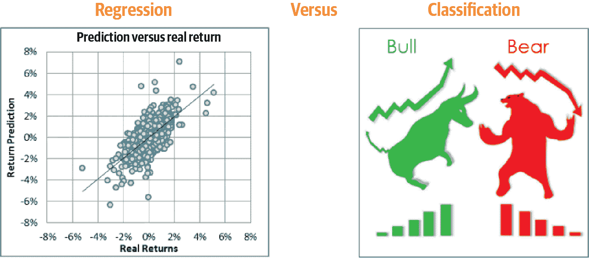

# 第一章：机器学习在金融中的景观

> *机器学习有望彻底改变金融的大片领域*
> 
> 经济学人（2017 年）

金融中有一波新的机器学习和数据科学浪潮，相关应用将在未来几十年内彻底改变这个行业。

目前，包括对冲基金、投资和零售银行以及金融科技公司在内的大多数金融公司，都在采用并大量投资于机器学习。未来，金融机构将需要越来越多的机器学习和数据科学专家。

由于大量数据的可用性和更加负担得起的计算能力，近年来机器学习在金融中的使用正呈指数级增长。

机器学习在金融领域的成功取决于构建高效的基础设施，使用正确的工具包和应用合适的算法。本书全程演示和利用了机器学习在金融中这些基础模块的相关概念。

在本章中，我们介绍了机器学习在金融中当前和未来的应用，包括对不同类型机器学习的简要概述。本章和随后的两章为本书其余部分中介绍的案例研究奠定了基础。

# 金融中当前和未来的机器学习应用

让我们看看金融中一些有前途的机器学习应用。本书中介绍的案例研究涵盖了这里提到的所有应用。

## 算法交易

*算法交易*（或简称*algo trading*）是使用算法自主进行交易的方法。起源可以追溯到上世纪 70 年代，算法交易（有时被称为自动交易系统，这可能更准确地描述）涉及使用自动预编程的交易指令，以做出极快速、客观的交易决策。

机器学习有望将算法交易推向新的高度。不仅可以采用和实时调整更先进的策略，而且基于机器学习的技术可以提供更多获得市场走向特殊洞察的途径。大多数对冲基金和金融机构并不公开披露他们基于机器学习的交易方法（出于正当理由），但机器学习在实时校准交易决策中的作用越来越重要。

## 投资组合管理和智能投顾

资产和财富管理公司正在探索潜在的人工智能（AI）解决方案，以改善他们的投资决策并利用他们的大量历史数据。

一个例子是使用*智能投顾*，这是为了根据用户的目标和风险承受能力调整金融投资组合的算法。此外，它们为最终投资者和客户提供自动化的财务指导和服务。

用户输入他们的财务目标（例如在 65 岁时以 25 万美元的储蓄退休）、年龄、收入和当前财务资产。顾问（*分配器*）然后将投资分散到资产类别和金融工具中，以达到用户的目标。

系统然后根据用户的目标和市场实时变化进行校准，始终致力于找到用户原始目标的最佳匹配。机器顾问已经在那些无需人类顾问即可感到舒适的消费者中获得了显著的吸引力。

## 欺诈检测

对金融机构而言，欺诈是一个巨大的问题，也是在金融中利用机器学习的首要原因之一。

当前存在显著的数据安全风险，由于高计算能力、频繁的互联网使用以及存储在线上的公司数据量不断增加。虽然以前的金融欺诈检测系统严重依赖复杂而健壮的规则集，但现代欺诈检测超越了遵循风险因素清单的检查——它积极学习并校准到新的潜在（或实际）安全威胁。

机器学习非常适合于打击欺诈金融交易。这是因为机器学习系统可以扫描庞大的数据集，检测异常活动，并立即标记它们。鉴于安全性可能被侵犯的方式不可胜数，真正的机器学习系统将在未来成为绝对必要。

## 贷款/信用卡/保险核保

核保可以被描述为金融中机器学习的完美工作，确实有很多担忧，即机器将取代今天存在的大量核保职位。

尤其是在大公司（大银行和上市保险公司），机器学习算法可以基于数百万个消费者数据和金融贷款或保险结果进行训练，例如一个人是否违约其贷款或抵押贷款。

利用算法可以评估潜在的金融趋势，并持续分析，以便检测可能影响未来贷款和核保风险的趋势。算法可以执行自动化任务，如匹配数据记录、识别异常情况，并计算申请人是否符合信贷或保险产品的资格。

## 自动化与聊天机器人

自动化显然非常适合于金融领域。它减少了重复、低价值任务对人类员工的压力。它处理日常例行流程，使团队能够完成其高价值工作。通过这样做，它带来了巨大的时间和成本节约。

将机器学习和人工智能融入自动化中，为员工提供了另一层支持。通过获取相关数据，机器学习和人工智能可以提供深入的数据分析，支持金融团队进行困难决策。在某些情况下，甚至可以推荐最佳行动方案供员工批准和实施。

金融领域的人工智能和自动化还可以学习识别错误，减少在发现和解决之间浪费的时间。这意味着人类团队成员在提供报告时更不容易延迟，能够减少工作中的错误。

AI 聊天机器人可以被用来支持金融和银行客户。随着银行和金融企业中实时聊天软件的流行，聊天机器人是自然演变的产物。

## 风险管理

机器学习技术正在改变我们对风险管理的方式。通过机器学习驱动的解决方案的增长，所有了解和控制风险的方面都正在发生革命性变化。例子包括决定银行应该向客户贷款多少，改善合规性并减少模型风险。

## 资产价格预测

资产价格预测被认为是金融领域中讨论最频繁、最复杂的领域。预测资产价格使人们能够了解推动市场的因素并推测资产表现。传统上，通过分析过去的财务报告和市场表现来预测资产价格，以确定特定证券或资产类别的持仓位置。然而，随着金融数据量的大幅增加，传统的分析方法和股票选择策略正在补充机器学习技术。

## 衍生品定价

最近机器学习取得的成功以及创新的快速步伐表明，未来几年衍生品定价的机器学习应用将广泛应用。黑-舒尔斯模型、波动率笑曲线和 Excel 电子表格模型的世界应逐渐消退，因为更先进的方法变得更易获取。

经典的衍生品定价模型建立在几个不切实际的假设上，旨在复制市场上观察到的衍生品价格与基础输入数据（行权价格、到期时间、期权类型）之间的经验关系。机器学习方法不依赖于多个假设；它们只是尝试估计输入数据与价格之间的函数，最小化模型结果与目标之间的差异。

最先进的机器学习工具实现的更快部署时间只是加速衍生品定价机器学习应用使用的优势之一。

## 情绪分析

情感分析涉及对大量非结构化数据进行审视，例如视频、转录、照片、音频文件、社交媒体帖子、文章和商业文件，以确定市场情绪。情感分析在今天的工作场所对所有企业至关重要，并且是金融中机器学习的一个极好的示例。

在金融领域中，情感分析最常见的用途是分析金融新闻，特别是预测市场的行为和可能的趋势。股市的波动是由无数与人类相关的因素引起的，机器学习能够通过发现新的趋势和发出信号来复制和增强人类对金融活动的直觉。

然而，未来机器学习的大部分应用将集中在理解社交媒体、新闻趋势和其他与预测客户对市场发展的情绪相关的数据来源上。它不仅限于预测股票价格和交易。

## 交易结算

交易结算是在金融资产交易后将证券转入买方账户并将现金转入卖方账户的过程。

尽管大多数交易都是自动结算的，并且很少或没有人类干预，约 30% 的交易仍然需要手动结算。

使用机器学习不仅可以识别失败交易的原因，还可以分析为什么交易被拒绝，提供解决方案，并预测未来可能失败的交易。通常人类需要花费五到十分钟来解决的问题，机器学习可以在几秒钟内完成。

## 洗钱

联合国的一份报告估计，全球每年洗钱金额占全球 GDP 的 2%–5%。机器学习技术可以分析客户广泛网络中的内部、公开存在的和交易数据，试图发现洗钱迹象。

# 机器学习、深度学习、人工智能和数据科学

对于大多数人来说，*机器学习*、*深度学习*、*人工智能* 和 *数据科学* 这些术语很令人困惑。事实上，很多人会将其中一个术语与其他术语混为一谈。

图 1-1 显示了人工智能、机器学习、深度学习和数据科学之间的关系。机器学习是人工智能的一个子集，包括使计算机能够识别数据中的模式并交付人工智能应用的技术。而深度学习则是机器学习的一个子集，使计算机能够解决更复杂的问题。

数据科学并不完全是机器学习的一个子集，但它利用机器学习、深度学习和人工智能来分析数据并得出可操作的结论。它结合了机器学习、深度学习和人工智能与其他学科，如大数据分析和云计算。

###### 图 1-1. AI、机器学习、深度学习和数据科学

以下是关于人工智能、机器学习、深度学习和数据科学的详细信息摘要：

人工智能

人工智能是研究计算机（及其系统）如何成功完成通常需要人类智能的复杂任务的领域。这些任务包括但不限于视觉感知、语音识别、决策制定和语言之间的翻译。人工智能通常被定义为使计算机在人类执行时需要智能的事物的科学。

机器学习

机器学习是人工智能的一种应用，它使 AI 系统能够自动从环境中学习，并将这些教训应用于做出更好的决策。机器学习使用各种算法来迭代学习、描述和改进数据，识别模式，然后对这些模式进行操作。

深度学习

深度学习是机器学习的一个子集，涉及与人工神经网络相关的算法研究，这些网络包含许多块（或层）堆叠在一起。深度学习模型的设计受到人类大脑生物神经网络的启发。它努力分析具有类似逻辑结构的数据，就像人类如何得出结论一样。

数据科学

数据科学是一个类似于数据挖掘的跨学科领域，利用科学方法、过程和系统从各种形式的数据中提取知识或洞见。数据科学与机器学习和人工智能不同，因为它的目标是通过使用不同的科学工具和技术来洞察和理解数据。然而，机器学习和数据科学都有一些共同的工具和技术，其中一些在本书中有所展示。

# 机器学习类型

本节将概述本书中用于各种金融应用的不同案例研究中使用的所有类型的机器学习。如图 1-2 所示，机器学习的三种类型是监督学习、无监督学习和强化学习。

###### 图 1-2. 机器学习类型

## 监督

*监督学习* 的主要目标是从带标签数据中训练模型，使我们能够对未见或未来的数据进行预测。这里，“监督”一词指的是已知期望输出信号（标签）的一组样本。监督学习算法有两种类型：分类和回归。

### 分类

*分类* 是监督学习的一个子类，其目标是基于过去的观察预测新实例的分类类别标签。

### 回归

*回归* 是监督学习的另一子类，用于预测连续结果。在回归中，我们有多个预测（解释）变量和一个连续的响应变量（结果或目标），并尝试找到这些变量之间的关系，以便预测结果。

回归与分类的一个示例显示在 图 1-3 中。左侧的图表显示了一个回归的示例。连续的响应变量是回报，观察到的值与预测的结果相对比。右侧的图表显示了一个分类的示例，结果是一个分类类别标签，即市场是牛市还是熊市。

###### 图 1-3\. 回归与分类

## 无监督

无监督学习是一种机器学习类型，用于从不带标记响应的输入数据集中推断。无监督学习分为两种类型：降维和聚类。

### 降维

*降维* 是在保留信息和整体模型性能的同时减少数据集中特征或变量数量的过程。这是处理具有大量维度的数据集的常见且强大的方式。

图 1-4 展示了这一概念，其中数据的维度从两个维度（*X[1]* 和 *X[2]*）转换为一个维度（*Z[1]*）。 *Z[1]* 传达了嵌入在 *X[1]* 和 *X[2]* 中的相似信息，并且减少了数据的维度。

###### 图 1-4\. 降维

### 聚类

*聚类* 是无监督学习技术的一个子类，允许我们发现数据中隐藏的结构。聚类的目标是在数据中找到自然的分组，使同一组中的项目彼此更相似，而与来自不同组的项目更不相似。

聚类的一个示例显示在 图 1-5 中，聚类算法将整个数据聚集为两个明显的组。

###### 图 1-5\. 聚类

## 强化学习

从经验中学习，并伴随奖励或惩罚，是*强化学习*（RL）的核心概念。它涉及在特定情况下采取适当的行动以最大化奖励。学习系统称为*智能体*，可以观察环境，选择和执行动作，并获得回报（或以负奖励形式的惩罚），如 图 1-6 所示。

强化学习在以下方面与监督学习不同：在监督学习中，训练数据有答案标签，因此模型是根据可用的正确答案进行训练的。在强化学习中，没有显式的答案。学习系统（代理）决定如何执行给定任务，并根据奖励学习该动作是否正确。算法通过其经验确定答案标签。

###### 图 1-6\. 强化学习

强化学习的步骤如下：

1.  首先，代理通过执行一个动作与环境进行交互。

1.  然后，代理根据执行的动作获得奖励。

1.  根据奖励，代理接收一个观察结果并理解该动作是好是坏。如果动作是好的，也就是代理收到了正面奖励，那么代理将更倾向于执行这个动作。如果奖励不太好，代理将尝试执行其他动作以获得正面奖励。这基本上是一个试错学习过程。

# 自然语言处理

自然语言处理（NLP）是人工智能的一个分支，处理机器理解人类使用的自然语言结构和含义的问题。NLP 内部使用了多种机器学习和深度学习技术。

NLP 在金融领域有许多应用，如情感分析、聊天机器人和文档处理等。很多信息，如卖方报告、收益电话和报纸头条，是通过文本信息传达的，使得 NLP 在金融领域非常有用。

鉴于基于机器学习的 NLP 算法在金融中的广泛应用，本书有一章（第十章）专门介绍 NLP 及相关案例研究。

# 章节总结

机器学习正在金融服务行业的各个垂直领域取得显著进展。本章介绍了机器学习在金融领域的不同应用，从算法交易到智能投顾。这些应用将在本书后面的案例研究中详细介绍。

## 后续步骤

在用于机器学习的平台方面，Python 生态系统正在发展壮大，是最主要的机器学习编程语言之一。在下一章中，我们将学习基于 Python 框架的模型开发步骤，从数据准备到模型部署。
