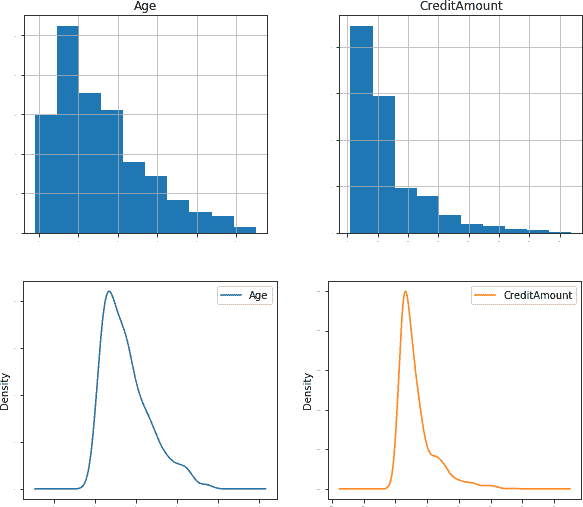
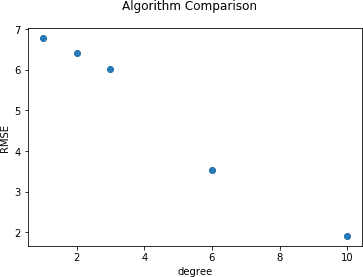

# 第二章。在 Python 中开发机器学习模型

在用于机器学习的平台方面，有许多算法和编程语言可选择。然而，Python 生态系统是最主流和增长最快的机器学习编程语言之一。

鉴于 Python 的流行度和高采纳率，我们将其作为本书的主要编程语言。本章将概述基于 Python 的机器学习框架。首先，我们将回顾用于机器学习的 Python 包的详细信息，然后介绍 Python 框架中的模型开发步骤。

本章介绍的 Python 模型开发步骤将作为本书其余案例研究的基础。在金融领域开发任何基于机器学习的模型时，也可以利用 Python 框架。

# 为何选择 Python？

Python 受欢迎的原因有：

+   高级语法（与 C、Java 和 C++等低级语言相比）。编写更少的代码即可开发应用程序，这使得 Python 对初学者和高级程序员都很有吸引力。

+   高效的开发生命周期。

+   社区管理的大量开源库。

+   强大的可移植性。

Python 的简单性吸引了许多开发者为机器学习创建新的库，从而使 Python 的使用率大幅提升。

# Python 机器学习包

主要用于机器学习的 Python 包在图 2-1 中得到了突出显示。


###### 图 2-1\. Python 软件包

下面简要总结了每个软件包：

[NumPy](https://numpy.org)

提供对大型多维数组的支持以及广泛的数学函数集合。

[Pandas](https://pandas.pydata.org)

用于数据处理和分析的库。除其他功能外，它还提供了处理表格的数据结构和相关工具。

[Matplotlib](https://matplotlib.org)

允许创建 2D 图表和图形的绘图库。

[SciPy](https://www.scipy.org)

NumPy、Pandas 和 Matplotlib 的组合通常被称为 SciPy。SciPy 是用于数学、科学和工程的 Python 库生态系统。

[Scikit-learn](https://scikit-learn.org)（或 sklearn）

提供广泛算法和工具的机器学习库。

[StatsModels](https://www.statsmodels.org)

一个 Python 模块，提供类和函数，用于众多不同统计模型的估计，以及进行统计检验和统计数据探索。

[TensorFlow](https://www.tensorflow.org)和[Theano](http://deeplearning.net/software/theano)

数据流编程库有助于处理神经网络。

[Keras](https://keras.io)

一个人工神经网络库，可以作为简化的 TensorFlow/Theano 软件包接口。

[Seaborn](https://seaborn.pydata.org)

基于 Matplotlib 的数据可视化库。它提供了一个高级接口，用于绘制引人入胜且信息丰富的统计图形。

[pip](https://pypi.org/project/pip)和[Conda](https://docs.conda.io/en/latest)

这些是 Python 包管理器。pip 是一个包管理器，用于简化 Python 包的安装、升级和卸载。Conda 是一个包管理器，处理 Python 包以及 Python 包之外的库依赖。

## Python 和包安装

安装 Python 有不同的方法。然而，强烈建议通过[Anaconda](https://www.anaconda.com)安装 Python。Anaconda 包含 Python、SciPy 和 Scikit-learn。

安装完 Anaconda 后，可以通过打开机器的终端并输入以下代码来在本地启动 Jupyter 服务器：

```py
$jupyter notebook
```

###### 注意

本书中的所有代码示例均使用 Python 3，并以 Jupyter 笔记本形式呈现。在案例研究中广泛使用了多个 Python 包，特别是 Scikit-learn 和 Keras。

# Python 生态系统中模型开发步骤

从头到尾解决机器学习问题至关重要。除非从开始到结束定义了步骤，否则应用的机器学习将无法真正发挥作用。

图 2-2 提供了一个简单的七步机器学习项目模板概述，可用于快速启动 Python 中的任何机器学习模型。前几个步骤包括探索性数据分析和数据准备，这是典型的数据科学步骤，旨在从数据中提取含义和洞见。这些步骤之后是模型评估、微调和最终化模型。


###### 图 2-2\. 模型开发步骤

###### 注意

本书中的所有案例研究均遵循标准的七步模型开发过程。然而，有些案例研究会根据步骤的适当性和直观性跳过、重命名或重新排序一些步骤。

## 模型开发蓝图

下一节详细介绍了每个模型开发步骤及其支持的 Python 代码细节。

### 1\. 问题定义

任何项目的第一步都是定义问题。可以使用强大的算法来解决问题，但如果解决了错误的问题，结果将毫无意义。

应使用以下框架来定义问题：

1.  非正式和正式地描述问题。列出假设和类似问题。

1.  列出解决问题的动机，解决方案提供的好处以及解决方案的使用方式。

1.  描述如何使用领域知识解决问题。

### 2\. 加载数据和包

第二步提供了开始解决问题所需的一切。这包括加载用于模型开发所需的库、包和单个函数。

#### 2.1\. 加载库

加载库的示例代码如下：

```py
# Load libraries
import pandas as pd
from matplotlib import pyplot
```

特定功能的库和模块的详细信息在个案研究中进一步定义。

#### 2.2\. 加载数据

在加载数据之前，应检查并删除以下项目：

+   列标题

+   注释或特殊字符

+   分隔符

有许多加载数据的方法。以下是一些最常见的方法：

`使用 Pandas 加载 CSV 文件`

```py
from pandas import read_csv
filename = 'xyz.csv'
data = read_csv(filename, names=names)
```

`从 URL 加载文件`

```py
from pandas import read_csv
url = 'https://goo.gl/vhm1eU'
names = ['age', 'class']
data = read_csv(url, names=names)
```

`使用 pandas_datareader 加载文件`

```py
import pandas_datareader.data as web

ccy_tickers = ['DEXJPUS', 'DEXUSUK']
idx_tickers = ['SP500', 'DJIA', 'VIXCLS']

stk_data = web.DataReader(stk_tickers, 'yahoo')
ccy_data = web.DataReader(ccy_tickers, 'fred')
idx_data = web.DataReader(idx_tickers, 'fred')
```

### 3\. 探索性数据分析

在此步骤中，我们查看数据集。

#### 3.1\. 描述统计

了解数据集是模型开发中最重要的步骤之一。了解数据的步骤包括：

1.  查看原始数据。

1.  查看数据集的维度。

1.  查看属性的数据类型。

1.  汇总数据集中变量的分布、描述统计和关系。

使用示例 Python 代码演示以下步骤：

`查看数据`

```py
set_option('display.width', 100)
dataset.head(1)
```

`输出`

|  | 年龄 | 性别 | 工作 | 住房 | 储蓄账户 | 支票账户 | 信用金额 | 期限 | 目的 | 风险 |
| --- | --- | --- | --- | --- | --- | --- | --- | --- | --- | --- |
| 0 | 67 | 男性 | 2 | 自有 | NaN | 少量 | 1169 | 6 | 无线电/电视 | 良好 |

`查看数据集的维度`

```py
dataset.shape
```

`输出`

```py
(284807, 31)
```

结果显示数据集的维度，并表明数据集有 284,807 行和 31 列。

`查看数据属性的数据类型`

```py
# types
set_option('display.max_rows', 500)
dataset.dtypes
```

`使用描述性统计汇总数据`

```py
# describe data
set_option('precision', 3)
dataset.describe()
```

`输出`

|  | 年龄 | 职业 | 信用金额 | 期限 |
| --- | --- | --- | --- | --- |
| count | 1000.000 | 1000.000 | 1000.000 | 1000.000 |
| mean | 35.546 | 1.904 | 3271.258 | 20.903 |
| std | 11.375 | 0.654 | 2822.737 | 12.059 |
| min | 19.000 | 0.000 | 250.000 | 4.000 |
| 25% | 27.000 | 2.000 | 1365.500 | 12.000 |
| 50% | 33.000 | 2.000 | 2319.500 | 18.000 |
| 75% | 42.000 | 2.000 | 3972.250 | 24.000 |
| max | 75.000 | 3.000 | 18424.000 | 72.000 |

#### 3.2\. 数据可视化

最快了解数据的方法是将其可视化。可视化包括独立理解数据集的每个属性。

以下是一些绘图类型：

单变量图

直方图和密度图

多变量图

相关矩阵图和散点图

以下是单变量绘图类型的 Python 代码示例：

`单变量绘图：直方图`

```py
from matplotlib import pyplot
dataset.hist(sharex=False, sharey=False, xlabelsize=1, ylabelsize=1,\
figsize=(10,4))
pyplot.show()
```

`单变量绘图：密度图`

```py
from matplotlib import pyplot
dataset.plot(kind='density', subplots=True, layout=(3,3), sharex=False,\
legend=True, fontsize=1, figsize=(10,4))
pyplot.show()
```

图 2-3 说明了输出。



###### 图 2-3\. 直方图（上）和密度图（下）

以下是多变量绘图类型的 Python 代码示例：

`多变量绘图：相关矩阵图`

```py
from matplotlib import pyplot
import seaborn as sns
correlation = dataset.corr()
pyplot.figure(figsize=(5,5))
pyplot.title('Correlation Matrix')
sns.heatmap(correlation, vmax=1, square=True,annot=True,cmap='cubehelix')
```

`多变量绘图：散点图矩阵`

```py
from pandas.plotting import scatter_matrix
scatter_matrix(dataset)
```

图 2-4 说明了输出。


###### 图 2-4\. 相关性（左）和散点图（右）

### 4\. 数据准备

数据准备是一种预处理步骤，其中来自一个或多个来源的数据被清理和转换，以提高其质量，以便在使用之前使用。

#### 4.1\. 数据清洗

在机器学习建模中，不正确的数据可能会很昂贵。数据清洗包括检查以下内容：

有效性

数据类型、范围等。

准确性

数据接近真实值的程度。

完整性

所需数据完全已知的程度。

统一性

使用相同测量单位指定数据的程度。

执行数据清洗的不同选项包括：

*删除数据中的“NA”值*

```py
dataset.dropna(axis=0)
```

*用 0 填充“NA”*

```py
dataset.fillna(0)
```

*用列均值填充 NA 值*

```py
dataset['col'] = dataset['col'].fillna(dataset['col'].mean())
```

#### 4.2\. 特征选择

用于训练机器学习模型的数据特征对性能有很大影响。不相关或部分相关的特征可能会对模型性能产生负面影响。特征选择¹ 是一个过程，在这个过程中，自动选择对预测变量或输出贡献最大的数据特征。

在对数据建模之前执行特征选择的好处是：

减少过拟合²

较少冗余数据意味着模型基于噪声进行决策的机会更少。

改善性能

较少误导性数据意味着改进的建模性能。

减少训练时间和内存占用

较少的数据意味着更快的训练速度和更低的内存占用。

下面的样本特征是一个示例，演示了如何使用[`SelectKBest`函数](https://oreil.ly/JDo-F)选择最佳的两个特征。`SelectKBest`函数使用底层函数对特征进行评分，然后移除除了*k*个最高评分特征以外的所有特征：

```py
from sklearn.feature_selection import SelectKBest
from sklearn.feature_selection import chi2
bestfeatures = SelectKBest( k=5)
fit = bestfeatures.fit(X,Y)
dfscores = pd.DataFrame(fit.scores_)
dfcolumns = pd.DataFrame(X.columns)
featureScores = pd.concat([dfcolumns,dfscores],axis=1)
print(featureScores.nlargest(2,'Score'))  #print 2 best features
```

`输出`

```py
                  Specs      Score
2              Variable1  58262.490
3              Variable2    321.031
```

当特征无关时，它们应该被删除。删除无关特征的方法如下示例代码所示：

```py
#dropping the old features
dataset.drop(['Feature1','Feature2','Feature3'],axis=1,inplace=True)
```

#### 4.3\. 数据转换

许多机器学习算法对数据有假设。以最佳方式对数据进行准备，使数据能够最好地暴露给机器学习算法，这是一个良好的实践。这可以通过数据转换来实现。

下面是不同的数据转换方法：

重新调整比例

当数据包含具有不同比例的属性时，许多机器学习算法可以通过将所有属性重新调整到相同的比例来受益。属性通常重新调整到零到一的范围内。这对于机器学习算法中使用的优化算法非常有用，也有助于加速算法中的计算：

```py
from sklearn.preprocessing import MinMaxScaler
scaler = MinMaxScaler(feature_range=(0, 1))
rescaledX = pd.DataFrame(scaler.fit_transform(X))
```

标准化

*标准化* 是一种有用的技术，用于将属性转换为均值为零、标准差为一的标准[正态分布](https://oreil.ly/4a70f)。对于假设输入变量表示正态分布的技术非常适用：

```py
from sklearn.preprocessing import StandardScaler
scaler = StandardScaler().fit(X)
StandardisedX = pd.DataFrame(scaler.fit_transform(X))
```

标准化

*标准化* 指的是将每个观察（行）重新缩放为长度为一（称为单位范数或向量）。在使用加权输入值的算法处理具有不同尺度属性的稀疏数据集时，这种预处理方法非常有用：

```py
from sklearn.preprocessing import Normalizer
scaler = Normalizer().fit(X)
NormalizedX = pd.DataFrame(scaler.fit_transform(X))
```

### 5\. 评估模型

一旦我们估算了算法的性能，我们可以在整个训练数据集上重新训练最终的算法，并准备好用于操作。这样做的最佳方法是在新数据集上评估算法的性能。不同的机器学习技术需要不同的评估指标。在选择模型时，除了模型性能之外，还考虑了几个其他因素，如简易性、可解释性和训练时间。有关这些因素的详细信息在第四章中有所涵盖。

#### 5.1\. 训练和测试分割

评估机器学习算法性能的最简单方法是使用不同的训练和测试数据集。我们可以将原始数据集分成两部分：在第一部分上训练算法，对第二部分进行预测，并将预测结果与期望结果进行评估。分割的大小可以取决于数据集的大小和具体情况，尽管通常使用 80%的数据进行训练，剩余的 20%用于测试。训练和测试数据集之间的差异可能导致准确度估计的显著差异。可以使用 sklearn 中提供的`train_test_split`函数轻松地将数据分割成训练集和测试集：

```py
# split out validation dataset for the end
validation_size = 0.2
seed = 7
X_train, X_validation, Y_train, Y_validation =\
train_test_split(X, Y, test_size=validation_size, random_state=seed)
```

#### 5.2\. 确定评估指标

选择用于评估机器学习算法的度量标准非常重要。评估指标的一个重要方面是其在区分模型结果方面的能力。本书的多个章节详细介绍了不同类型的 ML 模型所使用的不同类型的评估指标。

#### 5.3\. 比较模型和算法

选择机器学习模型或算法既是一门艺术，也是一门科学。没有一种适合所有情况的解决方案或方法。除了模型性能之外，还有多个因素可能影响选择机器学习算法的决策。

让我们通过一个简单的例子来理解模型比较的过程。我们定义两个变量，*X*和*Y*，并尝试构建一个预测*Y*使用*X*的模型。作为第一步，数据按前面部分提到的训练和测试分割进行分割：

```py
import numpy as np
import matplotlib.pyplot as plt
from sklearn.model_selection import train_test_split
validation_size = 0.2
seed = 7
X = 2 - 3 * np.random.normal(0, 1, 20)
Y = X - 2 * (X ** 2) + 0.5 * (X ** 3) + np.exp(-X)+np.random.normal(-3, 3, 20)
# transforming the data to include another axis
X = X[:, np.newaxis]
Y = Y[:, np.newaxis]
X_train, X_test, Y_train, Y_test = train_test_split(X, Y,\
test_size=validation_size, random_state=seed)
```

我们不知道哪种算法在这个问题上表现良好。现在让我们设计我们的测试。我们将使用两个模型——一个线性回归和第二个多项式回归来拟合*Y*和*X*。我们将使用*均方根误差（RMSE）*指标来评估算法的性能，这是模型性能的一种度量。RMSE 将给出所有预测的错误程度的大致概念（零是完美的）：

```py
from sklearn.linear_model import LinearRegression
from sklearn.metrics import mean_squared_error, r2_score
from sklearn.preprocessing import PolynomialFeatures

model = LinearRegression()
model.fit(X_train, Y_train)
Y_pred = model.predict(X_train)

rmse_lin = np.sqrt(mean_squared_error(Y_train,Y_pred))
r2_lin = r2_score(Y_train,Y_pred)
print("RMSE for Linear Regression:", rmse_lin)

polynomial_features= PolynomialFeatures(degree=2)
x_poly = polynomial_features.fit_transform(X_train)

model = LinearRegression()
model.fit(x_poly, Y_train)
Y_poly_pred = model.predict(x_poly)

rmse = np.sqrt(mean_squared_error(Y_train,Y_poly_pred))
r2 = r2_score(Y_train,Y_poly_pred)
print("RMSE for Polynomial Regression:", rmse)
```

`输出`

```py
RMSE for Linear Regression: 6.772942423315028
RMSE for Polynomial Regression: 6.420495127266883
```

我们可以看到多项式回归的 RMSE 略优于线性回归的 RMSE。由于前者拟合效果更好，因此在这一步骤中它是首选模型。

### 6\. 模型调优

找到模型最佳超参数组合可以被视为一个搜索问题。⁴ 这种搜索练习通常被称为*模型调优*，是模型开发中最重要的步骤之一。通过使用诸如网格搜索等技术，通过创建所有可能的超参数组合网格并对每一个进行训练来寻找最佳模型的参数。除了网格搜索外，还有几种其他模型调优技术，包括随机搜索、[贝叶斯优化](https://oreil.ly/ZGVPM)和超品牌。

在本书介绍的案例研究中，我们主要集中于模型调优的网格搜索。

继续前述示例，以多项式作为最佳模型：接下来，对模型进行网格搜索，使用不同的次数重新拟合多项式回归。我们比较所有模型的 RMSE 结果：

```py
Deg= [1,2,3,6,10]
results=[]
names=[]
for deg in Deg:
    polynomial_features= PolynomialFeatures(degree=deg)
    x_poly = polynomial_features.fit_transform(X_train)

    model = LinearRegression()
    model.fit(x_poly, Y_train)
    Y_poly_pred = model.predict(x_poly)

    rmse = np.sqrt(mean_squared_error(Y_train,Y_poly_pred))
    r2 = r2_score(Y_train,Y_poly_pred)
    results.append(rmse)
    names.append(deg)
plt.plot(names, results,'o')
plt.suptitle('Algorithm Comparison')
```

`输出`



当多项式模型的次数增加时，RMSE 减小，而次数为 10 的模型具有最低的 RMSE。然而，次数低于 10 的模型表现非常好，测试集将用于确定最佳模型。

每个算法的通用输入参数集为分析提供了一个起点，但可能并非特定数据集和业务问题的最优配置。

### 7\. 完善模型

在这里，我们执行选择模型的最后步骤。首先，我们使用训练好的模型对测试数据集进行预测。然后，我们尝试理解模型的直觉并保存以备进一步使用。

#### 7.1\. 测试集上的性能

在训练步骤中选择的模型会在测试集上进一步评估。测试集能够以无偏的方式比较不同模型，通过在训练的任何部分都未使用的数据进行比较。以下是前述步骤开发的模型的测试结果示例：

```py
Deg= [1,2,3,6,8,10]
for deg in Deg:
    polynomial_features= PolynomialFeatures(degree=deg)
    x_poly = polynomial_features.fit_transform(X_train)
    model = LinearRegression()
    model.fit(x_poly, Y_train)
    x_poly_test = polynomial_features.fit_transform(X_test)
    Y_poly_pred_test = model.predict(x_poly_test)
    rmse = np.sqrt(mean_squared_error(Y_test,Y_poly_pred_test))
    r2 = r2_score(Y_test,Y_poly_pred_test)
    results_test.append(rmse)
    names_test.append(deg)
plt.plot(names_test, results_test,'o')
plt.suptitle('Algorithm Comparison')
```

`输出`


在训练集中，我们看到随着多项式模型次数的增加，RMSE 减小，并且次数为 10 的多项式具有最低的 RMSE。然而，正如前面输出的次数为 10 的多项式所示，尽管训练集结果最佳，但测试集结果较差。对于次数为 8 的多项式，测试集中的 RMSE 相对较高。次数为 6 的多项式在测试集中表现最佳（尽管与测试集中其他次数较低的多项式相比差距不大），并且在训练集中也有良好的结果。因此，这是首选的模型。

除了模型性能之外，在选择模型时还有几个其他因素需要考虑，例如简单性、可解释性和训练时间。这些因素将在接下来的章节中进行讨论。

#### 7.2\. 模型/变量直觉

本步骤涉及综合考虑解决问题所采用的方法，包括模型在实现所期望的结果时的局限性、使用的变量以及选择的模型参数。关于不同类型的机器学习模型的模型和变量直觉的详细信息将在随后的章节和案例研究中呈现。

#### 7.3\. 保存/部署

找到准确的机器学习模型后，必须保存和加载它以确保以后的使用。

*Pickle* 是 Python 中用于保存和加载训练模型的包之一。使用 pickle 操作，训练好的机器学习模型可以以*序列化*的格式保存到文件中。稍后，可以加载这个序列化文件以*反序列化*模型进行使用。以下示例代码演示了如何将模型保存到文件并加载以在新数据上进行预测：

```py
# Save Model Using Pickle
from pickle import dump
from pickle import load
# save the model to disk
filename = 'finalized_model.sav'
dump(model, open(filename, 'wb'))
# load the model from disk
loaded_model = load(filename)
```

###### 提示

近年来，像[AutoML](https://oreil.ly/ChjFb)这样的框架已经被构建出来，以自动化机器学习模型开发过程中的最大数量步骤。这些框架允许模型开发人员以高规模、高效率和高生产力构建 ML 模型。建议读者探索这些框架。

# 章节总结

由于其流行度、采纳率和灵活性，Python 往往是机器学习开发的首选语言。有许多可用的 Python 包来执行多种任务，包括数据清洗、可视化和模型开发。其中一些关键包括 Scikit-learn 和 Keras。

本章提到的模型开发的七个步骤可以在金融中开发任何基于机器学习的模型时使用。

## 下一步

在接下来的章节中，我们将涵盖机器学习的关键算法——人工神经网络。人工神经网络是金融领域机器学习的另一个构建模块，并且在各类机器学习和深度学习算法中广泛使用。

¹ 特征选择对监督学习模型更为重要，在第五章和第六章的个案研究中有详细描述。

² 过拟合在第四章中有详细讨论。

³ 应注意，在这种情况下，RMSE 的差异很小，并且可能在不同的训练/测试数据拆分下不会复制。

⁴ 超参数是模型的外部特性，可以被视为模型的设置，并且不是基于数据估计的模型参数。
