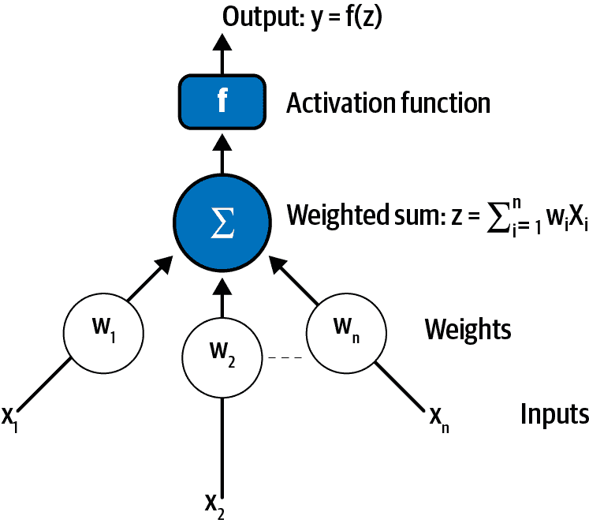
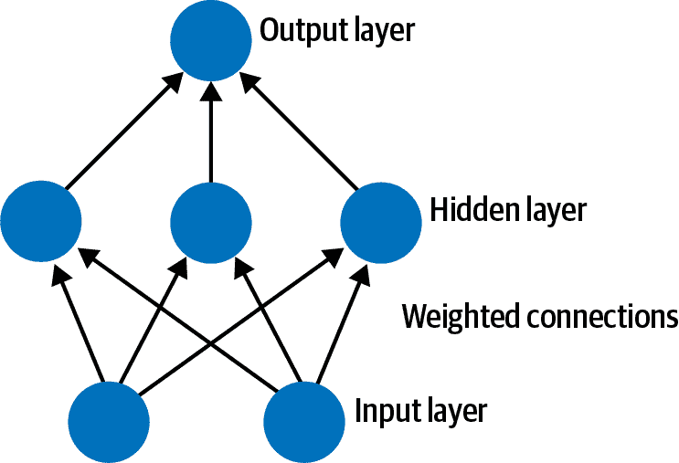
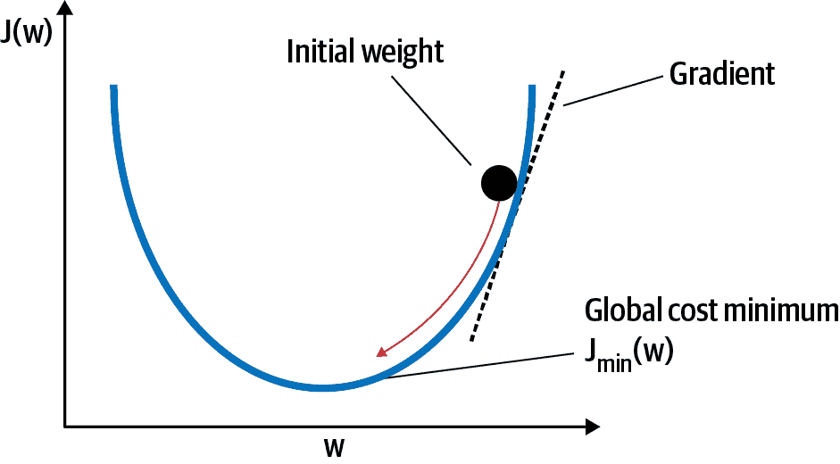
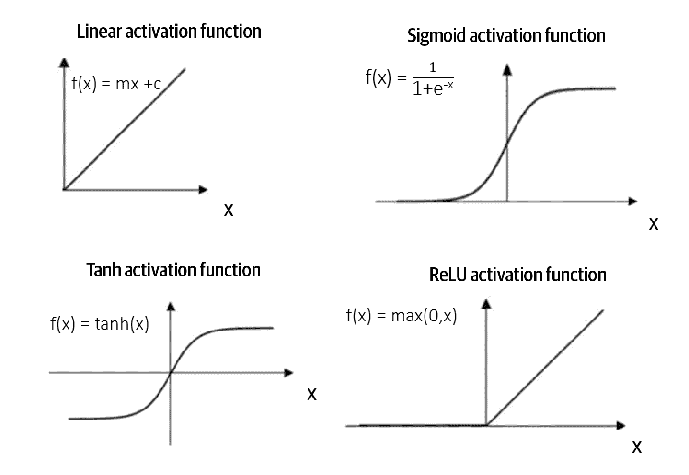
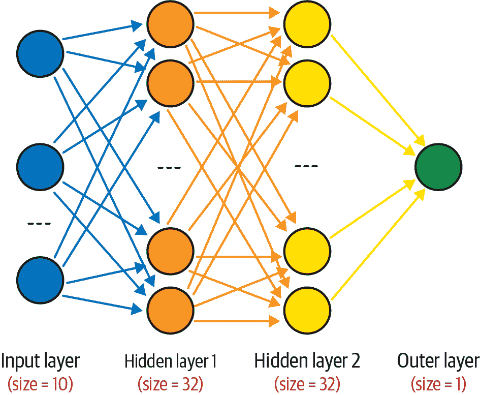

# 第三章\. 人工神经网络

在机器学习中使用许多不同类型的模型。然而，一种突出的机器学习模型类别是人工神经网络（ANNs）。鉴于人工神经网络应用于所有类型的机器学习，本章将介绍 ANN 的基础知识。

ANN 是基于一组连接单位或节点（称为人工神经元）的计算系统，它们松散地模拟生物大脑中的神经元。每个连接就像生物大脑中的突触一样，可以将信号从一个人工神经元传输到另一个。接收信号的人工神经元可以处理它，然后将信号传递给连接到它的其他人工神经元。

*深度学习* 包括复杂的与 ANN 相关的算法研究。其复杂性归因于信息如何在模型中的精细模式中流动。深度学习能够将世界表示为概念的嵌套层次结构，每个概念都与更简单的概念相关定义。我们将在第 9 和 10 章中详细探讨深度学习技术在强化学习和自然语言处理应用中的使用。

# ANN：架构、训练和超参数

ANN 包含多个层中排列的神经元。ANN 通过将建模输出与期望输出进行比较，通过训练阶段来学习在数据中识别模式。让我们详细介绍 ANN 的组成部分。

## 架构

ANN 架构包括神经元、层和权重。

### 神经元

ANN 的构建模块是神经元（也称为人工神经元、节点或感知器）。神经元具有一个或多个输入和一个输出。可以构建神经元网络来计算复杂的逻辑命题。这些神经元中的激活函数创建输入和输出之间复杂的非线性功能映射。^(2)

如图 3-1 所示，一个神经元接受输入 (*x[1]*, *x[2]*…*x[n]*)，应用学习参数生成加权和 (*z*)，然后将该和传递给计算输出 *f(z)* 的激活函数 *f*。



###### 图 3-1\. 人工神经元

### 层

单个神经元的输出 *f(z)*（如图 3-1 所示）无法对复杂任务进行建模。因此，为了处理更复杂的结构，我们使用多层这样的神经元。随着我们在水平和垂直方向上堆叠神经元，我们可以得到的函数类变得越来越复杂。图 3-2 展示了具有输入层、输出层和隐藏层的 ANN 架构。



###### 图 3-2\. 神经网络架构

#### 输入层

输入层从数据集获取输入并且是网络的暴露部分。神经网络通常以数据集中每个输入值（或列）的一个神经元作为输入层来绘制。输入层中的神经元只是将输入值传递给下一层。

#### 隐藏层

输入层之后的层称为隐藏层，因为它们不直接暴露给输入。最简单的网络结构是在隐藏层中有一个单独的神经元直接输出该值。

多层 ANN 能够解决更复杂的与机器学习相关的任务，因为它具有隐藏层。随着计算能力的增加和高效的库的出现，可以构建具有许多层的神经网络。具有许多隐藏层（超过三层）的 ANN 被称为*深度神经网络*。多个隐藏层允许深度神经网络学习数据的特征，因为简单的特征在一层到下一层的重新组合形成更复杂的特征。具有许多层的 ANN 将输入数据（特征）通过更多的数学运算而不是具有较少层的 ANN，并因此在训练过程中需要更多的计算量。

#### 输出层

最终层称为输出层；它负责输出与解决问题所需格式相对应的值或值向量。

### 神经元权重

神经元权重表示单元之间连接的强度，并测量输入对输出的影响。如果从神经元一到神经元二的权重具有较大的幅度，则意味着神经元一对神经元二的影响较大。接近零的权重意味着改变此输入不会改变输出。负权重意味着增加此输入会减少输出。

## 训练

训练神经网络基本上意味着校准 ANN 中的所有权重。这种优化是使用涉及前向传播和反向传播步骤的迭代方法执行的。

### 前向传播

前向传播是将输入值馈送到神经网络并获得输出的过程，我们称之为*预测值*。当我们将输入值馈送到神经网络的第一层时，它会直接通过，不进行任何操作。第二层从第一层获取值，并在将该值传递到下一层之前应用乘法、加法和激活操作。同样的过程对任何后续层都重复，直到从最后一层接收到输出值。

### 反向传播

经过前向传播，我们从人工神经网络得到预测值。假设网络的期望输出是*Y*，前向传播的预测值是*Y′*。预测输出与期望输出的差异（*Y*–*Y′*）被转换为损失（或成本）函数*J(w)*，其中*w*表示人工神经网络中的权重。^(3) 目标是优化损失函数（即使损失尽可能小）在训练集上的表现。

使用的优化方法是*梯度下降*。梯度下降方法的目标是找到*J(w)*关于*w*的梯度，并沿着负梯度方向迈出一小步，直到达到最小值，如图 3-3 所示。



###### 图 3-3\. 梯度下降

在人工神经网络中，函数*J(w)*本质上是多个层的组合，如前文所述。因此，如果将第一层表示为函数*p()*，第二层表示为*q()*，第三层表示为*r()*，那么整体函数为*J(w)=r(q(p()))*。*w*包含所有三层中的所有权重。我们希望找到*J(w)*关于*w*的每个分量的梯度。

略过数学细节，以上实质上意味着第一层中某个分量*w*的梯度将取决于第二层和第三层中的梯度。类似地，第二层中的梯度将取决于第三层中的梯度。因此，我们从最后一层开始反向计算导数，并使用反向传播计算前一层的梯度。

总体上，在反向传播过程中，模型误差（预测输出与期望输出之间的差异）逐层传播回网络，并根据它们对误差的贡献量更新权重。

几乎所有人工神经网络都使用梯度下降和反向传播。反向传播是找到梯度的一种清晰高效的方法之一。

## 超参数

*超参数*是在训练过程之前设置的变量，无法在训练中学习。人工神经网络具有大量超参数，这使得它们非常灵活。然而，这种灵活性使得模型调整过程变得困难。理解超参数及其背后的直觉有助于确定每个超参数的合理值，从而限制搜索空间。让我们从隐藏层和节点的数量开始。

### 隐藏层和节点数量

更多的隐藏层或每层节点意味着 ANN 中有更多的参数，使模型能够拟合更复杂的函数。为了有一个泛化能力良好的训练好的网络，我们需要选择一个最佳的隐藏层数量，以及每个隐藏层中的节点数量。节点和层数量过少会导致系统错误率高，因为预测因素可能对于少数节点来说过于复杂，难以捕捉。节点和层数量过多则会导致对训练数据过拟合，泛化能力差。

没有硬性规定来决定层数和节点的数量。

隐藏层数量主要取决于任务的复杂性。非常复杂的任务，如大规模图像分类或语音识别，通常需要具有数十层和大量训练数据的网络。对于大多数问题，我们可以从只有一个或两个隐藏层开始，然后逐渐增加隐藏层数量，直到开始过拟合训练集。

隐藏节点的数量应与输入和输出节点的数量、可用的训练数据量以及正在建模的函数复杂性有关。作为经验法则，每层隐藏节点的数量应该在输入层大小和输出层大小之间，理想情况下应接近平均值。每层隐藏节点的数量不应超过输入节点数量的两倍，以避免过拟合。

### 学习率

当我们训练 ANN 时，我们使用前向传播和反向传播的多次迭代来优化权重。在每次迭代中，我们计算损失函数对每个权重的导数，并从该权重中减去。学习率决定了我们希望更新权重值的速度。学习率应该足够高，以便在合理的时间内收敛。但它应该足够低，以便找到损失函数的最小值。

### 激活函数

激活函数（如在图 3-1 中所示）指的是 ANN 中用于获取期望输出的加权输入的函数。激活函数允许网络以更复杂的方式组合输入，并在建模关系和生成输出方面提供更丰富的能力。它们决定哪些神经元将被激活，即传递给更深层的信息。

没有激活函数，ANN 将失去其表示学习能力的大部分功能。有几种激活函数。最广泛使用的如下：

线性（恒等）函数

由直线方程表示（即，<math alttext="f left-parenthesis x right-parenthesis equals m x plus c"><mrow><mi>f</mi> <mo>(</mo> <mi>x</mi> <mo>)</mo> <mo>=</mo> <mi>m</mi> <mi>x</mi> <mo>+</mo> <mi>c</mi></mrow></math> ），其中激活与输入成正比。如果我们有多个层，并且所有层都是线性的，那么最后一层的激活函数与第一层的线性函数相同。线性函数的范围是 *–inf* 到 *+inf*。

Sigmoid 函数

指的是作为 S 形图像投射的函数（如图 3-4 所示）。其数学方程为 <math display="inline"><mrow><mi>f</mi> <mrow><mo>(</mo> <mi>x</mi> <mo>)</mo></mrow> <mo>=</mo> <mn>1</mn> <mo>/</mo> <mrow><mo>(</mo> <mn>1</mn> <mo>+</mo> <msup><mi>e</mi> <mrow><mo>–</mo><mi>x</mi></mrow></msup> <mo>)</mo></mrow></mrow></math> ，范围从 0 到 1。大正输入导致大正输出；大负输入导致大负输出。它也称为 logistic 激活函数。

双曲正切函数

与上述 sigmoid 激活函数类似，具有数学方程 <math><mrow><mi>T</mi> <mi>a</mi> <mi>n</mi> <mi>h</mi> <mo>(</mo> <mi>x</mi> <mo>)</mo> <mo>=</mo> <mn>2</mn> <mi>S</mi> <mi>i</mi> <mi>g</mi> <mi>m</mi> <mi>o</mi> <mi>i</mi> <mi>d</mi> <mo>(</mo> <mn>2</mn> <mi>x</mi> <mo>)</mo> <mo>–</mo> <mn>1</mn></mrow></math> ，其中 *Sigmoid* 表示上述讨论的 `sigmoid` 函数。此函数的输出范围为 –1 到 1，在零轴两侧具有相等的质量，如图 3-4 所示。

ReLU 函数

ReLU 代表修正线性单元，表示为 <math alttext="f left-parenthesis x right-parenthesis equals m a x left-parenthesis x comma 0 right-parenthesis"><mrow><mi>f</mi> <mo>(</mo> <mi>x</mi> <mo>)</mo> <mo>=</mo> <mi>m</mi> <mi>a</mi> <mi>x</mi> <mo>(</mo> <mi>x</mi> <mo>,</mo> <mn>0</mn> <mo>)</mo></mrow></math> 。因此，如果输入是正数，则函数返回该数本身，如果输入是负数，则函数返回零。由于其简单性，它是最常用的函数。

图 3-4 显示了本节讨论的激活函数的总结。



###### 图 3-4\. 激活函数

激活函数的选择没有硬性规定。决策完全依赖于问题的性质和建模的关系。我们可以尝试不同的激活函数，并选择帮助提供更快收敛和更高效训练过程的激活函数。输出层的激活函数的选择在很大程度上受到建模问题类型的限制。^(4)

### 成本函数

成本函数（也称为损失函数）是 ANN 性能的一种度量，用于衡量 ANN 对经验数据的拟合程度。最常见的两种成本函数是：

均方误差（MSE）

这是主要用于回归问题的损失函数，其中输出是连续值。MSE 被定义为预测值与实际观察值之间差异的平方的平均值。在第四章中进一步描述了 MSE。

交叉熵（或*log loss*）

这个成本函数主要用于分类问题，其中输出是介于零和一之间的概率值。交叉熵损失随着预测概率与实际标签的偏差增大而增加。一个完美的模型的交叉熵为零。

### 优化器

优化器更新权重参数以最小化损失函数。^(5) 成本函数作为地形的指南，告诉优化器是否朝着达到全局最小值的正确方向移动。以下是一些常见的优化器：

动量

*动量优化器*除了当前步骤外，还查看先前的梯度。如果先前的更新和当前更新将权重移动到相同方向（增加动量），则会采取较大步长。如果梯度方向相反，则采取较小步长。可以将这种情况巧妙地想象成一个球在山谷中滚动——它在接近山谷底部时会获得动量。

AdaGrad（自适应梯度算法）

*AdaGrad*根据参数调整学习率，对于频繁出现的特征，执行较小的更新，并对于不频繁出现的特征执行较大的更新。

RMSProp

*RMSProp*代表 Root Mean Square Propagation。在 RMSProp 中，学习率会自动调整，并为每个参数选择不同的学习率。

Adam（自适应矩估计）

*Adam*结合了 AdaGrad 和 RMSProp 算法的最佳特性，提供了一种优化方式，是最流行的梯度下降优化算法之一。

### Epoch

将整个训练数据集更新一轮称为*epoch*。根据数据大小和计算约束，网络可能会训练数十次、数百次，甚至数千次*epoch*。

### Batch size

Batch size 是一次前向/反向传递中的训练样本数量。批量大小为 32 意味着在更新模型权重之前，将使用来自训练数据集的 32 个样本来估计误差梯度。批量大小越大，所需的内存空间就越多。

# 在 Python 中创建人工神经网络模型

在第二章中，我们讨论了在 Python 中进行端到端模型开发的步骤。在本节中，我们深入探讨了在 Python 中构建基于 ANN 的模型所涉及的步骤。

我们的第一步将是查看 Keras，这是专为人工神经网络（ANN）和深度学习而构建的 Python 软件包。

## 安装 Keras 和机器学习包

有几个 Python 库可以轻松快速地构建 ANN 和深度学习模型，而无需深入了解底层算法的细节。Keras 是最用户友好的软件包之一，可以有效进行与 ANN 相关的数值计算。使用 Keras，可以在几行代码中定义和实现复杂的深度学习模型。我们将主要使用 Keras 软件包来实现本书的几个案例研究中的深度学习模型。

[Keras](https://keras.io)只是[TensorFlow](https://www.tensorflow.org)和[Theano](https://oreil.ly/-XFJP)等更复杂的数值计算引擎的一个包装器。要安装 Keras，必须先安装 TensorFlow 或 Theano。

本节描述了在 Keras 中定义和编译基于 ANN 的模型的步骤，重点放在以下步骤上。^(6)

### 导入包

在您开始构建 ANN 模型之前，您需要从 Keras 软件包中导入两个模块：`Sequential`和`Dense`：

```py
from Keras.models import Sequential
from Keras.layers import Dense
import numpy as np
```

### 载入数据

此示例使用 NumPy 的`random`模块快速生成一些数据和标签，供我们在下一步中构建的 ANN 使用。具体来说，首先构建一个大小为*(1000,10)*的数组。接下来，我们创建一个包含零和一的标签数组，大小为*(1000,1)*：

```py
data = np.random.random((1000,10))
Y = np.random.randint(2,size= (1000,1))
model = Sequential()
```

### 模型构建-定义神经网络架构

快速入门的一种方式是使用 Keras 的 Sequential 模型，它是层的线性堆栈。我们创建一个 Sequential 模型，并一次添加一个层，直到网络拓扑结构最终确定。正确的第一步是确保输入层具有正确数量的输入。我们可以在创建第一层时指定这一点。然后，我们选择一个密集或全连接层，通过使用参数`input_dim`来指示我们正在处理一个输入层。

我们使用`add()`函数向模型添加一层，并指定每层中的节点数。最后，另一个密集层被添加为输出层。

图 3-5 中显示的模型架构如下：

+   该模型期望具有 10 个变量的数据行（`input_dim_=10`参数）。

+   第一个隐藏层有 32 个节点，并使用`relu`激活函数。

+   第二个隐藏层有 32 个节点，并使用`relu`激活函数。

+   输出层有一个节点，并使用`sigmoid`激活函数。



###### 图 3-5\. ANN 架构

图中 3-5 中的网络的 Python 代码如下所示：

```py
model = Sequential()
model.add(Dense(32, input_dim=10, activation= 'relu' ))
model.add(Dense(32, activation= 'relu' ))
model.add(Dense(1, activation= 'sigmoid'))
```

### 编译模型

模型构建完毕后，可以通过`compile()`函数进行编译。编译模型利用 Theano 或 TensorFlow 软件包中的高效数值库。在编译时，重要的是指定训练网络时所需的附加属性。训练网络意味着找到一组最佳权重以对所面临的问题进行预测。因此，我们必须指定用于评估一组权重的损失函数，用于搜索网络不同权重的优化器，并在训练过程中收集和报告任何可选的度量标准。

在下面的示例中，我们使用了`cross-entropy`损失函数，在 Keras 中被定义为`binary_crossentropy`。我们还将使用 adam 优化器，这是默认选项。最后，因为这是一个分类问题，我们将收集并报告分类准确性作为度量标准。^(7)以下是 Python 代码：

```py
model.compile(loss= 'binary_crossentropy' , optimizer= 'adam' , \
  metrics=[ 'accuracy' ])
```

### 适配模型

定义并编译了我们的模型后，现在是在数据上执行它的时候了。我们可以通过在模型上调用`fit()`函数来训练或适配我们加载的数据。

训练过程将在数据集上通过固定次数的迭代（epochs）运行，使用`nb_epoch`参数进行指定。我们还可以设置在网络执行权重更新之前评估的实例数。这是通过`batch_size`参数设置的。对于这个问题，我们将运行少量 epochs（10），并使用相对较小的批量大小为 32。同样，这些可以通过试验和错误选择。以下是 Python 代码：

```py
model.fit(data, Y, nb_epoch=10, batch_size=32)
```

### 评估模型

我们已经在整个数据集上训练了我们的神经网络，并且可以评估网络在同一数据集上的性能。这将使我们了解我们对数据集建模的效果（例如，训练准确性），但不会提供有关算法在新数据上表现如何的洞察。为此，我们将数据分为训练和测试数据集。使用`evaluation()`函数在训练数据集上评估模型。这将为每个输入和输出对生成预测，并收集分数，包括平均损失和配置的任何指标，如准确性。以下是 Python 代码：

```py
scores = model.evaluate(X_test, Y_test)
print("%s: %.2f%%" % (model.metrics_names[1], scores[1]*100))
```

## 加速运行 ANN 模型：GPU 和云服务

对于训练 ANNs（特别是具有许多层的深度神经网络），需要大量的计算能力。可用的 CPU，或称为中央处理单元，在本地机器上负责处理和执行指令。由于 CPU 在核心数量上受限，并且顺序地执行作业，它们无法快速执行训练深度学习模型所需的大量矩阵计算。因此，在 CPU 上训练深度学习模型可能非常慢。

对于通常需要大量时间在 CPU 上运行的 ANNs，以下备选方案非常有用：

+   在本地 GPU 上运行笔记本。

+   在 Kaggle Kernels 或 Google Colaboratory 上运行笔记本。

+   使用亚马逊网络服务。

### GPU

GPU 由数百个核心组成，可以同时处理数千个线程。使用 GPU 可以加速运行 ANN 和深度学习模型。

GPU 特别擅长处理复杂的矩阵运算。GPU 核心高度专业化，并通过将处理从 CPU 转移到 GPU 子系统中的核心来大幅加速深度学习训练等过程。

所有与机器学习相关的 Python 包，包括 Tensorflow、Theano 和 Keras，都可以配置为使用 GPU。

### 云服务，如 Kaggle 和 Google Colab

如果您有启用 GPU 的计算机，可以在本地运行 ANNs。如果没有，我们建议您使用 Kaggle Kernels、Google Colab 或 AWS 等服务：

Kaggle

由 Google 拥有的一个流行的数据科学网站，托管 Jupyter 服务，也称为[Kaggle Kernels](https://www.kaggle.com)。Kaggle Kernels 可免费使用，并预先安装了最常用的包。您可以将内核连接到托管在 Kaggle 上的任何数据集，或者您也可以随时上传新的数据集。

Google Colaboratory

由 Google 提供的免费 Jupyter Notebook 环境，您可以使用免费的 GPU。[Google Colaboratory](https://oreil.ly/keqHk)的功能与 Kaggle 相同。

亚马逊网络服务（AWS）

[AWS 深度学习](https://oreil.ly/gU84O)提供了一个基础设施，可以在云中加速深度学习，无论规模大小。您可以快速启动预先安装了流行深度学习框架和接口的 AWS 服务器实例，用于训练复杂的自定义 AI 模型，尝试新算法，或学习新技能和技术。这些 Web 服务器可以比 Kaggle Kernels 运行更长时间。因此，对于大型项目，使用 AWS 而不是内核可能更值得。

# 章节总结

ANNs 是一类用于各种类型的机器学习的算法。这些模型受生物神经网络启发，包含构成动物大脑的神经元和神经元层。具有许多层的 ANN 称为深度神经网络。训练这些 ANN 需要几个步骤，包括前向传播和反向传播。诸如 Keras 之类的 Python 包可以让这些 ANN 的训练在几行代码内完成。训练这些深度神经网络需要更多的计算能力，仅靠 CPU 可能不够。备选方案包括使用 GPU 或云服务，如 Kaggle Kernels、Google Colaboratory 或 Amazon Web Services 来训练深度神经网络。

## 下一步

作为下一步，我们将深入探讨监督学习的机器学习概念的详细内容，然后进行使用本章涵盖的概念的案例研究。

^(1) 读者被鼓励参考由 Aaron Courville、Ian Goodfellow 和 Yoshua Bengio（MIT Press）合著的书籍*《深度学习》*，以获取有关 ANN 和深度学习的更多细节。

^(2) 激活函数将在本章后面详细描述。

^(3) 下一节讨论了许多可用的损失函数。我们问题的性质决定了我们对损失函数的选择。

^(4) 通过改变输出层的激活函数来导出回归或分类输出在第四章中进一步描述。

^(5) 有关优化的更多细节，请参阅[*https://oreil.ly/FSt-8*](https://oreil.ly/FSt-8)。

^(6) 使用 Keras 实现深度学习模型的步骤和 Python 代码，如本节所示，在后续章节中的几个案例研究中使用。

^(7) 分类模型的评估指标的详细讨论在第四章中呈现。
