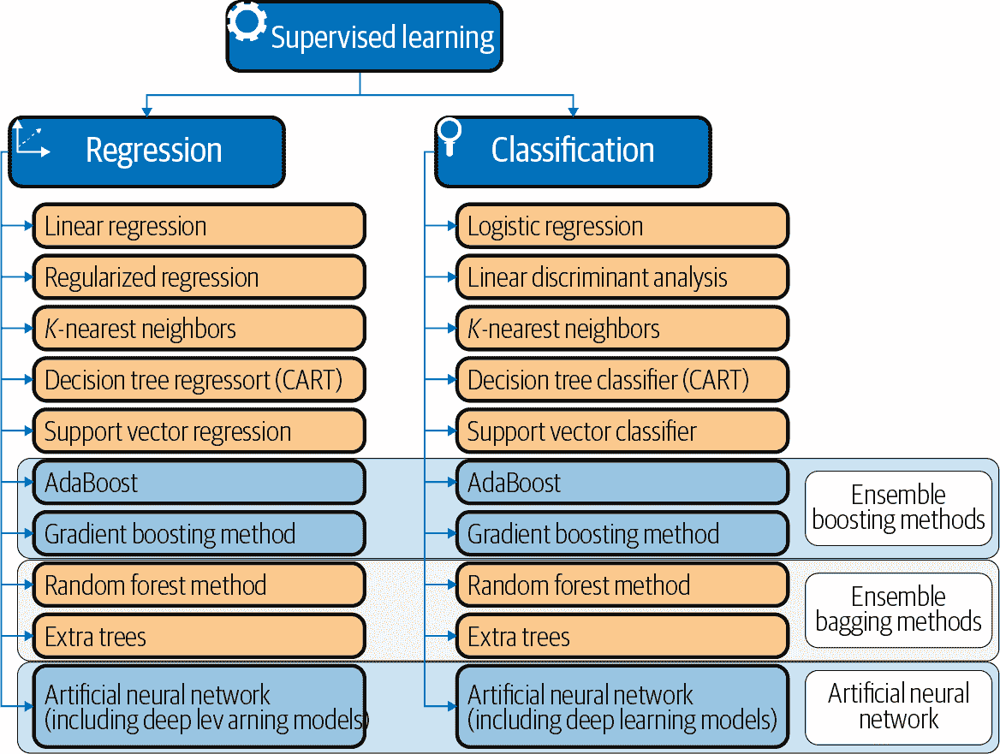
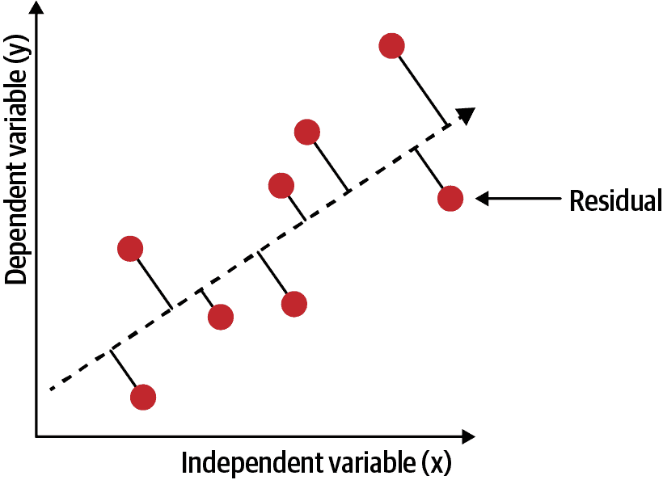
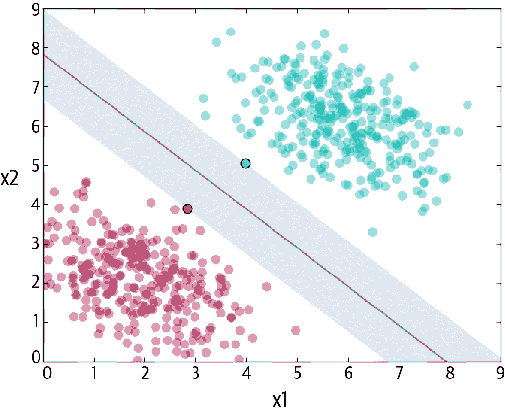
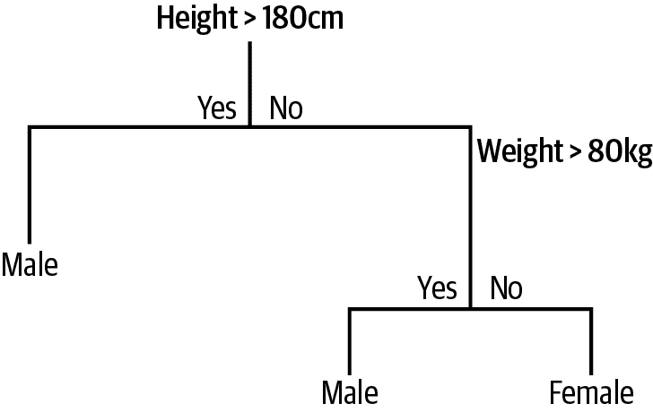
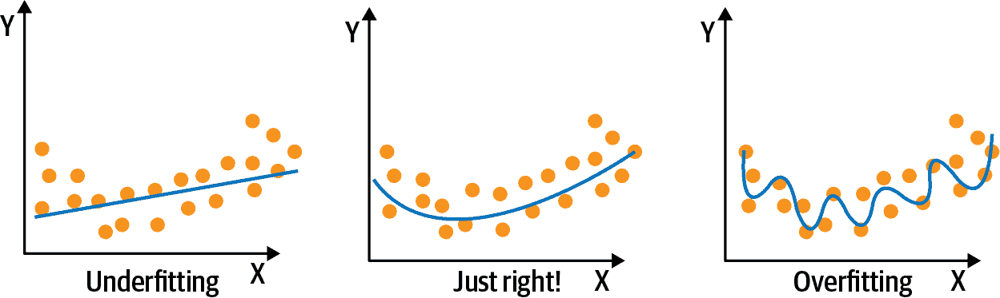
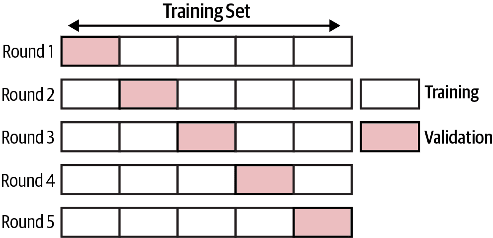
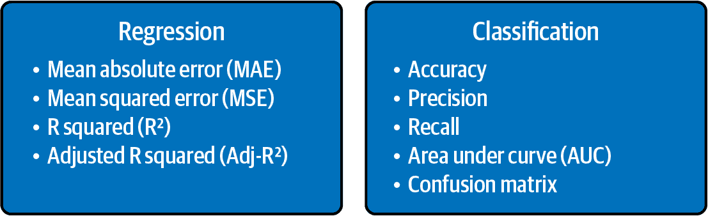
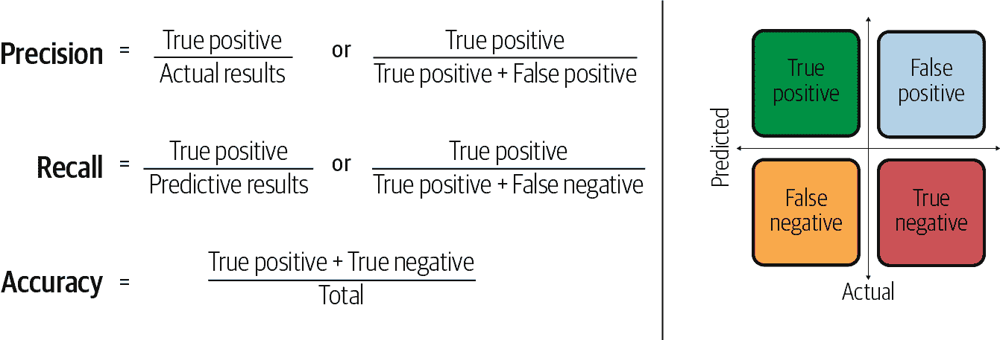
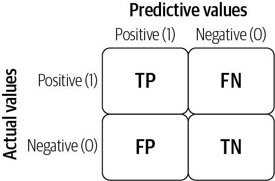
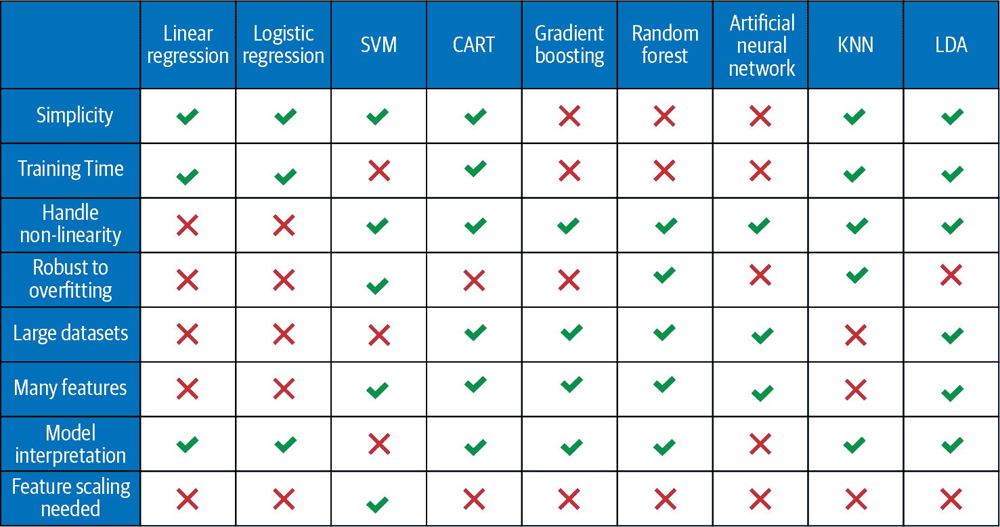

# 第四章：监督学习：模型与概念

监督学习是机器学习的一个领域，选择的算法试图使用给定的输入来拟合目标。算法提供了包含标签的训练数据集。基于大量数据，算法将学习一条规则，用于预测新观察值的标签。换句话说，监督学习算法基于历史数据，并试图找到具有最佳预测能力的关系。

有两种类型的监督学习算法：回归算法和分类算法。基于回归的监督学习方法试图根据输入变量预测输出。基于分类的监督学习方法确定数据项属于哪个类别。分类算法是基于概率的，意味着算法找到数据集属于哪个类别的概率最高，就会输出该类别。相反，回归算法估计具有无限解（可能结果的连续集）的问题的结果。

在金融领域，监督学习模型代表了最常用的机器学习模型之一。许多在算法交易中广泛应用的算法依赖于监督学习模型，因为它们可以高效训练，相对稳健地处理嘈杂的金融数据，并且与金融理论有着密切联系。

学术界和行业研究人员已经利用基于回归的算法开发了许多资产定价模型。这些模型用于预测各种时间段的回报，并识别影响资产回报的重要因素。在投资组合管理和衍生品定价中还有许多其他基于回归的监督学习的用例。

另一方面，基于分类的算法已经在金融领域的许多领域中得到应用，这些领域需要预测分类响应。这些包括欺诈检测、违约预测、信用评分、资产价格运动方向的预测以及买入/卖出建议。在投资组合管理和算法交易中还有许多其他基于分类的监督学习的用例。

在第五章和第六章中介绍了基于回归和分类的监督学习的许多用例。

Python 及其库提供了在几行代码中实现这些监督学习模型的方法和方式。这些库中的一些在第二章中有详细介绍。借助易于使用的机器学习库，如 Scikit-learn 和 Keras，可以简单地对给定的预测建模数据集拟合不同的机器学习模型。

在本章中，我们提供了监督学习模型的高级概述。有关这些主题的全面覆盖，请参阅 Aurélien Géron 的《使用 Scikit-Learn、Keras 和 TensorFlow 进行实战机器学习》，第 2 版（O'Reilly）。

# 监督学习模型：概述

分类预测建模问题与回归预测建模问题有所不同，因为分类是预测离散类别标签的任务，而回归是预测连续量的任务。然而，两者共享利用已知变量进行预测的概念，并且在两种模型之间存在显著的重叠。因此，分类和回归模型在本章中一起介绍。图 4-1 总结了用于分类和回归的常用模型列表。

一些模型可以通过小的修改同时用于分类和回归。这些模型包括 *K* 近邻、决策树、支持向量机、集成装袋/提升方法以及人工神经网络（包括深度神经网络），如图 4-1 所示。然而，一些模型，如线性回归和逻辑回归，不能（或者不容易）同时用于两种问题类型。



###### 图 4-1\. 回归和分类模型

本节包含以下有关模型的详细信息：

+   模型理论。

+   在 Scikit-learn 或 Keras 中的实现。

+   不同模型的网格搜索。

+   模型的优缺点。

###### 注意

在金融领域，重点放在从先前观察到的数据中提取信号以预测同一时间序列的未来值的模型上。这类时间序列模型预测连续输出，并且更符合监督回归模型的特性。时间序列模型在监督回归章节中单独进行讨论（第五章）。

## 线性回归（普通最小二乘法）

*线性回归*（普通最小二乘回归或 OLS 回归）或许是统计学和机器学习中最为知名且理解最透彻的算法之一。线性回归是一个线性模型，例如，它假设输入变量 (*x*) 和单一输出变量 (*y*) 之间存在线性关系。线性回归的目标是训练一个线性模型，以尽可能小的误差来预测新的 *y* 给定先前未见的 *x*。

我们的模型将是一个函数，其预测 *y* 给定 <math alttext="x 1 comma x 2 period period period x Subscript i Baseline"><mrow><msub><mi>x</mi> <mn>1</mn></msub> <mo>,</mo> <msub><mi>x</mi> <mn>2</mn></msub> <mo>.</mo> <mo>.</mo> <mo>.</mo> <msub><mi>x</mi> <mi>i</mi></msub></mrow></math> ：

<math alttext="y equals beta 0 plus beta 1 x 1 plus period period period plus beta Subscript i Baseline x Subscript i Baseline" display="block"><mrow><mi>y</mi> <mo>=</mo> <msub><mi>β</mi> <mn>0</mn></msub> <mo>+</mo> <msub><mi>β</mi> <mn>1</mn></msub> <msub><mi>x</mi> <mn>1</mn></msub> <mo>+</mo> <mo>.</mo> <mo>.</mo> <mo>.</mo> <mo>+</mo> <msub><mi>β</mi> <mi>i</mi></msub> <msub><mi>x</mi> <mi>i</mi></msub></mrow></math>

其中，<math alttext="beta 0"><msub><mi>β</mi> <mn>0</mn></msub></math> 被称为截距，<math alttext="beta 1 period period period beta Subscript i Baseline"><mrow><msub><mi>β</mi> <mn>1</mn></msub> <mo>.</mo> <mo>.</mo> <mo>.</mo> <msub><mi>β</mi> <mi>i</mi></msub></mrow></math> 是回归系数。

### Python 中的实现

```py
from sklearn.linear_model import LinearRegression
model = LinearRegression()
model.fit(X, Y)
```

在接下来的部分中，我们涵盖了线性回归模型的训练和模型的网格搜索。然而，总体概念和相关方法适用于所有其他监督学习模型。

### 训练模型

正如我们在第三章中提到的，训练模型基本上意味着通过最小化成本（损失）函数来检索模型参数。训练线性回归模型的两个步骤是：

定义成本函数（或损失函数）

衡量模型预测的不准确性。如方程 4-1 中定义的*残差平方和（RSS）*，衡量实际值与预测值之间差异的平方和，是线性回归的成本函数。

##### 方程 4-1\. 残差平方和

<math display="block"><mrow><mi>R</mi> <mi>S</mi> <mi>S</mi> <mo>=</mo> <munderover><mo>∑</mo> <mrow><mi>i</mi><mo>=</mo><mn>1</mn></mrow> <mi>n</mi></munderover> <msup><mfenced separators="" open="(" close=")"><msub><mi>y</mi> <mi>i</mi></msub> <mo>–</mo> <msub><mi>β</mi> <mn>0</mn></msub> <mo>–</mo> <munderover><mo>∑</mo> <mrow><mi>j</mi><mo>=</mo><mn>1</mn></mrow> <mi>n</mi></munderover> <msub><mi>β</mi> <mi>j</mi></msub> <msub><mi>x</mi> <mrow><mi>i</mi><mi>j</mi></mrow></msub></mfenced> <mn>2</mn></msup></mrow></math>

在这个方程中，<math alttext="beta 0"><msub><mi>β</mi> <mn>0</mn></msub></math> 是截距；<math alttext="beta Subscript j"><msub><mi>β</mi> <mi>j</mi></msub></math> 代表系数；<math alttext="beta 1 comma period period comma beta Subscript j Baseline"><mrow><msub><mi>β</mi> <mn>1</mn></msub> <mo>,</mo> <mo>.</mo> <mo>.</mo> <mo>,</mo> <msub><mi>β</mi> <mi>j</mi></msub></mrow></math> 是回归的系数；<math alttext="x Subscript i j"><msub><mi>x</mi> <mrow><mi>i</mi><mi>j</mi></mrow></msub></math> 表示第<math alttext="i Superscript t h"><msup><mi>i</mi> <mrow><mi>t</mi><mi>h</mi></mrow></msup></math>观测和第<math alttext="j Superscript t h"><msup><mi>j</mi> <mrow><mi>t</mi><mi>h</mi></mrow></msup></math>变量。

找到最小化损失的参数

例如，使我们的模型尽可能准确。在二维图中，这会导致最佳拟合线，如图 4-2 所示。在更高维度中，我们将会有更高维的超平面。从数学角度来看，我们关注每个真实数据点(*y*)与我们模型预测(*ŷ*)之间的差异。平方这些差异以避免负数并惩罚较大的差异，然后将它们相加并取平均值。这衡量了我们的数据与拟合线的拟合程度。



###### 图 4-2\. 线性回归

### 网格搜索

网格搜索的总体思想是创建所有可能的超参数组合的网格，并使用每个组合来训练模型。超参数是模型的外部特征，可以被视为模型的设置，不像模型参数那样基于数据估计。这些超参数在网格搜索过程中被调整以实现更好的模型性能。

由于其穷举搜索，网格搜索保证在网格内找到最优参数。缺点是随着参数或考虑值的增加，网格的大小呈指数增长。

sklearn 软件包的`model_selection`模块中的`GridSearchCV`类有助于系统地评估我们希望测试的所有超参数值的组合。

第一步是创建一个模型对象。然后我们定义一个字典，其中关键字命名超参数，值列表显示要测试的参数设置。对于线性回归，超参数是`fit_intercept`，它是一个布尔变量，确定是否计算此模型的*截距*。如果设置为`False`，计算中将不使用截距：

```py
model = LinearRegression()
param_grid = {'fit_intercept': [True, False]}
}
```

第二步是实例化`GridSearchCV`对象，并提供评估器对象和参数网格，以及评分方法和交叉验证选择给初始化方法。交叉验证是一种用于评估机器学习模型的重采样过程，评分参数是模型的评估指标：¹

在所有设置就位后，我们可以拟合`GridSearchCV`：

```py
grid = GridSearchCV(estimator=model, param_grid=param_grid, scoring= 'r2', \
  cv=kfold)
grid_result = grid.fit(X, Y)
```

### 优点和缺点

在优点方面，线性回归易于理解和解释。然而，当预测变量与预测变量之间存在非线性关系时，它可能效果不佳。线性回归容易出现*过拟合*（我们将在下一节讨论）问题，而且当存在大量特征时，可能无法很好地处理不相关的特征。线性回归还要求数据遵循某些[假设](https://oreil.ly/tNDnc)，如不存在多重共线性。如果假设不成立，则无法信任所得到的结果。

## 正则化回归

当线性回归模型包含许多自变量时，它们的系数将难以确定，模型将倾向于非常适合训练数据（用于构建模型的数据），但对测试数据（用于测试模型好坏的数据）适配不佳。这被称为过拟合或高方差。

控制过拟合的一种流行技术是*正则化*，它涉及向误差或损失函数添加一个*惩罚*项，以防止系数达到较大值。简单来说，正则化是一种惩罚机制，通过收缩模型参数（使其接近于零）来建立预测精度更高且易于解释的模型。正则化回归比线性回归有两个优点：

预测精度

模型在测试数据上的表现更好表明，模型试图从训练数据中概括。具有过多参数的模型可能尝试拟合特定于训练数据的噪声。通过收缩或将一些系数设为零，我们权衡了适合复杂模型（更高偏差）的能力，以换取更具泛化能力的模型（更低方差）。

解释

大量预测子可能会复杂化结果的解释或传达大局。为了限制模型仅包括对结果影响最大的一小部分参数，可能需要牺牲一些细节。

正则化线性回归模型的常见方法如下：

L1 正则化或 Lasso 回归

*Lasso 回归* 通过在线性回归的成本函数（RSS）中添加系数绝对值之和的因素（如 Equation 4-1 所述）执行 *L1 正则化*。Lasso 正则化的方程可以表示如下：

<math alttext="upper C o s t upper F u n c t i o n equals upper R upper S upper S plus lamda asterisk sigma-summation Underscript j equals 1 Overscript p Endscripts StartAbsoluteValue beta Subscript j Baseline EndAbsoluteValue"><mrow><mi>C</mi> <mi>o</mi> <mi>s</mi> <mi>t</mi> <mi>F</mi> <mi>u</mi> <mi>n</mi> <mi>c</mi> <mi>t</mi> <mi>i</mi> <mi>o</mi> <mi>n</mi> <mo>=</mo> <mi>R</mi> <mi>S</mi> <mi>S</mi> <mo>+</mo> <mi>λ</mi> <mo>*</mo> <msubsup><mo>∑</mo> <mrow><mi>j</mi><mo>=</mo><mn>1</mn></mrow> <mi>p</mi></msubsup> <mfenced separators="" open="|" close="|"><msub><mi>β</mi> <mi>j</mi></msub></mfenced></mrow></math>

L1 正则化可以导致零系数（即某些特征在输出评估中被完全忽略）。<math alttext="lamda"><mi>λ</mi></math> 值越大，被收缩至零的特征越多。这可以完全消除一些特征，并给出预测子集，从而降低模型复杂度。因此，Lasso 回归不仅有助于减少过拟合，还可以帮助进行特征选择。未收缩至零的预测子集表明它们很重要，因此 L1 正则化允许进行特征选择（稀疏选择）。正则化参数（ <math alttext="lamda"><mi>λ</mi></math> ）可控制，`lambda` 值为零时产生基本线性回归方程。

可以使用 Python 的 sklearn 包中的 `Lasso` 类构建 Lasso 回归模型，如下所示的代码片段：

```py
from sklearn.linear_model import Lasso
model = Lasso()
model.fit(X, Y)
```

L2 正则化或 Ridge 回归

*Ridge 回归* 通过在线性回归的成本函数（RSS）中添加系数平方和的因素执行 *L2 正则化*（如 Equation 4-1 所述）。Ridge 正则化的方程可以表示如下：

<math><mrow><mi>C</mi> <mi>o</mi> <mi>s</mi> <mi>t</mi> <mi>F</mi> <mi>u</mi> <mi>n</mi> <mi>c</mi> <mi>t</mi> <mi>i</mi> <mi>o</mi> <mi>n</mi> <mo>=</mo> <mi>R</mi> <mi>S</mi> <mi>S</mi> <mo>+</mo> <mi>λ</mi> <mo>*</mo> <msubsup><mo>∑</mo> <mrow><mi>j</mi><mo>=</mo><mn>1</mn></mrow> <mi>p</mi></msubsup> <msubsup><mi>β</mi> <mrow><mi>j</mi></mrow> <mn>2</mn></msubsup></mrow></math>

岭回归对系数施加了约束。惩罚项（ <math alttext="lamda"><mi>λ</mi></math> ）正则化系数，如果系数取大值，则优化函数受到惩罚。因此，岭回归会收缩系数并有助于降低模型复杂度。收缩系数会导致较低的方差和较低的误差值。因此，岭回归减少了模型的复杂度，但并不减少变量的数量；它只是缩小它们的影响。当 <math alttext="lamda"><mi>λ</mi></math> 接近零时，成本函数变得类似于线性回归成本函数。因此，对于特征的约束越低（低 <math alttext="lamda"><mi>λ</mi></math> ），模型越类似于线性回归模型。

可以使用 Python 的 sklearn 包中的 `Ridge` 类构建岭回归模型，如下面的代码片段所示：

```py
from sklearn.linear_model import Ridge
model = Ridge()
model.fit(X, Y)
```

弹性网络

*弹性网络* 向模型添加了正则化项，这是 L1 和 L2 正则化的组合，如下方程所示：

<math display="inline"><mrow><mi>C</mi> <mi>o</mi> <mi>s</mi> <mi>t</mi> <mi>F</mi> <mi>u</mi> <mi>n</mi> <mi>c</mi> <mi>t</mi> <mi>i</mi> <mi>o</mi> <mi>n</mi> <mo>=</mo> <mi>R</mi> <mi>S</mi> <mi>S</mi> <mo>+</mo> <mi>λ</mi> <mo>*</mo> <mfenced separators="" open="(" close=")"><mrow><mo>(</mo><mn>1</mn><mo>–</mo><mi>α</mi><mo>)</mo></mrow> <mo>/</mo> <mn>2</mn> <mo>*</mo> <msubsup><mo>∑</mo> <mrow><mi>j</mi><mo>=</mo><mn>1</mn></mrow> <mi>p</mi></msubsup> <msubsup><mi>β</mi> <mrow><mi>j</mi></mrow> <mn>2</mn></msubsup> <mo>+</mo> <mi>α</mi> <mo>*</mo> <msubsup><mo>∑</mo> <mrow><mi>j</mi><mo>=</mo><mn>1</mn></mrow> <mi>p</mi></msubsup> <mfenced separators="" open="|" close="|"><msub><mi>β</mi> <mi>j</mi></msub></mfenced></mfenced></mrow></math>

除了设置和选择 <math alttext="lamda"><mi>λ</mi></math> 值外，弹性网还允许我们调整 alpha 参数，其中 <math alttext="alpha"><mi>α</mi></math> = *0* 对应于岭回归，<math alttext="alpha"><mi>α</mi></math> = *1* 对应于拉索。因此，我们可以选择一个介于 *0* 和 *1* 之间的 <math alttext="alpha"><mi>α</mi></math> 值来优化弹性网。这将有效地收缩一些系数并将一些系数设置为 *0* 以进行稀疏选择。

可以使用 Python 的 sklearn 包中的 `ElasticNet` 类构建弹性网络回归模型，如下面的代码片段所示：

```py
from sklearn.linear_model import ElasticNet
model = ElasticNet()
model.fit(X, Y)
```

对于所有正则化回归，在 Python 的网格搜索期间调整的关键参数是 <math alttext="lamda"><mi>λ</mi></math> 。在弹性网中，<math alttext="alpha"><mi>α</mi></math> 可以是一个额外的可调参数。

## 逻辑回归

*逻辑回归* 是最广泛使用的分类算法之一。逻辑回归模型出现的原因是希望在 *x* 的线性函数中建模输出类的概率，同时确保输出概率总和为一，并且保持在零到一之间，这是我们从概率中期望的结果。

如果我们在几个示例上训练线性回归模型，其中 *Y = 0* 或 *1*，我们可能会预测出一些小于零或大于一的概率，这是不合理的。相反，我们使用逻辑回归模型（或 *logit* 模型），这是线性回归的修改版，通过应用 `sigmoid` 函数确保输出的概率在零到一之间。²

方程 4-2 展示了逻辑回归模型的方程式。类似于线性回归，输入值(*x*)通过权重或系数值线性组合以预测输出值(*y*)。从方程 4-2 得到的输出是一个概率，被转换成二进制值(*0*或*1*)以获取模型预测。

##### 方程 4-2\. 逻辑回归方程

<math alttext="y equals StartFraction exp left-parenthesis beta 0 plus beta 1 x 1 plus period period period period plus beta Subscript i Baseline x 1 right-parenthesis Over 1 plus exp left-parenthesis beta 0 plus beta 1 x 1 plus period period period period plus beta Subscript i Baseline x 1 right-parenthesis EndFraction" display="block"><mrow><mi>y</mi> <mo>=</mo> <mfrac><mrow><mo form="prefix">exp</mo><mo>(</mo><msub><mi>β</mi> <mn>0</mn></msub> <mo>+</mo><msub><mi>β</mi> <mn>1</mn></msub> <msub><mi>x</mi> <mn>1</mn></msub> <mo>+</mo><mo>.</mo><mo>.</mo><mo>.</mo><mo>.</mo><mo>+</mo><msub><mi>β</mi> <mi>i</mi></msub> <msub><mi>x</mi> <mn>1</mn></msub> <mo>)</mo></mrow> <mrow><mn>1</mn><mo>+</mo><mo form="prefix">exp</mo><mo>(</mo><msub><mi>β</mi> <mn>0</mn></msub> <mo>+</mo><msub><mi>β</mi> <mn>1</mn></msub> <msub><mi>x</mi> <mn>1</mn></msub> <mo>+</mo><mo>.</mo><mo>.</mo><mo>.</mo><mo>.</mo><mo>+</mo><msub><mi>β</mi> <mi>i</mi></msub> <msub><mi>x</mi> <mn>1</mn></msub> <mo>)</mo></mrow></mfrac></mrow></math>

其中*y*是预测输出，<math alttext="beta 0"><msub><mi>β</mi> <mn>0</mn></msub></math>是偏置或截距项，而 B[1]是单个输入值(*x*)的系数。输入数据中的每一列都有一个关联的<math alttext="beta"><mi>β</mi></math>系数（一个常数实数值），必须从训练数据中学习。

在逻辑回归中，成本函数基本上是衡量我们在真实答案为零时多少次预测为一，反之亦然。训练逻辑回归系数使用诸如最大似然估计（MLE）的技术，以预测接近*1*的默认类别值和接近*0*的其他类别值。³

可以使用 Python 的 sklearn 包的`LogisticRegression`类构建逻辑回归模型，如下代码片段所示：

```py
from sklearn.linear_model import LogisticRegression
model = LogisticRegression()
model.fit(X, Y)
```

### 超参数

正则化（`penalty`在 sklearn 中）

类似于线性回归，逻辑回归可以进行正则化，可以是**L1**、**L2**或**elasticnet**。在*sklearn*库中的取值为[*l1*, *l2*, *elasticnet*]。

正则化强度（`C`在 sklearn 中）

此参数控制正则化强度。想要的惩罚参数的好值可以是*[100, 10, 1.0, 0.1, 0.01]*。

### 优缺点

就优点而言，逻辑回归模型易于实现，具有良好的解释性，并且在线性可分的类别上表现非常好。模型的输出是概率，提供更多的见解并可用于排名。该模型具有少量的超参数。虽然可能存在过拟合的风险，但可以通过类似于线性回归模型的*L1/L2*正则化来解决这个问题。

在缺点方面，当提供大量特征时，模型可能会过拟合。逻辑回归只能学习线性函数，并且不太适合处理特征与目标变量之间的复杂关系。此外，如果特征强相关，可能无法很好地处理无关特征。

## 支持向量机

*支持向量机*（SVM）算法的目标是最大化边界（如图 4-3 中的阴影区域所示），即分隔超平面（或决策边界）与最接近该超平面的训练样本之间的距离，即所谓的支持向量。边界计算为从线到仅最接近点的垂直距离，如图 4-3 所示。因此，SVM 计算出导致所有数据点均匀分区的最大间隔边界。



###### 图 4-3\. 支持向量机

在实践中，数据杂乱无章，并且不能使用超平面完美分离。必须放宽最大化分隔类别的线条的约束。此变更允许训练数据中的一些点违反分隔线。引入了一组额外的系数，这些系数在每个维度中提供间隙余地。引入了一个调整参数，简称为*C*，它定义了允许跨所有维度的摆动幅度。*C* 的值越大，允许的超平面违规就越多。

在某些情况下，无法找到超平面或线性决策边界，因此使用内核。内核只是输入数据的转换，允许 SVM 算法更轻松地处理数据。使用内核，原始数据被投影到更高的维度以更好地分类数据。

SVM 用于分类和回归。我们通过将原始优化问题转换为对偶问题来实现这一点。对于回归，技巧在于颠倒目标。在试图在两个类之间拟合尽可能大的街道同时限制边界违规时，SVM 回归试图在街道上（图 4-3 中阴影区域）尽可能多地拟合实例，同时限制边界违规。街道的宽度由超参数控制。

SVM 回归和分类模型可以使用 Python 的 `sklearn` 包构建，如下面的代码片段所示：

`回归`

```py
from sklearn.svm import SVR
model = SVR()
model.fit(X, Y)
```

`分类`

```py
from sklearn.svm import SVC
model = SVC()
model.fit(X, Y)
```

### 超参数

在 `sklearn` 实现的 SVM 中存在以下关键参数，并可在执行网格搜索时进行调整：

内核（`sklearn` 中的 `kernel`）

内核的选择控制输入变量将被投影的方式。有许多内核可供选择，但*线性*和[*RBF*](https://oreil.ly/XpBOi)是最常见的。

惩罚（`sklearn` 中的 `C`）

惩罚参数告诉 SVM 优化希望避免每个训练样本的错误分类程度。对于惩罚参数的大值，优化会选择一个较小间隔的超平面。良好的值可能在对数尺度从 10 到 1,000 之间。

### 优缺点

就优点而言，SVM 对过拟合相当鲁棒，特别是在高维空间中。它能够很好地处理非线性关系，提供多种核函数选择。此外，对数据没有分布要求。

就缺点而言，SVM 在训练时可能效率低且内存占用高，并且调整困难。它在处理大型数据集时表现不佳。它要求对数据进行特征缩放。还有许多超参数，它们的含义通常不直观。

## K-最近邻算法

*K-最近邻*（KNN）被认为是一种“惰性学习器”，因为模型不需要学习。对于新数据点，预测是通过在整个训练集中搜索*K*个最相似的实例（邻居），并总结这些*K*个实例的输出变量来实现的。

为了确定训练数据集中与新输入最相似的*K*个实例，使用了一个距离度量。最流行的距离度量是*欧几里得距离*，其计算方法是在所有输入属性**i**上，点*a*和点*b*之间的平方差的平方根，表示为 <math display="inline"><mrow><mi>d</mi> <mrow><mo>(</mo> <mi>a</mi> <mo>,</mo> <mi>b</mi> <mo>)</mo></mrow> <mo>=</mo> <msqrt><mrow><msubsup><mo>∑</mo> <mrow><mi>i</mi><mo>=</mo><mn>1</mn></mrow> <mi>n</mi></msubsup> <msup><mrow><mo>(</mo><msub><mi>a</mi> <mi>i</mi></msub> <mo>–</mo><msub><mi>b</mi> <mi>i</mi></msub> <mo>)</mo></mrow> <mn>2</mn></msup></mrow></msqrt></mrow></math> 。欧几里得距离在输入变量类型相似时是一种很好的距离度量。

另一种距离度量是*曼哈顿距离*，其中点*a*和点*b*之间的距离表示为 <math display="inline"><mrow><mi>d</mi> <mrow><mo>(</mo> <mi>a</mi> <mo>,</mo> <mi>b</mi> <mo>)</mo></mrow> <mo>=</mo> <msubsup><mo>∑</mo> <mrow><mi>i</mi><mo>=</mo><mn>1</mn></mrow> <mi>n</mi></msubsup> <mrow><mo>|</mo> <msub><mi>a</mi> <mi>i</mi></msub> <mo>–</mo> <msub><mi>b</mi> <mi>i</mi></msub> <mo>|</mo></mrow></mrow></math> 。曼哈顿距离在输入变量类型不相似时是一种很好的度量。

KNN 的步骤可以总结如下：

1.  选择*K*的数量和距离度量。

1.  找到我们要分类的样本的*K*个最近邻居。

1.  通过多数投票分配类别标签。

可以使用 Python 的 sklearn 包构建 KNN 回归和分类模型，如下所示：

`分类`

```py
from sklearn.neighbors import KNeighborsClassifier
model = KNeighborsClassifier()
model.fit(X, Y)
```

`回归`

```py
from sklearn.neighbors import KNeighborsRegressor
model = KNeighborsRegressor()
model.fit(X, Y)
```

### 超参数

在 sklearn 实现的 KNN 中存在以下关键参数，可以在执行网格搜索时调整：

邻居数（sklearn 中的`n_neighbors`）

KNN 最重要的超参数是邻居数（n_neighbors）。良好的值在 1 到 20 之间。

距离度量（在 sklearn 中称为`metric`）

测试不同距离度量来选择邻域组成可能也会很有趣。良好的值为*euclidean*和*manhattan*。

### 优缺点

在优点方面，无需训练，因此没有学习阶段。由于算法在进行预测之前不需要训练，因此可以轻松添加新数据而不影响算法的准确性。它直观且易于理解。该模型自然处理多类别分类，并能学习复杂的决策边界。如果训练数据量大，则 KNN 非常有效。它还对噪声数据具有鲁棒性，无需过滤异常值。

在缺点方面，选择距离度量并不明显，很难在许多情况下进行证明。KNN 在高维数据集上表现不佳。预测新实例的成本高且速度慢，因为必须重新计算到所有邻居的距离。KNN 对数据集中的噪声敏感。我们需要手动输入缺失值并移除异常值。此外，在应用 KNN 算法之前需要进行特征缩放（标准化和归一化），否则 KNN 可能会生成错误的预测。

## 线性判别分析

*线性判别分析*（LDA）算法的目标是以一种方式将数据投影到低维空间，使得类别的可分离性最大化，类内方差最小化。⁴

在训练 LDA 模型期间，会计算每个类别的统计特性（即均值和协方差矩阵）。这些统计特性是基于以下关于数据的假设进行估计的：

+   数据是[normally distributed](https://oreil.ly/cuc7p)，因此每个变量在绘制时都呈钟形曲线。

+   每个属性具有相同的方差，并且每个变量的值平均围绕均值变化相同量。

要进行预测，LDA 估计新输入数据属于每个类别的概率。输出类别是具有最高概率的类别。

### Python 中的实现及超参数

可以使用 Python 的 sklearn 包构建 LDA 分类模型，如下面的代码片段所示：

```py
from sklearn.discriminant_analysis import LinearDiscriminantAnalysis
model = LinearDiscriminantAnalysis()
model.fit(X, Y)
```

LDA 模型的关键超参数是`number of components`，用于降维，而在 sklearn 中表示为`n_components`。

### 优缺点

在优点方面，LDA 是一个相对简单的模型，实现快速且易于实现。在缺点方面，它需要特征缩放并涉及复杂的矩阵操作。

## 分类和回归树

从最一般的角度来看，通过树构建算法进行分析的目的是确定一组*if–then*逻辑（分裂）条件，以便准确预测或分类案例。*分类与回归树*（或*CART*或*决策树分类器*）是具有吸引力的模型，如果我们关心解释性的话。我们可以将这个模型视为分解数据并基于一系列问题做出决策的过程。这种算法是随机森林和梯度提升方法等集成方法的基础。

### 表示

该模型可以通过*二叉树*（或*决策树*）来表示，其中每个节点是一个输入变量 *x*，带有一个分割点，每个叶子包含用于预测的输出变量 *y*。

图 4-4 展示了一个简单分类树的示例，根据身高（以厘米为单位）和体重（以公斤为单位）两个输入预测一个人是男性还是女性。



###### 图 4-4\. 分类与回归树示例

### 学习 CART 模型

创建一个二叉树实际上是一个将输入空间分割的过程。采用一种称为*递归二元分割*的贪婪方法来分割空间。这是一个数值过程，在此过程中，所有值都被排列，并尝试使用成本（损失）函数测试不同的分割点。选择具有最佳成本（因为我们最小化成本）的分割点。所有输入变量和所有可能的分割点都以贪婪的方式进行评估和选择（例如，每次都选择最佳分割点）。

对于回归预测建模问题，用于选择分裂点的成本函数是在所有落入矩形内的训练样本上最小化的*平方误差和*：

<math><mrow><msubsup><mo>∑</mo> <mrow><mi>i</mi><mo>=</mo><mn>1</mn></mrow> <mi>n</mi></msubsup> <msup><mrow><mo>(</mo><msub><mi>y</mi> <mi>i</mi></msub> <mo>–</mo><mi>p</mi><mi>r</mi><mi>e</mi><mi>d</mi><mi>i</mi><mi>c</mi><mi>t</mi><mi>i</mi><mi>o</mi><msub><mi>n</mi> <mi>i</mi></msub> <mo>)</mo></mrow> <mn>2</mn></msup></mrow></math>

其中<math alttext="y Subscript i"><msub><mi>y</mi> <mi>i</mi></msub></math>是训练样本的输出，prediction 是矩形的预测输出。对于分类问题，使用*基尼成本函数*；它提供了叶子节点纯度的指示（即分配给每个节点的训练数据的混合程度），并定义为：

<math><mrow><mi>G</mi> <mo>=</mo> <msubsup><mo>∑</mo> <mrow><mi>i</mi><mo>=</mo><mn>1</mn></mrow> <mi>n</mi></msubsup> <msub><mi>p</mi> <mi>k</mi></msub> <mo>*</mo> <mrow><mo>(</mo> <mn>1</mn> <mo>–</mo> <msub><mi>p</mi> <mi>k</mi></msub> <mo>)</mo></mrow></mrow></math>

其中*G*是兴趣区域矩形中所有类的基尼成本，<math alttext="p Subscript k"><msub><mi>p</mi> <mi>k</mi></msub></math>是具有类*k*的训练实例数量。具有完全类纯度（完美类纯度）的节点将具有*G = 0*，而在二元分类问题中具有*50-50*类分布（最差纯度）的节点将具有*G = 0.5*。

### 停止准则

在前面的部分描述的递归二元分裂过程中，需要知道何时停止分裂，因为它在训练数据中沿着树的路径工作。最常见的停止程序是在每个叶节点分配的训练实例数达到最小值时停止。如果计数少于某个最小值，则不接受分裂，并将节点视为最终叶节点。

### 修剪树

停止准则非常重要，因为它强烈影响树的性能。学习树后可以使用修剪来进一步提升性能。决策树的复杂性定义为树中的分裂数。更简单的树更受欢迎，因为它们运行更快，易于理解，在处理和存储过程中消耗更少的内存，并且不太可能过度拟合数据。最快和最简单的修剪方法是通过测试集逐个处理树中的每个叶节点，并评估移除它的效果。仅当这样做会导致整个测试集上成本函数的下降时才移除叶节点。当不能进一步改善时，可以停止删除节点。

### Python 实现

使用 Python 的 sklearn 包可以构建 CART 回归和分类模型，如下面的代码片段所示：

`分类`

```py
from sklearn.tree import DecisionTreeClassifier
model = DecisionTreeClassifier()
model.fit(X, Y)
```

`回归`

```py
from sklearn.tree import DecisionTreeRegressor
model = DecisionTreeRegressor ()
model.fit(X, Y)
```

### 超参数

CART 有许多超参数。然而，关键的超参数是树模型的最大深度，这是降维的组件数量，用`max_depth`在 sklearn 包中表示。好的取值范围可以从*2*到*30*，具体取决于数据中的特征数量。

### 优缺点

在优点方面，CART 易于解释并能够适应学习复杂关系。它需要很少的数据准备工作，通常不需要缩放数据。由于决策节点的构建方式，特征重要性是内置的。它在大型数据集上表现良好。它适用于回归和分类问题。

在缺点方面，除非使用修剪，否则 CART 易于过拟合。它可能非常不稳健，意味着训练数据集的小变化可能导致所学习的假设函数存在较大差异。通常情况下，CART 的性能不如下面将要讨论的集成模型。

## 集成模型

*集成模型*的目标是将不同的分类器组合成一个元分类器，其泛化性能优于单个分类器。例如，假设我们从 10 位专家收集了预测结果，集成方法允许我们策略性地结合他们的预测，得到比专家个体预测更准确和更稳健的预测。

最流行的两种集成方法是装袋（bagging）和提升（boosting）。*装袋*（或*自举聚合*）是一种并行训练多个独立模型的集成技术。每个模型由数据的随机子集训练。*提升*则是一种串行训练多个独立模型的集成技术。通过从训练数据构建一个模型，然后创建第二个模型来纠正第一个模型的错误。模型逐步添加，直到训练集被完美预测或者达到最大模型数量。每个独立模型从前一个模型的错误中学习。就像决策树本身一样，装袋和提升可用于分类和回归问题。

通过结合独立模型，集成模型更加灵活（偏差较小）且对数据不敏感（方差较小）。⁵ 集成方法结合多个简单算法以获得更好的性能。

在本节中，我们将涵盖随机森林、AdaBoost、梯度提升方法和额外树，以及它们在 sklearn 包中的实现。

#### 随机森林

*随机森林*是装袋决策树的调整版本。为了理解随机森林算法，首先了解*装袋算法*。假设我们有一个包含一千个实例的数据集，装袋的步骤如下：

1.  创建许多（例如一百个）数据集的随机子样本。

1.  对每个样本训练一个 CART 模型。

1.  给定一个新数据集，计算每个模型的平均预测，并通过每棵树的预测结果进行多数投票来确定最终标签。

像 CART 这样的决策树存在一个问题，即它们是贪婪的。它们通过最小化误差的贪婪算法选择分裂变量。即使在装袋之后，决策树可能具有很多结构相似性，并导致其预测高度相关。如果子模型的预测相互不相关，或者最好是弱相关，那么从多个模型的预测中组合预测将效果更好。随机森林通过改变学习算法的方式，使得所有子树的预测结果相关性更低。

在 CART 中，选择分裂点时，学习算法允许查看所有变量和所有变量值，以选择最优的分裂点。随机森林算法改变了这个过程，使得每个子树在选择分裂点时只能访问一部分随机抽取的特征。在算法中必须指定一个参数来表示每个分裂点可以搜索的特征数量（*m*）。

当构建装袋决策树时，我们可以计算每个分裂点的变量的误差函数降低量。在回归问题中，这可能是总平方误差的减少量，在分类问题中，可能是基尼成本。装袋方法可以通过计算并平均单个变量的误差函数降低量来提供特征重要性。

#### Python 实现

可使用 Python 的 sklearn 包构建随机森林回归和分类模型，如下所示的代码：

`分类`

```py
from sklearn.ensemble import RandomForestClassifier
model = RandomForestClassifier()
model.fit(X, Y)
```

`回归`

```py
from sklearn.ensemble import RandomForestRegressor
model = RandomForestRegressor()
model.fit(X, Y)
```

#### 超参数

sklearn 实现的随机森林中存在一些主要的超参数，可以在执行网格搜索时进行调整。

最大特征数（`max_features`在 sklearn 中）

这是最重要的参数。它是在每个分裂点随机抽取的特征数量。您可以尝试一系列整数值，例如从 1 到 20，或从 1 到输入特征数量的一半。

树的数量（`n_estimators`在 sklearn 中）

此参数代表树的数量。理想情况下，应该增加此数量，直到模型不再显示进一步改善为止。良好的值可能在对数尺度从 10 到 1,000 之间。

#### 优缺点

随机森林算法（或模型）由于其良好的性能、可扩展性和易用性，在过去十年中在机器学习应用中获得了巨大的流行。它灵活，并自然地分配特征重要性分数，因此可以处理冗余的特征列。它适用于大型数据集，并且通常对过拟合具有较强的鲁棒性。该算法不需要对数据进行缩放，并且可以建模非线性关系。

在缺点方面，随机森林可能感觉像一个黑盒方法，因为我们对模型的操作非常有限，结果可能难以解释。虽然随机森林在分类方面表现良好，但对于回归问题可能不太适用，因为它无法给出精确的连续性预测。在回归情况下，它不会预测超出训练数据范围，并可能在特别嘈杂的数据集上过拟合。

### 极端随机树（Extra trees）

*Extra trees*，又称*极端随机树*，是随机森林的一个变种；它构建多棵树，并使用特征的随机子集来分裂节点，类似于随机森林。然而，与随机森林不同的是，在 extra trees 中，观测样本是不重复抽取的。因此，观测样本不会重复出现。

此外，随机森林选择最佳分裂点将父节点转换为两个最同质的子节点。⁶ 然而，extra trees 选择一个随机分裂来将父节点分割为两个随机子节点。在 extra trees 中，随机性不是来自于数据的自助抽样，而是来自于所有观测样本的随机分割。

在实际案例中，性能与普通随机森林可比，有时稍好。额外树的优缺点与随机森林类似。

#### Python 实现

可以使用 Python 的 sklearn 包构建 Extra trees 的回归和分类模型，如下面的代码片段所示。Extra trees 的超参数与随机森林相似，如前一节所示：

`分类`

```py
from sklearn.ensemble import ExtraTreesClassifier
model = ExtraTreesClassifier()
model.fit(X, Y)
```

`回归`

```py
from sklearn.ensemble import ExtraTreesRegressor
model = ExtraTreesRegressor()
model.fit(X, Y)
```

### 自适应增强（AdaBoost）

*自适应增强*或*AdaBoost*是一种提升技术，其基本思想是依次尝试预测器，每个后续模型试图修正其前任的错误。每次迭代中，AdaBoost 算法通过修改附加到每个实例的权重来改变样本分布。它增加错误预测实例的权重，减少正确预测实例的权重。

AdaBoost 算法的步骤如下：

1.  最初，所有观测样本被赋予相等的权重。

1.  模型建立在数据子集上，使用该模型对整个数据集进行预测。通过比较预测值和实际值来计算错误。

1.  在创建下一个模型时，对预测错误的数据点赋予更高的权重。可以使用错误值确定权重。例如，错误越大，分配给观察值的权重越大。

1.  该过程重复进行，直到错误函数不再改变，或者达到最大估计器数量的限制。

#### Python 实现

可以使用 Python 的 sklearn 包构建 AdaBoost 的回归和分类模型，如下面的代码片段所示：

`分类`

```py
from sklearn.ensemble import AdaBoostClassifier
model = AdaBoostClassifier()
model.fit(X, Y)
```

`回归`

```py
from sklearn.ensemble import AdaBoostRegressor
model = AdaBoostRegressor()
model.fit(X, Y)
```

#### 超参数

sklearn 实现的 AdaBoost 中的一些主要超参数，在执行网格搜索时可以进行调整，包括以下内容：

学习率 (`learning_rate` 在 sklearn 中)

学习率缩小每个分类器/回归器的贡献。可以考虑在对数尺度上。网格搜索的样本值可以是 0.001、0.01 和 0.1。

估计器数量 (`n_estimators` 在 sklearn 中)

此参数表示树的数量。理想情况下，应该增加到在模型中不再看到进一步改进的情况下。良好的值可能是从 10 到 1,000 的对数尺度。

#### 优势和劣势

在优势方面，AdaBoost 具有较高的精度。AdaBoost 可以在几乎不调整参数或设置的情况下达到与其他模型类似的结果。该算法不需要数据进行缩放，并且可以建模非线性关系。

在劣势方面，AdaBoost 的训练时间较长。AdaBoost 对噪声数据和异常值敏感，并且数据不平衡导致分类精度降低。

### 梯度提升方法

*梯度提升方法*（GBM）是另一种类似于 AdaBoost 的提升技术，其一般思想是顺序地尝试预测器。梯度提升通过将前一步骤中未拟合的预测逐步添加到集成中来工作，确保先前的错误得到纠正。

梯度提升算法的步骤如下：

1.  在一个数据子集上构建模型（可以称为第一个弱学习器）。使用该模型，在整个数据集上进行预测。

1.  通过比较预测值和实际值计算错误，并使用损失函数计算损失。

1.  使用前一步骤的错误作为目标变量创建一个新模型。其目标是找到数据中的最佳分割以最小化误差。该新模型的预测值与前一模型的预测值相结合。使用此预测值和实际值计算新的错误。

1.  直到错误函数不再变化或达到最大估计器数的限制为止，重复此过程。

与 AdaBoost 相反，后者在每次交互中调整实例权重，该方法试图将新的预测器拟合到前一个预测器产生的残差错误中。

#### Python 中的实现和超参数

使用 Python 的 sklearn 包可以构建梯度提升方法的回归和分类模型，如下面的代码片段所示。梯度提升方法的超参数与 AdaBoost 相似，如前一节所示：

`分类`

```py
from sklearn.ensemble import GradientBoostingClassifier
model = GradientBoostingClassifier()
model.fit(X, Y)
```

`回归`

```py
from sklearn.ensemble import GradientBoostingRegressor
model = GradientBoostingRegressor()
model.fit(X, Y)
```

#### 优势和劣势

在优势方面，梯度提升方法对于缺失数据、高度相关的特征和无关特征具有鲁棒性，与随机森林相似。它自然地分配特征重要性分数，稍微优于随机森林的性能。该算法不需要数据进行缩放，并且可以建模非线性关系。

在劣势方面，可能比随机森林更容易过拟合，因为提升方法的主要目的是减少偏差而不是方差。它有许多超参数需要调整，因此模型开发可能不那么迅速。此外，特征重要性可能对训练数据集的变化不太稳健。

## 基于 ANN 的模型

在第三章中，我们讨论了 ANN 的基础知识，以及 ANN 的架构及其在 Python 中的训练和实现。该章提供的细节适用于机器学习的所有领域，包括监督学习。然而，从监督学习的角度来看，还有一些额外的细节，我们将在本节中介绍。

神经网络可以通过输出层节点的激活函数减少到分类或回归模型。在回归问题中，输出节点具有线性激活函数（或无激活函数）。线性函数产生从`-inf`到`+inf`的连续输出。因此，输出层将是前一层节点的线性函数，并且它将是基于回归的模型。

在分类问题中，输出节点具有 sigmoid 或 softmax 激活函数。sigmoid 或 softmax 函数产生一个从零到一的输出，表示目标值的概率。softmax 函数还可以用于多组分类。

### 使用 sklearn 的 ANN

可以使用 Python 的 sklearn 包构建 ANN 回归和分类模型，如下面的代码片段所示：

`分类`

```py
from sklearn.neural_network import MLPClassifier
model = MLPClassifier()
model.fit(X, Y)
```

`回归`

```py
from sklearn.neural_network import MLPRegressor
model = MLPRegressor()
model.fit(X, Y)
```

### 超参数

正如我们在第三章中看到的，ANN 具有许多超参数。在 sklearn 的 ANN 实现中存在的一些超参数，在执行网格搜索时可以调整：

隐藏层（sklearn 中的`hidden_layer_sizes`）

它代表 ANN 架构中的层数和节点数。在 sklearn 的 ANN 实现中，第 i 个元素表示第 i 个隐藏层中的神经元数。在 sklearn 实现的网格搜索中，用于示例值的样本值可以是[(*20*,), (*50*,), (*20*, *20*), (*20*, *30*, *20*)]。

激活函数（sklearn 中的`activation`）

它代表隐藏层的激活函数。一些在第三章中定义的激活函数，如`sigmoid`、`relu`或`tanh`，可以使用。

### 深度神经网络

具有多个隐藏层的人工神经网络通常被称为深度网络。我们喜欢使用库 Keras 来实现这样的网络，因为这个库非常灵活。详细介绍了在 Keras 中实现深度神经网络的具体实现。类似于`MLPClassifier`和`MLPRegressor`在 sklearn 中用于分类和回归，Keras 还有名为`KerasClassifier`和`KerasRegressor`的模块，可用于创建具有深度网络的分类和回归模型。

金融领域中一个流行的问题是时间序列预测，即基于历史概述预测时间序列的下一个值。一些深度神经网络，如循环神经网络（RNN），可以直接用于时间序列预测。该方法的详细信息在第五章中提供。

### 优缺点

人工神经网络（ANN）的主要优势在于它相当好地捕捉了变量之间的非线性关系。ANN 可以更轻松地学习丰富的表示，并且在大数据集和大量输入特征的情况下表现良好。ANN 在使用方式上非常灵活。这一点可以从其在机器学习和人工智能中广泛应用的各种领域中看出，包括强化学习和自然语言处理，正如第三章所讨论的那样。

ANN 的主要缺点是模型的可解释性，这是一个常常不能忽视的缺点，有时在选择模型时是决定性因素。ANN 在处理小数据集方面表现不佳，需要大量的调整和猜测。选择正确的拓扑结构/算法来解决问题是困难的。此外，ANN 在计算上很昂贵，训练所需时间较长。

### 在金融监督学习中使用人工神经网络

如果一个简单的模型（如线性或逻辑回归）完全适合您的问题，那么不要考虑使用 ANN。然而，如果您正在建模复杂的数据集并感觉需要更好的预测能力，那么试试 ANN 吧。ANN 是最灵活的模型之一，能够自适应数据的形状，在监督学习问题中使用它可能是一个有趣且有价值的练习。

# 模型性能

在前一节中，我们讨论了网格搜索作为寻找正确超参数以获得更好性能的方法。在本节中，我们将扩展该过程，讨论评估模型性能的关键组成部分，即过拟合、交叉验证和评估指标。

## 过拟合和欠拟合

机器学习中常见的问题是*过拟合*，它被定义为学习一个完美解释模型从中学到的训练数据的函数，但对未见过的测试数据泛化效果不佳。过拟合发生在模型从训练数据中过度学习，以至于开始捕捉到不代表真实世界模式的特质。随着我们的模型变得越来越复杂，这种问题变得尤为严重。*欠拟合*是一个相关问题，即模型不够复杂，无法捕捉数据中的潜在趋势。Figure 4-5 说明了过拟合和欠拟合。Figure 4-5 的左侧面板显示了一个线性回归模型；一条直线明显地对真实函数拟合不足。中间面板显示了高次多项式相对合理地近似了真实关系。另一方面，高次多项式几乎完美地适应了小样本，并且在训练数据上表现最好，但这种情况并不具有泛化性，并且在解释新数据点时效果非常糟糕。

过拟合和欠拟合的概念与*偏差-方差权衡*密切相关。*偏差*是由于学习算法中过于简化或错误的假设而导致的错误。偏差导致数据的拟合不足，如 Figure 4-5 的左侧面板所示。高偏差意味着我们的学习算法忽略了特征之间的重要趋势。*方差*是由于一个过于复杂的模型试图尽可能紧密地拟合训练数据而导致的错误。在高方差的情况下，模型的预测值与训练集中的实际值非常接近。高方差导致过拟合，如 Figure 4-5 的右侧面板所示。最终，为了得到一个好的模型，我们需要低偏差和低方差。



###### 图 4-5\. 过拟合和欠拟合

可以有两种方法来对抗过拟合：

使用更多的训练数据

我们拥有的训练数据越多，就越难通过从任一训练示例中学习过多来过拟合数据。

使用正则化

在损失函数中为建立模型增加一项惩罚，以使模型不会赋予任何一个特征过多的解释力量，或者允许考虑太多的特征。

过拟合的概念及其对策适用于所有监督学习模型。例如，正则化回归可以解决线性回归中的过拟合问题，正如本章前面讨论的那样。

## 交叉验证

机器学习面临的挑战之一是训练能够很好地泛化到未见数据的模型（过拟合与欠拟合或偏差-方差权衡）。*交叉验证*的主要思想是将数据一次或多次分割，以便每次分割都将一个部分作为验证集，其余部分作为训练集：数据的一部分（训练样本）用于训练算法，剩余部分（验证样本）用于估计算法的风险。交叉验证允许我们获得模型泛化误差的可靠估计。通过一个例子最容易理解它。在进行*k*折交叉验证时，我们将训练数据随机分成*k*折。然后我们使用*k-1*折训练模型，并在第*k*折上评估性能。我们重复这个过程*k*次，并平均得分。

Figure 4-6 显示了一个交叉验证的示例，其中数据被分成五组，在每一轮中，其中一个组被用作验证集。



###### 图 4-6\. 交叉验证

交叉验证的一个潜在缺点是计算成本，特别是与超参数调整的网格搜索结合时。使用 sklearn 包可以在几行代码中执行交叉验证；我们将在监督学习案例研究中执行交叉验证。

在下一节中，我们将介绍用于测量和比较模型性能的监督学习模型的评估指标。

## 评估指标

评估机器学习算法使用的指标非常重要。选择使用的指标影响着如何衡量和比较机器学习算法的性能。这些指标影响您如何权衡结果中不同特征的重要性，以及最终选择的算法。

回归和分类的主要评估指标在 Figure 4-7 中有所说明。



###### 图 4-7\. 回归和分类的评估指标

让我们首先看一下监督回归的评估指标。

### 平均绝对误差

*平均绝对误差*（MAE）是预测值与实际值之间绝对差值的总和。MAE 是线性评分，这意味着平均值中所有个体差异的权重相等。它提供了预测有多大错误的想法。该指标给出了误差的大小，但不指示方向（例如，过高或过低预测）。

### 均方误差

*均方误差*（MSE）表示预测值与观测值（称为残差）之间差异的样本标准偏差。这与平均绝对误差类似，提供了误差大小的大致概念。将均方误差的平方根取出，可以将单位转换回输出变量的原始单位，并且对描述和展示有意义。这被称为*均方根误差*（RMSE）。

### R²指标

*R²指标*提供了预测与实际值“拟合度”的指示。在统计文献中，这个度量被称为决定系数。它的值介于零和一之间，分别表示无拟合和完美拟合。

### 调整后的 R²指标

像*R²*一样，*调整后的 R²*也显示了项在曲线或直线上拟合的程度，但会根据模型中的项数进行调整。其表达式如下：

<math display="block"><mrow><msubsup><mi>R</mi> <mrow><mi>a</mi><mi>d</mi><mi>j</mi></mrow> <mn>2</mn></msubsup> <mo>=</mo> <mn>1</mn> <mo>–</mo> <mfenced separators="" open="[" close="]"><mfrac><mrow><mrow><mo>(</mo><mn>1</mn><mo>–</mo><msup><mi>R</mi> <mn>2</mn></msup> <mo>)</mo></mrow><mrow><mo>(</mo><mi>n</mi><mo>–</mo><mn>1</mn><mo>)</mo></mrow><mrow><mo>)</mo></mrow></mrow> <mrow><mi>n</mi><mo>–</mo><mi>k</mi><mo>–</mo><mn>1</mn></mrow></mfrac></mfenced></mrow></math>

其中*n*为总观测数，*k*为预测变量数。调整后的*R²*永远小于或等于*R²*。

### 选择监督回归的评估指标

在这些评估指标中，如果主要目标是预测准确性，则 RMSE 是最好的选择。它计算简单，易于区分。损失对称，但较大误差在计算中权重更大。MAE 对称，但不会给较大误差加权。*R²*和调整后的*R²*通常用于解释目的，指示选择的独立变量如何解释因变量的变异性。

让我们首先看看监督分类的评估指标。

### 分类

为简便起见，我们将大多数讨论限于二元分类问题（例如，仅有两个结果，如真或假）；一些常见术语包括：

真阳性（TP）

预测为正实际为正。

假阳性（FP）

预测为正实际为负。

真阴性（TN）

预测为负实际为负。

假阴性（FN）

预测为负实际为正。

展示了分类常用的三个评估指标——准确率、精确率和召回率——之间的区别，如图 4-8 所示。



###### 图 4-8\. 准确率、精确率和召回率

### 准确率

如图 4-8 所示，*准确率*是所有预测中正确预测的比例。这是分类问题最常见的评估指标，但也是最常被误用的。它在每个类中观察数相等时最合适（这种情况很少出现），以及所有预测和相关预测误差同等重要时最合适（这种情况通常不成立）。

### 精确率

*精确率* 是总预测正实例中的正实例百分比。在这里，分母是整个给定数据集中模型预测为正的部分。当假阳性的成本较高时（例如电子邮件垃圾邮件检测），精确率是一个很好的度量标准。

### 召回率

*召回率*（或*敏感度*或*真正率*）是总实际正实例中的正实例百分比。因此，分母（真正阳性+假阴性）是数据集中实际存在的正实例数量。当虚假阴性成本高昂时（例如欺诈检测），召回率是一个很好的度量标准。

除了准确率、精确率和召回率之外，还讨论了分类的其他常用评估指标。

### ROC 曲线下的面积

*ROC 曲线下的面积*（AUC）是用于二元分类问题的评估指标。ROC 是一个概率曲线，AUC 表示可分离性的程度或度量。它告诉我们模型区分类别的能力有多强。AUC 越高，模型在将零预测为零和一预测为一方面的能力越好。AUC 为*0.5*意味着模型根本没有类别分离能力。AUC 分数的概率解释是，如果您随机选择一个正案例和一个负案例，那么正案例根据分类器的排序超过负案例的概率由 AUC 给出。

### 混淆矩阵

混淆矩阵展示了学习算法的性能。混淆矩阵简单地是报告分类器预测的真阳性（TP）、真阴性（TN）、假阳性（FP）和假阴性（FN）的计数的方阵，如图 4-9 所示。



###### 图 4-9\. 混淆矩阵

混淆矩阵是对具有两个或多个类别的模型准确性的便利展示。表格展示了*x 轴*上的预测和*y 轴*上的准确结果。表格的单元格是模型做出的预测数量。例如，模型可以预测零或一，每个预测实际上可能是零或一。实际为零的预测出现在预测=0 且实际=0 的单元格中，而实际为一的预测出现在预测=0 且实际=1 的单元格中。

### 为监督分类选择评估指标

分类的评估指标严重依赖于手头的任务。例如，当虚假阴性（如欺诈检测）带来高昂成本时，召回率是一个很好的度量标准。我们将在案例研究中进一步研究这些评估指标。

# 模型选择

选择完美的机器学习模型既是艺术也是科学。观察机器学习模型时，并没有适合所有情况的单一解决方案或方法。有几个因素可能会影响您选择机器学习模型的选择。大多数情况下的主要标准是我们在前一节中讨论的模型性能。然而，在进行模型选择时，还有许多其他因素需要考虑。在接下来的部分中，我们将详细介绍所有这些因素，并讨论模型的权衡。

## 模型选择的因素

模型选择过程中考虑的因素如下：

简单性

模型的简单程度。简单性通常导致模型和结果更快、更可扩展和更易理解。

训练时间

模型训练中的速度、性能、内存使用情况和总体时间。

处理数据中的非线性关系

模型处理变量之间的非线性关系的能力。

对过拟合的鲁棒性

模型处理过拟合的能力。

数据集的大小

模型处理数据集中大量训练样本的能力。

特征数量

模型处理特征空间高维度的能力。

模型解释性

模型的解释能力如何？模型的可解释性很重要，因为它允许我们采取具体措施解决潜在问题。

特征缩放

模型是否要求变量进行缩放或者服从正态分布？

图 4-10 对之前提到的因素比较了监督学习模型，并概述了在给定问题下缩小最佳机器学习算法搜索范围的经验法则⁷。该表基于本章节中讨论的不同模型的优缺点。



###### 图 4-10\. 模型选择

从表中可以看出，相对简单的模型包括线性回归和逻辑回归，而随着向集成和人工神经网络（ANN）方向发展，复杂性增加。在训练时间方面，与集成方法和 ANN 相比，线性模型和 CART 的训练速度相对较快。

线性和逻辑回归不能处理非线性关系，而其他所有模型都可以。支持向量机（SVM）可以通过非线性核处理因变量和自变量之间的非线性关系。

支持向量机（SVM）和随机森林倾向于比线性回归、逻辑回归、梯度提升和 ANN 过拟合较少。过拟合程度还取决于其他参数，如数据集大小和模型调整，并且可以通过查看每个模型的测试集结果来检查。此外，与随机森林等装袋方法相比，梯度提升等增强方法的过拟合风险更高。需要注意的是，梯度提升的重点是最小化偏差而不是方差。

线性回归和逻辑回归在处理大数据集和大量特征时效果不佳。然而，CART、集成方法和人工神经网络（ANN）能够很好地处理大数据集和许多特征。在数据集较小的情况下，线性回归和逻辑回归通常表现优于其他模型。应用变量减少技术（如第七章所示）可以使线性模型处理大数据集。随着数据集大小的增加，ANN 的性能也会提高。

相比于集成模型和人工神经网络（ANN），线性回归、逻辑回归和 CART 等相对简单的模型具有更好的模型解释性能。

## 模型权衡

在选择模型时，通常需要在不同因素之间进行权衡。人工神经网络（ANN）、支持向量机（SVM）和某些集成方法可以用来创建非常精确的预测模型，但它们可能缺乏简单性和可解释性，并且可能需要大量资源进行训练。

选择最终模型时，当预测性能是最重要的目标时，通常会更倾向于可解释性较低的模型，而不需要解释模型的工作原理和预测过程。然而，在某些情况下，模型的解释性是必须的。

在金融行业经常看到以可解释性为驱动的示例。在许多情况下，选择机器学习算法与算法的优化或技术方面关系较少，更多地与业务决策有关。假设一个机器学习算法用于接受或拒绝个人的信用卡申请。如果申请人被拒绝并决定提出投诉或采取法律行动，金融机构将需要解释如何做出这个决定。对于人工神经网络（ANN）而言，这几乎是不可能的，但对于基于决策树的模型而言相对简单。

不同类别的模型擅长建模不同类型的数据潜在模式。因此，一个很好的第一步是快速测试几种不同类别的模型，以了解哪些模型最有效地捕捉数据集的潜在结构。在所有基于监督学习的案例研究中，我们将遵循这种方法进行模型选择。

# 章节总结

在本章中，我们讨论了监督学习模型在金融中的重要性，随后简要介绍了几种监督学习模型，包括线性回归、逻辑回归、SVM、决策树、集成学习、KNN、LDA 和 ANN。我们展示了如何使用 sklearn 和 Keras 库的几行代码进行这些模型的训练和调优。

我们讨论了回归和分类模型中最常见的错误度量标准，解释了偏差-方差的权衡，并且用交叉验证说明了管理模型选择过程的各种工具。

我们介绍了每个模型的优缺点，并讨论了在选择最佳模型时需要考虑的因素。我们还讨论了模型性能和可解释性之间的权衡。

在接下来的章节中，我们将深入研究回归和分类的案例研究。在接下来的两章中的所有案例研究都利用了本章和前两章提出的概念。

¹ 交叉验证将在本章后面详细介绍。

² 有关`sigmoid`函数的详细信息，请参阅第三章的激活函数部分。

³ [MLE](https://oreil.ly/y9atF) 是一种估计概率分布参数的方法，使得在假定的统计模型下观察到的数据最有可能。

⁴ 数据投影的方法类似于第七章中讨论的 PCA 算法。

⁵ 偏差和方差将在本章后面详细描述。

⁶ 分裂是将非同质父节点转换为两个同质子节点的过程（最佳可能的）。

⁷ 在这张表中，我们不包括*AdaBoost*和*extra trees*，因为它们在所有参数上的整体行为与*Gradient Boosting*和*Random Forest*类似。
