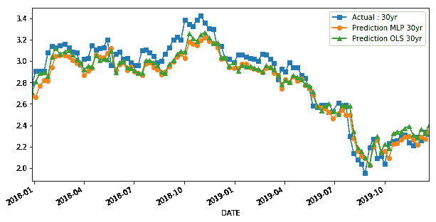

# 第五章。监督学习：回归（包括时间序列模型）

监督回归型机器学习是一种预测性建模形式，其目标是建立目标与预测变量之间的关系，以估计一组连续可能的结果。这些是金融中最常用的机器学习模型。

金融机构（以及整个金融领域）分析师的关注重点之一是预测投资机会，通常是资产价格和资产回报的预测。在这种情况下，监督回归型机器学习模型天生适用。这些模型帮助投资和金融经理了解预测变量的特性及其与其他变量的关系，并帮助他们确定推动资产回报的重要因素。这有助于投资者估计回报概况、交易成本、基础设施所需的技术和金融投资，从而最终评估策略或投资组合的风险概况和盈利能力。

随着大量数据和处理技术的可用性，监督回归型机器学习不仅仅局限于资产价格预测。这些模型被应用于金融领域的广泛范围，包括投资组合管理、保险定价、工具定价、套期保值和风险管理等领域。

在本章中，我们涵盖了三个基于监督回归的案例研究，涉及资产价格预测、工具定价和投资组合管理等多个领域。所有案例研究都遵循第二章中介绍的标准化七步模型开发过程；这些步骤包括定义问题、加载数据、探索性数据分析、数据准备、模型评估和模型调优。这些案例研究的设计不仅涵盖了金融视角下的多个主题，还涵盖了多个机器学习和建模概念，包括从基本的线性回归到第四章中介绍的高级深度学习模型。

在金融行业的资产建模和预测问题中，涉及时间成分和连续输出的估计是相当重要的。因此，也有必要讨论*时间序列模型*。在其最广泛的形式下，时间序列分析是关于推断过去一系列数据点的情况，并试图预测未来会发生什么。关于监督回归和时间序列模型之间的差异，学术界和行业中已经进行了大量的比较和辩论。大多数时间序列模型是*参数化*的（即假设已知函数表示数据），而大多数监督回归模型是*非参数化*的。时间序列模型主要利用预测变量的历史数据进行预测，而监督学习算法则使用*外生变量*作为预测变量。² 然而，监督回归可以通过时间延迟方法嵌入预测变量的历史数据（本章后面会介绍），时间序列模型（如 ARIMAX，也会在本章后面介绍）可以利用外生变量进行预测。因此，时间序列模型和监督回归模型在可以使用外生变量以及预测变量的历史数据进行预测方面是相似的。在最终输出方面，监督回归和时间序列模型都估计了变量的一组连续可能结果。

在第四章中，我们涵盖了在监督回归和监督分类之间共通的模型概念。考虑到时间序列模型更接近于监督回归而不是监督分类，我们将在本章节单独讨论时间序列模型的概念。我们还将演示如何在金融数据上使用时间序列模型来预测未来的数值。我们将在案例研究中呈现时间序列模型与监督回归模型的比较。此外，一些机器学习和深度学习模型（如 LSTM）可以直接用于时间序列预测，我们也将对其进行讨论。

在“案例研究 1：股票价格预测”中，我们展示了金融领域中最流行的预测问题之一，即预测股票回报率。除了准确预测未来股票价格外，这个案例研究的目的是讨论基于机器学习的通用资产类价格预测框架。在这个案例研究中，我们将讨论几个机器学习和时间序列的概念，同时重点关注可视化和模型调整。

在“案例研究 2：衍生品定价”中，我们将深入探讨使用监督回归进行衍生品定价，并展示如何在传统量化问题背景下部署机器学习技术。与传统衍生品定价模型相比，机器学习技术可以在不依赖于多个不切实际假设的情况下更快地进行衍生品定价。在金融风险管理等领域，利用机器学习进行高效数值计算往往具有越来越多的好处，这些领域通常需要在效率与准确性之间进行权衡。

在“案例研究 3：投资者风险容忍度与智能顾问”中，我们展示了基于监督回归的框架来估计投资者的风险容忍度。在这个案例研究中，我们在 Python 中构建了一个智能顾问仪表板，并在该仪表板中实现了这个风险容忍度预测模型。我们展示了这类模型如何能够自动化投资组合管理流程，包括利用智能顾问进行投资管理。这也旨在说明机器学习如何有效地用于克服传统风险容忍度评估或风险容忍度问卷存在的多种行为偏差问题。

在“案例研究 4：收益率曲线预测”中，我们使用基于监督回归的框架同时预测不同收益率曲线期限。我们展示了如何使用机器学习模型同时生成多个期限，以建模收益率曲线。

用于监督回归的模型见第三章和第四章。在案例研究之前，我们将讨论时间序列模型。我们强烈建议读者参考 Robert H. Shumway 和 David S. Stoffer 的《时间序列分析及其应用》，第 4 版（Springer），以深入理解时间序列概念，并参考 Aurélien Géron 的《Scikit-Learn、Keras 和 TensorFlow 实战》，第 2 版（O’Reilly），了解监督回归模型中的更多概念。

# 本章代码库

本书的代码库中包含了基于 Python 的监督回归主模板、时间序列模型模板以及本章中所有案例研究的 Jupyter 笔记本，位于[*第五章 - 监督学习 - 回归和时间序列模型*](https://oreil.ly/sJFV0)的文件夹中。

对于任何新的基于监督回归的案例研究，使用代码库中的通用模板，修改特定于案例研究的元素，并借鉴本章中提出的案例研究的概念和见解。该模板还包括 ARIMA 和 LSTM 模型的实现和调整。³这些模板设计用于在云端运行（即 Kaggle、Google Colab 和 AWS）。所有案例研究都是根据统一的回归模板设计的。⁴

# 时间序列模型

*时间序列*是按时间索引排序的数字序列。

在本节中，我们将介绍时间序列模型的以下方面，我们在案例研究中进一步利用这些方面：

+   时间序列的组成部分

+   时间序列的自相关性和平稳性

+   传统的时间序列模型（例如 ARIMA）

+   使用深度学习模型进行时间序列建模

+   将时间序列数据转换为用于监督学习框架的形式

## 时间序列分解

时间序列可以分解为以下组件：

趋势分量

趋势是时间序列中的一致方向性运动。这些趋势将是*确定性*或*随机性*的。前者允许我们为趋势提供根本的解释，而后者是我们不太可能解释的系列的随机特征。趋势经常出现在金融系列中，并且许多交易模型使用复杂的趋势识别算法。

季节性分量

许多时间序列包含季节性变化。这在代表业务销售或气候水平的系列中特别真实。在量化金融中，我们经常看到季节性变化，特别是与假期季节或年度温度变化相关的系列（例如天然气）。

我们可以将时间序列<math alttext="y Subscript t"><msub><mi>y</mi> <mi>t</mi></msub></math>的组成部分写成

<math alttext="y Subscript t Baseline equals upper S Subscript t Baseline plus upper T Subscript t Baseline plus upper R Subscript t" display="block"><mrow><msub><mi>y</mi> <mi>t</mi></msub> <mo>=</mo> <msub><mi>S</mi> <mi>t</mi></msub> <mo>+</mo> <msub><mi>T</mi> <mi>t</mi></msub> <mo>+</mo> <msub><mi>R</mi> <mi>t</mi></msub></mrow></math>

其中<math alttext="upper S Subscript t"><msub><mi>S</mi> <mi>t</mi></msub></math>是季节性分量，<math alttext="upper T Subscript t"><msub><mi>T</mi> <mi>t</mi></msub></math>是趋势分量，<math alttext="upper R Subscript t"><msub><mi>R</mi> <mi>t</mi></msub></math>代表了时间序列中未被季节性或趋势分量捕获的剩余部分。

将时间序列(*Y*)分解为其组件的 Python 代码如下：

```py
import statsmodels.api as sm
sm.tsa.seasonal_decompose(Y,freq=52).plot()
```

图 5-1 显示了时间序列分解为趋势、季节性和剩余部分组件。将时间序列分解为这些组件可能有助于我们更好地理解时间序列，并确定其行为以进行更好的预测。

三个时间序列组件分别显示在底部的三个面板中。这些组件可以相加以重建顶部面板中显示的实际时间序列（标为“观察到”）。注意，时间序列在 2017 年后显示出趋势性组件。因此，该时间序列的预测模型应该包含有关 2017 年后趋势行为的信息。在季节性方面，每年的开始有一些幅度增加。底部面板中显示的残差分量是从数据中减去季节性和趋势组件后剩余的部分。残差分量在 2018 年和 2019 年左右有些尖峰和噪声，整体上是平坦的。此外，每个图的比例不同，趋势分量的范围最大，如图中的比例尺所示。


###### 图 5-1\. 时间序列组件

## 自相关和平稳性

当给定一个或多个时间序列时，将时间序列分解为趋势、季节性和残差分量相对比较简单。然而，在处理时间序列数据时，特别是在金融领域，还有其他因素需要考虑。

### 自相关

许多情况下，时间序列的连续元素呈现相关性。即，序列中连续点的行为以一种依赖的方式相互影响。*自相关* 是观测值随时间滞后之间相似性的度量。可以使用自回归模型来建模这种关系。术语 *自回归* 表示它是变量对自身的回归。

在自回归模型中，我们使用变量过去值的线性组合来预测感兴趣的变量。

因此，*p* 阶自回归模型可以写成

<math display="block"><mrow><msub><mi>y</mi> <mi>t</mi></msub> <mo>=</mo> <mi>c</mi> <mo>+</mo> <msub><mi>ϕ</mi> <mn>1</mn></msub> <msub><mi>y</mi> <mrow><mi>t</mi><mo>–</mo><mn>1</mn></mrow></msub> <mo>+</mo> <msub><mi>ϕ</mi> <mn>2</mn></msub> <msub><mi>y</mi> <mrow><mi>t</mi><mo>–</mo><mn>2</mn></mrow></msub> <mo>+</mo> <mo>.</mo> <mo>.</mo> <mo>.</mo> <mo>.</mo> <msub><mi>ϕ</mi> <mi>p</mi></msub> <msub><mi>y</mi> <mrow><mi>t</mi><mo>–</mo><mi>p</mi></mrow></msub> <mo>+</mo> <mi>ϵ</mi></mrow></math>

其中 <math alttext="epsilon Subscript t"><msub><mi>ϵ</mi> <mi>t</mi></msub></math> 是白噪声。⁵ 自回归模型类似于多元回归，但使用滞后的 <math alttext="y Subscript t"><msub><mi>y</mi> <mi>t</mi></msub></math> 值作为预测因子。我们称之为 AR(*p*)模型，即 *p* 阶自回归模型。自回归模型在处理各种不同的时间序列模式时非常灵活。

### 平稳性

如果一个时间序列的统计特性随时间不变，则称为平稳时间序列。因此，带有趋势或季节性的时间序列不是平稳的，因为趋势和季节性会在不同时间点影响时间序列的值。另一方面，白噪声序列是平稳的，因为无论何时观察，它看起来都应该是相似的。

图 5-2 展示了一些非平稳序列的示例。


###### 图 5-2\. 非平稳绘图

在第一个图中，我们可以清楚地看到均值随时间变化（增加），导致了上升趋势。因此，这是一个非平稳序列。要将序列分类为平稳序列，它不应该展示出趋势。转到第二个图，我们确实看不到序列中的趋势，但是序列的方差是时间的函数。平稳序列必须具有恒定的方差；因此，这个序列也是非平稳序列。在第三个图中，随着时间的增加，波动变得更接近，这意味着协方差是时间的函数。图 5-2 中显示的三个示例代表非平稳时间序列。现在看一下第四个图，如图 5-3 所示。


###### 图 5-3 。平稳图

在这种情况下，均值、方差和协方差随时间保持不变。这就是平稳时间序列的样子。使用这个第四个图来预测未来值将更加容易。大多数统计模型要求序列是平稳的，才能进行有效和精确的预测。

时间序列的非平稳性主要由趋势和季节性导致，如图 5-2 所示。为了使用时间序列预测模型，通常将任何非平稳序列转换为平稳序列，这样更容易进行建模，因为统计属性随时间不变。

### 差分

差分是使时间序列平稳的方法之一。在这种方法中，我们计算序列中相邻项的差值。差分通常用于消除变化的均值。数学上，差分可以写成：

<math><mrow><msubsup><mi>y</mi> <mi>t</mi> <mo>′</mo></msubsup> <mo>=</mo> <msub><mi>y</mi> <mi>t</mi></msub> <mo>–</mo> <msub><mi>y</mi> <mrow><mi>t</mi><mo>–</mo><mn>1</mn></mrow></msub></mrow></math>

其中 <math alttext="y Subscript t"><msub><mi>y</mi> <mi>t</mi></msub></math> 是时间 *t* 的值。

当差分后的序列为白噪声时，原始序列被称为一阶非平稳序列。

## 传统时间序列模型（包括 ARIMA 模型）

有很多方法可以对时间序列建模以进行预测。大多数时间序列模型旨在同时考虑趋势、季节性和残差分量，并解决嵌入在时间序列中的自相关性和平稳性问题。例如，在前一节讨论的自回归（AR）模型中，解决了时间序列中的自相关性问题。

时间序列预测中最广泛使用的模型之一是 ARIMA 模型。

### ARIMA

如果我们将平稳性与自回归和移动平均模型结合起来（本节进一步讨论），我们就得到了 ARIMA 模型。*ARIMA* 是自回归积分移动平均的缩写，具有以下组成部分：

AR(p)

它表示自回归，即将时间序列回归到自身，正如前一节中讨论的那样，假设当前系列值取决于其前几个值（或多个滞后）。模型中的最大滞后被称为*p*。

I(d)

它表示积分的阶数。它简单地是使系列平稳所需的差分次数。

MA(q)

它表示移动平均。不详细讨论，它对时间序列的误差进行建模；再次假设当前误差取决于以前的误差和一些滞后，这称为*q*。

移动平均方程的写法如下：

<math display="block"><mrow><msub><mi>y</mi> <mi>t</mi></msub> <mo>=</mo> <mi>c</mi> <mo>+</mo> <msub><mi>ϵ</mi> <mi>t</mi></msub> <mo>+</mo> <msub><mi>θ</mi> <mn>1</mn></msub> <msub><mi>ϵ</mi> <mrow><mi>t</mi><mo>–</mo><mn>1</mn></mrow></msub> <mo>+</mo> <msub><mi>θ</mi> <mn>2</mn></msub> <msub><mi>ϵ</mi> <mrow><mi>t</mi><mo>–</mo><mn>2</mn></mrow></msub></mrow></math>

其中，<math alttext="epsilon Subscript t"><msub><mi>ϵ</mi> <mi>t</mi></msub></math>是白噪声。我们将其称为*MA(q)*阶数为*q*的模型。

结合所有组件，完整的 ARIMA 模型可以写成：

<math display="block"><mrow><msubsup><mi>y</mi> <mi>t</mi> <mo>′</mo></msubsup> <mo>=</mo> <mi>c</mi> <mo>+</mo> <msub><mi>ϕ</mi> <mn>1</mn></msub> <msubsup><mi>y</mi> <mrow><mi>t</mi><mo>–</mo><mn>1</mn></mrow> <mo>′</mo></msubsup> <mo>+</mo> <mo>⋯</mo> <mo>+</mo> <msub><mi>ϕ</mi> <mi>p</mi></msub> <msubsup><mi>y</mi> <mrow><mi>t</mi><mo>–</mo><mi>p</mi></mrow> <mo>′</mo></msubsup> <mo>+</mo> <msub><mi>θ</mi> <mn>1</mn></msub> <msub><mi>ε</mi> <mrow><mi>t</mi><mo>–</mo><mn>1</mn></mrow></msub> <mo>+</mo> <mo>⋯</mo> <mo>+</mo> <msub><mi>θ</mi> <mi>q</mi></msub> <msub><mi>ε</mi> <mrow><mi>t</mi><mo>–</mo><mi>q</mi></mrow></msub> <mo>+</mo> <msub><mi>ε</mi> <mi>t</mi></msub></mrow></math>

其中<math alttext="y prime Subscript t"><msubsup><mi>y</mi> <mi>t</mi> <mo>'</mo></msubsup></math>是差分后的系列（可能进行了多次差分）。右侧的预测变量包括<math alttext="y prime Subscript t"><msubsup><mi>y</mi> <mi>t</mi> <mo>'</mo></msubsup></math>的滞后值和滞后误差。我们称之为 ARIMA(*p,d,q*)模型，其中*p*是自回归部分的阶数，*d*是涉及的第一阶差分的程度，*q*是移动平均部分的阶数。用于自回归和移动平均模型的同样平稳性和可逆性条件也适用于 ARIMA 模型。

拟合 ARIMA 模型（1,0,0）的 Python 代码如下所示：

```py
from statsmodels.tsa.arima_model import ARIMA
model=ARIMA(endog=Y_train,order=[1,0,0])
```

ARIMA 模型有几个变体，其中一些如下：

ARIMAX

包括外生变量的 ARIMA 模型。我们将在案例研究 1 中使用这个模型。

SARIMA

“S”在这个模型中代表季节性，这个模型旨在对时间序列中嵌入的季节性组件进行建模，以及其他组件。

VARMA

这是将模型扩展到多元情况的方法，当有许多变量同时预测时，我们可以同时预测多个变量在“案例研究 4: 收益率曲线预测”中进行预测。

## 时间序列建模的深度学习方法

传统的时间序列模型如 ARIMA 在许多问题上都被充分理解和有效。然而，这些传统方法也存在一些局限性。传统的时间序列模型是线性函数，或线性函数的简单变换，并且需要手动诊断参数，如时间依赖性，并且在数据损坏或缺失时表现不佳。

如果我们看一下时间序列预测领域的进展，我们会发现*循环神经网络*（RNN）近年来引起了越来越多的关注。这些方法可以识别结构和模式，如非线性，可以无缝地建模具有多个输入变量的问题，并且对缺失数据相对健壮。RNN 模型可以通过使用它们自己的输出作为下一步的输入来保留一次迭代到下一次迭代的状态。这些深度学习模型可以被称为时间序列模型，因为它们可以使用过去的数据点进行未来预测，类似于传统的时间序列模型，如 ARIMA。因此，在金融领域有广泛的应用，可以利用这些深度学习模型。让我们来看一下时间序列预测的深度学习模型。

### RNNs

循环神经网络（RNN）之所以被称为“循环”，是因为它们对序列中的每个元素执行相同的任务，输出取决于先前的计算。RNN 模型具有一种记忆，它捕获了迄今为止计算的信息。正如在图 5-4 中所示，循环神经网络可以被视为同一网络的多个副本，每个副本将消息传递给后续副本。


###### 图 5-4. 循环神经网络

在图 5-4 中：

+   *X[t]*是时间步*t*的输入。

+   *O[t]*是时间步*t*的输出。

+   *S[t]*是时间步*t*的隐藏状态。它是网络的记忆。它是基于先前的隐藏状态和当前步骤的输入计算的。

RNN 的主要特征是隐藏状态，它捕捉了序列的某些信息，并在需要时相应地使用它。

### 长短期记忆网络

*长短期记忆*（LSTM）是一种专门设计的 RNN，旨在避免长期依赖问题。长时间记忆信息对于 LSTM 模型来说几乎是默认行为。[⁶] 这些模型由一组具有记忆数据序列特征的单元组成。这些单元捕获并存储数据流。此外，单元将过去的一个模块与当前一个模块相互连接，将信息从多个过去时间瞬间传递到当前时间瞬间。由于每个单元中使用了门控，每个单元中的数据可以被处理、过滤或添加到下一个单元中。

基于人工神经网络层的*门*使单元能够选择性地通过或丢弃数据。每个层产生的数字范围从零到一，描述了每个数据段在每个单元中应该通过的数量。更确切地说，估计零值表示“不要让任何东西通过”。估计为一表示“让所有东西通过”。每个 LSTM 中涉及三种类型的门，旨在控制每个单元的状态：

遗忘门

输出介于零和一之间的数字，其中一表示“完全保留此内容”，零表示“完全忽略此内容”。该门有条件地决定过去是应该被遗忘还是保留。

输入门

选择需要存储在单元格中的新数据。

输出门

决定每个单元格将产生什么值。产生的值将基于单元格状态以及过滤和新添加的数据。

Keras 封装了高效的数值计算库和函数，并允许我们用几行简短的代码定义和训练 LSTM 神经网络模型。在下面的代码中，使用 `keras.layers` 中的 LSTM 模块来实现 LSTM 网络。网络使用变量 `X_train_LSTM` 进行训练。网络有一个包含 50 个 LSTM 块或神经元的隐藏层和一个输出层，用于进行单个值的预测。还可以参考第三章以获取对所有术语（即，sequential、learning rate、momentum、epoch 和 batch size）的更详细描述。

在 Keras 中实现 LSTM 模型的示例 Python 代码如下所示：

```py
from keras.models import Sequential
from keras.layers import Dense
from keras.optimizers import SGD
from keras.layers import LSTM

def create_LSTMmodel(learn_rate = 0.01, momentum=0):
       # create model
   model = Sequential()
   model.add(LSTM(50, input_shape=(X_train_LSTM.shape[1],\
      X_train_LSTM.shape[2])))
   #More number of cells can be added if needed
   model.add(Dense(1))
   optimizer = SGD(lr=learn_rate, momentum=momentum)
   model.compile(loss='mse', optimizer='adam')
   return model
LSTMModel = create_LSTMmodel(learn_rate = 0.01, momentum=0)
LSTMModel_fit = LSTMModel.fit(X_train_LSTM, Y_train_LSTM, validation_data=\
  (X_test_LSTM, Y_test_LSTM),epochs=330, batch_size=72, verbose=0, shuffle=False)
```

就学习和实现而言，与 ARIMA 模型相比，LSTM 在微调方面提供了更多选择。尽管深度学习模型比传统时间序列模型有几个优点，但深度学习模型更复杂，训练起来更困难。⁷

## 修改时间序列数据以用于监督学习模型

时间序列是按时间索引排序的一系列数字。监督学习是指我们有输入变量（*X*）和一个输出变量（*Y*）。给定一个时间序列数据集的数字序列，我们可以将数据重构为一组预测变量和被预测变量，就像在监督学习问题中一样。我们可以通过使用先前的时间步作为输入变量，并使用下一个时间步作为输出变量来实现这一点。让我们通过一个例子来具体说明。

我们可以通过使用上一个时间步的值来预测下一个时间步的值，将左表中显示的时间序列重组为一个监督学习问题。一旦我们以这种方式重新组织了时间序列数据集，数据将看起来像右边的表格。


###### 图 5-5。修改时间序列以用于监督学习模型

我们可以看到，在我们的监督学习问题中，上一个时间步是输入（*X*），下一个时间步是输出（*Y*）。观察之间的顺序被保留，当使用这个数据集来训练一个监督模型时，必须继续保留这种顺序。在训练我们的监督模型时，我们将删除第一行和最后一行，因为我们既没有 *X* 的值，也没有 *Y* 的值。

在 Python 中，帮助将时间序列数据转换为监督学习问题的主要函数是来自 Pandas 库的`shift()`函数。我们将在案例研究中演示这种方法。使用先前时间步来预测下一个时间步称为*滑动窗口*、*时间延迟*或*滞后*方法。

在讨论了监督学习和时间序列模型的所有概念后，让我们转向案例研究。

# 案例研究 1：股票价格预测

金融领域面临的最大挑战之一是预测股票价格。然而，随着最近机器学习应用的进展，这个领域已经在利用非确定性解决方案来学习当前情况，以做出更准确的预测。基于历史数据，机器学习技术自然而然地适用于股票价格预测。可以对单个时间点或未来一系列时间点进行预测。

作为高级概述，除了股票本身的历史价格外，通常用于股票价格预测的特征如下：

相关资产

一个组织依赖并与许多外部因素互动，包括其竞争对手、客户、全球经济、地缘政治局势、财政和货币政策、资本获取等等。因此，其股票价格可能与其他公司的股票价格以及商品、外汇、广泛的指数甚至固定收益证券等其他资产相关。

技术指标

许多投资者关注技术指标。移动平均线、指数移动平均线和动量是最流行的指标。

基本分析

用于基本分析的两个主要数据源包括：

绩效报告

公司的年度和季度报告可用于提取或确定关键指标，如 ROE（净资产收益率）和 P/E（市盈率）。

新闻

新闻可以指示即将发生的事件，这些事件有可能在某个方向上推动股票价格。

在这个案例研究中，我们将使用各种基于监督学习的模型来预测微软的股票价格，利用相关资产及其自身的历史数据。到案例研究结束时，读者将熟悉股票预测建模的一般机器学习方法，从数据收集和清洗到构建和调整不同的模型。


## 使用监督学习模型预测股票价格的蓝图

### 1\. 问题定义

在本案例研究中使用的监督回归框架中，微软股票的每周回报是预测变量。我们需要理解什么影响微软股票价格，并将尽可能多的信息纳入模型中。在相关资产、技术指标和基本分析（在前面的部分中讨论）中，我们将专注于相关资产作为本案例研究中的特征。

除了微软的历史数据外，本案例研究使用的独立变量包括以下潜在相关资产：

股票

IBM (IBM) 和 Alphabet (GOOGL)

货币⁹

USD/JPY 和 GBP/USD

索引

标准普尔 500、道琼斯和 VIX

用于本案例研究的数据集来自 Yahoo Finance 和[FRED 网站](https://fred.stlouisfed.org)。除了准确预测股票价格外，本案例研究还将展示每一步时间序列和基于监督回归的股票价格预测建模的基础设施和框架。我们将使用自 2010 年以来最近 10 年的每日收盘价。

### 2\. 开始——加载数据和 Python 包

#### 2.1\. 加载 Python 包

数据加载、数据分析、数据准备、模型评估和模型调优所使用的库列表如下所示。用于不同目的的包在接下来的 Python 代码中有所区分。这些包和函数的详细信息在第二章和第四章中已经提供。这些包的使用将在模型开发过程的不同步骤中进行演示。

`监督回归模型的函数和模块`

```py
from sklearn.linear_model import LinearRegression
from sklearn.linear_model import Lasso
from sklearn.linear_model import ElasticNet
from sklearn.tree import DecisionTreeRegressor
from sklearn.neighbors import KNeighborsRegressor
from sklearn.svm import SVR
from sklearn.ensemble import RandomForestRegressor
from sklearn.ensemble import GradientBoostingRegressor
from sklearn.ensemble import ExtraTreesRegressor
from sklearn.ensemble import AdaBoostRegressor
from sklearn.neural_network import MLPRegressor
```

`数据分析和模型评估的函数和模块`

```py
from sklearn.model_selection import train_test_split
from sklearn.model_selection import KFold
from sklearn.model_selection import cross_val_score
from sklearn.model_selection import GridSearchCV
from sklearn.metrics import mean_squared_error
from sklearn.feature_selection import SelectKBest
from sklearn.feature_selection import chi2, f_regression
```

`深度学习模型的函数和模块`

```py
from keras.models import Sequential
from keras.layers import Dense
from keras.optimizers import SGD
from keras.layers import LSTM
from keras.wrappers.scikit_learn import KerasRegressor
```

`时间序列模型的函数和模块`

```py
from statsmodels.tsa.arima_model import ARIMA
import statsmodels.api as sm
```

`数据准备和可视化的函数和模块`

```py
# pandas, pandas_datareader, numpy and matplotlib
import numpy as np
import pandas as pd
import pandas_datareader.data as web
from matplotlib import pyplot
from pandas.plotting import scatter_matrix
import seaborn as sns
from sklearn.preprocessing import StandardScaler
from pandas.plotting import scatter_matrix
from statsmodels.graphics.tsaplots import plot_acf
```

#### 2.2\. 加载数据

机器学习和预测建模中最重要的步骤之一是收集好的数据。以下步骤演示了使用 Pandas 的`DataReader`函数从 Yahoo Finance 和 FRED 网站加载数据：

```py
stk_tickers = ['MSFT', 'IBM', 'GOOGL']
ccy_tickers = ['DEXJPUS', 'DEXUSUK']
idx_tickers = ['SP500', 'DJIA', 'VIXCLS']

stk_data = web.DataReader(stk_tickers, 'yahoo')
ccy_data = web.DataReader(ccy_tickers, 'fred')
idx_data = web.DataReader(idx_tickers, 'fred')
```

接下来，我们定义我们的因变量 *(Y)* 和独立变量 *(X)*。预测变量是微软（MSFT）的每周回报。一周的交易日数假定为五天，并使用五个交易日计算回报。作为独立变量，我们使用相关资产和不同频率下微软的历史回报。

用作独立变量的变量是股票（IBM 和 GOOG）、货币（USD/JPY 和 GBP/USD）和指数（标准普尔 500、道琼斯和 VIX）的滞后五天回报，以及 MSFT 的滞后 5 天、15 天、30 天和 60 天回报。

使用滞后五天变量通过时间延迟方法嵌入时间序列组件，其中滞后变量被包括为独立变量之一。这一步骤是将时间序列数据重构为基于监督回归的模型框架。

```py
return_period = 5
Y = np.log(stk_data.loc[:, ('Adj Close', 'MSFT')]).diff(return_period).\
shift(-return_period)
Y.name = Y.name[-1]+'_pred'

X1 = np.log(stk_data.loc[:, ('Adj Close', ('GOOGL', 'IBM'))]).diff(return_period)
X1.columns = X1.columns.droplevel()
X2 = np.log(ccy_data).diff(return_period)
X3 = np.log(idx_data).diff(return_period)

X4 = pd.concat([np.log(stk_data.loc[:, ('Adj Close', 'MSFT')]).diff(i) \
for i in [return_period, return_period*3,\
return_period*6, return_period*12]], axis=1).dropna()
X4.columns = ['MSFT_DT', 'MSFT_3DT', 'MSFT_6DT', 'MSFT_12DT']

X = pd.concat([X1, X2, X3, X4], axis=1)

dataset = pd.concat([Y, X], axis=1).dropna().iloc[::return_period, :]
Y = dataset.loc[:, Y.name]
X = dataset.loc[:, X.columns]
```

### 3\. 探索性数据分析

在本节中，我们将查看描述性统计、数据可视化和时间序列分析。

#### 3.1\. 描述性统计

让我们来看看我们拥有的数据集：

```py
dataset.head()
```

`Output`


变量 MSFT_pred 是微软股票的回报并且是预测变量。数据集包含其他相关股票、货币和指数的滞后系列，以及 MSFT 的滞后历史回报。

#### 3.2\. 数据可视化

了解数据更多信息的最快方法是将其可视化。可视化涉及独立理解数据集的每个属性。我们将查看散点图和相关矩阵。这些图表让我们了解数据的相互依赖关系。通过创建相关矩阵，可以为每对变量计算和显示相关性。因此，除了独立和依赖变量之间的关系外，它还显示了数据中独立变量之间的相关性。了解这一点很有用，因为如果数据中存在高度相关的输入变量，一些机器学习算法如线性和逻辑回归的性能可能会较差：

```py
correlation = dataset.corr()
pyplot.figure(figsize=(15,15))
pyplot.title('Correlation Matrix')
sns.heatmap(correlation, vmax=1, square=True,annot=True,cmap='cubehelix')
```

`Output`


查看相关性图（完整版可在 [GitHub](https://oreil.ly/g3wVU) 上查看），我们可以看到预测变量与 MSFT 滞后 5 天、15 天、30 天和 60 天回报之间的某种相关性。此外，我们还看到许多资产回报与 VIX 的负相关性较高，这是直观的。

接下来，我们可以使用下面显示的散点图矩阵来可视化回归中所有变量之间的关系：

```py
pyplot.figure(figsize=(15,15))
scatter_matrix(dataset,figsize=(12,12))
pyplot.show()
```

`Output`


查看散点图（完整版可在 [GitHub](https://oreil.ly/g3wVU) 上查看），我们可以看到预测变量与 MSFT 滞后 15 天、30 天和 60 天回报之间的某种线性关系。否则，我们没有看到预测变量与特征之间的任何特殊关系。

#### 3.3\. 时间序列分析

接下来，我们深入研究时间序列分析，并查看预测变量的时间序列分解为趋势和季节性组成部分：

```py
res = sm.tsa.seasonal_decompose(Y,freq=52)
fig = res.plot()
fig.set_figheight(8)
fig.set_figwidth(15)
pyplot.show()
```

`Output`


我们可以看到，对于 MSFT，收益系列存在明显的上升趋势。这可能是由于 MSFT 近年来大幅上涨，导致正周回报数据点比负周回报数据点更多。¹¹ 这种趋势可能在我们模型的常数/偏差项中显示出来。残差（或白噪声）项在整个时间序列中相对较小。

### 4\. 数据准备

这一步通常涉及数据处理、数据清洗、查看特征重要性以及执行特征减少。这个案例研究中获取的数据相对清洁，不需要进一步处理。在这里，特征减少可能是有用的，但考虑到考虑的变量数量相对较少，我们将保留所有变量。我们将在一些后续的案例研究中详细演示数据准备。

### 5\. 评估模型

#### 5.1\. 训练-测试分离和评估指标

如第二章所述，将原始数据集划分为*训练集*和*测试集*是一个好主意。测试集是我们在分析和建模过程中保留的数据样本。我们在项目的最后使用它来确认我们最终模型的性能。它是最终测试，为我们提供了对未见数据准确性估计的信心。我们将 80%的数据集用于建模，将 20%用于测试。对于时间序列数据，值的顺序是重要的。因此，我们不会随机分配数据集到训练集和测试集，而是选择在有序观察值列表中的任意拆分点，并创建两个新数据集：

```py
validation_size = 0.2
train_size = int(len(X) * (1-validation_size))
X_train, X_test = X[0:train_size], X[train_size:len(X)]
Y_train, Y_test = Y[0:train_size], Y[train_size:len(X)]
```

#### 5.2\. 测试选项和评估指标

为了优化模型的各种超参数，我们使用十折交叉验证（CV）并重新计算结果十次，以考虑部分模型和 CV 过程中的固有随机性。我们将使用均方误差度量来评估算法。这个度量给出了监督回归模型的性能的一个概念。所有这些概念，包括交叉验证和评估指标，都在第四章中有描述：

```py
num_folds = 10
scoring = 'neg_mean_squared_error'
```

#### 5.3\. 比较模型和算法

现在我们已经完成了数据加载并设计了测试框架，我们需要选择一个模型。

#### 5.3.1\. 来自 Scikit-learn 的机器学习模型

在这一步中，使用 sklearn 包来实现监督回归模型：

`回归和树回归算法`

```py
models = []
models.append(('LR', LinearRegression()))
models.append(('LASSO', Lasso()))
models.append(('EN', ElasticNet()))
models.append(('KNN', KNeighborsRegressor()))
models.append(('CART', DecisionTreeRegressor()))
models.append(('SVR', SVR()))
```

`神经网络算法`

```py
models.append(('MLP', MLPRegressor()))
```

`集成模型`

```py
# Boosting methods
models.append(('ABR', AdaBoostRegressor()))
models.append(('GBR', GradientBoostingRegressor()))
# Bagging methods
models.append(('RFR', RandomForestRegressor()))
models.append(('ETR', ExtraTreesRegressor()))
```

一旦我们选择了所有模型，我们就会对每个模型进行循环。首先，我们进行*k*次交叉验证分析。接下来，我们在整个训练和测试数据集上运行模型。

所有算法都使用默认调整参数。我们将计算每个算法的评估指标的平均值和标准差，并将结果收集起来以供后续模型比较使用：

```py
names = []
kfold_results = []
test_results = []
train_results = []
for name, model in models:
    names.append(name)
    ## k-fold analysis:
    kfold = KFold(n_splits=num_folds, random_state=seed)
    #converted mean squared error to positive. The lower the better
    cv_results = -1* cross_val_score(model, X_train, Y_train, cv=kfold, \
      scoring=scoring)
    kfold_results.append(cv_results)
    # Full Training period
    res = model.fit(X_train, Y_train)
    train_result = mean_squared_error(res.predict(X_train), Y_train)
    train_results.append(train_result)
    # Test results
    test_result = mean_squared_error(res.predict(X_test), Y_test)
    test_results.append(test_result)
```

让我们通过观察交叉验证结果来比较算法：

`交叉验证结果`

```py
fig = pyplot.figure()
fig.suptitle('Algorithm Comparison: Kfold results')
ax = fig.add_subplot(111)
pyplot.boxplot(kfold_results)
ax.set_xticklabels(names)
fig.set_size_inches(15,8)
pyplot.show()
```

`输出`


尽管其中一些模型的结果看起来不错，我们看到线性回归和包括套索回归（LASSO）和弹性网络（EN）的正则化回归似乎表现最佳。这表明因变量和自变量之间存在强烈的线性关系。回到探索性分析，我们看到目标变量与不同滞后 MSFT 变量之间存在良好的相关性和线性关系。

让我们也来看看测试集的误差：

`训练和测试误差`

```py
# compare algorithms
fig = pyplot.figure()

ind = np.arange(len(names))  # the x locations for the groups
width = 0.35  # the width of the bars

fig.suptitle('Algorithm Comparison')
ax = fig.add_subplot(111)
pyplot.bar(ind - width/2, train_results,  width=width, label='Train Error')
pyplot.bar(ind + width/2, test_results, width=width, label='Test Error')
fig.set_size_inches(15,8)
pyplot.legend()
ax.set_xticks(ind)
ax.set_xticklabels(names)
pyplot.show()
```

`输出`


检查训练和测试误差，我们仍然看到线性模型表现更强。一些算法，如决策树回归器（CART），在训练数据上过拟合，并在测试集上产生非常高的误差。集成模型如梯度提升回归（GBR）和随机森林回归（RFR）具有低偏差但高方差。我们还看到人工神经网络算法（在图表中显示为 MLP）在训练和测试集中显示出较高的误差。这可能是由于 ANN 未准确捕捉到变量之间的线性关系，超参数设置不正确或模型训练不足造成的。从交叉验证结果和散点图中，我们原始的直觉似乎也显示出线性模型的更好性能。

现在我们来看一些可以使用的时间序列和深度学习模型。一旦我们创建了这些模型，我们将比较它们与基于监督回归的模型的性能。由于时间序列模型的性质，我们无法进行*k*-fold 分析。尽管如此，我们仍然可以根据完整的训练和测试结果来比较我们的结果与其他模型的表现。

#### 5.3.2\. 时间序列模型：ARIMA 和 LSTM

到目前为止使用的模型已经通过使用时间延迟方法嵌入了时间序列组件，其中滞后变量被包括为一个独立变量之一。然而，对于基于时间序列的模型，我们不需要 MSFT 的滞后变量作为独立变量。因此，作为第一步，我们在这些模型中删除了 MSFT 的先前回报。我们将所有其他变量作为这些模型中的外生变量使用。

让我们首先通过只使用相关变量作为外生变量来为 ARIMA 模型准备数据集：

```py
X_train_ARIMA=X_train.loc[:, ['GOOGL', 'IBM', 'DEXJPUS', 'SP500', 'DJIA', \
'VIXCLS']]
X_test_ARIMA=X_test.loc[:, ['GOOGL', 'IBM', 'DEXJPUS', 'SP500', 'DJIA', \
'VIXCLS']]
tr_len = len(X_train_ARIMA)
te_len = len(X_test_ARIMA)
to_len = len (X)
```

现在我们使用*(1,0,0)*的阶数配置 ARIMA 模型，并将独立变量作为模型中的外生变量。在这种使用外生变量的 ARIMA 模型版本中，被称为*ARIMAX*模型，其中"*X*"代表外生变量：

```py
modelARIMA=ARIMA(endog=Y_train,exog=X_train_ARIMA,order=[1,0,0])
model_fit = modelARIMA.fit()
```

现在我们拟合 ARIMA 模型：

```py
error_Training_ARIMA = mean_squared_error(Y_train, model_fit.fittedvalues)
predicted = model_fit.predict(start = tr_len -1 ,end = to_len -1, \
  exog = X_test_ARIMA)[1:]
error_Test_ARIMA = mean_squared_error(Y_test,predicted)
error_Test_ARIMA
```

`输出`

```py
0.0005931919240399084
```

这个 ARIMA 模型的误差是合理的。

现在让我们为 LSTM 模型准备数据集。我们需要将数据以所有输入变量和输出变量的数组形式准备好。

LSTM 背后的逻辑是从前一天获取数据（当天的所有其他特征数据——相关资产和 MSFT 的滞后变量），然后试图预测下一天。然后我们将一天的窗口移动一天，并再次预测下一天。我们像这样在整个数据集上迭代（当然是以批次形式）。以下代码将创建一个数据集，其中*X*是给定时间(*t*)的自变量集合，*Y*是下一个时间(*t + 1*)的目标变量：

```py
seq_len = 2 #Length of the seq for the LSTM

Y_train_LSTM, Y_test_LSTM = np.array(Y_train)[seq_len-1:], np.array(Y_test)
X_train_LSTM = np.zeros((X_train.shape[0]+1-seq_len, seq_len, X_train.shape[1]))
X_test_LSTM = np.zeros((X_test.shape[0], seq_len, X.shape[1]))
for i in range(seq_len):
    X_train_LSTM[:, i, :] = np.array(X_train)[i:X_train.shape[0]+i+1-seq_len, :]
    X_test_LSTM[:, i, :] = np.array(X)\
    [X_train.shape[0]+i-1:X.shape[0]+i+1-seq_len, :]
```

接下来，我们创建 LSTM 架构。正如我们所见，LSTM 的输入为`X_train_LSTM`，进入 LSTM 层的 50 个隐藏单元，然后转换为单一输出——股票回报值。超参数（即学习率、优化器、激活函数等）详见书籍的第三章：

```py
# LSTM Network
def create_LSTMmodel(learn_rate = 0.01, momentum=0):
        # create model
    model = Sequential()
    model.add(LSTM(50, input_shape=(X_train_LSTM.shape[1],\
      X_train_LSTM.shape[2])))
    #More cells can be added if needed
    model.add(Dense(1))
    optimizer = SGD(lr=learn_rate, momentum=momentum)
    model.compile(loss='mse', optimizer='adam')
    return model
LSTMModel = create_LSTMmodel(learn_rate = 0.01, momentum=0)
LSTMModel_fit = LSTMModel.fit(X_train_LSTM, Y_train_LSTM, \
  validation_data=(X_test_LSTM, Y_test_LSTM),\
  epochs=330, batch_size=72, verbose=0, shuffle=False)
```

现在我们用数据拟合 LSTM 模型，并同时查看训练集和测试集中模型性能指标的变化。

```py
pyplot.plot(LSTMModel_fit.history['loss'], label='train', )
pyplot.plot(LSTMModel_fit.history['val_loss'], '--',label='test',)
pyplot.legend()
pyplot.show()
```

`输出`


```py
error_Training_LSTM = mean_squared_error(Y_train_LSTM,\
  LSTMModel.predict(X_train_LSTM))
predicted = LSTMModel.predict(X_test_LSTM)
error_Test_LSTM = mean_squared_error(Y_test,predicted)
```

现在，为了比较时间序列模型和深度学习模型，我们将这些模型的结果附加到基于监督回归的模型的结果中：

```py
test_results.append(error_Test_ARIMA)
test_results.append(error_Test_LSTM)

train_results.append(error_Training_ARIMA)
train_results.append(error_Training_LSTM)

names.append("ARIMA")
names.append("LSTM")
```

`输出`


观察图表，我们发现基于时间序列的 ARIMA 模型与线性监督回归模型（如线性回归（LR）、套索回归（LASSO）和弹性网（EN））可相媲美。这主要是由于之前讨论过的强线性关系。LSTM 模型表现良好；然而，在测试集中，ARIMA 模型优于 LSTM 模型。因此，我们选择 ARIMA 模型进行模型调优。

### 6\. 模型调优和网格搜索

让我们进行 ARIMA 模型的模型调优。

# 监督学习或时间序列模型的模型调优和网格搜索逻辑

关于所有基于监督学习模型的网格搜索详细实现，包括 ARIMA 和 LSTM 模型，在《Regression-Master》模板中的[GitHub 存储库](https://oreil.ly/9S8h_)提供了信息。有关 ARIMA 和 LSTM 模型的网格搜索，请参考《Regression-Master》模板中的“ARIMA 和 LSTM 网格搜索”部分。

ARIMA 模型通常表示为 ARIMA*(p,d,q)*模型，其中*p*为自回归部分的阶数，*d*为首次差分的程度，*q*为移动平均部分的阶数。ARIMA 模型的阶数设置为*(1,0,0)*。因此，我们通过不同的*p*、*d*和*q*组合进行网格搜索，选择最小化拟合误差的组合：

```py
def evaluate_arima_model(arima_order):
    #predicted = list()
    modelARIMA=ARIMA(endog=Y_train,exog=X_train_ARIMA,order=arima_order)
    model_fit = modelARIMA.fit()
    error = mean_squared_error(Y_train, model_fit.fittedvalues)
    return error

# evaluate combinations of p, d and q values for an ARIMA model
def evaluate_models(p_values, d_values, q_values):
    best_score, best_cfg = float("inf"), None
    for p in p_values:
        for d in d_values:
            for q in q_values:
                order = (p,d,q)
                try:
                    mse = evaluate_arima_model(order)
                    if mse < best_score:
                        best_score, best_cfg = mse, order
                    print('ARIMA%s MSE=%.7f' % (order,mse))
                except:
                    continue
    print('Best ARIMA%s MSE=%.7f' % (best_cfg, best_score))

# evaluate parameters
p_values = [0, 1, 2]
d_values = range(0, 2)
q_values = range(0, 2)
warnings.filterwarnings("ignore")
evaluate_models(p_values, d_values, q_values)
```

`输出`

```py
ARIMA(0, 0, 0) MSE=0.0009879
ARIMA(0, 0, 1) MSE=0.0009721
ARIMA(1, 0, 0) MSE=0.0009696
ARIMA(1, 0, 1) MSE=0.0009685
ARIMA(2, 0, 0) MSE=0.0009684
ARIMA(2, 0, 1) MSE=0.0009683
Best ARIMA(2, 0, 1) MSE=0.0009683
```

我们看到，在网格搜索中测试的所有组合中，ARIMA 模型的阶数为*(2,0,1)*时表现最佳，尽管与其他组合相比，均方误差（MSE）没有显著差异。这意味着具有自回归滞后两期和移动平均一期的模型能够产生最佳结果。我们不应忘记的是，模型中还有其他影响最佳 ARIMA 模型阶数的外生变量。

### 7\. 完成模型

在最后一步，我们将在测试集上检查最终的模型。

#### 7.1\. 测试数据集的结果

```py
# prepare model
modelARIMA_tuned=ARIMA(endog=Y_train,exog=X_train_ARIMA,order=[2,0,1])
model_fit_tuned = modelARIMA_tuned.fit()
```

```py
# estimate accuracy on validation set
predicted_tuned = model_fit.predict(start = tr_len -1 ,\
  end = to_len -1, exog = X_test_ARIMA)[1:]
print(mean_squared_error(Y_test,predicted_tuned))
```

`输出`

```py
0.0005970582461404503
```

模型在测试集上的均方误差（MSE）看起来很好，实际上比训练集的要小。

在最后一步，我们将可视化所选模型的输出，并将建模数据与实际数据进行比较。为了可视化图表，我们将回报时间序列转换为价格时间序列。为了简化起见，我们假设测试集开始时的价格为一。让我们看一下实际数据与预测数据的图表：

```py
# plotting the actual data versus predicted data
predicted_tuned.index = Y_test.index
pyplot.plot(np.exp(Y_test).cumprod(), 'r', label='actual',)

# plotting t, a separately
pyplot.plot(np.exp(predicted_tuned).cumprod(), 'b--', label='predicted')
pyplot.legend()
pyplot.rcParams["figure.figsize"] = (8,5)
pyplot.show()
```


从图表可以看出，模型完美地捕捉到了趋势。预测的系列波动性较实际时间序列较小，并且在测试集的前几个月与实际数据一致。需要注意的是，该模型的目的是根据截至当天观察到的数据计算第二天的回报，而不是根据当前数据预测未来数天的股票价格。因此，随着我们远离测试集开始时的时间点，预期会与实际数据有所偏差。该模型在开始后的几个月内表现良好，但在测试集开始后六到七个月，与实际数据的偏差逐渐增加。

### 结论

我们可以得出结论，简单模型——如线性回归、正则化回归（即 Lasso 和弹性网络）——以及时间序列模型，例如 ARIMA，是解决股票价格预测问题的有前途的建模方法。这种方法帮助我们应对在金融预测问题中的过拟合和欠拟合等一些关键挑战。

我们还应该注意，我们可以使用更广泛的指标，如市盈率（P/E）、交易量、技术指标或新闻数据，这可能会带来更好的结果。我们将在本书的某些未来案例研究中演示这一点。

总的来说，我们创建了一个监督回归和时间序列建模框架，可以利用历史数据进行股票价格预测。这个框架在冒任何资本风险之前生成结果，以分析风险和盈利能力。


# 案例研究 2：衍生品定价

在计算金融和风险管理中，常用几种数值方法（例如有限差分、傅里叶方法和蒙特卡洛模拟）来估计金融衍生品的价值。

*布莱克-斯科尔斯公式* 可能是衍生品定价中被引用和使用最广泛的模型之一。该公式的许多变体和扩展被用来定价许多类型的金融衍生品。然而，该模型基于几个假设。它假设衍生品价格的特定运动形式，即*几何布朗运动*（GBM）。它还假设在期权到期时有条件支付和经济约束，例如无套利条件。几种其他衍生品定价模型也有类似不切实际的模型假设。金融从业者清楚这些假设在实践中是不符合的，因此从这些模型得出的价格会通过从业者的判断进一步调整。

传统衍生品定价模型的另一个方面是模型校准，通常不是通过历史资产价格，而是通过衍生品价格（即通过将高交易量期权的市场价格与数学模型的衍生品价格进行匹配来进行）。在模型校准过程中，需要确定成千上万个衍生品价格以拟合模型的参数，整个过程非常耗时。在金融风险管理中，尤其是在处理实时风险管理（例如高频交易）时，高效的数值计算变得越来越重要。然而，由于需要高效的计算，某些高质量的资产模型和方法在传统衍生品定价模型的模型校准过程中被舍弃。

机器学习有望解决与不切实际的模型假设和低效的模型校准相关的这些缺点。机器学习算法具有在几乎没有理论假设的情况下处理更多微妙细节的能力，并且可以在包括摩擦力的世界中有效地用于衍生品定价。随着硬件的进步，我们可以在高性能 CPU、GPU 和其他专用硬件上训练机器学习模型，实现与传统衍生品定价模型相比几个数量级的速度提升。

此外，市场数据丰富，因此可以训练机器学习算法来学习市场中生成衍生品价格的集体功能。机器学习模型能够捕捉数据中不可通过其他统计方法获取的微妙非线性关系。

在这个案例研究中，我们从机器学习的角度来看待衍生品定价，并使用基于监督回归的模型来从模拟数据中定价期权。这里的主要思想是建立一个用于衍生品定价的机器学习框架。实现高精度的机器学习模型意味着我们可以利用机器学习的高效数值计算来进行衍生品定价，减少底层模型假设。


## 衍生品定价机器学习模型开发蓝图

### 1\. 问题定义

在我们用于这个案例研究的监督回归框架中，预测变量是期权的价格，预测变量是作为输入用于布莱克-肖尔斯期权定价模型的市场数据。

选择用于估计期权市场价格的变量包括股票价格、行权价格、到期时间、波动率、利率和股息收益率。本案例研究的预测变量是使用随机输入生成，并将其输入到众所周知的布莱克-肖尔斯模型中得出的。

根据布莱克-肖尔斯期权定价模型，看涨期权的价格被定义为方程 5-1。

##### 方程 5-1\. 看涨期权的布莱克-肖尔斯方程

<math display="block"><mrow><mi>S</mi> <msup><mi>e</mi> <mrow><mo>–</mo><mi>q</mi><mi>τ</mi></mrow></msup> <mi>Φ</mi> <mrow><mo>(</mo> <msub><mi>d</mi> <mn>1</mn></msub> <mo>)</mo></mrow> <mo>–</mo> <msup><mi>e</mi> <mrow><mo>–</mo><mi>r</mi><mi>τ</mi></mrow></msup> <mi>K</mi> <mi>Φ</mi> <mrow><mo>(</mo> <msub><mi>d</mi> <mn>2</mn></msub> <mo>)</mo></mrow></mrow></math>

具体到

<math display="inline"><mrow><msub><mi>d</mi> <mn>1</mn></msub> <mo>=</mo> <mfrac><mrow><mo form="prefix">ln</mo><mrow><mo>(</mo><mi>S</mi><mo>/</mo><mi>K</mi><mo>)</mo></mrow><mo>+</mo><mrow><mo>(</mo><mi>r</mi><mo>–</mo><mi>q</mi><mo>+</mo><msup><mi>σ</mi> <mn>2</mn></msup> <mo>/</mo><mn>2</mn><mo>)</mo></mrow><mi>τ</mi></mrow> <mrow><mi>σ</mi><msqrt><mi>τ</mi></msqrt></mrow></mfrac></mrow></math>

和

<math display="inline"><mrow><msub><mi>d</mi> <mn>2</mn></msub> <mo>=</mo> <mfrac><mrow><mo form="prefix">ln</mo><mrow><mo>(</mo><mi>S</mi><mo>/</mo><mi>K</mi><mo>)</mo></mrow><mo>+</mo><mrow><mo>(</mo><mi>r</mi><mo>–</mo><mi>q</mi><mo>–</mo><msup><mi>σ</mi> <mn>2</mn></msup> <mo>/</mo><mn>2</mn><mo>)</mo></mrow><mi>τ</mi></mrow> <mrow><mi>σ</mi><msqrt><mi>τ</mi></msqrt></mrow></mfrac> <mo>=</mo> <msub><mi>d</mi> <mn>1</mn></msub> <mo>–</mo> <mi>σ</mi> <msqrt><mi>τ</mi></msqrt></mrow></math>

其中我们有股票价格<math alttext="upper S"><mi>S</mi></math>；行权价格<math alttext="upper K"><mi>K</mi></math>；无风险利率<math alttext="r"><mi>r</mi></math>；年度股息收益率<math alttext="q"><mi>q</mi></math>；到期时间<math display="inline"><mrow><mi>τ</mi> <mo>=</mo> <mi>T</mi> <mo>–</mo> <mi>t</mi></mrow></math>（表示为一年的无量纲分数）；以及波动率<math alttext="sigma"><mi>σ</mi></math>。

为了简化逻辑，我们将金钱度定义为<math alttext="upper M equals upper K slash upper S"><mrow><mi>M</mi> <mo>=</mo> <mi>K</mi> <mo>/</mo> <mi>S</mi></mrow></math>，并以每单位当前股票价格为单位查看价格。我们还将<math alttext="q"><mi>q</mi></math>设为 0。

这简化了以下公式：

<math><mrow><msup><mi>e</mi> <mrow><mo>–</mo><mi>q</mi><mi>τ</mi></mrow></msup> <mi>Φ</mi> <mfenced separators="" open="(" close=")"><mfrac><mrow><mo>–</mo><mo form="prefix">ln</mo><mrow><mo>(</mo><mi>M</mi><mo>)</mo></mrow><mo>+</mo><mrow><mo>(</mo><mi>r</mi><mo>+</mo><msup><mi>σ</mi> <mn>2</mn></msup> <mo>/</mo><mn>2</mn><mo>)</mo></mrow><mi>τ</mi></mrow> <mrow><mi>σ</mi><msqrt><mi>τ</mi></msqrt></mrow></mfrac></mfenced> <mo>–</mo> <msup><mi>e</mi> <mrow><mo>–</mo><mi>r</mi><mi>τ</mi></mrow></msup> <mi>M</mi> <mi>Φ</mi> <mfenced separators="" open="(" close=")"><mfrac><mrow><mo>–</mo><mo form="prefix">ln</mo><mrow><mo>(</mo><mi>M</mi><mo>)</mo></mrow><mo>+</mo><mrow><mo>(</mo><mi>r</mi><mo>–</mo><msup><mi>σ</mi> <mn>2</mn></msup> <mo>/</mo><mn>2</mn><mo>)</mo></mrow><mi>τ</mi></mrow> <mrow><mi>σ</mi><msqrt><mi>τ</mi></msqrt></mrow></mfrac></mfenced></mrow></math>

观察上述方程，输入布莱克-肖尔斯期权定价模型的参数包括金钱度、无风险利率、波动率和到期时间。

在衍生品市场中起核心作用的参数是波动率，因为它直接与股票价格的波动相关。随着波动率的增加，股价波动的范围比低波动率股票要大得多。

在期权市场上，没有一个单一的波动率用于定价所有期权。该波动率取决于期权的货币性和到期时间。一般来说，波动率随着到期时间的增加和货币性的增加而增加。这种行为被称为波动率微笑/偏斜。我们通常从市场上现有的期权价格中推导波动率，这种波动率称为“隐含”波动率。在本练习中，我们假设波动率曲面的结构，并使用方程 5-2，其中波动率取决于期权的货币性和到期时间来生成期权波动率曲面。

##### 方程 5-2\. 波动率方程

<math display="block"><mrow><mi>σ</mi> <mrow><mo>(</mo> <mi>M</mi> <mo>,</mo> <mi>τ</mi> <mo>)</mo></mrow> <mo>=</mo> <msub><mi>σ</mi> <mn>0</mn></msub> <mo>+</mo> <mi>α</mi> <mi>τ</mi> <mo>+</mo> <mi>β</mi> <msup><mrow><mo>(</mo><mi>M</mi><mo>–</mo><mn>1</mn><mo>)</mo></mrow> <mn>2</mn></msup></mrow></math>

### 2\. 入门—加载数据和 Python 包

#### 2.1\. 加载 Python 包

加载 Python 包与本章第 1 个案例类似。有关详细信息，请参阅本案例研究的 Jupyter 笔记本。

#### 2.2\. 定义函数和参数

要生成数据集，我们需要模拟输入参数，然后创建预测变量。

首先我们定义常量参数。用于波动率曲面的常量参数如下所示。这些参数不太可能对期权价格产生重大影响；因此，这些参数被设置为一些有意义的值：

```py
true_alpha = 0.1
true_beta = 0.1
true_sigma0 = 0.2
```

无风险利率，作为布莱克-斯科尔斯期权定价模型的输入，定义如下：

```py
risk_free_rate = 0.05
```

#### 波动率和期权定价函数

在这一步中，我们定义函数来计算看涨期权的波动率和价格，如方程 5-1 和 5-2 所示：

```py
def option_vol_from_surface(moneyness, time_to_maturity):
    return true_sigma0 + true_alpha * time_to_maturity +\
     true_beta * np.square(moneyness - 1)

def call_option_price(moneyness, time_to_maturity, option_vol):
    d1=(np.log(1/moneyness)+(risk_free_rate+np.square(option_vol))*\
    time_to_maturity)/ (option_vol*np.sqrt(time_to_maturity))
    d2=(np.log(1/moneyness)+(risk_free_rate-np.square(option_vol))*\
    time_to_maturity)/(option_vol*np.sqrt(time_to_maturity))
    N_d1 = norm.cdf(d1)
    N_d2 = norm.cdf(d2)

    return N_d1 - moneyness * np.exp(-risk_free_rate*time_to_maturity) * N_d2
```

#### 2.3\. 数据生成

我们按以下步骤生成输入和输出变量：

+   到期时间（*Ts*）使用`np.random.random`函数生成，该函数生成介于零和一之间的均匀随机变量。

+   货币性（*Ks*）使用`np.random.randn`函数生成，该函数生成一个正态分布的随机变量。随机数乘以 0.25 生成罢工价格偏离现货价格的偏差，¹³整体方程确保货币性大于零。

+   波动率（*sigma*）根据到期时间和货币性使用方程 5-2 生成。

+   期权价格使用方程 5-1 来生成布莱克-斯科尔斯期权价格。

总共我们生成了 10,000 个数据点（*N*）：

```py
N = 10000

Ks = 1+0.25*np.random.randn(N)
Ts = np.random.random(N)
Sigmas = np.array([option_vol_from_surface(k,t) for k,t in zip(Ks,Ts)])
Ps = np.array([call_option_price(k,t,sig) for k,t,sig in zip(Ks,Ts,Sigmas)])
```

现在我们创建预测和预测变量的变量：

```py
Y = Ps
X = np.concatenate([Ks.reshape(-1,1), Ts.reshape(-1,1), Sigmas.reshape(-1,1)], \
axis=1)

dataset = pd.DataFrame(np.concatenate([Y.reshape(-1,1), X], axis=1),
                       columns=['Price', 'Moneyness', 'Time', 'Vol'])
```

### 3\. 探索性数据分析

让我们看一下我们拥有的数据集。

#### 3.1\. 描述统计

```py
dataset.head()
```

`输出`

|  | 价格 | 货币性 | 时间 | 波动率 |
| --- | --- | --- | --- | --- |
| 0 | 1.390e-01 | 0.898 | 0.221 | 0.223 |
| 1 | 3.814e-06 | 1.223 | 0.052 | 0.210 |
| 2 | 1.409e-01 | 0.969 | 0.391 | 0.239 |
| 3 | 1.984e-01 | 0.950 | 0.628 | 0.263 |
| 4 | 2.495e-01 | 0.914 | 0.810 | 0.282 |

数据集包含*价格*—即期权的价格，也是预测变量—以及*货币性*（行权价与现价的比率）、*到期时间*和*波动率*，这些是模型中的特征。

#### 3.2\. 数据可视化

在这一步中，我们查看散点图以理解不同变量之间的相互作用：¹⁴

```py
pyplot.figure(figsize=(15,15))
scatter_matrix(dataset,figsize=(12,12))
pyplot.show()
```

`Output`


散点图揭示了变量之间非常有趣的依赖关系。让我们看看图表的第一行，以查看价格与不同变量之间的关系。我们观察到随着货币性的减少（即与股票价格相比，行权价格的减少），价格增加，这与前一节描述的理由一致。观察价格与到期时间的关系，我们看到期权价格增加。价格与波动率图表也显示出价格随波动率增加而增加。然而，期权价格似乎与大多数变量呈非线性关系。这意味着我们预计我们的非线性模型将比线性模型做得更好。

另一个有趣的关系是波动率和行权价格之间的关系。当我们远离一个货币性时，我们观察到更高的波动率。这种行为是由我们之前定义的波动率函数所显示的，并说明了波动率笑曲线/偏斜。

### 4\. 数据准备和分析

我们在前面的步骤中执行了大部分数据准备工作（即获取依赖变量和独立变量）。在这一步中，我们查看特征重要性。

#### 4.1\. 单变量特征选择

我们首先单独查看每个特征，并使用单变量回归拟合作为标准，查看最重要的变量：

```py
bestfeatures = SelectKBest(k='all', score_func=f_regression)
fit = bestfeatures.fit(X,Y)
dfscores = pd.DataFrame(fit.scores_)
dfcolumns = pd.DataFrame(['Moneyness', 'Time', 'Vol'])
#concat two dataframes for better visualization
featureScores = pd.concat([dfcolumns,dfscores],axis=1)
featureScores.columns = ['Specs','Score']  #naming the dataframe columns
featureScores.nlargest(10,'Score').set_index('Specs')
```

`Output`

```py
Moneyness : 30282.309
Vol : 2407.757
Time : 1597.452
```

我们观察到货币性是期权价格最重要的变量，其次是波动率和到期时间。鉴于只有三个预测变量，我们保留所有变量进行建模。

### 5\. 评估模型

#### 5.1\. 训练集-测试集分离和评估指标

首先，我们分离训练集和测试集：

```py
validation_size = 0.2

train_size = int(len(X) * (1-validation_size))
X_train, X_test = X[0:train_size], X[train_size:len(X)]
Y_train, Y_test = Y[0:train_size], Y[train_size:len(X)]
```

我们使用预构建的 sklearn 模型对我们的训练数据进行*k*-fold 分析。然后，我们在完整的训练数据上训练模型，并将其用于测试数据的预测。我们将使用均方误差指标评估算法。*k*-fold 分析和评估指标的参数定义如下：

```py
num_folds = 10
seed = 7
scoring = 'neg_mean_squared_error'
```

#### 5.2\. 比较模型和算法

现在我们已经完成了数据加载并设计了测试工具，我们需要从一系列监督回归模型中选择一个模型。

`Linear models and regression trees`

```py
models = []
models.append(('LR', LinearRegression()))
models.append(('KNN', KNeighborsRegressor()))
models.append(('CART', DecisionTreeRegressor()))
models.append(('SVR', SVR()))
```

`Artificial neural network`

```py
models.append(('MLP', MLPRegressor()))
```

`Boosting and bagging methods`

```py
# Boosting methods
models.append(('ABR', AdaBoostRegressor()))
models.append(('GBR', GradientBoostingRegressor()))
# Bagging methods
models.append(('RFR', RandomForestRegressor()))
models.append(('ETR', ExtraTreesRegressor()))
```

一旦我们选择了所有的模型，我们对每个模型进行循环。首先，我们进行*k*-fold 分析。接下来，我们在整个训练和测试数据集上运行模型。

算法使用默认调整参数。我们将计算错误度量的平均值和标准差，并保存结果供以后使用。

`输出`


*k* 折分析步骤的 Python 代码类似于案例研究 1 中使用的代码。读者也可以参考代码库中此案例研究的 Jupyter 笔记本以获取更多详细信息。让我们看看训练集中模型的性能。

我们清楚地看到，非线性模型（包括分类和回归树（CART）、集成模型以及在上图中由 MLP 表示的人工神经网络）比线性算法表现得更好。这是合理的，考虑到我们在散点图中观察到的非线性关系。

人工神经网络（ANN）具有通过快速实验和部署时间（定义、训练、测试、推断）来建模任何函数的自然能力。在复杂的衍生品定价情况下，ANN 可以有效地使用。因此，在所有表现良好的模型中，我们选择 ANN 进行进一步分析。

### 6\. 模型调优和最终模型的确定

确定 ANN 中间层节点的适当数量更像是一门艺术而不是科学，正如在第三章中讨论的那样。中间层中过多的节点，以及因此而产生的过多连接，会导致神经网络仅仅记忆输入数据而失去泛化能力。因此，增加中间层节点的数量将提高训练集上的性能，而减少中间层节点的数量将改善对新数据集的性能。

正如在第三章中讨论的那样，ANN 模型还有几个超参数，如学习率、动量、激活函数、迭代次数和批次大小。在网格搜索过程中，可以调整所有这些超参数。然而，在这一步骤中，我们简化地只对隐藏层的数量进行网格搜索。对其他超参数进行网格搜索的方法与下面代码片段中描述的相同：

```py
'''
hidden_layer_sizes : tuple, length = n_layers - 2, default (100,)
 The ith element represents the number of neurons in the ith
 hidden layer.
'''
param_grid={'hidden_layer_sizes': [(20,), (50,), (20,20), (20, 30, 20)]}
model = MLPRegressor()
kfold = KFold(n_splits=num_folds, random_state=seed)
grid = GridSearchCV(estimator=model, param_grid=param_grid, scoring=scoring, \
  cv=kfold)
grid_result = grid.fit(X_train, Y_train)
print("Best: %f using %s" % (grid_result.best_score_, grid_result.best_params_))
means = grid_result.cv_results_['mean_test_score']
stds = grid_result.cv_results_['std_test_score']
params = grid_result.cv_results_['params']
for mean, stdev, param in zip(means, stds, params):
    print("%f (%f) with: %r" % (mean, stdev, param))
```

`输出`

```py
Best: -0.000024 using {'hidden_layer_sizes': (20, 30, 20)}
-0.000580 (0.000601) with: {'hidden_layer_sizes': (20,)}
-0.000078 (0.000041) with: {'hidden_layer_sizes': (50,)}
-0.000090 (0.000140) with: {'hidden_layer_sizes': (20, 20)}
-0.000024 (0.000011) with: {'hidden_layer_sizes': (20, 30, 20)}
```

最佳模型有三层，分别为 20、30 和 20 个节点。因此，我们按照这个配置准备一个模型，并检查其在测试集上的表现。这是一个关键步骤，因为更多的层可能导致过拟合，并在测试集上表现不佳。

```py
# prepare model
model_tuned = MLPRegressor(hidden_layer_sizes=(20, 30, 20))
model_tuned.fit(X_train, Y_train)
```

```py
# estimate accuracy on validation set
# transform the validation dataset
predictions = model_tuned.predict(X_test)
print(mean_squared_error(Y_test, predictions))
```

`输出`

```py
3.08127276609567e-05
```

我们看到均方根误差（RMSE）为 3.08e-5，小于一分钱。因此，ANN 模型非常适合拟合 Black-Scholes 期权定价模型。增加更多层和调整其他超参数可能会使 ANN 模型更好地捕捉数据中的复杂关系和非线性。总体而言，结果表明，ANN 可以用于训练与市场价格匹配的期权定价模型。

### 7\. 额外分析：移除波动率数据

作为额外分析，我们试图在没有波动率数据的情况下预测价格，这使得过程更加复杂。如果模型表现良好，我们将取消之前描述的波动率函数的需求。在这一步骤中，我们进一步比较线性模型和非线性模型的表现。在下面的代码片段中，我们从预测变量的数据集中移除波动率变量，并重新定义训练集和测试集：

```py
X = X[:, :2]
validation_size = 0.2
train_size = int(len(X) * (1-validation_size))
X_train, X_test = X[0:train_size], X[train_size:len(X)]
Y_train, Y_test = Y[0:train_size], Y[train_size:len(X)]
```

接下来，我们使用新数据集（除了正则化回归模型），使用与之前相同的参数和类似的 Python 代码来运行一系列模型。移除波动率数据后所有模型的表现如下：


从结果来看，我们得出与之前类似的结论，看到线性回归的表现不佳，而集成模型和 ANN 模型表现良好。现在线性回归的表现甚至比以前更差。然而，ANN 和其他集成模型的表现与之前的表现差异不大。这表明，波动率的信息很可能被其他变量捕捉到，例如货币性和到期时间。总体而言，这是个好消息，因为这意味着可能只需要更少的变量就能达到相同的性能。

### 结论

我们知道，衍生品定价是一个非线性问题。如预期的那样，我们的线性回归模型表现不如非线性模型好，而非线性模型的整体表现非常出色。我们还观察到，移除波动率会增加线性回归预测问题的难度。然而，诸如集成模型和人工神经网络（ANN）等非线性模型仍能在预测过程中表现良好。这表明，可能可以避开期权波动率曲面的开发，并且用更少的变量达到良好的预测。

我们发现，人工神经网络（ANN）可以高度准确地复制 Black-Scholes 期权定价公式，这意味着我们可以利用机器学习在衍生品定价中进行高效的数值计算，而无需依赖传统衍生品定价模型中不切实际的假设。ANN 及其相关的机器学习架构可以轻松扩展到实际世界中的衍生品定价，而无需了解衍生品定价理论。与传统衍生品定价模型相比，机器学习技术的使用可以大大加快衍生品定价的速度。我们可能需要为这种额外速度付出的代价是一些精度损失。然而，从实际角度来看，这种降低的准确性通常仍然在合理的限度内，并且可以被接受。新技术已经使 ANN 的使用变得普遍化，因此银行、对冲基金和金融机构探索这些模型用于衍生品定价可能是值得的。


# 案例研究 3：投资者风险容忍度与智能投顾

投资者的风险容忍度是投资组合管理过程中资产配置和再平衡步骤中最重要的输入之一。有多种风险评估工具采用不同的方法来理解投资者的风险容忍度。大多数这些方法包括定性判断，并涉及大量的手动工作。在大多数情况下，投资者的风险容忍度是基于风险容忍度问卷来决定的。

几项研究表明，这些风险容忍度问卷易于出错，因为投资者受到行为偏见的影响，在压力下市场时尤其如此。此外，考虑到这些问卷必须由投资者手动完成，它们排除了全自动化投资管理过程的可能性。

机器学习能否比风险容忍问卷更好地理解投资者的风险偏好？机器学习是否可以通过剔除客户而自动化整个投资组合管理过程？是否可以编写算法为客户开发一个人格概要，以更好地反映他们在不同市场情景下的处理方式？

本案例研究的目标是回答这些问题。我们首先构建了一个基于监督回归的模型来预测投资者的风险容忍度。然后我们在 Python 中构建了一个智能投顾仪表板，并在仪表板中实现了风险容忍度预测模型。总体目的是展示如何通过机器学习自动化投资组合管理过程中的手动步骤。这对智能投顾来说可能是非常有用的。

仪表板是 Robo-Advisor 的关键功能之一，因为它提供对重要信息的访问，并允许用户在没有任何人的依赖的情况下与他们的帐户交互，使投资组合管理过程高效。

图 5-6 提供了为这个案例研究构建的 Robo-Advisor 仪表板的快速概览。该仪表板为投资者执行端到端资产配置，嵌入了本案例研究中构建的基于机器学习的风险容忍模型。


###### 图 5-6\. Robo-Advisor 仪表板

这个仪表板是用 Python 构建的，并在本案例研究的附加步骤中详细描述。虽然它是在 Robo-Advisor 的背景下构建的，但它可以扩展到金融领域的其他领域，并嵌入其他案例研究中讨论的机器学习模型，为金融决策者提供一个用于分析和解释模型结果的图形界面。


## 建模投资者风险容忍度并启用基于机器学习的 Robo-Advisor 的蓝图

### 1\. 问题定义

在本案例研究中使用的监督回归框架中，预测变量是个体的“真实”风险容忍度，¹⁵ 而预测变量是个体的人口统计、财务和行为属性。

本案例研究使用的数据来自[消费者金融调查（SCF）](https://oreil.ly/2vxJ6)，由美联储委员会进行。 调查包括关于 2007 年（危机前）和 2009 年（危机后）相同个体的家庭人口统计、净值、金融和非金融资产的响应。 这使我们能够看到每个家庭在 2008 年全球金融危机后的配置如何改变。 有关此调查的更多信息，请参阅[数据字典](https://oreil.ly/_L8vS)。

### 2\. 入门—加载数据和 Python 软件包

#### 2.1\. 载入 Python 软件包

关于加载标准 Python 软件包的详细信息已在先前的案例研究中提供。 有关更多详细信息，请参阅本案例研究的 Jupyter 笔记本。

#### 2.2\. 载入数据

在这一步中，我们从消费者金融调查中加载数据并查看数据形状：

```py
# load dataset
dataset = pd.read_excel('SCFP2009panel.xlsx')
```

让我们看一下数据的规模：

```py
dataset.shape
```

`输出`

```py
(19285, 515)
```

如我们所见，数据集共有 19,285 条观察值，其中包含 515 列。 列的数量表示特征的数量。

### 3\. 数据准备与特征选择

在这一步中，我们准备用于建模的预测变量和预测器变量。

#### 3.1\. 准备预测变量

在第一步中，我们准备了预测变量，即真实风险容忍度。

计算真实风险容忍的步骤如下：

1.  计算调查数据中所有个人的风险资产和无风险资产。 风险资产和无风险资产的定义如下：

    风险资产

    投资于共同基金、股票和债券。

    无风险资产

    检查和储蓄余额、存款证书和其他现金余额及等价物。

1.  将一个人的风险资产与总资产的比率（其中总资产是风险资产和无风险资产的总和）作为个人风险容忍度的衡量标准。¹⁶ 从 SCF 中，我们获取了 2007 年和 2009 年个人的风险和无风险资产数据。我们使用这些数据，并将 2007 年与 2009 年的股票指数（S&P500）的价格标准化风险资产，以获取风险容忍度。

1.  识别“聪明”的投资者。有些文献将聪明的投资者描述为在市场变动期间不改变其风险容忍度的投资者。因此，我们认为在 2007 年和 2009 年之间其风险容忍度变化不超过 10%的投资者为聪明的投资者。当然，这是一个定性判断，还可以有几种其他定义聪明投资者的方法。然而，正如前面提到的，除了得出真正风险容忍度的精确定义之外，本案例研究的目的是展示机器学习的使用，并提供一个基于机器学习的投资组合管理框架，可以进一步用于更详细的分析。

让我们计算预测变量。首先，我们获取风险资产和无风险资产，并计算以下代码片段中的 2007 年和 2009 年的风险容忍度：

```py
# Compute the risky assets and risk-free assets for 2007
dataset['RiskFree07']= dataset['LIQ07'] + dataset['CDS07'] + dataset['SAVBND07']\
 + dataset['CASHLI07']
dataset['Risky07'] = dataset['NMMF07'] + dataset['STOCKS07'] + dataset['BOND07']

# Compute the risky assets and risk-free assets for 2009
dataset['RiskFree09']= dataset['LIQ09'] + dataset['CDS09'] + dataset['SAVBND09']\
+ dataset['CASHLI09']
dataset['Risky09'] = dataset['NMMF09'] + dataset['STOCKS09'] + dataset['BOND09']

# Compute the risk tolerance for 2007
dataset['RT07'] = dataset['Risky07']/(dataset['Risky07']+dataset['RiskFree07'])

#Average stock index for normalizing the risky assets in 2009
Average_SP500_2007=1478
Average_SP500_2009=948

# Compute the risk tolerance for 2009
dataset['RT09'] = dataset['Risky09']/(dataset['Risky09']+dataset['RiskFree09'])*\
                (Average_SP500_2009/Average_SP500_2007)
```

让我们查看数据的详细信息：

```py
dataset.head()
```

`Output`


上述数据显示了数据集中的 521 列中的一些列。

让我们计算 2007 年和 2009 年之间风险容忍度的百分比变化：

```py
dataset['PercentageChange'] = np.abs(dataset['RT09']/dataset['RT07']-1)
```

接下来，我们删除包含“NA”或“NaN”的行：

```py
# Drop the rows containing NA
dataset=dataset.dropna(axis=0)

dataset=dataset[~dataset.isin([np.nan, np.inf, -np.inf]).any(1)]
```

让我们调查个人在 2007 年和 2009 年的风险容忍度行为。首先我们看看 2007 年的风险容忍度：

```py
sns.distplot(dataset['RT07'], hist=True, kde=False,
             bins=int(180/5), color = 'blue',
             hist_kws={'edgecolor':'black'})
```

`Output`


查看 2007 年的风险容忍度，我们发现许多个人的风险容忍度接近 1，这意味着投资更偏向于风险资产。现在让我们看看 2009 年的风险容忍度：

```py
sns.distplot(dataset['RT09'], hist=True, kde=False,
             bins=int(180/5), color = 'blue',
             hist_kws={'edgecolor':'black'})
```

`Output`


显然，个人在危机后的行为发生了逆转。总体风险容忍度减少，这表现在 2009 年风险容忍度接近零的家庭比例过大。这些个人的大多数投资都是在无风险资产上。

在下一步中，我们挑选了在 2007 年和 2009 年之间风险容忍度变化少于 10%的聪明投资者，如“3.1\. 准备预测变量”中所述：

```py
dataset3 = dataset[dataset['PercentageChange']<=.1]
```

我们将这些聪明投资者在 2007 年和 2009 年之间的平均风险容忍度作为真正的风险容忍度：

```py
dataset3['TrueRiskTolerance'] = (dataset3['RT07'] + dataset3['RT09'])/2
```

这是本案例研究的预测变量。

让我们舍弃其他可能不需要的标签：

```py
dataset3.drop(labels=['RT07', 'RT09'], axis=1, inplace=True)
dataset3.drop(labels=['PercentageChange'], axis=1, inplace=True)
```

#### 3.2\. 特征选择—限制特征空间

在本节中，我们将探讨压缩特征空间的方法。

#### 3.2.1\. 特征消除

为了进一步筛选特征，我们查看[数据字典](https://oreil.ly/_L8vS)中的描述，仅保留相关特征。

看整个数据，我们在数据集中有超过*500*个特征。然而，学术文献和行业实践表明，风险容忍度受投资者的人口统计、财务和行为属性的影响很大，如年龄、当前收入、净资产和愿意承担的风险。所有这些属性都包含在数据集中，并在以下部分进行了总结。这些属性被用作预测投资者风险容忍度的特征。


在数据集中，每列包含与属性值对应的数值。详情如下：

AGE

有六个年龄类别，其中 1 代表 35 岁以下，6 代表 75 岁以上。

EDUC

有四个教育类别，其中 1 代表没有高中，4 代表大学学位。

MARRIED

有两个类别来表示婚姻状况，其中 1 代表已婚，2 代表未婚。

OCCU

这代表职业类别。值为 1 代表管理地位，4 代表失业状态。

KIDS

孩子的数量。

WSAVED

这代表个人的支出与收入比，分为三个类别。例如，1 代表支出超过收入。

NWCAT

这代表净资产类别。有五个类别，其中 1 代表净资产低于第 25 百分位数，5 代表净资产高于第 90 百分位数。

INCCL

这代表收入类别。有五个类别，其中 1 代表收入低于$10,000，5 代表收入超过$100,000。

RISK

这代表愿意承担的风险程度，范围从 1 到 4，其中 1 代表最高水平的愿意承担风险。

我们仅保留 2007 年的直观特征，并删除所有中间特征和 2009 年相关特征，因为 2007 年的变量是预测风险容忍度所需的唯一变量：

```py
keep_list2 = ['AGE07','EDCL07','MARRIED07','KIDS07','OCCAT107','INCOME07',\
'RISK07','NETWORTH07','TrueRiskTolerance']

drop_list2 = [col for col in dataset3.columns if col not in keep_list2]

dataset3.drop(labels=drop_list2, axis=1, inplace=True)
```

现在让我们看一下特征之间的相关性：

```py
# correlation
correlation = dataset3.corr()
plt.figure(figsize=(15,15))
plt.title('Correlation Matrix')
sns.heatmap(correlation, vmax=1, square=True,annot=True,cmap='cubehelix')
```

`Output`


查看相关图表（GitHub 上有完整版：[GitHub](https://oreil.ly/iQpk4)），净资产和收入与风险容忍度呈正相关。随着子女数量和婚姻状况的增加，风险容忍度降低。随着愿意承担的风险减少，风险容忍度也减少。随着年龄增长，风险容忍度呈正相关。根据 Hui Wang 和 Sherman Hanna 的论文“随年龄增长风险容忍度减少吗？”，在其他变量保持不变的情况下，随着人们年龄增长，风险容忍度增加（即随着人们年龄增长，投资于风险资产的净财富比例增加）。

因此，总结来说，这些变量与风险承受能力的关系似乎是直观的。

### 4\. 评估模型

#### 4.1\. 训练集-测试集分割

让我们将数据分割成训练集和测试集：

```py
Y= dataset3["TrueRiskTolerance"]
X = dataset3.loc[:, dataset3.columns != 'TrueRiskTolerance']
validation_size = 0.2
seed = 3
X_train, X_validation, Y_train, Y_validation = \
train_test_split(X, Y, test_size=validation_size, random_state=seed)
```

#### 4.2\. 测试选项和评估指标

我们使用 R²作为评估指标，并选择 10 作为交叉验证的折数。¹⁷

```py
num_folds = 10
scoring = 'r2'
```

#### 4.3\. 比较模型和算法

接下来，我们选择回归模型套件并进行*k*-折交叉验证。

`回归模型`

```py
# spot-check the algorithms
models = []
models.append(('LR', LinearRegression()))
models.append(('LASSO', Lasso()))
models.append(('EN', ElasticNet()))
models.append(('KNN', KNeighborsRegressor()))
models.append(('CART', DecisionTreeRegressor()))
models.append(('SVR', SVR()))
#Ensemble Models
# Boosting methods
models.append(('ABR', AdaBoostRegressor()))
models.append(('GBR', GradientBoostingRegressor()))
# Bagging methods
models.append(('RFR', RandomForestRegressor()))
models.append(('ETR', ExtraTreesRegressor()))
```

*k*-折分析步骤的 Python 代码与之前案例研究类似。读者还可以参考代码库中本案例研究的 Jupyter 笔记本获取更多细节。让我们来看看训练集中模型的表现。


非线性模型的表现优于线性模型，这意味着风险承受能力与用于预测它的变量之间存在非线性关系。鉴于随机森林回归是最佳方法之一，我们将其用于进一步的网格搜索。

### 5\. 模型调优和网格搜索

如在第四章中讨论的，随机森林有许多可以在网格搜索中调整的超参数。然而，在进行网格搜索时，我们将限制在评估器数量（`n_estimators`），因为它是最重要的超参数之一。它表示随机森林模型中树的数量。理想情况下，应增加到模型不再显示进展为止：

```py
# 8\. Grid search : RandomForestRegressor
'''
n_estimators : integer, optional (default=10)
 The number of trees in the forest.
'''
param_grid = {'n_estimators': [50,100,150,200,250,300,350,400]}
model = RandomForestRegressor()
kfold = KFold(n_splits=num_folds, random_state=seed)
grid = GridSearchCV(estimator=model, param_grid=param_grid, scoring=scoring, \
  cv=kfold)
grid_result = grid.fit(X_train, Y_train)
print("Best: %f using %s" % (grid_result.best_score_, grid_result.best_params_))
means = grid_result.cv_results_['mean_test_score']
stds = grid_result.cv_results_['std_test_score']
params = grid_result.cv_results_['params']
```

`Output`

```py
Best: 0.738632 using {'n_estimators': 250}
```

经过网格搜索后，以 250 为评估器数量的随机森林是最佳模型。

### 6\. 完成模型

让我们来看看在测试数据集上的结果，并检查特征的重要性。

#### 6.1\. 测试数据集的结果

我们准备以 250 为评估器数量的随机森林模型：

```py
model = RandomForestRegressor(n_estimators = 250)
model.fit(X_train, Y_train)
```

让我们来看看训练集的表现：

```py
from sklearn.metrics import r2_score
predictions_train = model.predict(X_train)
print(r2_score(Y_train, predictions_train))
```

`Output`

```py
0.9640632406817223
```

训练集的 R²为 96%，这是一个很好的结果。现在让我们来看看测试集的表现：

```py
predictions = model.predict(X_validation)
print(mean_squared_error(Y_validation, predictions))
print(r2_score(Y_validation, predictions))
```

`Output`

```py
0.007781840953471237
0.7614494526639909
```

根据上述测试集的均方误差和 R²为 76%，随机森林模型在拟合风险承受能力方面表现出色。

### 6.2\. 特征重要性和特征直觉

让我们来看看随机森林模型内变量的特征重要性：

```py
import pandas as pd
import numpy as np
model = RandomForestRegressor(n_estimators= 200,n_jobs=-1)
model.fit(X_train,Y_train)
#use inbuilt class feature_importances of tree based classifiers
#plot graph of feature importances for better visualization
feat_importances = pd.Series(model.feature_importances_, index=X.columns)
feat_importances.nlargest(10).plot(kind='barh')
plt.show()
```

`Output`


在图表中，x 轴表示特征重要性的大小。因此，收入和净值，其次是年龄和愿意承担的风险，是决定风险承受能力的关键变量。

#### 6.3\. 保存模型以备后用

在这一步中，我们将模型保存以备后用。保存的模型可以直接用于根据输入变量集进行预测。使用 pickle 包的`dump`模块将模型保存为*finalized_model.sav*。可以使用`load`模块加载此保存的模型。

让我们将模型保存为第一步：

```py
# Save Model Using Pickle
from pickle import dump
from pickle import load

# save the model to disk
filename = 'finalized_model.sav'
dump(model, open(filename, 'wb'))
```

现在让我们加载已保存的模型，并用于预测：

```py
# load the model from disk
loaded_model = load(open(filename, 'rb'))
# estimate accuracy on validation set
predictions = loaded_model.predict(X_validation)
result = mean_squared_error(Y_validation, predictions)
print(r2_score(Y_validation, predictions))
print(result)
```

`Output`

```py
0.7683894847939692
0.007555447734714956
```

### 7\. 附加步骤：机器人顾问仪表板

我们在本案例研究的开头提到了机器人顾问仪表板。机器人顾问仪表板自动化了投资组合管理流程，并旨在解决传统风险容忍度分析的问题。

# Python 代码用于机器人顾问仪表板

该机器人顾问仪表板是使用 Python 中的 plotly dash 包构建的。[Dash](https://dash.plot.ly)是一个用于构建具有良好用户界面的 Web 应用程序的高效 Python 框架。机器人顾问仪表板的代码已添加到[本书的代码库](https://oreil.ly/8fTDy)中。代码位于名为“Sample Robo-advisor”的 Jupyter 笔记本中。本案例研究不涉及代码的详细描述。但是，该代码库可用于创建任何新的机器学习增强仪表板。

仪表板有两个面板：

+   投资者特征的输入

+   资产配置和投资组合表现

#### 投资者特征的输入

图 5-7 显示了投资者特征的输入面板。该面板收集关于投资者人口统计学、财务和行为属性的所有输入。这些输入用于我们在前面步骤中创建的风险容忍度模型中的预测变量。界面设计为以正确格式输入分类和连续变量。

一旦提交了输入，我们利用保存在“6.3\. 保存模型以备后用”中的模型。此模型接受所有输入并生成投资者的风险容忍度（有关更多详细信息，请参阅本书代码库中名为“Sample Robo-advisor”的 Jupyter 笔记本中的`predict_riskTolerance`函数）。风险容忍度预测模型嵌入在此仪表板中，并在提交输入后按下“计算风险容忍度”按钮时触发。


###### 图 5-7\. 机器人顾问输入面板

#### 7.2 资产配置和投资组合表现

图 5-8 显示了“资产配置和投资组合表现”面板，该面板执行以下功能：

+   一旦使用模型计算了风险容忍度，它将显示在此面板的顶部。

+   在下一步中，我们从下拉菜单中选择我们的投资组合资产。

+   提交资产列表后，使用传统的均值-方差投资组合分配模型来分配所选资产的投资组合。风险容忍度是此过程的关键输入之一。（有关更多详细信息，请参阅本书代码库中名为“Sample Robo-advisor”的 Jupyter 笔记本中的`get_asset_allocation`函数。）

+   仪表板还显示了以*100 美元*初始投资的分配投资组合的历史表现。


###### 图 5-8\. 机器人顾问资产配置和投资组合表现面板

虽然仪表板是机器人顾问仪表板的基本版本，但它可以为投资者进行端到端资产配置，并提供选定期间的投资组合视图和历史绩效。在界面和底层模型使用方面，这个原型可以进行多个潜在的增强。仪表板可以增加额外的工具，并加入实时投资组合监控、投资组合再平衡和投资咨询等附加功能。在用于资产配置的底层模型方面，我们使用了传统的均值-方差优化方法，但可以进一步改进为使用基于机器学习技术的分配算法，如特征组合投资组合、层次风险平价或基于强化学习的模型，分别在第 7、8 和 9 章节中描述。风险承受能力模型可以通过使用额外的特征或使用投资者的实际数据而非使用消费者金融调查数据进一步改进。

### 结论

在这个案例研究中，我们介绍了基于回归的算法，用于计算投资者的风险承受能力，随后演示了该模型在机器人顾问设置中的应用。我们展示了机器学习模型可以在不断变化的市场中客观分析不同投资者的行为，并将这些变化归因于决定风险偏好的相关变量。随着投资者数据量的增加和丰富的机器学习基础设施的可用性，这些模型可能比现有的手动流程更加实用。

我们发现变量与风险承受能力之间存在非线性关系。我们分析了特征的重要性，并发现案例研究的结果非常直观。收入和净值，其次是年龄和愿意承担风险，是决定风险承受能力的关键变量。这些变量被认为是跨学术和行业文献中模拟风险承受能力的关键变量。

通过由机器学习驱动的机器人顾问仪表板，我们展示了数据科学和机器学习在财富管理中的有效结合。机器人顾问和投资经理可以利用这些模型和平台增强投资组合管理流程，借助机器学习的帮助。


# 案例研究 4：收益率曲线预测

*收益率曲线*是一条绘制具有相同信用质量但到期日期不同的债券收益率（利率）的线。这条收益率曲线被用作市场上其他债务（如抵押利率或银行贷款利率）的基准。最常报告的收益率曲线比较了 3 个月、2 年、5 年、10 年和 30 年的美国国债。

收益率曲线是固定收益市场的核心。固定收益市场是政府、国家和超国家机构、银行以及私人和公共公司的重要融资来源。此外，收益率曲线对养老基金和保险公司的投资者非常重要。

收益率曲线是债券市场状况的关键表征。投资者密切关注债券市场，因为它是未来经济活动和通货膨胀水平的强有力预测者，这些因素会影响商品、金融资产和房地产的价格。收益率曲线的斜率是短期利率的重要指标，并受到投资者的密切关注。

因此，准确的收益率曲线预测在金融应用中至关重要。已经应用了几种通常用于建模收益率曲线的计量经济学和金融学中常用的统计技术和工具。

在本案例研究中，我们将使用基于监督学习的模型来预测收益率曲线。本案例研究受到曼努埃尔·努内斯等人（2018 年）的论文*《固定收益市场中的人工神经网络用于收益率曲线预测》*的启发。

总的来说，本案例研究与本章前面介绍的股价预测案例研究相似，但存在以下区别：

+   我们同时预测多个输出，而不是单个输出。

+   本案例研究中的预测变量不是回报变量。

+   鉴于我们已经在案例研究 1 中涵盖了时间序列模型，我们将在本案例研究中专注于人工神经网络进行预测。


## 使用监督学习模型预测收益率曲线的蓝图

### 1\. 问题定义

在本案例研究中使用的监督回归框架中，收益率曲线的三个期限（1M、5Y 和 30Y）是预测变量。这些期限代表了收益率曲线的短期、中期和长期期限。

我们需要了解什么影响了收益率曲线的变动，因此尽可能将更多信息纳入我们的模型中。作为高层次的概述，除了收益率曲线的历史价格外，我们还考虑了其他可能影响收益率曲线的相关变量。我们考虑的独立或预测变量是：

+   *不同期限的国债收益率的前值*。使用的期限为 1 个月、3 个月、1 年、2 年、5 年、7 年、10 年和 30 年。

+   *联邦债务*由公众、外国政府和联邦储备所持有的百分比。

+   *Baa 评级债务的公司利差相对于 10 年期国债利率。

联邦债务和公司利差是相关变量，可能对收益率曲线的建模有用。本案例研究使用的数据集从 Yahoo Finance 和[FRED](https://fred.stlouisfed.org)中提取。我们将使用自 2010 年以来过去 10 年的每日数据。

在本案例研究结束时，读者将熟悉一个通用的机器学习方法来进行收益率曲线建模，从数据收集和清理到构建和调整不同的模型。

### 2\. 入门—加载数据和 Python 包

#### 2.1\. 加载 Python 包

Python 包的加载与本章其他案例研究类似。更多细节请参考本案例研究的 Jupyter 笔记本。

#### 2.2\. 加载数据

下面的步骤演示了使用 Pandas 的`DataReader`函数加载数据：

```py
# Get the data by webscraping using pandas datareader
tsy_tickers = ['DGS1MO', 'DGS3MO', 'DGS1', 'DGS2', 'DGS5', 'DGS7', 'DGS10',
               'DGS30',
               'TREAST', # Treasury securities held by the Federal Reserve ($MM)
               'FYGFDPUN', # Federal Debt Held by the Public ($MM)
               'FDHBFIN', # Federal Debt Held by International Investors ($BN)
               'GFDEBTN', # Federal Debt: Total Public Debt ($BN)
               'BAA10Y', # Baa Corporate Bond Yield Relative to Yield on 10-Year
              ]
tsy_data = web.DataReader(tsy_tickers, 'fred').dropna(how='all').ffill()
tsy_data['FDHBFIN'] = tsy_data['FDHBFIN'] * 1000
tsy_data['GOV_PCT'] = tsy_data['TREAST'] / tsy_data['GFDEBTN']
tsy_data['HOM_PCT'] = tsy_data['FYGFDPUN'] / tsy_data['GFDEBTN']
tsy_data['FOR_PCT'] = tsy_data['FDHBFIN'] / tsy_data['GFDEBTN']
```

接下来，我们定义我们的依赖变量（*Y*）和独立变量（*X*）。如前所述，预测变量是三个期限的收益率（即 1 个月、5 年和 30 年）。一周的交易日数假设为五天，并且我们使用五个交易日的滞后版本作为独立变量来计算问题定义部分提到的变量。

使用滞后五天的变量通过*时间延迟方法*嵌入了时间序列组件，其中滞后变量被包含为一个独立变量。这一步将时间序列数据重新构建为基于监督回归的模型框架。

#### 3\. 探索性数据分析

在本节中，我们将查看描述性统计和数据可视化。

#### 3.1\. 描述性统计

让我们看一下数据集的形状和列：

```py
dataset.shape
```

`输出`

```py
(505, 15)
```

数据包含大约 500 个观测值和 15 列。

#### 3.2\. 数据可视化

让我们首先绘制预测变量并观察它们的行为：

```py
Y.plot(style=['-','--',':'])
```

`输出`


在图中，我们看到短期、中期和长期利率之间的偏差在 2010 年较大，此后有所减少。2011 年长期和中期利率下降，此后也一直在下降。利率的顺序符合期限的顺序。然而，近年来有几个月，*5Y*利率低于*1M*利率。在所有期限的时间序列中，我们可以看到均值随时间变化，呈上升趋势。因此，这些系列是非平稳时间序列。

在某些情况下，对于这样的非平稳依赖变量，线性回归可能不适用。然而，我们使用的滞后变量作为独立变量同样是非平稳的。因此，我们实际上是在对非平稳时间序列进行建模，这可能仍然有效。

接下来，我们看一下散点图（本案例研究跳过了相关性图，因为它与散点图有类似的解释）。我们可以通过下面显示的散点矩阵可视化回归中所有变量之间的关系：

```py
# Scatterplot Matrix
pyplot.figure(figsize=(15,15))
scatter_matrix(dataset,figsize=(15,16))
pyplot.show()
```

`输出`


查看散点图（完整版本可在[GitHub](https://oreil.ly/XIsvu)上找到），我们看到了预测变量与它们的滞后值和收益率曲线的其他期限之间的显著线性关系。 还存在线性关系，1M、5Y 利率与企业利差和外国政府购买变化之间的斜率为负。 30Y 利率与这些变量之间存在线性关系，尽管斜率为负。 总体而言，我们看到许多线性关系，并且我们期望线性模型表现良好。

### 4\. 数据准备和分析

我们在前面的步骤中执行了大部分数据准备步骤（即获取因变量和自变量），因此我们将跳过此步骤。

### 5\. 评估模型

在这一步中，我们评估模型。 这一步的 Python 代码与案例研究 1 中的代码类似，并且跳过了一些重复的代码。 读者还可以参考本书代码存储库中此案例研究的 Jupyter 笔记本以获取更多详细信息。

#### 5.1\. 训练-测试分割和评估指标

我们将使用数据集的 80%进行建模，并使用 20%进行测试。 我们将使用均方误差度量评估算法。 所有算法使用默认调整参数。

#### 5.2\. 比较模型和算法

在本案例研究中，主要目的是将线性模型与人工神经网络在收益率曲线建模中进行比较。 因此，我们坚持使用线性回归（LR）、正则化回归（LASSO 和 EN）和人工神经网络（表示为 MLP）。 我们还包括一些其他模型，如 KNN 和 CART，因为这些模型更简单，具有良好的解释性，如果变量之间存在非线性关系，CART 和 KNN 模型将能够捕捉到并提供 ANN 的良好比较基准。

查看训练和测试误差，我们看到线性回归模型的性能良好。 我们看到套索和弹性网表现不佳。 这些都是正则化回归模型，如果不重要，它们会减少变量的数量。 变量数量的减少可能导致信息丢失，从而导致模型性能不佳。 KNN 和 CART 都不错，但仔细观察，我们会发现测试错误高于训练错误。 我们还看到人工神经网络（MLP）算法的性能与线性回归模型相当。 尽管简单，但在变量之间存在显著线性关系时，线性回归是难以超越的一步预测的坚实基准。

`输出`


### 6\. 模型调整和网格搜索。

与本章案例研究 2 类似，我们对 ANN 模型进行了网格搜索，尝试不同的隐藏层组合。在网格搜索过程中还可以调整几个其他超参数，如学习率、动量、激活函数、迭代次数和批量大小，这与下面提到的步骤类似。

```py
'''
hidden_layer_sizes : tuple, length = n_layers - 2, default (100,)
 The ith element represents the number of neurons in the ith
 hidden layer.
'''
param_grid={'hidden_layer_sizes': [(20,), (50,), (20,20), (20, 30, 20)]}
model = MLPRegressor()
kfold = KFold(n_splits=num_folds, random_state=seed)
grid = GridSearchCV(estimator=model, param_grid=param_grid, scoring=scoring, \
  cv=kfold)
grid_result = grid.fit(X_train, Y_train)
print("Best: %f using %s" % (grid_result.best_score_, grid_result.best_params_))
means = grid_result.cv_results_['mean_test_score']
stds = grid_result.cv_results_['std_test_score']
params = grid_result.cv_results_['params']
for mean, stdev, param in zip(means, stds, params):
    print("%f (%f) with: %r" % (mean, stdev, param))
```

`Output`

```py
Best: -0.018006 using {'hidden_layer_sizes': (20, 30, 20)}
-0.036433 (0.019326) with: {'hidden_layer_sizes': (20,)}
-0.020793 (0.007075) with: {'hidden_layer_sizes': (50,)}
-0.026638 (0.010154) with: {'hidden_layer_sizes': (20, 20)}
-0.018006 (0.005637) with: {'hidden_layer_sizes': (20, 30, 20)}
```

最佳模型是具有三层的模型，每个隐藏层分别具有 20、30 和 20 个节点。因此，我们准备了一个具有这种配置的模型，并在测试集上检验其性能。这是一个关键步骤，因为更多的层可能导致过度拟合，并在测试集上表现不佳。

#### 预测比较

在最后一步，我们查看了实际数据与线性回归和 ANN 模型预测之间的预测图。有关本节 Python 代码，请参阅本案例研究的 Jupyter 笔记本。



从上面的图表中可以看出，线性回归和 ANN 的预测是可比较的。对于 1M 期限，ANN 的拟合稍逊于回归模型。然而，对于 5Y 和 30Y 期限，ANN 的表现与回归模型一样好。

### 结论

在这个案例研究中，我们应用监督回归来预测多种期限的收益率曲线。尽管线性回归模型简单，但在预测单步前景时是一个难以超越的严格基准，因为其主要特征是要预测的变量的最后一个可用值。在这个案例研究中，ANN 的结果与线性回归模型相当。ANN 的另一个优点是，它对市场条件的变化更加灵活。此外，通过对几个其他超参数进行网格搜索和包括递归神经网络（如 LSTM）的选项，可以增强 ANN 模型。

总体而言，我们使用了 ANN 构建了一个基于机器学习的模型，在固定收益工具的背景下取得了令人鼓舞的结果。这使我们能够使用历史数据进行预测并分析风险和盈利能力，而不必在固定收益市场中冒任何实际资本的风险。


# 章节总结

在 “股票价格预测案例研究 1” 中，我们涵盖了基于机器学习和时间序列的股票价格预测框架。我们展示了可视化的重要性，并比较了时间序列与机器学习模型。在 “衍生品定价案例研究 2” 中，我们探讨了用于传统衍生品定价问题的机器学习应用，并展示了高模型性能。在 “投资者风险容忍度和智能顾问案例研究 3” 中，我们展示了如何使用监督学习模型来模拟投资者的风险容忍度，这可以导致投资组合管理过程的自动化。“收益率曲线预测案例研究 4” 与股票价格预测案例研究类似，在固定收益市场的背景下比较了线性和非线性模型的另一个例子。

我们看到时间序列和线性监督学习模型在资产价格预测问题（即案例研究 1 和 4）中表现良好，其中预测变量与其滞后组件有显著的线性关系。然而，在衍生品定价和风险容忍度预测中，存在非线性关系，集成和 ANN 模型表现更好。鼓励有兴趣使用监督回归或时间序列模型进行案例研究实施的读者，在进行模型选择之前理解变量关系和模型直觉的细微差别。

总的来说，本章通过案例研究展示的 Python、机器学习、时间序列和金融概念可以作为金融中任何其他基于监督回归的问题的蓝图。

# 练习

+   使用案例研究 1 中指定的机器学习和时间序列模型的概念和框架，为另一个资产类别（如货币对 EUR/USD 或比特币）开发预测模型。

+   在案例研究 1 中，添加一些技术指标，如趋势或动量，并检查模型性能的提升。某些技术指标的想法可以从 “比特币交易策略案例研究 3” 中借鉴，在第六章。

+   使用 “衍生品定价案例研究 2” 中的概念，开发一个基于机器学习的模型来定价[美式期权](https://oreil.ly/EMUXv)。

+   在收益率曲线预测案例研究中，利用多变量时间序列建模，例如[VARMAX](https://oreil.ly/t7s8q)，并与基于机器学习的模型进行性能比较。

+   加强 “投资者风险容忍度和智能顾问案例研究 3” 中呈现的智能顾问仪表板，以纳入除股票以外的工具。

¹ 根据步骤和子步骤的适当性和直觉性可能会重新排序或重命名步骤或子步骤。

² 外生变量是指其值由模型外部决定并强加于模型的变量。

³ 这些模型将在本章后面讨论。

⁴ 根据步骤或子步骤的适当性和直觉性可能会重新排序或重命名步骤或子步骤。

⁵ 白噪声过程是一种随机过程，其随机变量是不相关的，均值为零，有有限方差。

⁶ LSTM 模型的详细解释可以在 Christopher Olah 的[博客文章](https://oreil.ly/4PDhr)中找到。

⁷ 将在其中一个案例研究中展示 ARIMA 模型和基于 Keras 的 LSTM 模型。

⁸ 参考“第三案例研究：比特币交易策略”（见第六章）和“第一案例研究：基于 NLP 和情感分析的交易策略”（见第十章）了解技术指标和基于新闻的基本分析作为价格预测中的特征的使用。

⁹ 股票市场有交易假期，而货币市场没有。然而，在进行任何建模或分析之前，确保所有时间序列的日期对齐。

¹⁰ 在本书的不同案例研究中，我们将展示通过不同来源（例如 CSV 和像 quandl 这样的外部网站）加载数据的方法。

¹¹ 时间序列不是股票价格而是股票回报率，因此与股票价格序列相比，趋势较为温和。

¹² 预测变量即期权价格，理想情况下应直接从市场获取。鉴于此案例研究更多用于演示目的，我们为了方便起见使用模型生成的期权价格。

¹³ 当现货价格等于行权价格时，称为平值期权。

¹⁴ 参考本案例研究的 Jupyter 笔记本，浏览其他图表如直方图和相关图。

¹⁵ 鉴于模型的主要目的是在投资组合管理背景下使用，本案例研究中个人也被称为投资者。

¹⁶ 计算风险容忍度可能有多种方法。在这个案例研究中，我们使用直观的方法来衡量个人的风险容忍度。

¹⁷ 我们本可以选择 RMSE 作为评估指标；然而，鉴于我们在之前的案例研究中已经使用了 RMSE 作为评估指标，因此选择了 R² 作为评估指标。
