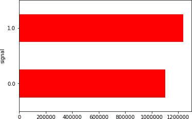
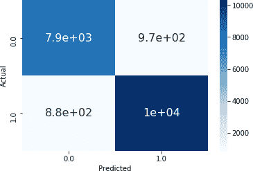

# 第六章。监督学习：分类

这里是金融分析师试图解决的一些关键问题：

+   借款人会按时还贷款还是违约？

+   工具价格会涨还是跌？

+   这笔信用卡交易是欺诈还是正常？

所有这些问题陈述，目标是预测分类类标签，本质上都适合于基于分类的机器学习。

分类算法已广泛应用于金融领域的许多方面，需要预测定性响应。这些包括欺诈检测、违约预测、信用评分、资产价格运动的方向预测以及买入/卖出建议。在投资组合管理和算法交易中也有许多其他基于分类的监督学习用例。

本章我们涵盖了三个基于分类的案例研究，涵盖了多个领域，包括欺诈检测、贷款违约概率和制定交易策略。

在“案例研究 1: 欺诈检测”，我们使用基于分类的算法来预测交易是否存在欺诈行为。本案例研究的重点还包括处理不平衡数据集，因为欺诈数据集中欺诈观测数量较少。

在“案例研究 2: 贷款违约概率”，我们使用基于分类的算法来预测贷款是否会违约。案例研究侧重于数据处理、特征选择和探索性分析的各种技术和概念。

在“案例研究 3: 比特币交易策略”，我们使用基于分类的算法来预测比特币当前交易信号是买入还是卖出，具体取决于短期和长期价格之间的关系。我们使用技术指标预测比特币价格的趋势。预测模型可以轻松转化为交易机器人，无需人工干预进行买入、卖出或持有操作。

# 本章的代码库

本书代码库的[*第六章 - 监督学习 - 分类模型*](https://oreil.ly/y19Yc)文件夹中包含有监督分类模型的基于 Python 的主模板，以及本章案例研究的 Jupyter 笔记本。本章所有案例研究均使用 第 2 章 中提出的标准化的七步模型开发过程。¹

对于任何新的基于分类的问题，可以通过代码库中的主模板修改具体问题的元素。这些模板设计为在云基础设施上运行（例如 Kaggle、Google Colab 或 AWS）。为了在本地机器上运行模板，必须成功安装模板中使用的所有软件包。

# 案例研究 1: 欺诈检测

欺诈是金融部门面临的重大问题之一，它成本极高。根据一项研究，估计典型组织每年损失其年收入的 5%至欺诈。将其应用于 2017 年估计的全球总生产总值（$79.6 万亿），这意味着潜在的全球损失高达 4 万亿美元。

欺诈检测是机器学习天生适合的任务，因为基于机器学习的模型可以扫描庞大的交易数据集，检测异常活动，并识别可能存在欺诈风险的所有案例。此外，与传统基于规则的方法相比，这些模型的计算速度更快。通过从各种来源收集数据，然后映射到触发点，机器学习解决方案能够发现每个潜在客户和交易的违约率或欺诈倾向，为金融机构提供关键的警报和洞察力。

在本案例研究中，我们将使用各种基于分类的模型来检测交易是正常支付还是欺诈。


## 使用分类模型确定交易是否欺诈的蓝图

### 1\. 问题定义

在为本案例研究定义的分类框架中，响应（或目标）变量具有列名“Class”。该列在欺诈情况下的值为 1，在其他情况下的值为 0。

使用的数据集来自[Kaggle](https://oreil.ly/CeFRs)。该数据集包含 2013 年 9 月两天内发生的欧洲持卡人的交易，其中包含 284,807 笔交易中的 492 起欺诈案例。

由于隐私原因，数据集已匿名化处理。鉴于某些特征名称未提供（即它们被称为 V1、V2、V3 等），可视化和特征重要性不会对模型行为提供太多见解。

通过本案例研究结束时，读者将熟悉欺诈建模的一般方法，从数据收集和清理到建立和调整分类器。

### 2\. 入门—加载数据和 Python 包

#### 2.1\. 加载 Python 包

下面显示了用于数据加载、数据分析、数据准备、模型评估和模型调整的库列表。有关大多数这些包和函数的详细信息已在第二章和第四章中提供：

`用于数据加载、数据分析和数据准备的包`

```py
import numpy as np
import pandas as pd
import seaborn as sns
from matplotlib import pyplot

from pandas import read_csv, set_option
from pandas.plotting import scatter_matrix
from sklearn.preprocessing import StandardScaler
```

`用于模型评估和分类模型的包`

```py
from sklearn.model_selection import train_test_split, KFold,\
 cross_val_score, GridSearchCV
from sklearn.linear_model import LogisticRegression
from sklearn.tree import DecisionTreeClassifier
from sklearn.neighbors import KNeighborsClassifier
from sklearn.discriminant_analysis import LinearDiscriminantAnalysis
from sklearn.naive_bayes import GaussianNB
from sklearn.svm import SVC
from sklearn.neural_network import MLPClassifier
from sklearn.pipeline import Pipeline
from sklearn.ensemble import AdaBoostClassifier, GradientBoostingClassifier,
from sklearn.ensemble import RandomForestClassifier, ExtraTreesClassifier
from sklearn.metrics import classification_report, confusion_matrix,\
  accuracy_score
```

`用于深度学习模型的包`

```py
from keras.models import Sequential
from keras.layers import Dense
from keras.wrappers.scikit_learn import KerasClassifier
```

`用于保存模型的包`

```py
from pickle import dump
from pickle import load
```

### 3\. 探索性数据分析

以下章节将介绍一些高级数据检查。

#### 3.1\. 描述性统计

我们必须做的第一件事是对数据有一个基本的了解。请记住，除了交易和金额之外，我们不知道其他列的名称。我们唯一知道的是这些列的值已经被缩放了。让我们来看看数据的形状和列：

```py
# shape
dataset.shape
```

`输出`

```py
(284807, 31)
```

```py
#peek at data
set_option('display.width', 100)
dataset.head(5)
```

`输出`


`5 行 × 31 列`

如图所示，变量名不具描述性（*V1*、*V2*等）。此外，整个数据集的数据类型为`float`，除了`Class`是整数类型。

有多少是欺诈，多少是非欺诈？让我们来检查一下：

```py
class_names = {0:'Not Fraud', 1:'Fraud'}
print(dataset.Class.value_counts().rename(index = class_names))
```

`输出`

```py
Not Fraud    284315
Fraud           492
Name: Class, dtype: int64
```

请注意数据标签的明显不平衡。大多数交易都不是欺诈的。如果我们将此数据集用作建模的基础，大多数模型将不会足够重视欺诈信号；非欺诈数据点将淹没任何欺诈信号提供的权重。按照现状，我们可能会在预测欺诈方面遇到困难，因为这种不平衡会导致模型简单地假设*所有*交易都是非欺诈的。这将是一个不可接受的结果。我们将在随后的部分探讨一些解决此问题的方法。

#### 3.2\. 数据可视化

由于未提供特征描述，可视化数据不会带来太多见解。在这个案例研究中，将跳过此步骤。

### 4\. 数据准备

这些数据来自 Kaggle，并且已经以无任何空行或空列的清理格式提供。数据清理或分类是不必要的。

### 5\. 评估模型

现在我们准备好拆分数据并评估模型了。

#### 5.1\. 训练-测试分割和评估指标

如第二章所述，将原始数据集划分为训练集和测试集是一个好主意。测试集是我们从分析和建模中留出的数据样本。我们在项目结束时使用它来确认我们最终模型的准确性。它是最终测试，为我们提供了对未见数据准确性的估计的信心。我们将使用 80%的数据集进行模型训练，20%进行测试：

```py
Y= dataset["Class"]
X = dataset.loc[:, dataset.columns != 'Class']
validation_size = 0.2
seed = 7
X_train, X_validation, Y_train, Y_validation =\
train_test_split(X, Y, test_size=validation_size, random_state=seed)
```

#### 5.2\. 检查模型

在这一步中，我们将评估不同的机器学习模型。为了优化模型的各种超参数，我们使用十折交叉验证，并重新计算结果十次，以考虑某些模型和 CV 过程中固有的随机性。所有这些模型，包括交叉验证，都在第四章中描述。

让我们设计我们的测试工具。我们将使用*准确性指标*评估算法。这是一个粗略的指标，将为我们提供给定模型的正确性的快速概念。它在二元分类问题上很有用。

```py
# test options for classification
num_folds = 10
scoring = 'accuracy'
```

让我们为这个问题创建一个性能基准，并检查多种不同的算法。所选算法包括：

线性算法

逻辑回归（LR）和线性判别分析（LDA）。

非线性算法

分类与回归树（CART）和*K*-最近邻（KNN）。

选择这些模型有充分理由。这些模型是简单且快速的模型，对于具有大型数据集的问题具有良好的解释性。CART 和 KNN 能够区分变量之间的非线性关系。关键问题在于使用了不平衡样本。除非我们解决这个问题，否则更复杂的模型（如集成模型和人工神经网络）将预测效果较差。我们将在案例研究的后续部分集中解决这个问题，并评估这些类型模型的性能。

```py
# spot-check basic Classification algorithms
models = []
models.append(('LR', LogisticRegression()))
models.append(('LDA', LinearDiscriminantAnalysis()))
models.append(('KNN', KNeighborsClassifier()))
models.append(('CART', DecisionTreeClassifier()))
```

所有算法使用默认调优参数。我们将计算并收集每种算法的准确率的均值和标准偏差，以备后用。

```py
results = []
names = []
for name, model in models:
    kfold = KFold(n_splits=num_folds, random_state=seed)
    cv_results = cross_val_score(model, X_train, Y_train, cv=kfold, \
      scoring=scoring)
    results.append(cv_results)
    names.append(name)
    msg = "%s: %f (%f)" % (name, cv_results.mean(), cv_results.std())
    print(msg)
```

`Output`

```py
LR: 0.998942 (0.000229)
LDA: 0.999364 (0.000136)
KNN: 0.998310 (0.000290)
CART: 0.999175 (0.000193)
```

```py
# compare algorithms
fig = pyplot.figure()
fig.suptitle('Algorithm Comparison')
ax = fig.add_subplot(111)
pyplot.boxplot(results)
ax.set_xticklabels(names)
fig.set_size_inches(8,4)
pyplot.show()
```


整体结果的准确率非常高。但让我们检查一下它对欺诈案例的预测效果。从上述结果中选择一个 CART 模型，并查看测试集的结果：

```py
# prepare model
model = DecisionTreeClassifier()
model.fit(X_train, Y_train)

# estimate accuracy on validation set
predictions = model.predict(X_validation)
print(accuracy_score(Y_validation, predictions))
print(classification_report(Y_validation, predictions))
```

`Output`

```py
0.9992275552122467
              precision    recall  f1-score   support

           0       1.00      1.00      1.00     56862
           1       0.77      0.79      0.78       100

    accuracy                           1.00     56962
   macro avg       0.89      0.89      0.89     56962
weighted avg       1.00      1.00      1.00     56962
```

生成混淆矩阵如下：

```py
df_cm = pd.DataFrame(confusion_matrix(Y_validation, predictions), \
columns=np.unique(Y_validation), index = np.unique(Y_validation))
df_cm.index.name = 'Actual'
df_cm.columns.name = 'Predicted'
sns.heatmap(df_cm, cmap="Blues", annot=True,annot_kws={"size": 16})
```


总体准确率很高，但混淆矩阵讲述了一个不同的故事。尽管准确率水平高，但有 21 个欺诈实例中的 100 个被错过，并错误预测为非欺诈。*假阴性*率相当可观。

一个欺诈检测模型的意图是尽量减少这些假阴性。因此，第一步是选择正确的评估指标。

在第四章中，我们讨论了用于分类问题的评估指标，如准确率、精确率和召回率。准确率是所有预测正确的比例。精确率是模型正确识别为正例的项目数占所有被模型识别为正例的项目总数的比例。召回率是所有正确识别为正例的项目数占所有真实正例的总数的比例。

对于这种类型的问题，我们应该关注召回率，即真正例占所有真实正例与假阴性之和的比率。因此，如果假阴性较高，则召回率值将较低。

在接下来的步骤中，我们进行模型调优，选择使用召回率的模型，并进行欠采样。

### 6\. 模型调优

模型调优步骤的目的是对前一步骤选择的模型进行网格搜索。然而，由于在上一节中由于不平衡数据集而遇到了模型性能不佳的问题，我们将集中注意力解决这个问题。我们将分析选择正确评估指标的影响，并查看使用调整后的平衡样本的影响。

#### 6.1\. 通过选择正确的评估指标进行模型调优

如前所述，如果假阴性较高，则召回率将较低。模型将根据这一指标进行排序：

```py
scoring = 'recall'
```

让我们对一些基本分类算法进行召回率的点检查：

```py
models = []
models.append(('LR', LogisticRegression()))
models.append(('LDA', LinearDiscriminantAnalysis()))
models.append(('KNN', KNeighborsClassifier()))
models.append(('CART', DecisionTreeClassifier()))
```

运行交叉验证：

```py
results = []
names = []
for name, model in models:
    kfold = KFold(n_splits=num_folds, random_state=seed)
    cv_results = cross_val_score(model, X_train, Y_train, cv=kfold, \
      scoring=scoring)
    results.append(cv_results)
    names.append(name)
    msg = "%s: %f (%f)" % (name, cv_results.mean(), cv_results.std())
    print(msg)
```

`Output`

```py
LR: 0.595470 (0.089743)
LDA: 0.758283 (0.045450)
KNN: 0.023882 (0.019671)
CART: 0.735192 (0.073650)
```

我们看到 LDA 模型在四个模型中具有最佳的召回率。我们继续通过训练后的 LDA 评估测试集：

```py
# prepare model
model = LinearDiscriminantAnalysis()
model.fit(X_train, Y_train)
# estimate accuracy on validation set

predictions = model.predict(X_validation)
print(accuracy_score(Y_validation, predictions))
```

`输出`

```py
0.9995435553526912
```


LDA 表现更好，仅错过了 100 例诈骗案中的 18 例。此外，我们也发现假阳性更少了。不过，还有改进的空间。

#### 6.2\. 模型调优——通过随机欠采样平衡样本

当前的数据显示了显著的类别不平衡，很少有数据点标记为“欺诈”。这种类别不平衡问题可能导致对多数类的严重偏向，降低分类性能并增加假阴性的数量。

解决这种情况的一种方法是*对数据进行欠采样*。一个简单的技术是随机均匀地对多数类进行欠采样。这可能导致信息的丢失，但通过很好地建模少数类，可能会产生强大的结果。

接下来，我们将实施随机欠采样，即删除数据以获得更平衡的数据集。这将有助于确保我们的模型避免过拟合。

实施随机欠采样的步骤如下：

1.  首先，我们使用`value_counts()`函数来确定类别列中被视为欺诈交易（*fraud = 1*）的实例数量。

1.  我们将非欺诈交易观察计数与欺诈交易数量相同。假设我们想要 50/50 的比例，这将相当于 492 例欺诈案和 492 例非欺诈交易。

1.  现在我们有一个数据框的子样本，其类别的比例是 50/50。我们在这个子样本上训练模型。然后我们再次执行这个迭代，以在训练样本中打乱非欺诈观察。我们跟踪模型性能，看看我们的模型在每次重复此过程时是否能保持一定的准确性：

```py
df = pd.concat([X_train, Y_train], axis=1)
# amount of fraud classes 492 rows.
fraud_df = df.loc[df['Class'] == 1]
non_fraud_df = df.loc[df['Class'] == 0][:492]

normal_distributed_df = pd.concat([fraud_df, non_fraud_df])

# Shuffle dataframe rows
df_new = normal_distributed_df.sample(frac=1, random_state=42)
# split out validation dataset for the end
Y_train_new= df_new["Class"]
X_train_new = df_new.loc[:, dataset.columns != 'Class']
```

让我们看看数据集中各类别的分布情况：

```py
print('Distribution of the Classes in the subsample dataset')
print(df_new['Class'].value_counts()/len(df_new))
sns.countplot('Class', data=df_new)
pyplot.title('Equally Distributed Classes', fontsize=14)
pyplot.show()
```

`输出`

```py
Distribution of the Classes in the subsample dataset
1    0.5
0    0.5
Name: Class, dtype: float64
```


数据现在平衡了，接近 1000 个观察结果。我们将重新训练所有模型，包括 ANN。现在数据已经平衡，我们将专注于准确率作为主要评估指标，因为它考虑了假阳性和假阴性。如果需要，总是可以产生召回率：

```py
#setting the evaluation metric
scoring='accuracy'
# spot-check the algorithms
models = []
models.append(('LR', LogisticRegression()))
models.append(('LDA', LinearDiscriminantAnalysis()))
models.append(('KNN', KNeighborsClassifier()))
models.append(('CART', DecisionTreeClassifier()))
models.append(('NB', GaussianNB()))
models.append(('SVM', SVC()))
#Neural Network
models.append(('NN', MLPClassifier()))
# Ensemble Models
# Boosting methods
models.append(('AB', AdaBoostClassifier()))
models.append(('GBM', GradientBoostingClassifier()))
# Bagging methods
models.append(('RF', RandomForestClassifier()))
models.append(('ET', ExtraTreesClassifier()))
```

在 Keras 中定义和编译基于 ANN 的深度学习模型的步骤，以及以下代码中提到的所有术语（神经元、激活、动量等），已在第三章中描述。该代码可用于任何基于深度学习的分类模型。

`基于 Keras 的深度学习模型：`

```py
# Function to create model, required for KerasClassifier
def create_model(neurons=12, activation='relu', learn_rate = 0.01, momentum=0):
    # create model
    model = Sequential()
    model.add(Dense(X_train.shape[1], input_dim=X_train.shape[1], \
      activation=activation))
    model.add(Dense(32,activation=activation))
    model.add(Dense(1, activation='sigmoid'))
    # Compile model
    optimizer = SGD(lr=learn_rate, momentum=momentum)
    model.compile(loss='binary_crossentropy', optimizer='adam', \
    metrics=['accuracy'])
    return model
models.append(('DNN', KerasClassifier(build_fn=create_model,\
epochs=50, batch_size=10, verbose=0)))
```

对新模型集进行交叉验证的结果如下：


尽管包括随机森林（RF）和逻辑回归（LR）在内的几个模型表现良好，GBM 稍微领先于其他模型。我们选择进一步分析这个模型。请注意，使用 Keras 的深度学习模型（即“DNN”）的结果较差。

对 GBM 模型进行网格搜索，通过调整估计器的数量和最大深度。GBM 模型的详细信息和调整参数在第四章中有描述。

```py
# Grid Search: GradientBoosting Tuning
n_estimators = [20,180,1000]
max_depth= [2, 3,5]
param_grid = dict(n_estimators=n_estimators, max_depth=max_depth)
model = GradientBoostingClassifier()
kfold = KFold(n_splits=num_folds, random_state=seed)
grid = GridSearchCV(estimator=model, param_grid=param_grid, scoring=scoring, \
  cv=kfold)
grid_result = grid.fit(X_train_new, Y_train_new)
print("Best: %f using %s" % (grid_result.best_score_, grid_result.best_params_))
```

`Output`

```py
Best: 0.936992 using {'max_depth': 5, 'n_estimators': 1000}
```

接下来，准备最终模型，并检查在测试集上的结果：

```py
# prepare model
model = GradientBoostingClassifier(max_depth= 5, n_estimators = 1000)
model.fit(X_train_new, Y_train_new)
# estimate accuracy on Original validation set
predictions = model.predict(X_validation)
print(accuracy_score(Y_validation, predictions))
```

`Output`

```py
0.9668199852533268
```

模型的准确率很高。让我们来看看混淆矩阵：

`Output`


测试集上的结果令人印象深刻，准确率很高，而且最重要的是没有假阴性。然而，我们看到在使用欠采样数据的情况下，一个结果是存在假阳性的倾向——即将非欺诈交易误分类为欺诈交易。这是金融机构必须考虑的一种权衡。在操作开销和可能影响客户体验的潜在财务损失之间存在固有的成本平衡，这是处理假阴性所导致的财务损失。

### 结论

在这个案例研究中，我们对信用卡交易进行了欺诈检测。我们展示了不同分类机器学习模型之间的对比，并且证明选择正确的评估指标在模型评估中可以产生重要的差异。欠采样显示出显著改进，因为在应用欠采样后，测试集中的所有欺诈案例都被正确识别。然而，这也伴随着一个权衡：减少了假阴性的同时增加了假阳性。

总体而言，通过使用不同的机器学习模型、选择正确的评估指标和处理不平衡数据，我们展示了如何实施基于简单分类模型的诈骗检测，可以产生稳健的结果。


# 案例研究 2：贷款违约概率

放贷是金融业最重要的活动之一。放贷人向借款人提供贷款，以换取借款人承诺的还款和利息。这意味着只有借款人还清贷款，放贷人才能获利。因此，放贷行业中最关键的两个问题是：

1.  借款人的风险有多大？

1.  鉴于借款人的风险，我们是否应该向他们放贷？

对于机器学习来说，违约预测可以被描述为一项完美的工作，因为算法可以基于数百万个消费者数据示例进行训练。算法可以执行自动化任务，如匹配数据记录、识别异常情况，以及计算申请人是否有资格获得贷款。算法可以评估潜在趋势，并持续分析以检测可能影响未来放贷和核保风险的趋势。

本案例研究的目标是建立一个机器学习模型，预测贷款违约的概率。

在大多数现实生活案例中，包括贷款违约建模在内，我们无法处理干净完整的数据。我们可能会遇到的一些潜在问题包括缺失值、不完整的分类数据和无关的特征。尽管数据清洗可能不经常被提及，但它对机器学习应用的成功至关重要。我们使用的算法可能非常强大，但如果没有相关或适当的数据，系统可能无法产生理想的结果。因此，本案例研究的一个重点领域将是数据准备和清洗。各种数据处理技术和概念，包括数据清洗、特征选择和探索性分析，都被用来整理特征空间。


## 创造一个用于预测贷款违约概率的机器学习模型的蓝图

### 1\. 问题定义

在本案例研究的分类框架中，预测变量是*违约*，即借款人在数月内错过付款后，债权人放弃尝试收回的债务。在违约情况下，预测变量取值为 1，否则为 0。

我们将分析来自 Lending Club 的 2007 年至 2017 年第 3 季度的贷款数据，[可在 Kaggle 上找到](https://oreil.ly/DG9j5)。Lending Club 是一家美国的 P2P（个人对个人）借贷公司。它运营一个在线借贷平台，允许借款人获得贷款，并允许投资者购买由这些贷款上的支付支持的票据。该数据集包含超过 887,000 条观察结果，包含 150 个变量，包含指定时间段内所有贷款的完整贷款数据。这些特征包括收入、年龄、信用评分、住房所有权、借款人位置、收藏等等。我们将调查这 150 个预测变量以进行特征选择。

通过本案例研究的结束，读者将熟悉从收集和清理数据到构建和调整分类器的贷款违约建模的一般方法。

### 2\. 开始—加载数据和 Python 包

#### 2.1\. 加载 Python 包

标准的 Python 包在此步骤中被加载。详细信息已在之前的案例研究中呈现。请参考本案例研究的 Jupyter 笔记本以获取更多细节。

#### 2.2\. 加载数据

从 2007 年到 2017 年第 3 季度的贷款数据已加载：

```py
# load dataset
dataset = pd.read_csv('LoansData.csv.gz', compression='gzip', \
low_memory=True)
```

### 3\. 数据准备和特征选择

在第一步中，让我们来看看数据的大小：

```py
dataset.shape
```

`Output`

```py
(1646801, 150)
```

鉴于每笔贷款有 150 个特征，我们首先将重点放在限制特征空间上，然后进行探索性分析。

#### 3.1\. 准备预测变量

在这里，我们查看预测变量的详细信息并准备它。预测变量将从 `loan_status` 列中派生。让我们检查值分布：²

```py
dataset['loan_status'].value_counts(dropna=False)
```

`Output`

```py
Current                                                788950
Fully Paid                                             646902
Charged Off                                            168084
Late (31-120 days)                                      23763
In Grace Period                                         10474
Late (16-30 days)                                        5786
Does not meet the credit policy. Status:Fully Paid       1988
Does not meet the credit policy. Status:Charged Off       761
Default                                                    70
NaN                                                        23
Name: loan_status, dtype: int64
```

根据数据定义文档：

已全额偿还

已经全额偿还的贷款。

违约

已经超过 121 天未达到 `Current` 状态的贷款。

已违约

不再有合理预期可以进一步付款的贷款。

大部分观测结果显示为 `Current` 状态，我们不知道这些贷款在未来是会 `已违约`，`已全额偿还` 还是 `违约`。 `Default` 的观测数量与 `已全额偿还` 或 `已违约` 相比非常少，因此不予考虑。对于此分析来说，`贷款状态` 的其余类别并不是主要关注点。因此，为了将其转换为二元分类问题，并详细分析重要变量对贷款状态的影响，我们只考虑两个主要类别—已违约和已全额偿还：

```py
dataset = dataset.loc[dataset['loan_status'].isin(['Fully Paid', 'Charged Off'])]
dataset['loan_status'].value_counts(normalize=True, dropna=False)
```

`Output`

```py
Fully Paid     0.793758
Charged Off    0.206242
Name: loan_status, dtype: float64
```

剩余贷款中大约 79%已全额偿还，21%已违约，所以我们面临一个有些不平衡的分类问题，但不像我们在之前案例研究中看到的欺诈检测数据集那么不平衡。

接下来，我们在数据集中创建一个新的二元列，将“已全额偿还”分类为 0，而“已违约”分类为 1。这一列代表了这个分类问题的预测变量。这一列中的值为 1 表示借款人已经违约：

```py
dataset['charged_off'] = (dataset['loan_status'] == 'Charged Off').apply(np.uint8)
dataset.drop('loan_status', axis=1, inplace=True)
```

#### 3.2\. 特征选择—限制特征空间

完整数据集每笔贷款有 150 个特征，但并非所有特征都对预测变量有贡献。删除重要性较低的特征可以提高准确性，减少模型复杂性和过拟合。对于非常大的数据集，还可以减少训练时间。我们将使用三种不同的方法在以下步骤中消除特征：

+   消除超过 30%空值的特征。

+   根据主观判断消除不直观的特征。

+   根据预测变量消除与之低相关性的特征。

#### 3.2.1\. 基于显著缺失值消除特征

首先，我们计算每个特征的缺失数据百分比：

```py
missing_fractions = dataset.isnull().mean().sort_values(ascending=False)

#Drop the missing fraction
drop_list = sorted(list(missing_fractions[missing_fractions > 0.3].index))
dataset.drop(labels=drop_list, axis=1, inplace=True)
dataset.shape
```

`Output`

```py
(814986, 92)
```

一些列的空值较多的列被删除后，此数据集还剩下 92 列。

#### 3.2.2\. 基于直觉消除特征

为了进一步筛选特征，我们检查数据字典中的描述，并保留直观上有助于预测违约的特征。我们保留包含借款人相关信用细节的特征，包括年收入、FICO 分数和债务收入比。我们还保留那些在考虑投资贷款时投资者可用的特征，例如贷款等级和利率。

以下代码片段显示了保留的特征列表：

```py
keep_list = ['charged_off','funded_amnt','addr_state', 'annual_inc', \
'application_type','dti', 'earliest_cr_line', 'emp_length',\
'emp_title', 'fico_range_high',\
'fico_range_low', 'grade', 'home_ownership', 'id', 'initial_list_status', \
'installment', 'int_rate', 'loan_amnt', 'loan_status',\
'mort_acc', 'open_acc', 'pub_rec', 'pub_rec_bankruptcies', \
'purpose', 'revol_bal', 'revol_util', \
'sub_grade', 'term', 'title', 'total_acc',\
'verification_status', 'zip_code','last_pymnt_amnt',\
'num_actv_rev_tl', 'mo_sin_rcnt_rev_tl_op',\
'mo_sin_old_rev_tl_op',"bc_util","bc_open_to_buy",\
"avg_cur_bal","acc_open_past_24mths" ]

drop_list = [col for col in dataset.columns if col not in keep_list]
dataset.drop(labels=drop_list, axis=1, inplace=True)
dataset.shape
```

`Output`

```py
(814986, 39)
```

在此步骤中删除特征后，剩下 39 列。

#### 3.2.3\. 基于相关性的特征消除

下一步是检查与预测变量的相关性。相关性为我们提供了预测变量与特征之间的相互依赖关系。我们选择与目标变量具有中等到强相关性的特征，并且删除那些与预测变量相关性低于 3%的特征：

```py
correlation = dataset.corr()
correlation_chargeOff = abs(correlation['charged_off'])
drop_list_corr = sorted(list(correlation_chargeOff\
  [correlation_chargeOff < 0.03].index))
print(drop_list_corr)
```

`Output`

```py
['pub_rec', 'pub_rec_bankruptcies', 'revol_bal', 'total_acc']
```

数据集中相关性较低的列已被删除，我们只剩下 35 列：

```py
dataset.drop(labels=drop_list_corr, axis=1, inplace=True)
```

### 4\. 特征选择和探索性分析

在这一步中，我们执行特征选择的探索性数据分析。考虑到许多特征必须被排除，最好在特征选择后执行探索性数据分析，以更好地可视化相关的特征。我们还将继续通过视觉筛选和删除那些被认为不相关的特征进行特征消除。

#### 4.1\. 特征分析和探索

在接下来的几节中，我们将深入研究数据集的特征。

#### 4.1.1\. 分析分类特征

让我们看看数据集中一些分类特征。

首先，让我们看看`id`、`emp_title`、`title`和`zip_code`特征：

```py
dataset[['id','emp_title','title','zip_code']].describe()
```

`Output`

|  | id | emp_title | title | zip_code |
| --- | --- | --- | --- | --- |
| count | 814986 | 766415 | 807068 | 814986 |
| unique | 814986 | 280473 | 60298 | 925 |
| top | 14680062 | Teacher | Debt consolidation | 945xx |
| freq | 1 | 11351 | 371874 | 9517 |

ID 是唯一的且与建模无关。雇佣头衔和职位标题有太多的唯一值。职业和职位头衔可能为默认建模提供一些信息；然而，我们假设这些信息的大部分都包含在客户的已验证收入中。此外，对这些特征进行额外的清理步骤，例如标准化或分组头衔，将需要提取任何边际信息。这项工作超出了本案例研究的范围，但可以在模型的后续迭代中探索。

地理位置可能在信用确定中起到作用，邮政编码提供了这一维度的细致视图。再次强调，需要额外的工作来准备这个特征用于建模，并且被认为超出了这个案例研究的范围。

```py
dataset.drop(['id','emp_title','title','zip_code'], axis=1, inplace=True)
```

让我们来看看 `term` 特征。

*期限* 指的是贷款的支付期数。值以月计，并且可以是 36 或 60。60 个月的贷款更有可能违约。

让我们将期限转换为整数，并按期限分组进行进一步分析：

```py
dataset['term'] = dataset['term'].apply(lambda s: np.int8(s.split()[0]))
dataset.groupby('term')['charged_off'].value_counts(normalize=True).loc[:,1]
```

`输出`

```py
term
36    0.165710
60    0.333793
Name: charged_off, dtype: float64
```

五年期贷款比三年期贷款更有可能违约。该特征似乎对预测很重要。

让我们来看看 `emp_length` 特征：

```py
dataset['emp_length'].replace(to_replace='10+ years', value='10 years',\
  inplace=True)

dataset['emp_length'].replace('< 1 year', '0 years', inplace=True)

def emp_length_to_int(s):
    if pd.isnull(s):
        return s
    else:
        return np.int8(s.split()[0])

dataset['emp_length'] = dataset['emp_length'].apply(emp_length_to_int)
charge_off_rates = dataset.groupby('emp_length')['charged_off'].value_counts\
  (normalize=True).loc[:,1]
sns.barplot(x=charge_off_rates.index, y=charge_off_rates.values)
```

`输出`


贷款状态在就业年限上似乎变化不大（平均而言）；因此，此特征被舍弃：

```py
dataset.drop(['emp_length'], axis=1, inplace=True)
```

让我们来看看 `sub_grade` 特征：

```py
charge_off_rates = dataset.groupby('sub_grade')['charged_off'].value_counts\
(normalize=True).loc[:,1]
sns.barplot(x=charge_off_rates.index, y=charge_off_rates.values)
```

`输出`


如图所示，随着子等级恶化，违约的可能性呈明显趋势，因此被认为是一个关键特征。

#### 4.1.2\. 分析连续特征

让我们来看看 `annual_inc` 特征：

```py
dataset[['annual_inc']].describe()
```

`输出`

|  | 年收入 |
| --- | --- |
| count | 8.149860e+05 |
| mean | 7.523039e+04 |
| std | 6.524373e+04 |
| min | 0.000000e+00 |
| 25% | 4.500000e+04 |
| 50% | 6.500000e+04 |
| 75% | 9.000000e+04 |
| max | 9.550000e+06 |

年收入范围从$0 到$9,550,000，中位数为$65,000。由于收入范围很大，我们使用年收入变量的对数变换：

```py
dataset['log_annual_inc'] = dataset['annual_inc'].apply(lambda x: np.log10(x+1))
dataset.drop('annual_inc', axis=1, inplace=True)
```

让我们来看看 FICO 分数（`fico_range_low`，`fico_range_high`）特征：

```py
dataset[['fico_range_low','fico_range_high']].corr()
```

`输出`

|  | fico_range_low | fico_range_high |
| --- | --- | --- |
| fico_range_low | 1.0 | 1.0 |
| fico_range_high | 1.0 | 1.0 |

鉴于 FICO 低和高之间的相关性为 1，建议仅保留一个特征，我们采用 FICO 分数的平均值：

```py
dataset['fico_score'] = 0.5*dataset['fico_range_low'] +\
 0.5*dataset['fico_range_high']

dataset.drop(['fico_range_high', 'fico_range_low'], axis=1, inplace=True)
```

#### 4.2\. 编码分类数据

为了在分类模型中使用特征，我们需要将分类数据（即文本特征）转换为其数值表示。这个过程称为编码。可以有不同的编码方式。然而，在这个案例研究中，我们将使用*标签编码器*，它将标签编码为介于 0 和*n*之间的值，其中*n*是不同标签的数量。在以下步骤中使用来自 sklearn 的`LabelEncoder`函数，一次性对所有分类列进行编码：

```py
from sklearn.preprocessing import LabelEncoder
# Categorical boolean mask
categorical_feature_mask = dataset.dtypes==object
# filter categorical columns using mask and turn it into a list
categorical_cols = dataset.columns[categorical_feature_mask].tolist()
```

让我们来看看分类列：

```py
categorical_cols
```

`输出`

```py
['grade',
 'sub_grade',
 'home_ownership',
 'verification_status',
 'purpose',
 'addr_state',
 'initial_list_status',
 'application_type']
```

#### 4.3\. 数据抽样

鉴于贷款数据偏斜，对其进行抽样以使违约和无违约观测数量相等。抽样会导致更平衡的数据集，并避免过拟合：³

```py
loanstatus_0 = dataset[dataset["charged_off"]==0]
loanstatus_1 = dataset[dataset["charged_off"]==1]
subset_of_loanstatus_0 = loanstatus_0.sample(n=5500)
subset_of_loanstatus_1 = loanstatus_1.sample(n=5500)
dataset = pd.concat([subset_of_loanstatus_1, subset_of_loanstatus_0])
dataset = dataset.sample(frac=1).reset_index(drop=True)
print("Current shape of dataset :",dataset.shape)
```

虽然抽样可能有其优势，但也可能存在一些不利因素。抽样可能会排除一些可能与采取的数据不均匀的数据。这会影响结果的准确性水平。此外，选择适当大小的样本是一项困难的工作。因此，在相对平衡的数据集情况下，应谨慎进行抽样，并且通常应该避免。

### 5\. 评估算法和模型

#### 5.1\. 训练-测试分离

下一步是为模型评估分离出验证数据集：

```py
Y= dataset["charged_off"]
X = dataset.loc[:, dataset.columns != 'charged_off']
validation_size = 0.2
seed = 7
X_train, X_validation, Y_train, Y_validation = \
train_test_split(X, Y, test_size=validation_size, random_state=seed)
```

#### 5.2\. 测试选项和评估指标

在这一步中，选择测试选项和评估指标。选择了`roc_auc`评估指标用于此分类。该指标的详细信息在 第四章 中提供。此指标代表模型区分正类和负类的能力。`roc_auc`为 1.0 表示模型完美预测所有情况，而 0.5 表示模型等同于随机预测。

```py
num_folds = 10
scoring = 'roc_auc'
```

模型不能承受高数量的假阴性，因为这会对投资者和公司的信誉产生负面影响。因此，我们可以像在欺诈检测用例中一样使用召回率。

#### 5.3\. 比较模型和算法

让我们现场检查分类算法。我们在待检查的模型列表中包括 ANN 和集成模型：

```py
models = []
models.append(('LR', LogisticRegression()))
models.append(('LDA', LinearDiscriminantAnalysis()))
models.append(('KNN', KNeighborsClassifier()))
models.append(('CART', DecisionTreeClassifier()))
models.append(('NB', GaussianNB()))
# Neural Network
models.append(('NN', MLPClassifier()))
# Ensemble Models
# Boosting methods
models.append(('AB', AdaBoostClassifier()))
models.append(('GBM', GradientBoostingClassifier()))
# Bagging methods
models.append(('RF', RandomForestClassifier()))
models.append(('ET', ExtraTreesClassifier()))
```

在上述模型上执行*k*折交叉验证后，整体性能如下：


梯度提升方法（GBM）模型表现最佳，我们选择它进行下一步的网格搜索。GBM 的详细信息以及模型参数在 第四章 中描述。

### 6\. 模型调整和网格搜索

我们调整了讨论过的第四章中的估计器数量和最大深度超参数：

```py
# Grid Search: GradientBoosting Tuning
n_estimators = [20,180]
max_depth= [3,5]
param_grid = dict(n_estimators=n_estimators, max_depth=max_depth)
model = GradientBoostingClassifier()
kfold = KFold(n_splits=num_folds, random_state=seed)
grid = GridSearchCV(estimator=model, param_grid=param_grid, scoring=scoring, \
  cv=kfold)
grid_result = grid.fit(X_train, Y_train)
print("Best: %f using %s" % (grid_result.best_score_, grid_result.best_params_))
```

`输出`

```py
Best: 0.952950 using {'max_depth': 5, 'n_estimators': 180}
```

具有`max_depth`为 5 和估计器数量为 150 的 GBM 模型导致最佳模型。

### 7\. 完成模型

现在，我们执行最终步骤来选择一个模型。

#### 7.1\. 测试数据集上的结果

让我们使用在网格搜索步骤中找到的参数准备 GBM 模型，并在测试数据集上检查结果：

```py
model = GradientBoostingClassifier(max_depth= 5, n_estimators= 180)
model.fit(X_train, Y_train)

# estimate accuracy on validation set
predictions = model.predict(X_validation)
print(accuracy_score(Y_validation, predictions))
```

`输出`

```py
0.889090909090909
```

模型在测试集上的准确率为合理的 89%。让我们来查看混淆矩阵：


查看混淆矩阵和测试集的整体结果，假阳性率和假阴性率都较低；整体模型性能看起来良好，并且与训练集结果一致。

#### 7.2\. 变量直觉/特征重要性

在这一步中，我们计算并显示了我们训练模型的变量重要性：

```py
print(model.feature_importances_) #use inbuilt class feature_importances
feat_importances = pd.Series(model.feature_importances_, index=X.columns)
#plot graph of feature importances for better visualization
feat_importances.nlargest(10).plot(kind='barh')
pyplot.show()
```

`输出`


模型重要性的结果是直观的。最后一次付款金额似乎是最重要的特征，其次是贷款期限和子等级。

### 结论

在这个案例研究中，我们介绍了应用于贷款违约预测的基于分类的树算法。我们展示了数据准备是最重要的步骤之一。我们通过使用不同的技术，如特征直觉、相关性分析、可视化和数据质量检查来进行特征消除。我们说明了处理和分析分类数据以及将分类数据转换为模型可用格式的不同方法。

我们强调，在模型开发过程中，进行数据处理并建立变量重要性理解至关重要。专注于这些步骤导致了一个简单的基于分类的模型的实施，为违约预测产生了稳健的结果。


# 案例研究 3：比特币交易策略

比特币由化名为中本聪的人在 2009 年首次开源发布，是历史最悠久且最知名的加密货币。

加密货币交易的一个主要缺点是市场的波动性。由于加密货币市场 24/7 交易，跟踪加密货币在快速变化的市场动态中的位置可能迅速变得难以管理。这就是自动化交易算法和交易机器人可以提供帮助的地方。

各种机器学习算法可用于生成交易信号，以试图预测市场的运动。可以使用机器学习算法将明天的市场运动分类为三类：市场将上涨（采取多头），市场将下跌（采取空头），或市场将横向移动（不采取任何头寸）。由于我们了解市场走势，我们可以决定最佳的进出点。

机器学习有一个关键方面称为*特征工程*。这意味着我们可以创建新的直观特征，并将它们提供给机器学习算法，以获得更好的结果。我们可以引入不同的技术指标作为特征，以帮助预测资产未来的价格。这些技术指标来源于市场变量，如价格或交易量，并在其中嵌入了额外的信息或信号。技术指标有许多不同的类别，包括趋势、交易量、波动率和动量指标。

在这个案例研究中，我们将使用各种基于分类的模型来预测当前位置信号是买入还是卖出。我们将从市场价格中创建额外的趋势和动量指标，作为预测中的额外特征。


## 使用基于分类模型预测在比特币市场中买入还是卖出的蓝图

### 1\. 问题定义

预测交易策略的买卖信号问题在分类框架中定义，其中预测变量的值为 1 表示买入，0 表示卖出。此信号通过比较短期和长期价格趋势来决定。

使用的数据来自于日均交易量最大的比特币交易所之一，[Bitstamp](https://www.bitstamp.com)。数据涵盖了从 2012 年 1 月到 2017 年 5 月的价格。从数据中创建不同的趋势和动量指标，并将其作为特征添加以提升预测模型的性能。

通过本案例研究结束时，读者将熟悉建立交易策略的一般方法，从数据清理和特征工程到模型调整和开发回测框架。

### 2\. 入门—载入数据和 Python 包

让我们载入必要的包和数据。

#### 2.1\. 载入 Python 包

标准的 Python 包在这一步中被载入。详细信息已在之前的案例研究中呈现。有关更多细节，请参阅本案例研究的 Jupyter 笔记本。

#### 2.2\. 载入数据

从 Bitstamp 网站获取的比特币数据在此步骤中载入：

```py
# load dataset
dataset = pd.read_csv('BitstampData.csv')
```

### 3\. 探索性数据分析

在这一步中，我们将详细查看这些数据。

#### 3.1\. 描述统计

首先，让我们看看数据的形状：

```py
dataset.shape
```

`输出`

```py
(2841377, 8)
```

```py
# peek at data
set_option('display.width', 100)
dataset.tail(2)
```

`输出`

|  | 时间戳 | 开盘价 | 最高价 | 最低价 | 收盘价 | 比特币交易量 | 交易货币交易量 | 加权平均价 |
| --- | --- | --- | --- | --- | --- | --- | --- | --- |
| 2841372 | 1496188560 | 2190.49 | 2190.49 | 2181.37 | 2181.37 | 1.700166 | 3723.784755 | 2190.247337 |
| 2841373 | 1496188620 | 2190.50 | 2197.52 | 2186.17 | 2195.63 | 6.561029 | 14402.811961 | 2195.206304 |

数据集包含比特币的开盘价、最高价、最低价、收盘价和交易量的分钟级数据。数据集很大，总共约有 280 万条观测值。

### 4\. 数据准备

在这一部分，我们将清理数据以准备建模。

#### 4.1\. 数据清理

我们通过填充 NaN 值使用最后可用的值来清理数据：

```py
dataset[dataset.columns.values] = dataset[dataset.columns.values].ffill()
```

`时间戳`列对于建模不实用，因此从数据集中删除：

```py
dataset=dataset.drop(columns=['Timestamp'])
```

#### 4.2\. 准备分类数据

作为第一步，我们将为我们的模型创建目标变量。这是一个列，指示交易信号是买入还是卖出。我们将短期价格定义为 10 天滚动平均，长期价格定义为 60 天滚动平均。如果短期价格高于（低于）长期价格，则附加标签为`1`（`0`）：

```py
# Create short simple moving average over the short window
dataset['short_mavg'] = dataset['Close'].rolling(window=10, min_periods=1,\
center=False).mean()

# Create long simple moving average over the long window
dataset['long_mavg'] = dataset['Close'].rolling(window=60, min_periods=1,\
center=False).mean()

# Create signals
dataset['signal'] = np.where(dataset['short_mavg'] >
dataset['long_mavg'], 1.0, 0.0)
```

#### 4.3\. 特征工程

我们通过分析预期可能影响预测模型性能的特征来开始特征工程。基于对推动投资策略的关键因素的概念理解，当前任务是识别并构建可能捕捉这些回报驱动因素所体现的风险或特征的新特征。对于本案例研究，我们将探索特定动量技术指标的有效性。

比特币的当前数据包括日期、开盘价、最高价、最低价、收盘价和成交量。利用这些数据，我们计算以下动量指标：

移动平均

移动平均通过减少系列中的噪音来指示价格趋势。

随机振荡器 %K

随机振荡器是一种动量指标，它将安全性的收盘价与一定时间内其前期价格范围进行比较。*%K* 和 *%D* 是慢速和快速指标。相比于慢速指标，快速指标对基础安全性价格变动更为敏感，可能导致许多交易信号。

相对强弱指数（RSI）

这是一种动量指标，用于衡量最近价格变化的幅度，以评估股票或其他资产价格的超买或超卖状况。RSI 的范围从 0 到 100。一旦 RSI 接近 70，资产被认为是超买的，意味着资产可能被高估，适合回调。同样，如果 RSI 接近 30，这表明资产可能被超卖，因此可能会被低估。

变动率（ROC）

这是一种动量振荡器，衡量当前价格与*n*期前价格之间的百分比变化。具有较高 ROC 值的资产被认为更可能被超买；具有较低 ROC 值的资产更可能被超卖。

动量（MOM）

这是安全价格或成交量加速度的速率，即价格变化的速度。

以下步骤展示了如何为预测生成一些有用的特征。趋势和动量的特征可以用于其他交易策略模型中：

```py
#calculation of exponential moving average
def EMA(df, n):
    EMA = pd.Series(df['Close'].ewm(span=n, min_periods=n).mean(), name='EMA_'\
     + str(n))
    return EMA
dataset['EMA10'] = EMA(dataset, 10)
dataset['EMA30'] = EMA(dataset, 30)
dataset['EMA200'] = EMA(dataset, 200)
dataset.head()

#calculation of rate of change
def ROC(df, n):
    M = df.diff(n - 1)
    N = df.shift(n - 1)
    ROC = pd.Series(((M / N) * 100), name = 'ROC_' + str(n))
    return ROC
dataset['ROC10'] = ROC(dataset['Close'], 10)
dataset['ROC30'] = ROC(dataset['Close'], 30)

#calculation of price momentum
def MOM(df, n):
    MOM = pd.Series(df.diff(n), name='Momentum_' + str(n))
    return MOM
dataset['MOM10'] = MOM(dataset['Close'], 10)
dataset['MOM30'] = MOM(dataset['Close'], 30)

#calculation of relative strength index
def RSI(series, period):
 delta = series.diff().dropna()
 u = delta * 0
 d = u.copy()
 u[delta > 0] = delta[delta > 0]
 d[delta < 0] = -delta[delta < 0]
 u[u.index[period-1]] = np.mean( u[:period] ) #first value is sum of avg gains
 u = u.drop(u.index[:(period-1)])
 d[d.index[period-1]] = np.mean( d[:period] ) #first value is sum of avg losses
 d = d.drop(d.index[:(period-1)])
 rs = u.ewm(com=period-1, adjust=False).mean() / \
 d.ewm(com=period-1, adjust=False).mean()
 return 100 - 100 / (1 + rs)
dataset['RSI10'] = RSI(dataset['Close'], 10)
dataset['RSI30'] = RSI(dataset['Close'], 30)
dataset['RSI200'] = RSI(dataset['Close'], 200)

#calculation of stochastic osillator.

def STOK(close, low, high, n):
 STOK = ((close - low.rolling(n).min()) / (high.rolling(n).max() - \
 low.rolling(n).min())) * 100
 return STOK

def STOD(close, low, high, n):
 STOK = ((close - low.rolling(n).min()) / (high.rolling(n).max() - \
 low.rolling(n).min())) * 100
 STOD = STOK.rolling(3).mean()
 return STOD

dataset['%K10'] = STOK(dataset['Close'], dataset['Low'], dataset['High'], 10)
dataset['%D10'] = STOD(dataset['Close'], dataset['Low'], dataset['High'], 10)
dataset['%K30'] = STOK(dataset['Close'], dataset['Low'], dataset['High'], 30)
dataset['%D30'] = STOD(dataset['Close'], dataset['Low'], dataset['High'], 30)
dataset['%K200'] = STOK(dataset['Close'], dataset['Low'], dataset['High'], 200)
dataset['%D200'] = STOD(dataset['Close'], dataset['Low'], dataset['High'], 200)

#calculation of moving average
def MA(df, n):
    MA = pd.Series(df['Close'].rolling(n, min_periods=n).mean(), name='MA_'\
     + str(n))
    return MA
dataset['MA21'] = MA(dataset, 10)
dataset['MA63'] = MA(dataset, 30)
dataset['MA252'] = MA(dataset, 200)
```

完成特征后，我们将为它们做好准备。

#### 4.4\. 数据可视化

在这一步中，我们可视化不同特征和预测变量的不同属性：

```py
dataset[['Weighted_Price']].plot(grid=True)
plt.show()
```

`Output`


图表显示比特币价格急剧上涨，从接近 0 美元增加到 2017 年左右的 2500 美元。此外，高价格波动性一目了然。

让我们看一下预测变量的分布：

```py
fig = plt.figure()
plot = dataset.groupby(['signal']).size().plot(kind='barh', color='red')
plt.show()
```

`Output`



预测变量在 52%以上的时间内为 1，意味着买入信号比卖出信号更多。预测变量相对平衡，特别是与我们在第一个案例研究中看到的欺诈数据集相比。

### 5\. 评估算法和模型

在这一步中，我们将评估不同的算法。

#### 5.1\. 训练集和测试集分割

我们首先将数据集分成训练集（80%）和测试集（20%）。对于这个案例研究，我们使用了 10 万条观测数据以便更快地计算。如果我们想使用整个数据集，下一步将是相同的：

```py
# split out validation dataset for the end
subset_dataset= dataset.iloc[-100000:]
Y= subset_dataset["signal"]
X = subset_dataset.loc[:, dataset.columns != 'signal']
validation_size = 0.2
seed = 1
X_train, X_validation, Y_train, Y_validation =\
train_test_split(X, Y, test_size=validation_size, random_state=1)
```

#### 5.2\. 测试选项和评估指标

由于数据中不存在显著的类别不平衡问题，可以使用准确率作为评估指标：

```py
# test options for classification
num_folds = 10
scoring = 'accuracy'
```

#### 5.3\. 比较模型和算法

为了知道哪种算法最适合我们的策略，我们评估了线性、非线性和集成模型。

#### 5.3.1\. 模型

检查分类算法：

```py
models = []
models.append(('LR', LogisticRegression(n_jobs=-1)))
models.append(('LDA', LinearDiscriminantAnalysis()))
models.append(('KNN', KNeighborsClassifier()))
models.append(('CART', DecisionTreeClassifier()))
models.append(('NB', GaussianNB()))
#Neural Network
models.append(('NN', MLPClassifier()))
# Ensemble Models
# Boosting methods
models.append(('AB', AdaBoostClassifier()))
models.append(('GBM', GradientBoostingClassifier()))
# Bagging methods
models.append(('RF', RandomForestClassifier(n_jobs=-1)))
```

在进行*k*折交叉验证后，模型比较如下所示：


尽管一些模型显示出有希望的结果，但考虑到数据集的庞大规模、大量特征以及预测变量与特征之间预期的非线性关系，我们更倾向于使用集成模型。随机森林在集成模型中表现最佳。

### 6\. 模型调优和网格搜索

对随机森林模型进行网格搜索，通过调整估计器的数量和最大深度来进行。随机森林模型的详细信息和要调整的参数在第四章中讨论：

```py
n_estimators = [20,80]
max_depth= [5,10]
criterion = ["gini","entropy"]
param_grid = dict(n_estimators=n_estimators, max_depth=max_depth, \
  criterion = criterion )
model = RandomForestClassifier(n_jobs=-1)
kfold = KFold(n_splits=num_folds, random_state=seed)
grid = GridSearchCV(estimator=model, param_grid=param_grid, \
  scoring=scoring, cv=kfold)
grid_result = grid.fit(X_train, Y_train)
print("Best: %f using %s" % (grid_result.best_score_,\
  grid_result.best_params_))
```

`Output`

```py
Best: 0.903438 using {'criterion': 'gini', 'max_depth': 10, 'n_estimators': 80}
```

### 7\. 完成模型

让我们在调优步骤中找到的最佳参数的基础上完成模型，并进行变量直觉分析。

#### 7.1\. 测试数据集的结果

在这一步中，我们评估了在测试集上选择的模型：

```py
# prepare model
model = RandomForestClassifier(criterion='gini', n_estimators=80,max_depth=10)

#model = LogisticRegression()
model.fit(X_train, Y_train)

# estimate accuracy on validation set
predictions = model.predict(X_validation)
print(accuracy_score(Y_validation, predictions))
```

`Output`

```py
0.9075
```

所选模型表现出色，准确率达到 90.75%。让我们看看混淆矩阵：



整体模型性能合理，与训练集结果一致。

#### 7.2\. 变量直觉/特征重要性

让我们查看模型的特征重要性：

```py
Importance = pd.DataFrame({'Importance':model.feature_importances_*100},\
 index=X.columns)
Importance.sort_values('Importance', axis=0, ascending=True).plot(kind='barh', \
color='r' )
plt.xlabel('Variable Importance')
```

`Output`


变量重要性的结果看起来很直观，而 RSI 和 MOM 过去 30 天的动量指标似乎是两个最重要的特征。特征重要性图表证实了引入新特征会改善模型性能的事实。

#### 7.3\. 回测结果

在这一额外步骤中，我们对开发的模型进行回测。我们通过将昨天收盘时持有的头寸的日收益乘以每日收益来创建策略收益列，并将其与实际收益进行比较。

# 回测交易策略

类似于本案例研究中提出的回测方法可以用于快速回测任何交易策略。

```py
backtestdata = pd.DataFrame(index=X_validation.index)
backtestdata['signal_pred'] = predictions
backtestdata['signal_actual'] = Y_validation
backtestdata['Market Returns'] = X_validation['Close'].pct_change()
backtestdata['Actual Returns'] = backtestdata['Market Returns'] *\
backtestdata['signal_actual'].shift(1)
backtestdata['Strategy Returns'] = backtestdata['Market Returns'] * \
backtestdata['signal_pred'].shift(1)
backtestdata=backtestdata.reset_index()
backtestdata.head()
backtestdata[['Strategy Returns','Actual Returns']].cumsum().hist()
backtestdata[['Strategy Returns','Actual Returns']].cumsum().plot()
```

`Output`


查看回测结果，我们与实际市场回报并无显著偏差。事实上，所实现的动量交易策略使我们更善于预测价格方向以便盈利。然而，由于我们的准确率并非 100%（但超过 96%），与实际回报相比，我们遭受的损失相对较少。

### 结论

本案例研究表明，在使用机器学习解决金融问题时，问题的界定是一个关键步骤。通过这样做，我们确定了根据投资目标转换标签并执行特征工程对于这种交易策略是必要的。我们展示了使用与价格趋势和动量相关的直觉特征如何增强模型的预测能力。最后，我们引入了一个回测框架，允许我们使用历史数据模拟交易策略。这使我们能够在冒险使用任何实际资本之前生成结果并分析风险和盈利能力。


# 章节总结

在“案例研究 1：欺诈检测”中，我们探讨了非平衡数据集的问题以及正确评估指标的重要性。在“案例研究 2：贷款违约概率”中，涵盖了数据处理、特征选择和探索性分析的各种技术和概念。在“案例研究 3：比特币交易策略”中，我们探讨了如何创建技术指标作为模型增强的特征。我们还为交易策略准备了一个回测框架。

总体而言，本章介绍的 Python、机器学习和金融概念可以作为金融中任何其他基于分类的问题的蓝图。

# 练习

+   使用与股票或宏观经济变量相关的特征来预测股价是上涨还是下跌（使用本章介绍的基于比特币案例研究的想法）。

+   创建一个使用交易特征来检测洗钱的模型。可以从[Kaggle](https://oreil.ly/GcinN)获取此练习的示例数据集。

+   使用与信用评级相关的特征对企业进行信用评级分析。

¹ 可能会根据步骤或子步骤的适当性和直觉性重新排序或重命名步骤或子步骤。

² 预测变量进一步用于基于相关性的特征减少。

³ 详细讨论了“案例研究 1：欺诈检测”中的抽样。
