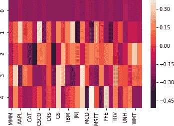
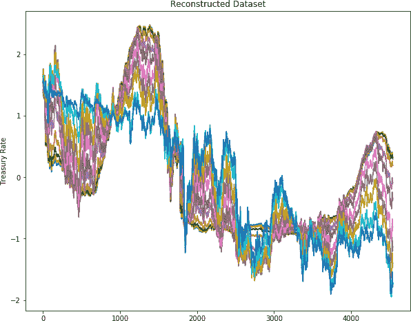

# 第七章 无监督学习：降维

在之前的章节中，我们使用监督学习技术构建了机器学习模型，使用已知答案的数据（即输入数据中已有的类标签）。现在我们将探讨*无监督学习*，在这种学习中，我们从数据集中推断出数据的特征，而输入数据的答案是未知的。无监督学习算法尝试从数据中推断出模式，而不知道数据本应产生的输出。这类模型不需要标记数据，而创建或获取标记数据可能耗时且不切实际，因此可以方便地使用更大的数据集进行分析和模型开发。

*降维* 是无监督学习中的关键技术。它通过找到一组较小、不同的变量来压缩数据，这些变量捕捉原始特征中最重要的内容，同时最小化信息损失。降维帮助缓解高维度带来的问题，并允许探索高维数据的显著方面，这在其他情况下很难实现。

在金融领域，数据集通常庞大且包含许多维度，因此降维技术证明非常实用和有用。降维技术使我们能够减少数据集中的噪声和冗余，并使用更少的特征找到数据集的近似版本。减少要考虑的变量数量后，探索和可视化数据集变得更加简单。降维技术还通过减少特征数量或找到新特征来增强基于监督学习的模型。从业者使用这些降维技术来跨资产类别和个别投资分配资金，识别交易策略和信号，实施投资组合对冲和风险管理，以及开发工具定价模型。

在本章中，我们将讨论基本的降维技术，并通过投资组合管理、利率建模和交易策略开发三个案例研究进行详细说明。这些案例研究旨在不仅从金融角度涵盖多样化的主题，还突出多个机器学习和数据科学概念。包含 Python 实现的建模步骤和机器学习与金融概念的标准模板可以作为在金融领域其他基于降维的问题的蓝图使用。

在 “案例研究 1：投资组合管理：找到特征投资组合” 中，我们使用降维算法将资本分配到不同的资产类别中，以最大化风险调整后的回报。我们还介绍了一个回测框架，评估我们构建的投资组合的表现。

在“案例研究 2：收益率曲线构建与利率建模”中，我们使用降维技术来生成收益率曲线的典型运动。这将说明如何利用降维技术来降低跨多种资产类别的市场变量的维度，以促进更快速和有效的投资组合管理、交易、套期保值和风险管理。

在“案例研究 3：比特币交易：提升速度和准确性”中，我们使用降维技术进行算法交易。这个案例研究展示了低维度数据探索。

# 本章代码库

本书代码库中包含基于 Python 的降维模板，以及本章所有案例研究的 Jupyter 笔记本，位于[*第七章 - 无监督学习 - 降维*](https://oreil.ly/tI-KJ)文件夹中。要在 Python 中解决任何涉及本章介绍的降维模型（如 PCA、SVD、Kernel PCA 或 t-SNE）的机器学习问题，读者需要稍微修改模板以与其问题陈述对齐。本章中提供的所有案例研究都使用标准的 Python 主模板，并按照第三章中呈现的标准化模型开发步骤进行。对于降维案例研究，步骤 6（即模型调优）和步骤 7（即最终化模型）相对较轻，因此这些步骤已与步骤 5 合并。对于步骤无关的情况，它们已被跳过或与其他步骤合并，以使案例研究的流程更加直观。

# 降维技术

降维通过使用更少的特征更有效地表示给定数据集中的信息。这些技术通过丢弃数据中不含信息的变异或识别数据所在位置或附近的较低维子空间，将数据投影到较低维空间。

有许多种类的降维技术。在本章中，我们将介绍这些最常用的降维技术：

+   主成分分析（PCA）

+   核主成分分析（KPCA）

+   t-分布随机邻居嵌入（t-SNE）

应用这些降维技术后，低维特征子空间可以是对应的高维特征子空间的线性或非线性函数。因此，从广义上讲，这些降维算法可以分为线性和非线性。线性算法如 PCA，强制新变量是原始特征的线性组合。

KPCA 和 t-SNE 等非线性算法能够捕捉数据中更复杂的结构。然而，由于选项的无限性，这些算法仍然需要做出假设以得出解决方案。

## 主成分分析

主成分分析（PCA）的理念是在保留数据中尽可能多的方差的同时，减少具有大量变量的数据集的维度。PCA 使我们能够了解是否存在一个不同的数据表示，可以解释大部分原始数据点。

PCA 找到了一组新的变量，通过线性组合可以得到原始变量。这些新变量称为*主成分*（PC）。这些主成分是正交的（或者独立的），可以表示原始数据。主成分的数量是 PCA 算法的一个超参数，用于设置目标维度。

PCA 算法通过将原始数据投影到主成分空间上来工作。然后它识别一系列主成分，每个主成分都与数据中的最大方差方向对齐（考虑到先前计算的成分捕捉的变化）。顺序优化还确保新的成分与现有成分不相关。因此，生成的集合构成了向量空间的正交基础。

每个主成分解释的原始数据方差量的减少反映了原始特征之间相关性的程度。例如，捕获 95% 原始变化相对于总特征数量的组件数量提供了对原始数据线性独立信息的见解。为了理解 PCA 的工作原理，让我们考虑 图 7-1 中显示的数据分布。


###### 图 7-1\. PCA-1

PCA 找到了一个新的象限系统（*y’* 和 *x’* 轴），这是从原始系统中通过平移和旋转得到的。它将坐标系的中心从原点 *(0, 0)* 移动到数据点的分布中心。然后将 x 轴移动到主要变化的主轴上，这是相对于数据点具有最大变化的方向（即最大散布方向）。然后将另一个轴正交地移动到主轴以外的一个次要变化方向。

图 7-2 展示了一个 PCA 的例子，其中两个维度几乎解释了底层数据的所有方差。


###### 图 7-2\. PCA-2

这些包含最大方差的新方向被称为主成分，并且设计上彼此正交。

寻找主成分有两种方法：特征分解和奇异值分解（SVD）。

### 特征分解

特征分解的步骤如下：

1.  首先为特征创建一个协方差矩阵。

1.  计算完协方差矩阵后，计算协方差矩阵的*特征向量*。[¹]

1.  然后创建*特征值*。它们定义了主成分的大小。

因此，对于*n*维度，将有一个*n* × *n*的方差-协方差矩阵，结果将是*n*个特征值和*n*个特征向量。

Python 的 sklearn 库提供了 PCA 的强大实现。`sklearn.decomposition.PCA`函数计算所需数量的主成分，并将数据投影到组件空间中。以下代码片段说明了如何从数据集创建两个主成分。

`实现`

```py
# Import PCA Algorithm
from sklearn.decomposition import PCA
# Initialize the algorithm and set the number of PC's
pca = PCA(n_components=2)
# Fit the model to data
pca.fit(data)
# Get list of PC's
pca.components_
# Transform the model to data
pca.transform(data)
# Get the eigenvalues
pca.explained_variance_ratio
```

还有额外的项目，如*因子负载*，可以使用 sklearn 库中的函数获得。它们的使用将在案例研究中进行演示。

### 奇异值分解

奇异值分解（SVD）是将一个矩阵分解为三个矩阵，并适用于更一般的*m* × *n*矩形矩阵。

如果*A*是一个*m* × *n*矩阵，则 SVD 可以将矩阵表示为：

<math alttext="upper A equals upper U normal upper Sigma upper V Superscript upper T" display="block"><mrow><mi>A</mi> <mo>=</mo> <mi>U</mi> <mi>Σ</mi> <msup><mi>V</mi> <mi>T</mi></msup></mrow></math>

其中*A*是一个*m* × *n*矩阵，*U*是一个*(m* × *m)*正交矩阵，*Σ*是一个*(m* × *n)*非负矩形对角矩阵，*V*是一个*(n* × *n)*正交矩阵。给定矩阵的 SVD 告诉我们如何精确地分解矩阵。*Σ*是一个对角线上有*m*个对角值的对角矩阵，称为*奇异值*。它们的大小表明它们对保留原始数据信息的重要性。*V*包含作为列向量的主成分。

如上所示，特征值分解和奇异值分解告诉我们使用 PCA 有效地从不同角度查看初始数据。两者始终给出相同的答案；然而，SVD 比特征值分解更高效，因为它能处理稀疏矩阵（即包含极少非零元素的矩阵）。此外，SVD 在数值稳定性方面表现更佳，特别是当某些特征强相关时。

*截断 SVD*是 SVD 的一个变体，它仅计算最大的奇异值，其中计算的数量是用户指定的参数。这种方法与常规 SVD 不同，因为它产生的分解中列数等于指定的截断数。例如，给定一个*n* × *n*矩阵，SVD 将生成具有*n*列的矩阵，而截断 SVD 将生成具有少于*n*个列的指定数目的矩阵。

`实现`

```py
from sklearn.decomposition import TruncatedSVD
svd = TruncatedSVD(ncomps=20).fit(X)
```

在 PCA 技术的弱点方面，虽然它在降低维数方面非常有效，但生成的主成分可能比原始特征的解释性要差。此外，结果可能对选择的主成分数量敏感。例如，与原始特征列表相比，如果主成分太少，可能会丢失一些信息。此外，如果数据非常非线性，PCA 可能效果不佳。

## 核主成分分析

PCA 的一个主要局限性是它只适用于线性变换。核主成分分析（KPCA）扩展了 PCA 以处理非线性。它首先将原始数据映射到某些非线性特征空间（通常是更高维度之一），然后在该空间中应用 PCA 来提取主成分。

KPCA 适用的一个简单示例显示在图 7-3 中。线性变换适用于左图中的蓝色和红色数据点。然而，如果所有点按右图中的图表排列，结果就不是线性可分的。我们随后需要应用 KPCA 来分离这些组件。


###### 图 7-3\. 核主成分分析

`Implementation`

```py
from sklearn.decomposition import KernelPCA
kpca = KernelPCA(n_components=4, kernel='rbf').fit_transform(X)
```

在 Python 代码中，我们指定`kernel='rbf'`，这是[径向基函数核](https://oreil.ly/zCo-X)。这通常用作机器学习技术中的核，例如在 SVMs 中（见第四章）。

使用 KPCA，在更高维度空间中进行组件分离变得更加容易，因为映射到更高维度空间通常提供更大的分类能力。

## t-分布随机邻居嵌入

t-分布随机邻域嵌入（t-SNE）是一种降维算法，通过建模每个点周围邻居的概率分布来减少维度。这里，术语*邻居*指的是离给定点最近的一组点。与在高维度中保持点之间距离不同，该算法强调在低维度中将相似的点放在一起。

该算法首先计算对应高维和低维空间中数据点相似性的概率。点的相似性被计算为条件概率，即如果邻居是按照以点*A*为中心的正态分布的概率密度比例来选择的话，点*A*会选择点*B*作为其邻居的概率。然后，该算法试图最小化这些条件概率（或相似性）在高维和低维空间中的差异，以完美地表示低维空间中的数据点。

`Implementation`

```py
from sklearn.manifold import TSNE
X_tsne = TSNE().fit_transform(X)
```

在本章的第三个案例研究中展示了 t-SNE 的实现。

# 案例研究 1：投资组合管理：找到一个特征投资组合

投资组合管理的主要目标之一是将资本分配到不同的资产类别中，以最大化风险调整回报。均值方差投资组合优化是资产配置中最常用的技术。该方法需要估计协方差矩阵和考虑的资产的预期回报。然而，财务回报的不稳定性导致这些输入的估计误差，特别是当回报样本量不足以与被分配的资产数量相比时。这些错误严重危及了结果投资组合的最优性，导致结果不佳和不稳定的结果。

降维是一种可以用来解决这个问题的技术。使用 PCA，我们可以取我们资产的*n* × *n*协方差矩阵，并创建一组线性不相关的主要投资组合（有时在文献中称为*eigen portfolio*），由我们的资产及其对应的方差组成。协方差矩阵的主成分捕捉了资产之间的大部分协变性，并且彼此之间是互不相关的。此外，我们可以使用标准化的主成分作为投资组合权重，其统计保证是这些主要投资组合的回报是线性不相关的。

在本案例研究结束时，读者将熟悉通过 PCA 找到用于资产配置的特征组合（eigen portfolio）的一般方法，从理解 PCA 概念到回测不同的主成分。


## 使用降维进行资产配置的蓝图

### 1\. 问题定义

我们在本案例研究中的目标是通过在股票回报数据集上使用 PCA 来最大化一个权益投资组合的风险调整回报。

本案例研究使用的数据集是道琼斯工业平均指数（DJIA）及其 30 只股票。使用的回报数据将从 2000 年开始，并可从 Yahoo Finance 下载。

我们还将比较我们假设投资组合的表现与基准的表现，并回测模型以评估方法的有效性。

### 2\. 开始——加载数据和 Python 包

#### 2.1\. 加载 Python 包

下面是用于数据加载、数据分析、数据准备、模型评估和模型调优的库列表。这些包和函数的详细信息可以在第二章和第四章中找到。

`用于降维的包`

```py
from sklearn.decomposition import PCA
from sklearn.decomposition import TruncatedSVD
from numpy.linalg import inv, eig, svd
from sklearn.manifold import TSNE
from sklearn.decomposition import KernelPCA
```

`用于数据处理和可视化的包`

```py
import numpy as np
import pandas as pd
import matplotlib.pyplot as plt
from pandas import read_csv, set_option
from pandas.plotting import scatter_matrix
import seaborn as sns
from sklearn.preprocessing import StandardScaler
```

#### 2.2\. 加载数据

我们导入包含 DJIA 指数所有公司调整后收盘价格的数据框架：

```py
# load dataset
dataset = read_csv('Dow_adjcloses.csv', index_col=0)
```

### 3\. 探索性数据分析

接下来，我们检查数据集。

#### 3.1\. 描述性统计

让我们来看看数据的形状：

```py
dataset.shape
```

`输出`

```py
(4804, 30)
```

数据由 30 列和 4,804 行组成，包含自 2000 年以来指数中 30 只股票的日收盘价格。

#### 3.2\. 数据可视化

我们必须首先对数据有一个基本的了解。让我们看一下收益相关性：

```py
correlation = dataset.corr()
plt.figure(figsize=(15, 15))
plt.title('Correlation Matrix')
sns.heatmap(correlation, vmax=1, square=True,annot=True, cmap='cubehelix')
```

日常回报之间存在显著的正相关性。图表（完整版本可在[GitHub](https://oreil.ly/yFwu-)上找到）还表明，数据中嵌入的信息可以由更少的变量表示（即小于我们现在有的 30 个维度）。在实施降维之后，我们将进一步详细查看数据。

`Output`


### 4\. 数据准备

我们在接下来的几节中为建模准备数据。

#### 4.1\. 数据清理

首先，我们检查行中的缺失值，然后要么删除它们，要么用列的均值填充：

```py
#Checking for any null values and removing the null values'''
print('Null Values =',dataset.isnull().values.any())
```

`Output`

```py
Null Values = True
```

在我们开始日期后，有些股票被添加到指数中。为了确保适当的分析，我们将放弃那些超过 30%缺失值的股票。两只股票符合此条件—道琼斯化学和 Visa：

```py
missing_fractions = dataset.isnull().mean().sort_values(ascending=False)
missing_fractions.head(10)
drop_list = sorted(list(missing_fractions[missing_fractions > 0.3].index))
dataset.drop(labels=drop_list, axis=1, inplace=True)
dataset.shape
```

`Output`

```py
(4804, 28)
```

我们最终得到了 28 家公司的回报数据，另外还有一家 DJIA 指数的数据。现在我们用列的均值填充缺失值：

```py
# Fill the missing values with the last value available in the dataset.
dataset=dataset.fillna(method='ffill')
```

#### 4.2\. 数据转换

除了处理缺失值外，我们还希望将数据集特征标准化到单位比例尺上（均值 = 0，方差 = 1）。在应用 PCA 之前，所有变量应处于相同的尺度；否则，具有较大值的特征将主导结果。我们使用 sklearn 中的`StandardScaler`来标准化数据集，如下所示：

```py
from sklearn.preprocessing import StandardScaler
scaler = StandardScaler().fit(datareturns)
rescaledDataset = pd.DataFrame(scaler.fit_transform(datareturns),columns =\
 datareturns.columns, index = datareturns.index)
# summarize transformed data
datareturns.dropna(how='any', inplace=True)
rescaledDataset.dropna(how='any', inplace=True)
```

总体而言，清理和标准化数据对于创建可用于降维的有意义且可靠的数据集至关重要。

让我们看看清理和标准化数据集中其中一只股票的回报：

```py
# Visualizing Log Returns for the DJIA
plt.figure(figsize=(16, 5))
plt.title("AAPL Return")
rescaledDataset.AAPL.plot()
plt.grid(True);
plt.legend()
plt.show()
```

`Output`


### 5\. 评估算法和模型

#### 5.1\. 训练测试拆分

投资组合被分为训练集和测试集，以进行有关最佳投资组合的分析和回测：

```py
# Dividing the dataset into training and testing sets
percentage = int(len(rescaledDataset) * 0.8)
X_train = rescaledDataset[:percentage]
X_test = rescaledDataset[percentage:]

stock_tickers = rescaledDataset.columns.values
n_tickers = len(stock_tickers)
```

#### 5.2\. 模型评估：应用主成分分析

作为下一步，我们创建一个函数，使用 sklearn 库执行 PCA。此函数从数据生成主成分，用于进一步分析：

```py
pca = PCA()
PrincipalComponent=pca.fit(X_train)
```

#### 5.2.1\. 使用 PCA 解释方差

在这一步中，我们观察使用 PCA 解释的方差。每个主成分解释的原始数据方差的减少反映了原始特征之间的相关程度。第一个主成分捕获了原始数据中的最大方差，第二个成分是第二大方差的表示，依此类推。具有最低特征值的特征向量描述了数据集中最少的变化量。因此，可以放弃这些值。

下面的图表显示了每个主成分的数量及其解释的方差。

```py
NumEigenvalues=20
fig, axes = plt.subplots(ncols=2, figsize=(14,4))
Series1 = pd.Series(pca.explained_variance_ratio_[:NumEigenvalues]).sort_values()
Series2 = pd.Series(pca.explained_variance_ratio_[:NumEigenvalues]).cumsum()
Series1.plot.barh(title='Explained Variance Ratio by Top Factors', ax=axes[0]);
Series1.plot(ylim=(0,1), ax=axes[1], title='Cumulative Explained Variance');
```

`Output`


我们发现，最重要的因素解释了每日回报变化的约 40%。这个主导的主成分通常被解释为“市场”因素。在查看投资组合权重时，我们将讨论这个因素及其他因素的解释。

右侧图表显示了累计解释的方差，并指出约十个因素解释了 28 只股票回报中的 73%方差。

#### 5.2.2\. 查看投资组合权重

在这一步中，我们更详细地查看各个主成分。这些可能比原始特征更难以解释。然而，我们可以查看每个主成分上因子的权重，以评估相对于这 28 只股票的任何直觉主题。我们构建了五个投资组合，将每只股票的权重定义为前五个主成分中的每一个。然后，我们创建一个散点图，以可视化当前所选主成分的每家公司的组织排列下降绘图重量：

```py
def PCWeights():
    #Principal Components (PC) weights for each 28 PCs

    weights = pd.DataFrame()
    for i in range(len(pca.components_)):
        weights["weights_{}".format(i)] = \
        pca.components_[i] / sum(pca.components_[i])
    weights = weights.values.T
    return weights
weights=PCWeights()
```

```py
sum(pca.components_[0])
```

`Output`

```py
-5.247808242068631
```

```py
NumComponents=5
topPortfolios = pd.DataFrame(pca.components_[:NumComponents],\
   columns=dataset.columns)
eigen_portfolios = topPortfolios.div(topPortfolios.sum(1), axis=0)
eigen_portfolios.index = [f'Portfolio {i}' for i in range( NumComponents)]
np.sqrt(pca.explained_variance_)
eigen_portfolios.T.plot.bar(subplots=True, layout=(int(NumComponents),1),  \
figsize=(14,10), legend=False, sharey=True, ylim= (-1,1))
```

鉴于图表的尺度相同，我们还可以如下查看热图：

`Output`


```py
# plotting heatmap
sns.heatmap(topPortfolios)
```

`Output`



热图和条形图显示了每个特征向量中不同股票的贡献。

传统上，每个主要投资组合背后的直觉是它代表某种独立的风险因素。这些风险因素的表现取决于投资组合中的资产。在我们的案例研究中，这些资产都是美国国内的股票。方差最大的主要投资组合通常是系统性风险因素（即“市场”因素）。观察第一个主成分（*Portfolio 0*），我们看到权重在各个股票之间均匀分布。这个几乎等权重的投资组合解释了指数方差的 40%，是系统性风险因素的一个公平代表。

其余的特征组合通常对应于部门或行业因素。例如，*Portfolio 1* 高度权重于来自健康保健部门的 JNJ 和 MRK 等股票。同样，*Portfolio 3* 高度权重于技术和电子公司，如 AAPL、MSFT 和 IBM。

当我们的投资组合资产范围扩展到包括广泛的全球投资时，我们可能会识别出国际股票风险、利率风险、商品暴露、地理风险等因素。

在下一步中，我们找到最佳的特征组合。

#### 5.2.3\. 寻找最佳的特征组合

为了确定最佳的特征组合，我们使用*夏普比率*。这是一种根据投资组合的年化回报与年化波动率对风险调整后表现进行评估的方法。高夏普比率解释了在特定投资组合中的高回报和/或低波动率。年化夏普比率通过将年化回报除以年化波动率来计算。对于年化回报，我们应用所有周期内的几何平均数（一年内交易所的运作日）。年化波动率通过计算回报的标准偏差并乘以每年操作的周期的平方根来计算。

下面的代码计算一个投资组合的夏普比率：

```py
# Sharpe Ratio Calculation
# Calculation based on conventional number of trading days per year (i.e., 252).
def sharpe_ratio(ts_returns, periods_per_year=252):
    n_years = ts_returns.shape[0]/ periods_per_year
    annualized_return = np.power(np.prod(1+ts_returns), (1/n_years))-1
    annualized_vol = ts_returns.std() * np.sqrt(periods_per_year)
    annualized_sharpe = annualized_return / annualized_vol

    return annualized_return, annualized_vol, annualized_sharpe
```

我们构建一个循环来计算每个特征组合的主成分权重。然后使用夏普比率函数查找具有最高夏普比率的投资组合。一旦我们知道哪个投资组合具有最高的夏普比率，我们可以将其性能与指数进行比较可视化：

```py
def optimizedPortfolio():
    n_portfolios = len(pca.components_)
    annualized_ret = np.array([0.] * n_portfolios)
    sharpe_metric = np.array([0.] * n_portfolios)
    annualized_vol = np.array([0.] * n_portfolios)
    highest_sharpe = 0
    stock_tickers = rescaledDataset.columns.values
    n_tickers = len(stock_tickers)
    pcs = pca.components_

    for i in range(n_portfolios):

        pc_w = pcs[i] / sum(pcs[i])
        eigen_prtfi = pd.DataFrame(data ={'weights': pc_w.squeeze()*100}, \
        index = stock_tickers)
        eigen_prtfi.sort_values(by=['weights'], ascending=False, inplace=True)
        eigen_prti_returns = np.dot(X_train_raw.loc[:, eigen_prtfi.index], pc_w)
        eigen_prti_returns = pd.Series(eigen_prti_returns.squeeze(),\
         index=X_train_raw.index)
        er, vol, sharpe = sharpe_ratio(eigen_prti_returns)
        annualized_ret[i] = er
        annualized_vol[i] = vol
        sharpe_metric[i] = sharpe

        sharpe_metric= np.nan_to_num(sharpe_metric)

    # find portfolio with the highest Sharpe ratio
    highest_sharpe = np.argmax(sharpe_metric)

    print('Eigen portfolio #%d with the highest Sharpe. Return %.2f%%,\
 vol = %.2f%%, Sharpe = %.2f' %
          (highest_sharpe,
           annualized_ret[highest_sharpe]*100,
           annualized_vol[highest_sharpe]*100,
           sharpe_metric[highest_sharpe]))

    fig, ax = plt.subplots()
    fig.set_size_inches(12, 4)
    ax.plot(sharpe_metric, linewidth=3)
    ax.set_title('Sharpe ratio of eigen-portfolios')
    ax.set_ylabel('Sharpe ratio')
    ax.set_xlabel('Portfolios')

    results = pd.DataFrame(data={'Return': annualized_ret,\
    'Vol': annualized_vol,
    'Sharpe': sharpe_metric})
    results.dropna(inplace=True)
    results.sort_values(by=['Sharpe'], ascending=False, inplace=True)
    print(results.head(5))

    plt.show()

optimizedPortfolio()
```

`Output`

```py
Eigen portfolio #0 with the highest Sharpe. Return 11.47%, vol = 13.31%, \
Sharpe = 0.86
    Return    Vol  Sharpe
0    0.115  0.133   0.862
7    0.096  0.693   0.138
5    0.100  0.845   0.118
1    0.057  0.670   0.084
```


如上结果所示，*组合 0* 是表现最佳的，具有最高的回报和最低的波动率。让我们看看这个投资组合的构成：

```py
weights = PCWeights()
portfolio = portfolio = pd.DataFrame()

def plotEigen(weights, plot=False, portfolio=portfolio):
    portfolio = pd.DataFrame(data ={'weights': weights.squeeze() * 100}, \
    index = stock_tickers)
    portfolio.sort_values(by=['weights'], ascending=False, inplace=True)
    if plot:
        portfolio.plot(title='Current Eigen-Portfolio Weights',
            figsize=(12, 6),
            xticks=range(0, len(stock_tickers), 1),
            rot=45,
            linewidth=3
            )
        plt.show()

    return portfolio

# Weights are stored in arrays, where 0 is the first PC's weights.
plotEigen(weights=weights[0], plot=True)
```

`Output`


请记住，这是解释了 40%方差并代表系统风险因子的投资组合。查看投资组合权重（y 轴上的百分比），它们变化不大，所有股票的权重都在 2.7%到 4.5%的范围内。然而，权重在金融部门较高，像 AXP、JPM 和 GS 等股票的权重高于平均水平。

#### 5.2.4\. 对特征组合进行回测

现在我们将尝试在测试集上对这个算法进行回测。我们将查看一些表现最佳的和最差的投资组合。对于表现最佳的投资组合，我们查看第三和第四名的特征组合（*组合 5* 和 *1*），而被评为最差表现的是第 19 名的投资组合（*组合 14*）：

```py
def Backtest(eigen):

    '''
 Plots principal components returns against real returns.
 '''

    eigen_prtfi = pd.DataFrame(data ={'weights': eigen.squeeze()}, \
    index=stock_tickers)
    eigen_prtfi.sort_values(by=['weights'], ascending=False, inplace=True)

    eigen_prti_returns = np.dot(X_test_raw.loc[:, eigen_prtfi.index], eigen)
    eigen_portfolio_returns = pd.Series(eigen_prti_returns.squeeze(),\
     index=X_test_raw.index)
    returns, vol, sharpe = sharpe_ratio(eigen_portfolio_returns)
    print('Current Eigen-Portfolio:\nReturn = %.2f%%\nVolatility = %.2f%%\n\
 Sharpe = %.2f' % (returns * 100, vol * 100, sharpe))
    equal_weight_return=(X_test_raw * (1/len(pca.components_))).sum(axis=1)
    df_plot = pd.DataFrame({'EigenPorfolio Return': eigen_portfolio_returns, \
    'Equal Weight Index': equal_weight_return}, index=X_test.index)
    np.cumprod(df_plot + 1).plot(title='Returns of the equal weighted\
 index vs. First eigen-portfolio',
                          figsize=(12, 6), linewidth=3)
    plt.show()

Backtest(eigen=weights[5])
Backtest(eigen=weights[1])
Backtest(eigen=weights[14])
```

`Output`

```py
Current Eigen-Portfolio:
Return = 32.76%
Volatility = 68.64%
Sharpe = 0.48
```


```py
Current Eigen-Portfolio:
Return = 99.80%
Volatility = 58.34%
Sharpe = 1.71
```


```py
Current Eigen-Portfolio:
Return = -79.42%
Volatility = 185.30%
Sharpe = -0.43
```


如前面的图表所示，顶级投资组合的特征组合回报优于等权重指数。第 19 名的特征组合在测试集中表现显著低于市场。这种超额表现和表现不佳归因于特征组合中股票或部门的权重。我们可以进一步深入了解每个投资组合的单个驱动因素。例如，*组合 1* 在多个医疗保健股票中分配了高权重，如前所述。这个部门从 2017 年开始出现了显著增长，这在*特征组合 1* 的图表中有所体现。

鉴于这些特征组合是独立的，它们还提供了分散投资的机会。因此，我们可以跨这些不相关的特征组合进行投资，从而带来其他潜在的投资组合管理好处。

### 结论

在这个案例研究中，我们在投资组合管理的背景下应用了降维技术，利用 PCA 中的特征值和特征向量进行资产配置。

我们展示了尽管可能失去一些可解释性，但得到的投资组合背后的理念可以与风险因素相匹配。在这个例子中，第一个特征组合代表了一个系统性风险因素，而其他的则展示了特定行业或行业集中度。

通过回测，我们发现在训练集上表现最佳的投资组合也在测试集上取得了最强的表现。根据夏普比率，这些投资组合中的几个表现优于指数，夏普比率是本次练习中使用的风险调整后的绩效指标。

总体而言，我们发现使用主成分分析（PCA）和分析特征组合能够提供一种稳健的资产配置和投资组合管理方法。


# 案例研究 2：收益率曲线构建与利率建模

在投资组合管理、交易和风险管理中存在许多问题需要深入理解和建模收益率曲线。

收益率曲线表示在一系列到期期限上的利率或收益率，通常以折线图形式呈现，如第五章的“案例研究 4：收益率曲线预测”中所讨论的。收益率曲线反映了某一时点的“资金价格”，由于货币的时间价值，通常显示出利率随到期期限延长而上升的情况。

金融研究人员对收益率曲线进行了研究，发现曲线形状的变化主要由几个不可观测的因素引起。具体来说，经验研究表明，超过 99%的美国国债收益率变动可以归因于三个因素，通常称为水平、斜率和曲率。这些名称描述了每个因素在冲击下如何影响收益率曲线的形状。水平冲击几乎同等程度地改变所有到期收益率，导致整条曲线整体上移或下移，形成*平行位移*。斜率因子的冲击改变了短期和长期利率之间的差异。例如，当长期利率的增幅超过短期利率时，曲线变得更为陡峭（即曲线在视觉上更向上倾斜）。短期和长期利率的变化也可能导致较平坦的收益率曲线。曲率因子的冲击主要影响中期利率，导致出现驼峰、扭曲或 U 型特征。

降维将收益率曲线的运动分解为这三个因子。将收益率曲线减少到较少的组成部分意味着我们可以专注于收益率曲线中的几个直观维度。交易员和风险经理使用这种技术来在对冲利率风险时压缩曲线中的风险因素。同样，投资组合经理在分配资金时分析的维度更少。利率结构师使用这种技术来建模收益率曲线并分析其形状。总体而言，这促进了更快速和更有效的投资组合管理、交易、对冲和风险管理。

在这个案例研究中，我们使用 PCA 来生成收益率曲线的典型运动，并展示前三个主成分分别对应曲线的水平、斜率和曲率。


## 使用降维生成收益率曲线的蓝图

### 1\. 问题定义

在本案例研究中，我们的目标是使用降维技术生成收益率曲线的典型运动。

本案例研究使用的数据来自[Quandl](https://www.quandl.com)，这是一个主要的金融、经济和替代数据集来源。我们使用 1960 年以来的每日频率数据，涵盖了从 1 个月到 30 年的 11 个期限（或到期时间）的国债曲线数据。

### 2\. 入门—加载数据和 Python 包

#### 2.1\. 加载 Python 包

加载 Python 包的步骤与前一次降维案例研究类似。有关详细信息，请参阅本案例研究的 Jupyter 笔记本。

#### 2.2\. 加载数据

在第一步中，我们从 Quandl 加载不同期限的国债曲线数据：

```py
# In order to use quandl, ApiConfig.api_key will need to be
# set to identify you to the quandl API. Please see API
# Documentation of quandl for more details
quandl.ApiConfig.api_key = 'API Key'
```

```py
treasury = ['FRED/DGS1MO','FRED/DGS3MO','FRED/DGS6MO','FRED/DGS1',\
'FRED/DGS2','FRED/DGS3','FRED/DGS5','FRED/DGS7','FRED/DGS10',\
'FRED/DGS20','FRED/DGS30']

treasury_df = quandl.get(treasury)
treasury_df.columns = ['TRESY1mo','TRESY3mo','TRESY6mo','TRESY1y',\
'TRESY2y','TRESY3y','TRESY5y','TRESY7y','TRESY10y',\'TRESY20y','TRESY30y']
dataset = treasury_df
```

### 3\. 探索性数据分析

在这里，我们将首次查看数据。

#### 3.1\. 描述统计

在下一步中，我们来看一下数据集的形状：

```py
# shape
dataset.shape
```

`Output`

```py
(14420, 11)
```

数据集有 14,420 行，包含 50 多年来 11 个期限的国债曲线数据。

#### 3.2\. 数据可视化

让我们来看一下从下载数据中得到的利率变动：

```py
dataset.plot(figsize=(10,5))
plt.ylabel("Rate")
plt.legend(bbox_to_anchor=(1.01, 0.9), loc=2)
plt.show()
```

`Output`


在下一步中，我们来看一下不同期限之间的相关性：

```py
# correlation
correlation = dataset.corr()
plt.figure(figsize=(15, 15))
plt.title('Correlation Matrix')
sns.heatmap(correlation, vmax=1, square=True, annot=True, cmap='cubehelix')
```

`Output`


正如您在输出中所看到的（GitHub 上提供全尺寸版本），不同期限之间存在显著的正相关性。这表明，在模型化数据时减少维度可能是有用的。在实施降维模型后，将对数据进行更多的可视化分析。

### 4\. 数据准备

在这个案例研究中，数据清理和转换是必要的建模前提。

#### 4.1\. 数据清理

在这里，我们检查数据中的缺失值，并将其删除或用列的均值填充。

#### 4.2\. 数据转换

在应用 PCA 之前，我们将变量标准化到相同的尺度上，以防止具有较大值的特征主导结果。我们使用 sklearn 中的 `StandardScaler` 函数将数据集的特征标准化到单位尺度（均值 = 0，方差 = 1）：

```py
from sklearn.preprocessing import StandardScaler
scaler = StandardScaler().fit(dataset)
rescaledDataset = pd.DataFrame(scaler.fit_transform(dataset),\
columns = dataset.columns,
index = dataset.index)
# summarize transformed data
dataset.dropna(how='any', inplace=True)
rescaledDataset.dropna(how='any', inplace=True)
```

`可视化标准化数据集`

```py
rescaledDataset.plot(figsize=(14, 10))
plt.ylabel("Rate")
plt.legend(bbox_to_anchor=(1.01, 0.9), loc=2)
plt.show()
```

`Output`


### 5\. 评估算法和模型

#### 5.2\. 应用主成分分析进行模型评估

接下来，我们创建一个使用 sklearn 库执行 PCA 的函数。此函数从数据中生成主成分，用于进一步分析：

```py
pca = PCA()
PrincipalComponent=pca.fit(rescaledDataset)
```

#### 5.2.1\. 使用 PCA 解释方差

```py
NumEigenvalues=5
fig, axes = plt.subplots(ncols=2, figsize=(14, 4))
pd.Series(pca.explained_variance_ratio_[:NumEigenvalues]).sort_values().\
plot.barh(title='Explained Variance Ratio by Top Factors',ax=axes[0]);
pd.Series(pca.explained_variance_ratio_[:NumEigenvalues]).cumsum()\
.plot(ylim=(0,1),ax=axes[1], title='Cumulative Explained Variance');
# explained_variance
pd.Series(np.cumsum(pca.explained_variance_ratio_)).to_frame\
('Explained Variance_Top 5').head(NumEigenvalues).style.format('{:,.2%}'.format)
```

`Output`

|  | 解释的方差前 5 |
| --- | --- |
| 0 | 84.36% |
| 1 | 98.44% |
| 2 | 99.53% |
| 3 | 99.83% |
| 4 | 99.94% |


前三个主成分分别占方差的 84.4%，14.08% 和 1.09%。累计起来，它们描述了数据中超过 99.5% 的所有运动。这是维度非常高效的降低。回想一下，在第一个案例研究中，我们看到前 10 个成分仅占方差的 73%。

#### 5.2.2\. 主成分背后的直觉

理想情况下，我们可以对这些主成分有一些直觉和解释。为了探索这一点，我们首先有一个确定每个主成分权重的函数，然后执行主成分的可视化：

```py
def PCWeights():
    '''
 Principal Components (PC) weights for each 28 PCs
 '''
    weights = pd.DataFrame()

    for i in range(len(pca.components_)):
        weights["weights_{}".format(i)] = \
        pca.components_[i] / sum(pca.components_[i])

    weights = weights.values.T
    return weights

weights=PCWeights()
```

```py
weights = PCWeights()
NumComponents=3

topPortfolios = pd.DataFrame(weights[:NumComponents], columns=dataset.columns)
topPortfolios.index = [f'Principal Component {i}' \
for i in range(1, NumComponents+1)]

axes = topPortfolios.T.plot.bar(subplots=True, legend=False, figsize=(14, 10))
plt.subplots_adjust(hspace=0.35)
axes[0].set_ylim(0, .2);
```

`Output`


```py
pd.DataFrame(pca.components_[0:3].T).plot(style= ['s-','o-','^-'], \
                            legend=False, title="Principal Component")
```

`Output`


通过绘制特征向量的成分，我们可以得出以下解释：

主成分 1

这个特征向量的所有值都是正的，所有期限方向的权重都是相同的。这意味着第一个主成分反映了导致所有到期收益率朝同一方向移动的运动，对应于*收益率曲线的方向性运动*。这些是使整个收益率曲线上移或下移的运动。

主成分 2

第二个特征向量的前半部分为负，后半部分为正。曲线的短端（长端）的国库利率权重为正（负）。这意味着第二主成分反映了使得短端朝一个方向移动，而长端朝另一个方向移动的运动，因此代表了*收益率曲线的斜率运动*。

主成分 3

第三个特征向量的前三分之一成分为负，中间三分之一为正，最后三分之一为负。这意味着第三主成分反映了使得短端和长端朝一个方向移动，而中间部分朝另一个方向移动的运动，导致了*收益率曲线的曲率运动*。

#### 5.2.3\. 使用主成分重建曲线

主成分分析（PCA）的关键特性之一是利用 PCA 的输出重建初始数据集的能力。通过简单的矩阵重建，我们可以生成几乎精确的初始数据副本：

```py
pca.transform(rescaledDataset)[:, :2]
```

`输出`

```py
array([[ 4.97514826, -0.48514999],
       [ 5.03634891, -0.52005102],
       [ 5.14497849, -0.58385444],
       ...,
       [-1.82544584,  2.82360062],
       [-1.69938513,  2.6936174 ],
       [-1.73186029,  2.73073137]])
```

从机械上讲，PCA 只是一个矩阵乘法：

<math display="block"><mi>Y</mi><mo>=</mo><mi>X</mi><mi>W</mi></math>

其中*Y*是主成分，*X*是输入数据，*W*是系数矩阵，我们可以使用下面的等式来恢复原始矩阵：

<math display="block"><mi>X</mi><mo>=</mo><mi>Y</mi><mi>W</mi><mi>′</mi></math>

其中*W'*是系数矩阵*W*的逆。

```py
nComp=3
reconst= pd.DataFrame(np.dot(pca.transform(rescaledDataset)[:, :nComp],\
pca.components_[:nComp,:]),columns=dataset.columns)
plt.figure(figsize=(10,8))
plt.plot(reconst)
plt.ylabel("Treasury Rate")
plt.title("Reconstructed Dataset")
plt.show()
```

该图显示了复制的国库利率图表，并展示了仅使用前三个主成分，我们能够复制原始图表。尽管将数据从 11 个维度减少到三个，我们仍保留了超过 99%的信息，并且可以轻松复制原始数据。此外，我们还能直观地理解这三个收益率曲线的驱动因素。将收益率曲线降低到更少的组件意味着从业者可以专注于影响利率的更少因素。例如，为了对冲投资组合，仅保护前三个主成分的投资组合可能已经足够。

`输出`



### 结论

在本案例研究中，我们介绍了降维以将国库利率曲线分解为较少的组件。我们看到这些主成分对于本案例研究非常直观。前三个主成分解释了超过 99.5%的变化，并分别代表方向性移动、斜率移动和曲率移动。

通过主成分分析、分析特征向量并理解背后的直觉，我们展示了如何通过降维在收益率曲线中引入更少的直觉维度。这种对收益率曲线的降维可能会导致更快速和更有效的投资组合管理、交易、对冲和风险管理。


# 案例研究 3：比特币交易：提升速度和准确性

随着交易变得更加自动化，交易者将继续寻求使用尽可能多的特征和技术指标，以使其策略更加准确和高效。其中一个挑战是添加更多变量会导致复杂性增加，越来越难以得出可靠的结论。使用降维技术，我们可以将许多特征和技术指标压缩为几个逻辑集合，同时仍保留原始数据的显著变异量。这有助于加速模型训练和调优。此外，它通过消除相关变量来防止过拟合，后者可能导致更多损害而非好处。降维还增强了数据集探索和可视化，以了解分组或关系，这在构建和持续监控交易策略时是一个重要任务。

在本案例研究中，我们将使用降维技术来增强“案例研究 3：比特币交易策略”，该案例研究在第六章中介绍。在本案例研究中，我们设计了一种比特币交易策略，考虑了短期和长期价格之间的关系，以预测买入或卖出信号。我们创建了几个新的直观的技术指标特征，包括趋势、成交量、波动性和动量。我们对这些特征应用了降维技术，以获得更好的结果。


## 使用降维来增强交易策略的蓝图

### 1\. 问题定义

在本案例研究中，我们的目标是使用降维技术来增强算法交易策略。本案例研究中使用的数据和变量与“案例研究 3：比特币交易策略”相同。作为参考，我们使用的是自 2012 年 1 月至 2017 年 10 月的比特币日内价格数据、成交量和加权比特币价格。本案例研究中介绍的步骤 3 和 4 使用了与第六章中案例研究相同的步骤。因此，在本案例研究中将这些步骤压缩，以避免重复。

### 2\. 入门—加载数据和 Python 包

#### 2.1\. 加载 Python 包

本案例研究中使用的 Python 包与本章前两个案例研究中介绍的相同。

### 3\. 探索性数据分析

参考“3\. 探索性数据分析”以获取此步骤的更多细节。

### 4\. 数据准备

我们将在以下几节中为建模准备数据。

#### 4.1\. 数据清洗

我们通过使用最后可用值填充 NA 值来清理数据：

```py
dataset[dataset.columns] = dataset[dataset.columns].ffill()
```

#### 4.2\. 为分类准备数据

我们给每次移动附加以下标签：如果短期价格比长期价格上涨，则为 1；如果短期价格比长期价格下跌，则为 0。这个标签被分配给我们将称为*信号*的变量，这是本案例研究的预测变量。让我们看一下预测数据：

```py
dataset.tail(5)
```

`Output`


数据集包含信号列以及所有其他列。

#### 4.3\. 特征工程

在这一步中，我们构建了一个数据集，其中包含用于进行信号预测的预测变量。使用比特币每日开盘价、最高价、最低价、收盘价和交易量数据，我们计算以下技术指标：

+   移动平均线

+   随机震荡器 %K 和 %D

+   相对强弱指数（RSI）

+   变动率（ROC）

+   动量（MOM）

所有指标的构建代码以及它们的描述都在第六章中呈现。最终数据集和使用的列如下：


#### 4.4\. 数据可视化

让我们看一下预测变量的分布：

```py
fig = plt.figure()
plot = dataset.groupby(['signal']).size().plot(kind='barh', color='red')
plt.show()
```

`Output`


预测信号“购买”的时间为 52.9%。

### 5\. 评估算法和模型

接下来，我们进行维度约简并评估模型。

#### 5.1\. 训练测试分离

在这一步中，我们将数据集分割为训练集和测试集：

```py
Y= subset_dataset["signal"]
X = subset_dataset.loc[:, dataset.columns != 'signal'] validation_size = 0.2
X_train, X_validation, Y_train, Y_validation = train_test_split\
(X, Y, test_size=validation_size, random_state=1)
```

在应用维度约简之前，我们将变量标准化到相同的尺度上。数据标准化是使用以下 Python 代码执行的：

```py
from sklearn.preprocessing import StandardScaler
scaler = StandardScaler().fit(X_train)
rescaledDataset = pd.DataFrame(scaler.fit_transform(X_train),\
columns = X_train.columns, index = X_train.index)
# summarize transformed data
X_train.dropna(how='any', inplace=True)
rescaledDataset.dropna(how='any', inplace=True)
rescaledDataset.head(2)
```

`Output`


#### 5.2\. 奇异值分解（特征降维）

在这里，我们将使用 SVD 执行 PCA。具体来说，我们使用 sklearn 包中的`TruncatedSVD`方法，将完整数据集转换为仅使用前五个组件的表示：

```py
ncomps = 5
svd = TruncatedSVD(n_components=ncomps)
svd_fit = svd.fit(rescaledDataset)
Y_pred = svd.fit_transform(rescaledDataset)
ax = pd.Series(svd_fit.explained_variance_ratio_.cumsum()).plot(kind='line', \
figsize=(10, 3))
ax.set_xlabel("Eigenvalues")
ax.set_ylabel("Percentage Explained")
print('Variance preserved by first 5 components == {:.2%}'.\
format(svd_fit.explained_variance_ratio_.cumsum()[-1]))
```

`Output`


通过仅使用五个组件而不是原始的 25+个特征，我们保留了 92.75%的方差。这对于模型分析和迭代是非常有用的压缩。

为了方便起见，我们将专门为这五个顶级组件创建一个 Python 数据框架：

```py
dfsvd = pd.DataFrame(Y_pred, columns=['c{}'.format(c) for \
c in range(ncomps)], index=rescaledDataset.index)
print(dfsvd.shape)
dfsvd.head()
```

`Output`

```py
(8000, 5)
```

|  | c0 | c1 | c2 | c3 | c4 |
| --- | --- | --- | --- | --- | --- |
| 2834071 | –2.252 | 1.920 | 0.538 | –0.019 | –0.967 |
| 2836517 | 5.303 | –1.689 | –0.678 | 0.473 | 0.643 |
| 2833945 | –2.315 | –0.042 | 1.697 | –1.704 | 1.672 |
| 2835048 | –0.977 | 0.782 | 3.706 | –0.697 | 0.057 |
| 2838804 | 2.115 | –1.915 | 0.475 | –0.174 | –0.299 |

#### 5.2.1\. 减少特征的基本可视化

让我们可视化压缩后的数据集：

```py
svdcols = [c for c in dfsvd.columns if c[0] == 'c']
```

对角线图

对角线图是一组 2D 散点图的简单表示，其中每个组件都与其他每个组件进行绘制。数据点根据其信号分类着色：

```py
plotdims = 5
ploteorows = 1
dfsvdplot = dfsvd[svdcols].iloc[:, :plotdims]
dfsvdplot['signal']=Y_train
ax = sns.pairplot(dfsvdplot.iloc[::ploteorows, :], hue='signal', size=1.8)
```

`Output`


我们可以看到，彩色点有明显的分离（完整的彩色版本可以在[GitHub](https://oreil.ly/GWfug)上找到），这意味着来自同一信号的数据点倾向于聚集在一起。随着从第一到第五个成分的进展，信号分布的特征越来越相似。尽管如此，这幅图表支持我们在模型中使用所有五个成分。

#### 5.3\. t-SNE 可视化

在这一步骤中，我们实现了 t-SNE，并查看了相关的可视化。我们将使用 Scikit-learn 中可用的基本实现：

```py
tsne = TSNE(n_components=2, random_state=0)

Z = tsne.fit_transform(dfsvd[svdcols])
dftsne = pd.DataFrame(Z, columns=['x','y'], index=dfsvd.index)

dftsne['signal'] = Y_train

g = sns.lmplot('x', 'y', dftsne, hue='signal', fit_reg=False, size=8
                , scatter_kws={'alpha':0.7,'s':60})
```

`输出`


图表显示了交易信号的良好聚类程度。长期和短期信号存在一些重叠，但是在减少的特征数目下，它们可以很好地区分开来。

#### 5.4\. 比较有无降维的模型

在这一步骤中，我们分析了降维对分类的影响，以及对整体精度和计算时间的影响：

```py
# test options for classification
scoring = 'accuracy'
```

#### 5.4.1\. 模型

首先，我们查看了没有降维的模型所花费的时间，其中包括所有技术指标：

```py
import time
start_time = time.time()

# spot-check the algorithms
models =  RandomForestClassifier(n_jobs=-1)
cv_results_XTrain= cross_val_score(models, X_train, Y_train, cv=kfold, \
  scoring=scoring)
print("Time Without Dimensionality Reduction--- %s seconds ---" % \
(time.time() - start_time))
```

`输出`

```py
Time Without Dimensionality Reduction
7.781347990036011 seconds
```

没有降维时的总耗时约为八秒钟。让我们看看在使用截断 SVD 的五个主成分进行降维时所需的时间：

```py
start_time = time.time()
X_SVD= dfsvd[svdcols].iloc[:, :5]
cv_results_SVD = cross_val_score(models, X_SVD, Y_train, cv=kfold, \
  scoring=scoring)
print("Time with Dimensionality Reduction--- %s seconds ---" % \
(time.time() - start_time))
```

`输出`

```py
Time with Dimensionality Reduction
2.281977653503418 seconds
```

降维后的总耗时约为两秒钟，时间减少了四分之一，这是一个显著的改进。让我们来探讨在使用压缩数据集时，是否存在精度下降的情况：

```py
print("Result without dimensionality Reduction: %f (%f)" %\
 (cv_results_XTrain.mean(), cv_results_XTrain.std()))
print("Result with dimensionality Reduction: %f (%f)" %\
 (cv_results_SVD.mean(), cv_results_SVD.std()))
```

`输出`

```py
Result without dimensionality Reduction: 0.936375 (0.010774)
Result with dimensionality Reduction: 0.887500 (0.012698)
```

精度大约下降了 5%，从 93.6%降到 88.7%。速度的提升必须与精度的损失进行权衡。是否可以接受精度损失可能取决于具体问题。如果这是一个需要经常重新校准的模型，那么较低的计算时间将至关重要，特别是在处理大型、高速数据集时。计算时间的提升在交易策略开发的早期阶段尤其有益，它使我们能够在更短的时间内测试更多的特征（或技术指标）。

### 结论

在这个案例研究中，我们展示了在交易策略背景下，降维和主成分分析在减少维度方面的效率。通过降维，我们在模型速度提升了四倍的同时，达到了与原模型相当的精确率。在涉及庞大数据集的交易策略开发中，这种速度增强可以改善整个过程。

我们演示了 SVD 和 t-SNE 都生成了可以轻松可视化以评估交易信号数据的精简数据集。这使我们能够以不可能通过原始特征数实现的方式区分这种交易策略的多空信号。


# 章节总结

本章介绍的案例研究集中于理解不同降维方法的概念，发展关于主成分的直觉，并可视化精简的数据集。

总体而言，本章通过案例研究呈现的 Python、机器学习和金融领域的概念可以作为金融领域任何基于降维的问题的蓝图。

在接下来的章节中，我们探讨了另一种无监督学习——聚类的概念和案例研究。

# 练习

1.  使用降维技术，从不同指数内的股票中提取不同的因子，并用它们构建交易策略。

1.  选择第五章中的任何基于回归的案例研究，并使用降维技术来查看计算时间是否有所改进。使用因子载荷解释组件，并对其进行高级直觉的开发。

1.  对本章介绍的案例研究 3 进行因子载荷，并理解不同组件的直觉。

1.  获取不同货币对或不同商品价格的主要成分。确定主要主成分的驱动因素，并将其与一些直观的宏观经济变量联系起来。

^(1) [特征向量和特征值](https://oreil.ly/fDaLg) 是线性代数的概念。
