# 第八章：无监督学习：聚类

在上一章中，我们探讨了降维，这是一种无监督学习的类型。在本章中，我们将探讨*聚类*，一类无监督学习技术，它允许我们发现数据中隐藏的结构。

聚类和降维都是对数据进行总结的方法。降维通过使用新的、较少的特征来表示数据，同时仍捕捉到最相关的信息，从而压缩数据。类似地，聚类是一种通过对原始数据进行分类而不是创建新变量来减少数据量和发现模式的方法。聚类算法将观察结果分配给包含相似数据点的子组。聚类的目标是找到数据中的自然分组，使得同一组中的项目彼此更相似，而与不同组的项目则更不相似。聚类有助于通过几个类别或群组的视角更好地理解数据。它还允许根据学到的标准自动对新对象进行分类。

在金融领域，交易员和投资经理使用聚类来找到具有类似特征的资产、类别、行业和国家的同质化群体。聚类分析通过提供交易信号类别的洞察，增强了交易策略。这一技术已被用于将客户或投资者分成几组，以更好地理解其行为并进行额外的分析。

在本章中，我们将讨论基础聚类技术，并介绍三个关于投资组合管理和交易策略开发的案例研究。

在“案例研究 1：配对交易的聚类”中，我们使用聚类方法为交易策略选择股票对。*配对交易策略*涉及在两个密切相关的金融工具中匹配多头头寸和空头头寸。当金融工具的数量较多时，找到合适的配对可能是一项挑战。在这个案例研究中，我们展示了聚类在交易策略开发和类似情况下的有用性。

在“案例研究 2：投资组合管理：投资者聚类”中，我们识别出具有类似能力和愿意承担风险程度的投资者群体。我们展示了如何利用聚类技术进行有效的资产配置和投资组合再平衡。这说明了投资组合管理过程的一部分可以自动化，这对投资经理和智能投顾都非常有用。

在“案例研究 3：层次风险平价”中，我们使用基于聚类的算法将资金分配到不同的资产类别，并将结果与其他投资组合分配技术进行比较。

# 本章的代码库

本书代码库中的[第八章 - 无监督学习 - 聚类](https://oreil.ly/uzbaH)中包含用于聚类的基于 Python 的主模板，以及本章案例研究的 Jupyter 笔记本。要解决任何涉及聚类模型（如*k*-均值、分层聚类等）的 Python 机器学习问题，读者只需修改模板以符合其问题陈述。与前几章类似，本章的案例研究使用标准 Python 主模板，其中包含在第二章中介绍的标准化模型开发步骤。对于聚类案例研究，步骤 6（模型调整和网格搜索）和步骤 7（最终化模型）已与步骤 5（评估算法和模型）合并。

# 聚类技术

有许多种类的聚类技术，它们在识别分组策略上有所不同。选择应用哪种技术取决于数据的性质和结构。在本章中，我们将涵盖以下三种聚类技术：

+   *k*-均值聚类

+   分层聚类

+   亲和传播聚类

下一节总结了这些聚类技术，包括它们的优缺点。每种聚类方法的额外细节在案例研究中提供。

## k 均值聚类

*k*-均值是最著名的聚类技术。*k*-均值算法旨在找到并将数据点分组到彼此之间具有高相似性的类别中。这种相似性被理解为数据点之间距离的反义。数据点越接近，它们属于同一簇的可能性就越大。

该算法找到*k*个质心，并将每个数据点分配到一个簇，以最小化簇内方差（称为*惯性*）。通常使用欧几里得距离（两点之间的普通距离），但也可以使用其他距离度量。*k*-均值算法对于给定的*k*提供局部最优解，并按以下步骤进行：

1.  此算法指定要生成的簇数。

1.  数据点被随机选择为簇中心。

1.  将每个数据点分配给最近的簇中心。

1.  簇中心更新为分配点的均值。

1.  步骤 3–4 重复，直到所有簇中心保持不变。

简而言之，我们在每次迭代中随机移动指定数量的质心，将每个数据点分配给最近的质心。完成后，我们计算每个质心中所有点的平均距离。一旦无法进一步减少数据点到其各自质心的最小距离，我们就找到了我们的聚类。

### k 均值超参数

*k*-均值的超参数包括：

聚类数

要生成的聚类数和质心。

最大迭代次数

算法单次运行的最大迭代次数。

初始数

算法将以不同的质心种子运行的次数。最终结果将是连续运行定义数量的最佳输出，从惯性的角度来看。

对于*k*-means，为群集中心选择不同的随机起始点通常会导致非常不同的聚类解决方案。因此，在 sklearn 中运行*k*-means 算法至少使用 10 种不同的随机初始化，并选择出现最多次数的解决方案。

* k * -means 的优势包括其简单性、广泛的适用性、快速收敛以及对大数据的线性可扩展性，同时生成大小均匀的聚类。当我们事先知道确切的聚类数*k*时，它非常有用。事实上，* k * -means 的主要缺点是需要调整这个超参数。其他缺点包括缺乏找到全局最优解的保证以及对异常值的敏感性。

### Python 实现

Python 的 sklearn 库提供了* k * -means 的强大实现。以下代码片段演示了如何在数据集上应用* k * -means 聚类：

```py
from sklearn.cluster import KMeans
#Fit with k-means
k_means = KMeans(n_clusters=nclust)
k_means.fit(X)
```

聚类数是需要调整的关键超参数。我们将在本章的案例研究 1 和 2 中查看* k * -means 聚类技术，其中提供了选择正确聚类数以及详细可视化的进一步细节。

## 层次聚类

*层次聚类*涉及创建从顶部到底部具有主导排序的聚类。层次聚类的主要优势在于，我们不需要指定聚类的数量；模型自行确定。此聚类技术分为两种类型：聚合层次聚类和分裂层次聚类。

*聚合层次聚类*是最常见的层次聚类类型，用于根据它们的相似性对对象进行分组。它是一种“自底向上”的方法，其中每个观测值从其自身的独立聚类开始，并且随着层次结构的上升，成对的聚类被合并。聚合层次聚类算法提供了一个*局部最优解*，并按以下方式进行：

1.  将每个数据点作为单点聚类，并形成* N *聚类。

1.  取两个最接近的数据点并组合它们，留下* N-1 *聚类。

1.  取两个最接近的聚类并组合它们，形成* N-2 *聚类。

1.  重复步骤 3，直到仅剩一个聚类。

*分裂式分层聚类*采用“自顶向下”的方式，依次将剩余的聚类分割，以产生最不同的子群。

两者都产生* N-1 *层次水平，并促进将数据分区为同质群的聚类创建。我们将专注于更常见的聚合聚类方法。

分层聚类使得可以绘制*树状图*，它是二叉分层聚类的可视化。树状图是一种显示不同数据集之间层次关系的树状图。它们提供了分层聚类结果的有趣和信息丰富的可视化。树状图包含了分层聚类算法的记忆，因此通过检查图表就可以了解聚类是如何形成的。

图 8-1 展示了基于分层聚类的树状图示例。数据点之间的距离表示不相似性，方块的高度表示聚类之间的距离。

在底部融合的观察结果是相似的，而在顶部则相当不同。通过树状图，可以基于垂直轴的位置而不是水平轴来得出结论。

分层聚类的优点在于易于实现，不需要指定聚类数量，并且生成的树状图在理解数据方面非常有用。然而，与其他算法（如*k*-means）相比，分层聚类的时间复杂度可能导致较长的计算时间。如果数据集很大，通过查看树状图确定正确的聚类数量可能会很困难。分层聚类对离群值非常敏感，在它们存在时，模型性能显著降低。

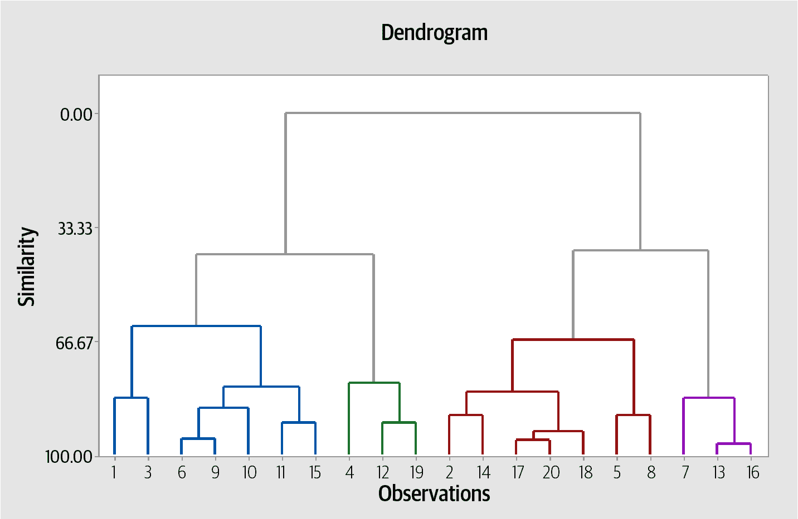

###### 图 8-1\. 分层聚类

### Python 实现

下面的代码片段演示了如何在数据集上应用包含四个聚类的聚合分层聚类：

```py
from sklearn.cluster import AgglomerativeClustering
model = AgglomerativeClustering(n_clusters=4, affinity='euclidean',\
  linkage='ward')
clust_labels1 = model.fit_predict(X)
```

关于凝聚分层聚类的超参数的更多详细信息可以在[sklearn 网站](https://scikit-learn.org)找到。我们将在本章的案例研究 1 和 3 中探讨分层聚类技术。

## 亲和传播聚类

*亲和传播*通过在数据点之间发送消息直到收敛来创建聚类。与*k*-means 等聚类算法不同，亲和传播在运行算法之前不需要确定或估计聚类的数量。亲和传播中使用两个重要参数来确定聚类数量：*偏好*控制使用多少*典范*（或原型）；*阻尼因子*则减弱消息的责任和可用性，以避免更新这些消息时的数值振荡。

一个数据集使用少量样本来描述。这些样本是输入集合的代表性成员。亲和传播算法接受一组数据点之间的成对相似性，并通过最大化数据点与其代表的总相似性来找到聚类。传递的消息表示一个样本成为另一个样本的代表的适合程度，这会根据来自其他对的值进行更新。这种更新是迭代的，直到收敛为止，此时选择最终的代表，并获得最终的聚类。

就优势而言，亲和传播不需要在运行算法之前确定簇的数量。该算法速度快，可以应用于大型相似性矩阵。然而，该算法经常收敛于次优解，并且有时可能无法收敛。

### Python 中的实现

以下代码片段说明了如何为数据集实现亲和传播算法：

```py
from sklearn.cluster import AffinityPropagation
# Initialize the algorithm and set the number of PC's
ap = AffinityPropagation()
ap.fit(X)
```

关于亲和传播聚类的超参数的更多详细信息可以在[sklearn 网站](https://scikit-learn.org)上找到。我们将在本章的案例研究 1 和 2 中看到亲和传播技术。

# 案例研究 1：配对交易的聚类

配对交易策略构建了一个具有类似市场风险因子暴露的相关资产组合。这些资产的临时价格差异可以通过在一种工具中建立多头仓位，同时在另一种工具中建立空头仓位来创造盈利机会。配对交易策略旨在消除市场风险，并利用这些股票相对回报的临时差异。

配对交易的基本前提是*均值回归*是资产的预期动态。这种均值回归应该导致长期均衡关系，我们试图通过统计方法来近似这种关系。当（假定为暂时的）与这种长期趋势背离的时刻出现时，可能会产生利润。成功的配对交易的关键在于选择要使用的正确的资产对。

传统上，配对选择使用试错法。仅仅处于相同部门或行业的股票或工具被分组在一起。这个想法是，如果这些股票属于相似行业的公司，它们的股票也应该以类似的方式移动。然而，这并不一定是事实。此外，对于庞大的股票池，找到一个合适的对是一项困难的任务，因为可能有* n（n-1）/2 *种可能的配对，其中*n*是工具的数量。聚类在这里可能是一个有用的技术。

在这个案例研究中，我们将使用聚类算法为配对交易策略选择股票对。


## 使用聚类选择配对的蓝图

### 1\. 问题定义

在本案例研究中，我们的目标是对 S&P 500 股票进行聚类分析，以制定成对交易策略。从 Yahoo Finance 使用`pandas_datareader`获取了 S&P 500 股票数据。数据包括 2018 年以来的价格数据。

### 2\. 入门—加载数据和 Python 包

数据加载、数据分析、数据准备和模型评估所使用的库列表如下。

#### 2.1\. 加载 Python 包

大多数这些包和函数的详细信息已在第二章和第四章中提供。这些包的使用将在模型开发过程的不同步骤中进行演示。

`用于聚类的包`

```py
from sklearn.cluster import KMeans, AgglomerativeClustering, AffinityPropagation
from scipy.cluster.hierarchy import fcluster
from scipy.cluster.hierarchy import dendrogram, linkage, cophenet
from scipy.spatial.distance import pdist
from sklearn.metrics import adjusted_mutual_info_score
from sklearn import cluster, covariance, manifold
```

`用于数据处理和可视化的包`

```py
# Load libraries
import numpy as np
import pandas as pd
import matplotlib.pyplot as plt
from pandas import read_csv, set_option
from pandas.plotting import scatter_matrix
import seaborn as sns
from sklearn.preprocessing import StandardScaler
import datetime
import pandas_datareader as dr
import matplotlib.ticker as ticker
from itertools import cycle
```

#### 2.2\. 加载数据

下面加载股票数据。¹

```py
dataset = read_csv('SP500Data.csv', index_col=0)
```

### 3\. 探索性数据分析

我们在本节快速查看数据。

#### 3.1\. 描述统计

让我们来看看数据的形状：

```py
# shape
dataset.shape
```

`输出`

```py
(448, 502)
```

数据包含 502 列和 448 个观察值。

#### 3.2\. 数据可视化

我们将详细查看聚类后的可视化。

### 4\. 数据准备

我们在以下几节中为建模准备数据。

#### 4.1\. 数据清理

在这一步中，我们检查行中的 NAs，并且要么删除它们，要么用列的均值填充它们：

```py
#Checking for any null values and removing the null values'''
print('Null Values =',dataset.isnull().values.any())
```

`输出`

```py
Null Values = True
```

让我们去除超过 30%缺失值的列：

```py
missing_fractions = dataset.isnull().mean().sort_values(ascending=False)
missing_fractions.head(10)
drop_list = sorted(list(missing_fractions[missing_fractions > 0.3].index))
dataset.drop(labels=drop_list, axis=1, inplace=True)
dataset.shape
```

`输出`

```py
(448, 498)
```

鉴于存在空值，我们删除了一些行：

```py
# Fill the missing values with the last value available in the dataset.
dataset=dataset.fillna(method='ffill')
```

数据清洗步骤识别出具有缺失值的数据，并对其进行了填充。此步骤对于创建一个有意义、可靠且清洁的数据集至关重要，该数据集可以在聚类中无误地使用。

#### 4.2\. 数据转换

为了进行聚类分析，我们将使用*年度回报*和*方差*作为变量，因为它们是股票表现和波动性的主要指标。以下代码准备这些变量：

```py
#Calculate average annual percentage return and volatilities
returns = pd.DataFrame(dataset.pct_change().mean() * 252)
returns.columns = ['Returns']
returns['Volatility'] = dataset.pct_change().std() * np.sqrt(252)
data = returns
```

在应用聚类之前，所有变量应处于相同的尺度上；否则，具有较大值的特征将主导结果。我们使用 sklearn 中的`StandardScaler`将数据集特征标准化为单位尺度（均值=0，方差=1）：

```py
from sklearn.preprocessing import StandardScaler
scaler = StandardScaler().fit(data)
rescaledDataset = pd.DataFrame(scaler.fit_transform(data),\
  columns = data.columns, index = data.index)
# summarize transformed data
rescaledDataset.head(2)
```

`输出`

|  | 返回 | 波动性 |
| --- | --- | --- |
| ABT | 0.794067 –0.702741 | ABBV |

准备好数据后，我们现在可以探索聚类算法。

### 5\. 评估算法和模型

我们将查看以下模型：

+   *k*-均值

+   分层聚类（凝聚聚类）

+   亲和传播

#### 5.1\. *k*-均值聚类

在这里，我们使用*k*-均值建模，并评估两种方法来找到最优聚类数。

#### 5.1.1\. 寻找最优聚类数

我们知道*k*-均值最初将数据点随机分配到集群中，然后计算质心或均值。此外，它计算每个集群内的距离，对这些距离进行平方，并将它们求和以得到平方误差和。

基本思想是定义*k*个聚类，以使总的聚类内变异（或误差）最小化。以下两种方法有助于找到*k*-means 中的聚类数：

肘方法

基于聚类内的平方误差（SSE）

轮廓方法

基于轮廓分数

首先，让我们来看看肘方法。每个点的 SSE 是该点与其表示（即其预测聚类中心）之间距离的平方。对于一系列聚类数的值，绘制平方误差和。第一个聚类将添加大量信息（解释大量方差），但最终边际增益会下降，在图表中形成一个角度。在这一点选择聚类数；因此被称为“肘准则”。

让我们使用 sklearn 库在 Python 中实现这一点，并绘制一系列值对于*k*的 SSE：

```py
distortions = []
max_loop=20
for k in range(2, max_loop):
    kmeans = KMeans(n_clusters=k)
    kmeans.fit(X)
    distortions.append(kmeans.inertia_)
fig = plt.figure(figsize=(15, 5))
plt.plot(range(2, max_loop), distortions)
plt.xticks([i for i in range(2, max_loop)], rotation=75)
plt.grid(True)
```

`Output`

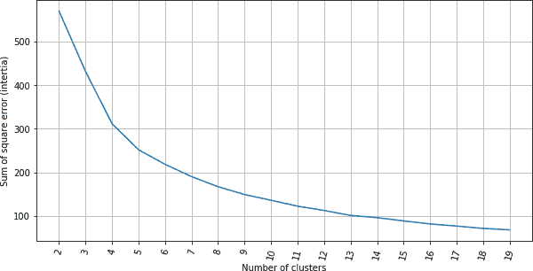

检查聚类内平方误差图表，数据显示肘部拐点大约在五或六个聚类处。当聚类数超过六个时，我们可以看到聚类内的 SSE 开始趋于平稳。

现在让我们看看轮廓方法。轮廓分数衡量一个点与其所属聚类的相似程度（*内聚性*）与其他聚类的相似程度（*分离性*）。轮廓值的范围在 1 到-1 之间。高值是理想的，表示该点正确地放置在其聚类中。如果许多点具有负轮廓值，则可能表明我们创建了过多或过少的聚类。

让我们使用 sklearn 库在 Python 中实现这一点，并绘制一系列值对于*k*的轮廓分数：

```py
from sklearn import metrics

silhouette_score = []
for k in range(2, max_loop):
        kmeans = KMeans(n_clusters=k,  random_state=10, n_init=10, n_jobs=-1)
        kmeans.fit(X)
        silhouette_score.append(metrics.silhouette_score(X, kmeans.labels_, \
          random_state=10))
fig = plt.figure(figsize=(15, 5))
plt.plot(range(2, max_loop), silhouette_score)
plt.xticks([i for i in range(2, max_loop)], rotation=75)
plt.grid(True)
```

`Output`

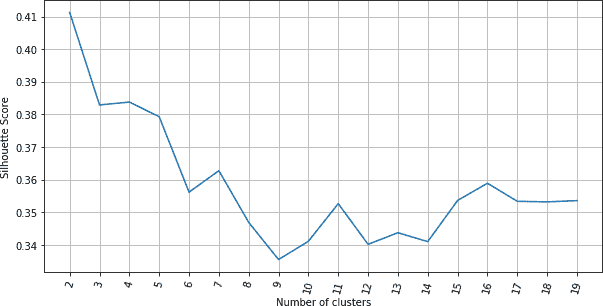

查看轮廓分数图表，我们可以看到图表中的各个部分都能看到一个拐点。由于在六个聚类之后 SSE 没有太大的差异，这意味着在这个*k*-means 模型中六个聚类是首选选择。

结合两种方法的信息，我们推断出最优的聚类数为六。

#### 5.1.2\. 聚类和可视化

让我们建立六个聚类的*k*-means 模型并可视化结果：

```py
nclust=6
#Fit with k-means
k_means = cluster.KMeans(n_clusters=nclust)
k_means.fit(X)
#Extracting labels
target_labels = k_means.predict(X)
```

当数据集中的变量数量非常大时，要想可视化聚类形成是一项不易的任务。基本散点图是在二维空间中可视化聚类的一种方法。我们在下面创建一个来识别数据中固有的关系：

```py
centroids = k_means.cluster_centers_
fig = plt.figure(figsize=(16,10))
ax = fig.add_subplot(111)
scatter = ax.scatter(X.iloc[:,0],X.iloc[:,1], c=k_means.labels_, \
  cmap="rainbow", label = X.index)
ax.set_title('k-means results')
ax.set_xlabel('Mean Return')
ax.set_ylabel('Volatility')
plt.colorbar(scatter)

plt.plot(centroids[:,0],centroids[:,1],'sg',markersize=11)
```

`Output`

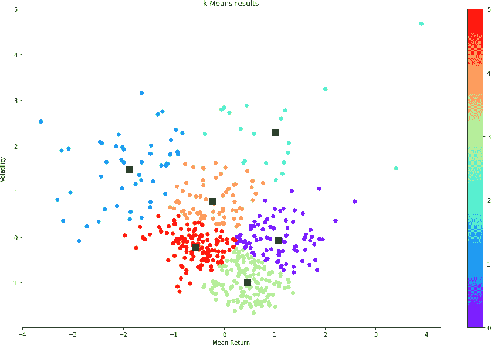

在前面的图中，我们可以看到不同颜色分开的明显聚类（全彩版可在[GitHub](https://oreil.ly/8RvSp)上找到）。图中的数据分组似乎分离得很好。聚类中心也有一定程度的分离，用方形点表示。

让我们看看每个聚类中的股票数量：

```py
# show number of stocks in each cluster
clustered_series = pd.Series(index=X.index, data=k_means.labels_.flatten())
# clustered stock with its cluster label
clustered_series_all = pd.Series(index=X.index, data=k_means.labels_.flatten())
clustered_series = clustered_series[clustered_series != -1]

plt.figure(figsize=(12,7))
plt.barh(
    range(len(clustered_series.value_counts())), # cluster labels, y axis
    clustered_series.value_counts()
)
plt.title('Cluster Member Counts')
plt.xlabel('Stocks in Cluster')
plt.ylabel('Cluster Number')
plt.show()
```

`Output`

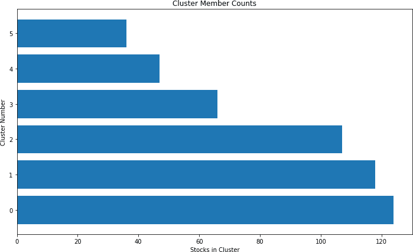

每个聚类中的股票数量大约在 40 到 120 之间。虽然分布不均匀，但每个聚类中都有相当数量的股票。

让我们来看看层次聚类。

#### 5.2\. 层次聚类（凝聚聚类）

在第一步中，我们查看层次图，并检查聚类的数量。

#### 5.2.1\. 构建层次图/树状图

层次类具有一个树状图方法，该方法接受同一类的*linkage 方法*返回的值。linkage 方法接受数据集和最小化距离的方法作为参数。我们使用*ward*作为方法，因为它最小化了集群之间距离的方差：

```py
from scipy.cluster.hierarchy import dendrogram, linkage, ward

#Calculate linkage
Z= linkage(X, method='ward')
Z[0]
```

`Output`

```py
array([3.30000000e+01, 3.14000000e+02, 3.62580431e-03, 2.00000000e+00])
```

最佳可视化凝聚聚类算法的方式是通过树状图，它显示了一个聚类树，叶子是单独的股票，根是最终的单一聚类。每个聚类之间的距离显示在 y 轴上。分支越长，两个聚类之间的相关性越低：

```py
#Plot Dendrogram
plt.figure(figsize=(10, 7))
plt.title("Stocks Dendrograms")
dendrogram(Z,labels = X.index)
plt.show()
```

`Output`

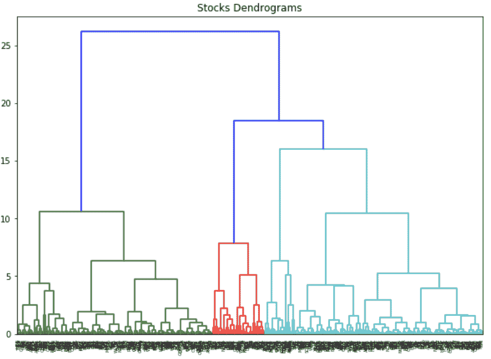

该图表可以用来直观地检查选择的距离阈值会创建多少个聚类（尽管横轴上股票的名称不太清晰，我们可以看到它们被分成了几个聚类）。一条假设的水平直线穿过的垂直线的数量是在该距离阈值下创建的聚类数。例如，在值为 20 时，水平线将穿过树状图的两个垂直分支，暗示该距离阈值下有两个聚类。该分支的所有数据点（叶子）将被标记为该水平线穿过的聚类。

在 13 的阈值处切割选择会产生四个聚类，如下 Python 代码所确认：

```py
distance_threshold = 13
clusters = fcluster(Z, distance_threshold, criterion='distance')
chosen_clusters = pd.DataFrame(data=clusters, columns=['cluster'])
chosen_clusters['cluster'].unique()
```

`Output`

```py
array([1, 4, 3, 2], dtype=int64)
```

#### 5.2.2\. 聚类和可视化

让我们建立具有四个聚类的层次聚类模型并可视化结果：

```py
nclust = 4
hc = AgglomerativeClustering(n_clusters=nclust, affinity='euclidean', \
linkage='ward')
clust_labels1 = hc.fit_predict(X)
```

```py
fig = plt.figure(figsize=(16,10))
ax = fig.add_subplot(111)
scatter = ax.scatter(X.iloc[:,0],X.iloc[:,1], c=clust_labels1, cmap="rainbow")
ax.set_title('Hierarchical Clustering')
ax.set_xlabel('Mean Return')
ax.set_ylabel('Volatility')
plt.colorbar(scatter)
```

类似于*k*-均值聚类的图表，我们看到有一些不同颜色分离的明显聚类（完整版本可在[GitHub](https://oreil.ly/8RvSp)上找到）。

`Output`

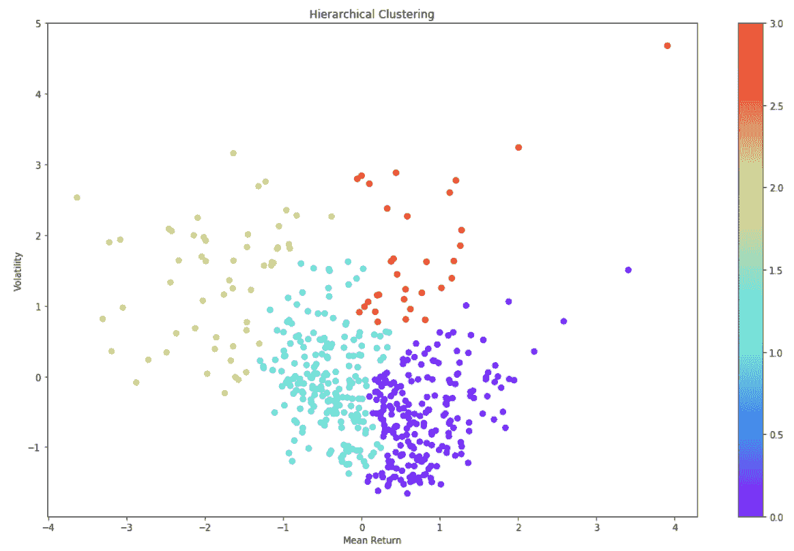

现在让我们来看看亲和传播聚类。

#### 5.3\. 亲和传播

让我们建立亲和传播模型并可视化结果：

```py
ap = AffinityPropagation()
ap.fit(X)
clust_labels2 = ap.predict(X)

fig = plt.figure(figsize=(10,8))
ax = fig.add_subplot(111)
scatter = ax.scatter(X.iloc[:,0],X.iloc[:,1], c=clust_labels2, cmap="rainbow")
ax.set_title('Affinity')
ax.set_xlabel('Mean Return')
ax.set_ylabel('Volatility')
plt.colorbar(scatter)
```

`Output`

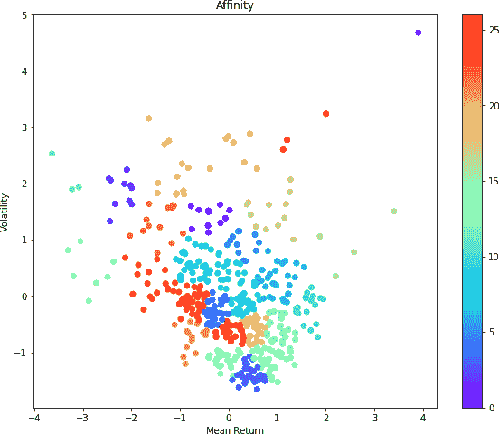

选择了的亲和传播模型与*k*-均值和层次聚类相比产生了更多的聚类。虽然有一些明显的分组，但由于聚类数量较多，也存在更多的重叠（完整版本可在[GitHub](https://oreil.ly/8RvSp)上找到）。在下一步中，我们将评估聚类技术。

#### 5.4\. 聚类评估

如果不知道真实标签，则必须使用模型本身进行评估。轮廓系数（`sklearn.metrics.silhouette_score`）就是一个可以使用的例子。较高的轮廓系数分数意味着具有更好定义的群集的模型。轮廓系数计算针对上述每种定义的聚类方法：

```py
from sklearn import metrics
print("km", metrics.silhouette_score(X, k_means.labels_, metric='euclidean'))
print("hc", metrics.silhouette_score(X, hc.fit_predict(X), metric='euclidean'))
print("ap", metrics.silhouette_score(X, ap.labels_, metric='euclidean'))
```

`输出`

```py
km 0.3350720873411941
hc 0.3432149515640865
ap 0.3450647315156527
```

鉴于亲和传播效果最佳，我们继续使用亲和传播，并按照此聚类方法指定的 27 个群集。

#### 在群集内部可视化回报

我们已经确定了聚类技术和群集数量，但需要检查聚类是否导致合理的输出。为了做到这一点，我们可视化几个群集中股票的历史行为：

```py
# all stock with its cluster label (including -1)
clustered_series = pd.Series(index=X.index, data=ap.fit_predict(X).flatten())
# clustered stock with its cluster label
clustered_series_all = pd.Series(index=X.index, data=ap.fit_predict(X).flatten())
clustered_series = clustered_series[clustered_series != -1]
# get the number of stocks in each cluster
counts = clustered_series_ap.value_counts()
# let's visualize some clusters
cluster_vis_list = list(counts[(counts<25) & (counts>1)].index)[::-1]
cluster_vis_list
# plot a handful of the smallest clusters
plt.figure(figsize=(12, 7))
cluster_vis_list[0:min(len(cluster_vis_list), 4)]

for clust in cluster_vis_list[0:min(len(cluster_vis_list), 4)]:
    tickers = list(clustered_series[clustered_series==clust].index)
    # calculate the return (lognormal) of the stocks
    means = np.log(dataset.loc[:"2018-02-01", tickers].mean())
    data = np.log(dataset.loc[:"2018-02-01", tickers]).sub(means)
    data.plot(title='Stock Time Series for Cluster %d' % clust)
plt.show()
```

`输出`

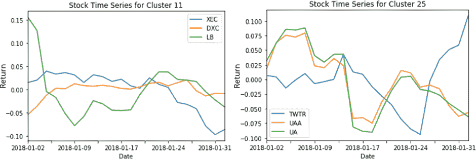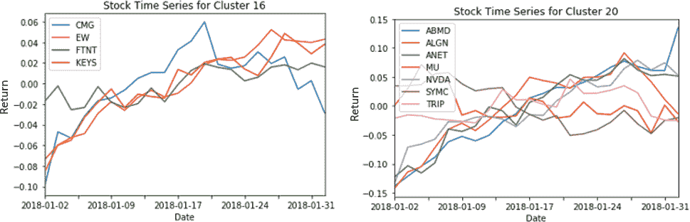

查看上述图表，跨所有具有少量股票的群集，我们看到不同群集下的股票出现相似的运动，这证实了聚类技术的有效性。

### 6\. 配对选择

创建群集后，可以在群集内的股票上应用几种基于协整性的统计技术来创建配对。如果两个或更多时间序列是协整的，那么它们是非平稳的并且倾向于共同移动。² 通过几种统计技术，包括[增广迪基-富勒检验](https://oreil.ly/5xKZy)和[Johansen 检验](https://oreil.ly/9zbnC)，可以验证时间序列之间的协整性。

在这一步中，我们扫描一个群集内的证券列表，并测试配对之间的协整性。首先，我们编写一个返回协整测试分数矩阵、p 值矩阵以及 p 值小于 0.05 的任何配对的函数。

#### 协整性和配对选择功能

```py
def find_cointegrated_pairs(data, significance=0.05):
    # This function is from https://www.quantopian.com
    n = data.shape[1]
    score_matrix = np.zeros((n, n))
    pvalue_matrix = np.ones((n, n))
    keys = data.keys()
    pairs = []
    for i in range(1):
        for j in range(i+1, n):
            S1 = data[keys[i]]
            S2 = data[keys[j]]
            result = coint(S1, S2)
            score = result[0]
            pvalue = result[1]
            score_matrix[i, j] = score
            pvalue_matrix[i, j] = pvalue
            if pvalue < significance:
                pairs.append((keys[i], keys[j]))
    return score_matrix, pvalue_matrix, pairs
```

接下来，我们使用上述创建的函数检查几个群集内不同配对的协整性，并返回找到的配对。

```py
from statsmodels.tsa.stattools import coint
cluster_dict = {}
for i, which_clust in enumerate(ticker_count_reduced.index):
    tickers = clustered_series[clustered_series == which_clust].index
    score_matrix, pvalue_matrix, pairs = find_cointegrated_pairs(
        dataset[tickers]
    )
    cluster_dict[which_clust] = {}
    cluster_dict[which_clust]['score_matrix'] = score_matrix
    cluster_dict[which_clust]['pvalue_matrix'] = pvalue_matrix
    cluster_dict[which_clust]['pairs'] = pairs

pairs = []
for clust in cluster_dict.keys():
    pairs.extend(cluster_dict[clust]['pairs'])

print ("Number of pairs found : %d" % len(pairs))
print ("In those pairs, there are %d unique tickers." % len(np.unique(pairs)))
```

`输出`

```py
Number of pairs found : 32
In those pairs, there are 47 unique tickers.
```

现在让我们可视化配对选择过程的结果。有关使用 t-SNE 技术进行配对可视化的步骤的详细信息，请参考本案例研究的 Jupyter 笔记本。

以下图表显示了*k*-means 在寻找非传统配对方面的强度（在可视化中用箭头指出）。DXC 是 DXC Technology 的股票代码，XEC 是 Cimarex Energy 的股票代码。这两只股票来自不同的行业，在表面上看似乎没有共同点，但使用*k*-means 聚类和协整测试识别为配对。这意味着它们的股票价格走势之间存在长期稳定的关系。

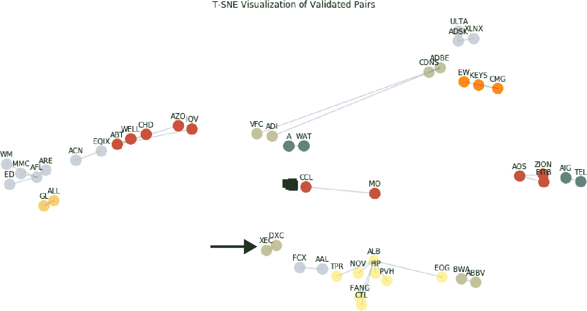

一旦形成股票对，它们可以用于成对交易策略。当这对股票的股价偏离确定的长期关系时，投资者将寻求在表现不佳的证券上建立多头头寸，并空头卖出表现良好的证券。如果证券的价格重新回到其历史关系，投资者将从价格的收敛中获利。

### 结论

在这个案例研究中，我们展示了聚类技术的效率，通过找到可以用于成对交易策略的股票小池。超越这个案例研究的下一步将是探索和回测来自股票组合中的股票对的各种多空交易策略。

聚类可以用于将股票和其他类型的资产分成具有相似特征的组，以支持多种类型的交易策略。它在投资组合构建中也非常有效，有助于确保我们选择的资产池具有足够的分散化。


# 案例研究 2：投资组合管理：聚类投资者

资产管理和投资配置是一个繁琐且耗时的过程，在这个过程中，投资经理通常必须为每个客户或投资者设计定制化的方法。

如果我们能将这些客户组织成特定的投资者档案或集群，其中每个群体都代表具有类似特征的投资者，那该有多好？

根据类似特征对投资者进行聚类可以简化和标准化投资管理流程。这些算法可以根据年龄、收入和风险承受能力等不同因素将投资者分组。它可以帮助投资经理识别其投资者群体中的不同群体。此外，通过使用这些技术，经理们可以避免引入可能会对决策产生不利影响的任何偏见。通过聚类分析的因素可以对资产配置和再平衡产生重大影响，使其成为更快速和有效的投资管理工具。

在这个案例研究中，我们将使用聚类方法来识别不同类型的投资者。

本案例研究使用的数据来自美联储委员会进行的消费者金融调查，该数据集还在“案例研究 3：投资者风险承受能力和智能顾问”中使用，该案例研究位于第五章中。


## 使用聚类将投资者分组的蓝图

### 1. 问题定义

本案例研究的目标是构建一个聚类模型，根据与承担风险能力和意愿相关的参数来对个人或投资者进行分组。我们将专注于使用常见的人口统计和财务特征来实现这一目标。

我们使用的调查数据包括 2007 年（危机前）和 2009 年（危机后）超过 10,000 名个体的回答。数据包含 500 多个特征。由于数据变量众多，我们首先减少变量数量，选择直接与投资者承担风险能力相关的最直观特征。

### 2\. 入门—加载数据和 Python 包

#### 2.1\. 加载 Python 包

本案例研究加载的包类似于第五章案例研究中加载的包。然而，与聚类技术相关的一些附加包显示在下面的代码片段中：

```py
#Import packages for clustering techniques
from sklearn.cluster import KMeans, AgglomerativeClustering,AffinityPropagation
from sklearn.metrics import adjusted_mutual_info_score
from sklearn import cluster, covariance, manifold
```

#### 2.2\. 加载数据

数据（同样在第五章中使用过）经进一步处理，得到以下表示个体承担风险能力和意愿的属性。这些预处理数据是 2007 年调查的结果，并且已经加载如下：

```py
# load dataset
dataset = pd.read_excel('ProcessedData.xlsx')
```

### 3\. 探索性数据分析

接下来，我们仔细查看数据中不同的列和特征。

#### 3.1\. 描述性统计

首先，看数据的形状：

```py
dataset.shape
```

`Output`

```py
(3866, 13)
```

数据包含 3,886 个个体的信息，分布在 13 列中：

```py
# peek at data
set_option('display.width', 100)
dataset.head(5)
```

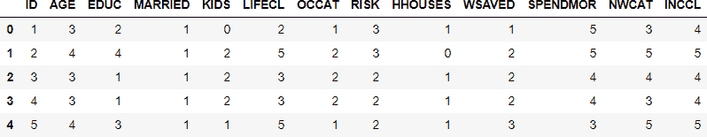

正如我们在上表中看到的，每个个体有 12 个属性。这些属性可以归类为人口统计、财务和行为属性。它们在图 8-2 中总结。

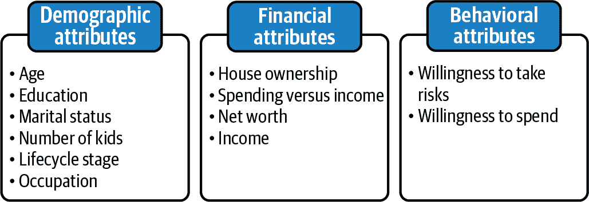

###### 图 8-2\. 用于对个体进行聚类的属性

这些大多数曾在第五章案例研究中使用并定义。在本案例研究中使用并定义了一些额外属性（LIFECYCL、HHOUSES 和 SPENDMOR）：

LIFECYCL

这是一个生命周期变量，用于近似一个人承担风险的能力。有六个类别，逐渐增加承担风险的能力。数值 1 代表“年龄小于 55 岁，未婚，无子女”，数值 6 代表“年龄超过 55 岁且不再工作”。

HHOUSES

这是一个指示个体是否拥有房屋的标志。数值 1（0）表示个体拥有（不拥有）房屋。

SPENDMOR

如果资产增值的话，这表示更高的消费偏好，取值范围为 1 到 5。

#### 3.2\. 数据可视化

我们将详细查看聚类后的可视化。

### 4\. 数据准备

在这里，我们对数据进行必要的变更，为建模做准备。

#### 4.1\. 数据清理

在这一步中，我们检查行中是否存在 NA 值，然后删除或用列的平均值填充。

```py
print('Null Values =', dataset.isnull().values.any())
```

`Output`

```py
Null Values = False
```

鉴于没有任何缺失数据，并且数据已经是分类格式，无需进一步的数据清理。*ID*列是不必要的，已经被删除：

```py
X=X.drop(['ID'], axis=1)
```

#### 4.2\. 数据转换

正如我们在第 3.1 节中看到的，所有列都代表具有相似数值范围的分类数据，没有异常值。因此，在进行聚类时不需要数据转换。

### 5\. 评估算法和模型

我们将分析 *k*-均值和亲和传播的性能。

#### 5.1\. k-均值聚类

我们在这一步看一下 *k*-均值聚类的细节。首先，我们找到最佳的聚类数，然后创建一个模型。

#### 5.1.1\. 寻找最佳聚类数

我们看以下两个指标来评估 *k*-均值模型中的聚类数。获取这两个指标的 Python 代码与案例研究 1 中的代码相同：

1.  簇内平方和误差（SSE）

1.  轮廓分数

`簇内平方和误差（SSE）`

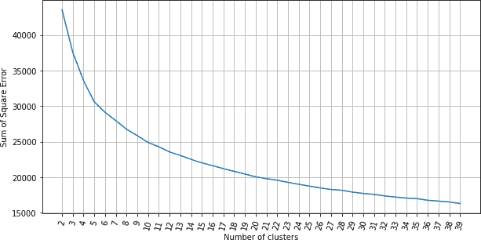

`轮廓分数`


通过观察前面两张图表，最佳聚类数似乎在 7 左右。我们可以看到，当聚类数超过 6 时，簇内 SSE 开始趋于平稳。从第二张图中可以看出，图表的各个部分都有一个转折点。由于超过 7 个聚类后 SSE 的差异不大，我们决定在下面的 *k*-均值模型中使用 7 个聚类。

#### 5.1.2\. 聚类和可视化

让我们创建一个包含 7 个聚类的 *k*-均值模型：

```py
nclust=7

#Fit with k-means
k_means = cluster.KMeans(n_clusters=nclust)
k_means.fit(X)
```

让我们为数据集中的每个个体分配一个目标聚类。此分配进一步用于探索性数据分析，以了解每个聚类的行为：

```py
#Extracting labels
target_labels = k_means.predict(X)
```

#### 5.2\. 亲和传播

在这里，我们建立了一个亲和传播模型，并观察了聚类的数量：

```py
ap = AffinityPropagation()
ap.fit(X)
clust_labels2 = ap.predict(X)

cluster_centers_indices = ap.cluster_centers_indices_
labels = ap.labels_
n_clusters_ = len(cluster_centers_indices)
print('Estimated number of clusters: %d' % n_clusters_)
```

`输出`

```py
Estimated number of clusters: 161
```

亲和传播结果超过 150 个聚类。这么多聚类可能会导致很难区分它们之间的差异。

#### 5.3\. 聚类评估

在这一步中，我们使用轮廓系数（*sklearn.metrics.silhouette_score*）检查聚类的性能。请记住，较高的轮廓系数分数与定义更好的聚类模型相关：

```py
from sklearn import metrics
print("km", metrics.silhouette_score(X, k_means.labels_))
print("ap", metrics.silhouette_score(X, ap.labels_))
```

`输出`

```py
km 0.170585217843582
ap 0.09736878398868973
```

*k*-均值模型的轮廓系数比亲和传播高得多。此外，亲和传播产生的大量聚类是不可持续的。在手头问题的背景下，拥有更少的聚类或投资者类型分类有助于在投资管理流程中建立简单性和标准化。这为信息的使用者（例如财务顾问）提供了一些管理投资者类型的直觉。理解和能够描述六到八种投资者类型要比理解和维护超过 100 种不同配置的意义更为实际。考虑到这一点，我们决定将 *k*-均值作为首选的聚类技术。

### 6\. 聚类直觉

接下来，我们将分析这些簇，并试图从中得出结论。我们通过绘制每个簇的变量平均值并总结结果来进行分析：

```py
cluster_output= pd.concat([pd.DataFrame(X),  pd.DataFrame(k_means.labels_, \
  columns = ['cluster'])],axis=1)
output=cluster_output.groupby('cluster').mean()
```

`人口统计特征：每个簇的绘图`

```py
output[['AGE','EDUC','MARRIED','KIDS','LIFECL','OCCAT']].\
plot.bar(rot=0, figsize=(18,5));
```

`输出`

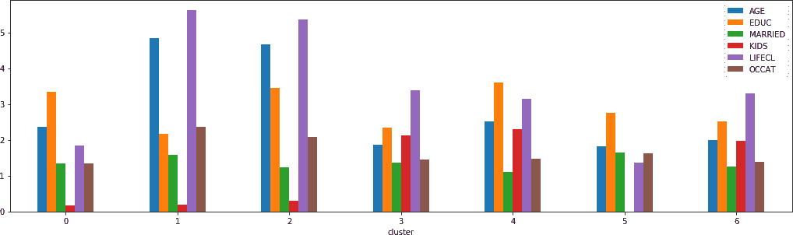

这里的图显示了每个簇的属性平均值（完整版本请参见[GitHub](https://oreil.ly/61d9_)）。例如，在比较簇 0 和 1 时，簇 0 的平均年龄较低，但平均受教育程度较高。然而，这两个簇在婚姻状况和子女数量上更为相似。因此，基于人口统计属性，簇 0 中的个体平均而言比簇 1 中的个体更具有较高的风险承受能力。

`财务和行为属性：每个簇的绘图`

```py
output[['HHOUSES','NWCAT','INCCL','WSAVED','SPENDMOR','RISK']].\
plot.bar(rot=0, figsize=(18,5));
```

`输出`

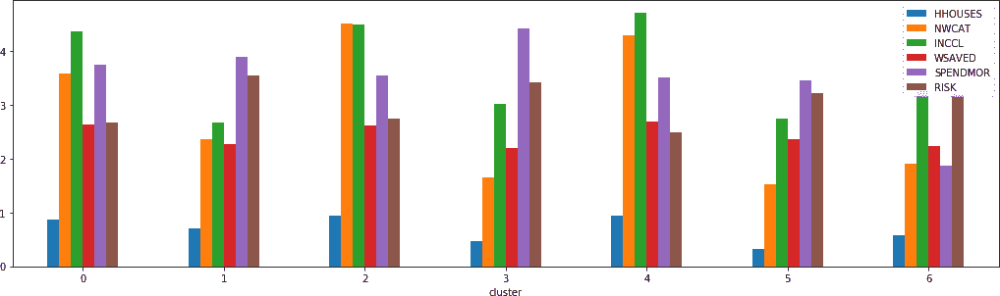

这里的图显示了每个簇的财务和行为属性的平均值（完整版本请参见[GitHub](https://oreil.ly/61d9_)）。再次比较簇 0 和 1，前者具有更高的平均房屋所有权，更高的平均净资产和收入，以及较低的风险承受意愿。在储蓄与收入比较和愿意储蓄方面，这两个簇是可比较的。因此，我们可以推断，与簇 1 中的个体相比，簇 0 中的个体平均而言具有更高的能力，但更低的风险承受意愿。

结合这两个簇的人口统计、财务和行为属性信息，簇 0 中个体的整体风险承受能力高于簇 1 中的个体。在所有其他簇中执行类似的分析后，我们在下表中总结结果。风险承受能力列代表了每个簇风险承受能力的主观评估。

| 簇 | 特征 | 风险能力 |
| --- | --- | --- |
| 簇 0 | 年龄低，净资产和收入高，生活风险类别较低，愿意更多消费 | 高 |
| 簇 1 | 年龄高，净资产和收入低，生活风险类别高，风险承受意愿高，教育水平低 | 低 |
| 簇 2 | 年龄高，净资产和收入高，生活风险类别高，风险承受意愿高，拥有住房 | 中等 |
| 簇 3 | 年龄低，收入和净资产非常低，风险承受意愿高，有多个孩子 | 低 |
| 簇 4 | 年龄中等，收入和净资产非常高，风险承受意愿高，有多个孩子，拥有住房 | 高 |
| 簇 5 | 年龄低，收入和净资产非常低，风险承受意愿高，无子女 | 中等 |
| 簇 6 | 年龄低，收入和净资产中等，风险承受意愿高，有多个孩子，拥有住房 | 低 |

### 结论

这个案例研究的一个关键要点是理解集群直觉的方法。我们使用可视化技术通过定性解释每个集群中变量的平均值来理解集群成员的预期行为。我们展示了通过风险承受能力将不同投资者的自然群体发现在一起的聚类的效率。

给定聚类算法能够成功根据不同因素（如年龄、收入和风险承受能力）对投资者进行分组，它们可以进一步被投资组合经理用于跨集群标准化投资组合分配和再平衡策略，从而使投资管理过程更快速、更有效。


# 案例研究 3：层次风险平价

马科维茨的*均值-方差组合优化*是投资组合构建和资产配置中最常用的技术。在这种技术中，我们需要估计用作输入的资产的协方差矩阵和预期收益。正如在“案例研究 1：投资组合管理：找到一种特征投资组合” 中所讨论的，金融回报的不稳定性导致了预期收益和协方差矩阵的估计误差，特别是当资产数量远大于样本量时。这些错误极大地危及了最终投资组合的最优性，导致错误和不稳定的结果。此外，假定的资产收益、波动率或协方差的微小变化可能对优化过程的输出产生很大影响。从这个意义上讲，马科维茨的均值-方差优化是一个病态（或病态）的逆问题。

在[“构建在样本外表现优异的多样化投资组合”](https://oreil.ly/2BmW5) 中，马科斯·洛佩斯·德·普拉多（2016）提出了一种基于聚类的投资组合分配方法，称为*层次风险平价*。层次风险平价的主要思想是在股票回报的协方差矩阵上运行层次聚类，然后通过将资金平均分配给每个集群层次来找到分散的权重（这样许多相关策略将获得与单个不相关策略相同的总分配）。这减轻了马科维茨的均值-方差优化中发现的一些问题（上面突出显示）并提高了数值稳定性。

在这个案例研究中，我们将基于聚类方法实施层次风险平价，并将其与马科维茨的均值-方差优化方法进行比较。

用于本案例研究的数据集是从 2018 年开始的标准普尔 500 指数股票的价格数据。该数据集可以从 Yahoo Finance 下载。这是与案例研究 1 中使用的相同数据集。


## 使用聚类实施层次风险平价的蓝图

### 1. 问题定义

本案例研究的目标是使用基于聚类的算法对股票数据集进行资本分配到不同资产类别。为了对投资组合分配进行回测和与传统的 Markowitz 均值-方差优化进行比较，我们将进行可视化，并使用性能指标，如夏普比率。

### 2\. 入门—加载数据和 Python 包

#### 2.1\. 加载 Python 包

本案例研究加载的包与上一案例研究中加载的包类似。然而，下面的代码片段显示了一些与聚类技术相关的额外包：

```py
#Import Model Packages
import scipy.cluster.hierarchy as sch
from sklearn.cluster import AgglomerativeClustering
from scipy.cluster.hierarchy import fcluster
from scipy.cluster.hierarchy import dendrogram, linkage, cophenet
from sklearn.metrics import adjusted_mutual_info_score
from sklearn import cluster, covariance, manifold
import ffn

#Package for optimization of mean variance optimization
import cvxopt as opt
from cvxopt import blas, solvers
```

由于本案例研究使用与案例研究 1 相同的数据，因此已跳过某些接下来的步骤（即加载数据），以避免重复。作为提醒，数据包含约 500 只股票和 448 个观察值。

### 3\. 探索性数据分析

我们稍后将详细查看聚类后的可视化。

### 4\. 数据准备

#### 4.1\. 数据清洗

参考案例研究 1 进行数据清洗步骤。

#### 4.2\. 数据转换

我们将使用年收益率进行聚类。此外，我们将训练数据和测试数据。在这里，我们通过将数据集的 20%分开以进行测试，并生成收益率序列来为训练和测试准备数据集：

```py
X= dataset.copy('deep')
row= len(X)
train_len = int(row*.8)

X_train = X.head(train_len)
X_test = X.tail(row-train_len)

#Calculate percentage return
returns = X_train.to_returns().dropna()
returns_test=X_test.to_returns().dropna()
```

### 5\. 评估算法和模型

在这一步中，我们将研究层次聚类并进行进一步的分析和可视化。

#### 5.1\. 构建层次图/树状图

第一步是使用凝聚层次聚类技术寻找相关性的群集。层次类具有树状图方法，该方法采用同一类的链接方法返回的值作为参数。链接方法采用数据集和最小化距离的方法作为参数。有不同的选项用于测量距离。我们将选择的选项是 ward，因为它最小化了群集之间的距离的方差。其他可能的距离度量包括单一和质心。

链接在一行代码中执行实际的聚类并以以下格式返回群集的列表：

```py
Z= [stock_1, stock_2, distance, sample_count]
```

作为前提，我们定义一个函数将相关性转换为距离：

```py
def correlDist(corr):
    # A distance matrix based on correlation, where 0<=d[i,j]<=1
    # This is a proper distance metric
    dist = ((1 - corr) / 2.) ** .5  # distance matrix
    return dist
```

现在我们将股票收益的相关性转换为距离，然后计算以下步骤中的链接。链接计算后通过树状图的可视化来展示群集。再次，叶子是单个股票，根是最终的单一群集。在 y 轴上显示每个群集之间的距离；分支越长，两个群集之间的相关性越低。

```py
#Calculate linkage
dist = correlDist(returns.corr())
link = linkage(dist, 'ward')

#Plot Dendrogram
plt.figure(figsize=(20, 7))
plt.title("Dendrograms")
dendrogram(link,labels = X.columns)
plt.show()
```

在下面的图表中，横轴表示簇。尽管横轴上股票的名称不太清晰（考虑到有 500 只股票，这并不奇怪），但我们可以看到它们被分成了几个簇。合适的簇数似乎是 2、3 或 6，具体取决于所需的距离阈值级别。接下来，我们将利用从这一步骤计算出的链接来计算基于层次风险平价的资产配置。

`输出`

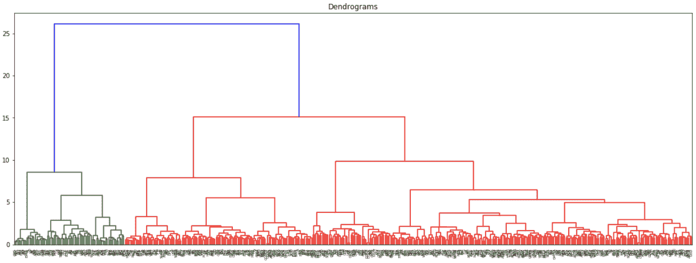

#### 5.2\. 层次风险平价的步骤

层次风险平价（HRP）算法按照 Prado 的论文概述的三个阶段运行： 

树形聚类

根据它们的相关矩阵将相似的投资分组成簇。具有层次结构有助于我们在反转协方差矩阵时改善二次优化器的稳定性问题。

拟对角化

重新组织协方差矩阵，以便将相似的投资放在一起。该矩阵对角化使我们能够根据反方差分配优化地分配权重。

递归二分法

通过基于簇协方差的递归二分法分配配置。

在前一节中进行了第一阶段，我们基于距离度量确定了簇，现在我们进行拟对角化。

#### 5.2.1\. 拟对角化

拟对角化是一个被称为*矩阵序列化*的过程，它重新组织协方差矩阵的行和列，使得最大值位于对角线上。如下所示，该过程重新组织协方差矩阵，使得相似的投资被放在一起。该矩阵对角化允许我们根据反方差分配优化地分配权重：

```py
def getQuasiDiag(link):
    # Sort clustered items by distance
    link = link.astype(int)
    sortIx = pd.Series([link[-1, 0], link[-1, 1]])
    numItems = link[-1, 3]  # number of original items
    while sortIx.max() >= numItems:
        sortIx.index = range(0, sortIx.shape[0] * 2, 2)  # make space
        df0 = sortIx[sortIx >= numItems]  # find clusters
        i = df0.index
        j = df0.values - numItems
        sortIx[i] = link[j, 0]  # item 1
        df0 = pd.Series(link[j, 1], index=i + 1)
        sortIx = sortIx.append(df0)  # item 2
        sortIx = sortIx.sort_index()  # re-sort
        sortIx.index = range(sortIx.shape[0])  # re-index
    return sortIx.tolist()
```

#### 5.2.2\. 递归二分法

在下一步中，我们执行递归二分法，这是一种基于聚合方差的反比例拆分投资组合权重的自上而下方法。函数 `getClusterVar` 计算簇方差，在这个过程中，它需要来自函数 `getIVP` 的反方差组合。函数 `getClusterVar` 的输出由函数 `getRecBipart` 使用，根据簇协方差计算最终的分配：

```py
def getIVP(cov, **kargs):
# Compute the inverse-variance portfolio
ivp = 1. / np.diag(cov)
ivp /= ivp.sum()
return ivp

def getClusterVar(cov,cItems):
    # Compute variance per cluster
    cov_=cov.loc[cItems,cItems] # matrix slice
    w_=getIVP(cov_).reshape(-1, 1)
    cVar=np.dot(np.dot(w_.T,cov_),w_)[0, 0]
    return cVar

def getRecBipart(cov, sortIx):
    # Compute HRP alloc
    w = pd.Series(1, index=sortIx)
    cItems = [sortIx]  # initialize all items in one cluster
    while len(cItems) > 0:
        cItems = [i[j:k] for i in cItems for j, k in ((0,\
           len(i) // 2), (len(i) // 2, len(i))) if len(i) > 1]  # bi-section
        for i in range(0, len(cItems), 2):  # parse in pairs
            cItems0 = cItems[i]  # cluster 1
            cItems1 = cItems[i + 1]  # cluster 2
            cVar0 = getClusterVar(cov, cItems0)
            cVar1 = getClusterVar(cov, cItems1)
            alpha = 1 - cVar0 / (cVar0 + cVar1)
            w[cItems0] *= alpha  # weight 1
            w[cItems1] *= 1 - alpha  # weight 2
    return w
```

下面的函数 `getHRP` 结合了三个阶段——聚类、拟对角化和递归二分法——以生成最终的权重：

```py
def getHRP(cov, corr):
    # Construct a hierarchical portfolio
    dist = correlDist(corr)
    link = sch.linkage(dist, 'single')
    #plt.figure(figsize=(20, 10))
    #dn = sch.dendrogram(link, labels=cov.index.values)
    #plt.show()
    sortIx = getQuasiDiag(link)
    sortIx = corr.index[sortIx].tolist()
    hrp = getRecBipart(cov, sortIx)
    return hrp.sort_index()
```

#### 5.3\. 与其他资产配置方法的比较

本案例研究的一个主要焦点是开发一种利用聚类代替马科维茨均值方差组合优化的方法。在这一步骤中，我们定义一个函数来计算基于马科维茨均值方差技术的投资组合配置。该函数 (`getMVP`) 接受资产的协方差矩阵作为输入，执行均值方差优化，并产生投资组合配置：

```py
def getMVP(cov):
    cov = cov.T.values
    n = len(cov)
    N = 100
    mus = [10 ** (5.0 * t / N - 1.0) for t in range(N)]

    # Convert to cvxopt matrices
    S = opt.matrix(cov)
    #pbar = opt.matrix(np.mean(returns, axis=1))
    pbar = opt.matrix(np.ones(cov.shape[0]))

    # Create constraint matrices
    G = -opt.matrix(np.eye(n))  # negative n x n identity matrix
    h = opt.matrix(0.0, (n, 1))
    A = opt.matrix(1.0, (1, n))
    b = opt.matrix(1.0)

    # Calculate efficient frontier weights using quadratic programming
    solvers.options['show_progress'] = False
    portfolios = [solvers.qp(mu * S, -pbar, G, h, A, b)['x']
                  for mu in mus]
    ## Calculate risk and return of the frontier
    returns = [blas.dot(pbar, x) for x in portfolios]
    risks = [np.sqrt(blas.dot(x, S * x)) for x in portfolios]
    ## Calculate the 2nd degree polynomial of the frontier curve.
    m1 = np.polyfit(returns, risks, 2)
    x1 = np.sqrt(m1[2] / m1[0])
    # CALCULATE THE OPTIMAL PORTFOLIO
    wt = solvers.qp(opt.matrix(x1 * S), -pbar, G, h, A, b)['x']

    return list(wt)
```

#### 5.4\. 获取所有类型资产配置的投资组合权重

在这一步骤中，我们使用上述函数计算资产配置，使用两种资产配置方法。然后我们可视化资产配置结果：

```py
def get_all_portfolios(returns):

    cov, corr = returns.cov(), returns.corr()
    hrp = getHRP(cov, corr)
    mvp = getMVP(cov)
    mvp = pd.Series(mvp, index=cov.index)
    portfolios = pd.DataFrame([mvp, hrp], index=['MVP', 'HRP']).T
    return portfolios

#Now getting the portfolios and plotting the pie chart
portfolios = get_all_portfolios(returns)

portfolios.plot.pie(subplots=True, figsize=(20, 10),legend = False);
fig, (ax1, ax2) = plt.subplots(1, 2,figsize=(30,20))
ax1.pie(portfolios.iloc[:, 0], );
ax1.set_title('MVP',fontsize=30)
ax2.pie(portfolios.iloc[:, 1]);
ax2.set_title('HRP',fontsize=30)
```

下面的饼图显示了 MVP 与 HRP 的资产配置情况。我们清楚地看到 HRP 中有更多的多样化。现在让我们看看回测结果。

`输出`

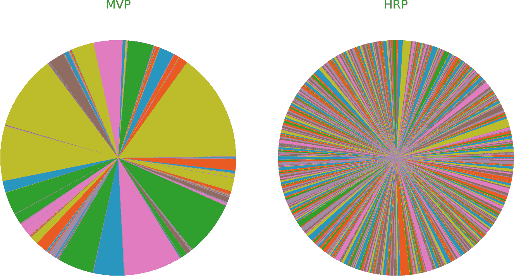

### 6\. 回测

现在，我们将对算法生成的投资组合性能进行回测，分析样本内和样本外结果：

```py
Insample_Result=pd.DataFrame(np.dot(returns,np.array(portfolios)), \
'MVP','HRP'], index = returns.index)
OutOfSample_Result=pd.DataFrame(np.dot(returns_test,np.array(portfolios)), \
columns=['MVP', 'HRP'], index = returns_test.index)

Insample_Result.cumsum().plot(figsize=(10, 5), title ="In-Sample Results",\
                              style=['--','-'])
OutOfSample_Result.cumsum().plot(figsize=(10, 5), title ="Out Of Sample Results",\
                                 style=['--','-'])
```

`输出`

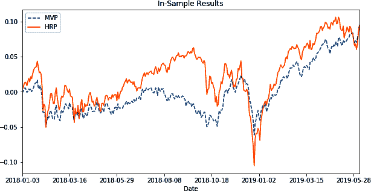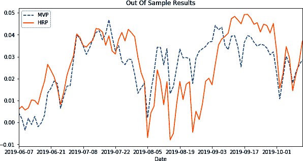

通过查看图表，我们可以看出 MVP 在样本内测试中有相当长一段时间表现不佳。在样本外测试中，MVP 在 2019 年 8 月至 2019 年 9 月中旬的短暂时期内表现优于 HRP。接下来，我们将分析两种配置方法的夏普比率：

#### 样本内结果

```py
#In_sample Results
stddev = Insample_Result.std() * np.sqrt(252)
sharp_ratio = (Insample_Result.mean()*np.sqrt(252))/(Insample_Result).std()
Results = pd.DataFrame(dict(stdev=stddev, sharp_ratio = sharp_ratio))
Results
```

`输出`

|  | stdev | sharp_ratio |
| --- | --- | --- |
| MVP | 0.086 | 0.785 |
| HRP | 0.127 | 0.524 |

#### 样本外结果

```py
#OutOf_sample Results
stddev_oos = OutOfSample_Result.std() * np.sqrt(252)
sharp_ratio_oos = (OutOfSample_Result.mean()*np.sqrt(252))/(OutOfSample_Result).\
std()
Results_oos = pd.DataFrame(dict(stdev_oos=stddev_oos, sharp_ratio_oos = \
  sharp_ratio_oos))
Results_oos
```

`输出`

|  | stdev_oos | sharp_ratio_oos |
| --- | --- | --- |
| MVP | 0.103 | 0.787 |
| HRP | 0.126 | 0.836 |

尽管 MVP 的样本内结果看起来很有希望，但是使用分层聚类方法构建的投资组合的样本外夏普比率和总体回报更佳。HRP 在非相关资产之间实现的分散化使得该方法在面对冲击时更加健壮。

### 结论

在这个案例研究中，我们看到基于分层聚类的投资组合配置提供了更好的资产分群分离，而无需依赖于马科维茨均值方差投资组合优化中使用的经典相关性分析。

使用马科维茨的技术会产生一个较少多样化、集中在少数股票上的投资组合。而基于分层聚类的 HRP 方法则产生了更多样化和分布更广的投资组合。这种方法展示了最佳的样本外表现，并且由于分散化，提供了更好的尾部风险管理。

实际上，相应的分层风险平衡策略弥补了基于最小方差的投资组合配置的缺陷。它视觉化和灵活，似乎为投资组合配置和管理提供了一个强大的方法。


# 章节总结

在本章中，我们学习了不同的聚类技术，并使用它们来捕捉数据的自然结构，以增强金融领域决策的效果。通过案例研究，我们展示了聚类技术在增强交易策略和投资组合管理方面的实用性。

除了提供解决不同金融问题的方法外，案例研究还聚焦于理解聚类模型的概念、培养直觉和可视化聚类。总体而言，本章通过案例研究呈现的 Python、机器学习和金融概念可以作为解决金融中任何基于聚类的问题的蓝图。

在讲解了监督学习和无监督学习之后，我们将在下一章探讨另一种类型的机器学习，强化学习。

# 练习题

+   使用层次聚类来形成不同资产类别（如外汇或大宗商品）的投资组合。

+   在债券市场上应用聚类分析进行对冲交易。

¹ 参考 Jupyter 笔记本，了解如何使用 `pandas_datareader` 获取价格数据。

² 参考第五章获取更多细节。
