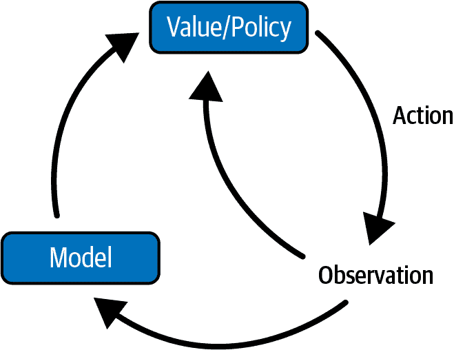

# 第九章 强化学习

激励驱动着几乎所有事物，金融也不例外。人类不是从数百万个标记示例中学习，而是经常从我们与行动相关联的积极或消极经验中学习。从经验和相关奖励或惩罚中学习是强化学习（RL）的核心思想。¹

强化学习是一种通过最大化奖励和最小化惩罚的最优策略来训练机器找到最佳行动的方法。

赋予*AlphaGo*（第一个击败职业人类围棋选手的计算机程序）力量的 RL 算法也正在金融领域发展。强化学习的主要思想是*最大化奖励*，与金融中的多个领域（包括算法交易和投资组合管理）非常契合。强化学习特别适合算法交易，因为在不确定且动态的环境中，*最大化回报的代理*概念与与金融市场互动的投资者或交易策略有许多共同之处。基于强化学习的模型比前几章讨论的基于价格预测的交易策略更进一步，并确定了基于规则的行动策略（即下订单、不做任何事情、取消订单等）。

类似地，在投资组合管理和资产配置中，基于强化学习的算法不产生预测，也不隐式地学习市场结构。它们做得更多。它们直接学习在不断变化的市场中动态改变投资组合配置权重的策略。强化学习模型也对涉及完成市场工具买卖订单的订单执行问题非常有用。在这里，算法通过试错学习，自行找出执行的最优路径。

强化学习算法具有在操作环境中处理更多细微差别和参数的能力，也可以生成衍生对冲策略。与传统基于金融的对冲策略不同，这些对冲策略在现实世界的市场摩擦下（如交易成本、市场影响、流动性限制和风险限制）是最优和有效的。

在本章中，我们涵盖了三个基于强化学习的案例研究，涵盖了主要的金融应用：算法交易、衍生品对冲和投资组合配置。在模型开发步骤方面，这些案例研究遵循了在第二章中提出的标准化七步模型开发过程。模型开发和评估是强化学习的关键步骤，这些步骤将得到强调。通过实施多个机器学习和金融概念，这些案例研究可以作为解决金融领域中任何其他基于强化学习的问题的蓝图。

在“案例研究 1：基于强化学习的交易策略”中，我们演示了使用强化学习开发算法交易策略。

在“案例研究 2：衍生品对冲”中，我们实施和分析了基于强化学习的技术，用于计算在市场摩擦下的衍生品组合的最优对冲策略。

在“案例研究 3：投资组合配置”中，我们展示了使用基于强化学习的技术处理加密货币数据集，以将资本分配到不同的加密货币以最大化风险调整后收益。我们还介绍了一个基于强化学习的*仿真环境*，用于训练和测试模型。

# 本章代码库

本书代码库中的[第九章 - 强化学习](https://oreil.ly/Fp0xD)文件夹中包含了本章中所有案例研究的基于 Python 的 Jupyter 笔记本。要解决涉及 RL 模型（如 DQN 或策略梯度）的任何 Python 机器学习问题，请读者稍微修改模板，以与其问题陈述保持一致。

# 强化学习——理论与概念

强化学习是一个广泛涵盖各种概念和术语的主题。本章理论部分涵盖了图 9-1 中列出的项目和主题。²


###### 图 9-1\. RL 概念总结

要使用 RL 解决任何问题，首先理解和定义 RL 组件至关重要。

## RL 组件

RL 系统的主要组件包括代理、动作、环境、状态和奖励。

代理

执行动作的实体。

动作

一个代理在其环境内可以执行的操作。

环境

代理所居住的世界。

状态

当前的情况。

奖励

环境即时返回，用于评估代理的最后一个动作。

强化学习的目标是通过实验试验和相对简单的反馈循环学习最优策略。有了最优策略，代理能够积极适应环境以最大化奖励。与监督学习不同，这些奖励信号不会立即提供给模型，而是作为代理进行一系列行动的结果而返回。

代理的行动通常取决于代理从环境中感知到的内容。代理感知到的内容被称为观察或环境的状态。图 9-2 总结了强化学习系统的组成部分。


###### 图 9-2\. 强化学习组件

代理和环境之间的互动涉及时间上的一系列动作和观察到的奖励，<math alttext="t equals 1 comma 2 period period period upper T"><mrow><mi>t</mi> <mo>=</mo> <mn>1</mn> <mo>,</mo> <mn>2</mn> <mo>.</mo> <mo>.</mo> <mo>.</mo> <mi>T</mi></mrow></math> 。在这个过程中，代理累积关于环境的知识，学习最优策略，并决定下一步应采取哪种行动，以有效地学习最佳策略。让我们用时间步 *t* 标记状态、动作和奖励，分别为 <math alttext="upper S Subscript t Baseline comma upper A Subscript t Baseline period period period upper R Subscript t Baseline"><mrow><msub><mi>S</mi> <mi>t</mi></msub> <mo>,</mo> <msub><mi>A</mi> <mi>t</mi></msub> <mo>.</mo> <mo>.</mo> <mo>.</mo> <msub><mi>R</mi> <mi>t</mi></msub></mrow></math> 。因此，互动序列完全由一个情节（也称为“试验”或“轨迹”）描述，并且该序列以终端状态结束 <math alttext="upper S Subscript upper T Baseline colon upper S 1 comma upper A 1 comma upper R 2 comma upper S 2 comma upper A 2 period period period upper A Subscript upper T Baseline"><mrow><msub><mi>S</mi> <mi>T</mi></msub> <mo>:</mo> <msub><mi>S</mi> <mn>1</mn></msub> <mo>,</mo> <msub><mi>A</mi> <mn>1</mn></msub> <mo>,</mo> <msub><mi>R</mi> <mn>2</mn></msub> <mo>,</mo> <msub><mi>S</mi> <mn>2</mn></msub> <mo>,</mo> <msub><mi>A</mi> <mn>2</mn></msub> <mo>.</mo> <mo>.</mo> <mo>.</mo> <msub><mi>A</mi> <mi>T</mi></msub></mrow></math> 。

除了迄今为止提到的强化学习的五个组成部分之外，还有三个额外的强化学习组成部分：策略、值函数（以及 Q 值）和环境模型。让我们详细讨论这些组成部分。

### 策略

策略是描述代理如何做出决策的算法或一组规则。更正式地说，策略是一个函数，通常表示为 *π*，它映射一个状态 (*s*) 和一个动作 (*a*)：

<math alttext="a Subscript t Baseline equals pi left-parenthesis s Subscript t Baseline right-parenthesis" display="block"><mrow><msub><mi>a</mi> <mi>t</mi></msub> <mo>=</mo> <mi>π</mi> <mrow><mo>(</mo> <msub><mi>s</mi> <mi>t</mi></msub> <mo>)</mo></mrow></mrow></math>

这意味着一个 agent 根据其当前状态决定其行动。策略可以是确定性的，也可以是随机的。确定性策略将一个状态映射到行动。另一方面，随机策略输出在动作上的概率分布。这意味着与其确定地采取行动*a*不同，给定一个状态，对该行动分配了一个概率。

我们在强化学习中的目标是学习一个最优策略（也称为<math alttext="pi Superscript asterisk"><msup><mi>π</mi> <mo>*</mo></msup></math>）。最优策略告诉我们如何在每个状态下采取行动以最大化回报。

### 值函数（和 Q 值）

强化学习 agent 的目标是学习在环境中执行任务。从数学上讲，这意味着最大化未来奖励或累积折现奖励<math alttext="upper G"><mi>G</mi></math>，可以将其表达为不同时间奖励函数<math alttext="upper R"><mi>R</mi></math>的函数：

<math alttext="upper G Subscript t Baseline equals upper R Subscript t plus 1 Baseline plus gamma upper R Subscript t plus 2 Baseline plus period period period equals sigma-summation Underscript 0 Overscript normal infinity Endscripts y Superscript k Baseline upper R Subscript t plus k plus 1 Baseline" display="block"><mrow><msub><mi>G</mi> <mi>t</mi></msub> <mo>=</mo> <msub><mi>R</mi> <mrow><mi>t</mi><mo>+</mo><mn>1</mn></mrow></msub> <mo>+</mo> <mi>γ</mi> <msub><mi>R</mi> <mrow><mi>t</mi><mo>+</mo><mn>2</mn></mrow></msub> <mo>+</mo> <mo>.</mo> <mo>.</mo> <mo>.</mo> <mo>=</mo> <munderover><mo>∑</mo> <mrow><mn>0</mn></mrow> <mi>∞</mi></munderover> <msup><mi>y</mi> <mi>k</mi></msup> <msub><mi>R</mi> <mrow><mi>t</mi><mo>+</mo><mi>k</mi><mo>+</mo><mn>1</mn></mrow></msub></mrow></math>

折扣因子<math alttext="gamma"><mi>γ</mi></math>是一个介于 0 和 1 之间的值，用于惩罚未来的奖励，因为未来的奖励不会提供即时的好处，可能具有更高的不确定性。未来的奖励是值函数的重要输入。

值函数（或状态值）通过对未来奖励的预测<math alttext="upper G Subscript t"><msub><mi>G</mi> <mi>t</mi></msub></math> 来衡量状态的吸引力。如果我们在时间*t*处于这个状态，状态*s*的值函数是预期回报，采取策略<math alttext="pi"><mi>π</mi></math>：

<math alttext="StartLayout 1st Row  upper V left-parenthesis s right-parenthesis equals upper E left-bracket upper G Subscript t Baseline vertical-bar upper S Subscript t Baseline equals s right-bracket EndLayout" display="block"><mrow><mi>V</mi> <mrow><mo>(</mo> <mi>s</mi> <mo>)</mo></mrow> <mo>=</mo> <mi>E</mi> <mrow><mo>[</mo> <msub><mi>G</mi> <mi>t</mi></msub> <mo>|</mo> <msub><mi>S</mi> <mi>t</mi></msub> <mo>=</mo> <mi>s</mi> <mo>]</mo></mrow></mrow></math>

同样地，我们定义状态-动作对（<math alttext="s comma a"><mrow><mi>s</mi> <mo>,</mo> <mi>a</mi></mrow></math> ）的动作值函数（Q 值）为：

<math alttext="StartLayout 1st Row  upper Q left-parenthesis s comma a right-parenthesis equals upper E left-bracket upper G Subscript t Baseline vertical-bar upper S Subscript t Baseline equals s comma upper A Subscript t Baseline equals a right-bracket EndLayout" display="block"><mrow><mi>Q</mi> <mrow><mo>(</mo> <mi>s</mi> <mo>,</mo> <mi>a</mi> <mo>)</mo></mrow> <mo>=</mo> <mi>E</mi> <mrow><mo>[</mo> <msub><mi>G</mi> <mi>t</mi></msub> <mo>|</mo> <msub><mi>S</mi> <mi>t</mi></msub> <mo>=</mo> <mi>s</mi> <mo>,</mo> <msub><mi>A</mi> <mi>t</mi></msub> <mo>=</mo> <mi>a</mi> <mo>]</mo></mrow></mrow></math>

因此，值函数是遵循策略<math alttext="pi"><mi>π</mi></math>的状态的预期回报。Q 值是遵循策略<math alttext="pi"><mi>π</mi></math>的状态-动作对的预期奖励。

值函数和 Q 值也是相互关联的。由于我们遵循目标策略<math alttext="pi"><mi>π</mi></math>，我们可以利用可能行动的概率分布和 Q 值来恢复值函数：

<math alttext="StartLayout 1st Row  upper V left-parenthesis s right-parenthesis equals sigma-summation Underscript a element-of upper A Endscripts upper Q left-parenthesis s comma a right-parenthesis pi left-parenthesis a vertical-bar s right-parenthesis EndLayout" display="block"><mrow><mi>V</mi> <mrow><mo>(</mo> <mi>s</mi> <mo>)</mo></mrow> <mo>=</mo> <munder><mo>∑</mo> <mrow><mi>a</mi><mo>∈</mo><mi>A</mi></mrow></munder> <mi>Q</mi> <mrow><mo>(</mo> <mi>s</mi> <mo>,</mo> <mi>a</mi> <mo>)</mo></mrow> <mi>π</mi> <mrow><mo>(</mo> <mi>a</mi> <mo>|</mo> <mi>s</mi> <mo>)</mo></mrow></mrow></math>

上述方程表示值函数和 Q 值之间的关系。

奖励函数（<math alttext="upper R"><mi>R</mi></math>）、未来奖励（<math alttext="upper G"><mi>G</mi></math>）、值函数和 Q 值之间的关系被用来推导贝尔曼方程（本章后面讨论），这是许多强化学习模型的关键组成部分之一。

### 模型

模型是环境的描述符。有了模型，我们可以学习或推断环境将如何与代理人交互并提供反馈。模型被用于*规划*，这意味着通过考虑可能的未来情况来决定行动方式的任何方式。例如，股票市场的模型负责预测未来价格走势。模型有两个主要部分：*转移概率函数*（*P*）和*奖励函数*。我们已经讨论了奖励函数。转移函数（*P*）记录了在采取行动后从一个状态转移到另一个状态的概率。

总体而言，强化学习代理人可能直接或间接地尝试学习在图 9-3 中显示的策略或值函数。学习策略的方法因强化学习模型类型而异。当我们完全了解环境时，我们可以通过使用*基于模型的方法*找到最优解。³ 当我们不了解环境时，我们遵循*无模型方法*并尝试在算法的一部分明确学习模型。



###### 图 9-3\. 模型、价值和策略

### 在交易环境中的强化学习组件

让我们尝试理解强化学习组件在交易设置中的对应关系：

代理人

代理人是我们的交易代理人。我们可以将代理人视为根据交易所的当前状态和其账户做出交易决策的人类交易员。

行动

会有三种操作：*买入*、*持有*和*卖出*。

奖励函数

一个明显的奖励函数可能是*实现的盈亏（Profit and Loss，PnL）*。其他奖励函数可以是*夏普比率*或*最大回撤*。⁴ 可能存在许多复杂的奖励函数，这些函数在利润和风险之间提供权衡。

环境

在交易环境中，环境被称为*交易所*。在交易所交易时，我们无法观察到环境的完整状态。具体来说，我们不知道其他代理人，代理人观察到的并非环境的真实状态，而是其某种推导。

这被称为*部分可观察马尔可夫决策过程*（POMDP）。这是我们在金融领域中遇到的最常见类型的环境。

## 强化学习建模框架

在本节中，我们描述了多个强化学习模型中使用的核心框架。

### 贝尔曼方程

贝尔曼方程是一组方程，将值函数和 Q 值分解为即时奖励加上折现未来价值。

在强化学习中，代理人的主要目标是从其到达的每个状态中获得最大的期望奖励总和。为了实现这一点，我们必须尝试获得最优的值函数和 Q 值；贝尔曼方程帮助我们做到这一点。

我们利用奖励函数（R）、未来奖励（G）、价值函数和 Q 值之间的关系推导出了价值函数的贝尔曼方程，如方程 9-1 所示。

##### 方程 9-1。价值函数的贝尔曼方程

<math alttext="StartLayout 1st Row  upper V left-parenthesis s right-parenthesis equals upper E left-bracket upper R Subscript t plus 1 Baseline plus gamma upper V left-parenthesis upper S Subscript t plus 1 Baseline right-parenthesis vertical-bar upper S Subscript t Baseline equals s right-bracket EndLayout" display="block"><mrow><mi>V</mi> <mrow><mo>(</mo> <mi>s</mi> <mo>)</mo></mrow> <mo>=</mo> <mi>E</mi> <mo>[</mo> <msub><mi>R</mi> <mrow><mi>t</mi><mo>+</mo><mn>1</mn></mrow></msub> <mo>+</mo> <mi>γ</mi> <mi>V</mi> <mrow><mo>(</mo> <msub><mi>S</mi> <mrow><mi>t</mi><mo>+</mo><mn>1</mn></mrow></msub> <mo>)</mo></mrow> <mo>|</mo> <msub><mi>S</mi> <mi>t</mi></msub> <mo>=</mo> <mi>s</mi> <mo>]</mo></mrow></math>

在这里，价值函数分解为两部分；即即时奖励，<math alttext="upper R Subscript t plus 1"><msub><mi>R</mi> <mrow><mi>t</mi><mo>+</mo><mn>1</mn></mrow></msub></math>，以及继任状态的折现价值，<math alttext="gamma upper V left-parenthesis upper S Subscript t plus 1 Baseline right-parenthesis"><mrow><mi>γ</mi> <mi>V</mi> <mo>(</mo> <msub><mi>S</mi> <mrow><mi>t</mi><mo>+</mo><mn>1</mn></mrow></msub> <mo>)</mo></mrow></math>，如前述方程所示。因此，我们将问题分解为即时奖励和折现后继状态。在时间*t*的状态*s*的状态值*V(s)*可以使用当前奖励<math alttext="upper R Subscript t plus 1"><msub><mi>R</mi> <mrow><mi>t</mi><mo>+</mo><mn>1</mn></mrow></msub></math>和时间*t*+1 的价值函数来计算。这就是价值函数的贝尔曼方程。可以最大化这个方程，得到一个称为价值函数贝尔曼最优方程的方程，用*V*(s)*表示。

我们采用了一个非常类似的算法来估计最优状态-动作值（Q 值）。价值函数和 Q 值的简化迭代算法分别显示在方程 9-2 和 9-3 中。

##### 方程 9-2。价值函数的迭代算法

<math display="block"><mrow><msub><mi>V</mi> <mrow><mi>k</mi><mo>+</mo><mn>1</mn></mrow></msub> <mrow><mo>(</mo> <mi>s</mi> <mo>)</mo></mrow> <mo>=</mo> <munder><mi>m</mi> <mi>a</mi></munder> <mi>a</mi> <mi>x</mi> <munder><mo>∑</mo> <msup><mi>s</mi> <mo>′</mo></msup></munder> <msubsup><mi>P</mi> <mrow><mi>s</mi><msup><mi>s</mi> <mo>′</mo></msup></mrow> <mi>a</mi></msubsup> <mfenced separators="" open="(" close=")"><msubsup><mi>R</mi> <mrow><mi>s</mi><msup><mi>s</mi> <mo>′</mo></msup></mrow> <mi>a</mi></msubsup> <mo>+</mo> <mi>γ</mi> <msub><mi>V</mi> <mi>k</mi></msub> <mrow><mo>(</mo><msup><mi>s</mi> <mo>′</mo></msup> <mo>)</mo></mrow></mfenced></mrow></math>

##### 方程 9-3。Q 值的迭代算法

<math display="block"><mrow><msub><mi>Q</mi> <mrow><mi>k</mi><mo>+</mo><mn>1</mn></mrow></msub> <mrow><mo>(</mo> <mi>s</mi> <mo>,</mo> <mi>a</mi> <mo>)</mo></mrow> <mo>=</mo> <munder><mo>∑</mo> <msup><mi>s</mi> <mo>′</mo></msup></munder> <msubsup><mi>P</mi> <mrow><mi>s</mi><msup><mi>s</mi> <mo>′</mo></msup></mrow> <mi>a</mi></msubsup> <mrow><mo stretchy="false">[</mo> <msubsup><mi>R</mi> <mrow><mi>s</mi><msup><mi>s</mi> <mo>′</mo></msup></mrow> <mi>a</mi></msubsup> <mo>+</mo> <mi>γ</mi> <mo>*</mo> <munder><mi>m</mi> <msup><mi>a</mi> <mo>′</mo></msup></munder> <mi>a</mi> <mi>x</mi> <mo>*</mo> <msub><mi>Q</mi> <mi>k</mi></msub> <mrow><mo>(</mo> <msup><mi>s</mi> <mo>′</mo></msup> <mo>,</mo> <msup><mi>a</mi> <mo>′</mo></msup> <mo>)</mo></mrow> <mo stretchy="false">]</mo></mrow></mrow></math>

其中

+   <math display="inline"><msubsup><mi>P</mi> <mrow><mi>s</mi><msup><mi>s</mi> <mo>′</mo></msup></mrow> <mi>a</mi></msubsup></math> 是从状态*s*到状态*s*′的转移概率，假设选择了动作*a*。

+   <math display="inline"><msubsup><mi>R</mi> <mrow><mi>s</mi><msup><mi>s</mi> <mo>′</mo></msup></mrow> <mi>a</mi></msubsup></math> 是当代理从状态*s*到状态*s*′时获得的奖励，假设选择了动作*a*。

贝尔曼方程之所以重要，是因为它们让我们将状态的价值表达为其他状态的价值。这意味着，如果我们知道*s*[t+1]的价值函数或 Q 值，我们可以非常容易地计算*s*[t]的价值。这为迭代方法计算每个状态的价值打开了很多门，因为如果我们知道下一个状态的价值，我们就可以知道当前状态的价值。

如果我们对环境有完整的信息，Equations 9-2 和 9-3 中显示的迭代算法就会变成一个规划问题，可以通过我们将在下一节中演示的动态规划来解决。不幸的是，在大多数情况下，我们不知道<math display="inline"><msub><mi>R</mi> <mrow><mi>s</mi><msup><mi>s</mi> <mo>′</mo></msup></mrow></msub></math>或<math display="inline"><msub><mi>P</mi> <mrow><mi>s</mi><msup><mi>s</mi> <mo>′</mo></msup></mrow></msub></math>，因此无法直接应用贝尔曼方程，但它们为许多强化学习算法奠定了理论基础。

### 马尔可夫决策过程

几乎所有的强化学习问题都可以被建模为马尔可夫决策过程（MDPs）。MDPs 正式描述了强化学习的环境。马尔可夫决策过程由五个元素组成：<math><mrow><mi>M</mi> <mo>=</mo> <mi>S</mi> <mo>,</mo> <mi>A</mi> <mo>,</mo> <mi>P</mi> <mo>,</mo> <mi>R</mi> <mo>,</mo> <mi>γ</mi></mrow></math>，符号的含义与前一节中定义的相同：

+   *S*: 一组状态

+   *A*: 一组行动

+   *P*: 转移概率

+   *R*: 奖励函数

+   *γ*: 未来奖励的折现因子

MDP 将代理-环境交互框架化为随时间步 t = 1，…，T 的序列决策问题。代理和环境持续交互，代理选择行动，环境对这些行动作出响应，并向代理呈现新的情况，目的是提出一个最优策略或战略。贝尔曼方程构成了整个算法的基础。

MDP 中的所有状态都具有马尔可夫性质，指的是未来仅取决于当前状态，而不取决于历史。

让我们在金融背景下看一个马尔可夫决策过程（MDP）的例子，并分析贝尔曼方程。市场交易可以形式化为一个 MDP，这是一个具有从状态到状态的指定转移概率的过程。Figure 9-4 展示了金融市场中 MDP 的一个示例，具有一组状态、转移概率、行动和奖励。


###### Figure 9-4. 马尔可夫决策过程

此处介绍的 MDP 有三个状态：牛市、熊市和停滞市场，分别由三个状态（s[0]、s[1]、s[2]）表示。交易员的三个动作是持有、买入和卖出，分别由 a[0]、a[1]、a[2]表示。这是一个假设性的设置，我们假设转移概率是已知的，交易员的行动会导致市场状态的变化。在接下来的章节中，我们将探讨解决 RL 问题的方法，而不需做出这样的假设。图表还显示了不同行动的转移概率和奖励。如果我们从状态 s[0]（牛市）开始，代理可以选择 a[0]、a[1]、a[2]（卖出、买入或持有）之间的行动。如果它选择行动买入（a[1]），它可以肯定地留在状态 s[0]，但没有任何奖励。因此，如果它想要的话，它可以决定永远留在那里。但如果它选择行动持有（a[0]），它有 70%的概率获得+50 的奖励，并保持在状态 s[0]。然后它可以再次尝试尽可能多地获得奖励。但在某个时候，它会以状态 s[1]（停滞市场）结束。在状态 s[1]中，它只有两个可能的动作：持有（a[0]）或买入（a[1]）。它可以选择重复选择行动 a[1]来保持不动，或者选择进入状态 s[2]（熊市），并获得-250 的负奖励。在状态 s[2]中，它别无选择，只能采取买入行动（a[1]），这很可能会使其回到状态 s[0]（牛市），并在途中获得+200 的奖励。

现在，通过查看这个 MDP，可以提出一个最优策略或策略，以实现长期内最大的奖励。在状态 s[0]中，明显行动 a[0]是最佳选择，在状态 s[2]中，代理没有选择，只能采取行动 a[1]，但在状态 s[1]中，不明确代理应该保持不动（a[0]）还是卖出（a[2]）。

让我们根据以下贝尔曼方程（参见 方程 9-3）来获取最优的 Q 值：

<math display="block"><mrow><msub><mi>Q</mi> <mrow><mi>k</mi><mo>+</mo><mn>1</mn></mrow></msub> <mrow><mo>(</mo> <mi>s</mi> <mo>,</mo> <mi>a</mi> <mo>)</mo></mrow> <mo>=</mo> <munder><mo>∑</mo> <msup><mi>s</mi> <mo>′</mo></msup></munder> <msubsup><mi>P</mi> <mrow><mi>s</mi><msup><mi>s</mi> <mo>′</mo></msup></mrow> <mi>a</mi></msubsup> <mo stretchy="false">[</mo><msubsup><mi>R</mi> <mrow><mi>s</mi><msup><mi>s</mi> <mo>′</mo></msup></mrow> <mi>a</mi></msubsup> <mo>+</mo> <mi>γ</mi> <mo>*</mo> <munder><mi>m</mi> <msup><mi>a</mi> <mo>′</mo></msup></munder> <mi>a</mi> <mi>x</mi> <mo>*</mo> <msub><mi>Q</mi> <mi>k</mi></msub> <mrow><mo>(</mo><msup><mi>s</mi> <mo>′</mo></msup> <mo>,</mo><msup><mi>a</mi> <mo>′</mo></msup> <mo>)</mo></mrow><mo stretchy="false">]</mo></mrow></math>

```py
import numpy as np
nan=np.nan # represents impossible actions
#Array for transition probability
P = np.array([ # shape=[s, a, s']
[[0.7, 0.3, 0.0], [1.0, 0.0, 0.0], [0.8, 0.2, 0.0]],
[[0.0, 1.0, 0.0], [nan, nan, nan], [0.0, 0.0, 1.0]],
[[nan, nan, nan], [0.8, 0.1, 0.1], [nan, nan, nan]],
])

# Array for the return
R = np.array([ # shape=[s, a, s']
[[50., 0.0, 0.0], [0.0, 0.0, 0.0], [0.0, 0.0, 0.0]],
[[50., 0.0, 0.0], [nan, nan, nan], [0.0, 0.0, -250.]],
[[nan, nan, nan], [200., 0.0, 0.0], [nan, nan, nan]],
])
#Actions
A = [[0, 1, 2], [0, 2], [1]]
#The data already obtained from yahoo finance is imported.

#Now let's run the Q-Value Iteration algorithm:
Q = np.full((3, 3), -np.inf) # -inf for impossible actions
for state, actions in enumerate(A):
    Q[state, actions] = 0.0 # Initial value = 0.0, for all possible actions
discount_rate = 0.95
n_iterations = 100
for iteration in range(n_iterations):
    Q_prev = Q.copy()
    for s in range(3):
        for a in A[s]:
            Q[s, a] = np.sum([
                T[s, a, sp] * (R[s, a, sp] + discount_rate * np.max(Q_prev[sp]))
        for sp in range(3)])
print(Q)
```

`输出`

```py
[[109.43230584 103.95749333  84.274035  ]
 [  5.5402017          -inf   5.83515676]
 [        -inf 269.30353051         -inf]]
```

当使用折现率为 0.95 时，这为我们提供了该 MDP 的最优策略（Q 值）。在牛市（s[0]）中选择持有行动（a[0]）；在停滞市场（s[1]）中选择卖出行动（a[2]）；在熊市（s[2]）中选择买入行动（a[1]）。

上述示例演示了通过动态规划（DP）算法获取最优策略的过程。这些方法假设了对环境的完全了解，虽然在实践中往往是不现实的，但它们构成了大多数其他方法的概念基础。

### 时间差分学习

具有离散动作的强化学习问题通常可以建模为马尔可夫决策过程，正如我们在前面的例子中看到的，但在大多数情况下，代理程序最初对转移概率一无所知。它也不知道奖励会是什么。这就是时间差分（TD）学习可以发挥作用的地方。

TD 学习算法与基于 Bellman 方程的值迭代算法（Equation 9-2）非常相似，但调整为考虑到代理只有对 MDP 的部分知识。通常情况下，我们假设代理最初只知道可能的状态和动作，什么也不知道。例如，代理使用探索策略，即纯随机策略，来探索 MDP，随着进展，TD 学习算法基于实际观察到的转换和奖励更新状态值的估计。

TD 学习中的关键思想是向估计的回报更新值函数 V(*S[t]*)，接近一个估算的回报 <math alttext="upper R Subscript t plus 1 Baseline plus gamma upper V left-parenthesis upper S Subscript t plus 1 Baseline right-parenthesis"><mrow><msub><mi>R</mi> <mrow><mi>t</mi><mo>+</mo><mn>1</mn></mrow></msub> <mo>+</mo> <mi>γ</mi> <mi>V</mi> <mrow><mo>(</mo> <msub><mi>S</mi> <mrow><mi>t</mi><mo>+</mo><mn>1</mn></mrow></msub> <mo>)</mo></mrow></mrow></math>（称为*TD 目标*）。我们希望更新值函数的程度由*学习率*超参数 *α* 控制，它定义了我们在更新值时的侵略性。当 *α* 接近零时，更新不太侵略。当 *α* 接近一时，我们简单地用更新后的值替换旧值：

<math display="block"><mrow><mi>V</mi> <mrow><mo>(</mo> <msub><mi>s</mi> <mi>t</mi></msub> <mo>)</mo></mrow> <mo>←</mo> <mi>V</mi> <mrow><mo>(</mo> <msub><mi>s</mi> <mi>t</mi></msub> <mo>)</mo></mrow> <mo>+</mo> <mi>α</mi> <mrow><mo>(</mo> <msub><mi>R</mi> <mrow><mi>t</mi><mo>+</mo><mn>1</mn></mrow></msub> <mo>+</mo> <mi>γ</mi> <mi>V</mi> <mrow><mo>(</mo> <msub><mi>s</mi> <mrow><mi>t</mi><mo>+</mo><mn>1</mn></mrow></msub> <mo>)</mo></mrow> <mo>–</mo> <mi>V</mi> <mrow><mo>(</mo> <msub><mi>s</mi> <mi>t</mi></msub> <mo>)</mo></mrow> <mo>)</mo></mrow></mrow></math>

类似地，对于 Q 值估计：

<math display="block"><mrow><mi>Q</mi> <mrow><mo>(</mo> <msub><mi>s</mi> <mi>t</mi></msub> <mo>,</mo> <msub><mi>a</mi> <mi>t</mi></msub> <mo>)</mo></mrow> <mo>←</mo> <mi>Q</mi> <mrow><mo>(</mo> <msub><mi>s</mi> <mi>t</mi></msub> <mo>,</mo> <msub><mi>a</mi> <mi>t</mi></msub> <mo>)</mo></mrow> <mo>+</mo> <mi>α</mi> <mrow><mo>(</mo> <msub><mi>R</mi> <mrow><mi>t</mi><mo>+</mo><mn>1</mn></mrow></msub> <mo>+</mo> <mi>γ</mi> <mi>Q</mi> <mrow><mo>(</mo> <msub><mi>s</mi> <mrow><mi>t</mi><mo>+</mo><mn>1</mn></mrow></msub> <mo>,</mo> <msub><mi>a</mi> <mrow><mi>t</mi><mo>+</mo><mn>1</mn></mrow></msub> <mo>)</mo></mrow> <mo>–</mo> <mi>Q</mi> <mrow><mo>(</mo> <msub><mi>s</mi> <mi>t</mi></msub> <mo>,</mo> <msub><mi>a</mi> <mi>t</mi></msub> <mo>)</mo></mrow> <mo>)</mo></mrow></mrow></math>

许多 RL 模型使用我们将在下一节中看到的 TD 学习算法。

### 人工神经网络和深度学习

强化学习模型通常利用人工神经网络和深度学习方法来近似值或策略函数。也就是说，人工神经网络可以学习将状态映射到值，或者将状态-动作对映射到 Q 值。在 RL 的上下文中，ANN 可以使用*系数*或*权重*来近似将输入映射到输出的函数。ANN 的学习意味着通过迭代调整权重，使得奖励最大化。详见 3 和 5 ，了解与 ANN 相关的方法（包括深度学习）的更多细节。

## 强化学习模型

根据每步的奖励和概率是否易于访问，强化学习可以分为*基于模型*和*无模型*算法。

### 基于模型的算法

基于模型的算法试图理解环境并创建一个代表它的模型。当 RL 问题包括明确定义的转移概率以及有限数量的状态和动作时，可以将其框架化为一个*有限 MDP*，动态规划（DP）可以计算出一个精确解，类似于前面的例子。⁵

### 无模型算法

无模型算法仅尝试从实际经验中最大化预期奖励，而不使用模型或先验知识。 当我们对模型有不完整的信息时，我们使用无模型算法。 代理的策略 *π(s)* 提供了在某一状态下采取的最优行动的指导方针，目标是最大化总奖励。 每个状态都与一个值函数 *V(s)* 相关联，该函数预测我们能够在该状态上采取相应策略时获得的未来奖励的预期数量。 换句话说，值函数量化了状态的好坏程度。 无模型算法进一步分为*基于值的*和*基于策略的*。 基于值的算法通过选择状态中的最佳行动来学习状态或 Q 值。 这些算法通常基于我们在 RL 框架部分讨论的时序差分学习。 基于策略的算法（也称为*直接策略搜索*）直接学习将状态映射到动作的最优策略（或者，如果无法达到真正的最优策略，则尝试近似最优策略）。

在大多数金融情况下，我们并不完全了解环境、奖励或转移概率，因此必须依赖于无模型算法和相关方法。因此，下一节和案例研究的重点将放在无模型方法和相关算法上。

图 9-5 展示了无模型强化学习的分类。我们强烈建议读者参考 *强化学习: 一种介绍* 以更深入地了解算法和概念。


###### 图 9-5\. RL 模型分类

在无模型方法的背景下，时序差分学习是其中最常用的方法之一。在 TD 中，算法根据自身的先前估计来优化其估计。 基于值的算法*Q-learning* 和 *SARSA* 使用了这种方法。

无模型方法通常利用人工神经网络来近似值或策略函数。 *策略梯度* 和 *深度 Q 网络（DQN）* 是两种常用的无模型算法，它们使用人工神经网络。 策略梯度是一种直接参数化策略的基于策略的方法。 深度 Q 网络是一种基于值的方法，它将深度学习与 *Q-learning* 结合在一起，将学习目标设置为优化 Q 值的估计。

### Q-学习

*Q-learning* 是 TD 学习的一种适应。该算法根据 Q 值（或动作值）函数评估要采取的动作，该函数确定处于某个状态并采取某个动作时的价值。对于每个状态-动作对*(s, a)*，该算法跟踪奖励的运行平均值*R*，代理在离开状态*s*并采取动作*a*后获得的奖励，以及它预计在之后获得的奖励。由于目标策略将最优地行动，我们取下一状态的 Q 值估计的最大值。

学习进行*离策略*，即算法*不*需要根据仅由值函数暗示的策略选择动作。然而，收敛需要在整个训练过程中更新所有状态-动作对，并确保这一点的简单方法是使用*ε-贪心*策略，该策略在以下章节进一步定义。

Q-learning 的步骤如下：

1.  在时间步*t*，我们从状态*s[t]*开始，并根据 Q 值选择动作，<math alttext="a Subscript t Baseline equals m a x Subscript a Baseline upper Q left-parenthesis s Subscript t Baseline comma a right-parenthesis"><mrow><msub><mi>a</mi> <mi>t</mi></msub> <mo>=</mo> <mi>m</mi> <mi>a</mi> <msub><mi>x</mi> <mi>a</mi></msub> <mi>Q</mi> <mrow><mo>(</mo> <msub><mi>s</mi> <mi>t</mi></msub> <mo>,</mo> <mi>a</mi> <mo>)</mo></mrow></mrow></math> 。

1.  我们应用一个*ε-贪心*方法，根据*ε*的概率随机选择动作，或者根据 Q 值函数选择最佳动作。这确保了在给定状态下探索新动作，同时利用学习经验。⁸

1.  通过动作*a[t]*，我们观察奖励*R[t+1]*并进入下一个状态*S[t+1]*。

1.  我们更新动作值函数：

    <math display="block"><mrow><mi>Q</mi> <mrow><mo>(</mo> <msub><mi>s</mi> <mi>t</mi></msub> <mo>,</mo> <msub><mi>a</mi> <mi>t</mi></msub> <mo>)</mo></mrow> <mo>←</mo> <mi>Q</mi> <mrow><mo>(</mo> <msub><mi>s</mi> <mi>t</mi></msub> <mo>,</mo> <msub><mi>a</mi> <mi>t</mi></msub> <mo>)</mo></mrow> <mo>+</mo> <mi>α</mi> <mrow><mo>(</mo> <msub><mi>R</mi> <mrow><mi>t</mi><mo>+</mo><mn>1</mn></mrow></msub> <mo>+</mo> <mi>γ</mi> <munder><mo movablelimits="true" form="prefix">max</mo> <mi>a</mi></munder> <mi>Q</mi> <mrow><mo>(</mo> <msub><mi>s</mi> <mrow><mi>t</mi><mo>+</mo><mn>1</mn></mrow></msub> <mo>,</mo> <msub><mi>a</mi> <mi>t</mi></msub> <mo>)</mo></mrow> <mo>–</mo> <mi>Q</mi> <mrow><mo>(</mo> <msub><mi>s</mi> <mi>t</mi></msub> <mo>,</mo> <msub><mi>a</mi> <mi>t</mi></msub> <mo>)</mo></mrow> <mo>)</mo></mrow></mrow></math>

1.  我们增加时间步长，*t = t+1*，然后重复步骤。

经过足够的迭代步骤，该算法将收敛到最优的 Q 值。

### SARSA

SARSA 也是基于 TD 学习的算法。它指的是通过遵循一系列<math alttext="period period period upper S Subscript t Baseline comma upper A Subscript t Baseline comma upper R Subscript t plus 1 Baseline comma upper S Subscript t plus 1 Baseline comma upper A Subscript t plus 1 Baseline comma period period period"><mrow><mo>.</mo> <mo>.</mo> <mo>.</mo> <msub><mi>S</mi> <mi>t</mi></msub> <mo>,</mo> <msub><mi>A</mi> <mi>t</mi></msub> <mo>,</mo> <msub><mi>R</mi> <mrow><mi>t</mi><mo>+</mo><mn>1</mn></mrow></msub> <mo>,</mo> <msub><mi>S</mi> <mrow><mi>t</mi><mo>+</mo><mn>1</mn></mrow></msub> <mo>,</mo> <msub><mi>A</mi> <mrow><mi>t</mi><mo>+</mo><mn>1</mn></mrow></msub> <mo>,</mo> <mo>.</mo> <mo>.</mo> <mo>.</mo></mrow></math> 的步骤更新 Q 值。SARSA 的前两个步骤与 Q 学习的步骤类似。然而，与 Q 学习不同，SARSA 是一个*在策略*算法，其中代理掌握最优策略并使用相同策略来行动。在这个算法中，用于*更新*和*行动*的策略是相同的。Q 学习被认为是一个*离策略*算法。

### 深度 Q 网络

在前面的部分中，我们看到了如何使用 Q 学习基于贝尔曼方程进行迭代更新，在具有离散状态动作的环境中学习最优 Q 值函数。然而，Q 学习可能具有以下缺点：

+   在状态和动作空间较大的情况下，最优 Q 值表很快变得计算上不可行。

+   Q 学习可能会遭受不稳定性和发散问题。

为了解决这些问题，我们使用人工神经网络来近似 Q 值。例如，如果我们使用一个参数为*θ*的函数来计算 Q 值，我们可以将 Q 值函数标记为*Q(s,a;θ)*。深度 Q 学习算法通过学习一个多层次深度 Q 网络的权重*θ*来近似 Q 值，旨在通过两种创新机制显著改进和稳定 Q 学习的训练过程：

经验回放

不是在仿真或实际经验中运行 Q 学习的状态-动作对，算法将代理在一个大的*回放记忆*中存储状态、动作、奖励和下一个状态的转换历史。这可以称为*小批量*观察。在 Q 学习更新过程中，随机从回放记忆中抽取样本，因此一个样本可以被多次使用。经验回放提高了数据效率，消除了观察序列中的相关性，并平滑了数据分布中的变化。

周期性更新目标

*Q*被优化为仅周期性更新的目标值。Q 网络被克隆并保持冻结，作为优化目标的每个*C*步骤（*C*是一个超参数）。这种修改使训练更加稳定，因为它克服了短期振荡。为了学习网络参数，算法将梯度下降应用于损失函数，该损失函数定义为 DQN 对目标的估计与当前状态-动作对的 Q 值的估计之间的平方差，*Q(s,a:θ)*。损失函数如下：

<math display="block"><mrow><mi>L</mi> <mrow><mo>(</mo> <msub><mi>θ</mi> <mi>i</mi></msub> <mo>)</mo></mrow> <mo>=</mo> <mi>𝔼</mi> <mo stretchy="false">[</mo> <msup><mfenced separators="" open="(" close=")"><mi>r</mi> <mo>+</mo> <mi>γ</mi> <munder><mo movablelimits="true" form="prefix">max</mo> <msup><mi>a</mi> <mo>′</mo></msup></munder> <mi>Q</mi> <mrow><mo>(</mo><msup><mi>s</mi> <mo>′</mo></msup> <mo>,</mo><mi>a</mi><mo>′</mo><mo>;</mo><msub><mi>θ</mi> <mrow><mi>i</mi><mo>–</mo><mn>1</mn></mrow></msub> <mo>)</mo></mrow> <mo>–</mo> <mi>Q</mi> <mrow><mo>(</mo><mi>s</mi><mo>,</mo><mi>a</mi><mo>;</mo><msub><mi>θ</mi> <mi>i</mi></msub> <mo>)</mo></mrow></mfenced> <mn>2</mn></msup> <mo stretchy="false">]</mo></mrow></math>

损失函数本质上是一个均方误差（MSE）函数，其中<math display="inline"><mfenced separators="" open="(" close=")"><mi>r</mi> <mo>+</mo> <mi>γ</mi> <msub><mo movablelimits="true" form="prefix">max</mo> <msup><mi>a</mi> <mo>′</mo></msup></msub> <mi>Q</mi> <mrow><mo>(</mo><msup><mi>s</mi> <mo>′</mo></msup> <mo>,</mo><mi>a</mi><mo>′</mo><mo>;</mo><msub><mi>θ</mi> <mrow><mi>i</mi><mo>–</mo><mn>1</mn></mrow></msub> <mo>)</mo></mrow></mfenced></math>表示目标值，而<math alttext="upper Q left-bracket s comma a semicolon theta Subscript i Baseline right-bracket"><mrow><mi>Q</mi> <mo>[</mo> <mi>s</mi> <mo>,</mo> <mi>a</mi> <mo>;</mo> <msub><mi>θ</mi> <mi>i</mi></msub> <mo>]</mo></mrow></math>表示预测值。*θ*是网络的权重，当最小化损失函数时计算出来。目标和当前估计都依赖于权重集合，强调了与监督学习的区别，在监督学习中，目标在训练之前是固定的。

包含买入、卖出和持有动作的交易示例的 DQN 示例在图 9-6 中表示。在这里，我们只将状态（*s*）作为输入提供给网络，并一次性接收所有可能动作（即买入、卖出和持有）的 Q 值。我们将在本章的第一和第三个案例研究中使用 DQN。


###### 图 9-6\. DQN

### 策略梯度

*策略梯度*是一种基于策略的方法，我们在其中学习一个策略函数，*π*，它是从每个状态直接映射到该状态的最佳对应动作的直接映射。这是一种比基于价值的方法更为直接的方法，无需 Q 值函数。

策略梯度方法直接学习参数化函数关于*θ, π(a|s;θ)*。这个函数可能是一个复杂的函数，可能需要一个复杂的模型。在策略梯度方法中，我们使用人工神经网络将状态映射到动作，因为它们在学习复杂函数时是有效的。人工神经网络的损失函数是期望回报的相反数（累积未来奖励）。

策略梯度方法的目标函数可以定义为：

<math alttext="upper J left-parenthesis theta right-parenthesis equals upper V Subscript pi Sub Subscript theta Baseline left-parenthesis upper S 1 right-parenthesis equals double-struck upper E Subscript pi Sub Subscript theta Baseline left-bracket upper V 1 right-bracket" display="block"><mrow><mi>J</mi> <mrow><mo>(</mo> <mi>θ</mi> <mo>)</mo></mrow> <mo>=</mo> <msub><mi>V</mi> <msub><mi>π</mi> <mi>θ</mi></msub></msub> <mrow><mo>(</mo> <msub><mi>S</mi> <mn>1</mn></msub> <mo>)</mo></mrow> <mo>=</mo> <msub><mi>𝔼</mi> <msub><mi>π</mi> <mi>θ</mi></msub></msub> <mrow><mo>[</mo> <msub><mi>V</mi> <mn>1</mn></msub> <mo>]</mo></mrow></mrow></math>

其中，*θ*表示将状态映射到动作的人工神经网络（ANN）的权重集合。这里的思想是最大化目标函数并计算人工神经网络的权重（*θ*）。

由于这是一个最大化问题，我们通过*梯度上升*（与用于最小化损失函数的梯度下降相反）来优化策略，使用策略参数*θ*的偏导数：

<math alttext="theta left-arrow theta plus StartFraction normal partial-differential Over normal partial-differential theta EndFraction upper J left-parenthesis theta right-parenthesis" display="block"><mrow><mi>θ</mi> <mo>←</mo> <mi>θ</mi> <mo>+</mo> <mfrac><mi>∂</mi> <mrow><mi>∂</mi><mi>θ</mi></mrow></mfrac> <mi>J</mi> <mrow><mo>(</mo> <mi>θ</mi> <mo>)</mo></mrow></mrow></math>

使用梯度上升，我们可以找到产生最高回报的最佳*θ*。通过在第 k 维度中微调*θ*的小量*ε*或使用分析方法来计算数值梯度。

在本章后面的案例研究 2 中，我们将使用策略梯度方法。

## 强化学习中的关键挑战

到目前为止，我们只讨论了强化学习算法能够做到的事情。然而，以下列出了几个缺点：

资源效率

当前的深度强化学习算法需要大量的时间、训练数据和计算资源，以达到理想的熟练水平。因此，使强化学习算法在有限资源下可训练将继续是一个重要问题。

信用分配

在强化学习中，奖励信号可能出现比导致结果的行动晚得多，复杂化了行动与后果的关联。

可解释性

在强化学习中，模型很难提供任何有意义的、直观的输入与相应输出之间的关系，这些关系能够轻松理解。大多数先进的强化学习算法采用深度神经网络，由于神经网络内部有大量的层和节点，这使得解释性变得更加困难。

现在让我们来看看案例研究。

# 案例研究 1：基于强化学习的交易策略

算法交易主要包括三个组成部分：*策略开发*、*参数优化*和*回测*。策略根据市场当前状态决定采取什么行动。参数优化通过搜索策略参数的可能值（如阈值或系数）来执行。最后，回测通过探索如何使用历史数据进行交易来评估交易策略的可行性。

强化学习的基础是设计一种策略来最大化给定环境中的奖励。与手工编写基于规则的交易策略不同，强化学习直接学习策略。不需要明确规定规则和阈值。它们自行决定策略的能力使得强化学习模型非常适合创建自动化算法交易模型，或者*交易机器人*。

就参数优化和回测步骤而言，强化学习允许端到端优化并最大化（潜在的延迟）奖励。强化学习代理在一个可以复杂到任意程度的模拟中训练。考虑到延迟、流动性和费用，我们可以无缝地将回测和参数优化步骤结合在一起，而无需经历单独的阶段。

此外，强化学习算法通过人工神经网络参数化学习强大的策略。强化学习算法还可以通过历史数据中的经验来适应各种市场条件，前提是它们经过长时间的训练并具有足够的记忆。这使它们比基于监督学习的交易策略更能适应市场变化，因为监督学习策略由于策略的简单性可能无法具备足够强大的参数化来适应市场变化。

强化学习，凭借其处理策略、参数优化和回测的能力，是下一波算法交易的理想选择。传闻称，一些大型投资银行和对冲基金的高级算法执行团队开始使用强化学习来优化决策。

在这个案例研究中，我们将基于强化学习创建一个端到端的交易策略。我们将使用深度 Q 网络（DQN）的 Q 学习方法来制定策略和实施交易策略。正如之前讨论的，名称“Q-learning”是指 Q 函数，它根据状态 *s* 和提供的行动 *a* 返回预期的奖励。除了开发具体的交易策略，本案例研究还将讨论基于强化学习的交易策略的一般框架和组成部分。


## 创建基于强化学习的交易策略的蓝图

### 1\. 问题定义

在这个案例研究的强化学习框架中，算法根据股票价格的当前状态采取行动（买入、卖出或持有）。该算法使用深度 Q 学习模型进行训练以执行最佳行动。这个案例研究强化学习框架的关键组成部分包括：

代理人

交易代理人。

行动

买入、卖出或持有。

奖励函数

实现的盈亏（PnL）被用作这个案例研究的奖励函数。奖励取决于行动：卖出（实现的盈亏）、买入（无奖励）或持有（无奖励）。

状态

在给定时间窗口内过去股票价格的差异的 sigmoid 函数¹⁰被用作状态。状态 *S[t]* 被描述为 <math alttext="left-parenthesis d Subscript t minus tau plus 1 Baseline comma d Subscript t minus 1 Baseline comma d Subscript t Baseline right-parenthesis"><mrow><mo>(</mo> <msub><mi>d</mi> <mrow><mi>t</mi><mo>-</mo><mi>τ</mi><mo>+</mo><mn>1</mn></mrow></msub> <mo>,</mo> <msub><mi>d</mi> <mrow><mi>t</mi><mo>-</mo><mn>1</mn></mrow></msub> <mo>,</mo> <msub><mi>d</mi> <mi>t</mi></msub> <mo>)</mo></mrow></math> ，其中 <math display="inline"><mrow><msub><mi>d</mi> <mi>T</mi></msub> <mo>=</mo> <mi>s</mi> <mi>i</mi> <mi>g</mi> <mi>m</mi> <mi>o</mi> <mi>i</mi> <mi>d</mi> <mrow><mo>(</mo> <msub><mi>p</mi> <mi>t</mi></msub> <mo>–</mo> <msub><mi>p</mi> <mrow><mi>t</mi><mo>–</mo><mn>1</mn></mrow></msub> <mo>)</mo></mrow></mrow></math> ，<math alttext="p Subscript t"><msub><mi>p</mi> <mi>t</mi></msub></math> 是时间 *t* 的价格，<math alttext="tau"><mi>τ</mi></math> 是时间窗口大小。sigmoid 函数将过去股票价格的差异转换为介于零和一之间的数字，有助于将值标准化为概率，并使状态更易于解释。

环境

股票交易或股市。

# 选择用于交易策略的强化学习组件

制定基于强化学习的交易策略的智能行为始于正确识别 RL 模型的组件。因此，在进入模型开发之前，我们应仔细识别以下 RL 组件：

奖励函数

这是一个重要的参数，因为它决定了 RL 算法是否将学习优化适当的指标。除了回报或利润和损失外，奖励函数还可以包括嵌入在基础工具中的风险或包括其他参数，如波动性或最大回撤。它还可以包括买入/卖出操作的交易成本。

状态

状态确定了代理从环境中接收用于决策的观察结果。状态应该代表与过去相比的当前市场行为，并且还可以包括被认为具有预测性的任何信号的值或与市场微观结构相关的项目，例如交易量。

我们将使用的数据是标准普尔 500 指数的收盘价格。该数据来自 Yahoo Finance，包含从 2010 年到 2019 年的十年日常数据。

### 2\. 入门—加载数据和 Python 包

#### 2.1\. 加载 Python 包

这里列出了用于模型实现的所有步骤，从*数据加载*到*模型评估*，包括基于深度学习的模型开发。大多数这些软件包和函数的细节已在第二章、第三章和第四章中提供。用于不同目的的软件包已在此处的 Python 代码中分开，并且它们的用法将在模型开发过程的不同步骤中进行演示。

`用于强化学习的软件包`

```py
import keras
from keras import layers, models, optimizers from keras import backend as K
from collections import namedtuple, deque
from keras.models import Sequential
from keras.models import load_model
from keras.layers import Dense
from keras.optimizers import Adam
```

`用于数据处理和可视化的软件/模块`

```py
import numpy as np
import pandas as pd
import matplotlib.pyplot as plt
from pandas import read_csv, set_option
import datetime
import math
from numpy.random import choice
import random
from collections import deque
```

#### 2.2\. 加载数据

加载了 2010 年至 2019 年的时间段的获取数据：

```py
dataset = read_csv('data/SP500.csv', index_col=0)
```

### 3\. 探索性数据分析

在本节中，我们将查看描述性统计和数据可视化。让我们看一下我们的数据集：

```py
# shape
dataset.shape
```

`Output`

```py
(2515, 6)
```

```py
# peek at data
set_option('display.width', 100)
dataset.head(5)
```

`Output`


数据总共有 2,515 行和六列，其中包含*开盘价*、*最高价*、*最低价*、*收盘价*、*调整后的收盘价*和*总成交量*等类别。调整后的收盘价是根据拆分和股利调整后的收盘价。对于本案例研究，我们将重点放在收盘价上。


图表显示，标准普尔 500 指数在 2010 年至 2019 年间呈上升趋势。让我们进行数据准备。

### 4\. 数据准备

这一步是为了创建一个有意义、可靠且干净的数据集，以便在强化学习算法中使用，而无需任何错误。

#### 4.1\. 数据清洗

在此步骤中，我们检查行中的 NAs，并且要么删除它们，要么用列的平均值填充它们：

```py
#Checking for any null values and removing the null values'''
print('Null Values =', dataset.isnull().values.any())
```

`Output`

```py
Null Values = False
```

由于数据中没有空值，因此无需进行进一步的数据清理。

### 5\. 评估算法和模型

这是强化学习模型开发的关键步骤，我们将在此定义所有相关函数和类并训练算法。在第一步中，我们为训练集和测试集准备数据。

#### 5.1\. 训练测试拆分

在此步骤中，我们将原始数据集分成训练集和测试集。我们使用测试集来确认我们最终模型的性能，并了解是否存在过度拟合。我们将使用 80%的数据集进行建模，20%用于测试：

```py
X=list(dataset["Close"])
X=[float(x) for x in X]
validation_size = 0.2
train_size = int(len(X) * (1-validation_size))
X_train, X_test = X[0:train_size], X[train_size:len(X)]
```

#### 5.2\. 实施步骤和模块

本案例研究（以及通常的强化学习）的整体算法有点复杂，因为它需要构建*基于类的代码结构*并同时使用许多模块和函数。为了提供对程序中正在发生的事情的功能性解释，本案例研究添加了这一附加部分。

算法简单来说，是在提供当前市场价格时决定是买入、卖出还是持有。

图 9-7 提供了本案例研究背景下基于 Q-learning 的算法训练概述。该算法评估基于 Q 值采取哪种操作，Q 值确定处于某一状态并采取某一动作时的价值。

根据图 9-7，状态 (*s*) 基于当前和历史价格行为 (P[t], P[t–1],…)。根据当前状态，采取“购买”操作。这一动作导致 *$10* 的奖励（即与动作相关的 PnL），并进入下一个状态。使用当前奖励和下一个状态的 Q 值，算法更新 Q 值函数。算法继续通过下一个时间步骤。通过足够的迭代步骤，该算法将收敛到最优 Q 值。


###### 图 9-7\. 交易强化学习

在本案例研究中，我们使用深度 Q 网络来近似 Q 值；因此，动作价值函数定义为 *Q(s,a;θ)*。深度 Q 学习算法通过学习多层 DQN 的一组权重 *θ* 来近似 Q 值函数。

### 模块和函数

实现这个 DQN 算法需要实现几个相互交互的函数和模块。以下是这些模块和函数的摘要：

代理类

代理被定义为`Agent`类。该类包含变量和成员函数，执行 Q-learning。使用训练阶段创建`Agent`类的对象，并用于模型训练。

辅助函数

在这个模块中，我们创建了一些对训练有帮助的额外函数。

训练模块

在这一步中，我们使用代理和辅助方法中定义的变量和函数对数据进行训练。在训练过程中，预测每一天的规定动作，计算奖励，并迭代更新基于深度学习的 Q-learning 模型权重。此外，将每个动作的盈亏相加，以确定是否发生了总体利润。旨在最大化总利润。

我们深入探讨了在“5.5\. 训练模型”中不同模块和函数之间的交互。

让我们详细看看每一个。

#### 5.3\. 代理类

`agent`类包括以下组件：

+   `构造函数`

+   函数`model`

+   函数`act`

+   函数`expReplay`

`Constructor` 被定义为 `init` 函数，包含重要的参数，如奖励函数的 `discount factor`、*ε-greedy* 方法的 `epsilon`、`state size` 和 `action size`。动作的数量设定为三个（即购买、出售和持有）。`memory` 变量定义了 `replay memory` 的大小。此函数的输入参数还包括 `is_eval` 参数，用于定义是否正在进行训练。在评估/测试阶段，此变量被设置为 `True`。此外，如果需要在评估/训练阶段使用预训练模型，则使用 `model_name` 变量传递：

```py
class Agent:
    def __init__(self, state_size, is_eval=False, model_name=""):
        self.state_size = state_size # normalized previous days
        self.action_size = 3 # hold, buy, sell
        self.memory = deque(maxlen=1000)
        self.inventory = []
        self.model_name = model_name
        self.is_eval = is_eval

        self.gamma = 0.95
        self.epsilon = 1.0
        self.epsilon_min = 0.01
        self.epsilon_decay = 0.995

        self.model = load_model("models/" + model_name) if is_eval \
         else self._model()
```

函数 `model` 是一个深度学习模型，将环境的状态映射到动作。此函数接受环境状态并返回一个 *Q-value* 表或指代动作的策略，该策略指代动作的概率分布。此函数是使用 Python 的 Keras 库构建的。¹¹ 所使用的深度学习模型的架构是：

+   模型预期数据行数与输入的 *state size* 相等，作为输入。

+   第一、第二和第三隐藏层分别具有 *64*、*32* 和 *8* 个节点，所有这些层都使用 ReLU 激活函数。

+   输出层的节点数等于动作大小（即三个），节点使用线性激活函数。¹²

```py
    def _model(self):
        model = Sequential()
        model.add(Dense(units=64, input_dim=self.state_size, activation="relu"))
        model.add(Dense(units=32, activation="relu"))
        model.add(Dense(units=8, activation="relu"))
        model.add(Dense(self.action_size, activation="linear"))
        model.compile(loss="mse", optimizer=Adam(lr=0.001))

        return model
```

函数 `act` 根据状态返回一个动作。此函数使用 `model` 函数并返回购买、出售或持有动作：

```py
    def act(self, state):
        if not self.is_eval and random.random() <= self.epsilon:
            return random.randrange(self.action_size)

        options = self.model.predict(state)
        return np.argmax(options[0])
```

函数 `expReplay` 是关键函数，其中基于观察到的经验训练神经网络。此函数实现了之前讨论过的 *Experience replay* 机制。Experience replay 存储了代理所经历的状态、动作、奖励和下一个状态转换的历史记录。它将迷你批次的观察数据（*replay memory*）作为输入，并通过最小化损失函数更新基于深度学习的 Q-learning 模型权重。在此函数中实现了 *epsilon greedy* 方法，以防止过拟合。为了解释函数，以下 Python 代码的评论中编号了不同的步骤，并概述了这些步骤：

1.  准备回放缓冲内存，这是用于训练的一组观察。使用循环将新的经验添加到回放缓冲内存中。

1.  *Loop* 遍历迷你批次中的所有状态、动作、奖励和下一个状态转换的观察。

1.  基于贝尔曼方程更新 Q 表的目标变量。如果当前状态是终端状态或者是本集的末尾，则进行更新。变量 `done` 表示是否结束，并在训练函数中进一步定义。如果不是 `done`，则目标仅设置为奖励。

1.  使用深度学习模型预测下一个状态的 Q 值。

1.  这种状态在当前回放缓冲区中的动作的 Q 值被设置为目标。

1.  使用`model.fit`函数更新深度学习模型权重。

1.  实施ε贪婪方法。回想一下，这种方法以ε的概率随机选择一个动作，或者根据 Q 值函数以 1–ε的概率选择最佳动作。

```py
    def expReplay(self, batch_size):
        mini_batch = []
        l = len(self.memory)
        #1: prepare replay memory
        for i in range(l - batch_size + 1, l):
            mini_batch.append(self.memory[i])

        #2: Loop across the replay memory batch.
        for state, action, reward, next_state, done in mini_batch:
            target = reward # reward or Q at time t
            #3: update the target for Q table. table equation
            if not done:
                target = reward + self.gamma * \
                 np.amax(self.model.predict(next_state)[0])
            #set_trace()

            # 4: Q-value of the state currently from the table
            target_f = self.model.predict(state)
            # 5: Update the output Q table for the given action in the table
            target_f[0][action] = target
            # 6\. train and fit the model.
            self.model.fit(state, target_f, epochs=1, verbose=0)

        #7\. Implement epsilon greedy algorithm
        if self.epsilon > self.epsilon_min:
            self.epsilon *= self.epsilon_decay
```

#### 5.4\. 辅助函数

在这个模块中，我们创建了一些对训练有帮助的额外函数。这里讨论了一些重要的辅助函数。有关其他辅助函数的详细信息，请参考该书籍的 GitHub 存储库中的 Jupyter 笔记本。

函数`getState`根据股票数据、时间*t*（预测日）和窗口*n*（向前回溯的天数）生成状态。首先计算价格差向量，然后使用`sigmoid`函数将该向量从零缩放到一。这将作为状态返回。

```py
def getState(data, t, n):
    d = t - n + 1
    block = data[d:t + 1] if d >= 0 else -d * [data[0]] + data[0:t + 1]
    res = []
    for i in range(n - 1):
        res.append(sigmoid(block[i + 1] - block[i]))
    return np.array([res])
```

函数`plot_behavior`返回市场价格的图表，并显示买入和卖出动作的指示器。它用于训练和测试阶段算法的整体评估。

```py
def plot_behavior(data_input, states_buy, states_sell, profit):
    fig = plt.figure(figsize = (15, 5))
    plt.plot(data_input, color='r', lw=2.)
    plt.plot(data_input, '^', markersize=10, color='m', label='Buying signal',\
     markevery=states_buy)
    plt.plot(data_input, 'v', markersize=10, color='k', label='Selling signal',\
     markevery = states_sell)
    plt.title('Total gains: %f'%(profit))
    plt.legend()
    plt.show()
```

#### 5.5\. 训练模型

我们将继续训练数据。根据我们的代理，我们定义以下变量并实例化股票代理：

剧集

代码在整个数据上训练的次数。在本案例研究中，我们使用 10 集。

窗口大小

考虑评估状态的市场日数。

批大小

回放缓冲区大小或训练期间的内存使用。

一旦定义了这些变量，我们通过集数训练模型。图 9-8 提供了深入的训练步骤，并整合了到目前为止讨论的所有元素。显示步骤 1 到 7 的上部分描述了*训练*模块中的步骤，下部分描述了`回放缓冲区`函数中的步骤（即`exeReplay`函数）。


###### 图 9-8\. Q 交易的训练步骤

在图 9-8 中展示的 1 到 6 步骤在以下 Python 代码中编号，并描述如下：

1.  使用辅助函数`getState`获取当前状态。它返回一个状态向量，其长度由窗口大小定义，状态值在零到一之间。

1.  使用代理类的`act`函数获取给定状态的动作。

1.  获取给定动作的奖励。行动和奖励的映射在本案例研究的问题定义部分中描述。

1.  使用`getState`函数获取下一个状态。下一个状态的详细信息进一步用于更新 Q 函数的贝尔曼方程。

1.  状态的细节、下一个状态、动作等保存在代理对象的内存中，该对象进一步由`exeReply`函数使用。一个示例小批次如下：

    

1.  检查批次是否完整。批次的大小由批次大小变量定义。如果批次完整，则我们转到`Replay buffer`功能，并通过最小化 Q 预测和 Q 目标之间的 MSE 来更新 Q 函数。如果不完整，则我们转到下一个时间步骤。

该代码生成每个周期的最终结果，以及显示训练阶段每个周期的买卖操作和总利润的图表。

```py
window_size = 1
agent = Agent(window_size)
l = len(data) - 1
batch_size = 10
states_sell = []
states_buy = []
episode_count = 3

for e in range(episode_count + 1):
    print("Episode " + str(e) + "/" + str(episode_count))
    # 1-get state
    state = getState(data, 0, window_size + 1)

    total_profit = 0
    agent.inventory = []

    for t in range(l):
        # 2-apply best action
        action = agent.act(state)

        # sit
        next_state = getState(data, t + 1, window_size + 1)
        reward = 0

        if action == 1: # buy
            agent.inventory.append(data[t])
            states_buy.append(t)
            print("Buy: " + formatPrice(data[t]))

        elif action == 2 and len(agent.inventory) > 0: # sell
            bought_price = agent.inventory.pop(0)
             #3: Get Reward

            reward = max(data[t] - bought_price, 0)
            total_profit += data[t] - bought_price
            states_sell.append(t)
            print("Sell: " + formatPrice(data[t]) + " | Profit: " \
            + formatPrice(data[t] - bought_price))

        done = True if t == l - 1 else False
        # 4: get next state to be used in bellman's equation
        next_state = getState(data, t + 1, window_size + 1)

        # 5: add to the memory
        agent.memory.append((state, action, reward, next_state, done))
        state = next_state

        if done:

            print("--------------------------------")
            print("Total Profit: " + formatPrice(total_profit))
            print("--------------------------------")

        # 6: Run replay buffer function
        if len(agent.memory) > batch_size:
            agent.expReplay(batch_size)

    if e % 10 == 0:
        agent.model.save("models/model_ep" + str(e))
```

`Output`

```py
Running episode 0/10
Total Profit: $6738.87
```


```py
Running episode 1/10
Total Profit: –$45.07
```


```py
Running episode 9/10
Total Profit: $1971.54
```


```py
Running episode 10/10
Total Profit: $1926.84
```


图表显示了买卖模式的详细信息以及前两个（0 和 1）和后两个（9 和 10）周期的总收益。其他周期的详细信息可以在本书的 GitHub 存储库中的 Jupyter 笔记本中查看。

正如我们所看到的，在第 0 和 1 周期的开始阶段，由于代理人对其行动后果没有先验观念，它会采取随机化的行动来观察相关的奖励。在第零周期中，总体利润为$6,738，确实是一个强劲的结果，但在第一个周期中，我们经历了总体损失$45。每个周期的累积奖励波动较大，说明了算法正在经历的探索过程。观察第 9 和 10 周期，似乎代理人开始从训练中学习。它发现了策略并开始始终稳定地利用它。这些后两个周期的买卖行动导致的利润可能少于第零周期，但更加稳健。后续周期的买卖行动在整个时间段内都是一致的，并且总体利润是稳定的。

理想情况下，训练周期的数量应该高于本案例研究中使用的数量。更多的训练周期将导致更好的训练表现。在我们进入测试之前，让我们详细了解模型调优的细节。

#### 5.6\. 模型调优

类似于其他机器学习技术，我们可以通过使用网格搜索等技术来找到 RL 中的最佳模型超参数组合。针对基于 RL 的问题进行的网格搜索计算密集。因此，在本节中，我们不进行网格搜索，而是呈现需要考虑的关键超参数、它们的直觉以及对模型输出的潜在影响。

Gamma（折现因子）

随着学习的进行，衰减的伽马会使代理人优先考虑短期奖励，并且对长期奖励的重视程度降低。在这个案例研究中降低折现因子可能导致算法集中于长期奖励。

Epsilon

epsilon 变量驱动模型的“探索与利用”属性。我们越了解我们的环境，我们就越不想进行随机探索。当我们减少 epsilon 时，随机行动的可能性变小，我们会更多地利用我们已经发现的高价值行动机会。然而，在交易设置中，我们不希望算法对训练数据进行过拟合，因此 epsilon 应相应地进行修改。

情节和批次大小

训练集中更多的情节和更大的批次大小将导致更好的训练和更优化的 Q 值。然而，存在一种权衡，增加情节和批次大小会增加总训练时间。

窗口大小

窗口大小确定了考虑以评估状态的市场日数。如果我们希望状态由过去更多天数确定，则可以增加这个数量。

深度学习模型的层数和节点数

这可以修改以实现更好的训练和更优化的 Q 值。有关改变 ANN 模型的层数和节点的影响的详细信息在第三章中讨论，并且在第五章中讨论了深度学习模型的网格搜索。

### 6\. 测试数据

训练数据后，对测试数据集进行评估是一个重要的步骤，特别是对于强化学习，因为代理可能会错误地将奖励与数据的某些伪特征相关联，或者可能会过度拟合特定的图表模式。在测试步骤中，我们查看已经训练好的模型（*model_ep10*）在测试数据上的表现。Python 代码看起来与我们之前看到的训练集类似。但是，`is_eval` 标志设置为 `true`，`reply buffer` 函数不被调用，也没有训练。让我们看看结果：

```py
#agent is already defined in the training set above.
test_data = X_test
l_test = len(test_data) - 1
state = getState(test_data, 0, window_size + 1)
total_profit = 0
is_eval = True
done = False
states_sell_test = []
states_buy_test = []
model_name = "model_ep10"
agent = Agent(window_size, is_eval, model_name)
state = getState(data, 0, window_size + 1)
total_profit = 0
agent.inventory = []

for t in range(l_test):
    action = agent.act(state)

    next_state = getState(test_data, t + 1, window_size + 1)
    reward = 0

    if action == 1:

        agent.inventory.append(test_data[t])
        print("Buy: " + formatPrice(test_data[t]))

    elif action == 2 and len(agent.inventory) > 0:
        bought_price = agent.inventory.pop(0)
        reward = max(test_data[t] - bought_price, 0)
        total_profit += test_data[t] - bought_price
        print("Sell: " + formatPrice(test_data[t]) + " | profit: " +\
         formatPrice(test_data[t] - bought_price))

    if t == l_test - 1:
        done = True
    agent.memory.append((state, action, reward, next_state, done))
    state = next_state

    if done:
        print("------------------------------------------")
        print("Total Profit: " + formatPrice(total_profit))
        print("------------------------------------------")
```

`输出`

```py
Total Profit: $1280.40
```


从上面的结果来看，我们的模型在测试集上总体上实现了 $1,280 的利润，我们可以说我们的 DQN 代理在测试集上表现相当不错。

### 结论

在这个案例研究中，我们创建了一个自动化交易策略，或者*交易机器人*，只需提供运行中的股票市场数据就能产生交易信号。我们看到算法自行决定策略，总体方法比基于监督学习的方法简单得多，更有原则性。经过训练的模型在测试集上盈利，证实了基于强化学习的交易策略的有效性。

在使用基于深度神经网络的强化学习模型如 DQN 时，我们可以学习到比人类交易员更复杂和更强大的策略。

考虑到基于强化学习的模型的高复杂性和低可解释性，可视化和测试步骤变得非常重要。为了可解释性，我们使用训练算法的训练周期图表，并发现模型随着时间开始学习，发现策略并开始利用它。在将模型用于实时交易之前，应在不同时间段进行足够数量的测试。

在使用基于强化学习的模型时，我们应该仔细选择强化学习组件，例如奖励函数和状态，并确保理解它们对整体模型结果的影响。在实施或训练模型之前，重要的是考虑以下问题：“我们如何设计奖励函数或状态，使得强化学习算法有潜力学习优化正确的度量标准？”

总体而言，这些基于强化学习的模型可以使金融从业者以非常灵活的方式创建交易策略。本案例研究提供的框架可以成为开发算法交易更强大模型的绝佳起点。


# 案例研究 2：衍生品对冲

处理衍生品定价和风险管理的传统金融理论大部分基于理想化的完全市场假设，即完美对冲性，没有交易限制、交易成本、市场冲击或流动性约束。然而，在实践中，这些摩擦是非常真实的。因此，使用衍生品进行实际风险管理需要人类的监督和维护；单靠模型本身是不够的。实施仍然部分受到交易员对现有工具局限性直觉理解的驱动。

强化学习算法因其在操作环境中处理更多细微差别和参数的能力，天生与对冲目标一致。这些模型能够生成动态策略，即使在存在摩擦的世界中也是最优的。无模型强化学习方法几乎不需要理论假设。这使得对冲自动化无需频繁人为干预，显著加快了整个对冲过程。这些模型可以从大量历史数据中学习，并考虑多个变量以做出更精确和准确的对冲决策。此外，大量数据的可用性使得基于强化学习的模型比以往任何时候都更加有用和有效。

在这个案例研究中，我们实施了一种基于强化学习的对冲策略，采用了汉斯·比勒等人在论文["深度对冲"](https://oreil.ly/6_Qvz)中提出的观点。我们将通过最小化风险调整后的损益（PnL）来构建一种特定类型衍生品（认购期权）的最优对冲策略。我们使用*CVaR*（条件价值风险）来量化头寸或投资组合的尾部风险作为风险评估措施。


## 基于强化学习的对冲策略实施蓝图

### 1\. 问题定义

在这个案例研究的强化学习框架中，算法利用基础资产的市场价格决定看涨期权的最佳对冲策略。采用直接的策略搜索强化学习策略。总体思路源自于“Deep Hedging”论文，其目标是在风险评估度量下最小化对冲误差。从*t*=1 到*t*=T 的一段时间内，看涨期权对冲策略的总体 PnL 可以写成：

<math display="block"><mrow><mi>P</mi> <mi>n</mi> <msub><mi>L</mi> <mi>T</mi></msub> <mrow><mo>(</mo> <mi>Z</mi> <mo>,</mo> <mi>δ</mi> <mo>)</mo></mrow> <mo>=</mo> <mo>–</mo> <msub><mi>Z</mi> <mi>T</mi></msub> <mo>+</mo> <munderover><mo>∑</mo> <mrow><mi>t</mi><mo>=</mo><mn>1</mn></mrow> <mi>T</mi></munderover> <msub><mi>δ</mi> <mrow><mi>t</mi><mo>–</mo><mn>1</mn></mrow></msub> <mrow><mo>(</mo> <msub><mi>S</mi> <mi>t</mi></msub> <mo>–</mo> <msub><mi>S</mi> <mrow><mi>t</mi><mo>–</mo><mn>1</mn></mrow></msub> <mo>)</mo></mrow> <mo>–</mo> <munderover><mo>∑</mo> <mrow><mi>t</mi><mo>=</mo><mn>1</mn></mrow> <mi>T</mi></munderover> <msub><mi>C</mi> <mi>t</mi></msub></mrow></math>

其中

+   <math alttext="upper Z Subscript upper T"><msub><mi>Z</mi> <mi>T</mi></msub></math> 是到期日看涨期权的收益。

+   <math display="inline"><mrow><msub><mi>δ</mi> <mrow><mi>t</mi><mo>–</mo><mn>1</mn></mrow></msub> <mrow><mo>(</mo> <msub><mi>S</mi> <mi>t</mi></msub> <mo>–</mo> <msub><mi>S</mi> <mrow><mi>t</mi><mo>–</mo><mn>1</mn></mrow></msub> <mo>)</mo></mrow></mrow></math> 是第<math alttext="t"><mi>t</mi></math>天对冲工具的现金流，其中<math alttext="delta"><mi>δ</mi></math>是对冲，<math alttext="upper S Subscript t"><msub><mi>S</mi> <mi>t</mi></msub></math>是第<math alttext="t"><mi>t</mi></math>天的现货价格。

+   <math alttext="upper C Subscript t"><msub><mi>C</mi> <mi>t</mi></msub></math> 是第<math alttext="t"><mi>t</mi></math>时间点的交易成本，可能是常数或与对冲规模成比例。

方程中的各个组成部分是现金流的组成部分。然而，在设计奖励函数时，最好考虑到任何头寸带来的风险。我们使用 CVaR 作为风险评估度量。CVaR 量化了尾部风险的数量，并且是对置信水平<math alttext="alpha"><mi>α</mi></math> 的`expected shortfall`（风险厌恶参数）¹³。现在奖励函数修改如下：

<math display="block"><mrow><msub><mi>V</mi> <mi>T</mi></msub> <mo>=</mo> <mi>f</mi> <mo>(</mo> <mo>–</mo> <msub><mi>Z</mi> <mi>T</mi></msub> <mo>+</mo> <munderover><mo>∑</mo> <mrow><mi>t</mi><mo>=</mo><mn>1</mn></mrow> <mi>T</mi></munderover> <msub><mi>δ</mi> <mrow><mi>t</mi><mo>–</mo><mn>1</mn></mrow></msub> <mrow><mo>(</mo> <msub><mi>S</mi> <mi>t</mi></msub> <mo>–</mo> <msub><mi>S</mi> <mrow><mi>t</mi><mo>–</mo><mn>1</mn></mrow></msub> <mo>)</mo></mrow> <mo>–</mo> <munderover><mo>∑</mo> <mrow><mi>t</mi><mo>=</mo><mn>1</mn></mrow> <mi>T</mi></munderover> <msub><mi>C</mi> <mi>t</mi></msub> <mrow><mo>)</mo></mrow></mrow></math>

其中<math alttext="f"><mi>f</mi></math>代表 CVaR。

我们将训练一个*RNN-based*网络来学习最优的对冲策略（即，<math alttext="delta 1 comma delta 2 period period period comma delta Subscript upper T Baseline"><mrow><msub><mi>δ</mi> <mn>1</mn></msub> <mo>,</mo> <msub><mi>δ</mi> <mn>2</mn></msub> <mo>.</mo> <mo>.</mo> <mo>.</mo> <mo>,</mo> <msub><mi>δ</mi> <mi>T</mi></msub></mrow></math> ），给定股票价格、行权价格和风险厌恶参数（<math alttext="alpha"><mi>α</mi></math>），通过最小化 CVaR 来实现。我们假设交易成本为零以简化模型。该模型可以轻松扩展以包括交易成本和其他市场摩擦。

用于合成基础股票价格的数据是通过蒙特卡洛模拟生成的，假设价格服从对数正态分布。我们假设利率为 0%，年波动率为 20%。

模型的关键组成部分是：

代理人

交易员或交易代理人。

行动

对冲策略（即，<math alttext="delta 1 comma delta 2 period period period comma delta Subscript upper T Baseline"><mrow><msub><mi>δ</mi> <mn>1</mn></msub> <mo>,</mo> <msub><mi>δ</mi> <mn>2</mn></msub> <mo>.</mo> <mo>.</mo> <mo>.</mo> <mo>,</mo> <msub><mi>δ</mi> <mi>T</mi></msub></mrow></math>）。

奖励函数

CVaR——这是一个凸函数，在模型训练过程中被最小化。

状态

状态是当前市场和相关产品变量的表示。该状态代表模型输入，包括模拟的股票价格路径（即，<math alttext="upper S 1 comma upper S 2 period period period comma upper S Subscript upper T Baseline"><mrow><msub><mi>S</mi> <mn>1</mn></msub> <mo>,</mo> <msub><mi>S</mi> <mn>2</mn></msub> <mo>.</mo> <mo>.</mo> <mo>.</mo> <mo>,</mo> <msub><mi>S</mi> <mi>T</mi></msub></mrow></math> ），行权价格和风险厌恶参数（<math alttext="alpha"><mi>α</mi></math>）。

环境

股票交易或股票市场。

### 2\. 入门指南

#### 2.1\. 加载 Python 包

加载 Python 包类似于以前的案例研究。有关更多详细信息，请参阅此案例研究的 Jupyter 笔记本。

#### 2.2\. 生成数据

在这一步中，我们使用 Black-Scholes 模拟生成了本案例研究的数据。

此函数生成股票价格的蒙特卡罗路径，并获取每个蒙特卡罗路径上的期权价格。如所示的计算基于股票价格的对数正态假设：

<math display="block"><mrow><msub><mi>S</mi> <mrow><mi>t</mi><mo>+</mo><mn>1</mn></mrow></msub> <mo>=</mo> <msub><mi>S</mi> <mi>t</mi></msub> <msup><mi>e</mi> <mrow><mfenced separators="" open="(" close=")"><mi>μ</mi><mo>–</mo><mfrac><mn>1</mn> <mn>2</mn></mfrac><msup><mi>σ</mi> <mn>2</mn></msup></mfenced> <mi>Δ</mi><mi>t</mi><mo>+</mo><mi>σ</mi><msqrt><mrow><mi>Δ</mi><mi>t</mi></mrow></msqrt><mi>Z</mi></mrow></msup></mrow></math>

其中 <math alttext="upper S"><mi>S</mi></math> 是股票价格，<math alttext="sigma"><mi>σ</mi></math> 是波动率，<math alttext="mu"><mi>μ</mi></math> 是漂移，<math alttext="t"><mi>t</mi></math> 是时间，<math alttext="upper Z"><mi>Z</mi></math> 是标准正态变量。

```py
def monte_carlo_paths(S_0, time_to_expiry, sigma, drift, seed, n_sims, \
  n_timesteps):
    """
 Create random paths of a stock price following a brownian geometric motion
 return:

 a (n_timesteps x n_sims x 1) matrix
 """
    if seed > 0:
            np.random.seed(seed)
    stdnorm_random_variates = np.random.randn(n_sims, n_timesteps)
    S = S_0
    dt = time_to_expiry / stdnorm_random_variates.shape[1]
    r = drift
    S_T = S * np.cumprod(np.exp((r-sigma**2/2)*dt+sigma*np.sqrt(dt)*\
    stdnorm_random_variates), axis=1)
    return np.reshape(np.transpose(np.c_[np.ones(n_sims)*S_0, S_T]), \
    (n_timesteps+1, n_sims, 1))
```

我们对一个月内的现货价格生成了 50,000 次模拟。总时间步数为 30。因此，每个蒙特卡罗场景每天观察一次。模拟所需的参数如下定义：

```py
S_0 = 100; K = 100; r = 0; vol = 0.2; T = 1/12
timesteps = 30; seed = 42; n_sims = 5000

# Generate the monte carlo paths
paths_train = monte_carlo_paths(S_0, T, vol, r, seed, n_sims, timesteps)
```

### 3\. 探索性数据分析

我们将在本节中查看描述性统计和数据可视化。考虑到数据是通过模拟生成的，我们简单地检查一个路径，作为模拟算法的健全性检查：

```py
#Plot Paths for one simulation
plt.figure(figsize=(20, 10))
plt.plot(paths_train[1])
plt.xlabel('Time Steps')
plt.title('Stock Price Sample Paths')
plt.show()
```

`输出`


### 4\. 评估算法和模型

在这种直接策略搜索方法中，我们使用人工神经网络（ANN）将状态映射到动作。在传统的 ANN 中，我们假设所有输入（和输出）都彼此独立。然而，时间 *t* 的对冲决策（由 *δ[t]* 表示）是*路径相关*的，并且受到前几个时间步的股票价格和对冲决策的影响。因此，使用传统的 ANN 是不可行的。循环神经网络（RNN）是一种能够捕捉底层系统时间变化动态的 ANN 类型，在这种情况下更为合适。RNN 具有记忆能力，可以记录到目前为止计算过的信息。我们利用了 RNN 模型在时间序列建模中的这一特性，如第五章所述。长短期记忆网络（LSTM）（也在第五章中讨论）是一种特殊的 RNN，能够学习长期依赖关系。在映射到动作时，过去的状态信息对网络可用；从而在训练过程中学习相关的过去数据。我们将使用 LSTM 模型将状态映射到动作，并获取对冲策略（即，δ[1]、δ[2]、…δ[T]）。

#### 4.1\. 策略梯度脚本

我们将在本节中涵盖实施步骤和模型训练。我们向训练模型提供输入变量——股票价格路径（ <math alttext="upper S 1 comma upper S 2 comma period period period upper S Subscript upper T Baseline"><mrow><msub><mi>S</mi> <mn>1</mn></msub> <mo>,</mo> <msub><mi>S</mi> <mn>2</mn></msub> <mo>,</mo> <mo>.</mo> <mo>.</mo> <mo>.</mo> <msub><mi>S</mi> <mi>T</mi></msub></mrow></math> ）、行权价格和风险厌恶参数， <math alttext="alpha"><mi>α</mi></math> —并接收对冲策略（即， <math alttext="delta 1 comma delta 2 comma period period period delta Subscript upper T Baseline right-parenthesis"><mrow><msub><mi>δ</mi> <mn>1</mn></msub> <mo>,</mo> <msub><mi>δ</mi> <mn>2</mn></msub> <mo>,</mo> <mo>.</mo> <mo>.</mo> <mo>.</mo> <msub><mi>δ</mi> <mi>T</mi></msub> <mrow><mo>)</mo></mrow></mrow></math>）作为输出。 图 9-9 概述了本案例研究中策略梯度训练的过程。


###### 图 9-9\. 用于衍生对冲的策略梯度训练

我们已经在本案例研究的第二部分中执行了步骤 1。步骤 2 到 5 是不言自明的，并在稍后定义的 `agent` 类中实现。`agent` 类保存执行训练的变量和成员函数。通过 `agent` 类的对象进行训练模型的创建。在执行了足够数量的步骤 2 到 5 迭代后，生成了一个最优的策略梯度模型。

课程包括以下模块：

+   `Constructor`

+   函数 `execute_graph_batchwise`

+   函数 `training`、`predict` 和 `restore`

让我们深入研究每个函数的 Python 代码。

`Constructor`被定义为`init`函数，我们在其中定义模型参数。我们可以在构造函数中传递 LSTM 模型的`timesteps`、`batch_size`和每层节点数。我们将模型的输入变量（即股价路径、行权价和风险厌恶参数）定义为*TensorFlow placeholders*。Placeholders 用于从计算图外部提供数据，并在训练阶段提供这些输入变量的数据。我们通过使用`tf.MultiRNNCell`函数在 TensorFlow 中实现 LSTM 网络。LSTM 模型使用四层，节点数分别为 62、46、46 和 1。损失函数是 CVaR，在调用`tf.train`进行训练步骤时最小化。我们对交易策略的负实现 PnL 进行排序，并计算（1−*α*）个顶部损失的均值：

```py
class Agent(object):
    def __init__(self, time_steps, batch_size, features,\
       nodes = [62, 46, 46, 1], name='model'):

        #1\. Initialize the variables
        tf.reset_default_graph()
        self.batch_size = batch_size # Number of options in a batch
        self.S_t_input = tf.placeholder(tf.float32, [time_steps, batch_size, \
          features]) #Spot
        self.K = tf.placeholder(tf.float32, batch_size) #Strike
        self.alpha = tf.placeholder(tf.float32) #alpha for cVaR

        S_T = self.S_t_input[-1,:,0] #Spot at time T
        # Change in the Spot
        dS = self.S_t_input[1:, :, 0] - self.S_t_input[0:-1, :, 0]
        #dS = tf.reshape(dS, (time_steps, batch_size))

        #2\. Prepare S_t for use in the RNN remove the \
        #last time step (at T the portfolio is zero)
        S_t = tf.unstack(self.S_t_input[:-1, :,:], axis=0)

        # Build the lstm
        lstm = tf.contrib.rnn.MultiRNNCell([tf.contrib.rnn.LSTMCell(n) \
        for n in nodes])

        #3\. So the state is a convenient tensor that holds the last
        #actual RNN state,ignoring the zeros.
        #The strategy tensor holds the outputs of all cells.
        self.strategy, state = tf.nn.static_rnn(lstm, S_t, initial_state=\
          lstm.zero_state(batch_size, tf.float32), dtype=tf.float32)

        self.strategy = tf.reshape(self.strategy, (time_steps-1, batch_size))

        #4\. Option Price
        self.option = tf.maximum(S_T-self.K, 0)

        self.Hedging_PnL = - self.option + tf.reduce_sum(dS*self.strategy, \
          axis=0)

        #5\. Total Hedged PnL of each path
        self.Hedging_PnL_Paths = - self.option + dS*self.strategy

        # 6\. Calculate the CVaR for a given confidence level alpha
        # Take the 1-alpha largest losses (top 1-alpha negative PnLs)
        #and calculate the mean
        CVaR, idx = tf.nn.top_k(-self.Hedging_PnL, tf.cast((1-self.alpha)*\
        batch_size, tf.int32))
        CVaR = tf.reduce_mean(CVaR)
        #7\. Minimize the CVaR
        self.train = tf.train.AdamOptimizer().minimize(CVaR)
        self.saver = tf.train.Saver()
        self.modelname = name
```

函数`execute_graph_batchwise`是程序的关键函数，在此函数中，我们根据观察到的经验训练神经网络。它将一批状态作为输入，并通过最小化 CVaR 来更新基于策略梯度的 LSTM 模型权重。此函数通过循环遍历各个时期和批次来训练 LSTM 模型以预测对冲策略。首先，它准备了一批市场变量（股价、行权价和风险厌恶），并使用`sess.run`函数进行训练。这里，`sess.run`是一个 TensorFlow 函数，用于运行其中定义的任何操作。它获取输入并运行在构造函数中定义的`tf.train`函数。经过足够数量的迭代后，生成了一个最优的策略梯度模型：

```py
    def _execute_graph_batchwise(self, paths, strikes, riskaversion, sess, \
      epochs=1, train_flag=False):
        #1: Initialize the variables.
        sample_size = paths.shape[1]
        batch_size=self.batch_size
        idx = np.arange(sample_size)
        start = dt.datetime.now()
        #2:Loop across all the epochs
        for epoch in range(epochs):
            # Save the hedging Pnl for each batch
            pnls = []
            strategies = []
            if train_flag:
                np.random.shuffle(idx)
            #3\. Loop across the observations
            for i in range(int(sample_size/batch_size)):
                indices = idx[i*batch_size : (i+1)*batch_size]
                batch = paths[:,indices,:]

                #4\. Train the LSTM
                if train_flag:#runs the train, hedging PnL and strategy.
                    _, pnl, strategy = sess.run([self.train, self.Hedging_PnL, \
                      self.strategy], {self.S_t_input: batch,\
                        self.K : strikes[indices],\
                        self.alpha: riskaversion})
                        #5\. Evaluation and no training
                else:
                    pnl, strategy = sess.run([self.Hedging_PnL, self.strategy], \
                      {self.S_t_input: batch,\
                      self.K : strikes[indices],
                      self.alpha: riskaversion})\

                pnls.append(pnl)
                strategies.append(strategy)
            #6\. Calculate the option price # given the risk aversion level alpha

            CVaR = np.mean(-np.sort(np.concatenate(pnls))\
            [:int((1-riskaversion)*sample_size)])
            #7\. Return training metrics, \
            #if it is in the training phase
            if train_flag:
                if epoch % 10 == 0:
                    print('Time elapsed:', dt.datetime.now()-start)
                    print('Epoch', epoch, 'CVaR', CVaR)
                    #Saving the model
                    self.saver.save(sess, "model.ckpt")
        self.saver.save(sess, "model.ckpt")

        #8\. return CVaR and other parameters
        return CVaR, np.concatenate(pnls), np.concatenate(strategies,axis=1)
```

`training`函数简单地触发`execute_graph_batchwise`函数，并向该函数提供所有训练所需的输入。`predict`函数根据状态（市场变量）返回动作（对冲策略）。`restore`函数恢复保存的训练模型，以便用于进一步的训练或预测：

```py
    def training(self, paths, strikes, riskaversion, epochs, session, init=True):
        if init:
            sess.run(tf.global_variables_initializer())
        self._execute_graph_batchwise(paths, strikes, riskaversion, session, \
          epochs, train_flag=True)

    def predict(self, paths, strikes, riskaversion, session):
        return self._execute_graph_batchwise(paths, strikes, riskaversion,\
          session,1, train_flag=False)

    def restore(self, session, checkpoint):
        self.saver.restore(session, checkpoint)
```

#### 4.2\. 训练数据

训练基于策略的模型的步骤是：

1.  为 CVaR 定义风险厌恶参数、特征数（这是股票的总数，在本例中我们只有一个）、行权价和批量大小。CVaR 表示我们希望最小化的损失量。例如，CVaR 为 99%表示我们希望避免极端损失，而 CVaR 为 50%则最小化平均损失。我们使用 50%的 CVaR 进行训练，以获得较小的均值损失。

1.  实例化策略梯度代理，其具有基于 RNN 的策略和基于 CVaR 的损失函数。

1.  通过批次进行迭代；策略由基于 LSTM 的网络的策略输出定义。

1.  最后，保存训练好的模型。

```py
batch_size = 1000
features = 1
K = 100
alpha = 0.50 #risk aversion parameter for CVaR
epoch = 101 #It is set to 11, but should ideally be a high number
model_1 = Agent(paths_train.shape[0], batch_size, features, name='rnn_final')
# Training the model takes a few minutes
start = dt.datetime.now()
with tf.Session() as sess:
    # Train Model
    model_1.training(paths_train, np.ones(paths_train.shape[1])*K, alpha,\
     epoch, sess)
print('Training finished, Time elapsed:', dt.datetime.now()-start)
```

`Output`

```py
Time elapsed: 0:00:03.326560
Epoch 0 CVaR 4.0718956
Epoch 100 CVaR 2.853285
Training finished, Time elapsed: 0:01:56.299444
```

### 5\. 测试数据

测试是一个重要的步骤，特别是对于强化学习，因为模型很难提供任何能够直观理解输入与相应输出之间关系的有意义关系。在测试步骤中，我们将比较对冲策略的有效性，并将其与基于 Black-Scholes 模型的 delta 对冲策略进行比较。我们首先定义在此步骤中使用的辅助函数。

#### 5.1\. 用于与 Black-Scholes 比较的辅助函数

在本模块中，我们创建了用于与传统 Black-Scholes 模型进行比较的额外函数。

#### 5.1.1\. Black-Scholes 价格和 delta

函数`BlackScholes_price`实现了看涨期权价格的解析公式，`BS_delta`实现了看涨期权的 delta 解析公式：

```py
def BS_d1(S, dt, r, sigma, K):
    return (np.log(S/K) + (r+sigma**2/2)*dt) / (sigma*np.sqrt(dt))

def BlackScholes_price(S, T, r, sigma, K, t=0):
    dt = T-t
    Phi = stats.norm(loc=0, scale=1).cdf
    d1 = BS_d1(S, dt, r, sigma, K)
    d2 = d1 - sigma*np.sqrt(dt)
    return S*Phi(d1) - K*np.exp(-r*dt)*Phi(d2)

def BS_delta(S, T, r, sigma, K, t=0):
    dt = T-t
    d1 = BS_d1(S, dt, r, sigma, K)
    Phi = stats.norm(loc=0, scale=1).cdf
    return Phi(d1)
```

#### 5.1.2\. 测试结果和绘图

以下函数用于计算评估对冲效果的关键指标及相关图表。函数`test_hedging_strategy`计算不同类型的 PnL，包括 CVaR、PnL 和对冲 PnL。函数`plot_deltas`绘制了不同时间点上 RL delta 与 Black-Scholes 对冲的比较。函数`plot_strategy_pnl`用于绘制基于 RL 策略的总 PnL 与 Black-Scholes 对冲的比较图：

```py
def test_hedging_strategy(deltas, paths, K, price, alpha, output=True):
    S_returns = paths[1:,:,0]-paths[:-1,:,0]
    hedge_pnl = np.sum(deltas * S_returns, axis=0)
    option_payoff = np.maximum(paths[-1,:,0] - K, 0)
    replication_portfolio_pnls = -option_payoff + hedge_pnl + price
    mean_pnl = np.mean(replication_portfolio_pnls)
    cvar_pnl = -np.mean(np.sort(replication_portfolio_pnls)\
    [:int((1-alpha)*replication_portfolio_pnls.shape[0])])
    if output:
        plt.hist(replication_portfolio_pnls)
        print('BS price at t0:', price)
        print('Mean Hedging PnL:', mean_pnl)
        print('CVaR Hedging PnL:', cvar_pnl)
    return (mean_pnl, cvar_pnl, hedge_pnl, replication_portfolio_pnls, deltas)

def plot_deltas(paths, deltas_bs, deltas_rnn, times=[0, 1, 5, 10, 15, 29]):
    fig = plt.figure(figsize=(10,6))
    for i, t in enumerate(times):
        plt.subplot(2,3,i+1)
        xs =  paths[t,:,0]
        ys_bs = deltas_bs[t,:]
        ys_rnn = deltas_rnn[t,:]
        df = pd.DataFrame([xs, ys_bs, ys_rnn]).T

        plt.plot(df[0], df[1], df[0], df[2], linestyle='', marker='x' )
        plt.legend(['BS delta', 'RNN Delta'])
        plt.title('Delta at Time %i' % t)
        plt.xlabel('Spot')
        plt.ylabel('$\Delta$')
    plt.tight_layout()

def plot_strategy_pnl(portfolio_pnl_bs, portfolio_pnl_rnn):
    fig = plt.figure(figsize=(10,6))
    sns.boxplot(x=['Black-Scholes', 'RNN-LSTM-v1 '], y=[portfolio_pnl_bs, \
    portfolio_pnl_rnn])
    plt.title('Compare PnL Replication Strategy')
    plt.ylabel('PnL')
```

#### 5.1.3\. Black-Scholes 复制的对冲误差

以下函数用于基于传统 Black-Scholes 模型获取对冲策略，进一步用于与基于 RL 的对冲策略进行比较：

```py
def black_scholes_hedge_strategy(S_0, K, r, vol, T, paths, alpha, output):
    bs_price = BlackScholes_price(S_0, T, r, vol, K, 0)
    times = np.zeros(paths.shape[0])
    times[1:] = T / (paths.shape[0]-1)
    times = np.cumsum(times)
    bs_deltas = np.zeros((paths.shape[0]-1, paths.shape[1]))
    for i in range(paths.shape[0]-1):
        t = times[i]
        bs_deltas[i,:] = BS_delta(paths[i,:,0], T, r, vol, K, t)
    return test_hedging_strategy(bs_deltas, paths, K, bs_price, alpha, output)
```

#### 5.2\. Black-Scholes 与强化学习的比较

我们将通过观察 CVaR 风险厌恶参数的影响来比较对冲策略的有效性，并检查基于 RL 的模型在改变期权资金性质、漂移和基础过程波动性时的泛化能力。

#### 5.2.1\. 在 99%风险厌恶的测试中

如前所述，CVaR 代表我们希望最小化的损失量。我们使用 50%的风险厌恶训练模型以最小化平均损失。然而，出于测试目的，我们将风险厌恶提高到 99%，意味着我们希望避免极端损失。这些结果与 Black-Scholes 模型进行了比较：

```py
n_sims_test = 1000
# Monte Carlo Path for the test set
alpha = 0.99
paths_test =  monte_carlo_paths(S_0, T, vol, r, seed_test, n_sims_test, \
  timesteps)
```

我们使用训练好的函数，并在以下代码中比较 Black-Scholes 和 RL 模型：

```py
with tf.Session() as sess:
    model_1.restore(sess, 'model.ckpt')
    #Using the model_1 trained in the section above
    test1_results = model_1.predict(paths_test, np.ones(paths_test.shape[1])*K, \
    alpha, sess)

_,_,_,portfolio_pnl_bs, deltas_bs = black_scholes_hedge_strategy\
(S_0,K, r, vol, T, paths_test, alpha, True)
plt.figure()
_,_,_,portfolio_pnl_rnn, deltas_rnn = test_hedging_strategy\
(test1_results[2], paths_test, K, 2.302974467802428, alpha, True)
plot_deltas(paths_test, deltas_bs, deltas_rnn)
plot_strategy_pnl(portfolio_pnl_bs, portfolio_pnl_rnn)
```

`输出`

```py
BS price at t0: 2.3029744678024286
Mean Hedging PnL: -0.0010458505607415178
CVaR Hedging PnL: 1.2447953011695538
RL based BS price at t0: 2.302974467802428
RL based Mean Hedging PnL: -0.0019250998451393934
RL based CVaR Hedging PnL: 1.3832611348053374
```


对于第一个测试集（行权价 100，相同漂移，相同波动率），在 99%的风险厌恶下，结果看起来非常不错。我们看到从第 1 天到第 30 天，来自 Black-Scholes 和基于 RL 的方法的 delta 逐渐收敛。两种策略的 CVaR 相似且数量较低，Black-Scholes 和 RL 的值分别为 1.24 和 1.38。此外，两种策略的波动性相似，如第二张图所示。

#### 5.2.2\. 改变资金性质

现在让我们来比较各种策略，当贴现率被定义为行使价格与现货价格的比率时，它发生了变化。为了改变贴现率，我们将行使价格降低了 10%。代码片段类似于前一种情况，并且输出如下：

```py
BS price at t0: 10.07339936955367
Mean Hedging PnL: 0.0007508571761945107
CVaR Hedging PnL: 0.6977526775080665
RL based BS price at t0: 10.073
RL based Mean Hedging PnL: -0.038571546628968216
RL based CVaR Hedging PnL: 3.4732447615593975
```

随着贴现率的变化，我们看到 RL 策略的损益（PnL）明显差于 Black-Scholes 策略。我们看到两者之间的 delta 在所有天数内有显著偏差。基于 RL 的策略的 CVaR 和波动性要高得多。结果表明，在将模型推广到不同贴现率水平时，我们应该谨慎，并且在将其应用于生产环境之前，应该用多种行使价格训练模型。


#### 5.2.3\. 改变漂移

现在让我们来比较各种策略，当漂移改变时。为了改变漂移，我们假设股票价格的漂移率为每月 4%，年化为 48%。输出如下所示：

`Output`

```py
BS price at t0: 2.3029744678024286
Mean Hedging PnL: -0.01723902964827388
CVaR Hedging PnL: 1.2141220199385756
RL based BS price at t0: 2.3029
RL based Mean Hedging PnL: -0.037668804359885316
RL based CVaR Hedging PnL: 1.357201635552361
```


总体而言，改变漂移的结果看起来很不错。结论类似于在风险厌恶改变时的结果，两种方法的 delta 随时间趋于收敛。再次说明，CVaR 在数量上相似，Black-Scholes 产生 1.21 的值，而 RL 产生 1.357 的值。

#### 5.2.4\. 转移后的波动性

最后，我们来看看波动性转移的影响。为了改变波动性，我们将其增加了 5%：

`Output`

```py
BS price at t0: 2.3029744678024286
Mean Hedging PnL: -0.5787493248269506
CVaR Hedging PnL: 2.5583922824407566
RL based BS price at t0: 2.309
RL based Mean Hedging PnL: -0.5735181045192523
RL based CVaR Hedging PnL: 2.835487824499669
```


查看结果，两种模型的 delta、CVaR 和总体波动性相似。因此，从总体比较来看，基于 RL 的对冲表现与基于 Black-Scholes 的对冲持平。


### 结论

在这个案例研究中，我们比较了使用 RL 进行看涨期权对冲策略的有效性。即使在修改某些输入参数时，基于 RL 的对冲策略也表现不错。然而，该策略无法推广到不同贴现率水平的策略。这强调了 RL 是一种数据密集型方法的事实，如果打算在各种衍生品中使用该模型，训练模型以适应不同的场景变得更加重要。

尽管我们发现 RL 和传统的 Black-Scholes 策略相比可比，但 RL 方法提供了更高的改进潜力。RL 模型可以通过使用不同的超参数训练更多种类的工具，从而提高性能。探索这两种对冲模型在更多异国衍生品上的比较将是有趣的，考虑到这些方法之间的权衡。

总体上，基于 RL 的方法是模型独立且可扩展的，它为许多经典问题提供了效率提升。


# 案例研究 3：投资组合分配

正如先前的案例研究所讨论的，最常用的投资组合分配技术——*均值方差投资组合优化*，存在一些弱点，包括：

+   预期收益和协方差矩阵的估计误差，由金融回报的不稳定性引起。

+   不稳定的二次优化严重危及了最终投资组合的优越性。

我们在“案例研究 1：投资组合管理：寻找特征投资组合”和第七章中，以及“案例研究 3：层次风险平价”和第八章中解决了一些这些弱点。在这里，我们从 RL 的角度来解决这个问题。

强化学习算法具有自主决策策略的能力，是在无需连续监督的情况下自动执行投资组合分配的强大模型。自动化投资组合分配中涉及的手动步骤可以证明是极为有用的，特别是对于机器顾问。

在 RL 框架中，我们将投资组合分配视为不仅仅是一步优化问题，而是对具有延迟奖励的投资组合进行*连续控制*。我们从离散的最优分配转向了连续控制领域，在不断变化的市场环境中，RL 算法可以用来解决复杂和动态的投资组合分配问题。

在这个案例研究中，我们将采用基于 Q 学习的方法和 DQN 来制定一种在一组加密货币中进行最优投资组合分配的策略。总体上，基于 Python 的实现方法与案例研究 1 类似。因此，在本案例研究中跳过了一些重复的部分或者代码解释。


## 创建基于强化学习的投资组合分配算法的蓝图

### 1\. 问题定义

在为本案例研究定义的强化学习框架中，算法根据投资组合的当前状态执行*最优投资组合分配*操作。该算法使用深度 Q 学习框架进行训练，模型的组成部分如下：

代理

投资组合经理，机器顾问或个人投资者。

行动

分配和重新平衡投资组合权重。DQN 模型提供了 Q 值，这些 Q 值被转换为投资组合权重。

奖励函数

夏普比率。虽然可以存在多种复杂的奖励函数，提供了利润与风险之间的权衡，例如百分比回报或最大回撤。

状态

状态是基于特定时间窗口的工具的相关矩阵。相关矩阵作为投资组合分配的适当状态变量，因为它包含了不同工具之间关系的信息，并且在执行投资组合分配时非常有用。

环境

加密货币交易所。

这个案例研究中使用的数据集来自[Kaggle](https://oreil.ly/613O2)平台。它包含 2018 年加密货币的每日价格。数据包含一些最流动的加密货币，包括比特币、以太坊、瑞波、莱特币和达世币。

### 2\. 开始——加载数据和 Python 包

#### 2.1\. 加载 Python 包

在这一步中加载标准 Python 包。详细信息已在前面的案例研究中介绍过。有关更多详情，请参考本案例研究的 Jupyter 笔记本。

#### 2.2\. 加载数据

在这一步中加载获取的数据：

```py
dataset = read_csv('data/crypto_portfolio.csv',index_col=0)
```

### 3\. 探索性数据分析

#### 3.1\. 描述性统计

在本节中，我们将查看数据的描述性统计和数据可视化：

```py
# shape
dataset.shape
```

`Output`

```py
(375, 15)
```

```py
# peek at data
set_option('display.width', 100)
dataset.head(5)
```

`Output`


数据总共有 375 行和 15 列。这些列包含了 2018 年 15 种不同加密货币的每日价格。

### 4\. 评估算法和模型

这是强化学习模型开发的关键步骤，我们将定义所有函数和类，并训练算法。

#### 4.1\. 代理和加密货币环境脚本

我们有一个`Agent`类，它包含变量和成员函数，执行 Q-learning。这与案例研究 1 中定义的`Agent`类类似，还增加了一个函数，用于将来自深度神经网络的 Q 值输出转换为投资组合权重，反之亦然。训练模块通过多个 episode 和批次进行迭代，并保存状态、动作、奖励和下一个状态的信息用于训练。我们跳过详细描述`Agent`类和训练模块的 Python 代码。读者可以参考本书代码库中的 Jupyter 笔记本了解更多详情。

我们使用名为`CryptoEnvironment`的类来实现加密货币的仿真环境。仿真环境或*gym*的概念在强化学习问题中非常普遍。强化学习的一个挑战是缺乏可以进行实验的仿真环境。*OpenAI gym*是一个工具包，提供各种模拟环境（如 Atari 游戏，2D/3D 物理仿真），因此我们可以训练代理、进行比较或开发新的强化学习算法。此外，它旨在成为强化学习研究的标准化环境和基准。我们在`CryptoEnvironment`类中引入类似的概念，创建了一个针对加密货币的仿真环境。这个类具有以下关键功能：

`getState`

此函数根据 `is_cov_matrix` 或 `is_raw_time_series` 标志返回状态以及历史回报或原始历史数据。

`getReward`

此函数根据投资组合权重和回溯期返回投资组合的奖励（即夏普比率）。

```py
class CryptoEnvironment:

    def __init__(self, prices = './data/crypto_portfolio.csv', capital = 1e6):
        self.prices = prices
        self.capital = capital
        self.data = self.load_data()

    def load_data(self):
        data =  pd.read_csv(self.prices)
        try:
            data.index = data['Date']
            data = data.drop(columns = ['Date'])
        except:
            data.index = data['date']
            data = data.drop(columns = ['date'])
        return data

    def preprocess_state(self, state):
        return state

    def get_state(self, t, lookback, is_cov_matrix=True\
       is_raw_time_series=False):

        assert lookback <= t

        decision_making_state = self.data.iloc[t-lookback:t]
        decision_making_state = decision_making_state.pct_change().dropna()

        if is_cov_matrix:
            x = decision_making_state.cov()
            return x
        else:
            if is_raw_time_series:
                decision_making_state = self.data.iloc[t-lookback:t]
            return self.preprocess_state(decision_making_state)

    def get_reward(self, action, action_t, reward_t, alpha = 0.01):

        def local_portfolio(returns, weights):
            weights = np.array(weights)
            rets = returns.mean() # * 252
            covs = returns.cov() # * 252
            P_ret = np.sum(rets * weights)
            P_vol = np.sqrt(np.dot(weights.T, np.dot(covs, weights)))
            P_sharpe = P_ret / P_vol
            return np.array([P_ret, P_vol, P_sharpe])

        data_period = self.data[action_t:reward_t]
        weights = action
        returns = data_period.pct_change().dropna()

        sharpe = local_portfolio(returns, weights)[-1]
        sharpe = np.array([sharpe] * len(self.data.columns))
        ret = (data_period.values[-1] - data_period.values[0]) / \
        data_period.values[0]

        return np.dot(returns, weights), ret
```

让我们在下一步中探讨 RL 模型的训练。

#### 4.3\. 训练数据

首先，我们初始化 `Agent` 类和 `CryptoEnvironment` 类。然后，我们为训练目的设置 `episodes` 数和 `batch size`。鉴于加密货币的波动性，我们将状态 `window size` 设置为 180，`rebalancing frequency` 设置为 90 天：

```py
N_ASSETS = 15
agent = Agent(N_ASSETS)
env = CryptoEnvironment()
window_size = 180
episode_count = 50
batch_size = 32
rebalance_period = 90
```

图 9-10 深入探讨了用于开发基于 RL 的投资组合配置策略的 DQN 算法的训练。如果我们仔细观察，该图与案例研究 1 中定义的步骤 图 9-8 类似，只是 *Q-矩阵*、*奖励函数* 和 *动作* 有细微差别。步骤 1 到 7 描述了训练和 `CryptoEnvironment` 模块；步骤 8 到 10 显示了 `Agent` 模块中 `replay buffer` 函数（即 `exeReplay` 函数）中发生的事情。


###### 图 9-10\. 用于组合优化的 DQN 训练

步骤 1 到 6 的详细信息为：

1.  使用 `CryptoEnvironment` 模块中定义的辅助函数 `getState` 获取*当前状态*。它根据窗口大小返回加密货币的相关矩阵。

1.  使用 `Agent` 类的 `act` 函数获取给定状态的*动作*。动作是加密货币组合的权重。

1.  使用 `CryptoEnvironment` 模块中定义的 `getReward` 函数为给定动作获取*奖励*。

1.  使用 `getState` 函数获取下一个状态。下一个状态的详细信息进一步用于更新 Q 函数的贝尔曼方程。

1.  `Agent` 对象的内存中保存了状态、下一个状态和动作的细节。这个内存进一步由 `exeReply` 函数使用。

1.  检查批处理是否完成。批处理的大小由批处理大小变量定义。如果批处理未完成，则转到下一个时间迭代。如果批处理已完成，则转到 `Replay buffer` 函数，并通过在步骤 8、9 和 10 中最小化 Q 预测与 Q 目标之间的 MSE 来更新 Q 函数。

如下图所示，代码生成了最终结果以及每轮的两张图表。第一张图显示了随时间累计的总回报，而第二张图显示了组合中每种加密货币的百分比。

`输出`

`第 0/50 轮 epsilon 1.0`


`第 1/50 轮 epsilon 1.0`


`第 48/50 轮 epsilon 1.0`


`第 49/50 轮 epsilon 1.0`


图表概述了前两个和后两个周期的投资组合配置细节。其他周期的详细信息可以在本书的 GitHub 存储库下的 Jupyter 笔记本中查看。黑线显示了投资组合的表现，虚线灰线显示了基准的表现，基准是加密货币的等权重投资组合。

在第零和第一集的开始，代理没有对其行动后果的预设，因此采取随机化的行动以观察回报，这些回报非常波动。第零集展示了行为表现不稳定的明显例子。第一集显示了更为稳定的运动，但最终表现不及基准。这表明每集累积奖励的波动在训练初期显著。

最后两张图表，即第 48 集和第 49 集，显示代理开始从训练中学习并发现最佳策略。总体回报相对稳定且优于基准。然而，由于短期时间序列和基础加密货币资产的高波动性，整体投资组合权重仍然相当波动。理想情况下，我们可以增加训练周期数量和历史数据长度，以增强训练性能。

让我们看看测试结果。

### 5\. 测试数据

请注意，黑线显示了投资组合的表现，虚线灰线显示了加密货币等权重投资组合的表现：

```py
agent.is_eval = True

actions_equal, actions_rl = [], []
result_equal, result_rl = [], []

for t in range(window_size, len(env.data), rebalance_period):

    date1 = t-rebalance_period
    s_ = env.get_state(t, window_size)
    action = agent.act(s_)

    weighted_returns, reward = env.get_reward(action[0], date1, t)
    weighted_returns_equal, reward_equal = env.get_reward(
        np.ones(agent.portfolio_size) / agent.portfolio_size, date1, t)

    result_equal.append(weighted_returns_equal.tolist())
    actions_equal.append(np.ones(agent.portfolio_size) / agent.portfolio_size)

    result_rl.append(weighted_returns.tolist())
    actions_rl.append(action[0])

result_equal_vis = [item for sublist in result_equal for item in sublist]
result_rl_vis = [item for sublist in result_rl for item in sublist]

plt.figure()
plt.plot(np.array(result_equal_vis).cumsum(), label = 'Benchmark', \
color = 'grey',ls = '--')
plt.plot(np.array(result_rl_vis).cumsum(), label = 'Deep RL portfolio', \
color = 'black',ls = '-')
plt.xlabel('Time Period')
plt.ylabel('Cumulative Returnimage::images\Chapter9-b82b2.png[]')
plt.show()
```

尽管在初始期间表现不佳，但模型整体表现更好，主要是因为避免了基准投资组合在测试窗口后期经历的急剧下降。回报率看起来非常稳定，可能是由于避开了最具波动性的加密货币。 

`Output`


让我们检查投资组合和基准的回报率、波动率、夏普比率、阿尔法和贝塔：

```py
import statsmodels.api as sm
from statsmodels import regression
def sharpe(R):
    r = np.diff(R)
    sr = r.mean()/r.std() * np.sqrt(252)
    return sr

def print_stats(result, benchmark):

    sharpe_ratio = sharpe(np.array(result).cumsum())
    returns = np.mean(np.array(result))
    volatility = np.std(np.array(result))

    X = benchmark
    y = result
    x = sm.add_constant(X)
    model = regression.linear_model.OLS(y, x).fit()
    alpha = model.params[0]
    beta = model.params[1]

    return np.round(np.array([returns, volatility, sharpe_ratio, \
      alpha, beta]), 4).tolist()
```

```py
print('EQUAL', print_stats(result_equal_vis, result_equal_vis))
print('RL AGENT', print_stats(result_rl_vis, result_equal_vis))
```

`Output`

```py
EQUAL [-0.0013, 0.0468, -0.5016, 0.0, 1.0]
RL AGENT [0.0004, 0.0231, 0.4445, 0.0002, -0.1202]
```

总体而言，强化学习（RL）投资组合在各方面表现更佳，具有更高的回报率、更高的夏普比率、更低的波动率、略高的阿尔法，并且与基准之间呈现负相关。

### 结论

在本案例研究中，我们超越了传统的投资组合优化有效边界，直接学习了动态调整投资组合权重的策略。我们通过建立标准化的仿真环境训练了基于 RL 的模型。这种方法简化了训练过程，并可以进一步探索用于通用 RL 模型训练。

训练有素的基于强化学习的模型在测试集中表现优于等权重基准。通过优化超参数或使用更长的时间序列进行训练，可以进一步提升基于强化学习模型的性能。然而，考虑到强化学习模型的高复杂性和低可解释性，在将模型用于实时交易之前，应在不同的时间段和市场周期中进行测试。此外，正如案例研究 1 中讨论的，我们应当仔细选择强化学习的组成部分，例如奖励函数和状态，并确保理解它们对整体模型结果的影响。

本案例研究提供的框架可以使金融从业者以非常灵活和自动化的方式进行投资组合配置和再平衡。


# 章节总结

奖励最大化是驱动算法交易、投资组合管理、衍生品定价、对冲和交易执行的关键原则之一。在本章中，我们看到当我们使用基于强化学习的方法时，不需要明确定义交易、衍生品对冲或投资组合管理的策略或政策。算法自己确定策略，这可以比其他机器学习技术更简单和更原则性地进行。

在 “案例研究 1: 基于强化学习的交易策略” 中，我们看到强化学习使得算法交易变成了一个简单的游戏，可能涉及或不涉及理解基本信息。在 “案例研究 2: 衍生品对冲” 中，我们探讨了使用强化学习解决传统衍生品对冲问题。这项练习表明，我们可以利用强化学习在衍生品对冲中的高效数值计算来解决传统模型的一些缺点。在 “案例研究 3: 投资组合配置” 中，我们通过学习在不断变化的市场环境中动态改变投资组合权重的策略，进行了投资组合配置，从而进一步实现了投资组合管理流程的自动化。

尽管强化学习存在一些挑战，例如计算成本高、数据密集和缺乏可解释性，但它与某些适合基于奖励最大化的策略框架的金融领域完美契合。强化学习已在有限动作空间（例如围棋、国际象棋和 Atari 游戏中）中取得超越人类的表现。展望未来，随着更多数据的可用性、优化的强化学习算法和更先进的基础设施，强化学习将继续在金融领域中证明其极大的实用价值。

# 练习

+   利用案例研究 1 和 2 中提出的思想和概念，基于策略梯度算法实施外汇交易策略。变化关键组件（如奖励函数、状态等）进行此实施。

+   使用案例研究 2 中提出的概念，实施固定收益衍生品的对冲。

+   将交易成本纳入案例研究 2，并观察其对整体结果的影响。

+   基于第三个案例研究中提出的想法，在股票、外汇或固定收益工具组合上实施基于 Q-learning 的投资组合配置策略。

¹ 本章中也将统称强化学习为 RL。

² 欲知更多详情，请查阅理查德·萨顿（Richard Sutton）和安德鲁·巴托（Andrew Barto）的《强化学习导论》（MIT 出版社），或是戴维·银（David Silver）在伦敦大学学院的免费在线[RL 课程](https://oreil.ly/niRu-)。

³ 查看“强化学习模型”以获取关于基于模型和无模型方法的更多详细信息。

⁴ 最大回撤是在达到新高之前投资组合从峰值到谷底的最大观察损失；它是指定时间段内下行风险的指标。

⁵ 如果 MDP 的状态和动作空间是有限的，则称为有限马尔可夫决策过程。

⁶ 前一节讨论的基于动态规划的 MDP 示例是模型基础算法的一个示例。正如在那里看到的那样，这些算法需要示例奖励和转移概率。

⁷ 有一些模型，如演员-评论家模型，同时利用基于策略和基于价值的方法。

⁸ *离策略*、*ε-贪婪*、*探索*和*开发* 是 RL 中常用的术语，将在其他章节和案例研究中使用。

⁹ 参考第三章以获取更多关于梯度下降的详细信息。

¹⁰ 参考第三章以获取关于 Sigmoid 函数的更多详细信息。

¹¹ Keras-based 深度学习模型的详细实现细节显示在第三章中。

¹² 参考第三章以获取关于线性和 ReLU 激活函数的更多详细信息。

¹³ 预期损失是在尾部情景中投资的预期价值。
