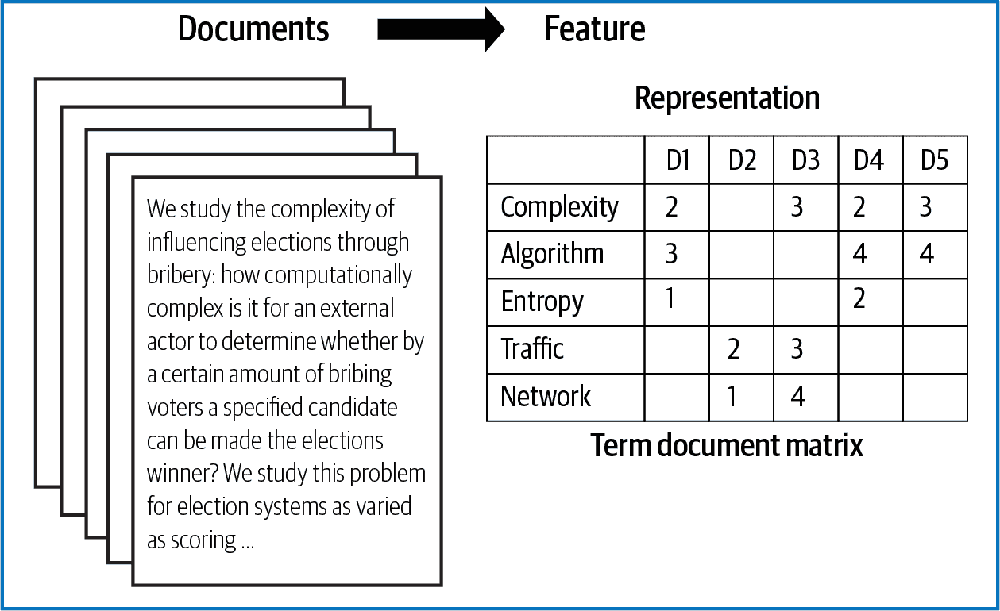
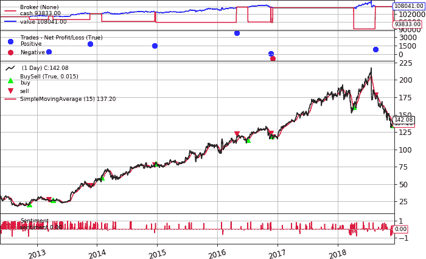

# 第十章：自然语言处理

自然语言处理（NLP）是人工智能的一个子领域，用于帮助计算机理解自然人类语言。大多数 NLP 技术依赖于机器学习来从人类语言中提取含义。当提供文本后，计算机利用算法从每个句子中提取相关的含义，并收集其中的关键数据。NLP 在许多领域以不同形式表现，有许多别名，包括（但不限于）文本分析、文本挖掘、计算语言学和内容分析。

在金融领域，NLP 最早的应用之一是由美国证券交易委员会（SEC）实施的。该组织使用文本挖掘和自然语言处理来检测会计欺诈。NLP 算法扫描和分析法律和其他文件的能力提供了银行和其他金融机构巨大的效率增益，帮助它们符合合规法规并打击欺诈行为。

在投资过程中，揭示投资见解不仅需要金融领域的专业知识，还需要对数据科学和机器学习原理有深厚的掌握。自然语言处理工具可以帮助检测、衡量、预测和预见重要的市场特征和指标，如市场波动性、流动性风险、金融压力、房价和失业率。

新闻一直是投资决策的关键因素。众所周知，公司特定的、宏观经济的和政治新闻强烈影响金融市场。随着技术的进步和市场参与者的日益联结，每日产生的文本数据量和频率将继续迅速增长。即使在今天，每天产生的文本数据量也使得即使是一个庞大的基础研究团队也难以应对。通过 NLP 技术辅助的基础分析现在对解锁专家和大众对市场感受的完整图片至关重要。

在银行和其他组织中，团队的分析师专注于浏览、分析和试图量化从新闻和 SEC 规定的报告中提取的定性数据。在这种背景下，利用 NLP 进行自动化是非常合适的。NLP 可以在分析和解释各种报告和文件时提供深入支持。这减轻了重复的、低价值任务给人类员工带来的压力。它还为本来主观解释提供了客观性和一致性；减少了人为错误带来的错误。NLP 还可以使公司获取见解，用于评估债权人风险或从网络内容中评估与品牌相关的情绪。

随着银行业和金融业中实时聊天软件的普及，基于自然语言处理的聊天机器人是其自然演变。预计将机器人顾问与聊天机器人结合起来，自动化整个财富和投资组合管理过程。

在本章中，我们介绍了三个基于自然语言处理的案例研究，涵盖了算法交易、聊天机器人创建以及文档解释与自动化等应用。这些案例研究遵循了在第二章中呈现的标准化七步模型开发过程。解决基于自然语言处理的问题的关键模型步骤包括数据预处理、特征表示和推理。因此，在本章中概述了这些领域及其相关概念和基于 Python 的示例。

“案例研究 1：基于情感分析的交易策略”展示了情感分析和词嵌入在交易策略中的应用。该案例研究突出了实施基于自然语言处理的交易策略的关键重点。

在“案例研究 2：聊天机器人数字助理”中，我们创建了一个聊天机器人，并展示了自然语言处理如何使聊天机器人理解消息并恰当地回应。我们利用基于 Python 的包和模块，在几行代码中开发了一个聊天机器人。

“案例研究 3：文档摘要”展示了使用基于自然语言处理的*主题建模*技术来发现文档间的隐藏主题或主题。这个案例研究的目的是演示利用自然语言处理自动总结大量文档以便于组织管理、搜索和推荐。

# 本章的代码库

本章的 Python 代码包含在在线 GitHub 代码库的[第十章 - 自然语言处理](https://oreil.ly/J2FFn)文件夹中。对于任何新的基于自然语言处理的案例研究，使用代码库中的通用模板，并修改特定于案例研究的元素。这些模板设计为在云端运行（例如 Kaggle、Google Colab 和 AWS）。

# 自然语言处理：Python 包

Python 是构建基于自然语言处理专家系统的最佳选择之一，为 Python 程序员提供了大量开源自然语言处理库。这些库和包包含了可直接使用的模块和函数，用于集成复杂的自然语言处理步骤和算法，使得实施快速、简单且高效。

在本节中，我们将描述三个我们认为最有用的基于 Python 的自然语言处理库，并将在本章中使用它们。

## NLTK

[NLTK](https://www.nltk.org) 是最著名的 Python 自然语言处理库，已在多个领域取得了令人惊叹的突破。其模块化结构使其非常适合学习和探索自然语言处理的概念。然而，它的功能强大，学习曲线陡峭。

NLTK 可以使用常规安装程序安装。安装 NLTK 后，还需要下载 NLTK Data。NLTK Data 包含了一个用于英语的预训练分词器 `punkt`，也可以下载：

```py
import nltk
import nltk.data
nltk.download('punkt')
```

## TextBlob

[TextBlob](https://oreil.ly/tABh4) 建立在 NLTK 之上。这是一个用于快速原型设计或构建应用程序的最佳库之一，其性能要求最低。TextBlob 通过为 NLTK 提供直观的接口，简化了文本处理。可以使用以下命令导入 TextBlob：

```py
from textblob import TextBlob
```

## spaCy

[spaCy](https://spacy.io) 是一个专为快速、简洁和即用型设计的 NLP 库。其理念是为每个目的只提供一种算法（最佳算法）。我们不必做出选择，可以专注于提高工作效率。spaCy 使用自己的管道同时执行多个预处理步骤。我们将在随后的部分进行演示。

spaCy 的模型可以安装为 Python 包，就像任何其他模块一样。要加载模型，请使用 `spacy.load` 与模型的快捷链接或包名称或数据目录的路径：

```py
import spacy
nlp = spacy.load("en_core_web_lg")
```

除了这些之外，还有一些其他库，比如 gensim，我们将在本章的一些示例中探索它们。

# 自然语言处理：理论与概念

正如我们已经确定的，NLP 是人工智能的一个子领域，涉及编程使计算机处理文本数据以获取有用的洞见。所有 NLP 应用程序都经历常见的顺序步骤，包括某种形式的文本数据预处理，并在将其输入统计推断算法之前将文本表示为预测特征。图 10-1 概述了基于 NLP 的应用程序中的主要步骤。


###### 图 10-1\. 自然语言处理流水线

下一节将回顾这些步骤。如需全面了解该主题，可参考 Steven Bird、Ewan Klein 和 Edward Loper（O’Reilly）的[*Python 自然语言处理*](https://www.oreilly.com/library/view/natural-language-processing/9780596803346)。

## 1\. 预处理

在为 NLP 预处理文本数据时通常涉及多个步骤。图 10-1 显示了用于 NLP 预处理步骤的关键组件。这些步骤包括分词、去停用词、词干提取、词形还原、词性标注和命名实体识别。

### 1.1\. 分词

*分词*是将文本分割成有意义的片段（称为标记）的任务。这些片段可以是单词、标点符号、数字或其他构成句子的特殊字符。一组预定的规则使我们能够有效地将句子转换为标记列表。以下代码片段展示了使用 NLTK 和 TextBlob 包进行示例词分词的样本：

```py
#Text to tokenize
text = "This is a tokenize test"
```

NLTK 数据包中包含了一个预训练的英文 `Punkt` 分词器，之前已加载：

```py
from nltk.tokenize import word_tokenize
word_tokenize(text)
```

`输出`

```py
['This', 'is', 'a', 'tokenize', 'test']
```

让我们看看使用 TextBlob 进行标记化：

```py
TextBlob(text).words
```

`输出`

```py
WordList(['This', 'is', 'a', 'tokenize', 'test'])
```

### 1.2\. 停用词移除

有时，在建模中排除那些提供很少价值的极为常见的单词。这些单词被称为停用词。使用 NLTK 库去除停用词的代码如下所示：

```py
text = "S&P and NASDAQ are the two most popular indices in US"

from nltk.corpus import stopwords
from nltk.tokenize import word_tokenize
stop_words = set(stopwords.words('english'))
text_tokens = word_tokenize(text)
tokens_without_sw= [word for word in text_tokens if not word in stop_words]

print(tokens_without_sw)
```

`输出`

```py
['S', '&', 'P', 'NASDAQ', 'two', 'popular', 'indices', 'US']
```

首先加载语言模型并将其存储在停用词变量中。`stopwords.words('english')` 是 NLTK 语言模型中默认的英语停用词集合。接下来，我们只需迭代输入文本中的每个单词，如果该单词存在于 NLTK 语言模型的停用词集合中，则将其移除。正如我们所见，像 *are* 和 *most* 这样的停用词已从句子中移除。

### 1.3\. 词干提取

*词干提取* 是将屈折（或有时是派生）的单词减少为它们的词干、基本形式或根形式（通常是书面单词形式）的过程。例如，如果我们对 *Stems*, *Stemming*, *Stemmed*, 和 *Stemitization* 进行词干提取，结果将是一个单词：*Stem*。使用 NLTK 库进行词干提取的代码如下：

```py
text = "It's a Stemming testing"

parsed_text = word_tokenize(text)

# Initialize stemmer.
from nltk.stem.snowball import SnowballStemmer
stemmer = SnowballStemmer('english')

# Stem each word.
[(word, stemmer.stem(word)) for i, word in enumerate(parsed_text)
 if word.lower() != stemmer.stem(parsed_text[i])]
```

`输出`

```py
[('Stemming', 'stem'), ('testing', 'test')]
```

### 1.4\. 词形还原

*词形归并* 是词干提取的一个轻微变体。两个过程的主要区别在于，词干提取通常会创建不存在的单词，而词形归并产生的是实际的单词形式。词形归并的一个例子是将 *run* 作为 *running* 和 *ran* 等词的基本形式，或者将 *better* 和 *good* 视为相同的词形。使用 TextBlob 库进行词形归并的代码如下所示：

```py
text = "This world has a lot of faces "

from textblob import Word
parsed_data= TextBlob(text).words
[(word, word.lemmatize()) for i, word in enumerate(parsed_data)
 if word != parsed_data[i].lemmatize()]
```

`输出`

```py
[('has', 'ha'), ('faces', 'face')]
```

### 1.5\. 词性标注

*词性标注* 是将一个标记分配给它的语法类别（例如动词、名词等）的过程，以便理解它在句子中的角色。词性标记已被用于各种自然语言处理任务，并且非常有用，因为它们提供了一个关于单词在短语、句子或文档中使用方式的语言信号。

在将句子分割为标记后，使用一个标记器或词性标注器将每个标记分配到一个词性类别中。在历史上，使用[隐马尔可夫模型（HMM）](https://oreil.ly/OpuRm)来创建这样的标注器。近年来，也开始使用人工神经网络。使用 TextBlob 库进行词性标注的代码如下所示：

```py
text = 'Google is looking at buying U.K. startup for $1 billion'
TextBlob(text).tags
```

`输出`

```py
[('Google', 'NNP'),
 ('is', 'VBZ'),
 ('looking', 'VBG'),
 ('at', 'IN'),
 ('buying', 'VBG'),
 ('U.K.', 'NNP'),
 ('startup', 'NN'),
 ('for', 'IN'),
 ('1', 'CD'),
 ('billion', 'CD')]
```

### 1.6\. 命名实体识别

*命名实体识别*（NER）是数据预处理中的可选下一步，旨在将文本中的命名实体定位并分类到预定义的类别中。这些类别可以包括人名、组织名、地点名、时间表达、数量、货币值或百分比。使用 spaCy 进行的命名实体识别如下所示：

```py
text = 'Google is looking at buying U.K. startup for $1 billion'

for entity in nlp(text).ents:
    print("Entity: ", entity.text)
```

`输出`

```py
Entity:  Google
Entity:  U.K.
Entity:  $1 billion
```

在文本中使用 `displacy` 模块来可视化命名实体，如 图 10-2 所示，可以极大地帮助加快开发和调试代码以及训练过程：

```py
from spacy import displacy
displacy.render(nlp(text), style="ent", jupyter = True)
```


###### 图 10-2\. 命名实体识别输出

#### 1.7\. spaCy：一步到位地执行上述所有步骤

所有上述预处理步骤可以在 spaCy 中一步完成。当我们在文本上调用*nlp*时，spaCy 首先对文本进行标记化以生成*Doc*对象。然后，*Doc*在多个不同的步骤中进行处理。这也称为*处理管道*。默认模型使用的管道由*标记器*、*解析器*和*实体识别器*组成。每个管道组件返回处理后的*Doc*，然后传递给下一个组件，如图 10-3 所示。


###### 图 10-3\. spaCy 处理管道（基于[spaCy 网站](https://oreil.ly/ZhMlp)上的一幅图像）。

```py
Python code text = 'Google is looking at buying U.K. startup for $1 billion'
doc = nlp(text)
pd.DataFrame([[t.text, t.is_stop, t.lemma_, t.pos_]
              for t in doc],
             columns=['Token', 'is_stop_word', 'lemma', 'POS'])
```

`输出`

|  | 标记 | 是否停止词 | 词形 | 词性 |
| --- | --- | --- | --- | --- |
| 0 | Google | False | Google | PROPN |
| 1 | 是 | True | be | VERB |
| 2 | 看 | False | look | VERB |
| 3 | 在 | True | at | ADP |
| 4 | 购买 | False | buy | VERB |
| 5 | 英国 | False | U.K. | PROPN |
| 6 | startup | False | startup | NOUN |
| 7 | 对于 | True | for | ADP |
| 8 | $ | False | $ | SYM |
| 9 | 1 | False | 1 | NUM |
| 10 | 十亿 | False | billion | NUM |

每个预处理步骤的输出如上表所示。考虑到 spaCy 在单一步骤中执行广泛的自然语言处理任务，它是一个强烈推荐的包。因此，在我们的案例研究中，我们将广泛使用 spaCy。

除了上述预处理步骤外，还有其他经常使用的预处理步骤，例如*小写处理*或*非字母数字数据去除*，这些步骤取决于数据类型可以执行。例如，从网站上爬取的数据必须进一步清洗，包括去除 HTML 标签。从 PDF 报告中提取的数据必须转换为文本格式。

其他可选的预处理步骤包括依赖分析、核心指代消解、三元组提取和关系提取：

依赖分析

为句子分配句法结构，以理解句子中单词之间的关系。

核心指代消解

连接代表同一实体的标记的过程。在语言中，通常在一句话中引入主语并在随后的句子中用他/她/它代指他们。

三元组提取

在句子结构中记录主语、动词和宾语三元组的过程（可用时）。

关系提取

这是一个更广泛的三元组提取形式，其中实体可以有多种交互。

只有在有助于手头任务时才执行这些额外的步骤。我们将在本章的案例研究中展示这些预处理步骤的示例。

## 2\. 特征表示

大多数与自然语言处理相关的数据，如新闻稿、PDF 报告、社交媒体帖子和音频文件，都是为人类消费而创建的。因此，它们通常以非结构化格式存储，计算机无法直接处理。为了将预处理信息传递给统计推断算法，需要将标记转换为预测特征。模型用于将原始文本嵌入到*向量空间*中。

特征表示涉及两个方面：

+   已知单词的词汇表。

+   已知单词存在的度量。

一些特征表示方法包括：

+   词袋模型

+   TF-IDF

+   词嵌入

    +   预训练模型（例如 word2vec，[GloVe](https://oreil.ly/u9SZG)，spaCy 的词嵌入模型）

    +   自定义深度学习的特征表示¹

让我们更多地了解每种方法。

### 2.1\. 词袋模型—词频统计

在自然语言处理中，从文本中提取特征的常见技术是将文本中出现的所有单词放入一个桶中。这种方法称为*词袋*模型。它被称为词袋模型，因为它丢失了关于句子结构的任何信息。在这种技术中，我们从一组文本中构建一个单一的矩阵，如图 10-4 所示，其中每一行表示一个标记，每一列表示我们语料库中的一个文档或句子。矩阵的值表示标记出现的次数。



###### 图 10-4\. 词袋模型

`CountVectorizer`来自 sklearn，提供了一种简单的方法来对文本文档集合进行标记化，并使用该词汇表对新文档进行编码。`fit_transform`函数从一个或多个文档中学习词汇，并将每个文档编码为一个词向量：

```py
sentences = [
'The stock price of google jumps on the earning data today',
'Google plunge on China Data!'
]
from sklearn.feature_extraction.text import CountVectorizer
vectorizer = CountVectorizer()
print( vectorizer.fit_transform(sentences).todense() )
print( vectorizer.vocabulary_ )
```

`输出`

```py
[[0 1 1 1 1 1 1 0 1 1 2 1]
 [1 1 0 1 0 0 1 1 0 0 0 0]]
{'the': 10, 'stock': 9, 'price': 8, 'of': 5, 'google': 3, 'jumps':\
 4, 'on': 6, 'earning': 2, 'data': 1, 'today': 11, 'plunge': 7,\
 'china': 0}
```

我们可以看到编码向量的数组版本显示每个单词出现一次，除了*the*（索引 10），它出现了两次。词频是一个很好的起点，但它们非常基础。简单计数的一个问题是，像*the*这样的一些词会出现很多次，它们的大量计数在编码向量中意义不大。这些词袋表示是稀疏的，因为词汇量庞大，给定的单词或文档将由大部分零值组成。

### 2.2\. TF-IDF

另一种选择是计算词频，迄今为止最流行的方法是*TF-IDF*，即*词频-逆文档频率*：

词频

这总结了特定单词在文档中出现的频率。

逆文档频率

这降低了跨文档频繁出现的词的权重。

简单地说，TF-IDF 是一个单词频率分数，试图突出显示更有趣的单词（即在文档内频繁但在文档间不频繁）。*TfidfVectorizer* 将标记文档、学习词汇表和反文档频率加权，并允许您对新文档进行编码：

```py
from sklearn.feature_extraction.text import TfidfVectorizer
vectorizer = TfidfVectorizer(max_features=1000, stop_words='english')
TFIDF = vectorizer.fit_transform(sentences)
print(vectorizer.get_feature_names()[-10:])
print(TFIDF.shape)
print(TFIDF.toarray())
```

`输出`

```py
['china', 'data', 'earning', 'google', 'jumps', 'plunge', 'price', 'stock', \
'today']
(2, 9)
[[0\.         0.29017021 0.4078241  0.29017021 0.4078241  0.
  0.4078241  0.4078241  0.4078241 ]
 [0.57615236 0.40993715 0\.         0.40993715 0\.         0.57615236
  0\.         0\.         0\.        ]]
```

在提供的代码片段中，从文档中学习了一个包含九个单词的词汇表。每个单词在输出向量中被分配了一个唯一的整数索引。句子被编码为一个九元稀疏数组，我们可以通过不同于词汇表中其他单词的值来审查每个单词的最终得分。

### 2.3\. 单词嵌入

*单词嵌入* 使用稠密向量表示单词和文档。在嵌入中，单词通过稠密向量表示，其中向量表示单词投射到连续向量空间中。单词在向量空间中的位置是从文本中学习的，基于在使用单词时周围的单词。单词在学习的向量空间中的位置称为其*嵌入*。

从文本学习单词嵌入的一些模型包括 word2Vec、spaCy 的预训练单词嵌入模型和 GloVe。除了这些精心设计的方法外，单词嵌入还可以作为深度学习模型的一部分进行学习。这可能是一种较慢的方法，但它会根据特定的训练数据集调整模型。

### 2.3.1\. 预训练模型：通过 spaCy

spaCy 自带文本的向量表示，包括单词、句子和文档的不同级别。底层的向量表示来自于单词嵌入模型，通常生成单词的稠密、多维语义表示（如下例所示）。单词嵌入模型包括 20,000 个唯一的 300 维向量。利用这种向量表示，我们可以计算标记、命名实体、名词短语、句子和文档之间的相似性和不相似性。

在 spaCy 中，单词嵌入是通过首先加载模型然后处理文本来执行的。可以直接使用每个处理过的标记（即单词）的`.vector`属性访问向量。还可以通过使用向量来简单计算整个句子的平均向量，为基于句子的机器学习模型提供非常便捷的输入：

```py
doc = nlp("Apple orange cats dogs")
print("Vector representation of the sentence for first 10 features: \n", \
doc.vector[0:10])
```

`输出：`

```py
Vector representation of the sentence for first 10 features:
 [ -0.30732775 0.22351399 -0.110111   -0.367025   -0.13430001
   0.13790375 -0.24379876 -0.10736975  0.2715925   1.3117325 ]
```

在输出中显示了预训练模型的前十个特征的句子的向量表示。

### 2.3.2\. 预训练模型：使用 gensim 包的 Word2Vec

这里演示了使用[gensim 包](https://oreil.ly/p9hOJ)的基于 Python 的 word2vec 模型的实现：

```py
from gensim.models import Word2Vec

sentences = [
['The','stock','price', 'of', 'Google', 'increases'],
['Google','plunge',' on','China',' Data!']]

# train model
model = Word2Vec(sentences, min_count=1)

# summarize the loaded model
words = list(model.wv.vocab)
print(words)
print(model['Google'][1:5])
```

`输出`

```py
['The', 'stock', 'price', 'of', 'Google', 'increases', 'plunge', ' on', 'China',\
' Data!']
[-1.7868265e-03 -7.6242397e-04  6.0105987e-05  3.5568199e-03
]
```

上面显示了预训练的 word2vec 模型的前五个特征的句子的向量表示。

## 3\. 推理

与其他人工智能任务一样，由自然语言处理应用程序生成的推理通常需要被翻译成决策以便可执行。推理属于前面章节涵盖的三种机器学习类别之一（即，监督、无监督和强化学习）。虽然所需的推理类型取决于业务问题和训练数据的类型，但最常用的算法是监督和无监督。

在自然语言处理中，最常用的监督方法之一是 *Naive Bayes* 模型，因为它可以使用简单的假设产生合理的准确性。更复杂的监督方法是使用人工神经网络架构。在过去的几年中，这些架构，如循环神经网络 (RNNs)，已经主导了基于自然语言处理的推理。

自然语言处理中的大部分现有文献都集中在监督学习上。因此，无监督学习应用构成了一个相对不太发达的子领域，其中衡量 *文档相似性* 是最常见的任务之一。在自然语言处理中应用的一种流行的无监督技术是 *潜在语义分析* (LSA)。LSA 通过生成与文档和词相关的一组潜在概念来查看一组文档和它们包含的单词之间的关系。LSA 为一种更复杂的方法铺平了道路，这种方法称为 *潜在狄利克雷分配* (LDA)，在其中，文档被建模为主题的有限混合。这些主题又被建模为词汇表中的单词的有限混合。LDA 已被广泛用于 *主题建模* ——这是一个研究日益增长的领域，在该领域中，自然语言处理从业者构建概率生成模型以揭示单词可能的主题归属。

由于我们在前面的章节中已经审查了许多监督和无监督学习模型，所以我们将仅在接下来的章节中详细介绍 Naive Bayes 和 LDA 模型。这些模型在自然语言处理中被广泛使用，并且在前面的章节中没有涉及到。

### 3.1\. 监督学习示例—Naive Bayes

Naive Bayes 是一类基于应用 [*贝叶斯定理*](https://oreil.ly/bVeZK) 的算法族，其强（天真）假设是用于预测给定样本类别的每个特征都与其他特征无关。它们是概率分类器，因此将使用贝叶斯定理计算每个类别的概率。输出的将是具有最高概率的类别。

在自然语言处理中，Naive Bayes 方法假定所有单词特征在给定类标签的情况下彼此独立。由于这一简化假设，Naive Bayes 与词袋表示法非常兼容，并且已经证明在许多自然语言处理应用中快速、可靠和准确。此外，尽管有简化的假设，但它在某些情况下与更复杂的分类器相比具有竞争力甚至表现更好。

让我们来看看朴素贝叶斯在情感分析问题中的推理使用。我们拿一个包含两个带情感的句子的数据框架。在下一步中，我们使用`CountVectorizer`将这些句子转换为特征表示。这些特征和情感被用来训练和测试朴素贝叶斯模型：

```py
sentences = [
'The stock price of google jumps on the earning data today',
'Google plunge on China Data!']
sentiment = (1, 0)
data = pd.DataFrame({'Sentence':sentences,
        'sentiment':sentiment})

# feature extraction
from sklearn.feature_extraction.text import CountVectorizer
vect = CountVectorizer().fit(data['Sentence'])
X_train_vectorized = vect.transform(data['Sentence'])

# Running naive bayes model
from sklearn.naive_bayes import MultinomialNB
clfrNB = MultinomialNB(alpha=0.1)
clfrNB.fit(X_train_vectorized, data['sentiment'])

#Testing the model
preds = clfrNB.predict(vect.transform(['Apple price plunge',\
 'Amazon price jumps']))
preds
```

`Output`

```py
array([0, 1])
```

正如我们所见，朴素贝叶斯从这两个句子中很好地训练了模型。该模型为测试句子“Apple price plunge”和“Amazon price jumps”分别给出了情感值零和一，因为训练时使用的句子也具有关键词“plunge”和“jumps”，并对应情感分配。

### 3.2\. 无监督学习示例：LDA

LDA 广泛用于*主题建模*，因为它倾向于生成人类可以解释的有意义的主题，并为新文档分配主题，并且是可扩展的。它的工作方式首先是做出一个关键假设：文档是通过首先选择*主题*，然后对于每个主题选择一组*单词*来生成的。然后算法逆向工程这个过程来找出文档中的主题。

在下面的代码片段中，我们展示了一个用于主题建模的 LDA 实现。我们拿两个句子，并使用`CountVectorizer`将这些句子转换为特征表示。这些特征和情感被用来训练模型，并生成代表主题的两个较小的矩阵：

```py
sentences = [
'The stock price of google jumps on the earning data today',
'Google plunge on China Data!'
]

#Getting the bag of words
from sklearn.decomposition import LatentDirichletAllocation
vect=CountVectorizer(ngram_range=(1, 1),stop_words='english')
sentences_vec=vect.fit_transform(sentences)

#Running LDA on the bag of words.
from sklearn.feature_extraction.text import CountVectorizer
lda=LatentDirichletAllocation(n_components=3)
lda.fit_transform(sentences_vec)
```

`Output`

```py
array([[0.04283242, 0.91209846, 0.04506912],
       [0.06793339, 0.07059533, 0.86147128]])
```

在本章的第三个案例研究中，我们将使用 LDA 进行主题建模，并详细讨论概念和解释。

回顾一下，为了解决任何基于 NLP 的问题，我们需要遵循预处理、特征提取和推理步骤。现在，让我们深入研究案例研究。

# 案例研究 1：基于 NLP 和情感分析的交易策略

自然语言处理提供了量化文本的能力。人们可以开始问这样的问题：这篇新闻有多正面或负面？我们如何量化这些词语？

自然语言处理最显著的应用可能是在算法交易中的应用。NLP 提供了一种有效的监控市场情绪的手段。通过将基于 NLP 的情感分析技术应用于新闻文章、报告、社交媒体或其他网络内容，可以有效地确定这些来源的情感积分是正面的还是负面的。情感分数可以用作买入具有正面分数的股票和卖出具有负面分数的股票的定向信号。

基于文本数据的交易策略因非结构化数据量的增加而越来越受欢迎。在这个案例研究中，我们将看看如何使用基于 NLP 的情感来构建交易策略。

本案例研究结合了前几章介绍的概念。本案例研究的整体模型开发步骤与前几个案例研究中的七步模型开发类似，略有修改。


## 建立基于情感分析的交易策略的蓝图

### 1\. 问题定义

我们的目标是（1）使用 NLP 从新闻标题中提取信息，（2）为该信息分配情感，以及（3）使用情感分析构建交易策略。

本案例研究使用的数据将来自以下来源：

从几家新闻网站的 RSS 源编译的新闻标题数据

为了本研究的目的，我们只关注新闻标题，而不是整篇文章。我们的数据集包含从 2011 年 5 月至 2018 年 12 月约 82,000 个新闻标题。²

Yahoo Finance 网站上的股票数据

本案例研究中使用的股票回报数据来自 Yahoo Finance 的价格数据。

[Kaggle](https://www.kaggle.com)

我们将使用带标签的新闻情感数据进行基于分类的情感分析模型。请注意，这些数据可能并不完全适用于本案例，仅用于演示目的。

股市词汇表

*词汇表*指的是 NLP 系统中包含有关单词或词组的信息（语义、语法）的组件。这是根据微博服务中的股市交流创建的。³

本案例研究的关键步骤详见图 10-5。


###### 图 10-5\. 基于情感分析的交易策略步骤

一旦我们完成预处理，我们将研究不同的情感分析模型。情感分析步骤的结果用于开发交易策略。

### 2\. 入门—加载数据和 Python 包

#### 2.1\. 加载 Python 包

首先加载的一组库是上述的 NLP 专用库。有关其他库的详细信息，请参阅本案例研究的 Jupyter 笔记本。

```py
from textblob import TextBlob
import spacy
import nltk
import warnings
from nltk.sentiment.vader import SentimentIntensityAnalyzer
nltk.download('vader_lexicon')
nlp = spacy.load("en_core_web_lg")
```

#### 2.2\. 加载数据

在此步骤中，我们从 Yahoo Finance 加载股票价格数据。我们选择了 10 支股票作为本案例研究的对象。这些股票是标准普尔 500 指数中市值最大的股票之一：

```py
tickers = ['AAPL','MSFT','AMZN','GOOG','FB','WMT','JPM','TSLA','NFLX','ADBE']
start = '2010-01-01'
end = '2018-12-31'
df_ticker_return = pd.DataFrame()
for ticker in tickers:
    ticker_yf = yf.Ticker(ticker)
    if df_ticker_return.empty:
        df_ticker_return = ticker_yf.history(start = start, end = end)
        df_ticker_return['ticker']= ticker
    else:
        data_temp = ticker_yf.history(start = start, end = end)
        data_temp['ticker']= ticker
        df_ticker_return = df_ticker_return.append(data_temp)
df_ticker_return.to_csv(r'Data\Step3.2_ReturnData.csv')
```

```py
df_ticker_return.head(2)
```


数据包含股票的价格和成交量数据以及它们的代码名称。在下一步中，我们将研究新闻数据。

### 3\. 数据准备

在此步骤中，我们加载并预处理新闻数据，然后将新闻数据与股票回报数据合并。这个合并后的数据集将用于模型开发。

#### 3.1\. 预处理新闻数据

新闻数据从新闻 RSS 源下载，并以 JSON 格式保存。不同日期的 JSON 文件存储在一个压缩文件夹中。数据使用标准的网络抓取 Python 包 Beautiful Soup 下载。让我们来看看下载的 JSON 文件内容：

```py
z = zipfile.ZipFile("Data/Raw Headline Data.zip", "r")
testFile=z.namelist()[10]
fileData= z.open(testFile).read()
fileDataSample = json.loads(fileData)['content'][1:500]
fileDataSample
```

`输出`

```py
'li class="n-box-item date-title" data-end="1305172799" data-start="1305086400"
data-txt="Tuesday, December 17, 2019">Wednesday, May 11,2011</li><li
class="n-box-item sa-box-item" data-id="76179" data-ts="1305149244"><div
class="media media-overflow-fix"><div class-"media-left"><a class="box-ticker"
href="/symbol/CSCO" target="blank">CSCO</a></div><div class="media-body"<h4
class="media-heading"><a href="/news/76179" sasource="on_the_move_news_
fidelity" target="_blank">Cisco (NASDAQ:CSCO): Pr'
```

我们可以看到，JSON 格式不适合该算法。我们需要从 JSON 中获取新闻。在此步骤中，正则表达式成为关键部分。正则表达式可以在原始、混乱的文本中找到模式并执行相应的操作。以下函数通过使用 JSON 文件中编码的信息解析 HTML：

```py
def jsonParser(json_data):
    xml_data = json_data['content']

    tree = etree.parse(StringIO(xml_data), parser=etree.HTMLParser())

    headlines = tree.xpath("//h4[contains(@class, 'media-heading')]/a/text()")
    assert len(headlines) == json_data['count']

    main_tickers = list(map(lambda x: x.replace('/symbol/', ''),\
           tree.xpath("//div[contains(@class, 'media-left')]//a/@href")))
    assert len(main_tickers) == json_data['count']
    final_headlines = [''.join(f.xpath('.//text()')) for f in\
           tree.xpath("//div[contains(@class, 'media-body')]/ul/li[1]")]
    if len(final_headlines) == 0:
        final_headlines = [''.join(f.xpath('.//text()')) for f in\
           tree.xpath("//div[contains(@class, 'media-body')]")]
        final_headlines = [f.replace(h, '').split('\xa0')[0].strip()\
                           for f,h in zip (final_headlines, headlines)]
    return main_tickers, final_headlines
```

让我们看看运行 JSON 解析器后的输出：

```py
jsonParser(json.loads(fileData))[1][1]
```

`Output`

```py
'Cisco Systems (NASDAQ:CSCO) falls further into the red on FQ4
 guidance of $0.37-0.39 vs. $0.42 Street consensus. Sales seen flat
 to +2% vs. 8% Street view. CSCO recently -2.1%.'
```

如我们所见，JSON 解析后的输出转换为更易读的格式。

在评估情感分析模型时，我们还分析情感与后续股票表现之间的关系。为了理解这种关系，我们使用*事件回报*，即与事件相对应的回报。我们这样做是因为有时新闻报道较晚（即市场参与者已经了解公告），或者在市场关闭后。略微扩大窗口可以确保捕捉事件的本质。*事件回报*的定义如下：

<math><mrow><msub><mi>R</mi> <mrow><mi>t</mi><mo>–</mo><mn>1</mn></mrow></msub> <mo>+</mo> <msub><mi>R</mi> <mi>t</mi></msub> <mo>+</mo> <msub><mi>R</mi> <mrow><mi>t</mi><mo>+</mo><mn>1</mn></mrow></msub></mrow></math>

其中 <math display="inline"><mrow><msub><mi>R</mi> <mrow><mi>t</mi><mo>–</mo><mn>1</mn></mrow></msub> <mo>,</mo> <msub><mi>R</mi> <mrow><mi>t</mi><mo>+</mo><mn>1</mn></mrow></msub></mrow></math> 是新闻数据前后的回报，而 <math alttext="upper R Subscript t"><msub><mi>R</mi> <mi>t</mi></msub></math> 是新闻当天的回报（即时间 *t*）。

让我们从数据中提取事件回报：

```py
#Computing the return
df_ticker_return['ret_curr'] = df_ticker_return['Close'].pct_change()
#Computing the event return
df_ticker_return['eventRet'] = df_ticker_return['ret_curr']\
 + df_ticker_return['ret_curr'].shift(-1) + df_ticker_return['ret_curr'].shift(1)
```

现在我们已经准备好了所有数据。我们将准备一个合并的数据框架，其中将新闻标题映射到日期，回报（事件回报、当前回报和次日回报）和股票代码。此数据框将用于构建情感分析模型和交易策略：

```py
combinedDataFrame = pd.merge(data_df_news, df_ticker_return, how='left', \
left_on=['date','ticker'], right_on=['date','ticker'])
combinedDataFrame = combinedDataFrame[combinedDataFrame['ticker'].isin(tickers)]
data_df = combinedDataFrame[['ticker','headline','date','eventRet','Close']]
data_df = data_df.dropna()
data_df.head(2)
```

`Output`

|  | ticker | headline | date | eventRet | Close |
| --- | --- | --- | --- | --- | --- |
| 5 | AMZN | Whole Foods (WFMI) –5.2% following a downgrade… | 2011-05-02 | 0.017650 | 201.19 |
| 11 | NFLX | Netflix (NFLX +1.1%) shares post early gains a… | 2011-05-02 | –0.013003 | 33.88 |

让我们看看数据的整体形状：

```py
print(data_df.shape, data_df.ticker.unique().shape)
```

`Output`

```py
(2759, 5) (10,)
```

在此步骤中，我们准备了一个干净的数据框架，其中包含 10 个股票代码的标题、事件回报、给定日期的回报和未来 10 天的回报，总共有 2759 行数据。让我们在下一步中评估情感分析模型。

### 4\. 评估情感分析模型

在本节中，我们将讨论以下三种计算新闻情绪的方法：

+   预定义模型—TextBlob 包

+   调整模型—分类算法和 LSTM

+   基于金融词汇的模型

让我们逐步进行。

#### 4.1\. 预定义模型—TextBlob 包

`TextBlob 情绪`函数是基于朴素贝叶斯分类算法的预训练模型。该函数将经常出现在电影评论中的形容词映射到从–1 到+1（负面到正面）的情绪极性分数，将句子转换为数值。我们将其应用在所有的头条新闻上。以下是获取新闻文本情感的示例：

```py
text = "Bayer (OTCPK:BAYRY) started the week up 3.5% to €74/share in Frankfurt, \
touching their
highest level in 14 months, after the U.S. government said \
 a $25M glyphosate decision against the
company should be reversed."

TextBlob(text).sentiment.polarity
```

`输出`

```py
0.5
```

该声明的情绪为 0.5。我们将其应用在我们拥有的所有头条新闻上：

```py
data_df['sentiment_textblob'] = [TextBlob(s).sentiment.polarity for s in \
data_df['headline']]
```

让我们检查散点图的情绪和回报，以检查所有 10 只股票之间的相关性。


单个股票（APPL）的图表也显示在以下图表中（有关代码的详细信息，请参见 GitHub 存储库中的 Jupyter 笔记本）：


从散点图中我们可以看出，新闻和情绪之间没有很强的关系。回报与情绪之间的相关性是正的（4.27%），这意味着情绪积极的新闻导致积极的回报，这是预期的。然而，相关性并不是很高。即使在整体的散点图上看，我们看到大多数情绪集中在零附近。这引发了一个问题，即电影评论训练的情感评分是否适用于股票价格。`sentiment_assessments`属性列出了每个标记的基础值，可以帮助我们理解句子整体情绪的原因：

```py
text = "Bayer (OTCPK:BAYRY) started the week up 3.5% to €74/share\
in Frankfurt, touching their highest level in 14 months, after the\
U.S. government said a $25M glyphosate decision against the company\
should be reversed."
TextBlob(text).sentiment_assessments
```

`输出`

```py
Sentiment(polarity=0.5, subjectivity=0.5, assessments=[(['touching'], 0.5, 0.5, \
None)])
```

我们看到这个声明的情绪是 0.5，但似乎是“touching”这个词引起了积极情绪。更直观的词语，如“high”，却没有。这个例子显示了训练数据的上下文对于情感分数的意义是重要的。在进行情感分析之前，有许多预定义的包和函数可供使用，但在使用函数或算法进行情感分析之前，认真并全面了解问题的背景是很重要的。

对于这个案例研究，我们可能需要针对金融新闻进行情感训练。让我们在下一步中看看。

### 4.2\. 监督学习——分类算法和 LSTM

在这一步中，我们根据可用的标记数据开发了一个定制的情绪分析模型。这些标签数据是从[Kaggle 网站](https://www.kaggle.com)获取的。

```py
sentiments_data = pd.read_csv(r'Data\LabelledNewsData.csv', \
encoding="ISO-8859-1")
sentiments_data.head(1)
```

`输出`

|  | 日期时间 | 标题 | 股票 | 情绪 |
| --- | --- | --- | --- | --- |
| 0 | 1/16/2020 5:25 | $MMM 遭遇困境，但可能即将… | MMM | 0 |
| 1 | 1/11/2020 6:43 | Wolfe Research 将 3M $MMM 升级为“同行表现…… | MMM | 1 |

数据包括 30 个不同股票的新闻标题，总计 9,470 行，并且有情感标签为零或一。我们使用第六章中呈现的分类模型开发模板执行分类步骤。

为了运行监督学习模型，我们首先需要将新闻标题转换为特征表示。在本练习中，底层的向量表示来自于一个*spaCy 词嵌入模型*，通常会生成单词的密集的、多维的语义表示（如下例所示）。词嵌入模型包括 20,000 个唯一向量，每个向量有 300 维。我们在前一步骤处理的所有新闻标题上应用此模型：

```py
all_vectors = pd.np.array([pd.np.array([token.vector for token in nlp(s) ]).\
mean(axis=0)*pd.np.ones((300))\
 for s in sentiments_data['headline']])
```

现在我们已经准备好独立变量，我们将以与第六章讨论类似的方式训练分类模型。我们将情感标签为零或一作为因变量。首先我们将数据分成训练集和测试集，并运行关键的分类模型（即逻辑回归、CART、SVM、随机森林和人工神经网络）。

我们还将包括 LSTM 在内，这是一种基于 RNN 的模型，⁵列入考虑的模型列表中。基于 RNN 的模型在自然语言处理中表现良好，因为它存储当前特征以及相邻特征以进行预测。它根据过去的信息维持记忆，使得模型能够根据长距离特征预测当前输出，并查看整个句子上下文中的单词，而不仅仅是看个别单词。

为了能够将数据输入我们的 LSTM 模型，所有输入文档必须具有相同的长度。我们使用 Keras `tokenizer`函数对字符串进行标记化，然后使用`texts_to_sequences`将单词序列化。更多细节可以在[Keras 网站](https://oreil.ly/2YS-P)上找到。我们将通过截断较长的评论并使用空值（0）填充较短的评论，将最大评论长度限制为*max_words*。我们可以使用 Keras 中的`pad_sequences`函数来实现这一点。第三个参数是*input_length*（设置为 50），即每个评论序列的长度：

```py
### Create sequence
vocabulary_size = 20000
tokenizer = Tokenizer(num_words= vocabulary_size)
tokenizer.fit_on_texts(sentiments_data['headline'])
sequences = tokenizer.texts_to_sequences(sentiments_data['headline'])
X_LSTM = pad_sequences(sequences, maxlen=50)
```

在以下代码片段中，我们使用 Keras 库基于底层的 LSTM 模型构建了一个人工神经网络分类器。网络从一个*嵌入*层开始。该层允许系统将每个令牌扩展到一个较大的向量，使得网络能够以有意义的方式表示单词。该层将 20,000 作为第一个参数（即我们词汇的大小），300 作为第二个输入参数（即嵌入的维度）。最后，考虑到这是一个分类问题，输出需要被标记为零或一，`KerasClassifier`函数被用作 LSTM 模型的包装器以生成二进制（零或一）输出：

```py
from keras.wrappers.scikit_learn import KerasClassifier
def create_model(input_length=50):
    model = Sequential()
    model.add(Embedding(20000, 300, input_length=50))
    model.add(LSTM(100, dropout=0.2, recurrent_dropout=0.2))
    model.add(Dense(1, activation='sigmoid'))
    model.compile(loss='binary_crossentropy', optimizer='adam', \
    metrics=['accuracy'])
    return model
model_LSTM = KerasClassifier(build_fn=create_model, epochs=3, verbose=1, \
  validation_split=0.4)
model_LSTM.fit(X_train_LSTM, Y_train_LSTM)
```

所有机器学习模型的比较如下：


如预期，LSTM 模型在测试集中表现最佳（准确率为 96.7%），相比其他模型。ANN 的性能，训练集准确率为 99%，测试集准确率为 93.8%，与基于 LSTM 的模型相媲美。随机森林（RF）、支持向量机（SVM）和逻辑回归（LR）的性能也很合理。CART 和 KNN 的表现不如其他模型。CART 显示出严重的过拟合。让我们使用 LSTM 模型来计算数据中的情感值。

### 4.3\. 无监督——基于金融词汇表的模型

在这个案例研究中，我们将 VADER 词汇表与适用于股市微博服务的词汇和情感进行更新：

词典

专门用于分析情感的特殊词典或词汇表。大多数词典都列有带有与之相关的分数的正面和负面 *极性* 词语。使用各种技术，如词语的位置、周围的词语、上下文、词类和短语，为我们想要计算情感的文档分配分数。在聚合这些分数之后，我们得到最终的情感：

VADER（情感推理的价值感知词典）

NLTK 包中包含的预建情感分析模型。它可以给出文本样本的正负极性分数以及情感强度。这是基于规则的，并且在很大程度上依赖于人工标注的文本。这些是根据它们的语义取向（正面或负面）标记的单词或任何文本形式的通信。

这个词汇资源是利用各种统计措施和大量来自 StockTwits 的标记消息自动创建的，StockTwits 是一个专为投资者、交易员和企业家分享想法而设计的社交媒体平台。⁶ 这些情感分数介于-1 和 1 之间，与 TextBlob 的情感分析类似。在以下代码片段中，我们基于金融情感来训练模型：

```py
# stock market lexicon
sia = SentimentIntensityAnalyzer()
stock_lex = pd.read_csv('Data/lexicon_data/stock_lex.csv')
stock_lex['sentiment'] = (stock_lex['Aff_Score'] + stock_lex['Neg_Score'])/2
stock_lex = dict(zip(stock_lex.Item, stock_lex.sentiment))
stock_lex = {k:v for k,v in stock_lex.items() if len(k.split(' '))==1}
stock_lex_scaled = {}
for k, v in stock_lex.items():
    if v > 0:
        stock_lex_scaled[k] = v / max(stock_lex.values()) * 4
    else:
        stock_lex_scaled[k] = v / min(stock_lex.values()) * -4

final_lex = {}
final_lex.update(stock_lex_scaled)
final_lex.update(sia.lexicon)
sia.lexicon = final_lex
```

让我们来检查一条新闻的情感：

```py
text = "AAPL is trading higher after reporting its October sales\
rose 12.6% M/M. It has seen a 20%+ jump in orders"
```

```py
sia.polarity_scores(text)['compound']
```

`Output`

```py
0.4535
```

我们根据数据集中的所有新闻标题获取情感值：

```py
vader_sentiments = pd.np.array([sia.polarity_scores(s)['compound']\
 for s in data_df['headline']])
```

让我们来看看基于词典的方法计算整个数据集的回报和情感之间的关系。


针对低情感分数的高回报实例不多，但数据可能不太清晰。我们将在下一节更深入地比较不同类型的情感分析。

### 4.4\. 探索性数据分析和比较

在本节中，我们比较了使用上述不同技术计算的情感。让我们看一下样本标题和三种不同方法的情感分析，然后进行视觉分析：

|  | 股票代码 | 头条 | 情感 _textblob | 情感 _LSTM | 情感 _ 词汇 |
| --- | --- | --- | --- | --- | --- |
| 4620 | 台积电 | 台积电（TSM +1.8%）在报告其 10 月销售额环比上升 12.6%后交易更高。《DigiTimes》补充道，TSMC 从高通、英伟达、联发科和联咏等公司那里看到订单增长超过 20%。这些数字表明，尽管 12 月通常疲软，但 TSMC 可能会超过其第四季度的指导，而芯片需求可能正在通过库存调整后稳定下来。（此前）（联电销售） | 0.036667 | 1 | 0.5478 |

查看其中一个标题，这个句子的情感是积极的。然而，TextBlob 的情感结果较小，表明情感更为中性。这再次指向之前的假设，即基于电影情感训练的模型可能不适合股票情感。基于分类的模型正确指出情感是积极的，但是它是二进制的。`Sentiment_lex`给出了一个更直观的输出，情感显著为积极。

让我们审视来自不同方法的所有情感与回报的相关性：


所有情感与回报都有正相关关系，这是直觉和预期的。从词汇学方法来看，所有股票的事件回报可以通过这种方法预测得最好。请记住，这种方法利用了金融术语来建模。基于 LSTM 的方法性能也优于 TextBlob 方法，但与基于词汇的方法相比稍逊一筹。

让我们来看看股票级别的方法论表现。我们选择了市值最高的几个股票进行分析：


查看图表，从词汇学方法论来看，所有股票代码中的相关性最高，这与之前分析的结论一致。这意味着可以最好地使用词汇学方法预测回报。基于 TextBlob 的情感分析在某些情况下显示出不直观的结果，比如在 JPM 的情况下。

让我们来看看 AMZN 和 GOOG 的词汇学与 TextBlob 方法的散点图。由于二进制情感在散点图中没有意义，我们将 LSTM 方法搁置一边：


左侧基于词汇的情感显示出情感与收益之间的正相关关系。一些具有最高收益的点与最积极的新闻相关联。此外，与 TextBlob 相比，基于词汇的散点图更加均匀分布。TextBlob 的情感集中在零附近，可能是因为该模型无法很好地分类金融情感。对于交易策略，我们将使用基于词汇的情感，因为根据本节的分析，这些是最合适的选择。基于 LSTM 的情感也不错，但它们被标记为零或一。更为细粒度的基于词汇的情感更受青睐。

### 5\. 模型评估—构建交易策略

情感数据可以通过多种方式用于构建交易策略。情感可以作为独立信号用于决定买入、卖出或持有操作。情感评分或词向量还可以用于预测股票的收益或价格。该预测可以用于构建交易策略。

在本节中，我们展示了一种交易策略，根据以下方法买入或卖出股票：

+   当情感评分变化（当前情感评分/前一情感评分）大于 0.5 时购买股票。当情感评分变化小于-0.5 时卖出股票。此处使用的情感评分基于前一步骤中计算的基于词汇的情感。

+   除了情感之外，在做出买卖决策时我们还使用了移动平均（基于过去 15 天的数据）。

+   交易（即买入或卖出）以 100 股为单位。用于交易的初始金额设定为$100,000。

根据策略的表现，可以调整策略阈值、手数和初始资本。

#### 5.1\. 设置策略

为了设置交易策略，我们使用*backtrader*，这是一个便捷的基于 Python 的框架，用于实现和回测交易策略。Backtrader 允许我们编写可重用的交易策略、指标和分析器，而无需花费时间建设基础设施。我们使用[backtrader 文档中的快速入门代码](https://oreil.ly/lyYs4)作为基础，并将其调整为基于情感的交易策略。

以下代码片段总结了策略的买入和卖出逻辑。详细的实现请参考本案例研究的 Jupyter 笔记本：

```py
# buy if current close more than simple moving average (sma)
# AND sentiment increased by >= 0.5
if self.dataclose[0] > self.sma[0] and self.sentiment - prev_sentiment >= 0.5:
  self.order = self.buy()

# sell if current close less than simple moving average(sma)
# AND sentiment decreased by >= 0.5
if self.dataclose[0] < self.sma[0] and self.sentiment - prev_sentiment <= -0.5:
  self.order = self.sell()
```

#### 5.2\. 单个股票的结果

首先，我们在 GOOG 上运行我们的策略并查看结果：

```py
ticker = 'GOOG'
run_strategy(ticker, start = '2012-01-01', end = '2018-12-12')
```

输出显示了某些日子的交易日志和最终收益：

`Output`

```py
Starting Portfolio Value: 100000.00
2013-01-10, Previous Sentiment 0.08, New Sentiment 0.80 BUY CREATE, 369.36
2014-07-17, Previous Sentiment 0.73, New Sentiment -0.22 SELL CREATE, 572.16
2014-07-18, OPERATION PROFIT, GROSS 22177.00, NET 22177.00
2014-07-18, Previous Sentiment -0.22, New Sentiment 0.77 BUY CREATE, 593.45
2014-09-12, Previous Sentiment 0.66, New Sentiment -0.05 SELL CREATE, 574.04
2014-09-15, OPERATION PROFIT, GROSS -1876.00, NET -1876.00
2015-07-17, Previous Sentiment 0.01, New Sentiment 0.90 BUY CREATE, 672.93
.
.
.
2018-12-11, Ending Value 149719.00
```

我们分析了由 backtrader 包生成的下图中的回测结果。详细的图表版本请参考本案例研究的 Jupyter 笔记本。


结果显示总体利润为$49,719。图表是由 backtrader 包生成的典型图表⁷，分为四个面板：

顶部面板

顶部面板是*现金价值观察者*。它在回测运行期间跟踪现金和总投资组合价值。在这次运行中，我们以$100,000 起步，以$149,719 结束。

第二面板

此面板是*交易观察者*。它显示每笔交易的实现利润/损失。交易定义为开仓和将头寸归零（直接或从多头到空头或空头到多头）。从这个面板来看，对于策略来说，有八次交易中的五次是盈利的。

第三面板

此面板是*买卖观察者*。它指示了买入和卖出操作的发生位置。总的来说，我们看到买入行为发生在股价上涨时，而卖出行为发生在股价开始下跌时。

底部面板

此面板显示情绪得分，介于-1 和 1 之间。

现在我们选择了其中一天（2015-07-17），当买入行动被触发，并分析了该天和前一天的谷歌新闻：

```py
GOOG_ticker= data_df[data_df['ticker'].isin([ticker])]
New= list(GOOG_ticker[GOOG_ticker['date'] ==  '2015-07-17']['headline'])
Old= list(GOOG_ticker[GOOG_ticker['date'] ==  '2015-07-16']['headline'])
print("Current News:",New,"\n\n","Previous News:", Old)
```

`Output`

```py
Current News: ["Axiom Securities has upgraded Google (GOOG +13.4%, GOOGL +14.8%)
to Buy following the company's Q2 beat and investor-pleasing comments about
spending discipline, potential capital returns, and YouTube/mobile growth. MKM
has launched coverage at Buy, and plenty of other firms have hiked their targets.
Google's market cap is now above $450B."]

Previous News: ["While Google's (GOOG, GOOGL) Q2 revenue slightly missed
estimates when factoring traffic acquisitions costs (TAC), its ex-TAC revenue of
$14.35B was slightly above a $14.3B consensus. The reason: TAC fell to 21% of ad
revenue from Q1's 22% and Q2 2014's 23%. That also, of course, helped EPS beat
estimates.", 'Google (NASDAQ:GOOG): QC2 EPS of $6.99 beats by $0.28.']
```

显然，选定日的新闻提到了谷歌的升级，这是一则积极的新闻。前一天提到了收入低于预期，这是一则负面新闻。因此，在选定的日子，新闻情绪发生了显著变化，导致交易算法触发了买入行动。

接下来，我们对 FB 运行策略：

```py
ticker = 'FB'
run_strategy(ticker, start = '2012-01-01', end = '2018-12-12')
```

`Output`

```py
Start Portfolio value: 100000.00
Final Portfolio Value: 108041.00
Profit: 8041.00
```



策略的回测结果的详细信息如下：

顶部面板

现金价值面板显示总体利润为$8,041。

第二面板

交易观察者面板显示，七次交易中有六次是盈利的。

第三面板

买卖观察者显示，总的来说，买入（卖出）行为发生在股价上涨（下跌）时。

底部面板

它显示了在 2013 年至 2014 年期间对于 FB 的积极情绪较高的数量。

#### 5.3\. 多只股票的结果

在上一步中，我们对各个股票执行了交易策略。在这里，我们对我们计算了情绪的所有 10 支股票进行了运行：

```py
results_tickers = {}
for ticker in tickers:
    results_tickers[ticker] = run_strategy(ticker, start = '2012-01-01', \
    end = '2018-12-12')
pd.DataFrame.from_dict(results_tickers).set_index(\
  [pd.Index(["PerUnitStartPrice", StrategyProfit'])])
```

`Output`


该策略表现相当不错，并为所有股票带来了总体利润。如前所述，买入和卖出行为的执行是以 100 手为单位进行的。因此，使用的美元金额与股票价格成比例。我们看到 AMZN 和 GOOG 的名义利润最高，这主要归因于对这些股票的高金额投资，考虑到它们的高股价。除了总体利润之外，还可以使用几个其他指标，如夏普比率和最大回撤，来分析绩效。

### 5.4\. 变化策略时间段

在前面的分析中，我们使用了从 2011 年到 2018 年的时间段进行了回测。在这一步骤中，为了进一步分析我们策略的有效性，我们变化了回测的时间段并分析了结果。首先，我们在 2012 年到 2014 年之间为所有股票运行了该策略：

```py
results_tickers = {}
for ticker in tickers:
    results_tickers[ticker] = run_strategy(ticker, start = '2012-01-01', \
    end = '2014-12-31')
```

`Output`


该策略使得除了 AMZN 和 WMT 之外的所有股票总体上获利。现在我们在 2016 年到 2018 年之间运行该策略：

```py
results_tickers = {}
for ticker in tickers:
    results_tickers[ticker] = run_strategy(ticker, start = '2016-01-01', \
    end = '2018-12-31')
```

`Output`


我们看到情感驱动策略在所有股票中的表现良好，除了 AAPL 外，我们可以得出它在不同时间段表现相当不错的结论。该策略可以通过修改交易规则或手数大小进行调整。还可以使用其他指标来理解策略的表现。情感还可以与其他特征一起使用，如相关变量和技术指标用于预测。

### 结论

在这个案例研究中，我们探讨了将非结构化数据转换为结构化数据，并使用自然语言处理工具进行分析和预测的各种方法。我们展示了三种不同的方法，包括使用深度学习模型开发计算情绪的模型。我们对这些模型进行了比较，并得出结论：在训练情绪分析模型时，使用领域特定的词汇表是其中一个最重要的步骤。

我们还使用了 spaCy 的预训练英语模型将句子转换为情感，并将情感用作开发交易策略的信号。初步结果表明，基于金融词汇的情感模型训练可能是一个可行的交易策略模型。可以通过使用更复杂的预训练情感分析模型（如 Google 的 BERT）或开源平台上其他预训练的自然语言处理模型来进一步改进这一模型。现有的 NLP 库填补了一些预处理和编码步骤，使我们能够专注于推理步骤。

通过包括更多相关变量、技术指标或使用更复杂的预处理步骤和基于更相关的金融文本数据的模型，我们可以进一步完善基于情感的交易策略。


# 案例研究 2：聊天机器人数字助理

*Chatbots* 是能够用自然语言与用户进行对话的计算机程序。它们能够理解用户的意图，并根据组织的业务规则和数据发送响应。这些聊天机器人使用深度学习和自然语言处理（NLP）来处理语言，从而能够理解人类的语音。

越来越多的聊天机器人正在金融服务领域得到应用。银行业的机器人使消费者能够查询余额、转账、支付账单等。经纪业的机器人使消费者能够找到投资选项、进行投资并跟踪余额。客户支持机器人提供即时响应，显著提高客户满意度。新闻机器人提供个性化的当前事件信息，企业机器人使员工能够查询休假余额、提交费用、检查库存余额并批准交易。除了自动化协助客户和员工的过程外，聊天机器人还可以帮助金融机构获取有关客户的信息。这种机器人现象有潜力在金融部门的许多领域引发广泛的颠覆。

根据机器人的编程方式，我们可以将聊天机器人分为两种变体：

基于规则

这种类型的聊天机器人根据规则进行训练。这些聊天机器人不通过交互学习，并且有时无法回答超出定义规则的复杂查询。

自学习

这种类型的聊天机器人依赖于机器学习和人工智能技术与用户交谈。自学习聊天机器人进一步分为*检索型*和*生成型*：

检索型

这些聊天机器人被训练来从有限的预定义响应集中排名最佳响应。

生成型

这些聊天机器人不是通过预定义的响应构建的。相反，它们是使用大量先前对话来训练的。它们需要大量的对话数据来进行训练。

在这个案例研究中，我们将原型化一个可以回答财务问题的自学习聊天机器人。


## 使用自然语言处理创建自定义聊天机器人的蓝图

### 1\. 问题定义

这个案例研究的目标是建立一个基本的基于自然语言处理的对话式聊天机器人原型。这种聊天机器人的主要目的是帮助用户检索特定公司的财务比率。这些聊天机器人旨在快速获取有关股票或工具的详细信息，以帮助用户进行交易决策。

除了检索财务比率，聊天机器人还可以与用户进行随意的对话，执行基本的数学计算，并为训练使用的问题提供答案。我们打算使用 Python 包和函数来创建聊天机器人，并定制聊天机器人架构的多个组件，以适应我们的需求。

在这个案例研究中创建的聊天机器人原型旨在理解用户输入和意图，并检索他们正在寻找的信息。这是一个小型原型，可以改进为在银行业务、经纪业务或客户支持中用作信息检索机器人。

### 2\. 入门—加载库

对于这个案例研究，我们将使用两个基于文本的库：spaCy 和 [ChatterBot](https://oreil.ly/_1DPE)。spaCy 已经被介绍过；ChatterBot 是一个用于创建简单聊天机器人的 Python 库，只需很少的编程即可。

一个未经训练的 ChatterBot 实例开始时不具有沟通的知识。每次用户输入语句时，库都会保存输入和响应文本。随着 ChatterBot 收到更多的输入，它能够提供的响应数量和这些响应的准确性会增加。程序通过搜索与输入最接近的已知语句来选择响应。然后，根据每个响应被与机器人交流的人们发出的频率，返回对该语句的最有可能的响应。

#### 2.1\. 加载库

我们使用以下 Python 代码导入 spaCy：

```py
import spacy #Custom NER model.
from spacy.util import minibatch, compounding
```

ChatterBot 库具有模块 `LogicAdapter`、`ChatterBotCorpusTrainer` 和 `ListTrainer`。我们的机器人使用这些模块构建响应用户查询的响应。我们从导入以下开始：

```py
from chatterbot import ChatBot
from chatterbot.logic import LogicAdapter
from chatterbot.trainers import ChatterBotCorpusTrainer
from chatterbot.trainers import ListTrainer
```

此练习中使用的其他库如下：

```py
import random
from itertools import product
```

在我们转向定制的聊天机器人之前，让我们使用 ChatterBot 包的默认特性开发一个聊天机器人。

### 3\. 训练默认聊天机器人

ChatterBot 和许多其他聊天机器人包都带有一个数据实用程序模块，可用于训练聊天机器人。以下是我们将要使用的 ChatterBot 组件：

逻辑适配器

逻辑适配器确定了 ChatterBot 如何选择响应给定输入语句的逻辑。您可以输入任意数量的逻辑适配器供您的机器人使用。在下面的示例中，我们使用了两个内置适配器：*BestMatch*，它返回最佳已知响应，以及 *MathematicalEvaluation*，它执行数学运算。

预处理器

ChatterBot 的预处理器是简单的函数，它们在逻辑适配器处理语句之前修改聊天机器人接收到的输入语句。预处理器可以定制以执行不同的预处理步骤，比如分词和词形还原，以便得到干净且处理过的数据。在下面的示例中，使用了清理空格的默认预处理器 `clean_whitespace`。

语料库训练

ChatterBot 自带一个语料库数据和实用程序模块，使得快速训练机器人进行通信变得容易。我们使用已有的语料库 *english, english.greetings* 和 *english.conversations* 来训练聊天机器人。

列表训练

就像语料库训练一样，我们使用 *ListTrainer* 训练聊天机器人可以用于训练的对话。在下面的示例中，我们使用了一些示例命令来训练聊天机器人。可以使用大量的对话数据来训练聊天机器人。

```py
chatB = ChatBot("Trader",
                preprocessors=['chatterbot.preprocessors.clean_whitespace'],
                logic_adapters=['chatterbot.logic.BestMatch',
                                'chatterbot.logic.MathematicalEvaluation'])

# Corpus Training
trainerCorpus = ChatterBotCorpusTrainer(chatB)

# Train based on English Corpus
trainerCorpus.train(
    "chatterbot.corpus.english"
)
# Train based on english greetings corpus
trainerCorpus.train("chatterbot.corpus.english.greetings")

# Train based on the english conversations corpus
trainerCorpus.train("chatterbot.corpus.english.conversations")

trainerConversation = ListTrainer(chatB)
# Train based on conversations

# List training
trainerConversation.train([
    'Help!',
    'Please go to google.com',
    'What is Bitcoin?',
    'It is a decentralized digital currency'
])

# You can train with a second list of data to add response variations
trainerConversation.train([
    'What is Bitcoin?',
    'Bitcoin is a cryptocurrency.'
])
```

一旦聊天机器人被训练好，我们可以通过以下对话来测试训练好的聊天机器人：

```py
>Hi
How are you doing?

>I am doing well.
That is good to hear

>What is 78964 plus 5970
78964 plus 5970 = 84934

>what is a dollar
dollar: unit of currency in the united states.

>What is Bitcoin?
It is a decentralized digital currency

>Help!
Please go to google.com

>Tell me a joke
Did you hear the one about the mountain goats in the andes? It was "ba a a a d".

>What is Bitcoin?
Bitcoin is a cryptocurrency.
```

在这个例子中，我们看到一个聊天机器人对输入做出直观回复。前两个回复是由于对英语问候语和英语对话语料库的训练。此外，对*Tell me a joke*和*what is a dollar*的回复是由于对英语语料库的训练。第四行中的计算是聊天机器人在`MathematicalEvaluation`逻辑适配器上训练的结果。对*Help!*和*What is Bitcoin?*的回复是定制列表训练器的结果。此外，我们看到对*What is Bitcoin?*有两种不同的回复，这是因为我们使用列表训练器进行了训练。

接下来，我们将创建一个设计用于使用定制逻辑适配器给出财务比率的聊天机器人。

### 4\. 数据准备：定制聊天机器人

我们希望我们的聊天机器人能够识别和分组微妙不同的查询。例如，有人可能想询问关于公司*苹果公司*，只是简单地称之为*苹果*，而我们希望将其映射到一个股票代码——在本例中为*AAPL*。通过以下方式使用字典构建通常用于引用公司的短语：

```py
companies = {
    'AAPL':  ['Apple', 'Apple Inc'],
    'BAC': ['BAML', 'BofA', 'Bank of America'],
    'C': ['Citi', 'Citibank'],
    'DAL': ['Delta', 'Delta Airlines']
}
```

同样，我们希望为财务比率建立映射：

```py
ratios = {
    'return-on-equity-ttm': ['ROE', 'Return on Equity'],
    'cash-from-operations-quarterly': ['CFO', 'Cash Flow from Operations'],
    'pe-ratio-ttm': ['PE', 'Price to equity', 'pe ratio'],
    'revenue-ttm': ['Sales', 'Revenue'],
}
```

这个字典的键可以用来映射到内部系统或 API。最后，我们希望用户能够以多种格式请求短语。说*Get me the [RATIO] for [COMPANY]*应该与*What is the [RATIO] for [COMPANY]?*类似对待。我们通过以下方式构建这些句子模板供我们的模型训练：

```py
string_templates = ['Get me the {ratio} for {company}',
                   'What is the {ratio} for {company}?',
                   'Tell me the {ratio} for {company}',
                  ]
```

#### 4.1\. 数据构造

我们通过创建*反向* *字典*来开始构建我们的模型：

```py
companies_rev = {}
for k, v in companies.items():
  for ve in v:
      companies_rev[ve] = k
  ratios_rev = {}
  for k, v in ratios.items():
      		for ve in v:
          			ratios_rev[ve] = k
  companies_list = list(companies_rev.keys())
  ratios_list = list(ratios_rev.keys())
```

接下来，我们为我们的模型创建样本语句。我们构建一个函数，该函数给出一个随机的句子结构，询问一个随机公司的随机财务比率。我们将在 spaCy 框架中创建一个自定义命名实体识别模型。这需要训练模型以在样本句子中捕捉单词或短语。为了训练 spaCy 模型，我们需要提供一个示例，例如*（Get me the ROE for Citi，{"entities"：[(11, 14，*RATIO*），（19, 23，*COMPANY*）]}）*。

#### 4.2\. 训练数据

训练示例的第一部分是句子。第二部分是一个包含实体及其标签起始和结束索引的字典：

```py
N_training_samples = 100
def get_training_sample(string_templates, ratios_list, companies_list):
  string_template=string_templates[random.randint(0, len(string_templates)-1)]
      ratio = ratios_list[random.randint(0, len(ratios_list)-1)]
      company = companies_list[random.randint(0, len(companies_list)-1)]
      sent = string_template.format(ratio=ratio,company=company)
      ents = {"entities": [(sent.index(ratio), sent.index(ratio)+\
  len(ratio), 'RATIO'),
                   	(sent.index(company), sent.index(company)+len(company), \
                    'COMPANY')]}
       return (sent, ents)
```

让我们定义训练数据：

```py
TRAIN_DATA = [
get_training_sample(string_templates, ratios_list, companies_list) \
for i in range(N_training_samples)
]
```

#### 5\. 模型创建和训练

一旦我们有了训练数据，我们在 spaCy 中构建一个 *空白* 模型。spaCy 的模型是统计的，它们做出的每个决定 — 例如分配哪个词性标签，或者一个词是否是命名实体 — 都是一个预测。这个预测基于模型在训练过程中看到的示例。要训练一个模型，首先需要训练数据 — 文本示例和您希望模型预测的标签。这可以是词性标签、命名实体或任何其他信息。然后，模型将展示未标记的文本并做出预测。因为我们知道正确答案，所以我们可以以 *损失函数的误差梯度* 的形式给模型反馈其预测的差异。这计算出训练示例与期望输出之间的差异，如 图 10-6 所示。差异越大，梯度越显著，我们就需要对模型进行更多更新。


###### 图 10-6\. 基于机器学习的 spaCy 训练

```py
nlp = spacy.blank("en")
```

接下来，我们为我们的模型创建一个 NER 流水线：

```py
ner = nlp.create_pipe("ner")
nlp.add_pipe(ner)
```

然后，我们添加我们使用的训练标签：

```py
ner.add_label('RATIO')
ner.add_label('COMPANY')
```

### 5.1\. 模型优化函数

现在我们开始优化我们的模型：

```py
optimizer = nlp.begin_training()
move_names = list(ner.move_names)
pipe_exceptions = ["ner", "trf_wordpiecer", "trf_tok2vec"]
other_pipes = [pipe for pipe in nlp.pipe_names if pipe not in pipe_exceptions]
with nlp.disable_pipes(*other_pipes):  # only train NER
     sizes = compounding(1.0, 4.0, 1.001)
     # batch up the examples using spaCy's minibatch
     for itn in range(30):
        random.shuffle(TRAIN_DATA)
        batches = minibatch(TRAIN_DATA, size=sizes)
        losses = {}
        for batch in batches:
           texts, annotations = zip(*batch)
           nlp.update(texts, annotations, sgd=optimizer,
           drop=0.35, losses=losses)
        print("Losses", losses)
```

训练 NER 模型类似于更新每个标记的权重。使用良好的优化器是最重要的步骤。我们提供给 spaCy 的训练数据越多，它在识别广义结果方面的表现就会越好。

### 5.2\. 自定义逻辑适配器

接下来，我们构建我们的自定义逻辑适配器：

```py
from chatterbot.conversation import Statement
class FinancialRatioAdapter(LogicAdapter):
    	def __init__(self, chatbot, **kwargs):
        		super(FinancialRatioAdapter, self).__init__(chatbot, **kwargs)
    	def process(self, statement, additional_response_selection_parameters):
      		user_input = statement.text
      		doc = nlp(user_input)
      		company = None
      		ratio = None
      		confidence = 0
      		# We need exactly 1 company and one ratio
      		if len(doc.ents) == 2:
      			for ent in doc.ents:
          			if ent.label_ == "RATIO":
              				ratio = ent.text
              			if ratio in ratios_rev:
                  				confidence += 0.5
          			if ent.label_ == "COMPANY":
              				company = ent.text
              				if company in companies_rev:
                  					confidence += 0.5
      		if confidence > 0.99: (its found a ratio and company)
      			outtext = '''https://www.zacks.com/stock/chart\
 /{comanpy}/fundamental/{ratio} '''.format(ratio=ratios_rev[ratio]\
                  , company=companies_rev[company])
      			confidence = 1
      		else:
      			outtext = 'Sorry! Could not figure out what the user wants'
      			confidence = 0
      		output_statement = Statement(text=outtext)
      		output_statement.confidence = confidence
      		return output_statement
```

使用这个自定义逻辑适配器，我们的聊天机器人将接受每个输入语句，并尝试使用我们的 NER 模型识别 *RATIO* 和/或 *COMPANY*。如果模型确切地找到一个 *COMPANY* 和一个 *RATIO*，它将构建一个 URL 来指导用户。

### 5.3\. 模型使用 — 训练和测试

现在我们开始使用以下导入使用我们的聊天机器人：

```py
from chatterbot import ChatBot
```

我们通过将上述创建的 `FinancialRatioAdapter` 逻辑适配器添加到聊天机器人中构建我们的聊天机器人。虽然下面的代码片段仅显示我们添加了 `FinancialRatioAdapter`，但请注意之前训练过程中使用的其他逻辑适配器、列表和语料库也都包含在内。有关更多详情，请参阅案例研究的 Jupyter 笔记本。

```py
chatbot = ChatBot(
    			"My ChatterBot",
    			logic_adapters=[
        'financial_ratio_adapter.FinancialRatioAdapter'
    ]
)
```

现在我们使用以下语句测试我们的聊天机器人：

```py
converse()

>What is ROE for Citibank?
https://www.zacks.com/stock/chart/C/fundamental/return-on-equity-ttm

>Tell me PE for Delta?
https://www.zacks.com/stock/chart/DAL/fundamental/pe-ratio-ttm

>What is Bitcoin?
It is a decentralized digital currency

>Help!
Please go to google.com

>What is 786940 plus 75869
786940 plus 75869 = 862809

>Do you like dogs?
Sorry! Could not figure out what the user wants
```

如上所示，我们聊天机器人的自定义逻辑适配器可以在句子中找到 *RATIO* 和/或 *COMPANY*，使用我们的 NLP 模型。如果检测到一个确切的配对，模型将构建一个 URL 来引导用户获取答案。此外，其他逻辑适配器（如数学评估）也能如预期地工作。

### 结论

总的来说，这个案例研究介绍了聊天机器人开发的多个方面。

在 Python 中使用 ChatterBot 库可以构建一个简单的接口来解决用户输入。要训练一个空模型，必须有大量的训练数据集。在这个案例研究中，我们查看了可用的模式，并使用它们生成训练样本。获得正确数量的训练数据通常是构建自定义聊天机器人的最困难的部分。

本案例研究是一个演示项目，每个组件都可以进行重大改进，以扩展到各种任务。可以添加额外的预处理步骤以获得更清洁的数据。为了从我们的机器人中生成输入问题的响应，逻辑可以进一步优化，以包含更好的相似度测量和嵌入。聊天机器人可以使用更先进的 ML 技术在更大的数据集上进行训练。一系列自定义逻辑适配器可以用于构建更复杂的 ChatterBot。这可以推广到更有趣的任务，如从数据库检索信息或向用户请求更多输入。


# 案例研究 3：文档摘要

文档摘要指的是在文档中选择最重要的观点和主题，并以全面的方式进行整理。如前所述，银行及其他金融服务机构的分析师们仔细研究、分析并试图量化来自新闻、报告和文件的定性数据。利用自然语言处理进行文档摘要可以在分析和解释过程中提供深入的支持。当应用于财务文件（如收益报告和财经新闻）时，文档摘要能够帮助分析师快速提取内容中的关键主题和市场信号。文档摘要还可用于改善报告工作，并能够及时更新关键事项。

在自然语言处理中，*主题模型*（如本章节早些时候介绍的 LDA）是最常用的工具，用于提取复杂而可解释的文本特征。这些模型能够从大量文档中浮出关键的主题、主题或信号，并且可以有效用于文档摘要。


## 使用自然语言处理进行文档摘要的蓝图

### 1\. 问题定义

本案例研究的目标是利用 LDA 有效地从上市公司的收益电话会议记录中发现共同的主题。与其他方法相比，这种技术的核心优势在于不需要先验的主题知识。

### 2\. 入门 - 加载数据和 Python 包

#### 2.1\. 加载 Python 包

对于本案例研究，我们将从 PDF 中提取文本。因此，Python 库*pdf-miner*用于将 PDF 文件处理为文本格式。还加载了用于特征提取和主题建模的库。可视化库将在案例研究的后续加载：

`PDF 转换库`

```py
from pdfminer.pdfinterp import PDFResourceManager, PDFPageInterpreter
from pdfminer.converter import TextConverter
from pdfminer.layout import LAParams
from pdfminer.pdfpage import PDFPage
import re
from io import StringIO
```

`特征提取和主题建模库`

```py
from sklearn.feature_extraction.text import CountVectorizer,TfidfVectorizer
from sklearn.decomposition import LatentDirichletAllocation
from sklearn.feature_extraction.stop_words import ENGLISH_STOP_WORDS
```

`其他库`

```py
import numpy as np
import pandas as pd
```

### 3\. 数据准备

下面定义的`convert_pdf_to_txt`函数从 PDF 文档中提取除图片外的所有字符。该函数简单地接收 PDF 文档，提取文档中的所有字符，并将提取的文本输出为 Python 字符串列表：

```py
def convert_pdf_to_txt(path):
    rsrcmgr = PDFResourceManager()
    retstr = StringIO()
    laparams = LAParams()
    device = TextConverter(rsrcmgr, retstr, laparams=laparams)
    fp = open(path, 'rb')
    interpreter = PDFPageInterpreter(rsrcmgr, device)
    password = ""
    maxpages = 0
    caching = True
    pagenos=set()

    for page in PDFPage.get_pages(fp, pagenos,\
            maxpages=maxpages, password=password,caching=caching,\
            check_extractable=True):
        interpreter.process_page(page)

    text = retstr.getvalue()

    fp.close()
    device.close()
    retstr.close()
    return text
```

在接下来的步骤中，使用上述函数将 PDF 转换为文本，并保存在文本文件中：

```py
Document=convert_pdf_to_txt('10K.pdf')
f=open('Finance10k.txt','w')
f.write(Document)
f.close()
with open('Finance10k.txt') as f:
    clean_cont = f.read().splitlines()
```

让我们来看一下原始文档：

```py
clean_cont[1:15]
```

`输出`

```py
[' ',
 '',
 'SECURITIES AND EXCHANGE COMMISSION',
 ' ',
 '',
 'Washington, D.C. 20549',
 ' ',
 '',
 '\xa0',
 'FORM ',
 '\xa0',
 '',
 'QUARTERLY REPORT PURSUANT TO SECTION 13 OR 15(d) OF',
 ' ']
```

从 PDF 文档提取的文本包含需要移除的无信息字符。这些字符会降低模型的效果，因为它们提供了不必要的计数比率。以下函数使用一系列正则表达式（*regex*）搜索以及列表推导来将无信息字符替换为空格：

```py
doc=[i.replace('\xe2\x80\x9c', '') for i in clean_cont ]
doc=[i.replace('\xe2\x80\x9d', '') for i in doc ]
doc=[i.replace('\xe2\x80\x99s', '') for i in doc ]

docs = [x for x in doc if x != ' ']
docss = [x for x in docs if x != '']
financedoc=[re.sub("[^a-zA-Z]+", " ", s) for s in docss]
```

### 4\. 模型构建和训练

使用 sklearn 模块中的`CountVectorizer`函数进行最小参数调整，将干净的文档表示为*文档术语矩阵*。这是因为我们的建模需要将字符串表示为整数。`CountVectorizer`显示了在去除停用词后单词在列表中出现的次数。文档术语矩阵被格式化为 Pandas 数据框以便检查数据集。该数据框显示了文档中每个术语的词频统计：

```py
vect=CountVectorizer(ngram_range=(1, 1),stop_words='english')
fin=vect.fit_transform(financedoc)
```

在下一步中，文档术语矩阵将作为输入数据用于 LDA 算法进行主题建模。该算法被拟合以隔离五个不同的主题上下文，如下代码所示。此值可以根据建模的粒度调整：

```py
lda=LatentDirichletAllocation(n_components=5)
lda.fit_transform(fin)
lda_dtf=lda.fit_transform(fin)
```

```py
sorting=np.argsort(lda.components_)[:, ::-1]
features=np.array(vect.get_feature_names())
```

以下代码使用*mglearn*库显示每个特定主题模型中的前 10 个词：

```py
import mglearn
mglearn.tools.print_topics(topics=range(5), feature_names=features,
sorting=sorting, topics_per_chunk=5, n_words=10)
```

`输出`

```py
topic 1       topic 2       topic 3       topic 4       topic 5
--------      --------      --------      --------      --------
assets        quarter       loans         securities    value
balance       million       mortgage      rate          total
losses        risk          loan          investment    income
credit        capital       commercial    contracts     net
period        months        total         credit        fair
derivatives   financial     real          market        billion
liabilities   management    estate        federal       equity
derivative    billion       securities    stock         september
allowance     ended         consumer      debt          december
average       september     backed        sales         table
```

预计表格中的每个主题都代表一个更广泛的主题。然而，由于我们仅对单一文档进行了模型训练，因此各主题间的主题可能并不十分明显。

在更广泛的主题方面，主题 2 讨论了与资产估值相关的季度、月份和货币单位。主题 3 揭示了关于房地产收入、抵押贷款及相关工具的信息。主题 5 也涉及与资产估值相关的术语。第一个主题涉及资产负债表项目和衍生品。主题 4 与主题 1 略有相似，涉及投资过程中的词汇。

就整体主题而言，主题 2 和主题 5 与其他主题有很大的区别。基于前几个词，主题 1 和主题 4 可能也存在某种相似性。在下一节中，我们将尝试使用 Python 库*pyLDAvis*来理解这些主题之间的区分。

### 5\. 主题可视化

在本节中，我们使用不同的技术来可视化主题。

#### 5.1\. 主题可视化

*主题可视化*有助于通过人类判断评估主题质量。*pyLDAvis*是一个库，显示了主题之间的全局关系，同时通过检查与每个主题最相关的术语以及与术语相关的主题来促进其语义评估。它还解决了文档中频繁使用的术语倾向于主导定义主题的单词分布的挑战。

下面使用*pyLDAvis_*库来展示主题模型：

```py
from __future__ import  print_function
import pyLDAvis
import pyLDAvis.sklearn

zit=pyLDAvis.sklearn.prepare(lda,fin,vect)
pyLDAvis.show(zit)
```

`输出`


我们注意到主题 2 和主题 5 相距甚远。这与上面章节中我们从整体主题和词汇列表中观察到的情况相符。主题 1 和主题 4 非常接近，这验证了我们上面的观察。这些相近的主题如果需要的话可以更详细地分析和合并。右侧图表中显示的每个主题下的术语的相关性也可以用来理解它们的差异。主题 3 和主题 4 也比较接近，尽管主题 3 与其他主题相距较远。

#### 5.2\. 词云

在这一步骤中，生成了一个*词云*，用于记录文档中最频繁出现的术语：

```py
#Loading the additional packages for word cloud
from os import path
from PIL import Image
import numpy as np
import matplotlib.pyplot as plt
from wordcloud import WordCloud,STOPWORDS

#Loading the document and generating the word cloud
d = path.dirname(__name__)
text = open(path.join(d, 'Finance10k.txt')).read()

stopwords = set(STOPWORDS)
wc = WordCloud(background_color="black", max_words=2000, stopwords=stopwords)
wc.generate(text)

plt.figure(figsize=(16,13))
plt.imshow(wc, interpolation='bilinear')
plt.axis("off")
plt.show()
```

`输出`


词云与主题建模的结果基本一致，如*贷款*、*房地产*、*第三季度*和*公平价值*等重复出现的词更大更粗。

通过整合上述步骤中的信息，我们可以列出文档所代表的主题列表。在我们的案例研究文档中，我们发现像*第三季度*、*前九个月*和*九个月*这样的词频繁出现。在词汇列表中，有几个与资产负债表项目相关的主题。因此，该文档可能是一个第三季度的财务资产负债表，包含该季度的所有信用和资产价值。

### 结论

在这个案例研究中，我们探讨了主题建模在理解文档内容中的应用。我们展示了 LDA 模型的使用，该模型提取出合理的主题，并允许我们以自动化的方式对大量文本进行高层次理解。

我们从 PDF 格式的文档中提取了文本并进行了进一步的数据预处理。结果与可视化一起表明，这些主题直观且意义深远。

总体而言，案例研究展示了机器学习和自然语言处理如何在诸如投资分析、资产建模、风险管理和监管合规性等多个领域中应用，以总结文档、新闻和报告，从而显著减少手动处理。有了这种快速访问和验证相关信息的能力，分析师可以提供更全面和信息丰富的报告，供管理层基于其决策。


# 章节总结

自然语言处理领域取得了显著进展，导致了将继续改变金融机构运营方式的技术的出现。在近期，我们可能会看到基于自然语言处理的技术在金融的不同领域中的增加，包括资产管理、风险管理和流程自动化。金融机构采用和理解自然语言处理方法及相关基础设施非常重要。

总的来说，本章通过案例研究中呈现的 Python、机器学习和金融概念可以作为金融领域中任何其他基于自然语言处理的问题的蓝图。

# 练习

+   利用案例研究 1 中的概念，使用基于自然语言处理的技术开发一个利用 Twitter 数据的交易策略。

+   在案例研究 1 中，使用 word2vec 词嵌入方法生成词向量，并将其纳入交易策略中。

+   利用案例研究 2 中的概念，测试一些更多的逻辑适配器到聊天机器人。

+   利用案例研究 3 中的概念，对一组金融新闻文章进行主题建模，并提取当天的关键主题。

¹ 本章案例研究 1 中构建了一个定制的基于深度学习的特征表示模型。

² 这些新闻可以通过 Python 中的简单网页抓取程序下载，使用诸如 Beautiful Soup 之类的包。读者应该与网站沟通或遵循其服务条款，以便将新闻用于商业目的。

³ 这个词典的来源是 Nuno Oliveira、Paulo Cortez 和 Nelson Areal 的文章，“利用微博数据和统计量获取股票市场情绪词典”，*决策支持系统* 85（2016 年 3 月）：62–73。

⁴ 我们还在随后的章节中对金融数据进行情感分析模型的训练，并将结果与 TextBlob 模型进行比较。

⁵ 更多关于 RNN 模型的详细信息，请参考第五章。

⁶ 这个词典的来源是 Nuno Oliveira、Paulo Cortez 和 Nelson Areal 的文章，“利用微博数据和统计量获取股票市场情绪词典”，*决策支持系统* 85（2016 年 3 月）：62–73。

⁷ 更多关于 backtrader 的图表和面板的绘制部分的详细信息，请参考[backtrader 网站](https://oreil.ly/j2pT0)。
