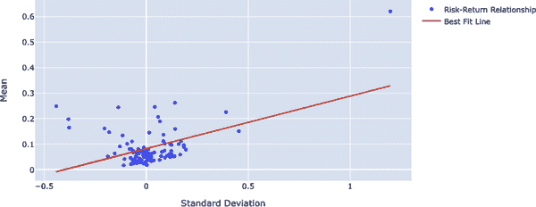
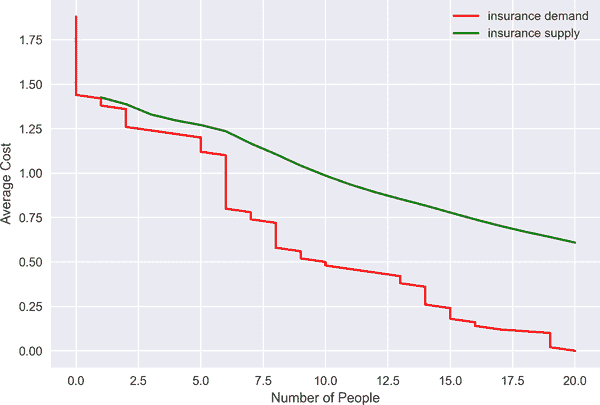

# 第一章 风险管理基础

> 在 2007 年，没有人会想到风险功能会发生如此大的变化。人们自然而然地期望下一个十年变化会减少。然而，我们相信情况可能正好相反。
> 
> Harle, Havas, and Samandari (2016)

风险管理是一个不断发展的过程。长期的风险管理实践无法跟上最新发展，也不能成为预测即将发生的危机的先兆，因此不可避免地要进行持续演进。监控和采纳由风险管理过程中的结构性突破带来的变化非常重要。采纳这些变化意味着重新定义风险管理的组成部分和工具，而这正是本书的主题。

在金融领域，传统上经验研究主要集中在统计推断上。计量经济学建立在统计推断的基础上。这类模型关注底层数据的结构、生成过程和变量之间的关系。然而，机器学习（ML）模型并不假定定义底层数据生成过程，而是被视为预测的手段（Lommers, El Harzli, and Kim 2021）。因此，ML 模型往往更加数据中心化和注重预测精度。

此外，在金融领域，数据稀缺和不可用性一直是一个问题，可以预见的是，计量经济模型在这些情况下表现不佳。鉴于 ML 模型通过合成数据生成提供的数据不可用解决方案，这些模型已经成为金融领域的重要议题，而金融风险管理当然也不例外。

在详细讨论这些工具之前，值得介绍风险管理的主要概念，这些概念将贯穿本书。这些概念包括风险、风险类型、风险管理、回报以及一些与风险管理相关的概念。

# 风险

风险始终存在，但理解和评估风险比单纯知道它要困难得多，因为风险具有抽象的性质。风险被视为一种危险，可能是预期的，也可能是意外的。预期风险是被定价的，但意外风险却几乎无法计算，因此可能是毁灭性的。

正如你所想象的那样，对于“风险”的定义没有普遍共识。然而，从金融的角度来看，风险指的是公司可能面临的潜在损失或不确定性水平。 McNeil, Alexander, and Paul (2015) 对风险的定义有所不同，如下所述：

> 任何可能对组织实现其目标和执行其战略能力造成不利影响的事件或行动，或者作为损失或低于预期回报的可量化可能性。

这些定义侧重于风险的下行，暗示成本与风险同步，但也应该注意它们之间并不一定是一对一的关系。例如，如果风险是可预期的，那么所产生的成本相对较低（甚至可以忽略不计），而不是意外风险的情况。

# 收益率

所有的金融投资都是为了获取利润，也称为*收益*。更正式地说，收益是在给定时间段内投资所获得的收益。因此，收益指的是风险的正面。在整本书中，风险和收益将分别指向风险的下行和上行风险。

正如你可以想象的，风险和回报之间存在一种权衡：假设风险越高，则实现的回报就越大。由于找到最优解是一项艰巨的任务，因此这种权衡是金融领域最具争议的问题之一。然而，Markowitz（1952）提出了这个长期问题的一个直观和吸引人的解决方案。他对风险的定义直至那时模糊不清，是清晰而干净的，并导致金融研究领域的转变。Markowitz 使用标准偏差 <math alttext="sigma Subscript upper R Sub Subscript i"><msub><mi>σ</mi> <msub><mi>R</mi> <mi>i</mi></msub></msub></math> 来量化风险。这个直观的定义允许研究人员在金融中使用数学和统计学。标准偏差可以用数学方式定义为（Hull 2012）：

<math alttext="sigma equals StartRoot double-struck upper E left-parenthesis upper R squared right-parenthesis minus left-bracket double-struck upper E left-parenthesis upper R right-parenthesis right-bracket squared EndRoot" display="block"><mrow><mi>σ</mi> <mo>=</mo> <msqrt><mrow><mi>𝔼</mi> <mrow><mo>(</mo> <msup><mi>R</mi> <mn>2</mn></msup> <mo>)</mo></mrow> <mo>-</mo> <msup><mrow><mo>[</mo><mi>𝔼</mi><mrow><mo>(</mo><mi>R</mi><mo>)</mo></mrow><mo>]</mo></mrow> <mn>2</mn></msup></mrow></msqrt></mrow></math>

其中 *R* 和 <math alttext="double-struck upper E"><mi>𝔼</mi></math> 分别指年度收益率和期望。本书多次使用符号 <math alttext="double-struck upper E"><mi>𝔼</mi></math> 表示期望收益，因为这是我们在定义风险时讨论的概率。在涉及投资组合方差时，协方差出现在图景中，公式变为：

<math alttext="sigma Subscript p Superscript 2 Baseline equals w Subscript a Superscript 2 Baseline sigma Subscript a Superscript 2 Baseline plus w Subscript b Superscript 2 Baseline sigma Subscript b Superscript 2 Baseline plus 2 w Subscript a Baseline w Subscript b Baseline Cov left-parenthesis r Subscript a Baseline comma r Subscript b Baseline right-parenthesis" display="block"><mrow><msubsup><mi>σ</mi> <mi>p</mi> <mn>2</mn></msubsup> <mo>=</mo> <msubsup><mi>w</mi> <mi>a</mi> <mn>2</mn></msubsup> <msubsup><mi>σ</mi> <mi>a</mi> <mn>2</mn></msubsup> <mo>+</mo> <msubsup><mi>w</mi> <mi>b</mi> <mn>2</mn></msubsup> <msubsup><mi>σ</mi> <mi>b</mi> <mn>2</mn></msubsup> <mo>+</mo> <mn>2</mn> <msub><mi>w</mi> <mi>a</mi></msub> <msub><mi>w</mi> <mi>b</mi></msub> <mtext>Cov</mtext> <mrow><mo>(</mo> <msub><mi>r</mi> <mi>a</mi></msub> <mo>,</mo> <msub><mi>r</mi> <mi>b</mi></msub> <mo>)</mo></mrow></mrow></math>

其中 *w* 表示权重，<math alttext="sigma squared"><msup><mi>σ</mi> <mn>2</mn></msup></math> 是方差，*Cov* 是协方差矩阵。

对先前得到的方差进行平方根运算得到投资组合标准偏差：

<math alttext="sigma Subscript p Baseline equals StartRoot sigma Subscript p Superscript 2 Baseline EndRoot" display="block"><mrow><msub><mi>σ</mi> <mi>p</mi></msub> <mo>=</mo> <msqrt><msubsup><mi>σ</mi> <mi>p</mi> <mn>2</mn></msubsup></msqrt></mrow></math>

换句话说，投资组合的预期收益率是各个收益率的加权平均值，可以表示为：

<math alttext="dollar-sign double-struck upper E left-parenthesis upper R right-parenthesis equals sigma-summation Underscript i Overscript n Endscripts w Subscript i Baseline upper R Subscript i Baseline equals w 1 upper R 1 plus w 2 upper R 2 ellipsis plus w Subscript n Baseline upper R Subscript n dollar-sign"><mrow><mi>𝔼</mi> <mrow><mo>(</mo> <mi>R</mi> <mo>)</mo></mrow> <mo>=</mo> <msubsup><mo>∑</mo> <mi>i</mi> <mi>n</mi></msubsup> <msub><mi>w</mi> <mi>i</mi></msub> <msub><mi>R</mi> <mi>i</mi></msub> <mo>=</mo> <msub><mi>w</mi> <mn>1</mn></msub> <msub><mi>R</mi> <mn>1</mn></msub> <mo>+</mo> <msub><mi>w</mi> <mn>2</mn></msub> <msub><mi>R</mi> <mn>2</mn></msub> <mo>⋯</mo> <mo>+</mo> <msub><mi>w</mi> <mi>n</mi></msub> <msub><mi>R</mi> <mi>n</mi></msub></mrow></math>

让我们通过可视化探索风险与回报的关系。为此，构建一个假设的投资组合，并用 Python 计算必要的统计数据：

```py
In [1]: import statsmodels.api as sm
        import numpy as np
        import plotly.graph_objs as go
        import matplotlib.pyplot as plt
        import plotly
        import warnings
        warnings.filterwarnings('ignore')

In [2]: n_assets = 5 
        n_simulation = 500 

In [3]: returns = np.random.randn(n_assets, n_simulation) 

In [4]: rand = np.random.rand(n_assets) 
        weights = rand/sum(rand) 

        def port_return(returns):
            rets = np.mean(returns, axis=1)
            cov = np.cov(rets.T, aweights=weights, ddof=1)
            portfolio_returns = np.dot(weights, rets.T)
            portfolio_std_dev = np.sqrt(np.dot(weights, np.dot(cov, weights)))
            return portfolio_returns, portfolio_std_dev 

In [5]: portfolio_returns, portfolio_std_dev = port_return(returns) 

In [6]: print(portfolio_returns)
        print(portfolio_std_dev) 

        0.012968706503879782
        0.023769932556585847

In [7]: portfolio = np.array([port_return(np.random.randn(n_assets, i))
                              for i in range(1, 101)]) 

In [8]: best_fit = sm.OLS(portfolio[:, 1], sm.add_constant(portfolio[:, 0]))\
                   .fit().fittedvalues 

In [9]: fig = go.Figure()
        fig.add_trace(go.Scatter(name='Risk-Return Relationship',
                                 x=portfolio[:, 0],
                                 y=portfolio[:, 1], mode='markers'))
        fig.add_trace(go.Scatter(name='Best Fit Line',
                                 x=portfolio[:, 0],
                                 y=best_fit, mode='lines'))
        fig.update_layout(xaxis_title = 'Return',
                          yaxis_title = 'Standard Deviation',
                          width=900, height=470)
        fig.show() 
```


考虑的资产数量


进行的模拟次数


从正态分布生成随机样本用作收益率


生成随机数以计算权重


计算权重


用于计算预期组合收益和组合标准偏差的函数


调用函数的结果


打印预期组合收益和组合标准偏差的结果


重新运行函数 100 次


为了绘制最佳拟合线，运行线性回归


为了可视化目的绘制交互式图

图 1-1，通过前述的 Python 代码生成，证实了风险和回报是同步变化的，但这种相关性的大小取决于个别股票和金融市场条件。



###### 图 1-1\. 风险-回报关系

# 风险管理

金融风险管理是处理来自金融市场的不确定性的过程。它涉及评估组织面临的金融风险，并制定与内部优先事项和政策一致的管理策略（Horcher 2011）。

根据此定义，由于每个组织面临不同类型的风险，公司应对风险的方式是完全独特的。每家公司都应该对风险进行适当评估，并采取必要的行动。然而，这并不意味着一旦确定了风险，公司就需要尽可能地减轻风险。

因此，风险管理并不是要不惜一切代价减轻风险。减轻风险可能需要牺牲回报，而且可以容忍到一定程度，因为公司寻求的是尽可能高的回报和尽可能低的风险。因此，要最大化利润同时降低风险应该是一个细致而明确定义的任务。

管理风险是有成本的，尽管处理风险需要特定的公司政策，但存在一般的可能性风险策略框架：

忽略

在这种策略中，公司接受所有风险及其后果，并更愿意不采取任何行动。

转移

这种策略涉及通过套期保值或其他方式将风险转移给第三方。

减轻

公司制定减轻风险的策略部分是因为其有害影响可能被认为难以承受和/或超过附加的利益。

接受

如果公司采用*接受风险*的策略，他们会正确识别风险并承认其益处。换句话说，当假设某些活动所产生的特定风险为股东带来价值时，可以选择这种策略。

## 主要的金融风险

金融公司在其业务生命周期内面临各种风险。这些风险可以按不同类别划分，以便更容易识别和评估。主要的金融风险类型包括市场风险、信用风险、流动性风险和操作风险，但这并非穷尽列表。然而，本书将关注主要的金融风险类型。让我们来看看这些风险类别。

### 市场风险

此风险由金融市场因素变动引起。例如，利率上升可能严重影响持有空头的公司。

关于市场风险的另一个来源可以举例说明：*汇率*。从事国际贸易的公司，其商品以美元计价，极易受到美元汇率变动的影响。

可想而知，任何一种*商品价格*的变化都可能对公司的财务可持续性构成威胁。有许多基本因素直接影响商品价格，包括市场参与者、运输成本等。

### 信用风险

信用风险是最普遍的风险之一。当交易对手未能履行债务时，它就会出现。例如，如果借款人无法偿还款项，那么信用风险就会显现。信用质量恶化也是通过减少组织可能拥有的证券市场价值而带来的风险之一（Horcher 2011）。

### 流动性风险

直到 2007 年至 2008 年的金融危机严重冲击了金融市场，流动性风险才受到重视。*流动性*指投资者执行交易的速度和便利程度。这也被称为*交易流动性风险*。流动性风险的另一个方面是*资金流动性风险*，这可以定义为筹集现金或可用信贷来资助公司运营的能力。

如果一家公司无法在短期内将其资产变现，这将属于流动性风险类别，并且对公司的财务管理和声誉非常不利。

### 操作风险

管理操作风险并不是一项明确和可预见的任务，由于风险的错综复杂和内部性质，它会占用公司大量资源。相关问题包括：

+   金融公司如何有效管理风险？

+   他们为这项任务分配了必要的资源吗？

+   公司的可持续性风险重要性是否得到了正确评估？

顾名思义，操作风险是指公司或行业内在运作或外部事件对公司日常运营、盈利能力或可持续性构成威胁时产生的风险。操作风险包括欺诈活动、未能遵守法规或内部程序、由于缺乏培训而造成的损失等。

那么，如果一家公司面临一个或多个这些风险并且毫无准备，会发生什么？尽管这种情况并不经常发生，但历史事件告诉我们答案：公司可能会违约并陷入重大的金融崩溃。

## 大规模金融崩溃

风险管理有多重要？这个问题可以通过一本长达数百页的书来回答，但事实上，金融机构中风险管理的兴起已经说服了我们。例如，2007 年至 2008 年的全球金融危机被描述为“风险管理的巨大失败”（Buchholtz and Wiggins 2019），尽管这只是冰山一角。在金融系统崩溃的背景下，无数次风险管理失败为其铺平了道路。要理解这一崩溃，我们需要深入研究过去的金融风险管理失败。一家名为 Long-Term Capital Management (LTCM)的对冲基金提供了一个生动的金融崩溃例子。

LTCM 组建了一个由顶尖学术界人士和实践者组成的团队。这导致资金流入该公司，并开始以 10 亿美元进行交易。到 1998 年，LTCM 控制了超过 1,000 亿美元，并且大量投资于包括俄罗斯在内的一些新兴市场。俄罗斯债务违约深刻影响了 LTCM 的投资组合，由于*避险需求增加*^(1)，它遭受了严重打击，导致了破产（Bloomfield 2003）。

Metallgesellschaft (MG) 是另一家因糟糕的金融风险管理而不复存在的公司。MG 主要在天然气和石油市场运营。由于其高度的敞口，在天然气和石油价格大幅下跌后，MG 需要资金。平仓空头头寸导致了大约 15 亿美元的损失。

Amaranth Advisors (AA) 是另一家因大量投资于单一市场且误判由此投资产生的风险而破产的对冲基金。到 2006 年，AA 吸引了约 90 亿美元的资产管理，但由于天然气期货和期权价格的下跌，几乎损失了其中的一半。AA 的违约归因于天然气价格低迷和误导性的风险模型（Chincarini 2008）。

Stulz 的论文，“Risk Management Failures: What Are They and When Do They Happen?”（2008）总结了可能导致违约的主要风险管理失误：

+   对已知风险的错误测量

+   未能考虑风险

+   未能向高层管理层传达风险

+   未能监控风险

+   未能管理风险

+   未能使用适当的风险度量标准

因此，全球金融危机并不是导致监管机构和机构重新设计其金融风险管理的唯一事件。相反，它是使杯水满溢的最后一滴，在危机之后，监管机构和机构都吸取了教训并改进了他们的流程。最终，这一系列事件导致了金融风险管理的兴起。

# 金融风险管理中的信息不对称

尽管在理论上很直观，完全理性的决策者假设，这是现代金融理论的主要基石，但太完美以至于不真实。因此，行为经济学家攻击了这一观念，声称心理学在决策过程中起着关键作用：

> 做决策就像说散文——人们一直在做，有意或无意。因此，决策主题被许多学科共享，从数学和统计学，经济学和政治科学，到社会学和心理学。
> 
> 卡尼曼和特弗斯基（1984 年）

信息不对称和金融风险管理息息相关，公司资产估值的不确定性可能会提高融资成本，对公司的可持续性构成威胁（参见 DeMarzo 和 Duffie 1995 年以及 Froot，Scharfstein 和 Stein 1993 年）。

因此，前述失败的根源深藏于这样一个完美的假设世界中，理性决策者生活在其中，无法解释它们。在这一点上，人类的本能和一个不完美的世界开始发挥作用，学科的混合提供了更合理的解释。逆向选择和道德风险是解释市场失败的两个突出类别。

## 逆向选择

*逆向选择* 是一种信息不对称的类型，其中一方试图利用其信息优势。当卖方比买方更了解时，这种现象就会出现。阿克洛夫（1978 年）完美地称之为“柠檬市场”。在这个框架内，“柠檬”指的是低质量的商品。

考虑一个市场，有柠檬车和高质量车，买家知道他们可能买到柠檬车，这降低了均衡价格。然而，卖家比买家更了解汽车是柠檬还是高质量的情况。因此，在这种情况下，交换的好处可能消失，没有交易发生。

由于其复杂性和不透明性，危机前的抵押市场是逆向选择的一个典型例子。借款人对于他们的支付意愿和能力了解得比贷方更多。通过贷款证券化（即抵押贷款支持的证券），金融风险得以形成。从那时起，抵押贷款的发起者比将它们以抵押贷款支持的证券形式出售给投资者的人更了解风险。

让我们尝试使用 Python 模拟逆向选择。在保险业中很容易观察到这种现象，因此我想重点研究该行业来模拟逆向选择。

假设消费者的效用函数是：

<math alttext="upper U left-parenthesis x right-parenthesis equals e Superscript gamma x" display="block"><mrow><mi>U</mi> <mrow><mo>(</mo> <mi>x</mi> <mo>)</mo></mrow> <mo>=</mo> <msup><mi>e</mi> <mrow><mi>γ</mi><mi>x</mi></mrow></msup></mrow></math>

其中 *x* 是收入，<math alttext="gamma"><mi>γ</mi></math> 是一个参数，它取值介于 0 和 1 之间。

###### 注意

效用函数是用来表示消费者对商品和服务偏好的工具，对于风险厌恶的个体而言，它是凹的。

此示例的最终目标是基于消费者效用来决定是否购买保险。

出于实践目的，我假设收入为 2 美元，事故成本为 1.5 美元。

现在是时候计算损失的概率，<math alttext="pi"><mi>π</mi></math>，它是外生给定的，并且均匀分布。

作为最后一步，为了找到平衡，我必须定义保险覆盖的供求。以下代码块显示了如何建模逆向选择：

```py
In [10]: import matplotlib.pyplot as plt
         import numpy as np
         plt.style.use('seaborn')

In [11]: def utility(x):
             return(np.exp(x ** gamma)) 

In [12]: pi = np.random.uniform(0,1,20)
         pi = np.sort(pi) 

In [13]: print('The highest three probability of losses are {}'
               .format(pi[-3:])) 
         The highest three probability of losses are [0.834261   0.93542452
          0.97721866]

In [14]: y = 2
         c = 1.5
         Q = 5
         D = 0.01
         gamma = 0.4

In [15]: def supply(Q):
             return(np.mean(pi[-Q:]) * c) 

In [16]: def demand(D):
             return(np.sum(utility(y - D) > pi * utility(y - c) + (1 - pi)
                           * utility(y))) 

In [17]: plt.figure()
         plt.plot([demand(i) for i in np.arange(0, 1.9, 0.02)],
                  np.arange(0, 1.9, 0.02),
                  'r', label='insurance demand')
         plt.plot(range(1,21), [supply(j) for j in range(1,21)],
                  'g', label='insurance supply')
         plt.ylabel("Average Cost")
         plt.xlabel("Number of People")
         plt.legend()
         plt.show()
```


编写风险厌恶效用函数


从均匀分布生成随机样本


选择最后三个项目


编写供应保险合同函数


编写保险合同需求函数

图 1-2 显示了保险供求曲线。令人惊讶的是，两条曲线都是向下倾斜的，意味着随着更多人需求合同并加入合同，风险降低，从而影响合同价格。

直线代表保险供应和合同的平均成本，而另一条显示逐步下降的线条表示保险合同的需求。随着我们从风险客户开始分析，并且随着合同的增加越来越多的人，风险水平与平均成本呈平行下降。



###### 图 1-2\. 逆向选择

## 道德风险

市场失灵也是由于信息不对称造成的。在道德风险情况下，合同的一方承担比另一方更多的风险。正式地，*道德风险*可以定义为更知情的一方利用其掌握的私密信息损害他人的情况。

为了更好地理解道德风险，可以从信贷市场给出一个简单的例子：假设实体 A 需要信贷用于项目融资，而这项目被认为是可行的。如果实体 A 将贷款用于向银行 C 的信贷债务支付，而未事先通知贷款银行，则会出现道德风险。在分配信贷时，银行可能会遇到道德风险情况，这是由于信息不对称导致的，这降低了银行的放贷意愿，并且是银行在信贷分配过程中投入大量精力的原因之一。

一些人认为美联储委员会（Fed）为 LTCM 进行的救援行动可以被视为一种道德风险，因为 Fed 以不诚信的方式订立合同。

# 结论

本章介绍了金融风险管理的主要概念，旨在确保我们都在同一页面上。这些术语和概念将在本书中经常使用。

此外，还讨论了一种行为方法，攻击财务代理的理由，以便我们拥有更全面的工具来解释金融风险的来源。

在下一章中，我们将讨论时间序列方法，这是金融分析的主要支柱之一，因为大多数金融数据都具有时间维度，这需要特别注意和技术来处理。

# 参考资料

本章引用的文章和章节：

+   Akerlof, George A. 1978\. “柠檬市场：质量不确定性和市场机制。”《经济不确定性》，235-251。学术出版社。

+   Buchholtz, Alec, 和 Rosalind Z. Wiggins. 2019\. “所学到的经验：Thomas C. Baxter, Jr., Esq.”《金融危机杂志》1, no. (1): 202-204。

+   Chincarini, Ludwig. 2008\. “风险管理案例研究：从 Amaranth Advisors Llc 的崩溃中汲取教训。”《应用金融杂志》18 (1): 152-74。

+   DeMarzo, Peter M., 和 Darrell Duffie. 1995\. “公司套期保值和套期会计的激励”。《金融研究评论》8 (3): 743-771。

+   Froot, Kenneth A., David S. Scharfstein, 和 Jeremy C. Stein. 1993\. “风险管理：协调企业投资和融资政策。”《金融杂志》48 (5): 1629-1658。

+   Harle, P., A. Havas, 和 H. Samandari. 2016\. 《银行风险管理的未来》。麦肯锡全球研究所。

+   Kahneman, D., 和 A. Tversky. 1984\. “选择、价值和框架。美国心理学协会。”《美国心理学家》。39 (4): 341-350。

+   Lommers, Kristof, Ouns El Harzli, 和 Jack Kim. 2021\. “机器学习与金融研究的对抗”。在 SSRN 3788349 上可用。

+   Markowitz H. 1952\. “投资组合选择”。《金融杂志》。7 (1): 177—91。

+   Stulz, René M. 2008\. “风险管理的失败：它们是什么以及何时发生？”《应用公司金融杂志》20 (4): 39-48。

本章引用的书籍：

+   Bloomfield, S. 2013\. 《公司治理的理论与实践：一种综合方法》。剑桥：剑桥大学出版社。

+   Horcher, Karen A. 2011\. 《金融风险管理要点》。第 32 卷。新泽西州霍博肯：约翰·威利和儿子出版社。

+   Hull, John. 2012\. 《风险管理与金融机构》。第 733 卷。新泽西州霍博肯：约翰·威利和儿子出版社。

+   McNeil, Alexander J., Rüdiger Frey, 和 Paul Embrechts. 2015\. 《定量风险管理：概念、技术和工具》，修订版。新泽西州普林斯顿：普林斯顿大学出版社。

^(1) *质量之飞* 是指投资者避开股票等风险资产，转而在诸如政府发行的债券等较安全资产上建立长期头寸。
