# 第二章：时间序列建模导论

> 通过大量的过去数据来研究市场行为，比如货币或股票价格的高频买卖报价。正是数据的丰富性使得市场的经验研究成为可能。虽然不可能进行控制实验，但可以在历史数据上进行广泛测试。
> 
> Sergio Focardi（1997）

一些模型更好地解释了某些现象；某些方法以稳固的方式捕捉了事件的特征。时间序列建模是一个很好的例子，因为绝大多数金融数据都有一个时间维度，这使得时间序列应用成为金融的必备工具。简单来说，数据的排序和其相关性很重要。

本书的这一章将讨论经典的时间序列模型，并比较这些模型的性能。深度学习的时间序列分析将在第三章中介绍；这是一种在数据准备和模型结构方面完全不同的方法。经典模型包括移动平均（MA）、自回归（AR）和自回归积分移动平均（ARIMA）模型。这些模型共同的特点是历史观测值所包含的信息。如果这些历史观测值是来自误差项，我们称之为*移动平均*；如果这些观测值来自时间序列本身，称为*自回归*。另一个模型 ARIMA 是这些模型的延伸。

这是 Brockwell 和 Davis（2016）对*时间序列*的正式定义：

> 时间序列是一组观测值 <math alttext="upper X Subscript t"><msub><mi>X</mi> <mi>t</mi></msub></math> ，每个观测值都记录在特定时间 *t* 。离散时间序列…是在观测值所记录的时间集合 <math alttext="upper T 0"><msub><mi>T</mi> <mn>0</mn></msub></math> 是一个离散集合时的时间序列，例如当观测是在固定时间间隔下进行时的情况。连续时间序列是当观测值在一段时间内连续记录时得到的。

让我们观察具有时间维度的数据是什么样子。图 2-1 展示了 1980 年至 2020 年的油价，下面的 Python 代码向我们展示了绘制这个图的一种方法：

```py
In [1]: import quandl
        import matplotlib.pyplot as plt
        import warnings
        warnings.filterwarnings('ignore')
        plt.style.use('seaborn')

In [2]: oil = quandl.get("NSE/OIL", authtoken="insert you api token",
                         start_date="1980-01-01",
                         end_date="2020-01-01") 

In [3]: plt.figure(figsize=(10, 6))
        plt.plot(oil.Close)
        plt.ylabel('$')
        plt.xlabel('Date')
        plt.show()
```


从 Quandl 数据库中提取数据

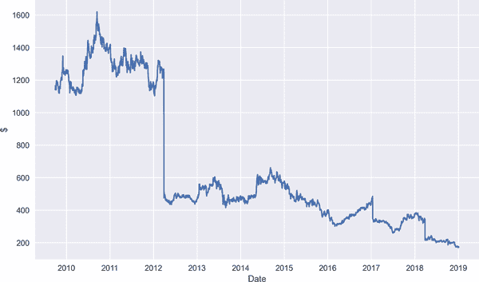

###### 图 2-1。1980 年至 2020 年的油价

###### 注

API（Application Programming Interface）是一种用于使用代码检索数据的工具。我们将在整本书中使用不同的 API。在前面的练习中，我们使用了 Quandl API。

Quandl API 允许我们从 Quandl 网站访问金融、经济和替代数据。要获取您的 Quandl API，请先访问[Quandl 网站](https://oreil.ly/1IFDc)，然后按照必要的步骤获取您自己的 API 密钥。

从前面提供的定义可以理解，时间序列模型可以适用于多个领域，例如：

+   医疗保健

+   金融

+   经济学

+   网络分析

+   天文学

+   天气

时间序列方法的优越性来自于这样一个观念：时间上的观察相关性更好地解释了当前值。拥有具有时间相关结构的数据意味着违反了著名的独立同分布（IID）假设，该假设是许多模型的核心。

因此，由于时间上的相关性，通过其自身的历史值可以更好地理解当期股票价格的动态。我们如何理解数据的动态？这是一个我们可以通过详细说明时间序列的组件来解决的问题。

# 时间序列成分

时间序列有四个组成部分：趋势、季节性、周期性和残差。在 Python 中，我们可以使用`seasonal_decompose`函数轻松可视化时间序列的组件：

```py
In [4]: import yfinance as yf
        import numpy as np
        import pandas as pd
        import datetime
        import statsmodels.api as sm
        from statsmodels.tsa.stattools import adfuller
        from statsmodels.tsa.seasonal import seasonal_decompose

In [5]: ticker = '^GSPC' 
        start = datetime.datetime(2015, 1, 1) 
        end = datetime.datetime(2021, 1, 1) 
        SP_prices = yf.download(ticker, start=start, end=end, interval='1mo')\
                    .Close 
        [*********************100%***********************]  1 of 1 completed

In [6]: seasonal_decompose(SP_prices, period=12).plot()
        plt.show()
```


标示标准普尔 500 指数的股票代码


确定开始和结束日期


获取标准普尔 500 指数的收盘价

在图 2-2 的顶部面板中，我们可以看到原始数据的绘图，在第二个面板中，可以观察到显示上升趋势的趋势。在第三个面板中，展示了季节性，最后呈现了显示不规则波动的残差。您可能会想知道周期性组件在哪里；噪声和周期性组件被放在残差组件下面。

熟悉时间序列组件对进一步分析至关重要，这样我们就能够了解数据的特征并提出合适的模型。让我们从趋势组件开始。

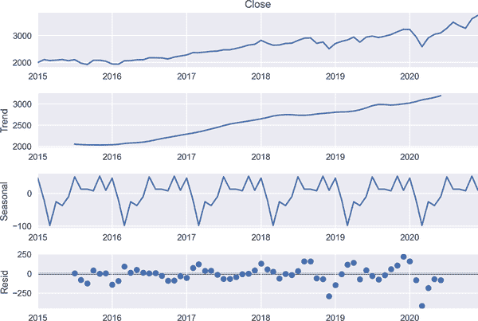

###### 图 2-2\. 标准普尔 500 时间序列分解

## 趋势

*趋势*表示在给定时间段内增长或减少的一般趋势。一般来说，当时间序列的起点和终点不同时，或者呈现上升/下降斜率时，就存在趋势。以下代码显示了趋势的样子：

```py
In [7]: plt.figure(figsize=(10, 6))
        plt.plot(SP_prices) 
        plt.title('S&P-500 Prices')
        plt.ylabel('$')
        plt.xlabel('Date')
        plt.show()
```

除了标准普尔 500 指数价格暴跌的时期之外，我们在图 2-3 中看到在 2010 年至 2020 年之间有明显的上升趋势。

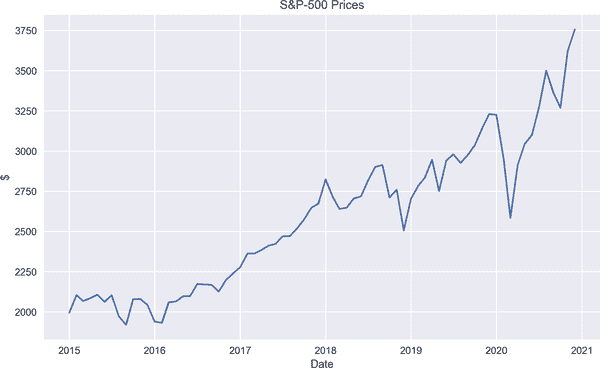

###### 图 2-3\. 标准普尔 500 价格

线图并不是了解趋势的唯一选项。相反，我们还有一些其他强大的工具来完成这个任务。因此，在这一点上，谈论两个重要的统计概念是值得的：

+   自相关函数

+   部分自相关函数

自相关函数（ACF）是分析时间序列当前值与其滞后值之间关系的统计工具。绘制 ACF 使我们能够很容易地观察到时间序列中的序列依赖性：

<math alttext="ModifyingAbove rho With caret left-parenthesis h right-parenthesis equals StartFraction Cov left-parenthesis upper X Subscript t Baseline comma upper X Subscript t minus h Baseline right-parenthesis Over Var left-parenthesis upper X Subscript t Baseline right-parenthesis EndFraction" display="block"><mrow><mover accent="true"><mi>ρ</mi> <mo>^</mo></mover> <mrow><mo>(</mo> <mi>h</mi> <mo>)</mo></mrow> <mo>=</mo> <mfrac><mrow><mtext>Cov</mtext><mo>(</mo><msub><mi>X</mi> <mi>t</mi></msub> <mo>,</mo><msub><mi>X</mi> <mrow><mi>t</mi><mo>-</mo><mi>h</mi></mrow></msub> <mo>)</mo></mrow> <mrow><mtext>Var</mtext><mo>(</mo><msub><mi>X</mi> <mi>t</mi></msub> <mo>)</mo></mrow></mfrac></mrow></math>

图 2-4 表示了 ACF 图。垂直线表示相关系数；第一条线表示序列与其 0 滞后的相关性，即它是与自身的相关性。第二条线指示系列在时间 *t* - 1 和 *t* 处的相关性。基于这些，我们可以得出结论，S&P 500 显示出连续依赖性。由于在 ACF 图中表示线的相关系数以缓慢的方式衰减，当前值与 S&P 500 数据的滞后值之间存在强烈的依赖关系。

下面是我们如何在 Python 中绘制 ACF 图：

```py
In [8]: sm.graphics.tsa.plot_acf(SP_prices, lags=30) 
        plt.xlabel('Number of Lags')
        plt.show()
```


绘制 ACF

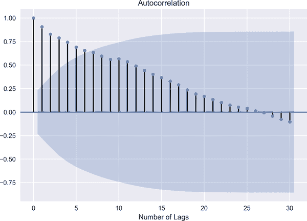

###### 图 2-4\. S&P 500 的 ACF 图

现在的问题是，自相关的可能来源是什么？以下是一些原因：

+   自相关的主要来源是“延续”，意味着前一个观察对当前观察有影响。

+   模型误设。

+   测量误差，基本上是观察值与实际值之间的差异。

+   放弃一个变量，这个变量有解释力。

偏自相关函数（PACF）是检验时间序列当前值 <math alttext="upper X Subscript t"><msub><mi>X</mi> <mi>t</mi></msub></math> 与 <math alttext="upper X Subscript t minus p Baseline comma p element-of double-struck upper Z"><mrow><msub><mi>X</mi> <mrow><mi>t</mi><mo>-</mo><mi>p</mi></mrow></msub> <mo>,</mo> <mi>p</mi> <mo>∈</mo> <mi>ℤ</mi></mrow></math> 之间关系的另一种方法。ACF 通常被认为是 MA(q)模型中的有用工具，因为 PACF 的衰减速度不快，但接近于 0。然而，ACF 的模式更适用于 MA。另一方面，PACF 在 AR(p)过程中表现良好。

PACF 提供了关于时间序列当前值与滞后值之间相关性的信息，控制其他相关性。

一眼看不出正在发生什么是不容易的。让我给你一个例子。假设我们要计算偏相关系数 <math alttext="upper X Subscript t"><msub><mi>X</mi> <mi>t</mi></msub></math> 和 <math alttext="upper X Subscript t minus h"><msub><mi>X</mi> <mrow><mi>t</mi><mo>-</mo><mi>h</mi></mrow></msub></math> 。

用数学方式表示：

<math alttext="dollar-sign ModifyingAbove rho With caret left-parenthesis h right-parenthesis equals StartFraction Cov left-parenthesis upper X Subscript t Baseline comma upper X Subscript t minus h Baseline vertical-bar upper X Subscript t minus 1 Baseline comma upper X Subscript t minus 2 Baseline ellipsis upper X Subscript t minus h minus 1 Baseline right-parenthesis Over StartRoot Var left-parenthesis upper X Subscript t Baseline vertical-bar upper X Subscript t minus 1 Baseline comma upper X Subscript t minus 2 Baseline comma ellipsis comma upper X Subscript t minus h minus 1 Baseline right-parenthesis Var left-parenthesis upper X Subscript t minus h Baseline vertical-bar upper X Subscript t minus 1 Baseline comma upper X Subscript t minus 2 Baseline comma ellipsis comma upper X Subscript t minus h minus 1 Baseline right-parenthesis EndRoot EndFraction dollar-sign"><mrow><mover accent="true"><mi>ρ</mi> <mo>^</mo></mover> <mrow><mo>(</mo> <mi>h</mi> <mo>)</mo></mrow> <mo>=</mo> <mfrac><mrow><mtext>Cov</mtext><mo>(</mo><msub><mi>X</mi> <mi>t</mi></msub> <mo>,</mo><msub><mi>X</mi> <mrow><mi>t</mi><mo>-</mo><mi>h</mi></mrow></msub> <mo>|</mo><msub><mi>X</mi> <mrow><mi>t</mi><mo>-</mo><mn>1</mn></mrow></msub> <mo>,</mo><msub><mi>X</mi> <mrow><mi>t</mi><mo>-</mo><mn>2</mn></mrow></msub> <mo>...</mo><msub><mi>X</mi> <mrow><mi>t</mi><mo>-</mo><mi>h</mi><mo>-</mo><mn>1</mn></mrow></msub> <mo>)</mo></mrow> <msqrt><mrow><mtext>Var</mtext><mrow><mo>(</mo><msub><mi>X</mi> <mi>t</mi></msub> <mo>|</mo><msub><mi>X</mi> <mrow><mi>t</mi><mo>-</mo><mn>1</mn></mrow></msub> <mo>,</mo><msub><mi>X</mi> <mrow><mi>t</mi><mo>-</mo><mn>2</mn></mrow></msub> <mo>,</mo><mo>...</mo><mo>,</mo><msub><mi>X</mi> <mrow><mi>t</mi><mo>-</mo><mi>h</mi><mo>-</mo><mn>1</mn></mrow></msub> <mo>)</mo></mrow><mtext>Var</mtext><mrow><mo>(</mo><msub><mi>X</mi> <mrow><mi>t</mi><mo>-</mo><mi>h</mi></mrow></msub> <mo>|</mo><msub><mi>X</mi> <mrow><mi>t</mi><mo>-</mo><mn>1</mn></mrow></msub> <mo>,</mo><msub><mi>X</mi> <mrow><mi>t</mi><mo>-</mo><mn>2</mn></mrow></msub> <mo>,</mo><mo>...</mo><mo>,</mo><msub><mi>X</mi> <mrow><mi>t</mi><mo>-</mo><mi>h</mi><mo>-</mo><mn>1</mn></mrow></msub> <mo>)</mo></mrow></mrow></msqrt></mfrac></mrow></math>

其中 *h* 是滞后。看看下面 Python 代码中 S&P 500 的 PACF 图的片段：

```py
In [9]: sm.graphics.tsa.plot_pacf(SP_prices, lags=30) 
        plt.xlabel('Number of Lags')
        plt.show()
```


绘制 PACF

图 2-5 展示了原始 S&P 500 数据的 PACF。在解释 PACF 时，我们关注超出表示置信区间的深色区域的尖峰。图 2-5 显示在不同滞后时存在一些尖峰，但滞后 10 超出了置信区间。因此，选择包含所有滞后值直到滞后 10 的模型可能是明智的选择。

正如前面讨论的，PACF 度量了系列当前值与滞后值之间的相关性，以便孤立其中效应。

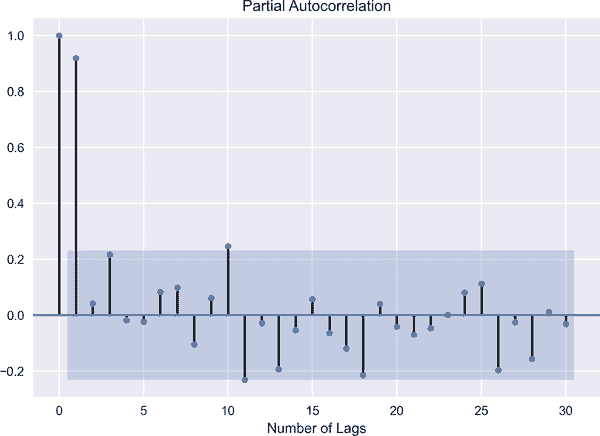

###### 图 2-5\. 标准普尔 500 的偏自相关函数（PACF）图

## 季节性

季节性存在于如果一段时间内出现定期波动的情况下。例如，能源使用可以显示出季节性特征。更具体地说，能源使用在一年中的某些时段内会上下波动。

为了展示我们如何检测季节性成分，让我们使用联邦储备经济数据库（FRED），该数据库包括来自 80 多个来源的超过 500,000 个经济数据系列，涵盖银行业、就业、汇率、国内生产总值、利率、贸易和国际交易等多个领域：

```py
In [10]: from fredapi import Fred
         import statsmodels.api as sm

In [11]: fred = Fred(api_key='insert you api key')

In [12]: energy = fred.get_series("CAPUTLG2211A2S",
                                  observation_start="2010-01-01",
                                  observation_end="2020-12-31") 
         energy.head(12)
Out[12]: 2010-01-01    83.7028
         2010-02-01    84.9324
         2010-03-01    82.0379
         2010-04-01    79.5073
         2010-05-01    82.8055
         2010-06-01    84.4108
         2010-07-01    83.6338
         2010-08-01    83.7961
         2010-09-01    83.7459
         2010-10-01    80.8892
         2010-11-01    81.7758
         2010-12-01    85.9894
         dtype: float64

In [13]: plt.plot(energy)
         plt.title('Energy Capacity Utilization')
         plt.ylabel('$')
         plt.xlabel('Date')
         plt.show()
In [14]: sm.graphics.tsa.plot_acf(energy, lags=30)
         plt.xlabel('Number of Lags')
         plt.show()
```


访问 2010 年至 2020 年期间的 FRED 能源利用率

图 2-6 显示在近 10 年的时间段内出现周期性的上升和下降，每年的前几个月利用率较高，然后在年底时下降，证实能源利用率存在季节性。

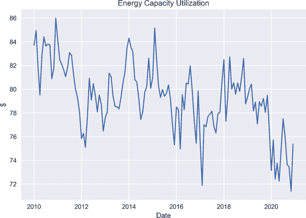

###### 图 2-6\. 能源利用率的季节性

ACF 图也可以提供关于季节性的信息，因为周期性的上升和下降可以在 ACF 中观察到。图 2-7 展示了在季节性存在的情况下的相关结构。

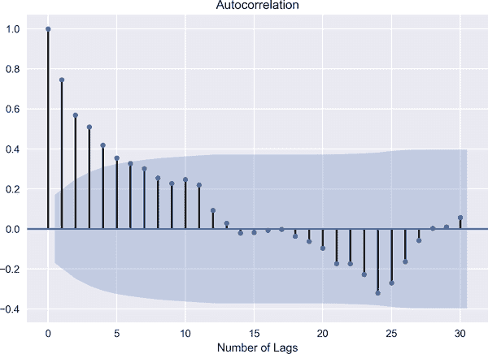

###### 图 2-7\. 能源利用率的自相关函数（ACF）

## 周期性

如果数据没有显示固定周期的运动会怎样？此时，周期性就进入了视野。当周期性变化高于趋势时，就存在周期性。有些人在某种意义上混淆了周期性和季节性，因为它们都表现出扩张和收缩。然而，我们可以将周期性看作是商业周期，它们需要很长时间来完成周期，而上升和下降则在很长的时间范围内发生。因此，周期性与季节性不同之处在于没有固定周期的波动。周期性的一个例子可能是房屋购买（或销售），这取决于抵押贷款利率。也就是说，当抵押贷款利率下降（或上升）时，会促使房屋购买（或销售）增加。

## 残差

残差被称为时间序列的不规则成分。从技术角度讲，残差等于观测值与相关拟合值之间的差异。我们可以将其视为模型中的剩余部分。

正如我们之前讨论过的，时间序列模型缺乏一些核心假设，但这并不意味着时间序列模型没有假设。我想强调最突出的假设之一，即*稳定性*。

稳定性意味着时间序列的统计特性，如均值、方差和协方差随时间不变。

有两种形式的稳定性：

弱平稳性

如果<math alttext="upper X Subscript t"><msub><mi>X</mi> <mi>t</mi></msub></math> 的联合分布与时间索引的移位版本相同，则称时间序列<math alttext="upper X Subscript t"><msub><mi>X</mi> <mi>t</mi></msub></math>为平稳的。

+   <math alttext="upper X Subscript t"><msub><mi>X</mi> <mi>t</mi></msub></math> 有有限方差，<math alttext="double-struck upper E left-parenthesis upper X Subscript t Superscript 2 Baseline right-parenthesis less-than normal infinity comma for-all t element-of double-struck upper Z"><mrow><mi>𝔼</mi> <mo>(</mo> <msubsup><mi>X</mi> <mi>t</mi> <mn>2</mn></msubsup> <mo>)</mo> <mo><</mo> <mi>∞</mi> <mo>,</mo> <mo>∀</mo> <mi>t</mi> <mo>∈</mo> <mi>ℤ</mi></mrow></math>

+   <math alttext="upper X Subscript t"><msub><mi>X</mi> <mi>t</mi></msub></math> 的均值是恒定的，仅取决于时间，<math alttext="double-struck upper E left-parenthesis upper X Subscript t Baseline right-parenthesis equals mu comma t for-all element-of double-struck upper Z"><mrow><mi>𝔼</mi> <mo>(</mo> <msub><mi>X</mi> <mi>t</mi></msub> <mo>)</mo> <mo>=</mo> <mi>μ</mi> <mo>,</mo> <mi>t</mi> <mo>∀</mo> <mo>∈</mo> <mi>ℤ</mi></mrow></math>

+   协方差结构，<math alttext="gamma left-parenthesis t comma t plus h right-parenthesis"><mrow><mi>γ</mi> <mo>(</mo> <mi>t</mi> <mo>,</mo> <mi>t</mi> <mo>+</mo> <mi>h</mi> <mo>)</mo></mrow></math>，仅依赖于时间差：

<math alttext="dollar-sign gamma left-parenthesis h right-parenthesis equals gamma Subscript h Baseline plus gamma left-parenthesis t plus h comma t right-parenthesis dollar-sign"><mrow><mi>γ</mi> <mrow><mo>(</mo> <mi>h</mi> <mo>)</mo></mrow> <mo>=</mo> <msub><mi>γ</mi> <mi>h</mi></msub> <mo>+</mo> <mi>γ</mi> <mrow><mo>(</mo> <mi>t</mi> <mo>+</mo> <mi>h</mi> <mo>,</mo> <mi>t</mi> <mo>)</mo></mrow></mrow></math>

换句话说，时间序列应具有有限的方差，均值恒定且协方差结构是时间差的函数。

强平稳性

如果<math alttext="upper X Subscript t Baseline 1 Baseline comma upper X Subscript t Baseline 2 Baseline comma period period period upper X Subscript t k Baseline"><mrow><msub><mi>X</mi> <mrow><mi>t</mi><mn>1</mn></mrow></msub> <mo>,</mo> <msub><mi>X</mi> <mrow><mi>t</mi><mn>2</mn></mrow></msub> <mo>,</mo> <mo>.</mo> <mo>.</mo> <mo>.</mo> <msub><mi>X</mi> <mrow><mi>t</mi><mi>k</mi></mrow></msub></mrow></math> 的联合分布与集合<math alttext="upper X Subscript t Baseline 1 plus h Baseline comma upper X Subscript t Baseline 2 plus h Baseline comma period period period upper X Subscript t k plus h Baseline"><mrow><msub><mi>X</mi> <mrow><mi>t</mi><mn>1</mn><mo>+</mo><mi>h</mi></mrow></msub> <mo>,</mo> <msub><mi>X</mi> <mrow><mi>t</mi><mn>2</mn><mo>+</mo><mi>h</mi></mrow></msub> <mo>,</mo> <mo>.</mo> <mo>.</mo> <mo>.</mo> <msub><mi>X</mi> <mrow><mi>t</mi><mi>k</mi><mo>+</mo><mi>h</mi></mrow></msub></mrow></math> 的平移版本相同，则称为强平稳性。因此，强平稳性意味着随机过程的随机变量的分布与时间索引的移位相同。

现在的问题是为什么我们需要平稳性？原因有两个。

首先，在估计过程中，随着时间的推移，具有某种分布是至关重要的。换句话说，如果时间序列的分布随时间变化，它就变得不可预测，无法建模。

时间序列模型的最终目标是预测。为了做到这一点，我们首先应该估计系数，这对应于机器学习中的学习。一旦我们学习并进行预测分析，我们假设在估计中数据的分布保持不变，即我们有相同的估计系数。如果情况不是这样，我们应该重新估计系数，因为我们无法用先前的估计系数进行预测。

存在结构性突变，比如金融危机，会导致分布的转变。我们需要谨慎和分开地处理这个时期。

具有平稳性的另一个原因是，根据假设，一些统计模型要求数据平稳，但这并不意味着一些模型仅仅需要平稳。相反，所有模型都要求数据平稳，但即使你输入非平稳数据，某些模型会通过设计将其转换为平稳数据并处理它。

图 2-4 显示了由于时间序列滞后之间高相关性的持续性，导致了缓慢衰减的滞后，从而非平稳。

通常情况下，检测非平稳性有两种方法：可视化和统计方法。后者显然是检测非平稳性的更好、更稳健的方法。然而，为了提高我们的理解，让我们从 ACF 开始。ACF 衰减缓慢意味着数据是非平稳的，因为它在时间上呈现出强烈的相关性。这正是我在 S&P 500 数据中观察到的。

我们首先需要检查并确定数据是否平稳。可视化是一个好的但最终是不够的工具。相反，需要更强大的统计方法，增广迪基-富勒（ADF）检验提供了这种方法。假设置信区间设置为 95%，以下结果表明数据不是平稳的：

```py
In [15]: stat_test = adfuller(SP_prices)[0:2] 
         print("The test statistic and p-value of ADF test are {}"
               .format(stat_test)) 
         The test statistic and p-value of ADF test are (0.030295120072926063,
          0.9609669053518538)
```


检验平稳性的 ADF 检验


ADF 检验的检验统计量和 p 值

进行差分是一种有效的去除平稳性的技术。这意味着仅仅是将序列的当前值减去其第一个滞后值，即 <math alttext="x Subscript t Baseline minus x Subscript t minus 1"><mrow><msub><mi>x</mi> <mi>t</mi></msub> <mo>-</mo> <msub><mi>x</mi> <mrow><mi>t</mi><mo>-</mo><mn>1</mn></mrow></msub></mrow></math> ，下面的 Python 代码展示了如何应用这一技术（并创建了图 2-8 和 2-9）：

```py
In [16]: diff_SP_price = SP_prices.diff() 

In [17]: plt.figure(figsize=(10, 6))
         plt.plot(diff_SP_price)
         plt.title('Differenced S&P-500 Price')
         plt.ylabel('$')
         plt.xlabel('Date')
         plt.show()
In [18]: sm.graphics.tsa.plot_acf(diff_SP_price.dropna(),lags=30)
         plt.xlabel('Number of Lags')
         plt.show()
In [19]: stat_test2 = adfuller(diff_SP_price.dropna())[0:2] 
         print("The test statistic and p-value of ADF test after differencing are {}"\
               .format(stat_test2))
         The test statistic and p-value of ADF test after differencing are
          (-7.0951058730170855, 4.3095548146405375e-10)
```


对 S&P 500 价格进行差分


基于差分后的 S&P 500 数据的 ADF 检验结果

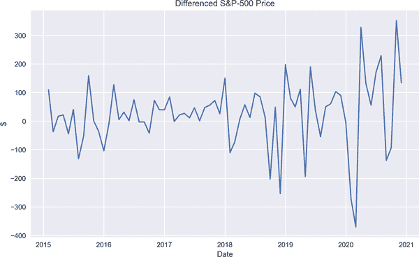

###### 图 2-8\. 去趋势后的 S&P 500 价格

经过第一次差分后，我们重新运行 ADF 测试来查看是否奏效，结果是肯定的。ADF 的极低 p 值告诉我，标准普尔 500 数据现在是平稳的。

这可以从提供的线图中观察到 Figure 2-8。与原始标准普尔 500 图不同，此图表现出围绕均值的波动，具有类似的波动性，意味着我们有了一个稳定的序列。

Figure 2-9 显示在滞后 7 处只有一个统计上显著的相关结构。

不用说，趋势并非非平稳的唯一指标。季节性也是其另一个来源，现在我们将学习一种处理方法。

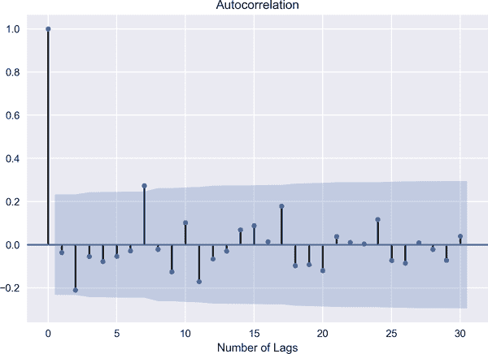

###### 图 2-9\. 去趋势的标准普尔 500 价格

首先，看一看能量容量利用率的 ACF 在 Figure 2-7 中，显示出周期性的起伏，这是非平稳的迹象。

为了消除季节性，我们首先应用*resample*方法来计算年均值，这个值将作为下面公式中的分母：

<math alttext="Seasonal Index equals StartFraction Value of a Seasonal Time Series Over Seasonal Average EndFraction" display="block"><mrow><mtext>Seasonal</mtext> <mtext>Index</mtext> <mo>=</mo> <mfrac><mrow><mtext>Value</mtext><mtext>of</mtext><mtext>a</mtext><mtext>Seasonal</mtext><mtext>Time</mtext><mtext>Series</mtext></mrow> <mrow><mtext>Seasonal</mtext><mtext>Average</mtext></mrow></mfrac></mrow></math>

因此，应用的结果，*季节性指数*，为我们提供了去季节化的时间序列。下面的代码展示了我们如何在 Python 中编写这个公式：

```py
In [20]: seasonal_index = energy.resample('Q').mean() 

In [21]: dates = energy.index.year.unique() 
         deseasonalized = []
         for i in dates:
             for j in range(1, 13):
                 deseasonalized.append((energy[str(i)][energy[str(i)]\
                                                       .index.month==j])) 
         concat_deseasonalized = np.concatenate(deseasonalized) 

In [22]: deseason_energy = []
         for i,s in zip(range(0, len(energy), 3), range(len(seasonal_index))):
             deseason_energy.append(concat_deseasonalized[i:i+3] /
                                    seasonal_index.iloc[s]) 
         concat_deseason_energy = np.concatenate(deseason_energy)
         deseason_energy = pd.DataFrame(concat_deseason_energy,
                                        index=energy.index)
         deseason_energy.columns = ['Deaseasonalized Energy']
         deseason_energy.head()
Out[22]:             Deaseasonalized Energy
         2010-01-01                1.001737
         2010-02-01                1.016452
         2010-03-01                0.981811
         2010-04-01                0.966758
         2010-05-01                1.006862

In [23]: sm.graphics.tsa.plot_acf(deseason_energy, lags=10)
         plt.xlabel('Number of Lags')
         plt.show()
In [24]: sm.graphics.tsa.plot_pacf(deseason_energy, lags=10)
         plt.xlabel('Number of Lags')
         plt.show()
```


计算能量利用率季度均值


定义进行季节性分析的年份


计算*季节性指数*公式的分子


拼接去季节化能量利用率


使用预定义公式计算*季节性指数*

Figure 2-10 表明在滞后 1 和 2 处存在统计上显著的相关性，但 ACF 不显示任何周期特征，这是另一种说法是去季节化。

类似地，在 Figure 2-11 中，尽管在某些滞后处有峰值，但 PACF 不显示任何周期性的起伏。因此，我们可以说使用季节性指数公式去季节化了数据。

现在我们得到的是能量容量利用率中较少的周期性起伏，这意味着数据被去季节化了。

最后，我们准备继续讨论时间序列模型。

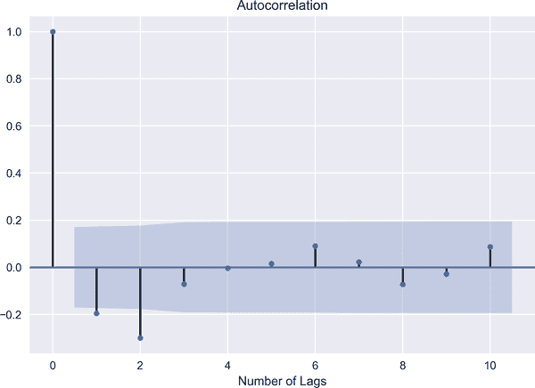

###### 图 2-10\. 去季节化能量利用率的 ACF

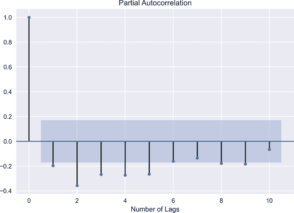

###### 图 2-11\. 能量利用率的去季节化 PACF

# 时间序列模型

传统时间序列模型是单变量模型，它们遵循以下阶段：

识别

在这个过程中，我们使用 ACF 和 PACF 探索数据，识别模式并进行统计测试。

估计

我们通过适当的优化技术来估计系数。

诊断

在估计之后，我们需要检查信息准则或者 ACF/PACF 是否表明模型是有效的。如果是这样，我们将继续进入预测阶段。

预测

这部分更多关于模型的性能。在预测中，我们根据我们的估计预测未来值。

图 2-12 展示了建模过程。因此，在识别变量和估计过程之后，执行模型。只有在运行适当的诊断之后，我们才能进行预测分析。

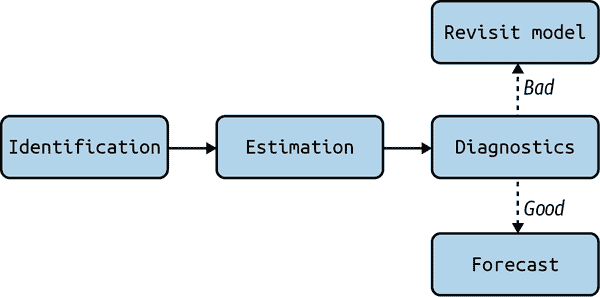

###### 图 2-12\. 建模过程

在建模具有时间维度的数据时，我们应考虑时间上相邻点的相关性。这种考虑将我们引向时间序列建模。我在建模时间序列时的目标是拟合模型并理解时间上随机波动的统计特性。

回顾关于 IID 过程的讨论，它是最基本的时间序列模型，有时被称为 *白噪声*。让我们谈谈白噪声的概念。

# 白噪声

如果时间序列 <math alttext="epsilon Subscript t"><msub><mi>ϵ</mi> <mi>t</mi></msub></math> 满足以下条件，则称其为白噪声：

<math alttext="epsilon Subscript t Baseline tilde upper W upper N left-parenthesis 0 comma sigma Subscript epsilon Superscript 2 Baseline right-parenthesis" display="block"><mrow><msub><mi>ϵ</mi> <mi>t</mi></msub> <mo>∼</mo> <mi>W</mi> <mi>N</mi> <mrow><mo>(</mo> <mn>0</mn> <mo>,</mo> <msubsup><mi>σ</mi> <mrow><mi>ϵ</mi></mrow> <mn>2</mn></msubsup> <mo>)</mo></mrow></mrow></math><math alttext="Corr left-parenthesis epsilon Subscript t Baseline comma epsilon Subscript s Baseline right-parenthesis equals 0 comma for-all t not-equals s" display="block"><mrow><mtext>Corr</mtext> <mo>(</mo> <msub><mi>ϵ</mi> <mi>t</mi></msub> <mo>,</mo> <msub><mi>ϵ</mi> <mi>s</mi></msub> <mo>)</mo> <mo>=</mo> <mn>0</mn> <mo>,</mo> <mo>∀</mo> <mi>t</mi> <mo>≠</mo> <mi>s</mi></mrow></math>

换句话说，<math alttext="epsilon Subscript t"><msub><mi>ϵ</mi> <mi>t</mi></msub></math> 的均值为 0，方差是恒定的。此外，<math alttext="epsilon Subscript t"><msub><mi>ϵ</mi> <mi>t</mi></msub></math> 的连续项之间没有相关性。可以说白噪声过程是平稳的，并且白噪声的图表在时间上表现为围绕均值以随机方式波动。然而，由于白噪声由不相关序列组成，从预测的角度来看并不是一个吸引人的模型。不相关序列阻碍我们预测未来值。

正如我们从以下代码片段和 图 2-13 可以观察到的那样，白噪声围绕均值振荡，并且完全是随机的：

```py
In [25]: mu = 0
         std = 1
         WN = np.random.normal(mu, std, 1000)

         plt.plot(WN)
         plt.xlabel('Number of Simulations')
         plt.show()
```

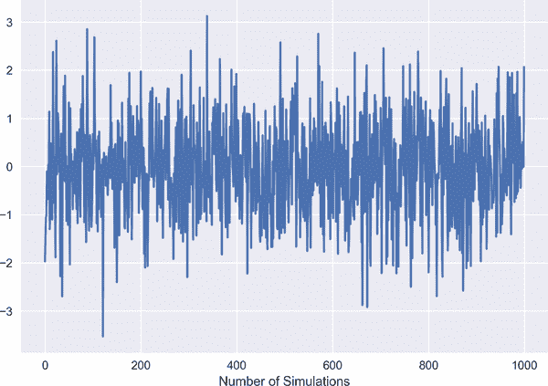

###### 图 2-13\. 白噪声过程

从这一点开始，我们需要在运行时间序列模型之前确定最佳滞后数。正如您可以想象的那样，决定最佳滞后数是一项具有挑战性的任务。最常用的方法是 ACF、PACF 和*信息准则*。ACF 和 PACF 已经讨论过；有关信息准则以及具体的阿卡伊凯信息准则（AIC）的更多信息，请参阅以下侧边栏。

请注意，如果所提议的模型是有限维的，则需要谨慎对待 AIC。这一事实由 Hurvich 和 Tsai（1989）很好地阐述：

> 如果真实模型是无限维的，这在实践中似乎是最现实的情况，AIC 提供了一个渐近有效的选择有限维逼近模型。然而，如果真实模型是有限维的，那么渐近有效的方法，例如，Akaike 的 FPE（Akaike 1970）、AIC 和 Parzen 的 CAT（Parzen 1977），不提供一致的模型顺序选择。

让我们开始学习经典的时间序列模型之一，移动平均模型。

## 移动平均模型

MA 和残差是密切相关的模型。MA 可以被视为一个平滑模型，因为它倾向于考虑残差的滞后值。为了简单起见，让我们从 MA(1)开始：

<math alttext="upper X Subscript t Baseline equals epsilon Subscript t Baseline plus alpha epsilon Subscript t minus 1" display="block"><mrow><msub><mi>X</mi> <mi>t</mi></msub> <mo>=</mo> <msub><mi>ϵ</mi> <mi>t</mi></msub> <mo>+</mo> <mi>α</mi> <msub><mi>ϵ</mi> <mrow><mi>t</mi><mo>-</mo><mn>1</mn></mrow></msub></mrow></math>

只要<math alttext="alpha not-equals 0"><mrow><mi>α</mi> <mo>≠</mo> <mn>0</mn></mrow></math>，它就具有非平凡的相关结构。直观地说，MA(1)告诉我们时间序列仅受到<math alttext="epsilon Subscript t"><msub><mi>ϵ</mi> <mi>t</mi></msub></math>和<math alttext="epsilon Subscript t minus 1"><msub><mi>ϵ</mi> <mrow><mi>t</mi><mo>-</mo><mn>1</mn></mrow></msub></math>的影响。

一般形式上，MA(q)变为：

<math alttext="upper X Subscript t Baseline equals epsilon Subscript t Baseline plus alpha 1 epsilon Subscript t minus 1 Baseline plus alpha 2 epsilon Subscript t minus 2 Baseline ellipsis plus alpha Subscript q Baseline epsilon Subscript t minus q" display="block"><mrow><msub><mi>X</mi> <mi>t</mi></msub> <mo>=</mo> <msub><mi>ϵ</mi> <mi>t</mi></msub> <mo>+</mo> <msub><mi>α</mi> <mn>1</mn></msub> <msub><mi>ϵ</mi> <mrow><mi>t</mi><mo>-</mo><mn>1</mn></mrow></msub> <mo>+</mo> <msub><mi>α</mi> <mn>2</mn></msub> <msub><mi>ϵ</mi> <mrow><mi>t</mi><mo>-</mo><mn>2</mn></mrow></msub> <mo>...</mo> <mo>+</mo> <msub><mi>α</mi> <mi>q</mi></msub> <msub><mi>ϵ</mi> <mrow><mi>t</mi><mo>-</mo><mi>q</mi></mrow></msub></mrow></math>

从这一点开始，为了保持一致，我们将对两家主要科技公司，即苹果和微软的数据进行建模。雅虎财经提供了一个方便的工具，可访问相关股票在 2019 年 1 月 1 日至 2021 年 1 月 1 日期间的收盘价。

作为第一步，我们删除了缺失值，并检查数据是否平稳，结果显示苹果和微软的股票价格都没有预期的平稳结构。因此，接下来的步骤是对这些数据进行一阶差分以使其平稳，并将数据分割为*训练集*和*测试集*。下面的代码（生成图 2-14）展示了我们如何在 Python 中实现这一点：

```py
In [26]: ticker = ['AAPL', 'MSFT']
         start = datetime.datetime(2019, 1, 1)
         end = datetime.datetime(2021, 1, 1)
         stock_prices = yf.download(ticker, start, end, interval='1d')\
                        .Close 
         [*********************100%***********************]  2 of 2 completed

In [27]: stock_prices = stock_prices.dropna()

In [28]: for i in ticker:
             stat_test = adfuller(stock_prices[i])[0:2]
             print("The ADF test statistic and p-value of {} are {}"\
                   .format(i,stat_test))
         The ADF test statistic and p-value of AAPL are  (0.29788764759932335,
          0.9772473651259085)
         The ADF test statistic and p-value of MSFT are  (-0.8345360070598484,
          0.8087663305296826)

In [29]: diff_stock_prices = stock_prices.diff().dropna()

In [30]: split = int(len(diff_stock_prices['AAPL'].values) * 0.95) 
         diff_train_aapl = diff_stock_prices['AAPL'].iloc[:split] 
         diff_test_aapl = diff_stock_prices['AAPL'].iloc[split:] 
         diff_train_msft = diff_stock_prices['MSFT'].iloc[:split] 
         diff_test_msft = diff_stock_prices['MSFT'].iloc[split:] 

In [31]: diff_train_aapl.to_csv('diff_train_aapl.csv') 
         diff_test_aapl.to_csv('diff_test_aapl.csv')
         diff_train_msft.to_csv('diff_train_msft.csv')
         diff_test_msft.to_csv('diff_test_msft.csv')

In [32]: fig, ax = plt.subplots(2, 1, figsize=(10, 6))
         plt.tight_layout()
         sm.graphics.tsa.plot_acf(diff_train_aapl,lags=30,
                                  ax=ax[0], title='ACF - Apple')
         sm.graphics.tsa.plot_acf(diff_train_msft,lags=30,
                                  ax=ax[1], title='ACF - Microsoft')
         plt.show()
```


检索月度收盘股价


将数据分割为 95%和 5%


将苹果股价数据的 95%分配给训练集


将苹果股票价格数据的 5%分配给测试集


将微软股票价格数据的 95%分配给训练集


将微软股票价格数据的 5%分配给测试集


保存数据以备将来使用

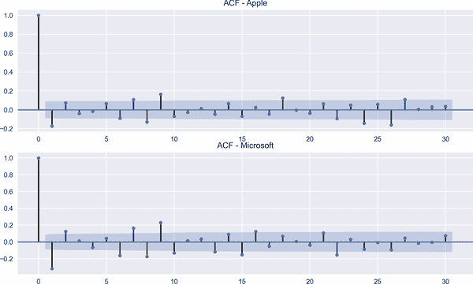

###### 图 2-14\. 差分后的 ACF

观察图 2-14 的顶部面板，我们可以看到在某些滞后期存在显著的峰值，因此我们将选择短 MA 模型的滞后期为 9，长 MA 模型的滞后期为 22。这意味着我们在 MA 建模中将使用 9 作为短期顺序，22 作为长期顺序：

```py
In [33]: short_moving_average_appl = diff_train_aapl.rolling(window=9).mean() 
         long_moving_average_appl = diff_train_aapl.rolling(window=22).mean() 

In [34]: fig, ax = plt.subplots(figsize=(10, 6))
         ax.plot(diff_train_aapl.loc[start:end].index,
                 diff_train_aapl.loc[start:end],
                 label='Stock Price', linestyle='--') 
         ax.plot(short_moving_average_appl.loc[start:end].index,
                 short_moving_average_appl.loc[start:end],
                 label = 'Short MA', linestyle='solid') 
         ax.plot(long_moving_average_appl.loc[start:end].index,
                 long_moving_average_appl.loc[start:end],
                 label = 'Long MA', linestyle='solid') 
         ax.legend(loc='best')
         ax.set_ylabel('Price in $')
         ax.set_title('Stock Prediction-Apple')
         plt.show()
```


苹果股票的短窗口移动平均


苹果股票的长窗口移动平均


苹果股票第一阶差分的折线图


可视化苹果公司短窗口 MA 结果


可视化苹果公司长窗口 MA 结果

图 2-15 展示了短期 MA 模型结果（实线）和长期 MA 模型结果（虚线点划线）。正如预期的那样，短期 MA 相对于苹果股票价格的日常变动更为敏感，而长期 MA 生成的预测更为平滑，这是合理的。

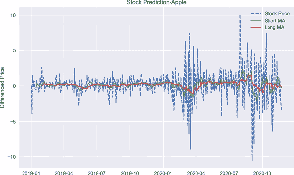

###### 图 2-15\. 苹果 MA 模型预测结果

在下一步中，我们尝试使用不同窗口的 MA 模型来预测微软的股票价格。但在继续之前，让我说一下，选择适当的短期和长期 MA 分析窗口对于良好的建模至关重要。在图 2-14 的底部面板中，似乎存在 2 和 22 的显著峰值，因此我们将在短期和长期 MA 分析中使用这些滞后期。确定窗口长度后，我们将数据拟合到以下应用的 MA 模型中：

```py
In [35]: short_moving_average_msft = diff_train_msft.rolling(window=2).mean()
         long_moving_average_msft = diff_train_msft.rolling(window=22).mean()

In [36]: fig, ax = plt.subplots(figsize=(10, 6))
         ax.plot(diff_train_msft.loc[start:end].index,
                 diff_train_msft.loc[start:end],
                 label='Stock Price', linestyle='--')
         ax.plot(short_moving_average_msft.loc[start:end].index,
                 short_moving_average_msft.loc[start:end],
                 label = 'Short MA', linestyle='solid')
         ax.plot(long_moving_average_msft.loc[start:end].index,
                 long_moving_average_msft.loc[start:end],
                 label = 'Long MA', linestyle='-.')
         ax.legend(loc='best')
         ax.set_ylabel('$')
         ax.set_xlabel('Date')
         ax.set_title('Stock Prediction-Microsoft')
         plt.show()
```

类似地，基于短期 MA 分析的预测通常比长期 MA 模型更为敏感，如图 2-16 所示。但在微软的情况下，短期 MA 预测似乎非常接近实际数据。这是我们在时间序列模型中所期望的，即具有短期视角的窗口能够更好地捕捉数据的动态变化，从而帮助我们获得更好的预测性能。

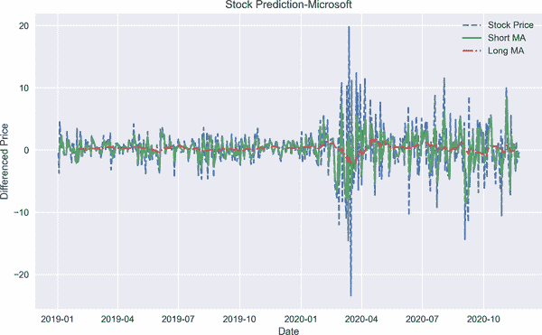

###### 图 2-16\. 微软 MA 模型预测结果

## 自回归模型

连续项的依赖结构是 AR 模型最显著的特征，因为在这个模型中，当前值被回归到它自己的滞后值上。因此，我们基本上通过其过去的值的线性组合来预测时间序列 <math alttext="upper X Subscript t"><msub><mi>X</mi> <mi>t</mi></msub></math> 的当前值。从数学上讲，AR(p)的一般形式可以写为：

<math alttext="upper X Subscript t Baseline equals c plus alpha 1 upper X Subscript t minus 1 Baseline plus alpha 2 upper X Subscript t minus 2 Baseline ellipsis plus alpha Subscript p Baseline upper X Subscript t minus p Baseline plus epsilon Subscript t" display="block"><mrow><msub><mi>X</mi> <mi>t</mi></msub> <mo>=</mo> <mi>c</mi> <mo>+</mo> <msub><mi>α</mi> <mn>1</mn></msub> <msub><mi>X</mi> <mrow><mi>t</mi><mo>-</mo><mn>1</mn></mrow></msub> <mo>+</mo> <msub><mi>α</mi> <mn>2</mn></msub> <msub><mi>X</mi> <mrow><mi>t</mi><mo>-</mo><mn>2</mn></mrow></msub> <mo>...</mo> <mo>+</mo> <msub><mi>α</mi> <mi>p</mi></msub> <msub><mi>X</mi> <mrow><mi>t</mi><mo>-</mo><mi>p</mi></mrow></msub> <mo>+</mo> <msub><mi>ϵ</mi> <mi>t</mi></msub></mrow></math>

其中 <math alttext="epsilon Subscript t"><msub><mi>ϵ</mi> <mi>t</mi></msub></math> 表示残差，*c* 是截距项。AR(p)模型意味着过去到第*p*阶的值在一定程度上对 <math alttext="upper X Subscript t"><msub><mi>X</mi> <mi>t</mi></msub></math> 有解释力。如果关系记忆较短，则可能用较少的滞后数来建模 <math alttext="upper X Subscript t"><msub><mi>X</mi> <mi>t</mi></msub></math>。

我们已经讨论了时间序列的一个主要性质，即平稳性；另一个重要性质是*可逆性*。在介绍了 AR 模型之后，现在是展示 MA 过程的可逆性的时候了。如果它可以转化为一个无限的 AR 模型，则称为可逆。

在某些情况下，MA 可以被写成一个无限的 AR 过程。这些情况是具有平稳的协方差结构、确定性部分和可逆的 MA 过程。这样一来，我们就有了另一个称为*无限 AR*模型，这要归功于假设 <math alttext="StartAbsoluteValue alpha EndAbsoluteValue less-than 1"><mrow><mo>|</mo> <mi>α</mi> <mo>|</mo> <mo><</mo> <mn>1</mn></mrow></math> 。

<math display="block"><mrow><msub><mi>X</mi> <mi>t</mi></msub> <mo>=</mo> <msub><mi>ϵ</mi> <mi>t</mi></msub> <mo>+</mo> <mi>α</mi> <msub><mi>ϵ</mi> <mrow><mi>t</mi><mo>-</mo><mn>1</mn></mrow></msub></mrow></math><math display="block"><mrow><mo>=</mo> <msub><mi>ϵ</mi> <mi>t</mi></msub> <mo>+</mo> <mi>α</mi> <mrow><mo>(</mo> <msub><mi>X</mi> <mrow><mi>t</mi><mo>-</mo><mn>1</mn></mrow></msub> <mo>-</mo> <mi>α</mi> <msub><mi>ϵ</mi> <mrow><mi>t</mi><mo>-</mo><mn>2</mn></mrow></msub> <mo>)</mo></mrow></mrow></math><math display="block"><mrow><mo>=</mo> <msub><mi>ϵ</mi> <mi>t</mi></msub> <mo>+</mo> <mi>α</mi> <msub><mi>X</mi> <mrow><mi>t</mi><mo>-</mo><mn>1</mn></mrow></msub> <mo>-</mo> <msup><mi>α</mi> <mn>2</mn></msup> <msub><mi>ϵ</mi> <mrow><mi>t</mi><mo>-</mo><mn>2</mn></mrow></msub></mrow></math><math display="block"><mrow><mo>=</mo> <msub><mi>ϵ</mi> <mi>t</mi></msub> <mo>+</mo> <mi>α</mi> <msub><mi>X</mi> <mrow><mi>t</mi><mo>-</mo><mn>1</mn></mrow></msub> <mo>-</mo> <msup><mi>α</mi> <mn>2</mn></msup> <mrow><mo>(</mo> <msub><mi>X</mi> <mrow><mi>t</mi><mo>-</mo><mn>2</mn></mrow></msub> <mo>+</mo> <mi>α</mi> <msub><mi>ϵ</mi> <mrow><mi>t</mi><mo>-</mo><mn>3</mn></mrow></msub> <mo>)</mo></mrow></mrow></math><math display="block"><mrow><mo>=</mo> <msub><mi>ϵ</mi> <mi>t</mi></msub> <mo>+</mo> <mi>α</mi> <msub><mi>X</mi> <mrow><mi>t</mi><mo>-</mo><mn>1</mn></mrow></msub> <mo>-</mo> <msup><mi>α</mi> <mn>2</mn></msup> <msub><mi>X</mi> <mrow><mi>t</mi><mo>-</mo><mn>2</mn></mrow></msub> <mo>+</mo> <msup><mi>α</mi> <mn>3</mn></msup> <msub><mi>ϵ</mi> <mrow><mi>t</mi><mo>-</mo><mn>3</mn></mrow></msub> <mrow><mo>)</mo></mrow></mrow></math><math display="block"><mrow><mo>=</mo> <mo>...</mo></mrow></math><math display="block"><mrow><mo>=</mo> <mi>α</mi> <msub><mi>X</mi> <mrow><mi>t</mi><mo>-</mo><mn>1</mn></mrow></msub> <mo>-</mo> <msup><mi>α</mi> <mn>2</mn></msup> <msub><mi>X</mi> <mrow><mi>t</mi><mo>-</mo><mn>2</mn></mrow></msub> <mo>+</mo> <msup><mi>α</mi> <mn>3</mn></msup> <msub><mi>ϵ</mi> <mrow><mi>t</mi><mo>-</mo><mn>3</mn></mrow></msub> <mo>-</mo> <msup><mi>α</mi> <mn>4</mn></msup> <msub><mi>ϵ</mi> <mrow><mi>t</mi><mo>-</mo><mn>4</mn></mrow></msub> <mo>+</mo> <mo>...</mo> <mo>-</mo> <msup><mrow><mo>(</mo><mo>-</mo><mi>α</mi><mo>)</mo></mrow> <mi>n</mi></msup> <msub><mi>ϵ</mi> <mrow><mi>t</mi><mo>-</mo><mi>n</mi></mrow></msub></mrow></math>

经过必要的数学运算后，方程式得到如下形式：

<math display="block"><mrow><msup><mi>α</mi> <mi>n</mi></msup> <msub><mi>ϵ</mi> <mrow><mi>t</mi><mo>-</mo><mi>n</mi></mrow></msub> <mo>=</mo> <msub><mi>ϵ</mi> <mi>t</mi></msub> <mo>-</mo> <munderover><mo>∑</mo> <mrow><mi>i</mi><mo>=</mo><mn>0</mn></mrow> <mrow><mi>n</mi><mo>-</mo><mn>1</mn></mrow></munderover> <msup><mi>α</mi> <mi>i</mi></msup> <msub><mi>X</mi> <mrow><mi>t</mi><mo>-</mo><mi>i</mi></mrow></msub></mrow></math>

在这种情况下，如果 <math alttext="StartAbsoluteValue alpha EndAbsoluteValue less-than 1"><mrow><mo>|</mo> <mi>α</mi> <mo>|</mo> <mo><</mo> <mn>1</mn></mrow></math> ，那么 <math alttext="n right-arrow normal infinity"><mrow><mi>n</mi> <mo>→</mo> <mi>∞</mi></mrow></math> ：

<math display="block"><mrow><mi>𝔼</mi> <msup><mrow><mo>(</mo><msub><mi>ϵ</mi> <mi>t</mi></msub> <mo>-</mo><munderover><mo>∑</mo> <mrow><mi>i</mi><mo>=</mo><mn>0</mn></mrow> <mrow><mi>n</mi><mo>-</mo><mn>1</mn></mrow></munderover> <msup><mi>α</mi> <mi>i</mi></msup> <msub><mi>X</mi> <mrow><mi>t</mi><mo>-</mo><mi>i</mi></mrow></msub> <mo>)</mo></mrow> <mn>2</mn></msup> <mo>=</mo> <mi>𝔼</mi> <mrow><mo>(</mo> <msup><mi>α</mi> <mrow><mn>2</mn><mi>n</mi></mrow></msup> <msubsup><mi>ϵ</mi> <mrow><mi>t</mi><mo>-</mo><mi>n</mi></mrow> <mn>2</mn></msubsup> <mo>→</mo> <mi>∞</mi> <mo>)</mo></mrow></mrow></math>

最终，MA(1)过程变为：

<math display="block"><mrow><msub><mi>ϵ</mi> <mi>t</mi></msub> <mo>=</mo> <munderover><mo>∑</mo> <mrow><mi>i</mi><mo>=</mo><mn>0</mn></mrow> <mi>∞</mi></munderover> <msup><mi>α</mi> <mi>i</mi></msup> <msub><mi>X</mi> <mrow><mi>t</mi><mo>-</mo><mi>i</mi></mrow></msub></mrow></math>

由于 AR 和 MA 过程之间的对偶性，可以将 AR(1) 表示为无限 MA，即 MA( <math alttext="normal infinity"><mi>∞</mi></math> )。换句话说，AR(1) 过程可以表示为创新过去值的函数：

<math display="block"><mrow><msub><mi>X</mi> <mi>t</mi></msub> <mo>=</mo> <msub><mi>ϵ</mi> <mi>t</mi></msub> <mo>+</mo> <mi>θ</mi> <msub><mi>X</mi> <mrow><mi>t</mi><mo>-</mo><mn>1</mn></mrow></msub></mrow></math><math display="block"><mrow><mo>=</mo> <mi>θ</mi> <mrow><mo>(</mo> <mi>θ</mi> <msub><mi>X</mi> <mrow><mi>t</mi><mo>-</mo><mn>2</mn></mrow></msub> <mo>+</mo> <msub><mi>ϵ</mi> <mrow><mi>t</mi><mo>-</mo><mn>1</mn></mrow></msub> <mo>)</mo></mrow> <mo>+</mo> <msub><mi>ϵ</mi> <mi>t</mi></msub></mrow></math><math display="block"><mrow><mo>=</mo> <msup><mi>θ</mi> <mn>2</mn></msup> <msub><mi>X</mi> <mrow><mi>t</mi><mo>-</mo><mn>2</mn></mrow></msub> <mo>+</mo> <mi>θ</mi> <msub><mi>ϵ</mi> <mrow><mi>t</mi><mo>-</mo><mn>1</mn></mrow></msub> <mo>+</mo> <msub><mi>ϵ</mi> <mi>t</mi></msub></mrow></math><math display="block"><mrow><mo>=</mo> <msup><mi>θ</mi> <mn>2</mn></msup> <mrow><mo>(</mo> <mi>θ</mi> <msub><mi>X</mi> <mrow><mi>t</mi><mo>-</mo><mn>3</mn></mrow></msub> <mo>+</mo> <mi>θ</mi> <msub><mi>ϵ</mi> <mrow><mi>t</mi><mo>-</mo><mn>2</mn></mrow></msub> <mo>)</mo></mrow> <mi>θ</mi> <msub><mi>ϵ</mi> <mrow><mi>t</mi><mo>-</mo><mn>1</mn></mrow></msub> <mo>+</mo> <msub><mi>ϵ</mi> <mi>t</mi></msub></mrow></math><math display="block"><mrow><msub><mi>X</mi> <mi>t</mi></msub> <mo>=</mo> <msub><mi>ϵ</mi> <mi>t</mi></msub> <mo>+</mo> <msub><mi>ϵ</mi> <mrow><mi>t</mi><mo>-</mo><mn>1</mn></mrow></msub> <mo>+</mo> <msup><mi>θ</mi> <mn>2</mn></msup> <msub><mi>ϵ</mi> <mrow><mi>t</mi><mo>-</mo><mn>2</mn></mrow></msub> <mo>+</mo> <mo>...</mo> <mo>+</mo> <msup><mi>θ</mi> <mi>t</mi></msup> <msub><mi>X</mi> <mi>t</mi></msub></mrow></math>

当 <math alttext="n right-arrow normal infinity"><mrow><mi>n</mi> <mo>→</mo> <mi>∞</mi></mrow></math> 时，<math alttext="theta Superscript t Baseline right-arrow 0"><mrow><msup><mi>θ</mi> <mi>t</mi></msup> <mo>→</mo> <mn>0</mn></mrow></math> ，因此我可以将 AR(1) 表示为无限的 MA 过程。

在以下分析中，我们运行 AR 模型来预测苹果和微软的股票价格。与 MA 不同，偏自相关函数是找出 AR 模型中最优阶数的有用工具。这是因为在 AR 中，我们的目标是找出时间序列在两个不同时间点之间的关系，比如说 <math alttext="upper X Subscript t"><msub><mi>X</mi> <mi>t</mi></msub></math> 和 <math alttext="upper X Subscript t minus k"><msub><mi>X</mi> <mrow><mi>t</mi><mo>-</mo><mi>k</mi></mrow></msub></math> ，为此我们需要滤除中间滞后的影响，得到图 2-17 和 2-18：

```py
In [37]: sm.graphics.tsa.plot_pacf(diff_train_aapl, lags=30)
         plt.title('PACF of Apple')
         plt.xlabel('Number of Lags')
         plt.show()
In [38]: sm.graphics.tsa.plot_pacf(diff_train_msft, lags=30)
         plt.title('PACF of Microsoft')
         plt.xlabel('Number of Lags')
         plt.show()
```

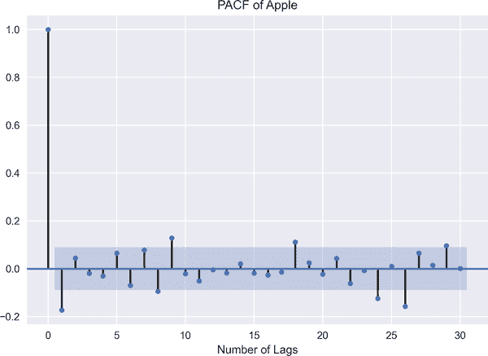

###### 图 2-17\. 苹果的偏自相关函数（PACF）

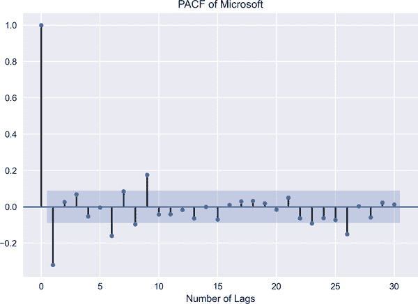

###### 图 2-18\. 微软的偏自相关函数（PACF）

在图 2-17，从苹果股票价格的一阶差分中获得，我们观察到在滞后 29 时有一个显著的峰值，在图 2-18，微软股票也有类似的在滞后 26 时的峰值。因此，29 和 26 是我们将在苹果和微软建模 AR 时使用的滞后数：

```py
In [39]: from statsmodels.tsa.ar_model import AutoReg
         import warnings
         warnings.filterwarnings('ignore')

In [40]: ar_aapl = AutoReg(diff_train_aapl.values, lags=29)
         ar_fitted_aapl = ar_aapl.fit() 

In [41]: ar_predictions_aapl = ar_fitted_aapl.predict(start=len(diff_train_aapl),
                                                      end=len(diff_train_aapl)\
                                                      + len(diff_test_aapl) - 1,
                                                      dynamic=False) 

In [42]: for i in range(len(ar_predictions_aapl)):
             print('==' * 25)
             print('predicted values:{:.4f} & actual values:{:.4f}'\
                   .format(ar_predictions_aapl[i], diff_test_aapl[i])) 
         ==================================================
         predicted values:1.6511 & actual values:1.3200
         ==================================================
         predicted values:-0.8398 & actual values:0.8600
         ==================================================
         predicted values:-0.9998 & actual values:0.5600
         ==================================================
         predicted values:1.1379 & actual values:2.4600
         ==================================================
         predicted values:-0.1123 & actual values:3.6700
         ==================================================
         predicted values:1.7843 & actual values:0.3600
         ==================================================
         predicted values:-0.9178 & actual values:-0.1400
         ==================================================
         predicted values:1.7343 & actual values:-0.6900
         ==================================================
         predicted values:-1.5103 & actual values:1.5000
         ==================================================
         predicted values:1.8224 & actual values:0.6300
         ==================================================
         predicted values:-1.2442 & actual values:-2.6000
         ==================================================
         predicted values:-0.5438 & actual values:1.4600
         ==================================================
         predicted values:-0.1075 & actual values:-0.8300
         ==================================================
         predicted values:-0.6167 & actual values:-0.6300
         ==================================================
         predicted values:1.3206 & actual values:6.1000
         ==================================================
         predicted values:0.2464 & actual values:-0.0700
         ==================================================
         predicted values:0.4489 & actual values:0.8900
         ==================================================
         predicted values:-1.3101 & actual values:-2.0400
         ==================================================
         predicted values:0.5863 & actual values:1.5700
         ==================================================
         predicted values:0.2480 & actual values:3.6500
         ==================================================
         predicted values:0.0181 & actual values:-0.9200
         ==================================================
         predicted values:0.9913 & actual values:1.0100
         ==================================================
         predicted values:0.2672 & actual values:4.7200
         ==================================================
         predicted values:0.8258 & actual values:-1.8200
         ==================================================
         predicted values:0.1502 & actual values:-1.1500
         ==================================================
         predicted values:0.5560 & actual values:-1.0300

In [43]: ar_predictions_aapl = pd.DataFrame(ar_predictions_aapl) 
         ar_predictions_aapl.index = diff_test_aapl.index 

In [44]: ar_msft = AutoReg(diff_train_msft.values, lags=26)
         ar_fitted_msft = ar_msft.fit() 

In [45]: ar_predictions_msft = ar_fitted_msft.predict(start=len(diff_train_msft),
                                                      end=len(diff_train_msft)\
                                                      +len(diff_test_msft) - 1,
                                                      dynamic=False) 

In [46]: ar_predictions_msft = pd.DataFrame(ar_predictions_msft) 
         ar_predictions_msft.index = diff_test_msft.index 
```


使用 AR 模型拟合苹果股票数据


预测苹果的股票价格


比较预测值和实际观察值


将数组转换为数据框以分配索引


将测试数据索引分配给预测值


使用 AR 模型拟合微软股票数据


预测微软的股票价格


将数组转换为数据框以分配索引


将测试数据索引分配给预测值

下面的代码，导致图 2-19，显示基于 AR 模型的预测。实线代表苹果和微软股票价格的预测，虚线表示真实数据。结果表明，MA 模型在捕捉股票价格方面优于 AR 模型：

```py
In [47]: fig, ax = plt.subplots(2,1, figsize=(18, 15))

         ax[0].plot(diff_test_aapl, label='Actual Stock Price', linestyle='--')
         ax[0].plot(ar_predictions_aapl, linestyle='solid', label="Prediction")
         ax[0].set_title('Predicted Stock Price-Apple')
         ax[0].legend(loc='best')
         ax[1].plot(diff_test_msft, label='Actual Stock Price', linestyle='--')
         ax[1].plot(ar_predictions_msft, linestyle='solid', label="Prediction")
         ax[1].set_title('Predicted Stock Price-Microsoft')
         ax[1].legend(loc='best')
         for ax in ax.flat:
             ax.set(xlabel='Date', ylabel='$')
         plt.show()
```

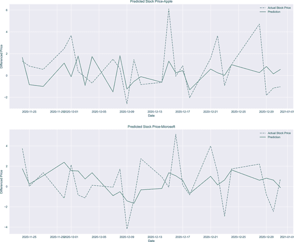

###### 图 2-19. AR 模型预测结果

## 自回归积分移动平均模型

ARIMA 是时间序列的过去值和白噪声的函数。ARIMA 被提出作为 AR 和 MA 的泛化，但它们没有积分参数，这有助于我们用原始数据来训练模型。在这方面，即使我们包括非平稳数据，ARIMA 通过正确定义积分参数使其变得平稳。

ARIMA 有三个参数，分别是*p*、*d*和*q*。正如之前的时间序列模型所熟悉的，*p*和*q*分别指的是 AR 和 MA 的阶数。*d*参数控制级别差异。如果*d* = 1，那么它等同于一阶差分，如果值为 0，则表示模型是 ARIMA。

*d*大于 1 是可能的，但不像*d*为 1 那样普遍。ARIMA(p, 1, q)方程的结构如下：

<math alttext="dollar-sign upper X Subscript t Baseline equals alpha 1 d upper X Subscript t minus 1 Baseline plus alpha 2 d upper X Subscript t minus 2 Baseline ellipsis plus alpha Subscript p Baseline d upper X Subscript t minus p Baseline plus epsilon Subscript t Baseline plus beta 1 epsilon Subscript t minus 1 Baseline plus beta 2 epsilon Subscript t minus 2 Baseline ellipsis plus beta Subscript q Baseline epsilon Subscript t minus q dollar-sign"><mrow><msub><mi>X</mi> <mi>t</mi></msub> <mo>=</mo> <msub><mi>α</mi> <mn>1</mn></msub> <mi>d</mi> <msub><mi>X</mi> <mrow><mi>t</mi><mo>-</mo><mn>1</mn></mrow></msub> <mo>+</mo> <msub><mi>α</mi> <mn>2</mn></msub> <mi>d</mi> <msub><mi>X</mi> <mrow><mi>t</mi><mo>-</mo><mn>2</mn></mrow></msub> <mo>...</mo> <mo>+</mo> <msub><mi>α</mi> <mi>p</mi></msub> <mi>d</mi> <msub><mi>X</mi> <mrow><mi>t</mi><mo>-</mo><mi>p</mi></mrow></msub> <mo>+</mo> <msub><mi>ϵ</mi> <mi>t</mi></msub> <mo>+</mo> <msub><mi>β</mi> <mn>1</mn></msub> <msub><mi>ϵ</mi> <mrow><mi>t</mi><mo>-</mo><mn>1</mn></mrow></msub> <mo>+</mo> <msub><mi>β</mi> <mn>2</mn></msub> <msub><mi>ϵ</mi> <mrow><mi>t</mi><mo>-</mo><mn>2</mn></mrow></msub> <mo>...</mo> <mo>+</mo> <msub><mi>β</mi> <mi>q</mi></msub> <msub><mi>ϵ</mi> <mrow><mi>t</mi><mo>-</mo><mi>q</mi></mrow></msub></mrow></math>

其中*d*指的是差分。

作为被广泛接受和适用的模型，让我们讨论 ARIMA 模型的优缺点以更熟悉它。

优点

+   ARIMA 允许我们使用原始数据工作，而不考虑其是否平稳。

+   它在高频数据下表现良好。

+   与其他模型相比，它对数据波动不太敏感。

缺点

+   ARIMA 可能无法捕捉季节性。

+   它在长序列和短期（日常，小时）数据中表现更好。

+   由于 ARIMA 没有自动更新，分析期间不应观察到结构性突变。

+   ARIMA 过程中没有调整会导致不稳定性。

现在，让我们看看如何使用相同的股票（即苹果和微软）来运行 ARIMA。但是，这次使用不同的短期滞后结构来比较结果与 AR 和 MA 模型：

```py
In [48]: from statsmodels.tsa.arima_model import ARIMA

In [49]: split = int(len(stock_prices['AAPL'].values) * 0.95)
         train_aapl = stock_prices['AAPL'].iloc[:split]
         test_aapl = stock_prices['AAPL'].iloc[split:]
         train_msft = stock_prices['MSFT'].iloc[:split]
         test_msft = stock_prices['MSFT'].iloc[split:]

In [50]: arima_aapl = ARIMA(train_aapl,order=(9, 1, 9)) 
         arima_fit_aapl = arima_aapl.fit() 

In [51]: arima_msft = ARIMA(train_msft, order=(6, 1, 6)) 
         arima_fit_msft = arima_msft.fit() 

In [52]: arima_predict_aapl = arima_fit_aapl.predict(start=len(train_aapl),
                                                           end=len(train_aapl)\
                                                           + len(test_aapl) - 1,
                                                           dynamic=False) 
         arima_predict_msft = arima_fit_msft.predict(start=len(train_msft),
                                                           end=len(train_msft)\
                                                           + len(test_msft) - 1,
                                                           dynamic=False) 

In [53]: arima_predict_aapl = pd.DataFrame(arima_predict_aapl)
         arima_predict_aapl.index = diff_test_aapl.index
         arima_predict_msft = pd.DataFrame(arima_predict_msft)
         arima_predict_msft.index = diff_test_msft.index 
```


配置用于苹果股票的 ARIMA 模型。


将 ARIMA 模型拟合到苹果的股票价格。


配置用于微软股票的 ARIMA 模型。


将 ARIMA 模型拟合到微软的股票价格。


基于 ARIMA 预测苹果股票价格。


基于 ARIMA 预测微软股价。


形成预测的索引。

接下来的片段，导致 图 2-20 显示了基于苹果和微软股票价格的预测结果，由于我们采用了 AR 和 MA 模型的短期订单，因此结果并非完全不同：

```py
In [54]: fig, ax = plt.subplots(2, 1, figsize=(18, 15))

         ax[0].plot(diff_test_aapl, label='Actual Stock Price', linestyle='--')
         ax[0].plot(arima_predict_aapl, linestyle='solid', label="Prediction")
         ax[0].set_title('Predicted Stock Price-Apple')
         ax[0].legend(loc='best')
         ax[1].plot(diff_test_msft, label='Actual Stock Price', linestyle='--')
         ax[1].plot(arima_predict_msft, linestyle='solid', label="Prediction")
         ax[1].set_title('Predicted Stock Price-Microsoft')
         ax[1].legend(loc='best')
         for ax in ax.flat:
             ax.set(xlabel='Date', ylabel='$')
         plt.show()
```

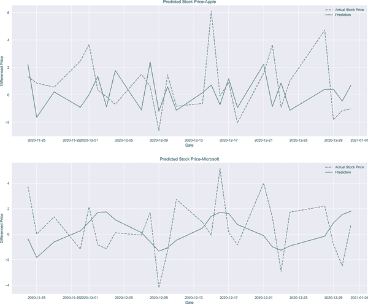

###### 图 2-20\. ARIMA 预测结果。

在这一点上，讨论一种用于时间序列模型最优滞后选择的替代方法是值得的。这里我应用的方法是 AIC，以选择适当的滞后数目。请注意，即使 AIC 的结果建议 (4, 0, 4)，但模型不会以这些顺序收敛。因此，改为应用 (4, 1, 4)：

```py
In [55]: import itertools

In [56]: p = q = range(0, 9) 
         d = range(0, 3) 
         pdq = list(itertools.product(p, d, q)) 
         arima_results_aapl = [] 
         for param_set in pdq:
             try:
                 arima_aapl = ARIMA(train_aapl, order=param_set) 
                 arima_fitted_aapl = arima_aapl.fit() 
                 arima_results_aapl.append(arima_fitted_aapl.aic) 
             except:
                 continue
         print('**'*25)
         print('The Lowest AIC score is' + \
               '{:.4f} and the corresponding parameters are {}'.format( \
                   pd.DataFrame(arima_results_aapl).where( \
                   pd.DataFrame(arima_results_aapl).T.notnull().all()).min()[0],
                   pdq[arima_results_aapl.index(min(arima_results_aapl))])) 
         **************************************************
         The Lowest AIC score is 1951.9810 and the corresponding parameters are
         (4, 0, 4)

In [57]: arima_aapl = ARIMA(train_aapl, order=(4, 1, 4)) 
         arima_fit_aapl = arima_aapl.fit() 

In [58]: p = q = range(0, 6)
         d = range(0, 3)
         pdq = list(itertools.product(p, d, q))
         arima_results_msft = []
         for param_set in pdq:
             try:
                 arima_msft = ARIMA(stock_prices['MSFT'], order=param_set)
                 arima_fitted_msft = arima_msft.fit()
                 arima_results_msft.append(arima_fitted_msft.aic)
             except:
                 continue
         print('**' * 25)
         print('The lowest AIC score is {:.4f} and parameters are {}'
               .format(pd.DataFrame(arima_results_msft)
                       .where(pd.DataFrame(arima_results_msft).T.notnull()\
                              .all()).min()[0],
                       pdq[arima_results_msft.index(min(arima_results_msft))])) 
         **************************************************
         The Lowest AIC score is 2640.6367 and the corresponding parameters are
         (4, 2, 4)

In [59]: arima_msft = ARIMA(stock_prices['MSFT'], order=(4, 2 ,4)) 
         arima_fit_msft= arima_msft.fit() 

In [60]: arima_predict_aapl = arima_fit_aapl.predict(start=len(train_aapl),
                                                           end=len(train_aapl)\
                                                           +len(test_aapl) - 1,
                                                           dynamic=False) 
         arima_predict_msft = arima_fit_msft.predict(start=len(train_msft),
                                                           end=len(train_msft)\
                                                           + len(test_msft) - 1,
                                                           dynamic=False) 

In [61]: arima_predict_aapl = pd.DataFrame(arima_predict_aapl)
         arima_predict_aapl.index = diff_test_aapl.index
         arima_predict_msft = pd.DataFrame(arima_predict_msft)
         arima_predict_msft.index = diff_test_msft.index
```


定义 AR 和 MA 订单的范围。


定义一个区间差分项。


对 *p*、*d* 和 *q* 进行迭代应用。


创建一个空列表以存储 AIC 值。


配置以适应苹果数据的 ARIMA 模型。


运行包含所有可能滞后的 ARIMA 模型。


将 AIC 值存储到列表中。


打印苹果数据的最低 AIC 值。


配置和拟合具有最佳顺序的 ARIMA 模型。


运行包括所有可能滞后项的 ARIMA 模型，针对微软的数据


将 ARIMA 模型拟合到微软数据的最佳订单


预测苹果和微软的股票价格

苹果和微软的订单识别分别为（4, 1, 4）和（4, 2, 4）。ARIMA 在预测股票价格方面表现出色，如下所示。然而，请注意，订单识别不当会导致拟合不佳，进而产生令人不满意的预测结果。以下代码，导致 Figure 2-21 显示了这些结果：

```py
In [62]: fig, ax = plt.subplots(2, 1, figsize=(18, 15))

         ax[0].plot(diff_test_aapl, label='Actual Stock Price', linestyle='--')
         ax[0].plot(arima_predict_aapl, linestyle='solid', label="Prediction")
         ax[0].set_title('Predicted Stock Price-Apple')
         ax[0].legend(loc='best')
         ax[1].plot(diff_test_msft, label='Actual Stock Price', linestyle='--')
         ax[1].plot(arima_predict_msft, linestyle='solid', label="Prediction")
         ax[1].set_title('Predicted Stock Price-Microsoft')
         ax[1].legend(loc='best')
         for ax in ax.flat:
             ax.set(xlabel='Date', ylabel='$')
         plt.show()
```

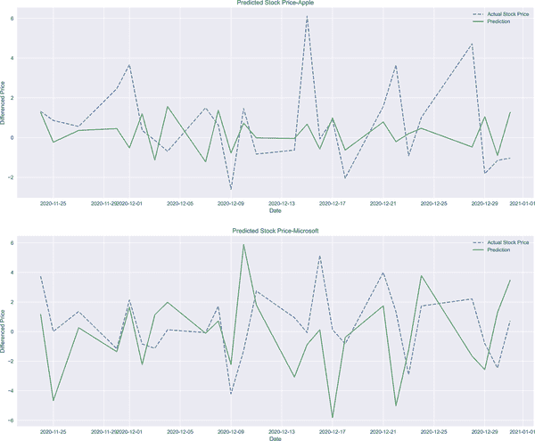

###### 图 2-21\. ARIMA 预测结果

# 结论

时间序列分析在金融分析中起着核心作用。这仅仅是因为大多数金融数据都具有时间维度，因此这类数据应谨慎建模。本章对具有时间维度的数据进行了初步建模尝试，为此，我们采用了经典的时间序列模型，即 MA、AR，最后是 ARIMA。但你认为这就是全部吗？绝对不是！在下一章中，我们将看到如何使用深度学习模型对时间序列进行建模。

# 参考文献

本章引用的文章：

+   Cavanaugh, J. E., and A. A. Neath. 2019\. “Akaike 信息准则：背景、推导、性质、应用、解释及改进。” *Wiley Interdisciplinary Reviews: Computational Statistics* 11 (3): e1460.

+   Hurvich, Clifford M., and Chih-Ling Tsai. 1989\. “小样本中的回归和时间序列模型选择。” *Biometrika* 76 (2): 297-30.

本章引用的书籍：

+   Brockwell, Peter J., and Richard A. Davis. 2016\. *时间序列和预测导论*。Springer.

+   Focardi, Sergio M. 1997\. *市场建模：新理论和技术*。The Frank J. Fabozzi Series, Vol. 14\. 纽约：John Wiley and Sons.
