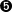

# 第三章：深度学习用于时间序列建模

> ... 是的，图灵机可以在有足够内存和时间的情况下计算任何可计算函数，但自然界必须实时解决问题。为此，它利用了类似于地球上最强大的计算机的大规模并行处理器的大脑神经网络。在它们上面高效运行的算法最终将获胜。
> 
> Terrence J. Sejnowski（2018）

*深度学习*最近成为一种流行词有其充分的理由，尽管最近试图改进深度学习实践并不是第一次尝试。然而，深度学习为何近二十年来备受推崇，这是很容易理解的。深度学习是一个抽象的概念，用几句话来定义它是很困难的。与神经网络（NN）不同，深度学习具有更复杂的结构，隐藏层定义了复杂性。因此，一些研究人员使用隐藏层的数量作为区分神经网络和深度学习的比较基准，这是一种有用但不特别严格的区分方式。一个更好的定义可以澄清这种区别。

在高层次上，深度学习可以定义为：

> 深度学习方法是多层次表示学习¹方法，通过组合简单但非线性的模块，在每个级别将表示从一个级别（从原始输入开始）转换为稍高、稍抽象的级别的表示。
> 
> Le Cunn 等人（2015）

深度学习的应用可以追溯到上世纪 40 年代，当时 Norbert Wiener 出版了《*控制论*》。在 1980 年代和 1990 年代之间，连接主义思维主导了这一领域。如今，深度学习的最新发展，比如反向传播和神经网络，塑造了我们所知道的这一领域。基本上，深度学习经历了三波发展，因此我们可能会想知道为什么深度学习如今如此盛行？Goodfellow 等人（2016）列举了一些可能的原因，包括：

+   数据规模增加

+   模型规模增加

+   提高准确性、复杂性和实际影响

现代技术和数据可用性似乎为一个深度学习时代铺平了道路，在这个时代，我们提出了新的数据驱动方法，使我们能够使用非常规模型对时间序列建模。这一发展引发了深度学习的新浪潮。在能够包括更长时间段的能力方面，两种方法表现出色：*循环神经网络*（RNN）和*长短期记忆网络*（LSTM）。在本节中，我们将简要讨论理论背景后，集中讨论这些模型在 Python 中的实用性。

# 循环神经网络

RNN 具有神经网络结构，至少有一个反馈连接，使得网络可以学习序列。反馈连接导致循环，使我们能够揭示非线性特性。这种类型的连接带来了一个新而非常有用的属性：*记忆*。因此，RNN 不仅可以利用输入数据，还可以利用先前的输出，这在时间序列建模时显得非常吸引人。

RNN 有多种形式，例如：

一对一

一对一的 RNN 包含单个输入和单个输出，这使得它成为最基本的 RNN 类型。

一对多

在这种形式中，RNN 对单个输入产生多个输出。

多对一

不同于一对多结构，多对一具有多个输入和单个输出。

多对多

这种结构具有多个输入和输出，被称为 RNN 的最复杂结构。

在 RNN 中，隐藏单元将其自身的输出反馈到神经网络中，使得 RNN 具有递归层（不同于前馈神经网络），这使得它成为建模时间序列数据的合适方法。因此，在 RNN 中，神经元的激活来自前一个时间步，表明 RNN 将其表示为网络实例的累积状态（Buduma 和 Locascio 2017）。

正如 Nielsen（2019）总结的那样：

+   RNN 按顺序逐个时间步处理。

+   网络的状态从一个时间步保持不变到另一个时间步。

+   一个 RNN 根据时间步更新其状态。

这些维度在 Figure 3-1 中有所说明。正如可以看到的那样，右侧的 RNN 结构具有时间步长，这是它与前馈网络之间的主要区别。


###### 图 3-1\. RNN 结构²

RNN 具有三维输入，包括：

+   批处理大小

+   时间步长

+   特征数

*批处理大小* 表示观察次数或数据行数。*时间步* 是馈送模型的次数。最后，*特征数* 是每个样本的列数。

我们将从以下代码开始：

```py
In [1]: import numpy as np
        import pandas as pd
        import math
        import datetime
        import yfinance as yf
        import matplotlib.pyplot as plt
        import tensorflow as tf
        from tensorflow.keras.models import Sequential
        from tensorflow.keras.callbacks import EarlyStopping
        from tensorflow.keras.layers import (Dense, Dropout,
                                             Activation, Flatten,
                                             MaxPooling2D, SimpleRNN)
        from sklearn.model_selection import train_test_split

In [2]: n_steps = 13 
        n_features = 1 

In [3]: model = Sequential() 
        model.add(SimpleRNN(512, activation='relu',
                            input_shape=(n_steps, n_features),
                            return_sequences=True)) 
        model.add(Dropout(0.2)) 
        model.add(Dense(256, activation = 'relu')) 
        model.add(Flatten()) 
        model.add(Dense(1, activation='linear')) 

In [4]: model.compile(optimizer='rmsprop',
                      loss='mean_squared_error',
                      metrics=['mse']) 

In [5]: def split_sequence(sequence, n_steps):
            X, y = [], []
            for i in range(len(sequence)):
                end_ix = i + n_steps
                if end_ix > len(sequence) - 1:
                    break
                seq_x, seq_y = sequence[i:end_ix], sequence[end_ix]
                X.append(seq_x)
                y.append(seq_y)
            return np.array(X), np.array(y) 
```


定义预测步骤的数量


将特征数定义为 1


调用一个顺序模型来运行 RNN


确定隐藏神经元的数量、激活函数和输入形状


添加一个 dropout 层以防止过拟合


添加一个具有 `relu` 激活函数的 256 个神经元的隐藏层


将模型展平以将三维矩阵转换为向量


添加具有 `linear` 激活函数的输出层


编译 RNN 模型


创建一个依赖变量 `y`

在配置模型并生成一个依赖变量之后，让我们提取数据并为苹果和微软的股票价格运行预测：

```py
In [6]: ticker = ['AAPL', 'MSFT']
        start = datetime.datetime(2019, 1, 1)
        end = datetime.datetime(2020, 1 ,1)
        stock_prices = yf.download(ticker,start=start, end = end, interval='1d')\
                       .Close
        [*********************100%***********************]  2 of 2 completed

In [7]: diff_stock_prices = stock_prices.diff().dropna()

In [8]: split = int(len(diff_stock_prices['AAPL'].values) * 0.95)
        diff_train_aapl = diff_stock_prices['AAPL'].iloc[:split]
        diff_test_aapl = diff_stock_prices['AAPL'].iloc[split:]
        diff_train_msft = diff_stock_prices['MSFT'].iloc[:split]
        diff_test_msft = diff_stock_prices['MSFT'].iloc[split:]

In [9]: X_aapl, y_aapl = split_sequence(diff_train_aapl, n_steps) 
        X_aapl = X_aapl.reshape((X_aapl.shape[0],  X_aapl.shape[1],
                                 n_features)) 

In [10]: history = model.fit(X_aapl, y_aapl,
                             epochs=400, batch_size=150, verbose=0,
                             validation_split = 0.10) 

In [11]: start = X_aapl[X_aapl.shape[0] - n_steps] 
         x_input = start 
         x_input = x_input.reshape((1, n_steps, n_features))

In [12]: tempList_aapl = [] 
         for i in range(len(diff_test_aapl)):
             x_input = x_input.reshape((1, n_steps, n_features)) 
             yhat = model.predict(x_input, verbose=0) 
             x_input = np.append(x_input, yhat)
             x_input = x_input[1:]
             tempList_aapl.append(yhat) 

In [13]: X_msft, y_msft = split_sequence(diff_train_msft, n_steps)
         X_msft = X_msft.reshape((X_msft.shape[0],  X_msft.shape[1],
                                  n_features))

In [14]: history = model.fit(X_msft, y_msft,
                             epochs=400, batch_size=150, verbose=0,
                             validation_split = 0.10)

In [15]: start = X_msft[X_msft.shape[0] - n_steps]
         x_input = start
         x_input = x_input.reshape((1, n_steps, n_features))

In [16]: tempList_msft = []
         for i in range(len(diff_test_msft)):
             x_input = x_input.reshape((1, n_steps, n_features))
             yhat = model.predict(x_input, verbose=0)
             x_input = np.append(x_input, yhat)
             x_input = x_input[1:]
             tempList_msft.append(yhat)
```


调用 `split_sequence` 函数来定义回顾期


将训练数据转换成三维情况


将 RNN 模型拟合到苹果的股票价格


定义苹果预测的起始点


重命名变量


创建一个空列表以存储预测结果


调整用于预测的 `x_input` 的形状


运行苹果股票的预测


将 `yhat` 存储到 `tempList_aapl` 中

为了可视化，使用以下代码块，结果为 图 3-2：

```py
In [17]: fig, ax = plt.subplots(2,1, figsize=(18,15))
         ax[0].plot(diff_test_aapl, label='Actual Stock Price', linestyle='--')
         ax[0].plot(diff_test_aapl.index, np.array(tempList_aapl).flatten(),
                    linestyle='solid', label="Prediction")
         ax[0].set_title('Predicted Stock Price-Apple')
         ax[0].legend(loc='best')
         ax[1].plot(diff_test_msft, label='Actual Stock Price', linestyle='--')
         ax[1].plot(diff_test_msft.index,np.array(tempList_msft).flatten(),
                    linestyle='solid', label="Prediction")
         ax[1].set_title('Predicted Stock Price-Microsoft')
         ax[1].legend(loc='best')

         for ax in ax.flat:
             ax.set(xlabel='Date', ylabel='$')
         plt.show()
```

图 3-2 展示了苹果和微软的股票价格预测结果。简单地观察可以很容易地发现，在预测模型的性能方面还有改进的空间。

即使我们可以有令人满意的预测性能，也不应忽视 RNN 模型的缺点。该模型的主要缺点是：

+   梯度消失或梯度爆炸问题（请参阅以下说明详细解释）。

+   训练 RNN 是一项非常困难的任务，因为它需要大量数据。

+   当使用 *tanh* 激活函数时，RNN 无法处理非常长的序列。

###### 注意

梯度消失是深度学习场景中常见的问题，如果不恰当设计，梯度消失问题会出现。在反向传播过程中，如果梯度趋向变小，则意味着神经元学习速度太慢，优化停滞不前。

与梯度消失问题不同，梯度爆炸问题发生在反向传播的微小变化导致优化过程中权重的巨大更新时。


###### 图 3-2. RNN 预测结果

Haviv 等人（2019）明确指出了 RNN 的缺点：

> 这是因为网络依赖于其过去的状态，并通过这些状态依赖于整个输入历史。这种能力带来了代价——RNN 被认为很难训练（Pascanu 等人 2013a）。这种困难通常与在尝试在长时间内传播错误时出现的梯度消失有关（Hochreiter 1998）。当训练成功时，网络的隐藏状态代表了这些记忆。理解这种表示在训练过程中是如何形成的，可以为改进与记忆相关的任务的学习开辟新的途径。

# 长短期记忆

LSTM 深度学习方法由 Hochreiter 和 Schmidhuber（1997）开发，主要基于*门控循环单元*（GRU）。

GRU 是为了解决梯度消失问题而提出的，这在神经网络结构中很常见，当权重更新变得太小，无法对网络产生显著变化时，就会发生梯度消失。GRU 由两个门组成：*更新*和*重置*。当检测到早期观察非常重要时，我们不会更新隐藏状态。同样，当早期观察不重要时，会导致状态重置。

如   正如之前讨论的，RNN 最吸引人的特性之一是它能够连接过去和现在的信息。然而，当*长期依赖*出现时，这种能力就会失败。长期依赖意味着模型从早期的观察中学习。

例如，让我们来审视以下句子：

*各国都有自己的货币，例如美国，人们用美元进行交易……*

在短期依赖的情况下，人们知道下一个预测的词是关于货币的，但如果问到*是哪种货币*呢？事情变得复杂，因为我们可能在文中早些时候提到过各种货币，暗示了长期依赖。需要回溯到更早的部分，找到与使用美元的国家相关的内容。

LSTM 试图解决 RNN 在长期依赖方面的弱点。LSTM 拥有一个非常有用的工具来去除不必要的信息，从而提高效率。LSTM 使用门控机制，使其能够忘记无关的数据。这些门包括：

+   忘记门

+   输入门

+   输出门

忘记门的作用是筛选出必要和不必要的信息，以使 LSTM 比 RNN 更加高效。在这样做的过程中，当信息无关时，激活函数的值*sigmoid*变为零。忘记门的公式可以表示为：

<math display="block"><mrow><msub><mi>F</mi> <mi>t</mi></msub> <mo>=</mo> <mi>σ</mi> <mrow><mo>(</mo> <msub><mi>X</mi> <mi>t</mi></msub> <msub><mi>W</mi> <mi>I</mi></msub> <mo>+</mo> <msub><mi>h</mi> <mrow><mi>t</mi><mo>-</mo><mn>1</mn></mrow></msub> <msub><mi>W</mi> <mi>f</mi></msub> <mo>+</mo> <msub><mi>b</mi> <mi>f</mi></msub> <mo>)</mo></mrow></mrow></math>

其中 <math alttext="sigma"><mi>σ</mi></math> 是激活函数，<math alttext="h Subscript t minus 1"><msub><mi>h</mi> <mrow><mi>t</mi><mo>-</mo><mn>1</mn></mrow></msub></math> 是先前的隐藏状态，<math alttext="upper W Subscript upper I"><msub><mi>W</mi> <mi>I</mi></msub></math> 和 <math alttext="upper W Subscript f"><msub><mi>W</mi> <mi>f</mi></msub></math> 是权重，最后，<math alttext="b Subscript f"><msub><mi>b</mi> <mi>f</mi></msub></math> 是遗忘单元中的偏置参数。

输入门由当前时间步的 <math alttext="upper X Subscript t"><msub><mi>X</mi> <mi>t</mi></msub></math> 和上一个时间步的隐藏状态 <math alttext="t minus 1"><mrow><mi>t</mi> <mo>-</mo> <mn>1</mn></mrow></math> 提供。输入门的目标是确定应将信息添加到长期状态的程度。可以如此表述输入门：

<math display="block"><mrow><msub><mi>I</mi> <mi>t</mi></msub> <mo>=</mo> <mi>σ</mi> <mrow><mo>(</mo> <msub><mi>X</mi> <mi>t</mi></msub> <msub><mi>W</mi> <mi>I</mi></msub> <mo>+</mo> <msub><mi>h</mi> <mrow><mi>t</mi><mo>-</mo><mn>1</mn></mrow></msub> <msub><mi>W</mi> <mi>f</mi></msub> <mo>+</mo> <msub><mi>b</mi> <mi>I</mi></msub> <mo>)</mo></mrow></mrow></math>

输出门基本上决定了应该读取的输出程度，并且工作如下：

<math display="block"><mrow><msub><mi>O</mi> <mi>t</mi></msub> <mo>=</mo> <mi>σ</mi> <mrow><mo>(</mo> <msub><mi>X</mi> <mi>t</mi></msub> <msub><mi>W</mi> <mi>o</mi></msub> <mo>+</mo> <msub><mi>h</mi> <mrow><mi>t</mi><mo>-</mo><mn>1</mn></mrow></msub> <msub><mi>W</mi> <mi>o</mi></msub> <mo>+</mo> <msub><mi>b</mi> <mi>I</mi></msub> <mo>)</mo></mrow></mrow></math>

这些门不是 LSTM 的唯一组成部分。其他组成部分包括：

+   候选记忆单元

+   记忆单元

+   隐藏状态

候选记忆单元决定信息传递到单元状态的程度。不同的是，候选单元中的激活函数是 tanh，并且采用以下形式：

<math display="block"><mrow><mover accent="true"><msub><mi>C</mi> <mi>t</mi></msub> <mo>^</mo></mover> <mo>=</mo> <mi>ϕ</mi> <mrow><mo>(</mo> <msub><mi>X</mi> <mi>t</mi></msub> <msub><mi>W</mi> <mi>c</mi></msub> <mo>+</mo> <msub><mi>h</mi> <mrow><mi>t</mi><mo>-</mo><mn>1</mn></mrow></msub> <msub><mi>W</mi> <mi>c</mi></msub> <mo>+</mo> <msub><mi>b</mi> <mi>c</mi></msub> <mo>)</mo></mrow></mrow></math>

内存单元允许 LSTM 记住或遗忘信息：

<math display="block"><mrow><msub><mi>C</mi> <mi>t</mi></msub> <mo>=</mo> <msub><mi>F</mi> <mi>t</mi></msub> <mo>⊙</mo> <mi>C</mi> <mo>+</mo> <mrow><mi>t</mi> <mo>-</mo> <mn>1</mn></mrow> <mo>+</mo> <msub><mi>I</mi> <mi>t</mi></msub> <mo>⊙</mo> <mover accent="true"><msub><mi>C</mi> <mi>t</mi></msub> <mo>^</mo></mover></mrow></math>

其中 <math alttext="circled-dot"><mo>⊙</mo></math> 是哈达玛积。

在这种循环网络中，隐藏状态是循环信息的工具。记忆单元将输出门与隐藏状态联系起来：

<math display="block"><mrow><msub><mi>h</mi> <mi>t</mi></msub> <mo>=</mo> <mi>ϕ</mi> <mrow><mo>(</mo> <msub><mi>c</mi> <mi>t</mi></msub> <mo>)</mo></mrow> <mo>⊙</mo> <msub><mi>O</mi> <mi>t</mi></msub></mrow></math>

图 3-3 展示了 LSTM 结构。


###### 图 3-3\. LSTM 结构

现在，让我们使用 LSTM 预测股票价格：

```py
In [18]: from tensorflow.keras.layers import LSTM

In [19]: n_steps = 13 
         n_features = 1 

In [20]: model = Sequential()
         model.add(LSTM(512, activation='relu',
                   input_shape=(n_steps, n_features),
                   return_sequences=True)) 
         model.add(Dropout(0.2)) 
         model.add(LSTM(256,activation='relu')) 
         model.add(Flatten())
         model.add(Dense(1, activation='linear')) 

In [21]: model.compile(optimizer='rmsprop', loss='mean_squared_error',
                       metrics=['mse']) 

In [22]: history = model.fit(X_aapl, y_aapl,
                             epochs=400, batch_size=150, verbose=0,
                             validation_split = 0.10) 

In [23]: start = X_aapl[X_aapl.shape[0] - 13]
         x_input = start
         x_input = x_input.reshape((1, n_steps, n_features))
```


定义预测步骤的数量


将特征数定义为 1


确定隐藏神经元的数量，激活函数为 `relu`，以及输入形状


添加一个 dropout 层以防止过拟合


添加一个具有 256 个神经元的额外隐藏层，使用 `relu` 激活函数


将模型展平以向量化三维矩阵


添加一个具有 `linear` 激活函数的输出层


使用均方根传播 `rmsprop` 和均方误差（MSE） `mean_squared_error` 编译 LSTM


将 LSTM 模型拟合到苹果的股票价格

###### 注意

根均方传播（`RMSProp`）是一种优化方法，其中我们计算每个权重的平方梯度的移动平均值。然后找出权重的差异，用于计算新权重：

<math display="block"><mrow><msub><mi>v</mi> <mi>t</mi></msub> <mo>=</mo> <msub><mi>ρ</mi> <msub><mi>v</mi> <mrow><mi>t</mi><mo>-</mo><mn>1</mn></mrow></msub></msub> <mo>+</mo> <mrow><mn>1</mn> <mo>-</mo> <mi>ρ</mi></mrow> <msubsup><mi>g</mi> <mi>t</mi> <mn>2</mn></msubsup></mrow></math><math display="block"><mrow><mi>Δ</mi> <msub><mi>w</mi> <mi>t</mi></msub> <mo>=</mo> <mo>-</mo> <mfrac><mi>ν</mi> <msqrt><mrow><mi>η</mi><mo>+</mo><mi>ϵ</mi></mrow></msqrt></mfrac> <msub><mi>g</mi> <mi>t</mi></msub></mrow></math><math display="block"><mrow><msub><mi>w</mi> <mrow><mi>t</mi><mo>+</mo><mn>1</mn></mrow></msub> <mo>=</mo> <msub><mi>w</mi> <mi>t</mi></msub> <mo>+</mo> <mi>Δ</mi> <msub><mi>w</mi> <mi>t</mi></msub></mrow></math>

按照相同的步骤，并给出微软的股票价格，进行预测分析：

```py
In [24]: tempList_aapl = []
         for i in range(len(diff_test_aapl)):
             x_input = x_input.reshape((1, n_steps, n_features))
             yhat = model.predict(x_input, verbose=0)
             x_input = np.append(x_input, yhat)
             x_input = x_input[1:]
             tempList_aapl.append(yhat)

In [25]: history = model.fit(X_msft, y_msft,
                             epochs=400, batch_size=150, verbose=0,
                             validation_split = 0.10)

In [26]: start = X_msft[X_msft.shape[0] - 13]
         x_input = start
         x_input = x_input.reshape((1, n_steps, n_features))

In [27]: tempList_msft = []
         for i in range(len(diff_test_msft)):
             x_input = x_input.reshape((1, n_steps, n_features))
             yhat = model.predict(x_input, verbose=0)
             x_input = np.append(x_input, yhat)
             x_input = x_input[1:]
             tempList_msft.append(yhat)
```

下面的代码创建了显示预测结果的图表（图 3-4）：

```py
In [28]: fig, ax = plt.subplots(2, 1, figsize=(18, 15))
         ax[0].plot(diff_test_aapl, label='Actual Stock Price', linestyle='--')
         ax[0].plot(diff_test_aapl.index, np.array(tempList_aapl).flatten(),
                    linestyle='solid', label="Prediction")
         ax[0].set_title('Predicted Stock Price-Apple')
         ax[0].legend(loc='best')
         ax[1].plot(diff_test_msft, label='Actual Stock Price', linestyle='--')
         ax[1].plot(diff_test_msft.index, np.array(tempList_msft).flatten(),
                    linestyle='solid', label="Prediction")
         ax[1].set_title('Predicted Stock Price-Microsoft')
         ax[1].legend(loc='best')

         for ax in ax.flat:
             ax.set(xlabel='Date', ylabel='$')
         plt.show()
```

LSTM 似乎在捕捉极值方面优于 RNN。


###### 图 3-4。LSTM 预测结果

# 结论

本章讨论了基于深度学习预测股票价格的问题。使用的模型是 RNN 和 LSTM，它们具有处理更长时间周期的能力。这些模型并未显示出显著的改进，但仍可用于建模时间序列数据。在我们的案例中，LSTM 考虑了 13 步的回溯期进行预测。对于扩展，将多个特征包含在基于深度学习的模型中是一个明智的方法，而这是参数化时间序列模型所不允许的。

在下一章中，我们将讨论基于参数化和 ML 模型的波动率预测，以便比较它们的性能。

# 参考文献

本章引用的文章：

+   Ding, Daizong 等人。2019 年。“时间序列预测中极端事件建模。” *第 25 届 ACM SIGKDD 国际数据挖掘会议论文集*。1114-1122。

+   Haviv，Doron，Alexander Rivkind 和 Omri Barak。2019 年。“理解和控制递归神经网络中的记忆。” arXiv 预印本。arXiv:1902.07275。

+   Hochreiter, Sepp 和 Jürgen Schmidhuber. 1997 年。“长短期记忆。” *神经计算* 9（8）：1735-1780。

+   LeCun，Yann，Yoshua Bengio 和 Geoffrey Hinton。2015 年。“深度学习。” *自然* 521（7553）：436-444。

本章引用的书籍：

+   Buduma，N.和 N. Locascio。2017 年。*深度学习基础：设计下一代机器智能算法*。Sebastopol：O’Reilly。

+   Goodfellow，I.，Y. Bengio 和 A. Courville。2016 年。*深度学习*。剑桥，MA：MIT 出版社。

+   Nielsen, A. 2019\. *实用时间序列分析：统计与机器学习预测*. Sebastopol: O’Reilly.

+   Patterson, Josh, 和 Adam Gibson. 2017\. *深度学习：从业者的视角*. Sebastopol: O’Reilly.

+   Sejnowski, Terrence J. 2018\. *深度学习革命*. 剑桥, 麻省: MIT Press.

¹ 表征学习帮助我们以独特的方式定义一个概念。例如，如果任务是检测某物是否为圆形，则边缘起着关键作用，因为圆形没有边缘。因此，我们可以使用颜色、形状和大小来为对象创建一个表示。本质上，这就是人脑的工作方式，我们知道深度学习结构受到大脑功能的启发。

² Patterson 等人, 2017\. “深度学习：从业者的视角.”
