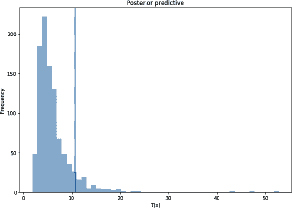

# 第四章：基于机器学习的波动率预测

> 条件回报分布最关键的特征可能是其二阶矩结构，这在经验上是分布的主导时变特征。这一事实催生了关于回报波动建模和预测的大量文献。
> 
> Andersen 等人（2003）

“有些概念易于理解但难以定义。这也适用于波动性。” 这可能是马科维茨之前某位生前的话，因为他对波动性的建模非常清晰和直观。马科维茨提出了他著名的投资组合理论，在其中他将*波动性*定义为标准差，从那时起，金融领域与数学更加紧密地联系在一起。

波动性在金融中是支柱，因为它不仅为投资者提供信息信号，还是各种金融模型的输入。波动性如此重要的原因是什么？答案强调了不确定性的重要性，这是金融模型的主要特征。

金融市场的增加整合导致了这些市场长期不确定性的延续，进而强调了波动性的重要性，即金融资产价值变动的程度。作为风险的代理，波动性是许多领域（包括资产定价和风险管理）中最重要的变量之一。它的强烈存在和延迟使得必须进行建模。作为风险度量，波动性在 1996 年生效的巴塞尔协议后在风险管理中扮演了关键角色（Karasan 和 Gaygisiz 2020）。

在 Black（1976）开创性研究之后，关于波动率估计的大量文献逐渐涌现，包括 Andersen 和 Bollerslev（1997）、Raju 和 Ghosh（2004）、Dokuchaev（2014）以及 De Stefani 等人（2017）。我们谈论的是使用 ARCH 和 GARCH 类型模型进行波动率预测的长期传统，这些模型存在一些可能导致失败的缺陷，如波动率聚类、信息不对称等。尽管这些问题被不同模型解决，但是最近金融市场的波动加上机器学习的发展使得研究人员重新思考了波动率估计。

本章旨在展示如何利用基于机器学习的模型提升预测性能。我们将介绍各种机器学习算法，包括支持向量回归、神经网络和深度学习，以便进行预测性能比较。

对波动率进行建模相当于对不确定性进行建模，以便更好地理解和处理不确定性，从而使我们能够对真实世界有足够好的近似。为了评估建议模型在多大程度上符合实际情况，我们需要计算回报波动率，也称为*实现波动率*。实现波动率是实现方差的平方根，即回报的平方和。实现波动率用于计算波动率预测方法的性能。以下是回报波动率的公式：

<math alttext="ModifyingAbove sigma With caret equals StartRoot StartFraction 1 Over n minus 1 EndFraction sigma-summation Underscript n equals 1 Overscript upper N Endscripts left-parenthesis r Subscript n Baseline minus mu right-parenthesis squared EndRoot" display="block"><mrow><mover accent="true"><mi>σ</mi> <mo>^</mo></mover> <mo>=</mo> <msqrt><mrow><mfrac><mn>1</mn> <mrow><mi>n</mi><mo>-</mo><mn>1</mn></mrow></mfrac> <msubsup><mo>∑</mo> <mrow><mi>n</mi><mo>=</mo><mn>1</mn></mrow> <mi>N</mi></msubsup> <msup><mrow><mo>(</mo><msub><mi>r</mi> <mi>n</mi></msub> <mo>-</mo><mi>μ</mi><mo>)</mo></mrow> <mn>2</mn></msup></mrow></msqrt></mrow></math>

其中*r*和<math alttext="mu"><mi>μ</mi></math>分别是回报和回报均值，*n*是观察次数。

让我们看看如何在 Python 中计算回报波动率：

```py
In [1]: import numpy as np
        from scipy.stats import norm
        import scipy.optimize as opt
        import yfinance as yf
        import pandas as pd
        import datetime
        import time
        from arch import arch_model
        import matplotlib.pyplot as plt
        from numba import jit
        from sklearn.metrics import mean_squared_error as mse
        import warnings
        warnings.filterwarnings('ignore')

In [2]: stocks = '^GSPC'
        start = datetime.datetime(2010, 1, 1)
        end = datetime.datetime(2021, 8, 1)
        s_p500 = yf.download(stocks, start=start, end = end, interval='1d')
        [*********************100%***********************]  1 of 1 completed

In [3]: ret = 100 * (s_p500.pct_change()[1:]['Adj Close']) 
        realized_vol = ret.rolling(5).std()

In [4]: plt.figure(figsize=(10, 6))
        plt.plot(realized_vol.index,realized_vol)
        plt.title('Realized Volatility- S&P-500')
        plt.ylabel('Volatility')
        plt.xlabel('Date')
        plt.show()
```


根据调整后的收盘价格计算标准普尔 500 指数的回报。

图表 4-1 展示了 2010 年至 2021 年间标准普尔 500 指数的实现波动率。最引人注目的观察结果是在 COVID-19 大流行期间出现的波动率尖峰。


###### 图 4-1. 实现波动率—标准普尔 500 指数

波动率估计方式对相关分析的可靠性和准确性有着不可否认的影响。因此，本章既涉及经典波动率预测技术，也涉及基于机器学习的波动率预测技术，旨在展示后者更为优越的预测性能。为了比较全新的基于机器学习的模型，我们从建模经典波动率模型开始。一些非常著名的经典波动率模型包括但不限于以下几种：

+   ARCH

+   GARCH

+   GJR-GARCH

+   EGARCH

现在是深入经典波动率模型的时候了。让我们从 ARCH 模型开始。

# ARCH 模型

早期对波动率建模的一种尝试由 Eagle (1982)提出，称为 ARCH 模型。ARCH 模型是一个基于历史资产回报的单变量模型。ARCH(p)模型具有以下形式：

<math alttext="sigma Subscript t Superscript 2 Baseline equals omega plus sigma-summation Underscript k equals 1 Overscript p Endscripts alpha Subscript k Baseline left-parenthesis r Subscript t minus k Baseline right-parenthesis squared" display="block"><mrow><msubsup><mi>σ</mi> <mi>t</mi> <mn>2</mn></msubsup> <mo>=</mo> <mi>ω</mi> <mo>+</mo> <munderover><mo>∑</mo> <mrow><mi>k</mi><mo>=</mo><mn>1</mn></mrow> <mi>p</mi></munderover> <msub><mi>α</mi> <mi>k</mi></msub> <msup><mrow><mo>(</mo><msub><mi>r</mi> <mrow><mi>t</mi><mo>-</mo><mi>k</mi></mrow></msub> <mo>)</mo></mrow> <mn>2</mn></msup></mrow></math>

其中均值模型为：

<math alttext="r Subscript t Baseline equals sigma Subscript t Baseline epsilon Subscript t" display="block"><mrow><msub><mi>r</mi> <mi>t</mi></msub> <mo>=</mo> <msub><mi>σ</mi> <mi>t</mi></msub> <msub><mi>ϵ</mi> <mi>t</mi></msub></mrow></math>

其中<math alttext="epsilon Subscript t"><msub><mi>ϵ</mi> <mi>t</mi></msub></math>被假设为正态分布。在这个参数模型中，我们需要满足一些假设条件以确保严格的正方差。在这方面，以下条件应当成立：

+   <math alttext="omega greater-than 0"><mrow><mi>ω</mi> <mo>></mo> <mn>0</mn></mrow></math>

+   <math alttext="alpha Subscript k Baseline greater-than-or-equal-to 0"><mrow><msub><mi>α</mi> <mi>k</mi></msub> <mo>≥</mo> <mn>0</mn></mrow></math>

所有这些方程告诉我们，ARCH 是一个单变量且非线性的模型，其中波动率是通过过去回报的平方来估计的。ARCH 最显著的特征之一是具有时变条件方差的性质¹，因此 ARCH 能够模拟被称为*波动率聚集*的现象——即大变化往往会后续出现大的变化，不论其方向如何，而小变化则往往会后续出现小的变化，正如 Mandelbrot (1963)所描述的。因此，一旦市场发布重要公告，可能会导致巨大的波动。

下面的代码块显示了如何绘制聚类图以及其效果：

```py
In [5]: retv = ret.values 

In [6]: plt.figure(figsize=(10, 6))
        plt.plot(s_p500.index[1:], ret)
        plt.title('Volatility clustering of S&P-500')
        plt.ylabel('Daily returns')
        plt.xlabel('Date')
        plt.show()
```


将返回的数据框转换为`numpy`表示形式

与实现波动性峰值类似，图 4-2 表明存在一些大幅波动，毫不奇怪，这些起伏通常发生在重要事件，比如 2020 年中期的 COVID-19 大流行期间。


###### 图 4-2\. 波动性聚类—标准普尔 500 指数

尽管 ARCH 模型具有诸如简单性、非线性、易用性和用于预测的调整等吸引人的特征，但它也存在一些缺点：

+   对正面和负面冲击的反应相等

+   诸如对参数的限制等强假设

+   由于对大幅波动的缓慢调整可能导致误预测

这些缺点促使研究人员进行 ARCH 模型的扩展工作，尤其是 Bollerslev（1986）和 Taylor（1986）提出的 GARCH 模型，我们稍后将讨论。

现在让我们使用 ARCH 模型来预测波动性。首先，让我们生成我们自己的 Python 代码，然后与`arch`库中的内置函数进行比较，看看它们之间的差异：

```py
In [7]: n = 252
        split_date = ret.iloc[-n:].index 

In [8]: sgm2 = ret.var() 
        K = ret.kurtosis() 
        alpha = (-3.0 * sgm2 + np.sqrt(9.0 * sgm2 ** 2 - 12.0 *
                                     (3.0 * sgm2 - K) * K)) / (6 * K) 
        omega = (1 - alpha) * sgm2 
        initial_parameters = [alpha, omega]
        omega, alpha
Out[8]: (0.6345749196895419, 0.46656704131150534)

In [9]: @jit(nopython=True, parallel=True) 
        def arch_likelihood(initial_parameters, retv):
            omega = abs(initial_parameters[0]) 
            alpha = abs(initial_parameters[1]) 
            T = len(retv)
            logliks = 0
            sigma2 = np.zeros(T)
            sigma2[0] = np.var(retv) 
            for t in range(1, T):
                sigma2[t] = omega + alpha * (retv[t - 1]) ** 2 
            logliks = np.sum(0.5 * (np.log(sigma2)+retv ** 2 / sigma2)) 
            return logliks

In [10]: logliks = arch_likelihood(initial_parameters, retv)
         logliks
Out[10]: 1453.127184488521

In [11]: def opt_params(x0, retv):
             opt_result = opt.minimize(arch_likelihood, x0=x0, args = (retv),
                                       method='Nelder-Mead',
                                       options={'maxiter': 5000}) 
             params = opt_result.x 
             print('\nResults of Nelder-Mead minimization\n{}\n{}'
                   .format(''.join(['-'] * 28), opt_result))
             print('\nResulting params = {}'.format(params))
             return params

In [12]: params = opt_params(initial_parameters, retv)

         Results of Nelder-Mead minimization
         ----------------------------
          final_simplex: (array([[0.70168795, 0.39039044],
                [0.70163494, 0.3904423 ],
         [0.70163928, 0.39033154]]), array([1385.79241695,
                1385.792417, 1385.79241907]))
                    fun: 1385.7924169507244
                message: 'Optimization terminated successfully.'
                   nfev: 62
                    nit: 33
                 status: 0
                success: True
                      x: array([0.70168795, 0.39039044])

         Resulting params = [0.70168795 0.39039044]

In [13]: def arch_apply(ret):
                 omega = params[0]
                 alpha = params[1]
                 T = len(ret)
                 sigma2_arch = np.zeros(T + 1)
                 sigma2_arch[0] = np.var(ret)
                 for t in range(1, T):
                     sigma2_arch[t] = omega + alpha * ret[t - 1] ** 2
                 return sigma2_arch

In [14]: sigma2_arch = arch_apply(ret)
```


定义拆分位置并将拆分数据分配给`split`变量


计算标准普尔 500 指数的方差


计算标准普尔 500 指数的峰度


确定斜率系数<math alttext="alpha"><mi>α</mi></math>的初始值


确定常数项<math alttext="omega"><mi>ω</mi></math>的初始值


使用并行处理以减少处理时间


取绝对值并将初始值分配给相关变量


确定波动性的初始值


迭代标准普尔 500 指数的方差


计算对数似然


最小化对数似然函数


为优化参数创建变量`params`

我们通过自己的优化方法和 ARCH 方程建模波动率。但是如何与内置的 Python 代码进行比较呢？这些内置代码可以从`arch`库导入，非常容易应用。内置函数的结果如下；事实证明这两个结果非常相似：

```py
In [15]: arch = arch_model(ret, mean='zero', vol='ARCH', p=1).fit(disp='off')
         print(arch.summary())

                 Zero Mean - ARCH Model Results                        \
=============================================================================
Dep. Variable:            Adj Close   R-squared:                       0.000
Mean Model:               Zero Mean   Adj. R-squared:                  0.000
Vol Model:                     ARCH   Log-Likelihood:               -4063.63
Distribution:                Normal   AIC:                           8131.25
Method:          Maximum Likelihood   BIC:                           8143.21
No. Observations:              2914

Date:                Mon, Sep 13 2021   Df Residuals:                   2914
Time:                        21:56:56   Df Model:                        0

                        Volatility Model
========================================================================
                coef    std err          t      P>|t|  95.0% Conf. Int.
------------------------------------------------------------------------
omega          0.7018  5.006e-02     14.018  1.214e-44 [  0.604,  0.800]
alpha[1]       0.3910  7.016e-02      5.573  2.506e-08 [  0.253,  0.529]
========================================================================

Covariance estimator: robust
```

尽管开发我们自己的代码总是有帮助并提高我们的理解，但这并不意味着不需要使用内置函数或库。相反，这些函数在效率和易用性方面使我们的生活更加轻松。

我们只需创建一个 for 循环并定义适当的信息标准。在这里，我们将选择贝叶斯信息准则（BIC）作为模型选择方法和选择滞后项。之所以使用 BIC 是因为只要我们有足够大的样本，BIC 就是一个可靠的模型选择工具，如 Burnham 和 Anderson（2002 和 2004）所述。现在，我们从 1 到 5 个滞后项迭代 ARCH 模型：

```py
In [16]: bic_arch = []

         for p in range(1, 5): 
                 arch = arch_model(ret, mean='zero', vol='ARCH', p=p)\
                         .fit(disp='off') 
                 bic_arch.append(arch.bic)
                 if arch.bic == np.min(bic_arch): 
                     best_param = p
         arch = arch_model(ret, mean='zero', vol='ARCH', p=best_param)\
                 .fit(disp='off') 
         print(arch.summary())
         forecast = arch.forecast(start=split_date[0]) 
         forecast_arch = forecast

         Zero Mean - ARCH Model Results
==============================================================================
Dep. Variable:              Adj Close   R-squared:                       0.000
Mean Model:                 Zero Mean   Adj. R-squared:                  0.000
Vol Model:                       ARCH   Log-Likelihood:               -3712.38
Distribution:                  Normal   AIC:                           7434.75
Method:            Maximum Likelihood   BIC:                           7464.64
No. Observations:                2914

Date:                Mon, Sep 13 2021   Df Residuals:                     2914
Time:                        21:56:58   Df Model:                          0

         Volatility Model

==========================================================================

                 coef    std err          t      P>|t|    95.0% Conf. Int.
--------------------------------------------------------------------------
omega          0.2798  2.584e-02     10.826  2.580e-27   [  0.229,  0.330]
alpha[1]       0.1519  3.460e-02      4.390  1.136e-05 [8.406e-02,  0.220]
alpha[2]       0.2329  3.620e-02      6.433  1.249e-10   [  0.162,  0.304]
alpha[3]       0.1917  3.707e-02      5.170  2.337e-07   [  0.119,  0.264]
alpha[4]       0.1922  4.158e-02      4.623  3.780e-06   [  0.111,  0.274]
==========================================================================

         Covariance estimator: robust

In [17]: rmse_arch = np.sqrt(mse(realized_vol[-n:] / 100,
                                 np.sqrt(forecast_arch\
                                 .variance.iloc[-len(split_date):]
                                 / 100))) 
         print('The RMSE value of ARCH model is {:.4f}'.format(rmse_arch))
         The RMSE value of ARCH model is 0.0896

In [18]: plt.figure(figsize=(10, 6))
         plt.plot(realized_vol / 100, label='Realized Volatility')
         plt.plot(forecast_arch.variance.iloc[-len(split_date):] / 100,
                  label='Volatility Prediction-ARCH')
         plt.title('Volatility Prediction with ARCH', fontsize=12)
         plt.legend()
         plt.show()
```


在指定的间隔内迭代 ARCH 参数*p*


使用不同的*p*值运行 ARCH 模型


寻找最小的 BIC 分数来选择最佳模型


使用最佳*p*值运行 ARCH 模型


基于优化的 ARCH 模型预测波动率


计算均方根误差（RMSE）分数

基于我们的第一个模型的波动率预测结果显示在图 4-3 中。


###### 图 4-3\. 使用 ARCH 进行波动率预测

# GARCH 模型

GARCH 模型是将滞后条件方差合并到 ARCH 模型中的扩展。因此，通过添加*p*个滞后条件方差，改进了 ARCH 模型，使得 GARCH 模型在多元意义上是一个条件方差的自回归移动平均模型，具有*p*个滞后平方收益和*q*个滞后条件方差。GARCH(*p*, *q*)可以表达为：

<math alttext="sigma Subscript t Superscript 2 Baseline equals omega plus sigma-summation Underscript k equals 1 Overscript q Endscripts alpha Subscript k Baseline r Subscript t minus k Superscript 2 Baseline plus sigma-summation Underscript k equals 1 Overscript p Endscripts beta Subscript k Baseline sigma Subscript t minus k Superscript 2" display="block"><mrow><msubsup><mi>σ</mi> <mi>t</mi> <mn>2</mn></msubsup> <mo>=</mo> <mi>ω</mi> <mo>+</mo> <munderover><mo>∑</mo> <mrow><mi>k</mi><mo>=</mo><mn>1</mn></mrow> <mi>q</mi></munderover> <msub><mi>α</mi> <mi>k</mi></msub> <msubsup><mi>r</mi> <mrow><mi>t</mi><mo>-</mo><mi>k</mi></mrow> <mn>2</mn></msubsup> <mo>+</mo> <munderover><mo>∑</mo> <mrow><mi>k</mi><mo>=</mo><mn>1</mn></mrow> <mi>p</mi></munderover> <msub><mi>β</mi> <mi>k</mi></msub> <msubsup><mi>σ</mi> <mrow><mi>t</mi><mo>-</mo><mi>k</mi></mrow> <mn>2</mn></msubsup></mrow></math>

其中<math alttext="omega"><mi>ω</mi></math>，<math alttext="beta"><mi>β</mi></math>和<math alttext="alpha"><mi>α</mi></math>是待估计的参数，*p*和*q*是模型中的最大滞后。为了保持一致的 GARCH，应满足以下条件：

+   <math alttext="omega"><mi>ω</mi></math> > 0

+   <math alttext="beta greater-than-or-equal-to 0"><mrow><mi>β</mi> <mo>≥</mo> <mn>0</mn></mrow></math>

+   <math alttext="alpha greater-than-or-equal-to 0"><mrow><mi>α</mi> <mo>≥</mo> <mn>0</mn></mrow></math>

+   <math alttext="beta plus alpha"><mrow><mi>β</mi> <mo>+</mo> <mi>α</mi></mrow></math> < 1

ARCH 模型无法捕捉历史创新的影响。然而，作为更简约的模型，GARCH 模型可以解释历史创新的变化，因为 GARCH 模型可以被表达为无限阶的 ARCH。让我们看看 GARCH 如何可以显示为无限阶的 ARCH：

<math alttext="sigma Subscript t Superscript 2 Baseline equals omega plus alpha r Subscript t minus 1 Superscript 2 Baseline plus beta sigma Subscript t minus 1 Superscript 2" display="block"><mrow><msubsup><mi>σ</mi> <mi>t</mi> <mn>2</mn></msubsup> <mo>=</mo> <mi>ω</mi> <mo>+</mo> <mi>α</mi> <msubsup><mi>r</mi> <mrow><mi>t</mi><mo>-</mo><mn>1</mn></mrow> <mn>2</mn></msubsup> <mo>+</mo> <mi>β</mi> <msubsup><mi>σ</mi> <mrow><mi>t</mi><mo>-</mo><mn>1</mn></mrow> <mn>2</mn></msubsup></mrow></math>

然后用<math alttext="sigma Subscript t minus 1 Superscript 2"><msubsup><mi>σ</mi> <mrow><mi>t</mi><mo>-</mo><mn>1</mn></mrow> <mn>2</mn></msubsup></math>替换<math alttext="omega plus alpha r Subscript t minus 2 Superscript 2 plus beta sigma Subscript t minus 2 Superscript 2"><mrow><mi>ω</mi> <mo>+</mo> <mi>α</mi> <msubsup><mi>r</mi> <mrow><mi>t</mi><mo>-</mo><mn>2</mn></mrow> <mn>2</mn></msubsup> <mo>+</mo> <mi>β</mi> <msubsup><mi>σ</mi> <mrow><mi>t</mi><mo>-</mo><mn>2</mn></mrow> <mn>2</mn></msubsup></mrow></math>：

<math alttext="sigma Subscript t Superscript 2 Baseline equals omega plus alpha r Subscript t minus 1 Superscript 2 Baseline plus beta left-parenthesis omega plus alpha r Subscript t minus 2 Superscript 2 Baseline sigma Subscript t minus 2 Superscript 2 Baseline right-parenthesis" display="block"><mrow><msubsup><mi>σ</mi> <mi>t</mi> <mn>2</mn></msubsup> <mo>=</mo> <mi>ω</mi> <mo>+</mo> <mi>α</mi> <msubsup><mi>r</mi> <mrow><mi>t</mi><mo>-</mo><mn>1</mn></mrow> <mn>2</mn></msubsup> <mo>+</mo> <mi>β</mi> <mrow><mo>(</mo> <mi>ω</mi> <mo>+</mo> <mi>α</mi> <msubsup><mi>r</mi> <mrow><mi>t</mi><mo>-</mo><mn>2</mn></mrow> <mn>2</mn></msubsup> <msubsup><mi>σ</mi> <mrow><mi>t</mi><mo>-</mo><mn>2</mn></mrow> <mn>2</mn></msubsup> <mo>)</mo></mrow></mrow></math><math alttext="equals omega left-parenthesis 1 plus beta right-parenthesis plus alpha r Subscript t minus 1 Superscript 2 Baseline plus beta alpha r Subscript t minus 2 Superscript 2 Baseline plus beta squared sigma Subscript t minus 2 Superscript 2 Baseline right-parenthesis" display="block"><mrow><mo>=</mo> <mi>ω</mi> <mrow><mo>(</mo> <mn>1</mn> <mo>+</mo> <mi>β</mi> <mo>)</mo></mrow> <mo>+</mo> <mi>α</mi> <msubsup><mi>r</mi> <mrow><mi>t</mi><mo>-</mo><mn>1</mn></mrow> <mn>2</mn></msubsup> <mo>+</mo> <mi>β</mi> <mi>α</mi> <msubsup><mi>r</mi> <mrow><mi>t</mi><mo>-</mo><mn>2</mn></mrow> <mn>2</mn></msubsup> <mo>+</mo> <msup><mi>β</mi> <mn>2</mn></msup> <msubsup><mi>σ</mi> <mrow><mi>t</mi><mo>-</mo><mn>2</mn></mrow> <mn>2</mn></msubsup> <mrow><mo>)</mo></mrow></mrow></math>

现在，让我们用 <math alttext="sigma Subscript t minus 2 Superscript 2"><msubsup><mi>σ</mi> <mrow><mi>t</mi><mo>-</mo><mn>2</mn></mrow> <mn>2</mn></msubsup></math> 替换为 <math alttext="omega plus alpha r Subscript t minus 3 Superscript 2 plus beta sigma Subscript t minus 3 Superscript 2"><mrow><mi>ω</mi> <mo>+</mo> <mi>α</mi> <msubsup><mi>r</mi> <mrow><mi>t</mi><mo>-</mo><mn>3</mn></mrow> <mn>2</mn></msubsup> <mo>+</mo> <mi>β</mi> <msubsup><mi>σ</mi> <mrow><mi>t</mi><mo>-</mo><mn>3</mn></mrow> <mn>2</mn></msubsup></mrow></math> 并进行必要的数学运算，以便我们得到：

<math alttext="sigma Subscript t Superscript 2 Baseline equals omega left-parenthesis 1 plus beta plus beta squared plus period period period right-parenthesis plus alpha sigma-summation Underscript k equals 1 Overscript normal infinity Endscripts beta Superscript k minus 1 Baseline r Subscript t minus k" display="block"><mrow><msubsup><mi>σ</mi> <mi>t</mi> <mn>2</mn></msubsup> <mo>=</mo> <mi>ω</mi> <mrow><mo>(</mo> <mn>1</mn> <mo>+</mo> <mi>β</mi> <mo>+</mo> <msup><mi>β</mi> <mn>2</mn></msup> <mo>+</mo> <mo>.</mo> <mo>.</mo> <mo>.</mo> <mo>)</mo></mrow> <mo>+</mo> <mi>α</mi> <munderover><mo>∑</mo> <mrow><mi>k</mi><mo>=</mo><mn>1</mn></mrow> <mi>∞</mi></munderover> <msup><mi>β</mi> <mrow><mi>k</mi><mo>-</mo><mn>1</mn></mrow></msup> <msub><mi>r</mi> <mrow><mi>t</mi><mo>-</mo><mi>k</mi></mrow></msub></mrow></math>

与 ARCH 模型类似，Python 中使用 GARCH 建模波动率的方法不止一种。让我们尝试用优化技术开发自己的基于 Python 的代码。接下来，将使用 `arch` 库来预测波动率：

```py
In [19]: a0 = 0.0001
         sgm2 = ret.var()
         K = ret.kurtosis()
         h = 1 - alpha / sgm2
         alpha = np.sqrt(K * (1 - h ** 2) / (2.0 * (K + 3)))
         beta = np.abs(h - omega)
         omega = (1 - omega) * sgm2
         initial_parameters = np.array([omega, alpha, beta])
         print('Initial parameters for omega, alpha, and beta are \n{}\n{}\n{}'
               .format(omega, alpha, beta))
         Initial parameters for omega, alpha, and beta  are
         0.43471178001576827
         0.512827280537482
         0.02677799855546381

In [20]: retv = ret.values

In [21]: @jit(nopython=True, parallel=True)
         def garch_likelihood(initial_parameters, retv):
             omega = initial_parameters[0]
             alpha = initial_parameters[1]
             beta = initial_parameters[2]
             T =  len(retv)
             logliks = 0
             sigma2 = np.zeros(T)
             sigma2[0] = np.var(retv)
             for t in range(1, T):
                 sigma2[t] = omega + alpha * (retv[t - 1]) ** 2 +
                             beta * sigma2[t-1]
             logliks = np.sum(0.5 * (np.log(sigma2) + retv ** 2 / sigma2))
             return logliks

In [22]: logliks = garch_likelihood(initial_parameters, retv)
         print('The Log likelihood  is {:.4f}'.format(logliks))
         The Log likelihood  is 1387.7215

In [23]: def garch_constraint(initial_parameters):
             alpha = initial_parameters[0]
             gamma = initial_parameters[1]
             beta = initial_parameters[2]
             return np.array([1 - alpha - beta])

In [24]: bounds = [(0.0, 1.0), (0.0, 1.0), (0.0, 1.0)]

In [25]: def opt_paramsG(initial_parameters, retv):
             opt_result = opt.minimize(garch_likelihood,
                                       x0=initial_parameters,
                                       constraints=np.array([1 - alpha - beta]),
                                       bounds=bounds, args = (retv),
                                       method='Nelder-Mead',
                                       options={'maxiter': 5000})
             params = opt_result.x
             print('\nResults of Nelder-Mead minimization\n{}\n{}'\
                   .format('-' * 35, opt_result))
             print('-' * 35)
             print('\nResulting parameters = {}'.format(params))
             return params

In [26]: params = opt_paramsG(initial_parameters, retv)

         Results of Nelder-Mead minimization
         -----------------------------------
          final_simplex: (array([[0.03918956, 0.17370549, 0.78991502],
                [0.03920507, 0.17374466, 0.78987403],
                [0.03916671, 0.17377319, 0.78993078],
         [0.03917324, 0.17364595, 0.78998753]]), array([979.87109624, 979.8710967 ,
          979.87109865, 979.8711147 ]))
                    fun: 979.8710962352685
                message: 'Optimization terminated successfully.'
                   nfev: 178
                    nit: 102
                 status: 0
                success: True
                      x: array([0.03918956, 0.17370549, 0.78991502])
         -----------------------------------

         Resulting parameters = [0.03918956 0.17370549 0.78991502]

In [27]: def garch_apply(ret):
                 omega = params[0]
                 alpha = params[1]
                 beta = params[2]
                 T = len(ret)
                 sigma2 = np.zeros(T + 1)
                 sigma2[0] = np.var(ret)
                 for t in range(1, T):
                     sigma2[t] = omega + alpha * ret[t - 1] ** 2 +
                                 beta * sigma2[t-1]
                 return sigma2
```

我们从自己的 GARCH 代码中获得的参数大约是：

+   <math alttext="omega"><mi>ω</mi></math> = 0.0392

+   <math alttext="alpha"><mi>α</mi></math> = 0.1737

+   <math alttext="beta"><mi>β</mi></math> = 0.7899

现在，让我们尝试使用内置的 Python 函数：

```py
In [28]: garch = arch_model(ret, mean='zero', vol='GARCH', p=1, o=0, q=1)\
                 .fit(disp='off')
         print(garch.summary())

         Zero Mean - GARCH Model Results
==============================================================================
Dep. Variable:              Adj Close   R-squared:                       0.000
Mean Model:                 Zero Mean   Adj. R-squared:                  0.000
Vol Model:                      GARCH   Log-Likelihood:               -3657.62
Distribution:                  Normal   AIC:                           7321.23
Method:            Maximum Likelihood   BIC:                           7339.16
No. Observations:                 2914

Date:                Mon, Sep 13 2021   Df Residuals:                     2914
Time:                        21:57:08   Df Model:                          0
Volatility Model

============================================================================
coef    std err          t      P>|t|      95.0% Conf. Int.

----------------------------------------------------------------------------
omega          0.0392  8.422e-03      4.652  3.280e-06 [2.268e-02,5.569e-02]
alpha[1]       0.1738  2.275e-02      7.637  2.225e-14     [  0.129,  0.218]
beta[1]        0.7899  2.275e-02     34.715 4.607e-264     [  0.745,  0.835]
============================================================================

         Covariance estimator: robust
```

内置函数确认我们的工作很棒，因为通过内置代码获取的参数几乎与我们的参数相同，所以我们已经学会如何编写 GARCH 和 ARCH 模型来预测波动率。

使用 GARCH(1, 1) 很容易，但我们如何知道参数是否是最优的呢？让我们根据最低的 BIC 值确定最优参数集（同时生成 图 4-4）：

```py
In [29]: bic_garch = []

         for p in range(1, 5):
             for q in range(1, 5):
                 garch = arch_model(ret, mean='zero',vol='GARCH', p=p, o=0, q=q)\
                         .fit(disp='off')
                 bic_garch.append(garch.bic)
                 if garch.bic == np.min(bic_garch):
                     best_param = p, q
         garch = arch_model(ret, mean='zero', vol='GARCH',
                            p=best_param[0], o=0, q=best_param[1])\
                 .fit(disp='off')
         print(garch.summary())
         forecast = garch.forecast(start=split_date[0])
         forecast_garch = forecast

         Zero Mean - GARCH Model Results
==============================================================================
Dep. Variable:              Adj Close   R-squared:                       0.000
Mean Model:                 Zero Mean   Adj. R-squared:                  0.000
Vol Model:                      GARCH   Log-Likelihood:               -3657.62
Distribution:                  Normal   AIC:                           7321.23
Method:            Maximum Likelihood   BIC:                           7339.16
No. Observations:                 2914

Date:                Mon, Sep 13 2021   Df Residuals:                     2914
Time:                        21:57:10   Df Model:                          0
Volatility Model

============================================================================
                  coef    std err          t      P>|t|      95.0% Conf. Int.
----------------------------------------------------------------------------
omega          0.0392  8.422e-03      4.652  3.280e-06 [2.268e-02, 5.569e-02]
alpha[1]       0.1738  2.275e-02      7.637  2.225e-14       [  0.129, 0.218]
beta[1]        0.7899  2.275e-02     34.715 4.607e-264       [  0.745, 0.835]
============================================================================

         Covariance estimator: robust

In [30]: rmse_garch = np.sqrt(mse(realized_vol[-n:] / 100,
                                  np.sqrt(forecast_garch\
                                  .variance.iloc[-len(split_date):]
                                  / 100)))
         print('The RMSE value of GARCH model is {:.4f}'.format(rmse_garch))
         The RMSE value of GARCH model is 0.0878

In [31]: plt.figure(figsize=(10,6))
         plt.plot(realized_vol / 100, label='Realized Volatility')
         plt.plot(forecast_garch.variance.iloc[-len(split_date):] / 100,
                  label='Volatility Prediction-GARCH')
         plt.title('Volatility Prediction with GARCH', fontsize=12)
         plt.legend()
         plt.show()
```


###### 图 4-4\. 使用 GARCH 预测波动性

GARCH 模型很好地适应了收益的波动性，部分原因在于其波动性聚类特性，部分原因在于 GARCH 不假定收益独立，这使得它能够解释收益的厚尾特性。然而，尽管具有这些有用的特性和直观性，GARCH 不能对冲击的非对称响应进行建模（Karasan 和 Gaygisiz 2020）。为了解决这个问题，Glosten、Jagannathan 和 Runkle（1993）提出了 GJR-GARCH 模型。

# GJR-GARCH

GJR-GARCH 模型在模拟公告的非对称效应方面表现良好，即坏消息的影响大于好消息。换句话说，在存在不对称性的情况下，损失的分布比收益的分布有更厚的尾部。该模型的方程包含一个额外的参数，<math alttext="gamma"><mi>γ</mi></math>，其形式如下：

<math mode="display"><mrow><msubsup><mi>σ</mi> <mi>t</mi> <mn>2</mn></msubsup> <mo>=</mo> <mi>ω</mi> <mo>+</mo> <munderover><mo>∑</mo> <mrow><mi>k</mi><mo>=</mo><mn>1</mn></mrow> <mi>q</mi></munderover> <mrow><mo>(</mo> <msub><mi>α</mi> <mi>k</mi></msub> <msubsup><mi>r</mi> <mrow><mi>t</mi><mo>-</mo><mi>k</mi></mrow> <mn>2</mn></msubsup> <mo>+</mo> <mi>γ</mi> <msubsup><mi>r</mi> <mrow><mi>t</mi><mo>-</mo><mi>k</mi></mrow> <mn>2</mn></msubsup> <mi>I</mi> <mrow><mo>(</mo> <msub><mi>ϵ</mi> <mrow><mi>t</mi><mo>-</mo><mn>1</mn></mrow></msub> <mo><</mo> <mn>0</mn> <mo>)</mo></mrow> <mo>)</mo></mrow> <mo>+</mo> <munderover><mo>∑</mo> <mrow><mi>k</mi><mo>=</mo><mn>1</mn></mrow> <mi>p</mi></munderover> <msub><mi>β</mi> <mi>k</mi></msub> <msubsup><mi>σ</mi> <mrow><mi>t</mi><mo>-</mo><mi>k</mi></mrow> <mn>2</mn></msubsup></mrow></math>

其中 <math alttext="gamma"><mi>γ</mi></math> 控制公告的非对称性，如果

<math alttext="gamma"><mi>γ</mi></math> = 0

对过去的冲击反应是相同的。

<math alttext="gamma"><mi>γ</mi></math> > 0

对过去的负向冲击反应比正向冲击更强。

<math alttext="gamma"><mi>γ</mi></math> < 0

对过去的正向冲击反应比负向冲击更强。

现在让我们通过使用 BIC 找到最佳参数值并产生结果图图 4-5 来运行 GJR-GARCH 模型：

```py
In [32]: bic_gjr_garch = []

         for p in range(1, 5):
             for q in range(1, 5):
                 gjrgarch = arch_model(ret, mean='zero', p=p, o=1, q=q)\
                            .fit(disp='off')
                 bic_gjr_garch.append(gjrgarch.bic)
                 if gjrgarch.bic == np.min(bic_gjr_garch):
                     best_param = p, q
         gjrgarch = arch_model(ret,mean='zero', p=best_param[0], o=1,
                               q=best_param[1]).fit(disp='off')
         print(gjrgarch.summary())
         forecast = gjrgarch.forecast(start=split_date[0])
         forecast_gjrgarch = forecast

         Zero Mean - GJR-GARCH Model Results
==============================================================================
Dep. Variable:              Adj Close   R-squared:                      0.000
Mean Model:                 Zero Mean   Adj. R-squared:                 0.000
Vol Model:                  GJR-GARCH   Log-Likelihood:              -3593.36
Distribution:                  Normal   AIC:                          7194.73
Method:            Maximum Likelihood   BIC:                          7218.64
No. Observations:                 2914

Date:                Mon, Sep 13 2021   Df Residuals:                    2914
Time:                        21:57:14   Df Model:                         0
Volatility Model

=============================================================================
                 coef    std err          t      P>|t|       95.0% Conf. Int.
-----------------------------------------------------------------------------
omega          0.0431  7.770e-03      5.542  2.983e-08  [2.784e-02,5.829e-02]
alpha[1]       0.0386  3.060e-02      1.261      0.207 [-2.139e-02,9.855e-02]
gamma[1]       0.2806  4.818e-02      5.824  5.740e-09       [  0.186, 0.375]
beta[1]        0.7907  2.702e-02     29.263 3.029e-188       [  0.738, 0.844]
=============================================================================

         Covariance estimator: robust

In [33]: rmse_gjr_garch = np.sqrt(mse(realized_vol[-n:] / 100,
                                      np.sqrt(forecast_gjrgarch\
                                      .variance.iloc[-len(split_date):]
                                      / 100)))
         print('The RMSE value of GJR-GARCH models is {:.4f}'
               .format(rmse_gjr_garch))
         The RMSE value of GJR-GARCH models is 0.0882

In [34]: plt.figure(figsize=(10, 6))
         plt.plot(realized_vol / 100, label='Realized Volatility')
         plt.plot(forecast_gjrgarch.variance.iloc[-len(split_date):] / 100,
                  label='Volatility Prediction-GJR-GARCH')
         plt.title('Volatility Prediction with GJR-GARCH', fontsize=12)
         plt.legend()
         plt.show()
```


###### 图 4-5\. 使用 GJR-GARCH 进行波动率预测

# EGARCH

与 GJR-GARCH 模型一同，由 Nelson（1991）提出的 EGARCH 模型是另一种控制不对称公告效应的工具。此外，它以对数形式规定，因此无需添加限制以避免负波动：

<math alttext="log left-parenthesis sigma Subscript t Superscript 2 Baseline right-parenthesis equals omega plus sigma-summation Underscript k equals 1 Overscript p Endscripts beta Subscript k Baseline log sigma Subscript t minus k Superscript 2 Baseline plus sigma-summation Underscript k equals 1 Overscript q Endscripts alpha Subscript i Baseline StartFraction StartAbsoluteValue r Subscript k minus 1 Baseline EndAbsoluteValue Over StartRoot sigma Subscript t minus k Superscript 2 Baseline EndRoot EndFraction plus sigma-summation Underscript k equals 1 Overscript q Endscripts gamma Subscript k Baseline StartFraction r Subscript t minus k Baseline Over StartRoot sigma Subscript t minus k Superscript 2 Baseline EndRoot EndFraction" display="block"><mrow><mtext>log</mtext> <mrow><mo>(</mo> <msubsup><mi>σ</mi> <mi>t</mi> <mn>2</mn></msubsup> <mo>)</mo></mrow> <mo>=</mo> <mi>ω</mi> <mo>+</mo> <munderover><mo>∑</mo> <mrow><mi>k</mi><mo>=</mo><mn>1</mn></mrow> <mi>p</mi></munderover> <msub><mi>β</mi> <mi>k</mi></msub> <mtext>log</mtext> <msubsup><mi>σ</mi> <mrow><mi>t</mi><mo>-</mo><mi>k</mi></mrow> <mn>2</mn></msubsup> <mo>+</mo> <munderover><mo>∑</mo> <mrow><mi>k</mi><mo>=</mo><mn>1</mn></mrow> <mi>q</mi></munderover> <msub><mi>α</mi> <mi>i</mi></msub> <mfrac><mrow><mrow><mo>|</mo></mrow><msub><mi>r</mi> <mrow><mi>k</mi><mo>-</mo><mn>1</mn></mrow></msub> <mrow><mo>|</mo></mrow></mrow> <msqrt><msubsup><mi>σ</mi> <mrow><mi>t</mi><mo>-</mo><mi>k</mi></mrow> <mn>2</mn></msubsup></msqrt></mfrac> <mo>+</mo> <munderover><mo>∑</mo> <mrow><mi>k</mi><mo>=</mo><mn>1</mn></mrow> <mi>q</mi></munderover> <msub><mi>γ</mi> <mi>k</mi></msub> <mfrac><msub><mi>r</mi> <mrow><mi>t</mi><mo>-</mo><mi>k</mi></mrow></msub> <msqrt><msubsup><mi>σ</mi> <mrow><mi>t</mi><mo>-</mo><mi>k</mi></mrow> <mn>2</mn></msubsup></msqrt></mfrac></mrow></math>

EGARCH 方程的主要区别在于方程左侧的方差取对数。这表明了杠杆效应，意味着过去资产回报与波动率之间存在负相关。如果 <math alttext="gamma less-than 0"><mrow><mi>γ</mi> <mo><</mo> <mn>0</mn></mrow></math> ，则表明存在杠杆效应；如果 <math alttext="gamma not-equals 0"><mrow><mi>γ</mi> <mo>≠</mo> <mn>0</mn></mrow></math> ，则显示了波动率的不对称性。

按照之前使用的相同步骤，让我们使用 EGARCH 模型来建模波动率（导致图 4-6）：

```py
In [35]: bic_egarch = []

         for p in range(1, 5):
             for q in range(1, 5):
                 egarch = arch_model(ret, mean='zero', vol='EGARCH', p=p, q=q)\
                          .fit(disp='off')
                 bic_egarch.append(egarch.bic)
                 if egarch.bic == np.min(bic_egarch):
                     best_param = p, q
         egarch = arch_model(ret, mean='zero', vol='EGARCH',
                             p=best_param[0], q=best_param[1])\
                  .fit(disp='off')
         print(egarch.summary())
         forecast = egarch.forecast(start=split_date[0])
         forecast_egarch = forecast

         Zero Mean - EGARCH Model Results
==============================================================================
Dep. Variable:              Adj Close   R-squared:                      0.000
Mean Model:                 Zero Mean   Adj. R-squared:                 0.000
Vol Model:                     EGARCH   Log-Likelihood:              -3676.18
Distribution:                  Normal   AIC:                          7358.37
Method:            Maximum Likelihood   BIC:                          7376.30
No. Observations:                 2914

Date:                Mon, Sep 13 2021   Df Residuals:                    2914
Time:                        21:57:19   Df Model:                         0
Volatility Model

=============================================================================
                 coef    std err          t      P>|t|       95.0% Conf. Int.
-----------------------------------------------------------------------------
omega      2.3596e-03  6.747e-03      0.350      0.727  [-1.086e-02,1.558e-02]
alpha[1]       0.3266  3.427e-02      9.530  1.567e-21        [  0.259, 0.394]
beta[1]        0.9456  1.153e-02     82.023      0.000        [  0.923, 0.968]
=============================================================================

         Covariance estimator: robust

In [36]: rmse_egarch = np.sqrt(mse(realized_vol[-n:] / 100,
                                   np.sqrt(forecast_egarch.variance\
                                   .iloc[-len(split_date):] / 100)))
         print('The RMSE value of EGARCH models is {:.4f}'.format(rmse_egarch))
         The RMSE value of EGARCH models is 0.0904

In [37]: plt.figure(figsize=(10, 6))
         plt.plot(realized_vol / 100, label='Realized Volatility')
         plt.plot(forecast_egarch.variance.iloc[-len(split_date):] / 100,
                  label='Volatility Prediction-EGARCH')
         plt.title('Volatility Prediction with EGARCH', fontsize=12)
         plt.legend()
         plt.show()
```


###### 图 4-6\. 使用 EGARCH 进行波动率预测

鉴于表 4-1 所示的 RMSE 结果，这里使用的模型中表现最佳和最差的分别是 GARCH 和 EGARCH。但在我们使用的模型性能中并没有太大差异。特别是在坏消息/好消息公告期间，由于市场的不对称性，EGARCH 和 GJR-GARCH 的表现可能会有所不同。

表 4-1\. 所有四种模型的 RMSE 结果

| 模型 | RMSE |
| --- | --- |
| ARCH | 0.0896 |
| GARCH | 0.0878 |
| GJR-GARCH | 0.0882 |
| EGARCH | 0.0904 |

到目前为止，我们已经讨论了经典波动率模型，但从现在开始，我们将看到如何利用机器学习和贝叶斯方法来建模波动率。在机器学习的背景下，支持向量机和神经网络将是首要探索的模型。让我们开始吧。

# 支持向量回归：GARCH

支持向量机（SVM）是一种监督学习算法，可用于分类和回归。SVM 的目标是找到一个分隔两个类别的线。听起来容易，但挑战在于：几乎有无数条线可以用来区分类别。但我们正在寻找的是能够完美区分类别的最优线。

在线性代数中，最优线称为*超平面*，它最大化了属于不同类别但最接近超平面的点之间的距离。两个点（支持向量）之间的距离称为*间隔*。因此，在支持向量机中，我们试图最大化支持向量之间的间隔。

SVM 用于分类被称为支持向量分类（SVC）。保留 SVM 的所有特性，它也可应用于回归。同样，在回归中，目标是找到最小化误差并最大化间隔的超平面。这种方法称为支持向量回归（SVR），在本部分中，我们将应用此方法于 GARCH 模型。结合这两个模型得到*SVR-GARCH*。

下面的代码展示了我们在 Python 中运行 SVR-GARCH 之前的准备工作。这里最关键的步骤是获取独立变量，即实现波动率和历史回报的平方：

```py
In [38]: from sklearn.svm import SVR
         from scipy.stats import uniform as sp_rand
         from sklearn.model_selection import RandomizedSearchCV

In [39]: realized_vol = ret.rolling(5).std() 
         realized_vol = pd.DataFrame(realized_vol)
         realized_vol.reset_index(drop=True, inplace=True)

In [40]: returns_svm = ret ** 2
         returns_svm = returns_svm.reset_index()
         del returns_svm['Date']

In [41]: X = pd.concat([realized_vol, returns_svm], axis=1, ignore_index=True)
         X = X[4:].copy()
         X = X.reset_index()
         X.drop('index', axis=1, inplace=True)

In [42]: realized_vol = realized_vol.dropna().reset_index()
         realized_vol.drop('index', axis=1, inplace=True)

In [43]: svr_poly = SVR(kernel='poly', degree=2) 
         svr_lin = SVR(kernel='linear') 
         svr_rbf = SVR(kernel='rbf') 
```


计算实现波动率，并将其命名为`realized_vol`


为每个 SVR 核函数创建新变量

让我们运行并查看我们第一个使用线性核的 SVR-GARCH 应用程序（并生成图 4-7）；我们将使用 RMSE 指标比较这些应用程序：

```py
In [44]: para_grid = {'gamma': sp_rand(),
                      'C': sp_rand(),
                      'epsilon': sp_rand()} 
         clf = RandomizedSearchCV(svr_lin, para_grid) 
         clf.fit(X.iloc[:-n].values,
                 realized_vol.iloc[1:-(n-1)].values.reshape(-1,)) 
         predict_svr_lin = clf.predict(X.iloc[-n:]) 

In [45]: predict_svr_lin = pd.DataFrame(predict_svr_lin)
         predict_svr_lin.index = ret.iloc[-n:].index

In [46]: rmse_svr = np.sqrt(mse(realized_vol.iloc[-n:] / 100,
                                predict_svr_lin / 100))
         print('The RMSE value of SVR with Linear Kernel is {:.6f}'
               .format(rmse_svr))
         The RMSE value of SVR with Linear Kernel is 0.000462

In [47]: realized_vol.index = ret.iloc[4:].index

In [48]: plt.figure(figsize=(10, 6))
         plt.plot(realized_vol / 100, label='Realized Volatility')
         plt.plot(predict_svr_lin / 100, label='Volatility Prediction-SVR-GARCH')
         plt.title('Volatility Prediction with SVR-GARCH (Linear)', fontsize=12)
         plt.legend()
         plt.show()
```


识别调整超参数空间


使用`RandomizedSearchCV`进行超参数调整


用线性核将 SVR-GARCH 拟合到数据


基于最后 252 个观察值预测波动率，并将其存储在`predict_svr_lin`中


###### 图 4-7\. SVR-GARCH 线性核波动率预测

图 4-7 展示了预测值和实际观察结果。通过直观分析，我们可以看出 SVR-GARCH 表现良好。你可以猜到，如果数据集是线性可分的，线性核函数效果良好；这也被*奥卡姆剃刀*所推荐。³ 但如果数据集不是线性可分的呢？接下来我们继续使用径向基函数（RBF）和多项式核函数。前者使用椭圆形曲线围绕观察结果，而后者不同于前两者，专注于样本的组合。现在让我们看看它们是如何工作的。

让我们从使用 RBF 核的 SVR-GARCH 应用程序开始，这是一个将数据投影到新向量空间的函数。从实际角度来看，使用不同核的 SVR-GARCH 应用程序并不是一个费时的过程；我们所需做的只是切换核名称，如下所示（并产生图 4-8）：

```py
In [49]: para_grid ={'gamma': sp_rand(),
                     'C': sp_rand(),
                     'epsilon': sp_rand()}
         clf = RandomizedSearchCV(svr_rbf, para_grid)
         clf.fit(X.iloc[:-n].values,
                 realized_vol.iloc[1:-(n-1)].values.reshape(-1,))
         predict_svr_rbf = clf.predict(X.iloc[-n:])

In [50]: predict_svr_rbf = pd.DataFrame(predict_svr_rbf)
         predict_svr_rbf.index = ret.iloc[-n:].index

In [51]: rmse_svr_rbf = np.sqrt(mse(realized_vol.iloc[-n:] / 100,
                                    predict_svr_rbf / 100))
         print('The RMSE value of SVR with RBF Kernel is  {:.6f}'
               .format(rmse_svr_rbf))
         The RMSE value of SVR with RBF Kernel is  0.000970

In [52]: plt.figure(figsize=(10, 6))
         plt.plot(realized_vol / 100, label='Realized Volatility')
         plt.plot(predict_svr_rbf / 100, label='Volatility Prediction-SVR_GARCH')
         plt.title('Volatility Prediction with SVR-GARCH (RBF)', fontsize=12)
         plt.legend()
         plt.show()
```


###### 图 4-8\. 带有 SVR-GARCH RBF 核的波动率预测

RMSE 分数和可视化均表明，带有线性核的 SVR-GARCH 优于带有 RBF 核的 SVR-GARCH。带有线性和 RBF 核的 SVR 的 RMSE 分别为 0.000462 和 0.000970。因此，带有线性核的 SVR 表现良好。

最后，让我们尝试带有多项式核的 SVR-GARCH。结果表明，它具有最高的 RMSE（0.002386），这意味着它是这三种不同应用中表现最差的核。可以在图 4-9 中找到带有多项式核的 SVR-GARCH 的预测性能：

```py
In [53]: para_grid = {'gamma': sp_rand(),
                     'C': sp_rand(),
                     'epsilon': sp_rand()}
         clf = RandomizedSearchCV(svr_poly, para_grid)
         clf.fit(X.iloc[:-n].values,
                 realized_vol.iloc[1:-(n-1)].values.reshape(-1,))
         predict_svr_poly = clf.predict(X.iloc[-n:])

In [54]: predict_svr_poly = pd.DataFrame(predict_svr_poly)
         predict_svr_poly.index = ret.iloc[-n:].index

In [55]: rmse_svr_poly = np.sqrt(mse(realized_vol.iloc[-n:] / 100,
                                     predict_svr_poly / 100))
         print('The RMSE value of SVR with Polynomial Kernel is {:.6f}'\
               .format(rmse_svr_poly))
         The RMSE value of SVR with Polynomial Kernel is 0.002386

In [56]: plt.figure(figsize=(10, 6))
         plt.plot(realized_vol/100, label='Realized Volatility')
         plt.plot(predict_svr_poly/100, label='Volatility Prediction-SVR-GARCH')
         plt.title('Volatility Prediction with SVR-GARCH (Polynomial)',
                   fontsize=12)
         plt.legend()
         plt.show()
```


###### 图 4-9\. 带有 SVR-GARCH 多项式核的波动率预测

# 神经网络

神经网络是深度学习的构建模块。在神经网络中，数据经过多个阶段处理以做出决策。每个神经元将点积的结果作为输入，并在激活函数中使用它来做出决策：

<math alttext="z equals w 1 x 1 plus w 2 x 2 plus b" display="block"><mrow><mi>z</mi> <mo>=</mo> <msub><mi>w</mi> <mn>1</mn></msub> <msub><mi>x</mi> <mn>1</mn></msub> <mo>+</mo> <msub><mi>w</mi> <mn>2</mn></msub> <msub><mi>x</mi> <mn>2</mn></msub> <mo>+</mo> <mi>b</mi></mrow></math>

其中*b*是偏差，*w*是权重，*x*是输入数据。

在此过程中，输入数据在隐藏层和输出层中以各种方式进行数学处理。一般而言，神经网络有三种类型的层：

+   输入层

+   隐藏层

+   输出层

图 4-10 可以帮助说明各层之间的关系。

输入层包括原始数据。从输入层到隐藏层，我们学习系数。根据网络结构，可能有一个或多个隐藏层。网络的隐藏层越多，它就越复杂。隐藏层位于输入层和输出层之间，通过激活函数执行非线性变换。


###### 图 4-10\. 神经网络结构

最后，输出层是生成输出并做出决策的层。

在机器学习中，*梯度下降*被应用于寻找最小化成本函数的最优参数，但在神经网络中仅使用梯度下降不可行，因为神经网络内部具有链式结构。因此，提出了一种称为反向传播的新概念来最小化成本函数。*反向传播*的理念基于计算观察到的输出与实际输出之间的误差，然后将此误差传递到隐藏层。因此，我们向后移动，主要方程式采取以下形式：

<math alttext="delta Superscript l Baseline equals StartFraction delta upper J Over delta z Subscript j Superscript l Baseline EndFraction" display="block"><mrow><msup><mi>δ</mi> <mi>l</mi></msup> <mo>=</mo> <mfrac><mrow><mi>δ</mi><mi>J</mi></mrow> <mrow><mi>δ</mi><msubsup><mi>z</mi> <mi>j</mi> <mi>l</mi></msubsup></mrow></mfrac></mrow></math>

其中*z*是线性变换，<math alttext="delta"><mi>δ</mi></math>表示误差。这里还有很多要说的，但为了使我们保持在正确的轨道上，我们将在这里停止。对于那些想深入了解神经网络背后数学的人，请参阅 Wilmott（2013）和 Alpaydin（2020）。

现在，我们使用`MLPRegressor`模块从 scikit-learn 应用基于神经网络的波动率预测，即使在 Python 中运行神经网络有各种选项。⁴ 鉴于我们介绍的神经网络结构，结果如下：

```py
In [57]: from sklearn.neural_network import MLPRegressor 
         NN_vol = MLPRegressor(learning_rate_init=0.001, random_state=1)
         para_grid_NN = {'hidden_layer_sizes': [(100, 50), (50, 50), (10, 100)],
                        'max_iter': [500, 1000],
                        'alpha': [0.00005, 0.0005 ]} 
         clf = RandomizedSearchCV(NN_vol, para_grid_NN)
         clf.fit(X.iloc[:-n].values,
                 realized_vol.iloc[1:-(n-1)].values.reshape(-1, )) 
         NN_predictions = clf.predict(X.iloc[-n:]) 

In [58]: NN_predictions = pd.DataFrame(NN_predictions)
         NN_predictions.index = ret.iloc[-n:].index

In [59]: rmse_NN = np.sqrt(mse(realized_vol.iloc[-n:] / 100,
                               NN_predictions / 100))
         print('The RMSE value of NN is {:.6f}'.format(rmse_NN))
         The RMSE value of NN is 0.000583

In [60]: plt.figure(figsize=(10, 6))
         plt.plot(realized_vol / 100, label='Realized Volatility')
         plt.plot(NN_predictions / 100, label='Volatility Prediction-NN')
         plt.title('Volatility Prediction with Neural Network', fontsize=12)
         plt.legend()
         plt.show()
```


导入`MLPRegressor`模块


通过设置三个隐藏层和不同的神经元数量来配置 NN 模型


将 NN 模型拟合到训练数据中⁵


基于最后 252 个观察值预测波动性，并将其存储在`NN_predictions`变量中

图 4-11 展示了基于 NN 模型的波动性预测结果。尽管其表现合理，我们可以通过改变隐藏神经元的数量来生成一个深度学习模型。为此，我们可以应用 Keras 库，这是 Python 对人工神经网络的接口。


###### 图 4-11\. 带有 NN 的波动性预测

现在是使用深度学习来预测波动性的时候了。基于 Keras，配置网络结构非常容易。我们只需要确定特定层的神经元数量。这里，第一和第二个隐藏层的神经元数量分别为 256 和 128。由于波动性属于连续型，我们只有一个输出神经元：

```py
In [61]: import tensorflow as tf
         from tensorflow import keras
         from tensorflow.keras import layers

In [62]: model = keras.Sequential(
             [layers.Dense(256, activation="relu"),
              layers.Dense(128, activation="relu"),
              layers.Dense(1, activation="linear"),]) 

In [63]: model.compile(loss='mse', optimizer='rmsprop') 

In [64]: epochs_trial = np.arange(100, 400, 4) 
         batch_trial = np.arange(100, 400, 4) 
         DL_pred = []
         DL_RMSE = []
         for i, j, k in zip(range(4), epochs_trial, batch_trial):
             model.fit(X.iloc[:-n].values,
                       realized_vol.iloc[1:-(n-1)].values.reshape(-1,),
                       batch_size=k, epochs=j, verbose=False) 
             DL_predict = model.predict(np.asarray(X.iloc[-n:])) 
             DL_RMSE.append(np.sqrt(mse(realized_vol.iloc[-n:] / 100,
                                     DL_predict.flatten() / 100))) 
             DL_pred.append(DL_predict)
             print('DL_RMSE_{}:{:.6f}'.format(i+1, DL_RMSE[i]))
         DL_RMSE_1:0.000551
         DL_RMSE_2:0.000714
         DL_RMSE_3:0.000627
         DL_RMSE_4:0.000739

In [65]: DL_predict = pd.DataFrame(DL_pred[DL_RMSE.index(min(DL_RMSE))])
         DL_predict.index = ret.iloc[-n:].index

In [66]: plt.figure(figsize=(10, 6))
         plt.plot(realized_vol / 100,label='Realized Volatility')
         plt.plot(DL_predict / 100,label='Volatility Prediction-DL')
         plt.title('Volatility Prediction with Deep Learning',  fontsize=12)
         plt.legend()
         plt.show()
```


通过决定层数和神经元的数量来配置网络结构


编译模型并设置损失和优化器


使用`np.arange`决定周期和批处理大小


拟合深度学习模型


预测波动性基于从训练阶段获得的权重


通过展平预测计算 RMSE 得分

结果表明，当我们将周期数和批处理大小设为 100 时，我们得到最小的 RMSE 得分。这表明增加模型复杂性并不一定意味着高预测性能。关键是要找到复杂性和预测性能之间的平衡点。否则，模型很容易过拟合。

图 4-12 展示了由前述代码推导出的波动率预测结果，这表明深度学习也为建模波动率提供了一个强大的工具。


###### 图 4-12\. 使用深度学习进行波动率预测

# **贝叶斯方法**

我们处理概率的方式在于区分经典（或频率主义）和贝叶斯方法上占据了中心位置。根据前者，相对频率将收敛于真实概率。然而，贝叶斯应用基于主观解释。不像频率主义者，贝叶斯统计学家将概率分布视为不确定的，并且在新信息出现时进行修正。

由于这两种方法对概率的不同解释，*似然度*—定义为在给定一组参数的情况下观察到的事件的概率—计算方式也有所不同。

从联合密度函数开始，我们可以给出似然函数的数学表示：

<math alttext="script upper L left-parenthesis theta vertical-bar x 1 comma x 2 comma period period period comma x Subscript p Baseline right-parenthesis equals probability left-parenthesis x 1 comma x 2 comma period period period comma x Subscript p Baseline vertical-bar theta right-parenthesis" display="block"><mrow><mi>ℒ</mi> <mrow><mo>(</mo> <mi>θ</mi> <mo>|</mo> <msub><mi>x</mi> <mn>1</mn></msub> <mo>,</mo> <msub><mi>x</mi> <mn>2</mn></msub> <mo>,</mo> <mo>.</mo> <mo>.</mo> <mo>.</mo> <mo>,</mo> <msub><mi>x</mi> <mi>p</mi></msub> <mo>)</mo></mrow> <mo>=</mo> <mo form="prefix">Pr</mo> <mrow><mo>(</mo> <msub><mi>x</mi> <mn>1</mn></msub> <mo>,</mo> <msub><mi>x</mi> <mn>2</mn></msub> <mo>,</mo> <mo>.</mo> <mo>.</mo> <mo>.</mo> <mo>,</mo> <msub><mi>x</mi> <mi>p</mi></msub> <mo>|</mo> <mi>θ</mi> <mo>)</mo></mrow></mrow></math>

在可能的<math alttext="theta"><mi>θ</mi></math>值中，我们正在尝试决定哪一个更有可能。在由似然函数提出的统计模型下，观察到的数据<math alttext="x 1 comma period period period comma x Subscript p Baseline"><mrow><msub><mi>x</mi> <mn>1</mn></msub> <mo>,</mo> <mo>.</mo> <mo>.</mo> <mo>.</mo> <mo>,</mo> <msub><mi>x</mi> <mi>p</mi></msub></mrow></math> 是最有可能的。

实际上，你对基于这种方法的方法很熟悉，即最大似然估计。在定义了贝叶斯和频率主义方法的主要区别之后，是时候更深入地探讨贝叶斯定理了。

贝叶斯方法基于条件分布，该分布表明概率评估一个不确定事件的程度。因此，贝叶斯应用建议了一个规则，可用于根据新信息更新持有的信念：

> 当我们对参数有一些先验信息时，使用贝叶斯估计。例如，在查看样本以估计分布的均值之前，我们可能有一些先验信念认为它接近于 2，在 1 到 3 之间。在我们有小样本的情况下，这种先验信念尤为重要。在这种情况下，我们有兴趣结合数据告诉我们的东西，即从样本计算出的值，以及我们的先验信息。
> 
> Rachev 等人，2008

与频率学应用类似，贝叶斯估计基于概率密度 <math alttext="probability left-parenthesis x vertical-bar theta right-parenthesis"><mrow><mo form="prefix">Pr</mo> <mo>(</mo> <mi>x</mi> <mo>|</mo> <mi>θ</mi> <mo>)</mo></mrow></math> 。然而，正如我们之前讨论的那样，贝叶斯和频率学方法对待参数集 <math alttext="theta"><mi>θ</mi></math> 有所不同。频率学家假设 <math alttext="theta"><mi>θ</mi></math> 是固定的，而在贝叶斯设置中，<math alttext="theta"><mi>θ</mi></math> 被视为一个随机变量，其概率称为先验密度 <math alttext="probability left-parenthesis theta right-parenthesis"><mrow><mo form="prefix">Pr</mo> <mo>(</mo> <mi>θ</mi> <mo>)</mo></mrow></math> 。好吧，我们还有另一个未知术语，但别担心——这很容易理解。

根据这些信息，我们可以使用先验密度 <math alttext="probability left-parenthesis theta right-parenthesis"><mrow><mo form="prefix">Pr</mo> <mo>(</mo> <mi>θ</mi> <mo>)</mo></mrow></math> 来估计 <math alttext="script upper L left-parenthesis x vertical-bar theta right-parenthesis"><mrow><mi>ℒ</mi> <mo>(</mo> <mi>x</mi> <mo>|</mo> <mi>θ</mi> <mo>)</mo></mrow></math> ，并得出以下公式。在需要估计给定观察数据的参数条件分布时，使用先验。

<math alttext="probability left-parenthesis theta vertical-bar x 1 comma x 2 comma period period period comma x Subscript p Baseline right-parenthesis equals StartFraction script upper L left-parenthesis x 1 comma x 2 comma period period period comma x Subscript p Baseline vertical-bar theta right-parenthesis probability left-parenthesis theta right-parenthesis Over probability left-parenthesis x 1 comma x 2 comma period period period comma x Subscript p Baseline right-parenthesis EndFraction" display="block"><mrow><mo form="prefix">Pr</mo> <mrow><mo>(</mo> <mi>θ</mi> <mo>|</mo> <msub><mi>x</mi> <mn>1</mn></msub> <mo>,</mo> <msub><mi>x</mi> <mn>2</mn></msub> <mo>,</mo> <mo>.</mo> <mo>.</mo> <mo>.</mo> <mo>,</mo> <msub><mi>x</mi> <mi>p</mi></msub> <mo>)</mo></mrow> <mo>=</mo> <mfrac><mrow><mi>ℒ</mi><mrow><mo>(</mo><msub><mi>x</mi> <mn>1</mn></msub> <mo>,</mo><msub><mi>x</mi> <mn>2</mn></msub> <mo>,</mo><mo>.</mo><mo>.</mo><mo>.</mo><mo>,</mo><msub><mi>x</mi> <mi>p</mi></msub> <mo>|</mo><mi>θ</mi><mo>)</mo></mrow><mo form="prefix">Pr</mo><mrow><mo>(</mo><mi>θ</mi><mo>)</mo></mrow></mrow> <mrow><mo form="prefix">Pr</mo><mo>(</mo><msub><mi>x</mi> <mn>1</mn></msub> <mo>,</mo><msub><mi>x</mi> <mn>2</mn></msub> <mo>,</mo><mo>.</mo><mo>.</mo><mo>.</mo><mo>,</mo><msub><mi>x</mi> <mi>p</mi></msub> <mo>)</mo></mrow></mfrac></mrow></math>

或者

<math alttext="probability left-parenthesis theta vertical-bar d a t a right-parenthesis equals StartFraction script upper L left-parenthesis d a t a vertical-bar theta right-parenthesis probability left-parenthesis theta right-parenthesis Over probability left-parenthesis d a t a right-parenthesis EndFraction" display="block"><mrow><mo form="prefix">Pr</mo> <mrow><mo>(</mo> <mi>θ</mi> <mo>|</mo> <mi>d</mi> <mi>a</mi> <mi>t</mi> <mi>a</mi> <mo>)</mo></mrow> <mo>=</mo> <mfrac><mrow><mi>ℒ</mi><mo>(</mo><mi>d</mi><mi>a</mi><mi>t</mi><mi>a</mi><mo>|</mo><mi>θ</mi><mo>)</mo><mo form="prefix">Pr</mo><mo>(</mo><mi>θ</mi><mo>)</mo></mrow> <mrow><mo form="prefix">Pr</mo><mo>(</mo><mi>d</mi><mi>a</mi><mi>t</mi><mi>a</mi><mo>)</mo></mrow></mfrac></mrow></math>

其中

+   <math alttext="probability left-parenthesis theta vertical-bar d a t a right-parenthesis"><mrow><mo form="prefix">Pr</mo> <mo>(</mo> <mi>θ</mi> <mo>|</mo> <mi>d</mi> <mi>a</mi> <mi>t</mi> <mi>a</mi> <mo>)</mo></mrow></math> 是后验密度，给出了观察到的数据后关于参数的信息。

+   <math alttext="script upper L left-parenthesis d a t a vertical-bar theta right-parenthesis"><mrow><mi>ℒ</mi> <mo>(</mo> <mi>d</mi> <mi>a</mi> <mi>t</mi> <mi>a</mi> <mo>|</mo> <mi>θ</mi> <mo>)</mo></mrow></math> 是似然函数，估计了给定参数时数据的概率。

+   <math alttext="probability left-parenthesis theta right-parenthesis"><mrow><mo form="prefix">Pr</mo> <mo>(</mo> <mi>θ</mi> <mo>)</mo></mrow></math> 是先验概率。这是参数的概率。先验基本上是关于估计的初始信念。

+   最后，<math alttext="probability"><mo form="prefix">Pr</mo></math> 是证据，用于更新先验。

因此，贝叶斯定理表明后验密度与先验和似然项成正比，但与证据项成反比。由于证据用于缩放，我们可以描述这个过程如下：

<math alttext="Posterior proportional-to Likelihood times prior" display="block"><mrow><mtext>Posterior</mtext> <mo>∝</mo> <mtext>Likelihood</mtext> <mo>×</mo> <mtext>prior</mtext></mrow></math>

其中 <math alttext="proportional-to"><mo>∝</mo></math> 意味着“与...成比例”。

在这个背景下，贝叶斯定理听起来很吸引人，不是吗？确实如此，但它也带来了一个代价，即分析难度。即使贝叶斯定理在理论上直观，但从广泛应用的角度来看，分析解往往难以获得。然而，好消息是数值方法提供了解决这一概率模型的可靠手段。

为了应对贝叶斯定理中的计算问题，提出了一些解决方案，包括近似解决方案：

+   积分逼近（Quadrature approximation）

+   最大后验估计（MAP）（见第六章讨论）

+   格点法（Grid approach）

+   基于抽样的方法（Sampling-based approach）

+   Metropolis–Hastings 方法

+   吉布斯采样器（Gibbs sampler）

+   无返回采样器（No U-Turn sampler）

在这些方法中，让我们把注意力集中在 Metropolis–Hastings 算法（M-H），这将是我们建模贝叶斯定理的方法。M-H 方法依赖于马尔可夫链蒙特卡罗（MCMC）方法。因此，在继续之前，让我们谈谈 MCMC 方法。

## 马尔可夫链蒙特卡罗（Markov Chain Monte Carlo）

马尔可夫链是用来描述状态间转移概率的模型。如果当前状态<math alttext="s Subscript t"><msub><mi>s</mi> <mi>t</mi></msub></math> 的概率只依赖于最近的前一状态<math alttext="s Subscript t minus 1"><msub><mi>s</mi> <mrow><mi>t</mi><mo>-</mo><mn>1</mn></mrow></msub></math>，则该链被称为*马尔可夫链*：

<math alttext="probability left-parenthesis s Subscript t Baseline vertical-bar s Subscript t minus 1 Baseline comma s Subscript t minus 2 Baseline comma period period period comma s Subscript t minus p Baseline right-parenthesis equals probability left-parenthesis s Subscript t Baseline vertical-bar s Subscript t minus 1 Baseline right-parenthesis" display="block"><mrow><mo form="prefix">Pr</mo> <mrow><mo>(</mo> <msub><mi>s</mi> <mi>t</mi></msub> <mo>|</mo> <msub><mi>s</mi> <mrow><mi>t</mi><mo>-</mo><mn>1</mn></mrow></msub> <mo>,</mo> <msub><mi>s</mi> <mrow><mi>t</mi><mo>-</mo><mn>2</mn></mrow></msub> <mo>,</mo> <mo>.</mo> <mo>.</mo> <mo>.</mo> <mo>,</mo> <msub><mi>s</mi> <mrow><mi>t</mi><mo>-</mo><mi>p</mi></mrow></msub> <mo>)</mo></mrow> <mo>=</mo> <mo form="prefix">Pr</mo> <mrow><mo>(</mo> <msub><mi>s</mi> <mi>t</mi></msub> <mo>|</mo> <msub><mi>s</mi> <mrow><mi>t</mi><mo>-</mo><mn>1</mn></mrow></msub> <mo>)</mo></mrow></mrow></math>

因此，MCMC 依赖于马尔可夫链来找到具有最高后验概率的参数空间<math alttext="theta"><mi>θ</mi></math>。随着样本量的增加，参数值逐渐逼近后验密度：

<math alttext="limit Underscript j right-arrow plus normal infinity Endscripts theta Superscript j Baseline right-arrow Overscript upper D Endscripts probability left-parenthesis theta vertical-bar x right-parenthesis" display="block"><mrow><munder><mo form="prefix" movablelimits="true">lim</mo> <mrow><mi>j</mi><mo>→</mo><mo>+</mo><mi>∞</mi></mrow></munder> <msup><mi>θ</mi> <mi>j</mi></msup> <mover><mo>→</mo> <mi>D</mi></mover> <mo form="prefix">Pr</mo> <mrow><mo>(</mo> <mi>θ</mi> <mo>|</mo> <mi>x</mi> <mo>)</mo></mrow></mrow></math>

其中*D*表示分布近似。实现的参数空间的值可以用来推断后验。简而言之，MCMC 方法帮助我们从后验密度中收集 IID 样本，以便计算后验概率。

为了说明这一点，我们可以参考图 4-13。该图显示了从一个状态转移到另一个状态的概率。为了简单起见，我们将概率设置为 0.2，表明从“学习”到“睡觉”的转移概率为 0.2：

```py
In [67]: import quantecon as qe
         from quantecon import MarkovChain
         import networkx as nx
         from pprint import pprint

In [68]: P = [[0.5, 0.2, 0.3],
              [0.2, 0.3, 0.5],
              [0.2, 0.2, 0.6]]

         mc = qe.MarkovChain(P, ('studying', 'travelling', 'sleeping'))
         mc.is_irreducible
Out[68]: True

In [69]: states = ['studying', 'travelling', 'sleeping']
         initial_probs = [0.5, 0.3, 0.6]
         state_space = pd.Series(initial_probs, index=states, name='states')

In [70]: q_df = pd.DataFrame(columns=states, index=states)
         q_df = pd.DataFrame(columns=states, index=states)
         q_df.loc[states[0]] = [0.5, 0.2, 0.3]
         q_df.loc[states[1]] = [0.2, 0.3, 0.5]
         q_df.loc[states[2]] = [0.2, 0.2, 0.6]

In [71]: def _get_markov_edges(Q):
             edges = {}
             for col in Q.columns:
                 for idx in Q.index:
                     edges[(idx,col)] = Q.loc[idx,col]
             return edges
         edges_wts = _get_markov_edges(q_df)
         pprint(edges_wts)
         {('sleeping', 'sleeping'): 0.6,
          ('sleeping', 'studying'): 0.2,
          ('sleeping', 'travelling'): 0.2,
          ('studying', 'sleeping'): 0.3,
          ('studying', 'studying'): 0.5,
          ('studying', 'travelling'): 0.2,
          ('travelling', 'sleeping'): 0.5,
          ('travelling', 'studying'): 0.2,
          ('travelling', 'travelling'): 0.3}

In [72]: G = nx.MultiDiGraph()
         G.add_nodes_from(states)
         for k, v in edges_wts.items():
             tmp_origin, tmp_destination = k[0], k[1]
             G.add_edge(tmp_origin, tmp_destination, weight=v, label=v)

         pos = nx.drawing.nx_pydot.graphviz_layout(G, prog='dot')
         nx.draw_networkx(G, pos)
         edge_labels = {(n1, n2):d['label'] for n1, n2, d in G.edges(data=True)}
         nx.draw_networkx_edge_labels(G , pos, edge_labels=edge_labels)
         nx.drawing.nx_pydot.write_dot(G, 'mc_states.dot')
```


###### 图 4-13\. 不同状态的相互作用

有两种常见的 MCMC 方法：M-H 方法和吉布斯采样器。在这里，我们深入探讨前者。

## Metropolis–Hastings 方法

M-H 方法允许我们使用两步高效的抽样过程。首先，我们从提议密度中抽取样本，然后决定是否接受或拒绝它。

让<math alttext="q left-parenthesis theta vertical-bar theta Superscript t minus 1 Baseline right-parenthesis"><mrow><mi>q</mi> <mo>(</mo> <mi>θ</mi> <mo>|</mo> <msup><mi>θ</mi> <mrow><mi>t</mi><mo>-</mo><mn>1</mn></mrow></msup> <mo>)</mo></mrow></math>是一个提议密度，<math alttext="theta"><mi>θ</mi></math>是一个参数空间。整个 M-H 算法可以总结如下：

1.  从参数空间 <math alttext="theta"><mi>θ</mi></math> 中选择 <math alttext="theta Superscript 1"><msup><mi>θ</mi> <mn>1</mn></msup></math> 的初始值。

1.  从提议密度中选择新的参数值 <math alttext="theta squared"><msup><mi>θ</mi> <mn>2</mn></msup></math>，为了方便起见，可以是高斯分布或均匀分布。

1.  计算以下接受概率：

    <math alttext="probability Underscript a Endscripts left-parenthesis theta Superscript asterisk Baseline comma theta Superscript t minus 1 Baseline right-parenthesis equals m i n left-parenthesis 1 comma StartFraction p left-parenthesis theta Superscript asterisk Baseline right-parenthesis slash q left-parenthesis theta Superscript asterisk Baseline vertical-bar theta Superscript t minus 1 Baseline right-parenthesis Over p left-parenthesis theta Superscript t minus 1 Baseline right-parenthesis slash q left-parenthesis theta Superscript t minus 1 Baseline vertical-bar theta Superscript asterisk Baseline right-parenthesis EndFraction right-parenthesis" display="block"><mrow><msub><mo form="prefix">Pr</mo> <mi>a</mi></msub> <mrow><mo>(</mo> <msup><mi>θ</mi> <mo>*</mo></msup> <mo>,</mo> <msup><mi>θ</mi> <mrow><mi>t</mi><mo>-</mo><mn>1</mn></mrow></msup> <mo>)</mo></mrow> <mo>=</mo> <mi>m</mi> <mi>i</mi> <mi>n</mi> <mrow><mo>(</mo> <mn>1</mn> <mo>,</mo> <mfrac><mrow><mi>p</mi><mrow><mo>(</mo><msup><mi>θ</mi> <mo>*</mo></msup> <mo>)</mo></mrow><mo>/</mo><mi>q</mi><mrow><mo>(</mo><msup><mi>θ</mi> <mo>*</mo></msup> <mo>|</mo><msup><mi>θ</mi> <mrow><mi>t</mi><mo>-</mo><mn>1</mn></mrow></msup> <mo>)</mo></mrow></mrow> <mrow><mi>p</mi><mrow><mo>(</mo><msup><mi>θ</mi> <mrow><mi>t</mi><mo>-</mo><mn>1</mn></mrow></msup> <mo>)</mo></mrow><mo>/</mo><mi>q</mi><mrow><mo>(</mo><msup><mi>θ</mi> <mrow><mi>t</mi><mo>-</mo><mn>1</mn></mrow></msup> <mo>|</mo><msup><mi>θ</mi> <mo>*</mo></msup> <mo>)</mo></mrow></mrow></mfrac> <mo>)</mo></mrow></mrow></math>

1.  如果 <math alttext="probability Underscript a Endscripts left-parenthesis theta Superscript asterisk Baseline comma theta Superscript t minus 1 Baseline right-parenthesis"><mrow><msub><mo form="prefix">Pr</mo> <mi>a</mi></msub> <mrow><mo>(</mo> <msup><mi>θ</mi> <mo>*</mo></msup> <mo>,</mo> <msup><mi>θ</mi> <mrow><mi>t</mi><mo>-</mo><mn>1</mn></mrow></msup> <mo>)</mo></mrow></mrow></math> 大于从均匀分布 U(0,1) 中抽取的样本值，则从第 2 步开始重复此过程。

嗯，这看起来有点吓人，但别担心；我们在 Python 中内置了代码，使得 M-H 算法的应用变得更加容易。我们使用 PyFlux 库利用贝叶斯定理。让我们应用 M-H 算法来预测波动率：

```py
In [73]: import pyflux as pf
         from scipy.stats import kurtosis

In [74]: model = pf.GARCH(ret.values, p=1, q=1) 
         print(model.latent_variables) 
         model.adjust_prior(1, pf.Normal()) 
         model.adjust_prior(2, pf.Normal()) 
         x = model.fit(method='M-H', iterations='1000') 
         print(x.summary())

         Index    Latent Variable           Prior           Prior Hyperparameters
            V.I. Dist  Transform
         ======== ========================= ===============
          ========================= ========== ==========
         0        Vol Constant              Normal          mu0: 0, sigma0: 3
            Normal     exp
         1        q(1)                      Normal          mu0: 0, sigma0: 0.5
            Normal     logit
         2        p(1)                      Normal          mu0: 0, sigma0: 0.5
            Normal     logit
         3        Returns Constant          Normal          mu0: 0, sigma0: 3
            Normal     None
         Acceptance rate of Metropolis-Hastings is 0.0023
         Acceptance rate of Metropolis-Hastings is 0.23925

         Tuning complete! Now sampling.
         Acceptance rate of Metropolis-Hastings is 0.239175
         GARCH(1,1)

         =======================================================
          ==================================================
         Dependent Variable: Series                          Method: Metropolis
          Hastings
         Start Date: 1                                       Unnormalized Log
          Posterior: -3635.1348
         End Date: 2913                                      AIC:
          7278.269645045323
         Number of observations: 2913                        BIC:
          7302.177400073161
         ======================================================================
          ====================================
         Latent Variable                          Median             Mean
              95% Credibility Interval
         ======================================== ==================
          ================== =========================
         Vol Constant                             0.04               0.0398
              (0.0315 | 0.0501)
         q(1)                                     0.1936             0.194
              (0.1638 | 0.2251)
         p(1)                                     0.7736             0.7737
              (0.7438 | 0.8026)
         Returns Constant                         0.0866             0.0855
              (0.0646 | 0.1038)
         ======================================================================
          ====================================
         None

In [75]: model.plot_z([1, 2]) 
         model.plot_fit(figsize=(15, 5)) 
         model.plot_ppc(T=kurtosis, nsims=1000) 
```


使用 PyFlux 库配置 GARCH 模型


打印潜变量（参数）的估计结果


调整模型潜变量的先验设定


使用 M-H 过程拟合模型


绘制潜变量


绘制拟合模型


绘制后验检查的直方图

对于基于贝叶斯的 GARCH 模型的波动率预测，将我们迄今为止所做的结果可视化是值得的。

图 4-14 展示了潜变量的分布情况。潜变量 *q* 集中在 0.2 左右，而另一个潜变量 *p* 大部分取值介于 0.7 和 0.8 之间。


###### 图 4-14\. 潜变量

图 4-15 表明了去均值波动率系列和基于贝叶斯方法的 GARCH 预测结果。


###### 图 4-15\. 模型拟合

图 4-16 可视化了贝叶斯模型的后验预测结果与数据，以便我们能够检测系统性差异（如果有的话）。垂直线代表了测试统计量，结果表明观察值大于我们模型的值。



###### 图 4-16\. 后验预测

在完成培训部分后，我们准备好进入下一阶段，即预测。预测分析是为了 252 步之后，根据实现的波动率计算 RMSE：

```py
In [76]: bayesian_prediction = model.predict_is(n, fit_method='M-H') 
         Acceptance rate of Metropolis-Hastings is 0.11515
         Acceptance rate of Metropolis-Hastings is 0.1787
         Acceptance rate of Metropolis-Hastings is 0.2675

         Tuning complete! Now sampling.
         Acceptance rate of Metropolis-Hastings is 0.2579

In [77]: bayesian_RMSE = np.sqrt(mse(realized_vol.iloc[-n:] / 100,
                                  bayesian_prediction.values / 100)) 
         print('The RMSE of Bayesian model is {:.6f}'.format(bayesian_RMSE))
         The RMSE of Bayesian model is 0.004047

In [78]: bayesian_prediction.index = ret.iloc[-n:].index
```


样本内波动率预测


计算 RMSE 分数

最终，我们准备观察贝叶斯方法的预测结果，下面的代码为我们生成了 图 4-17：

```py
In [79]: plt.figure(figsize=(10, 6))
         plt.plot(realized_vol / 100,
                  label='Realized Volatility')
         plt.plot(bayesian_prediction['Series'] / 100,
                  label='Volatility Prediction-Bayesian')
         plt.title('Volatility Prediction with M-H Approach', fontsize=12)
         plt.legend()
         plt.show()
```


###### 图 4-17\. 贝叶斯波动率预测

图 4-17 根据基于 M-H 方法的贝叶斯方法进行波动率预测，似乎在 2020 年底出现了过度预测。该方法的整体表现显示，并不是最佳方法之一。

# 结论

波动率预测是理解金融市场动态的关键，因为它帮助我们衡量不确定性。话虽如此，它被用作许多金融模型的输入，包括风险模型。这些事实强调了准确波动率预测的重要性。传统上，诸如 ARCH、GARCH 及其扩展的参数方法已被广泛使用，但这些模型存在僵化的问题。为了解决这个问题，数据驱动的模型显得很有前景，本章试图利用这些模型，即 SVM、NN 和基于深度学习的模型。结果表明，数据驱动模型优于参数模型。

在下一章中，市场风险作为核心金融风险主题将从理论和实证角度进行讨论，并将 ML 模型纳入以进一步改善对该风险的估计。

# 参考文献

本章引用的文章：

+   Andersen, Torben G., Tim Bollerslev, Francis X. Diebold, and Paul Labys. 2003\. “Modeling and Forecasting Realized Volatility.” *Econometrica* 71 (2): 579-625.

+   Andersen, Torben G., and Tim Bollerslev. 1997\. “Intraday Periodicity And Volatility Persistence in Financial Markets.” *Journal of Empirical Finance* 4 (2-3): 115-158.

+   Black, Fischer. 1976\. “Studies of Stock Market Volatility Changes.” *1976 Proceedings of the American Statistical Association Business and Economic Statistics Section*.

+   Bollerslev, T. 1986\. “Generalized Autoregressive Conditional Heteroskedasticity.” *Journal of Econometrics* 31 (3): 307-327. 3): 542-547.

+   Burnham, Kenneth P., 和 David R. Anderson. 2004\. “多模型推断：理解模型选择中的 AIC 和 BIC。” *社会方法与研究* 33 (2): 261-304.

+   Eagle, Robert F. 1982\. “带有英国通货膨胀方差估计的自回归条件异方差性。” *计量经济学* 50 (4): 987-1008.

+   De Stefani, Jacopo, Olivier Caelen, Dalila Hattab, 和 Gianluca Bontempi. 2017\. “机器学习用于多步预测波动率代理。” MIDAS@ PKDD/ECML, 17-28.

+   Dokuchaev, Nikolai. 2014\. “从股票价格短期时间序列估计波动性。” *非参数统计学杂志* 26 (2): 373-384.

+   Glosten, L. R., R. Jagannathan, 和 D. E. Runkle 1993\. “关于股票名义超额收益的期望值和波动率之间关系。” *金融学杂志* 48 (5): 1779-1801.

+   Karasan, Abdullah, 和 Esma Gaygisiz. 2020\. “波动率预测与风险管理：一种 SVR-GARCH 方法。” *金融数据科学杂志* 2 (4): 85-104.

+   Mandelbrot, Benoit. 1963\. “统计经济学的新方法。” *政治经济学杂志* 71 (5): 421-440.

+   Nelson, Daniel B. 1991\. 资产收益的条件异方差性：一种新方法。 *计量经济学* 59 (2): 347-370.

+   Raju, M. T., 和 Anirban Ghosh. 2004\. “股市波动性：国际比较。” 印度证券交易委员会。

本章引用的书籍：

+   Alpaydin, E. 2020\. *机器学习导论*. 剑桥：MIT 出版社。

+   Burnham, Kenneth P., 和 David R. Anderson. 2002\. *模型选择与多模型推断：实用信息论方法*. 纽约：Springer-Verlag.

+   Focardi, Sergio M. 1997\. *市场建模：新理论与技术*. The Frank J. Fabozzi Series, Vol. 14\. 纽约：John Wiley and Sons.

+   Rachev, Svetlozar T., John SJ Hsu, Biliana S. Bagasheva, 和 Frank J. Fabozzi. 2012\. *金融中的贝叶斯方法*. 纽约：John Wiley and Sons.

+   Taylor, S. 1986\. *金融时间序列建模*. Chichester: Wiley.

+   Wilmott, Paul. 2019\. *机器学习：应用数学导论*. Panda Ohana Publishing.

¹ 条件方差意味着波动率估计是资产收益的过去值的函数。

² 关于这些函数的更多信息，请参阅 Andrew Ng 的[讲义](https://oreil.ly/sTWGj)。

³ 奥卡姆剃刀，也称为简约法则，指出在一组解释中，简单的解释最为可能和可信。

⁴ 在这些备选方案中，TensorFlow、PyTorch 和 NeuroLab 是最突出的库。

⁵ 更详细信息，请参阅[`MLPClassifier`文档](https://oreil.ly/HnrTk)。
